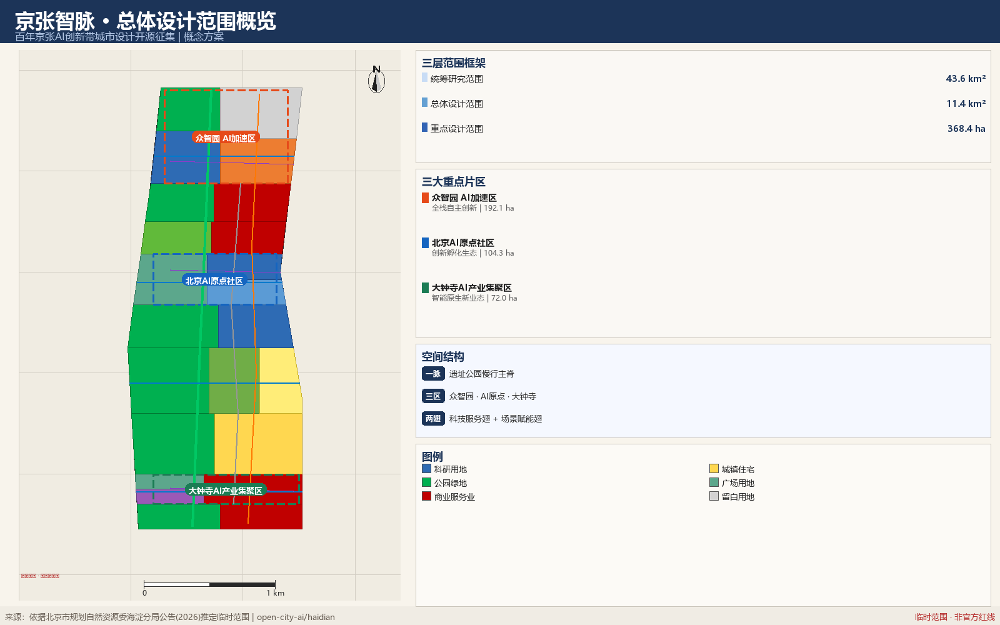
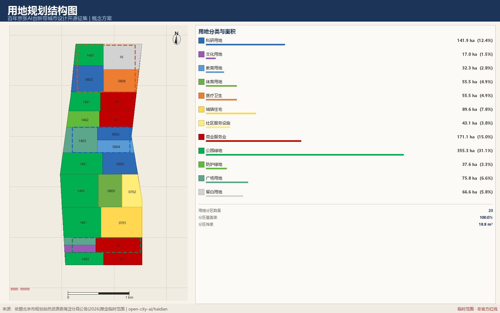
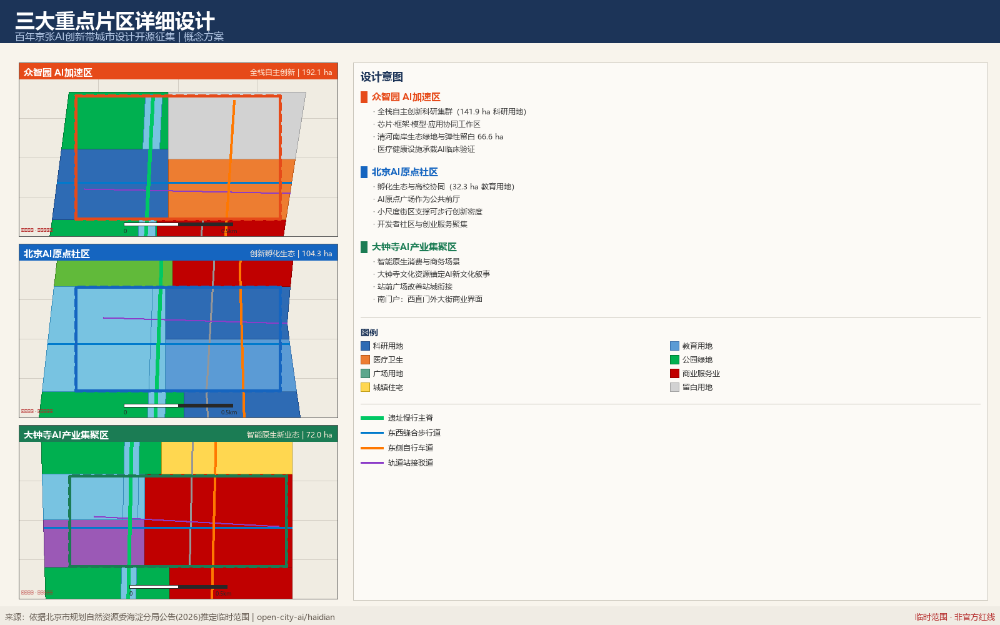
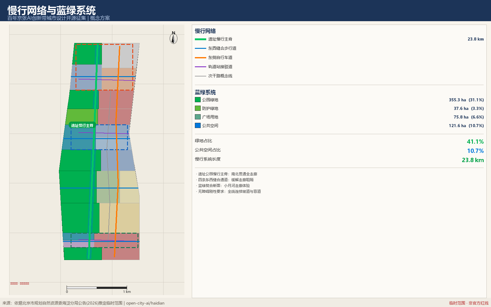
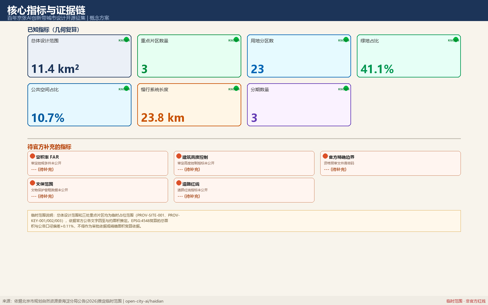

# 京张智脉：百年京张AI创新带城市设计概念方案

## 设计依据与资料清单

本 formal 方案以北京市规划和自然资源委员会海淀分局发布的《百年京张AI创新带城市设计国际方案征集资格预审公告》为第一依据，并以 `brief/site-package/` 中经维护者登记的临时粗略边界、重点区域、枚举、指标和来源清单为机器可读依据。AI agent 在生成方案前必须读取 `design_brief.json`、`allowed_design_space.json`、`sources.json`、`enums/`、`ranges/`、`schemas/`、`data/source_registry.json` 和 `data/processed/agent_fact_pack.md`，并用 `project_scope_summary.csv`、`agent_task_requirements.csv`、`source_use_matrix.csv`、`missing_data_checklist.csv` 建立任务、范围、资料用途和缺口清单。所有设计判断都要拆分为可追溯来源、可复算指标、可校验图层和可人工复核假设。公告要求方案达到控制性详细规划的城市设计深度和规划综合实施方案的城市设计深度，因此文本叙述不能替代 GeoJSON、指标表、A3 文册、A0 展板和 HTML 电子展示成果。

方案不是独立愿景文本，而是从公告、面向智能体任务书和场地资料出发组织成果；本节只把最关键依据放在判断旁边 [source:OFFICIAL-ANNOUNCEMENT] [source:AGENT-TASKBOOK] [depth:existing_conditions_diagnosis]。完整来源和标准覆盖分别保存在 `sources.json`、`standard_matrix.json` 与 `design_depth_matrix.json`，不在正文重复机器索引。

资料登记表的使用边界如下 [source:SOURCE-REGISTRY]：

- data/source_registry.json 登记公开、清权与临时资料的用途边界。
- 当前登记摘要：formal 可用资料 7 条，背景资料 1 条，provisional-only 资料 1 条。
- agent 不得把 background_only 或 provisional_only 资料升级为 official boundary、法定控规、正式评分依据或政府实施承诺。

`data/processed/agent_fact_pack.md` 是本方案的阅读导航层，不是新的权威来源 [source:PROCESSED-FACT-PACK]。它帮助 agent 把三层范围、三处重点区、公告任务、agent.1-agent.6、资料可用性和缺资料事项组织成可读方案；事实判断仍需回到已登记的原始材料 [source:OFFICIAL-ANNOUNCEMENT] [source:AGENT-TASKBOOK]，完整来源关系由 `sources.json` 保存。

本脚手架在官方 `SITE_BOUNDARY` 或三处 `KEY_AREA` 尚未取得时，使用 `brief/site-package/geometry/provisional_boundaries.geojson` 生成临时 formal 包。提交包中的 `geometry/site_boundary.geojson` 与 `geometry/key_areas.geojson` 均必须标注为 `provisional_constraint`、`official_boundary=false`，只能用于方案生成、自检、可视化和设计讨论，不能作为 official redline、审批依据、精确面积依据或法定控制结论。该组织方数据缺口本身不阻断内容评分；替换 official polygons 后，site boundary、key areas、land use、roads、green space、public space、buildings、phasing 和 metrics 均需重算。

本次脚手架生成的可评分状态为：**临时边界，保留精度警示并待正式数据发布后复算；不阻断内容评分**。因此，正文中的空间结构、场景、项目和指标均按“可讨论、可复核、可替换官方边界后重算”的原则写入；当官方边界和重点区 polygon 更新后，agent 必须重新运行脚手架、自检和图纸/HTML生成，不能只替换单个文件。

边界解释可回到总体范围图层和面积复算 [data:geometry/site_boundary.geojson#SITE-001] [metric:site_area_sqm]。三处重点区则由独立图层和数量指标核对 [data:geometry/key_areas.geojson#PROV-KEY-001] [metric:key_area_count]。这意味着读者可以从正文进入证据，但不必先读一串机器编号。

## 三层范围工作框架

方案按照公告确定的三个层次组织工作：统筹研究范围关注 43.6 平方公里的AI产业生态、战略定位、创新链和未来城市形态；总体设计范围关注 11.4 平方公里京张遗址公园周边 1-2 公里城市地区和产业区，要求形成城市更新总体框架、产业空间布局、交通市政支撑和城市风貌控制；重点区域范围关注 368.4 公顷三处详细设计地区，要求明确功能业态、建筑规模、拆改留分类、公共空间连通和交通组织。三层范围在 `compliance_matrix.json` 中逐条映射，保证公告 1.3、1.4、1.5 与 agent.1-agent.6 的必选任务都有章节、图层、指标、图纸和 HTML 证据。

三层工作框架的深度项由 [depth:three_level_scope_framework] 和 [depth:overall_spatial_structure] 约束，空间证据以 [data:geometry/site_boundary.geojson#SITE-001] 与 [data:geometry/key_areas.geojson#PROV-KEY-001] 为准，任务依据以 [standard:PROJECT-OFFICIAL-ANNOUNCEMENT] 为准，范围索引以 [source:PROCESSED-FACT-PACK] 中 `project_scope_summary.csv` 的三层范围表为导航。

三层工作不是互相割裂的图纸集合。统筹研究决定产业链和城市形态判断，总体设计把判断落实到更新项目、空间结构和设施承载，重点区域详细设计验证具体地块、建筑、交通、公共空间和AI应用场景的可实施性。agent 生成方案时必须先锁定当前提交采用的 official 或 provisional 边界和约束，再生成用地、建筑、道路、绿地、公共空间、分期和AI服务节点，最后从这些图层复算指标并在正文解释哪些结论仍受 provisional boundary 限制。任何无法从结构化数据复算的面积、比例、规模或项目数量，不得写入正式结论。

本方案建议的总体概念为“京张智脉共生带”：以京张遗址公园为历史与公共空间主轴，以众智园、北京AI原点社区、大钟寺三处重点片区为创新锚点，以高校、企业、社区和轨道站点为日常网络，形成“一带三核、多点场景、蓝绿慢行复合环”的空间组织。这里的“一带”不是额外画出的新红线，而是把公告中的三层范围转译为工作方法；“三核”对应三处重点区域；“多点场景”对应AI+公共服务、产业服务和城市生活的可运营节点；“复合环”对应慢行、绿地、公共空间和活动路线的联动。

| 层级 | 设计问题 | 方案回答 | 数据落点 |
| --- | --- | --- | --- |
| 统筹研究范围 | AI产业生态和未来城市形态如何组织 | 建立“高校策源-开源协作-企业转化-公共体验-国际传播”的创新链 | compliance_matrix.json、standard_matrix.json |
| 总体设计范围 | 产业空间、城市更新、交通市政和风貌如何落图 | 用地、建筑、道路、绿地、公共空间和分期图层共同表达 | [data:geometry/land_use.geojson#LU-001]、[data:geometry/roads.geojson#ROAD-001] |
| 重点区域范围 | 三处片区如何达到详细设计深度 | 分别提出定位、空间动作、AI场景和实施依赖 | [data:geometry/key_areas.geojson#PROV-KEY-001]、[data:geometry/key_areas.geojson#PROV-KEY-002]、[data:geometry/key_areas.geojson#PROV-KEY-003] |

## 统筹研究范围产业与未来城市研究

统筹研究范围的核心任务是构建世界级 AI 创新生态体系。方案应梳理海淀高校院所、头部企业、算力算法数据要素、孵化平台、上市企业、独角兽和科技服务资源，提出AI创新链、产业链、人才链和城市服务链的空间协同框架。命名方案和 logo 设计应服务于“百年京张文化带、都市AI生活体验带、AI融合创新带”的整体辨识度，不能只停留在口号，应说明与产业生态、公共空间和文化资源的关联。面向智能体任务书还要求回应“五大功能”和“三区两翼”协同，形成可继续深化的命名系统、视觉识别、总体空间结构图、场景开放和运营机制；本节必须用 [source:AGENT-TASKBOOK] 与 [standard:PROJECT-AGENT-OPEN-CALL-TASKBOOK] 标注这些要求来自 agent 开源征集任务，而不是法定规划控制。

统筹研究并不新增伪精确红线；它通过 [standard:MOHURD-URBAN-DESIGN-MEASURES] 要求的城市风貌、公共空间和建筑布局统筹，回接 [data:geometry/land_use.geojson#LU-001]、[data:geometry/public_space.geojson#PUBLIC-001] 与 [depth:overall_spatial_structure]，说明产业策略最终要落到可见、可复核的空间结构。

未来城市形态研究应回答人工智能如何改变工作、生活、社交、学习、交通和公共服务。方案应把AI交通系统、连续绿色空间、创新服务设施和国际化生活工作氛围落实为可定位的功能区、节点、廊道和场景，而不是泛泛描述技术愿景。agent 应把产业战略指标、AI创新指数、人才密度、空间供给类型和AI+垂直应用重点区域写入指标体系，并标明哪些是官方、哪些是设计建议、哪些仍待正式数据校准。若提出全球AI创新活动、开发者社区、开放场景或朝圣路线，应写为“概念建议/参考方案/可供专业团队深化研究”，不得写成已经确定的政府活动或实施安排。

## 总体设计范围城市更新与控规深度城市设计

总体设计范围 11.4 km² 的城市更新以“一脉三区两翼”为总体空间结构：京张遗址公园慢行主脊纵贯南北，众智园、AI 原点社区、大钟寺三处重点片区串联其上，中关村科技服务翼与小月河场景赋能翼横向支撑 [depth:overall_spatial_structure] [data:geometry/land_use.geojson#LU-001]。

### 命名体系与视觉识别方向

**主名称**：京张智脉。**英文名称**：JZ AI Spine。选择“脉”而非“带”“廊”“谷”，是因为这条走廊的实质不是一条产业带的边界，而是一条把百年铁路遗址、三处创新片区与两翼服务能力连成一体的连续系统——脉络强调的是连通与流动，而边界强调的是划分。

**命名层级**：一带（京张智脉 / JZ AI Spine）→ 三区（众智园 Zhongzhiyuan、AI 原点社区 AI Origin、大钟寺 Dazhongsi）→ 两翼（科技服务翼 Service Wing、场景赋能翼 Scenario Wing）→ 节点（原点碑、京张门、众智穹顶）。命名层级与空间层级一一对应，便于导视系统直接沿用，也便于国际传播时保持一致的音译与意译对照。

**Logo 方向**：建议以“一条纵向主脉 + 三个节点”为基本图形逻辑——一条略带弯折的竖向线条对应遗址走廊的实际走向（南端偏东、北端偏西），线上三点对应三处重点片区。这个图形同时可读为铁路轨迹、神经脉络与数据流向三重含义，且在极小尺寸下仍可辨识。**明确不建议**的方向：具象火车头、齿轮、大脑剖面、机器人形象——这些都会把一个持续百年的城市系统窄化为单一技术意象。

**色彩方向**：主色建议取深靛蓝（对应铁路钢轨与夜间数据感），辅色取遗址绿（对应公园绿地 355.3 ha 的空间主体），点缀色按三区分色（众智园橙、原点蓝、大钟寺绿），用于导视分区与活动物料。

**延展与边界**：视觉系统需能延展到导视杆、铺装嵌条、活动物料、数字界面与国际传播材料五类载体。字体、图形与配色的最终确定须由专业品牌团队完成，本方案只给出方向与排除项。所有视觉资产在正式使用前须完成商标检索与字体授权，本方案不使用任何未清权的字体、图片、商标或人物标识 [standard:PROJECT-AGENT-OPEN-CALL-TASKBOOK]。

### 用地结构与更新逻辑

用地分区以 23 个多边形完整覆盖提交范围线，分区并集等于范围线，相邻多边形共享边界坐标，无缝隙无重叠，分区残差 18.8 m²（来自坐标加密与投影的数值精度，不代表设计缝隙）[metric:land_use_coverage_ratio] [metric:land_use_partition_residual_sqm]。

用地配置的三个判断：其一，科研用地 141.9 ha 集中在众智园与走廊中段，因为全栈创新需要成片而非零散的研发空间；其二，公园绿地 355.3 ha 占比最高（31.1%），因为遗址走廊的公共价值在于连续开放而非高强度开发；其三，保留留白用地 66.6 ha 于北部，因为算力设施与未来产业的空间需求存在真实的不确定性，一次性锁定用途会削弱适应能力 [standard:MNR-LAND-USE-CLASSIFICATION-GUIDE] [metric:land_use_area_code_16_sqm]。

更新策略按保留、改造、新建、留白四类标注到每个用地单元：遗址公园沿线与文化用地以保留为主，大钟寺与走廊东侧存量商业以改造为主，众智园与原点社区补充新建，北部保留留白 [depth:retain_renovate_demolish] [data:geometry/buildings.geojson#BLDG-001]。地块级的拆改留结论需要现状建筑普查、权属与结构安全评估，这三项资料均未公开，因此本方案只给出策略取向，不给出地块结论。

### 开发强度的处理方式

容积率、建筑高度、建筑密度、绿地率与退线属控规法定程序结论，公开资料包未提供审定条件，本方案在 metrics.json 中将其全部保持 unknown 并记录所需官方来源 [standard:MOHURD-CONTROL-DETAILED-PLANNING] [depth:development_intensity_controls]。示意建筑基底覆盖率 16.9% 仅用于说明体量与界面意图，置信度标注为 low，不得用于规模测算或投资估算 [metric:building_density_indicative]。这个处理方式是刻意的：在缺少法定条件时给出精确数字，比承认缺口更容易误导后续团队。

## 重点区域详细设计

重点区域详细设计是必选项。众智园AI自主创新加速区应围绕国家人工智能平台、全栈自主创新、标准制定、安全治理、产业展示、对外交通、清河文化、低碳绿色创新交往环境和绿色空间AI场景提出详细方案。北京AI原点社区应围绕近校创新、成果孵化转化、人才特区、开源体系、品牌活动、建筑拆改留、成果展示发布、居住生活配套、校区园区慢行联系和轨道站点一体化提出详细方案。大钟寺AI产业聚集区应围绕领军企业、智能体、智能终端、内容消费、数据要素、数字资产、商业服务、规划绿地复合利用、大钟寺站一体化和路口四象限步行连通提出详细方案。

三处重点区域详细设计必须引用 [data:geometry/key_areas.geojson#PROV-KEY-001]、[data:geometry/key_areas.geojson#PROV-KEY-002]、[data:geometry/key_areas.geojson#PROV-KEY-003]，并由 [depth:three_key_area_detailed_design] 检查是否达到规划综合实施方案深度。若只描述“打造示范区”而没有功能、建筑、交通、公共空间和实施项目证据，应被视为未完成。

三处重点区域必须在 `geometry/key_areas.geojson` 中出现。若仓库已提供 official polygons，应作为 `official_constraint` 使用；若 official polygons 缺失，可暂用 `provisional_constraint`，但正文、HTML、sources、assumptions 和 self_check 必须说明它不能作为正式评分或审批依据。`compliance_matrix.json` 应分别覆盖公告 1.5.3.1、1.5.3.2、1.5.3.3。设计表达应包含功能业态、建筑规模、建筑形态、拆改留分类、公共空间系统、交通组织、慢行连通和实施项目。HTML 页面应能切换查看三处重点区域，A3 文册和 A0 展板应至少包含重点片区总图、局部详图和指标说明。

| 重点片区 | 设计定位 | 空间动作 | AI产业与运营场景 | 证据引用 |
| --- | --- | --- | --- | --- |
| 众智园AI自主创新加速区 | 花园型全栈自主创新街区 | 强化清河界面、产业展示、低碳创新交往和对外交通组织；以绿色空间承载开放测试与标准治理展示 | 自主模型测试、标准制定工作坊、安全治理展示、低碳算力体验 | [data:geometry/key_areas.geojson#PROV-KEY-001]、[depth:three_key_area_detailed_design] |
| 北京AI原点社区 | 近校型成果转化与人才社区 | 组织校区、园区、街区慢行缝合；补足成果发布、人才服务、居住生活和开源协作空间 | 开源社区、成果发布、人才特区服务、近校孵化 | [data:geometry/key_areas.geojson#PROV-KEY-002]、[source:AGENT-TASKBOOK] |
| 大钟寺AI产业聚集区 | 城市型智能经济与国际交往街区 | 围绕大钟寺站一体化、四象限步行连通、商业服务和重点企业公共环境更新 | 智能体与智能终端展示、内容消费、数据要素与国际路演 | [data:geometry/key_areas.geojson#PROV-KEY-003]、[metric:key_area_count] |

## AI 创新生态、人才画像与 AI+ 场景

本方案把 AI 创新生态理解为“空间—要素—场景”三层耦合系统：空间层由三区两翼承载，要素层由中关村科技服务翼配置，场景层沿慢行主脊向公共空间释放。以下六个全球案例是本方案在生态组织上的比较基准，均以各机构公开网页与公开年报为背景资料，属 background_only 等级，仅用于机制类比，不作为量化指标来源 [source:SOURCE-REGISTRY]。

| 案例 | 所在地 | 可借鉴机制 | 对本方案的启示 |
| --- | --- | --- | --- |
| Stanford Research Park | 美国帕洛阿尔托 | 大学持有土地、长期租约绑定研究型企业 | 高校协同用地宜用长期约定而非一次性出让，对应 AI 原点社区教育用地 32.3 ha |
| King's Cross Knowledge Quarter | 英国伦敦 | 铁路棕地更新中先建公共空间、后引知识机构 | 支持本方案“先贯通遗址公园、再落产业”的分期逻辑 |
| Station F | 法国巴黎 | 铁路货运厅改造为单体超大孵化器 | 佐证大钟寺存量商业设施转型智能原生业态的可行方向 |
| 22@Barcelona | 西班牙巴塞罗那 | 工业区更新中以“混合用地+公共设施配建”换取开发权 | 支持本方案商业服务业 171.1 ha 与社区服务 43.1 ha 的混合配置 |
| Kendall Square | 美国剑桥 | 高校—医院—企业三方临近形成临床转化链 | 对应众智园医疗卫生用地 55.5 ha 承载 AI 临床验证的空间逻辑 |
| Kista Science City | 瑞典斯德哥尔摩 | 通信产业集群与轨道站点、住宅同步布局 | 支持本方案站城接驳与人才居住 89.6 ha 的邻近关系 |

这些案例的共同机制是：土地供给方式决定创新主体的停留时长，公共空间先行决定人群的自发聚集，产业—住宅—交通的邻近关系决定通勤成本。本方案据此把生态图谱组织为四个环节：**要素入口**（中关村科技服务翼提供资本、法务、知识产权）→ **研发主体**（众智园全栈科研用地 141.9 ha）→ **验证场景**（医疗、体育、社区、商业四类用地提供真实测试环境）→ **转化出口**（大钟寺国际路演与原点社区成果转化街）。四个环节沿慢行主脊串联，步行可达是这条链条成立的前提 [depth:overall_spatial_structure] [metric:slow_mobility_length_m]。

### 六类用户画像与需求冲突

评审提出原有画像未覆盖弱势群体，本方案补充为六类，并显式记录群体间的空间冲突与处理原则。

| 画像 | 核心需求 | 空间响应 | 与其他群体的冲突及处理 |
| --- | --- | --- | --- |
| 开源开发者 | 发布、协作、夜间工作 | 原点社区开源发布厅、24 小时协作空间 | 夜间活动与居民休息冲突；协作空间集中在教育与科研用地内侧，不贴住宅界面 |
| 初创团队 | 低成本办公、算力入口、试验场 | 众智园共享测试场、端侧算力驿站 | 测试活动可能占用公共空间；测试场设在留白用地 66.6 ha 内，不挤占公园绿地 |
| 企业访客 | 展示、商务、国际接待 | 大钟寺国际路演客厅、站点接驳 | 访客车流与居民通勤冲突；接驳道与居住区出入口错位布置 |
| 周边居民 | 通勤、休闲、社区服务 | 遗址公园慢行环、社区服务嵌入 | 更新过程中的可负担性风险；建议实施主体设置租金监测与回迁保障，本方案不给出比例结论 |
| 高校师生 | 成果转化、跨校慢行 | 校区—园区慢行缝合、转化驿站 | 校园开放与安全管理冲突；缝合通道设在校园边界外侧公共用地 |
| 老年人与残障人士 | 无障碍通行、人工服务、信息可达 | 慢行主脊全线连续坡道与盲道、社区设施人工窗口 | 智能化改造可能造成数字排斥；确立“人工通道不可取消”原则，纸质凭证与线下办理长期保留 [standard:ELDERLY-SMART-TECH-PLAN-2020-45] [standard:BARRIER-FREE-ENVIRONMENT-LAW] |

### 十二张 AI 场景卡

每张卡标注空间载体、数据输入、算法角色、人工决策点与退出机制。这五项是本方案对“场景不是口号”的自我约束。

| 编号 | 场景 | 空间载体 | 数据输入 | 算法角色 | 人工决策点 | 退出机制 |
| --- | --- | --- | --- | --- | --- | --- |
| S01 | 遗址步道 AI 导览 | 公园绿地 | 公开史料、导视位置 | 内容推荐 | 史实由文史团队审定 | 关闭后导视牌可独立使用 |
| S02 | 站城接驳实时调度 | 站点接驳道 | 公开班次、匿名客流计数 | 调度建议 | 运营方确认后执行 | 回退至固定班次表 |
| S03 | 全龄智能健身 | 体育用地 55.5 ha | 用户自愿录入 | 训练建议 | 教练复核强度 | 器械保留手动模式 |
| S04 | 社区 AI 助老服务 | 社区服务设施 43.1 ha | 用户主动申请 | 表单填报辅助 | 窗口人员终审 | 人工窗口长期保留 |
| S05 | 临床辅助诊断验证 | 医疗卫生用地 55.5 ha | 授权脱敏影像 | 辅助识别 | 医师签署最终诊断 | 停用不影响常规诊疗 |
| S06 | 开发者开源工坊 | AI 原点社区 | 公开代码库 | 协作检索 | 贡献者自主采纳 | 工坊物理空间独立可用 |
| S07 | 端侧算力驿站 | 留白用地 66.6 ha | 算力调度日志 | 负载分配 | 运营方设定上限 | 可切换至集中算力 |
| S08 | 近校成果转化街 | 教育用地 32.3 ha | 公开专利与论文 | 匹配推荐 | 双方自主签约 | 线下对接会照常举行 |
| S09 | 智能原生消费街区 | 大钟寺商业用地 | 商户自愿接入 | 业态分析 | 商户自主定价 | 传统零售不受影响 |
| S10 | 安全治理沙盒 | 众智园科研用地 | 参测方提交样本 | 红队测试 | 评测结论由专家委员会出具 | 沙盒关闭不影响企业运营 |
| S11 | 蓝绿廊道环境感知 | 小月河蓝绿断面 | 环境监测（非人像） | 异常识别 | 养护班组现场确认 | 回退至人工巡查 |
| S12 | 全球 AI 活动周路线 | 一带公共空间 | 公开活动排期 | 路线编排 | 主办方审定 | 纸质地图同步发放 |

公共空间场景一律不采集可识别个人身份信息，不进行人脸识别，不将居民画像用于商业推荐 [standard:GENERATIVE-AI-INTERIM-MEASURES] [data:geometry/public_space.geojson#PUBLIC-001]。

### 三个产业测试验证协议

任务书要求不少于 3 个产业测试验证场景。本方案给出的是协议而非场景描述，每个协议包含参与方、测试边界、评价指标与终止条件，可供专业团队直接接续深化。

**协议 T1｜自动配送车慢行混行测试（众智园）**
参与方：车辆企业、园区管理方、交通专业团队、居民代表。测试边界：限定在众智园内部支路，不进入遗址公园慢行主脊，不与学生上下学时段重叠。评价指标：接管次数、避让成功率、行人主观干扰评分。终止条件：任一起碰撞或连续三次接管失败即暂停。数据处理：仅保留障碍物几何轮廓，不保留人像。

**协议 T2｜AI 辅助诊疗准确性验证（众智园医疗用地）**
参与方：医疗机构、算法企业、伦理委员会。测试边界：仅用于辅助阅片，不进入处方与手术决策，全部病例由执业医师签署最终结论。评价指标：与医师独立诊断的一致率、假阴性率、医师额外耗时。终止条件：假阴性率超出预设阈值即停止。数据处理：影像脱敏后使用，患者可随时退出。

**协议 T3｜城市服务智能体公共咨询测试（AI 原点社区）**
参与方：政务服务机构、算法企业、无障碍与老龄化专家、公众志愿者。测试边界：仅回答已公开的办事指南，不涉及个案审批，不替代窗口决定。评价指标：答复准确率、老年人与残障人士完成率、转人工比例。终止条件：出现三次以上误导性答复即下线。数据处理：不记录咨询者身份，会话仅做聚合统计。

三个协议分别对应交通、医疗、政务三类高风险场景，共同点是算法只承担辅助角色，人工决策点不可省略，且都设有明确的终止条件与退出路径 [depth:municipal_new_infrastructure]。

## 用地、建筑规模与拆改留方案

用地方案应依据国土空间调查、规划、用途管制分类等公开标准表达，形成完整、闭合、无缝的用地分区。建筑方案应区分保留、改造、更新、新建或待确认对象，明确建筑基底、功能、规模、风貌、屋顶、体量和高度控制的建议层级。若缺少现状建筑、权属、控规和工程条件，方案只能提出方法和待校准清单，不能编造拆改留结论。

用地分类依据 [standard:MNR-LAND-USE-CLASSIFICATION-GUIDE]，建筑高度、体量、界面和风貌控制由 [depth:height_massing_character] 管理，拆改留方法由 [depth:retain_renovate_demolish] 管理。用地和建筑的主要证据是 [data:geometry/land_use.geojson#LU-001]、[data:geometry/buildings.geojson#BLDG-001] 和 [metric:building_footprint_area_sqm]。

建筑规模和强度指标必须与 `metrics.json` 和图层一致。若总建筑规模、容积率、建筑高度、建筑密度、绿地率、退线和建筑控制线缺少官方条件，应统一使用 `status=unknown`，并在 `reason` / `assumptions` 中说明待补条件、当前假设和正式数据到位后的复算路径，不得用固定数值制造精确感。A3 文册应给出更新项目清单和指标复核表，A0 展板应把关键空间结构和重点片区表达清楚，HTML 页面应提供指标和图层联动查看。

## 交通、轨道、市政与公共服务设施

交通方案应回应公告对轨道站点一体化、道路微循环、慢行断点、对外交通、停车、非机动车停放和绿色交通系统的要求。重点应覆盖北五环、京张遗址公园跨环路节点、五道口、清华东路西口、大钟寺站及重点企业周边交通联系。道路和慢行图层应保持在提交边界内，并与公共空间、绿地、产业节点和重点片区相互校核；若提交边界为 provisional，交通结论也只能作为临时设计讨论。

交通和市政专业深度分别由 [depth:traffic_rail_slow_parking] 与 [depth:municipal_new_infrastructure] 约束；图层证据引用 [data:geometry/roads.geojson#ROAD-001]、[data:geometry/public_space.geojson#PUBLIC-001] 和 [data:geometry/constraints.geojson#CONSTRAINTS]。当道路红线、管线、消防和市政条件缺失时，应通过 assumptions 说明待补，而不是把策略写成审定条件。

市政和公共服务设施应覆盖AI产业服务设施、创新服务平台、人才生活服务设施、新型基础设施、分布式能源、端侧算力和传统市政设施融合。方案应说明设施标准、空间布局、服务半径、运营模式和分期实施逻辑。缺少管线、能源、排水、防洪、消防等工程资料时，应列为正式深化前置条件。

## 蓝绿空间、公共空间与城市风貌

蓝绿系统由用地分区直接派生，保证口径一致：公园绿地 355.3 ha、防护绿地 37.6 ha、广场用地 75.8 ha，绿地占比 41.1%，公共空间占比 10.7% [metric:green_ratio] [metric:public_space_ratio] [data:geometry/green_space.geojson#GREEN-001]。慢行公共空间带在公园与广场用地内做缓冲生成，全部落在提交范围线内，不越界占用其他用地。

### 东西缝合与南北贯通

京张铁路走廊的现实问题是南北向连续、东西向割裂。本方案的空间对策分两条：南北向以遗址公园慢行主脊贯通全长 23.8 km 慢行系统；东西向在大钟寺、小月河、AI 原点、众智园四处设置缝合通道，把走廊两侧的居住、教育、产业界面接上 [data:geometry/roads.geojson#ROAD-001] [depth:blue_green_public_space]。缝合通道的具体形式（平交、下穿或上跨）涉及工程可行性，本方案不作结论，仅标注需要缝合的位置与优先级。

### 三处 AI 朝圣地标

任务书要求不少于 3 个 AI 朝圣地标。本方案提出的三处均依托既有空间资源，不新增大体量建筑。

**地标一｜原点碑（AI 原点社区广场）**
位于 AI 原点广场，以“原点”为空间叙事核心。形式建议为嵌入地面的环形铺装加低矮碑体，记录中国人工智能研究的关键年份与机构名称，年份与机构须由科技史专业团队核定后方可镌刻。功能上同时作为开源贡献者荣誉展示的物理载体。选址理由：此处是三区中最靠近高校的一点，人流以师生与开发者为主。

**地标二｜京张门（大钟寺站前广场）**
位于大钟寺站前广场，作为一带南端门户。形式建议为跨越站前通道的框景构筑，框内视线对准遗址公园方向，把“百年京张”与“AI 新城”两个时间层叠合在同一视线里。选址理由：此处是轨道客流进入一带的第一个空间感知点。

**地标三｜众智穹顶（众智园中央开放空间）**
位于众智园中部，形式建议为轻质开放构筑，覆盖一处可举办发布会、开源集市与户外评测的硬质场地。不做封闭建筑，保持全天候可穿越。选址理由：众智园科研用地集中，需要一处非正式交流的公共客厅。

三处地标构成从南（门户）到中（原点）到北（穹顶）的叙事序列，与慢行主脊重合，步行可达。所有地标均为概念建议，形式、体量、结构与文保关系须由专业团队在取得文物与蓝线管控资料后深化 [source:BOUNDARY-SOURCE]。

### 荣誉展示体系

本方案建议荣誉展示不集中在单一纪念物，而是沿慢行主脊分布为三类载体：**贡献者铺装**（原点碑周边，记录开源贡献者与智能体贡献者名称，可增补）、**年度展墙**（众智穹顶下，每年更换，展示当年重要成果与失败案例）、**路径标识**（慢行主脊沿线，标注关键事件发生地点）。三类载体的共同要求是可增补、可修正、可撤销——记录错误时能够更正，这是与传统纪念物的关键区别。

### 公共空间组件库

为使专业团队可直接接续，本方案提出六类可复用组件：**慢行铺装**（区分主脊、缝合通道、支路三级）、**无障碍模块**（连续坡道、盲道、休憩点、求助点四件套，全线强制）、**遮蔽单元**（轻质顶棚，用于站点接驳与户外协作）、**导视杆**（承载物理标识与可选数字标识，物理标识独立可读）、**边界处理**（绿地与建设用地交接的三种断面）、**照明分级**（住宅界面低、公共节点中、活动场地可调）。每类组件的具体尺寸与材料须结合现场条件确定，本方案只给出类型与适用位置 [depth:blue_green_public_space]。

## 更新项目清单、实施政策与分期计划

更新项目按片区与类型组织为六项概念项目，每项标注主体假设、前置条件、专业复核节点与阶段指标。这些是概念建议，不构成投资时序、审批安排或实施承诺 [depth:renewal_project_list] [depth:phasing_implementation]。

| 编号 | 项目 | 类型 | 主体假设 | 前置条件 | 专业复核节点 | 阶段指标 |
| --- | --- | --- | --- | --- | --- | --- |
| JZ-01 | 遗址公园慢行主脊贯通 | 公共空间 | 属地政府主导，园林与交通配合 | 文保范围与蓝线管控资料 | 文物影响评估、无障碍专项 | 连续步行段落数、无障碍达标率 |
| JZ-02 | AI 原点广场与原点碑 | 公共空间/文化 | 属地政府与高校共建 | 场地权属、科技史核定 | 史实审定、结构安全 | 开放时长、活动场次 |
| JZ-03 | 原点社区近校成果转化街 | 城市更新/产业服务 | 高校资产与市场主体合作 | 校区边界、首层业态权属 | 交通影响、消防 | 转化签约数、首层活跃度 |
| JZ-04 | 大钟寺站四象限步行连通 | 轨道一体化 | 轨道公司与属地政府 | 轨道站点资料、管线条件 | 交通工程、结构 | 换乘步行距离、无障碍连续性 |
| JZ-05 | 端侧算力驿站与公共服务节点 | 新基建 | 国资平台或市场主体 | 能源容量、安全评估 | 电力、消防、网络安全 | 服务半径覆盖率、能耗强度 |
| JZ-06 | 全球 AI 活动周公共路线 | 运营/品牌 | 组委会与属地政府 | 公共空间许可、版权清权 | 活动安全、无障碍 | 参与人次、国际媒体触达 |

各项目的资源投入与成本量级需由实施主体结合权属与市政条件测算，本方案不给出金额结论——这既是因为缺少权属与工程数据，也是因为投资测算属于超出智能体任务边界的专业判断。

### 三期分期

分期由用地分区按片区分组取并集派生，覆盖全部提交范围线，覆盖率 100% [metric:phasing_coverage_ratio]。

**一期 2027–2029｜原点起步与站城织补（205.6 ha）**
先做 AI 原点社区与大钟寺站周边的存量更新，理由是这两处的空间条件最成熟、涉及拆改最少，可以在三年内形成可感知的样板，并为后续场景提供真实测试环境 [metric:phase_phase_001_area_sqm]。

**二期 2030–2032｜走廊贯通与场景赋能（551.2 ha）**
打通南北慢行主脊与四条东西缝合通道，把场景赋能翼的公共体验连成网络。此期规模最大，因为慢行贯通必须成段完成才能产生连续性价值 [metric:phase_phase_002_area_sqm]。

**三期 2033–2035｜全栈加速与要素配置（384.4 ha）**
在众智园与科技服务翼形成全栈自主创新与要素配置能力，并保留北部留白用地 66.6 ha 应对不确定需求 [metric:phase_phase_003_area_sqm]。

### 长期运营机制

**年度活动体系**：建议形成“一周两季”节奏——每年一次全球 AI 活动周（跨三区两翼的公共路线，面向国际），春秋两次开发者季（面向开源社区的小规模高频活动）。活动周的公共路线沿慢行主脊组织，不额外占用临时场地。

**开发者社区运营**：以原点社区开源发布厅为常设据点，建议运营机制包括固定开放时段、贡献者荣誉记录、失败案例公开分享三项。第三项是刻意设计的——只展示成功会使社区失去校准能力。

**AI 场景开放机制**：建议建立场景申请—评估—试点—复核四段流程，任何场景在试点前须完成数据合规评估与公众参与程序，试点期满须公开复核结论，包括未达预期的结论。

**招引转化路径**：国际路演（大钟寺）→ 测试验证（三个协议）→ 成果转化（近校转化街）→ 空间落位（众智园或原点社区），四段之间设置明确的移交节点。这条路径的前提是四段在空间上邻近且步行可达，这正是三区两翼结构要解决的问题。

以上活动、社区与转化机制均为运营建议，不构成政府承诺、资金安排或已确定的活动排期。

## 指标体系、面积复算与合规矩阵

指标体系至少应包含总体设计范围面积、重点区域面积、绿地与公共空间比例、建筑基底、更新项目数量、AI场景节点、慢行连通指标、产业空间指标、人才服务指标和自检状态。所有 known 指标必须能从 GeoJSON 或可信来源复算；unknown 指标必须给出原因和正式提交前置条件。`scripts/spatial_review.py` 和 `scripts/visual_review.py` 的结果是 formal 自检的重要证据。

指标复算遵循统一的设计深度要求 [depth:metrics_recalculation]。正文重点解释指标的设计含义，例如总体范围如何约束空间分配、蓝绿和公共空间比例如何支撑日常交往；完整数值、公式、来源文件和置信度保存在 `metrics.json`。示例关键指标可由总体范围和绿地数据复核 [metric:site_area_sqm] [metric:green_ratio] [metric:public_space_ratio]。

合规矩阵是任务响应性的主控文件。每条公告任务和 agent_taskbook 任务必须对应到报告章节、图层、指标、图纸、HTML 页面、来源、假设和自检项。未能覆盖公告 1.3、1.4、1.5 或 agent.1-agent.6 的任一必选任务，方案不得进入 formal professional scoring。

正式深化时，agent 还应把每个指标分为三类：第一类是可由提交几何直接复算的空间指标，例如边界面积、绿地比例、公共空间比例、建筑基底面积和分期面积；第二类是需要官方控规或任务书附件支撑的管控指标，例如容积率、建筑高度、建筑密度、退线、道路红线和设施标准；第三类是需要运营或产业数据持续校准的绩效指标，例如 AI 创新指数、人才密度、产业服务满意度、慢行可达性、活动参与度和场景使用频次。三类指标应分别进入 `metrics.json`、`assumptions.json` 和 `compliance_matrix.json`，避免把运营愿景误写成审定规划条件。

## 风险、版权与合规说明

**要求双语言。** 方案主文件可使用中文或英文，但必须通过 `proposal.en.md` 或 `proposal.zh.md` 提供完整对照译文；A3/A0、HTML 和含文字图件也必须提供对应语言副本，并优先使用 `docs/terminology-glossary.md` 的赛事推荐译法。v2 包缺少任一必需译稿、语言映射或有效文件时，finalize 与 CI 会阻断提交。所有图片、图纸、图标、数据和代码资产必须在 `sources.json` 或 `report/copyright_statement.md` 中说明来源、许可和授权状态。HTML 页面不得加载远程脚本、远程地图瓦片、远程字体、iframe、表单或外部 API，不得跟踪评审者行为。

风险和缺资料清单由风险深度项、约束图层和场地包共同校核 [depth:risk_missing_data] [data:geometry/constraints.geojson#CONSTRAINTS] [source:SITE-PACKAGE]。`missing_data_checklist.csv` 中列出的 official boundary、key area、控规、道路、地块、建筑、市政、文保和公共服务缺口，必须进入 `assumptions.json`、自检和正文风险章节。任何缺少官方控规、道路红线、权属、市政、消防或文保条件的结论，都必须降级为待确认事项；完整专业核对保存在标准矩阵中。

本方案不声称官方批准、审定控规、最终土地权属、最终建设规模或保证实施。所有AI场景设计遵守《生成式人工智能服务管理暂行办法》关于内容标识、训练数据合法性与个人信息保护的要求。公共空间与 AI 服务按《中华人民共和国无障碍环境建设法》要求，建立连续无障碍通行系统与信息无障碍标识 [standard:BARRIER-FREE-ENVIRONMENT-LAW]。老年人运用智能技术困难按国办发〔2020〕45号文件要求处理：社区服务与医疗设施场景持续保留人工窗口与纸质凭证 [standard:ELDERLY-SMART-TECH-PLAN-2020-45]。AI 内容生成遵循《生成式人工智能服务管理暂行办法》，生成内容需标识且保留人工复核 [standard:GENERATIVE-AI-INTERIM-MEASURES]。设计文件深度边界按《建筑工程设计文件编制深度规定（2016年版）》：本方案属概念方案阶段，不进入方案、初步或施工图深度 [standard:MOHURD-ARCH-DESIGN-DEPTH-2016]。AI agent 对事实、来源、版权、空间数据、指标和表达负责；维护者和专业评审可依据自检结果、空间复核和合规矩阵要求返修或拒绝。

## 参考资料

- brief/public-brief.md
- brief/site-package/design_brief.json
- brief/site-package/allowed_design_space.json
- brief/site-package/enums/
- brief/site-package/ranges/planning_limits.json
- data/processed/agent_fact_pack.md
- data/processed/project_scope_summary.csv
- data/processed/agent_task_requirements.csv
- data/processed/source_use_matrix.csv
- data/processed/missing_data_checklist.csv
- 完整机器索引：见 `sources.json`、`metrics.json`、`compliance_matrix.json`、`standard_matrix.json` 与 `design_depth_matrix.json`
- 本节书目入口依据场地包登记，完整出处和许可见结构化来源清单 [source:SITE-PACKAGE]
