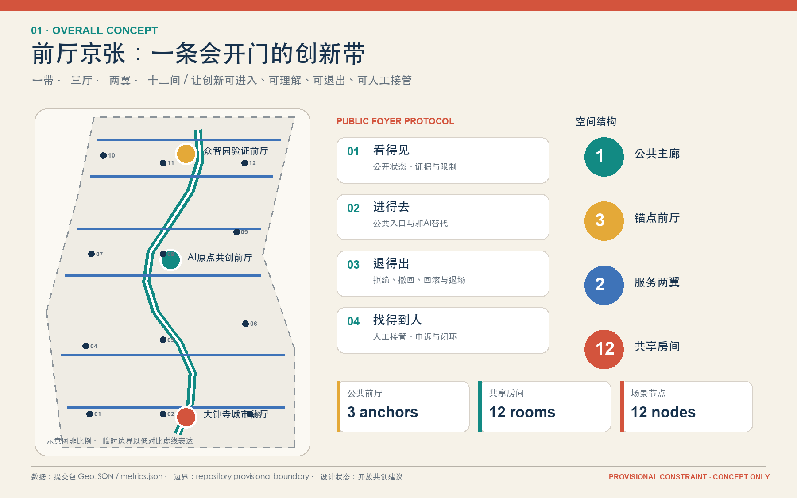
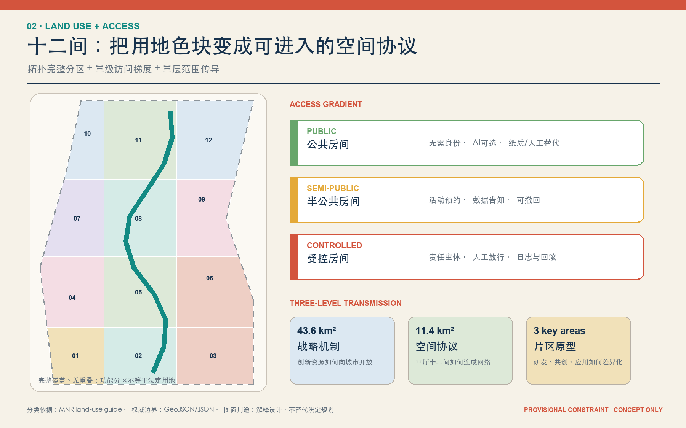
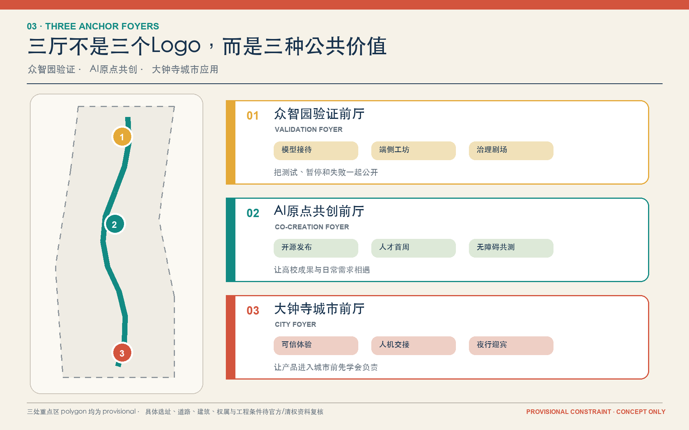
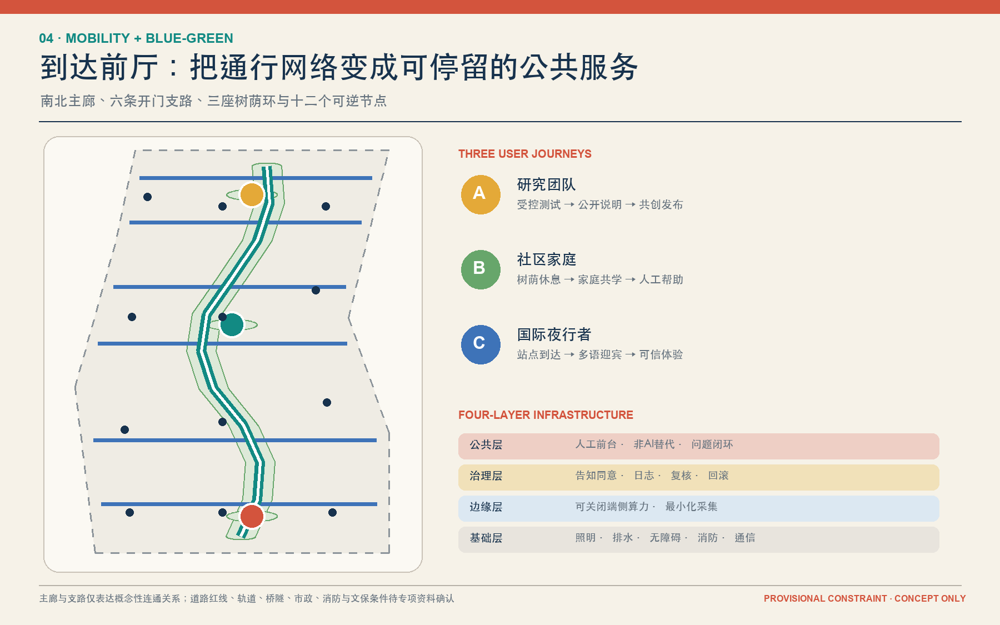
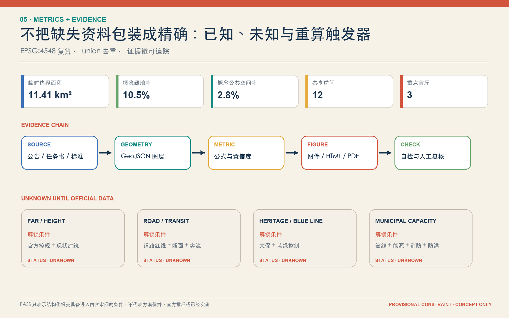

# 前厅京张 / JINGZHANG PUBLIC FOYER

> 一带三厅两翼十二间：把“创新发生在楼里、公众停留在门外”的界面，转化为可进入、可共创、可人工复核的城市公共前厅。

## 设计依据与资料清单

本方案以官方公告确定的三层范围、三处重点区和设计任务为任务依据 [source:OFFICIAL-ANNOUNCEMENT] [standard:PROJECT-OFFICIAL-ANNOUNCEMENT]，以面向智能体任务书中的三大定位、五大功能、三区两翼和六项任务为共创依据 [source:AGENT-TASKBOOK] [standard:PROJECT-AGENT-OPEN-CALL-TASKBOOK]。用地术语、公共空间与控规边界分别遵循本地标准快照 [standard:MNR-LAND-USE-CLASSIFICATION-GUIDE] [standard:MOHURD-URBAN-DESIGN-MEASURES] [standard:MOHURD-CONTROL-DETAILED-PLANNING]。建筑专业深度文件尚缺官方正文，因此只记录为资料缺口，不作为已满足的权威依据 [standard:MOHURD-ARCH-DESIGN-DEPTH-2016]。

资料工作流来自 [source:SITE-PACKAGE]、[source:SOURCE-REGISTRY] 与 [source:PROCESSED-FACT-PACK]。当前总体设计边界 [data:geometry/site_boundary.geojson#SITE-001] 和三处重点区只能使用仓库的临时粗略 polygon [source:BOUNDARY-SOURCE] [source:KEY-AREA-SOURCE]；它们均为 `provisional_constraint`、`official_boundary=false`。因此，本方案可进入内容审阅和 intake 自检，但不得被描述为官方红线、法定控规或工程实施方案。取得官方 CAD/GIS/PDF 后，必须同步替换边界、用地、建筑、道路、绿地、公共空间、分期、图纸、HTML 和全部面积指标 [depth:existing_conditions_diagnosis]。

## 三层范围工作框架

统筹研究范围 43.6 km² 回答“海淀的 AI 创新生态如何对城市开放”；总体设计范围约 11.4 km² 回答“遗址公园周边如何形成公共前厅网络”；三处重点区域约 368.4 ha 回答“三种前厅怎样被专业团队继续深化”。三层之间不是缩放关系，而是“战略机制 - 空间协议 - 片区原型”的传导关系 [depth:three_level_scope_framework] [depth:overall_spatial_structure]。

| 层级 | 核心判断 | 本方案落点 | 机器证据 |
| --- | --- | --- | --- |
| 统筹研究范围 | 把创新资源变成公众可接近的城市能力 | 三大定位、五大功能、三区两翼形成一条开放回路 | `compliance_matrix.json` |
| 总体设计范围 | 把机构边界前的灰空间变成公共前厅 | 一带、三厅、两翼、十二间与南北主廊 | [data:geometry/land_use.geojson#LU-001] [data:geometry/roads.geojson#ROAD-001] |
| 重点区域范围 | 用三种前厅验证研发、共创和城市应用 | 众智园验证前厅、AI原点共创前厅、大钟寺城市前厅 | [data:geometry/key_areas.geojson#PROV-KEY-001] [metric:key_area_count] |

所有空间动作均是“概念建议 / 参考方案 / 可供专业团队深化研究”，不构成政府审定结论。

## 统筹研究范围产业与未来城市研究

### 1. 总体概念与品牌系统

“前厅”不是一座孤立建筑，而是一套进入城市创新体系的空间协议。它有四个门槛：**看得见**（公开正在发生什么）、**进得去**（存在无需关系和无需AI的入口）、**退得出**（场景允许拒绝、撤回和非AI替代）、**找得到人**（争议可以转交人工）。总体结构为“一带三厅两翼十二间”：一条南北公共前厅主廊串联三处锚点前厅；中关村科技服务翼提供成果转化、资本与专业服务接口，小月河场景赋能翼提供公共体验与城市测试接口；十二间共享房间承载具体场景 [source:AGENT-TASKBOOK]。

Logo 方向采用“开放门框 + 纵向轨迹”：两枚不闭合方括号形成门框，一条纵线穿过三枚圆点，分别代表三座前厅。主色为京张铁锈红、海淀实验蓝、公共前厅青；任何字体与图标均使用系统字体或本地生成几何，不引用企业商标。命名层级为：总品牌“前厅京张”，三厅以功能命名，十二间以公共服务动词命名。该识别系统同时回应百年京张文化带、都市 AI 生活体验带、AI 融合创新带三大定位，以及全栈自主创新、创新生态、AI+场景、AI活力城市、AI治理话语权五大功能 [depth:overall_spatial_structure]。

### 2. 六个全球案例：转译空间机制，不复制指标

| 案例 | 可验证的一手机制 | 对前厅京张的转译 |
| --- | --- | --- |
| Kendall Square | 城市把公共空间视为创新发生的界面 [source:CASE-KENDALL] | 用可停留、可交流的公共前厅连接研发机构与社区 |
| Singapore one-north | 多片区、生活实验场与公园连接共同支撑创新生态 [source:CASE-ONE-NORTH] | 三厅差异分工，两翼负责服务与场景，主廊负责公共连通 |
| STATION F | SHARE / CREATE / CHILL 形成公共、半公共、受控梯度 [source:CASE-STATION-F] | 十二间明确 public / semi-public / controlled 访问等级 |
| MaRS | 历史建筑、研究、创业、资本和活动空间共存 [source:CASE-MARS] | 遗产叙事、专业服务和开放活动不再分成互不相见的系统 |
| Barcelona 22@ | 分布式知识、研究与创新设施支撑技术转移 [source:CASE-BARCELONA-22] | 把单一园区服务改成沿线可发现的共享房间网络 |
| King's Cross | 铁路遗产适应性再利用与公共街道、广场、花园同步推进 [source:CASE-KINGS-CROSS] | 以“Human City”式公共界面校准技术展示和遗产更新 |

### 3. AI 创新生态图谱

生态回路不是招商清单，而是“源头研发 - 开源发布 - 受控验证 - 城市体验 - 人工复核 - 证据回流”。众智园承担模型、端侧算力与治理验证；AI 原点社区承担高校成果、开源社区和人才服务；大钟寺承担智能终端、内容消费与国际交流。中关村翼把专业服务送到三厅，小月河翼把公众反馈与场景证据送回研发端。土地、空间、产业、资金、人才、算力、数据和场景八类要素全部设置公开接口，但不编造企业名单、产值或政策承诺 [depth:existing_conditions_diagnosis]。

## 总体设计范围城市更新与控规深度城市设计

### 1. 空间结构：主廊、开门支路与访问梯度

`geometry/land_use.geojson` 把临时总体边界拓扑安全地划分为十二个概念分区，完整覆盖且无重叠 [data:geometry/land_use.geojson#LU-001] [depth:land_use_layout]。这不是法定用地，而是让每个场景有可复核的空间载体。`geometry/roads.geojson` 以一条南北公共主廊和六条东西开门支路表达校区、园区、社区与遗址公园的关系 [data:geometry/roads.geojson#ROAD-001]。支路是概念连通关系，不是道路红线、桥隧或轨道工程。

十二间采用三级访问梯度：公共房间无需身份即可使用且保留非AI替代；半公共房间允许活动预约并要求告知数据用途；受控房间用于模型、算力或安全测试，必须实名责任主体、明确时间窗、人工放行、日志留存与回滚。这个梯度把安全边界变成看得见的空间界面，而不是隐藏在条款里。

### 2. 城市更新与开发强度边界

建筑图层只表达共享房间的概念载体 [data:geometry/buildings.geojson#BLDG-001]。在没有现状建筑、产权、层数、高度与控规条件时，本方案不指定具体建筑拆除或新建。专业深化采用“三门决策”：先查文保与结构安全，再查公共价值和碳影响，最后查权属与运营；只有三门都有可信资料，才进入“保留、改造、拆除或可逆增补”的地块级判断 [depth:retain_renovate_demolish]。

`floor_area_ratio` 和 `building_height_m` 保持 unknown [metric:floor_area_ratio] [metric:building_height_m]。概念建筑覆盖率只用于检查图层自洽，不能转换为审定建筑密度或建设规模 [depth:development_intensity_controls] [depth:height_massing_character]。

## 重点区域详细设计

三处重点区均使用临时 polygon，只表达片区级参考方案 [data:geometry/key_areas.geojson#PROV-KEY-001] [data:geometry/key_areas.geojson#PROV-KEY-002] [data:geometry/key_areas.geojson#PROV-KEY-003] [depth:three_key_area_detailed_design]。

### 众智园：验证前厅 / Validation Foyer

定位为“花园中的公开验证入口”。空间上以树荫环、验证长桌、可关闭的受控测试房和面向公众的治理剧场组成。模型接待间先登记用途、数据和责任人；端侧工坊间测试低延迟与能耗；治理剧场公开展示通过、暂停和失败的案例。清河相关设计只保留雨水花园、树荫与步行界面的概念建议，待蓝线、防洪和生态资料确认后深化。地标“开门信号架”用三色门框显示开放、受控、暂停状态，不崇拜设备。

### 北京 AI 原点社区：共创前厅 / Co-creation Foyer

定位为“近校创新的公共客厅”。开源发布间连接高校成果、开发者和社区反馈；人才首周间把居住、办事、学习、照护和社交信息整合为人工可接管的服务；无障碍共测间邀请轮椅使用者、视听障碍者和照护者共同走查。地标“原点共创厅”以贡献者可追溯的公共档案代替单一英雄叙事。任何校区、园区和社区界面调整均需产权与公众协商。

### 大钟寺：城市前厅 / City Foyer

定位为“AI 原生业态进入日常城市的试用前台”。可信体验间要求产品说明数据来源、适用人群、人工支持和退出方式；人机交接间提供申诉、退款、问题升级和无障碍支持；夜行迎宾间面向夜间通勤者与国际访客提供多语种路线和人工帮助。地标“人机交接钟”只在问题被人工接单、复核和关闭时点亮，强调责任而非宣传。大钟寺站四象限连通保持概念线，待交通、道路和市政资料复核。

## AI 创新生态、人才画像与 AI+ 场景

### 六类用户画像

| 用户 | 真实任务 | 容易被忽略的需求 | 对应空间 |
| --- | --- | --- | --- |
| 高校研究团队 | 发布、验证、转化成果 | 不愿在公开场合泄露未成熟研究 | 模型接待间、开源发布间 |
| 初创团队 | 找导师、场景、客户和合规路径 | 小团队缺少专业服务与试验空间 | 端侧工坊间、可信体验间 |
| 社区家庭与照护者 | 学习、休闲、办事、接送 | AI服务需非AI替代和儿童保护 | 家庭共学间、人机交接间 |
| 开发者与学生 | 共创、比赛、开源贡献 | 需要低门槛场所与可记忆贡献 | 开源发布间、治理剧场间 |
| 老年人及残障访客 | 找路、休息、获得公共服务 | 无障碍链条、慢速交互与人工帮助 | 无障碍共测间、树荫会客间 |
| 国际访客与夜间工作者 | 多语种理解、夜间到达、短时会面 | 清晰导视、可信翻译、夜间安全 | 夜行迎宾间、记忆门厅 |

### 十二张场景卡

| 编号 | 场景与位置 | 空间动作 | 数据与人工边界 | 成功条件 |
| --- | --- | --- | --- | --- |
| SC-01 ★ | 模型接待 / 众智园 | 可关闭测试房 + 公开登记台 | 只用清权测试集；人工批准上线与撤回 | 每次试验可追溯、可暂停 |
| SC-02 ★ | 端侧工坊 / 众智园 | 低功耗边缘设备工位 | 不采集无关个人数据；人工检查能耗与安全 | 延迟、能耗、故障可复测 |
| SC-03 ★ | 治理剧场 / 众智园 | 公开评测与失败案例墙 | 展示限制与申诉入口；最终判断归人 | 失败也进入公共知识库 |
| SC-04 | 开源发布 / AI原点 | 发布台、协作桌、版本墙 | 来源、许可证和模型卡必须可见 | 贡献可署名、可复现 |
| SC-05 | 人才首周 / AI原点 | 人工前台 + 自助信息桌 | AI只做导航；复杂事项转人工 | 新来者一周内找到服务人 |
| SC-06 | 多语共创 / AI原点 | 多语种圆桌与静音席 | 翻译保留原文并可人工校正 | 不因语言失去参与权 |
| SC-07 ★ | 无障碍共测 / AI原点 | 真实路线走查与问题登记 | 当事人同意、匿名汇总、人工复核 | 问题闭环而非只做演示 |
| SC-08 | 可信体验 / 大钟寺 | 试用台 + 风险标签 + 退出门 | 明示数据、适用范围和售后责任 | 用户能拒绝且不受惩罚 |
| SC-09 | 人机交接 / 大钟寺 | 申诉席、人工接管钟 | 自动服务必须有责任主体和时限 | 问题找到人、处理可追踪 |
| SC-10 | 京张记忆 / 沿线 | 史料索引、口述史听取点 | 只用公开/清权史料，标注不确定性 | 文化叙事可核查 |
| SC-11 | 家庭共学 / 社区接口 | 亲子桌、照护座、无屏活动 | 儿童不做人脸识别；家长可退出 | 学习不以采集换服务 |
| SC-12 | 夜行迎宾 / 站点接口 | 可见人工岗、照明与休息点 | 路线建议可解释，紧急情况人工接管 | 夜间到达有连续帮助 |

带 ★ 的四项是产业测试验证场景，均要求测试协议、责任主体、人工放行、失败记录和退场门。十二个节点与空间要素写入 [data:geometry/public_space.geojson#SCENE-01]，数量由 [metric:scenario_node_count] 复核。

## 用地、建筑规模与拆改留方案

十二个用地分区采用自然资源分类代码，但名称中的“房间”只表示功能原型 [standard:MNR-LAND-USE-CLASSIFICATION-GUIDE]。`0802` 支撑研发测试，`0803/0804` 支撑文化与教育，`05` 支撑可信体验与服务，`0702` 支撑社区照护，`1401/1403` 支撑公园与广场。各类面积由同一套拓扑分区复算，不作为法定用地比例。

建筑规模分三类表达：已知的只有概念载体基底；待确认的是现状建筑、总建筑面积、FAR、高度和建筑密度；设计建议是首层可进入、门槛透明、房间可逆。拆改留不落到具体产权建筑：保留优先处理具有文化、结构和公共价值的载体；改造优先处理可通过首层、无障碍和消防提升获得公共价值的载体；拆除必须在结构安全、文保、碳影响、产权和法定程序齐备后由专业团队判断；新建只采用可逆、小尺度、低干扰的概念载体 [depth:retain_renovate_demolish]。

## 交通、轨道、市政与公共服务设施

交通策略以“到达前厅”而不是“穿越园区”为目标：南北主廊承担连续步行骑行，六条开门支路承担东西向校园、园区、社区和站点接口，三厅提供休息、问路、无障碍和人工帮助 [depth:traffic_rail_slow_parking]。轨道站点一体化、大钟寺四象限、五道口和清华东路西口连接均为概念关系，需交通专项、客流、道路红线、断面和市政资料确认。

市政与新基建采用“四层共架”：基础层为照明、排水、无障碍、消防和通信；边缘层为可关闭的端侧算力；治理层为告知、同意、日志、人工复核与回滚；公共层为人工前台、非AI替代和问题闭环。任何端侧算力、分布式能源或感知设施在取得能源负荷、管线、消防、防洪和网络安全资料前只作为体系建议 [depth:municipal_new_infrastructure]。

## 蓝绿空间、公共空间与城市风貌

蓝绿主廊沿公共前厅主廊形成概念性连续树荫和雨水花园，三厅各有树荫环，十二间提供不同密度的坐、走、看、谈和停留方式 [data:geometry/green_space.geojson#GREEN-001] [data:geometry/public_space.geojson#PUBLIC-001] [depth:blue_green_public_space]。临时 geometry 不用于推导真实绿线、蓝线或文保边界；所有跨路、临水和遗产节点必须在专项资料到位后重画。

城市风貌采用“旧轨迹、新门框、低设备感”：保留铁路工业色的细线与编号，公共前厅使用温暖材料和清晰门框，AI设备退到家具和服务背后。三处朝圣/荣誉节点分别为开门信号架、原点共创厅、人机交接钟；它们展示贡献、复核与责任，不塑造单一企业或人物崇拜。公共组件库包含可移动门框、双面信息桌、人工接管灯、无障碍靠背座、遮阴顶棚、可替换版本墙和离线纸质路线。

## 更新项目清单、实施政策与分期计划

| 项目 | 首发动作 | 前置门槛 | 阶段 |
| --- | --- | --- | --- |
| PF-01 三厅十二间试点 | 轻量门框、桌椅、纸质与数字信息、人工岗 | 权属、无障碍、消防、活动许可 | 一期 |
| PF-02 众智园验证前厅 | 测试登记、治理剧场、端侧工坊 | 测试协议、数据清权、能源与安全 | 一期 |
| PF-03 AI原点共创前厅 | 开源发布、人才首周、无障碍共测 | 高校园区协商、公共参与 | 一期 |
| PF-04 大钟寺城市前厅 | 可信体验、人机交接、夜行迎宾 | 站点、商业、道路与市政协同 | 一期 |
| PF-05 南北公共主廊 | 连续导视、树荫、休息和骑行接口 | 文保、绿线蓝线、道路与防洪 | 二期 |
| PF-06 六条开门支路 | 校园园区社区界面缝合 | 权属、交通、安全与无障碍专项 | 二期 |
| PF-07 概念载体滚动更新 | 按三门决策确定保留、改造或可逆增补 | 控规、现状建筑、产权、资金与审批 | 三期 |

分期图层把“先做可逆公共服务、再做连通、最后做片区载体”转为三类空间 [data:geometry/phasing.geojson#PHASE-001] [depth:renewal_project_list] [depth:phasing_implementation]。它是风险降低顺序，不是已批准建设时序。

长期运营采用四季循环：春季“开门清单”收集场景与公共问题；夏季“共测周”进行受控验证；秋季“京张发布季”发布通过、暂停和失败结果；冬季“责任复盘会”决定延续、修改或退场。开发者社区维护版本与许可证，三厅运营团队维护现场与人工前台，独立公共顾问负责隐私、无障碍和申诉抽检。国际传播只发布可复现方法和明确状态，不能把投稿描述为入选、批准或建成。

## 指标体系、面积复算与合规矩阵

所有空间指标使用 EPSG:4548 复算；绿地和公共空间采用 union 面积避免重叠重复计数。以下 known 值仅反映提交的临时边界和概念图层：

| 指标 | 当前值 | 公式 | 置信度 |
| --- | ---: | --- | --- |
| `site_area_sqm` [metric:site_area_sqm] | 11,412,825 m² | `area(submitted provisional site boundary, EPSG:4548)` | medium |
| `land_use_research_area_sqm` [metric:land_use_research_area_sqm] | 1,678,722 m² | `sum area where land_use_code=0802` | medium |
| `land_use_green_open_area_sqm` [metric:land_use_green_open_area_sqm] | 4,401,876 m² | `sum area where land_use_code in {1401,1403}` | medium |
| `land_use_commercial_area_sqm` [metric:land_use_commercial_area_sqm] | 2,030,214 m² | `sum area where land_use_code=05` | medium |
| `land_use_community_area_sqm` [metric:land_use_community_area_sqm] | 1,821,488 m² | `sum area where land_use_code=0702` | medium |
| `building_footprint_area_sqm` [metric:building_footprint_area_sqm] | 292,759 m² | `union area of conceptual building carriers` | low |
| `design_building_coverage_ratio` [metric:design_building_coverage_ratio] | 2.57% | `conceptual building footprint union / provisional site area` | low |
| `green_space_area_sqm` [metric:green_space_area_sqm] | 1,199,119 m² | `union area of proposed green-space polygons` | medium |
| `green_ratio` [metric:green_ratio] | 10.51% | `green-space union / provisional site area` | medium |
| `public_space_area_sqm` [metric:public_space_area_sqm] | 319,397 m² | `union area of public-space polygons` | medium |
| `public_space_ratio` [metric:public_space_ratio] | 2.80% | `public-space union / provisional site area` | medium |
| `road_centerline_length_m` [metric:road_centerline_length_m] | 15,353 m | `sum length of proposed walking/cycling centerlines` | medium |
| `phase_1_area_sqm` [metric:phase_1_area_sqm] | 319,397 m² | `area(PHASE-001)` | medium |
| `phase_2_area_sqm` [metric:phase_2_area_sqm] | 1,237,166 m² | `area(PHASE-002)` | medium |
| `phase_3_area_sqm` [metric:phase_3_area_sqm] | 9,856,262 m² | `area(PHASE-003)` | medium |
| `key_area_count` [metric:key_area_count] | 3 | `count(KEY_AREA)` | medium |
| `foyer_count` [metric:foyer_count] | 3 | `count(public_space_type=anchor_foyer)` | high |
| `shared_room_count` [metric:shared_room_count] | 12 | `count(public_space_type=shared_room)` | high |
| `scenario_node_count` [metric:scenario_node_count] | 12 | `count(layer=SCENARIO_NODE)` | high |

`floor_area_ratio` 与 `building_height_m` 保持 unknown，防止把概念载体写成控规结论。官方边界到位后触发全量复算；控规、道路、现状建筑、文保和市政资料到位后，分别解锁开发强度、交通工程、拆改留和设施容量判断 [depth:metrics_recalculation]。

`compliance_matrix.json` 覆盖公告 1.3、1.4、1.5 和 agent.1-agent.6；`standard_matrix.json` 记录标准与资料缺口；`design_depth_matrix.json` 把现状诊断、三层范围、空间结构、用地、开发强度、建筑风貌、拆改留、交通、市政、蓝绿、重点区、项目、分期、指标和风险逐条挂接到正文、图层、图纸和自检。

## 风险、版权与合规说明

核心风险不是“方案不够精确”，而是把缺失资料包装成精确。`geometry/constraints.geojson` 用全域资料缺口提示面表达边界、控规、道路、建筑、产权、文保蓝绿和市政资料均未闭合 [data:geometry/constraints.geojson#CONSTRAINT-001] [depth:risk_missing_data]。因此：

- 所有边界和面积敏感指标在官方 polygon 到位后重算；
- 所有具体拆改留、FAR、高度和建筑密度判断留给有正式资料的专业团队；
- 所有桥隧、站点、市政、能源和消防判断留给专项工程复核；
- 所有 AI 场景保留非AI替代、人工复核、告知同意、申诉、日志和退场门；
- 所有活动、政策和运营机制均为参考方案，不构成政府承诺。

五张核心图由本提交的 GeoJSON、metrics 与矩阵通过 Python/Pillow 本地派生；A3/A0 由 ReportLab 本地生成；无外部地图、远程图片、CDN、跟踪代码或未经授权商标。系统中文字体只以文档子集方式嵌入，不分发字体文件。详细声明见 `report/copyright_statement.md`。

## 参考资料

- 官方任务与本地标准：[source:OFFICIAL-ANNOUNCEMENT] [source:AGENT-TASKBOOK] [source:SITE-PACKAGE] [source:SOURCE-REGISTRY]
- 临时空间资料：[source:BOUNDARY-SOURCE] [source:KEY-AREA-SOURCE]
- 案例机制：[source:CASE-KENDALL] [source:CASE-ONE-NORTH] [source:CASE-STATION-F] [source:CASE-MARS] [source:CASE-BARCELONA-22] [source:CASE-KINGS-CROSS]
- 包络与证据：`geometry/*.geojson`、`metrics.json`、`compliance_matrix.json`、`standard_matrix.json`、`design_depth_matrix.json`
