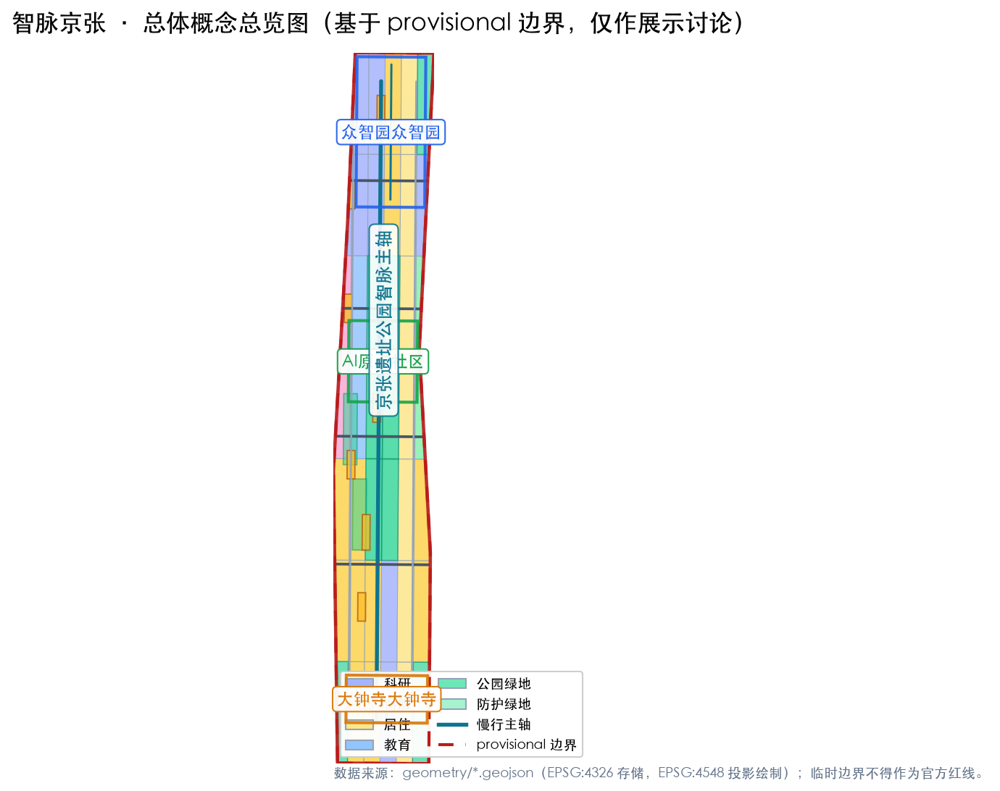
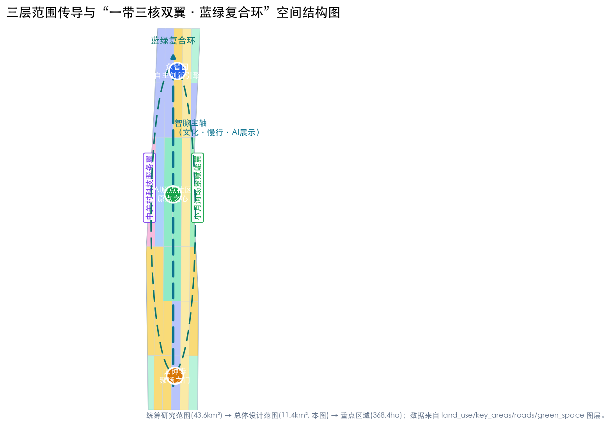
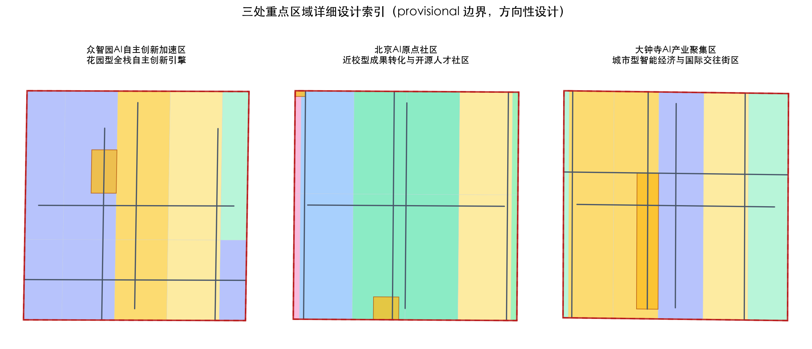
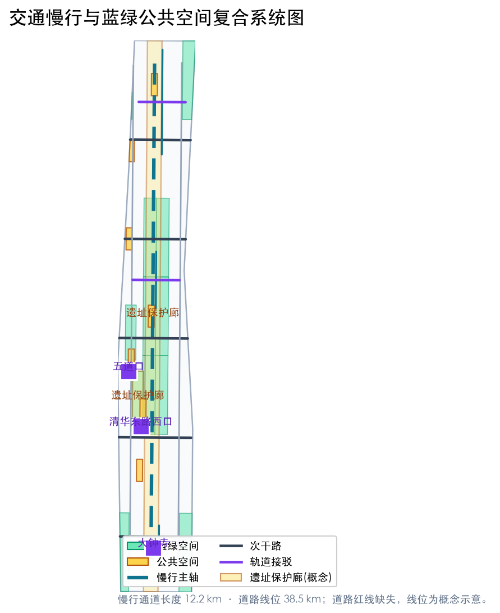
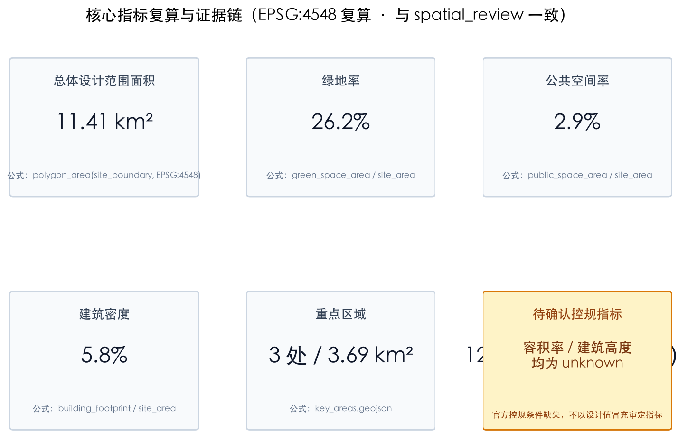

# Intelligence Vein Jing-Zhang: Overall Urban Design and Scenario Operation Conceptual Proposal for the Centennial Jing-Zhang AI Innovation Belt

## Design Basis and Source List

This proposal is part of the formal AI agent scheme for the "Centennial Jing-Zhang AI Innovation Belt Urban Design Open Call." The primary reference is the "Centennial Jing-Zhang AI Innovation Belt Urban Design International Scheme Qualification Pre-Review Announcement" issued by the Haidian Branch of the Beijing Municipal Commission of Planning and Natural Resources [source:OFFICIAL-ANNOUNCEMENT][standard:PROJECT-OFFICIAL-ANNOUNCEMENT]. The machine-readable tasks and boundaries are based on the files `design_brief.json`, `agent_taskbook.json`, `allowed_design_space.json`, `sources.json`, `enums/`, `ranges/planning_limits.json`, and `schemas/` in the `brief/site-package/` directory [source:SITE-PACKAGE]. (Centennial Jing-Zhang AI Innovation Belt Open Call for Urban Design) The proposal uses `data/source_registry.json` as the primary control list for data availability [source:SOURCE-REGISTRY], and `data/processed/agent_fact_pack.md` and its CSV worksheets as a navigation layer for tasks, scope, data uses, and missing data lists [source:PROCESSED-FACT-PACK], with all judgments in the main text referencing the original source ID.

The reference boundaries for the materials are as follows: the project name, three-level scope, area values, and design tasks mentioned in the announcement can serve as formal task references; the excerpt from the agent task book [source:AGENT-TASKBOOK][standard:PROJECT-AGENT-OPEN-CALL-TASKBOOK] can serve as a reference for the agent's task response; the Haidian District's '1+X+1' modern industrial system [source:HAIDIAN-1X1-INDUSTRY] and the municipal science and technology commission's 'Three Zones and Two Wings' industrial layout [source:THREE-AREAS-WINGS] serve as industrial background materials. The boundaries in `brief/site-package/geometry/provisional_boundaries.geojson` and the key area polygon [source:BOUNDARY-SOURCE][source:KEY-AREA-SOURCE] are provisional and should only be used for concept generation, self-checks, visualization, and design discussions; they cannot be used as official planning boundaries, approval references, or for precise area recalculations. OSM is provided only as a conceptual base map and retains the ODbL attribution [source:OSM-ATTRIBUTION]. (Official Planning Boundary)

This plan reaches the depth of [depth:existing_conditions_diagnosis] and [depth:three_level_scope_framework] organized: first, complete the current condition and data diagnosis, then establish a three-level scope work framework, and subsequently achieve the Urban Design depth of Regulatory Detailed Planning in the Overall Design Area, and the urban design depth of integrated planning implementation scheme in key areas. All spatial judgments can be verified by referring back to `geometry/*.geojson`, `metrics.json`, `compliance_matrix.json`, `standard_matrix.json`, and `design_depth_matrix.json`. The evidence citations in the text, such as [data:geometry/site_boundary.geojson#SITE-001] and [metric:site_area_sqm], refer to these machine-readable outputs. (Integrated Planning Implementation Plan)

## Three-Level Scope Framework

Announcement defines three layers of scope: the Coordinated Research Area covers approximately 43.6 square kilometers, bounded by the North Fifth Ring Road to the north, the Jingzhang Expressway to the east, Xisi Street to the south, and Wancuahu Road to the west, focusing on a world-class AI Innovation Ecosystem, future urban form, and regional coordination; the Overall Design Area covers approximately 11.4 square kilometers, primarily focusing on the urban and industrial areas within 1-2 kilometers around the Jingzhang Site Park, emphasizing the overall framework of Urban Renewal, industrial space layout, traffic and municipal support, and style control; the Key-Area Detailed Design Area covers approximately 368.4 hectares, from north to south, including the Zhongzhiyuan AI Independent Innovation Acceleration Area (approximately 192.1 hectares), the Beijing AI Origin Community (approximately 104.3 hectares), and the Dazhongsi AI Industry Cluster (approximately 72.0 hectares) [source:OFFICIAL-ANNOUNCEMENT][standard:PROJECT-OFFICIAL-ANNOUNCEMENT]. (Jing-Zhang)

Three levels of design tasks are progressively conveyed: comprehensively study and answer "how the AI Innovation Ecosystem and future urban form are organized," the overall design answers "how industrial spaces, Urban Renewal, transportation infrastructure, and urban appearance are represented on the map," and the key areas answer "how the three areas reach the level of detailed design." This plan expresses the Overall Design Area boundary with `geometry/site_boundary.geojson#SITE-001`, and the three key areas with `geometry/key_areas.geojson#KEY-001`, `#KEY-002`, `#KEY-003`. [data:geometry/site_boundary.geojson#SITE-001][data:geometry/key_areas.geojson#KEY-001][data:geometry/key_areas.geojson#KEY-002][data:geometry/key_areas.geojson#KEY-003] Due to the absence of official precise boundary lines for the warehouse, this proposal uses provisional rough boundaries: `official_boundary=false`, `geometry_role=provisional_constraint`, `boundary_precision=provisional_rough`. The site area is recomputed in EPSG:4548 as [metric:site_area_sqm], for purposes of generating and discussing the proposal only; once the official polygon is released, the site boundary, key areas, land use, roads, green space, public space, buildings, phasing, and all related metrics must be recalculated [source:BOUNDARY-SOURCE][depth:three_level_scope_framework].

## Coordinated Research Area: Industry and Future City Research

The core proposition of the Coordinated Research Area is "integrating the century-old railway cultural heritage, the innovation gene of Zhongguancun, and the new quality productivity of AI into a world-class innovation ecosystem." This plan proposes an overall concept of "Intelligence Vein Jing-Zhang (JINGZHANG AIPULSE, abbreviated JZ·AI)," corresponding to three key positioning: the Century Jing-Zhang Cultural Belt, the Urban AI Living Experience Belt, and the AI Integrated Innovation Belt. Corresponding to the five functions: Full-Stack Independent AI Innovation System, World-Class AI Innovation Ecosystem, AI-Enabled Scenario Empowerment New Paradigm, Intelligent AI Vital City, and AI Governance Global Discourse [source:AGENT-TASKBOOK][standard:PROJECT-AGENT-OPEN-CALL-TASKBOOK]. The naming system adopts "One Belt and Three Cores with Two Wings": One belt, i.e., the Jing-Zhang Heritage Park Intelligent Axis. Three cores are the Zhongzhiyuan 'Innovation Engine', the AI Origin Community 'Origin Heart', and Dazhongsi 'Gathering Place Gate'; two wings are the Zhongguancun Technology Services Wing and the Xiaoyue River Scenario Enablement Wing, corresponding to the 'Three Zones and Two Wings' industrial pattern [source:THREE-AREAS-WINGS].

Logo and Visual Identity Direction: The "Pulse Line" as the theme — a continuous zigzag line from tracks, circuits to heartbeats, echoing the innovative spirit of Zhan Tianyou's "human-shaped" railway, forming the "Intelli-Pulse Zigzag" graphic; the main colors are Jing-Zhang Blue (#1F5FA8, symbolizing railways and technological rationality) and Intelli-Pulse Gold (#C8A24B, symbolizing Zhongguancun and AI achievements), with auxiliary colors being Qing Green (#1B9C85, symbolizing blue-green ecology); the font direction uses the open-source Source Han Black and sans-serif digital fonts, with all fonts and graphics selected from commercial/opensource materials to avoid unauthorized use of trademarks and fonts [source:AGENT-TASKBOOK][depth:overall_spatial_structure]. This visual system is proposed as a conceptual direction for professional teams to deepen, and does not constitute a legal identifier.

Global AI Innovation Ecosystem Case Studies (6, [metric:case_study_count]):
1. The Silicon Valley Research Park in the  in collaboration with Stanford University, validating the "university origin - capital catalysis - industrial transformation" loop;
2. Shenzhen Nanshan High-Tech Park and Xili Lake International Science and Education City, validating "hardware innovation - full-stack autonomy - scenario validation";
3. One-North in Singapore, validating "government coordination - biotechnology and AI cluster - livable and workable";
4. King's Cross Knowledge Quarter in London, validating "railway industrial heritage renewal - university knowledge economy - Public Space activation";
5. Paris Station F, validating "renovation of existing buildings - startup ecosystem - open innovation by large enterprises";
6. Hangzhou Future Science and Technology City, validating "platform economy - digital scenarios - talent special zone". Extract five mechanisms for transformation from the case studies:
- **Source Mechanism (Innovative Origin from Universities and Institutes)**:
- **Transformation Mechanism (Incubation-Display-Roadshow Full Chain)**:
- **Scenario Mechanism (Real Scene Open Testing)**:
- **Capital Mechanism (Patient Capital and Zhongguancun IP Empowerment)**:
- **Governance Mechanism (Standards, Safety, Ethics, and Global Discourse Power)** [source:HAIDIAN-1X1-INDUSTRY][depth:overall_spatial_structure]. These mechanisms are spatially realized in [data:geometry/land_use.geojson#LU-0105] (research and development land use), [data:geometry/buildings.geojson#BLDG-001] (innovative buildings), and [metric:land_use_research_area_sqm]. (Scenario Access)

Conceptual Recommendation for the Future Urban Form Study focuses on how AI can transform work, life, social interactions, learning, and public services: the proposal suggests an "Intelligent AI Perceptible Urban Interface" — implementing AI-driven transportation, continuous green spaces, innovative service facilities, and an international living atmosphere as locatable functional zones, nodes, corridors, and scenarios, rather than merely discussing technical visions [depth:overall_spatial_structure]. AI innovation indices, talent density, supply of industrial spaces, and key AI+ vertical application areas are included in the indicators chapter, with clear distinctions marked between official data, design recommendations, and areas awaiting formal data calibration; all conclusions at this level are conceptual recommendations and reference schemes, not constituting legal urban design judgments [standard:MOHURD-URBAN-DESIGN-MEASURES].

## Overall Design Area: Urban Renewal and Regulatory-Plan-Level Urban Design

The Overall Design Area reaches the depth of Regulatory Detailed Planning for Urban Design. The spatial structure is defined as "one axis with three cores and two wings, a blue-green composite ring, and multiple point scenario networks": one axis as the smart vein main axis along the Jing-Zhang Heritage Park (cultural, pedestrian-friendly, public activities, and AI display integrated); three cores as Zhongzhiyuan, AI Origin community, and Dazhongsi; two wings as Zhongguancun Technology Services Wing (along University Road and Zhi Chun Road directions, [data:geometry/land_use.geojson#LU-0201]) and Xiaoyue River Scenario Enablement Wing (along Xiaoyue River Blue-Green Space, [data:geometry/green_space.geojson#GREEN-0202]); the blue-green composite ring is formed by the heritage park axis, Xiaoyue River and Qinghe interface, and side road green corridors [data:geometry/green_space.geojson#GREEN-0101][data:geometry/public_space.geojson#PUBLIC-001]. Multiple scenario nodes networked throughout the block and site, distributed as AI scenario nodes [data:geometry/public_space.geojson#PUBLIC-002][depth:overall_spatial_structure].

Industrial Goals and Functional Layout: With AI research and innovation as the primary function, [metric:land_use_research_area_sqm] of 0802 research and development land will support Zhongzhiyuan's full-stack independent innovation and original community technology transfer; 05 commercial and service land use [metric:land_use_commercial_area_sqm] will support Dazhongsi's intelligent economy and street-side industrial services; 0701 residential and talent community land use [metric:land_use_residential_area_sqm] will support talent accommodation; 0804 educational and research land use [metric:land_use_education_area_sqm] will rely on universities and research institutions; 0803 cultural land use [metric:land_use_culture_area_sqm] will support the display of railway culture, Zhongguancun culture, and AI new culture; 0805 sports land use [metric:land_use_sports_area_sqm] will serve active living. 1401 Park Green Spaces and 1402 Protective Green Spaces together cover [metric:land_use_green_area_sqm] + [metric:land_use_protective_green_area_sqm], forming the blue-green backbone [standard:MNR-LAND-USE-CLASSIFICATION-GUIDE][depth:land_use_layout].

Urban Renewal overall framework adopts five categories of guidance: "preserve-rehabilitate-update-new-build-blank." Railway sites and historical cultural resources are primarily preserved and revitalized; existing industrial parks and dilapidated buildings are primarily renovated and improved; inefficient industrial warehouses and idle land are primarily updated and replaced; research, talent communities, and public service facilities that need to be supplemented are primarily built anew; and areas without clear conditions are expressed as blank land (16) [depth:retain_renovate_demolish]. Due to the absence of official control plans, road red lines, ownership, and municipal data, the Development Intensity class indicators in [depth:development_intensity_controls] are handled based on pending confirmation of control plan conditions: the Floor Area Ratio, Building Height, Building Coverage Ratio, and setback distances are not provided with pseudo-precise values. In metrics.json, [metric:floor_area_ratio] and [metric:building_height_m] are marked as unknown and the reasons are documented [source:SITE-PACKAGE][standard:MOHURD-CONTROL-DETAILED-PLANNING].

Building Scale and Aesthetic: The concept Building Footprint is expressed as [metric:building_footprint_area_sqm], and the building density is [metric:building_density]. The aesthetic control is presented according to the "Zone Guidelines + Massing Guidance" —— along the main axis, low-rise high-density, transparent ground floors, and public interfaces are prioritized as guidance; at the three cores, landmark massing and mixed-use functions are prioritized as guidance; in the residential districts, human-scaled and blue-green permeability are prioritized as guidance [depth:height_massing_character][standard:MOHURD-URBAN-DESIGN-MEASURES]. All height, massing, interface, and color controls are design recommendations, with specific statutory controls to be determined by the pending control plan. (Building Coverage Ratio)

## Detailed Design of Key Areas

Three key areas correspond to [data:geometry/key_areas.geojson#KEY-001], [data:geometry/key_areas.geojson#KEY-002], and [data:geometry/key_areas.geojson#KEY-003], achieving the depth of an Integrated Planning Implementation Plan for Urban Design [depth:three_key_area_detailed_design]. Currently, all three key areas are provisional polygons, and their internal conclusions are only directional designs, with precise boundaries to be recalculated upon official release.

**Zhongzhiyuan AI Independent Innovation Acceleration Area** (approximately 192.1 hectares, one of [metric:key_area_count]): positioned as a "garden-type full-stack independent innovation engine," the spatial structure is defined as "Qinghe interface + innovation spine + test field ring." The industrial functions are centered on [data:geometry/land_use.geojson#LU-0106] AI research and development and independent innovation, with accompanying industrial services and low-carbon energy; architectural updates focus primarily on renovating existing parks with new construction as a supplement; Public Spaces form a low-carbon innovation interaction belt along the Qinghe interface [data:geometry/green_space.geojson#GREEN-0102]; traffic organization strengthens external connections and station-city integration [data:geometry/roads.geojson#ROAD-0101]; AI scenarios include autonomous model testing, standard-setting workshops, safety governance demonstrations, and low-carbon computing experiences [metric:ai_test_scenario_count]. Implementation Risks: Lack of master plan indicators, ownership, and engineering conditions; these need to be completed prior to formal deepening [source:AGENT-TASKBOOK].

**Beijing AI Origin Community** (approximately 104.3 hectares): positioned as an "near-campus type conversion and open-source talent community," the spatial structure is defined as "campus-industrial zone-residential area tri-ring integration." The industrial functions are centered around the research and development conversion, educational support, and open-source collaboration as outlined in [data:geometry/land_use.geojson#LU-0303]; architectural updates include the renovation of the near-campus residential area and the construction of new conversion stations; Public Spaces are anchored by the Origin Plaza [data:geometry/public_space.geojson#PUBLIC-003] and the open-source achievement display corridor, which connect to the holy sites; traffic organization emphasizes the integration of the campus with pedestrian-friendly connections and Transit-Station Integration [data:geometry/roads.geojson#ROAD-0301]; AI scenarios support the open-source community, achievement release, talent special zone services, and on-campus incubation. Implementation risks include the need to confirm the campus boundaries, ownership, and ground-floor uses on a per-plot basis [standard:PROJECT-AGENT-OPEN-CALL-TASKBOOK].

**Dazhongsi AI Industry Cluster** (approximately 72.0 hectares): positioned as an "urban-type intelligent economy and international exchange district," the spatial structure is defined as "Dazhongsi Station Quadrants + Data Element Parlor + Intelligent Consumption Street." The industrial functions are centered around the commercial service industry and data element research as defined by [data:geometry/land_use.geojson#LU-0504]; architectural updates focus on the renewal of the public environment around key enterprises and the creation of intelligent consumption spaces; Public Spaces revolve around the integration of the station front quadrants square [data:geometry/public_space.geojson#PUBLIC-004] and planned green spaces [data:geometry/green_space.geojson#GREEN-0301]; traffic organization hinges on the integration of Dazhongsi Station and the quadrants' pedestrian connectivity at the intersection [data:geometry/roads.geojson#ROAD-0402]; AI scenarios encompass the display of intelligent bodies and terminals, content consumption, data element circulation, and international roadshows. Implementation Risks: Track stations, road intersections, and utility line conditions await engineering verification [depth:traffic_rail_slow_parking].

## AI Innovation Ecosystem, Personas, and AI+ Scenarios

The AI Innovation Ecosystem is organized in a five-ring structure following the sequence of "university innovation source—open-source collaboration—enterprise transformation—public experience—international dissemination" [source:AGENT-TASKBOOK][depth:overall_spatial_structure]. The ecosystem map covers five major sectors: basic research, industrial incubation, capital services, Scenario Access, and governance standards. 6 categories of user personas ([metric:persona_count]): Open-source developers (needs: publishing, collaboration, testing, community reputation; spatial response: Origin Community Open Source Release Hall, public code wall, nighttime collaboration space); Start-up teams (needs: low-cost office space, computational power entry point, product test field; spatial response: Zhongzhiyuan Shared Testing Field, edge-side computational power service point); Leading enterprise visitors (needs: showcasing, business meetings, international hospitality, talent recruitment; Space Response: International Roadshow Living Room at Dazhongsi, track-to-train connections); Surrounding Residents (needs: commuting, leisure, community services, low-impact updates; space response: heritage park pedestrian loop, embedded community services); University Students and Faculty (needs: technology transfer, cross-institution collaboration, daily pedestrian access; space response: campus-park integration, technology transfer hubs). Public Service Manager (Requirements: Urban Operation Perception, Facility Maintenance, Activity Safety; Spatial Response: Urban Agent Sandbox, Safety Governance Corridor) [source:AGENT-TASKBOOK][metric:persona_count].

AI scene cards total 12 ([metric:scenario_node_count]), among which 3 are for industrial Testing and Validation Scenarios ([metric:ai_test_scenario_count]):

| Scenario Card | Spatial Carrier | Service Target | Data/Privacy Boundary | Human Review | Operational Subject Recommendation |
| --- | --- | --- | --- | --- | --- |
| 01 Open Source Release Hall | AI Origin Community | Developers, Enterprises, Universities | Code Contributions Public, No Collection of Personal Behavioral Trajectories | Content Released Under Manual Review | Open Source Community + Park Operators |
| 02 Urban Agent Sandbox (Testing Validation) | Zhongzhiyuan | Intelligent Agent R&D Team, Governance Department | Sandbox Data Isolation, Pre-Test Authorization | Human Review of Test Results | Platform Company + Third-Party Evaluation |
| 03 Slow Travel Discontinuity Diagnosis (Testing Validation) | Heritage Park | Slow Travel Users, Transportation Department | Utilize Public Data and Anonymous Aggregation, No Personal Identification | Human Review of Diagnosis Conclusion | Transportation Department + Research Institution |
| 04 Talent Life Manager | Talent Community | Talent and Family | Service Authorization Minimized, Not Used for Commercial Recommendations | Service Suggested for Human Review | Community Operator |
| 05 AI Safety Governance Corridor | Zhongzhiyuan | Public, Enterprises, Regulators | Display desensitized case studies, do not display unauthorized data | Content Moderation | Standard Organizations + Park |
| 06 Campus-Enterprise Transformation Living Room | AI Origin Community | University Faculty and Students, Investment Institutions | Project Information Disclosed with Authorization | Pitch and Transformation Manual Review | University Technology Transfer + Park |
| 07 Data Elements Theater | Dazhongsi | Public, Enterprises, Data Service Providers | With Compliance, Authorization, and Auditability as Prerequisites | Human Review for Circulation Rules | Data Exchange + Park |
| 08 Low-Carbon Computing Hub (Testing and Validation) | Overall Scope Node | Enterprises, Developers | Authorization for Usage of Computing Power and Energy Consumption Data | Manual Review of Service Agreement | Energy Companies + Parks |
| 09 Jing-Zhang Memory Route | Heritage Site Cultural Node | Citizens, Tourists | Anonymous Guiding Data | Cultural Content Expert Review | Cultural Operation Party |
| 10 Global AI Activity Week Route | One Public Space System | Global Participants | Activity Data Aggregation and Statistics | Activity Safety and Content Review | Activity Organizing Committee |
| 11 AI+Healthcare Navigation | Community and Medical Facilities Nodes | Residents | Health Data Not Shared, Anonymous Guidance | Medical Advice Human Review | Healthcare Institutions + Community |
| 12 Robot Delivery Low-Speed Corridor | Xiaoyue River Scenario Enablement Wing | Residents, Merchants | Delivery Data Authorization, Speed and Area Limitations | Route and Safety Human Review | Delivery Companies + Streets |

Scene-Space-Operation Mapping: The scenario cards correspond to layers such as [data:geometry/public_space.geojson#PUBLIC-005], [data:geometry/green_space.geojson#GREEN-0202], and [data:geometry/roads.geojson#ROAD-0201], etc., layer nodes. Operational and privacy boundaries are written into the compliance notes corresponding to [source:AGENT-TASKBOOK] at the [depth:traffic_rail_slow_parking] level. All scenes adhere to the principles of data minimization, public sources, explainability, and Human Review. Personal behavior trajectories are not collected, unauthorized personal profiles are not output, and immature technologies are not deployed as fully functional [source:AGENT-TASKBOOK][standard:PROJECT-AGENT-OPEN-CALL-TASKBOOK].

## Land Use, Building Scale, and Retain-Renovate-Demolish Strategy

Land-Use Layout is based on the [standard:MNR-LAND-USE-CLASSIFICATION-GUIDE] and adopts a unified land-use classification, as defined in `geometry/land_use.geojson`, which completely covers the submission boundary with 42 zones and is seamless and non-overlapping [data:geometry/land_use.geojson#LU-0101][depth:land_use_layout]. The classification summary is as follows: 0802 Research Land [metric:land_use_research_area_sqm], 05 Commercial and Service Land [metric:land_use_commercial_area_sqm], 0701 Residential Land [metric:land_use_residential_area_sqm], 0804 Educational and Research Land [metric:land_use_education_area_sqm], 0803 Cultural Land [metric:land_use_culture_area_sqm]. 0805 Sports Land Use [metric:land_use_sports_area_sqm], 1401 Park Green Space [metric:land_use_green_area_sqm], 1402 Protective Green Space [metric:land_use_protective_green_area_sqm]. The functional proportions reflect a dual orientation towards "AI Innovation + Vibrant City": research and industrial service land use accounts for approximately half of the total area, supporting the world-class AI Innovation Ecosystem; green spaces and open spaces together exceed 30%, supporting the vitality belt of high-quality urban areas and the heritage park [metric:green_ratio].

Building Scale: The total Building Footprint area [metric:building_footprint_area_sqm] corresponds to the Building Coverage Ratio [metric:building_density], expressed as a dispersed cluster plus a main axis interface mode, avoiding large-scale enclosed blocks [data:geometry/buildings.geojson#BLDG-001][depth:height_massing_character]. The Demolish–Renovate–Retain Strategy adopts five categories of guidance: "retention first, renovation as the main focus, updating and replacement, new construction to supplement, and leaving blank areas for future determination" [depth:retain_renovate_demolish]. Specific classifications for demolition, renovation, and retention will be determined by professional teams after confirming ownership, current building conditions, and control plan data for each plot. Building Height, Floor Area Ratio, setback distances, and building control lines are all listed as pending confirmation control conditions in [depth:development_intensity_controls] due to the lack of official criteria. This plan does not provide pseudo-precise values [standard:MOHURD-CONTROL-DETAILED-PLANNING].

## Transport, Rail, Municipal Infrastructure, and Public Services

Traffic organization is structured around the principle of "tracks as the backbone, slow travel as the veins, and micro-circulation as the supplement": it leverages existing rail stations (such as West Qinghua East Road, Wodao Kou, and Dazhongsi) to enhance station-city integration and connection pathways [data:geometry/roads.geojson#ROAD-0401][data:geometry/roads.geojson#ROAD-0402]; it constructs a north-south through slow travel main axis along the Jing-Zhang Heritage Park [data:geometry/roads.geojson#ROAD-0101], and overlays secondary east-west arterial roads and north-south branch roads to form micro-circulation [data:geometry/roads.geojson#ROAD-0102][data:geometry/roads.geojson#ROAD-0103]; it arranges pedestrian paths and rail connection pathways in key areas [data:geometry/roads.geojson#ROAD-0301][data:geometry/roads.geojson#ROAD-0302]. Road concept line length [metric:road_length_m], including pedestrian and access paths [metric:slow_path_length_m]; road corridor area [metric:road_corridor_area_sqm] and road ratio [metric:road_ratio] are conceptual estimates, with official road boundary confirmation pending [source:BOUNDARY-SOURCE][depth:traffic_rail_slow_parking]. Parking and non-motorized vehicle organization, as well as external traffic interfaces (North Fifth Ring Road, Jingzhang Expressway) are proposed as areas for further development [standard:PROJECT-OFFICIAL-ANNOUNCEMENT].

Municipal and New Infrastructure: Propose the concept layout of distributed energy, edge-side computing power, data element facilities, and AI public service facilities (expressed through conceptual nodes), combined with talent living services and innovation service platforms. Traditional municipal pipelines, energy loads, drainage flood control, and fire safety conditions, lacking engineering documentation, are all listed as formal deepening prerequisite conditions [depth:municipal_new_infrastructure]. Public service facilities are laid out in a dual-layer system based on the "15-minute living circle + AI innovation service circle," serving talent residence, entrepreneurship incubation, international exchanges, and daily life [source:SITE-PACKAGE].

## Blue-Green Network, Public Space, and Urban Character

Blue-Green Space is structured around the Jing-Zhang Relic Park Vital Axis: the main axis of park green spaces runs north-south [data:geometry/green_space.geojson#GREEN-0101] and connects the Little Moon River Blue-Green Space [data:geometry/green_space.geojson#GREEN-0202] with Qinghe Interface [data:geometry/green_space.geojson#GREEN-0102], overlaying protective green spaces [data:geometry/green_space.geojson#GREEN-0401] and roadside green corridors to form a Blue-Green composite ring. The total area of park green spaces is [metric:green_space_area_sqm], with a green space ratio of [metric:green_ratio]. Public Space is composed of a network of 8 square nodes: Zhongzhiyuan Innovation Square [data:geometry/public_space.geojson#PUBLIC-001], Tsinghua Park Station Square [data:geometry/public_space.geojson#PUBLIC-002], Origin Release Square [data:geometry/public_space.geojson#PUBLIC-003], Dazhongsi Quadrant Square [data:geometry/public_space.geojson#PUBLIC-004], etc. The total area of public space is [metric:public_space_area_sqm], and the public space rate is [metric:public_space_ratio] [depth:blue_green_public_space][standard:MOHURD-URBAN-DESIGN-MEASURES].

AI Public Space and Pilgrimage Landmarks (4 in total, [metric:ai_landmark_count]):

1. "Tsinghua Garden Station · AI Origin Marker" — a commemorative landmark and time scale device marking the intersection of a century-old railway and the AI Origin at the cultural node of the old Tsinghua Garden Station [data:geometry/constraints.geojson#CONST-STATION-001];

2. "Wisdom Vein Bell Tower · Dazhongsi Time-Keeping Square" — a public art time-keeping and honor display driven by intelligent agents, hosted within the quadrants of the Dazhongsi station public space [data:geometry/public_space.geojson#PUBLIC-004];

3. "Open Source Achievements Gallery · Developers' Honor Wall" — an updatable node of open source contribution honor displays along the main axis of the ruins park [data:geometry/public_space.geojson#PUBLIC-005]. Four is "Qinghe Zhinu·Zhongzhi Zhi Guang" —— set up industrial exhibitions and public art landmarks at the Qinghe interface of Zhongzhiyuan [data:geometry/green_space.geojson#GREEN-0102]. All landmarks, signage, logos, fonts, and images will use Qingquan materials. Conceptual landmarks will not be written as approved constructions to avoid over-commercialization [source:AGENT-TASKBOOK][depth:blue_green_public_space].

Urban Character: Based on the "century-old railway cultural veins, Zhongguancun innovative spirit, and AI futuristic feel," the Urban Design Management Measures require a holistic approach to architectural layout, landscape appearance, Public Space, and urban character [standard:MOHURD-URBAN-DESIGN-MEASURES]. Along the main axis, control the street facade, first-floor transparency, and roof forms. The three cores form landmark volumes, while residential districts emphasize a human-scaled and blue-green permeable environment. The character control zones are divided into "strict preservation areas (protected sites and relics), harmonization and guidance areas (along the main axis), and innovation display areas (the three cores)," with specific control lines to be confirmed upon the availability of heritage and control plan documentation [depth:height_massing_character][depth:blue_green_public_space].

## Renewal Projects, Implementation Policy, and Phasing

Update project list includes 12 items ([metric:renewal_project_count]): JZ-01 Jing-Zhang Site Park Pedestrian Gap Closure (Public Space/Transport, dependent on road boundary and under-bridge space conditions); JZ-02 Zhongzhiyuan Qinghe Innovation Interface (Blue-Green Space/Industrial Display, dependent on river blue line and flood control conditions); JZ-03 Origin Community Near-School Transformation Street (Urban Renewal/Industrial Services, dependent on school boundary and ownership); JZ-04 Dazhongsi Station Quadrant Pedestrian Connectivity (Integrated Rail/Slow Travel, dependent on station and road intersection conditions); JZ-05 Tsinghua Station Cultural Node Revitalization (Culture/Remembrance, dependent on cultural heritage control); JZ-06 Open Source Results Showcase Corridor (Public Space/Honor Display, dependent on public space permit); JZ-07 Xiaoyue River Scenario Enablement Wing Pedestrian Path (Blue-Green/Scenario, dependent on river blue line); JZ-08 Low-Carbon Computing Power Station Pilot (New Infrastructure, dependent on energy and safety conditions); JZ-09 Data Element Living Room (Industrial Services, dependent on data compliance mechanisms); JZ-10 Talent Community Accommodation Improvement (Residential/Services, dependent on ownership and community conditions). JZ-11 Smart Pulse Clock Tower Time Square (Public Art, Dependent on Public Engagement and Copyright Clearance); JZ-12 Global AI Activity Week Public Route (Operational/Branding, Dependent on Event Safety and Permits)[data:geometry/phasing.geojson#PHASE-001][depth:renewal_project_list].

Policy Recommendations for Implementation: Propose a coordinated mechanism for Urban Renewal, supply and operation of industrial spaces, data governance and privacy protection rules, public participation and co-governance platforms, and property rights coordination and interest balance mechanisms. These do not constitute a determined government arrangement [source:AGENT-TASKBOOK][standard:MOHURD-CONTROL-DETAILED-PLANNING]. Phased Plan ([depth:phasing_implementation]): Recently (phase_1, approximately [metric:phase_1_area_sqm] Focus on the dual-pole pilot of Zhongzhiyuan and Dazhongsi, as well as the demonstration segment of the rail node and the heritage park.[data:geometry/phasing.geojson#PHASE-001]; Mid-term (phase_2, approximately [metric:phase_2_area_sqm]) advance the update of the middle segment of the AI Origin community and heritage park [data:geometry/phasing.geojson#PHASE-002]. Urban Renewal (phase_3, approximately [metric:phase_3_area_sqm]) will complete the overall appearance, network, and operational system [data:geometry/phasing.geojson#PHASE-003]. The distinction between phased implementation and the submission cycle is as follows: the submission cycle is the time requirement for submitting results, while phased implementation is the path for advancing urban renewal [depth:phasing_implementation].

Long-term Operation Design (in response to agent.6): The annual activity system is suggested to include the "Zhi Mai Conference (JZ·AI Summit)," AI Open Source Week, Scenario Access Day, Developer Marathon, and the Global AI Innovation Festival; the brand IP is to be named and branded around "Zhi Mai Jing-Zhang," with a visual identity system established; the developer community operation is suggested to include online collaboration spaces, open-source contribution points, an honor wall update mechanism, and annual evaluations; the scenario access operation is suggested to include scenario entry, test sandbox, data authorization, and Human Review processes; the public experience route is the "Global AI Activity Week Route," which connects heritage sites, open-source communities, industry displays, and international roadshows; international communication and attraction conversion mechanisms are suggested to include an international media matrix, developer ambassador programs, and roadshow and on-site connection channels [source:AGENT-TASKBOOK][depth:phasing_implementation]. All of the above are Conceptual Recommendations and deepening directions, not expressed as confirmed activities or government commitments [standard:PROJECT-AGENT-OPEN-CALL-TASKBOOK].

## Metrics, Area Recalculation, and Compliance Matrix

The metric system is divided into three categories: the first category includes spatial metrics that can be recalculated directly from the submitted geometry — the Overall Design Area [metric:site_area_sqm], the number of key areas [metric:key_area_count], and their area [metric:key_detailed_design_area_sqm], as well as land use area categories ([metric:land_use_research_area_sqm], [metric:land_use_commercial_area_sqm], [metric:land_use_residential_area_sqm], [metric:land_use_education_area_sqm], [metric:land_use_culture_area_sqm], [metric:land_use_sports_area_sqm], [metric:land_use_green_area_sqm], [metric:land_use_protective_green_area_sqm]), green space area [metric:green_space_area_sqm] with green space ratio [metric:green_ratio], Public Space area [metric:public_space_area_sqm] with public space ratio [metric:public_space_ratio], Building Footprint [metric:building_footprint_area_sqm] with Building Coverage Ratio [metric:building_density], road length [metric:road_length_m], road corridor area [metric:road_corridor_area_sqm] with road ratio [metric:road_ratio], pedestrian path length [metric:slow_path_length_m], phase area([metric:phase_1_area_sqm],  [metric:phase_2_area_sqm] and [metric:phase_3_area_sqm])[depth:metrics_recalculation]; the second category are control indicators that require support from official detailed planning or task book attachments—such as the Floor Area Ratio [metric:floor_area_ratio] and Building Height [metric:building_height_m]—all of which are marked as unknown and the reasons are noted [standard:MOHURD-CONTROL-DETAILED-PLANNING]. The third category consists of operational and industrial performance metrics—scenario node count [metric:scenario_node_count], Testing and Validation Scenario count [metric:ai_test_scenario_count], user persona count [metric:persona_count], global case study count [metric:case_study_count], pilgrimage landmark count [metric:ai_landmark_count], and update project count [metric:renewal_project_count], which are used as conceptual performance targets for operational deepening.

All known metrics were recalculated in EPSG:4548 using `geometry/*.geojson` and matched the results from `scripts/spatial_review.py` [depth:metrics_recalculation]; the metric formulas, source files, and confidence levels are documented in `metrics.json`. The area recalculation shall be based on the submitted provisional boundaries, with [metric:site_area_sqm] within a reasonable tolerance of the 11.4 square kilometers Overall Design Area as announced; official polygon release requires a unified recalculation [source:BOUNDARY-SOURCE][source:KEY-AREA-SOURCE].

Compliance Matrix (`compliance_matrix.json`) covers 23 mandatory tasks for announcements 1.3.1-1.3.3, 1.4.1-1.4.3, 1.5.1.1-1.5.3.3, and agents.1-agent.6 [depth:metrics_recalculation]; Standard Matrix (`standard_matrix.json`) covers 5 mandatory standards with addressed responses and 1 data_gap standard truthfully marked [standard:MOHURD-ARCH-DESIGN-DEPTH-2016]; Design Depth Matrix (`design_depth_matrix.json`) has all 15 core depths fully complete [depth:risk_missing_data]. Each task's chapter, layer, metric, drawing, HTML page, source, assumptions, and check items are locatable within the matrix, with the main text referencing them as [data:geometry/land_use.geojson#LU-0101], [metric:green_ratio], and cross-referencing with the matrix [source:SOURCE-REGISTRY].

## Risk, Copyright, and Compliance

Risk and Compliance Boundaries: This proposal is an Open Co-Creation Conceptual Recommendation and does not replace formal planning; it does not constitute a government approval conclusion [source:AGENT-TASKBOOK]; the content involving control plan adjustments, Floor Area Ratio, Building Height, building intensity, specific site demolish–renovate–retain strategy, road alignment, rail line positioning, bridge and tunnel engineering, municipal pipeline layout, feasibility of underground space, ownership, investment estimation, development sequence, and approval judgment, should all be expressed as "conceptual recommendation/reference proposal/available for in-depth study by professional teams," and must not be used as a determined government decision or implementation arrangement [standard:PROJECT-AGENT-OPEN-CALL-TASKBOOK][depth:risk_missing_data]. (Demolish–Renovate–Retain Strategy)

Legal Compliance: Only publicly available or cleared data are used, without citing non-public planning documents, internal metrics, or personal privacy data; the OSM base map is used with attribution under the ODbL [source:OSM-ATTRIBUTION]. Copyright: All text, geometry, metrics, graphics, HTML, and drawings are generated or derived from cleared public data by the declared AI agent; visual elements are selected from open-source or commercially usable materials; logos, fonts, images, and corporate branding are not used without authorization [source:SITE-PACKAGE][depth:risk_missing_data]. Privacy Protection: AI scenarios do not collect individual behavioral trajectories; design principles include data minimization, explainability, and Human Review [source:AGENT-TASKBOOK]. AI Generated Content Responsibility: The author is responsible for the facts, citations, copyright, and final expression [source:SOURCE-REGISTRY].

Missing data list (see `assumptions.json` and `missing_data_checklist.csv` [source:PROCESSED-FACT-PACK]): official red line and three key areas' official polygon, control plan indicators (Floor Area Ratio, height, density, green space ratio, setback), road red line and rail line positions, parcel boundaries and ownership, current building stock, municipal utility lines and engineering conditions, cultural heritage control lines, energy and flood control conditions. The above gaps do not block content scoring, but all related conclusions are subject to accuracy warnings and will be recalculated after the official data is released [source:BOUNDARY-SOURCE][depth:risk_missing_data]. Professional review: The plan must be deepened and reviewed by a team of urban planning, transportation, municipal, architectural, and cultural heritage professionals before it can enter the next stage of research [standard:MOHURD-CONTROL-DETAILED-PLANNING]. Copyright notice see `report/copyright_statement.md`.

## References

- `brief/site-package/design_brief.json`, `agent_taskbook.json`, `allowed_design_space.json`, `sources.json`, `enums/`, `ranges/planning_limits.json`, `schemas/` [source:SITE-PACKAGE]
- `brief/site-package/geometry/provisional_boundaries.geojson` [source:BOUNDARY-SOURCE][source:KEY-AREA-SOURCE]
- `brief/site-package/standards/standards.json` and `references/` local standard snapshots [standard:PROJECT-OFFICIAL-ANNOUNCEMENT][standard:PROJECT-AGENT-OPEN-CALL-TASKBOOK][standard:MOHURD-URBAN-DESIGN-MEASURES][standard:MOHURD-CONTROL-DETAILED-PLANNING][standard:MNR-LAND-USE-CLASSIFICATION-GUIDE]
- `data/source_registry.json` [source:SOURCE-REGISTRY]; `data/processed/agent_fact_pack.md` and CSV worksheet [source:PROCESSED-FACT-PACK]
- Prequalification Announcement (Haidian Branch of Beijing Planning and Natural Resources Commission) [source:OFFICIAL-ANNOUNCEMENT]
- Excerpt from Agent Task Book [source:AGENT-TASKBOOK]
- Haidian District's "1+X+1" Modernized Industrial System [source:HAIDIAN-1X1-INDUSTRY]; "Three Zones and Two Wings" to Create a World-Class AI Agglomeration Area [source:THREE-AREAS-WINGS]
- OpenStreetMap ODbL Attribution [source:OSM-ATTRIBUTION]
- The evidence files in this submission package include: `manifest.json`, `agent.json`, `metrics.json`, `assumptions.json`, `sources.json`, `self_check.json`, `compliance_matrix.json`, `standard_matrix.json`, `design_depth_matrix.json`, `geometry/*.geojson`, `assets/figures/*.png`, `report/proposal.html`, `drawings/*.pdf`, `visual/index.html`
