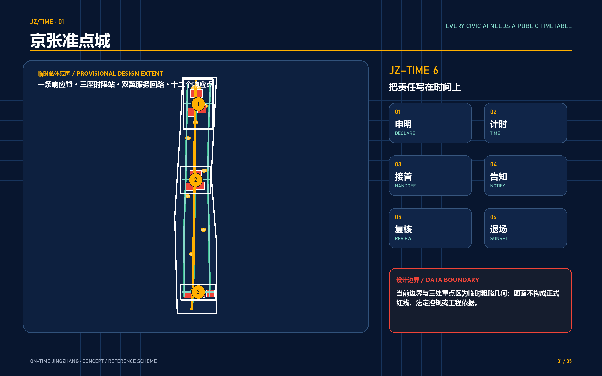
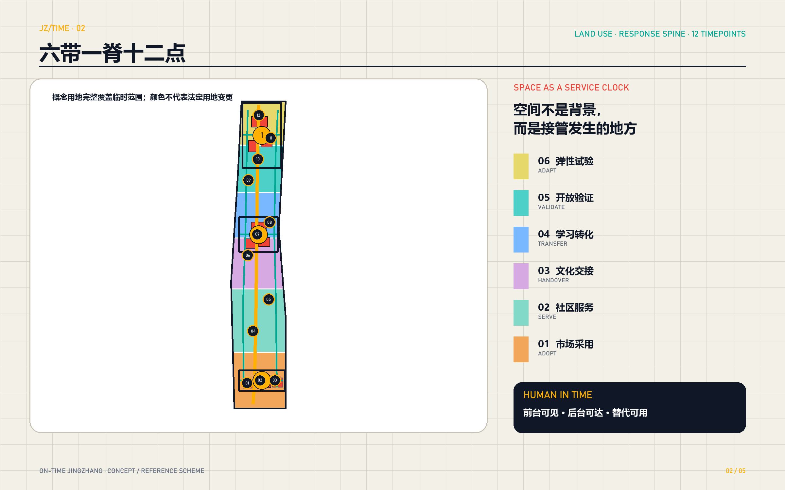
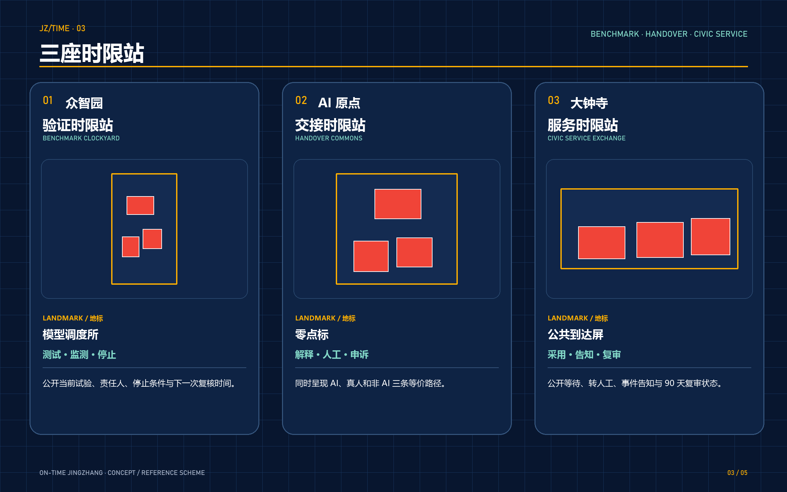
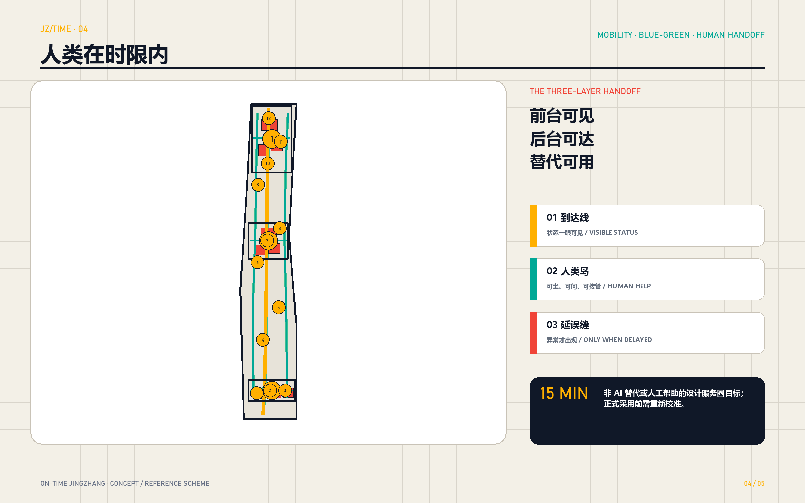
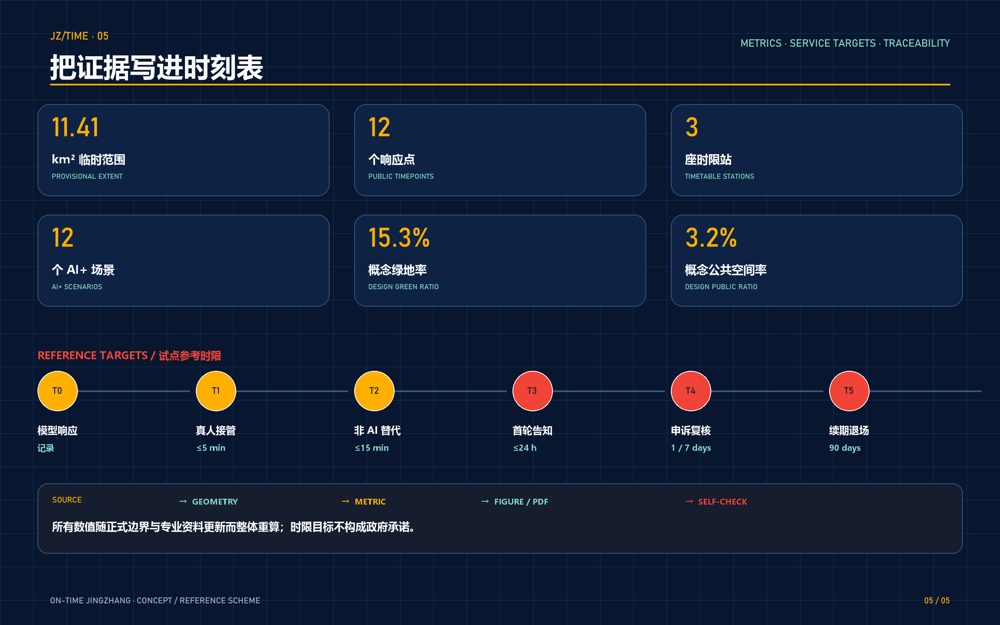

# ON-TIME JINGZHANG

> Every civic AI needs a public timetable. A model may arrive a second late; a person must not be left waiting without limit.

ON-TIME JINGZHANG turns punctuality from a railway metaphor into a public contract for civic AI. It asks when a system responds, when a human takes over, when an incident is disclosed, when an appeal receives a reasoned review, and when a pilot is renewed or retired. The proposal is a concept and reference scheme for professional development. It is not a statutory plan, an engineering design, or a government service commitment.

## Design Basis and Source List

The official announcement establishes the three-level scope, the three key areas, and the required urban-design deliverables [source:OFFICIAL-ANNOUNCEMENT]. The agent taskbook adds six workstreams: global cases, overall structure, key-area design, AI+ scenarios, cultural narrative, and long-term operations [source:AGENT-TASKBOOK]. The site package, source registry, and processed fact pack define permitted design space and source-use boundaries [source:SITE-PACKAGE] [source:SOURCE-REGISTRY] [source:PROCESSED-FACT-PACK].

No official overall polygon or official key-area polygons are currently included. Parcel ownership, regulatory controls, existing buildings, heritage boundaries, road and rail controls, municipal baselines, and public-service baselines are also absent. Therefore the submitted site and key-area geometries remain provisional constraints, clearly marked `official_boundary=false` [source:BOUNDARY-SOURCE] [source:KEY-AREA-SOURCE]. They support generation, discussion, and automated review only; they cannot be used as official redlines or precise statutory evidence. This evidence boundary responds to [depth:existing_conditions_diagnosis] and [depth:risk_missing_data].

## Three-Level Scope Framework

The approximately 43.6 km² coordinated research area addresses the innovation ecosystem and future-city model. The approximately 11.4 km² overall design area translates that model into renewal, land-use intent, mobility, public space, and enabling infrastructure. The three key areas, announced at approximately 368.4 hectares in total, test the proposal through detailed functions, spatial carriers, operations, and implementation dependencies.

The three levels are connected by **JZ-TIME 6**: Declare the service boundary and accountable role; Time the wait and resolution; Handoff to a person and non-AI route; Notify affected people after an incident; Review appeals and performance; and Sunset or renew every pilot. The spatial counterpart is one response spine, three timetable stations, two service loops, and twelve public timepoints [depth:three_level_scope_framework] [depth:overall_spatial_structure].

## Coordinated Research Area: Industry and Future City Research

The proposal defines a world-class AI ecosystem not only through firms, research, or computing capacity, but through the credible transition from experiment to city service. Universities and institutes form the knowledge network; firms and open-source communities form the development network; professional operators and public-service organizations form the real-world test network; residents, workers, disabled users, and visitors form the experience and oversight network.

Seven official first-party cases provide mechanisms rather than copyable numbers. Punggol Digital District demonstrates an open digital platform, live district data, and digital-twin testing [source:CASE-PUNGGOL]. Barcelona Innova Lab demonstrates a single gateway for pilots in real urban conditions [source:CASE-BARCELONA]. Helsinki’s Smart Kalasatama demonstrates agile pilots and resident co-creation around everyday quality [source:CASE-KALASATAMA]. Paris-Saclay links research, industry, mobility, natural systems, and recurring ecosystem events [source:CASE-PARIS-SACLAY].

The European CitCom.ai facilities combine physical and virtual testing with legal and ethical support [source:CASE-CITCOM-AI]. NIST AI RMF provides a voluntary reference for governance, monitoring, appeal, override, incident response, and decommissioning [source:CASE-NIST-AI-RMF]. Singapore AI Verify demonstrates standardized tests that include performance, accountability, human agency, and inclusion [source:CASE-AI-VERIFY]. ON-TIME JINGZHANG adapts these lessons into a public testing and service-timeline infrastructure; it does not imply that the foreign frameworks are binding local standards.

## Overall Design Area: Urban Renewal and Regulatory-Plan-Level Urban Design

The provisional overall area is partitioned into six non-overlapping concept bands: civic adoption and market, community service, culture and handover, learning and talent transfer, open validation and R&D, and an adaptive testing reserve. These bands describe an urban-design structure, not statutory land-use changes [data:geometry/land_use.geojson#LU-MARKET-SOUTH] [depth:land_use_layout].

The response spine is a conceptual walking and public-service connection, supported by two side loops and three cross-links [data:geometry/roads.geojson#ROAD-RESP-001]. It is not an existing or planned road centerline. Each timepoint has three layers: a visible public status interface, a nearby human handoff capacity, and an equivalent non-AI alternative. Small, reversible interventions—open ground floors, shaded help desks, removable arrival boards, shared test rooms, and missing-link walking improvements—come before large irreversible construction.

Because official controls and existing-building data are missing, the proposal abstains from statutory FAR, total floor area, height, setback, demolition, and road-section values. [depth:development_intensity_controls] and [depth:height_massing_character] are addressed through decision rules, evidence dependencies, and design character rather than invented precision.

## Detailed Design of Key Areas

**Zhongzhiyuan — Benchmark Clockyard.** The northern station supports model and robot testing, standard comparison, incident drills, and cross-institution review. The landmark “Model Dispatch Hall” makes the current test, accountable party, stop condition, and next review date public. Its conceptual carriers are recorded in [data:geometry/buildings.geojson#BLDG-CLOCKYARD-01].

**Beijing AI Origin Community — Handover Commons.** The central station helps research outcomes, start-ups, residents, and frontline operators meet. A Civic Zero Clock combines service status, human help, appeal access, and non-AI alternatives. The proposed spaces include an open-source handover hall, skills clinic, inclusive test room, and quiet evening service point.

**Dazhongsi — Civic Service Exchange.** The southern station is an arrival hall for agent services, devices, enterprise support, community trials, and public oversight. Its Public Arrival Board shows wait, handoff, incident, appeal, and 90-day review status. Rail-station integration remains a professional study topic; no engineering interface is claimed without rail and road control data.

All three polygons remain provisional and must not be interpreted as official key-area boundaries [data:geometry/key_areas.geojson#PROV-KEY-001] [data:geometry/key_areas.geojson#PROV-KEY-002] [data:geometry/key_areas.geojson#PROV-KEY-003] [depth:three_key_area_detailed_design].

## AI Innovation Ecosystem, Personas, and AI+ Scenarios

Six reference time tiers organize controlled pilots. T0 records model or device response. T1 targets visible human takeover within five minutes in staffed pilots. T2 targets an immediate non-AI channel or human help within a fifteen-minute service catchment. T3 targets an initial public notice within twenty-four hours after a material incident. T4 targets acknowledgement within one working day and a reasoned review within seven working days. T5 requires a continue, reduce, pause, or exit decision every ninety days. These values are design targets to be recalibrated by risk, sector rules, resources, and public consultation; they are not universal service guarantees.

Six personas co-author punctuality: a researcher needs reproducible tests and failure data; a start-up needs affordable access to real conditions; a frontline operator needs clear takeover authority; a resident or caregiver needs stable and understandable service; a disabled user needs equivalent sensory and human alternatives; an international visitor needs multilingual explanation and visible accountability.

The twelve scenarios are: model robustness response test; robot emergency handoff test; edge-node outage handoff test; multilingual and accessibility response test; enterprise-service copilot; healthcare navigation; accessible wayfinding; quiet-park lighting and maintenance; Jingzhang cultural-guide correction; community skills clinic; rainfall and facility-maintenance notice; and a public appeal and delay ledger. The first four are explicit test cases. Every scenario declares service boundary, timing, handoff, notification, review, and stop condition [metric:scenario_count] [metric:response_node_count].

## Land Use, Building Scale, and Retain-Renovate-Demolish Strategy

The six concept bands use only codes available in the repository land-use subset and remain non-statutory [standard:MNR-LAND-USE-CLASSIFICATION-GUIDE]. Nine concept building footprints describe possible carriers for the three timetable stations. Their union area is recalculated from geometry [metric:building_footprint_area_sqm], but they do not represent an existing-building survey. FAR stays unknown [metric:floor_area_ratio].

Retain, renovate, and demolish decisions pass three gates. The legal and cultural gate protects any heritage or important industrial fabric until verified. The safety and carbon gate examines structure, fire safety, contamination, and whole-life carbon. The public-value gate tests whether accessible ground-floor opening, shared facilities, and adaptive reuse can create greater value. No existing building is designated for demolition before those surveys [depth:retain_renovate_demolish].

Massing follows five directions without invented heights: keep the public spine low and continuous; make stations sparse but visible; connect gently to existing communities; preserve important view corridors; and integrate rooftop service equipment. Quantitative controls require official planning, sunlight, wind, heritage, traffic, infrastructure, and economic studies.

## Transport, Rail, Municipal Infrastructure, and Public Services

The mobility concept repairs service-access gaps rather than drawing unverified road infrastructure. One walking/cycling response spine, two service loops, and three cross-links connect the station concepts [data:geometry/roads.geojson#ROAD-RESP-001] [depth:traffic_rail_slow_parking]. Station-area experience targets are simple: see the current service state after arrival, reach human or non-AI help within the calibrated service window, and retain a legible night route. Formal station engineering remains pending.

Enabling infrastructure follows minimum data, graded reliability, and graceful offline fallback. Each station needs a controlled test environment, human takeover seats, public status display, incident record, edge capacity where justified, and necessary energy/network redundancy. Personal data should remain local to the scenario where possible; public statistics should be aggregated and de-identified [depth:municipal_new_infrastructure].

Human presence is treated as civic-AI infrastructure. Each station therefore needs an identifiable staffed point, accessible alternative, safe waiting area, and plain-language explanation. Medical, education, community, and public-safety services remain under their competent professional organizations; AI provides limited assistance or controlled tests only.

## Blue-Green Network, Public Space, and Urban Character

The concept green ribbon, three pocket parks, and twelve public timepoints create places where people can stop, ask, and exit [data:geometry/green_space.geojson#GREEN-RESP-001] [data:geometry/public_space.geojson#TIMEPOINT-01]. The green ratio and public-space ratio are recalculated from the design geometry but remain provisional until official boundaries, existing green assets, terrain, hydrology, and tree surveys are available [metric:green_ratio] [metric:public_space_ratio].

Each timepoint combines an amber arrival line for quick recognition, a green “human island” for shade and help, and a red “delay seam” that appears only when service is disrupted. Lighting is low-glare and time-sensitive. Digital screens are optional; mechanical boards, paper timetables, and staffed announcements remain valid when energy, glare, maintenance, or privacy conditions make screens inappropriate.

The design does not imitate a historic station. It adapts the operational ideas of timetable, handover, signal, and dispatch into public accountability. Four landmarks—the Model Dispatch Hall, Civic Zero Clock, Public Arrival Board, and Delay Archive—form a walkable cultural narrative, subject to cultural and heritage review [metric:landmark_count] [depth:blue_green_public_space].

## Renewal Projects, Implementation Policy, and Phasing

Eight project packages make the proposal actionable: a unified service-timeline register; the Benchmark Clockyard; the Handover Commons; the Civic Service Exchange; the response spine and service loops; twelve timepoints with human alternatives; a de-identified delay and appeal ledger; and a quarterly On-Time Assembly with an annual public testing week [depth:renewal_project_list].

Phasing is evidence-gated. The first 0–90 days verify accountable roles, timing definitions, human takeover, and four stress tests. A rolling one-to-three-year phase may pilot the three stations and twelve timepoints only after official base data, sites, and operators are confirmed. Scaling is discussed only after independent evaluation, public feedback, and sector compliance [data:geometry/phasing.geojson#PHASE-001] [depth:phasing_implementation].

Five policy tools support delivery: a pilot charter; a public service-timeline register; a handoff and appeal protocol; reversible procurement clauses for monitoring, portability, alternatives, and safe exit; and an inclusion threshold that prevents a service from claiming universal availability before accessibility, multilingual, and non-smartphone paths pass testing.

## Metrics, Area Recalculation, and Compliance Matrix

Known metrics include submitted provisional site area [metric:site_area_sqm], concept building-footprint area [metric:building_footprint_area_sqm], design green ratio [metric:green_ratio], design public-space ratio [metric:public_space_ratio], three key areas [metric:key_area_count], twelve response nodes [metric:response_node_count], three timetable stations [metric:timetable_station_count], twelve scenarios [metric:scenario_count], and four landmarks [metric:landmark_count]. FAR remains unknown rather than inferred [metric:floor_area_ratio].

The recalculation chain covers all nine datasets: [data:geometry/site_boundary.geojson#SITE-001], [data:geometry/key_areas.geojson#PROV-KEY-001], [data:geometry/land_use.geojson#LU-MARKET-SOUTH], [data:geometry/buildings.geojson#BLDG-CLOCKYARD-01], [data:geometry/roads.geojson#ROAD-RESP-001], [data:geometry/green_space.geojson#GREEN-RESP-001], [data:geometry/public_space.geojson#TIMEPOINT-01], [data:geometry/constraints.geojson], and [data:geometry/phasing.geojson#PHASE-001]. Area metrics are recomputed in EPSG:4548 [depth:metrics_recalculation].

The compliance, standards, and design-depth matrices map announcement tasks, sources, assumptions, geometry, metrics, drawings, and self-checks. A “complete” design-depth item means the current package provides a reviewable response or an explicit abstention; it does not mean missing statutory evidence has been supplied.

## Risk, Copyright, and Compliance

Spatial and statutory risk is controlled by prominent provisional-boundary disclosure and whole-package recalculation when official polygons arrive. Technical and operational risk is controlled through human takeover, offline minimum function, monitoring, incident drills, data portability, and stop conditions. Equity risk is controlled through equivalent non-AI, accessible, multilingual, and non-smartphone paths. Privacy and security require data minimization, aggregation, access control, logs, and separate sector compliance.

The railway timetable is an organizational metaphor, not an unverified historical claim. Cultural interpretation requires reliable sources and professional review. Proposal text, concept geometry, diagrams, PDFs, and offline HTML are generated for this submission; public sources are cited in `sources.json`. No remote fonts, scripts, images, or map tiles are required. Full wording appears in `report/copyright_statement.md`.

## References

- Beijing Haidian official urban-design open-call announcement, 9 May 2026 [source:OFFICIAL-ANNOUNCEMENT].
- Repository agent taskbook, site package, source registry, processed fact pack, and provisional boundaries, accessed 8 August 2026 [source:AGENT-TASKBOOK] [source:SITE-PACKAGE] [source:SOURCE-REGISTRY] [source:PROCESSED-FACT-PACK] [source:BOUNDARY-SOURCE] [source:KEY-AREA-SOURCE].
- JTC, Punggol Digital District [source:CASE-PUNGGOL].
- Ajuntament de Barcelona, Barcelona Innova Lab [source:CASE-BARCELONA].
- Forum Virium Helsinki, Smart City and Smart Kalasatama [source:CASE-KALASATAMA].
- EPA Paris-Saclay, Innovation [source:CASE-PARIS-SACLAY].
- European Commission, AI Testing and Experimentation Facilities [source:CASE-CITCOM-AI].
- NIST, AI Risk Management Framework Core [source:CASE-NIST-AI-RMF].
- Singapore IMDA, AI Verify [source:CASE-AI-VERIFY].

