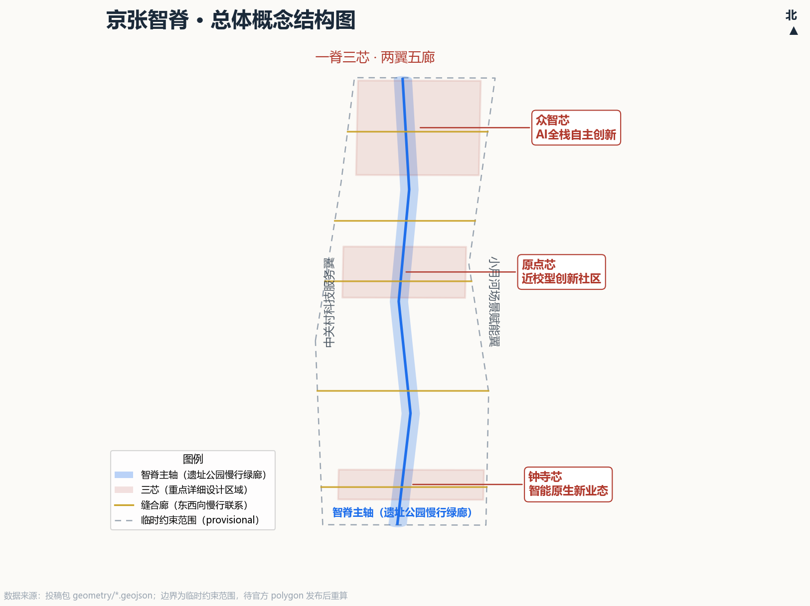
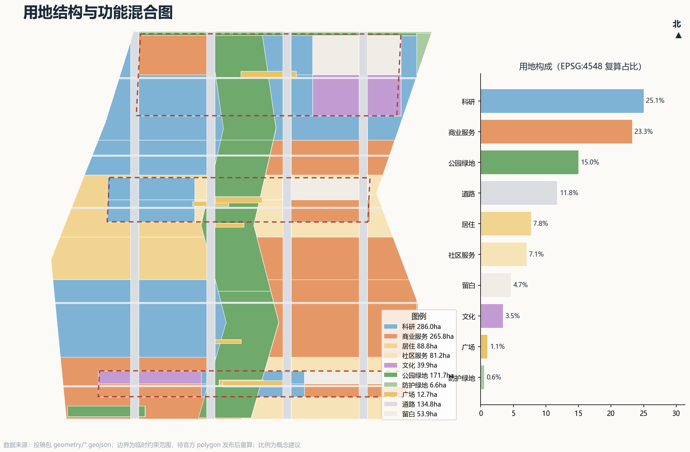
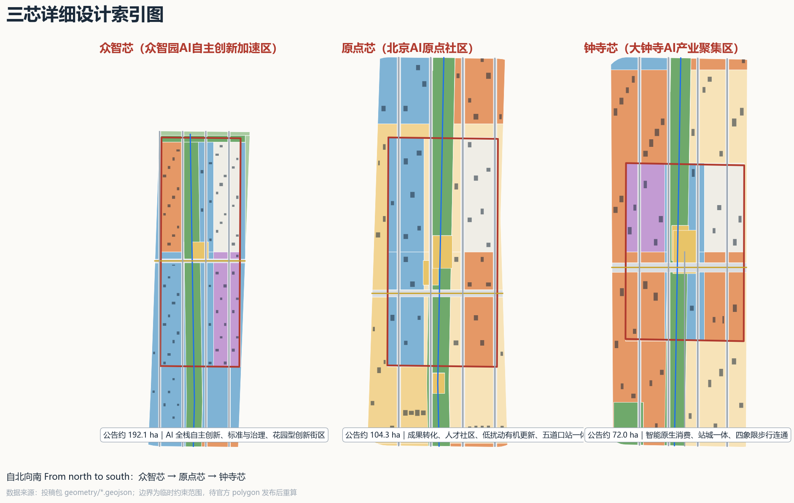
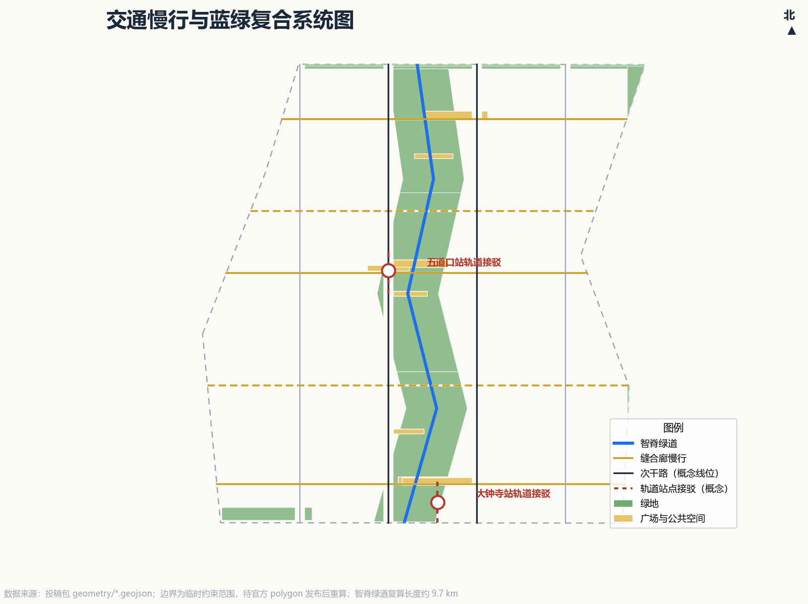
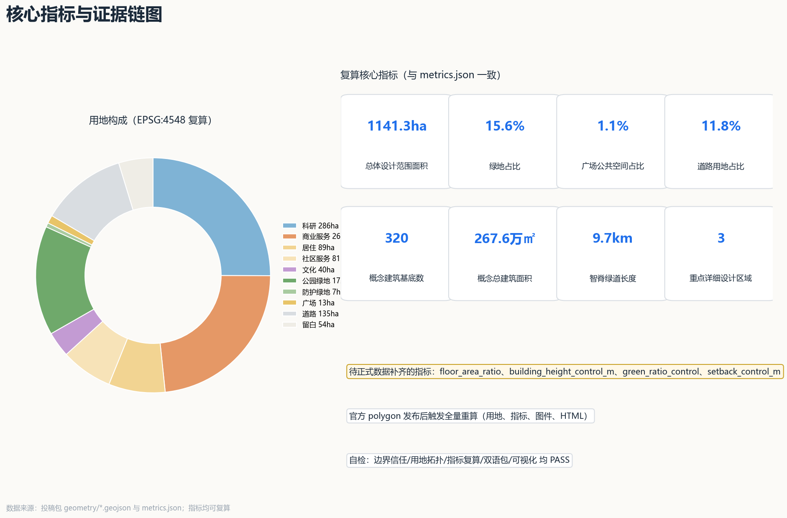

# Jing-Zhang AI Spine: Centennial Jing-Zhang AI Innovation Belt Urban Design Proposal

## Design Basis and Source List

This proposal is an open co-creation conceptual recommendation prepared for the International Open Call for Urban Design of the Centennial Jing-Zhang AI Innovation Belt; it does not replace formal planning and does not constitute a government-approved conclusion. The primary basis is the Prequalification Announcement issued by the Haidian Branch of the Beijing Municipal Commission of Planning and Natural Resources, which determines the project name, the three-level scope, the three key areas, the design tasks, and the deliverable context [standard:PROJECT-OFFICIAL-ANNOUNCEMENT]; the secondary basis is the open-source taskbook addressed to agents worldwide, which determines the three positioning statements, the five functions, the Three Zones and Two Wings, the six agent tasks, and the unified boundary terms [standard:PROJECT-AGENT-OPEN-CALL-TASKBOOK].

Before generation, we fully read the repository site package (taskbook excerpts, design tasks, permitted design space, enumerations, metric ranges, schema files), the public-source registry, and the processed fact pack [source:SITE-PACKAGE] [source:SOURCE-REGISTRY] [source:PROCESSED-FACT-PACK]. Material usage boundaries follow the registry: the announcement and the taskbook are the formal task basis; the provisional boundary is used only for generation, visualization, and provisional self-checks; public materials such as global cases serve as background experience only and do not support any spatial control conclusions.

The core data fact that must be frankly disclosed to reviewers is that, as of the generation of this proposal, the official precise boundary and the precise polygons of the three key areas have not yet been publicly released, and downloading the prequalification documents requires a password. This proposal adopts the provisional constraint provided by the repository maintainer as the generation basis [source:BOUNDARY-SOURCE] [source:KEY-AREA-SOURCE]; its deviation from the announced area ranges from 0.02% to 0.43%, but it is not the official boundary and cannot be used for approval, precise area determination, or statutory control. Once the official polygons are released, land use, metrics, drawings, and display pages will trigger a full recalculation as agreed [depth:metrics_recalculation].

All regulatory detailed planning conditions (floor area ratio, building height, building density, green space ratio, setback lines) are missing; this proposal uniformly writes them as "pending official data" and never disguises them as approved indicators. Existing buildings, ownership, heritage protection control lines, and municipal pipelines are handled in the same way. The complete gap list and recalculation trigger conditions are stored in `assumptions.json`, and the "Risk, Copyright, and Compliance" section of the main text provides a human-readable explanation.

## Three-Level Scope Framework

The proposal organizes its work according to the three levels determined by the announcement; the relationship among the three levels is a transmission chain of "strategy–structure–verification," rather than three isolated drawings [depth:three_level_scope_framework].

**Coordinated Research Area (approx. 43.6 km²)** serves strategic research only: it answers how Haidian's AI industry ecosystem is organized, the synergy loop of the "Three Zones and Two Wings," and the future urban form, without producing statutory layers. It determines the structural choices of the Overall Design Area.

**Overall Design Area (approx. 11.4 km²)** is the spatial layer where this proposal lands: bounded by the SITE-001 provisional constraint in the submitted `geometry/site_boundary.geojson`, the EPSG:4548 recalculated area is approximately 1,141.28 ha, broadly consistent with the announced approx. 11.4 km² [data:geometry/site_boundary.geojson#SITE-001] [metric:site_area_sqm]. At this layer, the land-use layout, conceptual building scale, transport and walking-cycling, blue-green and public space, renewal projects, and phasing are completed, reaching the urban design depth of regulatory detailed planning (control indicators are marked as pending because official conditions are missing).

**Key-Area Detailed Design Area (approx. 368.4 ha)** is the detailed design layer for the three key areas—Zhongzhi Core, AI Origin Core, and Dazhongsi Core—using the KEY-001/002/003 provisional constraints in `geometry/key_areas.geojson` as the working boundary [data:geometry/key_areas.geojson#KEY-001], reaching the urban design depth of an integrated planning implementation plan; however, all parcel-level conclusions are conceptual recommendations.

If the provisional boundary is replaced by the official polygons, the items requiring recalculation include: all land-use layers and areas, green space ratio and public space proportions, building footprints and conceptual gross floor area, road and walking-cycling lengths, phasing extents, and all drawings, A3/A0 sheets, and HTML display pages; it is not enough to replace only a single boundary file. This recalculation commitment is written into the self-check record as the credibility boundary of the proposal.

## Coordinated Research Area: Industry and Future City Research

### Overall Concept and Naming System (Response to agent.1)

We name this 43.6 km² innovation belt the **"Jing-Zhang AI Spine" (京张智脊)**. "Spine" carries three layers of meaning: it is the physical backbone left by the Jing-Zhang Railway, the spatial backbone linking the three major industry areas, and the spiritual backbone supporting a full-stack independent AI innovation system—the first trunk railway independently built by Chinese people in 1909, forming a centennial echo with today's self-controllable full-stack AI system on the same corridor. The naming system unfolds accordingly: one "Spine" main axis (The Spine) runs north–south; the three key areas are named Zhongzhi Core, AI Origin Core, and Dazhongsi Core; the east and west wings are the Zhongguancun Technology Services Wing and the Xiaoyue River Scenario Enablement Wing; the five east–west walking-cycling corridors are named "Stitch Corridors," which from north to south are the Qinghe AI Valley Corridor, the Zhongzhi Exchange Corridor, the AI Origin Scholarly Corridor, the Academy Innovation Corridor, and the Dazhongsi Vitality Corridor. The complete naming system is bilingual and systematic, and can be deepened by professional teams into a formal brand system [source:AGENT-TASKBOOK].

Logo and visual identity direction (conceptual recommendation): the core graphic is a gradual fusion of the triple imagery of "railway sleeper → data flow → neural synapse"; the primary colors are Jing-Zhang Railway heritage red (heritage red #B03A2E) and spine blue (spine blue #1F6FEB), supplemented by gold (#C9A227) for honor and contribution display; all fonts and graphics are original conceptual directions, and no unauthorized fonts, trademarks, or corporate identifiers are used. The visual system can extend into a complete identity system for wayfinding, scenario cards, event visuals, and exhibition boards.

### Three Positioning Statements, Five Functions, and the Synergy Loop

The proposal translates the three positioning statements—"centennial Jing-Zhang cultural belt, urban AI lifestyle experience belt, AI-integrated innovation belt"—into spatial mechanisms: the cultural belt lands on the Spine Exhibition Gallery and the narrative nodes of the three cores; the experience belt lands on the perceptible network formed by the five Stitch Corridors and the 12 scenario cards; the innovation belt lands on the mixed industry functions of the three cores and the service support of the two wings [depth:overall_spatial_structure]. The carrying relationships of the five functions are: the full-stack independent AI innovation system and global discourse power in AI governance mainly land on Zhongzhi Core; the world-class AI innovation ecosystem lands on AI Origin Core and the two wings; the new paradigm of AI-enabled scenario empowerment and the intelligent, vibrant AI city land on Dazhongsi Core, the Xiaoyue River Wing, and citywide scenario nodes.

The "Three Zones and Two Wings" synergy loop (conceptual recommendation): the west wing exports technology services, capital, and IP services to the three cores; the three cores export technological outcomes and scenario demands; the east wing converts scenario demands into public experiences and testing-verification, which then flow back as data and reputation assets; the Spine carries the physical connection of people flow, narrative, and brand. This loop is reflected in the land-use layout as follows: the west wing band is primarily research (0802), the east wing band is primarily commercial services and scenario space (05), and the three cores internally maintain a compound mix of research, commerce, culture, and strategic reserve [data:geometry/land_use.geojson#LU-001].

### Global AI Innovation Ecosystem Cases (Response to agent.2, Public Background Experience)

The following seven cases come from public materials and serve as experiential references only; they do not support any spatial control conclusions. The detailed sources and usage restrictions of the cases are registered in `sources.json` and `assumptions.json` (A-CASE-001).

| Case | Transferable mechanism | Application in this proposal |
| --- | --- | --- |
| Silicon Valley / Stanford ecosystem | Long-cycle network of university incubation + venture capital + open-source culture | "Campus–park–neighborhood" integration in AI Origin Core and open-source community clusters |
| Kendall Square (MIT) | University–industry symbiosis, the shortest path from laboratory to enterprise | Spatial adjacency of technology-transfer areas and incubation/acceleration clusters |
| Toronto MaRS + Vector | Medical-engineering crossover, city-level open testing scenarios | AI+ healthcare navigation scenario card and the scenario access mechanism of the Xiaoyue River Wing |
| London King's Cross Knowledge Quarter | Heritage building renewal carrying knowledge industries | Cultural reuse of the Jing-Zhang heritage corridor and the Qinghuayuan Station heritage site |
| Tel Aviv startup ecosystem | High-density startups and international talent communities | Talent apartments, international community events, and developer community operations |
| Singapore one-north / Punggol Digital District | Government-led scenario sandbox and digital twin testing | Sandbox mechanism for the three industry testing-verification scenarios (TVS) |
| Montreal Mila | Research-institution brand driving urban AI identity | AI pilgrimage landmarks and the "Open-Source Starlight Wall" honor system |

Future urban form assessment: a district in the AI era is not "a city with more screens," but a city "whose services can be reorganized by agents, whose spaces can be reserved by scenarios, and whose governance can be verified by the public." Accordingly, this proposal puts forward the spatial operation concept of a "scenario registration system": public spaces, testing corridors, and display nodes are all registered as scenario resources that can be reserved, audited, and exited, with human review as the default prerequisite [source:AGENT-TASKBOOK].

## Overall Design Area: Urban Renewal and Regulatory-Plan-Level Urban Design

The spatial structure of the Overall Design Area is summarized as **"one spine, three cores, two wings, five corridors, and citywide scenarios"** [depth:land_use_layout]:

- **One spine**: the Spine main axis—a north–south park and walking-cycling green spine along the Jing-Zhang heritage corridor, with a recalculated length of approximately 9.67 km [metric:heritage_spine_greenway_length_m], divided into three themed park segments—Dazhongsi Segment, AI Origin Segment, and Zhongzhi Segment—serving as a composite corridor for walking-cycling, cultural display, and AI scenario experiences.
- **Three cores**: Zhongzhi Core, AI Origin Core, and Dazhongsi Core, carrying the main industry functions, internally organized as a compound of "research + commerce + culture + strategic reserve."
- **Two wings**: the west wing carries the service functions spilling over from Zhongguancun through research and technology-service clusters; the east wing carries the public experience functions along the Xiaoyue River through commercial services and scenario space.
- **Five corridors**: five east–west Stitch Corridors re-stitch the east and west sides cut apart by the railway and expressways and connect them into the Spine.
- **Citywide scenarios**: plazas, waystations, and station-front nodes form a scenario node network, one-to-one corresponding to the 12 scenario cards.

Land-use structure (conceptual recommendation, EPSG:4548 recalculation): research land approx. 286.0 ha (25.1%), commercial services approx. 265.8 ha (23.3%), residential and community services approx. 170.0 ha (14.9%), green space approx. 178.3 ha (15.6%), roads approx. 134.8 ha (11.8%), plazas approx. 12.7 ha (1.1%), culture approx. 39.9 ha (3.5%), and strategic reserve approx. 53.9 ha (4.7%) [metric:land_use_0802_sqm] [metric:green_ratio] [metric:road_ratio]. The design implications of this structure are: research and commercial services form the main body carrying the AI industry; continuous green space and corridors support the daily life of talent; strategic reserve responds to the uncertainty of rapid industrial iteration. The relatively low residential share is a deliberate conceptual choice—this area is an industry corridor rather than a new residential town, with housing mainly provided through talent communities and the renewal of existing communities; the precise balance awaits verification with official population and housing data.

Overall urban renewal framework (conceptual recommendation): dominated by the graded "retain–renovate–demolish" renewal and warning against large-scale demolition and construction—the industrial and railway heritage spaces along the Spine are retained and renovated into cultural and display functions; inefficient industrial parks are renewed into AI R&D and incubation spaces; station-city integrated functional infill is carried out around stations such as Wudaokou and Dazhongsi. At the building level, the proposal generated 320 conceptual building footprints for scale estimation, of which approx. 45% new construction, approx. 35% renovation, approx. 15% retention, and approx. 5% recommended demolition (conceptual proportions only, to be reviewed building by building after existing-building and ownership data are filled in) [metric:building_count] [depth:retain_renovate_demolish].

Development intensity note: official control conditions—floor area ratio, building height, building density, green space ratio, setback lines—are all missing, and this proposal gives no statutory intensity conclusions; the conceptual gross floor area of approx. 2.676 million m² is used only to discuss the order of magnitude of spatial supply, derived from conceptual footprints and conceptual floor counts, for professional teams to deepen and verify under formal regulatory conditions [metric:concept_gross_floor_area_sqm].

Jing-Zhang Heritage Park vitality belt: the proposal upgrades the park from "a green belt" to "the public living room of the innovation belt"—the three park segments respectively implant the functions of display (south segment: AI-native consumer display), exchange (middle segment: Wudaokou academic and developer exchange), and experimentation (north segment: Qinghe green-technology experimentation); the north–south through greenway resolves the walking-cycling gaps of the heritage corridor, and the five Stitch Corridors resolve east–west connectivity; conceptual positions for iconic urban landscape nodes are reserved at the north and south ends and at nodes crossing the ring roads. All the above nodes are conceptual recommendations and do not involve conclusions on the engineering feasibility of bridges or tunnels [depth:blue_green_public_space].

Urban character keynote: with "heritage red × spine blue" as the color keynote, the heritage segment preserves the material authenticity of industrial remains, and the new construction areas of the three cores take medium height, human scale, and unified rooftop fifth facades as conceptual guidance directions; specific heights, massing, and color zoning await formal regulatory plan and urban design guideline data [standard:MOHURD-URBAN-DESIGN-MEASURES].

## Detailed Design of Key Areas

The three key areas use the KEY-001/002/003 provisional constraints in `geometry/key_areas.geojson` as the working boundary; the announced areas are approx. 192.1 / 104.3 / 72.0 ha, and the provisional-polygon recalculated values are approx. 192.9 / 104.3 / 72.0 ha, with a deviation within 0.43% [metric:key_area_zhongzhiyuan_sqm]. All area-level conclusions are conceptual recommendations, pending re-verification after the official key-area polygons are released [depth:three_key_area_detailed_design].

**Zhongzhi Core (Zhongzhiyuan AI Independent Innovation Acceleration Area, KEY-001)** [data:geometry/key_areas.geojson#KEY-001]: the source of the full-stack independent AI innovation system. Conceptual land-use composition (recalculated on the provisional constraint boundary, ~192.9 ha):

| Function | Area | Share |
| --- | ---: | ---: |
| Research (0802) | 50.2 ha | 26.0% |
| Park green (1401) | 37.5 ha | 19.5% |
| Reserve (16) | 28.0 ha | 14.5% |
| Culture (0803) | 27.5 ha | 14.3% |
| Commercial (05) | 23.9 ha | 12.4% |
| Roads (1207) | 22.0 ha | 11.4% |
| Plazas (1403) | 3.8 ha | 2.0% |

The conceptual spatial organization is "one core, one axis, two belts": the core area carries national strategic scientific and technological forces and open innovation platforms; the main axis links the R&D clusters; the two belts carry supporting functions and ecology. The ~14.5% strategic reserve is an intentional flexibility buffer — full-stack AI technology and national platform needs iterate rapidly, so the reserve keeps room for uncertainty and is activated only after platform needs are clarified, avoiding lock-in by short-term development. All parcel-level recommendations are conceptual recommendations [depth:three_key_area_detailed_design].

**AI Origin Core (Beijing AI Origin Community, KEY-002)** [data:geometry/key_areas.geojson#KEY-002]: centered on the Qinghuayuan Station heritage site and the Wudaokou area. Conceptual land-use composition (~104.3 ha):

| Function | Area | Share |
| --- | ---: | ---: |
| Research (0802) | 30.2 ha | 29.0% |
| Roads (1207) | 16.2 ha | 15.5% |
| Park green (1401) | 14.8 ha | 14.1% |
| Reserve (16) | 14.0 ha | 13.5% |
| Commercial (05) | 13.1 ha | 12.5% |
| Community service (0702) | 12.3 ha | 11.8% |
| Plazas (1403) | 3.7 ha | 3.6% |

Conceptually organized as "one axis, one core, two areas": the Spine cultural axis, the AI Origin exchange core, the academy area, and the commercial area, emphasizing "campus–park–neighborhood" integration and an open-source cultural community. The reserve serves as a flexible buffer for the talent community and campus, filled progressively as tech-transfer proceeds.

**Dazhongsi Core (Dazhongsi AI Industry Cluster, KEY-003)** [data:geometry/key_areas.geojson#KEY-003]: organized around Dazhongsi Station as a station-city integrated renewal. Conceptual land-use composition (~72.0 ha):

| Function | Area | Share |
| --- | ---: | ---: |
| Commercial (05) | 19.6 ha | 27.3% |
| Roads (1207) | 11.3 ha | 15.6% |
| Culture (0803) | 11.1 ha | 15.4% |
| Reserve (16) | 11.0 ha | 15.2% |
| Park green (1401) | 8.1 ha | 11.2% |
| Research (0802) | 7.9 ha | 11.0% |
| Plazas (1403) | 3.1 ha | 4.4% |
| Community service (0702) | 0.0 ha | 0.0% |

Conceptually structured as "one station, one street, one plaza": a station-city integrated hub, an AI-native consumer street, and a four-quadrant plaza, emphasizing AI+ consumption and public experience. The reserve provides room for trial and error of AI-native new business forms. Community service land is intentionally 0% — as a pure urban industrial district, daily talent services are carried by the Origin Core and surrounding existing communities; this core focuses on commercial, cultural, and R&D functions to avoid diluting industrial concentration.

## AI Innovation Ecosystem, Personas, and AI+ Scenarios

### Personas (Six Types)

Around the three positioning statements—"full-stack independent AI innovation system, world-class AI innovation ecosystem, and global discourse power in AI governance"—the proposal defines six core user personas:

1. **AI research talent**: seeking the fastest path from laboratory to market, academic exchange, and open-source collaboration; preferring high-density mixed environments and green walking-cycling.
2. **Entrepreneurs and developers**: needing low-cost trial-and-error space, scenario testing entry points, and community support; preferring flexible offices and shared facilities.
3. **Enterprise service professionals**: providing legal, financial, tax, IP, human resources, and capital services; needing convenient commuting and professional service clusters.
4. **Urban residents and consumers**: experiencing AI products and services; needing accessible, safe, and understandable public spaces.
5. **International visitors and talent**: needing bilingual wayfinding, an international community, and international events to strengthen the "AI capital" city brand.
6. **Government and public sector**: needing scenario supervision tools, public data interfaces, and decision support; human review is the default prerequisite.

### AI Scenario Cards (12 Cards; ★ Denotes Industry Testing-Validation Scenarios)

Each scenario card is written in a deployable structure of "can start, can stop, can review": the location is anchored to a submission geometry feature, with operator, entry conditions (readiness card), minimal viable baseline, stop conditions, human fallback, and review evidence. All baselines are conceptual design values for professional teams to deepen; they do not represent pilot authorization or completed field validation [source:AGENT-TASKBOOK].

**★TVS-1 Spine low-speed robot delivery test corridor** | Anchor: full spine greenway [data:geometry/roads.geojson#RD-001]
- Users: robot firms, park users. Data boundary: public road data and authorized test data; no face capture.
- Operator: scenario-registry platform operator (conceptual recommendation).
- Entry conditions: test-section ownership and safety assessment complete, public notice period elapsed, insurance and emergency plan filed.
- Minimal viable baseline: a single ~500 m segment, no more than 2 low-speed units, speed capped at 15 km/h, 30 consecutive days without injury events.
- Stop conditions: any personal injury, complaints above threshold, or anomalous sensing data triggers an immediate line halt and re-inspection.
- Human fallback: remote safety officer one-click emergency stop; on-site patrol arrives within a set time.
- Review evidence: operation logs, incident records, and monthly public summaries.

**★TVS-2 AI+traffic walking-cycling evaluation and signal sandbox** | Anchor: five stitch corridors and station links [data:geometry/roads.geojson#RD-002]
- Users: commuters, transport researchers. Data boundary: public flow data and anonymized counts.
- Operator: transport research team in coordination with the district transport authority (conceptual recommendation).
- Entry conditions: evaluation metrics and collection plan approved by transport and planning professionals; evaluation only, no direct signal control.
- Minimal viable baseline: one stitch corridor, one full signal-cycle working day, anonymized sample size meeting statistical significance.
- Stop conditions: no recommendation is implemented without human review; any safety challenge halts the evaluation.
- Human fallback: signal timing is finally confirmed by a traffic engineer.
- Review evidence: evaluation report, before/after data, and signed review records.

**★TVS-3 Dazhongsi AI-native commerce A/B test field** | Anchor: Dazhongsi AI-native consumption zone [data:geometry/land_use.geojson#LU-037]
- Users: merchants, consumers. Data boundary: desensitized transactions, explicit consent, opt-out anytime.
- Operator: merchant alliance with the scenario-registry platform (conceptual recommendation).
- Entry conditions: merchants voluntarily sign up, consumer-rights fallback in place, test rules published.
- Minimal viable baseline: no more than 10 merchants, a single test group runs no more than 4 weeks, with a control group.
- Stop conditions: price discrimination, misleading recommendations, or concentrated complaints stop the test group.
- Human fallback: human customer service and no-questions opt-out channel.
- Review evidence: test design document, desensitized result dataset, and merchant review minutes.

**SC-04 AI guide & cultural narrative** | Anchor: Spine gallery, Qinghuayuan Station site [data:geometry/green_space.geojson#GR-006]
- Users: visitors, students. Data boundary: public historical materials and human-curated texts.
- Operator: cultural operation team (conceptual recommendation).
- Entry conditions: guide content passes triple human review — culture, copyright, and facts.
- Minimal viable baseline: a single gallery segment, bilingual versions, fact-check records archived.
- Stop conditions: any factual error or copyright challenge takes the content offline for revision.
- Human fallback: curator final sign-off; public correction channel.
- Review evidence: content version records and check sign-offs.

**SC-05 AI+healthcare service navigation** | Anchor: community service clusters [data:geometry/land_use.geojson#LU-032]
- Users: residents, park youth. Data boundary: public service directory only; no personal health data.
- Operator: community service operator (conceptual recommendation).
- Entry conditions: content reviewed by medical and legal professionals, explicitly "navigation only, no diagnosis."
- Minimal viable baseline: a single community node, directory coverage and accuracy spot-checked by humans.
- Stop conditions: any out-of-scope advice or stale information suspends the service.
- Human fallback: staffed service window retained in parallel.
- Review evidence: spot-check records and update logs.

**SC-06 Enterprise service Copilot** | Anchor: two-wing tech-service nodes [data:geometry/land_use.geojson#LU-060]
- Users: enterprises, developers. Data boundary: public policy and service directory.
- Operator: tech-service operation team (conceptual recommendation).
- Entry conditions: policy-interpretation disclaimer and human consulting channel in place.
- Minimal viable baseline: a single service node, Q&A accuracy spot-checked to standard.
- Stop conditions: any policy interpretation proven misleading is corrected and disclosed.
- Human fallback: professional human consulting channel.
- Review evidence: Q&A spot-check records and correction logs.

**SC-07 Public safety & event operation review** | Anchor: large-event and night scenario nodes [data:geometry/public_space.geojson#PS-001]
- Users: operators, public. Data boundary: anonymized crowd heat only.
- Operator: event operation and safety team (conceptual recommendation).
- Entry conditions: safety plan approved by humans; AI only flags, never decides on response.
- Minimal viable baseline: a single event, flagging accuracy and false-positive rate evaluated by humans.
- Stop conditions: excessive false positives or a missed critical risk reverts to fully manual mode.
- Human fallback: safety conclusions must be human-confirmed.
- Review evidence: event review reports and response records.

**SC-08 AI+education: campus-park open classroom** | Anchor: Origin Core campus-integration cluster [data:geometry/land_use.geojson#LU-035]
- Users: students, public. Data boundary: public course resources.
- Operator: university-park co-building team (conceptual recommendation).
- Entry conditions: course content reviewed by educational institutions.
- Minimal viable baseline: a single pilot course, learning-feedback questionnaires.
- Stop conditions: substantiated content-quality complaints take the course offline for revision.
- Human fallback: the instructor is responsible throughout.
- Review evidence: course evaluation and feedback summaries.

**SC-09 AI+legal: IP quick-service waystation** | Anchor: west-wing tech-service cluster [data:geometry/land_use.geojson#LU-063]
- Users: startups. Data boundary: public statutes and case base.
- Operator: IP service institution (conceptual recommendation).
- Entry conditions: clear "preliminary navigation, not formal legal advice" labeling.
- Minimal viable baseline: a single waystation, navigation accuracy spot-checked.
- Stop conditions: any navigation result proven misleading suspends the service for revision.
- Human fallback: lawyers issue formal opinions.
- Review evidence: service records and spot-check reports.

**SC-10 AI+living: talent-community one-stop assistant** | Anchor: Origin Core talent community [data:geometry/land_use.geojson#LU-032]
- Users: young talent. Data boundary: minimal collection, local processing.
- Operator: community operator (conceptual recommendation).
- Entry conditions: privacy impact assessment completed and published.
- Minimal viable baseline: a single community, service-item coverage list.
- Stop conditions: substantiated privacy complaints disable the related function.
- Human fallback: community operator fallback.
- Review evidence: privacy assessment report and complaint-handling records.

**SC-11 AI+public space: Spine night light & safety companion** | Anchor: three Spine waystations [data:geometry/public_space.geojson#PS-007]
- Users: night users. Data boundary: presence sensing only; no face recognition.
- Operator: night operation team (conceptual recommendation).
- Entry conditions: lighting environment and safety plan approved by humans.
- Minimal viable baseline: a single waystation, one night time window.
- Stop conditions: nuisance complaints or safety events trigger adjustment or shutdown.
- Human fallback: night operation team on duty.
- Review evidence: duty logs and incident records.

**SC-12 AI governance sandbox: algorithm disclosure & citizen review pavilion** | Anchor: Zhongzhiyuan standards & governance zone [data:geometry/land_use.geojson#LU-026]
- Users: public, governance researchers. Data boundary: all disclosure materials public.
- Operator: governance committee (conceptual recommendation).
- Entry conditions: review rules and agenda formed by the committee.
- Minimal viable baseline: a single review topic, public participation records.
- Stop conditions: any topic involving non-public data or privacy is withdrawn.
- Human fallback: review conclusions formed by the governance committee.
- Review evidence: review minutes publicly archived.

Scenario-space-operation mapping: the 12 cards correspond one-to-one with spatial anchors, operators, entry conditions, and stop conditions, forming the minimal closed loop of the "scenario registration system" — register first, then start, stoppable, with evidence retained. This moves scenarios from "displayable" toward "field-verifiable," while keeping human review as the default precondition [depth:overall_spatial_structure].

## Land Use, Building Scale, and Retain-Renovate-Demolish Strategy

Land-use plan (conceptual recommendation): expressed in `geometry/land_use.geojson` [data:geometry/land_use.geojson#LU-001], organized by the 2023 national land-use classification guide; within the three cores, research (0802) and commercial services (05) dominate, supplemented by culture (0803), green space (1401), and strategic reserve (1601), with the two wings respectively carrying research and commercial services; the land-use category codes are for conceptual expression only, and the formal classification follows the official definition [data:geometry/land_use.geojson#LU-002] [metric:land_use_0802_sqm].

Building scale (conceptual recommendation): 320 conceptual building footprints, a conceptual gross floor area of approx. 2.676 million m², and a conceptual building coverage ratio of approx. 2.1% (footprints relative to the full scope, including large green and road areas; not a regulatory density), all derived from conceptual footprints and conceptual floor counts for order-of-magnitude discussion; they do not constitute statutory intensity recommendations [metric:building_footprint_area_sqm] [metric:concept_gross_floor_area_sqm] [metric:building_coverage_ratio_concept].

Retain-renovate-demolish plan (conceptual recommendation): approx. 45% new construction, approx. 35% renovation, approx. 15% retention, and approx. 5% recommended demolition; within the key areas, retain-renovate-demolish follows the principle of "retain whenever possible, renovate instead of demolish," and all conclusions will be reviewed building by building after existing-building and ownership data are filled in [depth:retain_renovate_demolish].

## Transport, Rail, Municipal Infrastructure, and Public Services

Transport organization (conceptual recommendation): with the principles of "Spine walking-cycling priority, east–west stitching, and station integration," a walking-cycling skeleton of "one spine, five corridors, multi-station coordination" is built; the five Stitch Corridors and the Spine together form a continuous walking-cycling network, with station-front plazas as walking-cycling transfer nodes [depth:traffic_rail_slow_parking] [data:geometry/roads.geojson#RD-001].

Rail and stations (conceptual recommendation): rail transit stations along the corridor (Dazhongsi, Wudaokou, and Qinghua East Road West Entrance area) are organized under the station-integration principle, with station-front space reserving feeder connections, non-motorized vehicle parking, and scenario nodes; specific alignments and station schemes follow official planning [depth:traffic_rail_slow_parking].

Municipal infrastructure and public services (conceptual recommendation): municipal pipelines for water supply, drainage, power, gas, and communications follow the principle of "laying along roads with reserved interfaces"; public service facilities (education, healthcare, culture, sports) are configured according to walking accessibility and community needs, with specific scales and sites pending official special-planning data [depth:municipal_new_infrastructure].

## Blue-Green Network, Public Space, and Urban Character

Blue-green space (conceptual recommendation): with the Spine park belt as the backbone, the Xiaoyue River as the water vein, and community parks and pocket parks along the corridor as supplements, a "one spine, one waterway, multiple parks" blue-green network is formed; the green space ratio of approx. 15.6% is a conceptual value, to be re-verified after formal green space ratio control conditions are filled in [metric:green_space_area_sqm] [metric:green_ratio]. The plaza and public-space system is registered in the public-space layer and metrics [metric:public_space_ratio], with the Qinghe and Xiaoyue River water veins shown as background context lines [data:geometry/constraints.geojson#CT-006] [depth:blue_green_public_space].

Public space (conceptual recommendation): plazas, waystations, and station-front nodes are organized under the "scenario registration system," with all public spaces registered as scenario resources that can be reserved, audited, and exited; accessibility and age-friendly design run through all public spaces [source:AGENT-TASKBOOK].

Urban character (conceptual recommendation): with "heritage red × spine blue" as the keynote, the Jing-Zhang heritage corridor preserves historical memory and the display of industrial remains; new buildings along the corridor are controlled in massing and harmonized in character; the wayfinding system is bilingual, accessible, and modular [standard:MOHURD-URBAN-DESIGN-MEASURES].

### AI Pilgrimage Landmarks and Honor Display System (Response to agent.4, Conceptual Recommendation)

- **L1 AI Origin Beacon (Origin Beacon)**: located near the Qinghuayuan Station heritage site in AI Origin Core, with the conceptual intent of an "axis of light," serving as the intersection landmark of the centennial Jing-Zhang narrative and AI innovation; conceptual recommendation [source:AGENT-TASKBOOK].
- **L2 Spine Halo (Spine Halo)**: located in the middle segment of the Spine (near Wudaokou), a ring-shaped observation platform overlooking the Spine greenway and the city; conceptual recommendation.
- **L3 Dazhongsi AI Bazaar (Dazhongsi AI Bazaar)**: located at the four-quadrant plaza of Dazhongsi Core, functionally positioned as "AI-native consumption + public experience"; conceptual recommendation.
- **Honor display system "Open-Source Starlight Wall"**: the names of open-source contributors are inscribed in the public space of the Spine, forming an honor system of "code as inscription"; the inscription locations and forms await consultation with the heritage protection, property rights, and public art committees [source:AGENT-TASKBOOK].
- **Public space component library**: provides "installable, relocatable, replaceable" conceptual component design directions for the pilgrimage landmarks and waystations, for subsequent professional deepening.

All landmarks and components are conceptual recommendations and do not involve heritage-protection renovation conclusions or engineering feasibility; visual elements do not use any unauthorized materials [source:AGENT-TASKBOOK].

### Cultural Narrative (Response to agent.5)

The narrative mainline "from steam to intelligence": starting from the "steam era" of the Jing-Zhang Railway, passing through the "electrification era" (the electrification renovation of the Jing-Zhang Railway and the relocation of Qinghuayuan Station) to the "intelligence era" (the AI innovation belt), forming a three-act narrative structure of a century of continuity; the three sub-lines are the "lineage of strivers," the "lineage of engineering marvels," and the "lineage of future imagination."

## Renewal Projects, Implementation Policy, and Phasing

Renewal project list (conceptual recommendations, mapped to `geometry/phasing.geojson`):

| Project | Type | Location | Phase | Preconditions |
| --- | --- | --- | --- | --- |
| Spine greenway connection | Public space | Full spine | Near term | Heritage park boundary confirmation |
| Dazhongsi Station four-quadrant plaza | Station-city integration | South Dazhongsi Core | Near term | Station data and ownership confirmation |
| AI-native consumption pilot zone | Industry renewal | Dazhongsi Core | Near term | Merchant participation and scenario registration |
| Wudaokou Academic Living Room | Station-city integration | Origin Core | Mid term | University co-building mechanism |
| Open-source community cluster renewal | Industry renewal | Origin Core | Mid term | Community co-governance |
| Origin Scholarly Corridor | Slow corridor | SC-3 | Mid term | Campus boundary coordination |
| Zhongzhiyuan innovation service core | Industry renewal | Zhongzhiyuan Core | Long term | National platform needs clarified |
| Qinghe waterfront park upgrade | Blue-green space | North edge | Long term | Blue-line and heritage data pending |
| Two-wing service cluster infill | Functional infill | East and west wings | Long term | Industry demand assessment |

Phasing (conceptual arrangement, not an implementation commitment): near term 2026–2028 led by Dazhongsi Core and the south spine segment (~448.0 ha); mid term 2028–2030 linking Origin Core and the middle spine (~381.5 ha); long term 2030–2035 completing Zhongzhiyuan Core and the two wings (~311.8 ha) [metric:phase_1_area_sqm] [depth:phasing_implementation].

Implementation policy suggestions (conceptual): scenario registration system, public holding of reserve space, incentives for incremental renewal, and front-loaded public participation. Public participation mechanism: before each phase starts, set up public notice and review sessions with both review pavilions and online channels.

### Global AI Event System and Long-Term Operation (Response to agent.6, conceptual recommendations)

Annual event system: **Jing-Zhang AI Innovation Summit** (spring, releases and exchange), **Spine Developer Fest** (summer, hackathon and open-source fair), **Scenario Open Call** (autumn, public solicitation and review of scenario cards), and **Open-Source Starlight Night** (winter, honor-wall inscription and annual review). The event brand follows the "heritage red × spine blue" visual system; the developer community "Spine Workshop" operates on an open-source project basis; scenario open operation uses a "scenario registration + sandbox license" mechanism for access and exit; international communication invites global developers through the "Spine Fellowship"; the conversion pathway is a funnel of "event participation → scenario testing → registered settlement → community contribution" — all written as operational mechanism design rather than commitments [source:AGENT-TASKBOOK].

## Metrics, Area Recalculation, and Compliance Matrix

Every core metric of this proposal can be recalculated from `geometry/*.geojson` under EPSG:4548; formulas, source files, and confidence levels are fully recorded in `metrics.json` [depth:metrics_recalculation]:

- **Scope metrics**: the Overall Design Area is ~1141.28 hectares (recalculated on the provisional constraint boundary); the three key areas recalculate to ~192.9 / 104.3 / 72.0 hectares, within 0.5% of the announced values [metric:site_area_sqm].
- **Structure metrics**: green ratio ~15.6%, road land ratio ~11.8%, plaza public-space ratio ~1.1% — green space supports talent daily life and innovation encounters; the corridor ratio reflects the "slow-mobility first" structural choice; substantial public activity space inside the parks is not double-counted as plaza land [metric:green_ratio].
- **Scale metrics**: conceptual building footprints total ~243,000 sqm across 320 buildings, with a conceptual gross floor area of ~2.676 million sqm, all labeled as conceptual recommendations [metric:building_footprint_area_sqm].
- **Pending metrics**: floor area ratio, building height control, green ratio control, and setback control are all "pending official data," registered in `metrics.json` with unknown status and reasons, and never rendered as numbers.

Compliance matrix coverage: the 17 announcement tasks in sections 1.3/1.4/1.5 and the six agent taskbook items agent.1–agent.6 — 23 in total — are all registered in `compliance_matrix.json`, each mapped to chapters, layers, metrics, drawings, visual sections, sources, assumptions, and self-check items; responses to the 5 mandatory professional standards and the 15 design-depth items are registered in `standard_matrix.json` and `design_depth_matrix.json` (all depth items complete).

## Risk, Copyright, and Compliance

**Data and precision risks**: official precise boundaries, the three key-area polygons, regulatory planning controls, existing buildings, ownership, heritage control lines, municipal utilities, and traffic cross-sections are all missing; the proposal is generated on a provisional constraint boundary, and all spatial conclusions are conceptual recommendations [source:BOUNDARY-SOURCE]. Once official data is released, a full recalculation will be triggered; the recalculation list is in the "Three-Level Scope Framework" chapter.

**Independent OSM cross-check (2026-08-11)**: we ran a reproducible deviation check of the provisional boundary against public Overpass data [source:OSM-CROSSCHECK-20260811]. Findings: the OSM-mapped Jing-Zhang Railway Heritage Park (~13.86 ha) does not intersect the submitted Overall Design Area (SITE-001), with a nearest distance of ~412.5 m; it is ~1051.6 m from this proposal's Spine greenway (RD-001); Dazhongsi Station lies ~82 m outside SITE-001 and ~1733 m from the Dazhongsi Core (KEY-003) centroid; Wudaokou Station is ~880 m from the Origin Core (KEY-002) centroid. This means the "Spine follows the heritage corridor" and "core-station" spatial relationships are conceptual layouts under the provisional constraint boundary, with kilometre-level deviation from public reality, to be fully replaced and recalculated once official polygons are released. This check is consistent with the independent community findings in Issues #846 and #1029; OSM crowdsourced data may itself be incomplete, and this check only discloses deviation without upgrading either side to a formal basis [source:OSM-CROSSCHECK-20260811].

**Copyright and clearance**: all text, figures, drawings, and code of this proposal are generated by the Tokeny AI agent based on public or rights-cleared materials; no unauthorized fonts, images, trademarks, portraits, or corporate logos are used; the build toolchain (shapely/pyproj/matplotlib/reportlab) is open-source software with licenses recorded in `report/copyright_statement.md`. The proposal is submitted under the COMMUNITY-DISPLAY-ONLY license for review and public display.

**Compliance boundaries**: this proposal is an open co-creation conceptual recommendation; it does not replace formal planning and does not constitute a government approval conclusion; it contains no statutory conclusions on regulatory plan adjustments, parcel-level demolish-renovate-retain decisions, engineering alignments, investment estimates, or approval judgments; all events, investment attraction, policy, and operation arrangements are mechanism design suggestions. The AI-generated content has passed structured self-checks (7 PASS), but final judgment should be made by humans and professional teams [standard:GENERATIVE-AI-INTERIM-MEASURES]. Accessibility and elderly-friendly scenarios are cited strictly within the service scopes enumerated by the relevant laws [standard:BARRIER-FREE-ENVIRONMENT-LAW].

**Professional review needs**: land-use layout, traffic organization, municipal capacity, and heritage coordination all require review by licensed professional teams under formal data conditions; the greatest value of this proposal is its structural choices, scenario system, and traceable evidence chain.

## References

The following is the human-readable bibliography of the main reference materials; the complete machine-readable index and use boundaries are governed by `sources.json` [source:SITE-PACKAGE].

1. Beijing Municipal Commission of Planning and Natural Resources, Haidian Branch: Pre-qualification Announcement of the Centennial Jing-Zhang AI Innovation Belt International Urban Design Call, 2026-05-09.
2. Agent Open-Call Taskbook Excerpt for the Centennial Jing-Zhang AI Innovation Belt (user-provided rights-cleared), 2026-05-18.
3. Beijing Municipal Science & Technology Commission and Zhongguancun Administrative Committee: "Three Zones and Two Wings" for a World-Class AI Cluster, 2026-04-03 (background).
4. Haidian District People's Government: "1+X+1" Modern Industrial System Layout, 2026-03-02 (background).
5. Ministry of Housing and Urban-Rural Development: Urban Design Management Measures, 2017.
6. Ministry of Housing and Urban-Rural Development: Measures for the Preparation and Approval of Regulatory Detailed Planning of Cities and Towns.
7. Ministry of Natural Resources: Guide to Land Use and Sea Use Classification for Territorial Spatial Survey, Planning and Use Control, 2023.
8. Repository maintainers: Provisional rough boundaries and derivation basis for the Centennial Jing-Zhang AI Innovation Belt, 2026-06-05 (provisional constraint).
9. Public materials on global AI innovation ecosystems (Silicon Valley, Kendall Square, Toronto, King's Cross London, Tel Aviv, Singapore, Montreal; background experience only).
