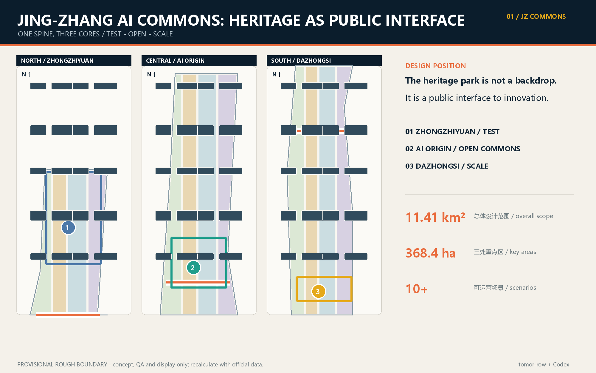
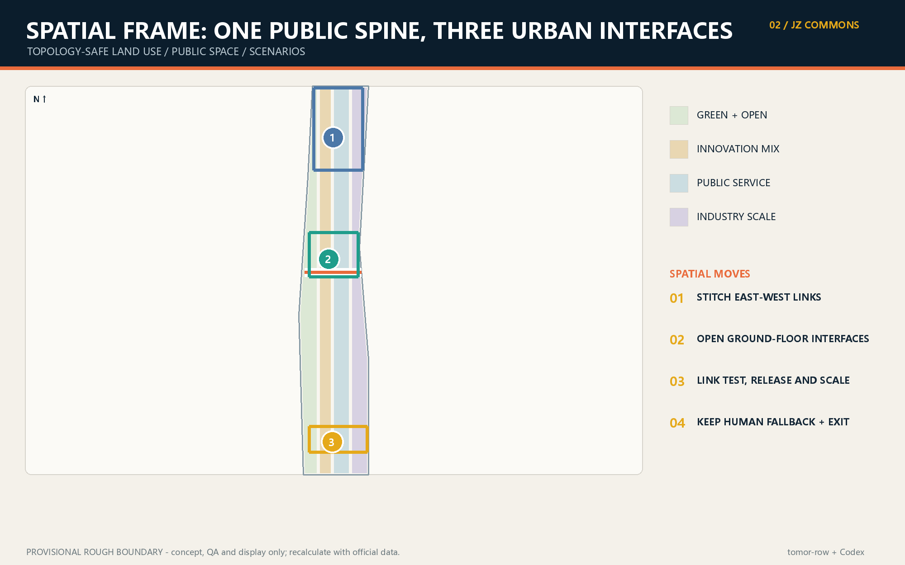
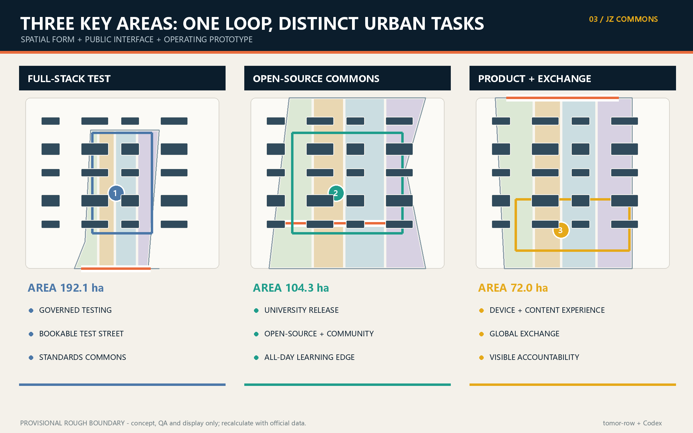
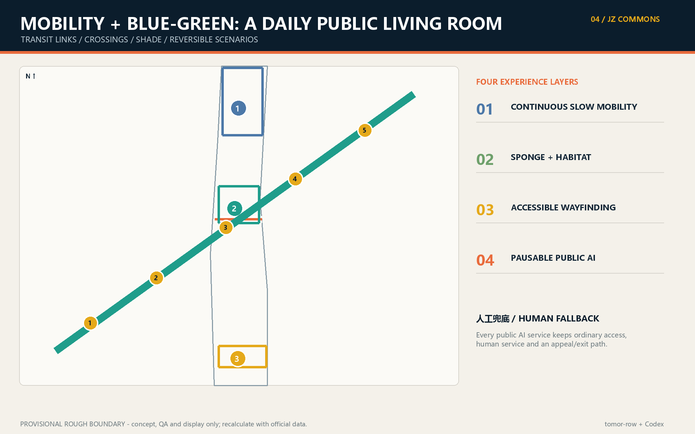

# Jing-Zhang AI Commons: A Verifiable Public Innovation Belt

> **Design judgment.** The Jing-Zhang heritage park becomes a daily public innovation interface rather than a backdrop between compounds. Zhongzhiyuan hosts full-stack testing; the AI Origin Community connects universities, open source and neighborhood services; Dazhongsi translates prototypes into products and international exchange. A slow-mobility and blue-green spine closes the loop. All moves are conceptual references for professional development, not statutory planning or confirmed delivery.

## 设计依据与资料清单

The package uses only registered public or cleared sources. Repository provisional polygons support concept generation and QA only; they are not official redlines or precise area evidence [source:OFFICIAL-ANNOUNCEMENT] [source:SOURCE-REGISTRY] [depth:existing_conditions_diagnosis].

## 三层范围工作框架

The 43.6 km² research scope frames the ecosystem, the 11.4 km² overall scope organizes renewal, and the three key areas test detailed spatial moves. The submitted boundary remains provisional and every dependent layer must be recalculated when official polygons arrive [data:geometry/site_boundary.geojson#SITE-001] [metric:site_area_sqm] [depth:three_level_scope_framework].

## 统筹研究范围产业与未来城市研究

The concept links research, open-source collaboration, regulated testing, enterprise services, public experience and global exchange. The identity system uses a rail-line motif with three nodes and an open bracket, expressing heritage continuity and an unfinished commons [source:AGENT-TASKBOOK] [standard:PROJECT-AGENT-OPEN-CALL-TASKBOOK] [depth:overall_spatial_structure].

## 总体设计范围城市更新与控规深度城市设计

One heritage spine, three innovation cores, distributed scenario nodes and a blue-green loop coordinate renewal. FAR, height, road redlines and parcel decisions remain pending official controls [data:geometry/land_use.geojson#LU-001] [standard:MOHURD-CONTROL-DETAILED-PLANNING] [depth:land_use_layout].

## 重点区域详细设计

Zhongzhiyuan is a governed test campus; AI Origin is an open-source and community commons; Dazhongsi is a product and international showcase district. Each proposal is directional because the three polygons are provisional [data:geometry/key_areas.geojson#PROV-KEY-001] [depth:three_key_area_detailed_design].

## AI 创新生态、人才画像与 AI+ 场景

Five personas - developers, start-ups, enterprise visitors, residents and university communities - share ten scenario cards. Three testbeds cover model safety, edge-device interoperability and accessibility/human fallback. Data collection is minimized and consequential decisions retain human review [source:AGENT-TASKBOOK] [depth:ai_ecosystem_scenarios].

## 用地、建筑规模与拆改留方案

The topology-safe land-use partition is a concept model. Existing-building status, ownership and approved controls are missing, so retain/renovate/demolish/build decisions are methods for later survey, not parcel conclusions [data:geometry/buildings.geojson#BUILDING-001] [metric:building_footprint_area_sqm] [depth:building_scale_retain_renovate_demolish].

## 交通、轨道、市政与公共服务设施

The heritage slow-mobility spine connects rail stations, campuses, neighborhoods and innovation cores. Edge compute and distributed energy are optional infrastructure prototypes pending municipal, fire and operational studies [data:geometry/roads.geojson#ROAD-001] [depth:traffic_rail_slow_parking].

## 蓝绿空间、公共空间与城市风貌

This section remains aligned with the Chinese primary proposal and its structured evidence layer.

## 更新项目清单、实施政策与分期计划

This section remains aligned with the Chinese primary proposal and its structured evidence layer.

## 指标体系、面积复算与合规矩阵

This section remains aligned with the Chinese primary proposal and its structured evidence layer.

## 风险、版权与合规说明

This section remains aligned with the Chinese primary proposal and its structured evidence layer.

## 参考资料

This section remains aligned with the Chinese primary proposal and its structured evidence layer.
