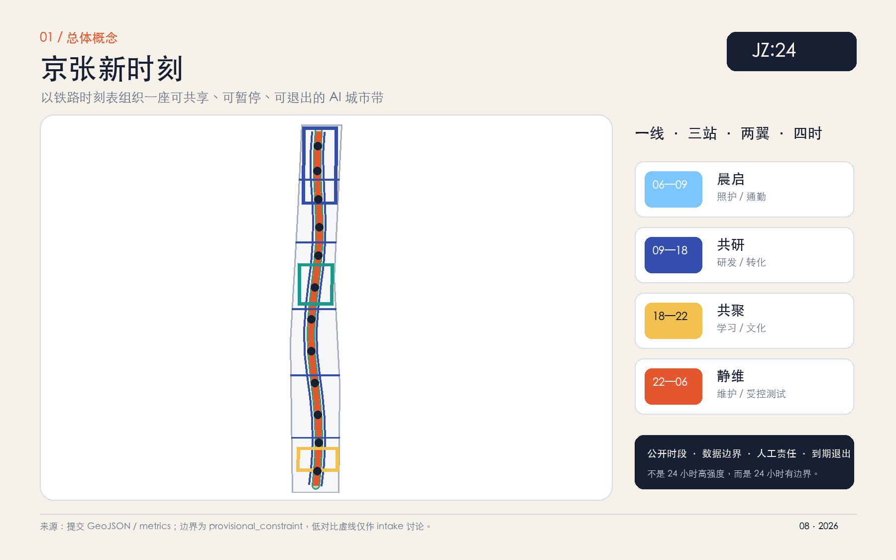
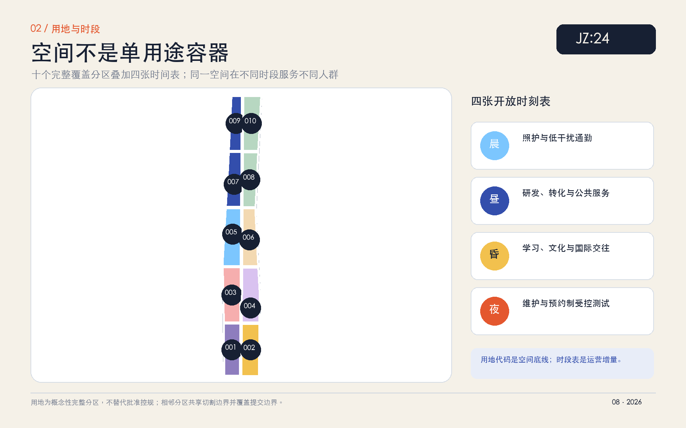
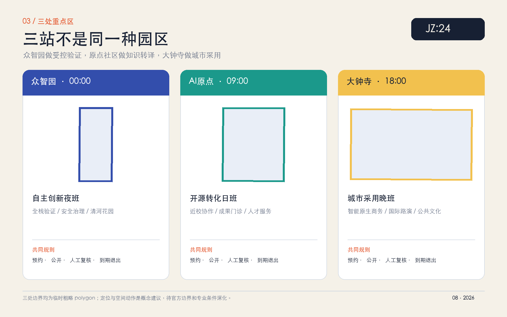
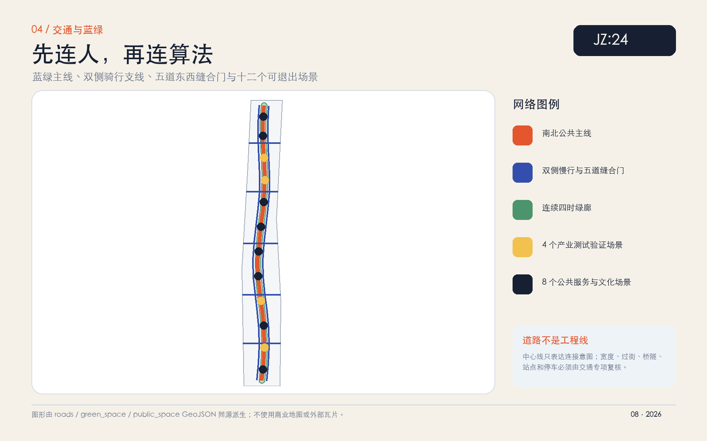
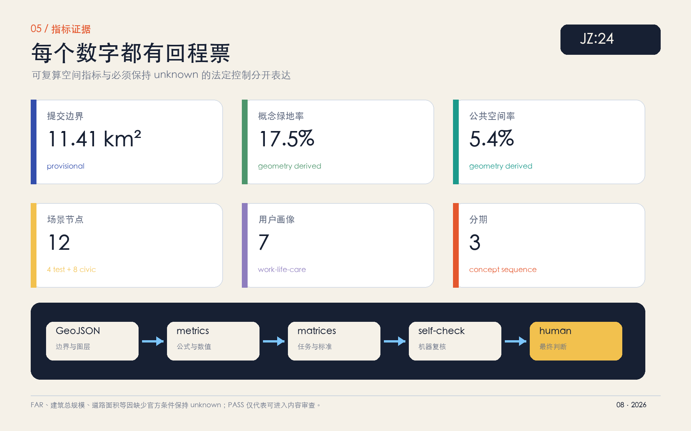

# 京张新时刻 NEW TIMETABLE：一座按小时共享的AI城市带

> **核心命题：空间不必永远只做一件事，AI 也不能永远在线。**
>
> 本方案把铁路的“时刻表”从交通工具转译为一套 4D 城市设计协议：同一空间在晨、昼、昏、夜服务不同人群；每项 AI 试点必须公示运行时段、数据边界、人工责任人与退出日期。它不是 24 小时高强度开发，而是 24 小时有边界的公共城市。

本方案所有空间动作均为**概念建议、参考方案或可供专业团队深化研究的材料**，不替代正式规划，不构成政府审定、投资、活动、招商或实施承诺。

## 设计依据与资料清单

方案以《百年京张AI创新带城市设计国际方案征集资格预审公告》确定项目目标、三层范围约面积、三处重点区与专业任务；以清权的智能体任务书补充三大定位、五大功能、三区两翼、六项智能体任务及统一边界条款。[source:OFFICIAL-ANNOUNCEMENT] [source:AGENT-TASKBOOK] [standard:PROJECT-OFFICIAL-ANNOUNCEMENT] [standard:PROJECT-AGENT-OPEN-CALL-TASKBOOK]

机器可读规则、用地代码、坐标政策、指标范围与本地标准快照来自仓库 site package；公开资料用途边界以 source registry 为准，处理后的事实包只承担导航作用，不升级为新权威来源。[source:SITE-PACKAGE] [source:SOURCE-REGISTRY] [source:PROCESSED-FACT-PACK]

专业表达遵循三项强制本地标准快照：城市设计应统筹建筑布局、景观风貌、公共空间、地域文化与城市特色；涉及控规内容时必须区分批准条件、概念建议与待确认事项；用地分类采用统一代码，而不是自造“AI 用地”替代国土空间分类。[standard:MOHURD-URBAN-DESIGN-MEASURES] [standard:MOHURD-CONTROL-DETAILED-PLANNING] [standard:MNR-LAND-USE-CLASSIFICATION-GUIDE]

### 当前资料边界

- 官方公告给出总体设计范围约 11.4 平方公里，但未公开可验证坐标系的官方 polygon。本提交使用仓库维护者依据公告文字与约面积制作的临时粗略边界；EPSG:4548 复算值约 11.4128 平方公里只用于生成、自检和展示，不是精确官方面积。[source:BOUNDARY-SOURCE] [data:geometry/site_boundary.geojson#SITE-001] [metric:site_area_sqm]
- 三处重点区同样使用 provisional polygon。它们只能承载方向性设计，不能证明地块、权属、开发规模或工程条件。[source:KEY-AREA-SOURCE] [data:geometry/key_areas.geojson#PROV-KEY-001] [data:geometry/key_areas.geojson#PROV-KEY-002] [data:geometry/key_areas.geojson#PROV-KEY-003]
- 官方红线、道路红线、控规、现状建筑、权属、市政、消防、防洪、文保控制和公共服务底数仍待补。`constraints.geojson` 只把这些缺口变成可见的审查提示，不是一条新的控制线。[data:geometry/constraints.geojson#CONSTRAINTS]
- 组织方空间数据缺口不阻断本方案的内容审查；但 provisional geometry 不得用于官方红线、精确面积、法定控制或工程审批。官方数据到位后必须整体替换并重新生成 land use、buildings、roads、green/public space、phasing、metrics、五图、HTML 与 PDF。

### 生成与审查方法

权威层级依次为：GeoJSON → metrics → 三类矩阵 → manifest/sources/assumptions/self-check → proposal → 图像/HTML/PDF。五张核心图、离线网页和两套 PDF 均从同一组几何与指标派生，不使用商业地图、外部瓦片、新闻截图或未清权素材。现状资料不足的判断进入缺口清单，而不是由 AI 补真。[depth:existing_conditions_diagnosis]

## 三层范围工作框架

| 层级 | 公告任务 | “新时刻”的回答 | 成果深度与证据 |
| --- | --- | --- | --- |
| 统筹研究范围 | 约 43.6 km²；组织 AI 产业生态与未来城市形态 | 用“研发—验证—转译—采用—复盘”协作链连接三区两翼；用全球案例提炼机制，不复制形态 | 战略与机制研究；[depth:three_level_scope_framework] |
| 总体设计范围 | 约 11.4 km²；达到控规城市设计深度 | 一条南北公共主线、三处差异化“站”、两翼资源回路、四张开放时刻表、十个完整用地分区 | [data:geometry/land_use.geojson#LU-001] [depth:overall_spatial_structure] |
| 重点区域范围 | 约 368.4 ha；三处重点区详细设计 | 众智园做受控验证，AI 原点社区做知识转译，大钟寺做城市采用；各自形成空间、场景与运营小方案 | [metric:key_area_count] [depth:three_key_area_detailed_design] |

三层范围不是三套互不关联的图纸：统筹层决定生态协作方式，总体层把协作方式落到用地、公共空间与时间制度，重点区再验证三种不同的创新街区类型。每个下层动作都能返回上层任务，每个空间对象也能返回一个数据文件。

## 统筹研究范围产业与未来城市研究

### 总体概念：一线 · 三站 · 两翼 · 四时

- **一线**：京张遗址公园及其周边公共空间作为南北公共主线；它首先服务步行、骑行、生态、文化与日常交往，其次才承载 AI 展示。[data:geometry/green_space.geojson#GREEN-001] [data:geometry/roads.geojson#ROAD-001]
- **三站**：众智园“自主创新夜班”、AI 原点社区“开源转化日班”、大钟寺“城市采用晚班”。“班”是角色分工，不等于强制营业时段。
- **两翼**：中关村科技服务翼提供资本、法务、知识产权、人才与国际网络；小月河场景赋能翼提供公共问题、生活服务与场景反馈。两翼不另画伪精确边界，只表达协作关系。
- **四时**：06—09 晨启、09—18 共研、18—22 共聚、22—06 静维。同一空间通过预约、噪声、照明、无障碍、安保和数据规则分时运行。

这套结构把三大定位转成可执行关系：百年京张文化带提供时间纪律与公共记忆；都市 AI 生活体验带提供日常服务与人类反馈；AI 融合创新带把研发、验证、转化和采用接成闭环。五大功能分别落到全栈验证、生态协作、场景赋能、活力城市与人本治理，而不是附着在传统园区上的 AI 标签。[source:AGENT-TASKBOOK]

### 品牌命名与视觉识别

主名称为**京张新时刻**，英文名为 **JING-ZHANG NEW TIMETABLE**，短标为 **JZ:24**。冒号既是数字时刻的分隔符，也是两条轨线之间的公共间隙；“24”不是全天候监控，而是提醒每个时段都要声明权利、责任与退出。

视觉系统采用四种可访问性较高的功能色：晨启天蓝、共研群青、共聚暖黄、静维朱红；临时边界只用低对比灰色虚线。标志由系统字体与原创几何线条构成，不使用企业 Logo、人物肖像或未授权字库。子命名体系包括：

- `JZ:SHIFT`：按时段开放的空间与服务；
- `JZ:WINDOW`：预约制产业测试窗口；
- `JZ:STOP`：公共服务、文化和休憩节点；
- `JZ:RETURN`：场景退出、申诉与复盘机制；
- `JZ:LOG`：公开贡献与版本记录。

品牌不是宣传外壳。任何挂上 `JZ:24` 的空间或活动，都必须同时公布“何时运行、为谁运行、使用什么数据、谁能暂停、何时退出”。

### 全球案例与可转化机制

| 案例 | 可读事实与启发 | 转化到京张 | 明确不复制 |
| --- | --- | --- | --- |
| 新加坡 one-north | work-live-play-learn 与 living lab 把研发、生活、教育和测试放在相邻片区 [source:CASE-ONE-NORTH] | 四时共享、受控试验、公共绿地连接 | 不复制企业数量、规模或政策承诺 |
| 巴黎 STATION F | 多项目共享创业校园集中基础服务与协作界面 [source:CASE-STATION-F] | 原点社区设置“成果门诊”和共享前台 | 不复制单体巨构或企业品牌 |
| 多伦多 MaRS | 研究、创业、资本、公共问题和城市中心的邻近协作 [source:CASE-MARS] | 中关村科技服务翼提供跨机构转译 | 不引用其投资或绩效数字作为海淀目标 |
| 剑桥 Kendall Square | 官方研究提出从 innovation district 走向 innovation community [source:CASE-KENDALL] | 先补日常公共性、社区服务与步行界面 | 不以高强度开发作为创新代理指标 |
| 伦敦 King's Cross Knowledge Quarter | 交通遗产、文化机构与知识网络形成步行协作区 [source:CASE-KINGS-CROSS] | 京张文化、中关村知识与公共路线叠合 | 不复制地产模式或建筑形态 |
| 巴塞罗那 22@ | 旧产业区以渐进更新和功能混合承接新经济 [source:CASE-22BARCELONA] | 用分时适配和可逆改造降低一次性重建 | 不移植其法定规划工具 |

六个案例共同指向一个结论：世界级生态不是建筑风格，而是**研究、服务、试验、公共生活与长期运营之间的低摩擦接口**。京张的独特增量是把这些接口写进可见的“城市时刻表”，让非专业公众也能理解何时可以进入、质疑或退出。

### AI 生态协作链

方案把产业生态组织为五步循环：

1. **研发 / RESEARCH**：高校、研究机构和企业形成模型、工具与方法；
2. **验证 / VERIFY**：众智园的预约制测试窗口验证兼容、安全、能耗与公共风险；
3. **转译 / TRANSLATE**：AI 原点社区把技术翻译成产品、标准、课程、法务与公共说明；
4. **采用 / ADOPT**：大钟寺及城市生活场景在小范围、可暂停前提下试用；
5. **复盘 / RETURN**：公开失败、申诉、退出和版本记录回到研发端。

土地、空间、产业、资金、人才、算力、数据与场景不被承诺为既有资源，而被设计成八类待建设的服务接口。其运营主体、容量、资金与政策条件均需后续专业和政府程序确认。

## 总体设计范围城市更新与控规深度城市设计

### 4D 城市设计：用地底线 + 开放时刻表

`land_use.geojson` 以十个拓扑安全分区完整覆盖临时总体设计边界，采用 05、0701、0702、0802、0803、0804、1401、1403 八类统一用地代码。每个分区除主导用途外，还记录晨、昼、昏、夜四个运营字段；时间叠加不得改变法定用途、消防、噪声、无障碍、文保、绿线或权属边界。[standard:MNR-LAND-USE-CLASSIFICATION-GUIDE] [depth:land_use_layout]

空间共享遵循四条“时空契约”：

1. **公共性不降级**：公园、广场和慢行空间在活动时段仍保留基本通行与安静选项；
2. **试验不常态化**：测试必须预约、划界、限速、有人值守并自动到期；
3. **居民有回程票**：居民可查看场景说明、拒绝非必要数据、提交异议并触发暂停复核；
4. **运营不制造伪控制**：时段、活动和场景不能绕过用地、规划、文保、交通和安全审批。

### 低扰动更新框架

本方案不以“拆多少、建多少”证明创新。缺少现状建筑和权属底数时，`buildings.geojson` 的 16 个 feature 只表示**时段共享建筑原型**：白天研发或服务、晚间课程或社区活动、夜间预约维护；不对应任何真实建筑，也不作保留、改造、拆除或新建结论。[data:geometry/buildings.geojson#BLDG-001] [depth:retain_renovate_demolish]

更新判断采用四级方法，待现状普查后再落位：

- **保留**：结构、文化、使用与低碳价值均适宜保留的建筑；
- **适配**：通过首层开放、时间共享、无障碍、节能和室内可逆隔断提升使用效率；
- **释放**：仅在安全、权属、文保与专业论证支持时讨论拆除或公共空间释放；
- **新建**：只在批准控规和容量条件明确后补充确有缺口的设施。

概念建筑基底面积约 112.02 万平方米，几何覆盖率约 9.82%；二者仅描述提交的原型图层，不是现状统计或批准建筑密度。[metric:building_footprint_area_sqm] [metric:building_density] 建筑总规模与容积率保持 unknown，不用假设楼层数制造精确感。[metric:total_floor_area_sqm] [metric:floor_area_ratio] [depth:development_intensity_controls]

### 建筑高度、体量与风貌

在缺少批准高度、退线和景观视廊条件时，方案只提出方法：沿遗址公园降低界面压迫，采用细颗粒首层、可穿行院落和连续檐下空间；重点区建筑通过体量分段、共享中庭和可变内部空间适配小团队生命周期；屋顶优先讨论设备整合、雨水、光伏和公共可见性，但不承诺容量。具体高度、密度、屋顶和色彩必须由控规、城市设计、文保与工程专业共同确认。[standard:MOHURD-URBAN-DESIGN-MEASURES] [depth:height_massing_character]

## 重点区域详细设计

### 众智园 AI 自主创新加速区：00:00 自主创新夜班

**定位。** 承担全栈自主创新、标准、安全治理和产业测试验证；“夜班”强调可安排在低人流时段的受控测试，不意味着全天开放或夜间扰民。[data:geometry/key_areas.geojson#PROV-KEY-001]

**空间结构。** 概念形成“清河生态校准窗—全栈验证庭—公共说明前台”三段：生态界面先行，测试空间居中，面向公众的结果说明与标准工作坊靠近公共主线。

**建筑更新。** 优先研究既有研发空间的可逆适配、共享设备间、样机装卸与安全隔离；在现状调查、权属和批准控制完成前不指定任何建筑拆改留。

**交通慢行。** 夜间物流或机器人测试与居民慢行分时、分线；测试必须限速、有人值守、设置实体停止装置。北五环及对外交通只提出接口研究，不给出桥隧或线位结论。

**公共空间。** 清河界面作为低干扰生态观察与创新交往空间，避免用高亮屏幕占据滨水/绿地；公众可观看结果和方法，但不进入危险测试区。

**AI 场景。** SCENE-02 清河生态校准窗、SCENE-04 边缘模型兼容场、SCENE-09 机器人低速共行场、SCENE-10 城市设施维护窗，其中四者均采用预约、目的限定、人工暂停与自动到期。[data:geometry/public_space.geojson#SCENE-02] [data:geometry/public_space.geojson#SCENE-04]

**风险。** 官方片区边界、河道/防洪、道路、市政容量、噪声、消防和安全等级均待确认；任何测试运营须另行审批。

### 北京 AI 原点社区：09:00 开源转化日班

**定位。** 面向近校创新、开源协作、成果转化与人才生活，把“论文—原型—产品—公共解释”压缩到步行可达的日常网络。[data:geometry/key_areas.geojson#PROV-KEY-002]

**空间结构。** 概念形成“成果门诊—开源值班室—人才共享客厅”三节点，并以东西向步行缝合门连接校区、园区、社区和公共主线。

**建筑更新。** 将共享会议、知识产权/法务咨询、短期项目室、课程和社区活动嵌入可适配首层；不以封闭园区替代街区公共性。

**交通慢行。** 五道口、清华东路西口等站点只作为任务书要求的交通接口进行概念研究；实际路径、过街和站点一体化需官方资料与交通专项。

**公共空间。** 白天服务成果转化，晚间转为公开课程和贡献说明，居民仍保有安静通行和非参与选项。

**AI 场景。** SCENE-03 共享会议室调度、SCENE-05 近校成果门诊、SCENE-06 开源贡献值班室、SCENE-07 公共算法说明会；不采集校园科研或个人行为数据作为默认条件。[data:geometry/public_space.geojson#SCENE-05]

**风险。** 校园边界、建筑权属、成果许可、居住承载和夜间噪声均需核验；“人才特区”只作为服务机制研究，不写成政策承诺。

### 大钟寺 AI 产业聚集区：18:00 城市采用晚班

**定位。** 面向智能体、智能终端、内容消费、国际交往和城市生活采用，让 AI 进入可见、可质疑、可退出的公共场景。[data:geometry/key_areas.geojson#PROV-KEY-003]

**空间结构。** 概念形成“站点到达厅—城市采用客厅—回程票墙”，以商业、文化、展示和公共说明串联，而不是把站点变成单一企业展厅。

**建筑更新。** 鼓励首层开放、共享路演、小尺度复合业态和晚间文化使用；不擅自改造企业或高校权属空间。

**交通慢行。** 大钟寺站四象限连接、非机动车停放与静态交通是专业深化重点；本提交只提供概念中心线和步行门，不声称工程可行。[data:geometry/roads.geojson#ROAD-006]

**公共空间。** 晚间采用柔和照明、可关闭屏幕、无消费停留位和无障碍路径，保证居民和访客不使用 AI 服务也能正常使用城市空间。

**AI 场景。** SCENE-08 AI 创意晚市、SCENE-11 多语公共导览、SCENE-12 时间银行互助站；商业推荐不得建立不可撤回的个人画像。[data:geometry/public_space.geojson#SCENE-11]

**风险。** 站点、道路、管线、消防、权属、企业品牌授权和活动安全条件均待补；数据要素与数字资产内容只能做合规科普与机制研究。

## AI 创新生态、人才画像与 AI+ 场景

### 七类用户画像

| 画像 | 一天中的关键时段 | 核心需求 | 空间与运营回应 | 不可越过的边界 |
| --- | --- | --- | --- | --- |
| 研发人员 | 昼 / 夜间预约 | 安静研发、设备、验证、同行交流 | 众智园测试窗口、原点成果门诊 | 测试不等于批准部署 |
| 初创团队 | 昼 / 昏 | 低成本协作、法务、人才、客户验证 | 共享会议、公开路演、科技服务翼 | 不承诺融资或招商结果 |
| 高校师生 | 晨 / 昼 / 昏 | 步行联系、开源转化、课程 | 近校慢行、开源值班室、晚间课程 | 不默认使用校园和科研数据 |
| 周边居民 | 晨 / 昏 / 夜 | 通勤、照护、安静、申诉 | 无障碍陪伴、公共说明、安静选项 | 不做人脸识别或商业画像默认用户 |
| 公共服务与治理人员 | 昼 / 昏 | 可解释工具、责任清晰、人工复核 | 算法说明会、服务前台、复盘机制 | AI 不替代行政决定与人工责任 |
| 国际访客与创作者 | 昼 / 昏 | 多语导览、文化体验、短期协作 | 多语导览、创意晚市、全球活动路线 | 不使用未授权文化与企业素材 |
| 夜间运维与行动不便者 | 晨 / 夜 | 安全、照明、休息、设备维护 | 静维窗口、无障碍导航、现场停止 | 劳动、无障碍和安全优先于试验效率 |

[metric:persona_count]

### 十二张场景卡

| ID | 场景 / 类型 | 空间与时段 | 最小数据 | 人工复核与退出 |
| --- | --- | --- | --- | --- |
| SCENE-01 | 晨行无障碍陪伴 / 公共服务 | 公共主线，06—09 | 用户主动输入、无障碍设施状态；默认不留轨迹 | 服务人员可接管，用户一键退出 |
| SCENE-02 | 清河生态校准窗 / **产业测试** | 众智园，06—09 | 经批准的公开环境监测数据 | 生态专业人员复核；异常即停 |
| SCENE-03 | 共享会议室调度 / 企业服务 | 原点社区，09—18 | 预约和空间容量，不采会议内容 | 人工前台处理冲突；预约到期删除 |
| SCENE-04 | 边缘模型兼容场 / **产业测试** | 众智园，09—18 | 测试设备与合成数据 | 安全员现场值守；窗口结束自动下线 |
| SCENE-05 | 近校成果门诊 / 教育法务 | 原点社区，09—18 | 团队主动提交的清权材料 | 专业顾问签核；未授权材料不入库 |
| SCENE-06 | 开源贡献值班室 / 社区 | 原点社区，18—22 | 公开仓库记录与自愿署名 | 贡献者可匿名/撤回展示 |
| SCENE-07 | 公共算法说明会 / 治理 | 公共客厅，18—22 | 场景模型卡、规则和聚合结果 | 居民提问进入公开复盘清单 |
| SCENE-08 | AI 创意晚市 / 文化消费 | 大钟寺，18—22 | 摊主清权内容与匿名客流计数 | 人工审核版权；活动结束数据归档/删除 |
| SCENE-09 | 机器人低速共行场 / **产业测试** | 众智园，22—06 | 设备遥测、封闭测试区状态 | 现场停止装置；行人绝对优先 |
| SCENE-10 | 城市设施维护窗 / **产业测试** | 总体范围，22—06 | 经批准的设施工单，不含个人数据 | 运维负责人确认；不能替代巡检签字 |
| SCENE-11 | 多语公共导览 / 文化服务 | 全日 | 公开文化资料与用户选择语言 | 内容人工校核；不得生成伪历史 |
| SCENE-12 | 时间银行互助站 / 社区服务 | 全日 | 用户自愿登记的服务时长 | 社区组织复核；不得建立信用评分 |

12 个场景均在 `public_space.geojson` 中有点位；其中 4 个设置 `industry_test=true`。[metric:scenario_node_count] [metric:industry_test_scenario_count] 所有点位是概念定位，不是批准运营位置。场景治理统一采用“最小必要—目的限定—现场责任—公众说明—自动到期—公开复盘”六步门。

## 用地、建筑规模与拆改留方案

### 用地分区与复算

| 用地代码 | 概念功能 | 几何面积 | 四时使用重点 |
| --- | --- | ---: | --- |
| 05 | 智能原生商务 | 约 123.06 ha [metric:land_use_05_area_sqm] | 昼间企业服务，晚间国际路演与轻餐 |
| 0701 | 人才生活支持 | 约 111.95 ha [metric:land_use_0701_area_sqm] | 居住优先，晚间社区共享，夜间安静 |
| 0702 | 社区共享服务 | 约 124.60 ha [metric:land_use_0702_area_sqm] | 晨间照护，昼间公共服务，晚间学习 |
| 0802 | AI 研发与全栈创新 | 约 189.18 ha [metric:land_use_0802_area_sqm] | 昼间研发，夜间预约制受控测试 |
| 0803 | 文化与国际传播 | 约 110.92 ha [metric:land_use_0803_area_sqm] | 铁路记忆、公共课程、创意市集 |
| 0804 | 近校学习转化 | 约 127.57 ha [metric:land_use_0804_area_sqm] | 研学、成果门诊、开发者课程 |
| 1401 | 连续蓝绿公园 | 约 227.01 ha [metric:land_use_1401_area_sqm] | 晨间慢行、昼间交往、夜间生态静养 |
| 1403 | 全天候公共客厅 | 约 127.00 ha [metric:land_use_1403_area_sqm] | 公共会客、说明会、低照度通行 |

面积来自 provisional boundary 的完整分区，只适用于检查拓扑和设计比例。绿地/公共空间专项图层与用地分区用途不同：前者表达方案中的空间网络和场景界面，后者表达全覆盖的主导用地；两者不可简单相加为法定用地指标。[data:geometry/land_use.geojson#LU-010]

### 建筑规模、强度与拆改留边界

`building_footprint_area_sqm` 和 `building_density` 是本方案概念原型的几何结果，不是现状建筑底数或批准指标。`total_floor_area_sqm` 与 `floor_area_ratio` 因缺少官方控制保持 unknown。建筑高度、体量、屋顶、消防、装卸、无障碍和结构安全均需专业深化；仓库登记的《建筑工程设计文件编制深度规定（2016年版）》缺少可用官方正文，故只作为待补项，不作 formal 权威依据。[standard:MOHURD-ARCH-DESIGN-DEPTH-2016]

## 交通、轨道、市政与公共服务设施

### 交通与慢行

方案以 1 条南北公共主线、2 条双侧骑行/通勤支线和 5 道东西缝合门表达连接意图。概念中心线合计约 33.96 公里，但该值只用于比较网络结构，不是道路长度、道路红线或工程量。[metric:road_centerline_length_m] [depth:traffic_rail_slow_parking]

五道缝合门不是默认建设桥隧，而是五类待验证问题：跨路连续性、站点到公园、校区到园区、社区到服务、重点区到公共主线。每一道门都先做步行审计、无障碍审计和交通安全复核，再决定地面优化、信号组织、既有设施改善或其他工程路径。

由于道路宽度、断面和红线未提供，`road_area_sqm` 与 `road_ratio` 均保持 unknown。[metric:road_area_sqm] [metric:road_ratio] 轨道站点一体化、停车和非机动车组织只提出接口任务，不给出线位、出入口或容量结论。

### 市政与新型基础设施

新型基础设施采用“轻节点、强规则”的概念：端侧算力、设备充电、网络、显示和传感优先嵌入可维护节点；每个节点同时标明能耗、维护、数据和关闭方式。夜间测试不能以“创新”绕过能源、噪声、消防、网络安全或劳动规则。[depth:municipal_new_infrastructure]

公共服务设施按人群与时段组织：晨间照护/无障碍，昼间成果与企业服务，晚间课程/文化/国际交往，夜间只保留必要维护与预约测试。具体服务半径、数量与容量待官方公共设施底数补齐后校准。

## 蓝绿空间、公共空间与城市风貌

### 四时共享绿廊

`green_space.geojson` 以南北公共主线和若干节点口袋形成连续概念网络，面积约 200.07 万平方米，约占 provisional boundary 的 17.53%。[metric:green_space_area_sqm] [metric:green_ratio] 这不是批准绿地率；它表达一个设计优先级：AI 体验必须依附于可步行、可休息、可遮阴、可选择不互动的公共环境。[depth:blue_green_public_space]

`public_space.geojson` 的公共空间 polygon 约 62.14 万平方米，比例约 5.44%；另含 12 个不计面积的场景点。[metric:public_space_area_sqm] [metric:public_space_ratio] 公共空间保持“非消费座位、安静路线、无障碍路径、人工服务窗口、可关闭数字界面”五项底线。

### 文化叙事、品牌与国际传播

叙事不是把 AI 光效贴在铁路遗产上，而是把三种文化的工作方式放在同一条时间线上：

- **京张铁路文化**：准时、协同、工程责任与百年可读性；
- **中关村创新文化**：开放试错、知识转化、从原型到产业；
- **AI 新文化**：模型卡、公开验证、人工复核、可申诉与可退出。

国际传播主句为 **“Every intelligence needs a timetable.” / 每一种智能都需要一张时刻表。** 它把技术能力转成公众能理解的责任问题：何时运行、为谁运行、谁能停止、何时离场。导视采用中英双语和图形时段，不以颜色作为唯一信息；历史内容由专业史料校核，避免把青龙桥“人字形”等线路外叙事误当作本场地遗存。

### 四个 AI 朝圣与荣誉展示节点

1. **总时刻台 / TIME ZERO TABLE**：一张大型公共桌与低亮度时刻牌，集中展示当日试点、责任人、数据和退出时间；位置需在公共主线中段另行深化。
2. **开源值班室 / OPEN SOURCE DUTY ROOM**：位于 AI 原点社区的概念公共前台，展示贡献记录、开源许可、复现实验和社区值班；荣誉按可验证贡献而非企业体量排序。
3. **百年信号庭 / CENTURY SIGNAL COURT**：以铁路信号“清晰、可见、可停止”的原则讲述京张铁路与城市 AI 责任文化；具体位置和形式须经文保审查。
4. **城市回程票墙 / RETURN TICKET WALL**：在大钟寺城市采用客厅记录被暂停、修正、退出和重新上线的场景；让失败与纠错也成为公共荣誉。

[metric:pilgrimage_landmark_count]

公共空间组件库包括：可更新时刻牌、实体停止按钮、无障碍触觉/语音导视、非消费座椅、可关闭低亮度屏、临时划界件、移动电源/边缘计算箱和纸质意见卡。所有组件轻触地、可维护、可撤回，不抢占文保与生态空间。

## 更新项目清单、实施政策与分期计划

### 九项概念更新项目

| 编号 | 项目 | 近期最小动作 | 前置条件 / 退出条件 | 空间证据 |
| --- | --- | --- | --- | --- |
| JZ-01 | 新时刻公共协议与导视 | 发布纸质/电子场景时刻模板 | 法务、隐私、无障碍审查；无责任人即不上线 | [data:geometry/public_space.geojson#PUBLIC-001] |
| JZ-02 | 京张四时共享绿廊 | 步行审计、非消费座位和安静路线 | 文保、绿地、交通与养护条件 | [data:geometry/green_space.geojson#GREEN-001] |
| JZ-03 | 清河生态校准窗 | 公开方法的小尺度环境测试 | 河道、防洪、生态与数据许可 | [data:geometry/public_space.geojson#SCENE-02] |
| JZ-04 | 众智园受控验证窗 | 合成数据、封闭/半封闭预约测试 | 安全员、停止装置、保险与审批 | [data:geometry/public_space.geojson#SCENE-04] |
| JZ-05 | 原点成果门诊 | 定期法务、开源、产品与公共说明值班 | 校区/园区权属与材料授权 | [data:geometry/public_space.geojson#SCENE-05] |
| JZ-06 | 开源值班室 | 贡献展示与复现工作台 | 许可、署名/匿名和撤回机制 | [data:geometry/public_space.geojson#SCENE-06] |
| JZ-07 | 大钟寺城市采用客厅 | 晚间说明会、创意市集、回程票墙 | 站点、消防、噪声、版权和活动许可 | [data:geometry/public_space.geojson#SCENE-08] |
| JZ-08 | 五道东西缝合门 | 步行/无障碍/安全审计 | 道路红线、信号、桥下空间与工程论证 | [data:geometry/roads.geojson#ROAD-004] |
| JZ-09 | 全球新时刻周与公开复盘 | 年度路线、场景开放、失败档案 | 活动审批、国际传播和退出复盘 | [data:geometry/phasing.geojson#PHASE-001] |

[metric:renewal_project_count] [depth:renewal_project_list]

### 三期概念顺序

- **一期“开表”**：以轻量导视、预约、公开规则和四类受控试点验证制度，概念工作包面积约 423.27 万平方米。[data:geometry/phasing.geojson#PHASE-001] [metric:phase_1_area_sqm]
- **二期“换乘”**：在官方资料和阶段评估支持下，推进公共界面、共享设施与重点区协同，概念工作包面积约 374.94 万平方米。[data:geometry/phasing.geojson#PHASE-002] [metric:phase_2_area_sqm]
- **三期“成网”**：官方红线、控规、文保、交通、市政和权属清楚后，系统深化空间与长期运营，概念工作包面积约 343.08 万平方米。[data:geometry/phasing.geojson#PHASE-003] [metric:phase_3_area_sqm]

三期 feature 只是空间工作包和优先顺序，不是批准开发边界、投资计划或政府时序；三期共 3 个、四时窗口共 4 个。[metric:phase_count] [metric:time_window_count] [depth:phasing_implementation]

### 全球 AI 活动与长期运营

长期运营形成“日—周—季—年”四级节奏：

- **每日**：公共时刻牌更新当日开放、维护与暂停状态；
- **每周**：开源值班、成果门诊和居民算法说明会轮值；
- **每季**：一次主题测试窗口与公开复盘，发布“继续/修正/退出”结论；
- **每年**：`NEW TIMETABLE WEEK` 串联遗址文化、开发者协作、受控验证、公众体验与国际路演，同时发布年度退出清单和公共价值报告。

开发者从课程/贡献进入复现与测试，初创团队从成果门诊进入场景验证，企业从公开问题进入采购或合作讨论，公众从体验进入复盘与治理。任何转化都只是机制建议，不承诺招商、政策、资金或活动效果。

## 指标体系、面积复算与合规矩阵

### 核心指标解释

| 指标族 | 结果 | 设计含义与边界 |
| --- | --- | --- |
| 提交边界 | 11,412,825.386 m² [metric:site_area_sqm] | provisional geometry 的 EPSG:4548 复算值，不是精确官方面积 |
| 概念建筑基底 | 1,120,225.393 m²；9.8155% [metric:building_footprint_area_sqm] [metric:building_density] | 16 个共享建筑原型的几何，不是现状或批准密度 |
| 蓝绿网络 | 2,000,670.930 m²；17.5300% [metric:green_space_area_sqm] [metric:green_ratio] | 支撑步行、休息、生态与人才日常，不是批准绿地率 |
| 公共空间 | 621,358.415 m²；5.4444% [metric:public_space_area_sqm] [metric:public_space_ratio] | 公共交往与场景界面，不含点位面积 |
| 概念交通 | 33,955.740 m [metric:road_centerline_length_m] | 中心线结构指标，不是道路工程量 |
| 重点区 / 场景 | 3 / 12 / 4 个测试 [metric:key_area_count] [metric:scenario_node_count] [metric:industry_test_scenario_count] | 检查任务覆盖与场景结构，不表示批准运营 |
| 人群 / 地标 / 项目 | 7 / 4 / 9 [metric:persona_count] [metric:pilgrimage_landmark_count] [metric:renewal_project_count] | 正文计数，服务人本与运营完整性 |
| 时段 / 分期 | 4 / 3 [metric:time_window_count] [metric:phase_count] | 运营制度与工作包，不是政府实施时序 |
| 法定强度 | unknown [metric:total_floor_area_sqm] [metric:floor_area_ratio] | 等待官方红线、控规和建筑底数 |
| 道路面积 | unknown [metric:road_area_sqm] [metric:road_ratio] | 等待道路红线和断面 |

### 专业深度与证据索引

| 深度项 | 本方案证据 |
| --- | --- |
| 现状诊断 | 资料分层、九项缺口与 provisional 提示 [depth:existing_conditions_diagnosis] |
| 三层范围 | 范围—任务—成果传导表 [depth:three_level_scope_framework] |
| 总体结构 | 一线三站两翼四时 [depth:overall_spatial_structure] |
| 用地布局 | 十个无缝分区与八类代码 [depth:land_use_layout] |
| 开发强度 | 已知几何与 unknown 法定控制分离 [depth:development_intensity_controls] |
| 高度体量风貌 | 方法性引导与待确认条件 [depth:height_massing_character] |
| 拆改留 | 保留—适配—释放—新建决策门 [depth:retain_renovate_demolish] |
| 交通轨道慢行停车 | 一线两支五门与专业复核清单 [depth:traffic_rail_slow_parking] |
| 市政新基建 | 轻节点、强规则、可关闭 [depth:municipal_new_infrastructure] |
| 蓝绿公共空间 | 四时绿廊、公共底线与组件库 [depth:blue_green_public_space] |
| 三处重点区 | 三种班次和七项小方案 [depth:three_key_area_detailed_design] |
| 更新项目 | 九项项目、依赖与退出条件 [depth:renewal_project_list] |
| 分期 | 开表—换乘—成网 [depth:phasing_implementation] |
| 指标复算 | EPSG:4548、公式、来源和 confidence [depth:metrics_recalculation] |
| 风险缺口 | 官方资料、专业复核、版权与 AI 治理 [depth:risk_missing_data] |

`compliance_matrix.json` 覆盖公告 1.3、1.4、1.5 全部任务与 agent.1—agent.6；`standard_matrix.json` 把五项强制标准连接到正文、图纸、几何、指标、来源、假设和自检；`design_depth_matrix.json` 的 15 个必选深度项均有证据。矩阵证明“在哪里”，正文解释“为什么”，二者不能互相替代。

## 风险、版权与合规说明

### 九类资料与专业风险

1. **边界风险**：总体与重点区均为 provisional；官方 polygon 到位后整体复算。
2. **控规风险**：FAR、高度、密度、绿地率、退线和建筑控制线缺失；保持 unknown。
3. **道路风险**：中心线只表达联系，不代表红线、断面、桥隧或工程可行性。
4. **建筑与权属风险**：16 个建筑是概念原型，不对应真实建筑，不作拆改留判断。
5. **文保风险**：文化节点轻触地、可撤回；须经京张遗产与相关文保专业审查。
6. **市政安全风险**：算力、能源、管线、消防、防洪和维护容量待专项验证。
7. **公共服务风险**：设施数量和服务半径待官方底数校准。
8. **时间共享风险**：夜间噪声、照明、劳动、安保和无障碍可能限制运行时段；居民休息优先。
9. **AI 治理风险**：默认不做人脸识别、个人轨迹或社会评分；任何自动化必须可解释、有人复核、可申诉、可暂停、可退出。

### 版权与责任

文字、几何、图表、离线 HTML 和 PDF 排版均为本次投稿生成；外部案例只引用公开文字，不复制其图片、Logo 或专有视觉资产。品牌 `JZ:24 / 京张新时刻` 为原创概念方向，不声称已获官方采纳或商标注册。完整说明见 [source:SOURCE-REGISTRY] 与 `report/copyright_statement.md`。

本方案不使用非公开政府数据、企业内部数据、个人隐私、商业地图瓦片、新闻示意图或 AI 猜测作为正式边界与规划控制依据。智能体对来源、生成与限制披露负责；人类评审和专业团队保留最终判断。

## 参考资料

以下文件共同构成本方案的本地可审查依据与数据导航。[source:SITE-PACKAGE]

- `brief/site-package/design_brief.json`
- `brief/site-package/agent_taskbook.json`
- `brief/site-package/allowed_design_space.json`
- `brief/site-package/standards/standards.json`
- `brief/site-package/standards/references/`
- `brief/site-package/geometry/provisional_boundaries.geojson`
- `data/source_registry.json`
- `data/processed/agent_fact_pack.md`
- `sources.json`、`assumptions.json`、`metrics.json`
- `compliance_matrix.json`、`standard_matrix.json`、`design_depth_matrix.json`

> **最终边界声明**：所有成果均为开放共创建议，不替代正式规划，不构成政府审定结论。所有空间落地建议均为概念建议、参考方案或可供专业团队深化研究的材料。
