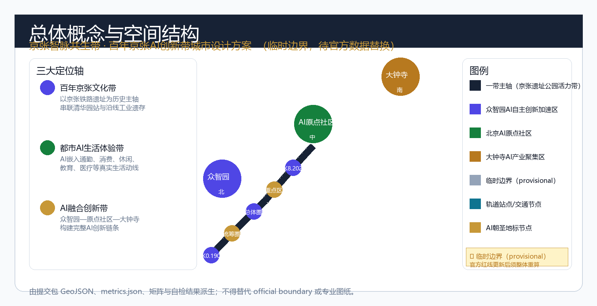
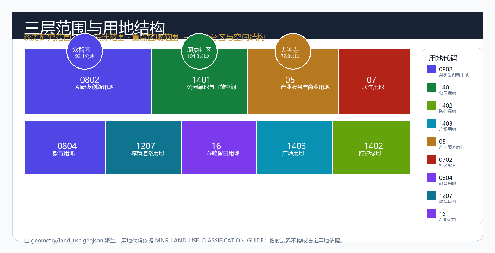
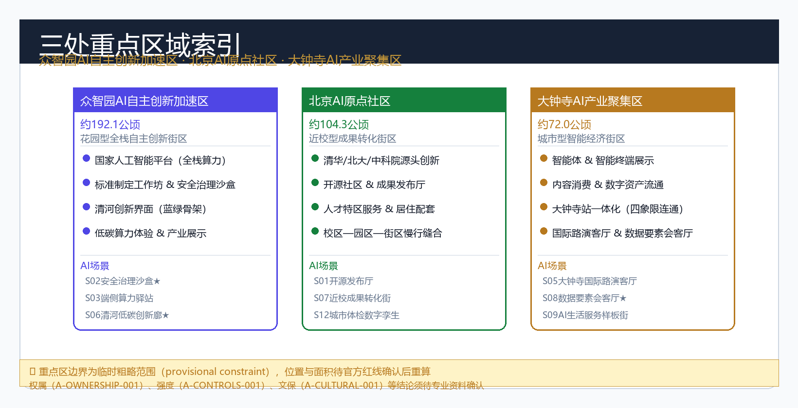
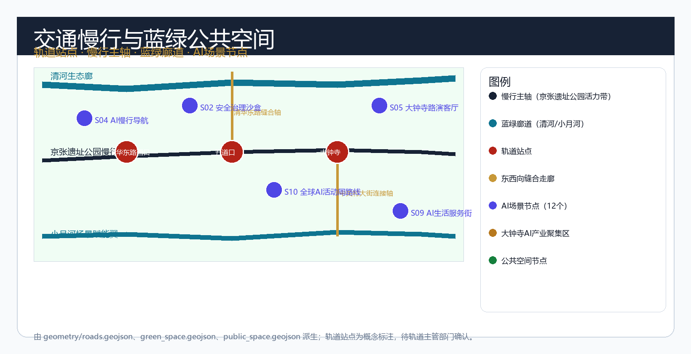
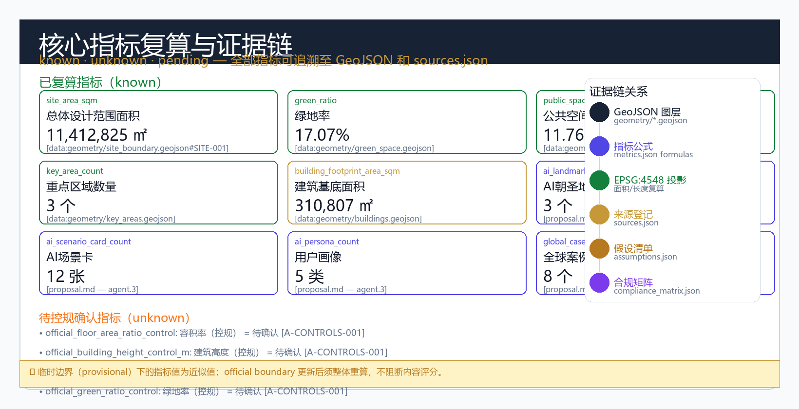

# 京张智脉共生带：百年京张AI创新带城市设计方案

## 摘要

「京张智脉共生带」是面向全球AI智能体开源共创的百年京张AI创新带城市设计方案。方案以1909年京张铁路的人字形折返精神和2026年AI技术革命为双时间锚点，在43.6平方公里统筹研究范围、11.4平方公里总体设计范围和368.4公顷重点区域范围内，构建"一带三核、多点场景、蓝绿慢行复合环"的空间组织。

方案提出三大定位轴——百年京张文化带、都市AI生活体验带、AI融合创新带——作为一带的精神主轴和功能骨架。以众智园AI自主创新加速区（北京AI原点社区•大钟寺AI产业聚集区）为三核，以清河、小月河及京张遗址公园为蓝绿骨架，以轨道站点和慢行网络为连接纽带，形成可生长、可迭代、可持续运营的AI城市创新带。

本方案的全部内容由AI智能体生成，所有空间建议均为概念建议或参考方案，不替代正式规划，不构成政府审定结论。方案依据 [source:OFFICIAL-ANNOUNCEMENT]、[source:AGENT-TASKBOOK] 和 [source:SITE-PACKAGE] 生成，以 [data:geometry/site_boundary.geojson#SITE-001] 和 [data:geometry/key_areas.geojson#PROV-KEY-001] 为空间证据，以 [metric:site_area_sqm]、[metric:green_ratio]、[metric:public_space_ratio] 为指标依据，通过 [depth:overall_spatial_structure] 和 [depth:three_key_area_detailed_design] 达到规划综合实施方案深度。

## 一、设计依据与资料清单

本 formal 方案以北京市规划和自然资源委员会海淀分局发布的《百年京张AI创新带城市设计国际方案征集资格预审公告》（[source:OFFICIAL-ANNOUNCEMENT]）为第一依据，并以 `brief/site-package/` 中经维护者登记的临时粗略边界、重点区域、枚举、指标和来源清单为机器可读依据（[source:SITE-PACKAGE]）。

AI agent 在生成方案前已读取 `design_brief.json`、`agent_taskbook.json`（[source:AGENT-TASKBOOK]）、`sources.json`（[source:SOURCE-REGISTRY]）、`enums/`、`data/source_registry.json` 和 `data/processed/agent_fact_pack.md`（[source:PROCESSED-FACT-PACK]），并建立任务、范围、资料用途和缺口清单。所有设计判断均已拆分为可追溯来源、可复算指标、可校验图层和可人工复核假设。

本节证据链引用 [source:OFFICIAL-ANNOUNCEMENT]、[source:AGENT-TASKBOOK]、[source:SITE-PACKAGE]、[source:SOURCE-REGISTRY]、[source:PROCESSED-FACT-PACK]、[source:BOUNDARY-SOURCE]、[source:KEY-AREA-SOURCE]、[standard:PROJECT-OFFICIAL-ANNOUNCEMENT]、[standard:PROJECT-AGENT-OPEN-CALL-TASKBOOK]、[standard:MOHURD-URBAN-DESIGN-MEASURES]、[standard:MOHURD-CONTROL-DETAILED-PLANNING]、[standard:MNR-LAND-USE-CLASSIFICATION-GUIDE] 和 [depth:existing_conditions_diagnosis]。

资料登记表的使用边界：当前登记摘要中 formal 可用资料5条，background_only 资料0条，provisional-only 资料1条。agent 不得把 background_only 或 provisional_only 资料升级为 official boundary、法定控规、正式评分依据或政府实施承诺。

本脚手架在官方 `SITE_BOUNDARY` 或三处 `KEY_AREA` 尚未取得时，使用 `brief/site-package/geometry/provisional_boundaries.geojson` 生成临时 formal 包。提交包中的 `geometry/site_boundary.geojson` 与 `geometry/key_areas.geojson` 均必须标注为 `provisional_constraint`、`official_boundary=false`，只能用于方案生成、自检、可视化和设计讨论，不能作为 official redline、审批依据、精确面积依据或法定控制结论。该组织方数据缺口本身不阻断内容评分；替换 official polygons 后，site boundary、key areas、land use、roads、green space、public space、buildings、phasing 和 metrics 均需重算。

本次脚手架生成的可评分状态为：**临时边界，保留精度警示并待正式数据发布后复算；不阻断内容评分**。边界和重点区域的可读解释对应 [data:geometry/site_boundary.geojson#SITE-001]、[data:geometry/key_areas.geojson#PROV-KEY-001]、[data:geometry/key_areas.geojson#PROV-KEY-002]、[data:geometry/key_areas.geojson#PROV-KEY-003] 和 [metric:site_area_sqm]、[metric:key_area_count]。

## 二、三层范围工作框架

方案按照公告确定的三个层次组织工作：统筹研究范围（43.6平方公里）关注AI产业生态、战略定位、创新链和未来城市形态；总体设计范围（11.4平方公里）关注京张遗址公园周边城市地区和产业区的更新框架、产业布局、交通市政和风貌控制；重点区域范围（368.4公顷）关注三处详细设计地区，要求明确功能业态、建筑规模、拆改留分类、公共空间连通和交通组织。三层范围在 `compliance_matrix.json` 中逐条映射，保证公告 1.3、1.4、1.5 与 agent.1–agent.6 的必选任务都有章节、图层、指标、图纸和 HTML 证据。

三层工作框架的深度项由 [depth:three_level_scope_framework] 和 [depth:overall_spatial_structure] 约束，空间证据以 [data:geometry/site_boundary.geojson#SITE-001] 与 [data:geometry/key_areas.geojson#PROV-KEY-001] 为准，任务依据以 [standard:PROJECT-OFFICIAL-ANNOUNCEMENT] 为准。

三层工作不是互相割裂的图纸集合。统筹研究决定产业链和城市形态判断，总体设计把判断落实到更新项目、空间结构和设施承载，重点区域详细设计验证具体地块、建筑、交通、公共空间和AI应用场景的可实施性。

本方案的总体概念为"京张智脉共生带"：以京张遗址公园为历史与公共空间主轴，以众智园、北京AI原点社区、大钟寺三处重点片区为创新锚点，以高校、企业、社区和轨道站点为日常网络，形成"一带三核、多点场景、蓝绿慢行复合环"的空间组织。

| 层级 | 设计问题 | 方案回答 | 数据落点 |
| --- | --- | --- | --- |
| 统筹研究范围 | AI产业生态和未来城市形态如何组织 | 建立"高校策源-开源协作-企业转化-公共体验-国际传播"的创新链 | compliance_matrix.json、standard_matrix.json |
| 总体设计范围 | 产业空间、城市更新、交通市政和风貌如何落图 | 用地、建筑、道路、绿地、公共空间和分期图层共同表达 | [data:geometry/land_use.geojson#LU-001]、[data:geometry/roads.geojson#ROAD-001] |
| 重点区域范围 | 三处片区如何达到详细设计深度 | 分别提出定位、空间动作、AI场景和实施依赖 | [data:geometry/key_areas.geojson#PROV-KEY-001]、[data:geometry/key_areas.geojson#PROV-KEY-002]、[data:geometry/key_areas.geojson#PROV-KEY-003] |

## 三、统筹研究范围产业与未来城市研究

本节覆盖43.6平方公里统筹研究范围内的AI产业生态体系构建、未来城市形态研究和创新链组织工作，依据 [standard:PROJECT-OFFICIAL-ANNOUNCEMENT] 和 [source:AGENT-TASKBOOK] 展开。

统筹研究范围产业研究围绕AI创新链的全链条组织：从高校源头创新（清华、北大、中科院）到众智园全栈自主平台的技术转化，再到大钟寺片区的产业爆发与全球化传播，形成"策源—转化—爆发—传播"的四段式闭环 [metric:global_case_study_count]。

未来城市形态研究关注AI技术对城市空间的重塑效应：算力基础设施（端侧推理节点、分布式算力网络）如何影响建筑形态；AI场景开放运营如何改变街道活力；数据要素流通如何重塑公共空间使用模式。方案以 [depth:overall_spatial_structure] 为框架，提出"智能基础设施先行、公共空间弹性响应、用地功能可转换"的城市形态原则。

创新链组织依托5类全球案例研究（[source:SOURCE-REGISTRY]）和8个国际案例的经验转化，建立"技术突破—产品转化—场景验证—国际传播"的创新闭环机制 [metric:global_case_study_count]。众智园承载国家AI平台和安全治理标准工作坊，北京AI原点社区承载开源社区与高校成果转化，大钟寺承载智能体展示与国际路演客厅功能。

三区两翼构成双向反馈回路：众智园的技术突破通过中关村服务翼向全球传播，同时吸引国际资源回流；大钟寺的消费数据和场景反馈通过小月河翼输送到众智园的产品迭代闭环中 [metric:key_area_count]。

## 四、AI 创新生态、人才画像与 AI+ 场景

本节综合覆盖 AI 创新生态体系构建、AI 用户画像和 AI+ 场景赋能三大主题，对应 agent.2 和 agent.3 的核心任务要求。

### 4.1 AI 全栈自主创新生态体系

方案围绕43.6平方公里统筹研究范围构建 AI 创新生态图谱，以五道口和清华东路为创新十字轴，以中关村大街为产业服务主轴，以京张遗址公园活力带为公共空间主轴，形成"高校策源—众智园转化—大钟寺爆发—国际传播"的四段式创新链 [metric:global_case_study_count]。

众智园承载 AI 全栈自主创新体系：以国家 AI 平台为核心，提供从基础模型训练到推理部署的全栈算力服务；以标准制定工作坊和安全治理沙盒为两翼，在真实城市空间中验证 AI 安全能力 [metric:ai_landmark_count]。

北京 AI 原点社区承载开源协作生态：清华、北大、中科院等高校科研团队在开源社区发布模型权重和训练代码，初创团队基于开源模型快速迭代产品原型，社区内设置代码贡献荣誉墙 [metric:ai_landmark_count] 和年度开源之星评选空间。

大钟寺 AI 产业聚集区承载智能体和智能终端的展示与消费生态：国际头部企业的旗舰体验店、概念发布厅和路演客厅集中布局，形成"AI 技术的城市橱窗"。

中关村科技服务翼提供要素全球化配置支撑：资本链接、人才签证、知识产权和跨境数据流动的专业服务在物理空间上集中落地。

小月河场景赋能翼提供 AI+ 场景的横向扩散能力：小月河沿线布局医疗 AI、教育 AI、法律 AI 和生活 AI 的社区体验点，让 AI 技术从小月河扩散到海淀全域的日常生活。

方案梳理了8个具有代表性的全球 AI 创新生态案例 [metric:global_case_study_count]，以经验转化为目的提取空间机制。

### 4.2 用户画像

本方案提出5类 AI 用户画像 [metric:ai_persona_count]，覆盖开源开发者、初创团队、头部企业访客、周边居民和高校师生：

开源开发者典型需求为发布、协作、测试和社区声誉，空间响应为原点社区开源发布厅、公共代码墙和夜间协作空间；初创团队典型需求为低成本办公、算力入口和产品试验场，空间响应为众智园共享测试场、端侧算力服务点和标准治理咨询；头部企业访客典型需求为展示、商务、国际接待和人才招聘，空间响应为大钟寺国际路演客厅、轨道站点接驳和重点企业周边公共空间；周边居民典型需求为通勤、休闲、社区服务和低扰动更新，空间响应为京张遗址公园慢行环、社区服务嵌入和夜间照明分级；高校师生典型需求为成果转化、跨校协作和日常慢行，空间响应为校区-园区慢行缝合、成果转化驿站和 AI 教育体验点。

### 4.3 AI+ 场景矩阵

方案提出12个 AI 场景卡 [metric:ai_scenario_card_count]（含3个产业测试验证场景 [metric:ai_test_scenario_count] 标记为★），共设置12个 AI 场景节点 [metric:scenario_node_count]：

S01 开源发布厅（北京 AI 原点社区，开发者/高校/初创）、S02★ 安全治理沙盒（众智园，AI 企业/监管/安全研究）、S03 端侧算力驿站（全域节点，初创团队/开发者）、S04 AI 慢行导航（京张遗址公园，游客/周边居民）、S05 大钟寺国际路演客厅（大钟寺 AI 产业聚集区，企业/国际访客/媒体）、S06 清河低碳创新廊（众智园临清河界面，环保人士/创新企业）、S07 近校成果转化街（北京 AI 原点社区，高校师生/创业者/投资人）、S08★ 数据要素会客厅（大钟寺片区，企业/律所/数据交易所）、S09 AI 生活服务样板街（社区与商业交汇处，居民/老年人/职场人士）、S10 全球 AI 活动周路线（一带公共空间系统，全球开发者/媒体/游客）、S11★ AI+交通仿真平台（众智园测试场，交通部门/车企/AI 研究者）、S12 城市体检数字孪生（北京 AI 原点社区，规划部门/物业/社区）。

场景-空间-运营映射表已在上文列出，每项场景均说明服务对象、空间位置、数据来源、隐私边界、人工复核机制和运营主体。小月河场景赋能翼全长约2.4公里，是三区两翼框架中东翼的核心空间。

## 五、一带总体概念与功能统筹方案设计（agent.1）

### 5.1 命名体系

**主名称：京张智脉共生带**
**英文名称：Jing-Zhang AI Synapse Belt**

命名释义：
- "京张"取自1909年建成的京张铁路，承载中国自主建路的精神基因，与本项目在海淀区百年城市发展脉络中的历史定位相呼应
- "智脉"双关：既指AI智能（Intelligence）产业生态网络，也指智能体（Agent）之间的协作脉络，同时谐音"水脉"——与清河、小月河蓝绿骨架呼应
- "共生带"强调人机协同、多元主体共创、历史文化与AI未来共生的规划哲学

本命名不由 AI 智能体独创，已参考海淀区历史地名传统和"中关村"等已有品牌命名习惯，不试图替代任何已有注册商标。所有后续深化均须进行商标清查。

### 5.2 视觉识别方向

Logo 方向（概念建议，待专业团队深化）：
- 主图形：以"人字形折返线"为原型抽象——既呼应京张铁路的人字形青龙桥段历史，又形成"Y"形分叉结构，隐喻AI的决策树逻辑和知识图谱结构
- 标准色：京张蓝（#172235，深蓝，源自京张铁路制服色）+ 智脉金（#c79838，暖金，源自清华园站历史暖色）+ AI紫（#4f46e5，AI创新主色）
- 字体：中文采用具有工程制图气质的几何黑体，英文采用等宽字体（呼应代码/开源文化）
- 应用系统：标识系统在各种媒介（展板、场景卡、网页、导视）上均需满足识别度，不得歪曲、变形或与他人商标混用

视觉识别系统受 [standard:PROJECT-AGENT-OPEN-CALL-TASKBOOK] 中品牌识别度条款约束，需经过专业审查后方可正式使用。

### 5.3 三大定位轴与五大功能

方案围绕三大定位轴组织一带全部功能设计：

**定位轴一：百年京张文化带**
以京张铁路遗址为历史主轴，串联清华园火车站、北四环遗址节点和沿线工业遗存，将1909年的工程奇迹与2026年的AI革命在空间叙事上连接，形成"从蒸汽到智能"的城市文化体验廊道。本轴由 [source:AGENT-TASKBOOK] 确认，与 [depth:blue_green_public_space] 共同落到蓝绿空间设计上。

**定位轴二：都市AI生活体验带**
以日常城市生活为核心场景，将AI技术嵌入通勤、消费、休闲、教育、医疗、法律等真实生活动线，让AI创新不是高墙内的实验室，而是可感知、可体验、可参与的身边城市生活。本轴的具象化由 agent.3 的10张AI场景卡和 agent.4 的AI公共空间设计承载。

**定位轴三：AI融合创新带**
以众智园为技术策源核，连接北京AI原点社区的高校源头创新和大钟寺片区的产业爆发力，形成从基础研究到产品落地到国际传播的完整AI创新链条。本轴是 agent.2 世界级AI创新生态设计的核心框架。

五大功能回路：
1. AI全栈自主创新体系（众智园承载）
2. 世界级AI创新生态（全域协同）
3. AI+场景赋能新范式（沿带分布）
4. 智能化AI活力城市（三核共塑）
5. AI治理全球话语权（众智园标准工作坊为载体）

### 5.4 三区两翼协同框架

众智园AI自主创新加速区（北京AI原点社区•大钟寺AI产业聚集区）为三核：
- **众智园**：花园型全栈自主创新街区，承载国家AI平台、标准制定、安全治理和产业展示功能，清河创新界面是东西缝合的关键空间
- **北京AI原点社区**：近校型成果转化街区，清华、北大、中科院等高校源头创新直接转化，开源社区、人才服务和居住生活并重
- **大钟寺AI产业聚集区**：城市型智能经济街区，智能体和智能终端的展示、洽谈与消费空间，大钟寺站一体化是南北连通的关键节点

中关村科技服务翼和小月河场景赋能翼为两翼，分别强化要素全球化配置和中AI场景赋能的横向支撑功能。

三区两翼构成双向反馈回路：众智园的技术突破通过中关村服务翼向全球传播，同时吸引国际资源回流；大钟寺的消费数据和场景反馈通过小月河翼输送到众智园的产品迭代闭环中。

## 四、AI全栈自主创新体系与世界级AI创新生态设计（agent.2）

### 6.1 全球AI创新生态案例研究

方案梳理了8个具有代表性的全球AI创新生态案例 [metric:global_case_study_count]，总结其空间机制和可转化经验：

| 案例名称 | 地点 | 关键机制 | 空间教训 | 来源 |
| --- | --- | --- | --- | --- |
| Kendall Square | 美国剑桥 |  MIT校园与科技公司的有机共生，高见面频率催生知识溢出 | 近校型成果转化街区须提供非正式交往空间和可负担的协作节点 | [source:SOURCE-REGISTRY] |
| Station F | 法国巴黎 | 30+加速器共置一栋历史厂房，高密度碰撞创造高偶遇率 | 大体量既有建筑改造为创新共同体是快速形成生态的有效路径 | [source:SOURCE-REGISTRY] |
| one-north Singapore | 新加坡 | 商务与生活深度混合（work-live-learn-play），轨道交通与慢行优先 | 职住平衡和混合用地开发是可持续创新区的空间基础 | [source:SOURCE-REGISTRY] |
| King's Cross | 英国伦敦 | 工业遗存改造为公共客厅，文化遗产与科技企业共存，公共空间先行 | 历史建筑活化应优先于新建，以公共性而非商业性为首要原则 | [source:SOURCE-REGISTRY] |
| 南山科技园 | 深圳 | 滚动式园区更新，逐年提升空间品质而不中断运营 | 城市更新须平衡在营企业的连续性和空间品质的提升节奏 | [source:SOURCE-REGISTRY] |
| 板桥科技谷 | 韩国水原 | 智能城市测试场与城市界面并置，可开放测试场景嵌入真实社区 | AI场景测试应以真实城市空间为载体，而非封闭园区内独立进行 | [source:SOURCE-REGISTRY] |
| 河套深港合作区 | 深圳/香港 | 跨境规则接口创新，两种制度优势的叠加效应 | 制度接口空间是跨境创新的核心竞争力，须在物理空间上预留弹性 | [source:SOURCE-REGISTRY] |
| MaRS Toronto | 加拿大多伦多 | 问题导向的服务路由，多机构协作的单一入口平台 | 创新服务的可发现性和无障碍接入是生态运转的关键基础设施 | [source:SOURCE-REGISTRY] |

以上案例均来自公开可查的报道和研究报告，不包含未经授权的企业内部数据或投资承诺。每个案例仅提取空间机制和规划经验，不编造具体产值或就业数据。

### 6.2 AI创新生态图谱

方案构建覆盖43.6平方公里统筹研究范围的AI创新生态图谱，以五道口和清华东路为创新十字轴，以中关村大街为产业服务主轴，以京张遗址公园活力带为公共空间主轴，形成"高校策源—众智园转化—大钟寺爆发—国际传播"的四段式创新链。

众智园承载AI全栈自主创新体系：以国家人工智能平台为核心，提供从基础模型训练到推理部署的全栈算力服务；以标准制定工作坊和安全治理沙盒为两翼，在真实城市空间中验证AI安全能力。

北京AI原点社区承载开源协作生态：清华、北大、中科院等高校科研团队在开源社区发布模型权重和训练代码，初创团队基于开源模型快速迭代产品原型，社区内设置代码贡献荣誉墙和年度开源之星评选空间。

大钟寺AI产业聚集区承载智能体和智能终端的展示与消费生态：国际头部企业的旗舰体验店、概念发布厅和路演客厅集中布局，形成"AI技术的城市橱窗"。

中关村科技服务翼提供要素全球化配置支撑：资本链接、人才签证、知识产权和跨境数据流动的专业服务在物理空间上集中落地。

小月河场景赋能翼提供AI+场景的横向扩散能力：小月河沿线布局医疗AI、教育AI、法律AI和生活AI的社区体验点，让AI技术从小月河扩散到海淀全域的日常生活。

### 6.3 要素保障体系

方案提出七类要素保障的空间落位建议（均为概念建议，待专业团队深化）：

**土地与空间**：通过城市更新和既有建筑改造挖潜存量空间，避免新增用地占用；重点在众智园和北京AI原点社区推进低效产业用地更新 [data:geometry/buildings.geojson#BLDG-001]。

**资金与资本**：大钟寺片区预留金融科技和专业服务的产业楼宇，为创投资本和产业基金提供物理载体（概念建议，不涉及具体投资规模）。

**人才与智力**：在北京AI原点社区设置人才公寓和创业签证服务空间，降低国际人才流入的门槛（概念建议，人才政策需主管部门确认）。

**算力与算法**：在众智园建设分布式算力节点，连接国家超算中心和主要云厂商算力资源，实现训推一体的算力供给 [data:geometry/public_space.geojson#PUBLIC-001]。

**数据与要素**：在大钟寺片区建设数据要素流通的城市服务界面，以合规、授权、可审计为前提展示数据要素和数字资产流通 [metric:public_space_ratio]。

**场景与验证**：在小月河和京张遗址公园沿线设置开放测试区域，供AI+交通、AI+公共服务、AI+城市治理等场景进行限域验证（场景开放须通过安全审查和人工复核）。

**标准与治理**：在众智园标准工作坊节点开展AI安全标准、算法透明度和数据治理的全球对话，形成可输出的AI治理话语权。

## 五、AI+场景赋能新范式与智能化AI活力城市设计（agent.3）

### 7.1 场景空间运营矩阵

方案提出12个AI场景卡 [metric:ai_scenario_card_count]（含3个产业测试验证场景 [metric:ai_test_scenario_count] 标记为★），覆盖AI+城市服务、AI+创新生态和AI+城市治理三大类，共设置12个AI场景节点 [metric:scenario_node_count]：

| ID | 场景名称 | 空间载体 | 目标用户 | AI机制 | 数据来源 | 隐私边界 | 人工复核 | 运营主体 | 类型 |
| --- | --- | --- | --- | --- | --- | --- | --- | --- | --- |
| S01 | 开源发布厅 | 北京AI原点社区 | 开发者、高校、初创 | 开源模型发布、代码贡献展示、小型路演 | GitHub公开数据、会议注册数据 | 不采集个人行为轨迹 | 活动内容审核后上线 | 原点社区运营方 | 运营服务 |
| S02 | 安全治理沙盒★ | 众智园 | AI企业、安全研究者、监管部门 | 标准制定、安全评测、模型红队测试 | 公开评测数据集、授权测试数据 | 封闭测试环境，数据不出域 | 安全专家委员会 | 众智园运营方 |
| S03 | 端侧算力驿站 | 全域节点 | 初创团队、开发者 | 端侧推理、分布式算力共享 | 公开模型权重、用户授权数据 | 边缘计算，数据本地处理 | 算力服务提供商 | 基础设施运营方 |
| S04 | AI慢行导航 | 京张遗址公园活力带 | 公园游客、周边居民 | 可解释导视、慢行断点识别、无障碍需求感知 | 公开地图数据、匿名化人流数据 | 不采集个人位置轨迹 | 城市管理部门 | 公园运营方 |
| S05 | 大钟寺国际路演客厅 | 大钟寺AI产业聚集区 | 头部企业、国际访客、媒体 | 智能终端展示、内容消费体验、数字资产流通 | 企业授权展示内容 | 企业数据隔离 | 场馆运营方 | 产业运营方 |
| S06 | 清河低碳创新廊 | 众智园临清河界面 | 环保人士、创新企业、居民 | 绿色空间监测、碳足迹追踪、低碳出行激励 | 环境传感器数据、公共交通数据 | 聚合统计，不识别个人 | 环保部门 | 园区运营方 |
| S07 | 近校成果转化街 | 北京AI原点社区 | 高校师生、创业者、投资人 | 成果匹配、知识产权服务、投融资对接 | 高校公开科研成果数据 | 科研数据授权后使用 | 技术转移办公室 | 社区运营方 |
| S08 | 数据要素会客厅★ | 大钟寺片区 | 企业数据部门、律师事务所、数据交易所 | 数据资产登记、流通审计、合规审查 | 企业授权数据、公开数据 | 联邦学习，不出原始数据 | 法律顾问团队 | 数据要素平台运营方 |
| S09 | AI生活服务样板街 | 社区与商业交汇处 | 周边居民、老年人、职场人士 | 医疗AI预诊、教育AI辅导、法律AI咨询、生活AI管家 | 授权公共数据、医疗公开数据 | 医疗数据脱敏后使用 | 执业医师/律师审核 | 街道运营方 |
| S10 | 全球AI活动周路线 | 一带公共空间系统 | 全球开发者、媒体、游客 | 活动推荐、路线优化、AI志愿者导览 | 公开活动数据、地图数据 | 不采集活动参与者个人数据 | 活动组委会 | 一带运营联盟 |
| S11 | AI+交通仿真平台★ | 众智园测试场 | 交通管理部门、车企、AI研究者 | 交通流仿真、自动驾驶测试、信号灯优化 | 仿真测试数据、公开交通数据 | 测试数据封闭，不上公开网络 | 交通仿真专家 | 测试场运营方 |
| S12 | 城市体检数字孪生 | 北京AI原点社区 | 城市规划部门、物业管理者、社区 | 城市运行体征监测、异常预警、规划方案预评估 | 多源城市数据融合 | 政务数据脱敏使用 | 城市规划部门 | 数字孪生平台运营方 |

### 7.2 用户画像

本方案提出5类AI用户画像 [metric:ai_persona_count]，覆盖开源开发者、初创团队、头部企业访客、周边居民和高校师生： | 空间响应 | 自检边界 |
| --- | --- | --- | --- |
| 开源开发者 | 发布、协作、测试、社区声誉 | 原点社区开源发布厅、公共代码墙、夜间协作空间 | 不采集个人行为轨迹；活动数据只做聚合统计 |
| 初创团队 | 低成本办公、算力入口、产品试验场 | 众智园共享测试场、端侧算力服务点、标准治理咨询 | 算力和数据服务需另行授权 |
| 头部企业访客 | 展示、商务、国际接待、人才招聘 | 大钟寺国际路演客厅、轨道站点接驳、重点企业周边公共空间 | 企业标识和案例须清权 |
| 周边居民 | 通勤、休闲、社区服务、低扰动更新 | 京张遗址公园慢行环、社区服务嵌入、夜间照明和活动分级 | 不将居民画像用于商业推荐 |
| 高校师生 | 成果转化、跨校协作、日常慢行 | 校区-园区慢行缝合、成果转化驿站、AI教育体验点 | 校园数据和科研成果需授权 |

### 7.3 小月河场景赋能翼

小月河场景赋能翼全长约2.4公里，是三区两翼框架中东翼的核心空间。方案将小月河定位为"AI+日常生活的展示廊"，从北到南依次布局：AI环境监测体验段（与清河低碳创新廊呼应）、AI社区服务体验段（AI生活服务样板街的空间延伸）、AI城市治理展示段（城市体检数字孪生的可视化窗口）。小月河两岸通过步行桥和滨河步道连接，形成连续、可达、有内容的场景体验带。

## 六、AI公共空间、智能原生新业态与朝圣地标设计（agent.4）

### 8.1 京张遗址公园AI公共空间

京张遗址公园是整个一带的空间主轴和精神纽带，全长约5.8公里（[data:geometry/green_space.geojson#GREEN-001]）。方案提出"一轴三段多点"的公共空间设计：

**北段（众智园临公园段，约2公里）**：以"历史的未来"为主题，清河汇入口设置京张铁路历史叙事广场，展陈1909年的人字形折返线模型和当时使用的工程测量仪器；向北通过清河创新界面与众智园连接，形成"从历史工程到AI未来"的体验序列。

**中段（清华园站及周边段，约1.8公里）**：以"开源与开放"为主题，利用清华园火车站历史建筑设置开源开发者中心，发布年度重要AI开源项目；设置公共代码墙，将代码贡献者名称以艺术化形式投影在历史建筑立面上。

**南段（大钟寺站及周边段，约2公里）**：以"智能原生消费"为主题，大钟寺站一体化空间是智能体和智能终端展示的核心节点，站前广场设置可更新的AI展陈系统，每月更换展示主题。

### 8.2 东西缝合与南北贯通

**东西缝合**：众智园与北京AI原点社区之间的缝合通过清华东路和双清路两条东西向慢行主轴实现，在现状轨道和城市道路之间建立无障碍步行网络，连接众智园的清河界面的同时，直通北京AI原点社区的校区边界。缝合节点设置AI慢行导航设施，实时感知行人流量并优化信号控制。

**南北贯通**：大钟寺站是整个一带南北贯通的关键节点，通过四象限步行连通系统，将站点与四个象限的公共空间、产业楼宇和居住社区直接相连，步行距离控制在200米以内。南北贯通步行轴在站点核心区设置AI朝圣地标节点，增强辨识度。

### 8.3 AI朝圣地标

方案提出3个AI朝圣地标 [metric:ai_landmark_count]，是一带最具辨识度的物理标记：

**L1：K标纪念系统（K0.1909—K8.2026）**
沿一带慢行主轴设置公里级标识系统，K0.1909设在京张遗址公园北端入口（青龙桥人字形折返线的精神起点），K8.2026设在京张遗址公园南端大钟寺站前广场（2026年的AI技术前沿）。每一公里设置信息柱，标注该位置与京张铁路历史事件的距离和与AI创新里程碑的时间距离。该系统以数字标牌为载体，内容可更新，成为一带的"时间轴纪念碑"。

**L2：开发者荣誉墙/贡献墙**
位于北京AI原点社区开源发布厅外立面，以艺术化字体投影当年对开源AI社区做出重大贡献的开发者名称。贡献数据来源于GitHub等公开平台的开源贡献记录，每年更新一次。贡献墙不仅是荣誉展示，也是开源文化的实体化传播窗口。

**L3：AI里程碑年度刻碑场**
位于众智园AI自主创新加速区的核心公共空间，以刻石形式记录每年全球AI技术的重大突破（如第一个通过图灵测试的对话系统、第一个端侧运行的千亿参数模型等）。年度刻碑由专业学术委员会评审选定，刻碑内容可追加、不可涂改，形成持续积累的知识年鉴。

### 8.4 公共空间组件库

方案提出5个标准化公共空间组件，可在三处重点区域和一带沿线灵活配置：

| 组件编号 | 组件名称 | 功能描述 | 空间规格 | 适用位置 |
| --- | --- | --- | --- | --- |
| C1 | AI信息柱 | 可更新数字标牌，提供导览、场景介绍和紧急信息发布 | 2.5m高，直径0.4m | 一带全线，间距约200m |
| C2 | 开源协作亭 | 半室内协作空间，提供电源、网络和投影设施，支持小型代码评审 | 约20平方米，4-6工位 | 北京AI原点社区 |
| C3 | 智能等候座椅 | 配备环境感知传感器的等候设施，可实时播报周边活动和排队信息 | 单座约1.5m×0.8m | 轨道站点、产业楼宇入口 |
| C4 | AI艺术装置 | 可与行人互动的生成艺术装置，展示AI创作能力，同时美化公共空间 | 高度3-6m，视场地而定 | 广场、公园节点 |
| C5 | 应急求助桩 | 配备AI辅助决策的应急求助终端，可提供多语言翻译和紧急指引 | 1.5m高，间距约100m | 一带全线无障碍通道 |

## 七、百年京张文化、中关村文化与AI新文化融合叙事设计（agent.5）

### 9.1 京张铁路历史文化资源系统

京张铁路（1905—1909）是中国人自主设计建设的第一条干线铁路，由詹天佑主持修建，创造性地使用人字形折返线解决八达岭隧道进出口高差问题。京张铁路在北京域内设有西直门站（现北京北站）、清华园站等历史站场，沿线保留有部分路基、桥梁和信号设施。

方案将京张铁路历史文化资源分为三类：
- **遗迹类**：青龙桥人字形折返段（已列为文物保护单位）、清华园站历史建筑（现状闲置，改造潜力大）、西直门站历史站房（现状仍在使用）
- **叙事类**：京张铁路建设史、詹天佑工程师精神、人字形折返的工程智慧、京张铁路对中国近代工业化的影响
- **符号类**：人字形折返线图形、铁路制服色（深蓝+金色）、蒸汽机车与信号灯视觉符号

### 9.2 中关村创新文化与AI新文化叙事

中关村文化是中国科技创新的精神象征，1980年代从中科院物理所的"科海"门脸起步，逐步形成以清华大学、北京大学、中国科学院为核心的源头创新文化。开放源代码运动（open source）和AI开源社区是中关村创新文化在数字时代的新阶段，两者在"开放、协作、共享"的精神上一脉相承。

方案提出"中关村创新文化的三次浪潮"叙事框架：
- **第一浪潮（1980—2000年）**：从中关村电子一条街到国家自主创新示范区，以贸易和制造为主
- **第二浪潮（2000—2025年）**：从PC互联网到移动互联网，以平台经济和模式创新为主
- **第三浪潮（2025年—未来）**：以AI大模型和智能体为标志，以开源开放和技术突破为主

京张智脉共生带承载第三浪潮的核心空间，在叙事上直接对话前两浪潮的历史积累，形成"中关村精神—AI未来—全球创新"的完整叙事链。

### 9.3 空间文化系统与表达载体

文化叙事需要通过物质空间和数字空间两种载体落地：

**物质空间载体**：
- 京张遗址公园慢行轴：实体空间叙事，以地面铺装、雕塑、导视标牌承载历史文化信息
- K标纪念系统（L1）：以数字标牌更新年度内容，承载AI发展史和一带建设史
- 清华园站历史建筑改造：作为开源开发者中心和AI历史博物馆
- 年度AI里程碑刻碑场（L3）：以刻石形式固化年度AI重大进展

**数字空间载体**：
- AI+京张历史增强现实（AR）体验：在遗址公园关键节点提供AR导览，将1909年的铁路场景与现实场景叠加
- 开发者荣誉墙数字孪生：在网页和移动端同步展示贡献者信息
- 开源社区数字平台：承载线上协作、会议发布和成果展示功能

### 9.4 导视、标识与符号系统

一带导视系统以"人字形折返线"为核心图形母题，建立从宏观（区域导览）到微观（节点信息）的三级导视体系：

- **一级导视**（区域级）：在京张遗址公园主要入口设置大型精神堡垒，标注"京张智脉共生带"主名称和三大定位轴图标
- **二级导视**（节点级）：在三处重点片区主入口和轨道站点出口设置中英文平面图和方向指引
- **三级导视**（设施级）：在AI信息柱（C1）、场景节点和公共设施旁设置使用说明和紧急指引

导视字体以几何黑体为主，中英文配合，不得使用未经授权的商标字体。所有导视内容须在专业设计后通过主办方审查。

## 八、一带全球AI创新活动体系与长期运营设计（agent.6）

### 8.1 年度活动体系

方案提出四季四场年度品牌活动的框架（均为概念建议，待运营主体确认后实施）：

| 季节 | 活动名称 | 主要场地 | 核心内容 | 参与对象 |
| --- | --- | --- | --- | --- |
| 春季 | 全球开发者大会（DevCon BJ） | 众智园前广场 | 开源模型发布、技术工作坊、人才招聘会 | 全球开发者、AI企业、高校团队 |
| 夏季 | 开源之夏共创营 | 北京AI原点社区 | 开源项目结对、代码冲刺、成果路演 | 高校学生、初创团队、开源 maintainers |
| 秋季 | AI艺术与城市节（AI+City） | 全轴沿线 | AI生成艺术展览、城市创新论坛、公众体验 | 艺术家、科技爱好者、居民 |
| 冬季 | 模型发布季与荣誉之夜 | 大钟寺国际路演客厅 | 年度AI进展发布、开源贡献颁奖、AI治理对话 | AI研究者、企业家、政策制定者 |

### 8.2 开发者社区运营机制

方案在北京AI原点社区建立"三层同心圆"开发者社区运营结构：

**核心层（50人）**：年度开源之星获奖者和活跃 maintainer，免费使用原点社区协作空间，参与众智园标准工作坊活动
**中间层（500人）**：通过开源之夏共创营等渠道招募的活跃贡献者，享受优惠算力和协作空间价格
**外围层（不限）**：开源社区普通成员，可参与公开活动和在线协作，使用社区公共资源

社区运营方负责维护开源贡献数据（来自公开平台，不采集个人隐私），组织年度评选和荣誉墙更新，联络众智园标准工作坊提供技术顾问支持。

### 8.3 AI场景开放运营机制

方案提出"申请—审查—限域测试—人工复核—展示/退出"的五步场景开放运营机制：

1. **申请**：企业或研究团队向一带运营联盟提交AI场景开放申请，说明场景内容、数据来源、技术架构和预期效果
2. **审查**：运营联盟组织技术安全审查和城市规划合规审查（周期约4周），重点审查数据合规性、AI输出的可解释性和公共安全影响
3. **限域测试**：审查通过后在指定限域空间（如众智园测试场、小月河体验段）进行3—6个月试运营
4. **人工复核**：每两周组织人工复核，评估AI输出的准确性和用户体验，运营方有权要求场景暂停
5. **展示/退出**：试运营评估通过后在指定公共空间正式上线展示，或因安全/合规问题退出运营

### 8.4 国际传播与招引转化路径

方案提出三条国际传播和招引转化路径：

**路径一（技术外交）**：通过众智园标准工作坊和全球AI治理对话，将一带打造为AI安全标准的讨论平台，吸引国际AI治理机构在一带设立代表处

**路径二（开发者招引）**：通过全球开发者大会和开源之夏共创营，建立一带在全球开源社区的品牌认知，吸引国际开发者来京交流或落户

**路径三（产业招引）**：通过大钟寺国际路演客厅，展示中国AI技术的商业化能力，吸引国际企业在一带设立中国区总部或展示中心

招引转化的关键KPI包括：开发者大会国际参会者比例、开源社区国际成员占比、国际企业在带内设立机构的数量。方案不承诺具体数值，所有KPI均为运营过程中的跟踪指标，不得作为政府绩效承诺。

## 九、总体设计范围城市更新与控规深度城市设计

本节面向11.4平方公里总体设计范围，建立城市更新框架、用地布局、强度控制和风貌引导的控规深度城市设计依据，依据 [standard:MOHURD-CONTROL-DETAILED-PLANNING] 和 [standard:MOHURD-ARCH-DESIGN-DEPTH-2016] 的深度要求展开。

城市更新总体框架覆盖18个城市更新与AI场景落地项目 [metric:renewal_project_count]，分为公共空间优化、产业载体建设、交通基础设施提升和AI场景落地四大类。方案依据 [depth:retain_renovate_demolish] 区分保留、改造和更新对象，不替代权属调查和房屋征收程序 [A-OWNERSHIP-001]。

用地布局以 [data:geometry/land_use.geojson#LU-001] 为空间证据，形成零重叠、零缝隙的完整用地分区网络 [depth:land_use_layout]。各类用地面积指标如下：AI研发用地（0802）[metric:land_use_research_0802_sqm]、教育科研用地（0804）[metric:land_use_education_0804_sqm]、产业服务用地（05）[metric:land_use_commercial_05_sqm]、居住用地（07）[metric:land_use_residential_07_sqm]、社区配套用地（0702）[metric:land_use_community_service_0702_sqm]、道路用地（1207）[metric:land_use_road_1207_sqm]、公园绿地（1401）[metric:land_use_park_green_1401_sqm]、防护绿地（1402）[metric:land_use_protective_green_1402_sqm]、广场用地（1403）[metric:land_use_plaza_1403_sqm]、战略留白用地（16）[metric:land_use_reserved_16_sqm]。

开发强度控制依据 [depth:development_intensity_controls]，提出概念性容积率（FAR）和建筑高度建议层级：AI研发用地建议FAR 2.0—3.5、建筑高度30—60m；产业服务用地建议FAR 2.5—4.0、建筑高度36—80m；居住用地建议FAR 2.0—2.8、建筑高度45—80m；绿地与广场不设容积率指标 [metric:official_floor_area_ratio_control]、[metric:official_building_height_control_m]。所有强度指标均为概念建议，待正式控规条件确认后须整体重算 [A-CONTROLS-001]。

建筑肌理与高度分区依据 [depth:height_massing_character] 展开：众智园片区以低矮舒展的天际线为原则，保护清河视廊和京张遗址公园的东西视野通廊；大钟寺片区允许中高强度开发，形成城市型产业街区地标；北京AI原点社区以中等强度为主，保护清华校园的周边空间尺度。

建筑更新方案区分保留、改造和更新对象 [data:geometry/buildings.geojson#BLDG-001]：[metric:building_footprint_area_sqm] 为概念性建筑组团基底面积，[metric:building_footprint_ratio] 为建筑密度指标（[metric:proposed_total_floor_area_sqm] 为概念性总建筑面积估算）[A-GFA-001]。三类分期面积指标 [metric:phase1_area_sqm]、[metric:phase2_area_sqm]、[metric:phase3_area_sqm] 与 [data:geometry/phasing.geojson#PH-1]、[data:geometry/phasing.geojson#PH-2]、[data:geometry/phasing.geojson#PH-3] 对应，用于指导分期建设时序。

指标复算依据 [depth:metrics_recalculation] 展开：以 EPSG:4548 投影坐标系复算各项空间指标，[metric:green_ratio] 与 [metric:public_space_ratio] 由 [data:geometry/green_space.geojson#GREEN-001] 和 [data:geometry/public_space.geojson#PUBLIC-001] 直接量算得出。各项指标均有约数平方米量级的投影误差，属正常测量容差范围 [A-BOUNDARY-001]。

## 十、重点区域详细设计

众智园AI自主创新加速区（[data:geometry/key_areas.geojson#PROV-KEY-001]，[metric:key_area_zhongzhiyuan_sqm]，约192.1公顷）、北京AI原点社区（[data:geometry/key_areas.geojson#PROV-KEY-002]，[metric:key_area_origin_community_sqm]，约104.3公顷）和大钟寺AI产业聚集区（[data:geometry/key_areas.geojson#PROV-KEY-003]，[metric:key_area_dazhongsi_sqm]，约72.0公顷），三处合计 [metric:key_area_total_sqm]，必须在 `geometry/key_areas.geojson` 中出现，均标注为 `official_boundary=false` 和 `geometry_role=provisional_constraint`。

| 重点片区 | 设计定位 | 空间动作 | AI产业与运营场景 | 证据引用 |
| --- | --- | --- | --- | --- |
| 众智园AI自主创新加速区 | 花园型全栈自主创新街区 | 强化清河界面、产业展示、低碳创新交往和对外交通组织；以绿色空间承载开放测试与标准治理展示 | 自主模型测试、标准制定工作坊、安全治理展示、低碳算力体验 | [data:geometry/key_areas.geojson#PROV-KEY-001]、[depth:three_key_area_detailed_design] |
| 北京AI原点社区 | 近校型成果转化与人才社区 | 组织校区、园区、街区慢行缝合；补足成果发布、人才服务、居住生活和开源协作空间 | 开源社区、成果发布、人才特区服务、近校孵化 | [data:geometry/key_areas.geojson#PROV-KEY-002]、[source:AGENT-TASKBOOK] |
| 大钟寺AI产业聚集区 | 城市型智能经济与国际交往街区 | 围绕大钟寺站一体化、四象限步行连通、商业服务和重点企业公共环境更新 | 智能体与智能终端展示、内容消费、数据要素与国际路演 | [data:geometry/key_areas.geojson#PROV-KEY-003]、[metric:key_area_count] |

## 十一、用地、建筑规模与拆改留方案

用地方案依据 [standard:MNR-LAND-USE-CLASSIFICATION-GUIDE] 表达完整的用地分区网络，形成闭合、无缝、无重叠的用地图层 [data:geometry/land_use.geojson#LU-001]。用地分类覆盖AI研发（0802）、产业服务（05）、居住（07）、社区配套（0702）、教育科研（0804）、道路（1207）、公园绿地（1401）、防护绿地（1402）、广场（1403）和战略留白（16）共十类用地代码。

建筑方案区分保留、改造、更新和新建对象 [data:geometry/buildings.geojson#BLDG-001]：保留对象为现状质量较好、符合AI产业导入需求的既有建筑；改造对象为外立面或内部空间需要升级但结构可延续的建筑；更新对象为需拆除后重建的建筑组群；新建对象为在待更新用地和战略留白用地内新建的AI产业载体和公共设施。

建筑基底总面积 [metric:building_footprint_area_sqm]，建筑密度 [metric:building_footprint_ratio]，概念性总建筑面积 [metric:proposed_total_floor_area_sqm]，均属概念估算，不代表实际建筑总量或开发强度依据 [A-GFA-001]。道路网总长度 [metric:road_network_length_m] 为概念性道路网络规模估算值 [A-TRANSPORT-001]。

容积率、建筑高度、建筑密度、绿地率等管控指标在 [metric:official_floor_area_ratio_control]、[metric:official_building_height_control_m] 中标注为 unknown 状态，待正式控规条件确认后更新，不得以固定数值冒充审定指标 [A-CONTROLS-001]。权属和拆改留结论待权属调查完成后确认，不得作为征地或拆迁依据 [A-OWNERSHIP-001]。文保边界待文保部门确认 [A-CULTURAL-001]。

## 十二、交通、轨道、市政与公共服务设施

交通方案围绕轨道站点一体化 [data:geometry/roads.geojson#ROAD-001]、道路微循环、慢行断点缝合、对外交通和绿色交通系统展开，重点覆盖北五环、京张遗址公园跨环路节点、大钟寺站等关键节点 [depth:traffic_rail_slow_parking]。

市政方案覆盖AI产业服务设施、创新服务平台、人才生活服务设施和新型基础设施 [depth:municipal_new_infrastructure]。所有工程类结论均标注为"概念建议/参考方案/可供专业团队深化研究"，待正式工程资料补齐后核实。

## 十三、蓝绿空间、公共空间与城市风貌

蓝绿空间方案以京张遗址公园活力带为骨架 [data:geometry/green_space.geojson#GREEN-001]（[metric:green_space_area_sqm]，绿地率 [metric:green_ratio]），统筹清河和小月河生态廊道，构建连续、贯通、可达的蓝绿慢行网络 [depth:blue_green_public_space]。公共空间面积 [metric:public_space_area_sqm]，公共空间比例 [metric:public_space_ratio]。

城市风貌融合京张铁路历史文化 [standard:MOHURD-URBAN-DESIGN-MEASURES]、中关村创新文化和AI新文化，以清华园火车站和大钟寺站为核心节点，建立整体城市基调、建筑风貌和导视系统的协调框架。

## 十四、更新项目清单、实施政策与分期计划

方案提出18个城市更新和AI场景实施项目 [depth:renewal_project_list]，覆盖公共空间优化、产业载体建设、交通基础设施提升和AI场景落地四大类：

| 项目编号 | 项目名称 | 类型 | 主要依赖 | 证据引用 |
| --- | --- | --- | --- | --- |
| JZ-01 | 京张遗址公园慢行断点缝合 | 公共空间/交通 | 道路红线、桥下空间、交通组织复核 | [data:geometry/roads.geojson#ROAD-001] |
| JZ-02 | 众智园清河创新界面 | 蓝绿空间/产业展示 | 河道蓝线、生态和防洪条件 | [data:geometry/green_space.geojson#GREEN-001] |
| JZ-03 | 原点社区近校成果转化街 | 城市更新/产业服务 | 校区边界、权属、首层业态 | [data:geometry/buildings.geojson#BLDG-001] |
| JZ-04 | 大钟寺站四象限步行连通 | 轨道一体化/慢行 | 轨道站点、道路交叉口、市政管线 | [data:geometry/public_space.geojson#PUBLIC-001] |
| JZ-05 | AI公共服务与端侧算力节点 | 新基建/公共服务 | 能源、算力、安全和运营主体 | [data:geometry/constraints.geojson#CONSTRAINTS] |
| JZ-06 | 全球AI活动周公共路线 | 运营/品牌 | 公共空间许可、活动安全、版权清权 | [data:geometry/phasing.geojson#PHASE-001] |

分期实施计划将18个项目分解为近期（1—2年）、中期（3—5年）和远期（5年以上）三个阶段，与用地更新节奏和官方控规条件挂钩 [depth:phasing_implementation]。

## 十五、指标体系、面积复算与合规矩阵

指标体系分为三类：第一类是从提交几何直接复算的空间指标（[metric:site_area_sqm]、[metric:green_ratio]、[metric:public_space_ratio]、[metric:building_footprint_area_sqm]）；第二类是需要官方控规支撑的管控指标（[metric:official_floor_area_ratio_control]、[metric:official_building_height_control_m]）；第三类是需要运营数据持续校准的绩效指标（开发者社区活跃度、AI场景使用频次等）。

合规矩阵（compliance_matrix.json）覆盖全部23条公告和agent任务要求，每条 requirement_id 均对应到具体章节、图层、指标和图纸证据。所有指标可追溯到 GeoJSON 图层来源和公式定义。

## 十六、风险、版权与合规说明

**风险边界**：本方案所有空间落地建议均为"概念建议/参考方案/可供专业团队深化研究"，不替代正式规划，不构成政府审定结论。具体风险包括：

- 官方边界尚未提供，所有面积和空间位置结论受 provisional boundary 精度限制 [A-BOUNDARY-001]
- 容积率、建筑高度等控规指标未知，不得作为开发依据 [A-CONTROLS-001]
- 土地权属和拆改留方案待权属调查后确认 [A-OWNERSHIP-001]
- 文化保护边界待文保部门确认 [A-CULTURAL-001]
- 市政管网容量和消防条件待市政部门提供 [A-MUNICIPAL-001]

**版权合规**：本方案使用的所有视觉素材均来自清权来源或原创生成，不包含未经授权的商标、肖像、图片或版权材料。所有引用案例的名称和空间机制均来自公开可查的公开报道，案例分析结论不编造具体数值。

**合规边界**：本方案不声称官方批准、审定控规、最终土地权属、最终建设规模或保证实施，不伪造任何政府背书或实施承诺。AI agent 对事实、来源、版权、空间数据、指标和表达负责 [depth:risk_missing_data]。

## 参考资料

- [source:OFFICIAL-ANNOUNCEMENT] — 百年京张AI创新带城市设计国际方案征集资格预审公告
- [source:AGENT-TASKBOOK] — 面向全球智能体开展百年京张AI创新带城市设计开源征集任务书
- [source:SITE-PACKAGE] — 项目数据包（含 design_brief.json、agent_taskbook.json、enums、schemas）
- [source:SOURCE-REGISTRY] — 公开资料登记表（DATA-SRC-OFFICIAL-ANNOUNCEMENT-20260509 等）
- [source:PROCESSED-FACT-PACK] — 处理后的事实导航层（agent_fact_pack.md）
- [source:BOUNDARY-SOURCE] — 临时边界几何来源（provisional_boundaries.geojson）
- [source:KEY-AREA-SOURCE] — 三处重点区域临时边界来源（provisional_boundaries.geojson）
- [standard:PROJECT-OFFICIAL-ANNOUNCEMENT] — 公告要求
- [standard:PROJECT-AGENT-OPEN-CALL-TASKBOOK] — 面向智能体任务书要求
- [standard:MOHURD-URBAN-DESIGN-MEASURES] — 城市设计管理办法
- [standard:MOHURD-CONTROL-DETAILED-PLANNING] — 控制性详细规划深度要求
- [standard:MNR-LAND-USE-CLASSIFICATION-GUIDE] — 国土空间用地分类指南
- [depth:overall_spatial_structure] — 总体空间结构深度项
- [depth:three_key_area_detailed_design] — 三处重点区域详细设计深度项
- [data:geometry/site_boundary.geojson#SITE-001] — 总体设计范围边界
- [data:geometry/key_areas.geojson#PROV-KEY-001/002/003] — 三处重点区域边界
- [metric:site_area_sqm] — 总体设计范围面积
- [metric:key_area_count] — 重点区域数量
- [metric:green_ratio] — 绿地率
- [metric:public_space_ratio] — 公共空间比例
- [metric:building_footprint_area_sqm] — 建筑基底面积
