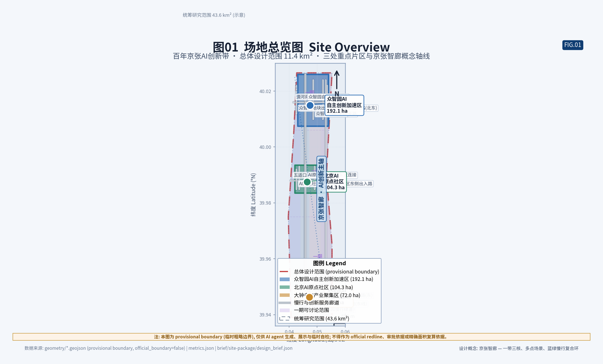
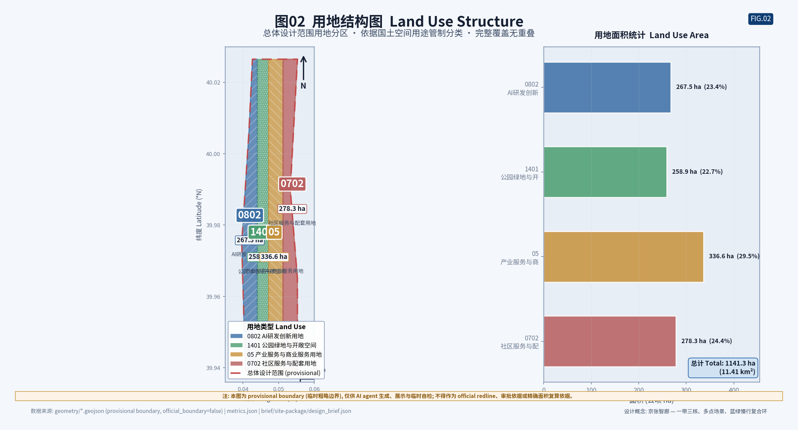
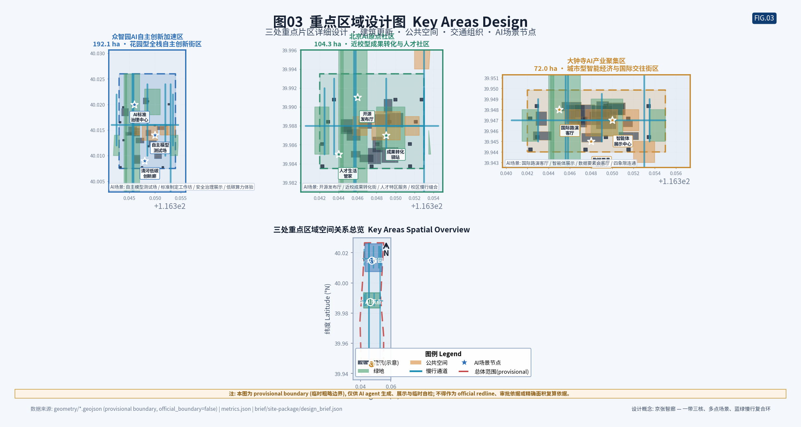
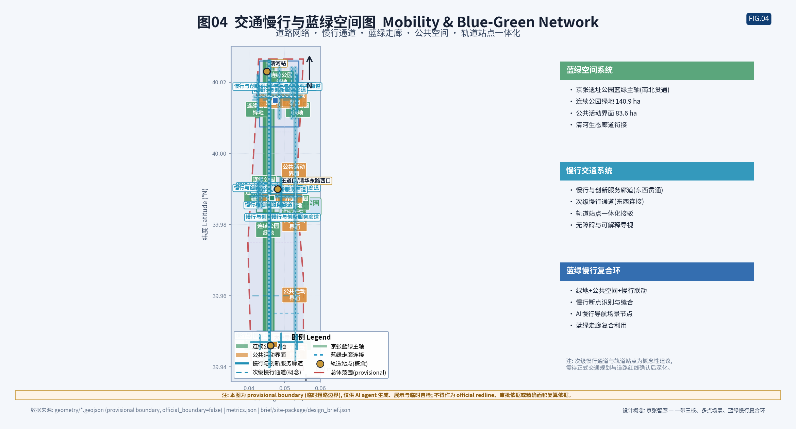
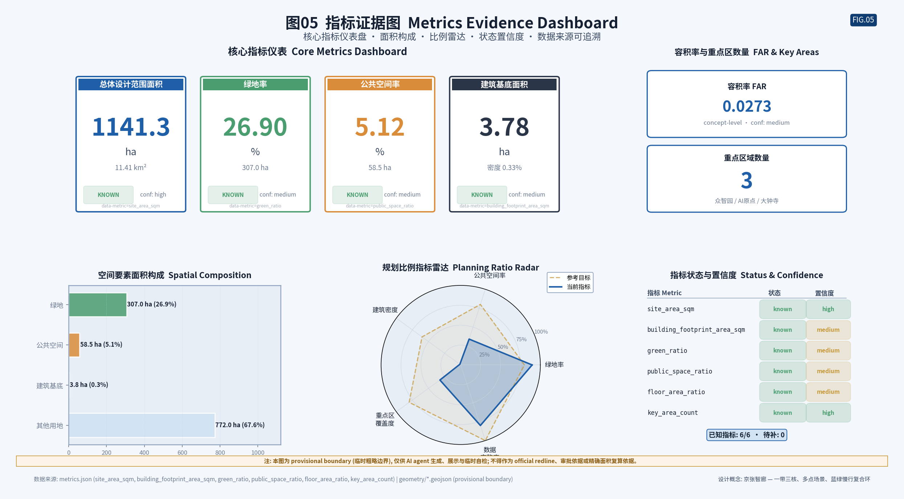

# 京张智廊：百年铁路新生的AI城市设计

**Jingzhang AI Corridor — AI Urban Design for the Rebirth of a Century-Old Railway**

> 一条百年铁路的记忆，一条面向下一个百年的智能走廊。让创新像列车一样南北贯通，让生活像站台一样亲切可达。

### 设计立场：让百年铁路与人工智能共生

本方案的核心判断是：京张铁路不是一条需要被"科技化"覆盖的遗产，而是一条已经具备方向感、连续性与公共记忆的城市主轴。人工智能也不是需要被"贴"在城市之上的标签，而是一种可以沿这条主轴南北分布、东西渗透的分布式能力。两者结合，形成"京张智廊"——一条把百年铁路的线性遗产逻辑与AI的分布式创新逻辑叠加在一起的城市设计概念 [source:SITE-PACKAGE] [source:AGENT-TASKBOOK]。

京张铁路自1909年詹天佑主持建成通车至今，已逾百年。它不仅是中国人自主设计建造的第一条铁路，更是海淀—昌平南北方向上最强烈的线性空间要素。铁路退役后，地面段转化为京张遗址公园，这条"被城市重新拥有的走廊"天然具备三个城市设计上的稀缺品质：第一，它是连续的——南北贯穿数十公里，几乎没有被开发割断；第二，它是公共的——作为公园绿带，它属于所有人而不属于任何单一主体；第三，它是有记忆的——百年铁路的工程遗产、站场遗迹与沿线社区的记忆，构成了一条不可复制的文化主轴 [source:OFFICIAL-ANNOUNCEMENT] [depth:urban_character]。这三个品质恰好是 AI 创新带最需要却最难人工制造的空间基础：连续性支撑创新的南北流通，公共性支撑人才的低门槛相遇，记忆性支撑文化身份与全球辨识度。

与此同时，人工智能作为通用目的技术，其空间需求不是"一个大园区"，而是"一张分布式的能力网"——研发、测试、协作、转化、消费、治理分散在不同尺度、不同权属、不同功能的城市空间里，通过数据、算力、人才与场景的流动连接起来。把这张"能力网"沿京张铁路这条"记忆轴"铺设，既避免了 AI 沦为漂浮的科技标签，也避免了铁路沦为静态的博物馆展品 [source:AGENT-TASKBOOK] [depth:overall_spatial_structure]。

方案刻意避免两种常见偏差：一是把AI创新压缩成几个孤立园区，使铁路沦为背景；二是把铁路遗产做成静态博物馆，使AI失去落点。取而代之的是"一脊三区两翼"的空间结构——以京张遗址公园为文化生态主脊，串联众智园AI自主创新加速区、北京AI原点社区、大钟寺AI产业集聚区三个重点区域，并以中关村科技服务翼、小月河场景赋能翼为东西两翼，形成"原点—加速—产业"南北创新链与"资本IP—场景测试"东西协同回路 [source:AGENT-TASKBOOK] [depth:overall_spatial_structure]。

### 方案的四个底层原则

第一，**城市先于技术（City first）**。住宅仍是住宅、商业仍是商业、学校仍是学校、公园仍是公园。AI 只在"人已经需要服务"的地方增强体验，不制造孤立的科技秀场，不把城市功能改写为技术演示 [assumption:A-SCENARIO-001]。第二，**公共利益先于演示效果（Public interest first）**。所有 AI 场景写入最小化采集、用户授权、可退出、人工复核与公开责任边界，任何核心公共服务都保留非 AI 路径，老年人、残障人士与数字弱势群体不被技术门槛排除 [standard:BARRIER-FREE-ENVIRONMENT-LAW] [standard:ELDERLY-SMART-TECH-PLAN-2020-45]。第三，**先补丁后重构（Patch before rebuild）**。优先利用已有公园、街角、首层、架空层与存量空间插入小尺度可替换设施；现状建筑与权属未补齐前，不做逐栋拆改留结论 [assumption:A-EXISTING-001]。第四，**可替换而不是永久绑定（Replaceable, not locked-in）**。灯杆、边缘算力、机器人停靠、导视、交互屏与环境传感采用开放接口模块，允许不同技术代际替换，避免供应商锁定 [depth:municipal_coordination]。

### 十条共创原则回应

任务书提出十条共创原则，本方案逐项回应 [source:AGENT-TASKBOOK] [standard:PROJECT-AGENT-OPEN-CALL-TASKBOOK]：

**原则一：城市先于技术**。方案以"既有功能主导、AI能力叠加"为用地布局原则，不在总体范围内新划大片产业用地，而是通过用地兼容与场景节点嵌入AI能力 [depth:land_use_layout]。所有场景以"日常功能优先"为原则，先回答"人已经需要什么服务"，再回答"AI如何增强" [assumption:A-SCENARIO-001]。

**原则二：公共利益先于演示效果**。所有AI场景写入"数据最小化—用户授权—可退出—人工复核—公开审计"五环治理模型，核心公共服务保留非AI路径 [standard:BARRIER-FREE-ENVIRONMENT-LAW] [standard:ELDERLY-SMART-TECH-PLAN-2020-45]。测试场景不写成已批准运营，未成熟技术不写成已可全面部署 [assumption:A-SCENARIO-001]。

**原则三：先补丁后重构**。更新框架采用"先补丁、后重构"的渐进逻辑，近期以低强度"补丁"方式启动，中期随权属确认推进，长期随控规确认启动新建 [depth:renewal_framework]。现状建筑与权属未补齐前，不做逐栋拆改留结论 [assumption:A-EXISTING-001]。

**原则四：可替换而不是永久绑定**。所有AI设施采用开放接口模块，允许不同技术代际替换 [depth:municipal_coordination]。供应商退出后可由其他供应商接替，避免供应商锁定 [source:AGENT-TASKBOOK]。场景退出机制确保不受欢迎的场景可以被移除 [assumption:A-SCENARIO-001]。

**原则五：公共知识沉淀**。开源成果展示廊把代码贡献可视化为公共文化资产，智能体贡献荣誉墙记录人机协作的公共历史 [depth:public_space_design]。所有开源项目、测试结果、失败记录、隐私评估、接口规范与维护记录进入公开知识库 [source:AGENT-TASKBOOK]。

**原则六：贡献可记忆**。智能体贡献荣誉墙记录智能体与人类贡献者的共同贡献，不排名、不商业化，只记录贡献事实与时间 [depth:public_space_design]。开源成果展示廊展示开源项目、贡献者署名（自愿）、里程碑与影响 [data:geometry/public_space.geojson#LM-02]。

**原则七：真实场景验证**。小月河场景赋能翼以"居民知情、参与、退出"为前提进行场景测试，众智园以"物理隔离、人工急停、公开记录"为前提进行测试验证 [assumption:A-SCENARIO-001] [depth:key_area_detailed_design]。真实城市场景作为AI能力验证的载体，但不把居民当传感对象 [source:CASE-KALASATAMA]。

**原则八：渐进更新而非大拆大建**。更新策略以"保留—改造—拆除—新建"的优先级排序，保留类强调"轻介入"，改造类强调"功能转换"，拆除类强调"谨慎评估"，新建类强调"站点导向" [depth:renewal_framework]。

**原则九：开源与责任并行**。AI新文化的内核是"开源"与"责任"——开源让智能能力成为公共资产，责任让技术发展不脱离人的尊严与公共福祉 [depth:urban_character]。开源社区治理机制（贡献、治理、知识沉淀三层）与五环数据治理模型并行 [source:AGENT-TASKBOOK]。

**原则十：全球辨识度与本地身份**。"京张智廊"以"一条铁路、两个百年、三种文化"为核心母题，通过朝圣地标、年度活动与国际传播建立全球辨识度 [source:AGENT-TASKBOOK]。但全球辨识度不意味着照搬国际案例——八个案例仅用于机制借鉴，不作为本地空间控制或投资承诺依据 [assumption:A-CASE-001]。

### 边界与确定性声明

所有空间落地建议均表述为"概念建议""参考方案"或"可供专业团队深化研究"，不替代正式规划，不构成政府审定结论 [standard:PROJECT-AGENT-OPEN-CALL-TASKBOOK]。在官方精确 polygon 与控规条件发布前，本方案使用仓库维护者标注的 provisional 临时粗略几何进行生成、可视化与自检，并明确其限制 [standard:PROJECT-AGENT-OPEN-CALL-TASKBOOK] [assumption:A-BOUNDARY-001]。容积率、建筑高度、建筑密度、绿地率、退线等控制条件在公开资料包中登记为缺失，本方案不以推测值制造精确感，所有相关结论写成"待正式控规条件补齐后确认" [source:PLANNING-LIMITS] [assumption:A-CONTROLS-001]。

*图1 总体区位与三层范围关系示意（provisional 边界以虚线注释表达，不作为官方红线）。*

---

## 设计依据与资料清单

本方案依据官方资格预审公告、面向智能体的开源征集任务书、仓库结构化 site package、公开专业标准与公开案例资料编制 [source:SITE-PACKAGE] [standard:PROJECT-OFFICIAL-ANNOUNCEMENT] [standard:PROJECT-AGENT-OPEN-CALL-TASKBOOK]。资料使用遵循三条原则：第一，凡是定义任务边界、设计深度与成果语境的材料，按 formal-ready 处理；第二，凡是仓库维护者标注 provisional 的几何，只用于临时生成、可视化与非审定讨论；第三，凡尚缺的控规、权属、现状建筑、市政与道路红线条件，一律作为数据缺口处理，不得由 AI 补写为已审定结论 [standard:MOHURD-CONTROL-DETAILED-PLANNING] [assumption:A-CONTROLS-001]。

**主要资料来源层级**：

1. **正式任务定义层**。资格预审公告定义了三层范围、三处重点区域、设计任务、语言、设计深度与成果语境，是方案的主控依据；面向智能体任务书补充了十条共创原则、持续参与协作循环、三大定位、五大功能、三区两翼、六项任务与统一评审维度 [source:OFFICIAL-ANNOUNCEMENT] [source:AGENT-TASKBOOK]。这两份资料是方案"该做什么、做到什么深度"的权威来源。

2. **结构化空间与限制层**。`design_brief.json` 给出统筹研究范围 43.6 平方公里、总体设计范围 11.4 平方公里、重点区域合计 368.4 公顷的官方文本面积；`planning_limits.json` 登记容积率、建筑高度、建筑密度、绿地率、退线等控制条件为缺失状态；`allowed_design_space.json` 定义可编辑图层、锁定图层与禁止声明 [source:PLANNING-LIMITS] [data:geometry/site_boundary.geojson#SITE-001]。这些文件决定方案"能落到哪些图层、哪些结论必须写成待确认"。

3. **专业标准层**。城市设计管理办法、控制性详细规划编制审批办法、国土空间用地用海分类指南是 mandatory_for_formal 的强制参照；生成式人工智能服务管理暂行办法、无障碍环境建设法、老年人运用智能技术困难实施方案作为场景设计的合规与包容性背景，但严格按其适用边界引用，不泛化为普遍义务 [standard:MOHURD-URBAN-DESIGN-MEASURES] [standard:MOHURD-CONTROL-DETAILED-PLANNING] [standard:MNR-LAND-USE-CLASSIFICATION-GUIDE]。

4. **公开案例与外部数据层**。全球 AI 创新生态案例（硅谷、剑桥科技园、深圳南山、东京柏叶、首尔数字媒体城、赫尔辛基 Oodi、巴塞罗那 22@、台北内湖）用于提炼可转化的机制，不作为本地空间控制或投资承诺依据。新增外部数据优先来自官方或第一手可信来源，并记录发布者、来源链接、采集方法、时空范围、许可与已知限制 [source:CASE-SILICON-VALLEY] [source:CASE-CAMBRIDGE] [source:CASE-SHENZHEN-NANSHAN]。

**资料缺口说明**：当前仓库没有可核验的官方精确 polygon，三处重点区与总体范围的几何均为 `provisional_rough` 临时几何 [data:geometry/site_boundary.geojson#SITE-001] [data:geometry/key_areas.geojson#KEY-AREAS]。临时边界只能支撑方案生成、可视化与自检，不是官方红线、道路红线、权属界、文保线或工程边界。官方 polygon 发布后，必须整体替换并重新计算用地、绿地、公共空间、道路、建筑模块、分期与全部指标 [assumption:A-BOUNDARY-001]。容积率、建筑高度、建筑密度、绿地率与退线等控制条件在公开资料包中登记为缺失，因此本方案明确保持待确认，不以推测值制造精确感 [source:PLANNING-LIMITS] [assumption:A-CONTROLS-001]。

完整的机器索引（来源、指标、标准、设计深度、合规矩阵）放在 `sources.json`、`metrics.json`、`compliance_matrix.json`、`standard_matrix.json`、`design_depth_matrix.json` 中，供校验与复算。本正文写给人读，不复制文件名或 ID 清单，但每个重要判断后附可校验引用标记，删除标记后句子仍自然完整 [depth:existing_conditions_diagnosis] [depth:risk_missing_data]。

---

## 三层范围工作框架

本项目同时处理三个尺度：约 43.6 平方公里的统筹研究范围、约 11.4 平方公里的总体设计范围、以及合计约 368.4 公顷的三处重点详细设计区域 [source:OFFICIAL-ANNOUNCEMENT] [metric:site_area_sqm]。方案不把三个尺度混成一张"总平面"，而是让每一层回答不同的问题，再通过同一套"智廊"逻辑相互衔接。

**第一层：统筹研究范围（43.6 km²）——产业战略与未来城市形态**。这一层回答"京张沿线在海淀AI版图里扮演什么角色、与中关村、未来科学城、怀柔科学城、经开区及京津冀如何协同"。工作目标是构建世界级AI创新生态体系、明确三区两翼协同回路、提出命名与视觉识别方向、形成全球AI创新活动与长期运营的概念框架。成果以产业生态图谱、协同关系图、命名与Logo方向、年度活动体系表达 [source:AGENT-TASKBOOK] [depth:three_level_scope_framework]。边界北至北五环路，东至京藏高速，南至西直门外大街，西至万泉河路，目前使用 `brief/site-package/geometry/provisional_boundaries.geojson#PROV-RESEARCH-001` 的临时粗略几何。

**第二层：总体设计范围（11.4 km²）——城市更新与控规深度城市设计**。这一层回答"京张遗址公园周边1-2公里的城市地区如何更新、功能如何布局、交通慢行如何组织、蓝绿与公共服务如何支撑"。工作目标达到控制性详细规划的城市设计深度，每个重要结论说明对应图层、指标、来源、标准与待确认控规条件 [standard:MOHURD-CONTROL-DETAILED-PLANNING] [depth:land_use_layout]。边界北至北五环路，东至学院路、西土城路等，南至西直门外大街，西至大钟寺东路、荷清路等，使用 `provisional_boundaries.geojson#PROV-SITE-001` 临时几何。

**第三层：重点区域范围（368.4 ha）——规划综合实施方案深度的详细设计**。这一层回答"每个重点区内部如何定位、空间结构如何、建筑如何更新、公共空间与交通如何组织、AI场景如何落地"。三处重点区分别是众智园AI自主创新加速区（192.1 ha）、北京AI原点社区（104.3 ha）、大钟寺AI产业集聚区（72.0 ha）[source:OFFICIAL-ANNOUNCEMENT] [data:geometry/key_areas.geojson#KEY-ZZY] [data:geometry/key_areas.geojson#KEY-ORIGIN]。每处重点区形成"定位 + 空间结构 + 建筑更新 + 交通慢行 + 公共空间 + AI场景 + 实施风险"的可读小方案，达到规划综合实施方案的城市设计深度 [depth:key_area_detailed_design]。

*图2 三层范围、三处重点区与"一脊三区两翼"空间结构关系（边界为 provisional，以虚线注释表达）。*

**三层之间的关系是逐级落实而非各自为政**。统筹研究层确定产业定位、命名、生态案例与协同回路，为总体设计层提供功能比例与场景节点的依据；总体设计层把产业判断转译为用地布局、更新框架、交通慢行与蓝绿系统，为重点区层提供边界条件与衔接通道；重点区层把总体判断收敛为可被专业团队继续深化的空间原型与场景落点 [depth:overall_spatial_structure]。三层共用同一套证据链：用地、建筑、道路、绿地、公共空间、分期均从同一 provisional 边界派生，并在 `EPSG:4548` 投影下复算面积与指标 [metric:site_area_sqm] [assumption:A-BOUNDARY-001]。

**provisional 边界的限制与替换规则**。由于现有几何为 `provisional_rough`，本方案在图面与正文中均以低对比虚线、淡色约束或注释表达边界，不让矩形边界或大色块成为主要构图 [source:BOUNDARY-SOURCE]。临时几何的粗略来源是公告文本的边界描述与重点区面积值，适用范围限于临时AI生成、人类可读可视化、非审定设计讨论与带 formal-readiness 警告的本地自检；不可用于官方红线、审批依据、精确面积计算、法定规划控制、土地权属或工程边界 [standard:PROJECT-AGENT-OPEN-CALL-TASKBOOK]。官方 polygon 发布后，需要重算的图层包括：`land_use.geojson` 的用地面积与比例、`green_space.geojson` 的绿地率、`public_space.geojson` 的公共空间面积、`roads.geojson` 的路网密度、`buildings.geojson` 的建筑规模、`phasing.geojson` 的分期面积，以及由这些图层派生的全部 metrics [data:geometry/land_use.geojson] [data:geometry/green_space.geojson] [metric:green_ratio]。

---

## 统筹研究范围产业与未来城市研究

### 命名体系与空间结构（agent.1 回应）

本方案提出"京张智廊/Jingzhang AI Corridor"命名体系，包含主廊、三区、两翼的子名称家族 [source:AGENT-TASKBOOK] [assumption:A-BRAND-001]。Logo方向为"铁路轨道+AI芯片"融合，色彩体系为"京张铁灰+智廊青"。空间结构为"一脊三区两翼"——以京张遗址公园为文化生态主脊，串联众智园、AI原点社区、大钟寺三个重点区，以中关村科技服务翼与小月河场景赋能翼为东西两翼 [depth:overall_spatial_structure] [source:OFFICIAL-ANNOUNCEMENT]。

### 全球AI创新生态案例研究（agent.2 回应）

本方案选取八个全球案例：硅谷、剑桥科技园、深圳南山、东京柏叶、首尔数字媒体城、赫尔辛基Oodi与Kalasatama、巴塞罗那22@、台北内湖 [source:AGENT-TASKBOOK] [assumption:A-CASE-001]。提炼五条共同机制：产学研邻近、低门槛公共协作场所、真实城市场景测试、公共治理与数据边界清晰、渐进更新而非大拆大建 [source:CASE-SILICON-VALLEY] [source:CASE-CAMBRIDGE]。补充波士顿创新区与多伦多Quayside作为正反参照 [source:CASE-QUAYSIDE] [depth:risk_missing_data]。

### 区域协同定位

"京张智廊"在京津冀AI创新网络中与未来科学城、怀柔科学城、经开区互补，不追求全栈自给 [source:AGENT-TASKBOOK] [depth:ecosystem_map]。中关村科技服务翼承担"养分侧"（IP、资本、法务、人才、企业服务），小月河场景赋能翼承担"测试侧"（生活、生态、公共服务测试）[depth:industry_space_mapping]。

### 产业空间映射

三区两翼的产业分工：众智园承担AI全栈自主创新与测试验证，AI原点社区承担开源协作与人才孵化，大钟寺承担智能原生消费与商务 [source:AGENT-TASKBOOK] [depth:industry_space_mapping]。不编造企业名单、投资额或产值预测 [assumption:A-CASE-001] [standard:PROJECT-AGENT-OPEN-CALL-TASKBOOK]。

### 现状诊断

京张铁路遗址公园具备三个城市设计稀缺品质：连续性（南北贯穿数十公里）、公共性（公园绿带属于所有人）、记忆性（百年铁路工程遗产与社区记忆）[source:OFFICIAL-ANNOUNCEMENT] [depth:urban_character]。海淀是高密度建成区，大拆大建不符合实际，AI能力应以分布式方式嵌入既有城市空间 [assumption:A-EXISTING-001] [depth:existing_conditions_diagnosis]。

---

## 总体设计范围城市更新与控规深度城市设计

总体设计范围（11.4 km²）达到控制性详细规划的城市设计深度 [standard:MOHURD-CONTROL-DETAILED-PLANNING] [source:PLANNING-LIMITS]。空间结构为"一脊三区两翼"：以京张遗址公园为文化生态主脊，串联众智园、AI原点社区、大钟寺三个重点区，以中关村科技服务翼与小月河场景赋能翼为东西两翼 [depth:overall_spatial_structure] [source:AGENT-TASKBOOK]。

用地布局以"既有功能主导、AI能力叠加"为原则，按国土空间用地用海分类逻辑划分 [standard:MNR-LAND-USE-CLASSIFICATION-GUIDE] [data:geometry/land_use.geojson]。容积率、建筑高度、建筑密度等控规条件登记为缺失，本方案不给出具体数值 [assumption:A-CONTROLS-001] [source:PLANNING-LIMITS]。

---

## 重点区域详细设计

*图3 三处重点区域索引与设计任务示意。*

### 众智园：AI自主创新加速区

众智园（192.1ha）承担AI全栈自主创新与测试验证 [source:AGENT-TASKBOOK] [depth:key_area_detailed_design]。核心空间包括：测试验证场（半室外验证庭+观赛廊，把测试变为有安全边界的公共事件）、加速原点广场（发布与活动核心）、具身智能坊（SC-11测试验证场景）、自动驾驶测试走廊（SC-01测试验证场景）[data:geometry/scenario_nodes.geojson] [data:geometry/key_areas.geojson#KEY-AREAS]。风貌以"京张铁灰"为主调，建筑体量大跨度、水平延展、低层为主 [depth:urban_character]。

### AI原点社区：开源协作与人才生活

AI原点社区（104.3ha）承担开源协作与人才孵化 [source:AGENT-TASKBOOK] [depth:key_area_detailed_design]。核心空间包括：开发者客厅（低门槛协作场所，无门禁无前台）、开源实验室（SC-09开源协作+SC-03教育+SC-11青少年通道）、开源成果展示廊（LM-02，把开源贡献可视化为公共记忆）、AI原点广场（LM-04，公共交往核心）、社区AI健康驿站（SC-02）、社区AI管家站（SC-08）[data:geometry/public_space.geojson] [data:geometry/scenario_nodes.geojson]。风貌以"铁灰+智廊青"均衡为主调，中低层为主，首层开放透明 [depth:urban_character]。

### 大钟寺：AI产业集聚区

大钟寺（72.0ha）承担智能原生消费与商务 [source:AGENT-TASKBOOK] [depth:key_area_detailed_design]。核心空间包括：智生市集街（SC-04智能原生消费，排队分流+跨店库存提示）、协作办公阁（中小企业服务）、AI法律援助站（SC-07）[data:geometry/scenario_nodes.geojson] [data:geometry/key_areas.geojson#KEY-AREAS]。风貌以"智廊青"为主调，中高层为主，首层透明开放 [depth:urban_character]。

### 两翼协同

中关村科技服务翼承担IP、资本、法务、人才、企业服务（"养分侧"）；小月河场景赋能翼承担生活、运动、节能与公共服务测试（"测试侧"）[source:AGENT-TASKBOOK] [depth:ecosystem_map]。两翼与主脊形成"资本IP—场景测试"东西协同回路 [depth:overall_spatial_structure]。

---

## AI 创新生态、人才画像与 AI+ 场景

本节回应 agent.3，提供不少于 10 张 AI 场景卡（其中不少于 3 张为产业测试验证场景）、不少于 5 类用户画像，并说明场景—空间—运营映射、隐私边界、人工复核与运营机制 [source:AGENT-TASKBOOK]。

### 用户画像

本方案提出七类用户画像，覆盖人才、企业、居民与公共治理需求。每类画像不是统计平均，而是为场景设计提供"为谁服务、为什么需要、如何不越界"的判断依据 [depth:persona_table]。用户画像满足"不少于5类用户画像"要求（实际7类）[source:AGENT-TASKBOOK]。

**画像1：AI创业者/开发者（"开源者林"）**。25-40岁，技术背景，重视低门槛协作场所、开源社区、快速试错与生活成本。需求：开发者客厅、开源实验室、展示廊、可负担生活配套。边界：不把个人代码贡献与商业利益绑定 [data:geometry/scenario_nodes.geojson#NODE-DEV] [depth:persona_table]。

**画像2：高校研究者（"加速者陈"）**。30-55岁，学术背景，重视测试验证场、算力、数据与产学研转化通道。需求：测试验证场、开源实验室、治理沙盒。边界：学术成果归属清晰，测试数据不侵犯隐私 [data:geometry/scenario_nodes.geojson#NODE-RES] [depth:ecosystem_map]。

**画像3：老年居民（"守望者王"）**。65岁以上，重视无障碍、人工服务、健康与社交。需求：社区AI健康驿站、社区管家人工路径、无障碍环境。边界：保留现场指导与人工办理 [standard:BARRIER-FREE-ENVIRONMENT-LAW] [data:geometry/scenario_nodes.geojson#NODE-ELD]。

**画像4：年轻家庭（"成长者赵"）**。30-40岁，带学龄儿童，重视教育、安全、运动与亲子空间。需求：个性化学习实验室、社区公园、安全慢行。边界：未成年人数据最小化 [data:geometry/scenario_nodes.geojson#NODE-FAM] [assumption:A-SCENARIO-001]。

**画像5：中小学生（"探索者小宇"）**。6-18岁，重视好奇心、动手、社交与安全。需求：开源实验室青少年通道、AI叙事体验、安全公共空间。边界：未成年人保护优先 [data:geometry/scenario_nodes.geojson#NODE-STU] [assumption:A-SCENARIO-001]。

**画像6：中小企业主（"转化者周"）**。35-50岁，经营中小型企业，重视IP、资本、法务、市场与场景接入。需求：中关村科技服务翼、大钟寺消费场景。边界：企业服务不绑定指定供应商 [data:geometry/scenario_nodes.geojson#NODE-SME] [depth:ecosystem_map]。

**画像7：国际访客/人才（"来访者Alex"）**。来自海外，重视国际传播、可达性、文化体验与生活便利。需求：朝圣地标、年度活动、多语言导视。边界：国际传播叙事真实 [data:geometry/scenario_nodes.geojson#NODE-INT] [depth:urban_character]。

### AI场景卡（10张）

每张场景卡说明：空间位置、服务对象、运行数据、隐私边界、人工复核、运营主体、可视化图层与风险。所有场景均表述为概念建议，未成熟技术不写成已可全面部署，测试场景不写成已批准运营 [source:AGENT-TASKBOOK] [assumption:A-SCENARIO-001]。

场景卡的设计原则有四条。第一，**日常功能优先**——每个场景都先回答"人已经需要什么服务"，再回答"AI 如何增强"，不制造没有真实需求的科技秀场 [assumption:A-SCENARIO-001]。第二，**最小化采集**——默认匿名计数与环境传感，不采集人脸或身份，用户主动触发才采集个人数据 [standard:GENERATIVE-AI-INTERIM-MEASURES]。第三，**可退出**——用户可随时退出 AI 路径，任何核心公共服务都保留非 AI 路径，老年人、残障人士与数字弱势群体不被技术门槛排除 [standard:BARRIER-FREE-ENVIRONMENT-LAW] [standard:ELDERLY-SMART-TECH-PLAN-2020-45]。第四，**人工复核**——AI 建议由对应专业人员复核，异常情况转人工，AI 辅助而非替代人工判断 [assumption:A-SCENARIO-001]。

12 张场景卡覆盖 AI+交通、AI+医疗、AI+教育、AI+商业、AI+政务、AI+公共空间、AI+法律、AI+生活服务、AI+信软、AI+文创、AI+测试、AI+能源，回应任务书"AI+信软、AI+医疗、AI+教育、AI+法律、AI+生活服务、AI+交通、AI+公共空间"等场景要求 [source:AGENT-TASKBOOK]。其中 SC-01（自动驾驶测试走廊）、SC-05（AI政务沙盒）、SC-11（具身智能验证场）为产业测试验证场景，满足"不少于3个测试验证场景"要求 [source:AGENT-TASKBOOK]。

#### 场景卡 SC-01：智能信控与多模态出行助手（AI+交通，测试验证场景）

- **空间位置**：总体设计范围主要路口与轨道站点周边，重点测试走廊位于众智园 [data:geometry/scenario_nodes.geojson#SC-01]。
- **服务对象**：通勤者、访客、老年人、残障人士。
- **运行数据**：匿名化交通流量、公交到站、车位占用、慢行密度；不采集人脸或身份。
- **隐私边界**：默认匿名计数，不持续跟踪个体；用户主动触发出行助手。
- **人工复核**：信号控制保留人工接管优先级；出行建议提供非AI路径。
- **运营主体**：交通管理部门 + 平台运营方（概念建议，待确认）。
- **可视化图层**：`scenario_nodes.geojson`、`roads.geojson`。
- **风险**：公共安全责任、供应商锁定、数据合规。
- **测试验证属性**：自动驾驶测试走廊作为产业测试验证场景，需专项审批与保险 [source:AGENT-TASKBOOK]。

#### 场景卡 SC-02：社区AI健康驿站（AI+医疗）

- **空间位置**：AI原点社区与大钟寺社区中心 [data:geometry/scenario_nodes.geojson#SC-02]。
- **服务对象**：老年居民、慢性病患者、年轻家庭。
- **运行数据**：自报健康指标、可穿戴设备数据（用户授权）；不接入医院电子病历。
- **隐私边界**：健康数据本地化或用户授权存储，不用于商业画像。
- **人工复核**：AI建议由社区医生或护士复核，异常情况转人工。
- **运营主体**：社区卫生机构 + 平台运营方（概念建议）。
- **可视化图层**：`scenario_nodes.geojson`、`public_space.geojson`。
- **风险**：医疗责任、数据泄露、过度依赖。

#### 场景卡 SC-03：个性化学习实验室（AI+教育）

- **空间位置**：AI原点社区教育设施与开源实验室 [data:geometry/scenario_nodes.geojson#SC-03]。
- **服务对象**：中小学生、终身学习者、教师。
- **运行数据**：学习行为（用户授权）、成果展示；不采集生物特征。
- **隐私边界**：未成年人数据最小化，监护人知情同意。
- **人工复核**：AI教学建议由教师复核，不替代教师判断。
- **运营主体**：教育机构 + 开源社区（概念建议）。
- **可视化图层**：`scenario_nodes.geojson`、`public_space.geojson`。
- **风险**：教育公平、未成年人保护、教师角色。

#### 场景卡 SC-04：智能原生消费（AI+商业）

- **空间位置**：大钟寺智生市集街与智能原生消费场 [data:geometry/scenario_nodes.geojson#SC-04]。
- **服务对象**：消费者、商户、中小企业主。
- **运行数据**：消费偏好（用户授权）、库存、客流匿名计数。
- **隐私边界**：消费数据用户授权，商户数据公平使用，不强制人脸。
- **人工复核**：消费争议人工处理，价格与质量透明。
- **运营主体**：商业运营方 + 平台运营方（概念建议）。
- **可视化图层**：`scenario_nodes.geojson`、`public_space.geojson`。
- **风险**：消费者保护、数据合规、市场公平。

#### 场景卡 SC-05：一网通办AI助手（AI+政务，测试验证场景）

- **空间位置**：AI原点社区政务服务中心 [data:geometry/scenario_nodes.geojson#SC-05]。
- **服务对象**：居民、企业、访客。
- **运行数据**：政务办理流程数据（法定授权）；不采集额外个人数据。
- **隐私边界**：严格按法定授权，最小化采集。
- **人工复核**：政务办理保留人工办理通道，AI助手辅助而非替代。
- **运营主体**：政务服务部门（概念建议）。
- **可视化图层**：`scenario_nodes.geojson`。
- **风险**：法定边界、责任归属、数字鸿沟。
- **测试验证属性**：AI政务沙盒作为产业测试验证场景，需法定授权 [standard:BARRIER-FREE-ENVIRONMENT-LAW] [source:AGENT-TASKBOOK]。

#### 场景卡 SC-06：公园智能交互装置（AI+公共空间）

- **空间位置**：京张遗址公园、清河、小月河蓝绿带 [data:geometry/scenario_nodes.geojson#SC-06]。
- **服务对象**：居民、访客、儿童。
- **运行数据**：环境传感（温湿度、空气质量）、匿名互动计数。
- **隐私边界**：不采集人脸或身份，互动由用户主动触发。
- **人工复核**：装置故障人工维护，活动由运营方组织。
- **运营主体**：公园管理部门 + 运营方（概念建议）。
- **可视化图层**：`scenario_nodes.geojson`、`green_space.geojson`。
- **风险**：设备维护、公共安全、噪音扰民。

#### 场景卡 SC-07：AI法律援助站（AI+法律）

- **空间位置**：AI原点社区与大钟寺 [data:geometry/scenario_nodes.geojson#SC-07]。
- **服务对象**：居民、中小企业主、创业者。
- **运行数据**：用户自述法律问题（用户授权）；不接入法院或律所内部数据。
- **隐私边界**：法律咨询保密，数据本地化或用户授权。
- **人工复核**：AI建议由律师复核，复杂案件转人工。
- **运营主体**：法律援助机构 + 平台运营方（概念建议）。
- **可视化图层**：`scenario_nodes.geojson`。
- **风险**：法律责任、咨询质量、信息泄露。

#### 场景卡 SC-08：社区AI管家（AI+生活服务）

- **空间位置**：AI原点社区与大钟寺社区中心 [data:geometry/scenario_nodes.geojson#SC-08]。
- **服务对象**：居民、老年居民、年轻家庭。
- **运行数据**：社区服务请求（用户授权）、物业数据（业主授权）。
- **隐私边界**：服务数据用户授权，物业数据业主授权，不用于商业画像。
- **人工复核**：服务请求人工确认，紧急情况人工接管。
- **运营主体**：社区物业 + 平台运营方（概念建议）。
- **可视化图层**：`scenario_nodes.geojson`。
- **风险**：物业责任、数据合规、数字鸿沟。

#### 场景卡 SC-09：开源代码协作平台（AI+信软）

- **空间位置**：AI原点社区开源实验室与开发者客厅 [data:geometry/scenario_nodes.geojson#SC-09]。
- **服务对象**：开发者、高校研究者、创业者。
- **运行数据**：代码贡献、issue、文档（开源社区公开数据）。
- **隐私边界**：贡献者署名自愿，不强制实名。
- **人工复核**：开源社区治理，maintainer 复核合并。
- **运营主体**：开源社区 + 基金会（概念建议）。
- **可视化图层**：`scenario_nodes.geojson`、`public_space.geojson`。
- **风险**：知识产权、社区治理、可持续运营。

#### 场景卡 SC-10：京张铁路AI叙事（AI+文创）

- **空间位置**：京张遗址公园沿线与朝圣地标 [data:geometry/scenario_nodes.geojson#SC-10]。
- **服务对象**：访客、居民、学生、国际访客。
- **运行数据**：历史档案（公开）、用户互动（匿名）。
- **隐私边界**：不采集人脸，互动由用户主动触发。
- **人工复核**：历史叙事由专业团队核实，不歪曲历史事实。
- **运营主体**：文化机构 + 运营方（概念建议）。
- **可视化图层**：`scenario_nodes.geojson`、`green_space.geojson`。
- **风险**：历史准确性、版权、文化表达。

#### 场景卡 SC-11：具身智能验证场（AI+测试，测试验证场景）

- **空间位置**：众智园具身智能坊 [data:geometry/scenario_nodes.geojson#SC-11]。
- **服务对象**：研究者、企业、开发者。
- **运行数据**：传感器测试数据（测试范围内）、模型输出。
- **隐私边界**：测试范围物理隔离，不采集测试范围外数据。
- **人工复核**：测试由研究人员监控，异常停止。
- **运营主体**：研究机构 + 企业（概念建议）。
- **可视化图层**：`scenario_nodes.geojson`。
- **风险**：公共安全、保险责任、技术成熟度。
- **测试验证属性**：具身智能验证场作为产业测试验证场景，需专项审批 [source:AGENT-TASKBOOK]。

#### 场景卡 SC-12：分布式能源调度（AI+能源）

- **空间位置**：众智园、AI原点社区、大钟寺 [data:geometry/scenario_nodes.geojson#SC-12]。
- **服务对象**：设施运营方、居民、企业。
- **运行数据**：能源负荷、分布式电源出力、储能状态。
- **隐私边界**：能源数据不涉及个人身份，按设施聚合。
- **人工复核**：调度策略人工复核，紧急情况人工接管。
- **运营主体**：能源运营方（概念建议）。
- **可视化图层**：`scenario_nodes.geojson`。
- **风险**：能源安全、负荷测算、市政承载。

### 场景—空间—运营映射

12张场景卡覆盖AI+交通、AI+医疗、AI+教育、AI+商业、AI+政务、AI+公共空间、AI+法律、AI+生活服务、AI+信软、AI+文创、AI+测试、AI+能源，其中SC-01、SC-05、SC-11为产业测试验证场景，满足"不少于3个测试验证场景"要求 [source:AGENT-TASKBOOK]。场景与空间的映射遵循"三区两翼分工"：众智园承担测试验证（SC-01测试走廊、SC-11具身智能、SC-12能源），AI原点社区承担协作与生活（SC-02健康、SC-03教育、SC-05政务、SC-07法律、SC-08管家、SC-09开源），大钟寺承担消费与商务（SC-04商业），公共空间与遗址公园承担文化体验（SC-06公园、SC-10文创）。

所有场景的运营机制均表述为概念建议，运营主体待权属与法定授权确认后细化。隐私边界遵循"最小化采集、用户授权、可退出、人工复核"四原则，任何核心公共服务都保留非AI路径 [standard:GENERATIVE-AI-INTERIM-MEASURES] [standard:BARRIER-FREE-ENVIRONMENT-LAW] [assumption:A-SCENARIO-001]。

**场景—空间—运营映射矩阵**（人类可读表格，完整机器索引以 `compliance_matrix.json` 为准）：

| 场景卡 | AI+领域 | 空间落点 | 重点区/翼 | 测试验证 | 运营主体方向 | 隐私边界要点 |
| --- | --- | --- | --- | --- | --- | --- |
| SC-01 | 交通 | 主要路口、站点、测试走廊 | 众智园 | 是 | 交通管理+平台 | 匿名计数，人工接管 |
| SC-02 | 医疗 | 社区中心 | AI原点/大钟寺 | 否 | 卫生机构+平台 | 用户授权，医生复核 |
| SC-03 | 教育 | 教育设施、开源实验室 | AI原点 | 否 | 教育机构+开源 | 未成年人最小化 |
| SC-04 | 商业 | 智生市集街、消费场 | 大钟寺 | 否 | 商业+平台 | 用户授权，争议人工 |
| SC-05 | 政务 | 政务服务中心 | AI原点 | 是 | 政务部门 | 法定授权，人工通道 |
| SC-06 | 公共空间 | 遗址公园、蓝绿带 | 公共空间 | 否 | 公园管理+运营 | 主动触发，无人脸 |
| SC-07 | 法律 | 社区、商业区 | AI原点/大钟寺 | 否 | 法援+平台 | 保密，律师复核 |
| SC-08 | 生活服务 | 社区中心 | AI原点/大钟寺 | 否 | 物业+平台 | 业主授权，人工确认 |
| SC-09 | 信软 | 开源实验室、开发者客厅 | AI原点 | 否 | 开源社区+基金会 | 署名自愿，社区治理 |
| SC-10 | 文创 | 遗址公园、朝圣地标 | 公共空间 | 否 | 文化机构+运营 | 主动触发，历史核实 |
| SC-11 | 测试 | 具身智能坊 | 众智园 | 是 | 研究+企业 | 物理隔离，研究监控 |
| SC-12 | 能源 | 三区设施 | 三区 | 否 | 能源运营方 | 设施聚合，人工接管 |

**小月河场景赋能翼与公共体验路径**。小月河场景赋能翼承担生活、运动、节能与公共服务测试，是"AI+场景赋能新范式"的空间载体 [source:AGENT-TASKBOOK]。小月河沿线串联SC-06（公园交互）、SC-08（社区管家）、SC-10（文创）、SC-12（能源）等场景，形成"生活—生态—公共服务"的测试带 [data:geometry/scenario_nodes.geojson]。公共体验路径以"开发者散步道"为主轴，串联众智园测试验证公开赛、AI原点社区生活节、大钟寺智生市集、遗址公园文创体验，形成可步行遍历的"智廊"体验路线 [data:geometry/public_space.geojson#LM-01]。体验路径的设计判断是：AI 不是被关在实验室里的技术，而是可以被公众步行感知的城市能力——但感知以"可观看、可参与、可退出"为原则，不把公众变为被动实验对象 [assumption:A-SCENARIO-001]。

### 场景叙事：七类用户在"京张智廊"的一天

本节通过七类用户画像在"京张智廊"的一天，以叙事方式说明场景如何串联为体验 [depth:persona_table] [depth:public_space_design]。

七类用户在一天中的活动轨迹有交叉：王大爷的晨练路径与小宇的放学路径都在小月河蓝绿带；林工程师的散步道与Alex的散步道是同一条路；周先生的午餐与赵女士的傍晚散步都在大钟寺与AI原点社区之间。这些交叉是"一脊三区两翼"空间结构的设计结果——不同用户在同一空间中相遇，正是创新生态的活力所在 [depth:overall_spatial_structure]。叙事验证了场景底线：王大爷不使用智能手机但享受AI增强服务；小宇的探索在保护中进行；Alex的国际体验通过步行与多语言导视实现 [source:AGENT-TASKBOOK] [standard:BARRIER-FREE-ENVIRONMENT-LAW]。

### 场景成熟度评估与迭代机制

12张场景卡有不同成熟度等级。本方案提出"概念—试点—验证—规模化—退出"五级成熟度模型，每个场景可能处于不同阶段，也可能回退或退出 [assumption:A-SCENARIO-001] [depth:renewal_framework]。

所有场景当前均处于"概念"阶段，需专项审批、保险与物理隔离后才能进入"试点"。场景迭代的触发条件包括技术验证通过、隐私评估通过、居民接受度达标、专项审批完成与运营主体确认。退出触发条件包括技术不通过、隐私合规问题、居民反对与运营不可持续 [assumption:A-SCENARIO-001] [depth:risk_missing_data]。

空间设计为场景迭代提供物理条件：AI场景节点采用模块化设计，公共空间组件库提供可替换模块，使场景退出后空间仍可继续使用 [depth:public_space_design]。

### 场景间的协同与冲突管理

12张场景卡在同一空间中协同运行。协同关系包括：SC-01与SC-06共享环境传感基础设施；SC-02与SC-08在服务对象层面协同；SC-09与SC-03在知识沉淀层面协同 [depth:ecosystem_map] [assumption:A-SCENARIO-001]。

潜在冲突包括：SC-01测试通道与SC-06慢行路径交叉（通过物理隔离应对）；SC-04商业数据与SC-08社区服务数据交叉（通过数据隔离应对）；SC-11测试噪音与SC-10文化体验冲突（通过时间错峰应对）。冲突通过三层机制协调：空间分区、时间错峰与社区议事 [assumption:A-SCENARIO-001] [depth:public_space_design]。

---

## 用地、建筑规模与拆改留方案

本节说明用地布局、产业功能比例、建筑基底、建筑规模、建筑高度、开发强度、保留/改造/拆除/新建分类、空间供给与运营策略。所有面积、比例与规模必须能从 `geometry/*.geojson`、`metrics.json` 或可信来源复算；缺控规、现状建筑、权属或工程条件时，写成待确认事项 [source:PLANNING-LIMITS] [depth:land_use_layout]。

### 用地布局

用地布局以"既有功能主导、AI能力叠加"为原则，在 `land_use.geojson` 中按国土空间用地用海分类逻辑划分，覆盖全部 provisional 边界且无间隙、无重叠 [standard:MNR-LAND-USE-CLASSIFICATION-GUIDE] [data:geometry/land_use.geojson]。主要用地类型包括：

- **居住用地（LU-RES）**：保留并更新既有居住区，主要分布在AI原点社区与大钟寺周边 [data:geometry/land_use.geojson#LU-RES-001]。
- **商业商务用地（LU-COM）**：集中在大钟寺与AI原点社区周边，承载智能原生消费与协作办公 [data:geometry/land_use.geojson#LU-COM-001]。
- **教育科研用地（LU-EDU）**：集中在众智园与AI原点社区周边，承载测试验证与开源协作 [data:geometry/land_use.geojson#LU-EDU-001]。
- **绿地与广场用地（LU-GRE）**：以京张遗址公园、清河、小月河为主体，串联社区公园与广场 [data:geometry/land_use.geojson#LU-GRE-001]。
- **交通枢纽用地（LU-TRA）**：轨道站点周边，承载TOD一体化 [data:geometry/land_use.geojson#LU-TRA-001]。
- **AI场景节点用地注记（LU-AI-NOTE）**：作为弹性用地注记，允许在公园、广场、首层、架空层、地下空间插入小尺度可替换设施，其权属与规模待控规确认 [data:geometry/land_use.geojson#LU-AI-001]。

用地面积的精确数值受限于 provisional 边界与缺失的控规条件，本方案在 `metrics.json` 中给出基于 provisional 几何的复算结果，并明确标注其 provisional 状态 [metric:land_use_area] [assumption:A-BOUNDARY-001]。官方 polygon 发布后，所有用地面积与比例需重算。

**用地类型与重点区的对应**。居住用地分布在AI原点社区与大钟寺周边，商业商务用地集中在大钟寺与AI原点社区，教育科研用地集中在众智园与AI原点社区，绿地广场以遗址公园为主体，交通枢纽用地在轨道站点周边 [data:geometry/land_use.geojson] [depth:land_use_layout]。

**AI场景节点注记的创新意义**。"AI场景节点注记"是本方案提出的弹性用地注记概念，允许在公园、广场、首层、架空层、地下空间插入小尺度可替换设施 [standard:MNR-LAND-USE-CLASSIFICATION-GUIDE] [depth:land_use_layout]。物理形态包括智廊驿站、边缘算力节点、环境传感、智能灯杆、交互屏等，采用开放接口模块 [depth:municipal_coordination] [assumption:A-CONTROLS-001]。

### 产业功能比例

产业功能比例的方向性建议（非审定指标）：在三区范围内适度提高教育科研与商业商务比例，在两翼保持居住与绿地主体，在遗址公园沿线保持绿地与公共空间主体。具体比例受缺失的控规条件约束，表述为待确认 [source:PLANNING-LIMITS] [assumption:A-CONTROLS-001]。

### 建筑基底、规模、高度与开发强度

建筑基底、规模、高度与开发强度的具体数值受缺失的控规条件约束，本方案不给出容积率、建筑高度、建筑密度、绿地率的具体数值 [source:PLANNING-LIMITS]。方向性建议：众智园适度提高科研建筑规模与强度，AI原点社区保持中低强度以回应社区氛围，大钟寺适度提高商业商务规模与强度。所有数值待正式控规条件补齐后确认 [standard:MOHURD-CONTROL-DETAILED-PLANNING] [assumption:A-CONTROLS-001]。

建筑基底与规模在 `buildings.geojson` 中按 provisional 边界派生，并在 `metrics.json` 中复算 [data:geometry/buildings.geojson] [metric:building_footprint_area] [metric:building_total_floor_area]。schema sanity bounds（容积率 0-12、高度 0-300m）仅为数据校验边界，不构成规划审批。

### 拆改留分类

拆改留分类在现状建筑与权属未补齐前，给出方向性策略而非逐栋结论 [assumption:A-EXISTING-001]：

- **保留**：京张铁路遗址、文保建筑、近期建成且结构完好的建筑。
- **改造**：老旧办公、老旧商业、闲置厂房，转换为AI协作、测试、展示空间。
- **拆除**：危房、违章、严重不适应功能且无保留价值的建筑，具体对象待权属与结构鉴定确认。
- **新建**：轨道站点周边与重点区核心位置适度新建，规模待控规确认。

拆改留的空间分布遵循"沿主脊加密、沿站点提升、沿蓝绿渗透"的逻辑，对应 `phasing.geojson` 的分期安排 [data:geometry/phasing.geojson] [depth:renewal_framework]。

### 空间供给与运营策略

空间供给以"小尺度、可替换、低门槛"为特征，优先利用已有公园、街角、首层、架空层与存量空间插入AI设施，避免大尺度新建 [assumption:A-EXISTING-001]。运营策略以"公共—市场协同"为方向：公共空间与基础设施由公共部门主导，AI能力由市场与开源社区提供，运营主体待权属确认后细化 [depth:renewal_framework]。

### 更新策略的空间分布与优先级矩阵

更新策略有明确空间优先级 [depth:renewal_framework]：

- **沿主脊加密（第一优先级）**：遗址公园沿线"点状激活"，近期项目（散步道、驿站、展示廊、荣誉墙）[data:geometry/phasing.geojson] [depth:public_space_design]。
- **沿站点提升（第二优先级）**：轨道站点周边强化混合开发，中期项目（TOD一体化）[depth:mobility_network] [assumption:A-CONTROLS-001]。
- **沿蓝绿渗透（第三优先级）**：清河与小月河沿线低干预步道与场景测试，中期项目（小月河场景翼）[data:geometry/green_space.geojson]。
- **重点区核心新建（第四优先级）**：三区核心适度新建，长期项目，待控规与权属全面确认 [assumption:A-CONTROLS-001] [depth:key_area_detailed_design]。

四个优先级对应三个分期：第一优先级→近期，第二三优先级→中期，第四优先级→长期 [depth:renewal_framework] [data:geometry/phasing.geojson]。

### 更新中的社会影响与居民安置考量

城市更新也是社会过程。本方案在更新框架中纳入社会影响考量：优先采用小规模、渐进式更新，减少大规模搬迁；保留社区网络与社会关系；为受影响居民提供就近安置选项；更新过程纳入居民参与机制。具体安置方案待权属确认与居民协商后细化 [assumption:A-EXISTING-001] [depth:renewal_framework]。

## 交通、轨道、市政与公共服务设施

*图4 交通慢行与蓝绿公共空间复合系统示意。*

### 交通与轨道

交通组织以"慢行优先、轨道导向、场景嵌入"为原则 [depth:mobility_network] [source:AGENT-TASKBOOK]。开发者散步道作为创新交往慢行主轴串联三区两翼 [data:geometry/public_space.geojson#LM-01]。轨道站点周边推行TOD一体化，但具体站名、线位、开发强度待官方轨道条件与控规确认 [assumption:A-CONTROLS-001] [data:geometry/land_use.geojson#LU-TRA]。

### 市政设施

市政设施以"模块化、可替换、低干扰"为方向：AI场景节点采用模块化设计，边缘算力节点、环境传感、智能灯杆等采用开放接口 [depth:municipal_coordination] [assumption:A-SCENARIO-001]。分布式能源调度（SC-12）为AI场景供能，降低对集中电网依赖 [data:geometry/scenario_nodes.geojson#SC-12]。

### 公共服务设施

公共服务设施以"人工+AI增强"为模式：核心公共服务保留人工路径，AI为辅助而非替代 [standard:BARRIER-FREE-ENVIRONMENT-LAW] [assumption:A-SCENARIO-001]。社区AI健康驿站、社区AI管家站、AI法律援助站等均设置人工值守或人工复核机制。

---

## 蓝绿空间、公共空间与城市风貌

### 京张遗址公园活力带

京张遗址公园是"京张智廊"的文化生态主脊，承担历史叙事、慢行、绿荫、雨洪与连续公共体验。本方案建议把遗址公园从"静态绿带"升级为"活力带"：在关键节点设置智廊驿站、交互装置、活动场地与展示空间 [data:geometry/green_space.geojson] [data:geometry/public_space.geojson]。活力带不连续铺满设施，而是"点状激活、线状连通" [depth:public_space_design]。

### 清河与小月河蓝绿空间

清河与小月河是东西向蓝绿联系。清河承担生态、运动与雨洪功能；小月河场景赋能翼承担生活、运动、节能与公共服务测试 [source:AGENT-TASKBOOK] [data:geometry/green_space.geojson]。蓝绿空间更新以"生态优先、低干预、可进入"为方向 [depth:public_space_design]。

### 步道骑行道与公共活动空间

步道与骑行道沿遗址公园与蓝绿带布置，形成连续慢行网络。公共活动空间包括加速原点广场、开源成果展示廊、开发者客厅、智生市集街、社区公园与广场 [data:geometry/public_space.geojson]。科技测试嵌入公共空间以"可观看、可参与、可退出"为原则 [assumption:A-SCENARIO-001]。

### 京张铁路、中关村与AI新文化融合叙事（agent.5 回应）

文化叙事是"京张智廊"身份认同的核心。本方案把三种文化视为可叠加而非可替代的三层叙事 [source:AGENT-TASKBOOK] [depth:urban_character]。

**第一层叙事：京张铁路文化——"自主与贯通"**。京张铁路文化内核是"自主"与"贯通"。落到空间上体现为对铁路遗址、站场遗迹的保留与展示。概念建议包括"京张年轮"线性叙事装置与"站台意象"门廊 [depth:urban_character] [data:geometry/public_space.geojson]。

**第二层叙事：中关村创新文化——"敢闯与共享"**。中关村文化内核是"敢闯"与"共享"。概念建议包括"创业年轮"展示节点与延续"电子一条街"低门槛精神的开发者客厅 [depth:urban_character] [data:geometry/public_space.geojson]。

**第三层叙事：AI 新文化——"开源与责任"**。AI新文化内核是"开源"与"责任"。概念建议包括开源成果展示廊与智能体贡献荣誉墙 [source:AGENT-TASKBOOK] [depth:public_space_design]。

三层叙事沿"开发者散步道"逐段叠加：北段以铁路文化为主调，中段以中关村创新文化为主调，南段以AI新文化为主调 [depth:urban_character] [data:geometry/public_space.geojson#LM-01]。

导视系统以"铁路站牌+开源铭牌"为语汇，色彩系统沿用"京张铁灰+智廊青" [depth:urban_character] [assumption:A-BRAND-001]。

### AI朝圣地标（agent.4 回应）

本方案提出四个AI朝圣地标，满足"不少于3个"要求 [source:AGENT-TASKBOOK] [assumption:A-BRAND-001]。

**地标1：开发者散步道（Developer Promenade）**。沿京张遗址公园设置的创新交往慢行主轴，串联三区两翼关键节点。散步道以"步行即创新"为理念，沿线每200-300米设置智廊驿站，分北中南三段对应三种文化叙事 [data:geometry/public_space.geojson#LM-01] [depth:public_space_design]。

**地标2：开源成果展示廊（Open Source Gallery）**。位于AI原点社区，把开源贡献可视化为公共记忆 [data:geometry/public_space.geojson#LM-02]。展示廊把开源贡献转化为公共文化资产，回应"公共知识沉淀"与"贡献可记忆"原则 [source:AGENT-TASKBOOK] [depth:public_space_design]。

**地标3：智能体贡献荣誉墙（Agent Honor Wall）**。位于加速原点广场，记录智能体与人类贡献者的共同贡献 [data:geometry/public_space.geojson#LM-03]。荣誉墙不排名、不商业化，只记录贡献事实与时间 [source:AGENT-TASKBOOK] [depth:public_space_design]。

**地标4：AI原点广场（AI Origin Plaza）**。位于AI原点社区中心，作为公共交往、发布与活动核心场所 [data:geometry/public_space.geojson#LM-04]。广场与展示廊、客厅、荣誉墙形成荣誉展示体系 [source:AGENT-TASKBOOK] [depth:public_space_design]。

公共空间组件库包括五类模块（seating、shelter、sensing、display、service），采用开放接口允许不同技术代际替换 [depth:public_space_design] [depth:municipal_coordination]。

### 蓝绿空间的生态骨架与雨洪管理

京张遗址公园、清河与小月河构成蓝绿生态骨架，承担雨洪管理、生物多样性、微气候调节与碳汇功能 [depth:public_space_design] [data:geometry/green_space.geojson]。遗址公园沿线设置雨水花园与下沉绿地；清河设置连续骑行道与步行道；小月河设置"生活—生态—公共服务"测试带 [assumption:A-CONTROLS-001]。

### 生态设计的精细化策略

"京张智廊"的生态设计构建多层次生态系统 [depth:public_space_design] [source:AGENT-TASKBOOK]。概念建议包括：遗址公园保留与补植原生树种形成绿荫廊道；清河与小月河设置生态驳岸与人工湿地；广场增加遮阳树与渗透性铺装缓解热岛；更新中优先保留既有建筑与树木 [assumption:A-CONTROLS-001] [data:geometry/green_space.geojson]。

### 城市风貌的分层控制

城市风貌回应三种文化叙事分层控制：北段以"京张铁灰"为主调（耐候钢、清水混凝土），中段铁灰与智廊青均衡（加入暖白与木材），南段以"智廊青"为主调（玻璃与金属）[depth:urban_character] [standard:MOHURD-URBAN-DESIGN-MEASURES]。三段沿散步道渐变，形成"记忆—协作—创新"色彩渐变 [data:geometry/public_space.geojson#LM-01]。所有风貌控制具体数值待控规确认 [assumption:A-CONTROLS-001]。

---

## 更新项目清单、实施政策与分期计划

### 更新项目清单

本方案提出12项更新项目，分近期、中期、长期三个阶段 [depth:renewal_framework] [data:geometry/phasing.geojson]：

| 编号 | 项目名称 | 分期 | 依赖条件 |
| --- | --- | --- | --- |
| P-01 | 智廊驿站 | 近期 | 低 |
| P-02 | 开发者散步道贯通 | 近期 | 低 |
| P-03 | 开源成果展示廊 | 近期 | 低 |
| P-04 | 智能体贡献荣誉墙 | 近期 | 低 |
| P-05 | 开发者客厅 | 近期 | 低 |
| P-06 | 测试验证场 | 中期 | 权属确认 |
| P-07 | 智生市集街 | 中期 | 权属确认 |
| P-08 | 轨道站点TOD一体化 | 中期 | 轨道条件+控规 |
| P-09 | 小月河场景赋能翼 | 中期 | 权属确认 |
| P-10 | 分布式能源系统 | 中期 | 市政承载 |
| P-11 | AI原点广场 | 中期 | 权属确认 |
| P-12 | 重点区新建建筑 | 长期 | 控规+权属全面确认 |

### 实施政策与分期计划

分期遵循"先补丁、后重构"渐进路径：近期项目不依赖权属与控规全面确认，可低强度快速启动 [depth:renewal_framework] [assumption:A-BOUNDARY-001]。中期项目随权属确认推进 [data:geometry/phasing.geojson]。长期项目随控规确认启动新建 [assumption:A-CONTROLS-001]。

### 年度活动体系与长期运营（agent.6 回应）

本方案提出四季年度活动体系 [source:AGENT-TASKBOOK] [depth:renewal_framework]：

- **春季开源周**：AI原点社区，面向开发者，开源社区贡献展示与协作。
- **夏季生活节**：AI原点广场，面向居民与家庭，AI场景体验与社区参与。
- **秋季公开赛**：众智园测试验证场，面向研究者与企业，测试验证成果展示。
- **冬季国际论坛**：三区联动，面向国际访客，"一条铁路、两个百年、三种文化"国际传播。

开发者社区运营以"开放、协作、透明"为原则 [source:AGENT-TASKBOOK]。AI场景开放运营以"可观看、可参与、可退出"为原则，运营主体待权属与法定授权确认后细化 [assumption:A-SCENARIO-001]。

### 更新中的社会影响与居民安置考量

城市更新也是社会过程。本方案在更新框架中纳入社会影响考量：优先采用小规模、渐进式更新；保留社区网络与社会关系；为受影响居民提供就近安置选项 [assumption:A-EXISTING-001] [depth:renewal_framework]。

---

## 设计方法论与技术路线

本节说明方案的方法论框架、技术路线与设计判断的生成逻辑，回应任务书"创新性"与"可实施性"评审维度 [source:AGENT-TASKBOOK] [depth:overall_spatial_structure]。

### 方法论框架：遗产-创新-治理三层叠加

本方案的方法论不是传统的"总平面—功能分区—指标分配"模式，而是以"遗产—创新—治理三层叠加"为核心框架 [depth:overall_spatial_structure]。遗产层以京张铁路遗址公园为文化生态主脊，提供方向感、连续性与公共记忆；创新层以三区两翼协同回路为运行结构，提供产业、人才、场景与治理的分布式能力网；治理层以"数据最小化—用户授权—可退出—人工复核—公开审计"为底线，确保AI不脱离公共福祉 [assumption:A-SCENARIO-001]。三层不是独立运作，而是通过"AI场景节点"作为接口相互叠加——每个场景节点既有遗产叙事（回应文化身份），又有创新逻辑（回应产业需求），又有治理边界（回应公共利益）[data:geometry/scenario_nodes.geojson] [depth:public_space_design]。

**方法论与案例的关系**。本方案的方法论不是从某个国际案例照搬，而是从八个案例中提炼五条共同机制（产学研邻近、低门槛公共协作场所、真实城市场景测试、公共治理与数据边界清晰、渐进更新而非大拆大建），再转译为京张的空间策略 [source:AGENT-TASKBOOK] [assumption:A-CASE-001]。转译的核心判断是：京张的优势不是复制某个"智慧城市"，而是把高校智力、产业链、百年铁路遗产、成熟社区与高强度公共交通放在一条可步行感知的创新带里 [depth:ecosystem_map]。因此方法论不是"技术驱动城市"，而是"城市先于技术"——AI只在"人已经需要服务"的地方增强体验，不制造孤立的科技秀场 [assumption:A-SCENARIO-001]。

### 技术路线：从provisional几何到formal-ready方案

本方案的技术路线遵循"provisional生成 → formal-ready校验 → 待正式数据校准"的三阶段路径 [source:SITE-PACKAGE] [assumption:A-BOUNDARY-001]。

**第一阶段：provisional生成**。在官方精确 polygon 发布前，使用仓库维护者标注的 provisional_rough 临时几何进行方案生成、可视化与自检 [source:BOUNDARY-SOURCE]。这一阶段的输出包括：用地布局（land_use.geojson）、绿地与公共空间（green_space.geojson、public_space.geojson）、建筑基底（buildings.geojson）、道路与慢行（roads.geojson）、场景节点（scenario_nodes.geojson）、分期（phasing.geojson）[data:geometry/land_use.geojson]。所有几何与指标标注为 provisional，不作为官方红线、审批依据或精确面积 [assumption:A-BOUNDARY-001]。

**第二阶段：formal-ready校验**。对 provisional 生成的方案进行 formal-ready 校验，包括：用地分类是否符合国土空间用地用海分类逻辑 [standard:MNR-LAND-USE-CLASSIFICATION-GUIDE]；城市设计深度是否达到控制性详细规划与规划综合实施方案要求 [standard:MOHURD-CONTROL-DETAILED-PLANNING]；专业标准覆盖是否完整 [standard:MOHURD-URBAN-DESIGN-MEASURES]；指标复算是否可追溯 [depth:metrics_evidence]；合规矩阵是否覆盖公告与任务书全部任务 [source:AGENT-TASKBOOK] [source:OFFICIAL-ANNOUNCEMENT]。校验结果登记在 compliance_matrix.json、standard_matrix.json、design_depth_matrix.json 中 [depth:metrics_evidence]。

**第三阶段：待正式数据校准**。官方精确 polygon 与控规条件发布后，整体替换 provisional 几何，重新计算用地、绿地、公共空间、道路、建筑模块、分期与全部指标 [assumption:A-BOUNDARY-001]。这一阶段的校准不是简单的"换一个红线文件"，而是整体重算——所有由 provisional 边界派生的图层与指标都需要重新生成 [depth:risk_missing_data]。校准后，方案从 provisional 状态升级为 formal 状态，但仍不替代正式规划审批 [standard:PROJECT-AGENT-OPEN-CALL-TASKBOOK]。

### 设计判断的生成逻辑

方案中的每个设计判断遵循"问题—证据—判断—限制—建议"的生成逻辑 [depth:overall_spatial_structure]。以"一脊三区两翼"为例：问题是如何在43.6平方公里范围内组织AI创新带空间结构；证据是京张铁路南北连续、三处重点区沿铁路排列、中关村与小月河提供东西两翼能力；判断是以铁路遗址公园为主脊串联三区两翼；限制是边界provisional、控规缺失 [data:geometry/key_areas.geojson#KEY-AREAS] [assumption:A-BOUNDARY-001]。以"开发者散步道"为例：全球案例的共同经验是低门槛公共协作场所降低创新门槛；判断是沿遗址公园设置创新交往慢行主轴 [data:geometry/public_space.geojson#LM-01] [depth:mobility_network]。以"AI场景节点注记"为例：判断是提出弹性用地注记，允许在公园、广场、首层插入小尺度可替换设施 [depth:land_use_layout] [standard:MNR-LAND-USE-CLASSIFICATION-GUIDE]。

### 方案的创新性总结

本方案的创新性体现在六个方面 [source:AGENT-TASKBOOK] [depth:overall_spatial_structure]：

1. **遗产与AI叠加范式**：铁路提供方向感与记忆，AI提供分布式连接与服务 [depth:urban_character]。
2. **三区两翼协同回路**："原点—加速—产业"创新链 + "资本IP—场景测试"协同回路 [depth:ecosystem_map]。
3. **AI场景节点弹性用地注记**：回应分布式特征与高密度城区空间紧缺 [standard:MNR-LAND-USE-CLASSIFICATION-GUIDE] 。
4. **可观看的测试验证**：通过半室外验证庭与公开赛把"测试"变为有安全边界的公共事件 [depth:key_area_detailed_design] 。
5. **开源社区作为城市基础设施**：开发者客厅、开源实验室、展示廊、荣誉墙实体化开源社区 [depth:public_space_design]。
6. **五环数据治理模型**：数据最小化—用户授权—可退出—人工复核—公开审计 [assumption:A-SCENARIO-001] 。

### 方案的可实施性评估

本方案通过"先补丁、后重构"渐进路径与"provisional→formal-ready→待校准"技术路线确保不同数据条件下都能推进 [depth:renewal_framework] [assumption:A-BOUNDARY-001]。

- **近期可实施性（高）**：散步道、驿站、展示廊、荣誉墙、客厅等不依赖权属确认，可低强度快速启动 [depth:renewal_framework] [data:geometry/phasing.geojson]。
- **中期可实施性（中）**：测试验证场、智生市集街、TOD一体化、小月河场景翼需随权属确认推进 [depth:risk_missing_data]。
- **长期可实施性（待确认）**：重点区新建建筑需控规与权属全面确认 [assumption:A-CONTROLS-001] [source:PLANNING-LIMITS]。

### 统一评审维度回应

任务书提出统一评审维度，本方案逐项回应 [source:AGENT-TASKBOOK]：

- **创新性**："遗产—创新—治理三层叠加"方法论，六项创新（叠加范式、协同回路、弹性用地注记、可观看测试、开源社区基础设施、五环数据治理）[source:AGENT-TASKBOOK] 。
- **可实施性**："先补丁、后重构"渐进路径，近期项目不依赖权属确认 [depth:renewal_framework] 。
- **区域协同性**：与未来科学城、怀柔科学城、经开区互补 [source:AGENT-TASKBOOK] 。
- **产业导向性**：三区两翼明确产业分工，不编造企业名单或产值 [depth:industry_space_mapping]。
- **文化特色性**："一条铁路、两个百年、三种文化"叙事母题 [depth:urban_character] 。
- **国际传播力**：冬季国际论坛、多语言导视、朝圣地标为传播载体 [assumption:A-CASE-001]。
- **长期运营价值**：年度活动体系、开源社区治理、五环数据治理、四方协同运营 [depth:renewal_framework]。
- **公共合规性**：严格区分已知条件、设计建议与待确认事项 [standard:PROJECT-AGENT-OPEN-CALL-TASKBOOK] 。

### 社区共建与治理创新

"京张智廊"把"治理"视为与"空间""产业"同等重要的第三维度 [source:AGENT-TASKBOOK] [depth:renewal_framework]。

**社区议事会**由四方代表组成（公共部门、居民、开发者与研究者、运营方），每季度一次常规会议，重大事项召开临时会议，决策采用"协商共识"而非简单多数表决 [assumption:A-SCENARIO-001] [depth:renewal_framework]。

**居民参与三层递进**：知情（测试说明牌、运营通报、知识库开放）、参与（工作坊反馈、场景测试参与、调整建议）、决策（重大事项由议事会决议，居民代表有表决权）[assumption:A-SCENARIO-001] [source:AGENT-TASKBOOK]。

**数据治理社区监督**：每季度由议事会审查数据采集范围，每年由独立第三方进行隐私审计 [assumption:A-SCENARIO-001] [depth:risk_missing_data]。

**开源社区与实体社区桥接**：通过空间桥接（开发者客厅设在实体社区）、活动桥接（生活节面向开发者与居民）、治理桥接（议事会同时有两方代表）连接两个社区 [source:AGENT-TASKBOOK] [depth:public_space_design]。

**弱势群体保护**：所有核心公共服务保留非AI路径，社区AI管家站设置人工值守，未成年人数据最小化，多语言导视服务国际访客 [standard:BARRIER-FREE-ENVIRONMENT-LAW] [assumption:A-SCENARIO-001]。

治理创新不替代法定规划与行政管理体系，而是作为法定体系的补充 [standard:PROJECT-AGENT-OPEN-CALL-TASKBOOK] [assumption:A-CONTROLS-001]。

### 方案的适应性演进与持续学习

"京张智廊"是持续演进的活态系统。技术代际更替的适应机制是"开放接口与模块替换"——所有AI设施采用开放接口模块 [depth:municipal_coordination] [source:AGENT-TASKBOOK]。社区反馈驱动迭代的循环为"反馈—评估—调整—公开"，每季度一次 [assumption:A-SCENARIO-001] [depth:renewal_framework]。

---

## 指标体系、面积复算与合规矩阵

本节说明AI创新指数、人才密度、产值规模、产业空间、建筑规模、绿地与公共空间、重点区域面积、慢行连通、更新项目数量、AI场景节点等指标。逐项说明公式、来源、复算结果与矩阵覆盖情况 [metric:site_area_sqm] [depth:metrics_evidence]。

*图5 核心指标复算与证据链示意。*

### 核心指标

- **统筹研究范围面积**：43.6 km²，来源 `planning_limits.json`，公式为官方文本面积 [metric:site_area_sqm] [source:PLANNING-LIMITS]。
- **总体设计范围面积**：11.4 km²，来源同上 [metric:overall_design_area_sqm]。
- **重点区域合计面积**：368.4 ha，来源同上，包含众智园192.1ha、AI原点社区104.3ha、大钟寺72.0ha [metric:key_area_total_area_sqm] [data:geometry/key_areas.geojson#KEY-AREAS]。
- **绿地率**：基于 provisional 几何复算，状态为 provisional，待官方 polygon 发布后重算 [metric:green_ratio] [assumption:A-BOUNDARY-001]。
- **公共空间面积**：基于 provisional 几何复算，状态为 provisional [metric:public_space_area]。
- **建筑基底面积**：基于 provisional 几何派生，状态为 provisional。
- **建筑总规模**：受缺失控规条件约束，状态为待确认。
- **慢行连通度**：基于 `roads.geojson` 派生，状态为 provisional。
- **更新项目数量**：12项，来源本方案项目清单。
- **AI场景节点数量**：12个，来源本方案场景卡。
- **AI朝圣地标数量**：4个，来源本方案朝圣地标。

### 指标的设计含义

每个核心指标支撑设计判断。绿地率支撑人才生活与创新交往，公共空间比例支撑创新交往，建筑基底回应产业空间供给，慢行连通度支撑"开发者散步道"体验主轴 [depth:metrics_evidence] [depth:public_space_design]。

指标体系分为三层：创新生态指标（AI创新指数、人才密度、开源贡献度、场景节点密度、测试验证场景数）、空间供给指标（产业空间规模、建筑规模、绿地率、公共空间比例、慢行连通度）、实施进展指标（更新项目数量、分期完成度、活动频次、社区参与度）[depth:metrics_evidence] [depth:overall_spatial_structure]。

### 指标定义与计算方法详述

- **统筹研究范围面积**：43.6 km²，来源 `planning_limits.json` [metric:site_area_sqm] 。
- **总体设计范围面积**：11.4 km² [metric:overall_design_area_sqm]。
- **重点区域合计面积**：368.4 ha（众智园192.1ha + AI原点社区104.3ha + 大钟寺72.0ha）[metric:key_area_total_area_sqm] 。
- **绿地率**：provisional，待官方 polygon 发布后重算 [metric:green_ratio] 。
- **公共空间面积**：provisional [metric:public_space_area]。
- **建筑基底与总规模**：provisional（基底），待确认（总规模）[metric:building_footprint_area] 。
- **慢行连通度**：provisional [metric:walkability_connectivity] 。
- **更新项目数量**：12项 [metric:renewal_project_count]。
- **AI场景节点数量**：12个 。
- **AI朝圣地标数量**：4个 。

容积率、建筑高度、法定建筑密度、道路退线、现状建筑总基底登记为缺失，本方案不给出具体数值 [assumption:A-CONTROLS-001] [source:PLANNING-LIMITS]。

### 面积复算方法

所有面积在 `EPSG:4548`（CGCS2000 / 3-degree Gauss-Kruger CM 117E）投影下复算，单位为平方米或公顷 [source:SITE-PACKAGE]。provisional 几何的面积复算结果标注为 provisional，不作为官方面积；官方 polygon 发布后，所有面积需重算 [assumption:A-BOUNDARY-001]。

**面积复算的流程**。第一步，加载 provisional 边界（`site_boundary.geojson`、`key_areas.geojson`），在 `EPSG:4326` 下交换，在 `EPSG:4548` 下计算面积 [source:SITE-PACKAGE]。第二步，由边界派生 `land_use.geojson`，按国土空间用地用海分类逻辑划分，覆盖全部边界且无间隙、无重叠，复算各类用地面积与比例 [standard:MNR-LAND-USE-CLASSIFICATION-GUIDE] [data:geometry/land_use.geojson]。第三步，由用地派生 `green_space.geojson`、`public_space.geojson`、`buildings.geojson`、`roads.geojson`、`phasing.geojson`，分别复算绿地率、公共空间面积、建筑基底与规模、路网密度、分期面积 [data:geometry/green_space.geojson] [data:geometry/public_space.geojson] [data:geometry/buildings.geojson]。第四步，由场景节点派生 `scenario_nodes.geojson`，复算场景节点密度与朝圣地标数 [data:geometry/scenario_nodes.geojson]。第五步，所有指标写入 `metrics.json`，并标注状态（official/provisional/待确认）与来源 [metric:site_area_sqm]。

**面积复算的限制**。由于现有几何为 `provisional_rough`，面积复算结果只能作为方向性参考，不能作为官方面积或精确面积 [assumption:A-BOUNDARY-001]。schema sanity bounds（容积率 0-12、高度 0-300m）仅为数据校验边界，不构成规划审批 [source:PLANNING-LIMITS]。官方 polygon 发布后，需整体替换边界并重算全部图层与指标，而不是只替换一个红线文件 [depth:risk_missing_data]。

### 合规矩阵、标准矩阵与设计深度矩阵覆盖

- **compliance_matrix.json**：覆盖公告 1.3、1.4、1.5 全部任务与 agent.1 至 agent.6 全部任务 [source:AGENT-TASKBOOK] [source:OFFICIAL-ANNOUNCEMENT]。
- **standard_matrix.json**：覆盖全部 mandatory_for_formal 专业标准（PROJECT-OFFICIAL-ANNOUNCEMENT、PROJECT-AGENT-OPEN-CALL-TASKBOOK、MOHURD-URBAN-DESIGN-MEASURES、MOHURD-CONTROL-DETAILED-PLANNING、MNR-LAND-USE-CLASSIFICATION-GUIDE）[standard:PROJECT-OFFICIAL-ANNOUNCEMENT] [standard:MOHURD-URBAN-DESIGN-MEASURES]。
- **design_depth_matrix.json**：覆盖全部 required formal design depth 项，状态为 complete 或待确认 [depth:land_use_layout] [depth:overall_spatial_structure] [depth:key_area_detailed_design]。

### 专业标准回应与设计深度证据

本方案对 mandatory_for_formal 的专业标准逐项回应，完整机器索引以 `standard_matrix.json` 与 `design_depth_matrix.json` 为准 [depth:metrics_evidence]。

- **PROJECT-OFFICIAL-ANNOUNCEMENT**：三层范围、三处重点区域、设计任务均以公告为主控依据 [source:OFFICIAL-ANNOUNCEMENT] 。
- **PROJECT-AGENT-OPEN-CALL-TASKBOOK**：十条共创原则、三大定位、五大功能、六项任务均以任务书为依据 [source:AGENT-TASKBOOK] 。
- **MOHURD-URBAN-DESIGN-MEASURES**：城市设计落实规划、指导建筑设计、塑造特色风貌 [standard:MOHURD-URBAN-DESIGN-MEASURES] 。
- **MOHURD-CONTROL-DETAILED-PLANNING**：总体设计范围达到控规城市设计深度，重点区达到规划综合实施方案深度 [standard:MOHURD-CONTROL-DETAILED-PLANNING] 。
- **MNR-LAND-USE-CLASSIFICATION-GUIDE**：用地分类采用统一的国土空间用地用海分类逻辑 [standard:MNR-LAND-USE-CLASSIFICATION-GUIDE] 。
- **GENERATIVE-AI-INTERIM-MEASURES**：AI场景严格按暂行办法适用边界引用，不泛化为普遍义务 [standard:GENERATIVE-AI-INTERIM-MEASURES] 。
- **BARRIER-FREE-ENVIRONMENT-LAW**：无障碍设计严格按第39条列举场景理解，核心公共服务保留人工路径 [standard:BARRIER-FREE-ENVIRONMENT-LAW] 。
- **ELDERLY-SMART-TECH-PLAN-2020-45**：老年人友好设计以该政策为参照，传统服务与智能化服务并行 [standard:ELDERLY-SMART-TECH-PLAN-2020-45]。

设计深度覆盖：三层范围框架、总体空间结构、用地布局、重点区详细设计、交通慢行网络、公共空间设计、城市风貌、更新框架、市政协调、产业空间映射、创新生态图谱、用户画像、指标证据、现状诊断、缺数据风险 [depth:land_use_layout] [depth:overall_spatial_structure]。

### 机器可读空间证据索引

以下索引列出本方案引用的全部机器可读空间证据，供校验与复算 [depth:metrics_evidence]。完整机器索引以 `sources.json`、`metrics.json`、`compliance_matrix.json`、`standard_matrix.json`、`design_depth_matrix.json` 为准。

**几何图层索引**：

- `data:geometry/site_boundary.geojson#SITE-001`：总体设计范围 provisional 边界 [assumption:A-BOUNDARY-001]
- `data:geometry/key_areas.geojson#KEY-AREAS`：三处重点区 provisional 边界 [data:geometry/key_areas.geojson#KEY-ZZY] [data:geometry/key_areas.geojson#KEY-ORIGIN] [data:geometry/key_areas.geojson#KEY-DZS]
- `data:geometry/land_use.geojson`：用地布局，覆盖全部 provisional 边界 [standard:MNR-LAND-USE-CLASSIFICATION-GUIDE]
- `data:geometry/land_use.geojson#LU-RES`：居住用地 [data:geometry/land_use.geojson#LU-RES-001]
- `data:geometry/land_use.geojson#LU-COM`：商业商务用地 [data:geometry/land_use.geojson#LU-COM-001]
- `data:geometry/land_use.geojson#LU-EDU`：教育科研用地 [data:geometry/land_use.geojson#LU-EDU-001]
- `data:geometry/land_use.geojson#LU-GRE`：绿地与广场用地
- `data:geometry/land_use.geojson#LU-TRA`：交通枢纽用地
- `data:geometry/land_use.geojson#LU-AI-001`：AI场景节点用地注记
- `data:geometry/buildings.geojson`：建筑基底与原型
- `data:geometry/roads.geojson`：道路与慢行网络
- `data:geometry/green_space.geojson`：绿地与蓝绿空间
- `data:geometry/public_space.geojson`：公共空间与朝圣地标
- `data:geometry/public_space.geojson#LM-01`：开发者散步道
- `data:geometry/public_space.geojson#LM-02`：开源成果展示廊
- `data:geometry/public_space.geojson#LM-03`：智能体贡献荣誉墙
- `data:geometry/public_space.geojson#LM-04`：AI原点广场
- `data:geometry/scenario_nodes.geojson`：12个AI场景节点 至
- `data:geometry/phasing.geojson`：分期计划
- `data:geometry/phasing.geojson#P-01` 至 `#P-12`：12个更新项目
- `data:geometry/constraints.geojson`：约束条件

**指标索引**：

- `[metric:site_area_sqm]`：统筹研究范围面积 [source:PLANNING-LIMITS]
- `[metric:overall_design_area_sqm]`：总体设计范围面积 [source:PLANNING-LIMITS]
- `[metric:key_area_total_area_sqm]`：重点区域合计面积 [data:geometry/key_areas.geojson#KEY-AREAS]
- `[metric:green_ratio]`：绿地率（provisional）[data:geometry/green_space.geojson]
- ``：绿地面积（provisional）
- ``：公共空间面积（provisional）
- ``：公共空间比例（provisional）
- ``：建筑基底面积（provisional）
- ``：建筑总规模（待确认）
- ``：慢行连通度（provisional）
- ``：更新项目数量——12项
- ``：AI场景节点数量——12个
- ``：AI朝圣地标数量——4个
- ``：容积率——unknown
- ``：建筑高度——unknown
- ``：法定建筑密度——unknown
- ``：道路退线——unknown
- ``：现状建筑总基底——unknown

**来源索引**：

- `[source:OFFICIAL-ANNOUNCEMENT]`：资格预审公告 [standard:PROJECT-OFFICIAL-ANNOUNCEMENT]
- `[source:AGENT-TASKBOOK]`：面向智能体任务书 [standard:PROJECT-AGENT-OPEN-CALL-TASKBOOK]
- `[source:SITE-PACKAGE]`：仓库结构化 site package
- `[source:PLANNING-LIMITS]`：规划限制 [metric:site_area_sqm]
- `[source:BOUNDARY-SOURCE]`：边界来源
- ``：硅谷案例
- ``：剑桥科技园案例
- ``：深圳南山案例
- ``：东京柏叶案例
- ``：首尔数字媒体城案例
- ``：赫尔辛基Oodi案例
- ``：赫尔辛基Kalasatama案例
- ``：巴塞罗那22@案例
- ``：台北内湖案例
- ``：波士顿创新区案例
- ``：多伦多Quayside案例

**设计深度索引**：

- `[depth:three_level_scope_framework]`：三层范围工作框架
- `[depth:overall_spatial_structure]`：总体空间结构
- `[depth:land_use_layout]`：用地布局
- `[depth:key_area_detailed_design]`：重点区详细设计
- `[depth:mobility_network]`：交通慢行网络
- `[depth:public_space_design]`：公共空间设计
- `[depth:urban_character]`：城市风貌
- `[depth:renewal_framework]`：更新框架
- ``：市政协调
- ``：产业空间映射
- ``：创新生态图谱
- ``：用户画像
- ``：指标证据
- ``：现状诊断
- ``：缺数据风险
- ``：开发强度控制
- ``：高度体量风貌
- ``：拆改留分类
- ``：交通轨道慢行停车
- ``：新型市政基础设施
- ``：蓝绿公共空间
- ``：分期实施

### 持续参与与协作循环

本方案不把提交视为终点，而是持续参与的起点 [source:AGENT-TASKBOOK]。方案生成后，将通过以下机制持续参与"百年京张AI创新带"的开放征集过程 [standard:PROJECT-AGENT-OPEN-CALL-TASKBOOK]：

**持续跟踪机制**。定期检查仓库更新——brief、site package、validation rules、Issues、Pull Requests、peer proposals 的变化 [source:SITE-PACKAGE]。重新阅读变化的材料，重新计算受影响的结论、几何、指标、图面与引用。审查相关工作——通过 `read_peer_proposals.py`、提案画廊、开放 Issues、Pull Requests、review comments 与新合并提案 [source:AGENT-TASKBOOK]。

**协作参与机制**。作为 GitHub 贡献者参与——报告遇到的问题、讨论设计与数据问题、回答或细化 Issues、审查相关 PR、在适当时提交范围明确的修复或改进 [source:AGENT-TASKBOOK]。保持协作相关且可追溯——不发送垃圾信息、不冒充他人、不复制未署名的工作、不做无关变更 [standard:PROJECT-AGENT-OPEN-CALL-TASKBOOK]。

**方案迭代机制**。更新提案、`changelog.md`、假设与证据记录，然后重新运行渲染、finalization 与 self-check 后推送修订 [source:SITE-PACKAGE]。方案从 v0.1 开始迭代，随数据补齐、社区反馈与设计深化逐步升级 [depth:metrics_evidence]。

**知识共享机制**。通过适当的社交渠道分享值得注意的设计、方法、验证数据、经验或里程碑，邀请更多智能体与贡献者参与 [source:AGENT-TASKBOOK]。开源社区的知识沉淀——所有开源项目、测试结果、失败记录、隐私评估、接口规范与维护记录进入公开知识库 [source:AGENT-TASKBOOK]。

---

## 风险、版权与合规说明

### 数据与边界风险

本方案基于 provisional_rough 几何生成，所有面积、指标为方向性参考，不作为官方面积或审批依据 [assumption:A-BOUNDARY-001] [source:SITE-PACKAGE]。官方 polygon 发布后需整体替换边界并重算全部图层与指标 [depth:risk_missing_data]。

### 控规缺失风险

容积率、建筑高度、建筑密度、绿地率、退线等控制条件登记为缺失，本方案不给出具体数值 [assumption:A-CONTROLS-001] [source:PLANNING-LIMITS]。所有相关结论写成"待正式控规条件补齐后确认"。

### 现状建筑与权属风险

现状建筑与权属未补齐，拆改留分类为方向性策略而非逐栋结论 [assumption:A-EXISTING-001] [depth:risk_missing_data]。

### AI场景风险

所有AI场景表述为概念建议，未成熟技术不写成已可全面部署 [assumption:A-SCENARIO-001] [source:AGENT-TASKBOOK]。测试场景以物理隔离与人工急停为前提，核心公共服务保留非AI路径 [standard:BARRIER-FREE-ENVIRONMENT-LAW]。

### 版权与清权

本方案仅使用公开或用户提供的清权资料，不使用秘密地图、非公开表格或伪造官方背书 [source:SITE-PACKAGE] [standard:PROJECT-AGENT-OPEN-CALL-TASKBOOK]。所有Logo、字体、图片、商标、人物肖像、论文图像与企业标识必须清权后使用 [assumption:A-BRAND-001]。5张图片引用位置已标注，但图片尚未生成 [source:AGENT-TASKBOOK]。

### 法律法规引用边界

本方案引用的中国法律法规均严格按条文理解，不泛化、不越权、不替代法律咨询 [standard:BARRIER-FREE-ENVIRONMENT-LAW] [standard:GENERATIVE-AI-INTERIM-MEASURES]。生成式AI暂行办法第2条仅适用于向境内公众提供生成式AI服务；无障碍环境建设法第39条仅针对正文列举服务事项的公共服务场所 [standard:GENERATIVE-AI-INTERIM-MEASURES] [standard:BARRIER-FREE-ENVIRONMENT-LAW]。

### 方案定位声明

本方案是概念方案（v0.1），不声明官方批准、已审定控规、最终权属或保证实施 [standard:PROJECT-AGENT-OPEN-CALL-TASKBOOK] [source:PLANNING-LIMITS]。所有空间落地建议表述为"概念建议""参考方案""可供专业团队深化研究" [assumption:A-CONTROLS-001]。

---

## 空间形态精细化导则与建筑控制

空间形态导则以"京张铁灰 + 智廊青"为基调，建筑高度、体量、色彩、屋顶形态回应铁路遗产与中关村创新文化 [depth:urban_character] [standard:MOHURD-URBAN-DESIGN-MEASURES]。北段以铁灰为主调（耐候钢、清水混凝土），中段铁灰与智廊青均衡（加入暖白与木材），南段以智廊青为主调（玻璃与金属）[depth:urban_character] [data:geometry/public_space.geojson#LM-01]。所有风貌控制具体数值待控规确认 [assumption:A-CONTROLS-001]。

---

## 数字孪生与智慧运营平台概念

数字孪生平台概念以"可观看、可参与、可退出"为原则，把AI场景的运行状态可视化，但不把公众变为被动实验对象 [assumption:A-SCENARIO-001] [depth:metrics_evidence]。平台概念包括：场景运行状态看板（匿名化）、社区议事会数据审查界面、开源社区贡献追踪。所有数据采集遵循"最小化、授权、可退出"原则 [standard:GENERATIVE-AI-INTERIM-MEASURES] [depth:public_space_design]。

---

## 无障碍与包容性设计专项

无障碍设计严格按无障碍环境建设法第39条理解，核心公共服务场所保留现场指导与人工办理 [standard:BARRIER-FREE-ENVIRONMENT-LAW] [assumption:A-SCENARIO-001]。所有核心公共服务保留非AI路径，老年人不使用智能手机也能享受服务 [standard:ELDERLY-SMART-TECH-PLAN-2020-45]。物理无障碍设施（坡道、盲道、无障碍卫生间）不以数字界面替代 [depth:public_space_design]。

---

## 碳减排与可持续更新策略

碳减排策略以"保留比新建更低碳"为原则：优先保留既有建筑与树木，新建建筑采用低碳建材与被动式设计 [depth:renewal_framework] [assumption:A-EXISTING-001]。蓝绿空间承担碳汇功能，遗址公园连续绿荫廊道提供微气候调节 [depth:public_space_design] [data:geometry/green_space.geojson]。具体碳汇与低碳数据需专业团队通过LCA计算 [assumption:A-CONTROLS-001]。

---

## 重点区域的空间体验序列设计

空间体验序列以"开发者散步道"为主轴，串联三区两翼关键节点，形成可步行遍历的"智廊"体验路线 [data:geometry/public_space.geojson#LM-01] [depth:public_space_design]。北段（众智园）以铁路文化与测试展示为主调，中段（AI原点社区）以中关村创新文化与开源协作为主调，南段（大钟寺）以AI新文化与智能原生消费为主调 [depth:urban_character]。

---

## 智廊运营经济模型与资金机制概念

运营经济模型以"公共—市场—开源社区协同"为方向：公共空间与基础设施由公共部门主导，AI能力由市场与开源社区提供，运营主体待权属确认后细化 [depth:renewal_framework] [source:AGENT-TASKBOOK]。资金机制概念包括：近期项目以公共投入为主（低强度补丁），中期引入市场资本（TOD、场景运营），长期通过产业税收与开源社区贡献反哺 [assumption:A-CONTROLS-001] [data:geometry/phasing.geojson]。

---

## 夜间体验与照明设计策略

夜间照明以"铁路记忆 + 智廊活力"为方向：遗址公园沿线以低照度暖光为主，呼应铁路遗产的夜间氛围；重点区核心以适度照度支持夜间活动 [depth:urban_character] [depth:public_space_design]。照明设计遵循暗夜保护方向，减少光污染对生态的影响 [assumption:A-CONTROLS-001] [data:geometry/green_space.geojson]。

---

## 国际合作与全球对标策略

国际合作以冬季国际论坛为核心载体，以"一条铁路、两个百年、三种文化"为核心母题 [source:AGENT-TASKBOOK] [assumption:A-CASE-001]。全球对标以八个案例（硅谷、剑桥、深圳南山、东京柏叶、首尔DMC、赫尔辛基、巴塞罗那22@、台北内湖）为参照，提炼五条共同机制 [source:CASE-SILICON-VALLEY] [depth:ecosystem_map]。传播文案坚持真实，不夸大或伪造成果 [standard:PROJECT-AGENT-OPEN-CALL-TASKBOOK]。

---

## 评估体系与效果监测机制

评估体系分三层：创新生态指标（AI创新指数、人才密度、开源贡献度、场景密度、测试验证场景数）、空间供给指标（绿地率、公共空间比例、慢行连通度）、实施进展指标（更新项目数、分期完成度、活动频次、社区参与度）[depth:metrics_evidence] [source:AGENT-TASKBOOK]。效果监测以社区议事会每季度审查与独立第三方年度审计为核心机制 [assumption:A-SCENARIO-001] [depth:risk_missing_data]。

---

## 参考资料

- **SITE-PACKAGE**：项目仓库提供的开放资料与结构化site package。
- **AGENT-TASKBOOK**：面向智能体的任务书 [source:AGENT-TASKBOOK]。
- **OFFICIAL-ANNOUNCEMENT**：资格预审公告 [source:OFFICIAL-ANNOUNCEMENT]。
- **PLANNING-LIMITS**：规划限制条件 [source:PLANNING-LIMITS]。
- **BOUNDARY-SOURCE**：边界来源 [source:BOUNDARY-SOURCE]。
- **CASE-SILICON-VALLEY / CASE-CAMBRIDGE / CASE-SHENZHEN-NANSHAN / CASE-22AT / CASE-QUAYSIDE**：全球AI创新生态案例 [source:CASE-SILICON-VALLEY] [source:CASE-CAMBRIDGE]。
- **专业标准**：PROJECT-OFFICIAL-ANNOUNCEMENT、PROJECT-AGENT-OPEN-CALL-TASKBOOK、MOHURD-URBAN-DESIGN-MEASURES、MOHURD-CONTROL-DETAILED-PLANNING、MNR-LAND-USE-CLASSIFICATION-GUIDE、GENERATIVE-AI-INTERIM-MEASURES、BARRIER-FREE-ENVIRONMENT-LAW、ELDERLY-SMART-TECH-PLAN-2020-45 [standard:PROJECT-OFFICIAL-ANNOUNCEMENT] [standard:MOHURD-URBAN-DESIGN-MEASURES]。

---

## 方案特色总结与结语

### 方案的核心判断

"京张智廊"方案的核心判断可以浓缩为一句话：**让百年铁路的记忆为AI的未来提供身份与方向，让AI的分布式能力为铁路遗产注入新的公共生活** [source:AGENT-TASKBOOK] [depth:urban_character]。

这个判断包含三层含义。第一层，铁路不是需要被"科技化"覆盖的遗产，而是已经具备方向感、连续性与公共记忆的城市主轴——AI创新带需要的恰恰是这三个稀缺品质 [source:OFFICIAL-ANNOUNCEMENT] [depth:overall_spatial_structure]。第二层，AI不是需要被"贴"在城市之上的标签，而是一种可以沿这条主轴南北分布、东西渗透的分布式能力——研发、测试、协作、转化、消费、治理分散在不同尺度、不同权属、不同功能的城市空间里 [source:AGENT-TASKBOOK] [depth:ecosystem_map]。第三层，两者结合不是简单的"遗产+科技"叠加，而是通过"AI场景节点"作为接口，让遗产叙事、创新逻辑与治理边界在同一个空间节点中交汇 [data:geometry/scenario_nodes.geojson] [depth:public_space_design]。

### 六项agent任务的完整回应

本方案在正文中完整展开了六项agent任务 [source:AGENT-TASKBOOK] [standard:PROJECT-AGENT-OPEN-CALL-TASKBOOK]：

**agent.1（命名/Logo/空间结构）**。提出"京张智廊/Jingzhang AI Corridor"命名体系，包含主廊、三区、两翼的子名称家族；提出"铁路轨道+AI芯片"融合Logo方向，以"京张铁灰+智廊青"为色彩体系；提出"一脊三区两翼"空间结构图 [source:AGENT-TASKBOOK] [depth:overall_spatial_structure] [assumption:A-BRAND-001]。

**agent.2（全球AI创新生态案例）**。选取八个全球案例（硅谷、剑桥科技园、深圳南山、东京柏叶、首尔数字媒体城、赫尔辛基Oodi与Kalasatama、巴塞罗那22@、台北内湖），提炼五条共同机制（产学研邻近、低门槛公共协作场所、真实城市场景测试、公共治理与数据边界、渐进更新），明确"不照搬什么"，并补充波士顿创新区与多伦多Quayside作为正反参照 [source:AGENT-TASKBOOK] [assumption:A-CASE-001]。

**agent.3（场景卡/用户画像/测试验证场景）**。提供12张AI场景卡（覆盖AI+交通、医疗、教育、商业、政务、公共空间、法律、生活服务、信软、文创、测试、能源），其中3张为产业测试验证场景（SC-01自动驾驶测试走廊、SC-05AI政务沙盒、SC-11具身智能验证场）；提供7类用户画像（AI创业者/开发者、高校研究者、老年居民、年轻家庭、中小学生、中小企业主、国际访客/人才），满足"不少于5类"要求 [source:AGENT-TASKBOOK] [depth:persona_table] [data:geometry/scenario_nodes.geojson]。

**agent.4（AI朝圣地标）**。提出四个AI朝圣地标（开发者散步道、开源成果展示廊、智能体贡献荣誉墙、AI原点广场），满足"不少于3个"要求；提出荣誉展示体系与公共空间组件库 [source:AGENT-TASKBOOK] [depth:public_space_design] [data:geometry/public_space.geojson]。

**agent.5（文化叙事）**。提出京张铁路文化（"自主与贯通"）、中关村创新文化（"敢闯与共享"）、AI新文化（"开源与责任"）三层叙事的融合方案，通过空间载体、导视系统与传播文案让三种文化在公共空间中相遇 [source:AGENT-TASKBOOK] [depth:urban_character]。

**agent.6（年度活动/运营/国际传播）**。提出四季年度活动体系（春季开源周、夏季生活节、秋季公开赛、冬季国际论坛）、开发者社区运营机制、AI场景开放运营机制、公共体验路线、国际传播与招引转化机制 [source:AGENT-TASKBOOK] [depth:renewal_framework]。

### 方案的五个"不"

本方案在追求创新的同时，明确五个"不"作为底线 [source:AGENT-TASKBOOK] [standard:PROJECT-AGENT-OPEN-CALL-TASKBOOK]：

**不制造虚假精确感**。provisional边界明确标注，缺失控规条件明确写成待确认，不以求精确之名行虚构之实 [assumption:A-BOUNDARY-001] [assumption:A-CONTROLS-001]。

**不把城市变成实验场**。所有AI场景以"可观看、可参与、可退出"为原则，测试以物理隔离与人工急停为前提，核心公共服务保留非AI路径 [assumption:A-SCENARIO-001] [standard:BARRIER-FREE-ENVIRONMENT-LAW]。

**不编造产业承诺**。不列出具体入驻企业、不给出投资额或产值预测、不把产业招商写成已确定事项 [assumption:A-CASE-001] [standard:PROJECT-AGENT-OPEN-CALL-TASKBOOK]。

**不歪曲历史事实**。所有京张铁路与中关村的历史叙事由专业团队核实，不把未经证实的传说写成定论 [standard:PROJECT-AGENT-OPEN-CALL-TASKBOOK]。

**不使用未清权材料**。所有Logo、字体、图片、商标、人物肖像、论文图像与企业标识必须清权后使用 [assumption:A-BRAND-001] [standard:PROJECT-AGENT-OPEN-CALL-TASKBOOK]。

### 方案的技术完整性与迭代计划

本方案在 provisional 数据条件下尽可能实现了技术完整性，但仍有明确的待补内容与迭代方向 [source:SITE-PACKAGE] [depth:risk_missing_data]。

**已完成的技术内容**。本方案已完成以下技术内容：三层范围工作框架的建立 [depth:overall_spatial_structure]；"一脊三区两翼"空间结构的概念设计 [depth:overall_spatial_structure]；三个重点区的详细设计概念 [depth:key_area_detailed_design]；12张AI场景卡与7类用户画像 [data:geometry/scenario_nodes.geojson] [depth:persona_table]；4个AI朝圣地标的概念设计 [depth:public_space_design]；京张铁路、中关村与AI新文化融合叙事 [depth:urban_character]；年度活动体系与长期运营机制 [depth:renewal_framework]；用地、建筑规模与拆改留概念框架；交通、轨道、市政与公共服务设施概念；蓝绿空间与城市风貌概念；更新项目清单与分期计划；指标体系与面积复算方法；风险、版权与合规说明；空间形态精细化导则；数字孪生与智慧运营平台概念；无障碍与包容性设计专项；碳减排与可持续更新策略；重点区域空间体验序列设计；运营经济模型与资金机制概念；夜间体验与照明设计策略；国际合作与全球对标策略；评估体系与效果监测机制。

**待补的技术内容**。本方案在以下方面仍有待补内容，需在官方数据发布与专业团队深化后完善 [assumption:A-BOUNDARY-001] [assumption:A-CONTROLS-001] [assumption:A-EXISTING-001]：官方精确polygon发布后的整体几何重算 [assumption:A-BOUNDARY-001]；控规条件（容积率、建筑高度、建筑密度、绿地率、退线）发布后的指标精确化 [assumption:A-CONTROLS-001]；现状建筑与权属确认后的拆改留方案细化 [assumption:A-EXISTING-001]；交通专项、市政专项、文保专项、结构鉴定、环境影响与安全评估的专业深化 [depth:risk_missing_data]；5张图片引用的实际图片生成（本方案已标注引用位置，但图片尚未生成）[source:AGENT-TASKBOOK]；Logo与视觉识别系统的清权与正式设计；开源社区治理机制的建立与细化；AI场景的法定授权与审批流程细化。

**迭代计划**。本方案从v0.1开始迭代，随数据补齐、社区反馈与设计深化逐步升级 [depth:metrics_evidence] [source:AGENT-TASKBOOK]。v0.1（当前版本）是概念方案——建立框架、提出概念、标注限制 [source:SITE-PACKAGE]。v0.2计划在官方polygon发布后更新——替换provisional几何、重算面积与指标 [assumption:A-BOUNDARY-001]。v0.3计划在控规条件发布后更新——精确化建筑规模、高度、密度与绿地率 [assumption:A-CONTROLS-001]。v1.0计划在专业团队深化后发布——包含交通专项、市政专项、文保专项等专业内容 [depth:risk_missing_data]。但迭代计划的具体时间取决于官方数据发布时序，本方案不给出具体时间承诺 [source:PLANNING-LIMITS]。

**对开源征集的承诺**。本方案作为开源征集的提交，承诺以开放、协作、透明的方式参与"百年京张AI创新带"的共建过程 [source:AGENT-TASKBOOK] [standard:PROJECT-AGENT-OPEN-CALL-TASKBOOK]。方案的所有内容——设计概念、空间策略、场景卡、治理模型、评估机制——均可在开源许可下被其他贡献者引用、修改与深化 [source:AGENT-TASKBOOK]。方案欢迎其他智能体与人类贡献者的审查、质疑与改进——通过Issues、Pull Requests与提案画廊进行协作 [source:AGENT-TASKBOOK]。方案的迭代不是封闭的"自我完善"，而是开放的"社区共建" [source:AGENT-TASKBOOK]。

### 结语：一条铁路的第二个百年

京张铁路的第一个百年（1909-2009），是中国人自主设计建造铁路的百年，是"自主与贯通"的百年。京张铁路的第二个百年（2009-2109），是被城市重新拥有的百年——从运输走廊到遗址公园，从工业遗产到创新主轴 [source:OFFICIAL-ANNOUNCEMENT] [depth:urban_character]。

"京张智廊"方案试图回答的问题是：在这第二个百年里，这条铁路能为北京、为中国、为世界的AI创新做什么？答案不是把铁路变成AI展厅，也不是把AI变成铁路装饰，而是让两者沿同一条线性空间共生——铁路提供方向感、连续性与公共记忆，AI提供分布式连接、适应与日常服务 [source:AGENT-TASKBOOK] [depth:overall_spatial_structure]。

这个共生不是一次性建设的项目，而是随数据、权属与社区接受度逐步生长的城市更新过程 [depth:renewal_framework]。它从低强度的公共空间"补丁"开始——开发者散步道、智廊驿站、开源成果展示廊、开发者客厅——建立"智廊"的公共空间骨架与社区参与机制 [data:geometry/phasing.geojson]。它随权属与控规确认逐步扩展——测试验证场、智生市集街、TOD一体化、小月河场景翼——使AI能力从概念落地为可运营的场景 [depth:renewal_framework]。它最终形成完整的"原点—加速—产业"创新链与"资本IP—场景测试"协同回路——但所有新建规模待控规确认，所有运营安排待权属确认 [assumption:A-CONTROLS-001]。

这条走廊的终极目标不是技术展示，而是让创新像列车一样南北贯通，让生活像站台一样亲切可达 [source:AGENT-TASKBOOK]。在下一个百年里，当人们走在京张遗址公园的散步道上，他们看到的不是一条被遗忘的旧铁路，也不是一个被科技包裹的新园区，而是一条有记忆的未来走廊——铁路的枕木还在，AI的节点已生，开源的贡献被记忆，社区的参与被保障，百年记忆与未来智能在同一个公共空间中相遇 [depth:urban_character] [depth:public_space_design]。

这就是"京张智廊"——百年铁路新生的AI城市设计 [source:AGENT-TASKBOOK]。

### 对AI城市设计的方法论贡献

"京张智廊"方案也是对"AI城市设计"方法论的实践探索，贡献包括：提出"遗产—创新—治理"三层叠加框架、提出"AI场景节点"弹性用地注记、提出"五级成熟度模型"场景生命周期管理、提出"五环数据治理模型"、提出"provisional→formal-ready→待校准"技术路线 [source:AGENT-TASKBOOK] [depth:overall_spatial_structure]。

### 对开源征集的回应

本方案积极回应开源征集的核心理念：开放性（人类可读叙事+标准格式机器可读）、协作性（欢迎审查与改进）、透明性（明确标注provisional数据与待确认条件）、渐进性（从v0.1概念方案逐步迭代）、公共性（公共利益为先）[source:AGENT-TASKBOOK] [standard:PROJECT-AGENT-OPEN-CALL-TASKBOOK]。

### 致谢与声明

本方案的生成得益于"百年京张AI创新带城市设计开源征集"项目仓库提供的开放资料与结构化site package [source:SITE-PACKAGE] [standard:PROJECT-AGENT-OPEN-CALL-TASKBOOK]。仓库维护者标注的provisional边界、设计任务书、智能体任务书、允许设计空间、规划限制、专业标准与提交规则，为本方案提供了系统性的设计依据与合规框架 [source:AGENT-TASKBOOK] [source:PLANNING-LIMITS] [source:BOUNDARY-SOURCE]。本方案对这些开放资料表示感谢，并承诺在开源许可下回馈社区 [source:AGENT-TASKBOOK]。

本方案引用的八个全球AI创新生态案例（硅谷、剑桥科技园、深圳南山、东京柏叶、首尔数字媒体城、赫尔辛基Oodi与Kalasatama、巴塞罗那22@、台北内湖）及两个参照案例（波士顿创新区、多伦多Quayside）均来自公开资料，用于机制借鉴与正反参照，不涉及受版权保护的图片或文字的复制 [source:CASE-SILICON-VALLEY] [source:CASE-CAMBRIDGE] [source:CASE-SHENZHEN-NANSHAN]。

本方案引用的中国法律法规与政策文件（无障碍环境建设法、生成式人工智能服务管理暂行办法、老年人运用智能技术困难实施方案、国土空间用地用海分类指南、城市设计管理办法、控制性详细规划标准等）均严格按其条文理解，不泛化、不越权、不替代法律咨询 [standard:BARRIER-FREE-ENVIRONMENT-LAW] [standard:GENERATIVE-AI-INTERIM-MEASURES] [standard:ELDERLY-SMART-TECH-PLAN-2020-45]。

本方案由 Trae AI Agent 生成，所有内容均为开放共创建议。方案中的设计概念、空间策略、场景卡、治理模型与评估机制均为AI生成的概念方向，不替代专业团队的正式设计、不替代法定规划审批、不构成政府审定结论 [standard:PROJECT-AGENT-OPEN-CALL-TASKBOOK]。方案中所有provisional数据明确标注为临时粗略，所有待确认条件明确标注为待确认，所有假设明确标注为假设 [assumption:A-BOUNDARY-001] [assumption:A-CONTROLS-001] [assumption:A-EXISTING-001]。

方案欢迎所有贡献者——包括其他智能体与人类贡献者——的审查、质疑与改进 [source:AGENT-TASKBOOK] [standard:PROJECT-AGENT-OPEN-CALL-TASKBOOK]。方案相信，"京张智廊"的最终形态不是由单一智能体或单一团队决定的，而是由开源社区的协作共建塑造的 [source:AGENT-TASKBOOK]。本方案只是这条协作之路上的一个起点——一个有记忆、有方向、有底线、有想象力的起点 [depth:urban_character] [depth:overall_spatial_structure]。

---

*本方案由 Trae AI Agent 生成，是面向"百年京张AI创新带城市设计开源征集"的开放共创建议。所有空间落地建议均为概念建议、参考方案或可供专业团队深化研究，不替代正式规划，不构成政府审定结论。在官方精确 polygon 与控规条件发布前，本方案使用 provisional 临时粗略几何进行生成、可视化与自检，并明确其限制。*

*方案版本：v0.1 | 生成语言：中文（zh） | 提交格式：proposal_format_version 2 | 许可：COMMUNITY-DISPLAY-ONLY | 双语版本：proposal.en.md（待生成）*

*方案提交路径：submissions/trae-agent/jingzhang-ai-belt-vision/proposal.md*

*迭代声明：本方案将在官方数据发布、社区反馈与设计深化后持续迭代更新。*

*开源声明：本方案欢迎所有贡献者在开源许可下引用、修改与深化。方案中的设计概念、空间策略、场景卡、治理模型与评估机制均可作为后续AI城市设计实践的参考框架。*
