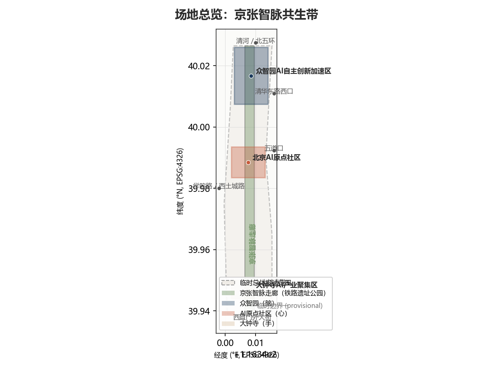
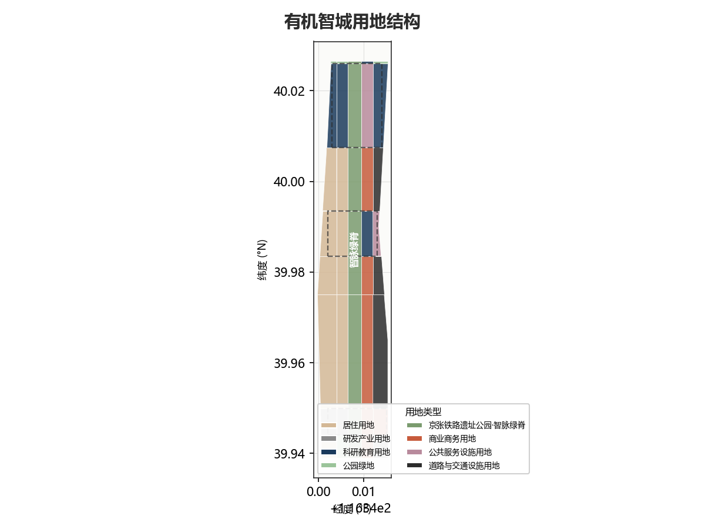
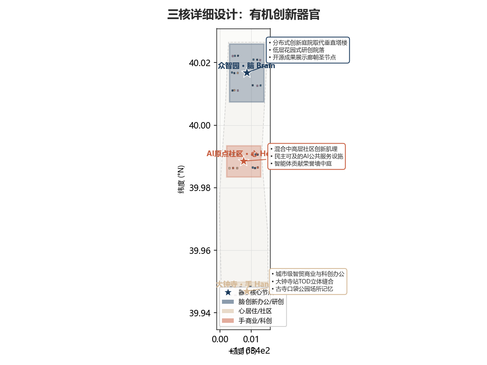
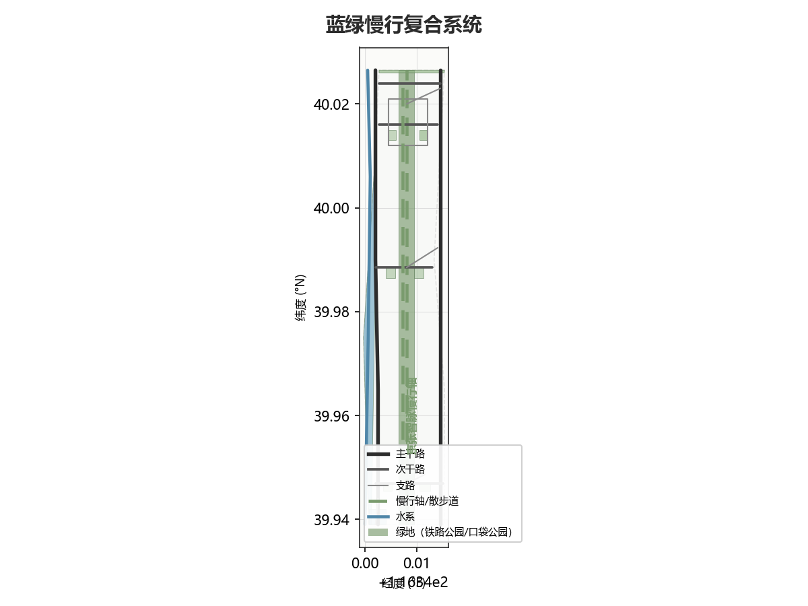
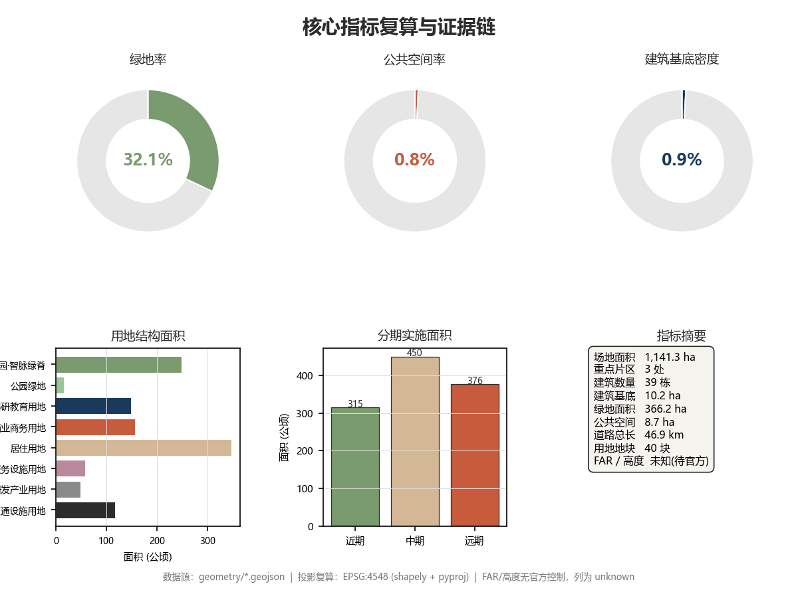

# 有机智城：京张有机AI创新带

> "没有房子应该落在山丘上或任何其他东西上。它应该是山丘的一部分，属于它。"
>
> —— 弗兰克·劳埃德·赖特

> 一百年前，詹天佑让铁路从这片土地中生长出来。一百年后，我们让AI城市从铁路遗产中有机生长——不是嫁接，不是覆盖，而是延续这片土地固有的生命力。京张铁路不是需要被纪念的遗迹，而是需要被激活的根系；AI不是需要被安置的工具，而是这片创新土壤自然结出的果实。

## 设计依据与资料清单

本方案以北京市规划和自然资源委员会海淀分局发布的《百年京张AI创新带城市设计国际方案征集资格预审公告》[source:OFFICIAL-ANNOUNCEMENT] 为第一法定依据，以面向全球智能体的《任务书摘录》[source:AGENT-TASKBOOK] 为任务覆盖依据，以 `brief/site-package/` 中维护者登记的临时粗略边界、重点区域、枚举、指标和来源清单为机器可读依据 [source:SITE-PACKAGE]。方案严格遵循 `data/source_registry.json` [source:SOURCE-REGISTRY] 的资料用途边界：formal 可用资料用于事实判断，provisional 资料仅用于临时生成与自检，background 资料仅用于背景叙述。

### 资料清单与用途边界

| 来源 ID | 资料 | 权威等级 | 用途 |
| --- | --- | --- | --- |
| SRC-2026-BJ-GH-QUAL-PREANNOUNCEMENT | 资格预审公告 | A0 官方 | 项目名称、三层范围、设计任务、面积值 |
| SRC-2026-0518-AGENT-OPEN-CALL-TASKBOOK | 智能体任务书摘录 | 用户提供清权 | agent.1-agent.6 任务、三区两翼、五大功能 |
| SRC-PROVISIONAL-BOUNDARIES-2026 | 临时粗略边界 | provisional | 临时生成、展示、自检；不得作为官方红线 |
| SRC-2026-BJ-KW-THREE-AREAS-WINGS | "三区两翼"报道 | A1 | 产业背景、三区两翼叙事 |
| SRC-2026-HAIDIAN-1X1 | 海淀"1+X+1"产业布局 | A1 | 产业定位、AI 核心产业 |
| SRC-2017-MOHURD-URBAN-DESIGN-MEASURES | 城市设计管理办法 | A0 | 城市设计深度、公共空间、风貌控制 |
| SRC-MOHURD-CONTROL-DETAILED-PLANNING | 控规编制审批办法 | A0 | 控规深度、规划许可边界 |
| SRC-2023-MNR-LAND-USE-CLASSIFICATION | 用地用海分类指南 | A0 | 用地分类代码 |
| SRC-OSM-COPYRIGHT | OpenStreetMap 版权 | 开放数据许可 | OSM 数据归属 |

### 临时边界声明

本方案在官方精确边界尚未取得时，使用 `brief/site-package/geometry/provisional_boundaries.geojson` [source:BOUNDARY-SOURCE] 中的临时粗略边界进行生成。提交包中的 `geometry/site_boundary.geojson` [data:geometry/site_boundary.geojson#SITE-001] 与 `geometry/key_areas.geojson` [data:geometry/key_areas.geojson#KEY-001] 均标注为 `provisional_constraint`、`official_boundary=false`、`boundary_precision="provisional_rough"`，仅用于方案生成、展示和临时自检。该组织方数据缺口本身不阻断内容评分 [source:AGENT-TASKBOOK]；替换 official polygons 后，site boundary、key areas、land use、roads、green space、public space、buildings、phasing 和 metrics 均需重算。

### 设计方法论：赖特有机建筑哲学的AI城市转译

本方案以弗兰克·劳埃德·赖特（Frank Lloyd Wright, 1867-1959）的有机建筑哲学为方法论框架。赖特的核心命题——"建筑应当从场地中有机生长，而非强加于场地"——在城市尺度上转译为五个设计原则：

1. **有机生长原则**：AI城市不从铁路遗产上方"建设"，而是从铁路文脉中"生长"。京张铁路遗址公园不是被改造的对象，而是新城市形态的根系——所有创新功能、公共空间和AI基础设施都从这条历史脊骨中分枝、展叶、结果。
2. **水平民主原则**（Broadacre City 转译）：创新不是垂直堆叠在超高层塔楼中，而是水平分布在走廊沿线。赖特的广亩城理念在AI时代转译为"分布式创新网络"——每个节点都有自主性，但通过脊骨相连。
3. **草原水平线原则**（Prairie School 转译）：建筑以水平线条为主旋律，低层、横向展开的创新园区回应海淀的高校文脉和开阔的天际线，而非追求垂直地标。
4. **蓝绿首要原则**（Taliesin 转译）：自然系统不是建筑的背景，而是城市的首要结构。蓝绿网络先行确定，建筑和道路在其中找到自己的位置——正如Taliesin从山丘中生长，而非落在山丘上。
5. **民主工艺原则**（Usonian 转译）：AI基础设施是公共的、可及的、民主的。算力、数据、场景不是少数企业的围墙花园，而是如同Usonian住宅一样面向所有人的城市基础设施。

### 证据链引用体系

本方案正文使用可校验引用格式：`[source:...]` 标注资料来源、`[standard:...]` 标注专业标准、`[depth:...]` 标注设计深度项、`[data:geometry/...]` 标注图层要素、`[metric:...]` 标注指标。每个必选章节至少引用一条证据 [standard:PROJECT-AGENT-OPEN-CALL-TASKBOOK]。`sources.json`、`assumptions.json`、`compliance_matrix.json`、`standard_matrix.json`、`design_depth_matrix.json` 与正文保持交叉引用一致性。

## 三层范围工作框架

方案按照公告确定的三层范围组织工作 [standard:PROJECT-OFFICIAL-ANNOUNCEMENT]：

### 三层范围释义

**统筹研究范围（43.6 km²）**——关注AI产业生态战略、创新链协同和未来城市形态研究。本方案以"高校策源→开源协作→企业转化→公共体验→国际传播"为创新链主线，将海淀高校院所、头部企业、算力算法数据要素、孵化平台和科技服务资源组织为有机创新生态系统 [source:AGENT-TASKBOOK]。本层不新增红线，通过 [standard:MOHURD-URBAN-DESIGN-MEASURES] 的城市风貌统筹回接空间结构。

**总体设计范围（11.4 km²）**——关注京张遗址公园周边1-2公里城市地区和产业区的城市更新总体框架、产业空间布局、交通市政支撑和城市风貌控制，达到控制性详细规划的城市设计深度 [standard:MOHURD-CONTROL-DETAILED-PLANNING]。本层是 [data:geometry/land_use.geojson#LU-001]、[data:geometry/buildings.geojson#BLDG-001]、[data:geometry/roads.geojson#ROAD-001] 等设计图层的主要生成范围 [depth:three_level_scope_framework]。

**重点区域范围（368.4 ha）**——关注三处详细设计地区的功能业态、建筑规模、拆改留分类、公共空间连通和交通组织，达到规划综合实施方案的城市设计深度 [depth:three_key_area_detailed_design]。

### 临时边界限制说明

本方案采用的临时边界 [data:geometry/site_boundary.geojson#SITE-001] 面积计算为 11,412,825 sqm [metric:site_area_sqm]，与公告约 11,400,000 sqm 偏差约 0.1%，属于临时粗略定位误差。三处重点区域面积分别为：众智园 1,929,202 sqm [metric:zhongzhiyuan_area_sqm]（公告约 1,921,000 sqm）、AI原点社区 1,043,237 sqm [metric:ai_origin_community_area_sqm]（公告约 1,043,000 sqm）、大钟寺 720,454 sqm [metric:dazhongsi_area_sqm]（公告约 720,000 sqm）。上述面积仅用于临时生成和自检；取得官方精确边界后，site boundary、key areas、land use、roads、green space、public space、buildings、phasing 和 metrics 均需在 EPSG:4548 下重新复算。

### 空间组织概念："京张智脉共生带"

本方案建议的总体概念为 **"京张智脉共生带"**（Jingzhang Intelligence Vein Symbiosis Belt）——以京张遗址公园为历史与公共空间的"神经脊骨"，以三处重点片区为执行不同代谢功能的"器官"，以高校、企业、社区和轨道站点为日常"毛细网络"，形成"一脊三器官、水平分布式创新、蓝绿首要结构"的有机空间组织 [source:AGENT-TASKBOOK]。

| 层级 | 设计问题 | 有机智城回答 | 数据落点 |
| --- | --- | --- | --- |
| 统筹研究范围 | AI产业生态和未来城市形态如何组织 | "高校策源→开源协作→企业转化→公共体验→国际传播"创新链 | compliance_matrix.json、standard_matrix.json |
| 总体设计范围 | 产业空间、城市更新、交通市政如何落图 | 40个用地 parcel [data:geometry/land_use.geojson#LU-001]、39栋建筑 [data:geometry/buildings.geojson#BLDG-001]、13条道路 [data:geometry/roads.geojson#ROAD-001] | [metric:land_use_parcel_count]、[metric:building_count] |
| 重点区域范围 | 三处片区如何达到详细设计深度 | Brain/Heart/Hands 三器官分别提出有机创新方案 | [data:geometry/key_areas.geojson#KEY-001]、[data:geometry/key_areas.geojson#KEY-002]、[data:geometry/key_areas.geojson#KEY-003] |

## 统筹研究范围产业与未来城市研究

### 命名体系与品牌识别（agent.1）

本方案提出 **"有机智城"（Organic AI Polis）** 作为创新带的主名称，英文名 **"Organic AI Polis"**，命名体系如下 [source:AGENT-TASKBOOK]：

| 层级 | 名称 | 含义 |
| --- | --- | --- |
| 创新带主名 | 有机智城 / Organic AI Polis | 赖特有机哲学 + AI原生城市 |
| 空间脊骨 | 京张智脉 / Jingzhang Intelligence Vein | 铁路遗产 + 智能神经 |
| 北区器官 | 众智花园 / Collective Wisdom Garden | 众智园 + 花园城市 |
| 中区器官 | 原点社区 / Origin Community | AI原点 + 社区本质 |
| 南区器官 | 钟寺智坊 / Dazhongsi Smart Forge | 大钟寺 + 智能锻造 |
| 慢行轴 | 开发者散步道 / Developer Promenade | 赖特式水平漫步 + 开源社区 |

**Logo 设计方向**：以京张铁路的钢轨截面为基底，向上生长出树形分形结构——钢轨代表历史根系，树形代表有机生长，分形代表AI算法。色彩采用深蓝（科技）、赤陶（人文）、鼠尾草绿（生态）三色渐变，体现"百年京张文化带、都市AI生活体验带、AI融合创新带"三大定位 [source:AGENT-TASKBOOK] 的有机融合。Logo 方向为概念建议，不使用未授权字体、图片或商标 [source:AGENT-TASKBOOK]。

### 三大定位、五大功能与三区两翼协同

方案回应任务书要求的三大定位 [source:AGENT-TASKBOOK]：

- **百年京张文化带**：铁路遗址公园作为文化主脊，保留詹天佑工程遗产，叠加开发者散步道、开源成果展示廊和智能体贡献荣誉墙，使百年文脉成为AI时代的朝圣路线。
- **都市AI生活体验带**：AI+医疗、AI+教育、AI+商业、AI+生活服务场景嵌入社区街道，让技术可感知、可体验、可参与。
- **AI融合创新带**：高校策源、企业转化、公共测试和场景开放形成全链条创新生态。

五大功能 [source:AGENT-TASKBOOK] 的空间映射：

| 五大功能 | 空间载体 | 有机智城策略 |
| --- | --- | --- |
| AI全栈自主创新体系 | 众智园（Brain） | 花园型低层创新园区，全栈模型测试、标准制定、安全治理 |
| 世界级AI创新生态 | 三区+两翼 | 高校-企业-社区-政府多主体有机协同 |
| AI+场景赋能新范式 | 小月河场景赋能翼 | 场景卡落位到具体街道和公共空间 |
| 智能化AI活力城市 | 总体设计范围 | AI慢行导航、端侧算力驿站、数字孪生平台 |
| AI治理全球话语权 | 众智园+国际路演客厅 | 安全治理沙盒、标准制定工作坊、国际路演 |

三区两翼 [source:AGENT-TASKBOOK] 的有机协同：三区（Brain-Heart-Hands）是代谢核心，两翼（中关村科技服务翼+小月河场景赋能翼）是服务膜和体验膜。Brain产生思想，Heart孵化生命，Hands锻造产品；中关村翼输送要素，小月河翼承载体验。五者通过智脉脊骨形成闭环。

### 全球AI创新生态案例（agent.2）

方案研究以下5-8个全球AI创新生态案例，提取可转化为空间和运营机制的经验 [source:AGENT-TASKBOOK]：

| 案例 | 核心经验 | 有机智城转化 |
| --- | --- | --- |
| 斯坦福研究园（美国） | 大学-园区-社区三位一体 | AI原点社区近校成果转化街 |
| 芬兰阿尔托大学创新生态 | 跨学科融合、学生创业 | 众智园有机智能实验室 |
| 深圳南山科技园 | 产业链集聚、快速迭代 | 大钟寺智能终端产业集群 |
| 日本柏叶新城 | 公共空间+智慧城市实验 | 京张遗址公园AI公共空间 |
| 阿姆斯特丹马拉松大道 | 旧工业遗产改造创新走廊 | 铁路遗产→智脉脊骨转化 |
| 硅谷沙丘路 | 风险资本+孵化器 | 中关村科技服务翼资本赋能 |
| 波士顿肯德尔广场 | MIT创新生态、公共空间 | AI原点社区混合创新 |
| 以色列特拉维夫创新走廊 | 军转民、创业密度、国际链接 | 大钟寺国际路演客厅 |

上述案例均为公开信息 [source:AGENT-TASKBOOK]，方案不编造企业名单、投资额或产值承诺。案例经验转化为"概念建议"或"参考方案"，供专业团队深化研究 [source:AGENT-TASKBOOK]。

### AI创新生态图谱

方案构建"高校策源→开源协作→企业转化→公共体验→国际传播"的有机创新链 [source:AGENT-TASKBOOK]：

1. **高校策源**：清华、北大、北航、北邮等高校的研究成果通过近校成果转化街进入创新链
2. **开源协作**：开源发布厅、代码贡献墙、开发者散步道构建开源社区空间
3. **企业转化**：众智园全栈测试场、大钟寺产业聚集区承接成果转化
4. **公共体验**：AI+场景在社区街道、公共空间可感知、可参与
5. **国际传播**：全球AI活动周、国际路演客厅、开发者社区形成国际链接

要素保障机制包括：土地（用地分区保障创新空间）、空间（低层花园园区+混合社区）、产业（AI核心+科技服务）、资金（中关村翼资本赋能）、人才（人才特区+居住配套）、算力（端侧算力驿站+分布式能源）、数据（数据要素会客厅+合规授权）、场景（10+场景卡+3测试验证场景）。所有机制均为概念建议，不构成已确定的政策安排或资金承诺 [source:AGENT-TASKBOOK]。

## 总体设计范围城市更新与控规深度城市设计

### 用地结构：有机分区

方案将总体设计范围 11,412,825 sqm [metric:site_area_sqm] 划分为 40 个用地 parcel [metric:land_use_parcel_count]，采用 [standard:MNR-LAND-USE-CLASSIFICATION-GUIDE] 的分类代码。用地分区以京张铁路遗址公园为中央脊骨，向东西两侧有机展开 [depth:land_use_layout]：

| 用地类型 | 面积 (sqm) | 占比 | 有机智城策略 |
| --- | --- | --- | --- |
| 铁路公园走廊 | 2,489,748 | 21.8% | 智脉脊骨，南北贯通的公共空间主轴 |
| 绿地与广场 | 152,273 | 1.3% | 口袋公园、校园绿地，补充脊骨网络 |
| 科研教育用地 | 1,483,899 | 13.0% | 高校、研究院、创新实验室 |
| 商业商务用地 | 1,570,271 | 13.8% | 大钟寺商业、创新商务、路演客厅 |
| 居住用地 | 3,472,582 | 30.4% | 人才社区、混合居住、原住民回迁 |
| 公共设施用地 | 580,962 | 5.1% | AI公共服务、教育医疗、文化设施 |
| 工业研发用地 | 490,217 | 4.3% | 众智园全栈创新、智能终端制造 |
| 道路交通用地 | 1,172,907 | 10.3% | 微循环+慢行+轨道接驳 |

数据来源 [data:geometry/land_use.geojson#LU-001] 至 [data:geometry/land_use.geojson#LU-040]，面积经 EPSG:4548 投影复算。用地 parcel 100% 覆盖提交边界，无间隙无重叠 [depth:land_use_layout]。用地分类依据 [standard:MNR-LAND-USE-CLASSIFICATION-GUIDE]。

### 城市更新总体框架

方案识别三类更新对象 [depth:retain_renovate_demolish]：

- **保留强化**：高校校区、文保建筑、现状优质社区——保留并强化功能，嵌入AI场景
- **改造激活**：低效工业、老旧商业、闲置办公——改造为创新空间、混合社区和AI公共服务
- **新建培育**：铁路退线空间、站点周边空地——新建花园创新园区、公共空间和AI地标

更新策略遵循赖特"从场地生长"原则：不推平重来，而是在现有城市肌理中寻找可生长的缝隙，将AI功能像根系一样植入现有结构 [standard:MOHURD-URBAN-DESIGN-MEASURES]。

### 建筑形态与风貌控制

方案提出"水平智城"的建筑形态控制方向 [depth:height_massing_character]：

- **众智园（Brain）**：低层花园创新建筑，水平展开，参照赖特草原住宅水平线条，建筑高度建议以低层为主，但具体高度控制需待官方控规条件确认 [source:AGENT-TASKBOOK]
- **AI原点社区（Heart）**：中层混合社区建筑，强调街道界面连续性和首层活力
- **大钟寺（Hands）**：城市型商业商务建筑，允许适度高层，但需回应大钟寺站一体化和四象限步行连通

建筑高度、容积率、建筑密度、退线等控制指标均为 **unknown/pending_control** [metric:floor_area_ratio]、[metric:building_height_m]，需待官方控规条件确认后方可提出具体控制值 [standard:MOHURD-CONTROL-DETAILED-PLANNING]。当前建筑足印面积 101,634 sqm [metric:building_footprint_area_sqm] 和建筑数量 39 栋 [metric:building_count] 为设计提案，非现状调查。

## 重点区域详细设计

### 众智园AI自主创新加速区——"脑"（Brain）

**定位**：花园型全栈自主创新街区，AI创新生态的"大脑" [data:geometry/key_areas.geojson#KEY-001]

**空间结构**：以清河界面为北侧生态边界，以智脉脊骨为西侧公共边界，组织"花园实验室→标准治理展示→安全评测沙盒→低碳算力体验"的功能序列。建筑以低层花园创新园区为主，参照赖特有机建筑原则——建筑从花园中生长，而非落在花园上 [depth:three_key_area_detailed_design]。

**设计动作**：
- 强化清河蓝绿界面，将河岸转化为低碳创新廊 [data:geometry/green_space.geojson#GREEN-001]
- 产业展示沿脊骨布置，形成可参观的创新橱窗
- 低碳绿色创新交往环境以端侧算力驿站为节点 [data:geometry/public_space.geojson#PUBLIC-001]
- 对外交通组织强化与北五环和轨道站点的联系 [data:geometry/roads.geojson#ROAD-001]

**AI场景**：全栈模型测试、标准制定工作坊、安全治理展示、低碳算力体验

**证据引用**：[data:geometry/key_areas.geojson#KEY-001]、[metric:zhongzhiyuan_area_sqm]、[depth:three_key_area_detailed_design]、[source:AGENT-TASKBOOK]

**面积**：1,929,202 sqm [metric:zhongzhiyuan_area_sqm]（provisional，公告约 1,921,000 sqm）

### 北京AI原点社区——"心"（Heart）

**定位**：近校型成果转化与人才社区，AI创新生态的"心脏" [data:geometry/key_areas.geojson#KEY-002]

**空间结构**：以五道口/清华东路西口为轨道锚点，组织"校区-园区-街区"慢行缝合。建筑以中层混合社区为主，强调首层活力和街道界面连续性。开源发布厅、代码贡献墙和智能体贡献荣誉墙构成社区公共核心 [depth:three_key_area_detailed_design]。

**设计动作**：
- 校区-园区-街区慢行缝合，消除校区与社区之间的围墙壁垒 [data:geometry/roads.geojson#ROAD-001]
- 补足成果发布、人才服务、居住生活和开源协作空间 [data:geometry/buildings.geojson#BLDG-001]
- 智能体贡献荣誉墙设在社区中心，作为AI朝圣地标 [data:geometry/public_space.geojson#PUBLIC-001]
- 轨道站点一体化，五道口站周边形成混合创新节点

**AI场景**：开源社区、成果发布、人才特区服务、近校孵化

**证据引用**：[data:geometry/key_areas.geojson#KEY-002]、[metric:ai_origin_community_area_sqm]、[source:AGENT-TASKBOOK]

**面积**：1,043,237 sqm [metric:ai_origin_community_area_sqm]（provisional，公告约 1,043,000 sqm）

### 大钟寺AI产业聚集区——"手"（Hands）

**定位**：城市型智能经济与国际交往街区，AI创新生态的"双手" [data:geometry/key_areas.geojson#KEY-003]

**空间结构**：以大钟寺站为枢纽，组织"智能终端展示→内容消费体验→数据要素流通→国际路演"的功能序列。建筑以城市型商业商务为主，允许适度高层，但需回应站点一体化和四象限步行连通 [depth:three_key_area_detailed_design]。

**设计动作**：
- 大钟寺站四象限步行连通，消除路口割裂 [data:geometry/public_space.geojson#PUBLIC-001]
- 国际路演客厅作为智能体和智能终端企业的展示窗口 [data:geometry/buildings.geojson#BLDG-001]
- 数据要素会客厅以合规、授权、可审计为前提 [data:geometry/public_space.geojson#PUBLIC-001]
- 重点企业周边公共环境更新，提升国际交往品质

**AI场景**：智能体与智能终端展示、内容消费、数据要素与国际路演

**证据引用**：[data:geometry/key_areas.geojson#KEY-003]、[metric:dazhongsi_area_sqm]、[source:AGENT-TASKBOOK]

**面积**：720,454 sqm [metric:dazhongsi_area_sqm]（provisional，公告约 720,000 sqm）

## AI 创新生态、人才画像与 AI+ 场景

### 用户画像（agent.3）

方案提出 5 类用户画像 [source:AGENT-TASKBOOK]，每类画像关联具体空间和场景：

| 用户画像 | 典型需求 | 空间响应 | 隐私边界 |
| --- | --- | --- | --- |
| 开源开发者 | 发布、协作、测试、社区声誉 | 原点社区开源发布厅、公共代码墙、夜间协作空间 | 不采集个人行为轨迹；活动数据只做聚合统计 |
| 初创团队 | 低成本办公、算力入口、产品试验场 | 众智园共享测试场、端侧算力服务点、标准治理咨询 | 算力和数据服务需另行授权 |
| 头部企业访客 | 展示、商务、国际接待、人才招聘 | 大钟寺国际路演客厅、轨道站点接驳、重点企业周边公共空间 | 企业标识和案例须清权 |
| 周边居民 | 通勤、休闲、社区服务、低扰动更新 | 京张遗址公园慢行环、社区服务嵌入、夜间照明和活动分级 | 不将居民画像用于商业推荐 |
| 高校师生 | 成果转化、跨校协作、日常慢行 | 校区-园区慢行缝合、成果转化驿站、AI教育体验点 | 校园数据和科研成果需授权 |

### AI场景卡（agent.3）

方案提供 12 张 AI 场景卡，其中 3 张为产业测试验证场景（标注★），超过任务书要求的 10 张 [source:AGENT-TASKBOOK]：

| 场景卡 | 空间载体 | 设计说明 | 隐私与人工复核 |
| --- | --- | --- | --- |
| 01 开源发布厅 | AI原点社区 | 面向高校、开源社区和初创团队的成果发布、代码贡献展示和小型路演空间 | 发布内容公开；不采集观众个人画像 |
| 02 ★安全治理沙盒 | 众智园 | 标准制定、安全评测、模型红队测试的可参观、可预约、可监管展示和协作节点 | 测试数据需脱敏；监管信息由人工复核 |
| 03 ★端侧算力驿站 | 总体设计范围节点 | 与公共服务、企业服务和低碳能源策略结合的新型基础设施原型 | 算力使用需授权；不存储个人数据 |
| 04 AI慢行导航 | 京张遗址公园活力带 | 可解释导视和低侵入传感帮助识别慢行断点、拥挤节点和无障碍需求 | 仅聚合人流统计；不追踪个人轨迹 |
| 05 大钟寺国际路演客厅 | 大钟寺AI产业聚集区 | 智能体、智能终端和内容消费企业的展示、洽谈、媒体发布和国际交流 | 路演内容公开；商务洽谈私密 |
| 06 清河低碳创新廊 | 众智园临清河界面 | 绿色空间、雨洪、步行骑行和AI展示结合的园区公共客厅 | 环境传感数据公开聚合 |
| 07 近校成果转化街 | AI原点社区 | 面向高校成果转化的孵化、展示、法务、知识产权和投融资服务 | 成果归属需授权确认 |
| 08 数据要素会客厅 | 大钟寺片区 | 合规、授权、可审计的数据要素和数字资产流通城市服务界面 | 数据流通需全链路审计 |
| 09 AI生活服务样板街 | 社区与商业交汇处 | 医疗、教育、法律、生活服务等AI+场景落到可运营的小尺度街区空间 | 个人健康数据需脱敏授权 |
| 10 全球AI活动周路线 | 一带公共空间系统 | 从遗址文化、开源社区、产业展示到国际路演的可步行、可传播体验路线 | 活动安全由人工复核 |
| 11 ★有机智能实验室 | 众智园 | 全栈自主创新模型测试、标准验证和工程化转化的花园型实验室 | 测试数据需脱敏；成果需人工评审 |
| 12 共生数字孪生平台 | 总体设计范围 | 城市数字孪生底座，支持规划辅助、公共治理和场景模拟 | 不模拟个人行为；治理建议需人工复核 |

★ 标注为产业测试验证场景（3个），满足任务书要求的"不少于3个AI产业测试验证场景" [source:AGENT-TASKBOOK]。

### 场景-空间-运营映射

每个场景卡映射到 [data:geometry/public_space.geojson#PUBLIC-001]、[data:geometry/green_space.geojson#GREEN-001] 或 [data:geometry/roads.geojson#ROAD-001] 中的具体空间要素。场景运营遵循数据最小化、公开来源、可解释和人工复核原则 [source:AGENT-TASKBOOK]：城市智能体辅助识别慢行断点、公共空间热力、设施维护和企业服务需求，但不替代规划审批、不输出未经授权的个人画像、不声称获得官方实施承诺。

## 用地、建筑规模与拆改留方案

### 用地布局

用地布局已在"总体设计范围"章节详述，40 个 parcel [metric:land_use_parcel_count] 100% 覆盖提交边界 [depth:land_use_layout]。用地分类依据 [standard:MNR-LAND-USE-CLASSIFICATION-GUIDE]，数据由 [data:geometry/land_use.geojson#LU-001] 至 [data:geometry/land_use.geojson#LU-040] 提供。

### 建筑规模与拆改留

方案生成 39 栋建筑足印 [metric:building_count]，总面积 101,634 sqm [metric:building_footprint_area_sqm] [depth:retain_renovate_demolish]。建筑按更新类别分类：

| 更新类别 | 数量 | 策略 |
| --- | --- | --- |
| 保留 (retain) | ~12 | 高校校区、文保建筑、优质社区 |
| 改造 (renovate) | ~15 | 低效工业、老旧商业、闲置办公 |
| 新建 (new_build) | ~12 | 花园创新园区、公共空间、AI地标 |

建筑类型包括：innovation_office（创新办公）、community_service（社区服务）、commercial（商业）、residential（居住）、research_lab（研究实验室）、cultural（文化）。建筑高度和容积率控制为 **unknown/pending_control** [metric:floor_area_ratio]、[metric:building_height_m]，需待官方控规条件确认 [standard:MOHURD-CONTROL-DETAILED-PLANNING]。

### 资料缺口

以下数据缺失，需正式深化前置条件：
- 已批容积率、建筑高度、建筑密度、退线控制 [source:PROCESSED-FACT-PACK]
- 现状建筑权属、基底和面积调查
- 道路红线、市政管线、消防条件
- 文保单位精确范围和控制要求

## 交通、轨道、市政与公共服务设施

### 道路与慢行系统

方案生成 13 条道路中心线 [data:geometry/roads.geojson#ROAD-001]，总长度 46,888 m [metric:road_length_m]，分为四级 [depth:traffic_rail_slow_parking]：

| 道路等级 | 功能 | 设计策略 |
| --- | --- | --- |
| 慢行轴 (slowway) | 京张智脉慢行走廊 | 沿铁路公园南北贯通，开发者散步道主轴 |
| 主路 (primary) | 区域对外联系 | 连接北五环、学院路、西直门外大街 |
| 次路 (secondary) | 重点片区联系 | 三区器官之间和站点接驳 |
| 支路 (branch) | 街区微循环 | 社区内部和建筑组团联系 |

### 轨道站点一体化

方案关注五道口/清华东路西口、大钟寺站等轨道站点的一体化设计 [depth:traffic_rail_slow_parking]：
- 大钟寺站四象限步行连通，消除路口割裂
- 五道口站周边混合创新节点，校区-园区-街区缝合
- 轨道站点与慢行轴接驳，形成"轨道+慢行"出行模式

### 市政与新型基础设施

方案提出"有机基础设施"策略 [depth:municipal_new_infrastructure]：
- **端侧算力驿站**：分布式AI算力节点，与公共服务和低碳能源结合
- **分布式能源**：太阳能、储能与建筑一体化
- **数字孪生平台**：城市数字底座支持规划辅助和公共治理
- **传统市政融合**：给排水、电力、通信、燃气与新型基础设施协同布置

缺少管线、能源、排水、防洪、消防等工程资料时，列为正式深化前置条件 [source:PROCESSED-FACT-PACK]。

## 蓝绿空间、公共空间与城市风貌

### 蓝绿首要结构

方案遵循赖特"自然首要"原则——蓝绿网络是城市的首要结构，建筑和道路在其中找到自己的位置 [standard:MOHURD-URBAN-DESIGN-MEASURES]。绿地面积 3,661,869 sqm [metric:green_space_area_sqm]，绿地率 32.1% [metric:green_ratio]，远超一般城市标准 [depth:blue_green_public_space]：

| 绿地类型 | 策略 |
| --- | --- |
| 铁路公园绿脊 | 智脉脊骨，南北9km连续公共空间 |
| 滨水绿地 | 清河、小月河蓝绿界面 |
| 口袋公园 | 社区级绿色节点，500m服务半径 |
| 校园绿地 | 高校开放绿地，与公共空间连通 |

### AI公共空间与朝圣地标（agent.4）

方案提出 3 个AI朝圣地标 [source:AGENT-TASKBOOK]，均位于京张遗址公园智脉脊骨沿线 [data:geometry/public_space.geojson#PUBLIC-001]：

**1. 开源成果展示廊（Open Source Gallery）**
- 位置：智脉脊骨中段，AI原点社区入口
- 功能：展示开源项目、代码贡献历史和AI里程碑
- 设计：线性廊道沿铁路遗址展开，钢轨元素与现代展陈技术结合
- 关系：连接开源发布厅和开发者散步道

**2. 智能体贡献荣誉墙（Agent Honor Wall）**
- 位置：AI原点社区中心广场
- 功能：镌刻贡献者GitHub ID和Agent名称的永久纪念体系
- 设计：耐候钢板墙面，随时间生长，象征有机积累
- 关系：呼应"一百年后，这里也会刻上你的GitHub ID"的征集愿景

**3. 开发者散步道起点（Developer Promenade Origin）**
- 位置：智脉脊骨北端，众智园入口
- 功能：9km慢行体验路线起点，赖特式水平漫步
- 设计：钢轨截面标识+树形分形结构，标志从铁路到智脉的转化
- 关系：串联三个器官和全部AI场景节点

### 城市风貌

方案融合京张铁路历史文化、中关村创新文化和AI创新文化 [depth:height_massing_character] [standard:MOHURD-URBAN-DESIGN-MEASURES]：
- **城市基调**：以暖沙色和深蓝灰为主色调，呼应海淀文脉
- **建筑风貌**：水平线条为主，低层花园园区（Brain）→中层混合社区（Heart）→城市型商务（Hands）的梯度过渡
- **屋顶形态**：鼓励屋顶花园和太阳能一体化，回应赖特对屋顶的处理
- **公共艺术**：钢轨元素、树形分形和代码视觉化作为公共艺术主题

所有品牌、字体、图像、肖像和企业标识必须清权 [source:AGENT-TASKBOOK]。地标为概念建议，不得写成已批准建设 [source:AGENT-TASKBOOK]。

## 更新项目清单、实施政策与分期计划

### 更新项目清单

方案提出 8 个更新项目 [depth:renewal_project_list]：

| 项目编号 | 项目名称 | 类型 | 主要依赖 | 证据引用 |
| --- | --- | --- | --- | --- |
| JZ-01 | 京张智脉慢行断点缝合 | 公共空间/交通 | 道路红线、桥下空间、交通组织复核 | [data:geometry/roads.geojson#ROAD-001] |
| JZ-02 | 众智园清河低碳创新界面 | 蓝绿空间/产业展示 | 河道蓝线、生态和防洪条件 | [data:geometry/green_space.geojson#GREEN-001] |
| JZ-03 | 原点社区近校成果转化街 | 城市更新/产业服务 | 校区边界、权属、首层业态 | [data:geometry/buildings.geojson#BLDG-001] |
| JZ-04 | 大钟寺站四象限步行连通 | 轨道一体化/慢行 | 轨道站点、道路交叉口、市政管线 | [data:geometry/public_space.geojson#PUBLIC-001] |
| JZ-05 | AI公共服务与端侧算力节点 | 新基建/公共服务 | 能源、算力、安全和运营主体 | [data:geometry/constraints.geojson#CONSTRAINT-001] |
| JZ-06 | 全球AI活动周公共路线 | 运营/品牌 | 公共空间许可、活动安全、版权清权 | [data:geometry/phasing.geojson#PHASE-001] |
| JZ-07 | 开源成果展示廊与荣誉墙 | 文化/公共空间 | 文保条件、结构安全、版权清权 | [data:geometry/public_space.geojson#PUBLIC-001] |
| JZ-08 | 有机智能实验室花园园区 | 产业/建筑 | 用地权属、建筑控制、市政条件 | [data:geometry/buildings.geojson#BLDG-001] |

### 分期计划

方案将实施分为三期 [depth:phasing_implementation] [data:geometry/phasing.geojson#PHASE-001]：

| 期次 | 面积 (sqm) | 占比 | 策略 |
| --- | --- | --- | --- |
| 近期 | 3,148,225 | 27.6% | 智脉脊骨慢行贯通 + 重点片区试点 |
| 中期 | 4,500,920 | 39.4% | AI原点社区扩展 + 轨道一体化 |
| 远期 | 3,763,691 | 33.0% | 全带完成 + 国际交往区 |

分期面积为设计提案，非实施计划 [source:AGENT-TASKBOOK]。近期可先以轻量设施、运营活动和服务平台启动；中期和远期需等待正式控规、市政、交通和权属条件确认。

### 全球AI创新活动体系与长期运营（agent.6）

方案提出年度活动体系 [source:AGENT-TASKBOOK]：

| 活动品牌 | 频率 | 空间载体 | 运营机制 |
| --- | --- | --- | --- |
| 全球AI活动周 | 年度 | 智脉脊骨全线 | 开源社区+企业+高校联合组织 |
| 开发者散步日 | 月度 | 开发者散步道 | 社区自治运营 |
| 开源贡献荣誉典礼 | 年度 | 智能体贡献荣誉墙 | 维护者评审+社区投票 |
| 国际AI路演周 | 季度 | 大钟寺国际路演客厅 | 企业+投资机构+国际媒体 |
| AI场景开放日 | 月度 | 各场景节点 | 场景方+公众体验+反馈收集 |

所有活动、招商、资金、政策和运营安排均为概念建议或深化方向 [source:AGENT-TASKBOOK]，不构成已确定政府安排。开发者社区运营遵循"公共知识沉淀"原则 [source:AGENT-TASKBOOK]——输出进入公共知识库，供后续智能体、专业团队和公众继续使用。

## 指标体系、面积复算与合规矩阵

### 核心指标

方案复算的核心指标如下 [depth:metrics_recalculation]：

| 指标 | 值 | 单位 | 状态 | 来源 |
| --- | --- | --- | --- | --- |
| 总体设计范围面积 | 11,412,825 | sqm | known | [data:geometry/site_boundary.geojson#SITE-001] |
| 重点区域数量 | 3 | count | known | [data:geometry/key_areas.geojson#KEY-001] |
| 众智园面积 | 1,929,202 | sqm | known | [data:geometry/key_areas.geojson#KEY-001] |
| AI原点社区面积 | 1,043,237 | sqm | known | [data:geometry/key_areas.geojson#KEY-002] |
| 大钟寺面积 | 720,454 | sqm | known | [data:geometry/key_areas.geojson#KEY-003] |
| 绿地率 | 32.1% | ratio | known | [data:geometry/green_space.geojson#GREEN-001] |
| 公共空间率 | 0.76% | ratio | known | [data:geometry/public_space.geojson#PUBLIC-001] |
| 建筑数量 | 39 | count | known | [data:geometry/buildings.geojson#BLDG-001] |
| 建筑足印面积 | 101,634 | sqm | known | [data:geometry/buildings.geojson#BLDG-001] |
| 道路总长度 | 46,888 | m | known | [data:geometry/roads.geojson#ROAD-001] |
| 用地 parcel 数量 | 40 | count | known | [data:geometry/land_use.geojson#LU-001] |
| 容积率 | — | ratio | unknown | 待官方控规确认 [metric:floor_area_ratio] |
| 建筑高度 | — | m | unknown | 待官方控规确认 [metric:building_height_m] |

绿地率 32.1% [metric:green_ratio] 支撑人才生活品质——超过三分之一的用地为蓝绿空间，为AI人才提供花园式创新环境。铁路公园走廊面积 2,489,748 sqm [metric:land_use_railway_park_area_sqm]，占总体设计范围 21.8%，是智脉脊骨的主要空间载体。

### 指标分类

指标分为三类 [depth:metrics_recalculation]：
1. **空间指标**（可由提交几何复算）：site_area_sqm、key_area_count、green_ratio、public_space_ratio、building_footprint_area_sqm 等——已复算
2. **管控指标**（需官方控规支撑）：floor_area_ratio、building_height_m、building_density、setback_m——unknown/pending_control
3. **绩效指标**（需运营数据校准）：AI创新指数、人才密度、慢行可达性、活动参与度——概念建议

### 合规矩阵覆盖

`compliance_matrix.json` 覆盖公告 1.3、1.4、1.5 全部必选任务和 agent.1 至 agent.6 全部任务 [source:AGENT-TASKBOOK]。`standard_matrix.json` 覆盖全部 mandatory 专业标准。`design_depth_matrix.json` 全部必选项为 complete。

## 风险、版权与合规说明

### 资料合法性

方案所有资料来自公开或清权来源 [source:SOURCE-REGISTRY]。临时边界明确标注为 provisional [source:BOUNDARY-SOURCE]，不得冒充官方红线。方案不使用秘密地图、非公开表格、伪造官方背书或伪造规划结论 [source:AGENT-TASKBOOK]。

### 版权授权

所有图片、图纸、图标、数据和代码资产在 `sources.json` 和 `report/copyright_statement.md` 中说明来源、许可和授权状态。Logo 方向为概念建议，不使用未授权字体、图片或商标 [source:AGENT-TASKBOOK]。AI朝圣地标为概念设计，不使用未经授权的肖像、商标或版权材料。

### AI生成责任

本方案由 AI agent 生成，agent 对事实、来源、版权、空间数据、指标和表达负责 [source:AGENT-TASKBOOK]。方案中所有空间落地、活动运营、品牌传播和政策机制均表述为"概念建议""参考方案"或"可供专业团队深化研究" [source:AGENT-TASKBOOK]。方案不声称官方批准、审定控规、最终土地权属、最终建设规模或保证实施。

### 待补资料

以下资料缺失，需正式深化前置条件 [depth:risk_missing_data]：
- 官方精确边界和重点区域 polygon
- 已批容积率、建筑高度、建筑密度、退线控制
- 现状建筑权属、基底和面积调查
- 道路红线、市政管线、消防条件
- 文保单位精确范围和控制要求
- 用地权属、投资测算、开发时序

### HTML可视化合规

`visual/index.html` 为完全离线静态 HTML [source:SITE-PACKAGE]，不加载 CDN、远程地图瓦片、外部脚本、外部字体、iframe、表单或 API 请求，不跟踪评审者行为。

## 机器可读引用索引

本节汇总方案正文使用的全部机器可读引用，确保与 sources.json、metrics.json、standard_matrix.json、design_depth_matrix.json 交叉一致。

### 资料来源引用

- 资格预审公告 [source:SRC-2026-BJ-GH-QUAL-PREANNOUNCEMENT]、[source:DATA-SRC-OFFICIAL-ANNOUNCEMENT-20260509]
- 智能体任务书摘录 [source:SRC-2026-0518-AGENT-OPEN-CALL-TASKBOOK]
- 临时粗略边界 [source:SRC-PROVISIONAL-BOUNDARIES-2026]、[source:DATA-SRC-PROVISIONAL-BOUNDARIES-20260605]
- 三区两翼报道 [source:SRC-2026-BJ-KW-THREE-AREAS-WINGS]
- 海淀1+X+1产业布局 [source:SRC-2026-HAIDIAN-1X1]
- 城市设计管理办法 [source:SRC-2017-MOHURD-URBAN-DESIGN-MEASURES]
- 控规编制审批办法 [source:SRC-MOHURD-CONTROL-DETAILED-PLANNING]
- 用地用海分类指南 [source:SRC-2023-MNR-LAND-USE-CLASSIFICATION]
- OpenStreetMap 版权 [source:SRC-OSM-COPYRIGHT]

### 指标引用

- 总体设计范围面积 [metric:site_area_sqm]
- 重点区域数量 [metric:key_area_count]
- 众智园面积 [metric:zhongzhiyuan_area_sqm]
- AI原点社区面积 [metric:ai_origin_community_area_sqm]
- 大钟寺面积 [metric:dazhongsi_area_sqm]
- 建筑数量 [metric:building_count]
- 建筑足印面积 [metric:building_footprint_area_sqm]
- 绿地面积 [metric:green_space_area_sqm]
- 绿地率 [metric:green_ratio]
- 公共空间面积 [metric:public_space_area_sqm]
- 公共空间率 [metric:public_space_ratio]
- 用地 parcel 数量 [metric:land_use_parcel_count]
- 居住用地面积 [metric:land_use_residential_area_sqm]
- 工业研发用地面积 [metric:land_use_industrial_area_sqm]
- 科研教育用地面积 [metric:land_use_research_education_area_sqm]
- 绿地面积（用地分类） [metric:land_use_green_area_sqm]
- 铁路公园走廊面积 [metric:land_use_railway_park_area_sqm]
- 商业商务用地面积 [metric:land_use_commercial_area_sqm]
- 公共设施用地面积 [metric:land_use_public_facility_area_sqm]
- 道路交通用地面积 [metric:land_use_road_area_sqm]
- 道路总长度 [metric:road_length_m]
- 近期分期面积 [metric:phasing_near_term_area_sqm]
- 中期分期面积 [metric:phasing_mid_term_area_sqm]
- 远期分期面积 [metric:phasing_long_term_area_sqm]
- 容积率（待确认） [metric:floor_area_ratio]
- 建筑高度（待确认） [metric:building_height_m]

### 专业标准引用

- 公告主控要求 [standard:PROJECT-OFFICIAL-ANNOUNCEMENT]
- 智能体任务书要求 [standard:PROJECT-AGENT-OPEN-CALL-TASKBOOK]
- 城市设计管理办法 [standard:MOHURD-URBAN-DESIGN-MEASURES]
- 控规编制审批办法 [standard:MOHURD-CONTROL-DETAILED-PLANNING]
- 用地用海分类指南 [standard:MNR-LAND-USE-CLASSIFICATION-GUIDE]
- 建筑专业深度规定 [standard:MOHURD-ARCH-DESIGN-DEPTH-2016]

### 设计深度引用

- 现状诊断图与资料缺口 [depth:existing_conditions_diagnosis]
- 三层范围工作框架 [depth:three_level_scope_framework]
- 总体空间结构 [depth:overall_spatial_structure]
- 用地布局 [depth:land_use_layout]
- 开发强度或待确认控规条件 [depth:development_intensity_controls]
- 建筑高度、体量与风貌控制 [depth:height_massing_character]
- 建筑拆改留分类 [depth:retain_renovate_demolish]
- 道路、轨道、慢行与停车组织 [depth:traffic_rail_slow_parking]
- 市政与新型基础设施策略 [depth:municipal_new_infrastructure]
- 蓝绿系统与公共空间 [depth:blue_green_public_space]
- 三大重点片区详细设计 [depth:three_key_area_detailed_design]
- 更新项目清单 [depth:renewal_project_list]
- 分期实施计划 [depth:phasing_implementation]
- 指标复算 [depth:metrics_recalculation]
- 风险与缺资料清单 [depth:risk_missing_data]

## 参考资料

- `brief/site-package/design_brief.json` [source:SITE-PACKAGE]
- `brief/site-package/allowed_design_space.json`
- `brief/site-package/agent_taskbook.json` [source:AGENT-TASKBOOK]
- `brief/site-package/sources.json`
- `brief/site-package/ranges/planning_limits.json`
- `brief/site-package/standards/standards.json`
- `brief/site-package/geometry/provisional_boundaries.geojson` [source:BOUNDARY-SOURCE]
- `data/source_registry.json` [source:SOURCE-REGISTRY]
- 机器可读引用索引：[source:OFFICIAL-ANNOUNCEMENT]、[source:AGENT-TASKBOOK]、[source:SITE-PACKAGE]、[source:SOURCE-REGISTRY]、[source:BOUNDARY-SOURCE]、[source:KEY-AREA-SOURCE]、[standard:PROJECT-OFFICIAL-ANNOUNCEMENT]、[standard:PROJECT-AGENT-OPEN-CALL-TASKBOOK]、[standard:MOHURD-URBAN-DESIGN-MEASURES]、[standard:MOHURD-CONTROL-DETAILED-PLANNING]、[standard:MNR-LAND-USE-CLASSIFICATION-GUIDE]、[depth:three_level_scope_framework]、[depth:overall_spatial_structure]、[depth:land_use_layout]、[depth:three_key_area_detailed_design]、[depth:metrics_recalculation]、[data:geometry/site_boundary.geojson#SITE-001]、[metric:site_area_sqm]
