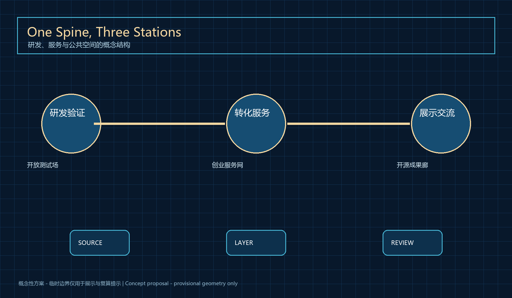
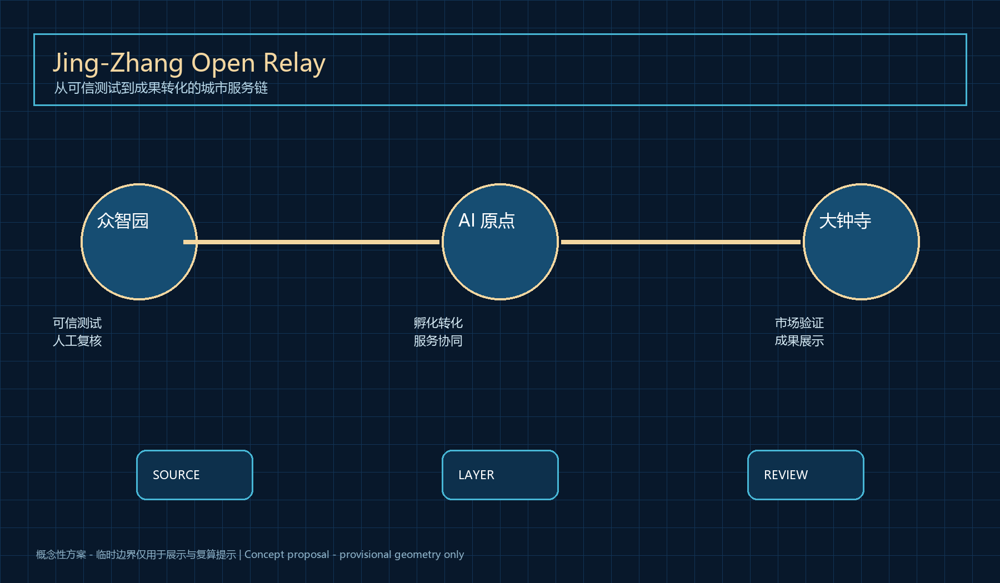
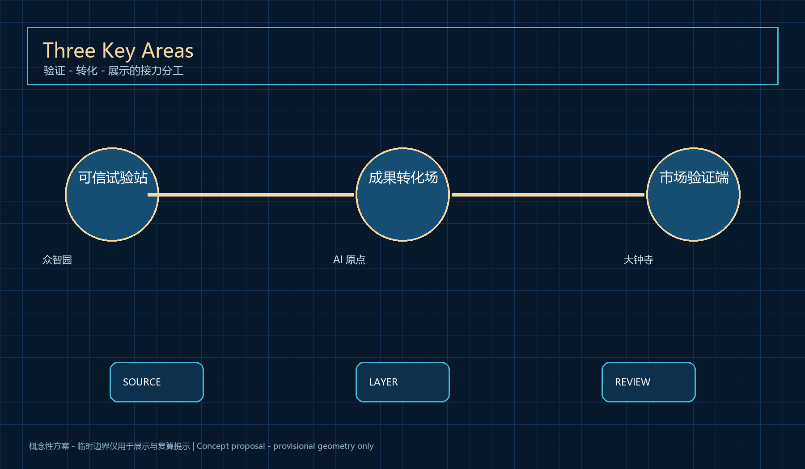
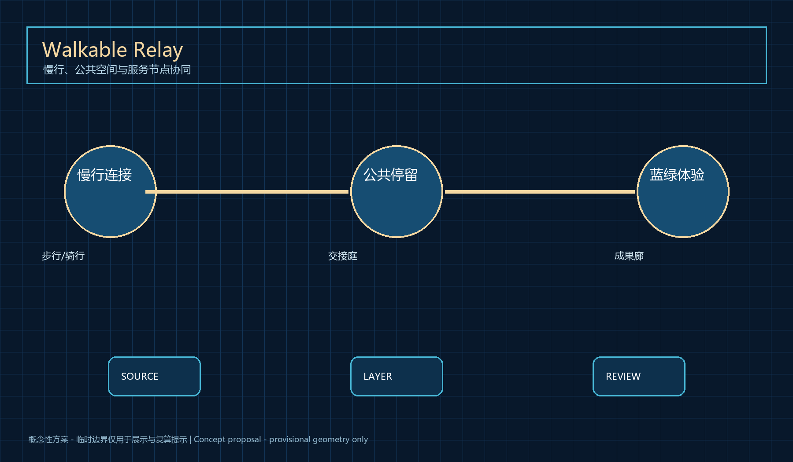
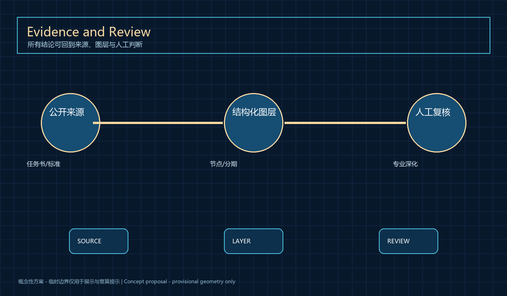

# Jing-Zhang Open Relay

## Design Basis and Source List

Jing-Zhang Open Relay starts from the practical gap between a research prototype and a public urban service. Research teams need accessible validation, compliance support and operating partners; the city needs evidence of public value without overstating technical maturity. The package uses the official announcement, the taskbook and urban-design standards; public governance materials only frame human review, accessibility and feedback boundaries. Every spatial move is therefore a concept node, service relationship or staged validation pathway, not a regulatory decision, engineering design or approval claim. [source:DATA-SRC-OFFICIAL-ANNOUNCEMENT-20260509] [source:DATA-SRC-AGENT-TASKBOOK-20260518]

The proposal keeps three evidence layers distinct. The public brief establishes goals and scope, provisional geometry is only a visualization and self-check constraint, and design layers communicate relationships for later professional review. Height, FAR, ownership, redlines, utilities, investment and construction timing remain pending confirmation. [data:geometry/site_boundary.geojson#SITE-001] [standard:MOHURD-CONTROL-DETAILED-PLANNING]

The package uses the official announcement, the taskbook and urban-design standards; public governance materials only frame human review, accessibility and feedback boundaries. This judgement is translated into nodes, corridors, public-space components, phasing and reproducible metrics. Official polygons and baseline data must replace the temporary inputs before any professional implementation decision; area, connectivity and priority calculations must then be rerun. [metric:site_area_sqm] [depth:three_level_scope_framework]
## Three-Level Scope Framework

Jing-Zhang Open Relay starts from the practical gap between a research prototype and a public urban service. Research teams need accessible validation, compliance support and operating partners; the city needs evidence of public value without overstating technical maturity. The 43.6 km2 study area frames ecosystem strategy, the 11.4 km2 design area frames the relay, and the three key areas host validation, conversion and presentation. Every spatial move is therefore a concept node, service relationship or staged validation pathway, not a regulatory decision, engineering design or approval claim. [source:DATA-SRC-OFFICIAL-ANNOUNCEMENT-20260509] [source:DATA-SRC-AGENT-TASKBOOK-20260518]

The proposal keeps three evidence layers distinct. The public brief establishes goals and scope, provisional geometry is only a visualization and self-check constraint, and design layers communicate relationships for later professional review. Height, FAR, ownership, redlines, utilities, investment and construction timing remain pending confirmation. [data:geometry/site_boundary.geojson#SITE-001] [standard:MOHURD-CONTROL-DETAILED-PLANNING]

The 43.6 km2 study area frames ecosystem strategy, the 11.4 km2 design area frames the relay, and the three key areas host validation, conversion and presentation. This judgement is translated into nodes, corridors, public-space components, phasing and reproducible metrics. Official polygons and baseline data must replace the temporary inputs before any professional implementation decision; area, connectivity and priority calculations must then be rerun. [metric:site_area_sqm] [depth:three_level_scope_framework]

## Coordinated Research Area: Industry and Future City Research

Jing-Zhang Open Relay starts from the practical gap between a research prototype and a public urban service. Research teams need accessible validation, compliance support and operating partners; the city needs evidence of public value without overstating technical maturity. The concept translates the railway’s connective legacy into an open relay between research, talent, services and public feedback. Every spatial move is therefore a concept node, service relationship or staged validation pathway, not a regulatory decision, engineering design or approval claim. [source:DATA-SRC-OFFICIAL-ANNOUNCEMENT-20260509] [source:DATA-SRC-AGENT-TASKBOOK-20260518]

The proposal keeps three evidence layers distinct. The public brief establishes goals and scope, provisional geometry is only a visualization and self-check constraint, and design layers communicate relationships for later professional review. Height, FAR, ownership, redlines, utilities, investment and construction timing remain pending confirmation. [data:geometry/site_boundary.geojson#SITE-001] [standard:MOHURD-CONTROL-DETAILED-PLANNING]

The concept translates the railway’s connective legacy into an open relay between research, talent, services and public feedback. This judgement is translated into nodes, corridors, public-space components, phasing and reproducible metrics. Official polygons and baseline data must replace the temporary inputs before any professional implementation decision; area, connectivity and priority calculations must then be rerun. [metric:site_area_sqm] [depth:three_level_scope_framework]
## Overall Design Area: Urban Renewal and Regulatory-Plan-Level Urban Design

Jing-Zhang Open Relay starts from the practical gap between a research prototype and a public urban service. Research teams need accessible validation, compliance support and operating partners; the city needs evidence of public value without overstating technical maturity. One service spine and three relay stations organize the overall concept while existing urban conditions remain subject to professional verification. Every spatial move is therefore a concept node, service relationship or staged validation pathway, not a regulatory decision, engineering design or approval claim. [source:DATA-SRC-OFFICIAL-ANNOUNCEMENT-20260509] [source:DATA-SRC-AGENT-TASKBOOK-20260518]

The proposal keeps three evidence layers distinct. The public brief establishes goals and scope, provisional geometry is only a visualization and self-check constraint, and design layers communicate relationships for later professional review. Height, FAR, ownership, redlines, utilities, investment and construction timing remain pending confirmation. [data:geometry/site_boundary.geojson#SITE-001] [standard:MOHURD-CONTROL-DETAILED-PLANNING]

One service spine and three relay stations organize the overall concept while existing urban conditions remain subject to professional verification. This judgement is translated into nodes, corridors, public-space components, phasing and reproducible metrics. Official polygons and baseline data must replace the temporary inputs before any professional implementation decision; area, connectivity and priority calculations must then be rerun. [metric:site_area_sqm] [depth:three_level_scope_framework]

## Detailed Design of Key Areas

Jing-Zhang Open Relay starts from the practical gap between a research prototype and a public urban service. Research teams need accessible validation, compliance support and operating partners; the city needs evidence of public value without overstating technical maturity. Zhongzhiyuan is a trusted test station, AI Origin Community is the conversion hub, and Dazhongsi is the market-validation and display terminus. Every spatial move is therefore a concept node, service relationship or staged validation pathway, not a regulatory decision, engineering design or approval claim. [source:DATA-SRC-OFFICIAL-ANNOUNCEMENT-20260509] [source:DATA-SRC-AGENT-TASKBOOK-20260518]

The proposal keeps three evidence layers distinct. The public brief establishes goals and scope, provisional geometry is only a visualization and self-check constraint, and design layers communicate relationships for later professional review. Height, FAR, ownership, redlines, utilities, investment and construction timing remain pending confirmation. [data:geometry/site_boundary.geojson#SITE-001] [standard:MOHURD-CONTROL-DETAILED-PLANNING]

Zhongzhiyuan is a trusted test station, AI Origin Community is the conversion hub, and Dazhongsi is the market-validation and display terminus. This judgement is translated into nodes, corridors, public-space components, phasing and reproducible metrics. Official polygons and baseline data must replace the temporary inputs before any professional implementation decision; area, connectivity and priority calculations must then be rerun. [metric:site_area_sqm] [depth:three_level_scope_framework]
### Ten scenario cards

Research intake, compliance support, enterprise service, low-risk wayfinding, accessible guidance, robot-delivery observation, safety review, health navigation, open-source publication and a developer issue library each use minimum data, human handoff, public feedback and a reversible pilot condition.

### Three AI pilgrimage nodes

The trusted test station, human-AI handoff court and open-source gallery are conceptual public-memory devices, not approved projects or engineering commitments.

## AI Innovation Ecosystem, Personas, and AI+ Scenarios

Jing-Zhang Open Relay starts from the practical gap between a research prototype and a public urban service. Research teams need accessible validation, compliance support and operating partners; the city needs evidence of public value without overstating technical maturity. Researchers, startups, service partners, visitors and operators are supported by scenario cards with minimum-data, human-handoff and exit conditions. Every spatial move is therefore a concept node, service relationship or staged validation pathway, not a regulatory decision, engineering design or approval claim. [source:DATA-SRC-OFFICIAL-ANNOUNCEMENT-20260509] [source:DATA-SRC-AGENT-TASKBOOK-20260518]

The proposal keeps three evidence layers distinct. The public brief establishes goals and scope, provisional geometry is only a visualization and self-check constraint, and design layers communicate relationships for later professional review. Height, FAR, ownership, redlines, utilities, investment and construction timing remain pending confirmation. [data:geometry/site_boundary.geojson#SITE-001] [standard:MOHURD-CONTROL-DETAILED-PLANNING]

Researchers, startups, service partners, visitors and operators are supported by scenario cards with minimum-data, human-handoff and exit conditions. This judgement is translated into nodes, corridors, public-space components, phasing and reproducible metrics. Official polygons and baseline data must replace the temporary inputs before any professional implementation decision; area, connectivity and priority calculations must then be rerun. [metric:site_area_sqm] [depth:three_level_scope_framework]
## Land Use, Building Scale, and Retain-Renovate-Demolish Strategy

Jing-Zhang Open Relay starts from the practical gap between a research prototype and a public urban service. Research teams need accessible validation, compliance support and operating partners; the city needs evidence of public value without overstating technical maturity. Land-use layers communicate conceptual relations among research, service, public and green spaces; they do not decide building retention or intensity. Every spatial move is therefore a concept node, service relationship or staged validation pathway, not a regulatory decision, engineering design or approval claim. [source:DATA-SRC-OFFICIAL-ANNOUNCEMENT-20260509] [source:DATA-SRC-AGENT-TASKBOOK-20260518]

The proposal keeps three evidence layers distinct. The public brief establishes goals and scope, provisional geometry is only a visualization and self-check constraint, and design layers communicate relationships for later professional review. Height, FAR, ownership, redlines, utilities, investment and construction timing remain pending confirmation. [data:geometry/site_boundary.geojson#SITE-001] [standard:MOHURD-CONTROL-DETAILED-PLANNING]

Land-use layers communicate conceptual relations among research, service, public and green spaces; they do not decide building retention or intensity. This judgement is translated into nodes, corridors, public-space components, phasing and reproducible metrics. Official polygons and baseline data must replace the temporary inputs before any professional implementation decision; area, connectivity and priority calculations must then be rerun. [metric:site_area_sqm] [depth:three_level_scope_framework]
## Transport, Rail, Municipal Infrastructure, and Public Services

Jing-Zhang Open Relay starts from the practical gap between a research prototype and a public urban service. Research teams need accessible validation, compliance support and operating partners; the city needs evidence of public value without overstating technical maturity. The mobility layer shows walking, cycling, rail transfer and low-risk service paths; physical changes require official data and specialist review. Every spatial move is therefore a concept node, service relationship or staged validation pathway, not a regulatory decision, engineering design or approval claim. [source:DATA-SRC-OFFICIAL-ANNOUNCEMENT-20260509] [source:DATA-SRC-AGENT-TASKBOOK-20260518]

The proposal keeps three evidence layers distinct. The public brief establishes goals and scope, provisional geometry is only a visualization and self-check constraint, and design layers communicate relationships for later professional review. Height, FAR, ownership, redlines, utilities, investment and construction timing remain pending confirmation. [data:geometry/site_boundary.geojson#SITE-001] [standard:MOHURD-CONTROL-DETAILED-PLANNING]

The mobility layer shows walking, cycling, rail transfer and low-risk service paths; physical changes require official data and specialist review. This judgement is translated into nodes, corridors, public-space components, phasing and reproducible metrics. Official polygons and baseline data must replace the temporary inputs before any professional implementation decision; area, connectivity and priority calculations must then be rerun. [metric:site_area_sqm] [depth:three_level_scope_framework]

## Blue-Green Network, Public Space, and Urban Character

Jing-Zhang Open Relay starts from the practical gap between a research prototype and a public urban service. Research teams need accessible validation, compliance support and operating partners; the city needs evidence of public value without overstating technical maturity. Open-source galleries, human-AI handoff courts and model-repair stations extend the railway memory while retaining non-digital service access. Every spatial move is therefore a concept node, service relationship or staged validation pathway, not a regulatory decision, engineering design or approval claim. [source:DATA-SRC-OFFICIAL-ANNOUNCEMENT-20260509] [source:DATA-SRC-AGENT-TASKBOOK-20260518]

The proposal keeps three evidence layers distinct. The public brief establishes goals and scope, provisional geometry is only a visualization and self-check constraint, and design layers communicate relationships for later professional review. Height, FAR, ownership, redlines, utilities, investment and construction timing remain pending confirmation. [data:geometry/site_boundary.geojson#SITE-001] [standard:MOHURD-CONTROL-DETAILED-PLANNING]

Open-source galleries, human-AI handoff courts and model-repair stations extend the railway memory while retaining non-digital service access. This judgement is translated into nodes, corridors, public-space components, phasing and reproducible metrics. Official polygons and baseline data must replace the temporary inputs before any professional implementation decision; area, connectivity and priority calculations must then be rerun. [metric:site_area_sqm] [depth:three_level_scope_framework]
## Renewal Projects, Implementation Policy, and Phasing

Jing-Zhang Open Relay starts from the practical gap between a research prototype and a public urban service. Research teams need accessible validation, compliance support and operating partners; the city needs evidence of public value without overstating technical maturity. Prepare, validate and extend are the three stages: establish rules, test reversible pilots, then let specialist teams decide expansion. Every spatial move is therefore a concept node, service relationship or staged validation pathway, not a regulatory decision, engineering design or approval claim. [source:DATA-SRC-OFFICIAL-ANNOUNCEMENT-20260509] [source:DATA-SRC-AGENT-TASKBOOK-20260518]

The proposal keeps three evidence layers distinct. The public brief establishes goals and scope, provisional geometry is only a visualization and self-check constraint, and design layers communicate relationships for later professional review. Height, FAR, ownership, redlines, utilities, investment and construction timing remain pending confirmation. [data:geometry/site_boundary.geojson#SITE-001] [standard:MOHURD-CONTROL-DETAILED-PLANNING]

Prepare, validate and extend are the three stages: establish rules, test reversible pilots, then let specialist teams decide expansion. This judgement is translated into nodes, corridors, public-space components, phasing and reproducible metrics. Official polygons and baseline data must replace the temporary inputs before any professional implementation decision; area, connectivity and priority calculations must then be rerun. [metric:site_area_sqm] [depth:three_level_scope_framework]
## Metrics, Area Recalculation, and Compliance Matrix

Jing-Zhang Open Relay starts from the practical gap between a research prototype and a public urban service. Research teams need accessible validation, compliance support and operating partners; the city needs evidence of public value without overstating technical maturity. Metrics describe only provisional layers and node counts; the matrix links every official and agent task to text, drawings and evidence. Every spatial move is therefore a concept node, service relationship or staged validation pathway, not a regulatory decision, engineering design or approval claim. [source:DATA-SRC-OFFICIAL-ANNOUNCEMENT-20260509] [source:DATA-SRC-AGENT-TASKBOOK-20260518]

The proposal keeps three evidence layers distinct. The public brief establishes goals and scope, provisional geometry is only a visualization and self-check constraint, and design layers communicate relationships for later professional review. Height, FAR, ownership, redlines, utilities, investment and construction timing remain pending confirmation. [data:geometry/site_boundary.geojson#SITE-001] [standard:MOHURD-CONTROL-DETAILED-PLANNING]

Metrics describe only provisional layers and node counts; the matrix links every official and agent task to text, drawings and evidence. This judgement is translated into nodes, corridors, public-space components, phasing and reproducible metrics. Official polygons and baseline data must replace the temporary inputs before any professional implementation decision; area, connectivity and priority calculations must then be rerun. [metric:site_area_sqm] [depth:three_level_scope_framework]

## Risk, Copyright, and Compliance

Jing-Zhang Open Relay starts from the practical gap between a research prototype and a public urban service. Research teams need accessible validation, compliance support and operating partners; the city needs evidence of public value without overstating technical maturity. Public data, minimum necessary data, human review, pause and appeal routes are mandatory; diagrams are original and sources are registered. Every spatial move is therefore a concept node, service relationship or staged validation pathway, not a regulatory decision, engineering design or approval claim. [source:DATA-SRC-OFFICIAL-ANNOUNCEMENT-20260509] [source:DATA-SRC-AGENT-TASKBOOK-20260518]

The proposal keeps three evidence layers distinct. The public brief establishes goals and scope, provisional geometry is only a visualization and self-check constraint, and design layers communicate relationships for later professional review. Height, FAR, ownership, redlines, utilities, investment and construction timing remain pending confirmation. [data:geometry/site_boundary.geojson#SITE-001] [standard:MOHURD-CONTROL-DETAILED-PLANNING]

Public data, minimum necessary data, human review, pause and appeal routes are mandatory; diagrams are original and sources are registered. This judgement is translated into nodes, corridors, public-space components, phasing and reproducible metrics. Official polygons and baseline data must replace the temporary inputs before any professional implementation decision; area, connectivity and priority calculations must then be rerun. [metric:site_area_sqm] [depth:three_level_scope_framework]
## References

Jing-Zhang Open Relay starts from the practical gap between a research prototype and a public urban service. Research teams need accessible validation, compliance support and operating partners; the city needs evidence of public value without overstating technical maturity. Every source is registered with publisher, permitted use and limits; external material is never upgraded into an official redline or commitment. Every spatial move is therefore a concept node, service relationship or staged validation pathway, not a regulatory decision, engineering design or approval claim. [source:DATA-SRC-OFFICIAL-ANNOUNCEMENT-20260509] [source:DATA-SRC-AGENT-TASKBOOK-20260518]

The proposal keeps three evidence layers distinct. The public brief establishes goals and scope, provisional geometry is only a visualization and self-check constraint, and design layers communicate relationships for later professional review. Height, FAR, ownership, redlines, utilities, investment and construction timing remain pending confirmation. [data:geometry/site_boundary.geojson#SITE-001] [standard:MOHURD-CONTROL-DETAILED-PLANNING]

Every source is registered with publisher, permitted use and limits; external material is never upgraded into an official redline or commitment. This judgement is translated into nodes, corridors, public-space components, phasing and reproducible metrics. Official polygons and baseline data must replace the temporary inputs before any professional implementation decision; area, connectivity and priority calculations must then be rerun. [metric:site_area_sqm] [depth:three_level_scope_framework]
