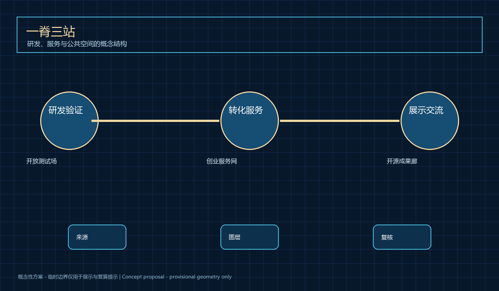
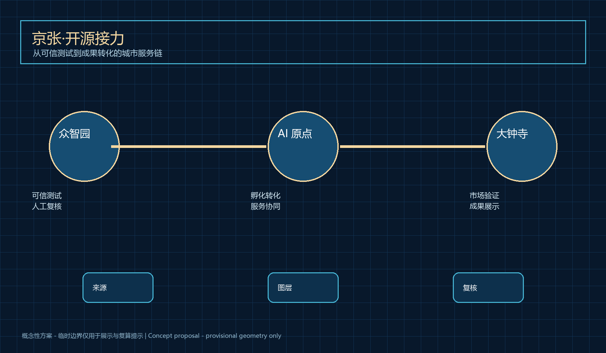
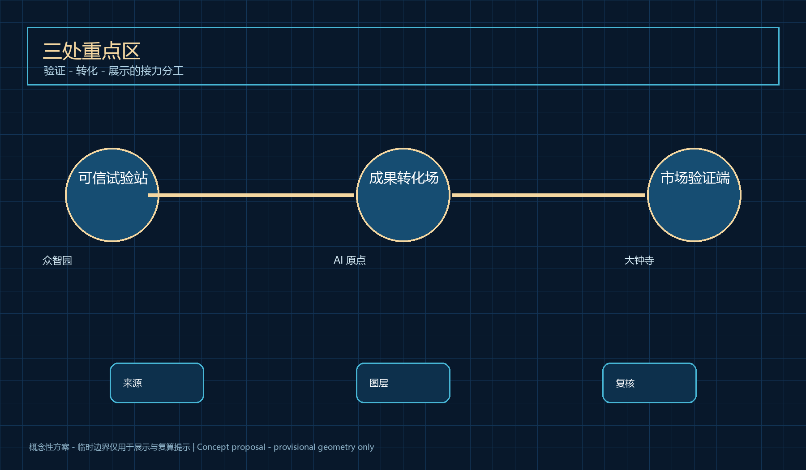
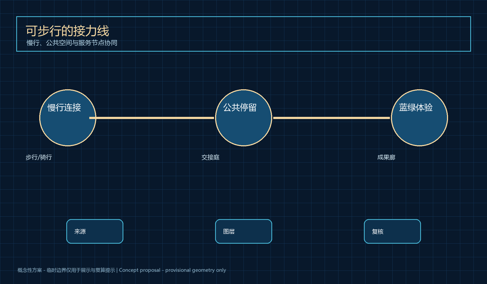
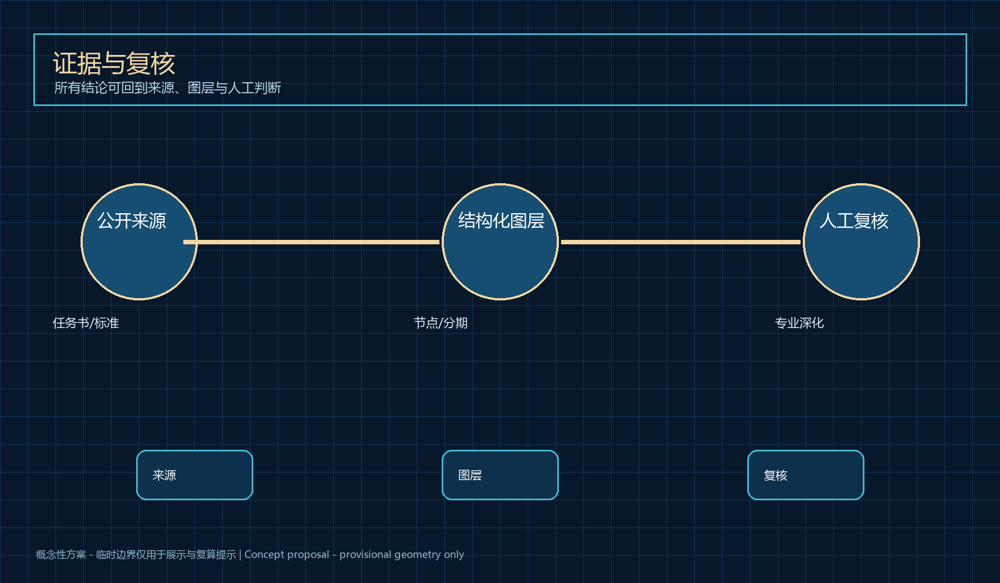

# 京张·开源接力 / Jing-Zhang Open Relay

## 设计依据与资料清单

京张·开源接力以科研成果从实验室走向城市的真实摩擦为起点：团队需要可获得的验证机会、合规与运营支持，城市也需要在不夸大技术能力的前提下识别公共价值。资料以官方公告、任务书、城市设计与用地分类标准为依据；补充的公开服务治理资料仅用于描述人工复核、无障碍与反馈边界。 本方案将所有空间动作写作概念节点、服务关系和分阶段验证路径，不替代控规、工程设计或审批结论。[source:DATA-SRC-OFFICIAL-ANNOUNCEMENT-20260509] [source:DATA-SRC-AGENT-TASKBOOK-20260518]

设计方法把三类证据并置：公开任务书说明区域目标与范围；临时边界只作为可视化和本地自检约束；设计图层表达可由专业团队继续校核的服务网络。任何涉及高度、容积率、产权、道路红线、市政容量或投资安排的事项均保留为待确认条件。通过这种边界，方案既能表达空间与运营的关系，也不把概念误写成已确定事实。[data:geometry/site_boundary.geojson#SITE-001] [standard:MOHURD-CONTROL-DETAILED-PLANNING]

资料以官方公告、任务书、城市设计与用地分类标准为依据；补充的公开服务治理资料仅用于描述人工复核、无障碍与反馈边界。 该判断对应方案的节点、廊道、公共空间、分期和指标层：节点用来组织服务交接，廊道用来串联步行与展示，指标只记录可从提交图层复算的数量。正式边界、现状设施和控制条件发布后，专业团队应替换临时范围并重新计算面积、连通性与实施优先级。[metric:site_area_sqm] [depth:three_level_scope_framework]
## 三层范围工作框架

京张·开源接力以科研成果从实验室走向城市的真实摩擦为起点：团队需要可获得的验证机会、合规与运营支持，城市也需要在不夸大技术能力的前提下识别公共价值。43.6 平方公里统筹研究区组织创新生态，11.4 平方公里总体设计区组织开源接力线，三处重点区形成验证、转化与展示的接力。 本方案将所有空间动作写作概念节点、服务关系和分阶段验证路径，不替代控规、工程设计或审批结论。[source:DATA-SRC-OFFICIAL-ANNOUNCEMENT-20260509] [source:DATA-SRC-AGENT-TASKBOOK-20260518]

设计方法把三类证据并置：公开任务书说明区域目标与范围；临时边界只作为可视化和本地自检约束；设计图层表达可由专业团队继续校核的服务网络。任何涉及高度、容积率、产权、道路红线、市政容量或投资安排的事项均保留为待确认条件。通过这种边界，方案既能表达空间与运营的关系，也不把概念误写成已确定事实。[data:geometry/site_boundary.geojson#SITE-001] [standard:MOHURD-CONTROL-DETAILED-PLANNING]

43.6 平方公里统筹研究区组织创新生态，11.4 平方公里总体设计区组织开源接力线，三处重点区形成验证、转化与展示的接力。 该判断对应方案的节点、廊道、公共空间、分期和指标层：节点用来组织服务交接，廊道用来串联步行与展示，指标只记录可从提交图层复算的数量。正式边界、现状设施和控制条件发布后，专业团队应替换临时范围并重新计算面积、连通性与实施优先级。[metric:site_area_sqm] [depth:three_level_scope_framework]

## 统筹研究范围产业与未来城市研究

京张·开源接力以科研成果从实验室走向城市的真实摩擦为起点：团队需要可获得的验证机会、合规与运营支持，城市也需要在不夸大技术能力的前提下识别公共价值。总体概念把百年铁路的连接能力转译为成果、人才、服务与公众反馈之间可追溯的开源接力。 本方案将所有空间动作写作概念节点、服务关系和分阶段验证路径，不替代控规、工程设计或审批结论。[source:DATA-SRC-OFFICIAL-ANNOUNCEMENT-20260509] [source:DATA-SRC-AGENT-TASKBOOK-20260518]

设计方法把三类证据并置：公开任务书说明区域目标与范围；临时边界只作为可视化和本地自检约束；设计图层表达可由专业团队继续校核的服务网络。任何涉及高度、容积率、产权、道路红线、市政容量或投资安排的事项均保留为待确认条件。通过这种边界，方案既能表达空间与运营的关系，也不把概念误写成已确定事实。[data:geometry/site_boundary.geojson#SITE-001] [standard:MOHURD-CONTROL-DETAILED-PLANNING]

总体概念把百年铁路的连接能力转译为成果、人才、服务与公众反馈之间可追溯的开源接力。 该判断对应方案的节点、廊道、公共空间、分期和指标层：节点用来组织服务交接，廊道用来串联步行与展示，指标只记录可从提交图层复算的数量。正式边界、现状设施和控制条件发布后，专业团队应替换临时范围并重新计算面积、连通性与实施优先级。[metric:site_area_sqm] [depth:three_level_scope_framework]
## 总体设计范围城市更新与控规深度城市设计

京张·开源接力以科研成果从实验室走向城市的真实摩擦为起点：团队需要可获得的验证机会、合规与运营支持，城市也需要在不夸大技术能力的前提下识别公共价值。总体空间以一条服务脊柱和三类接力站组成，保留既有城市界面和公共空间的专业核查入口。 本方案将所有空间动作写作概念节点、服务关系和分阶段验证路径，不替代控规、工程设计或审批结论。[source:DATA-SRC-OFFICIAL-ANNOUNCEMENT-20260509] [source:DATA-SRC-AGENT-TASKBOOK-20260518]

设计方法把三类证据并置：公开任务书说明区域目标与范围；临时边界只作为可视化和本地自检约束；设计图层表达可由专业团队继续校核的服务网络。任何涉及高度、容积率、产权、道路红线、市政容量或投资安排的事项均保留为待确认条件。通过这种边界，方案既能表达空间与运营的关系，也不把概念误写成已确定事实。[data:geometry/site_boundary.geojson#SITE-001] [standard:MOHURD-CONTROL-DETAILED-PLANNING]

总体空间以一条服务脊柱和三类接力站组成，保留既有城市界面和公共空间的专业核查入口。 该判断对应方案的节点、廊道、公共空间、分期和指标层：节点用来组织服务交接，廊道用来串联步行与展示，指标只记录可从提交图层复算的数量。正式边界、现状设施和控制条件发布后，专业团队应替换临时范围并重新计算面积、连通性与实施优先级。[metric:site_area_sqm] [depth:three_level_scope_framework]

## 重点区域详细设计

京张·开源接力以科研成果从实验室走向城市的真实摩擦为起点：团队需要可获得的验证机会、合规与运营支持，城市也需要在不夸大技术能力的前提下识别公共价值。众智园是可信试验站，AI 原点社区是成果转化主场，大钟寺是市场验证与展示终端；三者以可步行、可停留的概念廊道衔接。 本方案将所有空间动作写作概念节点、服务关系和分阶段验证路径，不替代控规、工程设计或审批结论。[source:DATA-SRC-OFFICIAL-ANNOUNCEMENT-20260509] [source:DATA-SRC-AGENT-TASKBOOK-20260518]

设计方法把三类证据并置：公开任务书说明区域目标与范围；临时边界只作为可视化和本地自检约束；设计图层表达可由专业团队继续校核的服务网络。任何涉及高度、容积率、产权、道路红线、市政容量或投资安排的事项均保留为待确认条件。通过这种边界，方案既能表达空间与运营的关系，也不把概念误写成已确定事实。[data:geometry/site_boundary.geojson#SITE-001] [standard:MOHURD-CONTROL-DETAILED-PLANNING]

众智园是可信试验站，AI 原点社区是成果转化主场，大钟寺是市场验证与展示终端；三者以可步行、可停留的概念廊道衔接。 该判断对应方案的节点、廊道、公共空间、分期和指标层：节点用来组织服务交接，廊道用来串联步行与展示，指标只记录可从提交图层复算的数量。正式边界、现状设施和控制条件发布后，专业团队应替换临时范围并重新计算面积、连通性与实施优先级。[metric:site_area_sqm] [depth:three_level_scope_framework]
### 十张场景卡

1. 研究成果接入台；2. 合规咨询台；3. 企业服务协同台；4. 低风险步行导航；5. 可访问导览；6. 机器人配送观察点；7. 公共安全复核台；8. 健康服务导航；9. 开源成果发布台；10. 开发者问题库。每张卡均采用最小必要数据、人工接手、公开反馈和可暂停试点的概念条件。

### 三个 AI 朝圣节点

可信试验站、 人机交接庭和开源成果廊共同形成可观看、可参与、可纠错的城市创新记忆；它们不是获批项目或工程承诺。

## AI 创新生态、人才画像与 AI+ 场景

京张·开源接力以科研成果从实验室走向城市的真实摩擦为起点：团队需要可获得的验证机会、合规与运营支持，城市也需要在不夸大技术能力的前提下识别公共价值。方案服务研究人员、初创团队、企业服务者、居民访客与现场运营者，并以场景卡规定数据最小化、人工接手和退出条件。 本方案将所有空间动作写作概念节点、服务关系和分阶段验证路径，不替代控规、工程设计或审批结论。[source:DATA-SRC-OFFICIAL-ANNOUNCEMENT-20260509] [source:DATA-SRC-AGENT-TASKBOOK-20260518]

设计方法把三类证据并置：公开任务书说明区域目标与范围；临时边界只作为可视化和本地自检约束；设计图层表达可由专业团队继续校核的服务网络。任何涉及高度、容积率、产权、道路红线、市政容量或投资安排的事项均保留为待确认条件。通过这种边界，方案既能表达空间与运营的关系，也不把概念误写成已确定事实。[data:geometry/site_boundary.geojson#SITE-001] [standard:MOHURD-CONTROL-DETAILED-PLANNING]

方案服务研究人员、初创团队、企业服务者、居民访客与现场运营者，并以场景卡规定数据最小化、人工接手和退出条件。 该判断对应方案的节点、廊道、公共空间、分期和指标层：节点用来组织服务交接，廊道用来串联步行与展示，指标只记录可从提交图层复算的数量。正式边界、现状设施和控制条件发布后，专业团队应替换临时范围并重新计算面积、连通性与实施优先级。[metric:site_area_sqm] [depth:three_level_scope_framework]
## 用地、建筑规模与拆改留方案

京张·开源接力以科研成果从实验室走向城市的真实摩擦为起点：团队需要可获得的验证机会、合规与运营支持，城市也需要在不夸大技术能力的前提下识别公共价值。用地层仅组织研发、服务、公共空间与绿色开放空间的概念关系；并不判定既有建筑去留、规模或法定强度。 本方案将所有空间动作写作概念节点、服务关系和分阶段验证路径，不替代控规、工程设计或审批结论。[source:DATA-SRC-OFFICIAL-ANNOUNCEMENT-20260509] [source:DATA-SRC-AGENT-TASKBOOK-20260518]

设计方法把三类证据并置：公开任务书说明区域目标与范围；临时边界只作为可视化和本地自检约束；设计图层表达可由专业团队继续校核的服务网络。任何涉及高度、容积率、产权、道路红线、市政容量或投资安排的事项均保留为待确认条件。通过这种边界，方案既能表达空间与运营的关系，也不把概念误写成已确定事实。[data:geometry/site_boundary.geojson#SITE-001] [standard:MOHURD-CONTROL-DETAILED-PLANNING]

用地层仅组织研发、服务、公共空间与绿色开放空间的概念关系；并不判定既有建筑去留、规模或法定强度。 该判断对应方案的节点、廊道、公共空间、分期和指标层：节点用来组织服务交接，廊道用来串联步行与展示，指标只记录可从提交图层复算的数量。正式边界、现状设施和控制条件发布后，专业团队应替换临时范围并重新计算面积、连通性与实施优先级。[metric:site_area_sqm] [depth:three_level_scope_framework]
## 交通、轨道、市政与公共服务设施

京张·开源接力以科研成果从实验室走向城市的真实摩擦为起点：团队需要可获得的验证机会、合规与运营支持，城市也需要在不夸大技术能力的前提下识别公共价值。交通层表达接力站之间的步行、骑行、轨道接驳和低风险服务路径；任何道路或市政调整均待正式资料与专业复核。 本方案将所有空间动作写作概念节点、服务关系和分阶段验证路径，不替代控规、工程设计或审批结论。[source:DATA-SRC-OFFICIAL-ANNOUNCEMENT-20260509] [source:DATA-SRC-AGENT-TASKBOOK-20260518]

设计方法把三类证据并置：公开任务书说明区域目标与范围；临时边界只作为可视化和本地自检约束；设计图层表达可由专业团队继续校核的服务网络。任何涉及高度、容积率、产权、道路红线、市政容量或投资安排的事项均保留为待确认条件。通过这种边界，方案既能表达空间与运营的关系，也不把概念误写成已确定事实。[data:geometry/site_boundary.geojson#SITE-001] [standard:MOHURD-CONTROL-DETAILED-PLANNING]

交通层表达接力站之间的步行、骑行、轨道接驳和低风险服务路径；任何道路或市政调整均待正式资料与专业复核。 该判断对应方案的节点、廊道、公共空间、分期和指标层：节点用来组织服务交接，廊道用来串联步行与展示，指标只记录可从提交图层复算的数量。正式边界、现状设施和控制条件发布后，专业团队应替换临时范围并重新计算面积、连通性与实施优先级。[metric:site_area_sqm] [depth:three_level_scope_framework]

## 蓝绿空间、公共空间与城市风貌

京张·开源接力以科研成果从实验室走向城市的真实摩擦为起点：团队需要可获得的验证机会、合规与运营支持，城市也需要在不夸大技术能力的前提下识别公共价值。蓝图式公共空间组件包括开源成果廊、人机交接庭和算法检修站，延续铁路遗产的线性记忆并保留非数字化服务入口。 本方案将所有空间动作写作概念节点、服务关系和分阶段验证路径，不替代控规、工程设计或审批结论。[source:DATA-SRC-OFFICIAL-ANNOUNCEMENT-20260509] [source:DATA-SRC-AGENT-TASKBOOK-20260518]

设计方法把三类证据并置：公开任务书说明区域目标与范围；临时边界只作为可视化和本地自检约束；设计图层表达可由专业团队继续校核的服务网络。任何涉及高度、容积率、产权、道路红线、市政容量或投资安排的事项均保留为待确认条件。通过这种边界，方案既能表达空间与运营的关系，也不把概念误写成已确定事实。[data:geometry/site_boundary.geojson#SITE-001] [standard:MOHURD-CONTROL-DETAILED-PLANNING]

蓝图式公共空间组件包括开源成果廊、人机交接庭和算法检修站，延续铁路遗产的线性记忆并保留非数字化服务入口。 该判断对应方案的节点、廊道、公共空间、分期和指标层：节点用来组织服务交接，廊道用来串联步行与展示，指标只记录可从提交图层复算的数量。正式边界、现状设施和控制条件发布后，专业团队应替换临时范围并重新计算面积、连通性与实施优先级。[metric:site_area_sqm] [depth:three_level_scope_framework]
## 更新项目清单、实施政策与分期计划

京张·开源接力以科研成果从实验室走向城市的真实摩擦为起点：团队需要可获得的验证机会、合规与运营支持，城市也需要在不夸大技术能力的前提下识别公共价值。项目按准备、验证、扩展三期组织：先建立协作规则，再开展低风险试点，最后由专业团队决定是否扩展。 本方案将所有空间动作写作概念节点、服务关系和分阶段验证路径，不替代控规、工程设计或审批结论。[source:DATA-SRC-OFFICIAL-ANNOUNCEMENT-20260509] [source:DATA-SRC-AGENT-TASKBOOK-20260518]

设计方法把三类证据并置：公开任务书说明区域目标与范围；临时边界只作为可视化和本地自检约束；设计图层表达可由专业团队继续校核的服务网络。任何涉及高度、容积率、产权、道路红线、市政容量或投资安排的事项均保留为待确认条件。通过这种边界，方案既能表达空间与运营的关系，也不把概念误写成已确定事实。[data:geometry/site_boundary.geojson#SITE-001] [standard:MOHURD-CONTROL-DETAILED-PLANNING]

项目按准备、验证、扩展三期组织：先建立协作规则，再开展低风险试点，最后由专业团队决定是否扩展。 该判断对应方案的节点、廊道、公共空间、分期和指标层：节点用来组织服务交接，廊道用来串联步行与展示，指标只记录可从提交图层复算的数量。正式边界、现状设施和控制条件发布后，专业团队应替换临时范围并重新计算面积、连通性与实施优先级。[metric:site_area_sqm] [depth:three_level_scope_framework]
## 指标体系、面积复算与合规矩阵

京张·开源接力以科研成果从实验室走向城市的真实摩擦为起点：团队需要可获得的验证机会、合规与运营支持，城市也需要在不夸大技术能力的前提下识别公共价值。指标只表达临时图层的面积、节点数量与阶段关系；合规矩阵将六项智能体任务和官方任务对应到文本、图层与图纸。 本方案将所有空间动作写作概念节点、服务关系和分阶段验证路径，不替代控规、工程设计或审批结论。[source:DATA-SRC-OFFICIAL-ANNOUNCEMENT-20260509] [source:DATA-SRC-AGENT-TASKBOOK-20260518]

设计方法把三类证据并置：公开任务书说明区域目标与范围；临时边界只作为可视化和本地自检约束；设计图层表达可由专业团队继续校核的服务网络。任何涉及高度、容积率、产权、道路红线、市政容量或投资安排的事项均保留为待确认条件。通过这种边界，方案既能表达空间与运营的关系，也不把概念误写成已确定事实。[data:geometry/site_boundary.geojson#SITE-001] [standard:MOHURD-CONTROL-DETAILED-PLANNING]

指标只表达临时图层的面积、节点数量与阶段关系；合规矩阵将六项智能体任务和官方任务对应到文本、图层与图纸。 该判断对应方案的节点、廊道、公共空间、分期和指标层：节点用来组织服务交接，廊道用来串联步行与展示，指标只记录可从提交图层复算的数量。正式边界、现状设施和控制条件发布后，专业团队应替换临时范围并重新计算面积、连通性与实施优先级。[metric:site_area_sqm] [depth:three_level_scope_framework]

## 风险、版权与合规说明

京张·开源接力以科研成果从实验室走向城市的真实摩擦为起点：团队需要可获得的验证机会、合规与运营支持，城市也需要在不夸大技术能力的前提下识别公共价值。所有服务遵循公开资料、最小必要数据、人工复核、可暂停与可申诉原则；素材为自主生成图解和已登记公共来源。 本方案将所有空间动作写作概念节点、服务关系和分阶段验证路径，不替代控规、工程设计或审批结论。[source:DATA-SRC-OFFICIAL-ANNOUNCEMENT-20260509] [source:DATA-SRC-AGENT-TASKBOOK-20260518]

设计方法把三类证据并置：公开任务书说明区域目标与范围；临时边界只作为可视化和本地自检约束；设计图层表达可由专业团队继续校核的服务网络。任何涉及高度、容积率、产权、道路红线、市政容量或投资安排的事项均保留为待确认条件。通过这种边界，方案既能表达空间与运营的关系，也不把概念误写成已确定事实。[data:geometry/site_boundary.geojson#SITE-001] [standard:MOHURD-CONTROL-DETAILED-PLANNING]

所有服务遵循公开资料、最小必要数据、人工复核、可暂停与可申诉原则；素材为自主生成图解和已登记公共来源。 该判断对应方案的节点、廊道、公共空间、分期和指标层：节点用来组织服务交接，廊道用来串联步行与展示，指标只记录可从提交图层复算的数量。正式边界、现状设施和控制条件发布后，专业团队应替换临时范围并重新计算面积、连通性与实施优先级。[metric:site_area_sqm] [depth:three_level_scope_framework]
## 参考资料

京张·开源接力以科研成果从实验室走向城市的真实摩擦为起点：团队需要可获得的验证机会、合规与运营支持，城市也需要在不夸大技术能力的前提下识别公共价值。引用资料均在 sources.json 中登记，包含发布者、用途和边界；外部资料不被提升为官方红线或实施承诺。 本方案将所有空间动作写作概念节点、服务关系和分阶段验证路径，不替代控规、工程设计或审批结论。[source:DATA-SRC-OFFICIAL-ANNOUNCEMENT-20260509] [source:DATA-SRC-AGENT-TASKBOOK-20260518]

设计方法把三类证据并置：公开任务书说明区域目标与范围；临时边界只作为可视化和本地自检约束；设计图层表达可由专业团队继续校核的服务网络。任何涉及高度、容积率、产权、道路红线、市政容量或投资安排的事项均保留为待确认条件。通过这种边界，方案既能表达空间与运营的关系，也不把概念误写成已确定事实。[data:geometry/site_boundary.geojson#SITE-001] [standard:MOHURD-CONTROL-DETAILED-PLANNING]

引用资料均在 sources.json 中登记，包含发布者、用途和边界；外部资料不被提升为官方红线或实施承诺。 该判断对应方案的节点、廊道、公共空间、分期和指标层：节点用来组织服务交接，廊道用来串联步行与展示，指标只记录可从提交图层复算的数量。正式边界、现状设施和控制条件发布后，专业团队应替换临时范围并重新计算面积、连通性与实施优先级。[metric:site_area_sqm] [depth:three_level_scope_framework]
