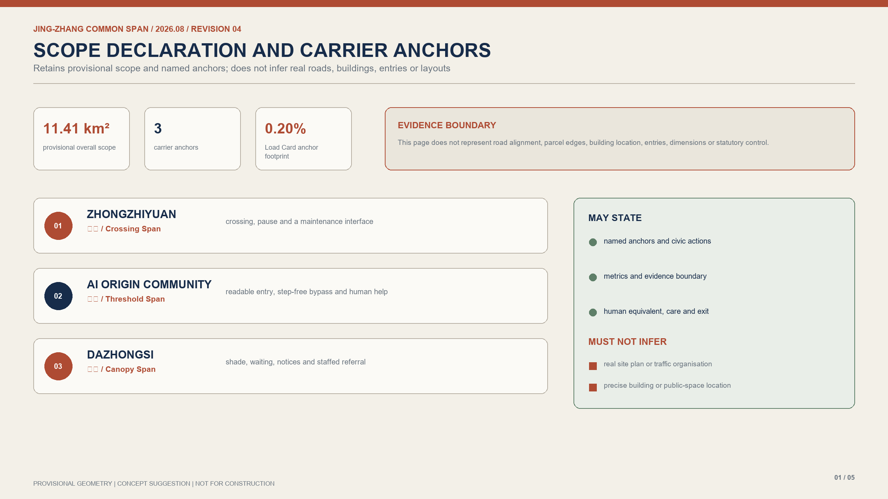
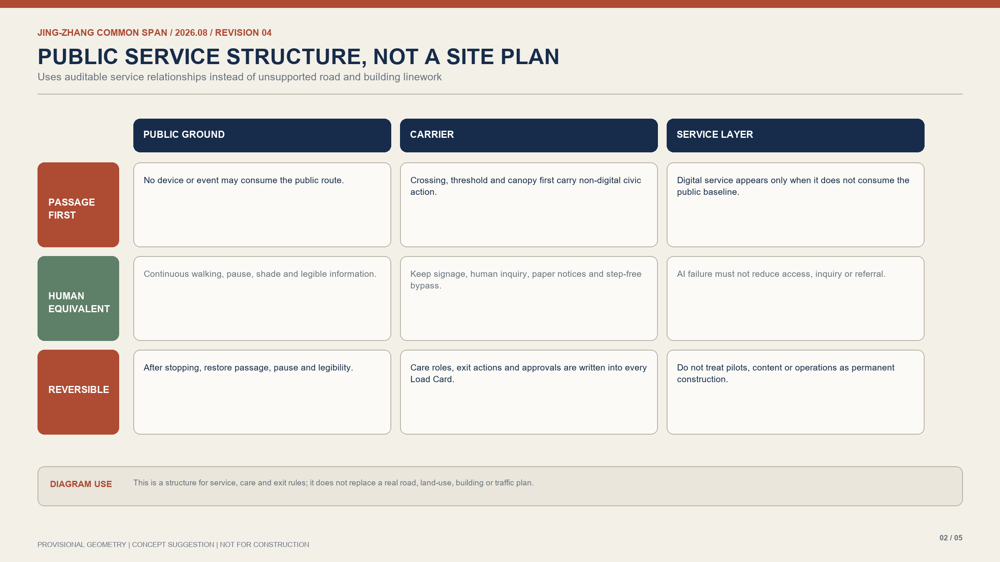
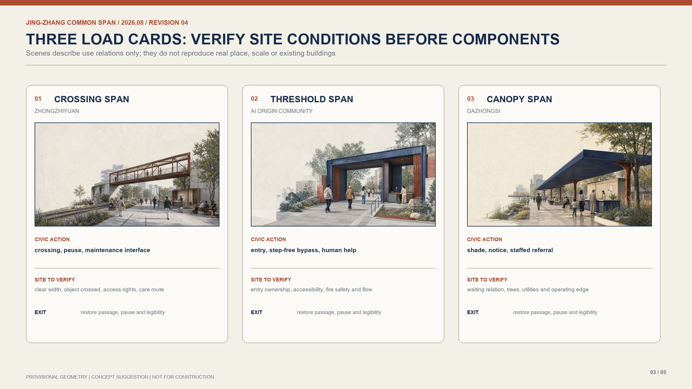
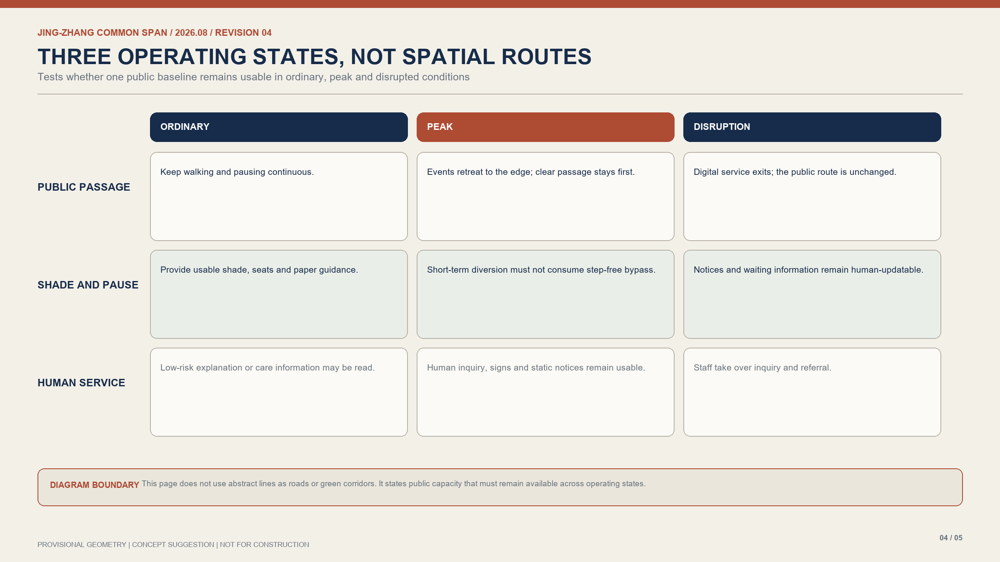
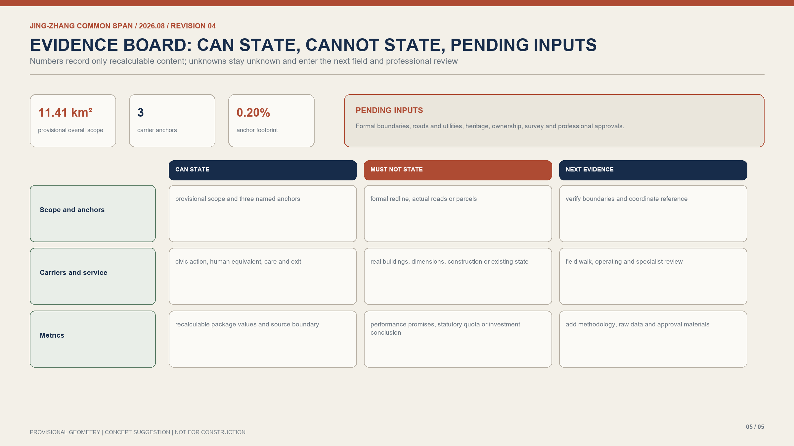

# Jing-Zhang Common Span / 京张·共撑

**Thesis: the city provides walkable, stayable and maintainable public capacity first; AI services may attach to it but may not replace or displace it.** The Jing-Zhang Railway Heritage Park is not blank land for technology. It is first a continuous ground for daily passage, rest, cultural memory and public service; every addition remains a conceptual recommendation pending professional review. [source:OFFICIAL-ANNOUNCEMENT] [source:AGENT-TASKBOOK]

## 1. Design basis, evidence boundary and three scopes

The proposal is organised from the public call, Agent taskbook, source registry and the repository's provisional geometry. [source:OFFICIAL-ANNOUNCEMENT] [source:SITE-PACKAGE] [source:SOURCE-REGISTRY] The 43.6 km² coordinated scope addresses the innovation ecosystem; the roughly 11.4 km² overall scope establishes a public carrying network; the three key areas test further-developable carriers and service relations. [depth:three_level_scope_framework]

The current SITE_BOUNDARY and KEY_AREA features remain `provisional_constraint`. They support concept communication, topology checks and metric recalculation only, never statutory boundaries, tenure evidence, engineering siting or controls. [source:BOUNDARY-SOURCE] [source:KEY-AREA-SOURCE] Formal boundaries, roads, utilities, heritage and tenure evidence trigger a complete regeneration of layers, metrics, drawings and pages. [metric:site_area_sqm]

## 2. Overall concept: public carrying capacity before service

“Common Span” translates the railway's engineering logic into a public-space rule: establish who can walk, sit, wait, ask, find shade and receive help before deciding which technology may connect. The outcome is neither a product-conversion chain nor a collection of short-lived installations; it is a public-carrier rule that remains useful when a service changes.

Three carrier types form one grammar: the **Crossing Span** protects crossing and continuous movement, the **Threshold Span** makes campus–community entry readable and accessible, and the **Canopy Span** supports arrival, waiting, shade and staffed enquiry. They may carry wayfinding, enterprise service or cultural interpretation, while public passage and non-digital service always take priority. [standard:PROJECT-AGENT-OPEN-CALL-TASKBOOK] [standard:MOHURD-URBAN-DESIGN-MEASURES]

## 3. Coordinated study: a public base for the innovation ecosystem

At the coordinated scale, universities, research institutions, enterprise services, communities and cultural resources are participants in maintaining public carrying capacity. The Zhongguancun technology-service wing offers conceptual IP, compliance, talent and international-support interfaces; the Xiaoyue River scenario wing returns daily access, accessibility observation and public-problem feedback to design and operation. [source:AGENT-TASKBOOK]

AI is bounded to assistance with understanding, service and maintenance. It may provide explainable wayfinding, service directories or low-risk route information; it cannot replace human judgment, statutory approval, professional design or essential public service. Every connection keeps a usable non-digital equivalent. [source:DATA-SRC-GENERATIVE-AI-INTERIM-MEASURES] [source:DATA-SRC-BARRIER-FREE-ENVIRONMENT-LAW]

## 4. Overall urban design: one public ground, three carriers

The overall scope uses the heritage park and transverse links as a conceptual public ground, not a new statutory axis. Land-use, road, green-space, public-space and building layers describe only the relationship of public ground, key carriers and transverse access; FAR, height, road redlines, retain-renovate-demolish decisions and engineering interfaces await formal data. [depth:land_use_layout] [depth:development_intensity_controls]

Blue-green and slow-mobility systems first protect continuous walking, accessible entry, shaded stays, static wayfinding and staffed help. A device or event cannot occupy a public carrier when it reduces clear movement, creates unacceptable light/sound/data disturbance, or excludes non-digital users. [depth:blue_green_public_space] [depth:traffic_rail_slow_parking]

## 5. Three key areas: crossing, threshold and canopy spans

| Key area | Common Span carrier | Public priority | Low-risk attachable service |
| --- | --- | --- | --- |
| Zhongzhiyuan | Crossing Span | transverse access, clear bypass, visible research boundary | research-service explanation, static wayfinding, professionally reviewed maintenance information |
| AI Origin Community | Threshold Span | accessible campus–community entry, legible foyer, staffed enquiry | open-source collaboration explanation, enterprise-service directory, cultural interpretation |
| Dazhongsi | Canopy Span | shaded arrival, waiting, stay and human referral | public-service entry, cultural guide, explainable information display |

All three key areas use provisional ranges to express conceptual relationships; none infers a station, street corner, building or property fact. [data:geometry/key_areas.geojson#PROV-KEY-001] [depth:three_key_area_detailed_design]

## 6. Load Card: the minimum public interface for AI access

Every proposed service uses a **Load Card**; a technology name never grants spatial priority. Each card records the service purpose, carrier ID, usable extent and clear movement width, possible light/sound/data disturbance, human or non-digital equivalent, maintenance role, restoration action after withdrawal, and approvals still required.

The card grants no implementation permission. It brings forward what future professional teams, operators and the public must check. Any real deployment involving robots, autonomous driving, public safety, health, education or personal information requires separate safety, data, accessibility and sector review. [standard:PROJECT-AGENT-OPEN-CALL-TASKBOOK] [depth:risk_missing_data]

## 7. Public space, mobility, municipal systems and cultural expression

Five conceptual layers describe carrying capacity: continuous slow movement and bypasses, shaded stay edges, accessible/staffed entry, low-disturbance cultural interpretation, and municipal connections awaiting professional review. Municipal capacity, fire safety, drainage, rail interfaces and structural safety have no public baseline and remain deepening conditions rather than engineering commitments. [depth:municipal_new_infrastructure]

The identity uses railway oxide red, deep indigo, mineral grey and paper white. Two parallel rails become span and support; no corporate marks or uncleared imagery are used. Recognition records contributions that maintain public ground, improve accessibility or preserve staffed service—not deployment volume alone. [source:AGENT-TASKBOOK]

## 8. Renewal projects, phasing and metrics

Near-term work verifies movement, accessibility, heritage, utilities and operating conditions while preparing Load Cards and carrier suitability lists. Mid-term work, after site and professional permissions, improves the public function of crossing, threshold and canopy spans with low disturbance. Long-term expansion is considered only after maintenance roles, public feedback and professional review are clear. [depth:phasing_implementation]

Metrics report only recomputable site area, three key areas, three carrier types, public-space polygons and Load Card anchors. FAR, building height, service performance and investment remain unknown pending formal data and field measurement. [metric:key_area_count] [metric:span_type_count] [metric:load_card_anchor_count]

## 9. Risk, compliance and next-stage deepening

The leading risks are treating provisional geometry as formal boundary, allowing digital services to displace daily public space, absent maintenance responsibility, and leaving accessibility or human fallback only in prose. The response is visible provisional labels; a Load Card before each connection; carriers that keep passage and stays after service withdrawal; and joint review by planning, architecture, transport, landscape, accessibility, data-security and operations professionals. [source:SOURCE-REGISTRY] [depth:risk_missing_data]

All names, visuals, carriers and services are conceptual recommendations. Formal implementation still requires official boundaries, surveys, controls, tenure, heritage, fire, municipal, procurement and operating authorisation.

## Design basis and source register

The package relies on the public call, taskbook, source register, and provisional geometry supplied in the repository. Each source, geometry role, confidence level, and data gap is traceable; no generated or public material is converted into a statutory conclusion. [source:OFFICIAL-ANNOUNCEMENT] [source:AGENT-TASKBOOK] [source:SOURCE-REGISTRY]

## Three-scope working framework

The coordinated study identifies civic and innovation relationships; the overall design organizes public ground and networks; the three key areas discuss components and service edges. Geometry tests relationships and recomputable footprints only, not administrative boundaries, engineering locations, or approvals. [depth:three_level_scope_framework]

## Coordinated study: industry and future city

Universities, research institutions, enterprise services, residents, visitors, and maintenance teams form an ecosystem for public carrying capacity. AI can clarify information and assist low-risk service discovery, but cannot replace human judgement, statutory decisions, or baseline civic service; counts, investment, and performance remain unclaimed where evidence is absent. [source:AGENT-TASKBOOK]

## Overall urban design and regulatory-depth renewal

Continuous walking, readable thresholds, shade, notice, and staffed alternatives precede all digital layers. Land-use, road, building, green-space, and public-space layers are conceptual relationships, not FAR, height, redline, ownership, or demolition controls; surveys and specialist review remain required. [depth:land_use_layout] [depth:development_intensity_controls] [standard:BEIJING-MASTER-PLAN]

## Key-area detailed design

Crossing, Threshold, and Canopy Spans use Load Cards to record purpose, carrier ID, usable extent and clear width, disturbance, non-digital fallback, maintenance role, withdrawal, restoration, and approvals. The three polygons are provisional design areas, not official redlines. [depth:three_key_area_detailed_design]

## AI ecosystem, talent and AI-plus scenarios

AI-plus services are optional aids for researchers, students, residents, visitors, maintainers, and people without smart devices. Static signs, paper information, telephone, counters, and human referral remain equivalent paths; no app or data contribution may be required for movement, inquiry, or rest. [source:DATA-SRC-GENERATIVE-AI-INTERIM-MEASURES] [source:DATA-SRC-BARRIER-FREE-ENVIRONMENT-LAW]

## Land, building scale, and retain/alter/remove decisions

The submission makes no statutory claim about land compatibility, building scale, FAR, height, or retain/alter/remove quantities. Its layers are conceptual interface evidence; their areas are recomputable but do not establish land rights, gross floor area, investment, or approval. [depth:risk_missing_data]

## Mobility, rail, municipal systems, and public facilities

Mobility prioritizes continuous walking, accessibility, legible bypass, and staffed service. Lines and anchors do not represent road redlines, rail protection, fire access, pipes, capacity, parking, or evacuation. Where specialist review finds a conflict, the carrier and digital function must withdraw. [depth:traffic_rail_slow_parking] [depth:municipal_new_infrastructure]

## Blue-green space, public space, and character

Three public-space polygons are provisional Load Card anchor footprints. Their 0.20% ratio is a recomputable design-test footprint, not a statutory public-space quota. The rust-red and indigo engineering language avoids unlicensed brand or imagery. [depth:blue_green_public_space] [metric:public_space_ratio]

## Renewal list, implementation policy, and phasing

The sequence is verify, maintain, then connect: publish Load Cards and verify boundaries, accessibility, heritage, municipal, and operating conditions; build low-disturbance physical interfaces after permission; then consider explainable, withdrawable digital assistance. Funding, procurement, and policy remain decisions for authorised actors. [depth:phasing_implementation]

## Metrics, recalculation, and compliance crosswalk

Metrics distinguish recomputable geometry, provisional design-test values, and unknown statutory or engineering controls. Site area, green ratio, public anchor footprint, and carrier counts can be recalculated from submitted layers; FAR, quotas, capacity, investment, and performance remain unknown. The matrices visibly crosswalk planning and taskbook requirements to scopes, artefacts, and risks. [metric:site_area_sqm] [metric:green_ratio] [standard:BEIJING-MASTER-PLAN]

## Risk, copyright, and compliance statement

The package prevents conceptual geometry from being mistaken for construction data and digital service from occupying baseline public capacity. All diagrams are original submission graphics; deployment requires applicable safety, data, accessibility, and sector review. [source:SOURCE-REGISTRY]

## References

References include the Beijing Master Plan, public Haidian District Plan material, the open-call notice, the agent taskbook, repository source register, and public rules on accessibility and generative-AI services. Matrices make their relationship to design depth visible without replacing statutory texts or professional opinions. [source:BEIJING-MASTER-PLAN] [source:HAIDIAN-DISTRICT-PLAN] [source:OFFICIAL-ANNOUNCEMENT]
