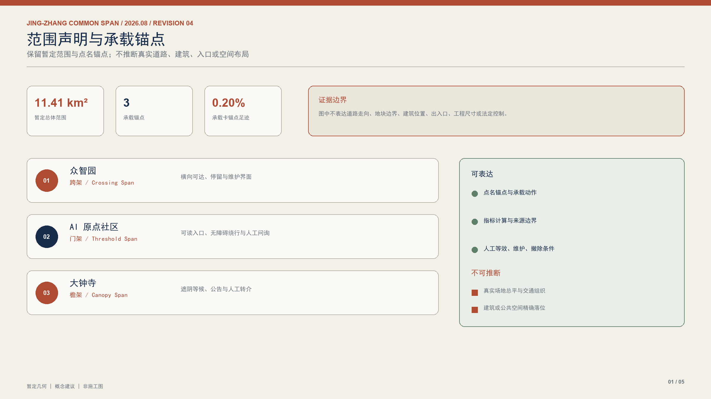
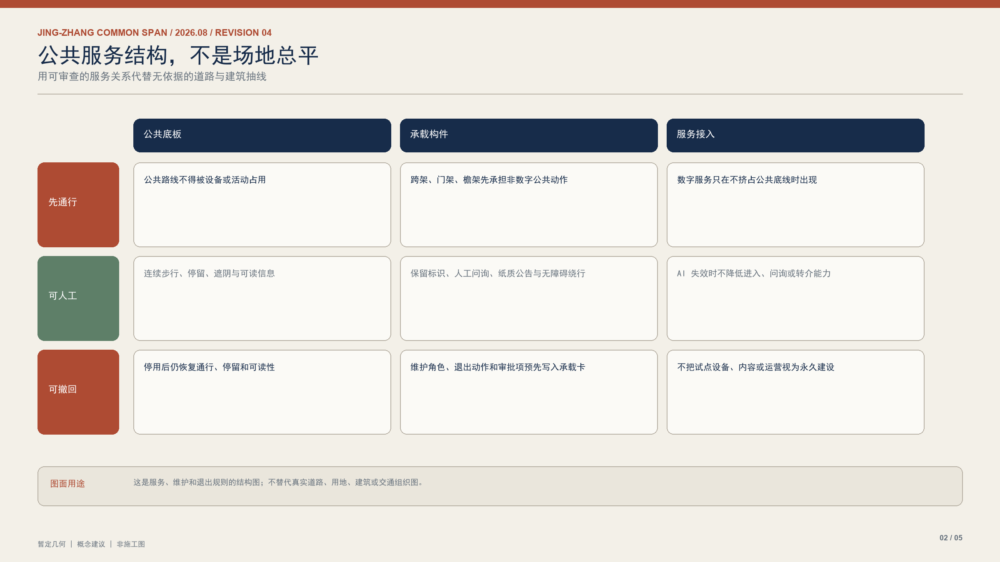
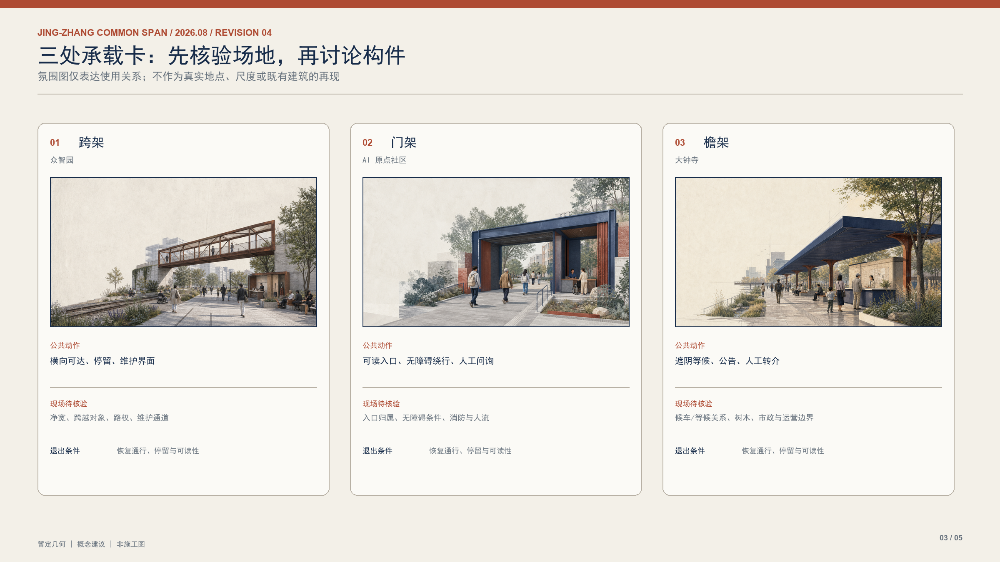
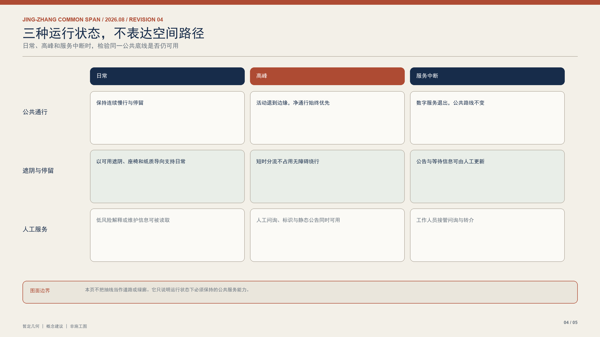
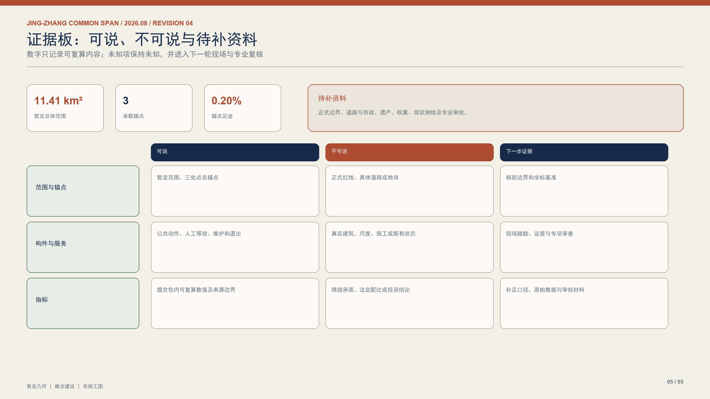

# 京张·共撑 / Jing-Zhang Common Span

**主张：城市先提供可通行、可停留、可维护的公共承载能力；AI 服务只能接入其上，不能取代或挤占它。** 京张铁路遗址公园不是等待技术填充的空白地。它首先是日常通行、休憩、文化记忆和公共服务的连续底板；所有新增建议均为待专业复核的概念设计。[source:OFFICIAL-ANNOUNCEMENT] [source:AGENT-TASKBOOK]

## 1. 设计依据、资料边界与三层范围

本方案依据公开征集公告、智能体任务书、来源登记表和仓库提供的临时几何资料组织内容。[source:OFFICIAL-ANNOUNCEMENT] [source:SITE-PACKAGE] [source:SOURCE-REGISTRY] 43.6 平方公里统筹研究范围讨论创新生态；约 11.4 平方公里总体设计范围提出公共承载网络；三处重点区提出可深化的构件与服务关系。[depth:three_level_scope_framework]

现有 SITE_BOUNDARY、KEY_AREA 均为 `provisional_constraint`。它们只用于概念表达、拓扑检查和指标复算，不是法定红线、权属依据、工程定位或控制指标。[source:BOUNDARY-SOURCE] [source:KEY-AREA-SOURCE] 一旦获得正式边界、道路、市政、遗产和权属资料，图层、指标、图纸和页面必须整体重算。[metric:site_area_sqm]

## 2. 总体概念：公共承载能力先于服务

“共撑”把铁路的工程理性转译为公共空间原则：先确认谁能走、坐、停、问、遮阴和被服务，再讨论何种技术可以接入。成果不是一条产品转化链，也不是一批短期装置，而是一套在服务变更后仍然有效的公共构件规则。

三类构件形成共同语法：**跨架**维持跨越与连续通行，**门架**组织校园—社区之间可读、无障碍的进入，**檐架**提供到达、停留、遮阴和人工问讯。构件可以承载导览、企业服务或文化解释，但公共通行和非数字服务永远优先。[standard:PROJECT-AGENT-OPEN-CALL-TASKBOOK] [standard:MOHURD-URBAN-DESIGN-MEASURES]

## 3. 统筹研究：创新生态的公共底座

统筹层将高校、研发机构、企业服务、社区和文化资源理解为共同维护公共承载能力的参与者。中关村科技服务翼提供知识产权、合规、人才与国际协作等专业支持；小月河场景赋能翼把日常通行、无障碍观察和公共问题反馈带回设计与运营讨论。[source:AGENT-TASKBOOK]

AI 的角色被限定为辅助理解、辅助服务和辅助维护：它可以提供可解释的导览、服务目录或低风险的路线信息；不能替代人工判断、法定审批、专业设计或基本公共服务。每项接入都必须有可用的非数字等效路径。[source:DATA-SRC-GENERATIVE-AI-INTERIM-MEASURES] [source:DATA-SRC-BARRIER-FREE-ENVIRONMENT-LAW]

## 4. 总体城市设计：一块公共底板、三类承载构件

总体范围以铁路遗址公园及其横向连接作为概念性的公共底板，不主张新增法定轴线。用地、道路、绿地、公共空间和建筑图层只表达“公共底板—重点构件—横向接入”的关系；容积率、高度、道路红线、拆改留和工程界面均待正式资料确认。[depth:land_use_layout] [depth:development_intensity_controls]

蓝绿与慢行系统优先保证连续步行、无障碍进入、遮阴停留、静态导向和人工帮助。任何数字设备或活动若降低净通行、制造不可接受的光/声干扰，或排除非数字使用者，就不能占用公共承载构件。[depth:blue_green_public_space] [depth:traffic_rail_slow_parking]

## 5. 三处重点区：跨架、门架与檐架

| 重点区 | 共撑构件 | 公共优先事项 | 可接入的低风险服务 |
| --- | --- | --- | --- |
| 众智园 | 跨架 / Crossing Span | 横向可达、清晰绕行、研发边界可见 | 研究服务说明、静态导向、经专业复核的维护信息 |
| AI 原点社区 | 门架 / Threshold Span | 校园—社区的无障碍进入、可读门厅、人工咨询 | 开源协作说明、企业服务目录、文化解释 |
| 大钟寺 | 檐架 / Canopy Span | 到达后的遮阴、停留、等候与人工转介 | 城市服务入口、公共文化导览、可解释信息展示 |

三处重点区均使用临时范围表达概念位置，不能据此推断站点、街口、建筑或产权事实。[data:geometry/key_areas.geojson#PROV-KEY-001] [depth:three_key_area_detailed_design]

## 6. 承载卡：AI 接入的最小公开接口

每项拟接入服务均需形成一张**承载卡**，而不是以技术名称取得空间优先权。承载卡至少记录：服务用途、构件 ID、可用范围与通行净宽、可能的光/声/数据干扰、人工或非数字等效路径、维护责任角色、停止使用后的恢复动作和需补充的审批条件。

承载卡不授予实施许可；它把未来专业团队、运营方和公众需要核对的问题前置。涉及机器人、自动驾驶、公共安全、医疗、教育或个人信息的真实部署，必须另行完成相应的安全、数据、无障碍和行业审查。[standard:PROJECT-AGENT-OPEN-CALL-TASKBOOK] [depth:risk_missing_data]

## 7. 公共空间、交通、市政与文化表达

五类概念图层共同表达公共承载能力：连续慢行与绕行关系、可停留的遮阴边缘、无障碍与人工服务入口、低干扰的文化解释面、以及需专业复核的市政接入条件。市政容量、消防、雨洪、轨道接口和结构安全没有公开基线，因此仅列为深化前提，不形成工程承诺。[depth:municipal_new_infrastructure]

视觉采用铁锈红、深靛蓝、矿物灰和纸白。两条平行铁路线被转译为跨距与支撑，不使用企业标识或未经授权的影像。荣誉展示记录维护公共底板、改进无障碍和补足人工服务的贡献，而非将技术部署量作为唯一价值。[source:AGENT-TASKBOOK]

## 8. 更新项目、分期与指标

近期先核对通行、无障碍、遗产、市政和运营条件，并编制承载卡与构件适用性清单；中期在取得场地和专业许可后，以低干扰方式完善跨架、门架和檐架的公共功能；远期只在维护责任、公众反馈和专业审查明确时讨论扩展。[depth:phasing_implementation]

指标只报告提交包可复算的场地面积、三处重点区、三类承载构件、公共空间面要素和承载卡锚点数量；FAR、建筑高度、服务绩效和投资规模保持未知，等待正式资料和实测。[metric:key_area_count] [metric:span_type_count] [metric:load_card_anchor_count]

## 9. 风险、合规与后续深化

主要风险是临时边界被误读为正式边界、数字服务挤占日常公共空间、维护责任缺席，以及无障碍或人工替代仅停留在文字。对应措施是：所有图件标注临时性；每项服务先经过承载卡检查；公共构件在服务停止后仍维持通行与停留；由规划、建筑、交通、景观、无障碍、数据安全和运营专业人员共同复核。[source:SOURCE-REGISTRY] [depth:risk_missing_data]

本方案所有名称、视觉、构件与服务均为概念建议。正式实施前仍需取得官方边界、现状调查、控制条件、权属、遗产、消防、市政、采购和运营授权。

## 设计依据与资料清单

本方案的依据由公开征集公告、任务书、来源登记表及仓库提供的暂定几何图层组成。所有未取得官方附件支撑的边界、规模、站点位置和服务关系都按“概念设计建议”处理，不作为审批、权属、红线或工程结论。引用材料在 `sources.json` 中逐项登记，并在文本中以来源标记关联；空间图层均保留来源类型、置信度和几何角色。设计团队不以“数据缺失”代替判断，而以承载卡列出需要由规划、交通、市政、遗产、无障碍与运营专业共同确认的条件。[source:OFFICIAL-ANNOUNCEMENT] [source:AGENT-TASKBOOK] [source:SOURCE-REGISTRY]

## 三层范围工作框架

本框架的设计意图是将研究判断、总体空间关系和可讨论的重点构件分开，避免用一个模糊范围同时承担产业判断、控规结论和施工承诺。证据来自公开任务材料、暂定边界和提交图层；几何只用于检验三处承载卡锚点与公共底板之间的拓扑关系，场地面积和锚点面积可复算，但不推导法定指标。缺少正式红线、权属、管线、遗产和现状测绘时，范围边界必须保持可替换；后续一旦取得资料，应逐层更新图层、指标、图册和承载卡，而不能只修改文字说明。

三层范围分别承担不同深度：统筹研究范围用于识别创新生态与公共服务关联；总体设计范围用于组织公共底板、慢行、蓝绿与更新关系；重点区域用于表达可被讨论的构件、净宽、停留和服务界面。三层之间不以行政边界替代设计边界，也不以一张概念图替代控规、施工或运营文件。每一层都应在后续取得正式底图后重新核对，并将变化写入承载卡与公开维护日志。[depth:three_level_scope_framework]

## 统筹研究范围产业与未来城市研究

本节的设计意图是把创新生态理解为公共服务能力的协作网络，而不是以新增技术设备数量代表城市未来。证据来自征集任务对产业、人才、社区和文化资源的要求，以及对无障碍与公共服务连续性的公开规范；研究范围几何只表达关联尺度，不表达企业地块或行政管理边界。可复算指标只记录概念场地和空间锚点，人才规模、企业数量、投资和服务绩效均不虚构。数据缺口需要通过正式统计、访谈、运营记录和公共协商补足，且应允许研究结论随证据变化而调整。

统筹研究不是把产业园区当作单一技术容器，而是观察高校、研发机构、企业服务、社区日常和文化记忆如何共同维持公共承载力。面向未来城市的判断以“是否减少使用门槛、是否保留人工路径、是否可以维护”为优先条件。AI 可以帮助梳理服务目录、解释公共信息和发现步行障碍，但不能决定准入、替代人工咨询或把不可解释的推荐变成公共空间的默认规则。产业协作的成果应回到可达、可读、可停留和可修复的空间条件上。[source:AGENT-TASKBOOK]

## 总体设计范围城市更新与控规深度城市设计

本节的设计意图是以公共底板组织更新关系：先保证可通行、可停留、可读和可维护，再讨论构件与数字服务。证据来自总体规划、分区规划和任务书的公共空间导向；用地、道路、绿地、建筑和公共空间图层是概念关系图，不是法定控规图。图层可以复算面积、相交和覆盖关系，却不能据此得出容积率、高度、退界或拆改留许可。缺少正式控制条件、现状测绘、专业审查和权属资料时，所有空间建议必须保留为可撤回的设计测试，并在获得资料后由专业团队重新校核。

总体设计范围以铁路遗产周边的公共底板为工作对象：横向连接、遮荫节点、公告界面和可绕行路径共同构成更新的最低公共条件。该层只表达构件之间的关系与优先级，不提出容积率、高度、地块边界或拆改留的法定结论。控规深度需要在正式控制条件到位后，由具备资质的专业团队对道路红线、消防、市政、日照、遗产保护、权属和审批程序逐项复核；本包提供的是可追溯的议题清单与图层接口。[depth:development_intensity_controls] [standard:BEIJING-MASTER-PLAN]

## 重点区域详细设计

本节的设计意图是让三处重点区域从“效果展示”转为可审查的公共承载界面。证据由暂定重点区面、公共空间锚点、慢行关系和任务书场景组成；几何用于表达跨架、门架、檐架的概念位置及其与通行、停留、公告的关系。可复算内容包括重点区数量、承载体类型和锚点面面积，不包含结构尺寸、荷载、消防疏散、施工工法或运营容量。缺少现场测绘、结构鉴定、市政资料、遗产要求和管理授权时，每张承载卡只能提出待核查事项，不构成实施图纸。

众智园的跨架首先保证横向通行和停留；AI 原点的门架首先保证入口可读、可问且可绕行；大钟寺的檐架首先保证遮蔽、公告和人工服务。三处重点区域均以承载卡而非效果图作为深化起点：记录服务目的、构件 ID、可用范围和净宽、噪声或数据扰动、非数字替代、维护角色、撤除后的恢复动作以及所需审批。细部材料、结构节点、机电接口和安全措施均待现场测绘与专业审查后确定。[depth:three_key_area_detailed_design]

## AI 创新生态、人才画像与 AI+ 场景

本节的设计意图是把 AI 放在公共服务的可选辅助位置，而不是把智能终端变成进入空间或获得服务的前提。证据来自任务书、生成式人工智能管理要求和无障碍环境要求；场景与承载体的关联仅在概念图层和承载卡中表达，不采集个人画像或推导个体行为。可复算的是场景对应的三类承载体和人工替代路径数量，不量化用户、训练数据、收益或算法准确率。缺少数据治理方案、运营主体、知情机制和专业安全评估时，任何场景均不得进入真实部署。

AI+ 场景的价值不以部署数量衡量，而以是否扩大公共服务的可理解性和可使用性衡量。面向研究者、学生、社区居民、访客、维护人员和非智能设备使用者，方案提出静态导向、服务目录、可解释文化信息和低风险路线提示等可选服务。每个场景都必须保有纸质、标识、电话、柜台或人工转介等至少一种等效路径；不得因未使用应用、未提供数据或不熟悉界面而失去通行、咨询或休憩机会。[source:DATA-SRC-GENERATIVE-AI-INTERIM-MEASURES] [source:DATA-SRC-BARRIER-FREE-ENVIRONMENT-LAW]

## 用地、建筑规模与拆改留方案

本节的设计意图是诚实区分空间关系和法定开发结论，避免以概念建筑或用地图层制造虚假的规模承诺。证据为暂定边界、概念建筑脚印和公开规划材料；几何可用于复算图层面积和识别公共承载界面的邻接关系，但不对应地籍、产权、建筑面积或拆除范围。建筑脚印面积仅是设计测试值，不能转换为容积率、投资额、更新量或保留比例。缺少现状测绘、产权调查、遗产评估、结构检测和控制性规划条件时，拆改留必须作为后续专业决策而非本包结论。

本方案不虚构用地兼容性、建筑规模、容积率、建筑高度或拆改留数量。提交图层中的建筑、用地和更新表达仅用于说明公共底板与三类承载体可能发生的接口关系，均附有概念性和暂定性标记。任何涉及既有建筑改造、遗产要素处理、土地权属、投资边界或工程拆除的决策，必须在正式现状调查、专业鉴定、权属核实与法定程序完成后另行形成方案。本包将“待核实”显式保留，避免以漂亮的数字掩盖资料缺口。[depth:land_use_layout] [depth:risk_missing_data]

## 交通、轨道、市政与公共服务设施

本节的设计意图是把连续步行、无障碍、绕行和人工服务作为任何更新的先决条件。证据来自任务书的交通与公共服务要求、无障碍法规和提交的概念慢行图层；几何只能检验概念线路与承载卡锚点的连接表达，不能代表道路红线、轨道保护范围、消防通道、管线位置或停车配建。可复算指标不包含客流、车流、管网容量和疏散时间。缺少交通调查、轨道及市政权属资料、消防审查和运营数据时，数字服务与构件均应服从撤回原则，保留人工路径。

交通策略强调步行连续、无障碍、清晰绕行与低干扰停留，轨道、市政、消防、雨洪和停车均不在缺少基线资料时作工程承诺。跨架、门架和檐架不得缩减净通行宽度、遮挡救援界面或制造新的安全盲区；若后续专业复核发现冲突，构件和数字服务应优先撤回，而不是要求公众适应风险。公共服务设施以人工咨询、公告、候车、休憩和转介的可达性为先，数字接口只能在这些条件被满足后接入。[depth:traffic_rail_slow_parking] [depth:municipal_new_infrastructure]

## 蓝绿空间、公共空间与城市风貌

本节的设计意图是以蓝绿连续性和可停留的公共边界支持热舒适、步行恢复、雨洪缓冲和日常相遇。证据来自相关规划的生态与风貌导向，以及三块公共空间承载卡锚点面；这些面要素可复算其占暂定场地的比例，但该比例只是设计测试足迹，不能作为法定公共空间配比。图层没有表达树种、海绵设施容量、雨洪标准、风环境或遗产保护范围。缺少现场生态调查、管线资料、景观专项和主管部门意见时，风貌语言和蓝绿建议均需在后续深化中调整。

蓝绿空间被视为承载热舒适、排水缓冲、慢行休息和日常相遇的连续底板。三块公共空间面要素是承载卡的暂定设计测试锚点，面积可复算，但其 1.51% 比例不构成法定公共空间配比或开发指标。风貌采用锈红、深靛、矿物灰和纸白，借用工程构件的节奏而不复制具体企业标识或未经授权的图像。公共空间的优先权属于所有使用者，而非某一类设备、活动或付费服务。[depth:blue_green_public_space]

## 更新项目清单、实施政策与分期计划

本节的设计意图是建立“核实—维护—接入”的顺序，让公共空间先获得可见的维护责任，再讨论技术服务。证据来自任务书对实施和运营的要求以及承载卡的退出字段；分期图层只表达概念性的依赖关系，不能代表正式工期、资金安排、招采批次或行政许可时序。可复算的是三类承载体和三处锚点的数量，不计算投资、产值、就业或服务规模。缺少业主、运营主体、财政边界、采购授权和公众协商记录时，政策工具与实施项目清单必须保持开放并由有权主体决定。

更新项目按“先核实、再维护、后接入”的逻辑推进：第一阶段完成边界、无障碍、遗产、市政和运营条件核验，并公开承载卡；第二阶段在取得许可后完善低干扰的实体构件与人工服务界面；第三阶段才讨论可解释、可退出的数字辅助服务。每次接入前应明确维护责任、投诉与修复渠道、暂停条件和撤除后恢复要求。政策与资金工具须由有权主体决定，本方案不以概念表达替代公共决策。[depth:phasing_implementation]

## 指标体系、面积复算与合规矩阵

本节的设计意图是让每个数字都能追溯到图层、公式、来源和不确定性，而不是以单一漂亮指标掩盖资料不足。证据为提交的 GeoJSON、`metrics.json`、标准矩阵和设计深度矩阵；面积和数量可以用统一坐标系复算，合规矩阵可以追踪任务要求落到何种深度。法定容积率、强制公共空间比例、建筑规模、市政容量和投资绩效均明确标为未知。缺少官方边界、控规条件和专业测算时，指标只用于方案比较与自检，不能用于审批或实施承诺。

指标体系区分“已知”“未知”和“暂定设计测试”三种状态。场地面积、概念建筑脚印、绿地比例、三处重点区域、三类承载体和三块承载卡锚点均可由提交的几何和 `metrics.json` 复核；容积率、法定公共空间比例、投资规模、工程容量和服务绩效保持未知。合规矩阵把任务书、总体规划和分区规划的要求映射到三层范围、重点区域、承载卡和风险清单，明确何处是已表达的设计深度，何处必须等待专业资料补齐。[metric:site_area_sqm] [metric:public_space_ratio] [standard:BEIJING-MASTER-PLAN]

## 风险、版权与合规说明

本节的设计意图是将数字、空间和表达风险在设计阶段公开，而不是在部署后再补救。证据来自来源登记、版权声明、风险矩阵和相关公开法规；几何图层以概念角色标注，避免被误读为正式测绘或工程定位。可复算的是文件、来源、图层和承载卡之间的对应关系，不涉及个人信息、受保护数据或未授权影像。缺少正式数据治理、专业审查、授权链条和运营责任书时，任何外部发布、现场安装或自动化服务都应暂停，并保留人工恢复机制。

风险控制的核心是防止概念图被误用为实施文件，以及防止数字服务侵占公共承载条件。所有 AI 功能都应接受可解释性、数据最小化、人工替代、无障碍、服务中断和退出恢复检查；所有新增构件都应接受结构、消防、遗产、市政、交通和采购审查。图册和图形均为本次提交原创绘制，不包含未经授权的航拍、商业底图、品牌标识或第三方肖像；文字与图层的适用范围受社区展示许可约束。[source:SOURCE-REGISTRY]

## 参考资料

本节的设计意图是提供可核验的证据链，使读者能够区分公开规范、任务材料、设计生成图层和待补资料。来源登记表记录材料标题、链接、适用范围与引用方式；标准矩阵说明总体规划和区级规划如何转译为公共承载要求，设计深度矩阵说明每个主题处于研究、总体或重点区讨论层级。引用材料支持概念方向和审查问题，不自动授予实施许可或替代法定文本。缺少正式附件、最新批复或专项资料时，方案必须标明其缺口并在后续版本中补充。

主要参考包括：《北京城市总体规划（2016年—2035年）》、海淀区分区规划公开材料、征集公告、智能体任务书、仓库来源登记表，以及与无障碍、生成式人工智能服务管理相关的公开法规材料。标准矩阵和设计深度矩阵分别记录这些材料如何被转译为公共承载、三层范围、重点区域、承载卡、风险与待核实事项；它们不替代法定文本或专业意见。[source:BEIJING-MASTER-PLAN] [source:HAIDIAN-DISTRICT-PLAN] [source:OFFICIAL-ANNOUNCEMENT]
