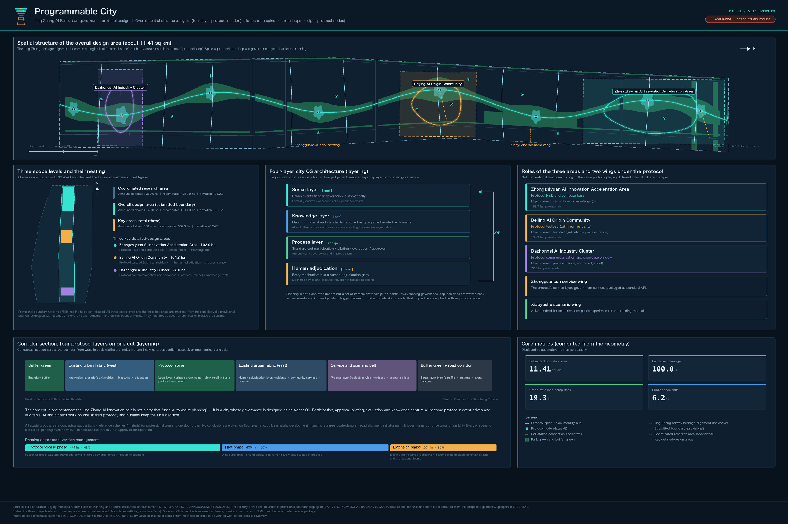
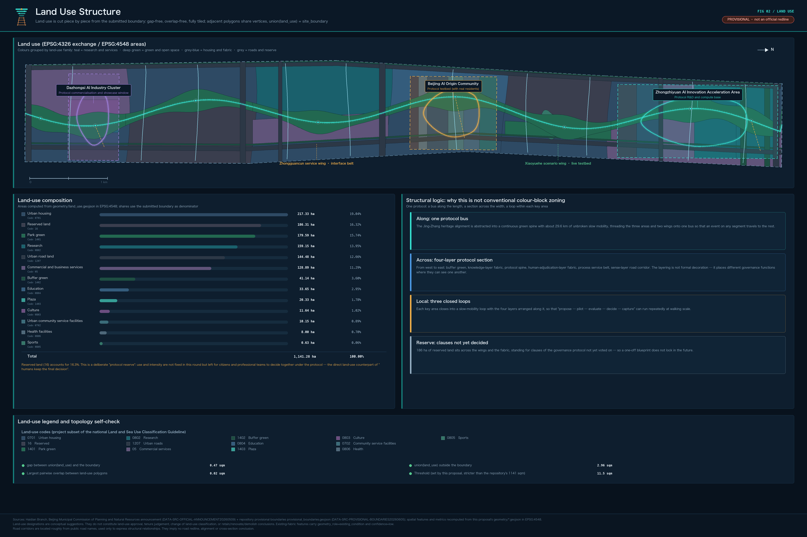
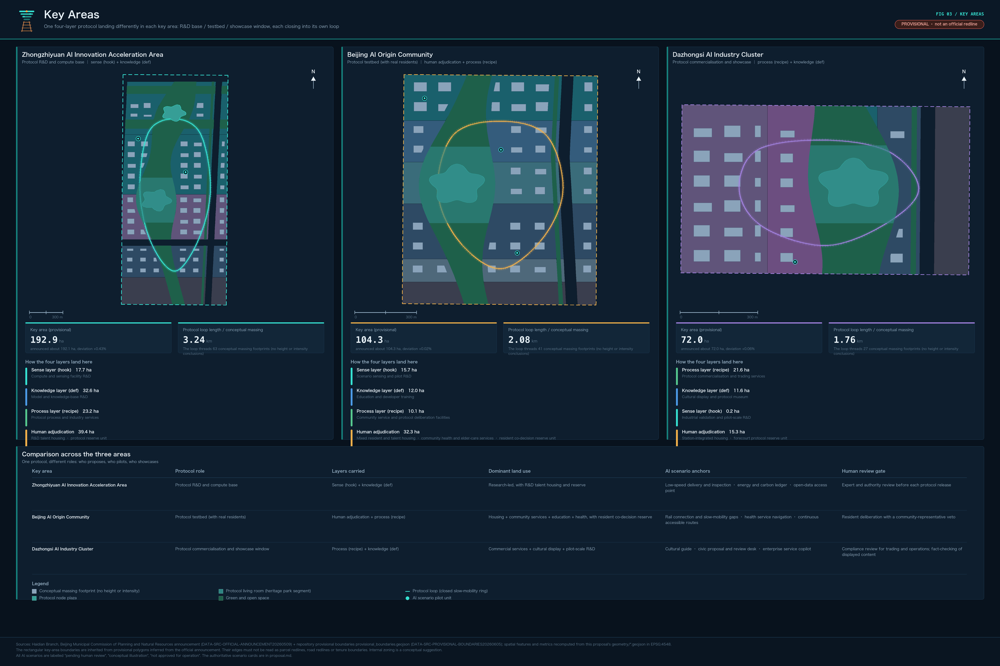
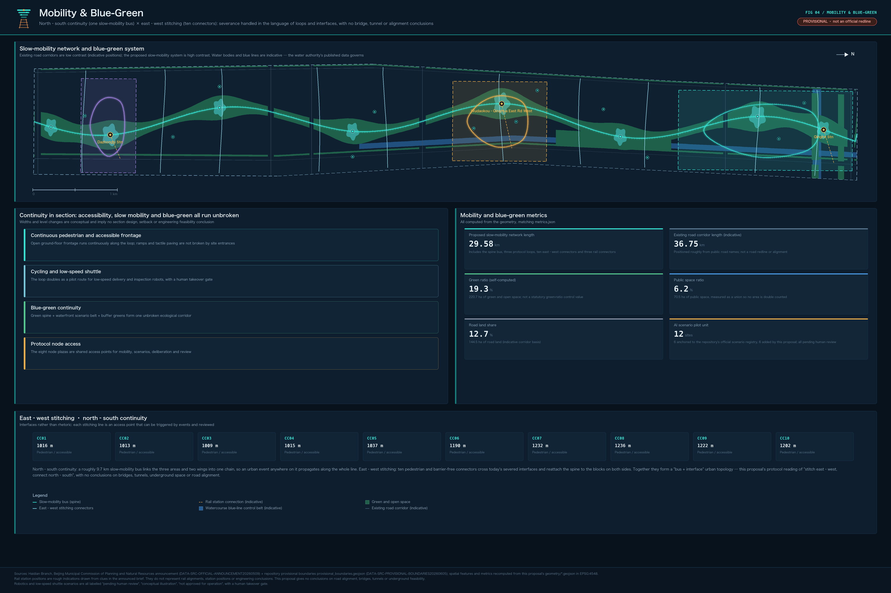
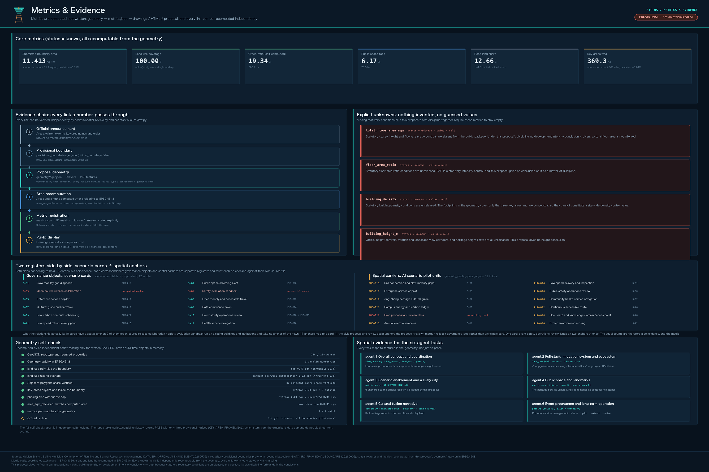

# Programmable City: A Governance Protocol Design for the Centennial Jing-Zhang AI Innovation Belt

## Design Basis and Source List

This proposal starts from a judgement that differs from common practice: what the Jing-Zhang AI Innovation Belt genuinely lacks is not the spatial form of yet another industrial park, but **a way of running urban governance that can be executed repeatedly, reviewed publicly, and upgraded continuously**. Haidian already holds the densest concentration of universities, research institutes, enterprises, and talent in China. What is missing are the "operating rules" that let those resources collaborate stably at city scale. The proposal therefore designs this belt as a **Programmable City** — a city is not a blueprint drawn once, but a set of iterable public protocols plus a continuously running governance loop. This judgement determines how every chapter below is organised: first the mechanism, then where the mechanism lands, and finally how the mechanism is tested and revised.

The first basis of this proposal is the pre-qualification announcement for the international solicitation of urban design schemes for the Centennial Jing-Zhang AI Innovation Belt, issued by the Haidian Branch of the Beijing Municipal Commission of Planning and Natural Resources. It defines the three scope levels — coordinated research, overall design, and key areas — and all mandatory tasks [source:OFFICIAL-ANNOUNCEMENT]. The second basis is the cleared excerpt of the open-call taskbook addressed to global agents, which defines the three positionings, five functions, three areas and two wings, six agent tasks, ten co-creation principles, and the common boundary clause [source:AGENT-TASKBOOK]. The two differ in nature: the former is the organising document of a statutory solicitation procedure, the latter a co-creation covenant addressed to agent contributors. This proposal cites them separately and never blends their levels of authority.

Site material follows the public and cleared records registered in the repository: `brief/site-package/` supplies the structured taskbook excerpt, enumerations, allowed design space, and coordinate policy [source:SITE-PACKAGE]; `data/source_registry.json` determines whether each item may serve as a formal basis [source:SOURCE-REGISTRY]; `data/processed/agent_fact_pack.md` is used only as a reading navigation layer and is not itself a new authority [source:PROCESSED-FACT-PACK]. Existing-conditions diagnosis is therefore built on a two-sided list of "which facts are available and which are missing", rather than on an assumed baseline [depth:existing_conditions_diagnosis].

One thing must be stated at the outset: the nature of the boundary. The precise polygons of the official `SITE_BOUNDARY` and the three `KEY_AREA` units were not released with the material package. This proposal uses the **provisional constraint** generated from `brief/site-package/geometry/provisional_boundaries.geojson`, and every layer is marked `official_boundary=false` [source:BOUNDARY-SOURCE]. It may be used for scheme generation, topology self-check, visualisation, and design discussion. It may not be treated as an official redline, a statutory regulatory plan, a precise-area basis, or an approval conclusion [source:KEY-AREA-SOURCE]. This organiser-side data gap does not block content scoring, but once official polygons are released, the boundary, key areas, land use, roads, green space, public space, buildings, phasing, and all metrics must be recalculated as a whole package rather than patched file by file.

The division of deliverables follows the submission package contract: structured data is authoritative, PDFs and web pages are presentation. Spatial evidence rests on the nine layers under `geometry/`, numeric evidence on `metrics.json`, and task response on the three matrices. This document is responsible only for stating design judgements in language a person can read, and for attaching a traceable basis beside each judgement. A reader may enter the evidence from any point in the text without first reading a string of machine identifiers [data:geometry/site_boundary.geojson#PROV-SITE-001] [metric:site_area_sqm].

Finally, the wording discipline that runs through the whole document: every spatial proposal here is a **concept suggestion, a reference scheme, or material for further professional study**; every protocol mechanism is **proposed for adoption** and is never described as already implemented; every AI scenario is labelled **conceptual illustration, pending human review, not approved for operation**; and no conclusion is given on floor area ratio, building height, development intensity, plot-level retain-renovate-demolish decisions, road alignment, rail alignment, or the engineering feasibility of bridges, tunnels, and underground space [source:AGENT-TASKBOOK]. Every cited figure carries a source; anything uncertain is written as "pending verification" and enters the assumption list.

## Three-Level Scope Framework

The announcement divides the work into three levels. This proposal reads them as three abstraction layers of one operating system rather than three unrelated drawing sets. The coordinated research area of 43.6 km² answers "what are the rules"; the overall design area of 11.4 km² answers "on what spatial structure do the rules land"; the key areas of 368.4 ha answer "how are the rules executed and tested inside actual blocks" [source:OFFICIAL-ANNOUNCEMENT] [depth:three_level_scope_framework]. The relationship between levels is one of invocation: a lower level may raise a revision request to a higher one, and a higher level may not announce results while bypassing the lower one.

The skeleton of the Programmable City is a four-layer architecture drawn directly from the layered abstraction of an agent operating system, but every layer must land on an identifiable object in the city:

| Architecture layer | Urban counterpart | Proposed way of operating | Typical urban object |
| --- | --- | --- | --- |
| Sensing and response layer (event-driven) | City events automatically trigger the matching governance mechanism | Crowding, energy peaks, public feedback, AI service calls and similar events trigger a predefined process once a threshold is reached, instead of stacking approvals level by level | Public space nodes, walkability gaps, event grounds [data:geometry/public_space.geojson#PUB-001] |
| Knowledge base layer (structured knowledge domains) | Planning material, standards, and evaluation results consolidate into queryable, traceable knowledge domains | Citizens and AI draw on the same source, removing information asymmetry; every conclusion keeps its provenance and validity period | Source registry, metric system, layer library [source:SOURCE-REGISTRY] |
| Process layer (reusable workflows) | Participation, piloting, evaluation, and approval fixed into standard processes | Every process is reproducible, reviewable, improvable, and leaves an execution trace | Renewal projects, event system, scenario opening [data:geometry/phasing.geojson#PHASE-001] |
| Human adjudication layer | Every mechanism carries a human adjudication gate | Machines only advise and execute; the final judgement is made by people | Review posts, assessment panels, public participation steps [source:AGENT-TASKBOOK] |

The intersection of three scope levels and four architecture layers forms the working framework. The coordinated research area mainly produces the rules of the knowledge and process layers; the overall design area translates rules into spatial structure, a renewal framework, and infrastructure support, reaching the urban-design depth of a regulatory detailed plan [depth:overall_spatial_structure]; the key areas are where rules are executed, with each of the three sub-areas carrying a different executing role. The benefit of this organisation is testability: any spatial suggestion can be interrogated with "which protocol does it execute, who triggers it, who reviews it, and how does it roll back on failure". A suggestion that cannot answer does not enter the deliverable.

Within this framework the three areas and two wings have a clear division of labour rather than being three parallel parcels. **Zhongzhiyuan AI Autonomous Innovation Acceleration Area** (192.1 ha) is the protocol's R&D and computing base, responsible for writing technical standards, safety evaluation, and the autonomous innovation system into executable rules. **Beijing AI Origin Community** (104.3 ha) is the protocol's testbed, where rules are first trialled with real residents and real founders and only then spread outward. **Dazhongsi AI Industry Cluster** (72.0 ha) is the protocol's commercialisation and display window, turning proven rules into tradable, communicable products and services [source:OFFICIAL-ANNOUNCEMENT] [metric:key_area_count]. **The Zhongguancun Technology Service Wing** is the protocol's service layer, packaging government and intermediary services into standard interfaces; **the Xiaoyuehe Scenario Empowerment Wing** is the protocol's live testing ground, letting scenarios be genuinely used within continuous public space [source:AGENT-TASKBOOK].

Two sets of area figures must be kept apart. The 43.6 km², 11.4 km², and 368.4 ha given in the announcement are textual areas — authoritative but without precise polygons. The layer areas submitted here are recalculated from the provisional boundary and serve internal consistency checking. The two are recorded separately in the metric system and never stand in for one another [metric:site_area_sqm] [metric:coordinated_research_area_sqm]. Wherever a conclusion is precision-sensitive, the text uses "approximately" and orders of magnitude, and exact values are kept only in the structured files.

## Coordinated Research Area: Industry and Future City Research

The coordinated research area must answer two questions: by what mechanism does a world-class AI innovation ecosystem form, and what will artificial intelligence turn the city into. This proposal answers: an ecosystem is not recruited, it **grows out of a set of public protocols that lower the cost of collaboration**; and the change in urban form is essentially the migration of judgement processes — once scattered inside individual institutions — onto publicly visible protocols.

### Overall Concept, Naming System, and Visual Direction (agent.1)

- **Chinese principal name: 可编程城市**. "Programmable" refers to urban governance mechanisms having interfaces, versions, and contributors like software. It does not mean governing citizens by program.
- **English name: Programmable City**. External communication uses "open protocol, city as a platform" as the core statement.
- **Brand subtitle: Urban Governance Protocol of the Jing-Zhang AI Innovation Belt**. The naming system extends downward into a three-tier vocabulary of "protocol — loop — milestone": protocols name mechanisms (participation protocol, pilot protocol), loops name running processes (proposal loop, evaluation loop), and milestones name commemorable spatial nodes.
- **Visual identity direction**: protocols, loops, and layered abstraction as motifs; a cool technological blue-green as the primary palette, retaining the steel-rail brown of the Jing-Zhang railway as a historical anchor, forming a stable contrast between new and old.
- **Logo direction**: a railway track growing vertically into a layered urban section — the track stands for the centennial Jing-Zhang project and the historical starting point of the first trunk railway designed and built by Chinese engineers themselves, while the upward layering stands for the hierarchical abstraction of protocols. This is a concept direction; typefaces, graphics, and final artwork require separate rights clearance and professional development [source:AGENT-TASKBOOK].
- **Requirement for the overall spatial structure drawing**: express it through "layers plus loops", not through conventional colour-block zoning. The three areas are three executing nodes on the loop, the two wings are service and scenario channels feeding into the loop, and the Jing-Zhang Heritage Park is the public spine running the length of the belt [depth:overall_spatial_structure] [data:geometry/land_use.geojson#LU-001].

Under this concept the three positionings each acquire a mechanical meaning: **the Centennial Jing-Zhang Cultural Belt** is the protocol's historical layer, explaining where the rules come from; **the Urban AI Life Experience Belt** is the protocol's user interface, explaining how ordinary people perceive the rules; **the AI Integrated Innovation Belt** is the protocol's execution layer, explaining how the rules produce industrial results. The five functions land at different positions in the architecture: the full-stack autonomous AI innovation system and global discourse power in AI governance are carried by Zhongzhiyuan, the world-class AI innovation ecosystem by the Origin Community, AI-native new business forms by Dazhongsi, and the AI+ scenario empowerment paradigm together with the intelligent vibrant city by the Xiaoyuehe Wing [source:AGENT-TASKBOOK] [standard:PROJECT-AGENT-OPEN-CALL-TASKBOOK].

The innovation in comprehensive planning and industry-space integration comes down to one operable judgement: **turn "approving a project" into "executing a protocol"**. In the conventional process, landing an innovation project requires negotiating department by department, at high cost and with unpredictable outcomes. Once protocolised, the applicant submits under public rules, the system triggers the corresponding process by rule, humans adjudicate at key nodes, and the whole course leaves a queryable trace. This is the proposal's concrete suggestion for territorial spatial planning innovation. It is a concept suggestion at the mechanism level; the specific institutional design must be developed further by the competent authorities and professional teams.

### Global AI Innovation Ecosystem Cases and the Protocols They Validate (agent.2)

Case selection follows one discipline: only real districts with public official pages, described only through their publicly observable organisational mechanisms, with no citation of unverified investment figures, output values, or company lists. The six cases below each validate one protocol mechanism this proposal relies on [metric:ecosystem_case_count].

| Case | Location | Publicly observable organisational mechanism | Which protocol of this proposal it validates |
| --- | --- | --- | --- |
| Knowledge Quarter | King's Cross / Euston / Bloomsbury, London, UK | A cross-sector partnership of academic, cultural, research, scientific, and media organisations, organised around a one-mile radius centred on the stations [source:CASE-KQ-LONDON] | Membership admission protocol: the boundary of an innovation district is defined by "who has joined the rules", not only by administrative lines |
| one-north | Singapore | A knowledge-economy estate developed by a statutory board, divided into precincts with defined functions, including dedicated startup blocks and incubation premises [source:CASE-ONENORTH-SG] | Tiered space supply protocol: one estate provides different space types and admission conditions for actors at different stages of maturity |
| Amsterdam Science Park | Amsterdam, Netherlands | The official site organises entry points by "collaborate with talent, with researchers, with startups, and through co-creation facilities", and publishes its focus areas including AI and digital innovation [source:CASE-ASP-NL] | Collaboration interface protocol: "how to work with the park" is itself made into a public, categorised, self-service interface |
| Research Campus Garching | Munich, Germany | University schools, research institutions, technology start-ups, and industrial companies are placed in close proximity on one campus, connected to the city centre by an underground line [source:CASE-GARCHING-DE] | Proximity protocol: physical proximity of research, translation, and industry is treated as a hard spatial condition rather than a soft aspiration |
| Sangam Digital Media City | Seoul, Republic of Korea | A digital media district led by a municipal urban development corporation, organising industry-education premises and high-tech industry centres around new media and software [source:CASE-DMC-KR] | Single-steward protocol: one long-term responsible body holds development and operation duties so the rules do not break over a decade |
| Zhangjiang Science City | Pudong, Shanghai, China | The municipal science and technology authority publishes, park by park, a directory of administrative approval and industry service windows with unit name, address, and contact [source:CASE-ZHANGJIANG-CN] | Service directory protocol: government services are written as a searchable directory, so that "who to approach" becomes public information rather than private experience |

Together these six mechanisms show one thing: the real barrier of a world-class innovation district lies in **the stability of collaboration rules**, not in any single building or single policy. The latecomer advantage of the Jing-Zhang AI Innovation Belt is that it can write those rules as public, version-managed protocols from the very beginning, instead of retrofitting them ten years later. All case descriptions above are qualitative summaries of how public pages are organised and contain no numeric indicators; citing scale, investment, or performance data would require separate verification and source registration [source:SOURCE-REGISTRY].

### Protocolising the Eight Factor Classes (agent.2)

The taskbook requires a response on eight factor classes: land, space, industry, capital, talent, computing power, data, and scenarios. This proposal suggests writing each as a three-part "admission — circulation — exit" protocol, because most factor allocation fails not at admission but where circulation and exit rules are absent. The following are concept suggestions; specific rules require further study by the competent authorities and professional teams.

| Factor | Admission protocol (suggested) | Circulation protocol (suggested) | Exit protocol (suggested) |
| --- | --- | --- | --- |
| Land | Public function and performance conditions replace case-by-case negotiation | Existing space may change use within the same function class through a published procedure | An agreed path for reclaiming and reallocating space when performance is not met |
| Space | Tiered supply by maturity (incubation, growth, headquarters) | Actors relocate within the belt as they scale up, avoiding departure | Premises vacant beyond an agreed period return to the supply pool |
| Industry | Admission judged by scenario demand rather than sector label | Upstream and downstream pair up through a public matchmaking directory | Projects failing scenario validation exit and publish the lessons |
| Capital | Fund type and applicable stage stated clearly, with no committed amounts | Staged evaluation results decide whether to continue investment | On exit, data and experience assets are retained for the public knowledge base |
| Talent | Service admission based on contribution records rather than a single title | The service package travels with the person and is portable across institutions | Contribution records of those who leave the belt are preserved long term |
| Computing power | Publish the types of public computing available and the queuing rules | Dynamic scheduling by task priority and energy budget | Tasks exceeding the energy budget are automatically downgraded and the applicant notified |
| Data | Accept only public or cleared data, registering authorisation and use limits | Authorise the minimum necessary scope, with a trace throughout | Authorisation lapses on expiry; derived conclusions are marked with validity dates |
| Scenarios | Publish the open scenario list and application conditions | Evaluate periodically during the pilot and publish conclusions | Scenarios failing evaluation are closed and the reasons archived |

Within this factor protocol, **the Zhongguancun Technology Service Wing** takes the role of the "service layer": it packages services scattered across many departments and intermediaries into standard interfaces with uniform form and explicit inputs and outputs. Zhangjiang's service window directory shows that a referenceable form of this already exists domestically [source:CASE-ZHANGJIANG-CN]. This proposal suggests upgrading the directory into a protocol: each service states its trigger condition, required materials, committed time limit, responsible body, review method, and failure fallback, so that enterprises and developers can use government services the way they call an interface. This is a mechanism concept and constitutes no service commitment or administrative arrangement [standard:PROJECT-OFFICIAL-ANNOUNCEMENT].

### Urban Form Adapted to AI-Era Productive Forces

The way artificial intelligence changes urban form is not by adding more screens, but by changing the granularity at which work, learning, socialising, movement, and public services are organised. The proposal offers three judgements on form, all concept suggestions. First, **workspace shifts from "divided by company" to "aggregated by task"**, so it is suggested that the three areas raise the share of small and medium spaces that can be occupied briefly and recombined quickly, and that the land-use structure reserve flexibility for mixed function [data:geometry/land_use.geojson#LU-001]. Second, **public space shifts from "passing through" to "staying and collaborating"**, so the continuous green space along the Jing-Zhang Heritage Park should carry part of the formal collaboration function rather than only circulation and rest [data:geometry/green_space.geojson#GREEN-001] [metric:green_ratio]. Third, **infrastructure shifts from "invisible" to "explainable"**: computing, energy, and sensing facilities in public space should be visible, readable, and open to questioning, which is the precondition for turning technology governance into a public issue. These judgements must be checked by professional teams once official regulatory conditions, municipal capacity, and ownership information are supplied; the proposal gives no intensity or engineering conclusion [depth:development_intensity_controls].

## Overall Design Area: Urban Renewal and Regulatory-Plan-Level Urban Design

The overall design area covers approximately 11.4 km² and must reach the urban-design depth of a regulatory detailed plan. The proposal's core claim at this level is: **urban renewal itself should be written as a protocol**. The urban and industrial districts around the Jing-Zhang Heritage Park are already heavily built out. The difficulty of renewal is not drawing an ideal picture but getting multiple ownership entities to act under one predictable set of rules over a long cycle [standard:MOHURD-CONTROL-DETAILED-PLANNING] [depth:land_use_layout].

The overall spatial structure is suggested as "one spine, three nodes, two channels, one loop", all as concept suggestions. **One spine** is the north-south public axis formed by the Jing-Zhang Heritage Park, which is at once the historical layer and the public-life layer. **Three nodes** are the three key areas, carrying the R&D, testing, and commercialisation functions of the protocol respectively. **Two channels** are the Zhongguancun Technology Service Wing and the Xiaoyuehe Scenario Empowerment Wing, the former feeding in services and the latter scenarios. **One loop** is the governance loop threading proposal, pilot, evaluation, and revision, expressed spatially as a continuous public path that can be walked, dwelt in, and used for events [data:geometry/public_space.geojson#PUB-001] [depth:overall_spatial_structure]. This structure adds no redline; it explains how the existing scope is organised.

Identification of underused space follows a reviewable method rather than a conclusion: it is suggested that four criteria obtainable from public information and site survey — public accessibility, functional mix, interface continuity, and spare facility capacity — form a candidate list, which is then narrowed by ownership verification and professional assessment. The proposal names no plot-level retain-renovate-demolish conclusion, because existing buildings, ownership, regulatory conditions, and engineering conditions are all absent from this material package, and any specific conclusion would constitute false precision [depth:retain_renovate_demolish]. Building footprints can be recalculated from the submitted layer to check consistency between drawing and metric, but this is not a survey of the existing stock [data:geometry/buildings.geojson#BLDG-001] [metric:building_footprint_area_sqm].

Industrial function ratios and total building scale are handled the same way. What the proposal gives is an **allocation principle** rather than allocation numbers: it is suggested that four function classes — R&D offices, translation and exhibition, talent housing and living services, and public and cultural facilities — maintain adjustable ranges within the belt, with the adjustment right handed to periodic evaluation rather than locked once. Floor area ratio, building height, building density, setbacks, and building control lines are all recorded as pending in the absence of official regulatory conditions, and no estimated value is passed off as an approved indicator [metric:floor_area_ratio] [depth:development_intensity_controls].

Comprehensive carrying capacity assessment likewise splits into the computable and the pending. Computable items include submitted boundary and key-area areas, green and public space ratios, building footprint area, and phasing areas, all directly recalculable from the layers [metric:land_use_coverage_ratio] [metric:public_space_ratio]. Pending items include population and employment scale, municipal pipeline capacity, energy load, traffic section capacity, and public service facility gaps; these require official data and are listed as preconditions for formal deepening rather than estimated. This distinction is itself the rigour that regulatory-depth urban design demands, and it is why this proposal remains reviewable despite the data gap.

The sequence of urban renewal is suggested to align with the protocol life cycle: **the protocol release period** delivers rules and lightweight facilities first, **the pilot period** validates within controllable areas such as the Origin Community, and **the expansion period** then extends across the belt. This phasing has a corresponding expression in the layers and is linked to the renewal project list [data:geometry/phasing.geojson#PHASE-001] [metric:phasing_coverage_ratio]. It must be stressed that implementation phasing and the solicitation cycle are two different things: the solicitation cycle is a deadline for submitting deliverables, while implementation phasing is the path along which urban renewal advances. The two should not be conflated.

## Detailed Design of Key Areas

The key areas cover approximately 368.4 ha across three sub-areas and are the mandatory deepening content of this solicitation [source:OFFICIAL-ANNOUNCEMENT] [metric:key_detailed_design_area_sqm]. Within the Programmable City framework the three are not one template repeated three times, but three different stages of the protocol life cycle: Zhongzhiyuan produces rules, the Origin Community tests rules, Dazhongsi exports rules. The direct benefit is that a genuine functional dependency exists between the three, rather than a forced linkage through transport alone.

**Zhongzhiyuan AI Autonomous Innovation Acceleration Area (approx. 192.1 ha) — protocol R&D and computing base.** It is suggested to organise space around a national-level AI platform, full-stack autonomous innovation, standard setting, safety governance, and industrial display, converting work such as "standards and evaluation" — usually carried out inside closed institutions — partly into urban functions that can be visited, booked, and understood by the public. The Qinghe river frontage is suggested as the park's public living room, combining green space, stormwater management, walking and cycling, and low-carbon computing display into a dual interface facing outward for access and inward for collaboration [data:geometry/key_areas.geojson#PROV-KEY-001] [depth:three_key_area_detailed_design]. The protocols this sub-area carries are the "technology admission protocol" and the "safety evaluation protocol": the former sets what technology may enter urban piloting, the latter sets how the evaluation process is traced and published. All content touching specific building alteration, road organisation, and engineering conditions is a concept suggestion and requires further study by professional teams once official regulatory and ownership information is obtained.

**Beijing AI Origin Community (approx. 104.3 ha) — protocol testbed.** This is the only one of the three with a large real resident population, and therefore where the proposal's public-interest claims concentrate. It is suggested to organise space around near-campus innovation, incubation and translation of results, talent services, open-source collaboration, and residential and living amenities, and to treat **residents as co-authors of the protocol rather than as affected parties**: every AI scenario piloted inside the community should carry channels through which residents can be informed, give feedback, and call a halt [data:geometry/key_areas.geojson#PROV-KEY-002] [source:AGENT-TASKBOOK]. Walkable connection between campuses, parks, and blocks, together with rail station integration, is the key spatial move; it is suggested to organise it on the principles of closing gaps, continuous frontage, and all-age friendliness. Specific alignments, cross sections, and engineering methods are not given here [depth:traffic_rail_slow_parking]. The protocols this sub-area carries are the "community pilot protocol" and the "participation protocol".

**Dazhongsi AI Industry Cluster (approx. 72.0 ha) — protocol commercialisation and display window.** It is suggested to organise space around leading enterprises, agents and intelligent terminals, content consumption, data factors and digital assets, and commercial services, using the integration conditions of Dazhongsi station and four-quadrant pedestrian connection at the intersection to organise "footfall — retail — display — transaction" into a complete chain [data:geometry/key_areas.geojson#PROV-KEY-003] [metric:key_area_count]. Composite use of planned green space is suggested to focus on public activity and display functions without changing the green-space designation. The protocols this sub-area carries are the "scenario transaction protocol" and the "international display protocol", converting scenarios matured inside the belt into exportable products, services, and standards. Every engineering judgement involving the rail station, the intersection, and underground connection is a concept suggestion requiring argument by transport and municipal professional teams.

**Detailed roles of the two wings.** The Zhongguancun Technology Service Wing is not a parcel of new land but a set of service nodes distributed through the belt plus a unified service interface specification. Its spatial expression is "making service visible": recognisable service entry points placed in public space where footfall concentrates, presenting in one place what previously required visits to several counters [data:geometry/public_space.geojson#PUB-001]. The Xiaoyuehe Scenario Empowerment Wing is the live testing ground; it is suggested to organise a **public experience path** along the Xiaoyuehe river and its associated public space, stringing dispersed AI scenarios into a continuous route that can be walked, narrated, and evaluated, so that scenarios stop being isolated demonstration points [data:geometry/green_space.geojson#GREEN-001] [depth:blue_green_public_space].

The design depth of the three sub-areas is governed by the design depth matrix. Statements such as "build a demonstration zone" that carry no supporting evidence on function, space, transport, public space, and implementation are treated here as incomplete and are not adopted. The boundaries of all three sub-areas are currently provisional constraints, and judgements on function and scale must be reviewed as a whole once official polygons are released [source:KEY-AREA-SOURCE].

## AI Innovation Ecosystem, Personas, and AI+ Scenarios

This chapter answers the third requirement of the taskbook: no fewer than 10 AI scenario cards, no fewer than 3 industry test-validation scenarios, no fewer than 5 personas, and the mapping between scenario, space, and operation [source:AGENT-TASKBOOK]. The approach here differs from the usual "scenario list": **every scenario card is written as an entry in a skill registry** and must state its trigger condition, input data, output, human review point, and failure fallback. A scenario for which no human review point and no fallback can be written does not enter the list. This discipline comes directly from the principle of final human judgement, and it is what turns AI from a label into a component of the mechanism.

### Personas (six classes)

| Persona | Core need | Spatial and service response (concept suggestion) | Data and privacy boundary |
| --- | --- | --- | --- |
| Nearby residents (including older people and people with reduced mobility) | Smooth commuting, reachable community services, low-disturbance renewal | Heritage park walking loop, embedded community services, all-age friendly facilities, retained human service channels | No personal identity data collected; resident profiles never used for commercial recommendation [source:BARRIER-FREE-LAW] |
| Open-source developers | Publishing, collaboration, evaluation, community reputation | Origin Community open-source release hall, public contribution wall, night-time collaboration space | Only aggregate activity statistics; contribution records published with the person's consent |
| Start-up teams | Low-cost workspace, access to computing, a real testing ground | Zhongzhiyuan shared test ground, edge computing service points, standards and compliance advice | Computing and data services require separate authorisation, with purpose and term published |
| Researchers, faculty, and students | Translation of results, cross-institution collaboration, daily walking | Campus-park walkable stitching, translation waystations, open experiment space | Campus data and research results used only after authorisation |
| Government and operations staff | Controllable process, clear responsibility, traceable exceptions | Service nodes, review workstations, operations dashboards | Full trace kept; review records auditable but personal information not published |
| International visitors and industry clients | Quick comprehension, credible display, convenient negotiation | Dazhongsi international roadshow lounge, bilingual wayfinding, public experience path | Corporate marks and cases used in display require rights clearance |

The six personas cover the six roles required by the announcement and the taskbook — residents, developers, founders, researchers, government staff, and visitors [metric:persona_count]. Older people and people with reduced mobility are folded explicitly into the resident persona because accessibility and age-friendliness are not add-on features but a precondition for the legitimacy of a public protocol [source:ELDERLY-SMART-TECH-PLAN].

### AI Scenario Cards (twelve, in skill-registry form)

All scenarios below are **conceptual illustrations, pending human review, not approved for operation**, and constitute no confirmed service arrangement [metric:ai_scenario_card_count].

| No. | Scenario | Spatial host | Trigger condition | Input data | Output | Human review point | Failure fallback |
| --- | --- | --- | --- | --- | --- | --- | --- |
| S-01 | Walkability gap diagnosis | Jing-Zhang Heritage Park vitality belt | Scheduled walking-continuity inspection, or public feedback received | Public road and public space layers, site survey records | Gap list with improvement priorities | Planning and municipal staff confirm before entry into the project pool | Falls back to a manual survey task when location fails [data:geometry/roads.geojson#ROAD-001] |
| S-02 | Public space crowding alert | Public space nodes in the three areas | Crowd density exceeds a set threshold during an event | Aggregated on-site counting data (no personal identity data) | Diversion suggestion and on-site notice | On-site managers decide whether to divert | Falls back to staffed watch when data is abnormal |
| S-03 | Open-source release collaboration | Origin Community open-source release hall | A contributor submits a release application | Application materials, public code and documentation | Release schedule and venue configuration suggestion | Operator reviews content compliance and venue safety | Automatically moved to the waiting list with notice on schedule conflict |
| S-04 | Safety evaluation sandbox | Zhongzhiyuan safety governance display area | A technology provider applies to enter urban piloting | Public test materials submitted by the provider | Evaluation record and admission recommendation | The evaluation panel makes the admission decision | Returned for supplementary materials when incomplete; no implicit pass |
| S-05 | Enterprise service copilot | Zhongguancun Technology Service Wing service node | An enterprise raises a service enquiry | Public policy texts and the service directory | Suggested processing path and required document list | Counter staff confirm before formal guidance is issued | Transferred to a human agent when no match is found |
| S-06 | Age-friendly and accessible travel support | Public space across the belt | The user initiates a request | Public data on accessible facility locations | Suggested accessible route and on-site assistance call | Service staff respond and confirm | Paper and human channels retained when the system is unavailable [source:BARRIER-FREE-LAW] |
| S-07 | Cultural guiding and narrative interpretation | Along the Jing-Zhang railway heritage | A visitor makes a request at an interpretation point | Cleared historical material and interpretation text | Layered interpretation content and walking route suggestion | Cultural authorities review historical statements | Only basic information given where content is missing; no speculative history generated |
| S-08 | Data factor compliance lounge | Dazhongsi sub-area | Two parties raise a data cooperation intent | Authorisation scope and purpose statement | Compliance checklist and process guidance | Legal and compliance staff issue an opinion | Process terminated and reason recorded where authorisation is unclear |
| S-09 | Low-carbon computing scheduling illustration | Zhongzhiyuan edge computing service point | A public computing application enters the queue | Task description and energy budget from the applicant | Queue order and energy budget notice | The operator confirms the scheduling result | Automatically downgraded with notice when the energy budget is exceeded |
| S-10 | Event safety and operations review | Event grounds across the belt | Preparation of a large event begins | Venue capacity, circulation, and past event records | Risk point list and staffing suggestion | The safety officer signs off the plan | Scale reduction or cancellation advised when risk is uncontrollable |
| S-11 | Low-speed robot delivery trial | Origin Community pilot block | A delivery task is raised within pilot hours | Public route data for the pilot area | Delivery route and avoidance strategy suggestion | The pilot manager authorises each run | Stops and waits for human handling in dense pedestrian or abnormal conditions |
| S-12 | Health service navigation | Community and commercial interface | The user enquires about public health services | Public information on public service facilities | Nearest service point and how to access it | Service staff confirm before guidance is given | No diagnostic conclusion of any kind; always transferred to staff and professional institutions |

The twelve scenario cards are distributed across the three areas, two wings, and the public spine, and are directly related to the public space, walking, and green space layers, which makes them design objects testable in space rather than slogans [data:geometry/public_space.geojson#PUB-001] [metric:public_space_ratio]. All scenarios follow one set of governance constraints: minimum necessary data, public or cleared sources, explainable conclusions, mandatory human adjudication at key steps, no unauthorised personal profiling, and no substitution for planning approval [source:GENERATIVE-AI-MEASURES].

The relationship between scenario cards and spatial layers must be stated to prevent it being read as one-to-one. A scenario card is a **governance object** — an entry in the skill registry defining under what condition a class of AI capability is triggered, who reviews it, and how it rolls back on failure. An **AI scenario pilot unit** in the public space layer is a **spatial anchor**, marking where those capabilities can be genuinely used and observed. The two are separate registers; they are not in one-to-one correspondence and their counts should not be treated as corroborating each other. Some scenario cards run on existing buildings and institutions (open-source release collaboration, safety evaluation sandbox) and occupy no dedicated public-space anchor; some spatial anchors carry a governance loop that runs through the whole proposal rather than any single scenario card — the civic proposal and review desk is one such case [data:geometry/public_space.geojson#PUB-023], anchoring the proposal — review — merge — rollback loop that is developed in the chapter "Renewal Projects, Implementation Policy, and Phasing". The metric system therefore keeps the scenario card count and the spatial unit count as two independent records [metric:ai_scenario_card_count] [metric:ai_scenario_unit_count]; readers should check each against its own source file and not take one as evidence for the other.

### Industry Test-Validation Scenarios (four)

Test-validation scenarios differ from AI scenario cards in purpose: the former exist to **verify whether a technology may enter the city**, the latter to **serve technology that has already entered**. All four state the initiating party, data source, evaluation method, and exit condition [metric:test_validation_scenario_count].

1. **Public space footfall and safety test ground (Zhongzhiyuan — public space nodes)**: initiated by the park operator, using aggregated counting data containing no personal identity information, evaluated on "alert accuracy, false alarm rate, number of human interventions". If the agreed threshold is not met by the end of the test period, it closes and the conclusion is published.
2. **Walking environment improvement validation ground (Jing-Zhang Heritage Park vitality belt)**: initiated jointly by planning and municipal departments, using public road data and site survey records, evaluated on "number of gaps closed, continuous walking duration, accessible passability". Improvement measures are retained only after on-site review.
3. **Edge computing and low-carbon operation validation ground (Zhongzhiyuan — Origin Community)**: initiated jointly by the park and the energy service provider, using task and energy data self-reported by applicants and verified, evaluated on "energy budget compliance rate, task completion rate". Tasks exceeding budget are automatically downgraded.
4. **Intelligent terminal and content consumption validation ground (Dazhongsi sub-area)**: initiated by the sub-area operator, using public business information voluntarily provided and authorised by merchants, evaluated on "voluntary usage rate, complaint rate, merchant willingness to continue". Continuation is decided after results are published.

The four test grounds share one exit discipline: **a clear conclusion must be issued and published when the test period expires**, and the pilot state may not be extended indefinitely under the guise of "continued observation". This discipline targets the common failure mode of scenario demonstration — completion is the end, and evaluation never happens.

## Land Use, Building Scale, and Retain-Renovate-Demolish Strategy

The land use scheme is organised under the public standard for territorial survey, planning, and use-control land and sea classification, forming a complete, closed, seamless zoning that covers the submitted design boundary [standard:MNR-LAND-USE-CLASSIFICATION-GUIDE] [data:geometry/land_use.geojson#LU-001]. The design intent of the land-use structure matches the Programmable City concept: **keep interfaces open for functional change**. It takes three concrete forms. First, raise the share of mixed-function land within the three areas so that R&D, translation, services, and living can coexist in one block. Second, keep public and green functions continuous on both sides of the public spine so they are not severed by a single function. Third, reserve adjustable plots for functions that may appear in future but cannot be predicted now, making uncertainty explicit instead of pretending it does not exist [depth:land_use_layout].

This principle of "keeping interfaces open for change" carries one cost in the layers that must be stated plainly: **reserved land (code 16) totals approximately 186.3 ha in the land-use zoning, 16.3% of the submitted boundary** [data:geometry/land_use.geojson#LU-001] [metric:land_use_area_16_sqm]. About 35.1 ha of it sits inside the three key areas as deliberate design reserve — the Zhongzhiyuan protocol reserve unit, the Origin Community resident co-decision reserve unit, and the Dazhongsi station-front protocol reserve unit — whose function and intensity are left for citizens and professional teams to adjudicate together under the protocol; this is the spatial counterpart of "final human judgement" on the land-use plan. The remaining 151.2 ha falls on **existing built-up fabric** in the North Third Ring — Dazhongsi segment and the Xiaoyuehe Wing segment. That is not a design choice but an honest reflection of the material conditions: the existing-building survey, ownership register, and regulatory indicators for these two segments are all absent from the cleared package, and assigning a land-use designation with no verifiable fact behind it would be passing off a drawing as a conclusion [depth:land_use_layout] [source:SITE-PACKAGE]. This proposal would rather record that 16.3% explicitly as reserved land than make a falsely precise functional assignment.

The convergence path is explicit: once official regulatory conditions, road redlines, plot boundaries, and ownership information are released, these two reserved segments converge to specific land-use designations through the same criteria set out in this chapter (public accessibility, functional mix, interface continuity, spare facility capacity) and the same process (ownership verification, professional assessment, public opinion, human adjudication), recalculated as a whole package together with the boundary and the metrics rather than assigned unilaterally here [source:BOUNDARY-SOURCE]. It should be noted that reserved land is a formal first-level class (code 16) in the Guidelines for Land and Sea Use Classification in Territorial Survey, Planning, and Use Control, not a container invented to force full coverage; the finding that land-use zoning covers 100% of the submitted boundary should be read together with this 16.3% reserve [standard:MNR-LAND-USE-CLASSIFICATION-GUIDE] [metric:land_use_coverage_ratio].

The handling principle for buildings is **method only, no conclusions**. The scheme distinguishes four classes of object: suggested retention (historical and public value), suggested renovation (structure and function still viable), suggested renewal (function lapsed and ownership clear), and pending confirmation (insufficient information). Under the present material conditions the great majority of specific buildings fall into "pending confirmation", because the existing-building survey, ownership register, regulatory indicators, and engineering conditions are all absent from the cleared material package [depth:retain_renovate_demolish]. What the scheme provides are criteria and a process: criteria include structural safety, historical value, public accessibility, functional suitability, and renewal cost; the process comprises four mandatory steps — ownership verification, professional assessment, public opinion, and human adjudication. Any retain-renovate-demolish conclusion reached by skipping one of these steps is not adopted here.

Building scale and intensity indicators are kept strictly consistent with the structured files. The building footprint area recalculable from the submitted layer is recorded as a known value and used to check consistency between drawing and metric [metric:building_footprint_area_sqm] [data:geometry/buildings.geojson#BLDG-001]. Total building scale, floor area ratio, building height, building density, setbacks, and building control lines are all recorded as pending official data in the absence of official conditions, and no estimated figure is given in any form [metric:floor_area_ratio] [metric:building_height_m]. Directions for controlling building height, massing, frontage, and character are given only as design guidance and do not constitute control lines [depth:height_massing_character].

One point deserves clarification because it is easily misread: refusing to give intensity figures is not the same as avoiding the question. What this proposal provides is **the complete path by which those figures would be derived once official conditions are in place** — from land-use structure to function ratios, from function ratios to scale ranges, from scale ranges to intensity allocation, with the inputs, methods, and review steps of each stage written out. That path can be picked up directly by a professional team for further development, which is worth more than a specific number with no traceable origin, and fits this solicitation's requirement for structure and traceability [standard:MOHURD-CONTROL-DETAILED-PLANNING].

## Transport, Rail, Municipal Infrastructure, and Public Services

The transport scheme responds to the announcement's requirements on rail station integration, road micro-circulation, walkability gaps, external connections, parking and bicycle parking, and the green transport system, focusing on the North Fifth Ring Road, the crossings of the Jing-Zhang Heritage Park over the ring road, Wudaokou, the west entrance of Tsinghua East Road, Dazhongsi station, and the connections around key enterprises [source:OFFICIAL-ANNOUNCEMENT] [depth:traffic_rail_slow_parking]. The judgement at this level is that the belt's transport problem is chiefly not one of capacity but one of **continuity** — the park is severed by the ring road and the railway, and between campuses and parks the barrier is institutional rather than physical. The first priority of transport strategy is therefore stitching, not widening.

Walking and road organisation is suggested at three levels, all as concept suggestions. **The spine level** secures north-south walking and cycling continuity along the Jing-Zhang Heritage Park, focusing on the junctions crossing the ring road and the railway. **The connection level** handles short-distance links between campuses, parks, communities, and rail stations, focusing on closing gaps and improving frontage friendliness. **The internal level** handles micro-circulation and bicycle parking order within sub-areas. Road and walking layers stay within the submitted boundary and are cross-checked against public space, green space, and industrial nodes [data:geometry/roads.geojson#ROAD-001] [data:geometry/constraints.geojson#CONS-001]. Because the submitted boundary is a provisional constraint, all transport conclusions serve only as provisional design discussion and constitute no judgement on alignment, cross section, bridges and tunnels, or rail positioning.

Rail station integration is suggested around Dazhongsi station and other stations within the belt. The core move is to bring pedestrian connection, public services, and commercial frontage around the station into one design, so that interchange itself becomes usable public space. Four-quadrant pedestrian connection at the intersection is the key element and is suggested for study as a near-term lightweight improvement project; specific engineering feasibility requires argument by transport professionals [metric:renewal_project_count].

Municipal and new infrastructure is suggested to be considered as two coordinated systems, traditional and new [depth:municipal_new_infrastructure]. For traditional municipal works (water supply and drainage, energy, communications, flood control, fire protection), no layout or capacity conclusion is given in the absence of pipeline, capacity, and engineering data; these are listed only as preconditions for formal deepening. New facilities include innovation service platforms, talent living service facilities, distributed energy, and edge computing nodes; the proposal suggests they follow the placement principle of **visible, explainable, reversible**: the facility is identifiable in public space, its function and energy use are explainable to the public, and the space can be recovered and reused when the service ends. This principle corresponds directly to the low-carbon computing scenario and the energy budget protocol, forming a governance constraint on new infrastructure rather than merely a technical specification.

Public service facilities are suggested to follow the principle of "supplementing rather than adding a new system": AI-related service functions are embedded first into existing community services, cultural facilities, and commercial space, reducing the maintenance burden of new standalone facilities. Every intelligent upgrade of a public service must retain the traditional service mode and a human channel; this is both an age-friendliness and accessibility requirement and the fallback path when the system fails [source:ELDERLY-SMART-TECH-PLAN] [source:BARRIER-FREE-LAW]. Facility standards, service radii, and scale calculations are recorded as pending until official data is supplied.

## Blue-Green Network, Public Space, and Urban Character

The blue-green network takes the Jing-Zhang Heritage Park vitality belt as its skeleton, coordinating the Qinghe and Xiaoyuehe rivers with the travel and recreation needs of surrounding universities, enterprises, and communities, aiming at a continuous system that is **connected north-south and stitched east-west** [depth:blue_green_public_space] [data:geometry/green_space.geojson#GREEN-001]. The proposal restates "stitching" and "connecting" in protocol language: north-south connection is not simply opening a path but bringing the nodes along it onto the same governance loop, sharing one set of booking, evaluation, and feedback rules; east-west stitching is not splicing the two sides together but establishing **interfaces** on both sides of the railway and the ring road — defined entry points, clear functional docking, and predictable service commitments. The practical value of this formulation is that even where a physical connection is temporarily infeasible for engineering reasons, the interface rules can already run.

### The Jing-Zhang Heritage Park as the Protocol's Urban Living Room (agent.4)

It is suggested that the Jing-Zhang Heritage Park be designed as public space supporting "protocolised booking and co-governance": rules of use, booking methods, activity records, and evaluation conclusions are all publicly available, and community organisations, developer communities, enterprises, and schools apply under one set of rules [data:geometry/public_space.geojson#PUB-001] [metric:public_space_ratio]. The public space component library is suggested to include five reproducible components: bookable activity ground units, connectable display and interpretation devices, collaborative seating for dwelling, recognisable service entry points, and readable operating information boards. The purpose of the library is to give public space along the whole belt a uniform way of connecting while keeping its diversity — the most direct spatial expression of "city as a platform". All components are concept suggestions and require further study by professional teams in combination with heritage protection, green space, and safety requirements.

### Three AI Pilgrimage Landmarks (agent.4)

All three landmarks are designed with the semantics of "protocol milestones", corresponding to the historical layer, the initiation layer, and the co-creation layer [metric:pilgrimage_landmark_count]:

1. **Jing-Zhang Railway Heritage Memorial Installation (historical layer)** — located along the heritage park where it can engage existing railway remains, commemorating the autonomous engineering capability represented by the first trunk railway designed and built by Chinese engineers themselves, and extending the theme of autonomy from technology into urban governance. A low-intervention approach to the existing remains is suggested, without altering the heritage fabric; specific methods require argument by the heritage authority and professional teams.
2. **AI Origin Monument (protocol initiation layer)** — located in the Beijing AI Origin Community, marking the moment this urban governance protocol was initiated and its first participants. Its form is suggested to be continuously extensible so that later joiners can leave a record on the same installation, preventing the landmark from becoming a one-off memorial.
3. **Global Developer Co-creation Wall (co-creation layer)** — suggested along a public frontage in the Dazhongsi sub-area or the Origin Community, displaying in a continuously updatable way the proposals of global contributors, the revisions adopted, and the public knowledge formed. Wall content requires content compliance review and the consent of the person concerned before display.

Together the three form a complete narrative of "where we came from — where it began — who built it together", preventing landmarks from degenerating into isolated photo spots. The proposal explicitly rejects over-entertained, virality-chasing, or vulgar treatment of landmarks [source:AGENT-TASKBOOK].

### Honour Display System (agent.4)

It is suggested that the city's recognition of contributors be built as **verifiable submission records** rather than honorary titles: each contribution record states the content, the time, the specific place it was adopted, and its subsequent effect, publicly queryable, visible to the community, and open to third-party review. This mechanism connects directly to developer community operation and turns "contribution is remembered" from a principle into an executable urban function. The scope of personal information displayed is limited to what the person has consented to.

### Three-Layer Cultural Narrative and the Spatial Culture System (agent.5)

The cultural narrative has three layers, and the relationship between them is inheritance rather than juxtaposition: **the centennial Jing-Zhang engineering project** represents China's first systematic practice of autonomous engineering; **forty years of Zhongguancun innovation** represents the accumulation of organisational capability from technology introduction to autonomous innovation; **the new AI culture** represents a new mode of collaboration founded on protocols and open source. The internal consistency of this thread is "autonomy and collaboration", which makes AI not a label attached from outside but the contemporary form of this historical line [standard:MOHURD-URBAN-DESIGN-MEASURES].

The spatial culture system is suggested to be carried at three levels: **the railway heritage preservation belt** carries the historical layer, keeping the remains legible and continuous; **the Zhongguancun innovation scale** carries the accumulation layer, suggested as a time scale distributed along the public path presenting publicly verifiable events in the innovation history; **the AI Protocol Plaza** carries the contemporary layer as the physical venue for protocol release, revision, and public discussion. The three are strung along the public spine, echoing the pilgrimage landmarks without repeating them.

The symbolic direction of the wayfinding and signage system is suggested to come from protocol language itself: **status lights** show whether an urban service or scenario is in pilot, running, or suspended; **submission nodes** mark where proposals and feedback can be raised; **milestones** mark significant events in the evolution of the protocol. This symbol system and the belt's overall logo system belong to two different levels and must not be mixed — the logo expresses identity, the wayfinding expresses status. All typefaces, graphics, and image assets must be rights-cleared before use [source:AGENT-TASKBOOK].

The direction for urban character is suggested to remain restrained overall: existing urban fabric and railway remains set the tone, while new construction emphasises friendly frontage and appropriate scale rather than competing for attention through form. Specific control of roof form, massing, and frontage is not given as control lines in the absence of heritage and regulatory basis, only as guiding principles [depth:height_massing_character]. On international communication, the Chinese register emphasises the continuity of a "Chinese approach" and autonomous practice, while the English register emphasises "open protocol, city as a platform". Both narratives point at the same mechanism, avoiding the fabrication of different facts for different audiences.

## Renewal Projects, Implementation Policy, and Phasing

The implementation scheme is organised as: **protocol first, then projects; projects validate the protocol; a revised protocol generates new projects**. This makes the list not a one-off wish list but a continuously updatable execution queue [depth:renewal_project_list] [data:geometry/phasing.geojson#PHASE-001].

| No. | Project | Type | Protocol carried | Main dependencies | Suggested stage |
| --- | --- | --- | --- | --- | --- |
| JZ-01 | Stitching walkability gaps in the Jing-Zhang Heritage Park | Public space / transport | Walking continuity protocol | Road redlines, under-bridge space, traffic organisation review | Protocol release period |
| JZ-02 | Zhongzhiyuan Qinghe innovation frontage | Blue-green / industrial display | Public living room protocol | River blue line, ecological and flood control conditions | Pilot period |
| JZ-03 | Origin Community near-campus translation street | Urban renewal / industry services | Translation service protocol | Campus boundary, ownership, ground-floor use | Pilot period |
| JZ-04 | Study on four-quadrant pedestrian connection at Dazhongsi station | Rail integration / walking | Station-city integration protocol | Rail station, intersection, municipal pipelines | Expansion period |
| JZ-05 | Edge computing and public service nodes | New infrastructure / public services | Computing scheduling protocol | Energy, computing, safety, operating body | Pilot period |
| JZ-06 | Public experience path (Xiaoyuehe Wing) | Operation / public space | Scenario opening protocol | Public space permits, event safety, rights clearance | Pilot period |
| JZ-07 | Service interface node network (Zhongguancun Wing) | Public services | Service directory protocol | Inter-departmental coordination, service standards, staffing | Protocol release period |
| JZ-08 | Jing-Zhang Railway Heritage Memorial Installation | Culture / landmark | Historical layer narrative protocol | Heritage protection requirements, professional argument | Pilot period |
| JZ-09 | AI Origin Monument and Co-creation Wall | Culture / landmark | Contribution record protocol | Content compliance, asset rights clearance, maintenance body | Pilot period |
| JZ-10 | Safety evaluation and standards governance display area | Industry / public display | Technology admission protocol | Evaluation institutions, safety requirements, venue conditions | Expansion period |
| JZ-11 | All-age friendly and accessibility improvement package | Public services | Inclusion protocol | Site survey, facility standards, human channels | Protocol release period |
| JZ-12 | Protocol annual meeting and venue adaptation | Operation | Protocol revision process | Venue capacity, event safety, operating body | Expansion period |

The list has twelve items, each marked with the protocol it carries and its dependencies [metric:renewal_project_count]. Any project whose ownership, funding, implementing body, or approval path is undetermined is written as an implementation risk rather than a delivery commitment.

### Annual Event System and Developer Community Operation (agent.6)

The annual event system is suggested to have three fixed nodes corresponding to three actions in the protocol life cycle [metric:annual_event_count]: **Jing-Zhang Open Source Design Week (initiating protocols)**, publicly calling for new urban topics and protocol drafts; **AI City Proposal Competition (submitting protocols)**, receiving concrete proposals and organising review; **Jing-Zhang Protocol Annual Meeting (revising protocols)**, publishing evaluation conclusions, merging adopted revisions, and releasing a new version. The three nodes close a loop in time and correspond spatially to the heritage park, the Origin Community, and the Dazhongsi sub-area, so that events and space support each other. All of the above are concept suggestions and constitute no confirmed government event arrangement.

The developer community operation mechanism is suggested to map directly onto the complete loop of open-source collaboration, which is the most operable passage in this proposal: **proposal** (anyone may raise one, stating problem, evidence, and suggestion) → **review** (public review criteria, published review opinions) → **merge** (adopted proposals enter the protocol text with the contributor recorded) → **rollback** (a revision is withdrawn and the reason published when pilot evaluation falls short). None of the four may be omitted, least of all rollback — **a governance mechanism without a rollback path cannot be called iterable**. This loop requires every revision to have a version number, a change note, and a responsible person, and requires failures to be publicly recorded rather than silently deleted.

Long-term operation can therefore be stated as **version management of the protocol**: urban governance protocols carry versions, contributor lists, and change logs like open-source software. This brings three practical benefits: newcomers can understand rule evolution quickly from the change log; disputes can be traced back to a specific revision and its reasoning at the time; and governance experience can be reused directly by other cities without starting from zero. This is what the proposal considers the **global public good** the Jing-Zhang AI Innovation Belt is most likely to produce, and the concrete vehicle at city scale for "global discourse power in AI governance".

International communication and conversion is suggested to be organised as a clear funnel: **follower → contributor → proposer → implementer**. Each level has defined entry conditions and support: followers enter through public protocol documents and events; contributors earn a record by submitting adopted opinions or data; proposers enter the review process through a complete proposal; implementers enter the delivery queue through pilot evaluation and receive corresponding spatial and service support. Every level of the funnel must have a queryable record, so that "participation" does not remain at the promotional level. None of this involves any investment, policy, or funding commitment [source:AGENT-TASKBOOK].

The phasing plan aligns with the protocol life cycle in three stages [metric:phasing_coverage_ratio] [depth:phasing_implementation]: **the protocol release period** centres on rules, lightweight facilities, and service interfaces, and can start without depending on large-scale construction; **the pilot period** validates scenarios and processes within controllable areas such as the Origin Community and produces published evaluation conclusions; **the expansion period** extends across the belt after evaluation and starts projects that depend on engineering conditions. To distinguish once more: this phasing is the path along which urban renewal advances and has nothing to do with the timing requirements of the solicitation itself.

## Metrics, Area Recalculation, and Compliance Matrix

The metric system falls into three classes, and the classification is itself a methodological claim of this proposal: keep the recalculable, the pending-official, and the long-term-calibrated separately, so that operational aspiration is never mistaken for an approved planning condition [depth:metrics_recalculation].

**Class one: spatial metrics directly recalculable from the submitted geometry.** These include the submitted boundary area, key-area areas, green ratio, public space ratio, building footprint area, and phasing areas. All can be recalculated from the `geometry/` layers under a uniform coordinate policy and form the basis of consistency between drawing and text [metric:site_area_sqm] [metric:green_ratio]. One point needs stressing: the current boundary is a provisional constraint, so these values serve internal checking and design discussion and cannot serve as a precise-area basis; once official polygons arrive they must be recalculated as a whole [source:BOUNDARY-SOURCE].

**Class two: control metrics requiring official regulatory plans or taskbook annexes.** These include floor area ratio, building height, building density, setbacks, road redline width, and facility standards. All are recorded in the metric file as pending official data with the reason stated, and no estimated value is given [metric:floor_area_ratio] [metric:building_height_m].

**Class three: performance metrics requiring continuous calibration from operational and industrial data.** These include scenario usage frequency, event participation, walkability improvement, service satisfaction, and contributor conversion. At this stage only the definitions and collection methods are given, with no values, because a performance figure without operating data is necessarily fabricated.

Every count-type figure appearing in the text can be checked against the structured files and corresponds one to one with this document: six ecosystem cases, twelve AI scenario cards, four industry test-validation scenarios, six personas, three AI pilgrimage landmarks, twelve renewal projects, three annual event nodes, and three implementation stages [metric:ecosystem_case_count] [metric:ai_scenario_card_count] [metric:persona_count]. The purpose of this set of numbers is not to make up quantity but to let reviewers open each item and check whether the content genuinely exists.

The compliance matrix is the master file for task responsiveness, mapping each item of announcement sections 1.3, 1.4, and 1.5 and each of the six agent tasks to chapters, layers, metrics, drawings, web pages, sources, assumptions, and self-check items. The readable locations of the six agent tasks in this document are as follows: agent.1, overall concept and functional coordination, in "Coordinated Research Area: Industry and Future City Research" and "Three-Level Scope Framework"; agent.2, the full-stack autonomous AI innovation system and world-class ecosystem, in the case and factor-protocol parts of "Coordinated Research Area"; agent.3, the AI+ scenario empowerment paradigm, in "AI Innovation Ecosystem, Personas, and AI+ Scenarios"; agent.4, AI public space and pilgrimage landmarks, in "Blue-Green Network, Public Space, and Urban Character"; agent.5, the three-layer cultural narrative, in the latter half of the same chapter; agent.6, the global event system and long-term operation, in "Renewal Projects, Implementation Policy, and Phasing" [standard:PROJECT-AGENT-OPEN-CALL-TASKBOOK].

The area recalculation policy is uniform: GeoJSON exchange uses EPSG:4326 and area calculation uses EPSG:4548 [source:SITE-PACKAGE]. This policy is set by the site package and is not altered here. Any area, ratio, scale, or count that cannot be recalculated from structured data is not written into a formal conclusion — this discipline is the most important difference between this proposal and the common practice of looking precise while being untraceable [standard:MOHURD-CONTROL-DETAILED-PLANNING].

## Risk, Copyright, and Compliance

This proposal designs compliance as part of the protocol rather than as a disclaimer appended at the end. The core rule is: **every governance mechanism must contain a human adjudication gate**. Each of the twelve scenario cards states its human review point, each of the four test-validation scenarios states its evaluation and exit conditions, and the service interface protocol states its responsible body and failure fallback. This design comes directly from the taskbook principles of final human judgement and human-centred governance, and it gives the proposal a fallback path when technology fails [source:AGENT-TASKBOOK] [depth:risk_missing_data].

**Data and privacy compliance.** All scenarios use only public or cleared data, follow the principle of minimum necessary data, collect no personal identity information, output no unauthorised personal profiles, and use no non-public government data, non-public corporate business data, or personal private data. Services that provide generated content to the public must comply with the current measures for administering generative AI services, including responsibility for handling unlawful content and the establishment of complaint and reporting channels [source:GENERATIVE-AI-MEASURES]. The reference here is to the mechanism only; no compliance determination is made about any specific service.

**Equity and inclusion risk.** Intelligent services may exclude people unfamiliar with digital tools from public services; this is the primary public-interest risk identified here. The response is to write "retain the traditional service mode and a human channel" as a hard protocol clause rather than an option, and to give it priority in accessibility and all-age friendly improvement projects [source:BARRIER-FREE-LAW] [source:ELDERLY-SMART-TECH-PLAN].

**Spatial and data gap risk.** The largest current uncertainty comes from organiser-side material gaps: the official redline, precise key-area polygons, regulatory indicators, road redlines, plot boundaries, existing buildings, municipal pipelines, heritage protection control lines, ownership, and public service baselines are all absent from the cleared material [data:geometry/constraints.geojson#CONS-001] [source:SITE-PACKAGE]. All related items have entered the assumption list with their recalculation triggers stated. Any content lacking official regulatory, road redline, ownership, municipal, fire safety, or heritage protection conditions is downgraded here to a pending item.

**Copyright and asset compliance.** The text, structure, diagrams, and data organisation of this proposal are original work, using no unauthorised trademark, typeface, image, portrait, paper figure, or copyrighted material; the public policies and official pages cited carry their sources and observe their original terms of use. The detailed statement is in `report/copyright_statement.md`. The web deliverables load no remote scripts, remote map tiles, remote fonts, iframes, forms, or external interfaces, and do not track reviewers.

**Bilingual requirement.** The primary file of this proposal is in Chinese and must provide a complete parallel translation through `proposal.en.md`; the A3 booklet, A0 boards, web pages, and text-bearing figures must also provide counterparts in the corresponding language, using the competition's recommended terminology where available. Missing any required translation or language mapping blocks the submission process, and completing this is a required task before final submission.

**Boundary statement.** This proposal claims no official approval, regulatory plan approval, land ownership conclusion, or construction scale commitment; all spatial suggestions are concept suggestions, reference schemes, and material for further professional study, and do not replace statutory planning or constitute any government decision [source:AGENT-TASKBOOK]. The author is responsible for facts, sources, copyright, spatial data, metrics, and expression; maintainers and professional reviewers may require revision or rejection based on self-check results, spatial review, and the compliance matrix [standard:MOHURD-ARCH-DESIGN-DEPTH-2016].

## References

This section lists reading entry points only; the complete source relationships, licences, and use limits are kept in the structured files [source:SITE-PACKAGE].

**Project basis**

- Pre-qualification announcement for the international solicitation of urban design schemes for the Centennial Jing-Zhang AI Innovation Belt, Haidian Branch, Beijing Municipal Commission of Planning and Natural Resources
- Cleared excerpt of the open-source solicitation taskbook for global agents on the Centennial Jing-Zhang AI Innovation Belt urban design (user-provided cleared excerpt)
- Related coverage by Beijing Daily client (used to confirm that the open-call entry point is public)
- `brief/public-brief.md`, `brief/site-package/design_brief.json`, `brief/site-package/agent_taskbook.json`
- `brief/site-package/allowed_design_space.json`, `brief/site-package/enums/`, `brief/site-package/ranges/planning_limits.json`
- `brief/site-package/geometry/provisional_boundaries.geojson` (provisional constraint, the only usable boundary source)

**Professional standards**

- Measures for the Administration of Urban Design, Ministry of Housing and Urban-Rural Development
- Measures for the Formulation and Approval of Regulatory Detailed Planning for Cities and Towns, Ministry of Housing and Urban-Rural Development
- Guidelines for Land and Sea Use Classification in Territorial Survey, Planning, and Use Control, Ministry of Natural Resources
- Interim Measures for the Administration of Generative Artificial Intelligence Services, Cyberspace Administration of China and six other departments
- Law of the People's Republic of China on the Construction of a Barrier-Free Environment, Standing Committee of the National People's Congress
- Implementation Plan on Effectively Resolving the Difficulties Faced by Older People in Using Smart Technologies (Guo Ban Fa [2020] No. 45), General Office of the State Council

**Global innovation district cases (official public pages)**

- Knowledge Quarter, London, United Kingdom
- one-north, Singapore (JTC)
- Amsterdam Science Park, Netherlands
- Research Campus Garching, TUM, Munich, Germany
- Sangam Digital Media City, Seoul, Republic of Korea (SH Corporation)
- Service window directory for Zhangjiang Science City parks, Shanghai Municipal Science and Technology Commission

**Repository processing layer**

- `data/source_registry.json`, `data/processed/agent_fact_pack.md`
- `data/processed/project_scope_summary.csv`, `agent_task_requirements.csv`, `source_use_matrix.csv`, `missing_data_checklist.csv`
- The complete machine index is in `sources.json`, `metrics.json`, `compliance_matrix.json`, `standard_matrix.json`, and `design_depth_matrix.json` [source:PROCESSED-FACT-PACK]
