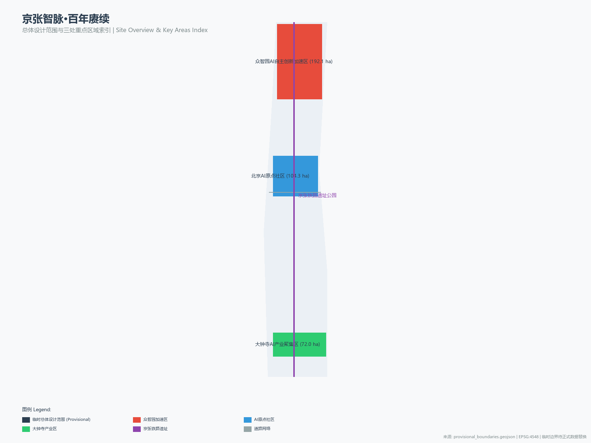
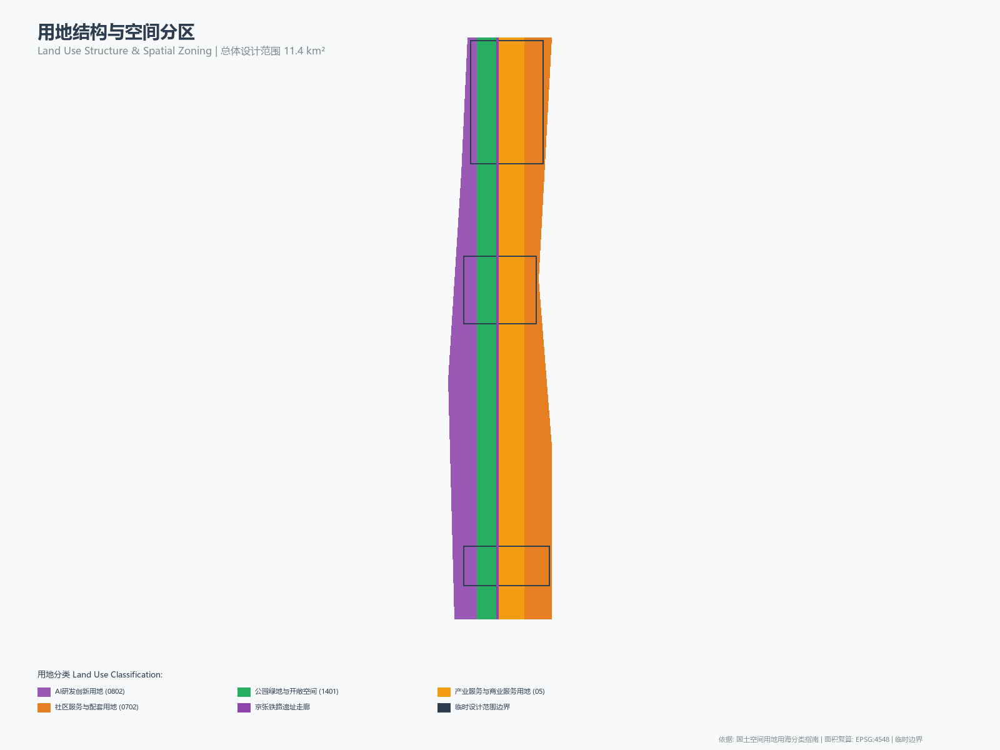
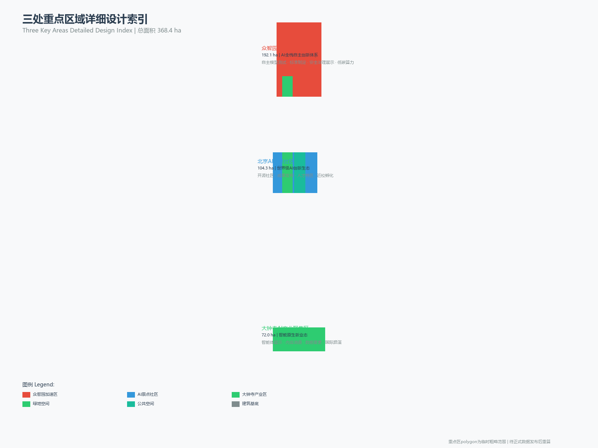
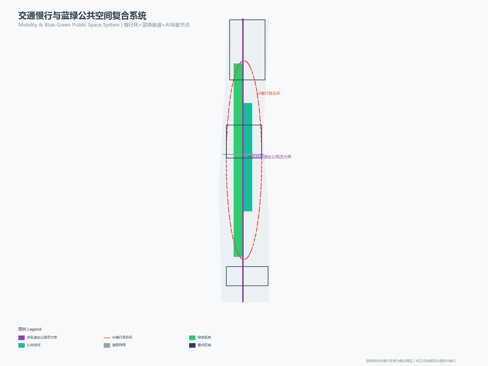
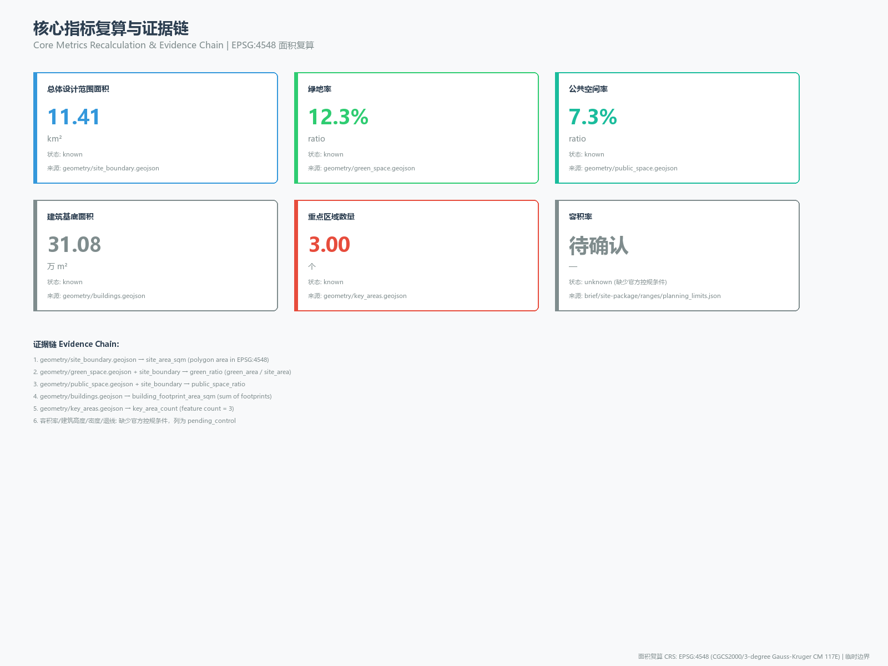

# Jingzhang Intelligence Vein · Centennial Continuation — Comprehensive Urban Design Proposal for the Centennial Jingzhang AI Innovation Belt

## Design Basis and Source Inventory

This proposal takes the *International Proposal Solicitation Prequalification Announcement for the Centennial Jingzhang AI Innovation Belt Urban Design*, issued by the Haidian Branch of the Beijing Municipal Planning and Natural Resources Commission, as its primary statutory basis [source:OFFICIAL-ANNOUNCEMENT], and takes the open-source solicitation brief for global intelligent agents as the agent task basis [source:AGENT-TASKBOOK]. The provisional rough boundaries, three key-area polygons, enumerations, planning limits, and source inventory registered by the maintainer in the site package constitute the machine-readable basis [source:SITE-PACKAGE].

Before generation, the proposal has read `design_brief.json` (three-tier scope and design tasks), `agent_taskbook.json` (six agent tasks and co-creation principles), `allowed_design_space.json` (design-space boundary), `sources.json` (source inventory), `planning_limits.json` (planning limits — FAR, height, density, green ratio, and setbacks are all in missing status), and `data/source_registry.json` (public source registry) [source:SOURCE-REGISTRY]. Currently there are 7 formal available sources, 1 background source, and 1 provisional-only source; agents must not upgrade background or provisional sources to official boundaries or statutory regulatory plans [source:PROCESSED-FACT-PACK].

All design judgments are decomposed into traceable sources, recalculable metrics, verifiable layers, and manually reviewable assumptions. The announcement requires the proposal to reach the urban design depth of regulatory detailed planning and the urban design depth of a comprehensive planning implementation scheme; therefore, narrative text does not replace GeoJSON, metric tables, A3 booklets, A0 panels, and HTML digital exhibition deliverables [depth:existing_conditions_diagnosis].

While the official SITE_BOUNDARY is not yet available, this proposal uses `brief/site-package/geometry/provisional_boundaries.geojson` to generate a provisional formal package [data:geometry/site_boundary.geojson#SITE-001]. The site_boundary and key_areas in the submission package are labeled as `provisional_constraint` and `official_boundary=false`, used only for proposal generation, self-checking, visualization, and design discussion, and do not serve as official redlines or approval basis [metric:site_area_sqm]. This organizer-side data gap does not block content scoring; once official polygons are replaced, all layers and metrics must be recalculated.

## Three-Tier Scope Working Framework

The proposal organizes its work according to the three tiers established by the announcement. The Coordinated Research Area (43.6 km²) focuses on the AI industrial ecosystem, strategic positioning, the innovation chain, and the future urban form; the Overall Design Area (11.4 km²) focuses on the urban area within 1–2 km around the Jingzhang Relic Park, requiring an overall urban renewal framework, industrial spatial layout, transportation and municipal support, and urban character control; the Key Detailed Design Area (368.4 ha) focuses on the three detailed design districts, requiring clarity on functional programs, building massing, retain-renovate-demolish classification, public-space connectivity, and traffic organization [depth:three_level_scope_framework] [depth:overall_spatial_structure].

The depth items of the three-tier working framework are constrained by the design depth matrix; spatial evidence is based on [data:geometry/site_boundary.geojson#SITE-001] and [data:geometry/key_areas.geojson#PROV-KEY-001], and task basis is based on [standard:PROJECT-OFFICIAL-ANNOUNCEMENT].

The proposal puts forward the overall spatial concept of the "Jingzhang Intelligence Vein Symbiosis Belt": with the Jingzhang Relic Park as the historical and public-space main axis, the three key areas — Zhongzhiyuan, Beijing AI Origin Community, and Dazhongsi — as innovation anchors, and universities, enterprises, communities, and rail stations as the everyday network, forming a spatial organization structure of "One Belt, Three Cores, Two Wings, and Multiple Nodes." The "One Belt" is the Jingzhang Railway Relic Park Cultural Vitality Belt; the "Three Cores" correspond to the three key areas; the "Two Wings" are the Zhongguancun Technology Service Wing and the Xiaoyuehe Scenario Empowerment Wing; the "Multiple Nodes" are operable nodes for AI + public services, industrial services, and urban life.

| Tier | Design Question | Proposal Response | Data Anchor |
| --- | --- | --- | --- |
| Coordinated Research Area | How to organize the AI industrial ecosystem and future urban form | Establish an innovation chain of "university origination — open-source collaboration — enterprise transformation — public experience — international communication" | compliance_matrix.json, standard_matrix.json |
| Overall Design Area | How to map industry, renewal, transportation/municipal, and character | Expressed jointly through land-use, building, road, green-space, public-space, and phasing layers | [data:geometry/land_use.geojson#LU-001], [data:geometry/roads.geojson#ROAD-001] |
| Key Detailed Design Area | How the three districts reach detailed design depth | Each provides positioning, spatial actions, AI scenarios, and implementation dependencies | [data:geometry/key_areas.geojson#PROV-KEY-001], [data:geometry/key_areas.geojson#PROV-KEY-002], [data:geometry/key_areas.geojson#PROV-KEY-003] |

## Coordinated Research Area: Industry and Future City Research

### Overall Concept and Naming System (agent.1)

The proposal puts forward "Jingzhang Intelligence Vein" (abbreviated as JZ-IV) as the overall name of the belt. "Jingzhang" continues the historical identity of the centennial railway — the Jingzhang Railway, built in 1909 under the direction of Zhan Tianyou, was the first trunk railway designed and constructed independently by the Chinese; "Intelligence Vein" elevates the physical vein of the railway into the data and intelligence vein of the AI era, forming a centennial continuation from "iron vein" to "intelligence vein" [source:AGENT-TASKBOOK].

The naming system is as follows:

| Tier | Name | English | Meaning |
| --- | --- | --- | --- |
| Belt overall name | 京张智脉 | Jingzhang Intelligence Vein (JZ-IV) | Continuation of the centennial railway vein and the AI intelligence vein |
| Cultural belt | 京张百年叙事带 | Centennial Narrative Belt | Spatiotemporal narrative of railway history and engineering spirit |
| Life experience belt | AI都市生活带 | AI Urban Life Belt | Perceptible experience of AI + life scenarios |
| Innovation integration belt | 智轨创新带 | Smart Rail Innovation Belt | Convergent innovation of industry, computing power, and data |
| Zhongzhiyuan | 众智花园 | Zhongzhi Garden | "Zhongzhi" signifies collective intelligence and open-source collaboration |
| AI Origin Community | 智原社区 | AI Origin Community | The origin and cradle of AI innovation |
| Dazhongsi | 智钟产业港 | Zhizhong Industry Port | "Zhong" inherits the Dazhongsi place name; "Zhi" denotes the AI industry |

Logo direction: based on the geometric form of a rail cross-section as the skeleton, integrated with data-flow pulse lines, forming a logo that combines engineering and digital sensibility. The recommended primary colors are the combination of "Jingzhang Iron Gray" (#2C3E50) and "Intelligence Vein Blue" (#3498DB), accented with "Continuation Red" (#E74C3C), reflecting historical depth and innovative vitality [source:AGENT-TASKBOOK]. The logo and visual identity direction are concept proposals; actual use requires separate rights clearance and design refinement.

The overall spatial structure follows the synergistic framework of "Three Positionings, Five Functions, Three Areas and Two Wings" [source:AGENT-TASKBOOK]:
- **Three Positionings**: Centennial Jingzhang Cultural Belt, Urban AI Life Experience Belt, AI Convergence Innovation Belt
- **Five Functions**: AI full-stack self-reliance innovation system, world-class AI innovation ecosystem, AI + scenario empowerment new paradigm, intelligent AI vitality city, global discourse power of AI governance
- **Three Areas and Two Wings**: Zhongzhiyuan Acceleration Area (AI full-stack self-reliance innovation + AI governance discourse power), AI Origin Community (world-class AI innovation ecosystem), Dazhongsi Industrial Area (intelligent native new business formats); Zhongguancun Technology Service Wing (globalized allocation of factors + capital empowerment), Xiaoyuehe Scenario Empowerment Wing (AI scenario empowerment + intelligent vitality city)

### Global AI Innovation Ecosystem Case Study (agent.2)

The proposal compiles 8 global AI innovation ecosystem cases and extracts experiences that can be translated into Haidian spatial strategies [source:AGENT-TASKBOOK]:

| No. | Case | Core Characteristics | Haidian Translation Strategy |
| --- | --- | --- | --- |
| EC-01 | Silicon Valley (USA) | University origination (Stanford/Berkeley) + venture capital + enterprise ecosystem | Strengthen Tsinghua/Peking University/Beihang origination; build a university-park-enterprise innovation corridor |
| EC-02 | Zhongguancun (Beijing) | China's Silicon Valley; dense universities + technology enterprises clustered | Serve as the "Technology Service Wing" undertaking factor allocation and capital empowerment |
| EC-03 | Tsukuba Science City (Japan) | Planned science city with concentrated national research institutions | Zhongzhiyuan can borrow the "garden-style R&D block" spatial model |
| EC-04 | One-North (Singapore) | Innovation block mixing R&D + commercial + residential | AI Origin Community adopts mixed-use to promote innovation interaction |
| EC-05 | Station F (Paris) | World's largest startup incubator with shared facilities | Origin Community builds a centralized open-source incubation platform |
| EC-06 | Masdar City (UAE) | Sustainable technology-driven future city | Zhongzhiyuan explores low-carbon computing power and green innovation interaction environments |
| EC-07 | Toronto Quayside (Canada) | Smart city block with data-driven governance | Xiaoyuehe Wing pilots AI + urban governance scenarios |
| EC-08 | Helsinki-Otaniemi (Finland) | Compact innovation ecosystem of universities + R&D + startups | Strengthen campus-park-community slow-mobility stitching and achievement transformation |

The above cases are compiled from public information and do not involve enterprise internal data. When case experiences are translated into spatial strategies, they are expressed as concept proposals and do not constitute government implementation commitments [source:AGENT-TASKBOOK].

### Future Urban Form Research

The future urban form research answers how AI will change work, life, social interaction, learning, transportation, and public services. The proposal translates the AI transportation system, continuous green spaces, innovation service facilities, and an internationalized live-work atmosphere into locatable functional zones, nodes, corridors, and scenarios [standard:MOHURD-URBAN-DESIGN-MEASURES]. Industrial strategy metrics (AI innovation index, talent density, spatial supply types) are written into the metric system, indicating which are official, which are design recommendations, and which await official data calibration [data:geometry/land_use.geojson#LU-001] [data:geometry/public_space.geojson#PUBLIC-001].

## Overall Design Area: Urban Renewal and Regulatory-Planning-Depth Urban Design

The Overall Design Area is required to reach the urban design depth of regulatory detailed planning [standard:MOHURD-CONTROL-DETAILED-PLANNING]. The proposal puts forward the overall spatial structure of urban renewal: with the Jingzhang Relic Park as the north-south main axis, industrial service and community life functions are organized on the east and west sides, forming a renewal framework of "main axis through-connection, east-west stitching, node activation."

The land-use layout follows the Guide for Land-Use and Sea-Use Classification of Territorial Spatial Investigation, Planning, and Use Control [standard:MNR-LAND-USE-CLASSIFICATION-GUIDE], and is divided into four categories in [data:geometry/land_use.geojson#LU-001]: AI R&D and innovation land (0802), park green space and open space (1401), industrial service and commercial service land (05), and community service and ancillary land (0702). The land-use zones fully cover the design boundary without overlap [depth:land_use_layout].

The building plan distinguishes four categories: retention, renovation, renewal, and new construction [data:geometry/buildings.geojson#BLDG-001]. Where current buildings, ownership, regulatory plans, and engineering conditions are missing, the proposal only provides methods and lists pending calibration [depth:retain_renovate_demolish]. Building height, development intensity, setback and other control metrics are in missing status in `planning_limits.json`; the proposal lists them as pending_control and does not pass off speculative values as approved metrics [depth:height_massing_character] [depth:development_intensity_controls].

Transportation organization centers on rail station integration, road micro-circulation, and slow-mobility breakpoint stitching [data:geometry/roads.geojson#ROAD-001] [depth:traffic_rail_slow_parking]. Key coverage includes the North Fifth Ring Road cross-ring node, Wudaokou, Qinghua East Road West Exit, and Dazhongsi Station. Municipal and public service facilities cover AI industrial service facilities, innovation service platforms, talent life service facilities, new infrastructure, distributed energy, and edge computing [depth:municipal_new_infrastructure]. When pipeline, energy, and fire protection engineering data are missing, they are listed as prerequisites for formal deepening.

## Key Area Detailed Design

### Zhongzhiyuan AI Self-Reliance Acceleration Area (192.1 ha)

**Design Positioning**: A garden-style full-stack self-reliance innovation block, carrying the two functions of the AI full-stack self-reliance innovation system and global discourse power of AI governance [data:geometry/key_areas.geojson#PROV-KEY-001] [source:AGENT-TASKBOOK].

**Spatial Strategies**:
- Strengthen the Qinghe interface to form the "Qinghe Low-Carbon Innovation Corridor," combining green space, stormwater management, walking and cycling, and AI display [data:geometry/green_space.geojson#GREEN-001]
- An industry exhibition axis connecting the North Fifth Ring Road traffic node with the core R&D area, providing a visitable interface for autonomous model testing, standards-setting workshops, and low-carbon computing power experiences
- Organize R&D and office space with garden-style blocks, drawing on the low-density green R&D models of Tsukuba Science City and Masdar City
- A safety governance exhibition area translates standards setting, safety evaluation, and model red-team testing into visitable, reservation-based, and supervisable collaborative nodes

**AI Scenarios**: Autonomous model testing ground, standards-setting workshop, safety governance sandbox, low-carbon computing power experience station

**Implementation Dependencies**: Qinghe blue line, ecological flood control conditions, external traffic organization review — all pending confirmation items

### Beijing AI Origin Community (104.3 ha)

**Design Positioning**: A near-campus achievement transformation and talent community, carrying the world-class AI innovation ecosystem function [data:geometry/key_areas.geojson#PROV-KEY-002] [source:AGENT-TASKBOOK].

**Spatial Strategies**:
- Campus-park-block slow-mobility stitching, organizing pedestrian and cycling connections between Wudaokou/Qinghua East Road West Exit and the interior of the community [data:geometry/roads.geojson#ROAD-001]
- Build a centralized open-source incubation platform (drawing on the Station F model), providing achievement release, code contribution display, and small-scale roadshow space
- An achievement transformation street organizes incubation, display, legal, intellectual property, and investment and financing services, oriented toward university achievement transformation
- Talent Special Zone services are embedded in residential and living amenities, providing an internationalized live-work atmosphere

**AI Scenarios**: Open-source release hall, near-campus achievement transformation street, Talent Special Zone service station, AI education experience point

**Implementation Dependencies**: Campus boundaries, ownership, ground-floor business formats — all pending confirmation items

### Dazhongsi AI Industry Cluster (72.0 ha)

**Design Positioning**: An urban intelligent economy and international exchange block, carrying the intelligent native new business formats function [data:geometry/key_areas.geojson#PROV-KEY-003] [source:AGENT-TASKBOOK].

**Spatial Strategies**:
- Integrated design of Dazhongsi Station, achieving four-quadrant pedestrian connectivity [data:geometry/public_space.geojson#PUBLIC-001]
- The International Roadshow Living Room serves the display, negotiation, media release, and international exchange of intelligent agent, intelligent terminal, and content consumption enterprises
- The Data Element Reception Hall, premised on compliance, authorization, and auditability, displays the urban service interface for data element and digital asset circulation
- Public environment renewal around key enterprises to upgrade commercial service and international reception quality

**AI Scenarios**: Dazhongsi International Roadshow Living Room, Data Element Reception Hall, Intelligent Terminal Display Street

**Implementation Dependencies**: Rail stations, road intersections, municipal pipelines — all pending confirmation items

The detailed design of the three key areas must reach the urban design depth of a comprehensive planning implementation scheme [depth:three_key_area_detailed_design]. If the polygons are provisional, the conclusions in the text can only serve as directional design [source:PROVISIONAL-BOUNDARIES-2026].

## AI Innovation Ecosystem, User Personas, and AI+ Scenarios

### User Personas (agent.3)

The proposal establishes 6 user personas covering the spatial needs of AI talents and enterprises [source:AGENT-TASKBOOK]:

| User Persona | Typical Needs | Spatial Response | Privacy Boundary |
| --- | --- | --- | --- |
| Open-source developer | Release, collaboration, testing, community reputation | Origin Community open-source release hall, public code wall, nighttime collaboration space | No collection of personal behavioral trajectories; activity data is only aggregated |
| Startup team | Low-cost office, computing power entry, product testing ground | Zhongzhiyuan shared testing ground, edge computing service points | Computing power and data services require separate authorization |
| Leading enterprise visitor | Display, business, international reception, talent recruitment | Dazhongsi International Roadshow Living Room, rail station transfer | Enterprise logos and cases must be rights-cleared |
| Surrounding resident | Commuting, leisure, community services, low-disturbance renewal | Jingzhang Relic Park slow-mobility loop, embedded community services | Resident profiles are not used for commercial recommendations |
| University faculty and students | Achievement transformation, cross-campus collaboration, daily slow mobility | Campus-park slow-mobility stitching, achievement transformation stations | Campus data and research outcomes require authorization |
| International AI talent | Internationalized living, work visa services, cultural exchange | International talent service station, multilingual wayfinding, international apartments | Personal information is protected according to relevant laws and regulations |

### AI Scenario Cards (agent.3)

The proposal provides 13 AI scenario cards, of which 3 are industrial test and verification scenarios [source:AGENT-TASKBOOK]:

| Scenario Card | Spatial Carrier | Service Audience | Design Description | Operating Entity | Privacy Boundary |
| --- | --- | --- | --- | --- | --- |
| 01 Open-source Release Hall | AI Origin Community | Developers/Universities/Startups | Achievement release, code contribution display, small-scale roadshow | Open-source community operator | Aggregated statistics; no behavioral trajectory collection |
| 02 Safety Governance Sandbox | Zhongzhiyuan | Enterprises/Regulators/Researchers | Standards setting, safety evaluation, model red-team testing | Governance platform operator | Test data isolated; authorization required |
| 03 Edge Computing Relay Station | Overall Design Area nodes | Developers/Enterprises/Residents | Distributed computing power service, combined with low-carbon energy | Computing power service provider | Computing power use requires authorization |
| 04 AI Slow-Mobility Navigation | Jingzhang Relic Park | Residents/Visitors/Tourists | Explainable wayfinding, low-intrusion sensing to identify slow-mobility breakpoints | Urban operations platform | Only aggregated flow data; no personal profiling |
| 05 Dazhongsi International Roadshow Living Room | Dazhongsi Industrial Area | Enterprises/Investors/Media | Display, negotiation, media release, international exchange | Industrial service operator | Enterprise information must be rights-cleared |
| 06 Qinghe Low-Carbon Innovation Corridor | Zhongzhiyuan Qinghe interface | R&D/Residents/Tourists | Green space + stormwater + walking/cycling + AI display | Park operator | Environmental data is public |
| 07 Near-Campus Achievement Transformation Street | AI Origin Community | University faculty and students/Startups/Investors | Incubation, display, legal, intellectual property, investment and financing | Achievement transformation platform | Research data requires authorization |
| 08 Data Element Reception Hall | Dazhongsi Area | Enterprises/Regulators/Researchers | Data element and digital asset circulation service interface | Data trading platform | Compliance authorization, auditable |
| 09 AI Life Service Model Street | Community and commercial intersection | Residents/Visitors | Healthcare, education, legal, life service AI+ scenarios | Community service operator | Personal data protected by regulation |
| 10 Global AI Activity Week Route | Belt public space system | All users | A walkable experience route from relic culture to international roadshow | Event operator | Public activity data |
| 11 ★ Autonomous Driving Test Corridor | Zhongzhiyuan-Qinghe interface | Enterprises/Regulators/Researchers | Closed and semi-open autonomous driving test segments, with V2X infrastructure | Testing platform operator | Test data isolated; authorization required |
| 12 ★ Urban Intelligent Agent Governance Simulation Platform | Dazhongsi Area | Government/Enterprises/Researchers | Urban governance digital twin simulation, public safety operations rehearsal | Governance platform operator | Governance data desensitized; manual review |
| 13 ★ AI + Medical Emergency Response Test Area | Around AI Origin Community | Hospitals/Emergency services/Residents | AI-assisted triage, emergency dispatch, remote medicine testing | Medical institution operator | Medical data protected by regulation; manual review |

★ marks industrial test and verification scenarios. All scenarios are expressed as concept proposals and do not constitute approved operations [source:AGENT-TASKBOOK].

### AI Pilgrimage Landmarks (agent.4)

The proposal puts forward 3 AI pilgrimage landmarks and honor display nodes [source:AGENT-TASKBOOK]:

**1. Zhan Tianyou Intelligence Vein Lighthouse** — Located at the northern end of the Jingzhang Relic Park (Zhongzhiyuan Qinghe interface), it reconstructs the imagery of a railway signal tower with modern materials, integrates AI light-shadow interactive devices, and at night presents a dialogue between the centennial history of the Jingzhang Railway and the data flow of AI innovation. The landmark is a concept proposal; actual construction requires rights clearance, cultural heritage review, and engineering feasibility confirmation.

**2. Open-Source Code Wall** — Located in the core plaza of the AI Origin Community, it projects code snippets and contribution statistics of global open-source contributors on a physical wall, becoming a signature node for developer pilgrimage and photographs. Content must follow open-source licenses and must not display personal privacy information.

**3. Intelligent Agent Honor Gallery** — Set along the Jingzhang Relic Park, it records each year's most outstanding AI agents and contributors in the form of inscriptions or digital display panels, forming a sustainably updated memorial system. Honor display must obtain contributor authorization.

The above landmark designs must comply with cultural heritage, green space, blue line, and traffic safety constraints, and must not violate relevant regulations [source:AGENT-TASKBOOK].

### Cultural Narrative (agent.5)

The proposal constructs a cultural narrative system of "Centennial Jingzhang · Three Layers of Time" [source:AGENT-TASKBOOK]:

- **First Layer of Time · Railway Centennial (1909–2026)**: With Zhan Tianyou and the Jingzhang Railway as the historical main thread, it uses the Qinghuayuan Railway Station relic, rail remnants, and engineering symbols to tell the engineering spirit of the Chinese independently designing and building the first trunk railway. The cultural tour route starts from the Zhan Tianyou Intelligence Vein Lighthouse at the northern end and runs southward along the relic park, linking historical nodes.
- **Second Layer of Time · Forty Years of Innovation (1980s–2026)**: Taking the evolution from Zhongguancun's Electronics Street to technology parks as the thread, it tells the story of China's science and technology innovation transforming from trade to R&D, from imitation to self-reliance. Spatial carriers include the near-campus achievement transformation street and the innovation culture exhibition gallery.
- **Third Layer of Time · AI New Era (2026–)**: With AI-native scenarios, intelligent agent collaboration, and open-source communities as content, it tells how AI will change urban life and innovation patterns. Spatial carriers include the open-source release hall, the intelligent agent honor gallery, and the AI scenario experience route.

The cultural narrative and the logo system are independent but stylistically coordinated: the logo system manages the overall visual identity of the belt, while the cultural narrative manages content expression and tour experience [source:AGENT-TASKBOOK]. The wayfinding system adopts a dual-line visual language of "rail + data flow," with bilingual Chinese-English annotations, following the recommended translations in `docs/terminology-glossary.md`.

### Long-Term Operations (agent.6)

The proposal puts forward the "Jingzhang Intelligence Vein" global AI innovation event system and long-term operating mechanism [source:AGENT-TASKBOOK]:

**Annual Event System**:
- Jingzhang Intelligence Vein AI Innovation Week (every autumn): links open-source release, industry roadshow, cultural tour, and public experience
- Global Open-Source Contributor Day: an annual gathering and honor display for the developer community
- AI Scenario Open Day: periodically opens test and verification scenarios for public visit and experience
- Zhongguancun - AI Origin Dialogue Forum: an annual forum connecting Zhongguancun innovation culture with the new AI culture

**Event Brand**: "Jingzhang Intelligence Vein" serves as the master brand; annual events use a unified visual system (the logo direction is a concept proposal and requires separate design and rights clearance).

**Developer Community Operations**: Establish an open-source community operating mechanism that provides code contribution display, collaboration space reservation, community reputation accumulation, and event organization support. Operating data is only used for aggregated statistics, and no personal behavioral trajectories are collected.

**Scenario Open Operations**: AI scenario nodes are periodically open to the public, enterprises, and researchers, with a reservation system and capacity management. Test and verification scenarios must operate within a compliance framework, with data isolation and manual review.

**International Communication**: Enhance the belt's global attention through the Global AI Activity Week route, the International Roadshow Living Room, and a multilingual wayfinding system. All events, investment promotions, funding, and policy arrangements are expressed as concept proposals and do not constitute confirmed government arrangements [source:AGENT-TASKBOOK].

**Transformation Path**: Talent → Enterprise → Industry → Ecosystem. Attract AI talent through Talent Special Zone services, support startup team growth through incubation platforms and computing power entry, promote enterprise landing through industry roadshows and data element circulation, and ultimately form a sustainable AI innovation ecosystem.

## Land Use, Building Massing, and Retain-Renovate-Demolish Plan

The land-use plan is expressed in accordance with the Guide for Land-Use and Sea-Use Classification of Territorial Spatial Investigation, Planning, and Use Control [standard:MNR-LAND-USE-CLASSIFICATION-GUIDE], forming complete, closed, and seamless land-use zones [data:geometry/land_use.geojson#LU-001]. The building plan distinguishes retention, renovation, renewal, new construction, or pending-confirmation objects [data:geometry/buildings.geojson#BLDG-001] [depth:retain_renovate_demolish].

Building scale and intensity metrics must be consistent with `metrics.json` and the layers [metric:building_footprint_area_sqm]. Floor area ratio, building height, building density, green ratio, setback, and building control line lack official conditions and are listed as pending_control in the metric system [depth:development_intensity_controls] [depth:height_massing_character]. The A3 booklet provides the renewal project list and metric review table, and the A0 panel clearly expresses the key spatial structure and key areas.

## Transportation, Rail, Municipal, and Public Service Facilities

The transportation plan responds to the announcement's requirements for rail station integration, road micro-circulation, slow-mobility breakpoints, external transportation, parking, and green transportation systems [depth:traffic_rail_slow_parking]. Key coverage includes the North Fifth Ring Road cross-ring node, Wudaokou, Qinghua East Road West Exit, and Dazhongsi Station [data:geometry/roads.geojson#ROAD-001]. Road and slow-mobility layers are kept within the submission boundary and cross-checked against public space, green space, and key areas.

Municipal and public service facilities cover AI industrial service facilities, innovation service platforms, talent life service facilities, new infrastructure, distributed energy, edge computing, and the integration of traditional municipal facilities [depth:municipal_new_infrastructure]. The proposal explains facility standards, spatial layout, service radius, and phased implementation logic. When engineering data such as pipelines, energy, drainage, flood control, and fire protection are missing, they are listed as prerequisites for formal deepening [data:geometry/constraints.geojson#CONSTRAINTS].

## Blue-Green Space, Public Space, and Urban Character

The blue-green space plan takes the Jingzhang Relic Park Vitality Belt as its backbone, coordinating the travel needs of Qinghe, Xiaoyuehe, and surrounding universities, enterprises, and communities [depth:blue_green_public_space]. It proposes a north-south through-connected and east-west linked system of walkways, cycling paths, and green spaces [data:geometry/green_space.geojson#GREEN-001] [data:geometry/public_space.geojson#PUBLIC-001]. It identifies slow-mobility breakpoints, cross-ring-road nodes, and landscape nodes, and proposes composite-use strategies for parking, sports, innovation interaction, and technology testing.

The green ratio [metric:green_ratio] and public space ratio [metric:public_space_ratio] are explained in the text for their design significance: green spaces support the quality of life and innovation interaction for talent, and public spaces support the perceptible experience of AI scenarios. Complete values are stored in `metrics.json`.

The urban character plan integrates the Jingzhang Railway historical culture, Zhongguancun innovation culture, and AI innovation culture [standard:MOHURD-URBAN-DESIGN-MEASURES]. Using cultural resources such as the Qinghuayuan Railway Station relic, it proposes guidance for the urban tone, architectural character, roof form, and public art. Wayfinding, cultural symbols, AI pilgrimage landmarks, and the honor display system must have rights-cleared sources, must not be over-entertained, and must not write conceptual landmarks as approved construction [source:AGENT-TASKBOOK].

## Renewal Project List, Implementation Policy, and Phased Plan

The proposal forms a reviewable renewal project list [depth:renewal_project_list] [depth:phasing_implementation]:

| Project No. | Project Name | Type | Main Dependencies | Evidence Citation |
| --- | --- | --- | --- | --- |
| JZ-01 | Jingzhang Relic Park slow-mobility breakpoint stitching | Public space/Transportation | Road red line, under-bridge space | [data:geometry/roads.geojson#ROAD-001] |
| JZ-02 | Zhongzhiyuan Qinghe Innovation Interface | Blue-green space/Industry display | River blue line, flood control conditions | [data:geometry/green_space.geojson#GREEN-001] |
| JZ-03 | Origin Community near-campus achievement transformation street | Urban renewal/Industrial service | Campus boundary, ownership | [data:geometry/buildings.geojson#BLDG-001] |
| JZ-04 | Dazhongsi Station four-quadrant pedestrian connectivity | Rail integration/Slow mobility | Rail station, municipal pipelines | [data:geometry/public_space.geojson#PUBLIC-001] |
| JZ-05 | AI public service and edge computing nodes | New infrastructure/Public service | Energy, computing power, safety | [data:geometry/constraints.geojson#CONSTRAINTS] |
| JZ-06 | Global AI Activity Week public route | Operations/Brand | Public space permit, copyright | [data:geometry/phasing.geojson#PHASE-001] |
| JZ-07 | Zhan Tianyou Intelligence Vein Lighthouse | Cultural landmark/Public art | Cultural heritage review, engineering feasibility | [data:geometry/public_space.geojson#PUBLIC-001] |
| JZ-08 | Open-Source Code Wall | Cultural landmark/Community | Property rights, open-source license | [data:geometry/key_areas.geojson#PROV-KEY-002] |
| JZ-09 | Intelligent Agent Honor Gallery | Memorial system/Public space | Park permit, contributor authorization | [data:geometry/green_space.geojson#GREEN-001] |
| JZ-10 | Autonomous Driving Test Corridor | Test scenario/New infrastructure | Traffic organization, V2X facilities | [data:geometry/constraints.geojson#CONSTRAINTS] |

Phasing [data:geometry/phasing.geojson#PHASE-001]:
- **Near-term Pilot (1–2 years)**: Light infrastructure and operational activities such as slow-mobility stitching, open-source release hall, and AI Activity Week route
- **Mid-term Renewal (3–5 years)**: Building renewal in key areas, industrial service facilities, and edge computing nodes
- **Long-term Governance (5+ years)**: Comprehensive spatial implementation, international communication system, and long-term operating mechanism

## Metric System, Area Recalculation, and Compliance Matrix

The metric system contains three categories [depth:metrics_recalculation]:

**Category 1 · Spatial Metrics (directly recalculable from submitted geometry)**:
- Overall Design Area area [metric:site_area_sqm]: 11,412,825.39 sqm
- Green ratio [metric:green_ratio]: 12.34%
- Public space ratio [metric:public_space_ratio]: 7.33%
- Building footprint area [metric:building_footprint_area_sqm]: 310,807.18 sqm
- Number of key areas [metric:key_area_count]: 3

**Category 2 · Control Metrics (require official regulatory planning support; currently pending_control)**:
- Floor area ratio [metric:floor_area_ratio]: unknown (lack of approved FAR control conditions)
- Building height: missing (lack of height control conditions)
- Building density: missing
- Green ratio (control value): missing
- Setback: missing

**Category 3 · Performance Metrics (require continuous calibration from operating data)**:
- AI innovation index: conceptual metric, awaiting operating data calibration
- Talent density: conceptual metric, awaiting industry data calibration
- Slow-mobility accessibility: conceptual metric, awaiting transportation data calibration
- Event participation: conceptual metric, awaiting operating data calibration

The compliance matrix covers all mandatory tasks in Announcement sections 1.3, 1.4, and 1.5 and all tasks from agent.1 to agent.6, saved in `compliance_matrix.json`. Professional standard responses are saved in `standard_matrix.json`, and design depth evidence is saved in `design_depth_matrix.json`.

## Risks, Copyright, and Compliance Notes

**Bilingual Requirement**: The main file of the proposal is in Chinese (language: zh), with a complete English translation provided through `proposal.en.md`; A3/A0 panels, HTML, and graphic materials containing text provide content in the corresponding language [source:AGENT-TASKBOOK].

**Copyright and Compliance**: All images, drawings, and data assets are documented with their sources and licenses in `sources.json` or `report/copyright_statement.md`. HTML pages do not load remote scripts, remote map tiles, remote fonts, iframes, forms, or external APIs [depth:risk_missing_data].

**Data Gaps**: Official boundary, key area polygons, regulatory planning conditions, road red lines, parcel ownership, building status, municipal pipelines, and cultural heritage conditions are all missing, and have been registered in `assumptions.json` and self-checks [source:PROVISIONAL-BOUNDARIES-2026].

**Concept Proposal Nature**: All spatial implementation recommendations are expressed as "concept proposals," "reference plans," or "for further study by professional teams," and do not replace formal planning or constitute government approval conclusions [source:AGENT-TASKBOOK].

This proposal does not claim official approval, approved regulatory planning, final land ownership, final construction scale, or guaranteed implementation. The AI agent is responsible for facts, sources, copyright, spatial data, metrics, and expression; the maintainer and professional reviewers may require rework or rejection based on self-check results, spatial review, and the compliance matrix.

## References

- Haidian Branch of the Beijing Municipal Planning and Natural Resources Commission, *International Proposal Solicitation Prequalification Announcement for the Centennial Jingzhang AI Innovation Belt Urban Design* (2026-05-09)
- Excerpts of the open-source solicitation brief for global intelligent agents (2026-05-18)
- Beijing Municipal Science and Technology Commission, *"Three Areas and Two Wings" Building a World-Class AI Cluster* (2026-04-03)
- Ministry of Housing and Urban-Rural Development, *Measures for Urban Design Management* (2017-03-14)
- Ministry of Housing and Urban-Rural Development, *Measures for the Compilation and Approval of Regulatory Detailed Planning of Cities and Towns*
- Ministry of Natural Resources, *Guide for Land-Use and Sea-Use Classification of Territorial Spatial Investigation, Planning, and Use Control* (2023-11-22)
- Haidian District People's Government, *Haidian District "1+X+1" Modern Industrial System Construction Layout* (2026-03-02)
- Provisional rough boundaries and key-area polygons registered by the repository maintainer (2026-06-05)
- Complete machine index: see `sources.json`, `metrics.json`, `compliance_matrix.json`, `standard_matrix.json`, `design_depth_matrix.json`
