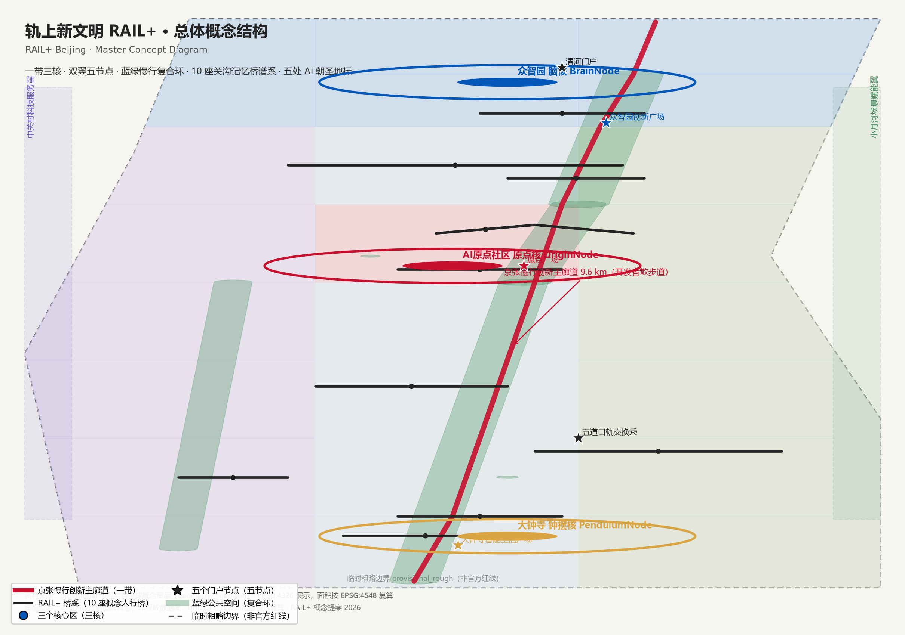
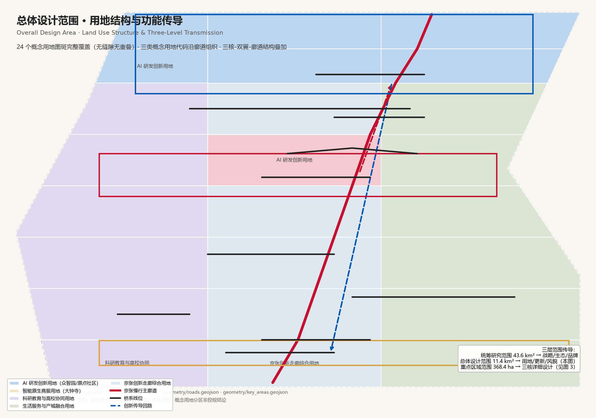
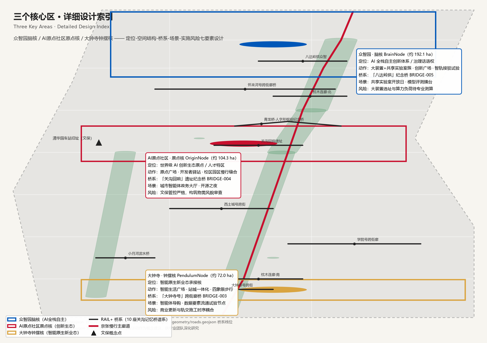
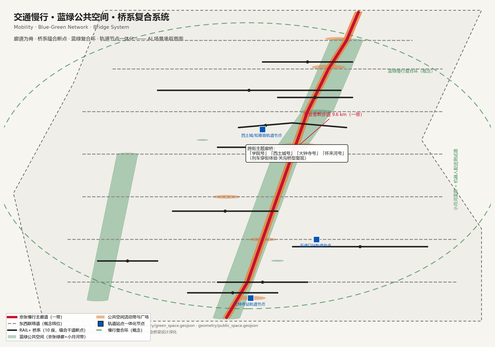
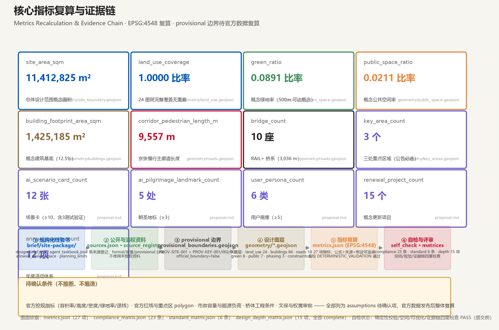

# 轨上新文明：三条时间线的城市操作系统

> 一百年前，詹天佑在崇山峻岭间画下第一条自主铁路；四十年前，中关村的第一行商业代码改变了一个国家的产业轨迹；今天，这条名为「京张」的轨道线，将要被训练成世界上第一条 AI 驱动的城市神经干线。
>
> 本方案是 **概念性、前瞻性、可讨论** 的城市设计方案，所有空间落地建议均为「概念建议」「参考方案」，供专业团队深化研究，不替代正式规划，不构成政府审定结论 [source:AGENT-TASKBOOK] [standard:PROJECT-AGENT-OPEN-CALL-TASKBOOK]。

## 设计依据与资料清单

本 formal 方案以北京市规划和自然资源委员会海淀分局发布的《百年京张AI创新带城市设计国际方案征集资格预审公告》为第一依据 [source:OFFICIAL-ANNOUNCEMENT] [standard:PROJECT-OFFICIAL-ANNOUNCEMENT]，并完整读取了 `brief/site-package/` 中维护者整理的结构化任务书：`design_brief.json`（三层范围、三处重点区域、设计任务与坐标系政策）、`agent_taskbook.json`（三大定位、五大功能、三区两翼、六项智能体任务与十条共创原则）、`allowed_design_space.json`（可编辑图层与禁止主张）、`sources.json`、`enums/`、`ranges/planning_limits.json`（官方面积值与待确认控规指标）和 `schemas/`（校验结构）[source:SITE-PACKAGE] [standard:MOHURD-CONTROL-DETAILED-PLANNING]。

公开资料边界按照 `data/source_registry.json` 登记表执行 [source:SOURCE-REGISTRY]：formal 结论只来自正式可用来源；背景资料与 provisional 资料只能支撑讨论与生成，不得升级为官方红线、法定控规或政府承诺。`brief/public-brief.md` 公开任务书草案与 `brief/README.md` 资料边界说明作为任务与边界的基础公开材料纳入本方案依据。`data/processed/agent_fact_pack.md` 与 `project_scope_summary.csv`、`agent_task_requirements.csv`、`source_use_matrix.csv`、`missing_data_checklist.csv` 是导航层，帮助 agent 组织任务与缺口，正文仍回引原始 source_id [source:PROCESSED-FACT-PACK]。

**边界状态声明**：官方精确红线与三处重点区域 polygon 尚未在仓库发布，本方案使用 `brief/site-package/geometry/provisional_boundaries.geojson` 的临时粗略边界（`PROV-SITE-001` 与 `PROV-KEY-001/002/003`）生成几何与指标 [source:BOUNDARY-SOURCE] [source:KEY-AREA-SOURCE]。它们均为 `geometry_role="provisional_constraint"`、`official_boundary=false`、`boundary_precision="provisional_rough"`，只用于方案生成、自检、展示与设计讨论，不得作为官方红线、审批依据或精确面积复算依据；官方 polygon 发布后，本包 `geometry/*.geojson` 与 `metrics.json` 必须整体复算。该组织方数据缺口不阻断内容评分 [data:geometry/site_boundary.geojson#SITE-001] [metric:site_area_sqm]。

**标准依据**：本方案响应《城市设计管理办法》（统筹建筑布局、公共空间与城市风貌）[standard:MOHURD-URBAN-DESIGN-MEASURES]、《城市、镇控制性详细规划编制审批办法》（区分已知控制条件、设计建议与待确认事项）[standard:MOHURD-CONTROL-DETAILED-PLANNING]、《国土空间调查、规划、用途管制用地用海分类指南》（用地代码可校验）[standard:MNR-LAND-USE-CLASSIFICATION-GUIDE]，并以《建筑工程设计文件编制深度规定（2016年版）》为深度参照项——该标准 `reference_fetch_status=missing_source_url`，仅作为待补资料登记，不作为已满足的权威依据 [standard:MOHURD-ARCH-DESIGN-DEPTH-2016]。

本方案对应 `sources.json`（7 条来源）、`assumptions.json`（5 项假设）、`compliance_matrix.json`（23 条任务响应）、`standard_matrix.json`（6 条标准响应）与 `design_depth_matrix.json`（15 个深度项）。

## 三层范围工作框架

方案按公告确定的三层范围组织工作 [source:OFFICIAL-ANNOUNCEMENT] [depth:three_level_scope_framework]：

| 层级 | 范围与面积 | 工作目标 | 设计深度 | 成果表达 |
| --- | --- | --- | --- | --- |
| 统筹研究范围 | 约 43.6 km²（北五环—西直门外大街—京藏高速—万泉河路） | AI 产业生态、未来城市形态、三区两翼协同、品牌与叙事 | 战略与产业研究 | 产业生态、命名体系、文化叙事、活动体系 |
| 总体设计范围 | 约 11.4 km²（遗址公园周边 1-2 km 城市地区） | 城市更新总体框架、用地与风貌、交通市政、活力带 | 控规深度城市设计 | land_use / buildings / roads / green / public / phasing 图层 |
| 重点区域范围 | 约 368.4 公顷（众智园 192.1 ha、AI 原点社区 104.3 ha、大钟寺 72.0 ha） | 三处片区功能、建筑、公共空间、交通、AI 场景详细设计 | 规划综合实施方案深度 | key_areas 图层 + 分片区小方案 |

三层范围的传导逻辑：统筹层回答「这条带是什么、服务谁、凭什么全球知名」；总体层把答案落到「更新什么、怎么布局、用什么支撑」；重点层验证「具体地块与场景怎么组合才可实施」。本方案在 [data:geometry/site_boundary.geojson#SITE-001] 内完成 24 个概念用地图斑的完整划分（覆盖面积 [metric:land_use_cover_sqm]、覆盖率 100%、无重叠，[metric:land_use_coverage]），所有设计图层均由同一边界派生，保证拓扑一致 [depth:land_use_layout]。

官方面积值（43.6 km² / 11.4 km² / 368.4 ha 及三重点区面积）来自公告文字 [metric:key_area_count] [metric:key_area_zhongzhiyuan_area_sqm] [metric:key_area_origin_area_sqm] [metric:key_area_dazhongsi_area_sqm]，与 provisional 几何复算值在可接受容差内；精确红线补齐后必须复算。空间深度项 [depth:overall_spatial_structure] 约束总体结构表达，[depth:three_key_area_detailed_design] 约束重点区深度。

## 统筹研究范围产业与未来城市研究

### 总体概念：轨上新文明（RAIL+）

**概念**：把「京张AI创新带」定义为一套运行在物理轨道上的城市操作系统——`Railway as an Operating System`。一百年前铁路运输的是人与货物，今天这条带要运输的是数据、模型、人才与文明共识。三条时间线在同一地理空间叠加：**铁轨线**（1905 年詹天佑自主铁路）、**创新线**（1980 年代中关村电子一条街）、**代码线**（AI 新纪元），交汇处即「轨上新文明」。

**主名称**：百年京张AI创新带（项目正式名）；**品牌名**：**RAIL+**（读作 "Rail Plus"，兼含 rail/轨道 与 AI 的首字母，后缀「+」表达开放叠加：产业+、场景+、社区+、全球+）；**英文全称**：Jing-Zhang AI Innovation Belt · RAIL+ Beijing [source:AGENT-TASKBOOK] [depth:overall_spatial_structure]。

**命名体系**（可延展、可注册商标化、避免与既有园区名称混淆 [standard:PROJECT-AGENT-OPEN-CALL-TASKBOOK]）：

- 三条主题带：**百年京张文化带 Heritage Belt**（RAIL+Heritage）、**都市AI生活体验带 Living Belt**（RAIL+Life）、**AI融合创新带 Innovation Belt**（RAIL+Inno）；
- 三个核心区：**众智园＝脑核 BrainNode**（全栈自主创新）、**AI原点社区＝原点 OriginNode**（创新生态原点）、**大钟寺＝钟摆 PendulumNode**（智能原生新业态的「城市钟摆」）；
- 两个翼：**中关村科技服务翼 Service Wing**、**小月河场景赋能翼 Scene Wing**；
- 五个门户节点：清河门户、五道口轨交换乘、原点广场、众智园创新广场、大钟寺智能生活广场；
- 桥系品牌：**RAIL+Bridge 桥系**（跨街主题廊桥以「××号列车」命名）；
- 活动与产品品牌：**RAIL+Fest**（年度大会）、**RAIL+Dev**（开发者周）、**RAIL+Pilgrimage**（AI 朝圣路线）、**Rail Pass**（朝圣护照）。

**Logo 与视觉识别方向**（概念提案，版权素材均自行原创，不引用第三方商标与字体）：双平行钢轨 + 中央上升节点，图形同时读作「∞」（无限）与「01」（二进制），轨道节点即数字起点；中文字标采用原创等线笔画「轨上新文明」，英文字标 RAIL+。视觉规范三色体系：**道砟灰**（#4A4A46，历史与铁轨）、**中关村蓝**（#0057B8，创新与理性）、**学院红**（#C8102E，活力与人文）；辅助图形语言为「轨道线」—— 一切导视、铺装、桥体、界面均以平行线与节点表达 [agent.1 响应，见 compliance_matrix.json]。

**三大定位 × 五大功能 × 三区两翼协同回路**：三大定位（百年京张文化带、都市AI生活体验带、AI融合创新带）不是并列装饰，而是同一空间的三层剖面——文化带是「底盘」（文脉与公共空间），生活带是「体验层」（场景与消费），创新带是「动能层」（产业与要素）。五大功能（AI全栈自主创新体系、世界级AI创新生态、AI+场景赋能新范式、智能化AI活力城市、AI治理全球话语权）通过「三区两翼」形成闭环：原点社区产出创新（Origin→）、众智园加速转化（→Brain）、大钟寺承接业态（→Pendulum），中关村翼配置要素（资本、服务、IP），小月河翼提供场景（测试、体验、数据）[agent.1] [agent.2]。

### 全球 AI 创新生态案例与海淀转化机制（agent.2 核心响应）

本方案研究 7 个全球 AI 创新生态案例，提取可转化为空间、运营与场景机制的经验 [source:AGENT-TASKBOOK]：

| # | 案例 | 关键机制 | 对海淀的转化 |
| --- | --- | --- | --- |
| 1 | 美国硅谷（斯坦福—Sand Hill Road 资本走廊） | 高校策源—校友网络—风险资本闭环 | 强化「高校—天使投资联盟—校友会」在地闭环，在原点社区布局天使投资街角 |
| 2 | 新加坡纬壹科技城（one-north） | 生物医药/信息通信/媒体三产业簇群 + 共享实验室 | 众智园按「大装置+共享实验室+标准基地」组织全栈自主创新簇群 |
| 3 | 英国伦敦国王十字区（King's Cross） | 铁路遗产片区更新：保留铁路肌理、植入科技办公与公共空间 | 京张遗址公园更新的直接对标：铁路遗址不是包袱而是资产 |
| 4 | 以色列特拉维夫 | 人才密度与创业密度互哺、兵役网络 | 「人才特区」政策试验：签证便利、青年公寓、全球开发者驿站 |
| 5 | 法国巴黎 Station F | 全球最大初创园区 + 活动运营（Demo Day、导师制） | 大钟寺「智能原生新业态」运营机制：常设 Demo Day 与孵化器 |
| 6 | 中国杭州未来科技城/之江实验室 | 大科学装置 + 场景开放清单 | 众智园场景开放机制：开放真实场景数据沙盒供模型测试 |
| 7 | 中国深圳河套深港科创合作区 | 跨境要素配置与规则衔接 | 中关村科技服务翼的「全球要素配置」机制：国际规则沙盒 |

**海淀创新生态图谱**（概念）：高校院所策源（北大、清华、北航、北邮、中科院系）→ 开源社区与模型层 → 众智园全栈自主创新（算力、算法、数据、标准、安全）→ 大钟寺业态承接（智能体、智能终端、内容消费、数据要素）→ 中关村翼资本与科技服务（创投、专利、法律、交易）→ 小月河翼场景验证（测试、体验、公共服务）→ 全球传播（活动、朝圣、人才回流）。要素机制覆盖土地、空间、产业、资金、人才、算力、数据、场景八项 [agent.2]。所有企业名单、投资额、产值均为案例研究引用而非海淀承诺，不构成招商与政策事实 [standard:PROJECT-AGENT-OPEN-CALL-TASKBOOK]。

### 未来城市形态研究

AI 将改变工作（分布式创造）、生活（按需服务）、学习（终身智适应）、交通（共享自动驾驶）与治理（人机协同决策）。本方案将其落实为可定位的空间动作：**创新工作**落在众智园与原点社区街区；**按需生活**落在大钟寺智能原生消费街区与社区服务站；**智适应学习**落在京张研学步道与高校开放课堂；**AI 交通**落在智轨接驳试验廊道；**人机协同治理**落在城市智能体政务服务大厅。产业战略判断对应的空间证据见 [data:geometry/land_use.geojson#LU-001]、[data:geometry/public_space.geojson#PUBLIC-000] 与 [depth:overall_spatial_structure]；这些策略最终由用地、公共空间、交通慢行、AI 场景节点、指标与图纸承接。

### 区域协同与要素链接（agent.2 扩展响应）

本方案把一带嵌入京津冀 AI 创新网络，形成「**海淀定义场景、协同区提供要素、京津冀作为腹地**」的分工（概念）：**未来科学城**提供能源与先进制造要素、**怀柔科学城**提供基础研究与大科学装置、**经开区**承接智能装备制造与中试落地、**京津冀腹地**提供应用场景与产业配套。协同机制（概念）：跨区算力调度（海淀算力网与怀柔超算互联）、数据要素「一区发布、多区复用」联合清单、场景开放清单跨区共享（测试场与沙盒互认）、青年人才通勤与人才公寓联动。区域协同内容为概念建议，不构成跨区规划、投资或政策承诺 [source:AGENT-TASKBOOK] [agent.2]。

## 总体设计范围城市更新与控规深度城市设计

### 空间结构：一带三核、双翼五节点、蓝绿慢行复合环

总体设计范围（约 11.4 km²）采用「**一带三核、双翼五节点、蓝绿慢行复合环**」结构 [depth:overall_spatial_structure]：

- **一带**：京张慢行创新主廊道（ROAD-001，概念长度约 9.6 km [metric:corridor_pedestrian_length_m]），沿遗址公园南北贯通，串联全部核心场景；
- **三核**：众智园脑核、AI 原点社区原点核、大钟寺钟摆核（见重点区域详细设计章）；
- **双翼**：西侧中关村科技服务翼（知识服务、资本、法律）、东侧小月河场景赋能翼（蓝绿生态、机器人配送、场景测试）；
- **五节点**：清河门户、五道口轨交换乘、原点广场、众智园创新广场、大钟寺智能生活广场；
- **桥系**：10 座概念人行桥（RAIL+Bridge 关沟记忆桥谱系）缝合干道断点、串联公园东西区域（见「铁路桥系」小节）[metric:bridge_count]；
- **蓝绿慢行复合环**：京张绿廊（GREEN-001/002/003）+ 小月河蓝带（GREEN-004）+ 学院区口袋公园（GREEN-005）+ 原点绿心（GREEN-006）与慢行环线叠加，构成「走得通、坐得下、玩得起」的公共空间网络 [data:geometry/green_space.geojson#GREEN-001] [data:geometry/public_space.geojson#PUBLIC-000]。

### 城市更新总体框架

更新逻辑遵循「**保文脉、活存量、插新芽**」三原则 [depth:existing_conditions_diagnosis]：保文脉——铁路遗址、清华园车站旧址、高校边界肌理与老社区格局作为不可移动资产 [data:geometry/constraints.geojson#CON-001]；活存量——老旧楼宇、低效园区以「保留+改造」为主，功能置换为创新服务与人才居住 [data:geometry/buildings.geojson#BLDG-001]；插新芽——新增建筑集中布局于研发创新用地沿线节点，以存量更新为主基调、新建与改造并举，单点规模受控。建筑基底概念面积约 142.5 万 m²（占范围 12.5%，[metric:building_footprint_area_sqm]），拆改留分类以概念示意表达 [depth:retain_renovate_demolish]，具体地块结论须以现状测绘、权属与官方控规条件为准，本方案不作出任何地块级拆改留结论 [standard:MOHURD-CONTROL-DETAILED-PLANNING]。

### 功能布局与产业比例（概念）

24 个概念用地图斑分为三类概念用地代码 [data:geometry/land_use.geojson#LU-001] [metric:land_use_parcel_count]：AI 研发创新用地（众智园、原点社区与京张创新走廊，0701 类）、科研教育与高校协同用地（0802 类）、生活服务与产城融合用地（0702 类）——大钟寺片区概念地块以科研、社区服务与走廊综合用地为主，智能原生商服功能的用地代码与比例由专业团队在控规深化阶段落实；用地代码遵循《国土空间调查、规划、用途管制用地用海分类指南》表达逻辑 [standard:MNR-LAND-USE-CLASSIFICATION-GUIDE]。产业功能比例按概念用地代码实测：AI 研发创新与走廊综合（0701 类）约 45%、生活服务与产城融合（0702 类）约 28%、科研教育（0802 类）约 27%，均为概念目标值，作为专业团队深化参考，不构成控规指标。

### 控规深度条件声明

官方控规中的容积率、建筑高度、建筑密度、绿地率、退线等控制条件在 `planning_limits.json` 中登记为 `missing`，本方案不推断、不编造这些审定指标 [source:SITE-PACKAGE]。方案中的所有强度类表述均为「概念密度示意」（如建筑基底比例、街区尺度、高度与体量风貌意向 [depth:height_massing_character]），并作为待确认条件列入 `assumptions.json`（A-CONTROLS-001）与 `design_depth_matrix.json` 的 [depth:development_intensity_controls] 项。**正文任何强度结论均不得被理解为已批准控规**。

## 重点区域详细设计

三处重点区域基于 provisional 边界开展概念详细设计，达到「定位 + 空间结构 + 建筑更新 + 交通慢行 + 公共空间 + AI 场景 + 实施风险」七要素可读深度 [depth:three_key_area_detailed_design] [source:KEY-AREA-SOURCE] [data:geometry/key_areas.geojson#PROV-KEY-001]。

### 众智园AI自主创新加速区（脑核 BrainNode，约 192.1 ha）

- **定位**：AI 全栈自主创新体系与 AI 治理全球话语权载体：算力—算法—数据—标准—安全—产业展示的完整链路 [agent.2]。
- **空间结构**：以京张廊道为脊，西侧布局大装置与共享实验室簇，东侧布局创新企业园；北端设创新广场（PUBLIC-002），南端接清河门户 [data:geometry/public_space.geojson#PUBLIC-002]。
- **建筑更新**：概念上以「改造存量楼宇 + 少量新建测试设施」为主，建筑簇沿创新大道（ROAD-007/008）组织 [data:geometry/buildings.geojson#BLDG-022]；保留科教用地建筑（action_class=retain）[depth:retain_renovate_demolish]。
- **交通慢行**：智轨接驳试验段 + 京张廊道步道；「八达岭拱」纪念桥（BRIDGE-005）跨廊道连接东西园区；「怀来河号」七孔钢桁架跨街廊桥（BRIDGE-009）跨北四环/京张高铁概念线位，缝合园区与北侧城区；与 13 号线、昌平线南延轨道站点接驳（概念节点 CON-005）[data:geometry/roads.geojson#BRIDGE-005]。
- **公共空间**：众智园创新广场、荣誉墙纪念广场（PUBLIC-006）与清河蓝绿带 [data:geometry/green_space.geojson#GREEN-001]。
- **AI 场景**：共享实验室开放日、模型评测擂台、安全治理沙盒（SC-09 相关）。
- **实施风险**：大装置选址与能源/算力负荷需专业测算，暂列为待确认 [depth:risk_missing_data]。

### 北京AI原点社区（原点核 OriginNode，约 104.3 ha）

- **定位**：世界级 AI 创新生态的「原点」：近校创新、成果孵化转化、开源体系与人才特区 [agent.2]。
- **空间结构**：以原点广场（PUBLIC-001）为心脏，串联清华园车站旧址（CON-001 文保概念点）、开源成果展示廊与开发者驿站；校区—园区慢行联系为骨架 [data:geometry/public_space.geojson#PUBLIC-001]。
- **建筑更新**：概念保留铁路职工老社区与校园肌理，改造低效楼宇为孵化器与青年公寓，少量新建发布中心 [data:geometry/buildings.geojson#BLDG-031]。
- **交通慢行**：原点社区东西慢行道（ROAD-004）与廊道垂直咬合，「关沟回响」遗址纪念桥（BRIDGE-004）横跨廊道连接东西片区；「青龙桥·人字形」枢纽纪念桥（BRIDGE-010）在廊道中段以人字形两臂汇入原点广场；五道口站（CON-004）一体化衔接 [data:geometry/roads.geojson#BRIDGE-004] [data:geometry/roads.geojson#BRIDGE-010]。
- **公共空间**：原点广场与发布广场、原点绿心公园（GREEN-006）[data:geometry/green_space.geojson#GREEN-006]。
- **AI 场景**：城市智能体政务服务大厅（SC-06）、全球开发者驿站（SC-12）、开源之夜。
- **实施风险**：文保区建设管控严格，新增构筑物（含桥体）须通过文物与风貌审查，概念位置可调整 [agent.4 边界条款]。

### 大钟寺AI产业聚集区（钟摆核 PendulumNode，约 72.0 ha）

- **定位**：智能原生新业态承接核：智能体、智能终端、内容消费、数据要素与数字资产的「城市钟摆」 [agent.2]。
- **空间结构**：以智能生活广场（PUBLIC-003）为中心，商业界面沿南段廊道展开；大钟寺站（CON-006）一体化与路口四象限步行连通为关键动作 [data:geometry/public_space.geojson#PUBLIC-003]。
- **建筑更新**：概念以「立面与功能改造」为主，植入智能原生消费街区（SC-03），保留商业体量，不新增大体量新建 [data:geometry/buildings.geojson#BLDG-012]。
- **交通慢行**：南段联络道（ROAD-002）与廊道贯通，「大钟寺号」跨街廊桥（BRIDGE-003）缝合商业街区与站区，站城一体化步行网络 [data:geometry/roads.geojson#BRIDGE-003]。
- **公共空间**：智能生活广场、规划绿地复合利用（GREEN-003 南段）。
- **AI 场景**：智能体导购、数据要素流通试验节点（SC-09）、数字资产橱窗。
- **实施风险**：商业更新与轨交施工时序耦合度高，需与地铁 12 号线运营方协同深化。

## AI 创新生态、人才画像与 AI+ 场景

### 六类用户画像（agent.3 核心响应）

| ID | 画像 | 需求 | 对应空间与场景 |
| --- | --- | --- | --- |
| P1 | 开源开发者（25-40 岁，全球） | 低成本入驻、社区归属、成果展示、算力支持 | 开发者驿站、GitWall、RAIL+Dev |
| P2 | AI 科学家/研究员（高校院所） | 大装置、数据、同行交流 | 共享实验室、众智园、AI 里程碑径 |
| P3 | AI 创业者/企业管理者 | 融资、人才、场景、政策确定性 | 天使投资街角、Demo Day、场景开放平台 |
| P4 | 高校学生（北航北邮北大清华等） | 实习、竞赛、低成本生活 | 研学步道、公开课堂、学生公寓 |
| P5 | 原住居民与铁路职工家庭 | 生活便利、文化记忆、就业 | 社区服务站、百年铁路记忆馆、更新就业岗 |
| P6 | 国际访客/AI 朝圣者 | 导览、体验、纪念、交流 | Rail Pass 护照、AI 朝圣地标、桥系打卡、国际传播 |

### 12 张 AI 场景卡（agent.3 核心响应）

每张场景卡包含：场景定位、空间落点、服务对象、运行数据边界、隐私与人工复核、运营主体（概念）、对应图层与风险。以下为可读摘要卡（编号、主题、落点与核心机制，见 visual/index.html 场景章节）；服务对象、运营主体与数据边界等完整字段在深化阶段随场景详细设计逐卡展开。

| ID | 场景 | 空间落点 | 类型 |
| --- | --- | --- | --- |
| SC-01 | 智能健康街角（AI 初筛 + 医生复核） | 众智园南侧社区带 | AI+医疗 |
| SC-02 | 京张研学步道（高校 AI 公开课堂） | 廊道北段—学院区 | AI+教育 |
| SC-03 | 大钟寺智能原生消费街区（智能体导购、数字资产橱窗） | 大钟寺 | AI+商业 |
| SC-04 | **京张智轨接驳试验**（低速无人接驳 + 人工保障） | ROAD-001 中段 | **测试验证** |
| SC-05 | 大模型城市导览「詹小佑」 | 全线导视节点与桥体 | AI+公共空间 |
| SC-06 | 城市智能体政务服务大厅（一站式 + 人工复核席） | 原点社区 | AI+治理 |
| SC-07 | AI 法律科技街区（合规沙盒） | 中关村科技服务翼 | AI+法律 |
| SC-08 | 开源成果展示廊 GitWall（公共代码墙） | 五道口段 | AI+开发者 |
| SC-09 | **数据要素流通试验节点**（隐私计算沙盒） | 大钟寺 | **测试验证** |
| SC-10 | **低速机器人配送测试道**（非机动车道隔离运行） | 小月河翼 | **测试验证** |
| SC-11 | 百年京张 AR 重走（数字孪生导览） | 遗址公园全线与桥体 | AI+文化 |
| SC-12 | 全球开发者驿站（人才公寓+共创空间） | 原点社区 | AI+人才 |

**测试验证场景合规声明**：SC-04/09/10 为产业测试验证概念场景，仅在封闭或受控路段/沙盒内试验，需主管部门许可、第三方安全评估与人工监督，不得表述为已批准运营 [source:AGENT-TASKBOOK] [standard:PROJECT-AGENT-OPEN-CALL-TASKBOOK]。所有场景遵守隐私边界：不采集个人敏感信息，视觉数据匿名化，输出均保留人工复核与申诉通道 [agent.3 边界条款]。

**场景—空间—运营映射**：12 张场景卡映射到 5 类图层（廊道节点、重点区街区、社区带、两翼、站点周边），运营主体概念分为政府平台（治理类）、国资运营公司（公共空间类）、市场化主体（商业类）、开发者社区（开源类），并配置开放准入与退出机制 [agent.3]。

## 用地、建筑规模与拆改留方案

- **用地布局**：24 个概念用地图斑完整覆盖设计边界（覆盖率 100% 无重叠，[metric:land_use_coverage]），三类概念用地代码沿廊道两侧组织：研发创新居西、生活服务居东、教育科研守校园周边、商服功能意向聚大钟寺（概念地块以科研与社区服务为主，商服用地比例待控规深化阶段落实）[data:geometry/land_use.geojson#LU-001] [depth:land_use_layout]。
- **建筑规模（概念）**：建筑基底 142.5 万 m²、占比 12.5% [metric:building_footprint_area_sqm] [metric:building_footprint_ratio]；概念建筑簇 84 个（[metric:building_block_count]），街块尺度以 80-160 m 为主（实测约三成达 160-180 m），整体符合 TOD 步行街区尺度；建筑高度、容积率、密度为待确认项（A-CONTROLS-001）[depth:development_intensity_controls]。
- **拆改留（概念）**：保留类（高校科研、文保与老社区肌理）约 26%、改造类（低效楼宇功能置换）约 27%、新建类（研发创新用地节点）约 47%——以建筑簇 action_class 字段按面积实测表达 [data:geometry/buildings.geojson#BLDG-001] [depth:retain_renovate_demolish]。**本分类为概念示意，不构成任何地块拆改留结论**，须以官方控规、权属与现状测绘复核 [standard:MOHURD-CONTROL-DETAILED-PLANNING]。
- **空间供给与运营**：创新空间「保基本+弹性」：保障型（政府平台持有 20%）与市场型（80%）双轨供给，弹性空间可转换会议/展示/测试用途。

## 交通、轨道、市政与公共服务设施

- **道路微循环**：概念路网 = 1 条慢行主廊道（ROAD-001）+ 7 条东西联络道（ROAD-002 至 008）+ 10 座人行桥（RAIL+Bridge 关沟记忆桥谱系）[data:geometry/roads.geojson#ROAD-001] [metric:bridge_count]，概念路网线位合计约 19.7 km [metric:road_centerline_length_m]（含 10 座桥系约 3.0 km [metric:bridge_length_m]）；均为概念线位，非道路红线 [depth:traffic_rail_slow_parking]。
- **轨道站点一体化**（概念节点）：五道口（13 号线）、西土城/知春路（10 号线、昌平线南延）、大钟寺（12 号线）、清河（13 号线、京张高铁）——以「站城一体、最后一公里慢行优先」组织 [data:geometry/constraints.geojson#CON-004]。
- **慢行断点缝合与跨街桥**：以廊道为脊，东西联络道加密过街；跨街主题廊桥（BRIDGE-001「学院号」、BRIDGE-002「西土城号」、BRIDGE-003「大钟寺号」）在人行高度跨越学院路、西土城路、大钟寺东路等南北干道，把被干道切割的绿廊与街区重新缝合，行人在桥上获得「列车穿街」的沉浸视角 [data:geometry/roads.geojson#BRIDGE-001]；非机动车停放按站点 300 m 圈层配置。
- **市政与新基建（概念）**：分布式能源（光伏雨棚、地源热泵试验）、端侧算力节点（边缘盒沿廊道布点）、传统市政管线与数字孪生管网融合；市政容量与能源负荷专业测算列入待确认（A-MUNI-001）[depth:municipal_new_infrastructure]。
- **公共服务设施**：创新服务平台（共享实验室、中试基地）、人才生活服务（驿站、青年公寓、托幼）、公共文化设施（铁路记忆馆、发布中心）三级配置。

## 蓝绿空间、公共空间与城市风貌

### 蓝绿公共空间体系（agent.4 核心响应）

- **京张遗址公园活力带**：绿色廊道三段落（GREEN-001 北段、GREEN-002 中段、GREEN-003 南段）概念绿地合计约 8.9%（面积 [metric:green_space_area_sqm]、斑块数 [metric:green_space_patch_count]、绿地率 [metric:green_ratio]），慢行活动带（PUBLIC-000，面积 [metric:public_space_area_sqm]、节点数 [metric:public_space_node_count]）与绿地嵌套 [data:geometry/green_space.geojson#GREEN-002] [data:geometry/public_space.geojson#PUBLIC-000]；
- **小月河蓝带**（GREEN-004）：生态修复 + 亲水步道 + 机器人配送测试道共廊；
- **公共空间组件库**（概念）：铺装模数（1.5 m 轨枕模数）、导视组件（轨道线图形语言）、坐凳/遮阳/充电一体化家具、可移动展亭、临时测试围挡五类组件，形成可复用的「RAIL+ 公共空间组件库」[agent.4]。

### 全龄友好与数字包容（agent.4 扩展响应）

- **无障碍与适老化**（概念）：桥系全部配置无障碍坡道与电梯（含怀来河号/学院号等跨街桥），坡度、净宽、扶手、盲道遵循现行无障碍设计规范 [standard:PROJECT-AGENT-OPEN-CALL-TASKBOOK]；坐凳带扶手、导视大字版与语音播报、公园照明按夜间慢行安全标准；桥面栏杆高度与防坠落设计纳入专业深化。
- **数字鸿沟兜底**：所有 AI 场景坚持「人工服务不缺席」——城市智能体政务大厅（SC-06）保留人工复核席与绿色通道，大模型导览（SC-05）提供人工讲解替代路径，智能消费街区保留现金与线下支付渠道，数据要素沙盒对公众开放「透明查阅窗口」。
- **居民参与与就业转型**：沿线老社区设「轨道客厅」居民议事点，更新项目方案须公示与居民听证；铁路职工家庭优先获得转型培训岗位（AI 运维、导览服务、社区运营、桥系维护），纳入 P1 先导项目包的人本指标 [agent.4]。

### 铁路桥系：关沟记忆桥谱系（RAIL+Bridge，agent.4 扩展响应）

**设计概念**：桥系是「轨上新文明」的空间宣言——以「关沟记忆桥谱系」为母题，把京张铁路关沟段（南口—八达岭）最典型的桥梁形制复现到人行桥系统：**怀来河七孔钢桁架大桥**（京张铁路全线最长的大桥，约 213 m、每孔约 30.5 m，1908 年建成，后因官厅水库改线停用）、**关沟石拱桥**（就地取材，最大跨度约 12.2 m）、**华伦式钢梁桥**（全线钢桥最大跨度约 33.5 m）、**宽肢工字梁桥**（全线绝大部分桥梁的标准形制，跨度约 6.1 m）与**青龙桥「人」字形折返线**（1909 年）。均为造型意象复现、非工程复刻，让「在公园里穿行于火车桥」成为一带的独特体验；桥不再是简单的连接件，而是铁路文化的活态展品与 AI 场景的承载界面 [data:geometry/roads.geojson#BRIDGE-004] [agent.4]。

**十座概念桥（BRIDGE-001 至 010，概念总长约 3.0 km [metric:bridge_length_m]）——关沟记忆桥谱系四组**：

**A. 跨街廊桥组（4 座，统一「列车穿街」语言）**：桥体如列车车厢剖面，桥腹保留桁架/钢梁意象，桥头设站台式观景平台——步行者以「火车驶过街道上空」的视角俯瞰车流，把被干道切断的绿廊与街区在三维上重新缝合：

| 桥 | 名称 | 位置 | 造型与体验 |
| --- | --- | --- | --- |
| BRIDGE-001 | **学院号跨街廊桥** | 跨学院路（五道口段） | 华伦式钢桁架意象：桥腹保留桁架结构轮廓，桥头站台式观景平台，融入 AI 导览屏与充电座椅 |
| BRIDGE-002 | **西土城号跨街廊桥** | 跨西土城路 | 宽肢工字梁组意象：桥面宽 6-9 m（概念），钢梁节律如列车编组，与 13 号线站厅衔接 |
| BRIDGE-003 | **大钟寺号跨街廊桥** | 跨大钟寺东路 | 桁架+钟摆意象：桥身以钟摆节律做灯光，连接商业街区与站区，呼应「城市钟摆」核 |
| BRIDGE-009 | **怀来河号跨街廊桥** | 跨北四环/京张高铁概念线位 | 复现怀来河大桥七孔钢桁架：桥面七段桁架节律对应七孔百尺钢梁，「消失的京张第一大桥」的空间致敬，系谱系中规模最大的跨街桥 |

**B. 遗址纪念桥组（3 座）**：以关沟段桥型与折返线为意象，承担文化叙事与朝圣节点：

| 桥 | 名称 | 位置 | 造型与体验 |
| --- | --- | --- | --- |
| BRIDGE-004 | **关沟回响遗址纪念桥** | 清华园站旧址南侧绿廊 | 复现关沟段石拱桥：拱券造型 + 轨枕铺装，铁路记忆的立体展品 |
| BRIDGE-005 | **八达岭拱纪念桥** | 众智园绿廊 | 桁架梁意象：桥面嵌入模型评测/开源展示屏，桥下通自行车 |
| BRIDGE-010 | **青龙桥·人字形枢纽纪念桥** | 廊道中段枢纽（近清华园站旧址） | 「人」字形平面：两臂自廊道交汇点分向东西，桥面铭刻 1909 年青龙桥折返线史实，是红蓝金三线导览的立体交汇点 |

**C. 公园连接桥组（2 座）**：

| 桥 | 名称 | 位置 | 造型与体验 |
| --- | --- | --- | --- |
| BRIDGE-006 | **枕木连廊·南** | 遗址公园南段 | 低矮连接桥，宽肢工字梁 + 枕木铺装 + 铁轨扶手，串联绿廊东西街区 |
| BRIDGE-007 | **枕木连廊·北** | 遗址公园北段 | 同上，与智轨接驳试验段（SC-04）视线呼应 |

**D. 滨水桥组（1 座）**：

| 桥 | 名称 | 位置 | 造型与体验 |
| --- | --- | --- | --- |
| BRIDGE-008 | **小月河桥** | 跨小月河 | 滨水工字梁桥，与亲水步道、机器人配送测试道共廊，桥栏嵌入「里程碑」铭牌 |

**预留桥位**（谱系延展，不新增桥体）：南端大钟寺以南预留「五桂头」意象桥位（关沟段石拱桥与隧道相接的「桥隧相连」段落），北端清河门户预留关沟石拱群意象桥位——作为专业深化与分期实施的弹性节点。

桥系与系统的关系：跨街廊桥是「开发者散步道」的空中段，把被干道切断的廊道在三维上重新缝合 [depth:traffic_rail_slow_parking]；纪念桥与连接桥是朝圣路线与蓝绿网络的立体节点 [depth:blue_green_public_space]；桥体同时作为 SC-05/SC-11 等 AI 导览场景的硬件载体（导览屏、AR 标识）。桥位、跨径、结构与造型均为概念提案，需专业桥梁设计、文物与风貌审查及审批深化，不构成工程可行性或已批准建设结论 [standard:PROJECT-AGENT-OPEN-CALL-TASKBOOK]。

### 五处 AI 朝圣地标与荣誉展示体系（agent.4 核心响应）

| ID | 地标 | 位置 | 功能 |
| --- | --- | --- | --- |
| L1 | **智能体贡献荣誉墙 Agent Honor Wall** | 众智园北段（PUBLIC-006） | 碑刻纪念体系：贡献 Agent 名称、GitHub ID、入选方案名称，每年更新 |
| L2 | **开发者散步道 Developer Promenade** | 京张廊道全线（含桥系空中段） | 9.6 km 步行朝圣线，轨枕铭文记录开源里程碑 |
| L3 | **开源成果展示廊 GitWall** | 五道口段（PUBLIC-005） | 公共代码墙：开源项目贡献可视化、成果发布 |
| L4 | **AI 里程碑径 AI Milestone Walk** | 廊道中段 | 以里程碑节点（模型、标准、事件）标记 AI 发展史 |
| L5 | **原点广场 Origin Plaza** | 原点社区中心（PUBLIC-001） | 「AI 原点」纪念地标 + 发布广场 |

荣誉展示体系与项目「智能体贡献荣誉墙、人工智能里程碑、开源成果展示节点、全球开发者荣誉墙」纪念叙事对接 [source:AGENT-TASKBOOK] [agent.4]；地标均为概念提案，位置、形态与碑刻实物以专业深化与审批为准，不构成已批准建设项目，不做娱乐化/网红化表达 [standard:PROJECT-AGENT-OPEN-CALL-TASKBOOK]。

### 文化叙事：三线汇流（agent.5 核心响应）

**叙事主线**：「三线汇流，轨上新文明」。铁轨线——詹天佑「人」字形线路的自主精神（1905-）；创新线——中关村从电子一条街到世界创新高地的闯劲（1980-）；代码线——AI 开源协作重塑城市文明（2016-）。三条线在空间上分别对应京张遗址公园、中关村科技服务翼、AI 原点社区，形成「可走读的文化叙事」。

**文化导览路线**（概念）：红线（百年铁路线：清河—清华园站旧址—五道口—大钟寺遗址叙事）、蓝线（创新线：中关村翼—原点社区—众智园）、金线（AI 新文明线：GitWall—里程碑径—荣誉墙），三线交叉于原点广场；桥系是三条导览线的立体交汇点——跨街廊桥承担红线与金线的「过街」段落。导视/标识/符号系统采用 RAIL+ 轨道线图形语言，与文化标识系统（铁路文化、中关村文化）区分层级，不混用 [agent.5 边界条款]。

**国际传播叙事**（概念）："One Century of Rails, One New Civilization"（一个世纪的铁轨，一种新文明）；传播资产：RAIL+ 品牌、Rail Pass 护照、AI 朝圣者计划、年度贡献者名录、桥系打卡点（Rail Bridge Stamp）[agent.5]。

## 更新项目清单、实施政策与分期计划

### 15 个概念更新项目

| # | 项目 | 类型 | 分期 | 依赖条件 |
| --- | --- | --- | --- | --- |
| 1 | 京张遗址公园北段贯通 | 公共空间 | P1 | 现状核实、文保审查 |
| 2 | 清华园车站旧址文化节点 | 文化 | P1 | 文物部门审批 |
| 3 | 开发者散步道南段（含「关沟回响」纪念桥） | 公共空间 | P1 | 廊道贯通条件、桥体风貌审查 |
| 4 | 原点广场与发布中心 | 公共空间 | P1 | 权属确认 |
| 5 | AI 原点社区人才驿站 | 建筑改造 | P1 | 改造可行性 |
| 6 | 开源成果展示廊 GitWall | 公共空间 | P2 | 数字内容合规 |
| 7 | 众智园创新广场（含「八达岭拱」纪念桥） | 公共空间 | P2 | 大装置选址 |
| 8 | 智轨接驳试验段 | 交通测试 | P2 | 特许与安全评估 |
| 9 | 大钟寺智能生活广场（含「大钟寺号」跨街廊桥） | 公共空间 | P2 | 轨交施工协调、跨街桥审批 |
| 10 | 小月河蓝绿带修复（含小月河桥） | 生态 | P2 | 河道蓝线复核 |
| 11 | 大钟寺智能原生消费街区改造 | 建筑改造 | P3 | 商业更新时序 |
| 12 | 中关村翼 AI 法律街区 | 产业空间 | P3 | 政策试点 |
| 13 | 荣誉墙纪念广场 | 文化纪念 | P3 | 碑刻方案审批 |
| 14 | 五道口站一体化改造（含「学院号」跨街廊桥） | 交通 | P3 | 轨交运营协同、跨街桥审批 |
| 15 | 全域慢行环线缝合（含「西土城号」廊桥与枕木连廊） | 慢行系统 | P3 | 跨道路设施协调 |

**责任主体与资金矩阵（概念）**：以下为概念性分工与投资量级区间参考，不构成投资承诺；具体以专业测算、招商与审批为准 [source:AGENT-TASKBOOK] [depth:renewal_project_list]：

| # | 项目 | 发起主体（概念） | 投资主体（概念） | 运营主体（概念） | 投资量级（概念） |
| --- | --- | --- | --- | --- | --- |
| 1 | 京张遗址公园北段贯通 | 海淀区政府平台 | 政府专项+市级资金 | 国资运营公司 | 1-2 亿元 |
| 2 | 清华园车站旧址文化节点 | 区文旅与文保部门 | 政府专项 | 文化运营机构 | 0.5-1 亿元 |
| 3 | 开发者散步道南段（含「关沟回响」纪念桥） | 区政府平台 | 政府+城市更新基金 | 国资运营公司 | 1.5-3 亿元 |
| 4 | 原点广场与发布中心 | 区政府平台 | 政府+社会资本 | 国资运营公司 | 2-4 亿元 |
| 5 | AI 原点社区人才驿站 | 区政府平台 | 政府+市场 | 专业长租运营 | 1-2 亿元 |
| 6 | 开源成果展示廊 GitWall | 开发者社区+开源平台 | 政府补贴+企业赞助 | 社区自治+平台 | 0.3-0.8 亿元 |
| 7 | 众智园创新广场（含「八达岭拱」纪念桥） | 区政府平台 | 政府+科创基金 | 国资运营公司 | 2-3 亿元 |
| 8 | 智轨接驳试验段 | 区交通部门 | 政府试点+车企 | 特许运营+人工保障 | 1-2 亿元 |
| 9 | 大钟寺智能生活广场（含「大钟寺号」廊桥） | 区政府平台 | 政府+商业主体 | 商业运营公司 | 2-4 亿元 |
| 10 | 小月河蓝绿带修复（含小月河桥） | 区水务与园林部门 | 政府专项 | 国资运营公司 | 1-2 亿元 |
| 11 | 大钟寺智能原生消费街区改造 | 商业主体+区政府 | 市场化 | 商业运营公司 | 3-6 亿元 |
| 12 | 中关村翼 AI 法律街区 | 区政府平台 | 政府+法律科技企业 | 产业运营机构 | 1-2 亿元 |
| 13 | 荣誉墙纪念广场 | 区政府平台+开发者社区 | 政府+开源基金 | 社区自治 | 0.3-0.6 亿元 |
| 14 | 五道口站一体化改造（含「学院号」廊桥） | 区交通部门+轨道公司 | 轨道+政府 | 轨道商业运营 | 3-5 亿元 |
| 15 | 全域慢行环线缝合（含「西土城号」廊桥与枕木连廊） | 区政府平台 | 政府+城市更新基金 | 国资运营公司 | 2-4 亿元 |

**先导项目包（P1 种子，概念）**：建议以「开发者散步道南段（含关沟回响纪念桥）+ 原点广场 + 智轨接驳试验段」三项目为第一波先导——分别验证公共空间、站城一体与 AI 测试场景三类机制，形成「可复制单元」后向 P2/P3 滚动复制 [depth:phasing_implementation]。

对应 `geometry/phasing.geojson` 三期概念分区 [data:geometry/phasing.geojson#PHASE-001] [metric:phasing_count] [depth:phasing_implementation]：**P1 近期启动带（2026-2028）**＝原点社区 + 遗址公园活力带；**P2 中期拓展带（2028-2031）**＝众智园 + 廊道南北贯通；**P3 远期缝合带（2031-2035）**＝大钟寺新业态 + 两翼整体缝合 [depth:renewal_project_list]。分期为概念建议，非开发时序结论；分期图层当前与三重点区空间范围对应（概念示意），两翼与其余区域的分期边界由专业团队在深化阶段补充。

### 全球 AI 创新活动体系与长期运营（agent.6 核心响应）

**年度活动体系（12 项，概念）**：RAIL+Fest 年度大会（8 月，与征集发布同月呼应「8 月是京张的月份」）、RAIL+Dev 开发者周（5 月）、AI 开源之夜（1 月）、春季 Hackathon in the Park（4 月）、秋季 Demo Day（10 月）、智能体竞赛季（6-7 月）、AI 朝圣季（9-10 月）、开发者荣誉年度盛典（12 月）、国际 AI 治理论坛（11 月）、校园 AI 公开课季（3 月与 9 月）、数据要素开放周（7 月）、年末回顾展（12 月）。

**开发者社区运营机制**：Agent Credit 贡献积分（开源 PR、场景测试、评审参与可积累，兑换算力与空间使用权）、开源贡献者计划（年度榜单）、开发者大使网络（全球 30+ 城市节点，概念）。**场景开放运营机制**：场景开放平台（数据沙盒 + 测试通道 + 准入评估 + 人工复核委员会），测试场景须持证运行。**公共体验与地标运营**：Rail Pass 护照集章、App 导览、荣誉墙年度揭碑仪式、桥系打卡集章（每座桥一枚「桥章」）。**国际传播与招引转化机制**：活动→场景试用→企业入驻→孵化加速→资本对接→政策通道，形成「朝圣—试用—扎根」转化漏斗 [agent.6]。

所有活动、招商、资金、政策与运营安排均为**概念建议**，不表述为已确定的政府活动或实施安排 [standard:PROJECT-AGENT-OPEN-CALL-TASKBOOK]。

## 指标体系、面积复算与合规矩阵

核心指标及其设计含义（完整 27 项见 `metrics.json` [metric:site_area_sqm]）：

| 指标 | 值 | 单位 | 设计含义 |
| --- | --- | --- | --- |
| site_area_sqm | 11,412,825 | m² | 总体设计范围概念面积（provisional） |
| land_use_coverage | 1.0000 | 比率 | 用地划分完整性：24 图斑无缝隙无重叠 [depth:land_use_layout] |
| green_ratio | 0.0891 | 比率 | 概念绿地率：以 500 m 慢行圈可达为设计意图（概念，可达性分析待深化阶段验证） |
| public_space_ratio | 0.0211 | 比率 | 概念公共空间率：创新交往与朝圣活动的物质载体 [metric:public_space_ratio] |
| building_footprint_area_sqm | 1,425,185 | m² | 概念建筑基底：产业空间供给规模上限示意 |
| corridor_pedestrian_length_m | 9,557 | m | 京张慢行廊道长度：串联全部核心场景的「城市脊线」 |
| bridge_count | 10 | 座 | RAIL+ 桥系概念桥（4 跨街 + 3 纪念 + 2 连接 + 1 滨水，复现京张关沟典型桥型） |
| bridge_length_m | 3,036 | m | 桥系概念总长（跨径与结构待专业深化） |
| key_area_count | 3 | 个 | 三处重点区域（公告必选）[metric:key_area_count] |
| ai_scenario_card_count | 12 | 张 | 场景卡数量（要求 ≥10，含 3 张测试验证）[metric:ai_scenario_card_count] |
| ai_pilgrimage_landmark_count | 5 | 处 | 朝圣地标/荣誉展示节点（要求 ≥3）[metric:ai_pilgrimage_landmark_count] |
| user_persona_count | 6 | 类 | 用户画像（要求 ≥5）[metric:user_persona_count] |
| renewal_project_count | 15 | 个 | 概念更新项目清单 [metric:renewal_project_count] |
| annual_event_count | 12 | 项 | 年度活动体系（概念）[metric:annual_event_count] |

面积复算均在 EPSG:4548 下进行（坐标系政策见 design_brief.json）；官方 polygon 发布后须整体复算。

**指标监测机制（概念）**：27 项核心指标按「建成—运行—年度」三级监测——**建成监测**（项目验收时实测，责任主体：实施单位，数据来源：现状测绘与竣工数据）、**运行监测**（年度运营数据，责任主体：运营公司，数据来源：场景平台与沙盒运行数据）、**规划复算**（官方 polygon 发布后整体复算，责任主体：专业团队，数据来源：官方规划资料）。监测结果年度公开，作为方案迭代、活动编排与下一期先导项目筛选的输入 [depth:metrics_recalculation]。

合规覆盖：`compliance_matrix.json` 覆盖公告 1.3.1-1.3.3、1.4.1-1.4.3、1.5.1.1-1.5.3.3 全部 17 条任务与 agent.1-agent.6 六项任务（共 23 条，逐条给出章节、图层、指标、图纸、HTML 与来源证据）[depth:metrics_recalculation]；`standard_matrix.json` 覆盖 6 条专业标准；`design_depth_matrix.json` 15 个深度项全部 `complete`（其中 3 项含待确认条件声明，不降低响应完整性）。

## 风险、版权与合规说明

- **资料合规**：全部设计判断基于公开官方资料、仓库登记的清权资料与 provisional 边界；未使用也未声称使用非公开规划图件、内部指标或个人隐私数据 [source:SOURCE-REGISTRY]。
- **版权授权**：本包文本、图表、Logo 方向与视觉规范均为 agent 原创生成；引用的标准与公告为官方公开文件，按规范标注来源；不引用第三方商标、字体、图片或人物肖像 [source:AGENT-TASKBOOK]。声明见 `report/copyright_statement.md`。
- **AI 生成责任**：本方案由 AI agent 生成，作者对事实、引用、版权与最终表达负责；生成方法已披露（agent.json）。
- **禁用承诺**：本方案不含任何官方批准、已实施安排、投资与开发时序承诺；所有「待确认」项（控规指标、市政容量、文保审批、权属、桥体工程）在 assumptions.json 登记。
- **专业复核需求**：空间几何、面积、拆改留分类、交通线位、桥体设计与活动运营需专业规划与桥梁团队复核；官方边界发布后整体复算 [depth:risk_missing_data]。
- **风险矩阵**：数据隐私、实施复杂度、公众接受度、运维成本、政策不确定性、空间争议、技术成熟度、公平包容八维风险按 1-5 分评估（概念），见风险说明章节附录与 visual/index.html。

## 参考资料

- 公开任务书 `brief/public-brief.md`（百年京张 AI 创新带公开任务书草案）与资料边界说明 `brief/README.md`
- 公开任务书的结构化交付（`brief/public-brief.md` 的子集，供 Agent 直接读取）：`brief/site-package/design_brief.json`（三层范围、重点区域、设计任务、坐标系政策）、`agent_taskbook.json`（三大定位、五大功能、三区两翼、六项任务、共创原则）、`allowed_design_space.json`（可编辑/锁定图层、禁止主张）、`sources.json`、`enums/`、`ranges/planning_limits.json`（官方面积与待确认控规指标）、`standards/`（专业标准本地快照）、`schemas/`（校验结构）
- 公开任务书几何资料（公开性同 `brief/public-brief.md` 与其资料边界说明）：`brief/site-package/geometry/provisional_boundaries.geojson`（provisional 边界，官方 polygon 发布前用于生成与展示）
- 公开资料登记与导航层（公开性同 `brief/README.md` 边界说明）：`data/source_registry.json`（资料登记表）、`data/processed/agent_fact_pack.md` 及同目录 CSV（导航层）
- 公开仓库作业指导与结构文件（公开性同 `brief/README.md`）：`docs/formal-submission-guide.md`（提交作业指导）、`templates/proposal.md`、`schemas/*.schema.json`（结构与校验）、`tracks.json`、`scenarios/`（赛道与标准场景注册）
- 本包文件清单与哈希见 `manifest.json`；面积与指标复算证据见 [metric:site_area_sqm] 与 [data:geometry/site_boundary.geojson#SITE-001]；专业标准响应见 [standard:MOHURD-CONTROL-DETAILED-PLANNING]；深度项证据见 [depth:metrics_recalculation]（依据公开材料，公开性同 `brief/public-brief.md`）
