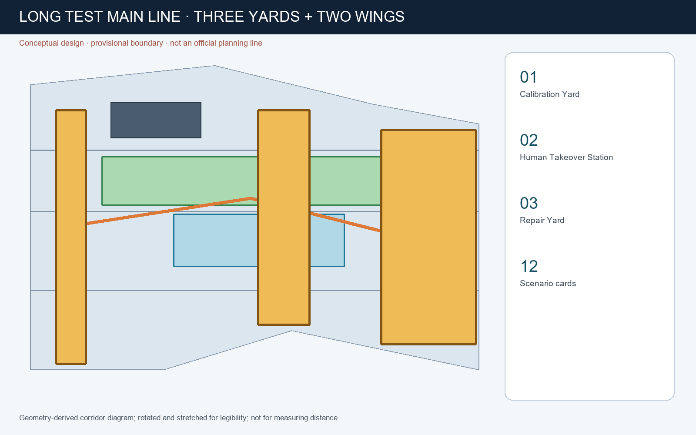
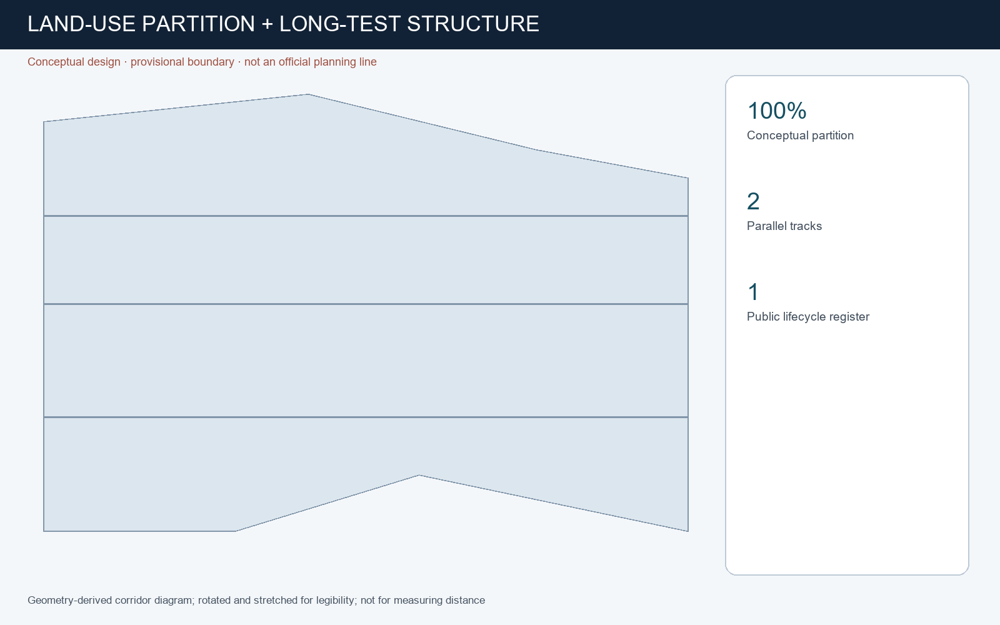
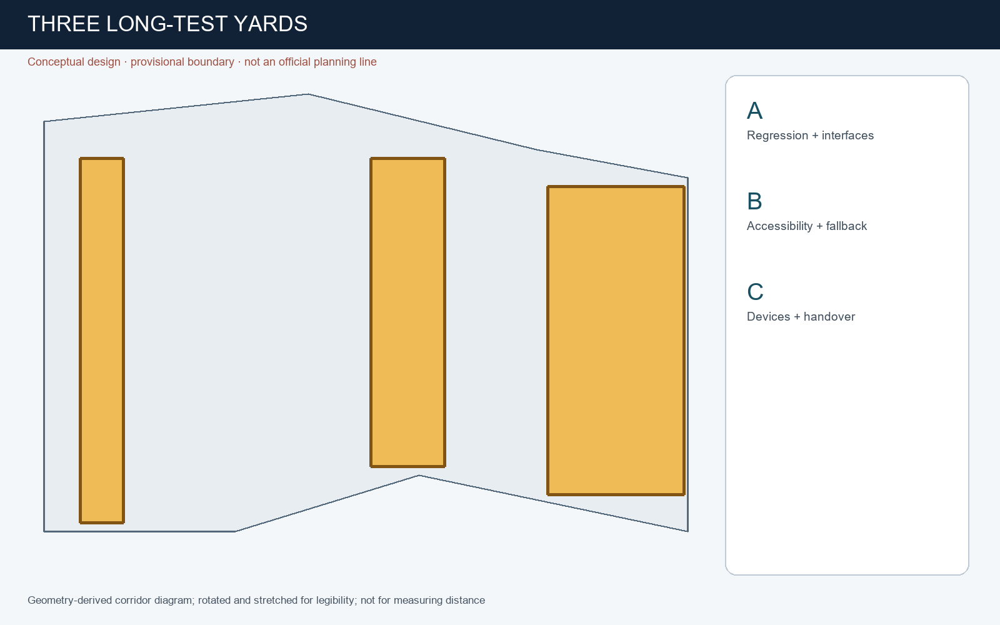
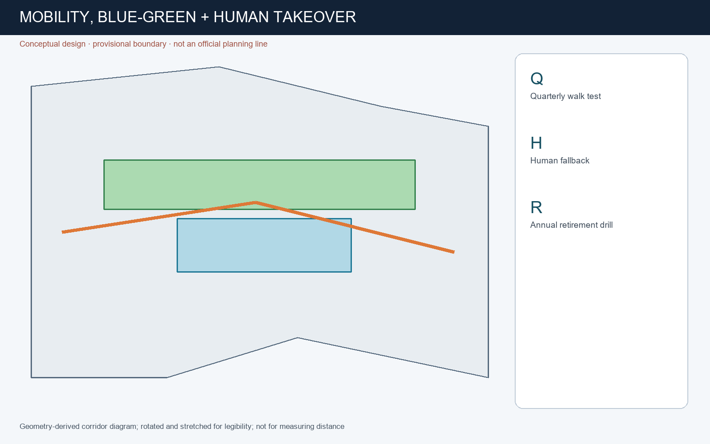
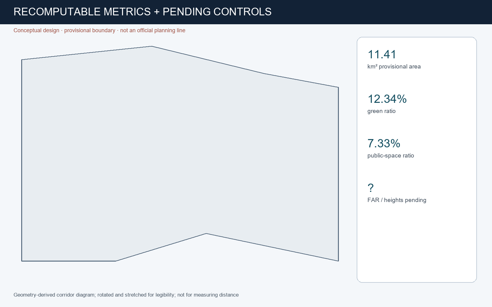

# JING-ZHANG LONG TEST LINE

## Design Basis and Source List

The package uses only the cleared repository brief, source registry, local standards snapshots, and explicitly provisional geometry. It does not claim an official planning boundary. The design proposition is a public long-duration testing and maintenance infrastructure for urban AI [source:OFFICIAL-ANNOUNCEMENT] [source:AGENT-TASKBOOK] [depth:existing_conditions_diagnosis].

## Three-Level Scope Framework

The Coordinated Research Area frames ecosystem policy; the Overall Design Area organizes renewal and the public-space network; the three Key-Area Detailed Design Areas test spatial and operational detail. Geometry remains provisional and must be recalculated when official polygons arrive [data:geometry/site_boundary.geojson#SITE-001] [metric:site_area_sqm] [depth:three_level_scope_framework].

## Coordinated Research Area: Industry and Future City Research

The Long Test Line connects research calibration, community durability testing, market repair and professional services. Its double-track identity pairs continuous human service with periodically reviewed algorithms. Helsinki and Amsterdam inform public registers; Singapore AI Verify and NIST AI RMF inform testing and lifecycle review, without being treated as Chinese statutory standards [source:CASE-HELSINKI-AI-REGISTER] [source:CASE-SINGAPORE-AI-VERIFY] [standard:PROJECT-AGENT-OPEN-CALL-TASKBOOK].

## Overall Design Area: Urban Renewal and Regulatory-Plan-Level Urban Design

The proposal treats the heritage-park corridor as the public long-test main line. Land use, buildings, roads, green space, public space and phasing remain auditable design layers. FAR, height, ownership, utilities and engineering feasibility remain pending official data [data:geometry/land_use.geojson#LU-001] [data:geometry/roads.geojson#ROAD-001] [depth:development_intensity_controls].

## Detailed Design of Key Areas

Zhongzhiyuan becomes the Calibration Yard for regression and interface tests; Beijing AI Origin Community becomes the Human Takeover Station for public-service and accessibility endurance tests; Dazhongsi becomes the Repair and Changeover Yard for devices and market services. All are conceptual recommendations within provisional key-area geometry [data:geometry/key_areas.geojson#PROV-KEY-001] [metric:key_area_count] [depth:three_key_area_detailed_design].

## AI Innovation Ecosystem, Personas, and AI+ Scenarios

Twelve scenario cards cover accessibility navigation, tree care, night safety, public-service Q&A, privacy-preserving footfall, model regression, multilingual heritage interpretation, repairs, enterprise matching, event evacuation, energy alerts and an annual service-retirement drill. Five personas include residents and older people, disabled people and carers, developers, public operators, and researchers. Every service has an owner, review date, human fallback and exit method [data:geometry/public_space.geojson#PUBLIC-001] [metric:public_space_ratio] [depth:ai_ecosystem_and_scenarios].

## Land Use, Building Scale, and Retain-Renovate-Demolish Strategy

The geometry supplies a complete conceptual land-use partition and design building footprints. It does not make parcel-level demolition findings. Retain, renovate, demolish or build decisions require ownership, condition, heritage and regulatory evidence that is not present [standard:MNR-LAND-USE-CLASSIFICATION-GUIDE] [data:geometry/buildings.geojson#BLDG-001] [metric:building_footprint_area_sqm].

## Transport, Rail, Municipal Infrastructure, and Public Services

Walking, cycling and transit interfaces carry the long-test route. Every digital service must have a non-digital fallback. Road redlines, pipelines, drainage, fire safety, energy capacity and station engineering remain professional follow-up items [data:geometry/roads.geojson#ROAD-001] [depth:transport_municipal_public_service].

## Blue-Green Network, Public Space, and Urban Character

The heritage corridor is a public maintenance timeline rather than a decorative technology showcase. Three landmarks—the Calibration Tower, Human Takeover Station and Repair Yard—display contribution, failure reviews and retirement records. Provisional geometry supports discussion only [data:geometry/green_space.geojson#GREEN-001] [metric:green_ratio] [depth:blue_green_public_space_character].

## Renewal Projects, Implementation Policy, and Phasing

Early actions are reversible lifecycle cards, manual-fallback signs and an annual retirement drill. Medium-term work adds testing rooms and repair interfaces. Long-term construction waits for official planning, ownership, utilities and engineering confirmation [data:geometry/phasing.geojson#PHASE-001] [depth:renewal_projects_and_phasing].

## Metrics, Area Recalculation, and Compliance Matrix

Known values are recomputed from the submitted design geometry. Provisional area values are not official controls. Unknown FAR and statutory indicators remain pending rather than being fabricated [metric:site_area_sqm] [metric:green_ratio] [metric:public_space_ratio] [depth:indicator_and_compliance_recalculation].

## Risk, Copyright, and Compliance

Primary risks are false certainty, surveillance, inaccessible upgrades, vendor lock-in, maintenance debt and failed handover. Controls are data minimisation, visible lifecycle cards, human takeover, versioned evidence, procurement handover duties and retirement drills. Generated visuals are conceptual and not observations of current conditions [source:SOURCE-REGISTRY] [standard:PROJECT-OFFICIAL-ANNOUNCEMENT] [depth:risk_copyright_legal_boundaries].

## References

The complete audit layer is in sources.json, assumptions.json, metrics.json, GeoJSON and the three matrices. External cases are factual precedents with jurisdictional limitations, not planning authority for this site [source:CASE-AMSTERDAM-ALGORITHM-REGISTER] [source:CASE-NIST-AI-RMF].
