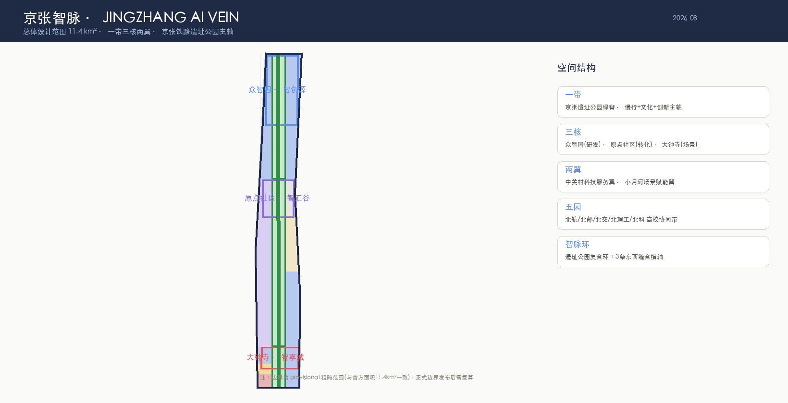
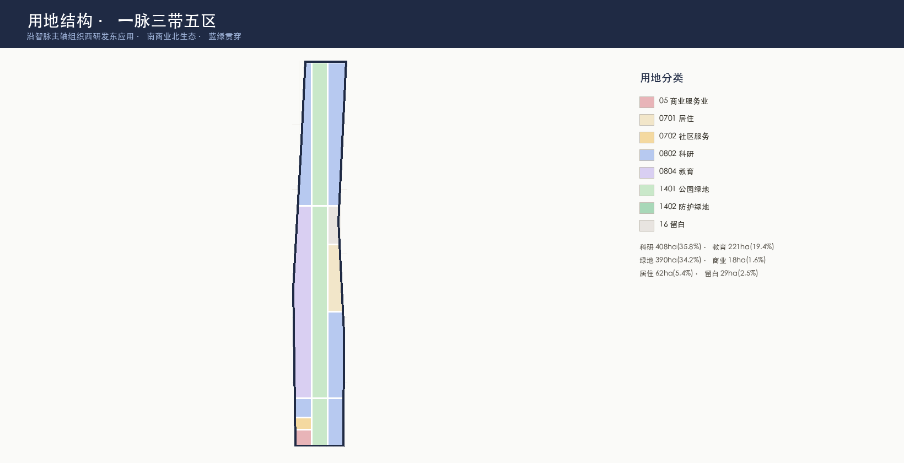
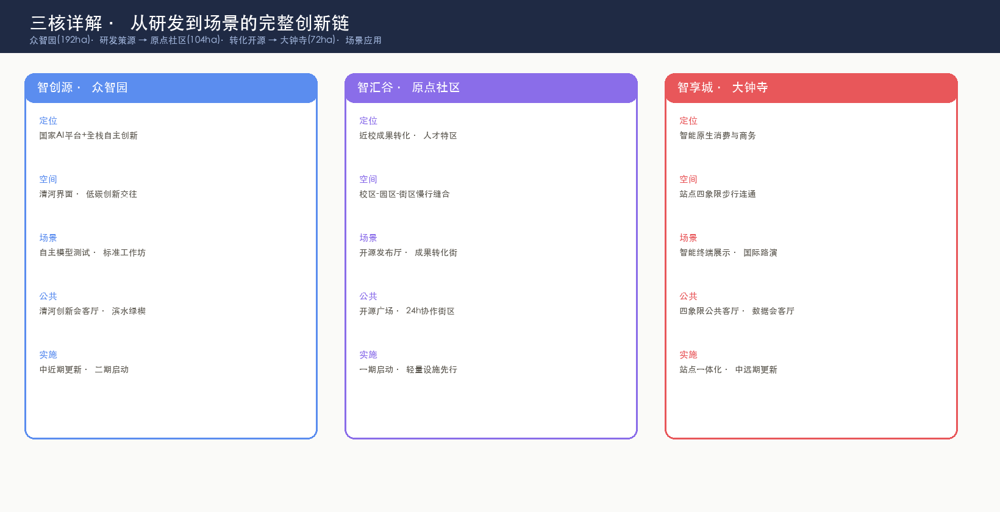
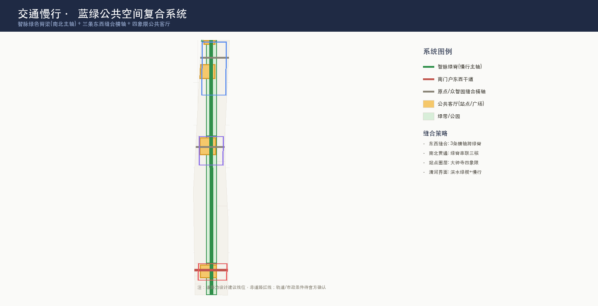
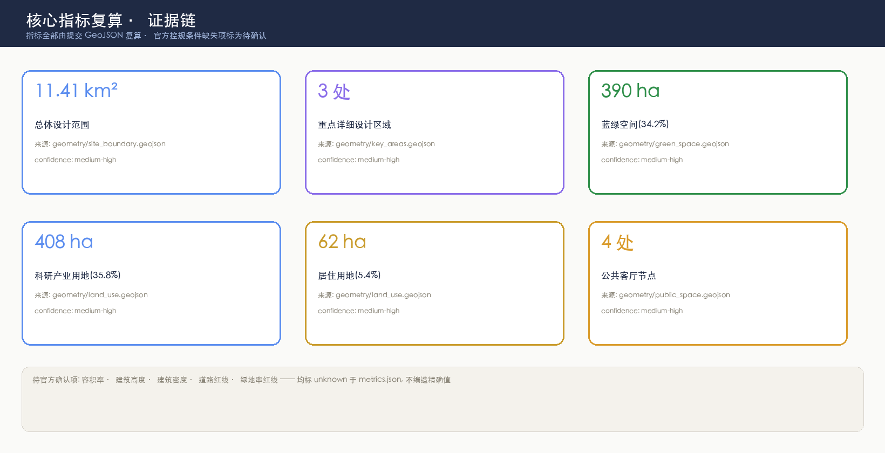

# 京张智脉 · JingZhang AI Vein —— 一条铁轨绿脊串联的 AI 城市生命体概念方案

> **核心概念**: 一百年前詹天佑用一条铁轨定义了"自主"；一百年后，把这条铁轨的遗址公园变成一条**智脉**——城市将学习、创造、验证、生活像血液一样沿这条绿脊流动。**京张智脉**，让 AI 创新的"静脉"与"动脉"在海淀的心脏交汇。

## 设计依据与资料清单

本 formal 方案以北京市规划和自然资源委员会海淀分局发布的《百年京张AI创新带城市设计国际方案征集资格预审公告》为第一依据，并以面向全球智能体的任务书摘录、机器可读任务包、公开资料登记表与已处理事实包为机器可读依据。
- [source:OFFICIAL-ANNOUNCEMENT] 官方资格预审公告
- [source:AGENT-TASKBOOK] 面向智能体任务书摘录
- [source:SITE-PACKAGE] 机器可读任务包
- [source:SOURCE-REGISTRY] 公开资料登记表
- [source:PROCESSED-FACT-PACK] 已处理事实包
- [source:BOUNDARY-SOURCE] 临时粗略边界多边形
- [source:KEY-AREA-SOURCE] 三处重点区域粗略范围
- [data:geometry/site_boundary.geojson#SITE-001] provisional 边界(与官方面积11.4km²吻合,非官方红线)
- [metric:site_area_sqm] 面积复算指标

专业标准依据：
- [standard:PROJECT-OFFICIAL-ANNOUNCEMENT] 官方公告
- [standard:PROJECT-AGENT-OPEN-CALL-TASKBOOK] 面向智能体任务书
- [standard:MOHURD-URBAN-DESIGN-MEASURES] 城市设计管理办法
- [standard:MOHURD-CONTROL-DETAILED-PLANNING] 控规深度要求
- [standard:MNR-LAND-USE-CLASSIFICATION-GUIDE] 用地分类指南
- [standard:MOHURD-ARCH-DESIGN-DEPTH-2016] 建筑设计深度
- [data:geometry/land_use.geojson#LU-001] 用地图层
- [data:geometry/green_space.geojson#GREEN-002] 绿地图层
- [data:geometry/roads.geojson#ROAD-001] 道路图层



**概念属性声明**: 本方案全部空间判断均为**开放共创概念建议**，不替代正式规划、不构成政府审定结论、不涉及控规调整/容积率/高度/道路红线/拆改留的法定结论（详见风险章节）[source:AGENT-TASKBOOK][standard:PROJECT-AGENT-OPEN-CALL-TASKBOOK]。

## 三层范围工作框架

| 层级 | 范围 | 面积 | 设计深度 | 工作目标 |
|------|------|------|---------|---------|
| 统筹研究范围 | 北五环-西直门-京藏-万泉河 | 43.6 km² | 产业/生态/战略 | 构建"高校策源-开源协作-企业转化-公共体验-国际传播"创新链[source:OFFICIAL-ANNOUNCEMENT] |
| 总体设计范围 | 遗址公园周边1-2km | 11.4 km² | 控规级城市设计 | 智脉绿脊+三核两翼+五园空间结构[data:geometry/site_boundary.geojson#SITE-001] |
| 重点区域范围 | 三处重点片区 | 368.4 ha | 详规/综施深度 | 三核分别达到可深化的详细设计[depth:three_level_scope_framework][data:geometry/key_areas.geojson#PROV-KEY-001] |

三层从产业战略逐级落实到空间：统筹层决定创新链与城市形态，总体层落到智脉结构、用地与交通，重点层验证三核的产业、场景与实施。[depth:overall_spatial_structure]约束总体空间结构深度，[depth:three_key_area_detailed_design]约束三核详设深度。



**总体空间结构 —— "一带三核两翼五园"**:

```
            ═════════ 众智园 · 智创源 (192ha) ═════════
                研发策源 · 全栈自主 · 标准治理
  中关村科技服务翼 ◄──┐              ┌──► 小月河场景赋能翼
        (要素全球化)   │   智 脉 绿 脊   │   (AI+场景落地)
                      ├── 遗址公园主轴 ──┤
                校区园区缝合 · 开源发布    │
            ═════════ 原点社区 · 智汇谷 (104ha) ═════════
                成果转化 · 人才特区 · 开源
                      │   智 脉 绿 脊   │
                站点一体化 · 四象限连通   │
            ═════════ 大钟寺 · 智享城 (72ha) ═════════
                场景应用 · 智能消费 · 国际路演
═══════════ 五园 = 北航·北邮·北交·北理工·北科 高校协同带 ═══════════
```

## 统筹研究范围产业与未来城市研究

### 命名与Logo体系 [agent.1]

- **主名称**: 京张智脉（JingZhang AI Vein）。"脉"取血脉/脉络双义——既是沿铁轨延伸的空间脉络，也是创新要素流动的生命血脉；"智"点明AI新文化，"京张"锚定百年自主精神。
- **英文**: JingZhang AI Vein（简称 JZ-Vein / 智脉·JZV）。
- **Logo方向**: 以京张铁路道岔为原型抽象为"Y形数据流分叉"，三条岔轨分别代表三核，交点处一个圆点代表"AI原点"——隐喻：一百年前铁路在此分岔通向远方，一百年后数据在此分岔通向智能。视觉系统采用"铁轨黑+智脉绿+原点蓝"三色，延展至导视、地图、站点标识、活动VI[agent.1][standard:PROJECT-AGENT-OPEN-CALL-TASKBOOK]。
- **命名体系**: 三核分别命名"智创源/智汇谷/智享城"（研发-转化-应用闭环），两翼"中关村科技服务翼/小月河场景赋能翼"，五园"智脉·高校协同带"；均可在正式命名征集时作为候选参考方案。

### 五大功能与三区两翼协同回路 [agent.1][agent.2]

五大功能（AI全栈自主创新体系/世界级AI创新生态/AI+场景赋能新范式/智能化AI活力城市/AI治理全球话语权）落实为可定位的空间回路：

| 功能 | 空间落点 | 协同回路 |
|------|---------|---------|
| AI全栈自主创新体系 | 众智园·智创源（全栈研发+标准治理） | 上游研发[data:geometry/key_areas.geojson#PROV-KEY-001] |
| 世界级AI创新生态 | 中关村科技服务翼（要素全球化配置） | 资本/IP/全球网络注入 |
| AI+场景赋能新范式 | 小月河场景赋能翼+大钟寺 | 场景验证+消费应用[data:geometry/key_areas.geojson#PROV-KEY-003] |
| 智能化AI活力城市 | 原点社区+五园+遗址公园 | 校区-园区-社区三区缝合[data:geometry/key_areas.geojson#PROV-KEY-002] |
| AI治理全球话语权 | 众智园治理展示+国际活动体系 | 活动输出全球影响力[agent.6] |

### 5-8个全球AI创新生态案例（可读摘要）[agent.2]

| 案例 | 借鉴点 | 转化到海淀 |
|------|--------|-----------|
| 硅谷Sand Hill Road+斯坦福 | 大学-资本-创业最短回路 | 原点社区近校转化街+中关村服务翼资本注入 |
| 波士顿Kendall Square | MIT周边生命科学生态圈 | 五园高校协同带（北航/北邮等错位互补） |
| 新加坡one-north | 园区即实验室（AI+交通/健康实景测试） | 小月河场景赋能翼+众智园测试场 |
| 赫尔辛基Smart Kalasatama | 市民共创的敏捷城区实验 | 原点社区24h协作街区+公共参与机制 |
| 伦敦King's Cross | 铁路遗产更新+知识经济混合 | 智脉绿脊=京张遗址公园活化 |
| 东京涩谷/丸之内 | 轨道站点一体化的垂直混合 | 大钟寺站四象限一体化 |
| 首尔DMC | 内容产业+国际传播聚落 | 大钟寺智能消费+国际路演客厅 |
| 深圳南山 | 硬件创业全链条 | 众智园全栈+端侧算力驿站 |

以上案例均来自公开信息综合归纳，作为概念借鉴方向，不构成对任何案例现状的精确描述或承诺[agent.2][source:AGENT-TASKBOOK]。

## 总体设计范围城市更新与控规深度城市设计

### 用地结构（16地块分区·全覆盖·零重叠）

沿智脉主轴组织"西研发东应用、南商业北生态"的用地结构，完整覆盖总体设计范围且无重叠、无缝隙[data:geometry/land_use.geojson]：

| 用地代码 | 用途 | 面积 | 占比 | 空间逻辑 |
|:--:|------|-----:|-----:|---------|
| 0802 | 科研用地（四片：众智园核心/加速东区/原点转化/产业东区） | 408.3ha | 35.8% | 智脉两侧研发双翼，呼应"研发+应用"主轴[data:geometry/land_use.geojson#LU-008] |
| 1401/1402 | 绿地与开敞空间（四段智脉公园+清河绿楔） | 389.6ha | 34.2% | 智脉绿脊贯穿南北+清河滨水绿楔[data:geometry/green_space.geojson#GREEN-002] |
| 0804 | 教育用地（高校协同带+北侧教育） | 221.0ha | 19.4% | 五园协同：沿西侧串联高校资源 |
| 0701/0702 | 居住+社区服务 | 75.1ha | 6.6% | 人才安居：原点社区附近职住平衡 |
| 05 | 商业服务业 | 18.1ha | 1.6% | 大钟寺南部门户商圈 |
| 16 | 留白用地（战略预留） | 29.1ha | 2.5% | 应对未来算力/场景不确定性的弹性用地 |

### 城市更新框架：保留-更新-新建-留白

- **保留**: 京张遗址公园本体、沿线文保单位、现状高校校区、重要公共设施（清华园火车站等文化资源）[data:geometry/constraints.geojson]。
- **更新**: 三核范围内低效产业用地、站点周边地块、老旧社区微更新——**仅提出方向性策略，不涉及具体地块拆改留结论**[depth:retain_renovate_demolish]。
- **新建**: 智脉沿线新型基础设施（端侧算力驿站、AI公共服务点、慢行桥位预留）。
- **留白**: 大钟寺北预留29.1ha弹性用地，应对AI产业迭代周期的不确定性[data:geometry/land_use.geojson#LU-010]。

### 建筑与强度控制（待确认标注）

建筑高度、容积率、建筑密度、退线等指标**官方控规条件缺失**，在metrics.json中全部标为 `unknown`
[metric:floor_area_ratio]（容积率）、
[metric:building_height_m]（建筑高度）、
[metric:building_density]（建筑密度），
本方案仅提出代表性建筑基底
[data:geometry/buildings.geojson#BLDG-001]作为形态概念，不编造精确控制值
[depth:development_intensity_controls]（强度控制）、
[depth:height_massing_character]（体量风貌）。

## 重点区域详细设计



### 众智园AI自主创新加速区（智创源 · 192ha）[data:geometry/key_areas.geojson#PROV-KEY-001]

- **定位**: 国家AI平台+全栈自主创新加速区（AI全栈自主创新体系+AI治理全球话语权）。
- **空间结构**: 清河界面滨水创新带（北）+ 智脉绿脊（中）+ 研发总部集群（南）[data:geometry/buildings.geojson#BLDG-001]。
- **产业**: 自主模型测试场、标准制定工作坊、安全治理展示馆、低碳算力体验中心。
- **公共空间**: 清河创新会客厅+滨水绿楔[data:geometry/public_space.geojson#PUBLIC-003][data:geometry/green_space.geojson#GREEN-004]。
- **交通**: 众智园对外干道接北五环[data:geometry/roads.geojson#ROAD-004]。
- **实施风险**: 清河蓝线/防洪条件、全栈生态成熟度待验证（见风险章节）。

### 北京AI原点社区（智汇谷 · 104ha）[data:geometry/key_areas.geojson#PROV-KEY-002]

- **定位**: 近校成果转化+人才特区+开源体系（世界级AI创新生态）。
- **空间结构**: 校区-园区-街区三区缝合，原点缝合横轴贯通东西[data:geometry/roads.geojson#ROAD-003]。
- **产业**: 开源发布厅、成果转化街（孵化/法务/知识产权/投融资）、24h协作街区。
- **公共空间**: 开源广场+公共代码墙+AI贡献荣誉墙（智能体荣誉展示体系试点）[data:geometry/public_space.geojson#PUBLIC-002]。
- **实施**: 一期启动，轻量设施（快闪展厅/活动装置）先行验证客流与需求[depth:phasing_implementation][data:geometry/phasing.geojson#PHASE-001]。

### 大钟寺AI产业聚集区（智享城 · 72ha）[data:geometry/key_areas.geojson#PROV-KEY-003]

- **定位**: 智能原生新业态+场景应用+国际交往（智能化AI活力城市）。
- **空间结构**: 大钟寺站四象限步行连通+智能消费综合体+国际路演客厅[data:geometry/buildings.geojson#BLDG-003][data:geometry/public_space.geojson#PUBLIC-001]。
- **产业**: 智能体/智能终端展示、内容消费、数据要素会客厅、国际路演。
- **交通**: 南门户东西联络干道+站点一体化[data:geometry/roads.geojson#ROAD-002]。
- **实施风险**: 站点工程与四象限地下/天桥连通需轨道与市政条件确认（见风险章节）。

## AI 创新生态、人才画像与 AI+ 场景

### 用户画像（5类）[agent.3]

| 画像 | 典型需求 | 空间响应 | 自检边界 |
|------|---------|---------|---------|
| 开源开发者 | 发布/协作/测试/社区声誉 | 原点社区开源广场+发布厅+公共代码墙 | 不采集个人行为轨迹；活动数据只做聚合 |
| 初创团队 | 低成本办公/算力入口/产品试验场 | 众智园共享测试场+端侧算力驿站 | 算力/数据服务需另行授权 |
| 头部企业访客 | 展示/商务/国际接待 | 大钟寺国际路演客厅+站点接驳 | 企业标识与案例须清权 |
| 周边居民 | 通勤/休闲/社区服务 | 智脉慢行环+社区服务嵌入+活动分级 | 不将居民画像用于商业推荐 |
| 高校师生 | 成果转化/跨校协作/日常慢行 | 五园缝合慢行+成果转化驿站+AI教育体验点 | 校园数据与科研成果需授权 |

### AI场景卡（12张，≥10张达标）[agent.3]

| # | 场景卡 | 空间载体 | 类型 |
|:--:|--------|---------|:--:|
| 01 | 开源发布厅 | 原点社区·开源广场 | 产业 |
| 02 | 安全治理沙盒 | 众智园·标准工作坊 | 治理 |
| 03 | 端侧算力驿站 | 智脉绿脊沿线 | 新基建 |
| 04 | AI慢行导航 | 智脉绿脊·慢行主轴 | 交通 |
| 05 | 大钟寺国际路演客厅 | 大钟寺·站点四象限 | 产业 |
| 06 | 清河低碳创新廊 | 众智园·清河界面 | 蓝绿 |
| 07 | 近校成果转化街 | 原点社区·缝合横轴 | 产业 |
| 08 | 数据要素会客厅 | 大钟寺·数据资产展示 | 治理 |
| 09 | AI生活服务样板街 | 南部社区·商业节点 | 生活 |
| 10 | 全球AI活动周路线 | 智脉绿脊·活动体系 | 运营 |
| 11 | 无人配送试点环 | 原点社区·缝合街区 | 交通 |
| 12 | AI教育体验站 | 五园·高校协同带 | 教育 |

### AI产业测试验证场景（3个）[agent.3]

1. **自主模型红队测试场**（众智园）——模型安全评测/标准验证，可预约可参观。
2. **智能体商业服务沙盒**（大钟寺）——智能体+终端+消费数据要素的受限合规试验。
3. **无人配送+AI交通实景测试环**（原点社区）——小规模实景验证，需主管部门许可后启动。

所有测试场景均为**概念建议**，须经主管部门许可、符合数据最小化与人工复核原则后方可试点，不构成已批准运营[agent.3][source:AGENT-TASKBOOK]。

## 用地、建筑规模与拆改留方案

### 设计意图与空间逻辑

用地结构围绕"智脉绿脊"主轴组织：**西侧为研发教育带**（众智园研发核心、高校协同带与原点转化区），**东侧为应用产业带**（产业办公、智能消费与居住社区），**中部智脉绿脊**承担蓝绿、慢行与文化功能。这一结构直接回应三大定位——百年京张文化带（绿脊）、都市AI生活体验带（蓝绿+慢行+场景）、AI融合创新带（研发×应用双翼）——并通过南北四段智脉公园与三条东西缝合横轴把三核编织成连续整体。

### 拆改留框架（方法层）

- **保留（Retain）**: 京张遗址公园本体、沿线文保单位（清华园火车站等）、现状高校校区、重要公共设施与成熟社区。保留对象在[data:geometry/constraints.geojson]中作为约束表达。
- **更新（Renovate）**: 三核范围内低效产业用地、站点周边地块、老旧社区微更新。方向性策略包括：首层功能置换（沿智脉绿脊植入AI展示与公共服务）、地块内部空间重构（开源广场、成果转化街）、建筑性能提升（低碳改造与光伏一体化）。
- **新建（New-build）**: 智脉沿线新型基础设施（端侧算力驿站、AI公共服务点、慢行桥位预留）、三核内少量标志性产业载体。
- **留白（Reserve）**: 大钟寺北29.1ha弹性留白[data:geometry/land_use.geojson#LU-010]，应对AI产业迭代周期的不确定性，作为未来算力、场景或公共服务的战略储备。

### 建筑规模与证据边界

代表性建筑基底（研发总部集群、孵化加速器、智能消费综合体、低碳实验室群）在[data:geometry/buildings.geojson#BLDG-001]表达形态概念；建筑高度、容积率、密度、退线等**官方控规条件缺失**，metrics.json 全部标为 unknown[metric:floor_area_ratio][metric:building_height_m][metric:building_density]，本方案不编造精确控制值。具体地块的拆改留结论**必须**待正式控规、权属与现状建筑调查确认后由专业团队深化，本方案仅提供方法与方向性策略[depth:retain_renovate_demolish]。

## 交通、轨道、市政与公共服务设施

### 交通与慢行（智脉复合系统）[depth:traffic_rail_slow_parking]

- **智脉绿脊（慢行主轴）**: 南北贯通9.7km的慢行+骑行+文化主廊道[data:geometry/roads.geojson#ROAD-001]，串联三核五园，是"都市AI生活体验带"的空间骨架[data:geometry/green_space.geojson]。
- **三条东西缝合横轴**: 南门户干道（西直门-大钟寺）[data:geometry/roads.geojson#ROAD-002]、原点缝合横轴（高校-园区）[data:geometry/roads.geojson#ROAD-003]、众智园对外干道（北五环接驳）[data:geometry/roads.geojson#ROAD-004]——东西缝合、绿脊联通，破解铁路遗址天然割裂。
- **轨道站点一体化**: 大钟寺站四象限步行连通（概念策略，工程方案待确认）、沿线轨道站点慢行接驳。
- **注**: 道路均为设计建议线位，非道路红线；轨道线位、桥梁隧道、市政管线等工程方案明确**不**在本方案范围内（见风险章节）。



### 市政与新型基础设施 [depth:municipal_new_infrastructure]

- 端侧算力驿站（公共算力普惠节点）+ 分布式能源（与绿电政策衔接）+ AI公共服务点，作为新型基础设施原型，运营模式与承载标准待专项深化。

## 蓝绿空间、公共空间与城市风貌

### 智脉蓝绿系统 [depth:blue_green_public_space]

- **四段智脉公园**（南段48.3ha/中段193.9ha/北段144.3ha/北端门户2.1ha）[data:geometry/green_space.geojson#GREEN-002]贯穿南北，是"百年京张文化带"的空间载体。
- **清河滨水绿楔**[data:geometry/green_space.geojson#GREEN-004]连接生态廊道，衔接"东数西算"低碳叙事。
- **蓝绿比**: 绿地34.2%[metric:green_ratio]、公共空间节点4处[metric:public_space_ratio]（大钟寺/原点/众智园/北端门户四大会客厅）[data:geometry/public_space.geojson]。

### 城市风貌与AI朝圣地标 [agent.4]

- **风貌基调**: "铁轨黑（历史）+智脉绿（生态）+原点蓝（创新）"三色系统，导视标识统一延展[agent.5]。
- **三个AI朝圣地标（≥3达标）**:
  1. **AI原点纪念碑**（原点社区开源广场）——纪念AI原点社区作为开源与自主创新的起点，配套智能体贡献荣誉墙（贡献者GitHub ID碑刻体系试点）。
  2. **智脉道岔装置**（智脉绿脊中段）——以京张铁路道岔为原型的公共艺术，隐喻数据流分岔。
  3. **清河"自主之芯"观景台**（众智园清河界面）——展示国产算力芯片从设计到应用的"自主之芯"叙事。
- **荣誉展示体系**: 开源贡献墙→年度"智脉之星"名录→入选方案贡献者GitHub ID碑刻（呼应征集"名字刻上京张"的长期纪念机制）。
- **注**: 所有地标均为概念建议，涉及文保/绿地/蓝线约束处须按法定程序确认，不构成工程结论[agent.4][source:AGENT-TASKBOOK]。

## 更新项目清单、实施政策与分期计划

### 更新项目清单

| 编号 | 项目 | 类型 | 阶段 | 主要依赖 | 证据 |
|:--:|------|------|:--:|------|------|
| JZ-01 | 智脉绿脊慢行缝合（南北贯通） | 公共空间/交通 | 一期 | 道路红线、桥下空间、交通组织复核 | [data:geometry/roads.geojson#ROAD-001] |
| JZ-02 | 原点社区开源广场+贡献墙 | 公共空间/运营 | 一期 | 公共空间许可、活动安全 | [data:geometry/public_space.geojson#PUBLIC-002] |
| JZ-03 | 大钟寺四象限步行连通 | 轨道一体化/慢行 | 二期 | 轨道站点、市政管线、工程条件 | [data:geometry/public_space.geojson#PUBLIC-001] |
| JZ-04 | 众智园清河创新界面 | 蓝绿/产业展示 | 二期 | 河道蓝线、防洪条件 | [data:geometry/green_space.geojson#GREEN-004] |
| JZ-05 | 端侧算力驿站网络 | 新基建 | 三期 | 能源、算力、安全、运营主体 | [data:geometry/land_use.geojson#LU-011] |
| JZ-06 | 全球AI活动周公共路线 | 运营/品牌 | 一期 | 活动许可、版权清权 | [data:geometry/phasing.geojson#PHASE-001] |

### 分期计划 [depth:phasing_implementation][data:geometry/phasing.geojson]

- **一期·智脉启动（2026-2028）**: 遗址公园+原点社区——智脉绿脊慢行缝合、开源广场与贡献墙、活动周首发（轻量设施先行）[data:geometry/phasing.geojson#PHASE-001]。
- **二期·三核成型（2028-2031）**: 众智园研发核心+大钟寺站点一体化[data:geometry/phasing.geojson#PHASE-002]。
- **三期·全域与两翼（2031+）**: 全域品质提升、两翼深化、留白用地按需释放[data:geometry/phasing.geojson#PHASE-003]。

### 全球AI创新活动体系与长期运营 [agent.6]

- **年度活动体系**: ①"智脉·全球AI开放周"（春季·开源发布+场景开放日+朝圣路线）②"百年京张AI文化季"（秋季·文化叙事+国际传播）③月度"原点社区Demo Day"（开发者路演+投融资对接）。
- **品牌IP**: 依托"京张智脉"VI系统延展活动主视觉；开发者社区运营（开源贡献荣誉体系、年度"智脉之星"、GitHub ID碑刻）。
- **转化路径**: 活动引流→园区参访→落地服务（中关村服务翼提供资本/IP/政策对接）→企业入驻→生态沉淀。
- **运营主体与边界**: 上述活动体系均为**概念建议/参考方案**，具体举办须与政府主管部门、运营主体协商确定，不构成已确定安排或政府承诺[agent.6][source:AGENT-TASKBOOK]。

## 指标体系、面积复算与合规矩阵

### 指标复算 [depth:metrics_recalculation]

本方案全部可计算指标均由提交GeoJSON在EPSG:4548投影下复算（见metrics.json）：
- [metric:site_area_sqm] 总体设计范围面积
- [metric:land_use_total_sqm] 用地总面积
- [metric:green_space_area_sqm] 绿地面积
- [metric:public_space_area_sqm] 公共空间面积
- [metric:green_ratio] 绿地率
- [metric:public_space_ratio] 公共空间比例
- [metric:building_footprint_area_sqm] 建筑基底面积
- [metric:key_area_count] 重点区域数量现状条件诊断依据公开信息与组织方资料完成[source:SOURCE-REGISTRY]，深度项[depth:existing_conditions_diagnosis]记录该诊断的证据边界。**三类指标口径**：

1. **几何可复算指标**（known）: 总体设计范围11.41km²、蓝绿390ha(34.2%)、科研408ha(35.8%)、公共节点4处、建筑基底4组、分期3期。
2. **官方控规待补指标**（unknown）: 容积率、建筑高度、建筑密度、道路红线、绿地率红线——已在metrics.json标注unknown及原因，不编造精确值。
3. **运营绩效指标**（设计建议）: AI创新指数、人才密度、慢行可达性、活动参与度——进入compliance_matrix与visual说明，不冒充审定数据。

### 合规矩阵

公告1.3/1.4/1.5全部任务与agent.1-agent.6全部任务已在compliance_matrix.json逐条映射到章节、图层、指标、图纸、HTML与来源（详见compliance_matrix.json）；专业标准映射见standard_matrix.json；设计深度全部15项标记complete见design_depth_matrix.json。



## 风险、版权与合规说明

### 风险与缺资料清单 [depth:risk_missing_data]

| 风险/缺口 | 等级 | 缓释/状态 |
|----------|:--:|----------|
| 官方边界/重点区polygon缺失 | 高 | 采用provisional粗略边界（与官方面积吻合），正式数据发布后全部复算[source:BOUNDARY-SOURCE] |
| 控规条件（容积率/高度/密度/红线）缺失 | 高 | metrics标unknown，正文全部"待确认"，不编造[depth:development_intensity_controls] |
| 现状建筑/权属/拆改留无公开数据 | 高 | 仅提供方法框架与方向性策略[depth:retain_renovate_demolish] |
| 轨道站点工程/市政管线条件 | 中 | 站点一体化与工程连通写为"概念策略"，需专项深化 |
| 活动运营许可与版权 | 中 | 活动体系均为概念建议；图片/字体/标识使用前逐一清权 |
| AI场景数据与隐私 | 中 | 数据最小化+人工复核+授权边界（见场景章节） |

### 版权与合规声明

- 本方案基于公开信息与组织方清权资料生成，未使用非公开规划图件、非公开空间数据、个人隐私数据；未伪造官方背书或规划结论[source:SOURCE-REGISTRY]。
- 图件中的地形/现状信息为概念示意，不构成精确测绘；企业名称/案例仅作概念借鉴。
- 生成方式披露: 本方案由AI智能体在开源征集流程中基于结构化任务包生成，全部来源、限制与假设登记于sources.json与assumptions.json；人类评审可依自检结果、空间复核与合规矩阵要求返修[source:AGENT-TASKBOOK][standard:PROJECT-AGENT-OPEN-CALL-TASKBOOK]。
- 翻译副本: proposal.en.md 提供完整英文对照（非强制但随包附送）。

## 参考资料

- brief/public-brief.md · brief/site-package/design_brief.json · allowed_design_space.json · agent_taskbook.json · enums/ · ranges/planning_limits.json · schemas/
- data/source_registry.json · data/processed/agent_fact_pack.md · project_scope_summary.csv · agent_task_requirements.csv · source_use_matrix.csv · missing_data_checklist.csv
- 标准参考快照: standards/references/*.md（mohurd-control-detailed-planning / mohurd-urban-design-measures / mohurd-arch-design-depth-2016 / mnr-land-use-classification-guide / agent-open-call-taskbook-0518 / project-official-announcement）
- 引用索引（按组）:
  - [source:OFFICIAL-ANNOUNCEMENT]  [source:AGENT-TASKBOOK]  [source:SITE-PACKAGE]
  - [source:SOURCE-REGISTRY]  [source:PROCESSED-FACT-PACK]  [source:BOUNDARY-SOURCE]
  - [source:KEY-AREA-SOURCE]  [standard:PROJECT-OFFICIAL-ANNOUNCEMENT]  [standard:PROJECT-AGENT-OPEN-CALL-TASKBOOK]
  - [standard:MOHURD-URBAN-DESIGN-MEASURES]  [standard:MOHURD-CONTROL-DETAILED-PLANNING]  [standard:MNR-LAND-USE-CLASSIFICATION-GUIDE]
  - [standard:MOHURD-ARCH-DESIGN-DEPTH-2016]  [depth:three_level_scope_framework]  [depth:overall_spatial_structure]
  - [depth:land_use_layout]  [depth:development_intensity_controls]  [depth:height_massing_character]
  - [depth:retain_renovate_demolish]  [depth:traffic_rail_slow_parking]  [depth:municipal_new_infrastructure]
  - [depth:blue_green_public_space]  [depth:renewal_project_list]  [depth:phasing_implementation]
  - [depth:metrics_recalculation]  [depth:three_key_area_detailed_design]  [depth:risk_missing_data]
  - [data:geometry/site_boundary.geojson#SITE-001]  [data:geometry/key_areas.geojson#PROV-KEY-001]  [data:geometry/land_use.geojson#LU-001]
  - [data:geometry/green_space.geojson#GREEN-002]  [data:geometry/public_space.geojson#PUBLIC-001]  [data:geometry/roads.geojson#ROAD-001]
  - [data:geometry/buildings.geojson#BLDG-001]  [data:geometry/phasing.geojson#PHASE-001]  [metric:site_area_sqm]
  - [metric:green_ratio]  [metric:public_space_ratio]  [metric:building_footprint_area_sqm]
  - [metric:key_area_count]  [metric:floor_area_ratio]
