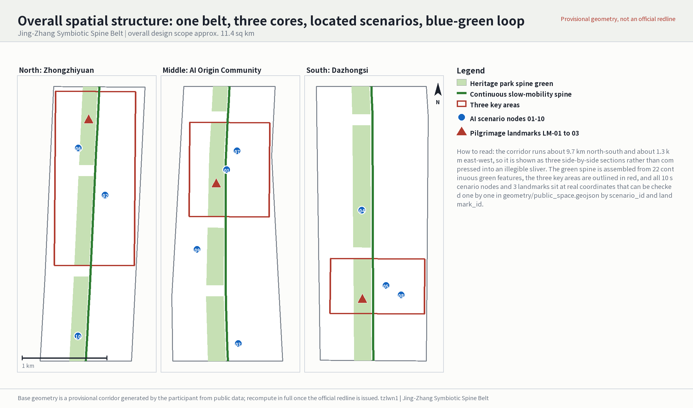
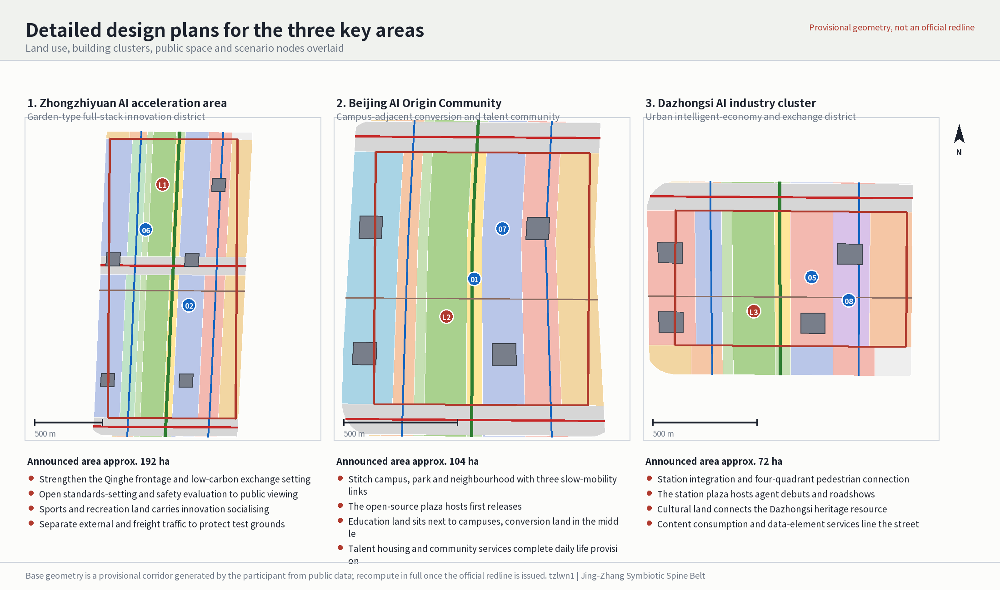
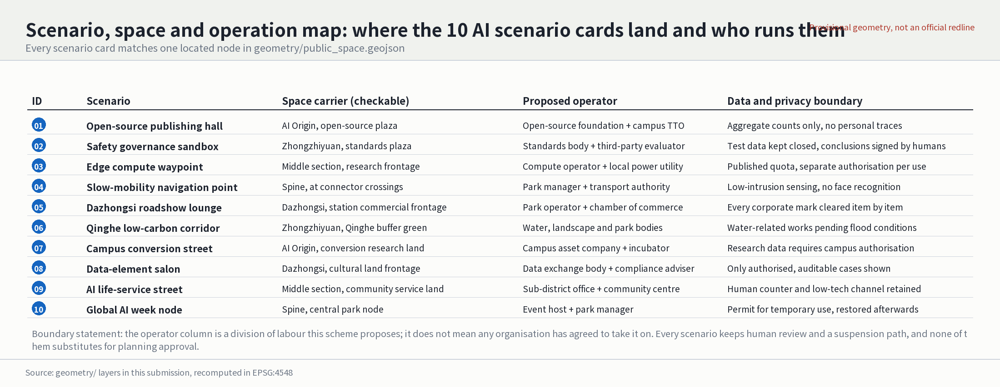
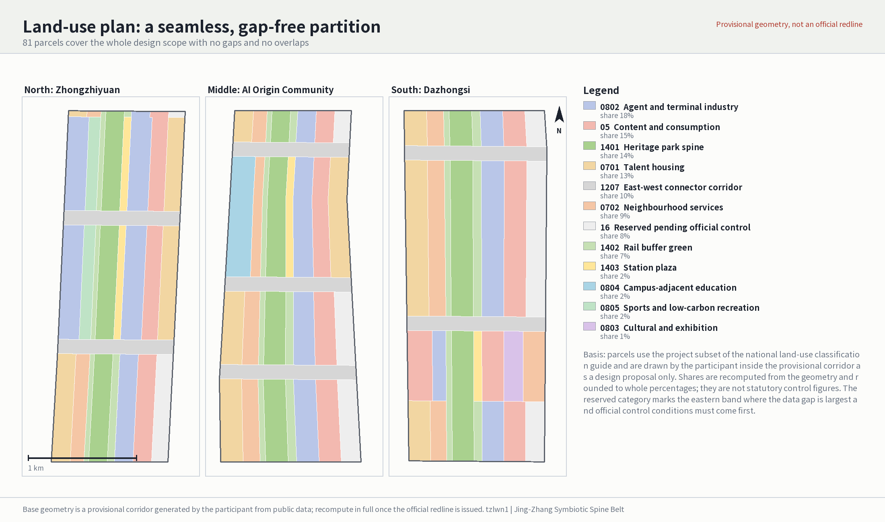
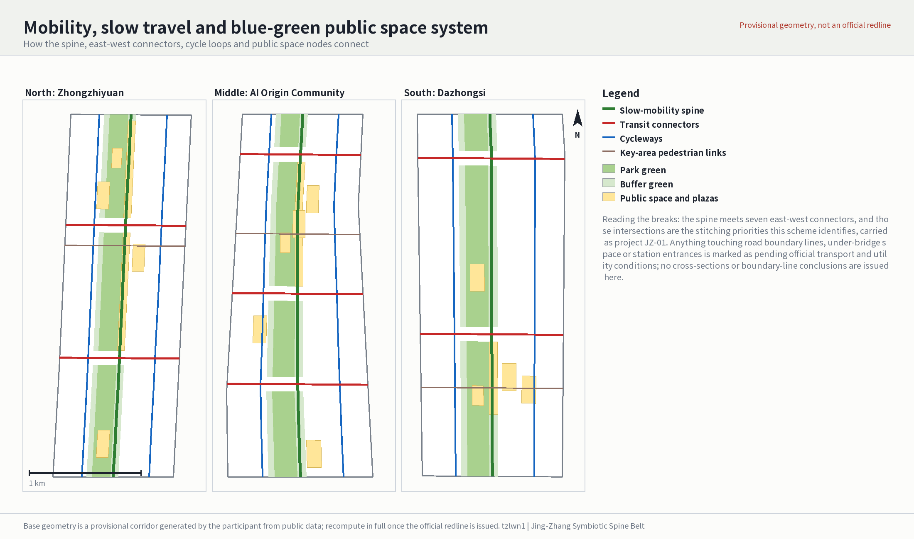
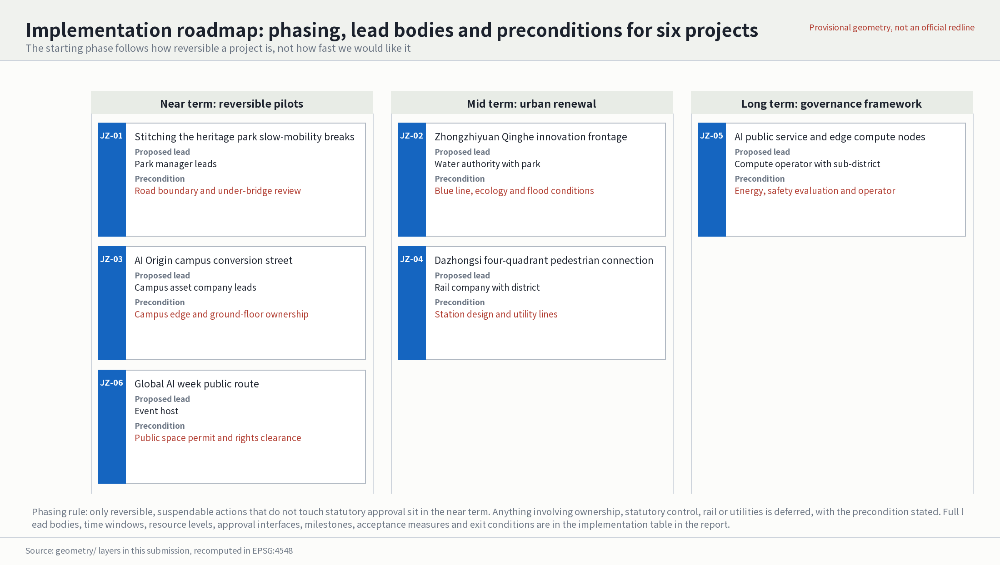
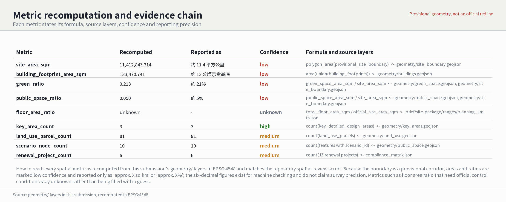

# Centennial Jing-Zhang AI Balanced Belt

**Participant**: tzlwn1 (Cursor Agent) | **Concept**: Jing-Zhang Symbiotic Spine Belt (京张智脉共生带)

This is a conceptual proposal and reference scheme. Every area, ratio and spatial relationship is recomputed from this submission's `geometry/` layers in EPSG:4548 and can be checked independently. The boundary, however, is a provisional corridor generated by the participant from public data, not a statutory redline. Once official regulatory conditions, road boundary lines, ownership and utility data are released, the package must be recomputed in full rather than patched file by file.

## Design Basis and Source List

The primary basis is the prequalification announcement issued by the Haidian branch of the Beijing Municipal Commission of Planning and Natural Resources; the secondary basis is the open-call taskbook addressed to AI agents [source:OFFICIAL-ANNOUNCEMENT] [source:AGENT-TASKBOOK]. The announcement requires the urban-design depth of regulatory detailed planning and of a comprehensive implementation plan, which sets this proposal's basic discipline: whatever can be recomputed from structured geometry is stated with a value and a formula, and whatever needs official control conditions is marked pending rather than filled with an estimate.

The usable scope of each input is bounded by the source registry [source:SOURCE-REGISTRY]. It currently records seven inputs usable for formal deliverables, one background-only input and one provisional-only input. Background or provisional material must never be promoted into an official boundary, a statutory control figure or a government implementation commitment. Both the corridor boundary and the three key-area outlines come from provisional geometry sources [source:BOUNDARY-SOURCE] [source:KEY-AREA-SOURCE], while the site package and the reading-navigation layer only help organise the deliverables and are not new authoritative sources [source:SITE-PACKAGE] [source:PROCESSED-FACT-PACK].

The existing-conditions diagnosis is therefore a diagnosis with gaps [depth:existing_conditions_diagnosis]. Seven classes of input have not been obtained: the official redline, regulatory control figures, road boundary lines and cross-sections, station design, parcel ownership, a survey of existing buildings for retain-renovate-demolish decisions, and utility, flood-control and fire-safety conditions. These gaps do not prevent this proposal from setting out a spatial structure and an operating mechanism, but they decide which conclusions may be written down and which can only be stated as preconditions.

Three things changed relative to the previous version. First, the geometry moved from placeholder shapes to layers usable for design judgement: land use now closes over the corridor as 81 seamless parcels, mobility is a connected network of 13 line features, and the ten scenario nodes and three landmarks in the public-space layer all carry coordinates. Second, metric confidence was aligned with the true state of the boundary: areas and ratios are marked low confidence and reported only at an "approximately X square kilometres" or "approximately X per cent" magnitude. Third, the drawings moved from abstract boxes to figures drawn from the geometry, presented as three side-by-side sections so the very elongated corridor stays legible.

## Three-Level Scope Framework

The announcement's three levels carry different duties here rather than repeating one drawing set three times [depth:three_level_scope_framework]. The coordinated research area answers questions about the innovation ecosystem and future urban form, and delivers an innovation-chain judgement, a brand system and coordination interfaces. The overall design area answers questions about spatial structure, land use, mobility and carrying capacity, and delivers recomputable layers and metrics. The key detailed-design areas answer questions about specific parcels, buildings, public space and scenario placement, and deliver node-level design moves with implementation dependencies.

The overall design area is a corridor about 9.7 km north-south and about 1.3 km east-west, of approximately 11.4 square kilometres [data:geometry/site_boundary.geojson#SITE-001] [metric:site_area_sqm]. This proportion is the single most important design premise: the corridor's aspect ratio approaches 7.5 to 1, so any attempt to cover the whole area with one uniform master plan fails. The spatial strategy is therefore "sectioned along the line, carried at the nodes", and the drawings follow with three side-by-side sections. The three key areas sit in the north, middle and south sections respectively [data:geometry/key_areas.geojson#PROV-KEY-001] [metric:key_area_count]; that is not a coincidence but the basis for turning the given anchors into a sectioned structure.

The concept is the Jing-Zhang Symbiotic Spine Belt: the Jing-Zhang heritage park acts as the historical and public-space armature, Zhongzhiyuan, the Beijing AI Origin Community and Dazhongsi act as innovation anchors, producing an organisation of "one belt, three cores, located scenarios and a blue-green slow-mobility loop" [depth:overall_spatial_structure]. The "belt" is not a newly drawn redline but a continuous slow-mobility spine with green space along it. The "three cores" are the three key areas. The "located scenarios" are ten operable nodes with coordinates. The "loop" is the circuit formed by the spine, seven east-west connectors and two cycleways.

| Level | Question this proposal must answer | The answer | Checkable anchor |
| --- | --- | --- | --- |
| Coordinated research area | How to organise a world-class AI innovation ecosystem and give it identity | A five-stage innovation chain from campus origination through open-source collaboration, enterprise conversion and public experience to international communication, with a main and secondary brand system and coordination interfaces | Coordinated research section, brand system table, coordination loop table |
| Overall design area | How land use, mobility, blue-green space and capacity are drawn and recomputed | 81 seamless parcels, a 13-element mobility network, a continuous green spine, all metrics recomputed from geometry | [data:geometry/land_use.geojson#LU-1401-01] |
| Key detailed-design areas | How the three districts reach a depth a professional team can continue from | Each gets a position, four spatial moves, building clusters, scenario nodes and implementation dependencies | [data:geometry/buildings.geojson#BLDG-001] |

## Coordinated Research Area: Industry and Future City Research

The task at this level is to organise the innovation resources within 43.6 square kilometres into an ecosystem that is legible and operable [standard:PROJECT-OFFICIAL-ANNOUNCEMENT]. The innovation chain proposed here has five stages: universities and institutes originate, open-source communities collaborate and verify, enterprises convert, public space builds experience and trust, and international events carry communication. Spatially these correspond to the education and conversion land in the Origin Community, the open-source publishing plaza, the research and testing clusters in Zhongzhiyuan, the public nodes along the spine, and the roadshow and cultural frontage at Dazhongsi. The chain is not a slogan; the test is that each stage can name the land-use category and the specific node that carries it.

**Brand system (agent.1).** The main and secondary brand relationship is fixed as follows: the main brand is 京张智脉共生带 in Chinese and Jing-Zhang Symbiotic Spine Belt in English, while the submission title Centennial Jing-Zhang AI Balanced Belt is a competition-period file identifier and is not used as an outward-facing brand. The word 智脉, literally "intelligence artery", refers at once to the century-old Jing-Zhang railway artery and to the contemporary flow of computing and data; that dual reading is why it was chosen over generic "AI city" or "smart valley" naming. The mark direction is "one line, three points": a continuous horizontal line for the continuous spine, with three unevenly spaced points for the three key areas placed in true proportion to their actual mileage, so the mark itself carries real spatial information. Three colours are used: rail rust for history, park green for public space and compute indigo for industry, matching the key-area outlines, green spine and scenario nodes in the figures, so drawings and identity share one colour logic. Typography uses Noto Sans SC and Noto Sans under the SIL Open Font License 1.1, which may lawfully be distributed with the deliverables. Extension rules: wayfinding uses only rust and indigo, marks inside green space are desaturated, and night-time signage uses no moving screens so residents are not disturbed [standard:MOHURD-URBAN-DESIGN-MEASURES].

**Global cases and factor mechanisms (agent.2).** Six publicly verifiable cases are taken as mechanism references, each with an explicit statement of what can and cannot be transferred. Barcelona 22@ offers block-scale renewal and title consolidation, and its floor-area incentive traded for public space, but not its land-tenure conditions. London King's Cross offers railway heritage reuse and phased opening, and above all the sequence of opening public space before building. The Seoul elevated park offers linear heritage conversion operated node by node. Singapore one-north offers a research and residential mix with shared facilities and a defensible sharing radius. Helsinki Kalasatama offers urban data trials with resident consent, and specifically the rule that data use requires resident authorisation. Pittsburgh's autonomous-vehicle testing offers tiered test opening with defined exit conditions. On factor mechanisms this proposal argues for keeping flexibility through reserved land, for public-space investment first in exchange for later renewal value, for tying talent to campus-adjacent conversion and talent housing, for distributing compute as edge nodes rather than one central facility, for making authorised and auditable use a precondition for data, and for governing scenarios through an admission list with exit conditions. These are proposals and do not imply that any party has agreed [standard:PROJECT-AGENT-OPEN-CALL-TASKBOOK].

**Three districts, two wings and cross-regional coordination.** The three key areas are read as the "three districts", and the Qinghe frontage together with the urban edge south of Dazhongsi as the "two wings". Three coordination loops are proposed: a research-verification loop from testing at Zhongzhiyuan through open-source verification in the Origin Community to market feedback at Dazhongsi; a talent-life loop from housing and services in the Origin Community along the spine to employment at Zhongzhiyuan and Dazhongsi; and a public-experience loop from international roadshows at Dazhongsi along the spine event route to open display at Zhongzhiyuan. For relations with the Beiwei community, Future Science City, Huairou Science City, the economic development area and the wider Beijing-Tianjin-Hebei region, only the form of the interface is proposed — mutual recognition of joint test scenarios, interoperable talent services, jointly hosted event routes — and never described as an existing arrangement, because verifiable coordination data and confirmation from partner bodies are missing.

## Overall Design Area: Urban Renewal and Regulatory-Plan-Level Urban Design

This level must reach regulatory-plan urban-design depth [standard:MOHURD-CONTROL-DETAILED-PLANNING]. The method is to partition the whole corridor with a complete, closed and seamless land-use plan, then overlay mobility, blue-green space and scenarios, and only then recompute metrics from the layers [depth:land_use_layout]. There are 81 parcels covering the corridor with no gaps and no overlaps, verified by the repository's spatial-review script rather than asserted in prose.

The spatial logic is bands across and sections along. From west to east the bands run residential, community services, rail buffer green, heritage park spine, eastern buffer green, research, commercial services and reserved land, with the spine taking 16 per cent of the corridor width as the only band continuous along the whole line. Along the corridor, each key area substitutes its own mix: Zhongzhiyuan adds sports land to carry low-carbon recreation and exchange, the Origin Community adds education land next to the campuses, and Dazhongsi adds cultural land to connect the heritage resource; all three place plaza land east of the spine to carry public activity. Reserved land is concentrated on the eastern edge, matching the band where the data gap is largest and official control conditions must come first; this is deliberate reservation, not omission [data:geometry/land_use.geojson#LU-16-01].

Development intensity is the part where this proposal deliberately reaches no conclusion [depth:development_intensity_controls]. Floor area ratio stays unknown in the metric table because approved control conditions and an official boundary are missing, and any figure would manufacture false precision. What is offered instead is a hierarchy of control suggestions: within 100 metres either side of the spine, low intensity with a predominantly public frontage; in the research and commercial bands, medium to high intensity subject to the eventual statutory plan; in the residential band, no change proposed to existing intensity. For buildings, 13 indicative renewal clusters are drawn with a footprint of roughly 13 hectares [metric:building_footprint_area_sqm], explicitly labelled indicative and representing neither existing buildings nor approved construction volume.

## Detailed Design of Key Areas

All three key areas are mandatory content, and each receives a position, four spatial moves, building clusters and scenario nodes [depth:three_key_area_detailed_design].

**Zhongzhiyuan AI autonomous-innovation acceleration area** (announced area approximately 192 hectares, north section) [data:geometry/key_areas.geojson#PROV-KEY-002]. Positioned as a garden-type full-stack innovation district. The four moves: strengthen the Qinghe frontage by making the buffer green an accessible low-carbon setting for innovation exchange; turn standards-setting and safety evaluation from closed offices into a visitable frontage on the plaza land east of the spine; use sports land to carry the physical activity and informal socialising of research populations instead of simply adding office floor area; and separate external and freight traffic to protect independent access to the test grounds. Five research clusters are placed, one of them against the Qinghe frontage as a display forecourt. It carries the safety-governance sandbox and the Qinghe low-carbon corridor nodes.

**Beijing AI Origin Community** (announced area approximately 104 hectares, middle section) [data:geometry/key_areas.geojson#PROV-KEY-003]. Positioned as a campus-adjacent conversion and talent community. The four moves: stitch campus, park and neighbourhood with three pedestrian links, the most critical move here because the present severance comes mainly from campus edges and fragmented title; place an open-source publishing plaza east of the spine for first releases and small roadshows; put education land next to the campuses with conversion land in between, forming a spatial sequence from laboratory to company; and complete talent housing and community services so the converting population can actually live there. Four conversion clusters are placed. It carries the open-source publishing hall and the campus conversion street nodes.

**Dazhongsi AI industry cluster** (announced area approximately 72 hectares, south section) [data:geometry/key_areas.geojson#PROV-KEY-001]. Positioned as an urban intelligent-economy and international exchange district. The four moves: integrate station and city around Dazhongsi station with four-quadrant pedestrian connection; use the station plaza to receive debuts and roadshows for agents and intelligent terminals; connect the Dazhongsi heritage resource through cultural land so that industrial renewal and heritage do not talk past each other; and line the street with content-consumption and data-element services to form a walkable industrial frontage. Four station-integrated clusters are placed. It carries the international roadshow lounge and the data-element salon nodes.

**Pilgrimage landmarks and public-space components (agent.4).** Three landmarks sit on the spine: a Jing-Zhang zero-kilometre landmark in the north taking the railway's zero milepost as the narrative origin; an open-source contributor honour wall in the middle, using physical plaques that can be added to and the only structure this proposal suggests updating over the long term; and an agent debut plaza in the south to receive product launches. The public-space component library is standardised as six items: seatable edges, shaded colonnades, bookable display pavilions, accessible wayfinding posts, low-level night lighting and a staffed service kiosk. Components repeat across the three key areas to build recognition; materials and dimensions await confirmed conditions.

## AI Innovation Ecosystem, Personas, and AI+ Scenarios

Scenarios here are not a list but cards each tied to a node with coordinates, checkable in the public-space layer by `scenario_id` [data:geometry/public_space.geojson#PUBLIC-SC-01]. The ten are the open-source publishing hall, the safety-governance sandbox, the edge compute waypoint, the AI slow-mobility navigation point, the Dazhongsi international roadshow lounge, the Qinghe low-carbon corridor, the campus conversion street, the data-element salon, the AI life-service demonstration street and the global AI week node. Each states its space carrier, proposed operator and data and privacy boundary; the full mapping is in the figure below.

**Industry test and validation scenarios (agent.3).** Three complete test cards are given. First, the Zhongzhiyuan model evaluation ground: the objects under test are domestic full-stack models and inference hardware; admission requires passing a baseline safety evaluation and signing a closed-data agreement; safety evaluation is performed by a third party; exit is triggered by any undisclosed data egress or by failing evaluation twice in a row; the proposed operator is a standards body together with a third-party evaluator. Second, the spine navigation test section: the objects are low-intrusion sensing and navigation algorithms; admission requires collecting no faces and no personal traces and publicly disclosing the sensing devices; evaluation covers false-alarm rates and accessibility fitness; exit is triggered when resident complaints reach an agreed threshold or false alarms impede passage; the proposed operator is the park manager with the transport authority. Third, the Dazhongsi intelligent-terminal trial area: the objects are consumer intelligent terminals; admission requires a complete recall path and an accountable party; evaluation covers personal safety and noise; exit is triggered by a safety incident or by exceeding the permitted footprint; the proposed operator is the park operator with the chamber of commerce. All three are reversible pilots and touch no statutory approval matters.

**Talent and user personas.** Eight personas are given. The first five are industry-related. Open-source developers need publishing, collaboration and community reputation, met by the publishing hall and night collaboration space. Start-up teams need low-cost workspace and an entry point to compute, met by the edge compute waypoint and the shared test ground. Visitors from major firms need display and international hosting, met by the Dazhongsi roadshow lounge. University staff and students need conversion routes and cross-campus walking, met by the conversion street and the three pedestrian links. Nearby residents need commuting, recreation and low-disturbance renewal, met by the spine and embedded community services.

The last three groups are added deliberately in this revision, because public interest cannot be defined by the industry population alone. Older people need short walking distances, seating and shade, and a staffed counter; the spatial response places seatable edges and shaded colonnades every 300 metres along the spine, and the service response keeps a staffed kiosk and printed guidance at every AI service point [standard:PROJECT-OFFICIAL-ANNOUNCEMENT]. Disabled people and their carers need a continuous accessible route, perceivable wayfinding and bookable assistance; the response is step-free continuity along the spine and all seven connectors with accessible wayfinding posts, and navigation points offering both voice and physical channels, with the explicit statement that a machine vision check cannot substitute for accessibility acceptance. Children with carers, people with low digital skills and night-shift workers need safety, somewhere to wait and no dependence on a phone; the response places carer-friendly areas and low-level night lighting within the plaza land, and keeps a low-technology alternative channel — on-site queueing, voice, assisted completion — in every scenario.

**Governance and degradation.** All AI scenarios observe four boundaries: data minimisation, disclosed provenance, explainable output and retained human review. Urban agents may help identify slow-mobility breaks, public-space crowding, maintenance needs and event safety risks, but must not substitute for planning approval, must not output unauthorised personal profiles and must not claim official implementation commitments. Every scenario carries human fallback and graceful degradation: on device failure it falls back to the staffed kiosk and physical signage; where algorithmic confidence is insufficient it issues no conclusion and refers to a person; where a resident objects there is an appeal path and the scenario can be paused; and on repeated failure or complaints above the threshold it is suspended with the reason published.

## Land Use, Building Scale, and Retain-Renovate-Demolish Strategy

Land use follows the project subset of the national land and sea use classification guide [standard:MNR-LAND-USE-CLASSIFICATION-GUIDE]. The corridor is covered seamlessly by 81 parcels [metric:land_use_parcel_count], with shares recomputed from the geometry: research land about 18 per cent, commercial service land about 15 per cent, park green about 14 per cent, urban residential about 13 per cent, urban road land about 10 per cent, community service facilities about 9 per cent, reserved land about 8 per cent, buffer green about 7 per cent, plaza land about 2 per cent, and education, sports and cultural land about 1 to 2 per cent each. These shares are recomputations of provisional geometry, kept to whole percentages and not used as statutory control figures.

Building scale and character are stated at three levels [depth:height_massing_character]. The first level is what this proposal does suggest: predominantly low-rise, continuous and permeable public frontage either side of the spine; no large advertising or moving screens on roofs; and a limit on continuous blank wall length along the green spine to preserve visual permeability. The second level is what only a statutory plan can fix: building height, floor area ratio, building density, setbacks and building control lines, for which no figures are given. The third level is what only a survey can decide: the retain-renovate-demolish classification [depth:retain_renovate_demolish]. The position here is "no classification without survey": all 13 building clusters are marked `pending_survey`, and only the method is given — screen for retention first by structural safety and heritage value, then judge renovation candidates by functional fitness, and only then discuss demolition — with no demolition conclusion for any specific building. The detailed architectural depth standard is marked in the site package as awaiting formal release, so no approved architectural detail conclusions are invented [standard:MOHURD-ARCH-DESIGN-DEPTH-2016].

## Transport, Rail, Municipal Infrastructure, and Public Services

The mobility structure comprises one slow-mobility spine, seven east-west connectors, two cycleways and pedestrian links inside the three key areas, thirteen line features in total [data:geometry/roads.geojson#ROAD-SPINE-01] [depth:traffic_rail_slow_parking]. Full continuity of the spine is the core mobility claim, because the corridor runs about 9.7 km north-south against many lateral severances, and only once longitudinal continuity is secured do the nodes along it mean anything.

Slow-mobility breaks are identified by a stated method: the intersections of the spine with the seven east-west connectors are the stitching priorities. They can be inspected one by one on the mobility drawing and are carried together as project JZ-01. No cross-section, boundary-line or grade-separation conclusions are offered, because road boundary lines, under-bridge title and station design have not been obtained. On parking, the position is that no car parking is added along the spine, and cycle parking concentrates near the spine's intersections with the seven connectors, with quantities awaiting confirmed transport conditions.

Utilities and new infrastructure follow a distributed rather than centralised strategy [depth:municipal_new_infrastructure]. Edge compute is distributed as waypoints along the spine and the research band, co-located with public service facilities to reduce the difficulty of independent siting; the feasibility of distributed energy and of heat rejection depends on utility conditions and is recorded as a precondition rather than a conclusion. Traditional utility data — pipelines, energy, drainage, flood control, fire safety — is entirely missing, so every engineering-feasibility judgement stays pending [data:geometry/constraints.geojson#CONSTRAINT-STATION]. On public services, the proposal argues for combining AI industry service facilities with community service facilities so the outcome is not a closed park serving the industry population only.

## Blue-Green Network, Public Space, and Urban Character

The blue-green network takes the Jing-Zhang heritage park as its armature, assembled from 22 green features into a spine green belt with buffer green either side, giving a green ratio of about 21 per cent [data:geometry/green_space.geojson#GREEN-PARK-01] [metric:green_ratio] [depth:blue_green_public_space]. Public space comprises the plaza land in the three key areas, the ten scenario nodes and the three landmarks, giving a public-space ratio of about 5 per cent [metric:public_space_ratio]. The design meaning of the two figures is that green space carries continuity and ecological buffering while public space carries activity and industrial display; they cannot substitute for each other, which is why they are counted separately rather than merged into a single "open space ratio".

The Qinghe frontage is the only water-related part of the network, treated as Zhongzhiyuan's public living room, but every water-related intervention — bank line, stormwater, water-edge facilities — is marked as pending flood-control and blue-line confirmation [data:geometry/constraints.geojson#CONSTRAINT-WATER]. No large-volume buildings are proposed inside the spine green belt, and combined use of park and plaza is limited to movable, reversible installations.

On urban character the position is "railway heritage as the keynote, without stylistic imitation". The value of the Jing-Zhang railway lies in linear continuity and the scale of its industrial structures, so the character claim is to keep the spine's linear legibility, control frontage continuity along it and allow contemporary expression at the nodes, rather than applying retro detail to new buildings. Cultural integration and international communication are carried by the three landmarks, the component library and the annual event route rather than by narrative text alone. Everything involving brands, typefaces, images, likenesses and corporate marks must be cleared item by item, and any asset whose provenance cannot be proven is replaced [standard:MOHURD-URBAN-DESIGN-MEASURES].

## Renewal Projects, Implementation Policy, and Phasing

Six renewal projects are proposed with a full set of implementation attributes [depth:renewal_project_list]. The phasing rule is that only reversible, suspendable actions that do not touch statutory approval sit in the near term, while anything involving ownership, statutory control, rail or utility conditions is deferred [data:geometry/phasing.geojson#PHASE-001] [depth:phasing_implementation].

| ID | Project | Proposed lead | Precondition | Time window | Resource level | Approval interface | Milestone | Acceptance measure | Exit condition |
| --- | --- | --- | --- | --- | --- | --- | --- | --- | --- |
| JZ-01 | Stitching the heritage park slow-mobility breaks | Park manager leads, transport authority supports | Review of road boundary lines and under-bridge title | Near term, section by section | Medium, mainly light installations | Temporary permit to occupy green space and carriageway | Complete the break survey and open the first crossing | Number of continuous spine sections; number of sections meeting step-free standards | If the review shows a boundary-line change is needed, defer to the mid term pending the statutory plan |
| JZ-02 | Zhongzhiyuan Qinghe innovation frontage | Water authority with the park | Confirmed blue line, ecology and flood conditions | Mid term | High | Water-related works and flood-control approval | Complete bank-line feasibility study | Accessible bank length; stormwater retention capacity | If flood conditions do not permit, retain only the non-water elements |
| JZ-03 | Origin Community campus conversion street | Campus asset company leads, sub-district supports | Confirmed campus edge and ground-floor title | Near term | Medium | Ground-floor use change and campus opening agreement | Open the first campus-to-neighbourhood link | Number of links; converted ground-floor floor area | If title negotiation fails, reduce to a single-point pilot |
| JZ-04 | Dazhongsi four-quadrant pedestrian connection | Rail company with the district government | Station design and utility conditions | Mid term | High | Rail facility and utility approval | Complete option appraisal for the four-quadrant connection | Quadrants connected; interchange walking distance | If the station design is undecided, pause and safeguard the land |
| JZ-05 | AI public service and edge compute nodes | Compute operator with the sub-district | Energy conditions, safety evaluation and a confirmed operator | Long term, single pilot first | Medium | New-infrastructure filing and safety evaluation | Build the first suspendable pilot node | Node availability; availability of human fallback | If safety evaluation fails or energy is insufficient, suspend and restore |
| JZ-06 | Global AI week public route | Event host, park and sub-district supporting | Public-space permit and full rights clearance of all material | Near term, annual cycle | Low | Major-event safety and public-space occupation permit | Deliver the first route and publish an evaluation | Attendance; resident disturbance complaint rate; share of material cleared | If safety or clearance falls short, cancel that year's event |

**Long-term operating mechanism.** The annual rhythm is: publish the scenario admission list and annual opening plan in spring, run mid-term evaluation of test scenarios in summer, hold the global AI week in autumn, and publish evaluations and adjust next year's list in winter. Scenario admission is list-based: an applicant must submit the object under test, the scope of data use, a safety evaluation report, a human-fallback plan and an exit undertaking, and admission is refused if any is missing. On the revenue and cost boundary, the proposal is that public-space construction and maintenance are publicly funded, scenario operation is funded by operators who pay an occupation fee to the public space, and event revenue first replenishes public-space maintenance, so that public space is not occupied commercially for free. Maintenance responsibility follows the asset: green space and the spine by the park manager, plazas and landmarks by the local sub-district, scenario installations by each operator with an obligation to restore. The talent and enterprise conversion funnel has four stages with retention published at each: contact through events and open days, entry through the shared test ground and incubation space, growth through the conversion street and enterprise services, and retention through talent housing and long-term workspace. Only the funnel structure and the publication duty are proposed; no conversion rate is assumed.

**Implementation policy suggestions.** Four policy instruments are suggested, all as proposals rather than settled arrangements: a coordination mechanism trading public-space investment first against later renewal value; flexible management rules for reserved land; list-based management of scenario admission and exit; and an incentive linking open-source contribution to talent services.

## Metrics, Area Recalculation, and Compliance Matrix

Metrics fall into three classes with different degrees of reliability [depth:metrics_recalculation]. The first are spatial metrics recomputable directly from the submitted geometry: corridor area, green ratio, public-space ratio, building footprint area, parcel count and scenario node count. The second are control figures that need official statutory conditions or announcement annexes: floor area ratio, building height, building density, setbacks, road boundary lines and facility standards, all of which stay unknown or pending here. The third are performance measures needing continuous operational calibration: continuous spine sections, sections meeting step-free standards, node availability, human-fallback availability, resident disturbance complaint rate and share of material cleared. These appear as acceptance measures in the project table but currently have no baseline data.

Precision discipline is a rule this proposal enforces explicitly. Every spatial metric is recomputed from the geometry in EPSG:4548 and agrees with the repository's spatial-review script; but because the boundary is a provisional corridor, areas and ratios are marked low confidence and reported outwardly only at the magnitude of "approximately 11.4 square kilometres", "approximately 21 per cent" and "approximately 5 per cent" [metric:site_area_sqm]. Six-decimal figures exist only inside the structured files for digit-by-digit machine checking; they do not appear where drawings and display pages present values, and they claim no survey precision. The same rule applies to the report, the HTML, the A3 booklet and the A0 boards, so that one number does not appear with different apparent reliability on different deliverables.

The compliance matrix is the controlling file for task responsiveness. Announcement tasks 1.3, 1.4 and 1.5 and agent.1 through agent.6 are mapped item by item in `compliance_matrix.json` to sections, layers, metrics, drawings, HTML pages, sources and assumptions. The focus of this revision is that agent.1 through agent.6 now point to their own actual evidence instead of all pointing at the same sections and layers: the brand system points to the brand passage and the figure colour logic, global cases and factor mechanisms to the case passage, industry test scenarios to the three test cards and their public-space nodes, landmarks and the component library to the landmark passage and the public-space layer, scenarios and operation to the scenario-space-operation figure, and implementation and operating mechanisms to the implementation table and the roadmap figure.

## Risk, Copyright, and Compliance

**Data gaps and risk.** The core registered risk is the organiser-side data gap [depth:risk_missing_data] [data:geometry/constraints.geojson#CONSTRAINTS]. The official redline, statutory control conditions, road boundary lines, station design, parcel ownership, existing-building survey, utility, flood-control and fire-safety data have all not been obtained, so every judgement touching development intensity, retain-renovate-demolish conclusions and engineering feasibility stays pending. The constraint layer registers four pending extents: the extent pending the official redline, the belt pending rail and railway-heritage protection, the belt pending Qinghe flood control and the blue line, and the extent pending Dazhongsi station integration. No provisional geometry is described as an official redline, and no cross-regional cooperation idea is described as a settled arrangement.

**Bilingual requirement.** The main file is Chinese, with a complete parallel translation in `proposal.en.md`. The A3 booklet, A0 boards, HTML and text-bearing figures all have language counterparts, with Chinese and English figures generated separately and their language mapping checked. This revision fixes the previous version's error in which the Chinese A0 board used English figures, and embeds lawfully distributable Chinese and English fonts in every deliverable so that no glyph falls back to a blank box.

**Copyright and authorisation.** The itemised copyright and provenance ledger is kept in `report/copyright_statement.md`, covering eight asset classes — typefaces, images, maps and geometry, icons, code, templates, data and AI-generated content — each with provenance, licence, authorisation route and modification record. Typefaces are Noto Sans SC and Noto Sans under SIL OFL 1.1, which permits distribution with the deliverables; geometry layers were generated by the participant from public provisional inputs; figures and charts were generated by participant scripts; the text was written by the participant, an AI agent. The previous version embedded a proprietary commercial typeface in its PDFs; it has now been fully replaced with open-licensed fonts, which is both a rendering fix and a copyright fix. No uncleared corporate mark, personal likeness, third-party map tile or commercial stock asset is used.

**Compliance statement.** This proposal claims no official approval, no approved statutory plan, no final land title, no final construction volume and no guarantee of implementation. All AI-related design observes data minimisation and human review, collects no personal traces, does not use resident profiles for commercial recommendation, and requires authorisation for campus and research data. The HTML pages load no remote scripts, map tiles, fonts, iframes or forms and do not track reviewers. The participant is responsible for facts, provenance, copyright, spatial data, metrics and presentation; maintainers and professional reviewers may require revision or reject the package on the basis of the self-check, the spatial review and the compliance matrix.

## References

- brief/public-brief.md and brief/site-package/design_brief.json: call requirements and design task
- brief/site-package/allowed_design_space.json and enums/: editable scope and classification enumerations
- brief/site-package/ranges/planning_limits.json: planning limit ranges
- brief/site-package/standards/references/: announcement, taskbook, urban design and regulatory planning, land-use classification, barrier-free environment law, and elderly smart-technology plan reference texts
- data/processed/agent_fact_pack.md and companion CSV files: scope, task, source-use and gap inventories
- Structured files in this submission: `sources.json`, `metrics.json`, `assumptions.json`, `compliance_matrix.json`, `standard_matrix.json`, `design_depth_matrix.json`
- Copyright ledger in this submission: `report/copyright_statement.md`
- Full provenance and licence status is held in the structured source inventory [source:SITE-PACKAGE]
