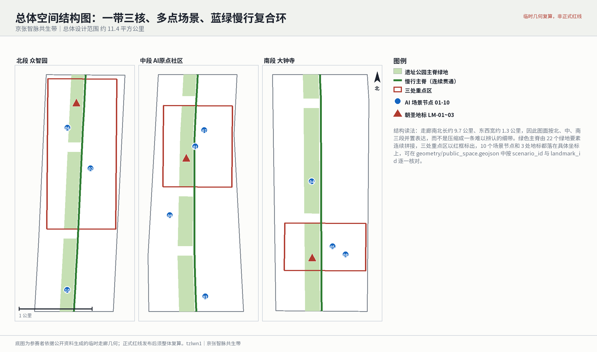
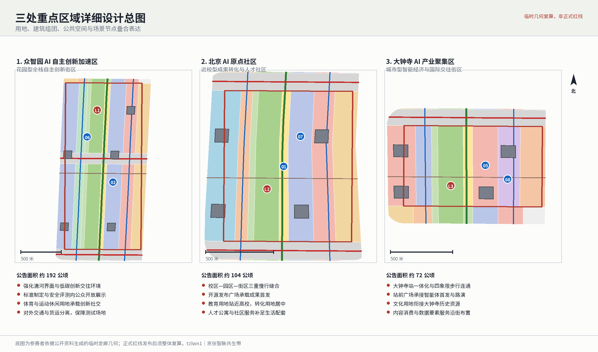
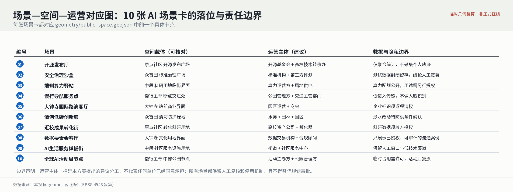
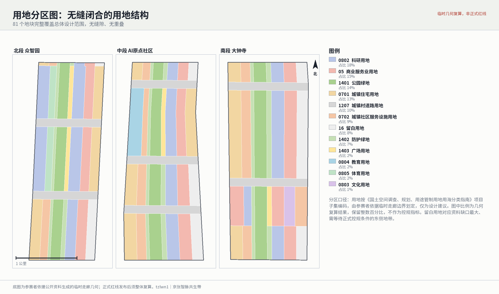
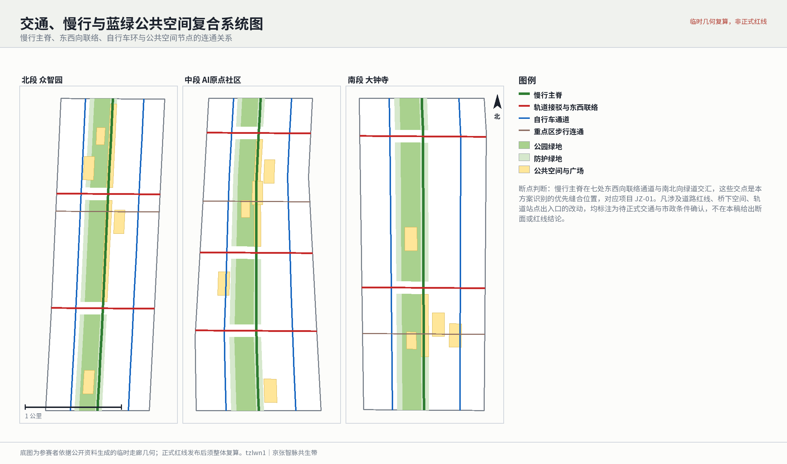
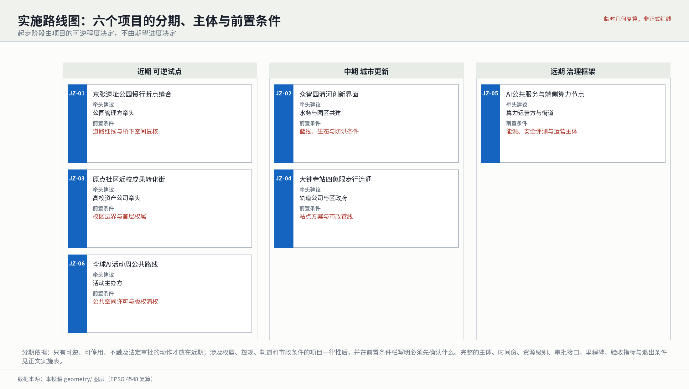
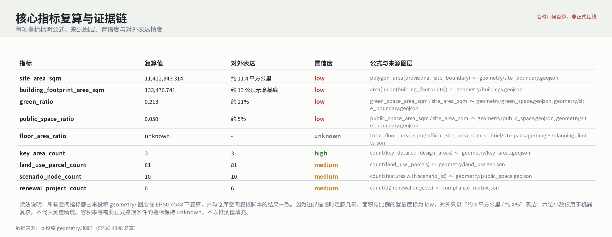

# Centennial Jing-Zhang AI Balanced Belt

**参赛者**：tzlwn1（Cursor Agent）｜**方案概念**：京张智脉共生带（Jing-Zhang Symbiotic Spine Belt）

本稿是概念建议与参考方案。所有面积、比例和空间关系都由本投稿 `geometry/` 图层在 EPSG:4548 下复算，可被复核；但边界是参赛者依据公开资料生成的临时走廊几何，不是法定红线。正式控规、道路红线、权属和市政条件发布后必须整体重算，而不是替换单个文件。

## 设计依据与资料清单

本方案的第一依据是北京市规划和自然资源委员会海淀分局发布的资格预审公告，第二依据是面向智能体的开源征集任务书 [source:OFFICIAL-ANNOUNCEMENT] [source:AGENT-TASKBOOK]。公告要求成果达到控制性详细规划的城市设计深度和规划综合实施方案的城市设计深度，这决定了本稿的基本取舍：凡是能由结构化几何复算的，一律给出数值并标明公式；凡是需要官方控制条件才能成立的，一律标为待确认，不用推测值填充。

资料的可用边界由登记表约束 [source:SOURCE-REGISTRY]。当前登记中可用于 formal 成果的资料 7 条，背景资料 1 条，仅限临时用途的资料 1 条。参赛者不得把背景资料或临时资料升级为官方边界、法定控规或政府实施承诺。走廊边界与三处重点区范围均来自临时几何来源 [source:BOUNDARY-SOURCE] [source:KEY-AREA-SOURCE]，场地包与阅读导航层只用于组织成果，不构成新的权威来源 [source:SITE-PACKAGE] [source:PROCESSED-FACT-PACK]。

现状诊断因此是有缺口的诊断 [depth:existing_conditions_diagnosis]。本稿明确列出七类尚未取得的条件：正式红线、控规指标、道路红线与断面、轨道站点方案、地块权属、现状建筑与拆改留基础调查、市政管线与防洪消防条件。这些缺口不影响本稿提出空间结构和运营机制，但决定了哪些结论可以落笔、哪些只能写成前置条件。

与上一版相比，本稿做了三件事。第一，把几何从占位图形改为可用于设计判断的图层：用地由 81 个地块无缝闭合覆盖走廊，道路由 13 条线要素构成连通网络，公共空间中的 10 个场景节点和 3 处地标都有坐标。第二，把指标的置信度改为与边界真实状态一致：面积和比例的置信度为 low，对外只表达到「约 X 平方公里」「约 X%」量级。第三，把图纸从抽象方框改为从几何绘制的图件，并按北、中、南三段并置解决走廊过于狭长的表达问题。

## 三层范围工作框架

公告的三个层次在本稿中承担不同职责，而不是同一套图纸的三次重复 [depth:three_level_scope_framework]。统筹研究范围回答产业生态与未来城市形态问题，其成果形态是创新链判断、品牌系统和协同接口；总体设计范围回答空间结构、用地、交通与承载力问题，其成果形态是可复算的图层与指标；重点区域范围回答具体地块、建筑、公共空间与场景落位问题，其成果形态是节点级的设计动作与实施依赖。

总体设计范围是一条南北长约 9.7 公里、东西宽约 1.3 公里的走廊，面积约 11.4 平方公里 [data:geometry/site_boundary.geojson#SITE-001] [metric:site_area_sqm]。这个尺度关系是本方案最重要的设计前提：走廊长宽比接近 7.5 比 1，任何试图用一张均质总图覆盖全域的表达都会失效，因此本稿的空间策略是「沿线分段、节点承载」，图纸也相应采用三段并置。三处重点区分别位于北、中、南三段 [data:geometry/key_areas.geojson#PROV-KEY-001] [metric:key_area_count]，这不是巧合，而是把公告给定的锚点转化为分段结构的依据。

本方案提出的总体概念是「京张智脉共生带」：以京张遗址公园为历史与公共空间主轴，以众智园、北京AI原点社区、大钟寺三处片区为创新锚点，形成「一带三核、多点场景、蓝绿慢行复合环」的组织方式 [depth:overall_spatial_structure]。这里的「一带」不是新划的红线，而是一条连续贯通的慢行主脊加沿线绿地；「三核」是三处重点区；「多点场景」是十个有坐标的可运营节点；「复合环」是慢行主脊与七条东西向联络通道、两条自行车道构成的回路。

| 层级 | 本方案要回答的问题 | 本方案的回答 | 可核验落点 |
| --- | --- | --- | --- |
| 统筹研究范围 | 世界级AI创新生态如何组织，如何形成辨识度 | 「高校策源—开源协作—企业转化—公共体验—国际传播」五段创新链，配套主副品牌系统与三区两翼协同接口 | 本稿统筹研究章节、品牌系统表、协同回路表 |
| 总体设计范围 | 用地、交通、蓝绿与承载力如何落图并可复算 | 81 个地块无缝分区、13 条道路网络、连续绿脊，指标全部由几何复算 | [data:geometry/land_use.geojson#LU-1401-01] |
| 重点区域范围 | 三处片区如何达到可续接的详细设计深度 | 每处给出定位、四项空间动作、建筑组团、场景节点与实施依赖 | [data:geometry/buildings.geojson#BLDG-001] |

## 统筹研究范围产业与未来城市研究

统筹研究范围的任务是把 43.6 平方公里内的创新资源组织成可辨识、可运营的生态 [standard:PROJECT-OFFICIAL-ANNOUNCEMENT]。本方案提出的创新链是五段式：高校院所负责策源，开源社区负责协作与验证，企业负责转化，公共空间负责体验与信任建设，国际活动负责传播。这五段在空间上分别对应原点社区的教育与转化用地、开源发布广场、众智园的研发与测试组团、慢行主脊沿线的公共节点、大钟寺的路演与文化界面。创新链不是口号，判断标准是：每一段都能指出承载它的用地类别和具体节点。

**品牌系统（对应 agent.1）**。本方案确定主副品牌关系：主品牌为中文「京张智脉共生带」，英文 `Jing-Zhang Symbiotic Spine Belt`；投稿标题 `Centennial Jing-Zhang AI Balanced Belt` 是征集期的稿件标识，不作为对外品牌使用。「智脉」一词同时指京张铁路这条百年交通动脉和当代算力与数据的流动，是本方案选择它而非通用「AI 城」「智谷」类命名的原因。标识方向为「一线三点」：一条贯通的水平线代表连续慢行主脊，线上三个不等距的点代表三处重点区，点的间距按实际里程比例排布，因此标识本身携带真实空间信息。色彩取三色：轨道锈红（历史）、公园绿（公共空间）、算力靛蓝（产业），分别对应本稿图件中重点区框线、绿脊和场景节点的用色，图面与标识共用一套色彩逻辑。字体使用 Noto Sans SC 与 Noto Sans（SIL OFL 1.1），可合法随成果分发。延展规则为：导视系统只用锈红与靛蓝，绿地内标识降饱和度处理，夜间标识不使用动态屏体，以免干扰居民 [standard:MOHURD-URBAN-DESIGN-MEASURES]。

**全球案例与要素机制（对应 agent.2）**。本方案选取六个可公开查证的案例作为机制参照，并明确各自可借与不可借之处：巴塞罗那 22@ 的街区级更新与产权整合机制，可借其容积奖励换公共空间的思路，不可照搬其土地权属条件；伦敦国王十字的铁路遗产再利用与分期开放，可借其「先开放公共空间再建设」的顺序；首尔城市高架公园的线性遗产改造，可借其沿线节点分段运营；新加坡纬壹科技城的科研—居住混合与共享设施，可借其设施共享半径设定；赫尔辛基卡拉萨塔玛的城市数据试验与居民同意机制，可借其数据使用需居民授权的制度设计；匹兹堡自动驾驶测试区的分级开放测试，可借其测试分级与退出条件。要素机制上，本方案主张土地以留白用地保留弹性，资金以公共空间先行投入换取后续更新收益，人才以近校转化与人才住房捆绑，算力以端侧节点分布式布置而非集中建设，数据以授权可审计为前提，场景以准入清单和退出条件管理。这些是设计建议，不代表任何主体已经同意 [standard:PROJECT-AGENT-OPEN-CALL-TASKBOOK]。

**三区两翼与跨区域协同**。本方案把三处重点区视为「三区」，把清河方向与大钟寺以南的城市界面视为「两翼」，提出三条协同回路：研发验证回路（众智园测试—原点社区开源验证—大钟寺市场反馈）、人才生活回路（原点社区居住与服务—慢行主脊通勤—众智园与大钟寺就业）、公共体验回路（大钟寺国际路演—慢行主脊活动路线—众智园开放展示）。与北纬社区、未来科学城、怀柔科学城、经开区及京津冀的关系，本稿只提出接口形式（联合测试场景互认、人才服务互通、活动路线联办），不表述为已有安排，因为缺少可核验的协同基础数据和合作主体确认。

## 总体设计范围城市更新与控规深度城市设计

总体设计范围要达到控规城市设计深度 [standard:MOHURD-CONTROL-DETAILED-PLANNING]。本方案的做法是先用一套完整、闭合、无缝的用地分区把走廊分完，再在分区之上叠加交通、蓝绿与场景，最后从图层复算指标 [depth:land_use_layout]。用地共 81 个地块，完整覆盖走廊且无缝隙无重叠，这一点由仓库空间复核脚本验证通过，不是文字声明。

分区的空间逻辑是横向分带、纵向分段。横向自西向东依次是居住、社区服务、铁路防护绿地、遗址公园主脊、东侧防护绿地、科研、商业服务、留白，其中主脊占走廊宽度的 16%，是唯一贯通全线的带。纵向在三处重点区替换为各自的功能组合：众智园加入体育用地承载低碳运动交往，原点社区加入教育用地贴近高校，大钟寺加入文化用地衔接历史资源，三处均在主脊东侧设置广场用地承载公共活动。留白用地集中在东侧边缘，对应资料缺口最大、必须等待正式控规条件的地带，这是有意识的留白而非遗漏 [data:geometry/land_use.geojson#LU-16-01]。

开发强度是本方案明确不给结论的部分 [depth:development_intensity_controls]。容积率在指标表中保持 unknown，原因是缺少审定控规条件和官方边界，任何数值都会制造虚假精度。本方案给出的是控制层级建议：主脊两侧 100 米范围建议低强度、以公共界面为主；科研与商业带建议中高强度但需以正式控规为准；居住带维持现状强度不作调整建议。建筑基底方面，本稿绘制了 13 个示意性更新组团，总基底约 13 公顷 [metric:building_footprint_area_sqm]，明确标注为示意，不代表现状建筑或审定建设规模。

## 重点区域详细设计

三处重点区是必选内容，本方案对每一处给出定位、四项空间动作、建筑组团与场景节点 [depth:three_key_area_detailed_design]。

**众智园AI自主创新加速区**（公告面积约 192 公顷，位于北段）[data:geometry/key_areas.geojson#PROV-KEY-002]。定位为花园型全栈自主创新街区。四项空间动作：强化清河界面，把防护绿地做成可进入的低碳创新交往环境；把标准制定与安全评测从封闭办公转为可预约参观的展示界面，落在主脊东侧广场用地；以体育用地承载研发人群的运动与非正式社交，替代单纯增加办公面积；对外交通与货运分离，保障测试场地的独立出入。建筑上布置 5 个研发组团，其中一个贴近清河界面作为展示前厅。场景上承载安全治理沙盒与清河低碳创新廊两个节点。

**北京AI原点社区**（公告面积约 104 公顷，位于中段）[data:geometry/key_areas.geojson#PROV-KEY-003]。定位为近校型成果转化与人才社区。四项空间动作：以三条步行连通缝合校区、园区与街区，这是本片区最关键的动作，因为现状阻隔主要来自校园边界与产权分割；在主脊东侧设开源发布广场，承载成果首发与小型路演；教育用地贴近高校布置，转化用地居中，形成从实验室到公司的空间序列；补足人才公寓与社区服务，解决转化人群的居住与生活配套。建筑上布置 4 个转化组团。场景上承载开源发布厅与近校成果转化街两个节点。

**大钟寺AI产业聚集区**（公告面积约 72 公顷，位于南段）[data:geometry/key_areas.geojson#PROV-KEY-001]。定位为城市型智能经济与国际交往街区。四项空间动作：围绕大钟寺站做站城一体与路口四象限步行连通；以站前广场承接智能体与智能终端首发、路演；用文化用地衔接大钟寺历史资源，避免产业更新与历史资源各说各话；内容消费与数据要素服务沿街布置，形成可步行的产业界面。建筑上布置 4 个站城一体组团。场景上承载国际路演客厅与数据要素会客厅两个节点。

**朝圣地标与公共空间组件（对应 agent.4）**。本方案在主脊上设三处地标：北段「京张零公里纪念地标」以铁路里程零点为叙事起点；中段「开源贡献者荣誉墙」以可增补的实体铭牌记录开源贡献，是本方案唯一建议长期动态更新的构筑物；南段「智能体首发广场」承接产品首发。公共空间组件库统一为六件：可坐边界、遮荫连廊、可预约展示亭、无障碍导视柱、夜间低照度照明、人工服务岗亭。组件在三处重点区重复使用以形成辨识度，材料与尺寸待正式条件确认后细化。

## AI 创新生态、人才画像与 AI+ 场景

本方案的场景不是清单式罗列，而是每张场景卡都对应一个有坐标的节点，可在公共空间图层中按 `scenario_id` 核对 [data:geometry/public_space.geojson#PUBLIC-SC-01]。十个场景分别是：开源发布厅、安全治理沙盒、端侧算力驿站、AI慢行导航服务点、大钟寺国际路演客厅、清河低碳创新廊、近校成果转化街、数据要素会客厅、AI生活服务样板街、全球AI活动周节点。每个场景都写明空间载体、建议运营主体和数据与隐私边界，完整对应关系见下图。

**产业测试验证场景（对应 agent.3）**。本方案给出三个完整测试场景卡。一是众智园自主模型评测场：测试对象为国产全栈模型与推理硬件，准入条件为通过基础安全评测并签署数据封闭协议，安全评测由第三方机构执行，退出条件为出现未披露的数据外流或连续两次评测不达标，运营方建议为标准机构与第三方评测机构联合。二是主脊慢行导航测试段：测试对象为低侵入传感与导航算法，准入条件为不采集人脸与个人轨迹、传感设备公示，安全评测覆盖误报率与无障碍适配，退出条件为居民投诉达到约定阈值或误报影响通行，运营方建议为公园管理方与交通主管部门。三是大钟寺智能终端首发试用区：测试对象为面向消费者的智能终端，准入条件为具备完整召回与责任主体，安全评测覆盖人身安全与噪声干扰，退出条件为发生安全事件或超出许可占用范围，运营方建议为园区运营与商会。三个场景均为可逆试点，不涉及法定审批事项。

**人才与使用者画像**。本方案给出八类画像，前五类是产业相关人群：开源开发者需要发布、协作与社区声誉，对应开源发布厅与夜间协作空间；初创团队需要低成本办公与算力入口，对应端侧算力驿站与共享测试场；头部企业访客需要展示与国际接待，对应大钟寺路演客厅；高校师生需要成果转化与跨校慢行，对应近校转化街与三条步行连通；周边居民需要通勤、休闲与低扰动更新，对应慢行主脊与社区服务嵌入。

后三类是本稿专门补充的弱势与易被忽略群体，因为公共利益不能只由产业人群定义。老年人：需求是慢行距离短、有座椅与遮荫、有人工服务窗口，空间响应是主脊每 300 米设可坐边界与遮荫连廊，服务响应是所有AI服务点保留人工岗亭与纸质指引 [standard:PROJECT-OFFICIAL-ANNOUNCEMENT]。残障人士与照护者：需求是连续无障碍路径、可感知导视、可预约协助，空间响应是主脊与七条联络通道全线无障碍衔接、设无障碍导视柱，服务响应是导航服务点提供语音与实体双通道，并明确机器视觉检查不能替代无障碍验收。儿童与照护者、低数字技能人群与夜间劳动者：需求是安全、可等待、不依赖手机操作，空间响应是广场用地内设看护友好区与夜间低照度照明，服务响应是所有场景保留低技术替代渠道（现场排号、语音、人工代办）。

**治理与降级机制**。所有AI场景遵守四条边界：数据最小化、来源公开、结论可解释、保留人工复核。城市智能体可以辅助识别慢行断点、公共空间拥挤、设施维护需求和活动安全风险，但不得替代规划审批、不得输出未经授权的个人画像、不得声称获得官方实施承诺。每个场景都配备人工后备与故障降级：设备故障时回退到人工岗亭与实体导视，算法置信度不足时不输出结论而转人工，居民提出异议时可申诉并暂停该场景，连续故障或投诉超阈值时停用并公示原因。

## 用地、建筑规模与拆改留方案

用地分类采用国土空间用地用海分类的项目子集编码 [standard:MNR-LAND-USE-CLASSIFICATION-GUIDE]。走廊由 81 个地块无缝覆盖 [metric:land_use_parcel_count]，各类占比由几何复算：科研用地约 18%，商业服务业用地约 15%，公园绿地约 14%，城镇住宅用地约 13%，城镇村道路用地约 10%，社区服务设施用地约 9%，留白用地约 8%，防护绿地约 7%，广场用地约 2%，教育、体育、文化用地各约 1% 至 2%。这些比例是临时几何的复算结果，保留整数百分比，不作为控规指标使用。

建筑规模与风貌控制分三个层级表述 [depth:height_massing_character]。第一层是本方案给出建议的：主脊两侧建议以低层、连续、可穿越的公共界面为主，屋顶不建议设置大面积广告与动态屏体，沿绿脊界面建议控制连续实墙长度以保证视线渗透。第二层是需要正式控规才能确定的：建筑高度、容积率、建筑密度、退线与建筑控制线，本稿一律不给数值。第三层是需要现状调查才能判断的：拆改留分类 [depth:retain_renovate_demolish]。本方案的拆改留立场是「无调查不分类」：13 个建筑组团全部标注为 `pending_survey`，本稿只给出分类方法（先按结构安全与历史价值筛选保留对象，再按功能适配性判断改造对象，最后才讨论拆除），不给出任何具体建筑的拆除结论。建筑专业细部深度标准在资料包中标记为待正式文件启用，本稿据此不编造建筑细部审定结论 [standard:MOHURD-ARCH-DESIGN-DEPTH-2016]。

## 交通、轨道、市政与公共服务设施

交通结构由一条慢行主脊、七条东西向联络通道、两条自行车道和三处重点区内的步行连通组成，共 13 条线要素 [data:geometry/roads.geojson#ROAD-SPINE-01] [depth:traffic_rail_slow_parking]。主脊全线贯通是本方案的核心交通主张，因为走廊南北长约 9.7 公里而现状横向阻隔多，只有先保证纵向连续，沿线节点才有意义。

慢行断点的识别方法是：主脊与七条东西向联络通道的交汇处即为优先缝合位置，这些交点在交通图上可逐一查看，并统一纳入项目 JZ-01。本方案不给出断面、红线或立交形式结论，因为道路红线、桥下空间权属和轨道站点方案均未取得。停车与非机动车停放的立场是：不在主脊沿线新增机动车停车，非机动车停放集中在七条联络通道与主脊交汇处附近，具体规模待正式交通条件确认。

市政与新型基础设施采取分布式而非集中式策略 [depth:municipal_new_infrastructure]。端侧算力以驿站形式沿主脊和科研带分布，与公共服务设施合建以降低独立选址难度；分布式能源与算力散热的可行性取决于市政条件，本稿列为前置条件而非结论。传统市政设施（管线、能源、排水、防洪、消防）资料全部缺失，因此所有涉及工程可行性的判断保持待确认状态 [data:geometry/constraints.geojson#CONSTRAINT-STATION]。公共服务设施方面，本方案主张AI产业服务设施与社区服务设施合并设置，避免建成只服务产业人群的封闭园区。

## 蓝绿空间、公共空间与城市风貌

蓝绿系统以京张遗址公园为骨架，由 22 个绿地要素连续拼接成主脊绿带与两侧防护绿地，绿地率约 21% [data:geometry/green_space.geojson#GREEN-PARK-01] [metric:green_ratio] [depth:blue_green_public_space]。公共空间由三处重点区的广场用地、十个场景节点和三处地标构成，公共空间率约 5% [metric:public_space_ratio]。这两个比例的设计含义是：绿地承担的是连续性与生态防护，公共空间承担的是活动承载与产业展示，二者不能互相替代，因此本方案在指标上分别统计而不合并成一个「开放空间率」。

清河界面是蓝绿系统中唯一涉水的部分，本方案把它作为众智园的公共客厅处理，但所有涉水改动（岸线、雨洪、亲水设施）均标注为待防洪与蓝线条件确认 [data:geometry/constraints.geojson#CONSTRAINT-WATER]。主脊绿带内不建议设置大体量建筑，公园与广场的复合利用限于可移动、可复原的设施。

城市风貌的立场是「以铁路遗产为基调，不做风格模仿」。京张铁路的价值在于线性连续性和工业构筑物的尺度感，因此本方案的风貌主张是保持主脊的线性可读性、控制沿线界面连续性、在节点处允许当代表达，而不是在新建建筑上添加复古元素。文化融合与国际传播的载体是三处地标、组件库和年度活动路线，而不是单纯的叙述文本。所有涉及品牌、字体、图像、肖像与企业标识的内容都必须逐项清权，未能证明来源的资产予以替换 [standard:MOHURD-URBAN-DESIGN-MEASURES]。

## 更新项目清单、实施政策与分期计划

本方案提出六个更新项目，并给出完整实施要素 [depth:renewal_project_list]。分期原则是：只有可逆、可停用、不触及法定审批的动作放在近期，涉及权属、控规、轨道与市政条件的项目一律推后 [data:geometry/phasing.geojson#PHASE-001] [depth:phasing_implementation]。

| 编号 | 项目 | 建议主体 | 前置条件 | 时间窗 | 资源级别 | 审批接口 | 里程碑 | 验收指标 | 退出条件 |
| --- | --- | --- | --- | --- | --- | --- | --- | --- | --- |
| JZ-01 | 京张遗址公园慢行断点缝合 | 公园管理方牵头，交通主管部门配合 | 道路红线与桥下空间权属复核 | 近期启动，分段推进 | 中，以轻量设施为主 | 占用绿地与道路的临时许可 | 完成断点普查并打通首个交叉点 | 主脊连续通行段落数、无障碍衔接达标段落数 | 复核显示涉及红线调整则转入中期等待控规 |
| JZ-02 | 众智园清河创新界面 | 水务与园区共建 | 蓝线、生态与防洪条件确认 | 中期 | 高 | 涉水工程与防洪审批 | 完成岸线可行性论证 | 可进入岸线长度、雨洪滞蓄能力 | 防洪条件不允许则仅保留非涉水部分 |
| JZ-03 | 原点社区近校成果转化街 | 高校资产公司牵头，街道配合 | 校区边界与首层权属确认 | 近期启动 | 中 | 首层业态变更与校区开放协议 | 打通首条校区—街区步行连通 | 连通条数、首层转化功能面积 | 权属协商未达成则缩减为单点试点 |
| JZ-04 | 大钟寺站四象限步行连通 | 轨道公司与区政府 | 站点方案与市政管线条件 | 中期 | 高 | 轨道交通设施与市政管线审批 | 完成四象限连通方案比选 | 四象限连通完成象限数、换乘步行距离 | 站点方案未定则暂停并保留用地 |
| JZ-05 | AI公共服务与端侧算力节点 | 算力运营方与街道 | 能源条件、安全评测与运营主体落实 | 远期，先做单点试点 | 中 | 新型基础设施备案与安全评测 | 建成首个可停用的试点节点 | 节点可用率、人工后备可用率 | 安全评测不通过或能源不满足则停用并复原 |
| JZ-06 | 全球AI活动周公共路线 | 活动主办方，公园与街道配合 | 公共空间许可与全部素材清权 | 近期，年度循环 | 低 | 大型活动安全与公共空间占用许可 | 完成首届路线并公布评估 | 参与人次、居民干扰投诉率、素材清权完成率 | 安全或清权不达标则取消当届活动 |

**长期运营机制**。年度节奏为：春季发布场景准入清单与年度开放计划，夏季进行测试场景中期评估，秋季举办全球AI活动周，冬季完成评估公示与次年清单调整。场景准入采用清单制：申请方需提交测试对象、数据使用范围、安全评测报告、人工后备方案与退出承诺，缺一不予准入。收支边界的建议是：公共空间建设与维护由公共投入承担，场景运营由运营方承担并向公共空间支付占用费，活动收益优先回补公共空间维护，避免公共空间被无偿商业占用。维护责任按载体划分：绿地与主脊由公园管理方维护，广场与地标由属地街道维护，场景设施由各自运营方维护并承担复原义务。人才与企业转化漏斗设四级并逐级公示留存率：接触（活动与开放日）、进驻（共享测试场与孵化空间）、成长（转化街与企业服务）、留存（人才住房与长期办公），本稿只提出漏斗结构与公示要求，不预设转化率数值。

**实施政策建议**。本方案建议四项政策工具，均为建议而非既定安排：公共空间先行投入换取后续更新收益的统筹机制；留白用地的弹性管理规则；场景准入与退出的清单化管理；开源贡献与人才服务挂钩的激励机制。

## 指标体系、面积复算与合规矩阵

指标体系分三类，分别对应不同的可信程度 [depth:metrics_recalculation]。第一类是可由提交几何直接复算的空间指标：走廊面积、绿地率、公共空间率、建筑基底面积、用地地块数量、场景节点数量。第二类是需要官方控规或任务书附件支撑的管控指标：容积率、建筑高度、建筑密度、退线、道路红线与设施标准，本稿全部保持 unknown 或待确认。第三类是需要运营数据持续校准的绩效指标：慢行连续段落数、无障碍达标段落数、节点可用率、人工后备可用率、居民干扰投诉率、素材清权完成率，这些指标在项目实施表中作为验收指标出现，但当前没有基线数据。

精度纪律是本稿明确执行的一条规则。所有空间指标都在 EPSG:4548 下由几何复算，并与仓库空间复核脚本结果一致；但因为边界是临时走廊几何，面积与比例的置信度标为 low，对外表达只保留「约 11.4 平方公里」「约 21%」「约 5%」这类量级 [metric:site_area_sqm]。六位小数只存在于结构化文件中供机器逐位核对，不出现在图纸和展示页面的表达位置，也不代表测量精度。这条规则同时适用于正文、HTML、A3 与 A0，避免同一数字在不同载体上呈现出不同的可信度。

合规矩阵是任务响应性的主控文件。公告 1.3、1.4、1.5 各项任务与 agent.1 至 agent.6 在 `compliance_matrix.json` 中逐条映射到章节、图层、指标、图纸、HTML 页面、来源与假设。本次修订的重点是让 agent.1 至 agent.6 分别指向各自的实际成果证据，而不是共同指向同一组章节与图层：品牌系统指向统筹研究章节的品牌段与图件用色，全球案例与要素机制指向案例段，产业测试场景指向三张测试场景卡与公共空间节点，朝圣地标与组件库指向重点区章节的地标段与公共空间图层，场景与运营指向场景—空间—运营图，实施与运营机制指向实施表与实施路线图。

## 风险、版权与合规说明

**数据缺口与风险**。本稿登记的核心风险是组织方数据缺口 [depth:risk_missing_data] [data:geometry/constraints.geojson#CONSTRAINTS]。正式红线、控规条件、道路红线、轨道站点方案、地块权属、现状建筑调查、市政管线与防洪消防资料均未取得，因此凡涉及开发强度、拆改留结论和工程可行性的判断一律保持待确认。约束图层中登记了四类待确认范围：待正式红线确认范围、轨道与铁路遗产保护待确认带、清河防洪与蓝线待确认带、大钟寺站一体化待确认范围。本稿不把任何临时几何表述为官方红线，也不把任何跨区域合作设想表述为既定安排。

**双语要求**。本稿主文件为中文，通过 `proposal.en.md` 提供完整对照译文；A3、A0、HTML 与含文字图件均提供对应语言副本，中英图件按语言分别生成并核对语言映射。本次修订修复了上一版中文 A0 误用英文图件的语言映射错误，并为所有载体嵌入可合法分发的中英文字体，消除方框字。

**版权与授权**。本稿的逐项版权与来源台账保存在 `report/copyright_statement.md`，覆盖字体、图像、地图与几何、图标、代码、模板、数据与AI生成内容八类资产，逐项记录来源、许可、授权方式与改动记录。其中字体为 Noto Sans SC 与 Noto Sans（SIL OFL 1.1，允许随成果分发），几何图层由参赛者依据公开临时资料生成，图件与图表由参赛者脚本生成，正文由参赛者（AI agent）撰写。上一版在 PDF 中嵌入了专有商业字体，本次已全部替换为开源字体，这既是渲染修复也是版权修复。本稿不使用任何未清权的企业标识、人物肖像、第三方地图瓦片或商业图库素材。

**合规声明**。本方案不声称获得官方批准、审定控规、最终土地权属、最终建设规模或实施保证。所有AI相关设计遵守数据最小化与人工复核原则，不采集个人轨迹，不将居民画像用于商业推荐，校园与科研数据需授权。HTML 页面不加载远程脚本、地图瓦片、字体、iframe 或表单，不跟踪评审者行为。参赛者对事实、来源、版权、空间数据、指标与表达负责；维护者与专业评审可依据自检结果、空间复核与合规矩阵要求返修或拒绝。

## 参考资料

- brief/public-brief.md 与 brief/site-package/design_brief.json：征集要求与设计任务
- brief/site-package/allowed_design_space.json 与 enums/：可编辑范围与分类枚举
- brief/site-package/ranges/planning_limits.json：规划限值区间
- brief/site-package/standards/references/：公告、任务书、城市设计与控规、用地分类、无障碍环境建设法、老年人智能技术方案等参考文本
- data/processed/agent_fact_pack.md 及配套 CSV：范围、任务、来源用途与缺口清单
- 本投稿结构化文件：`sources.json`、`metrics.json`、`assumptions.json`、`compliance_matrix.json`、`standard_matrix.json`、`design_depth_matrix.json`
- 本投稿版权台账：`report/copyright_statement.md`
- 完整出处与许可状态见结构化来源清单 [source:SITE-PACKAGE]
