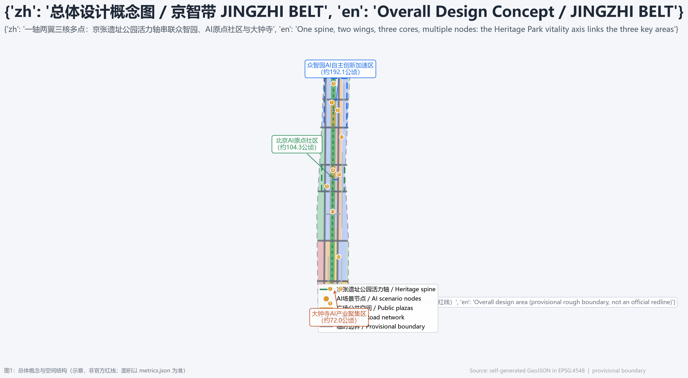
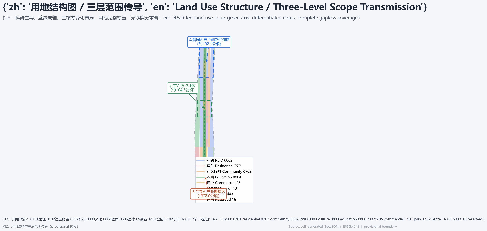
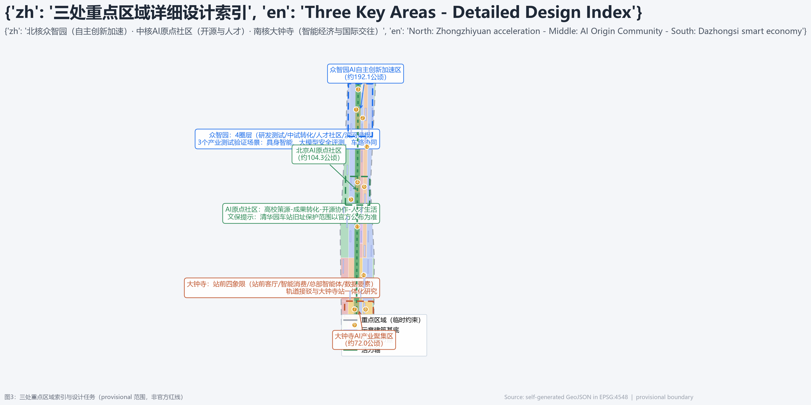
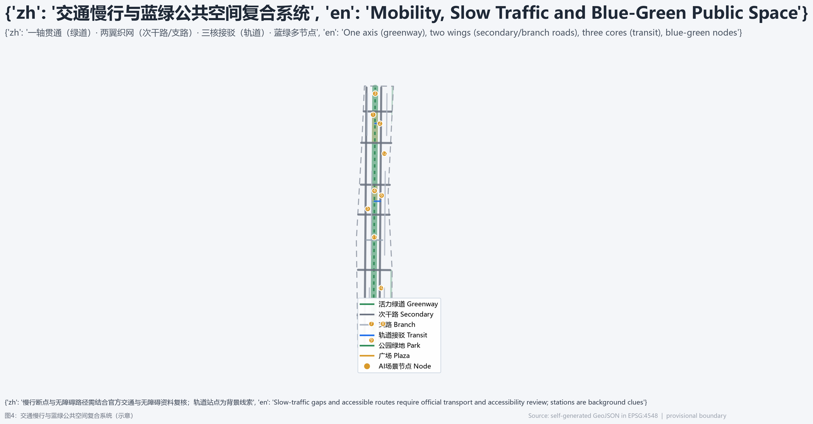
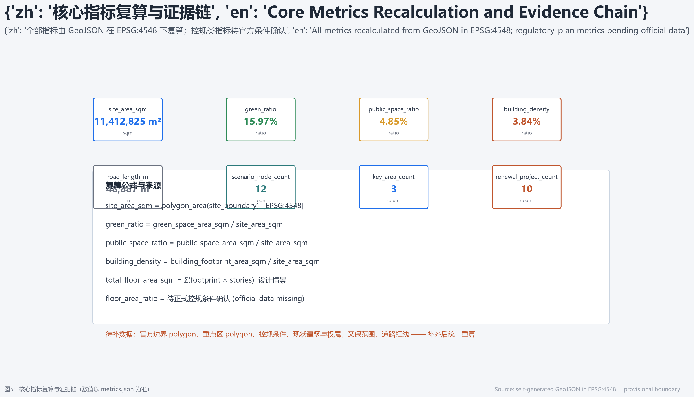

# 京智带 JINGZHI BELT：铁轨·代码·生活——百年京张AI创新带总体城市设计

## 设计依据与资料清单

本方案依据北京市规划和自然资源委员会海淀分局发布的《百年京张AI创新带城市设计国际方案征集资格预审公告》（2026-05-09）组织三层范围与设计任务 [source:SRC-OFFICIAL-ANNOUNCEMENT]，并依据面向全球智能体的开源征集任务书补充命名体系、生态案例、场景卡、朝圣地标、文化叙事与长期运营要求 [source:SRC-AGENT-TASKBOOK]。方案使用的全部来源、用途边界与限制记录在 `sources.json`；中央公开资料登记表（`data/source_registry.json`）中 `usable_for_formal="yes"` 的资料可用于正式任务依据，`provisional_only` 与 `background_only` 资料只用于生成、展示和背景说明，不得升级为官方红线、法定控规或政府实施承诺 [source:SRC-SOURCE-REGISTRY]。

当前公开渠道尚未取得可验证坐标系的官方总体设计范围与三处重点区 polygon。本方案使用仓库维护的 `brief/site-package/geometry/provisional_boundaries.geojson` 作为临时粗略边界 [source:SRC-PROVISIONAL-BOUNDARIES]，其按公告文字四至、约面积（总体设计范围约 11.4 km²，三处重点区合计约 368.4 公顷）在 EPSG:4548 下校核，偏差均在 0.5% 以内。**该边界不是官方红线、审批依据或精确面积依据**；官方 polygon 补齐后，全部空间图层与指标必须统一重算。这一组织方数据缺口不阻断内容评分，但方案中所有面积、比例与项目位置均保留“待正式数据复核”属性 [data:geometry/site_boundary.geojson#SITE-001] [metric:site_area_sqm]。

方案遵循的专业标准包括《城市设计管理办法》（用于公共空间与城市风貌统筹）、《城市、镇控制性详细规划编制审批办法》（用于区分已知控制与待补控规）、《国土空间调查、规划、用途管制用地用海分类指南》（用于统一用地代码）[standard:MOHURD-URBAN-DESIGN-MEASURES] [standard:MOHURD-CONTROL-DETAILED-PLANNING] [standard:MNR-LAND-USE-CLASSIFICATION-GUIDE]。三处重点区分别对应公告任务 1.5.3.1、1.5.3.2、1.5.3.3 与面向智能体任务的 agent.1 至 agent.6，全部逐条覆盖在 `compliance_matrix.json`、`standard_matrix.json` 与 `design_depth_matrix.json` 中。

## 三层范围工作框架

方案按公告确定的三层范围组织：**统筹研究范围**约 43.6 km²（北至北五环路、东至京藏高速、南至西直门外大街、西至万泉河路），回答“AI创新生态与未来城市形态如何组织”；**总体设计范围**约 11.4 km²（京张遗址公园周边 1 至 2 公里城市地区和产业区），回答“城市更新与控规深度城市设计如何落图”；**重点区域范围**约 368.4 公顷，包括自北向南的众智园AI自主创新加速区（约 192.1 公顷）、北京AI原点社区（约 104.3 公顷）、大钟寺AI产业聚集区（约 72.0 公顷），回答“三处片区如何达到详细设计深度” [source:SRC-OFFICIAL-ANNOUNCEMENT] [depth:three_level_scope_framework]。

三层范围逐级传导：统筹研究决定产业链与城市形态判断，总体设计把判断落实到用地、建筑、道路、绿地、公共空间和更新项目，重点区域详细设计验证具体地块、建筑形态、交通接驳与AI场景的可实施性 [data:geometry/land_use.geojson#LU-001] [depth:overall_spatial_structure]。三层范围的空间证据分别落在 `geometry/site_boundary.geojson`、`geometry/key_areas.geojson` 与 `geometry/phasing.geojson`；三处重点区之间不重叠、均在总体设计范围内 [data:geometry/key_areas.geojson#PROV-KEY-001] [metric:key_area_count]。

## 统筹研究范围产业与未来城市研究

### 三大定位与五大功能

统筹研究围绕三大定位展开：**百年京张文化带**（把铁路遗产转化为可体验的城市叙事）、**都市AI生活体验带**（让AI场景进入日常城市生活）、**AI融合创新带**（实现产业、空间、治理的一体化协同）[source:SRC-AGENT-TASKBOOK]。五大功能对应 AI 全栈自主创新体系、世界级AI创新生态、AI+场景赋能新范式、智能化AI活力城市与AI治理全球话语权；三区两翼中，三区即三处重点片区，两翼为**中关村科技服务翼**（要素全球化配置、中关村IP与资本赋能）与**小月河场景赋能翼**（AI场景赋能与智能化城市生活）[source:SRC-KW-THREE-AREAS-WINGS]。

### 全球AI创新生态案例（6个）

方案从全球公开案例中提炼可转化机制，用于说明生态设计的空间与运营逻辑，均为背景性研究而非正式实施承诺 [source:SRC-CASES]：

| 案例 | 可转化的生态机制 | 在本题的空间落点 |
| --- | --- | --- |
| 硅谷斯坦福研究园 | 大学策源、风险资本、企业转化的双螺旋 | AI原点社区近校孵化组团 |
| 波士顿肯德尔广场 | 生命科学与AI实验室集聚、高密度交流 | 众智园研发测试组团 |
| 伦敦知识区 | 知识机构与孵化器混合、开放街区 | 原点社区开源街区 |
| 深圳南山科技园 | 硬件原型、制造、市场的快速闭环 | 众智园中试与测试场 |
| 新加坡智慧国 | 政府开放场景、监管沙盒与AI治理 | 众智园安全评测与沙盒 |
| 柏林Factory Berlin | 开发者社区与旧建筑更新共生 | 大钟寺智能经济街区 |

### 命名与视觉识别方向

方案建议一带品牌名称为“**京智带 JINGZHI BELT**”：以“京”锚定北京与京张铁路，以“智”锚定人工智能与中关村创新，以“带”表达线性走廊与连续场景。英文全称沿用官方项目名 Centennial Jing-Zhang AI Innovation Belt。Logo 方向为“**人字轨·智能环**”：取京张铁路“人字形”展线的两条铁轨演化成电路通路，在三个节点处生成三个发光环，分别代表三处重点区；标准色为铁锈橙（遗产）、科技蓝（创新）、生态绿（蓝绿空间）三色系统。该方向是品牌概念建议，最终 Logo 与字体、图像使用均需清权 [source:SRC-AGENT-TASKBOOK] [depth:overall_spatial_structure]。

## 总体设计范围城市更新与控规深度城市设计

### 总体空间结构：“一轴两翼三核多点”

总体设计提出“**一轴两翼三核多点**”结构：**一轴**为京张遗址公园活力轴，由北向南串联三处重点区，承载步行、骑行、公共活动与AI展示；**两翼**对应中关村科技服务翼（侧重创新服务、资本与知识产权）与小月河场景赋能翼（侧重场景试验、生活服务与城市活力）；**三核**为众智园（自主创新加速核）、AI原点社区（开源生态与人才核）、大钟寺（智能经济与国际交往核）；**多点**为沿轴分布的12个AI场景节点 [data:geometry/constraints.geojson#NODE-001] [depth:overall_spatial_structure]。

用地结构以科研用地为主（约 36%），居住与社区服务约 24%，公共管理与公共服务约 15%，商业服务业约 5%，绿地与开敞空间约 21%，留白约 0.4% [data:geometry/land_use.geojson#LU-001] [metric:public_service_area_sqm]。城市更新遵循“**保留为主、改造提升、局部新建、留白预留**”的总体逻辑：现状高校、科研院所与成熟社区以保留提升为主；低效市场、批发与老旧厂房区提出改造为AI研发、展示与中试空间的参考方案；新建集中在众智园门户、大钟寺站前与原点社区公共界面；具体地块的拆改留必须由专业团队按权属、文保、控规与工程条件深化 [depth:retain_renovate_demolish]。

本方案不设定容积率、建筑高度、建筑密度等法定控制值——官方控规条件缺失，全部列为“待正式控规条件确认” [standard:MOHURD-CONTROL-DETAILED-PLANNING] [depth:development_intensity_controls]。建筑规模采用“设计情景测算”：在 `geometry/buildings.geojson` 的29个示意建筑基底上按功能类型赋予假设层数，得到建筑基底约 43.8 公顷、总建筑面积约 363 万 m² 的设计情景值，仅供空间结构讨论，不作审批依据 [data:geometry/buildings.geojson#BLDG-001] [metric:total_floor_area_sqm]。

## 重点区域详细设计

### 众智园AI自主创新加速区（北核，约192.1公顷）

**定位**：花园型全栈自主创新加速区，承担AI全栈自主创新体系与AI治理全球话语权功能。**空间结构**：以众智园创新客厅广场为中心，组织“研发测试组团、中试转化组团、人才社区服务、滨河绿楔”四圈层；西侧研发、东侧加速、北部预留远期发展。**建筑更新**：现状产业用地以改造提升为主，门户区提出新建“算力之门”研发综合体参考方案。**交通慢行**：依托众智园南侧与内部东西路组织车行微循环，活力轴绿道串联园区公共空间，预留轨道接驳。**公共空间**：创新客厅广场、清河界面绿楔与AI展示路径。**AI场景**：具身智能机器人公开测试场、大模型安全评测与红队演练场、车路协同与自动驾驶微循环测试（3个产业测试验证场景）。**实施风险**：需确认文保、绿地与蓝线边界，测试场运营需安全监管与人工复核 [data:geometry/key_areas.geojson#PROV-KEY-001] [depth:three_key_area_detailed_design]。

### 北京AI原点社区（中核，约104.3公顷）

**定位**：近校型成果转化与人才社区，承担世界级AI创新生态与开源文化功能。**空间结构**：以清华园车站旧址周边为文化原点，组织“高校策源、成果转化、开源协作、人才生活”四圈层；提出“原点坐标”纪念装置与开源发布厅。**建筑更新**：高校与成熟社区保留为主，沿线低效空间提出改造为孵化器、共享实验室与人才公寓的参考方案。**交通慢行**：校区、园区、街区慢行缝合，沿活力轴与东西向支路组织步行网络，研究轨道站点一体化接驳。**公共空间**：原点广场、开源代码墙与公共界面更新。**AI场景**：开源社区与代码共创街区、AI教育实训与课程共创中心、科研成果转化驿站。**实施风险**：清华园车站旧址为文保对象，建设控制地带以官方公布为准；近校改造需平衡教学秩序与开放交流 [data:geometry/key_areas.geojson#PROV-KEY-002] [standard:PROJECT-AGENT-OPEN-CALL-TASKBOOK]。

### 大钟寺AI产业聚集区（南核，约72.0公顷）

**定位**：城市型智能经济与国际交往街区，承担智能原生新业态与全球活动功能。**空间结构**：以大钟寺站为锚点组织“站前客厅、智能消费街区、企业总部与智能体组团、数据要素会客厅”四象限；重点缝合四象限步行连通。**建筑更新**：商业与办公界面提升为主，站前提出TOD综合更新参考方案，规划绿地复合利用须遵守绿地与蓝线约束。**交通慢行**：大钟寺站多线接驳研究、站前广场人车分流、慢行连续网络。**公共空间**：站前广场、智能消费体验街区与“智识钟楼”公共艺术地标。**AI场景**：大钟寺智能消费体验街区、数据要素合规会客厅、AI+医疗健康服务点。**实施风险**：站前地下空间与工程可行性需专业测算，商业更新须避免过度网红化与扰民 [data:geometry/key_areas.geojson#PROV-KEY-003] [metric:key_detailed_design_area_sqm]。

## AI 创新生态、人才画像与 AI+ 场景

### 用户画像（6类）

方案建立6类用户画像，说明“场景—空间—运营”映射 [source:SRC-AGENT-TASKBOOK]：

| 画像 | 核心需求 | 空间响应 | 运营边界 |
| --- | --- | --- | --- |
| 海外AI研究员 | 学术交流、实验室、低成本生活 | 原点社区国际学者公寓、共享实验室 | 数据出境与隐私合规 |
| 开源开发者 | 协作、发布、算力、社区声誉 | 开源发布厅、代码墙、夜间协作空间 | 行为数据只做聚合统计 |
| AI初创团队 | 低成本办公、算力、测试、融资 | 众智园共享测试场、孵化器 | 算力与数据服务另行授权 |
| 大模型企业访客 | 展示、商务、国际接待 | 大钟寺国际路演客厅、站前广场 | 企业标识与案例须清权 |
| 高校师生 | 成果转化、跨校协作、日常慢行 | 校区园区慢行缝合、转化驿站 | 校园数据与科研成果须授权 |
| 在地居民与老年人 | 便利生活、无障碍、低扰动 | 社区服务点、数字共助站、无障碍慢行 | 不将居民画像用于商业推荐 |

### AI场景卡（12张，含4个产业测试验证场景）

每张场景卡均映射到空间节点、服务对象、数据来源、隐私边界、人工复核与运营主体；12个场景节点已落入 `geometry/constraints.geojson` 的 SCENARIO_NODE 图层 [data:geometry/constraints.geojson#NODE-001] [metric:scenario_node_count]。

| 编号 | 场景 | 类型 | 空间载体 | 人工复核 |
| --- | --- | --- | --- | --- |
| SC-01 | 具身智能机器人公开测试场 | 产业测试验证 | 众智园北组团 | 安全评估与现场监管 |
| SC-02 | 大模型安全评测与红队演练场 | 产业测试验证 | 众智园研发组团 | 专业评测机构复核 |
| SC-03 | 车路协同与自动驾驶微循环测试 | 产业测试验证 | 清河沿线北部 | 交通与安全部门审批 |
| SC-04 | 开源社区与代码共创街区 | 场景开放 | 原点社区开源街区 | 社区公约与贡献者机制 |
| SC-05 | AI教育实训与课程共创中心 | 公共服务 | 原点社区教育组团 | 教育机构主导 |
| SC-06 | 科研成果转化驿站 | 产业服务 | 原点社区孵化组团 | 高校成果转化部门复核 |
| SC-07 | 大钟寺智能消费体验街区 | 消费体验 | 大钟寺站前 | 消费者权益与无障碍检查 |
| SC-08 | 数据要素合规会客厅 | 产业服务 | 大钟寺企业组团 | 合规与法律复核 |
| SC-09 | AI+医疗健康服务点 | 公共服务 | 大钟寺南社区 | 医疗机构主导 |
| SC-10 | 老年友好AI服务与数字共助站 | 公共服务 | 社区服务点 | 保留人工通道 |
| SC-11 | 遗址公园AI导览与文化沉浸体验 | 文化体验 | 京张遗址公园活力轴 | 文保与内容审核 |
| SC-12 | 城市治理智能体沙盒与应急演练中心 | 治理试验 | 总体范围节点 | 政府主导加公众参与 |

所有AI场景遵守数据最小化、公开来源、可解释与人工复核原则；涉及生成式AI公共服务的内容按生成式人工智能服务管理暂行办法的适用范围执行，不把测试场景写成已批准运营 [standard:GENERATIVE-AI-INTERIM-MEASURES] [source:SRC-GEN-AI-MEASURES]。公共空间场景引用 [data:geometry/public_space.geojson#PUBLIC-001]，慢行与交通场景引用 [data:geometry/roads.geojson#ROAD-001] 与 [metric:public_space_ratio]。

## 用地、建筑规模与拆改留方案

### 用地布局

`geometry/land_use.geojson` 以36个地块完整覆盖总体设计范围，无缝隙、无重叠，用地代码遵循国土空间用地用海分类 [standard:MNR-LAND-USE-CLASSIFICATION-GUIDE] [data:geometry/land_use.geojson#LU-001]。主要构成：科研用地 0802 约 4.11 km²（36.0%）、居住 0701 与社区服务 0702 约 2.75 km²（24.1%）、教育 0804 约 1.24 km²（10.8%）、商业服务业 05 约 0.53 km²（4.7%）、公园绿地 1401 约 1.44 km²（12.6%）、防护绿地 1402 约 0.38 km²、广场用地 1403 约 0.55 km²、留白 16 约 0.05 km² [metric:land_use_area_0802_sqm] [metric:land_use_area_0701_sqm]。

### 建筑规模

`geometry/buildings.geojson` 生成29个示意建筑基底，建筑基底约 43.8 公顷、建筑密度约 3.8%；按功能类型假设层数得到总建筑面积约 363 万 m² 的设计情景 [data:geometry/buildings.geojson#BLDG-001] [metric:building_footprint_area_sqm]。容积率、建筑高度、建筑密度与退线的正式值以官方控规为准，当前全部标记为“待正式控规条件确认” [metric:floor_area_ratio] [depth:development_intensity_controls]。

### 拆改留逻辑

拆改留按“保留为主、改造提升、局部新建、留白预留”四类表达：保留对象为高校、科研院所、成熟社区与文保建筑；改造对象为低效市场、批发与老旧厂房（转译为AI研发、展示与中试空间）；新建对象为众智园门户、大钟寺站前与原点公共界面；留白区域预留远期功能。具体地块结论需专业团队按权属、文保、控规与工程条件确认，本方案只提供方向性概念建议 [depth:retain_renovate_demolish]。

## 交通、轨道、市政与公共服务设施

### 交通与慢行

交通组织以“**一轴贯通、两翼织网、三核接驳**”为框架：京张遗址公园活力轴承担步行、骑行与活动功能；东西两侧次干路组织车行微循环；三处重点区分别研究轨道接驳一体化。`geometry/roads.geojson` 生成19条示意道路中心线，包括活力绿道、次干路、支路、轨道接驳与步行横穿，总长约 48.9 km [data:geometry/roads.geojson#ROAD-001] [metric:road_length_m]。道路红线和断面以官方交通资料为准，本方案只表达功能结构。站点一体化以背景资料中的大钟寺站、五道口站、清华东路西口站等周边现状轨道站点为参考线索，具体线位与接驳方案需专业交通团队深化 [source:SRC-METRO-CONTEXT]。

### 市政与新型基础设施

市政策略提出“**端侧算力就近布局、分布式能源协同、传统市政融合升级**”：在众智园与原点社区研究边缘算力节点与AI能耗管理原型；在更新组团研究分布式光伏与储能、海绵城市与雨洪管理；智慧路灯、智能排水与管网监测作为新基建接口，但市政管线、能源负荷与工程可行性须由专业市政团队测算，不写入正式结论 [depth:municipal_new_infrastructure]。

### 公共服务设施

公共服务按“15分钟生活圈”补足社区服务、教育、医疗、文化与体育设施；科研用地周边配置人才公寓、国际学者公寓、社区食堂、托育与体育空间，支撑全球AI人才的高品质生活 [data:geometry/land_use.geojson#LU-002] [depth:three_level_scope_framework]。

## 蓝绿空间、公共空间与城市风貌

### 蓝绿公共空间系统

方案形成“**一带一廊两楔多节点**”蓝绿系统：一带为京张遗址公园活力带（公园绿地 1401，约 1.44 km²），一廊为小月河场景赋能廊，两楔为清河绿楔与东侧防护绿楔，多节点为三处重点区广场与AI公共空间 [data:geometry/green_space.geojson#GREEN-001] [metric:green_ratio]。公共空间以广场用地 1403 表达，合计约 0.55 km²、占总体设计范围约 4.9% [data:geometry/public_space.geojson#PUBLIC-001] [metric:public_space_ratio]。

### AI朝圣地标（4个）

方案提出4个AI朝圣地标与荣誉展示节点，均为概念装置建议，需清权与专业深化 [source:SRC-AGENT-TASKBOOK]：

| 编号 | 地标 | 位置 | 叙事 |
| --- | --- | --- | --- |
| L-01 | 原点坐标纪念装置 | 清华园车站旧址周边 | AI原点：从铁路原点走向创新原点 |
| L-02 | 人字轨·智能环铁轨光带 | 京张遗址公园活力轴 | 人字形铁路演化为智能环路 |
| L-03 | 算力之门门户装置 | 众智园北部门户 | 进入自主创新带的仪式性门户 |
| L-04 | 智识钟楼公共艺术地标 | 大钟寺站前 | 钟声等于算法计时与开源铃声 |

### 城市风貌

风貌控制以“**轨、园、芯、城**”为基调：铁轨符号用于遗址带地面铺装与导视；园区界面强调底层通透、屋顶绿化与光伏一体化；创新建筑群控制沿轴天际线，避免大体量连续板墙；街道家具与导视系统统一采用“人字轨”符号系统。建筑高度、体量与色彩控制以官方城市设计和控规为准 [standard:MOHURD-URBAN-DESIGN-MEASURES] [depth:height_massing_character]。

## 更新项目清单、实施政策与分期计划

### 更新项目清单（10项概念项目）

1. 京张遗址公园活力轴南段贯通；2. 原点社区开源发布厅与代码墙；3. 清华园车站旧址周边“原点坐标”文化节点；4. 大钟寺站前广场与四象限步行连通；5. 众智园“算力之门”研发综合体；6. 具身智能机器人公开测试场；7. 大模型安全评测与红队演练场；8. 数据要素合规会客厅；9. 智能消费体验街区；10. 小月河场景赋能廊 [depth:renewal_project_list] [metric:renewal_project_count]。

### 分期实施

`geometry/phasing.geojson` 按“**人才先行、场景跟进、创新加速**”分三期 [data:geometry/phasing.geojson#PHASE-001]：

| 分期 | 时间 | 重点 | 面积 |
| --- | --- | --- | --- |
| 一期 | 2026–2028 | 原点社区公共空间缝合与遗址公园中段贯通 | [metric:phasing_area_sqm_phase1] |
| 二期 | 2029–2031 | 大钟寺站前一体化与智能消费场景 | [metric:phasing_area_sqm_phase2] |
| 三期 | 2032–2035 | 众智园测试场、门户与蓝绿廊道 | [metric:phasing_area_sqm_phase3] |

### 实施政策与长期运营

实施政策建议包括：**场景开放清单与监管沙盒**、**数据与算力要素服务机制**、**更新项目库滚动管理**、**开发者贡献者荣誉体系（“星轨计划”）** 与**国际传播与招引转化机制**。年度活动体系提出：每年5月“京张AI创新节”（呼应1909年京张铁路建成）、10月“全球开发者朝圣季”、季度开源共创马拉松、场景开放周；公共体验路线形成“京张AI一日线”（一轴三核）。所有活动、招商、资金与政策安排均为概念建议，不表述为已确定政府安排 [source:SRC-AGENT-TASKBOOK] [depth:phasing_implementation]。

## 指标体系、面积复算与合规矩阵

核心指标全部由 `geometry/*.geojson` 在 EPSG:4548 下复算得到，公式与来源记录在 `metrics.json` [depth:metrics_recalculation]：总体设计范围面积约 11.41 km²（provisional 复算），绿地率约 15.97%，公共空间率约 4.85% [metric:site_area_sqm] [metric:green_ratio] [metric:public_space_ratio]。建筑基底约 43.8 公顷、建筑密度约 3.8%，道路中心线总长约 48.9 km，三处重点区合计约 369.3 公顷，12个AI场景节点，10个概念更新项目 [metric:key_detailed_design_area_sqm] [metric:road_length_m] [metric:scenario_node_count]。

指标设计含义：绿地率支撑人才社区与公共健康，公共空间率支撑创新交往与活动承载，建筑基底反映产业空间供给，场景节点与更新项目数量反映可运营抓手。所有面积类指标在官方边界补齐后必须重算；控规类指标（容积率、建筑高度、建筑密度、绿地率、退线）在官方条件发布前保持“待确认” [standard:MOHURD-CONTROL-DETAILED-PLANNING] [depth:metrics_recalculation]。任务覆盖：公告 1.3.1 至 1.5.3 共17项与 agent.1 至 agent.6 共6项全部在 `compliance_matrix.json` 中映射到章节、图层、指标、图纸与HTML模块；5项强制专业标准在 `standard_matrix.json` 中逐条响应；15项设计深度要求在 `design_depth_matrix.json` 中全部为 complete [depth:risk_missing_data]。

## 风险、版权与合规说明

**数据与边界风险**：官方边界、重点区 polygon、控规条件、现状建筑、权属与文保图均缺失，本方案以 provisional 边界完成生成与展示，所有精确结论待官方数据补齐后复算 [source:SRC-PROVISIONAL-BOUNDARIES]。**版权与许可**：本方案使用仓库已登记与公开发布的资料，来源记录于 `sources.json`，图件由Agent基于自生成空间数据绘制；涉及的品牌名、Logo方向、案例与企业名称仅作概念引用，使用前须完成清权；详细声明见 `report/copyright_statement.md` [depth:risk_missing_data]。**合规边界**：所有空间落地建议均为“概念建议/参考方案/可供专业团队深化研究”，不构成控规调整、工程可行性、投资测算、开发时序、审批判断或政府承诺；涉及生成式AI、无障碍与老年人服务的场景按相应法规边界执行 [standard:GENERATIVE-AI-INTERIM-MEASURES] [standard:BARRIER-FREE-ENVIRONMENT-LAW] [standard:ELDERLY-SMART-TECH-PLAN-2020-45]。

## 参考资料

1. 北京市规划和自然资源委员会海淀分局：百年京张AI创新带城市设计国际方案征集资格预审公告（2026-05-09）。
2. 面向全球智能体开展百年京张AI创新带城市设计开源征集任务书摘录（用户提供清权文档，2026-05-18）。
3. 北京市科学技术委员会、中关村科技园区管理委员会：“三区两翼”打造世界级AI集聚地（2026-04-03）。
4. 北京市海淀区人民政府：海淀区“1+X+1”现代化产业体系建设布局（2026-03-02）。
5. 住房和城乡建设部：城市设计管理办法（2017）。
6. 住房和城乡建设部：城市、镇控制性详细规划编制审批办法。
7. 自然资源部：国土空间调查、规划、用途管制用地用海分类指南（2023）。
8. 国家互联网信息办公室等七部门：生成式人工智能服务管理暂行办法（2023）。
9. 全国人民代表大会常务委员会：中华人民共和国无障碍环境建设法（2023）。
10. 国务院办公厅：关于切实解决老年人运用智能技术困难实施方案（国办发〔2020〕45号）。
11. 仓库维护者：百年京张AI创新带临时粗略边界与三处重点区 polygon 及推定依据（2026-06-05，复核2026-08-07）[source:SRC-PROVISIONAL-BOUNDARIES]。
