# JING-ZHANG 365: After the Event, Public Life Continues

> Core rule: **Every event-only AI setup must leave a year-round civic use.** "365" is not an approved event brand. It is an auditable design and operating method: the same civic asset has event, everyday and care states, with human decisions at T-90, T-30, T0, T+1, T+30 and T+365.

## Design basis and source inventory

This package joins the GitHub agent open call. It is not the qualification process, compensated institutional competition or an officially selected plan described in the government notice. The notice defines a 43.6 sq km coordinated study area, an approximately 11.4 sq km overall design area and three key areas totalling about 368.4 ha [source:OFFICIAL-ANNOUNCEMENT]. The agent taskbook defines the co-creation principles and six agent tasks [source:AGENT-TASKBOOK]. No statutory control plan, official precise polygon, ownership or engineering package is publicly supplied in the repository, so every boundary-dependent artifact is marked provisional [source:BOUNDARY-SOURCE] [source:KEY-AREA-SOURCE].

The submitted temporary boundary recalculates to 11.413 sq km in EPSG:4548. This confirms internal consistency only; it cannot replace the notice's approximate area or an official redline [metric:site_area_sqm]. Repository Issue #1029 reports that the provisional Dazhongsi centroid is roughly 2.26 km from Dazhongsi station. The proposal therefore offers a transferable station-integration mechanism, not a site alignment [source:ISSUE-1029]. No site visit, resident interview, accessibility audit or operator workshop was performed. Those are mandatory before any site-specific adoption [source:ISSUE-1061].

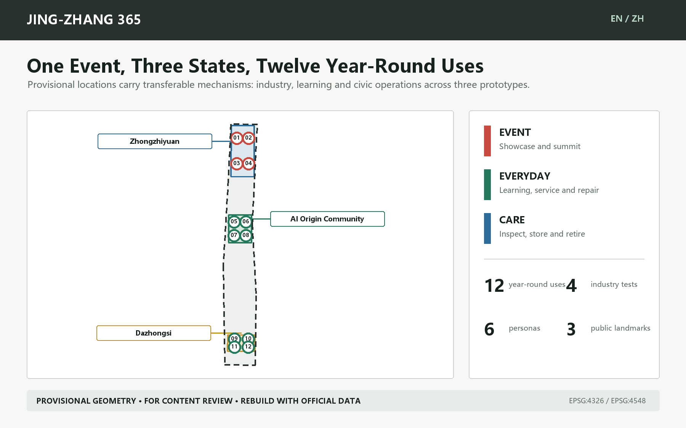

Authority runs from submitted GeoJSON and metrics/matrices to narrative, then to figures, PDFs and web presentation. A local deterministic builder derives geometry and metrics in EPSG:4548; the validator's fixed package file types require the builder to remain in ignored local cache rather than the PR [source:BUILD-PROVENANCE]. An official geometry update must trigger a complete rebuild, not a manual figure edit.

## Three-level scope framework

The coordinated-study level asks how an innovation ecosystem can support year-round public life. The overall-design level asks how civic assets switch between event, everyday and care. The key-area level tests responsibility, resources and stop conditions in three prototypes. This is an evidence chain from mechanism to network to inspectable prototype [standard:PROJECT-OFFICIAL-ANNOUNCEMENT] [depth:three_level_scope_framework].

- **43.6 sq km coordinated study:** organize research, controlled validation, enterprise support, public adoption and contribution records as a loop without inventing a new boundary.
- **Approximately 11.4 sq km overall design:** a 365 civic-life spine, six cross-links and three prototypes; statutory road and rail interfaces remain pending.
- **Approximately 368.4 ha key areas:** Zhongzhiyuan Test Yard, AI Origin Open School and Dazhongsi Commons Market, each operating in three states.

The identity is "JING-ZHANG 365 / 京张365". A logo direction combines a rail joint, reusable frame and calendar tick in a simple mark. It uses no corporate logo and does not reduce railway heritage to decoration. The subtitle describes the intended public value; it does not imply organizer approval.

## Industry ecosystem and future-city study

The ecosystem is a five-step feedback loop: **research -> controlled validation -> enterprise services -> public adoption -> public review**. Zhongzhiyuan supports testing and safety governance; AI Origin supports open learning, enterprise services and university transfer; Dazhongsi provides a city-facing interface for trade, repair and culture. Zhongguancun services and the public-space network connect these roles. This is a functional proposal, not a confirmed administrative assignment [standard:PROJECT-AGENT-OPEN-CALL-TASKBOOK].

Five cases supply bounded mechanisms rather than success claims or direct templates:

| Case | Verified mechanism | Bounded transfer |
| --- | --- | --- |
| Here East / London | Converted major-event media facilities into a long-term campus for education, innovation, production and public culture. | Borrow the practice of defining post-event operators and conversion first, not its scale or governance. |
| MIND Milano / Milan | An Expo site became a mixed innovation district through public-private coordination and interim activation. | Borrow the link between event, interim and long-term operations. |
| STATION F / Paris | Adaptively reused a historic freight station as a startup campus with a support ecosystem. | Borrow the combination of spatial asset and service network; reuse alone is not an ecosystem. |
| 22@Barcelona / Barcelona | Combined business, universities, research, housing, services, green space and industrial heritage in a mixed innovation district. | Borrow the co-location of innovation and daily urban functions, avoiding a mono-campus. |
| MaRS Discovery District / Toronto | Sustains an innovation hub through services, space, capital, technology adoption and multi-party support. | Borrow role separation and coordination; do not use operator-reported scale as impact evidence. |

The common conclusion is that an event leaves civic value only when spatial conversion, service networks, long-term stewardship and retirement are specified before opening. Each JING-ZHANG 365 asset therefore needs a passport covering owner/steward, users, event use, everyday use, care tasks, conversion time, storage, accessibility, data/safety, resources, evidence and retirement.

The cultural narrative is not "rail history plus AI lighting." Jing-Zhang railway history concerns infrastructure and connection; Zhongguancun culture concerns open knowledge becoming industry; emerging AI culture must accept public evidence and human accountability. They meet in an annual public afterlog that shows what remains, who uses it, what failed, what residents said and what retired [depth:overall_spatial_structure].

## Overall urban renewal and control-plan-depth design

The concept structure is one civic-life spine, three dual-use prototypes, six east-west links and twelve stoppable scenario nodes. The spine does not claim the as-built heritage park, road redline or railway alignment. Nine land-use pieces are cut from one projected boundary and recalculate to 1.000000 coverage [data:geometry/land_use.geojson#LU-004] [metric:land_use_coverage_ratio].

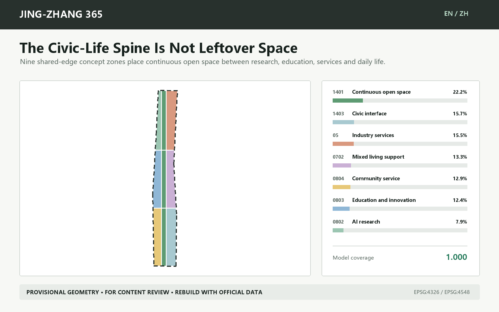

| Project code | Concept use | Model area | Model share |
| --- | --- | --- | --- |
| 0802 | AI research | 90.0 ha | 7.9% |
| 0803 | Education and innovation | 141.7 ha | 12.4% |
| 0804 | Community service | 147.6 ha | 12.9% |
| 1401 | Continuous open space | 253.7 ha | 22.2% |
| 05 | Industry services | 177.2 ha | 15.5% |
| 0702 | Mixed living support | 151.9 ha | 13.3% |
| 1403 | Civic interface | 179.1 ha | 15.7% |

This is a concept model, not a control plan. Codes come from the repository's validated project subset [standard:MNR-LAND-USE-CLASSIFICATION-GUIDE]. The model cannot establish existing underused land, ownership, FAR, height, density, setbacks or statutory green ratio. Those values remain `unknown/null` in `metrics.json` [standard:MOHURD-CONTROL-DETAILED-PLANNING].

## Detailed design of the three key areas

The provisional key-area geometry is fitted to the announced approximate tasks of 192.1, 104.3 and 72.0 ha, but is not official. Prototype mechanisms are transferable; all locations must be rebuilt with organizer geometry [data:geometry/key_areas.geojson#PROV-KEY-001] [data:geometry/key_areas.geojson#PROV-KEY-002] [data:geometry/key_areas.geojson#PROV-KEY-003].

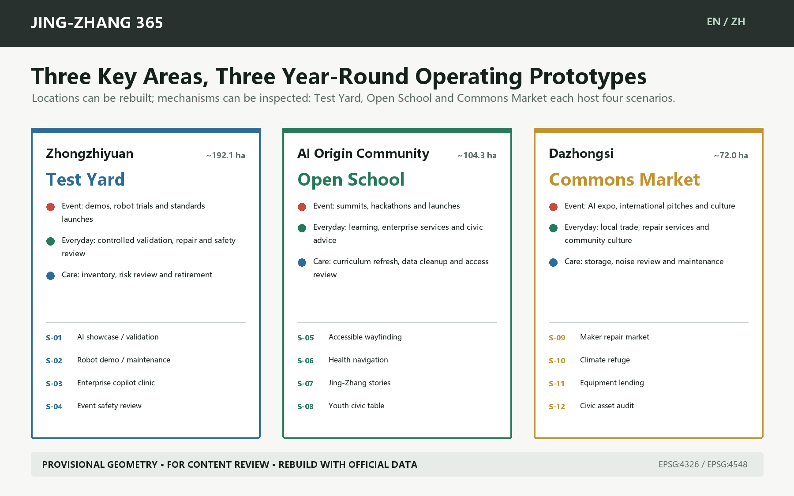

| Key area | Dual-use prototype | Event | Everyday | Care |
| --- | --- | --- | --- | --- |
| Zhongzhiyuan | Test Yard | demos, robot trials and standards launches | controlled validation, repair and safety review | inventory, risk review and retirement |
| AI Origin Community | Open School | summits, hackathons and launches | learning, enterprise services and civic advice | curriculum refresh, data cleanup and access review |
| Dazhongsi | Commons Market | AI expo, international pitches and culture | local trade, repair services and community culture | storage, noise review and maintenance |

**Zhongzhiyuan Test Yard.** Four nodes support enterprise validation, robot maintenance, an enterprise copilot clinic and safety review. Removable bays, controlled perimeters, storage and human emergency stops precede spectacle. No building scale or engineering position is fixed before official industry boundaries, fire, utilities and device responsibility are verified.

**AI Origin Open School.** Four nodes support no-app wayfinding, health navigation, shared cultural editing and a civic long table. Summit and hackathon assets convert to daily learning, community advice and enterprise service. Older, disabled and no-phone users must join field audits, while paper and staffed alternatives remain available.

**Dazhongsi Commons Market.** Four nodes support repair trade, climate refuge, equipment lending and the annual afterlog. It borrows station-access mechanisms but never infers a Dazhongsi station interface from provisional geometry. Detailed work starts with corrected extents, junction surveys, fire, noise, merchant needs and fair scheduling.

Three proposed honor nodes make accountability visible: the **Reuse Gantry** shows equipment moving from display to maintenance; the **365 Civic Long Table** converts developer events into daily learning and deliberation; the **Public Afterlog Wall** records assets, faults, complaints and keep/retire decisions. Final names require co-design with residents and operators.

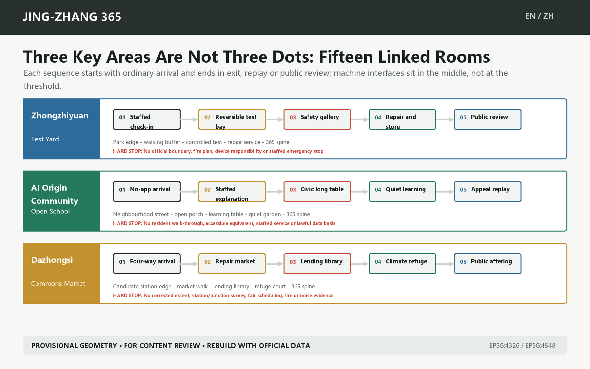

Each key area unfolds into five spatial stages: ordinary arrival -> staffed explanation and choice -> bounded machine interface -> blue-green recovery -> exit, appeal or public review. The sequence is registered in `visual/assets/key-area-sequences.json`. It prevents AI interfaces from occupying the only entrance or severing no-phone, no-AI and staffed routes. It expresses no road length, building scale or confirmed operator.

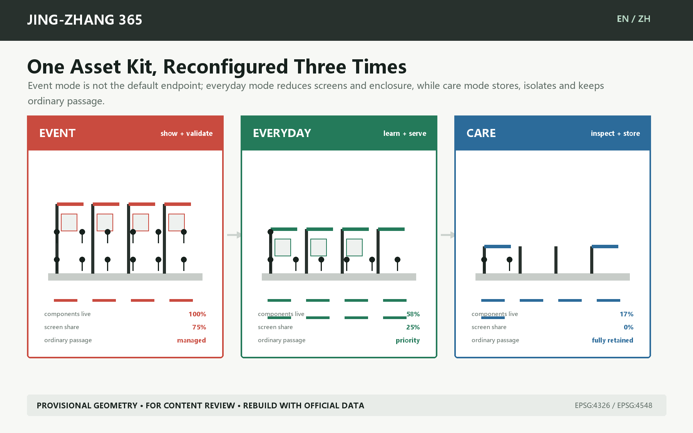

## AI ecosystem, personas and AI-enabled scenarios

The design does not use "AI talent" as a substitute for actual people. Six personas cover production, operations, residents, learning, trade and accessibility:

| ID | Users | Question for space and operations |
| --- | --- | --- |
| P-01 | R&D and demo teams | Bookable testing, IP boundaries, robust connectivity and removable equipment |
| P-02 | Event operators and maintainers | Storage, repair, handover lists, night safety and clear stop authority |
| P-03 | Residents, including older and no-phone users | No-app access, quiet hours, daily services, complaints and staffed desks |
| P-04 | Students, developers and startups | Low-barrier learning, collaboration, enterprise services and public contribution records |
| P-05 | Local merchants and cultural makers | Fair scheduling, small trading spaces, repair networks and cultural rights clearance |
| P-06 | Disabled and international visitors | Continuous access, bilingual wayfinding, human help and non-visual cues |

All twelve scenarios have event, everyday and care uses plus a data boundary, named steward and human stop rule. S-01 to S-04 are industrial test/validation scenarios; the remaining eight test public service, culture, repair, care and public-asset operations [metric:scenario_card_count] [metric:industry_test_scenario_count].

### S-01 Global AI showcase to daily validation yard

- Type and users: Industry test/validation; P-01, P-02; prototype located in Zhongzhiyuan and recalculated with official geometry.
- Event: Modular bays demonstrate models, devices and industrial systems.
- Everyday: Bays become bookable compatibility, safety and maintainability stations.
- Care: Power down, erase data, store equipment and publish fault/reuse records.
- Data boundary: Cleared enterprise test sets and device logs; no unrelated personal data.
- Steward and human review: Site operator plus independent safety reviewer.
- Stop rule: Stop on failed safety isolation, unclear data origin or absent human review.

### S-02 Robot demo to maintenance bay

- Type and users: Industry test/validation; P-01, P-02; prototype located in Zhongzhiyuan and recalculated with official geometry.
- Event: Low-speed robot demonstrations inside a controlled perimeter.
- Everyday: The same bay supports maintenance, operator training and incident review.
- Care: Inspect batteries, barriers, emergency stops and spare-part life.
- Data boundary: Device telemetry and fault codes retained only as needed.
- Steward and human review: Robotics firm plus trained site custodian.
- Stop rule: Stop if emergency controls fail, people enter the zone or weather exceeds limits.

### S-03 Enterprise copilot fair to weekday clinic

- Type and users: Industry test/validation; P-01, P-04; prototype located in Zhongzhiyuan and recalculated with official geometry.
- Event: A fair demonstrates enterprise agents and compliance tools.
- Everyday: A booked clinic helps small teams with data, IP, procurement and scenario access.
- Care: Refresh knowledge, remove expired policy and audit answers.
- Data boundary: Use public policy and user-submitted material; process sensitive files locally.
- Steward and human review: Enterprise service desk plus qualified specialists.
- Stop rule: Stop when sources expire, accountability is unclear or output is treated as approval.

### S-04 Event safety operations to review room

- Type and users: Industry test/validation; P-02, P-06; prototype located in Zhongzhiyuan and recalculated with official geometry.
- Event: Staff combine crowd, equipment and accessibility alerts.
- Everyday: The room supports safety training, drills and accessible-route review.
- Care: Delete raw personal traces and retain only aggregate incidents and remedies.
- Data boundary: Authorized aggregate footfall, equipment state and staff inspections.
- Steward and human review: Event control plus safety and accessibility leads.
- Stop rule: Stop if staff cannot take over, alerts cannot be verified or privacy is breached.

### S-05 No-app accessible wayfinding

- Type and users: Civic life; P-03, P-06; prototype located in AI Origin Community and recalculated with official geometry.
- Event: Bilingual large-print signs, tactile maps and staffed guidance.
- Everyday: Permanent signs and paper routes continue serving residents and visitors.
- Care: Disabled users join route audits and log barriers.
- Data boundary: Public routes, staffed audits and voluntary feedback; no account required.
- Steward and human review: Public-space operator plus accessibility adviser.
- Stop rule: When digital advice conflicts with closures, staff and physical signs prevail.

### S-06 Health service navigation desk

- Type and users: Civic life; P-03, P-06; prototype located in AI Origin Community and recalculated with official geometry.
- Event: Explain nearby public health services and emergency routes.
- Everyday: Keep a staffed desk, printed directory and non-diagnostic Q&A.
- Care: Regularly verify providers, contacts, hours and referral limits.
- Data boundary: Use public provider directories; store no symptoms or identity data.
- Steward and human review: Community service provider plus qualified health staff.
- Stop rule: Escalate on diagnostic content, emergencies or stale sources.

### S-07 Jing-Zhang guide and shared story editing

- Type and users: Civic life; P-04, P-05, P-06; prototype located in AI Origin Community and recalculated with official geometry.
- Event: Curators lead multilingual routes grounded in public archives.
- Everyday: Residents and students add verifiable stories and corrections.
- Care: Review sources and rights, mark disputes and archive versions.
- Data boundary: Public archives, cleared oral history and contributor-authorized content.
- Steward and human review: Cultural institution plus community editorial panel.
- Stop rule: Remove unverifiable, uncleared or unmarked disputed content.

### S-08 Youth learning and civic long table

- Type and users: Civic life; P-03, P-04; prototype located in AI Origin Community and recalculated with official geometry.
- Event: The table hosts workshops, developer exchange and open classes.
- Everyday: Daily use includes study, civic meetings, mutual aid and shared meals.
- Care: Volunteers and operators check lighting, seating, cleaning and quiet hours.
- Data boundary: No personal data; only anonymous booking and fault records.
- Steward and human review: Community operator plus student and resident stewards.
- Stop rule: Adjust when events displace daily use, exceed quiet hours or block access.

### S-09 Maker repair and local market

- Type and users: Civic life; P-03, P-05; prototype located in Dazhongsi and recalculated with official geometry.
- Event: Events showcase local makers, smart devices and repair skills.
- Everyday: Modules become stalls for local trade, repair, exchange and civic services.
- Care: Check power, fire safety, noise, recycling and fair scheduling.
- Data boundary: Voluntary vendor registration and public schedules; no commercial profiling.
- Steward and human review: Market operator plus merchant and resident panel.
- Stop rule: Pause on fire-safety failure, blocked passage or unfair scheduling.

### S-10 Climate and quiet refuge

- Type and users: Civic life; P-03, P-06; prototype located in Dazhongsi and recalculated with official geometry.
- Event: Provide shade, water, quiet waiting and staff help during heat and crowds.
- Everyday: Remain as all-weather rest, care and neighbourhood meeting points.
- Care: Check sensors, water, seating and night lighting.
- Data boundary: Environmental readings and staff checks; no face or identity collection.
- Steward and human review: Public-space operator plus community care partner.
- Stop rule: Correct when sensors fail, care is unstaffed or commercial use displaces refuge.

### S-11 Furniture and equipment lending library

- Type and users: Civic life; P-02, P-05; prototype located in Dazhongsi and recalculated with official geometry.
- Event: Supply stands, seating, signs, power and accessibility aids.
- Everyday: After events, lend assets to civic groups, merchants and schools.
- Care: Record location, condition, cleaning, repair and retirement.
- Data boundary: Asset, loan and repair records; no public personal contacts.
- Steward and human review: Asset-library operator plus borrowing organizations.
- Stop rule: Suspend loans when safety checks expire, stewards are absent or loss persists.

### S-12 Annual civic asset audit and public afterlog

- Type and users: Civic life; P-02, P-03, P-04, P-05, P-06; prototype located in Dazhongsi and recalculated with official geometry.
- Event: Publish assets, commitments, stewards and conversion dates left by the event.
- Everyday: Show use, repair, complaints, stoppages and next improvements year-round.
- Care: At T+365, residents, operators and professionals decide to keep, change or retire.
- Data boundary: Aggregate use, repair, complaint and spending records with privacy protection.
- Steward and human review: Public asset panel (concept proposal).
- Stop rule: Retire with reasons when evidence is weak, stewards leave or public value fails.

AI may assist navigation, organization, alerts, review and knowledge retrieval. Named people retain planning approval, medical/legal/safety judgment, device shutdown, dispute resolution and budget allocation. A service requiring personal information needs its own lawful basis, minimization and a non-AI/no-phone alternative; this concept assumes no such authorization [source:AI-GOVERNANCE] [source:ACCESSIBILITY-LAW].

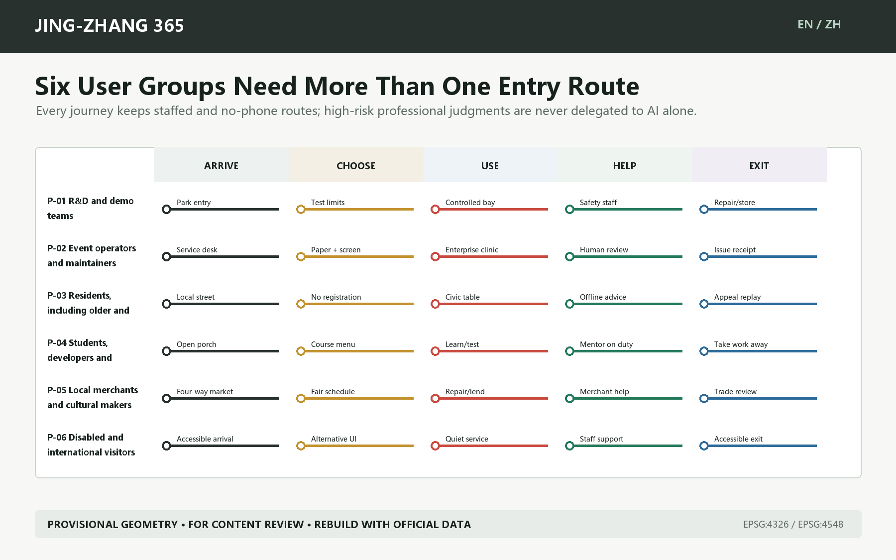

## Land use, building scale and retain-renovate-demolish method

The 36 small footprints in `geometry/buildings.geojson` are replaceable component carriers: three components per scenario test event, everyday and care conversion. Each states `existing_building_claim=false`, `demolition_claim=false`, `floor_count=null` and `height_m=null`. They are not 36 existing or proposed buildings. Without existing-building surveys, ownership, structure, heritage and controls, this package classifies no building for retention, renovation or demolition [depth:retain_renovate_demolish].

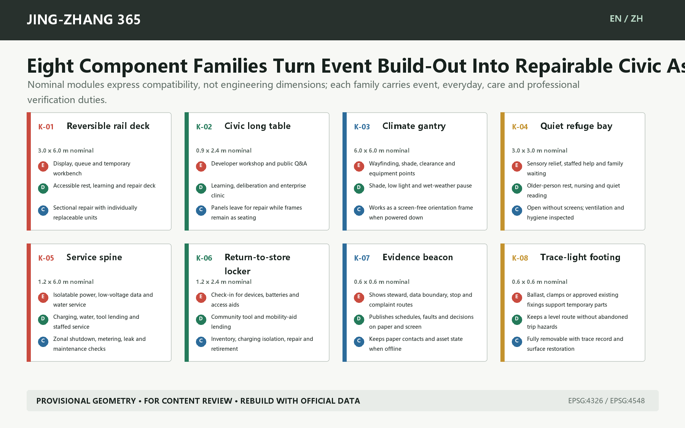

The eight families are a reversible rail deck, civic long table, climate gantry, quiet refuge bay, service spine, return-to-store locker, evidence beacon and trace-light footing. Modules in `visual/assets/spatial-components.json` are compatibility placeholders rather than engineering dimensions. Structure, slip resistance, accessibility, wind, fire, drainage, energy, heritage and underground services require specialist review. Actual changeover time remains `null` until a T-30 field rehearsal; the model does not guess it.

Concept footprint coverage is recalculable but is not an approved density. FAR, total floor area, maximum height, approved density, approved green ratio and minimum setback remain null. The professional sequence is: official boundary/parcel -> existing and ownership survey -> heritage/structure/fire review -> retain/renovate/demolish decision -> massing and height -> daylight, transport, utility and viability checks -> public and expert review [depth:development_intensity_controls] [depth:height_massing_character].

## Transport, rail, utilities and public services

The transport layer contains editable concept walking, cycling and greenway lines: one north-south spine, two auxiliary longitudinal links and six cross-links, totalling 43.07 model km. The value depends on provisional extents and straight-line abstraction; it is not an existing route or engineering length [data:geometry/roads.geojson#ROAD-001] [metric:walking_cycling_length_m].

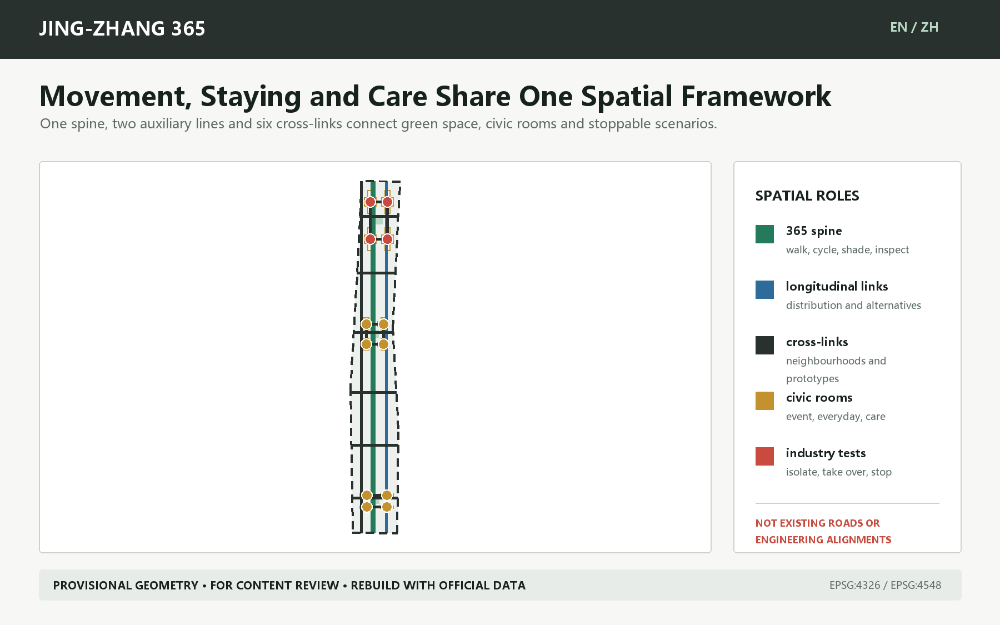

Station integration requires entrances, accessible paths, demand, road redlines, parking, bicycle storage and event transport evidence. Utility and new-infrastructure design defines service requirements only: isolatable power, shutdown, edge processing, storage, water/shade, fire access, drainage and energy records. It invents no pipeline, blue line or fire route [depth:traffic_rail_slow_parking] [depth:municipal_new_infrastructure].

## Blue-green space, public realm and character

A narrow concept green corridor expresses continuity, while twelve scenario polygons express civic use. Their model shares are 7.73% and 7.79%; they compare internal resource allocation and are not statutory controls [metric:green_ratio] [metric:public_space_ratio].

During events the spine supports circulation, shade, access and public display; every day it supports commuting, learning, repair and community service; in care mode it preserves inspection, storage and quiet hours. Character comes from removable, repairable materials whose state is legible. The proposal rejects atmosphere-only cyberpunk spectacle and screens over heritage. Historical content needs verifiable archives, rights clearance and revision history [standard:MOHURD-URBAN-DESIGN-MEASURES] [depth:blue_green_public_space].

## Renewal projects, policy and phasing

| Project | First action | Suggested steward | Evidence gate |
| --- | --- | --- | --- |
| JZ365-01 Three-state asset passport | Register event/everyday/care use for 12 prototypes | Event owner, site operator and proposed public asset panel | Steward, storage, rights, access and retirement rule |
| JZ365-02 Zhongzhiyuan Test Yard | Removable test bays and robot maintenance | Park operator, firms and independent safety reviewer | Official extent, device safety, fire and data responsibility |
| JZ365-03 Origin Open School | No-app guidance, long table and enterprise clinic | Community operator, university/service partners and residents | Field audit, co-evaluated access and fixed daily schedule |
| JZ365-04 Dazhongsi Commons Market | Repair market, lending library and quiet refuge | Market operator, merchants/residents and advisers | Official geometry, station interface, fire, noise and fair scheduling |
| JZ365-05 365 Spine | Test continuous walking/cycling and cross-links | Transport/landscape professionals and site operators | Official redlines, station interfaces, access and safety review |
| JZ365-06 Public Afterlog | Publish assets, faults, complaints, spending and decisions | Operators, resident representatives and professionals | T+30 summary and T+365 keep/retire decision |

Spatial phases are evidence gates, not government years or construction commitments. Phase 1 permits bounded, removable and stewarded prototypes; Phase 2 links them only after field audits, official interfaces and stable operators; Phase 3 scales, changes or retires according to T+365 evidence [data:geometry/phasing.geojson#PHASE-001] [depth:phasing_implementation].

The global AI event system uses six proposed checkpoints:

| Checkpoint | Decision | Evidence that must remain |
| --- | --- | --- |
| T-90 | Needs and rights | Users, cleared data, access and year-round use |
| T-30 | Conversion rehearsal | Changeover time, storage, human takeover and stop test |
| T0 | Event opens | Named staff, alerts, complaints and physical alternatives |
| T+1 | Everyday conversion | Storage, restoration, daily schedule and handover |
| T+30 | Public review | Use, repair, complaint, spending and remedy summary |
| T+365 | Keep/change/retire | Joint public, operator and professional decision with reasons |

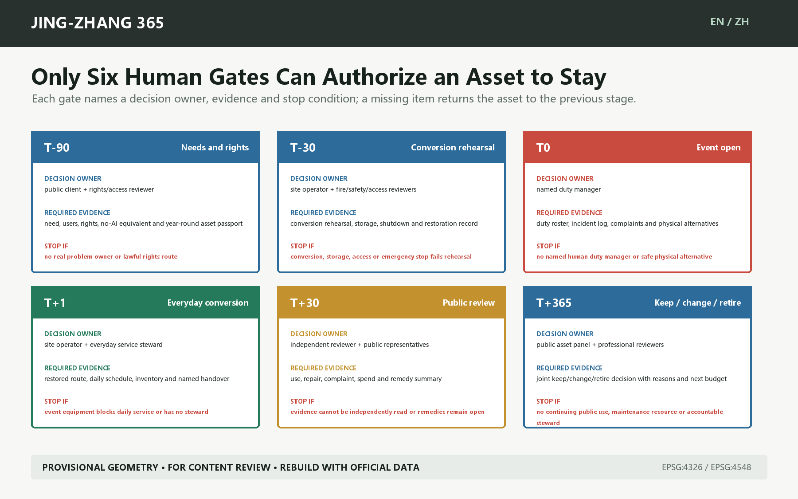

Named roles, first evidence and stop conditions are recorded in `visual/assets/delivery-gates.json`. Twelve blank asset passports sit in `visual/assets/public-asset-passports.json`; owner, storage, accessibility equivalent, annual resources and rehearsal time remain `null`, so these are contract templates rather than operating records or maturity proof.

Year-round operation does not depend on one festival: monthly repair/service hours, quarterly asset/access checks and an annual T+365 review. Event budgets must include changeover, storage, maintenance, staffed operation, insurance, safety, data governance, translation and exit. An installation without year-round resources cannot permanently occupy civic space as an "event legacy."

## Metrics, recalculation and compliance matrix

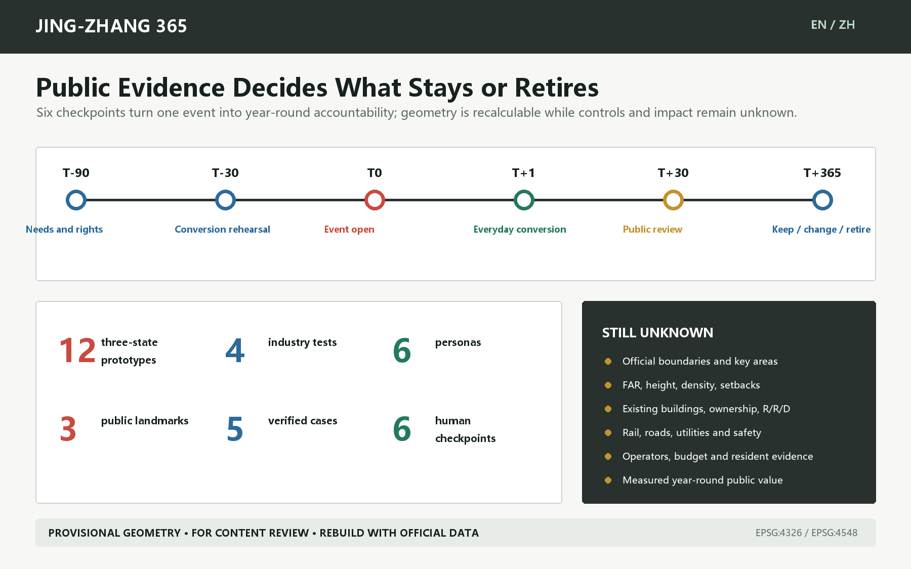

Machine metrics fall into three groups: geometric area/ratio/length; countable records (12 scenarios, 6 personas, 3 landmarks, 5 cases and 6 checkpoints); and unavailable statutory or field metrics such as intensity, height, density, setbacks and outcomes. Known spatial values use EPSG:4548; unknowns carry a reason and assumption [metric:scenario_node_count] [depth:metrics_recalculation].

`compliance_matrix.json` maps 17 notice tasks plus agent.1-agent.6. `standard_matrix.json` separates addressed standards from the missing non-mandatory architecture-depth reference. `design_depth_matrix.json` links fifteen depth items to evidence. Local validation reports structure, geometry, visuals and bilingual integrity only. It never declares organizer scoring, publication, selection or implementation.

## Risk, rights and compliance

| Missing input | Treatment in this package | Professional follow-up |
| --- | --- | --- |
| Official overall/key-area polygons | Provisional dashed geometry for content review only | Replace all scope/key polygons together and rebuild |
| Controls, ownership and existing buildings | FAR, height, density, setbacks and retain/renovate/demolish remain null or methodological | Obtain official data and qualified planning/architecture review |
| Road, rail and parking evidence | Transferable walking/cycling links only; no existing or engineering claims | Transport survey, station interfaces and safety modelling |
| Heritage, water and utilities | No invented protection, blue, pipeline or fire-access lines | Authority data and specialist assessment |
| Operators, budget and field voices | All stewards are proposals, not confirmations | Resident interviews, access audit, operator workshop and cost plan |

`assumptions.json` records the complete risk ledger, including Dazhongsi drift, absent fieldwork, unconfirmed operators/budgets, non-transferability of cases, named human responsibility for professional AI services and the lack of a standard repository license. The package declares `COMMUNITY-DISPLAY-ONLY`. Text, figures, GeoJSON, HTML and PDFs are generated locally; external case pages support text mechanisms only, with no copied images, trademarks or layouts [source:BUILD-PROVENANCE].

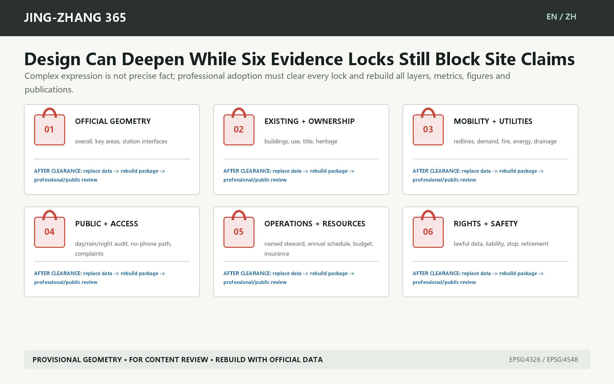

Offline visuals load no remote scripts, fonts, tiles, APIs, forms, iframes or trackers. Every text-bearing figure, report, visual and PDF has a Chinese/English pair. Official geometry replacement must be followed by regeneration, spatial review, visual review and human review. A human explicitly decides whether to open a public PR, how to answer reviewers and whether any implementation process should begin.

## References

- The official notice, taskbook, site package, standards index and source registry are enumerated in `sources.json` [source:OFFICIAL-ANNOUNCEMENT] [source:AGENT-TASKBOOK].
- Provisional-boundary provenance and replacement conditions are recorded in the submitted boundary layers and `assumptions.json` [source:BOUNDARY-SOURCE] [source:KEY-AREA-SOURCE].
- Official pages for Here East, MIND Milano, STATION F, 22@Barcelona and MaRS support bounded mechanisms only; no case image or self-reported impact is reused [source:CASE-HERE-EAST] [source:CASE-MIND] [source:CASE-STATION-F].
- Machine evidence is in `metrics.json`, three matrices, nine formal GeoJSON layers and `self_check.json` [source:BUILD-PROVENANCE].
