# 京张365：散场以后，公共生活继续

> 核心规则：**每个一次性 AI 场景，都要留下一个全年公共用途。** “365”不是活动品牌承诺，而是一套可复核的设计与运营方法：活动、日常、养护三种状态共享同一空间资产，并在 T-90、T-30、T0、T+1、T+30、T+365 六个检查点接受人工判断。

## 设计依据与资料清单

本方案参加的是 GitHub 智能体开源征集，不是公告所述资格预审、受偿机构竞赛或官方入选方案。公告提供 43.6 平方公里统筹研究、约 11.4 平方公里总体设计和约 368.4 公顷三处重点区的任务框架 [source:OFFICIAL-ANNOUNCEMENT]；面向智能体任务书提供共创原则、六项智能体任务和表达要求 [source:AGENT-TASKBOOK]。法定控规、官方精确多边形、权属和工程条件并未随仓库公开，因此所有边界相关图件均标注为临时数据 [source:BOUNDARY-SOURCE] [source:KEY-AREA-SOURCE]。

当前临时总体几何在 EPSG:4548 下复算为 11.413 平方公里；这个值只说明提交几何的内部一致性，不能替代公告约数或官方红线 [metric:site_area_sqm]。仓库 Issue #1029 指出临时大钟寺重点区与大钟寺站存在约 2.26 公里锚点偏移，故本方案只提出“站城连接机制”，不把线位当作场地结论 [source:ISSUE-1029]。本次没有开展现场踏勘、居民访谈、无障碍审计或运营工作坊；这不是附注，而是采用任何场地化决定前的硬性前置条件 [source:ISSUE-1061]。

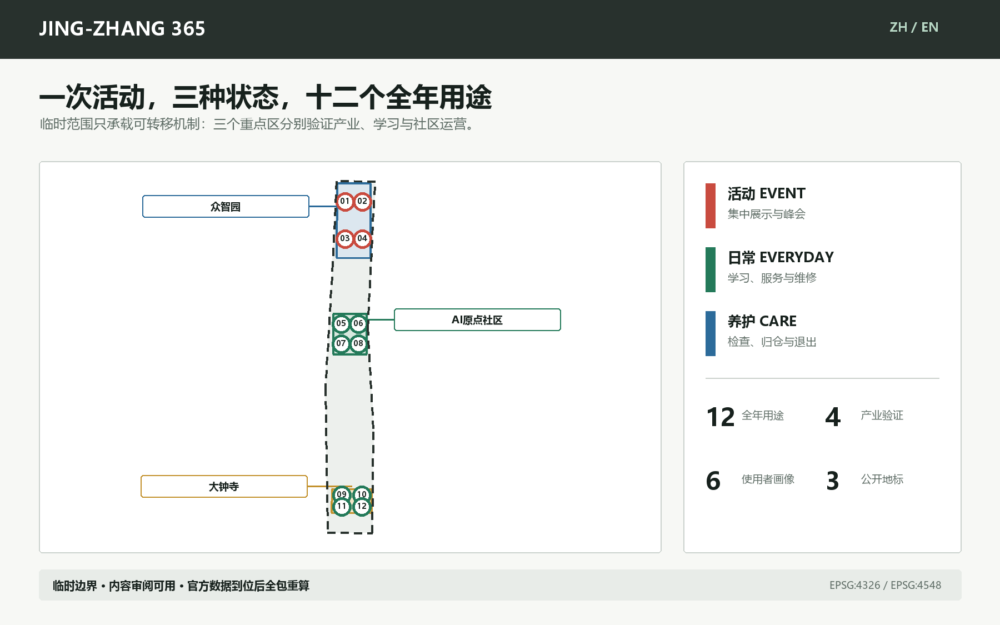

资料权威顺序为：提交 GeoJSON 与 metrics/matrices 高于正文，高于图件、PDF 和网页。本地确定性生成器在 EPSG:4548 中生成图层和指标，图件/网页/PDF只读取同一模型；因投稿目录文件类型受限，生成器保留在仓库忽略的本地缓存而不进入 PR [source:BUILD-PROVENANCE]。任何官方边界更新都必须触发整体重建，而不是手动修改一张图。

## 三层范围工作框架

统筹研究层回答“创新生态如何与全年公共生活互相支撑”；总体设计层回答“空间资产如何在活动、日常、养护之间转换”；重点区层用三个原型验证责任、资源和停用条件。三层之间不是面积逐级放大，而是从机制到网络再到可检查原型的证据链 [standard:PROJECT-OFFICIAL-ANNOUNCEMENT] [depth:three_level_scope_framework]。

- **统筹研究 43.6 平方公里：**把高校策源、企业验证、服务采用、公共体验与贡献记录组织为循环，不增画伪精确边界。
- **总体设计约 11.4 平方公里：**以“365公共生活主廊 + 六条横向慢行联系 + 三重点区原型”构成概念网络；法定道路和轨道接口待核。
- **重点区约 368.4 公顷：**众智园“测试场”、AI原点社区“开放学校”、大钟寺“共益市集”，三者都执行活动/日常/养护状态。

品牌识别使用“JING-ZHANG 365 / 京张365”。Logo方向把京张铁路接头、可复用门架和日历刻度合成一个简洁标记；不使用企业标识，也不把历史遗产做成装饰。中文副标题“散场以后，公共生活继续”与英文副标题“After the Event, Public Life Continues”说明公共价值，而非声称活动已经获批。

## 统筹研究范围产业与未来城市研究

产业生态采用五段反馈：**研究策源 -> 受控验证 -> 企业服务 -> 公共采用 -> 公开复盘**。众智园承担受控测试和安全治理，原点社区承担开放学习、企业服务与高校转化，大钟寺承担面向城市的消费、维修和文化接口；中关村企业服务能力与小月河/京张公共空间作为两翼，把产业知识送入公共服务，再把使用与投诉证据送回研发。这个循环是功能建议，不是已确认的行政分工 [standard:PROJECT-AGENT-OPEN-CALL-TASKBOOK]。

五个国际案例只用于提取机制，不作成功背书或直接移植：

| 案例 | 可核验机制 | 本方案只借鉴什么 |
| --- | --- | --- |
| Here East / London | 把大型赛事媒体设施转为教育、创新、生产和公共文化的长期园区。 | 借鉴“先定义赛后运营主体和空间转换”，不照搬规模与治理。 |
| MIND Milano / Milan | 世博场地以公共与私人协作转为混合创新城区，并以中间使用维持连续活力。 | 借鉴活动期、过渡期、长期运营三段衔接。 |
| STATION F / Paris | 将历史货运站适应性改造为创业园区，并叠加完整支持服务。 | 借鉴“空间资产 + 服务网络”，不把建筑改造等同于生态形成。 |
| 22@Barcelona / Barcelona | 把企业、大学、研究、住房、服务、绿地和工业遗产纳入混合创新城区。 | 借鉴创新与日常城市功能并置，避免单一园区化。 |
| MaRS Discovery District / Toronto | 以服务、空间、资本、技术采用和多方支持共同维持创新枢纽。 | 借鉴角色拆分和责任协同，不引用运营方自报规模作为成效证据。 |

由这些案例得到的判断是：一次活动能否留下公共价值，取决于活动前是否同时指定**空间转换、服务网络、长期责任和退出机制**。因此每个 JING-ZHANG 365 资产都附一张“资产护照”：所有者/责任人、服务使用者、活动用途、日常用途、养护任务、转换时间、仓储位置、无障碍、数据与安全、资源预算、证据、退休路径。缺任何一项都不能以“智慧设施”名义长期留置。

文化叙事不是“铁路历史 + AI灯光”的拼贴。京张铁路代表基础设施如何改变城市联系，中关村文化代表知识如何通过开放协作变成产业，AI新文化则要接受公共证据和人类责任的约束。三者在“年度散场日志”汇合：每年公布哪些设施被留下、谁在使用、发生过什么故障、居民提出什么意见、哪些项目退出。这比永久纪念碑更能形成可持续的荣誉系统 [depth:overall_spatial_structure]。

## 总体设计范围城市更新与控规深度城市设计

空间结构是“一条365公共生活主廊、三处双用途原型、六条横向慢行联系、十二个可停用场景节点”。主廊只表达连续公共生活和绿色慢行意图，不等同于京张遗址公园已建边界、道路红线或轨道线。九块用地由同一临时边界的共享切割面生成，覆盖率复算为 1.000000 [data:geometry/land_use.geojson#LU-004] [metric:land_use_coverage_ratio]。

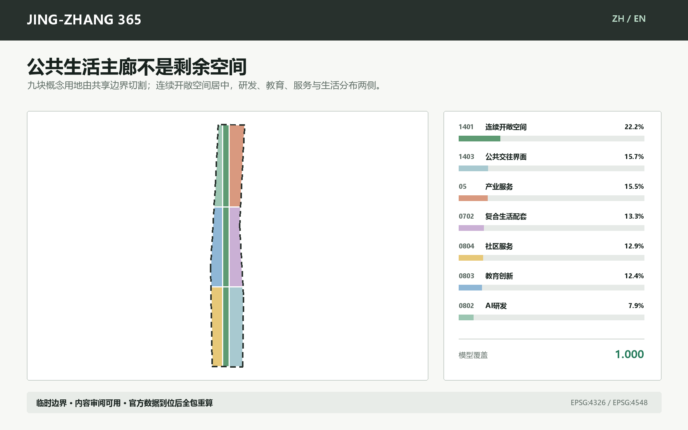

| 项目代码 | 概念用途 | 模型面积 | 模型占比 |
| --- | --- | --- | --- |
| 0802 | AI研发 | 90.0 ha | 7.9% |
| 0803 | 教育创新 | 141.7 ha | 12.4% |
| 0804 | 社区服务 | 147.6 ha | 12.9% |
| 1401 | 连续开敞空间 | 253.7 ha | 22.2% |
| 05 | 产业服务 | 177.2 ha | 15.5% |
| 0702 | 复合生活配套 | 151.9 ha | 13.3% |
| 1403 | 公共交往界面 | 179.1 ha | 15.7% |

这张表是概念模型，不是控规指标。用地代码来自仓库核验子集 [standard:MNR-LAND-USE-CLASSIFICATION-GUIDE]；模型无法回答现状低效用地、权属、容积率、建筑高度、密度、退线和法定绿地率。上述值在 `metrics.json` 保持 `unknown/null`，以防精确数字制造虚假确定性 [standard:MOHURD-CONTROL-DETAILED-PLANNING]。

## 重点区域详细设计

三处重点区的临时几何分别拟合公告约 192.1、104.3 和 72.0 公顷的任务描述，但不是官方多边形。原型空间动作可转移，位置必须待官方几何统一重算 [data:geometry/key_areas.geojson#PROV-KEY-001] [data:geometry/key_areas.geojson#PROV-KEY-002] [data:geometry/key_areas.geojson#PROV-KEY-003]。

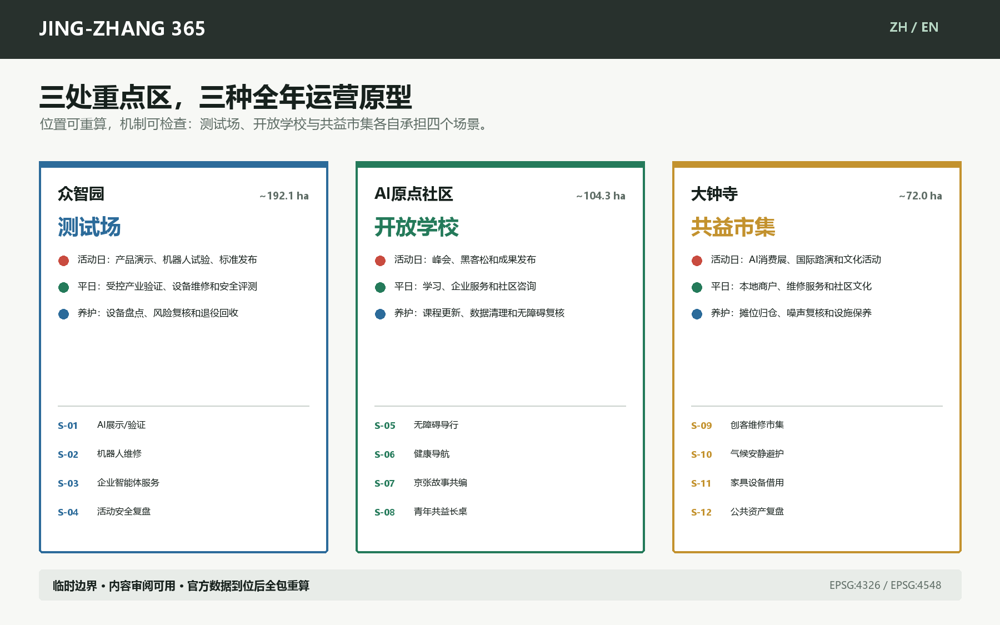

| 重点区 | 双用途原型 | 活动日 | 平日 | 养护状态 |
| --- | --- | --- | --- | --- |
| 众智园 | 测试场 | 产品演示、机器人试验、标准发布 | 受控产业验证、设备维修和安全评测 | 设备盘点、风险复核和退役回收 |
| AI原点社区 | 开放学校 | 峰会、黑客松和成果发布 | 学习、企业服务和社区咨询 | 课程更新、数据清理和无障碍复核 |
| 大钟寺 | 共益市集 | AI消费展、国际路演和文化活动 | 本地商户、维修服务和社区文化 | 摊位归仓、噪声复核和设施保养 |

**众智园测试场。** 四个节点服务企业测试、机器人维修、企业智能体门诊和安全运营复盘。空间采用可撤场工位、明确隔离、设备归仓和人工急停；在官方产业边界、消防、市政和设备责任确认前，不确定建筑规模与工程位置。

**AI原点开放学校。** 四个节点服务无应用导行、健康导航、文化共编和共益长桌。空间把峰会/黑客松设施转成平日学习、社区咨询和企业服务；长者、残障使用者与无手机使用者必须参与现场走查，且始终保留纸质与人工路径。

**大钟寺共益市集。** 四个节点服务维修市集、气候避护、设备借用和年度散场日志。它借助轨道可达性的机制，但不以临时几何推断大钟寺站接口。正式深化必须先纠正范围、调查路口四象限、消防、噪声、商户需求和公平排期。

三处荣誉节点分别是：众智园**复用门架**，公开显示设备从展示到维修的状态；原点社区**365共益长桌**，把开发者活动转成日常学习与议事；大钟寺**散场日志墙**，记录资产、故障、投诉和保留/退出决定。三者都是概念名称，最终命名需与居民和产权运营方共定。

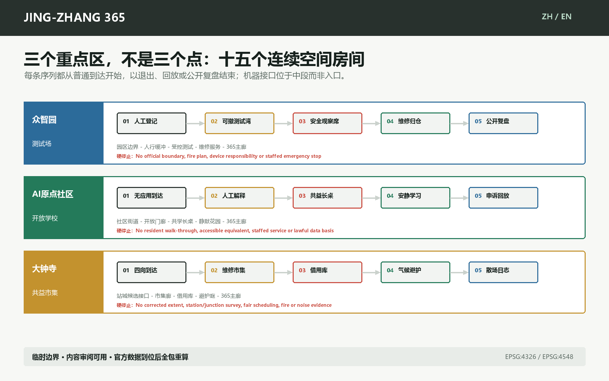

每处重点区进一步展开为五段空间序列：普通到达 -> 人工解释与选择 -> 受控机器接口 -> 蓝绿恢复 -> 退出/申诉/公开复盘。该序列登记在 `visual/assets/key-area-sequences.json`，用于确保 AI 接口不占据唯一入口，也不切断无手机、无AI和人工服务。序列不表示道路长度、建筑尺度或已确认的运营主体。

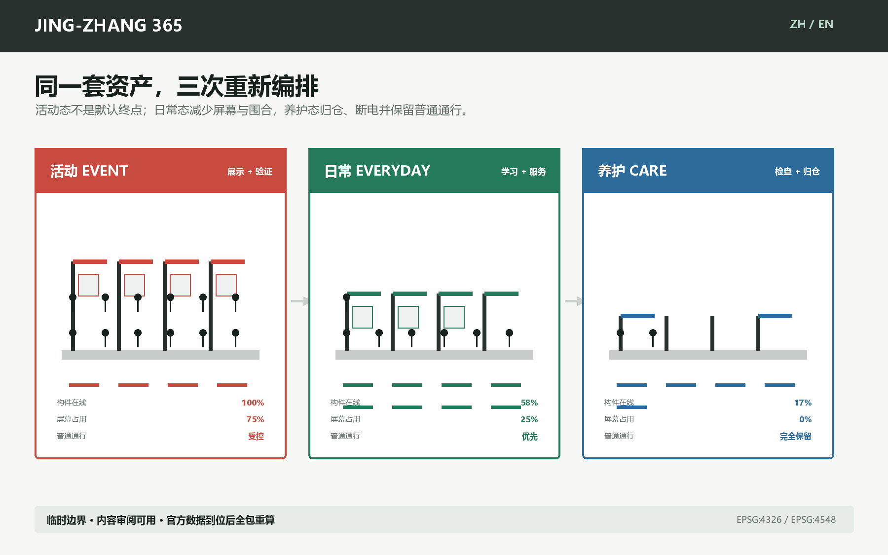

## AI 创新生态、人才画像与 AI+ 场景

本方案不以“AI人才”替代真实使用者。六类画像涵盖生产、运营、居民、学习、经营与无障碍需求：

| 编号 | 使用者 | 需要被空间和运营回答的问题 |
| --- | --- | --- |
| P-01 | 研发与演示团队 | 可预约测试、知识产权边界、稳定网络和可撤场设备 |
| P-02 | 活动运营与维护人员 | 仓储、检修、交接清单、夜间安全和明确停用权 |
| P-03 | 周边居民（含长者与无手机使用者） | 无应用入口、安静时段、日常服务、可投诉与人工柜台 |
| P-04 | 学生、开发者与初创团队 | 低门槛学习、协作空间、企业服务和公开贡献记录 |
| P-05 | 本地商户与文化创作者 | 公平排期、小额经营空间、维修网络和文化内容授权 |
| P-06 | 残障与国际访客 | 连续无障碍、双语导视、人工帮助和非视觉提示 |

十二个场景全部具备活动、日常、养护用途，写明数据边界、责任主体和人工停用规则。其中 S-01 至 S-04 为产业测试/验证场景，满足不少于三项的要求；其余八项验证公共服务、文化、维修、照护和公共资产运营 [metric:scenario_card_count] [metric:industry_test_scenario_count]。

### S-01 全球AI展示转日常验证场

- 类型与使用者：产业测试验证；P-01, P-02；空间原型位于众智园，位置随官方边界重算。
- 活动日：模块化展台演示模型、终端和工业系统。
- 平日：展台转为预约式兼容性、安全性和可维护性验证工位。
- 养护：断电、数据擦除、设备归仓并公布故障与复用记录。
- 数据边界：企业清权测试集与现场设备日志；不采集无关个人数据。
- 责任与人工复核：场地运营方 + 独立安全复核员。
- 停用规则：安全隔离失效、数据来源不明或人工复核缺席即停用。

### S-02 机器人演示转维修工位

- 类型与使用者：产业测试验证；P-01, P-02；空间原型位于众智园，位置随官方边界重算。
- 活动日：围栏内低速机器人演示和观众解说。
- 平日：同一工位用于巡检机器人维护、操作员培训和故障复盘。
- 养护：检查电池、围栏、急停和备件寿命。
- 数据边界：设备遥测与故障码，按项目最小留存。
- 责任与人工复核：机器人企业 + 受训场地管理员。
- 停用规则：急停不可用、人员进入隔离区或天气超限即停。

### S-03 企业智能体展转平日服务门诊

- 类型与使用者：产业测试验证；P-01, P-04；空间原型位于众智园，位置随官方边界重算。
- 活动日：集中展示企业服务智能体和合规工具。
- 平日：预约门诊帮助小团队处理数据、知识产权、采购和场景申请。
- 养护：更新知识库、撤下失效政策并抽检答复。
- 数据边界：只使用公开政策和用户主动提供材料，敏感文件本地处理。
- 责任与人工复核：企业服务机构 + 对口专业人员。
- 停用规则：来源过期、专业责任不明或输出被当作审批结论即停。

### S-04 活动安全运营转复盘室

- 类型与使用者：产业测试验证；P-02, P-06；空间原型位于众智园，位置随官方边界重算。
- 活动日：人工值守下汇总客流、设备和无障碍告警。
- 平日：作为场地安全培训、应急演练和无障碍路线复核室。
- 养护：删除原始个人轨迹，仅保留聚合事件与整改记录。
- 数据边界：经授权的聚合客流、设备状态和人工巡查记录。
- 责任与人工复核：活动总控 + 公共安全和无障碍负责人。
- 停用规则：无法人工接管、告警来源不可核验或发生隐私越界即停。

### S-05 无应用无障碍导行

- 类型与使用者：公共生活；P-03, P-06；空间原型位于AI原点社区，位置随官方边界重算。
- 活动日：双语大字导视、触觉地图和人工引导分流。
- 平日：固定导视与纸质路线继续服务居民和访客。
- 养护：残障使用者参与路线走查并登记阻断点。
- 数据边界：公开路网、人工走查和自愿反馈，不要求账号。
- 责任与人工复核：公共空间运营方 + 无障碍顾问。
- 停用规则：数字建议与现场封闭不一致时以人工和实体导视为准。

### S-06 健康服务导航台

- 类型与使用者：公共生活；P-03, P-06；空间原型位于AI原点社区，位置随官方边界重算。
- 活动日：解释附近公共健康服务和紧急求助路径。
- 平日：保留人工柜台、纸质目录和非诊断式问答。
- 养护：定期核验机构、电话、营业时间和转介边界。
- 数据边界：只使用公开机构目录，不保存症状或身份信息。
- 责任与人工复核：社区服务机构 + 具资质健康人员。
- 停用规则：出现诊断倾向、紧急情况或来源过期时转人工。

### S-07 京张文化导览与故事共编

- 类型与使用者：公共生活；P-04, P-05, P-06；空间原型位于AI原点社区，位置随官方边界重算。
- 活动日：策展人带领多语种路线和公开史料讲解。
- 平日：居民与学生在编辑台补充可核验故事和纠错。
- 养护：史料审核、授权复查、争议标注和版本归档。
- 数据边界：公开档案、清权口述材料和贡献者授权内容。
- 责任与人工复核：文化机构 + 社区编辑委员会。
- 停用规则：来源不可核、肖像或版权未清、争议未标注即下线。

### S-08 青年学习与共益长桌

- 类型与使用者：公共生活；P-03, P-04；空间原型位于AI原点社区，位置随官方边界重算。
- 活动日：活动日承担工作坊、开发者交流和开放课堂。
- 平日：平日成为自习、社区议事、互助咨询和共享用餐空间。
- 养护：志愿者与运营方检查照明、座椅、清洁和安静时段。
- 数据边界：无需个人数据，仅记录匿名排期与故障。
- 责任与人工复核：社区运营方 + 学生与居民轮值。
- 停用规则：占用排挤日常使用、噪声超时或无障碍通道受阻即调整。

### S-09 创客维修与本地市集

- 类型与使用者：公共生活；P-03, P-05；空间原型位于大钟寺，位置随官方边界重算。
- 活动日：集中展示本地创客、智能终端和维修技能。
- 平日：模块摊位转为小商户、维修、旧物交换和社区服务。
- 养护：检查用电、消防、噪声、材料回收和公平排期。
- 数据边界：经营者自愿登记与公开排期，不作商业画像。
- 责任与人工复核：市场运营方 + 商户与居民委员会。
- 停用规则：消防不合格、侵占通行或排期不公即暂停。

### S-10 气候与安静避护点

- 类型与使用者：公共生活；P-03, P-06；空间原型位于大钟寺，位置随官方边界重算。
- 活动日：高温、拥挤时提供遮阴、饮水、安静等候和人工帮助。
- 平日：保留为全天候休息、照护和邻里会合点。
- 养护：校验温湿度设备、饮水、座椅和夜间照明。
- 数据边界：环境数据与人工巡查，不采集面部或身份。
- 责任与人工复核：公共空间运营方 + 社区照护伙伴。
- 停用规则：设备失准、照护无人值守或空间被商业活动占用即纠偏。

### S-11 活动家具与设备借用库

- 类型与使用者：公共生活；P-02, P-05；空间原型位于大钟寺，位置随官方边界重算。
- 活动日：提供展架、座椅、导视、电源和无障碍辅助设备。
- 平日：活动后向社区组织、小商户和学校开放借用。
- 养护：记录位置、状态、清洁、维修和报废去向。
- 数据边界：资产编号、借还和维修记录；不公开个人联系方式。
- 责任与人工复核：资产库运营方 + 使用单位。
- 停用规则：安全检验过期、责任人缺失或连续丢失即暂停外借。

### S-12 年度公共资产复盘与散场日志墙

- 类型与使用者：公共生活；P-02, P-03, P-04, P-05, P-06；空间原型位于大钟寺，位置随官方边界重算。
- 活动日：公布本届活动留下的资产、承诺、责任人和转换日期。
- 平日：持续展示使用、维修、投诉、停用和下一次改进。
- 养护：T+365由居民、运营方和专业人员共同决定保留、修改或退出。
- 数据边界：聚合使用、维修、投诉与支出记录，保护个体隐私。
- 责任与人工复核：公开资产委员会（概念建议）。
- 停用规则：证据不足、责任人退出或公共价值未达标时退出并说明。

AI只承担导航、整理、告警、辅助复核和知识检索；规划审批、医学/法律/安全判断、设备停机、内容争议和资金分配由具名人类负责。任何需要个人信息的服务必须另行取得合法依据、最小化采集并提供无AI/无手机替代，本提案不预设授权 [source:AI-GOVERNANCE] [source:ACCESSIBILITY-LAW]。

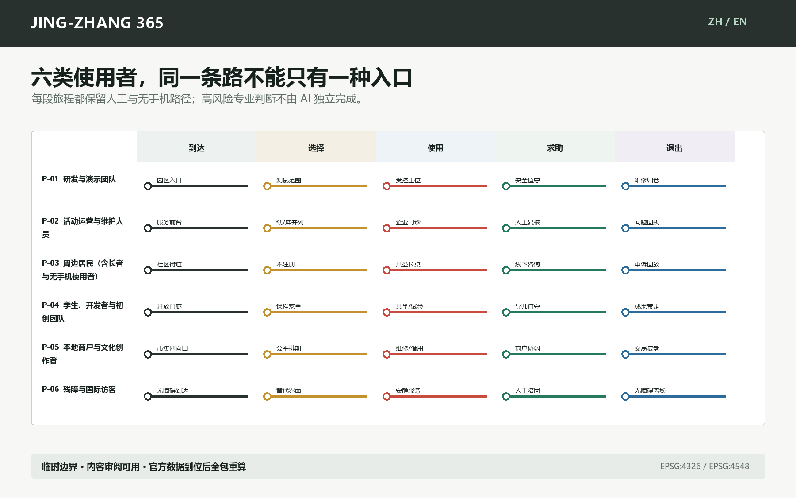

## 用地、建筑规模与拆改留方案

`geometry/buildings.geojson` 中的36个小型基底只是可替换构件载体：每个场景以3个构件验证活动、日常和养护转换。属性明确 `existing_building_claim=false`、`demolition_claim=false`、`floor_count=null` 与 `height_m=null`。它们不是36栋现状或拟建建筑。在没有现状建筑测绘、产权、结构安全、文保和控规前，本方案不判定任何建筑保留、改造或拆除 [depth:retain_renovate_demolish]。

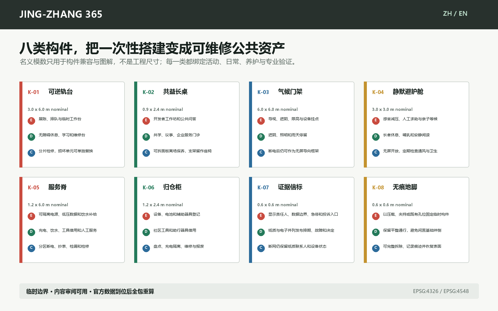

八类构件包括可逆轨台、共益长桌、气候门架、静默避护舱、服务脊、归仓柜、证据信标和无痕地脚。`visual/assets/spatial-components.json` 中的模数是兼容性占位，不是工程尺寸；结构、防滑、无障碍、风、消防、雨洪、能源、文保和地下管线均须专业复核。实际转场时间保持 `null`，必须在 T-30 由现场演练产生，不能由模型猜测。

概念建筑覆盖率可从模型基底复算，但不能作为建筑密度控制。容积率、总建筑规模、最高高度、批准建筑密度、批准绿地率和最小退线均为空值。正式工作顺序是：官方边界/地块 -> 现状与产权调查 -> 文保/结构/消防评估 -> 拆改留判定 -> 体量和高度方案 -> 日照、交通、市政和经济校核 -> 公众与专家复核。跳过任一步都不能把概念基底升级为实施图 [depth:development_intensity_controls] [depth:height_massing_character]。

## 交通、轨道、市政与公共服务设施

交通图层只包含可编辑的步行、骑行和绿道概念线：一条南北主廊、两条辅助纵向线与六条横向联系，总模型长度 43.07 公里。这个值受临时边界和直线化表达影响，不代表现状路径、工程长度或已确认过街设施 [data:geometry/roads.geojson#ROAD-001] [metric:walking_cycling_length_m]。

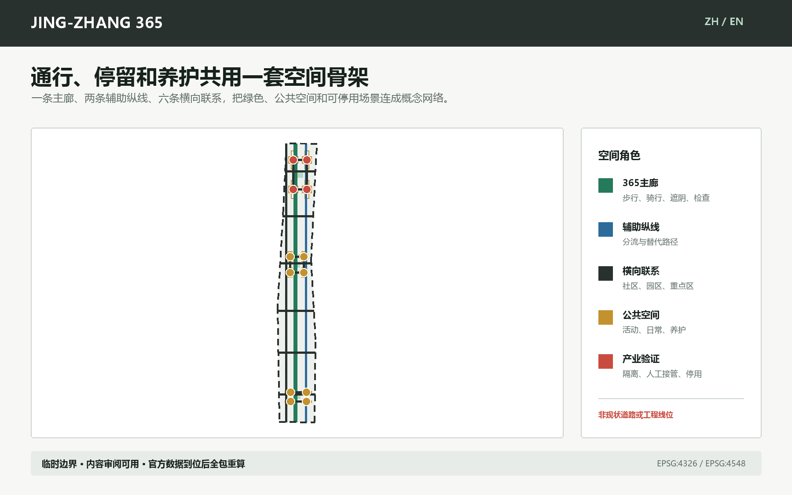

轨道一体化必须补充站点出入口、无障碍路径、客流、道路红线、停车、非机动车和活动日交通组织。市政与新基建只定义服务要求：可断电分区、应急停机、端侧处理、设备归仓、饮水遮阴、消防通道、雨洪和能耗记录；不画缺乏依据的管线、蓝线或消防路线 [depth:traffic_rail_slow_parking] [depth:municipal_new_infrastructure]。

## 蓝绿空间、公共空间与城市风貌

绿色空间以一条窄幅概念连续廊道表达，公共空间以12个场景面表达。二者在模型中的比例分别为 7.73% 和 7.79%，只用于比较本方案内部资源分配，不是法定绿地率或公共空间控制值 [metric:green_ratio] [metric:public_space_ratio]。

活动期间，主廊承担分流、遮阴、无障碍和公共展示；平日承担通勤、学习、维修和社区服务；养护状态保留检查通道、设备归仓和安静时段。风貌使用可拆卸、可维修、可识别状态的普通材料，不制造赛博朋克景观，也不让屏幕覆盖京张历史。历史内容必须由可核验档案和清权叙事支撑，争议内容留有修订记录 [standard:MOHURD-URBAN-DESIGN-MEASURES] [depth:blue_green_public_space]。

## 更新项目清单、实施政策与分期计划

| 项目 | 先做什么 | 谁负责 | 进入下一步的证据 |
| --- | --- | --- | --- |
| JZ365-01 三状态资产护照 | 为12个原型登记活动/日常/养护用途 | 活动方、场地运营、公共资产委员会（建议） | 责任人、仓储、清权、无障碍和退出规则齐备 |
| JZ365-02 众智园测试场 | 先做可撤场工位与机器人维修湾 | 园区运营 + 企业 + 独立安全复核 | 官方范围、设备安全、消防和数据责任确认 |
| JZ365-03 原点开放学校 | 先做无应用导行、共益长桌和企业服务门诊 | 社区运营 + 高校/企业服务 + 居民 | 现场走查、无障碍共评、固定日常排期 |
| JZ365-04 大钟寺共益市集 | 先做维修市集、借用库和安静避护点 | 市场运营 + 商户/居民 + 专业顾问 | 官方几何、轨道接口、消防、噪声和公平排期 |
| JZ365-05 365主廊 | 先验证连续步行/骑行和横向联系 | 交通/景观专业团队 + 场地运营 | 官方红线、站点接口、无障碍和安全评估 |
| JZ365-06 散场日志 | 公开资产、故障、投诉、支出和决定 | 运营方 + 居民代表 + 专业人员 | T+30摘要和T+365保留/退出决定 |

空间分期表达的是证据门槛，不是政府年份或建设承诺。第一阶段只允许边界内、可撤场、责任明确的原型；第二阶段在现场走查、官方接口和稳定运营者确认后连成网络；第三阶段根据T+365证据选择扩展、修改或退出 [data:geometry/phasing.geojson#PHASE-001] [depth:phasing_implementation]。

全球AI活动体系采用六个概念检查点：

| 检查点 | 判断 | 必须留下的证据 |
| --- | --- | --- |
| T-90 | 需求与权利 | 使用者、清权数据、无障碍和日常用途 |
| T-30 | 转换演练 | 撤场/转场时长、仓储、人工接管和停用测试 |
| T0 | 活动开放 | 值守人、告警、投诉和实体替代路径 |
| T+1 | 转入日常 | 设备归仓、场地恢复、日常排期和责任交接 |
| T+30 | 公开复盘 | 使用、维修、投诉、支出和整改摘要 |
| T+365 | 保留/修改/退出 | 居民、运营和专业人员共同决定并公布理由 |

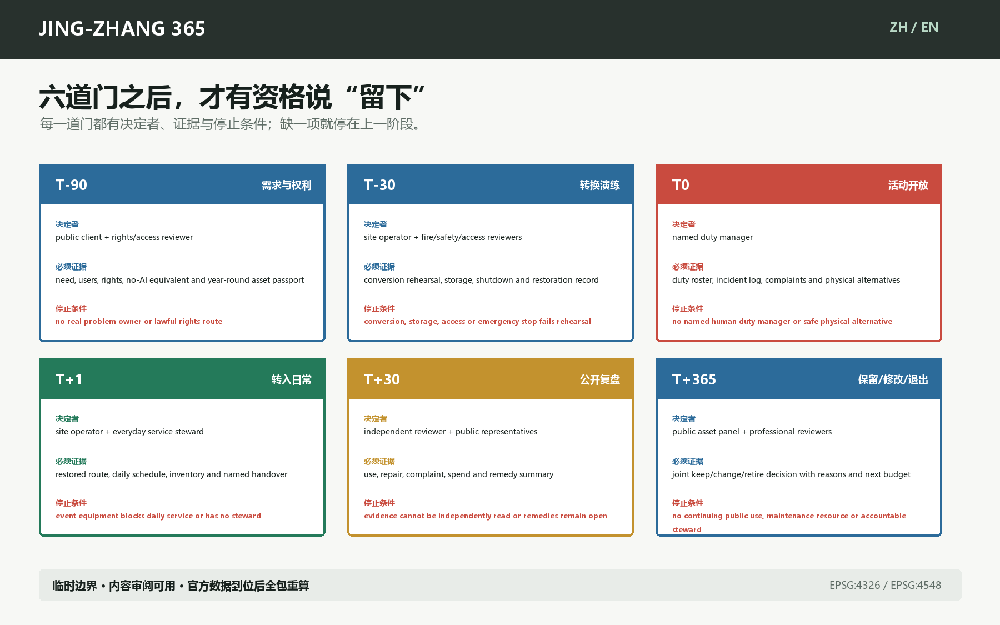

交付门的具名角色、第一份证据和停止条件登记在 `visual/assets/delivery-gates.json`。十二张空白资产护照位于 `visual/assets/public-asset-passports.json`；所有者、仓储、无障碍等效、全年资源与演练时长仍为 `null`，因此它们是待填合同模板，不是运营记录或成熟度证明。

年度社区运营不依赖一次盛会：每月开放维修/服务时段，每季度检查资产和无障碍，每年T+365公开复盘。活动预算必须同时列出转场、仓储、保养、人工值守、保险、安全、数据治理、翻译和退出成本；没有全年资源的装置不得以“活动遗产”永久占用公共空间。

## 指标体系、面积复算与合规矩阵

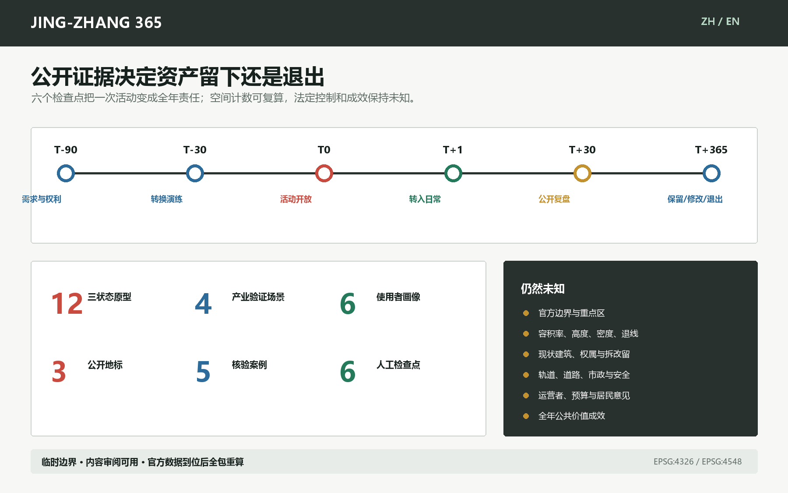

机器指标分三类：可由几何复算的面积/比例/长度；可由计数复核的12场景、6画像、3地标、5案例、6检查点；必须等待法定或现场资料的强度、高度、密度、退线和运营绩效。所有已知空间值投影到 EPSG:4548，所有未知值保留理由与假设 [metric:scenario_node_count] [depth:metrics_recalculation]。

`compliance_matrix.json` 覆盖公告17项与 agent.1-agent.6；`standard_matrix.json` 区分已回应标准与缺失的非强制建筑深度文件；`design_depth_matrix.json` 对15个深度项给出证据链。通过本地脚本只代表结构、空间、视觉和双语检查结果，不代表组织方内容评分、专业评分、发布、入选或实施。

## 风险、版权与合规说明

| 缺失资料 | 本包如何处理 | 正式深化动作 |
| --- | --- | --- |
| 官方总体/重点区多边形 | 保留临时边界、虚线表达、只用于内容审阅 | 三层范围与三重点区整体替换并全包重算 |
| 控规、产权和现状建筑 | 容积率、高度、密度、退线、拆改留全部为空值或方法 | 取得正式资料并由规划/建筑专业团队确认 |
| 道路、轨道和停车 | 只画可转移的步行骑行联系，不声称现状或工程线位 | 交通调查、站点接口和安全仿真 |
| 文保、河道和市政 | 不推断保护线、蓝线、管线或消防通道 | 主管部门资料和专项评估 |
| 运营、预算和现场意见 | 责任主体均为建议，未声称确认 | 居民访谈、无障碍走查、运营工作坊和预算测算 |

完整风险登记在 `assumptions.json`。尤其是：大钟寺位置偏移、缺现场工作、缺运营/预算、国际案例不可直接移植、AI专业服务需要具名人类负责、仓库无标准许可证等。当前许可声明为 `COMMUNITY-DISPLAY-ONLY`；正文、图件、GeoJSON、HTML和PDF由声明的 agent 与生成脚本创建，外部案例页面仅支撑文字机制，不复制其图片、商标或版式 [source:BUILD-PROVENANCE]。

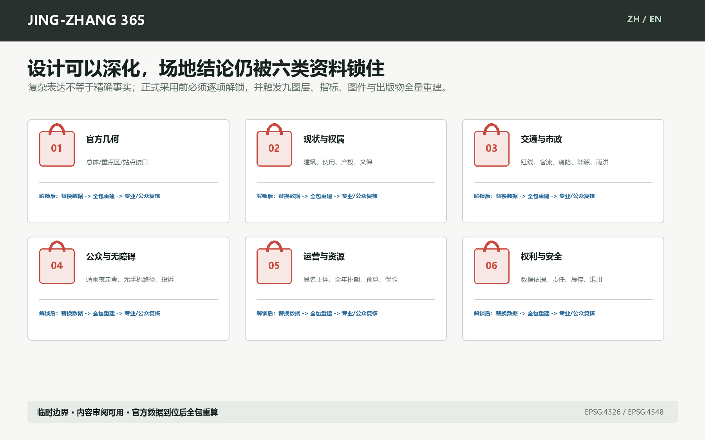

离线网页不加载远程脚本、字体、瓦片、API、表单、iframe或跟踪器；所有含文字图件、报告、网页和PDF都有中英文配对。替换官方几何后必须重新运行生成、空间复核、视觉复核和人工审核。最终是否公开提交 PR、如何回应评审、是否进入任何实施流程，均由人类明确决定。

## 参考资料

- 项目公告、任务书、场地包、标准索引与来源登记见 `sources.json` [source:OFFICIAL-ANNOUNCEMENT] [source:AGENT-TASKBOOK]。
- 临时边界来源与替换条件见 `geometry/site_boundary.geojson`、`geometry/key_areas.geojson` 和 `assumptions.json` [source:BOUNDARY-SOURCE] [source:KEY-AREA-SOURCE]。
- 国际机制案例的官方页面分别登记为 Here East、MIND Milano、STATION F、22@Barcelona 和 MaRS；正文只使用可转移机制，不使用其图片或自报成效 [source:CASE-HERE-EAST] [source:CASE-MIND] [source:CASE-STATION-F]。
- 完整机器证据位于 `metrics.json`、三份矩阵、九个正式 GeoJSON 和 `self_check.json` [source:BUILD-PROVENANCE]。
