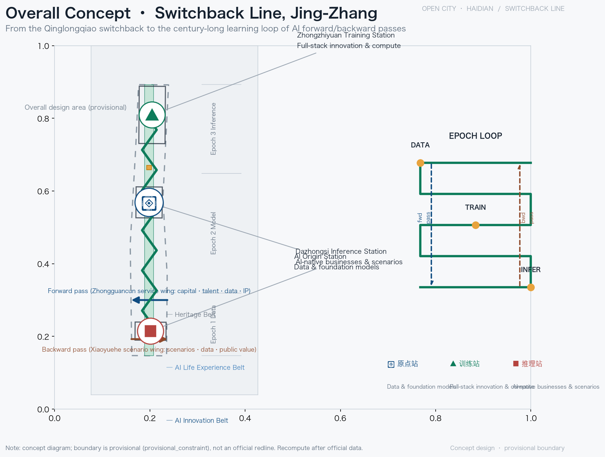
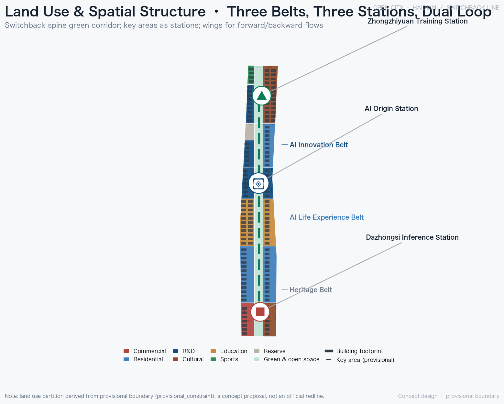
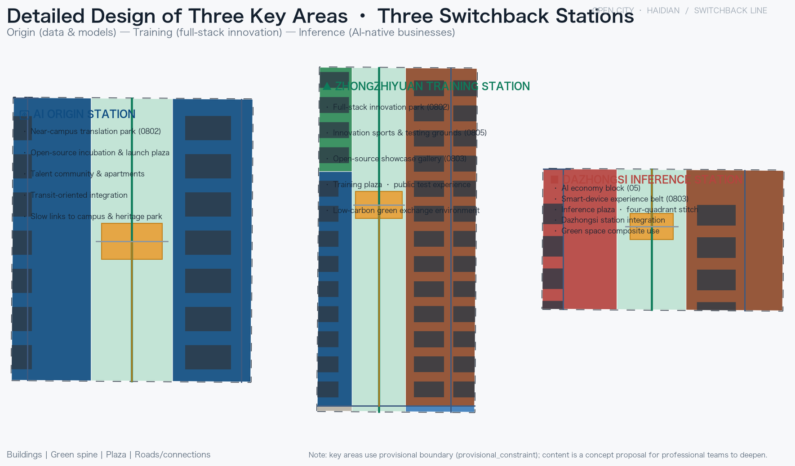
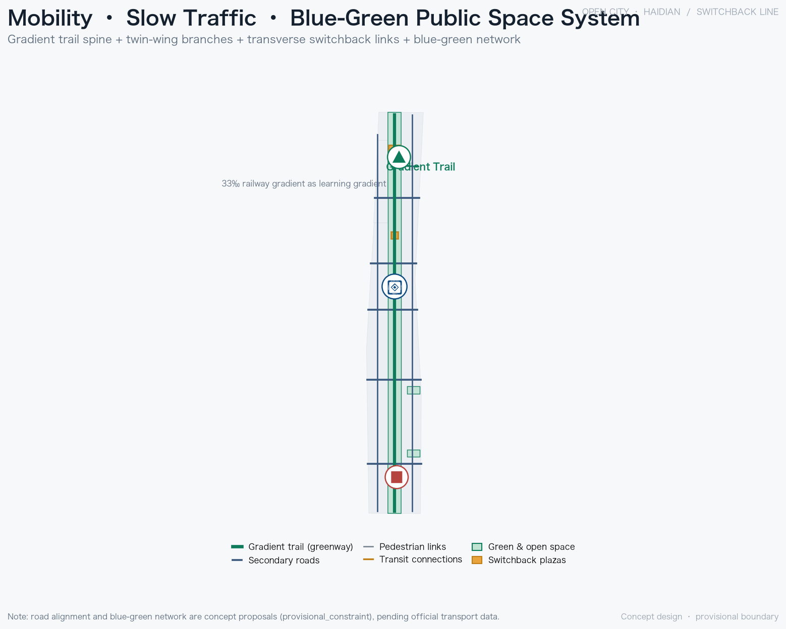
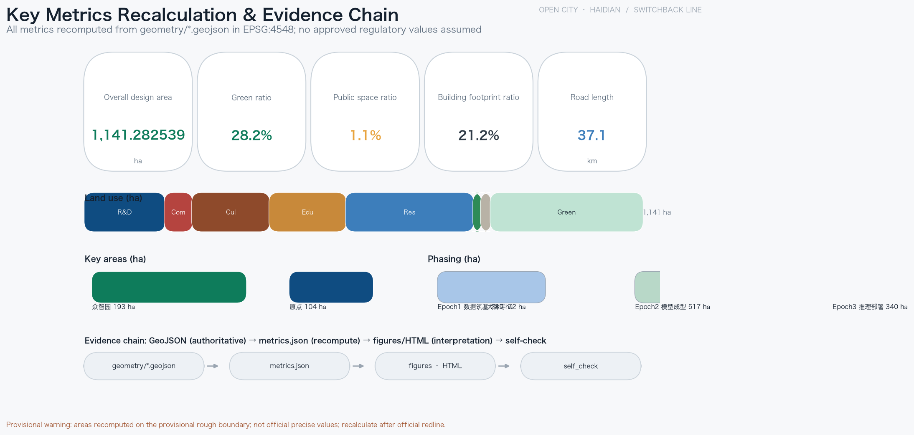

# Switchback Line, Jing-Zhang: Urban Design of a Century-Long Smart Learning Belt

## Design Basis and Source List

This proposal takes as its primary basis the Prequalification Announcement for the International Urban Design Solicitation of the Centennial Jing-Zhang AI Innovation Belt, issued by the Haidian Branch of the Beijing Municipal Commission of Planning and Natural Resources [source:OFFICIAL-ANNOUNCEMENT] [standard:PROJECT-OFFICIAL-ANNOUNCEMENT], and responds in full to the Agent open-call taskbook (tasks agent.1 through agent.6) together with its boundary clause that all outcomes remain concept proposals that do not replace formal planning [source:AGENT-TASKBOOK] [standard:PROJECT-AGENT-OPEN-CALL-TASKBOOK]. The site package provides the three-level scope, three key areas, land-use enumeration, metric ranges, and machine-readable schemas, while the source registry and the processed fact pack record the authority level, license, timeliness, and permitted use of each source [source:SITE-PACKAGE] [source:SOURCE-REGISTRY] [source:PROCESSED-FACT-PACK].

It must be stated explicitly: as of this draft, the official precise redline and the formal polygons of the three key areas have not yet been released. The site boundary and key-area boundaries used here all derive from provisional rough boundaries (provisional constraint, not an official redline) [source:PROVISIONAL-BOUNDARIES] [data:geometry/site_boundary.geojson#SITE-001]. They are used solely for proposal generation, self-check, visualization, and design discussion, and must not be treated as an official redline, approval basis, or basis for precise area recalculation [source:BOUNDARY-SOURCE] [depth:existing_conditions_diagnosis]; once official data is released, land use, roads, green space, public space, buildings, phasing, and all area metrics must be recalculated uniformly. The baseline conclusions of the current-conditions diagnosis (green ratio, public space ratio, building footprint, and road length) are presented in Section 11, Metrics, Area Recalculation, and Compliance Matrix; the machine index is not duplicated here.

## Three-Level Scope Framework

The proposal organizes work in the three levels defined by the announcement. The coordinated research area covers approximately 43.6 sq km and answers questions of AI industry ecosystem, strategic positioning, innovation-chain organization, and future urban form; the overall design area covers approximately 11.4 sq km (corresponding to the 1,141.3 ha site boundary) and carries the overall urban renewal framework and regulatory-plan-level urban design; the key-areas scope covers approximately 368.4 ha and carries the detailed design of three key areas [source:PROCESSED-FACT-PACK] [depth:three_level_scope_framework] [metric:site_area_sqm]. The three levels converge progressively: industrial judgments from the coordinated research level land in the spatial structure of the overall design, the overall structure lands in implementable plans for key areas, and the detailed key-area design in turn verifies the overall judgment.

| Level | Area | Design question | Depth of outcome |
| --- | --- | --- | --- |
| Coordinated research area | approx. 43.6 sq km | How to organize a world-class AI innovation ecosystem | Industry and future city research |
| Overall design area | approx. 11.4 sq km | Urban renewal and regulatory-plan-level design | Spatial structure, land use, urban character |
| Key-areas scope | approx. 368.4 ha | How the three areas land on the ground | Comprehensive implementation plan depth |

Spatial evidence for the three levels corresponds respectively to the site boundary, the key areas, and the land-use layers [data:geometry/site_boundary.geojson#SITE-001] [data:geometry/key_areas.geojson#PROV-KEY-001] [data:geometry/land_use.geojson#LU-B04-S]. Because the boundaries are provisional and rough, all three-level areas are recalculated values from the provisional geometry and must be recomputed once official polygons are available [source:PROVISIONAL-BOUNDARIES] [depth:three_level_scope_framework].

## Coordinated Research Area: Industry and Future City Research

### Master concept: one switchback learning loop

A century ago, Zhan Tianyou led the construction of the Jing-Zhang Railway and conquered the 33‰ Badaling gradient with the Qinglongqiao "zigzag/switchback" line, trading switchback for ascent, the first feat in engineering history to exchange a return loop for elevation gain; a century later, AI evolves in the same "switchback" way: forward propagation, backpropagation, and epoch-by-epoch iteration descending along the "gradient" (the railway gradient is precisely the learning gradient). The Jing-Zhang switchback is the very prototype of AI learning. Accordingly, this proposal organizes the coordinated research area into one switchback learning loop: one switchback spine (the Jing-Zhang heritage park cultural spine), three switchback stations (Origin, Training, Inference), and a two-wing double loop (Forward, Backward), corresponding to three thematic belts: the Centennial Jing-Zhang Culture Belt, the Urban AI Life Experience Belt, and the AI-Integrated Innovation Belt [source:AGENT-TASKBOOK] [standard:PROJECT-AGENT-OPEN-CALL-TASKBOOK] [depth:overall_spatial_structure].

### Naming and logo (task agent.1)

The naming system is unified by "switchback": the master name is Switchback Line; the three stations are named Origin Station (data and model origin, open-source incubation), Training Station (full-stack independent innovation, compute acceleration, public testing), and Inference Station (intelligence-native new business models, scenario deployment); the two wings are named the Forward Wing (injection of capital, talent, data, and IP) and the Backward Wing (scenario feedback, data return, public value). The logo direction uses a zigzag switchback symbol composed into an infinite-loop motif, signifying learning without end [source:AGENT-TASKBOOK] [standard:PROJECT-AGENT-OPEN-CALL-TASKBOOK]. The naming and visual system simultaneously maps three spatial identities: the railway zigzag (history), the neural-network loop (technology), and the infinity symbol (future), so that culture is not reduced to a mere technological ornament.

### Five functions and global cases (task agent.2)

The five functions comprise: a full-stack AI independent-innovation system, a world-class AI innovation ecosystem, a new paradigm of AI-plus scenario empowerment, a smart and vital AI city, and global discourse power in AI governance. The proposal distills transferable mechanisms from eight global cases:

- **Silicon Valley, USA**: deep symbiosis between Stanford University and venture capital, forming a university-industry spillover loop. Transferable mechanism: keep universities, firms, and capital colliding within the same spatial radius.
- **Kendall Square, Cambridge, USA**: anchored by MIT, mixing laboratories with startups so research institutions remain in the innovation district long-term. Transferable mechanism: link property operations with research institutions to prevent research outflow.
- **Nanshan, Shenzhen, China**: building on the Huaqiangbei supply chain and Nanshan science parks, hardware and software merge with extremely fast iteration. Transferable mechanism: supply-chain density plus open scenarios support rapid hardware prototyping.
- **Hangzhou, China**: platform economy (e-commerce, cloud computing) opens real scenarios and data elements feed back into the entrepreneurial ecosystem. Transferable mechanism: platforms open scenarios and data to drive application-layer innovation.
- **King's Cross, London, UK**: a derelict railway brownfield renewed as a knowledge-economy district, with the hub station lifting the entire innovation quarter. Transferable mechanism: the multiplier effect of transport hubs and brownfield renewal is a direct reference for the Jing-Zhang heritage corridor.
- **Station F, Paris, France**: a former freight depot converted into the world's largest start-up campus, using spatial scale to shape ecosystem density. Transferable mechanism: large-scale shared facilities reduce the friction of starting a business.
- **Jurong Innovation District, Singapore**: long-term government land assembly and park operation, with industries phased in sequentially. Transferable mechanism: phased development and land reservation guarantee long-termism.
- **Zhongguancun itself**: from an electronics street to a national independent-innovation demonstration zone, university density, talent stock, and tech services are Haidian's most irreplaceable assets. Transferable mechanism: convert the existing innovation stock into an open collaboration platform for the AI era.

Together, the eight mechanisms point to one judgment: the innovation belt must not merely "receive" industry; it must construct a double loop of forward injection and backward feedback so that capital, talent, data, IP, scenarios, and public value circulate and compound within the switchback loop [source:AGENT-TASKBOOK] [standard:PROJECT-AGENT-OPEN-CALL-TASKBOOK] [depth:overall_spatial_structure]. These mechanisms are subsequently embedded in land use (Section 7), public space (Section 9), slow mobility (Section 8), and scenario nodes (Section 6).

## Overall Design Area: Urban Renewal and Regulatory-Plan-Level Urban Design

### Spatial structure: one switchback spine, three switchback stations, a two-wing double loop

The overall design area takes the central north-south green corridor (the Jing-Zhang heritage park vitality belt) as the switchback spine, linking the three switchback stations and extending westward and eastward into the Forward and Backward wings. The spine merges three lines in one: culture, ecology, and slow mobility; the stations are where innovation happens; the wings are the channels for factor exchange [source:OFFICIAL-ANNOUNCEMENT] [depth:overall_spatial_structure]. In the land-use structure, the green spine is threaded north-south on a parkland (category 1401) skeleton, with residential, education, research, and commercial uses organized east and west in three segments: the living track, the university collaboration segment, and the innovation track [data:geometry/land_use.geojson#LU-B04-S] [depth:land_use_layout].

### Overall urban renewal framework

Renewal follows four categories of logic: retain, renovate, demolish, and build anew. Heritage resources along the spine, university campuses, and established residential communities are primarily retained; aging research buildings, low-efficiency industrial spaces, and station-front areas are primarily renovated; individual dilapidated and temporary structures (non-heritage temporary buildings with no clear retention value) are demolition candidates, but all plot-level conclusions await title and regulatory confirmation; new construction is concentrated at the three station nodes and around the switchback-valley plazas [depth:retain_renovate_demolish] [depth:overall_spatial_structure]. Renewal does not aim at large-scale demolition and construction; its keyword is "stitching": stitching the urban frontage on both sides of the railway heritage, stitching campuses and parks, and stitching rail stations with the pedestrian network [source:BOUNDARY-SOURCE] [depth:existing_conditions_diagnosis].

### Regulatory depth and pending conditions

At the depth of regulatory-plan-level urban design, this proposal provides a land-use layout, public space network, slow-mobility system, urban character guidance, and a conceptual retain-renovate-demolish framework, grounded professionally in the urban design measures and regulatory-planning standards [standard:MOHURD-URBAN-DESIGN-MEASURES] [standard:MOHURD-CONTROL-DETAILED-PLANNING]. Land use and development-intensity controls correspond to their respective depth items [depth:land_use_layout] [depth:development_intensity_controls], while height and massing guidance is governed separately by the character depth item [depth:height_massing_character]. It must be stated honestly: statutory control indicators such as floor area ratio, building height, building density, and setback lines can only be determined once official regulatory-plan data is released; the proposal offers only "intensity zone intentions" and the handling approach of "pending official regulatory-plan data," and never passes any estimated value off as an approved indicator [source:BOUNDARY-SOURCE] [depth:development_intensity_controls]. For urban character, an overall tone of "rail memory plus lightweight technology" is proposed (see Section 9).

## Detailed Design of Key Areas

The three key areas correspond to the three switchback stations, and their spatial evidence is registered in the key-area features for Zhongzhiyuan, the Origin Community, and Dazhongsi [data:geometry/key_areas.geojson#PROV-KEY-001] [data:geometry/key_areas.geojson#PROV-KEY-002] [data:geometry/key_areas.geojson#PROV-KEY-003]. Each is organized as "positioning + spatial structure + building renewal + transport and slow mobility + public space + AI scenarios + implementation risks" [depth:three_key_area_detailed_design].

### Beijing AI Origin Community (Origin Station, approx. 104.3 ha)

- **Positioning**: data and model origin, open-source incubation; the core cradle of a world-class AI innovation ecosystem [metric:key_area_beijing_ai_origin_community_area_sqm].
- **Spatial structure**: centered on the Origin Switchback Valley Open-Source Plaza (PUBLIC-002), with the open-source incubation park (LU-B04-L) and the near-campus commercialization park (LU-B04-R) on either side, connecting northward to the university collaboration segment (LU-B03) to form a continuous campus-incubation-commercialization chain [data:geometry/land_use.geojson#LU-B04-S] [data:geometry/public_space.geojson#PUBLIC-002].
- **Building renewal**: primarily renovation of research land with moderate new construction, preserving the campus frontage and encouraging public functions such as open-source living rooms and launch halls on the ground floor.
- **Transport and slow mobility**: the Origin station connection (ROAD-202) stitches campus and park, and the switchback-valley crossing path (ROAD-302) links east and west [data:geometry/roads.geojson#ROAD-202].
- **Public space**: the open-source plaza hosts the code wall, launch hall, and evening collaboration space.
- **AI scenarios**: open-source launches, technology commercialization, and talent-special-zone services (see scenario cards in Section 6).
- **Implementation risks**: campus boundaries and ownership are complex, and commercialization floor-space supply depends on multi-party coordination and pending official data.

### Zhongzhiyuan AI Acceleration Area (Training Station, approx. 192.9 ha)

- **Positioning**: full-stack independent innovation, compute acceleration, public testing; bearer of the full-stack AI innovation system and global discourse power in AI governance [metric:key_area_zhongzhiyuan_ai_acceleration_area_area_sqm].
- **Spatial structure**: centered on the Zhongzhiyuan Switchback Valley Training Plaza (PUBLIC-003), with the full-stack innovation park (LU-B06-L), the open-source achievement gallery (LU-B06-R), and the innovation sports field (LU-B06-L2) arranged around it, connecting northward to the strategic reservation segment (LU-B05-L2) [data:geometry/land_use.geojson#LU-B06-S] [data:geometry/public_space.geojson#PUBLIC-003].
- **Building renewal**: a combination of renovation and new construction on research land, with reserved land (category 16) as long-term flexibility.
- **Transport and slow mobility**: the Zhongzhiyuan station connection (ROAD-203) links the northern Fifth Ring direction, and the gradient trail runs through the area [data:geometry/roads.geojson#ROAD-203] [data:geometry/roads.geojson#ROAD-001].
- **Public space**: the training plaza hosts public test grounds, model evaluation showcases, and standards workshops.
- **AI scenarios**: public testing and validation, standards setting, and safety-governance exhibition (see test scenarios in Section 6).
- **Implementation risks**: the largest area with the longest development horizon; conversion of reserved land must align with municipal-level strategy.

### Dazhongsi AI Industry Cluster (Inference Station, approx. 72.0 ha)

- **Positioning**: intelligence-native new business models and scenario deployment; the showcase window for AI inference and consumer experience [metric:key_area_dazhongsi_ai_industry_cluster_area_sqm].
- **Spatial structure**: centered on the Dazhongsi Switchback Valley Inference Plaza (PUBLIC-001), with the intelligence economy block (LU-B01-L, commercial services land category 05) and the intelligent terminal experience belt (LU-B01-R, cultural land category 0803) on either side [data:geometry/land_use.geojson#LU-B01-L] [data:geometry/public_space.geojson#PUBLIC-001].
- **Building renewal**: primarily renovation of station-front commercial and low-efficiency buildings, with new construction concentrated at four-quadrant pedestrian connection nodes.
- **Transport and slow mobility**: the Dazhongsi station connection (ROAD-201) and four-quadrant pedestrian connectivity (ROAD-301) stitch the intersection [data:geometry/roads.geojson#ROAD-201].
- **Public space**: the inference plaza opens intelligent terminal experiences and content consumption to residents.
- **AI scenarios**: intelligent agent and terminal showcases, content consumption, and the data-elements living room (see Section 6).
- **Implementation risks**: station integration and municipal pipeline conditions require engineering review; four-quadrant connectivity requires coordination with transport authorities.

## AI Innovation Ecosystem, Personas, and AI+ Scenarios

### User personas (5 or more)

| Persona | Core needs | Spatial response |
| --- | --- | --- |
| University researcher | Compute, data, cross-campus collaboration, commercialization | Origin open-source plaza, near-campus commercialization park |
| Open-source developer | Launch, collaboration, testing, community reputation | Open-source launch hall, code wall, training plaza |
| AI start-up founder | Low-cost office, compute access, test scenarios | Zhongzhiyuan Training Station, edge-compute waystations |
| Big-tech engineer | Exchange, recruiting, scenario collaboration, daily life services | Inference showcase street, living-track community services |
| Surrounding resident and elderly | Commute, leisure, accessibility, community services | Spine slow mobility, pocket parks, health stations |
| International visitor and developer pilgrim | Cultural experience, landmark visits, international exchange | Tsinghuayuan Memory Station, switchback monument, gradient trail |

### AI scenario cards (10 or more)

| No. | Scenario | Spatial node | Served users | Data and privacy boundary | Human review | Operator | Risk |
| --- | --- | --- | --- | --- | --- | --- | --- |
| S01 | Open-source launch hall | Origin Station Open-Source Plaza | Researchers, developers | Code and works public; no personal behavior collection | Community maintainer review | Developer community operation | Content compliance |
| S02 | Commercialization waystation | Origin near-campus park | University teams, founders | Tiered IP authorization | Technology transfer office | University + park | Ownership disputes |
| S03 | Public model evaluation ground (test & validation) | Zhongzhiyuan Training Plaza | Foundation-model firms, evaluators | Public benchmarks and authorized data only | Professional evaluation committee | Public testing platform | Benchmark disputes |
| S04 | Safety-governance sandbox (test & validation) | Zhongzhiyuan Training Station | Governance bodies, security firms | Synthetic data first, de-identified | Human governance officers | Governance laboratory | Over-monitoring |
| S05 | Edge-compute waystation (test & validation) | Innovation track segment | Startups, edge developers | Metered compute; no business-data reading | Platform audit | Compute operator | Power and energy |
| S06 | Intelligent terminal experience street | Dazhongsi Inference Plaza | Residents, consumers | Localized demo data; no face retention | Merchant + platform review | Commercial operator | Privacy collection |
| S07 | Data-elements living room | Dazhongsi Inference Station | Data-service firms, legal teams | Fully registered, auditable, de-identified | Compliance officer | Data-trading service | Data misuse |
| S08 | AI slow-mobility safety navigation | Gradient trail spine | Elderly, children, visually impaired | Group density and obstacles only | Human review of alerts | Municipal operator | Over-monitoring |
| S09 | Pocket-park health station | Living track segment | Residents and elderly | Locally encrypted health data | Medical staff review | Community + health | Medical liability |
| S10 | Driverless shuttle and delivery test (test & validation) | Dazhongsi to Zhongzhiyuan route | Logistics firms, commuters | Closed test segment; restricted sensor data | Safety officer on site | Firm + park | Safety incidents |
| S11 | AI education experience point | University collaboration segment | Teachers and students | Learning data limited to education use | Teacher review | Education institution | Data misuse |
| S12 | Agent contribution honor wall | Tsinghuayuan Memory Station | Global developers | Display of voluntarily registered names and contributions only | Manual review | Operating foundation | Impersonation and mislabeling |

Among these, S03, S04, S05, and S10 are AI industry test-and-validation scenarios, satisfying the requirement of no fewer than three. Every scenario is equipped with the five elements of served users, data and privacy boundary, human review, operator, and risk, ensuring the scenarios are "experienceable, displayable, and promotable" while never bypassing final human judgment [source:AGENT-TASKBOOK] [standard:PROJECT-AGENT-OPEN-CALL-TASKBOOK] [depth:overall_spatial_structure]. The scenario-to-space-to-operation mapping is consolidated in the scenario coverage matrix of compliance_matrix.json; only the readable summary is kept in the narrative.

## Land Use, Building Scale, and Retain-Renovate-Demolish Strategy

### Land-use structure

The overall design area is organized according to national land-use classification, with the main land-use composition as follows (areas recalculated from provisional geometry, in ha) [standard:MNR-LAND-USE-CLASSIFICATION-GUIDE] [depth:land_use_layout]:

| Code | Land-use type | Area (ha) | Design role |
| --- | --- | --- | --- |
| 1401 | Parkland | 310.9 | Skeleton of the switchback spine and valley green belts [metric:land_use_1401_area_sqm] |
| 0701 | Urban residential | 260.8 | Living-track residential communities east and west [metric:land_use_0701_area_sqm] |
| 0802 | Research land | 163.4 | Origin Station, Training Station, innovation-track R&D [metric:land_use_0802_area_sqm] |
| 0803 | Cultural land | 157.9 | Terminal experience belt, achievement gallery [metric:land_use_0803_area_sqm] |
| 0804 | Education land | 156.5 | University collaboration segment (Beihang, BUPT side) [metric:land_use_0804_area_sqm] |
| 05 | Commercial services | 56.4 | Dazhongsi intelligence economy block [metric:land_use_05_area_sqm] |
| 16 | Reserved land | 19.6 | Strategic reservation segment (north of Zhongzhiyuan) [metric:land_use_16_area_sqm] |
| 0805 | Sports land | 15.8 | Innovation sports field [metric:land_use_0805_area_sqm] |

Research, education, and cultural land together total approximately 477.8 ha, forming the main body of the innovation belt; the 310.9 ha of parkland forms the north-south green skeleton, supporting the idea that "green space is the venue for innovation exchange" [metric:land_use_1401_area_sqm] [depth:land_use_layout].

### Building scale and retain-renovate-demolish

The building footprint is approximately 242.1 ha, about 21.2% of the overall design area, a medium-to-low intensity garden-style block pattern [metric:building_footprint_area_sqm] [metric:building_footprint_ratio]. Retain-renovate-demolish follows a four-category logic [depth:retain_renovate_demolish]:

- **Retain**: the Jing-Zhang heritage park and heritage resources along the line, university campuses, established residential communities, rail stations, and quality existing buildings;
- **Renovate**: aging research buildings, low-efficiency industrial space, station-front commercial, and frontage along the spine, primarily through micro-renewal and function replacement;
- **Demolish (candidate)**: dilapidated buildings and temporary structures without retention value, subject to title, heritage, and safety appraisal;
- **Build anew**: concentrated at the three station nodes, around the switchback-valley plazas, and in the strategic reservation segment, strictly constrained by the "pending official regulatory-plan data" intensity condition.

It must be stated that building height, FAR, and density control values are currently pending official data; this proposal provides no plot-level figures, and the retain-renovate-demolish list stops at the granularity of "category plus candidate area," with plot-level conclusions pending title and regulatory documents [source:BOUNDARY-SOURCE] [depth:height_massing_character] [depth:retain_renovate_demolish].

## Transport, Rail, Municipal Infrastructure, and Public Services

### Slow mobility and rail

The transport system is built around the gradient trail as its backbone [data:geometry/roads.geojson#ROAD-001] [depth:traffic_rail_slow_parking]: along the Jing-Zhang heritage park, the 33‰ railway gradient is translated into the "gradient of learning," with a start marker, milestones, and Epoch graduations, forming a main ridge of approximately 37.1 km of slow-mobility network [metric:roads_total_length_m] [data:geometry/roads.geojson#ROAD-001]. The two wings are the Forward Injection Road (west wing branch) and the Backward Feedback Road (east wing branch) [data:geometry/roads.geojson#ROAD-002] [data:geometry/roads.geojson#ROAD-003], and five horizontal switchback link roads (ROAD-101 through 105) stitch east and west. The three switchback stations each have rail connections: Dazhongsi station connection (ROAD-201), Origin station connection (ROAD-202), and Zhongzhiyuan station connection (ROAD-203), while switchback-valley crossing paths (ROAD-301 through 303) guarantee four-quadrant pedestrian connectivity [data:geometry/roads.geojson#ROAD-201] [depth:traffic_rail_slow_parking].

### Municipal and new infrastructure

Municipal facilities are proposed as concepts: distributed energy and micro-grids are arranged along the innovation track segment; edge-compute waystations are co-located with streetlights and bus stops; parking and bicycle parking are integrated with station development; stormwater management merges with green space, and sponge measures enter the switchback valleys [depth:municipal_new_infrastructure] [depth:blue_green_public_space]. Public service facilities are arranged along the spine as innovation service platforms, talent living services, and community services, forming a "service belt on the spine." All pipeline, energy-load, fire, and municipal-capacity conclusions are pending engineering review and are not presented as approved conclusions [source:SITE-PACKAGE] [depth:municipal_new_infrastructure].

## Blue-Green Network, Public Space, and Urban Character

### Blue-green network and switchback-valley plazas

The blue-green system uses the switchback spine green belt as its north-south main axis, linking the living-track, university-collaboration, and innovation-track green spine segments and the three switchback-valley green belts, with two pocket parks connected in [data:geometry/green_space.geojson#GREEN-01] [data:geometry/green_space.geojson#GREEN-07] [depth:blue_green_public_space]. The V-shaped spaces formed by the zigzag switchback are translated into four switchback-valley plazas: the Inference Plaza (Dazhongsi), the Open-Source Plaza (Origin), the Training Plaza (Zhongzhiyuan), and the Tsinghuayuan Memory Station (switchback memorial point) [data:geometry/public_space.geojson#PUBLIC-001..004]. Green space and public space together support innovation exchange and daily life [metric:green_ratio] [metric:public_space_ratio] [standard:MOHURD-URBAN-DESIGN-MEASURES].

### Pilgrimage landmarks and public space component library (task agent.4)

Three or more AI pilgrimage landmarks are placed along the spine: the Switchback Monument (commemorating a century of switchback wisdom, at the Tsinghuayuan Memory Station), the Epoch Scale Tower (carving the three Epochs of data foundation, model formation, and inference deployment into the city), the Gradient Trail Start (the "zero-kilometer" pilgrimage start), and the Agent Contribution Honor Wall (registering global developers' and agents' contributions) [source:AGENT-TASKBOOK] [depth:blue_green_public_space]. The public space component library includes standardized elements for reuse across nodes: zigzag switchback paving, the infinite-loop logo ground inscription, railway-tie benches, Epoch-scale railings, an open-source code wall, and movable AI showcase pods, avoiding internet-faddish and over-decorated landmarks.

### Urban character and signage system (task agent.5)

The character tone is "rail memory plus lightweight technology": retaining the grey tone and industrial elements of railway heritage while layering light, updatable, low-reflection building facades; roofs and fifth facades encourage PV integration and roof gardens [depth:height_massing_character] [standard:MOHURD-URBAN-DESIGN-MEASURES]. The signage system unifies the culture line, slow-mobility line, and technology line with the zigzag switchback symbol, with the three stations identified by Origin/Training/Inference switchback-arrow variants, avoiding confusion with a separate cultural identification system. All materials involving historical portraits, railway imagery, and corporate marks must be rights-cleared before use.

## Renewal Projects, Implementation Policy, and Phasing

### Renewal project list (concept proposal)

| No. | Project | Type | Location | Dependent conditions |
| --- | --- | --- | --- | --- |
| JZ-01 | Gradient trail completion | Slow mobility / public space | Full length of the spine | Road redline and under-bridge review |
| JZ-02 | Three-station switchback-valley plazas | Public space | Origin / Zhongzhiyuan / Dazhongsi | Title and regulatory conditions |
| JZ-03 | Tsinghuayuan Memory Station | Culture / memorial | South end of the heritage park | Heritage protection requirements |
| JZ-04 | Dazhongsi four-quadrant pedestrian connectivity | Transport / slow mobility | Dazhongsi station | Rail integration and pipeline review |
| JZ-05 | Zhongzhiyuan public test ground | Industry / public | Training plaza | Test safety and operator |
| JZ-06 | Edge-compute waystations | New infrastructure | Innovation track segment | Power and energy assessment |
| JZ-07 | Station-front commercial renovation | Urban renewal | Dazhongsi station front | Title and leasing |
| JZ-08 | Strategic reservation land banking | Land banking | North of Zhongzhiyuan | Municipal-level strategy alignment |

All of the above projects are concept proposals; implementation entities, funding, and timing await deepening by professional teams and competent authorities [depth:renewal_project_list] [depth:phasing_implementation].

### Three Epochs of phasing

Phasing is named after the AI learning process, corresponding to three progressive stages [data:geometry/phasing.geojson#PHASE-001] [data:geometry/phasing.geojson#PHASE-002] [data:geometry/phasing.geojson#PHASE-003]:

- **Epoch 1, Data Foundation (approx. 284.9 ha)**: the southern segment moves first, with the Dazhongsi intelligence economy block and the Inference Plaza forming a perceptible AI public experience [metric:phasing_epoch1_area_sqm];
- **Epoch 2, Model Formation (approx. 516.6 ha)**: the middle segment links up, with the Origin Station and the university collaboration segment becoming the main battlefield for open-source co-creation and commercialization [metric:phasing_epoch2_area_sqm];
- **Epoch 3, Inference Deployment (approx. 339.8 ha)**: the northern segment deepens, with full-stack innovation at Zhongzhiyuan and the strategic reservation landing [metric:phasing_epoch3_area_sqm].

Phasing areas are recalculated from the provisional boundary and will be updated once official data is released.

### Annual event system and developer community operation (task agent.6)

- **Switchback Season**: an annual event running through the gradient trail and the three stations, combining achievement launches, public test open days, and pilgrimage-route experiences;
- **Backprop Night**: a monthly developer event organizing scenario-feedback and data-return workshops along the Xiaoyuehe Backward Wing;
- **Epoch Forum**: a quarterly forum corresponding to the themes of the three Epochs;
- **Developer community operation**: anchored on the open-source launch hall, the contribution honor wall, and the public test ground, forming a "contribution-reputation-conversion" loop.

The operation mechanism includes open scenario operation (reservation-based public test ground), public experience route operation (spine-guided tours), and international communication and attraction-conversion (pilgrimage route plus Epoch Forum plus developer community) [source:AGENT-TASKBOOK] [standard:PROJECT-AGENT-OPEN-CALL-TASKBOOK] [depth:phasing_implementation]. All events, investment attraction, funding, and policy arrangements are concept proposals and are not presented as confirmed government arrangements.

## Metrics, Area Recalculation, and Compliance Matrix

The core metrics of this proposal are recalculated from the provisional geometry; their design meanings are as follows [depth:metrics_recalculation] [source:PROCESSED-FACT-PACK]:

| Metric | Value | Design meaning |
| --- | --- | --- |
| Overall design area | 1,141.3 ha (approx. 11.4 sq km) | Defines the scope of urban renewal and regulatory-plan-level design [metric:site_area_sqm] [data:geometry/site_boundary.geojson#SITE-001] |
| Green ratio | 28.2% (approx. 321.7 ha) | A green skeleton supporting talent living, innovation exchange, and ecological resilience [metric:green_ratio] |
| Public space ratio | 1.1% (approx. 12.8 ha) | Four high-intensity public nodes such as the switchback-valley plazas carry innovation exchange: small yet refined, dense in use [metric:public_space_ratio] |
| Building footprint ratio | 21.2% (approx. 242.1 ha) | Medium-to-low intensity garden-style blocks reserving flexibility for industry iteration [metric:building_footprint_area_sqm] |
| Total road length | 37.1 km | The gradient trail, wings, and switchback links form the main slow-mobility network [metric:roads_total_length_m] |
| Key-area count | 3 | Origin 104.3, Training 192.9, Inference 72.0 ha [metric:key_area_count] |
| Phasing areas | E1 284.9 / E2 516.6 / E3 339.8 ha | Progressive stages of data foundation, model formation, and inference deployment [metric:phasing_epoch1_area_sqm] |

Floor area ratio, building height, building density, setback lines, and green-ratio control values are "pending official data" items and are not listed in the table [source:BOUNDARY-SOURCE] [depth:risk_missing_data]. The compliance matrix, standard matrix, and design depth matrix respectively record item-by-item coverage of the announcement tasks, agent.1 through agent.6, professional standards, and design depth; the narrative does not reproduce the machine index [source:PROCESSED-FACT-PACK] [depth:metrics_recalculation].

## Risk, Copyright, and Compliance

- **Data legality**: this proposal uses only the official announcement, cleared public sources, and provisional rough boundaries; it cites no non-public planning drawings, internal indicators, or unauthorized materials [source:SOURCE-REGISTRY] [source:PROVISIONAL-BOUNDARIES] [depth:risk_missing_data].
- **Copyright and licensing**: the provenance, license, and authorization status of all images, drawings, icons, fonts, and code assets are recorded in sources.json and copyright_statement.md; all content involving portraits, trademarks, and historical imagery requires rights clearance [source:SITE-PACKAGE].
- **Privacy protection**: AI scenarios adhere to data minimization, de-identification, and localization; outputting unauthorized personal profiles or over-monitoring content is prohibited [standard:PROJECT-AGENT-OPEN-CALL-TASKBOOK].
- **AI-generation responsibility**: this proposal was generated by an AI Agent; the authors are responsible for facts, sources, copyright, and final expression, and the generation method is disclosed in the proposal package.
- **No claim of official approval**: all spatial, operational, policy, and event content is concept proposal; it constitutes no government-approved conclusion, promises no implementation, and involves no investment estimates [standard:PROJECT-AGENT-OPEN-CALL-TASKBOOK].
- **Pending-data list**: the official redline, the formal polygons of the three key areas, regulatory indicators (FAR/height/density/setback), the existing-building inventory, titles, municipal pipelines, and heritage protection scopes all await official data for unified recalculation [depth:risk_missing_data].

## References

1. Prequalification Announcement for the International Urban Design Solicitation of the Centennial Jing-Zhang AI Innovation Belt, issued by the Haidian Branch of the Beijing Municipal Commission of Planning and Natural Resources, and the prequalification documents (solicitation organizer: Beijing Science Park Auction and Tendering Co., Ltd.).
2. Agent open-call taskbook excerpt for the Centennial Jing-Zhang AI Innovation Belt Urban Design Open Call (agent_open_call_taskbook, including the ten co-creation principles, three positioning statements, five functions, three areas and two wings, and six agent tasks).
3. Ministry of Housing and Urban-Rural Development (MOHURD): Measures for Urban Design Management (2017).
4. MOHURD: Measures for the Administration of Regulatory Detailed Plans and related technical standards.
5. Ministry of Natural Resources (MNR): Guidelines for the Land Use Classification of Territorial Spatial Survey, Planning, and Use Control (trial).
6. Publicly released urban renewal and industry policy documents of the Beijing Municipal People's Government and the Haidian District People's Government.
7. Public materials on the Jing-Zhang Railway Heritage Park and public information of the Beijing Municipal Cultural Heritage Bureau on the Tsinghuayuan Railway Station heritage site.
8. Public datasets from the Beijing Public Data Open Platform and OpenStreetMap baseline data (background and provisional-boundary clues only).
9. data/source_registry.json (source registry) and data/processed/agent_fact_pack.md (processed fact pack) and their worksheets.
10. Machine-readable materials under brief/site-package/: geometry/, enums/, ranges/, schemas/, and standards/references/.
11. Public case materials on global AI innovation ecosystems (Silicon Valley, Kendall Square Cambridge, Shenzhen Nanshan, Hangzhou, London King's Cross, Paris Station F, Singapore Jurong Innovation District, etc.).
12. Public historical literature on Zhan Tianyou and the Qinglongqiao switchback line of the Jing-Zhang Railway.

The complete machine index is governed by sources.json, metrics.json, compliance_matrix.json, standard_matrix.json, and design_depth_matrix.json [source:SITE-PACKAGE] [source:SOURCE-REGISTRY].
