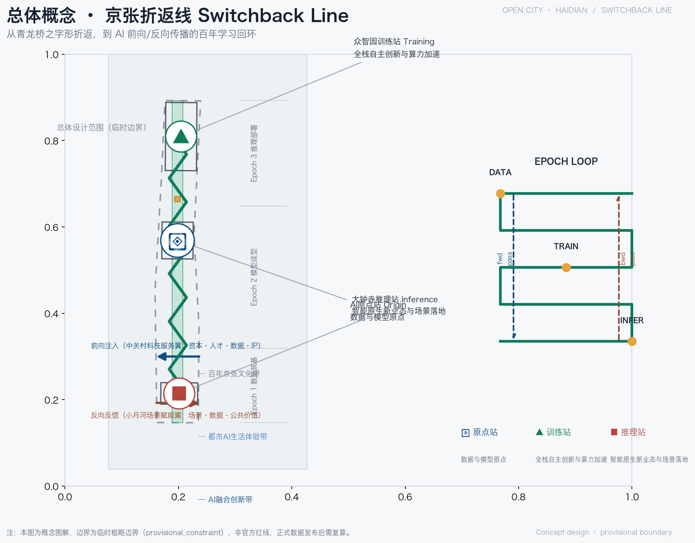
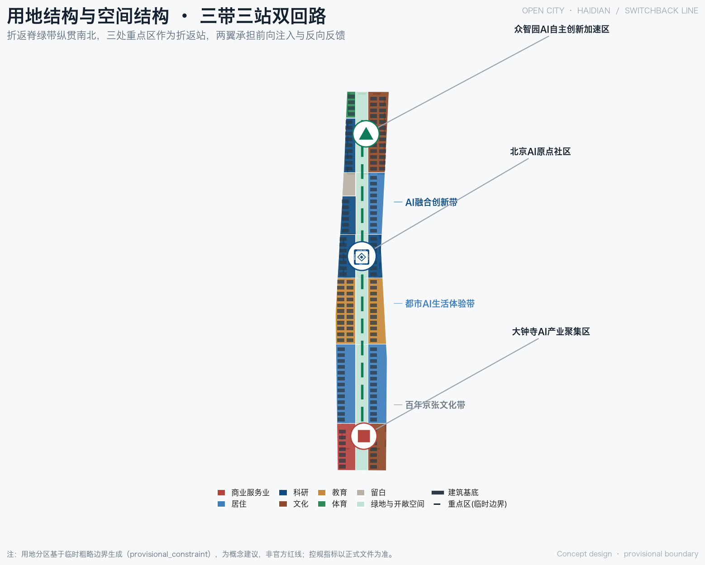
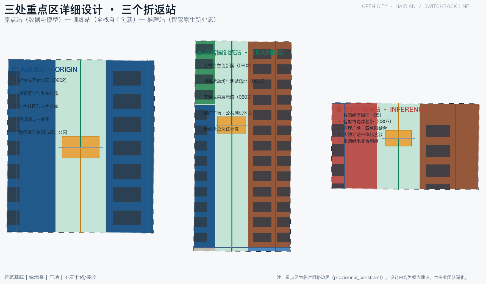
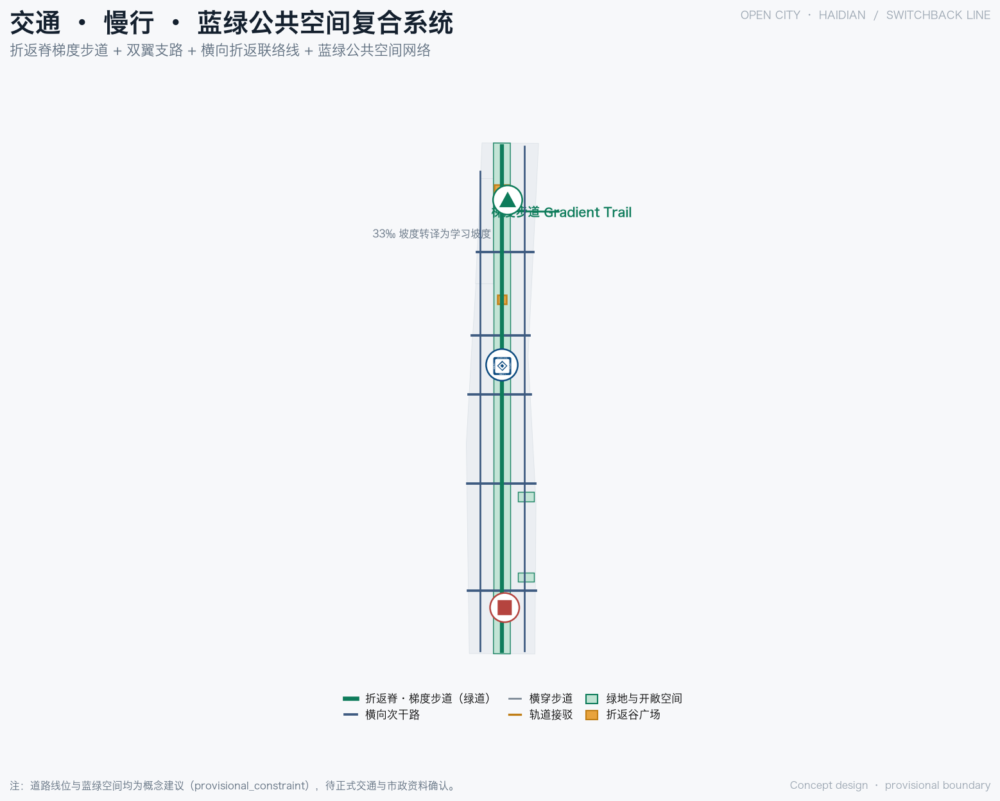
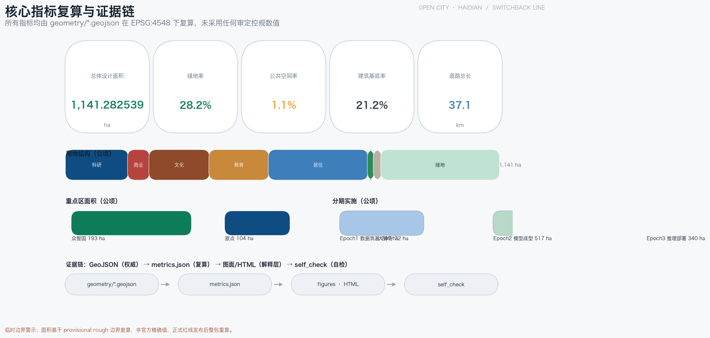

# 京张折返线 Switchback Line——百年回环的智能学习带城市设计

## 设计依据与资料清单

本方案以北京市规划和自然资源委员会海淀分局发布的《百年京张AI创新带城市设计国际方案征集资格预审公告》为第一依据 [source:OFFICIAL-ANNOUNCEMENT] [standard:PROJECT-OFFICIAL-ANNOUNCEMENT]，并完整响应面向智能体的开源征集任务书（agent.1 至 agent.6）及其中"概念建议、不替代正式规划"的边界条款 [source:AGENT-TASKBOOK] [standard:PROJECT-AGENT-OPEN-CALL-TASKBOOK]。场地包提供了三层范围、三处重点区域、土地用途枚举、指标区间与机器可读 schema，公开资料登记表与处理后的事实包则记录每条资料的权威等级、许可、时效与用途边界 [source:SITE-PACKAGE] [source:SOURCE-REGISTRY] [source:PROCESSED-FACT-PACK]。

需要特别说明：截至本稿提交，官方精确红线与三处重点区域正式 polygon 尚未发布。本方案使用的场地边界与重点区域边界均来自临时粗略边界（provisional constraint，非官方红线）[source:PROVISIONAL-BOUNDARIES] [data:geometry/site_boundary.geojson#SITE-001]。该边界仅用于方案生成、自检、可视化与设计讨论，不得作为官方红线、审批依据或精确面积复算依据 [source:BOUNDARY-SOURCE] [depth:existing_conditions_diagnosis]；正式数据发布后，用地、道路、绿地、公共空间、建筑、分期及全部面积指标需统一复算。现状研判的基线结论（绿地占比、公共空间占比、建筑基底与道路长度）见第十一章指标复算，此处不重复机器索引。

## 三层范围工作框架

方案按公告确定的三个层次组织工作。统筹研究范围约 43.6 平方公里，回答 AI 产业生态、战略定位、创新链组织与未来城市形态问题；总体设计范围约 11.4 平方公里（对应场地边界 1141.3 公顷），承担城市更新总体框架与控规深度城市设计；重点区域范围约 368.4 公顷，承担三处重点片区详细设计 [source:PROCESSED-FACT-PACK] [depth:three_level_scope_framework] [metric:site_area_sqm]。三个层次逐级收束：统筹研究的产业判断落到总体设计的空间结构，总体设计的结构再落到重点片区的可实施方案，而重点片区的详细设计反过来校验总体判断。

| 层级 | 面积 | 设计问题 | 成果深度 |
| --- | --- | --- | --- |
| 统筹研究范围 | 约 43.6 平方公里 | 世界级 AI 创新生态如何组织 | 产业与未来城市研究 |
| 总体设计范围 | 约 11.4 平方公里 | 城市更新与控规深度设计 | 空间结构、用地、风貌 |
| 重点区域范围 | 约 368.4 公顷 | 三处片区如何落地 | 规划综合实施方案深度 |

三个层次的空间证据分别对应场地边界、重点区域与用地图层 [data:geometry/site_boundary.geojson#SITE-001] [data:geometry/key_areas.geojson#PROV-KEY-001] [data:geometry/land_use.geojson#LU-B04-S]。由于边界为临时粗略性质，三层面积均为按 provisional 几何的复算结果，正式 polygon 补齐后需重新计算 [source:PROVISIONAL-BOUNDARIES] [depth:three_level_scope_framework]。

## 统筹研究范围产业与未来城市研究

### 总概念：一个折返学习环

一百年前，詹天佑主持修建京张铁路，以青龙桥"之字形/人字形"折返线攻克八达岭 33‰ 大坡，用"折返"换"爬升"，是人类工程史上第一次以折返换取高差的奇迹；一百年后，AI 以同样的"折返"方式进化——前向传播、反向传播、逐 epoch 迭代，沿"梯度"（铁路坡度正是学习梯度）下降。京张铁路的折返，恰是 AI 学习的原型。本方案据此把统筹研究范围组织为**一个折返学习环**：一条折返脊（京张遗址公园文化脊）、三个折返站（原点站 Origin、训练站 Training、推理站 Inference）、两翼双回路（前向注入翼 Forward、反向反馈翼 Backward），对应三条主题带（百年京张文化带、都市AI生活体验带、AI融合创新带）[source:AGENT-TASKBOOK] [standard:PROJECT-AGENT-OPEN-CALL-TASKBOOK] [depth:overall_spatial_structure]。

### 命名与 Logo（任务 agent.1）

命名体系以"折返"为总纲：总名为"折返线 Switchback Line"；三站分别命名为原点站 Origin（数据与模型原点、开源孵化）、训练站 Training（全栈自主创新、算力加速、公共测试）、推理站 Inference（智能原生新业态、场景落地）；两翼命名为前向注入翼 Forward（资本·人才·数据·IP 注入）与反向反馈翼 Backward（场景反馈·数据回流·公共价值）。Logo 方向以之字形折返符号构成 ∞ 回环，寓意学习无终、循环往复 [source:AGENT-TASKBOOK] [standard:PROJECT-AGENT-OPEN-CALL-TASKBOOK]。命名与视觉系统同时对应三种空间身份：铁轨的之字形（历史）、神经网络的环回（技术）、∞ 的永续（未来），避免把文化只当作科技装饰。

### 五大功能与全球案例（任务 agent.2）

五大功能包括：AI 全栈自主创新体系、世界级 AI 创新生态、AI+ 场景赋能新范式、智能化 AI 活力城市、AI 治理全球话语权。方案从八个全球案例中提炼可迁移机制：

- **美国硅谷**：斯坦福大学与风险资本深度共生，形成大学-产业溢出循环。可迁移机制：让高校、企业与资本在同一空间半径内持续碰撞。
- **波士顿剑桥肯德尔广场（Kendall Square）**：以 MIT 为锚点，实验室与创业公司混合布局，科研机构长期留在创新街区。可迁移机制：产权运营与科研机构联动，避免研究成果外流。
- **深圳南山**：依托华强北供应链与南山科技园，硬件与软件融合、迭代极快。可迁移机制：供应链密度与场景开放支撑硬科技快速原型。
- **杭州**：以平台经济（电商、云计算）开放真实场景，数据要素反哺创业生态。可迁移机制：平台开放场景与数据，形成应用层创新。
- **伦敦国王十字（King's Cross）**：将废弃铁路棕地更新为知识经济街区，以枢纽车站带动整个创新板块。可迁移机制：交通枢纽与存量更新的乘数效应，正是京张遗址地带的直接参照。
- **巴黎 Station F**：把旧货运站改造为全球最大初创园区，以空间规模塑造生态浓度。可迁移机制：大尺度共享设施降低创业摩擦。
- **新加坡裕廊创新区（JID）**：政府长期土地整备与园区运营，产业逐期植入。可迁移机制：分期开发与留白制度保障长期主义。
- **中关村自身**：从电子一条街到国家级自主创新示范区，大学密度、人才存量与科技服务是海淀最不可替代的资产。可迁移机制：把既有创新存量转化为 AI 时代的开放协同平台。

八类机制共同指向一个判断：创新带不仅要"承接"产业，更要构造"前向注入、反向反馈"的双回路，让资本、人才、数据、IP 与场景、公共价值在折返环内循环增值 [source:AGENT-TASKBOOK] [standard:PROJECT-AGENT-OPEN-CALL-TASKBOOK] [depth:overall_spatial_structure]。这些机制随后落到用地（第七章）、公共空间（第九章）、慢行（第八章）与场景节点（第六章）的具体设计中。

## 总体设计范围城市更新与控规深度城市设计

### 空间结构：一条折返脊、三个折返站、两翼双回路

总体设计范围以中央南北向绿带（京张遗址公园活力带）为**折返脊**，串联三个折返站，并分别向西、向东伸出前向注入翼与反向反馈翼。脊是文化线、生态线与慢行线三线合一；站是创新发生地；翼是要素交换通道 [source:OFFICIAL-ANNOUNCEMENT] [depth:overall_spatial_structure]。用地结构上，绿脊以公园绿地（1401 类）为骨架贯穿南北，东西两侧按"生活轨道-高校协同-创新轨道"三段组织居住、教育、科研与商业 [data:geometry/land_use.geojson#LU-B04-S] [depth:land_use_layout]。

### 城市更新总体框架

更新遵循"保留-改造-拆除-新建"四类逻辑：折返脊沿线的遗址资源、高校校园与成熟住区以保留为主；老旧科研楼宇、低效产业空间与站前地区以改造为主；个别危旧与临建（如明确无保留价值的非文保临时建筑）作为拆除候选，但具体地块结论一律待权属与控规确认；新建集中在三站节点与折返谷广场周边 [depth:retain_renovate_demolish] [depth:overall_spatial_structure]。更新不以大拆大建为目标，而以"缝合"为关键词：缝合铁路遗址两侧的城市界面、缝合校区与园区、缝合轨道站点与步行网络 [source:BOUNDARY-SOURCE] [depth:existing_conditions_diagnosis]。

### 控规深度与待确认条件

在控制性详细规划的城市设计深度上，本方案给出用地布局、公共空间网络、慢行系统、风貌引导与拆改留概念框架，并以城市设计管理办法与控规相关标准为专业依据 [standard:MOHURD-URBAN-DESIGN-MEASURES] [standard:MOHURD-CONTROL-DETAILED-PLANNING]。用地与开发强度控制对应相应深度项 [depth:land_use_layout] [depth:development_intensity_controls]，高度体量引导单独以风貌深度项约束 [depth:height_massing_character]。必须诚实说明：容积率、建筑高度、建筑密度、退线等法定控制指标，须待正式控规数据补齐后方能确定；本方案只给出"强度分区意向"与"待正式控规数据确认"的处理方式，不以任何推算值冒充审定指标 [source:BOUNDARY-SOURCE] [depth:development_intensity_controls]。建筑风貌方面提出"铁轨记忆+轻量科技"的整体基调（见第九章）。

## 重点区域详细设计

三处重点区域对应三个折返站，空间证据分别登记于众智园、原点社区与大钟寺三个重点区域要素 [data:geometry/key_areas.geojson#PROV-KEY-001] [data:geometry/key_areas.geojson#PROV-KEY-002] [data:geometry/key_areas.geojson#PROV-KEY-003]。每处均按"定位 + 空间结构 + 建筑更新 + 交通慢行 + 公共空间 + AI 场景 + 实施风险"组织详细设计 [depth:three_key_area_detailed_design]。

### 北京AI原点社区（原点站 Origin，约 104.3 公顷）

- **定位**：数据与模型原点、开源孵化，世界级 AI 创新生态的核心策源地 [metric:key_area_beijing_ai_origin_community_area_sqm]。
- **空间结构**：以"原点折返谷·开源广场"为中心（PUBLIC-002），开源孵化园（LU-B04-L）与近校成果转化园（LU-B04-R）分列两侧，北接高校协同段（LU-B03），形成"校园-孵化-转化"的连续链条 [data:geometry/land_use.geojson#LU-B04-S] [data:geometry/public_space.geojson#PUBLIC-002]。
- **建筑更新**：以科研用地改造与适度新建为主，保留高校界面，首层鼓励开源客厅、成果发布厅等公共功能。
- **交通慢行**：原点站接驳（ROAD-202）缝合校区与园区，折返谷横穿步道（ROAD-302）贯通东西 [data:geometry/roads.geojson#ROAD-202]。
- **公共空间**：开源广场承载代码墙、发布厅与夜间协作空间。
- **AI 场景**：开源发布、成果转化、人才特区服务（详见第六章场景卡）。
- **实施风险**：校区边界与权属复杂，成果转化用房供给依赖多方协调，需待正式数据补齐。

### 众智园AI自主创新加速区（训练站 Training，约 192.9 公顷）

- **定位**：全栈自主创新、算力加速、公共测试，承担 AI 全栈自主创新体系与 AI 治理全球话语权 [metric:key_area_zhongzhiyuan_ai_acceleration_area_area_sqm]。
- **空间结构**：以"众智园折返谷·训练广场"为中心（PUBLIC-003），全栈自主创新园（LU-B06-L）、开源成果展示廊（LU-B06-R）与创新运动场（LU-B06-L2）围合布置，北侧衔接战略留白段（LU-B05-L2）[data:geometry/land_use.geojson#LU-B06-S] [data:geometry/public_space.geojson#PUBLIC-003]。
- **建筑更新**：科研用地改造与新建结合，留白用地（16 类）作为长期弹性空间。
- **交通慢行**：众智园站接驳（ROAD-203）联系北五环方向，梯度步道穿园而过 [data:geometry/roads.geojson#ROAD-203] [data:geometry/roads.geojson#ROAD-001]。
- **公共空间**：训练广场容纳公共测试场、模型评测展示与标准工作坊。
- **AI 场景**：公共测试验证、标准制定、安全治理展示（详见第六章测试场景）。
- **实施风险**：面积最大、开发时序最长，留白用地的用途转换需与市级战略衔接。

### 大钟寺AI产业聚集区（推理站 Inference，约 72.0 公顷）

- **定位**：智能原生新业态、场景落地，AI 推理与消费体验的展示窗口 [metric:key_area_dazhongsi_ai_industry_cluster_area_sqm]。
- **空间结构**：以"大钟寺折返谷·推理广场"为中心（PUBLIC-001），智能经济街区（LU-B01-L，商业服务业用地 05 类）与智能终端体验带（LU-B01-R，文化用地 0803 类）分列东西 [data:geometry/land_use.geojson#LU-B01-L] [data:geometry/public_space.geojson#PUBLIC-001]。
- **建筑更新**：站前商业与低效楼宇改造为主，新建集中于四象限步行连通节点。
- **交通慢行**：大钟寺站接驳（ROAD-201）与四象限步行连通（ROAD-301）缝合路口 [data:geometry/roads.geojson#ROAD-201]。
- **公共空间**：推理广场面向市民开放智能终端体验与内容消费。
- **AI 场景**：智能体与智能终端展示、内容消费、数据要素会客厅（详见第六章）。
- **实施风险**：轨道站点一体化与市政管线条件依赖工程复核，四象限连通需与交通管理部门协同。

## AI 创新生态、人才画像与 AI+ 场景

### 用户画像（5 类以上）

| 画像 | 核心需求 | 空间响应 |
| --- | --- | --- |
| 高校研究者 | 算力、数据、跨校协作、成果转化 | 原点站开源广场、近校成果转化园 |
| 开源开发者 | 发布、协作、测试、社区声誉 | 开源发布厅、代码墙、训练广场 |
| AI 企业创业者 | 低成本办公、算力入口、测试场景 | 众智园训练站、端侧算力驿站 |
| 大厂工程师 | 交流、招聘、场景合作、生活服务 | 推理站展示街、生活轨道段社区服务 |
| 周边居民与老人 | 通勤、休闲、无障碍、社区服务 | 折返脊慢行、口袋公园、健康驿站 |
| 国际访客与开发者朝圣者 | 文化体验、地标打卡、国际交流 | 清华园记忆站、折返纪念碑、梯度步道 |

### AI 场景卡（10 张以上）

| 编号 | 场景名 | 空间节点 | 服务对象 | 数据与隐私边界 | 人工复核 | 运营主体 | 风险 |
| --- | --- | --- | --- | --- | --- | --- | --- |
| S01 | 开源发布厅 | 原点站·开源广场 | 高校研究者、开发者 | 代码与作品公开，个人行为不采集 | 社区维护者审核 | 开发者社区运营 | 内容合规 |
| S02 | 成果转化驿站 | 原点站·近校转化园 | 高校团队、创业者 | 知识产权分级授权 | 技术转移机构 | 高校+园区 | 权属争议 |
| S03 | 公共模型评测场（测试验证） | 众智园·训练广场 | 大模型企业、评测机构 | 仅评测公开基准与授权数据 | 专业评测委员会 | 公共测试平台 | 评测标准争议 |
| S04 | 安全治理沙盒（测试验证） | 众智园·训练站 | 治理机构、安全企业 | 合成数据优先，去标识化 | 人类治理专员 | 治理实验室 | 过度监控 |
| S05 | 端侧算力驿站（测试验证） | 创新轨道段 | 初创企业、边缘开发者 | 算力用量计费，不读取业务数据 | 平台审计 | 算力运营商 | 电力与能耗 |
| S06 | 智能终端体验街 | 大钟寺·推理广场 | 市民、消费者 | 演示数据本地化，不留存人脸 | 商家+平台复核 | 商业运营方 | 隐私采集 |
| S07 | 数据要素会客厅 | 大钟寺·推理站 | 数据服务企业、法务 | 全程登记、可审计、去标识 | 合规专员 | 数据交易服务方 | 数据滥用 |
| S08 | AI 慢行安全导航 | 折返脊梯度步道 | 老人、儿童、视障人群 | 只处理群体密度与障碍物 | 人工复核预警 | 市政运营方 | 过度监控 |
| S09 | 口袋公园健康驿站 | 生活轨道段 | 周边居民与老人 | 健康数据本地加密 | 医护人员复核 | 社区+医疗 | 医疗责任 |
| S10 | 无人接驳与配送测试（测试验证） | 大钟寺至众智园路段 | 物流企业、通勤者 | 测试路段封闭，传感数据受限 | 安全员全程在场 | 企业与园区 | 安全事故 |
| S11 | AI 教育体验点 | 高校协同段 | 大中小学师生 | 学习数据仅限教育场景 | 教师复核 | 教育机构 | 数据滥用 |
| S12 | 智能体贡献荣誉墙 | 清华园记忆站 | 全球开发者 | 只展示主动登记的昵称与贡献 | 人工审核 | 运营基金会 | 冒名与误标 |

其中 S03、S04、S05、S10 为 AI 产业测试验证场景，满足不少于 3 张的要求。每个场景都配置了服务对象、数据与隐私边界、人工复核、运营主体与风险五要素，确保"可体验、可展示、可推广"但不越过人工最终判断 [source:AGENT-TASKBOOK] [standard:PROJECT-AGENT-OPEN-CALL-TASKBOOK] [depth:overall_spatial_structure]。场景与空间、运营的映射关系汇总于 compliance_matrix.json 的场景覆盖矩阵，正文只保留可读摘要。

## 用地、建筑规模与拆改留方案

### 用地结构

总体设计范围按国土空间用地分类组织，主要用地构成如下（面积按 provisional 几何复算，单位：公顷）[standard:MNR-LAND-USE-CLASSIFICATION-GUIDE] [depth:land_use_layout]：

| 用地代码 | 用地类型 | 面积（公顷） | 设计角色 |
| --- | --- | --- | --- |
| 1401 | 公园绿地 | 310.9 | 折返脊与折返谷绿带骨架 [metric:land_use_1401_area_sqm] |
| 0701 | 城镇住宅用地 | 260.8 | 生活轨道段东西两侧居住社区 [metric:land_use_0701_area_sqm] |
| 0802 | 科研用地 | 163.4 | 原点站、训练站与创新轨道研发段 [metric:land_use_0802_area_sqm] |
| 0803 | 文化用地 | 157.9 | 智能终端体验带、成果展示廊 [metric:land_use_0803_area_sqm] |
| 0804 | 教育用地 | 156.5 | 高校协同段（北航、北邮侧）[metric:land_use_0804_area_sqm] |
| 05 | 商业服务业用地 | 56.4 | 大钟寺智能经济街区 [metric:land_use_05_area_sqm] |
| 16 | 留白用地 | 19.6 | 战略留白段（众智园以北）[metric:land_use_16_area_sqm] |
| 0805 | 体育用地 | 15.8 | 创新运动场 [metric:land_use_0805_area_sqm] |

科研、教育、文化三类用地合计约 477.8 公顷，构成创新带的主体空间；公园绿地 310.9 公顷形成贯穿南北的绿色骨架，支撑"绿地即创新交往场所"的理念 [metric:land_use_1401_area_sqm] [depth:land_use_layout]。

### 建筑规模与拆改留

建筑基底面积约 242.1 公顷，占总体设计范围约 21.2%，属于中低强度的花园式街区格局 [metric:building_footprint_area_sqm] [metric:building_footprint_ratio]。拆改留按四类逻辑处理 [depth:retain_renovate_demolish]：

- **保留**：京张遗址公园与沿线遗址资源、高校校园、成熟住区、轨道站点及优质存量建筑；
- **改造**：老旧科研楼宇、低效产业空间、站前商业与沿脊界面，以"微改造+功能置换"为主；
- **拆除（候选）**：无保留价值的危旧与临建，须经权属、文保与安全鉴定确认；
- **新建**：集中于三站节点、折返谷广场周边与战略留白段，严格受"待正式控规数据确认"的强度约束。

必须说明：建筑高度、容积率、密度等控制值目前为待补条件（pending official data），本方案不给出地块级数值，拆改留清单只到"类别+候选片区"粒度，具体地块结论待权属与控规文件补齐 [source:BOUNDARY-SOURCE] [depth:height_massing_character] [depth:retain_renovate_demolish]。

## 交通、轨道、市政与公共服务设施

### 慢行与轨道

交通系统以"梯度步道"为骨架 [data:geometry/roads.geojson#ROAD-001] [depth:traffic_rail_slow_parking]：沿京张遗址公园把 33‰ 的铁路坡度转译为"学习的坡度"，设起点标、里程碑与 Epoch 刻度，形成约 37.1 公里的慢行网络主脊 [metric:roads_total_length_m] [data:geometry/roads.geojson#ROAD-001]。两翼分别为前向注入道（西翼支路）与反向反馈道（东翼支路）[data:geometry/roads.geojson#ROAD-002] [data:geometry/roads.geojson#ROAD-003]，五条横向折返联络线（ROAD-101 至 105）实现东西缝合。三个折返站分别配置轨道接驳：大钟寺站接驳（ROAD-201）、原点站接驳（ROAD-202）、众智园站接驳（ROAD-203），并以折返谷横穿步道（ROAD-301 至 303）保证四象限步行连通 [data:geometry/roads.geojson#ROAD-201] [depth:traffic_rail_slow_parking]。

### 市政与新型基础设施

市政设施作为概念建议提出：分布式能源与微电网沿创新轨道段布局，端侧算力驿站与路灯杆、公交站复合设置，停车与非机动车停放结合站点一体化解决；雨洪与绿地系统融合，海绵措施进入折返谷 [depth:municipal_new_infrastructure] [depth:blue_green_public_space]。公共服务设施沿折返脊布置创新服务平台、人才生活服务与社区服务，形成"脊上服务带"。所有管线、能源负荷、消防与市政容量结论均为待工程复核事项，不作为审定结论 [source:SITE-PACKAGE] [depth:municipal_new_infrastructure]。

## 蓝绿空间、公共空间与城市风貌

### 蓝绿网络与折返谷广场

蓝绿系统以折返脊绿带为南北主轴，串联生活轨道绿脊段、高校协同绿脊段、创新轨道绿脊段与三处折返谷绿带，并接入两处口袋公园 [data:geometry/green_space.geojson#GREEN-01] [data:geometry/green_space.geojson#GREEN-07] [depth:blue_green_public_space]。之字形折返形成的 V 形空间被转译为四座折返谷广场：推理广场（大钟寺）、开源广场（原点）、训练广场（众智园）与清华园记忆站（折返纪念点）[data:geometry/public_space.geojson#PUBLIC-001..004]。绿地与公共空间合计支撑创新交往与日常生活 [metric:green_ratio] [metric:public_space_ratio] [standard:MOHURD-URBAN-DESIGN-MEASURES]。

### 朝圣地标与公共空间组件库（任务 agent.4）

沿折返脊布置三处以上 AI 朝圣地标：折返纪念碑（纪念百年折返智慧，位于清华园记忆站）、Epoch 刻度塔（把数据筑基、模型成型、推理部署三个 Epoch 刻入城市）、梯度步道起点（"0 公里"朝圣起点）与智能体贡献荣誉墙（登记全球开发者与 Agent 贡献）[source:AGENT-TASKBOOK] [depth:blue_green_public_space]。公共空间组件库包含：折返之字形铺装、∞ 回环 Logo 地刻、轨道枕木坐凳、Epoch 刻度栏杆、开源代码墙、可移动 AI 展示舱等标准化构件，供各节点复用，避免网红化与过度装饰。

### 城市风貌与导视符号（任务 agent.5）

风貌基调为"铁轨记忆 + 轻量科技"：保留铁路遗产的灰色基调与工业构件，叠加轻质、可更新、低反射的建筑界面；屋顶与第五立面鼓励光伏一体化与屋顶花园 [depth:height_massing_character] [standard:MOHURD-URBAN-DESIGN-MEASURES]。导视符号体系以之字形折返符号统一文化线、慢行线与科技线，三站分别以 Origin/Training/Inference 的折返箭头变体标识，避免与文化标识系统混用。所有涉及历史人物肖像、铁路图像与企业标识的素材均须清权后使用。

## 更新项目清单、实施政策与分期计划

### 更新项目清单（概念建议）

| 编号 | 项目 | 类型 | 位置 | 依赖条件 |
| --- | --- | --- | --- | --- |
| JZ-01 | 梯度步道贯通 | 慢行/公共空间 | 折返脊全线 | 道路红线与桥下空间复核 |
| JZ-02 | 三站折返谷广场 | 公共空间 | 原点/众智园/大钟寺 | 权属与控规条件 |
| JZ-03 | 清华园记忆站 | 文化/纪念 | 遗址公园南端 | 文保要求 |
| JZ-04 | 大钟寺四象限步行连通 | 交通/慢行 | 大钟寺站 | 轨道一体化与管线复核 |
| JZ-05 | 众智园公共测试场 | 产业/公共 | 训练广场 | 测试安全与运营主体 |
| JZ-06 | 端侧算力驿站 | 新型基础设施 | 创新轨道段 | 电力与能耗评估 |
| JZ-07 | 站前商业改造 | 城市更新 | 大钟寺站前 | 权属与招商 |
| JZ-08 | 战略留白段储备 | 土地储备 | 众智园以北 | 市级战略衔接 |

以上项目均为概念建议，实施主体、资金与时序待专业团队与主管部门深化 [depth:renewal_project_list] [depth:phasing_implementation]。

### 三个 Epoch 分期

分期以 AI 学习过程命名，对应三个渐进阶段 [data:geometry/phasing.geojson#PHASE-001] [data:geometry/phasing.geojson#PHASE-002] [data:geometry/phasing.geojson#PHASE-003]：

- **Epoch 1 数据筑基（约 284.9 公顷）**：南段大钟寺先行，以智能经济街区与推理广场形成可感知的 AI 公共体验 [metric:phasing_epoch1_area_sqm]；
- **Epoch 2 模型成型（约 516.6 公顷）**：中段联动，原点站与高校协同段成为开源共创与成果转化主战场 [metric:phasing_epoch2_area_sqm]；
- **Epoch 3 推理部署（约 339.8 公顷）**：北段深化，众智园全栈创新与战略留白落地 [metric:phasing_epoch3_area_sqm]。

分期面积按 provisional 边界复算，正式数据补齐后更新。

### 年度活动体系与开发者社区运营（任务 agent.6）

- **折返季 Switchback Season**：年度活动，贯穿梯度步道与三站，集合成果发布、公共测试开放日与朝圣路线体验；
- **反向传播夜 Backprop Night**：月度开发者活动，沿小月河反向反馈翼组织场景反馈、数据回流工作坊；
- **Epoch 论坛**：季度论坛，对应三个 Epoch 的主题研讨；
- **开发者社区运营**：以开源发布厅、贡献荣誉墙与公共测试场为实体载体，形成"贡献-声誉-转化"闭环。

运营机制包含场景开放运营（公共测试场预约制）、公共体验路线运营（折返脊导览）、国际传播与招引转化（朝圣路线+Epoch 论坛+开发者社区）[source:AGENT-TASKBOOK] [standard:PROJECT-AGENT-OPEN-CALL-TASKBOOK] [depth:phasing_implementation]。所有活动、招商、资金与政策安排均为概念建议，不表述为已确定的政府安排。

## 指标体系、面积复算与合规矩阵

本方案核心指标均按 provisional 几何复算，其设计含义如下 [depth:metrics_recalculation] [source:PROCESSED-FACT-PACK]：

| 指标 | 数值 | 设计含义 |
| --- | --- | --- |
| 总体设计范围面积 | 1141.3 公顷（约 11.4 平方公里） | 界定城市更新与控规深度设计的作用范围 [metric:site_area_sqm] [data:geometry/site_boundary.geojson#SITE-001] |
| 绿地比例 | 28.2%（约 321.7 公顷） | 以绿色骨架支撑人才生活、创新交往与生态韧性 [metric:green_ratio] |
| 公共空间比例 | 1.1%（约 12.8 公顷） | 以四座折返谷广场等高强度公共节点承载创新交往，小而精、密度高 [metric:public_space_ratio] |
| 建筑基底比例 | 21.2%（约 242.1 公顷） | 中低强度花园式街区，为产业迭代预留弹性 [metric:building_footprint_area_sqm] |
| 道路总长 | 37.1 公里 | 梯度步道与两翼、折返联络线构成慢行主网 [metric:roads_total_length_m] |
| 重点区域数量 | 3 处 | 原点站 104.3、训练站 192.9、推理站 72.0 公顷 [metric:key_area_count] |
| 分期面积 | E1 284.9 / E2 516.6 / E3 339.8 公顷 | 数据筑基、模型成型、推理部署三阶段渐进 [metric:phasing_epoch1_area_sqm] |

容积率、建筑高度、建筑密度、退线与绿地率控制值属于"待正式数据补齐"事项，不列入本表 [source:BOUNDARY-SOURCE] [depth:risk_missing_data]。合规矩阵、专业标准矩阵与设计深度矩阵分别记录公告任务、agent.1 至 agent.6、专业标准与设计深度的逐条覆盖情况，正文不复刻机器索引 [source:PROCESSED-FACT-PACK] [depth:metrics_recalculation]。

## 风险、版权与合规说明

- **资料合法性**：本方案仅使用官方公告、已清权公开资料与 provisional 临时边界，不引用非公开规划图件、内部指标或未授权资料 [source:SOURCE-REGISTRY] [source:PROVISIONAL-BOUNDARIES] [depth:risk_missing_data]。
- **版权与授权**：所有图片、图纸、图标、字体与代码资产的来源、许可与授权状态记录于 sources.json 与 copyright_statement.md；涉及人物肖像、商标与历史图像的内容均要求清权 [source:SITE-PACKAGE]。
- **隐私保护**：AI 场景坚持数据最小化、去标识化与本地化原则，禁止输出未经授权的个人画像或过度监控内容 [standard:PROJECT-AGENT-OPEN-CALL-TASKBOOK]。
- **AI 生成责任**：本方案由 AI Agent 生成，作者对事实、来源、版权与最终表达负责；生成方法已在方案包中披露。
- **不主张官方批准**：所有空间、运营、政策与活动内容均为概念建议，不构成政府审定结论、不承诺实施、不涉及投资测算 [standard:PROJECT-AGENT-OPEN-CALL-TASKBOOK]。
- **待补资料清单**：官方红线、三处重点区域正式 polygon、控规指标（容积率/高度/密度/退线）、现状建筑底数、权属、市政管线与文保范围，均待正式数据补齐后统一复算 [depth:risk_missing_data]。

## 参考资料

1. 北京市规划和自然资源委员会海淀分局：《百年京张AI创新带城市设计国际方案征集资格预审公告》及资格预审文件（征集组织机构：北京科技园拍卖招标有限公司）。
2. 面向全球智能体开展百年京张AI创新带城市设计开源征集任务书摘录（agent_open_call_taskbook，含十条共创原则、三大定位、五大功能、三区两翼与六项智能体任务）。
3. 住房和城乡建设部：《城市设计管理办法》（2017）。
4. 住房和城乡建设部：《城市控制性详细规划管理办法》及相关技术标准。
5. 自然资源部：《国土空间调查、规划、用途管制用地用海分类指南（试行）》。
6. 北京市人民政府及海淀区人民政府公开发布的相关城市更新与产业政策文件。
7. 京张铁路遗址公园公开资料与北京市文物局关于清华园车站旧址的公开信息。
8. 北京市公共数据开放平台公开数据集与 OpenStreetMap 基础现状数据（仅作背景与 provisional 边界线索）。
9. data/source_registry.json（资料登记表）与 data/processed/agent_fact_pack.md（处理资料包）及其工作表。
10. 场地包 brief/site-package/ 中 geometry/、enums/、ranges/、schemas/ 与 standards/references/ 的机器可读材料。
11. 全球 AI 创新生态公开案例资料（硅谷、剑桥肯德尔广场、深圳南山、杭州、伦敦国王十字、巴黎 Station F、新加坡裕廊创新区等）。
12. 詹天佑与京张铁路青龙桥"人字形/之字形"折返线相关公开历史文献。

完整机器索引以 sources.json、metrics.json、compliance_matrix.json、standard_matrix.json 与 design_depth_matrix.json 为准 [source:SITE-PACKAGE] [source:SOURCE-REGISTRY]。
