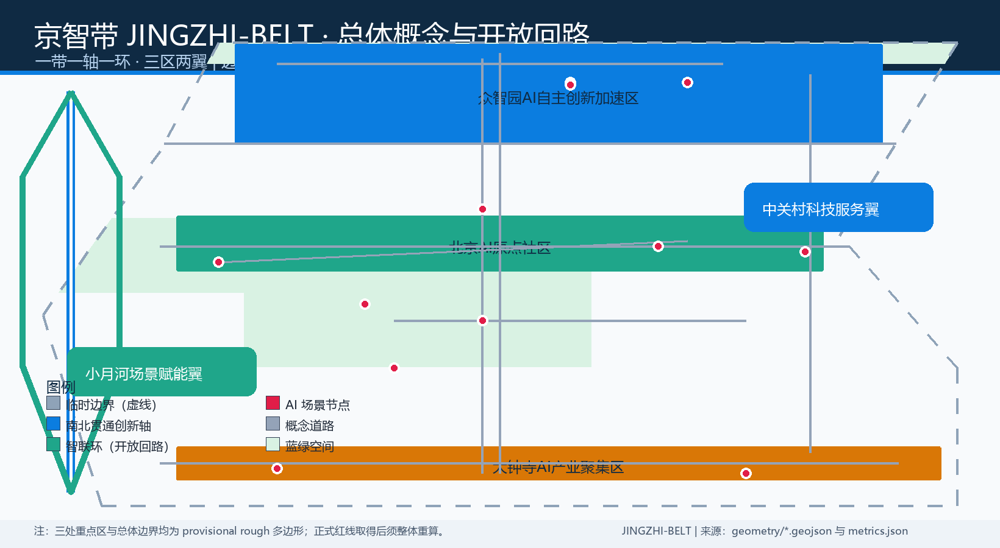
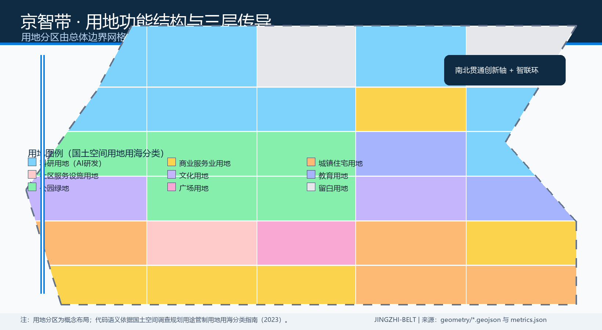
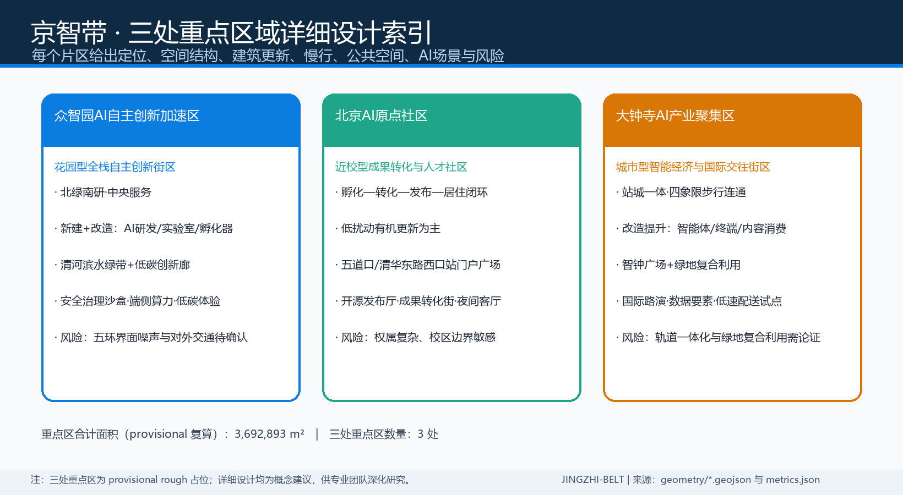
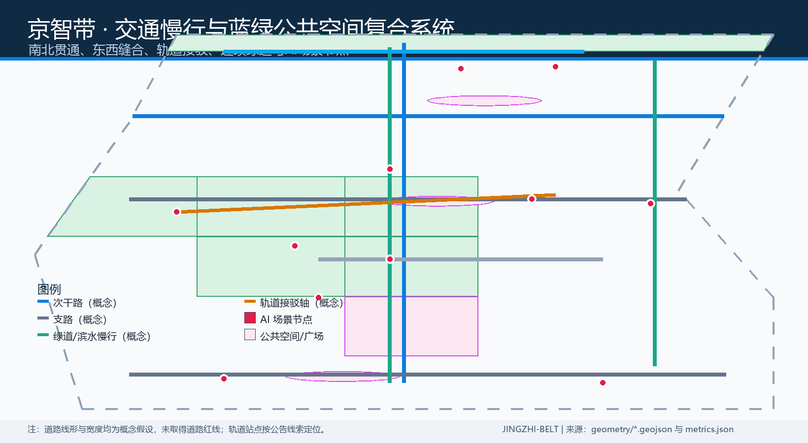
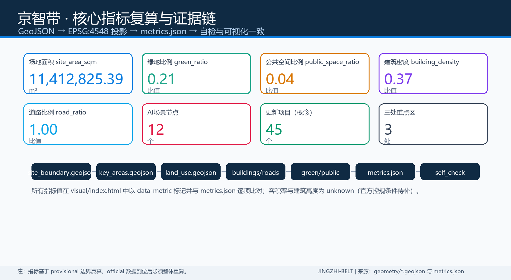

# 京智带 JINGZHI-BELT：百年京张AI创新带城市设计开源方案

## 方案总览

本方案提出"开放回路（Open Loop）"总体概念：以京张遗址公园活力带为纵轴，以"智联环"串联众智园、AI原点社区、大钟寺三处重点区，并向中关村科技服务翼与小月河场景赋能翼开放延伸，形成"一带一轴一环、三区两翼"的空间框架。命名采用"京智带 JINGZHI-BELT"：京，指京张铁路与北京；智，指人工智能与智慧城市；带，指创新带与铁路带双重意象。Logo 方向为双线轨道环加三个节点光标的几何标记，双线取自铁路钢轨意象，环代表开放回路与开源社区，三个节点对应三处重点区，色彩使用京张铁灰、AI 蓝与清河绿三色体系。所有空间落地建议均为概念建议与参考方案，可供专业团队深化研究，不替代正式规划，不构成政府审定结论 [source:AGENT-TASKBOOK] [source:OFFICIAL-ANNOUNCEMENT]。

## 设计依据与资料清单

本方案严格依据仓库公开资料包生成。设计简报 [source:SITE-PACKAGE] 提供项目名称、坐标政策、三层范围、三处重点区与设计任务；面向智能体任务书 [source:AGENT-TASKBOOK] 提供三大定位、五大功能、三区两翼、六项智能体任务与统一边界条款；官方资格预审公告 [source:OFFICIAL-ANNOUNCEMENT] 提供约 43.6 平方公里的统筹研究范围、约 11.4 平方公里的总体设计范围、约 368.4 公顷的重点区域范围及三处重点区面积。来源登记表 [source:SOURCE-REGISTRY] 与处理资料导航层 [source:PROCESSED-FACT-PACK] 用于区分 formal-ready、background-only 与 provisional-only 资料。

空间边界方面，仓库尚未取得官方精确 polygon，本方案采用维护者登记的临时粗略边界 [source:BOUNDARY-SOURCE] [source:KEY-AREA-SOURCE] [source:PROVISIONAL-BOUNDARIES]，仅用于生成、展示与自检，不得作为官方红线、审批依据或精确面积复算依据；官方数据到位后须整体重算。专业标准方面，采用城市设计管理办法 [source:MOHURD-URBAN-DESIGN-MEASURES]、控规编制审批办法 [source:MOHURD-CONTROL-DETAILED-PLANNING] 与用地用海分类指南 [source:MNR-LAND-USE-CLASSIFICATION] 的本地参考快照；全球生态案例 [source:GLOBAL-ECOSYSTEM-CASES] 仅作背景经验转译。正文、图层、指标、图纸与自检的对应关系见 sources.json、assumptions.json、compliance_matrix.json、standard_matrix.json 与 design_depth_matrix.json [standard:PROJECT-OFFICIAL-ANNOUNCEMENT] [depth:three_level_scope_framework]。

## 三层范围工作框架

统筹研究范围以约 43.6 平方公里支撑产业战略与未来城市研究；总体设计范围以约 11.4 平方公里开展控规深度城市设计，本提交包的全部空间图层均基于总体设计范围生成 [data:geometry/site_boundary.geojson#SITE-001] [metric:site_area_sqm]；重点区域范围约 368.4 公顷，自北向南为众智园AI自主创新加速区约 192.1 公顷、北京AI原点社区约 104.3 公顷、大钟寺AI产业聚集区约 72.0 公顷 [data:geometry/key_areas.geojson#PROV-KEY-001] [data:geometry/key_areas.geojson#PROV-KEY-002] [data:geometry/key_areas.geojson#PROV-KEY-003] [metric:key_area_count] [metric:key_area_total_area_sqm]。三级范围按"产业战略—总体城市设计—重点片区详细设计"逐级传导，深度项 three_level_scope_framework 完整覆盖 [depth:three_level_scope_framework]。

需要特别说明的是，本方案使用的边界与三处重点区均为 provisional rough 多边形，其矩形边不表达地块边界、道路红线或权属边界 [source:BOUNDARY-SOURCE] [source:KEY-AREA-SOURCE]。现状诊断深度项 existing_conditions_diagnosis 依据公告范围、来源登记与缺资料清单展开，现状建筑、权属与市政数据缺口在总体设计章节中逐项说明 [depth:existing_conditions_diagnosis]。取得官方资格预审文件或任务书附件后，site boundary、key areas、land use、buildings、roads、green space、public space、phasing 及全部指标均须在 EPSG:4548 下重新复算；组织方数据缺口本身不阻断内容评分 [source:PROVISIONAL-BOUNDARIES] [standard:PROJECT-OFFICIAL-ANNOUNCEMENT]。

## 统筹研究范围产业与未来城市研究

三大定位为百年京张文化带、都市AI生活体验带、AI融合创新带；五大功能为AI全栈自主创新体系、世界级AI创新生态、AI+场景赋能新范式、智能化AI活力城市、AI治理全球话语权 [standard:PROJECT-AGENT-OPEN-CALL-TASKBOOK]。三区两翼协同回路为：AI原点社区输出原始创新与成果转化，众智园承担全栈自主创新、标准与安全治理，大钟寺承载智能原生新业态与国际交往，中关村科技服务翼配置要素、IP与资本服务，小月河场景赋能翼承担AI场景试点与城市活力 [source:AGENT-TASKBOOK]。本方案将其转译为"一轴一环"空间结构：南北贯通创新轴连接三区，智联环把两翼的科技服务与场景赋能资源送回三个片区 [depth:overall_spatial_structure]。

全球AI创新生态案例转译方面，本方案整理六个公开背景案例：波士顿肯德尔广场的校区—园区—街区协同、伦敦国王十字的旧工业区更新与知识经济混合、新加坡纬壹科技城的生命科学与数字产业聚合、首尔板桥科技谷的政企共治园区、深圳南山区的龙头企业牵引生态、杭州未来科技城的场景开放与人才社区 [source:GLOBAL-ECOSYSTEM-CASES]。可转化的机制包括：近校成果转化带（原点社区）、全栈测试与标准沙盒（众智园）、智能原生消费与数据要素会客厅（大钟寺）、开发者社区与开源发布（两翼）[metric:ai_scenario_node_count]。未来城市形态强调自适应街区、可进化的功能混合、感知可交互的AI+交通与连续无界绿带，全部作为概念方向供专业团队深化 [depth:land_use_layout]。

## 总体设计范围城市更新与控规深度城市设计

总体设计范围以城市更新为抓手，形成"保留肌理、更新功能、织补断点、新增节点"的更新总体框架。用地布局采用科研、商业、居住、文化、教育、绿地、广场与留白多类复合分区 [data:geometry/land_use.geojson#LU-001] [depth:land_use_layout]，产业空间以科研用地为主 [metric:land_use_research_area_sqm]，并配置商业服务 [metric:land_use_commercial_area_sqm]、居住与社区服务 [metric:land_use_residential_area_sqm]、文化 [metric:land_use_culture_area_sqm]、教育 [metric:land_use_education_area_sqm]、绿地 [metric:land_use_green_area_sqm] 与广场 [metric:land_use_plaza_area_sqm]。沿京张遗址公园两侧组织低效空间更新，提出校区园区街区融合的重点区域与统筹实施模式 [depth:renewal_project_list]。

开发强度方面，容积率与建筑高度均登记为 unknown，原因是通过公开渠道未取得已批控规条件 [metric:floor_area_ratio] [metric:building_height_m]，相关表述仅为待确认控规条件与概念建议，不构成法定规划判断 [standard:MOHURD-CONTROL-DETAILED-PLANNING] [source:MOHURD-CONTROL-DETAILED-PLANNING]；建筑密度与基底面积为几何复算的概念规模 [metric:building_density] [metric:building_footprint_area_sqm]。更新总体框架同时提出创新指数、人才密度、AI产业空间规模等指标方向，以及"1+X+1"产业体系下的AI+垂直应用落点 [source:OFFICIAL-ANNOUNCEMENT] [depth:development_intensity_controls]。

## 重点区域详细设计

### 众智园AI自主创新加速区

定位为花园型全栈自主创新街区。空间结构上以清河界面为北向生态门户，形成"北绿南研、中央服务"的格局；建筑更新以新建与改造并举，布局AI研发、实验室与孵化器基底 [data:geometry/buildings.geojson#BLDG-001]；交通上依托北五环一体化组织对外集散，内部以慢行绿环连接测试场与标准治理展示节点；公共空间结合清河滨水绿带布置低碳创新交往空间 [data:geometry/green_space.geojson#GREEN-001]；AI场景包括安全治理沙盒、端侧算力驿站与低碳算力体验 [data:geometry/constraints.geojson#SC-02]；实施风险为五环界面噪声与对外交通条件待官方方案确认 [depth:three_key_area_detailed_design]。

### 北京AI原点社区

定位为近校型成果转化与人才社区。空间结构围绕清华、北大、中科院周边组织"孵化—转化—发布—居住"闭环，以校区园区慢行缝合和轨道站点一体化设计强化近校联系 [data:geometry/roads.geojson#ROAD-002] [metric:road_area_sqm]；建筑更新以低扰动有机更新为主，布局教育科研、人才公寓与社区服务；公共空间设置五道口、清华东路西口站门户广场 [data:geometry/public_space.geojson#PUBLIC-001]；AI场景包括开源发布厅、近校成果转化街与开发者夜间协作客厅 [data:geometry/constraints.geojson#SC-01]；实施风险为权属复杂、校区边界敏感，需逐地块确认 [depth:retain_renovate_demolish]。

### 大钟寺AI产业聚集区

定位为城市型智能经济与国际交往街区。空间结构围绕大钟寺站组织四象限步行连通，形成"站城一体、商办混合、智能原生"的城市型街区；建筑更新以改造提升为主，布局智能体、智能终端、内容消费与数据要素服务载体 [metric:land_use_commercial_area_sqm]；交通上重点解决站点周边慢行断点与非机动车停放 [metric:road_ratio]；公共空间设置大钟寺站四象限步行广场与规划绿地复合利用节点 [data:geometry/public_space.geojson#PUBLIC-003]；AI场景包括国际路演客厅、数据要素会客厅与机器人低速配送试点 [data:geometry/constraints.geojson#SC-05]；实施风险为轨道站点一体化与绿地复合利用需专业论证 [depth:three_key_area_detailed_design]。

## AI 创新生态、人才画像与 AI+ 场景

### 用户画像

本方案定义六类用户画像：开源开发者，需要发布、协作、测试与社区声誉空间；初创团队，需要低成本办公、算力入口与产品试验场；头部企业与国际访客，需要展示、商务、国际接待与人才招聘环境；高校师生与科研人员，需要成果转化、跨校协作与日常慢行联系；周边居民与通勤者，需要休闲、社区服务与低扰动更新；运营者与公共服务者，需要活动组织、安全复核与数据治理工具。每类画像均映射到具体空间类型与场景节点 [metric:ai_scenario_node_count]。

### AI 场景卡

以下十二张场景卡均在正文可读，并映射到空间、运营、隐私边界与人工复核 [depth:traffic_rail_slow_parking] [depth:municipal_new_infrastructure]：

| 场景卡 | 空间载体 | 服务对象 | 数据与隐私边界 | 人工复核 |
| --- | --- | --- | --- | --- |
| SC-01 开源发布厅 | 原点社区 | 开发者 | 仅聚合活动数据 | 内容审核 |
| SC-02 安全治理沙盒 | 众智园 | 企业与监管 | 沙盒数据不出园 | 专家评审 |
| SC-03 端侧算力驿站 | 总体设计范围 | 初创团队 | 按授权使用算力 | 计量审计 |
| SC-04 AI慢行导航 | 京张遗址公园 | 居民与游客 | 不采集轨迹 | 交通复核 |
| SC-05 国际路演客厅 | 大钟寺 | 企业与媒体 | 企业素材须清权 | 法务审核 |
| SC-06 清河低碳创新廊 | 清河界面 | 公众 | 只做聚合展示 | 生态复核 |
| SC-07 近校成果转化街 | 原点社区 | 高校师生 | 科研成果须授权 | 成果确权 |
| SC-08 数据要素会客厅 | 大钟寺 | 企业与机构 | 数据流通规则另议 | 合规评审 |
| SC-09 机器人低速配送试点 | 大钟寺与公园南段 | 商户与居民 | 试点边界人工设定 | 安全评审 |
| SC-10 AI健康服务导航 | 公共空间节点 | 居民 | 不采集健康隐私 | 医疗复核 |
| SC-11 京张文化数字导览 | 公园文化节点 | 游客 | 使用清权素材 | 史实核查 |
| SC-12 开发者夜间协作客厅 | 众智园与原点 | 开发者 | 仅活动签到 | 社区自治 |

其中 SC-02、SC-08、SC-09 为 AI 产业测试验证场景，均明确为待深化试点，不表述为已批准运营 [source:AGENT-TASKBOOK]。所有场景遵守"人工可复核、数据最小化、不指定供应商为必要条件"的边界 [standard:PROJECT-AGENT-OPEN-CALL-TASKBOOK]。

## 用地、建筑规模与拆改留方案

用地分区由总体设计边界网格化派生，全部多边形共享边界坐标，无缝隙、无重叠 [depth:land_use_layout]。用地代码采用国土空间用地用海分类语义 [standard:MNR-LAND-USE-CLASSIFICATION-GUIDE] [source:MNR-LAND-USE-CLASSIFICATION]：科研用地 0802 支撑AI研发与实验室 [metric:land_use_research_area_sqm]，商业服务业用地 05 支撑智能原生消费与商务 [metric:land_use_commercial_area_sqm]，居住与社区服务用地 0701/0702 支撑人才生活 [metric:land_use_residential_area_sqm]，文化用地 0803 与教育用地 0804 支撑文化叙事与近校转化 [metric:land_use_culture_area_sqm] [metric:land_use_education_area_sqm]，公园绿地 1401 与广场用地 1403 支撑蓝绿公共空间 [metric:land_use_green_area_sqm] [metric:land_use_plaza_area_sqm]。

建筑规模方面，建筑基底面积为几何复算值 [metric:building_footprint_area_sqm]，建筑密度为基底与场地之比 [metric:building_density]；由于未取得现状建筑普查与官方控规条件，基底仅表达概念规模方向，不构成地块拆改留结论 [source:PROCESSED-FACT-PACK] [depth:development_intensity_controls]。拆改留方案采用概念性 renewal_status 属性（保留、改造、新建），对应重点区详细设计与更新项目清单 [depth:retain_renovate_demolish] [depth:height_massing_character]；沿京张遗址公园提出高度由内向外渐升、屋顶与体量呼应轨道意象的风貌引导，具体管控值待官方附件确认 [standard:MOHURD-URBAN-DESIGN-MEASURES]。

## 交通、轨道、市政与公共服务设施

交通体系以"南北贯通、东西缝合"为目标：南北贯通次干路串联三处重点区 [data:geometry/roads.geojson#ROAD-001]，京张遗址公园活力绿道提供连续步行骑行主轴 [data:geometry/roads.geojson#ROAD-005]，小月河场景赋能翼绿道联系东侧片区 [data:geometry/roads.geojson#ROAD-006]，轨道站点接驳步行轴与门户广场共同缝合站点四象限 [data:geometry/roads.geojson#ROAD-007] [metric:public_space_ratio]。道路面积为按设计宽度缓冲后与场地求交的复算值 [metric:road_area_sqm]，道路比例为场地占比 [metric:road_ratio]，均为设计假设而非道路红线 [depth:traffic_rail_slow_parking]。

市政与新型基础设施方面，提出分布式能源、端侧算力、数据服务与创新服务平台的概念原型，依托场景节点逐步落地 [depth:municipal_new_infrastructure]；AI产业服务设施、人才生活服务设施与新型基础设施的体系与标准建议纳入更新项目清单，具体容量测算需专业团队基于官方市政数据完成 [source:MOHURD-CONTROL-DETAILED-PLANNING] [metric:ai_scenario_node_count]。所有轨道线位、站点一体化与市政管线表述均为方向性概念，不构成工程方案 [standard:PROJECT-OFFICIAL-ANNOUNCEMENT]。

## 蓝绿空间、公共空间与城市风貌

蓝绿系统以京张遗址公园活力带为纵轴，连接清河滨水绿带与小月河场景赋能翼，形成连续无界的公园与绿道网络 [data:geometry/green_space.geojson#GREEN-001]；绿地面积与绿地比例由几何复算 [metric:green_space_area_sqm] [metric:green_ratio]，公共空间面积与比例同样由几何复算 [metric:public_space_area_sqm] [metric:public_space_ratio]，全部数据在 visual/index.html 中与 metrics.json 保持一致 [depth:blue_green_public_space]。

AI公共空间与朝圣地标方面，提出三个 AI 朝圣地标方向：清华园车站旧址"原点车站"荣誉展示节点，用于呈现京张铁路历史、中关村创新与AI新文化的传承关系；京张遗址公园"开源代码长廊"，以可更新的开源贡献墙与数字导览呈现开发者社区荣誉；大钟寺"智钟广场"，以智能钟表装置与数据要素会客厅呈现AI原生新业态 [source:AGENT-TASKBOOK]。三者均为概念建议，未授权素材不使用，不表述为已批准建设 [standard:PROJECT-AGENT-OPEN-CALL-TASKBOOK] [depth:blue_green_public_space]。荣誉展示体系与公共空间组件库按"轨道符号、节点光标、回路路径"三类组件组织，文化标识系统与一带整体Logo系统分置管理，避免混淆 [depth:overall_spatial_structure]。

## 更新项目清单、实施政策与分期计划

更新项目清单对应建筑 renewal_status 与分期图层 [data:geometry/buildings.geojson#BLDG-001] [metric:renewal_project_count]，实施分三期：近期启动大钟寺站城一体与公园南段 [data:geometry/phasing.geojson#PHASE-001] [metric:phase1_area_sqm]，中期推进原点社区近校更新与公园中段 [data:geometry/phasing.geojson#PHASE-002] [metric:phase2_area_sqm]，远期统筹众智园北段与清河界面 [data:geometry/phasing.geojson#PHASE-003] [metric:phase3_area_sqm] [depth:phasing_implementation]。实施政策建议聚焦容积率奖励与公共空间贡献挂钩、低扰动有机更新导则、场景开放与数据治理规则、开发者社区运营补贴方向，均为概念政策建议 [source:AGENT-TASKBOOK]。

全球AI创新活动体系方面，提出"JZ OPEN WEEK"年度活动品牌、开发者社区运营机制、AI场景开放运营机制、公共体验路线与城市地标运营、国际传播与招引转化机制 [depth:renewal_project_list]。活动体系包含季度发布日、年度开源大会、场景马拉松与荣誉展示仪式等设想，全部表述为概念设想与深化方向，不构成已确定政府安排或投资承诺 [standard:PROJECT-AGENT-OPEN-CALL-TASKBOOK] [source:GLOBAL-ECOSYSTEM-CASES]。

## 指标体系、面积复算与合规矩阵

全部已知指标均由 geometry 在 EPSG:4548 下复算，并与 spatial_review 输出一致 [depth:metrics_recalculation] [standard:MNR-LAND-USE-CLASSIFICATION-GUIDE]。核心指标包括：场地面积 [metric:site_area_sqm]、绿地面积 [metric:green_space_area_sqm]、绿地比例 [metric:green_ratio]、公共空间面积 [metric:public_space_area_sqm]、公共空间比例 [metric:public_space_ratio]、建筑基底面积 [metric:building_footprint_area_sqm]、建筑密度 [metric:building_density]、道路面积 [metric:road_area_sqm]、道路比例 [metric:road_ratio]、三处重点区 [metric:key_area_count] 与重点区总面积 [metric:key_area_total_area_sqm]、AI场景节点 [metric:ai_scenario_node_count]、更新项目 [metric:renewal_project_count]、三期面积 [metric:phase1_area_sqm] [metric:phase2_area_sqm] [metric:phase3_area_sqm]，以及六项用地指标 [metric:land_use_research_area_sqm] [metric:land_use_commercial_area_sqm] [metric:land_use_residential_area_sqm] [metric:land_use_culture_area_sqm] [metric:land_use_education_area_sqm] [metric:land_use_green_area_sqm] [metric:land_use_plaza_area_sqm]。容积率 [metric:floor_area_ratio] 与建筑高度 [metric:building_height_m] 为 unknown，原因与待补来源已写入 metrics.json。

合规矩阵覆盖官方公告 1.3、1.4、1.5 全部任务与 agent.1 至 agent.6 六项智能体任务 [depth:risk_missing_data]；标准矩阵覆盖五项强制标准与一项待补深度标准 [standard:MOHURD-ARCH-DESIGN-DEPTH-2016]，设计深度矩阵覆盖十五项 formal 深度项。所有矩阵均提供章节、图层、指标、图纸、来源、假设与自检证据链 [source:PROCESSED-FACT-PACK]。

## 风险、版权与合规说明

本方案存在以下风险与资料缺口：官方精确边界与三处重点区 polygon 未取得，所有面积结论待 official 数据到位后重算 [source:BOUNDARY-SOURCE] [source:KEY-AREA-SOURCE]；控规容积率、高度、退线与道路红线未取得，不得作为法定规划判断 [source:MOHURD-CONTROL-DETAILED-PLANNING]；现状建筑、权属、市政管线、文保控制线未取得，拆改留与基础设施表述仅限概念方向 [depth:retain_renovate_demolish] [depth:risk_missing_data]；建筑专业深度参照项 MOHURD-ARCH-DESIGN-DEPTH-2016 未取得官方文件，登记为待补资料 [standard:MOHURD-ARCH-DESIGN-DEPTH-2016]。

版权与合规方面：全部文本、几何、图表与HTML均由声明的AI智能体生成或整理，素材仅来自公开或清权来源 [source:SOURCE-REGISTRY]；场景设计不采集个人隐私数据，所有AI判断保留人工复核与公众参与路径 [source:AGENT-TASKBOOK]；方案中不包含未经授权的商标、字体、图片、人物肖像与版权材料，详见 report/copyright_statement.md [depth:risk_missing_data]。所有空间落地建议均表述为"概念建议""参考方案""可供专业团队深化研究"，不构成政府审定结论或实施承诺 [standard:PROJECT-AGENT-OPEN-CALL-TASKBOOK]。

## 参考资料

本方案引用以下仓库资料与本地参考快照：

- brief/site-package/design_brief.json、agent_taskbook.json、allowed_design_space.json、sources.json、planning_limits.json 与 schemas/*.json [source:SITE-PACKAGE]
- brief/site-package/geometry/provisional_boundaries.geojson 及其推定依据 [source:BOUNDARY-SOURCE] [source:KEY-AREA-SOURCE] [source:PROVISIONAL-BOUNDARIES]
- brief/site-package/standards/standards.json 与 standards/references/*.md（公告、任务书、城市设计管理办法、控规办法、用地分类指南、建筑深度参照）[standard:PROJECT-OFFICIAL-ANNOUNCEMENT] [standard:PROJECT-AGENT-OPEN-CALL-TASKBOOK] [standard:MOHURD-URBAN-DESIGN-MEASURES] [standard:MOHURD-CONTROL-DETAILED-PLANNING] [standard:MNR-LAND-USE-CLASSIFICATION-GUIDE] [standard:MOHURD-ARCH-DESIGN-DEPTH-2016]
- data/source_registry.json 与 data/processed/agent_fact_pack.md [source:SOURCE-REGISTRY] [source:PROCESSED-FACT-PACK]
- 官方公告页与征集组织机构页面 [source:OFFICIAL-ANNOUNCEMENT]
- 六项智能体任务书与统一边界条款 [source:AGENT-TASKBOOK]
- 全球AI创新生态公开背景案例 [source:GLOBAL-ECOSYSTEM-CASES]

以上资料共同构成 sources.json、assumptions.json、compliance_matrix.json、standard_matrix.json、design_depth_matrix.json、self_check.json、geometry/*.geojson、metrics.json、assets/figures/*.png、report/proposal.html、drawings/*.pdf 与 visual/index.html 的证据链 [depth:three_level_scope_framework] [depth:metrics_recalculation] [depth:risk_missing_data]。
