# DOUBLE MEMORY JINGZHANG

> **v9.0 thesis:** Good civic AI must prove not only that it can run when complete, but that it refuses release when evidence is missing or operations fail. This edition redraws the spine, three stations, two wings, nine cross-stitches and three proof blocks as one urban system, then adds the Double-Memory Fault-Injection Protocol: 12 complete contracts earn field-review eligibility only, 96 single-field omissions are blocked, and 12 operational faults fall back to ordinary service and `HOLD`. The 120/120 result is synthetic negative testing; field performance remains 0/2 not run.

| Review dimension | Material v9.0 advance | Verification entry |
| --- | --- | --- |
| Alignment and originality | The Proof Mile connects the public-memory spine, daily routes, passports, and implementation gates into one legible method | `proof-mile-spatial-atlas.json` |
| AI-planning innovation | An eight-field release contract and twelve fault injections block AI whenever scope, operator, ordinary service, minimum data, visible choice, human stop, evidence, or reinstatement is missing | `double-memory-fault-injection.json`; offline audit |
| Feasibility | P01 plan, S01 section, D01 detail, O01 operations and T01 test form an auditable package; dimensions, cost and reinstatement are recomputed offline | `proof-block-technical-spec.json`; technical audit |
| Public interest | A 4.0 m no-AI route remains open with at least 1.8 m accessible clear width; ordinary service needs no account and never crosses the test court | P01, S01 and T01 |
| Risk and expression | 120/120 synthetic negative tests and 0/2 field performance are separated; the masterplan, three mini-plans, nine stitches and four-zone section tell one spatial story | Board 01; five required figures |
| International communication and long-term operation | The 24-Hour Civic Innovation Line sustains operation while three proof blocks govern incremental delivery and release | `24h-public-innovation-line.json`; Board 09 |

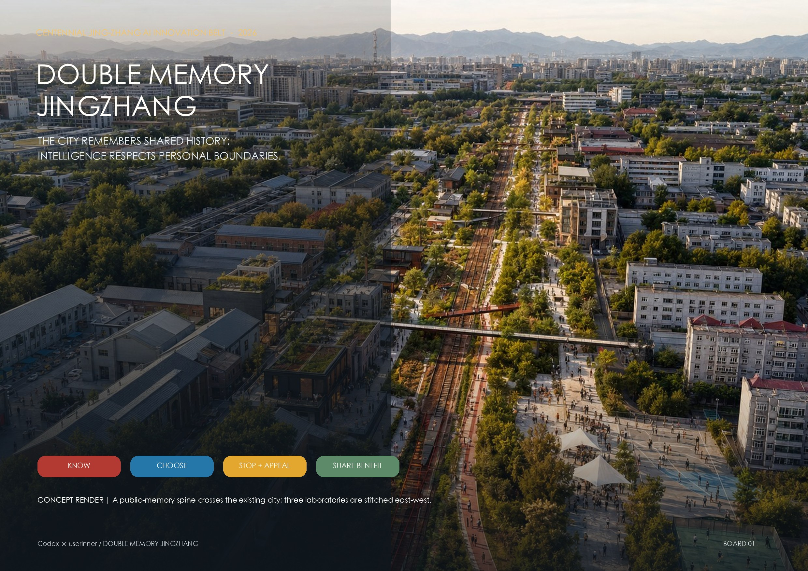

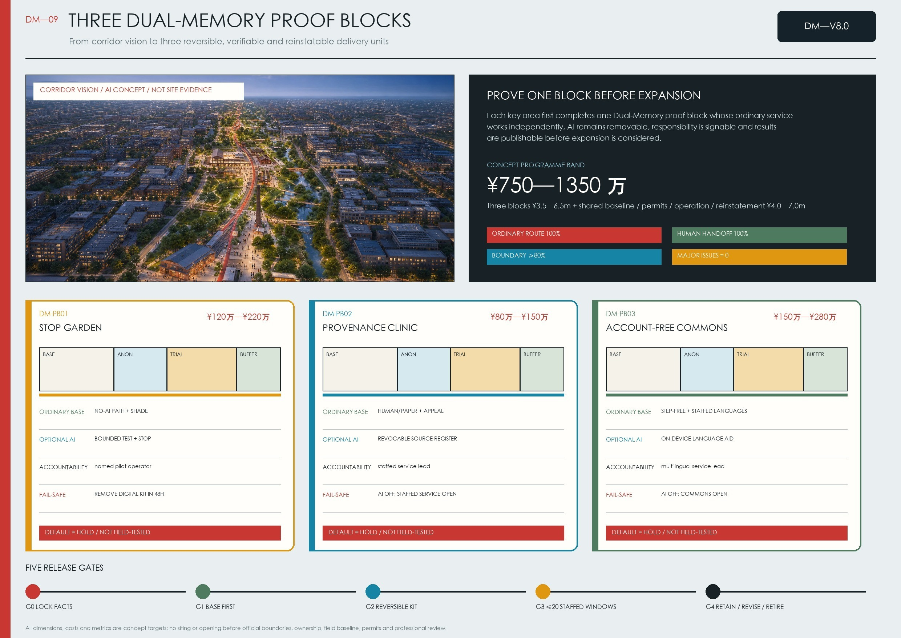

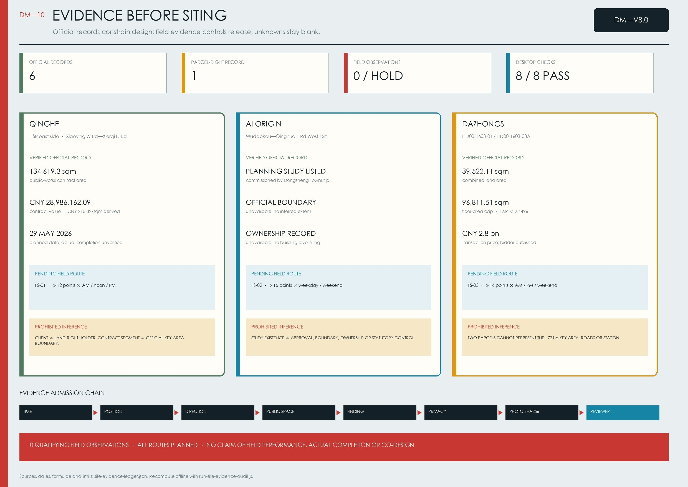

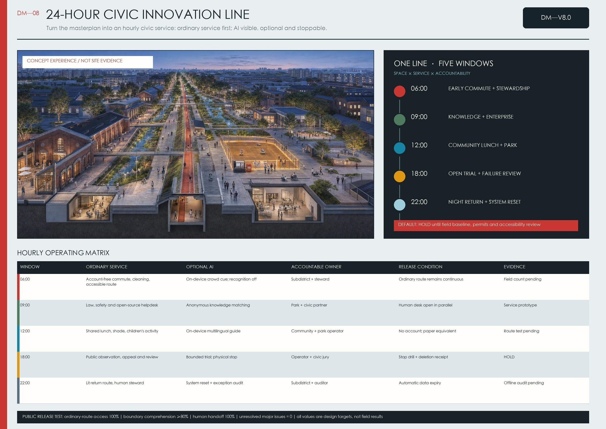

## Design Basis and Source List

Double Memory begins with one clear distinction: a city should preserve shared history, but it should not preserve every trace of an individual’s daily life. The project links three transitions in autonomous capacity—independent railway engineering, Zhongguancun’s conversion of knowledge into public value, and the right of people to make the final decision over urban AI. Four civic rights become spatial and operational interfaces: the rights to know, choose, stop and appeal, and share benefits. [source:OFFICIAL-ANNOUNCEMENT] [source:JINGZHANG-HERITAGE] [depth:existing_conditions_diagnosis]

The proposal is generated from the official announcement, the agent taskbook, the repository site package, and the local professional standards library. The overall area and three key areas currently use provisional repository polygons. They support concept generation, visual explanation, and machine review only; they are not official redlines, statutory controls, or parcel-level renewal decisions. Once official polygons are available, all nine GeoJSON layers, metrics, drawings, and HTML outputs must be recalculated together. [source:SITE-PACKAGE] [source:SOURCE-REGISTRY] [source:BOUNDARY-SOURCE] [data:geometry/site_boundary.geojson#SITE-001]

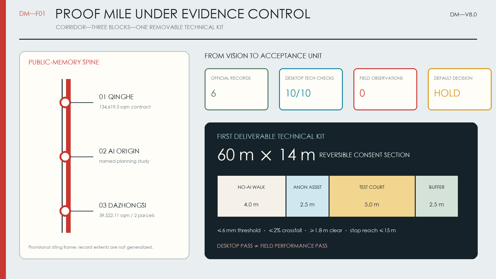

Sources are separated by role. Official notices and policies support task, direction, and compliance claims. Repository processed files are navigation aids rather than new authorities. Historic, demographic, community, and international cases support human, operational, and governance design but do not become statutory spatial controls. [source:PROCESSED-FACT-PACK] [source:HAIDIAN-STATISTICS] [source:GLOBAL-CASES]

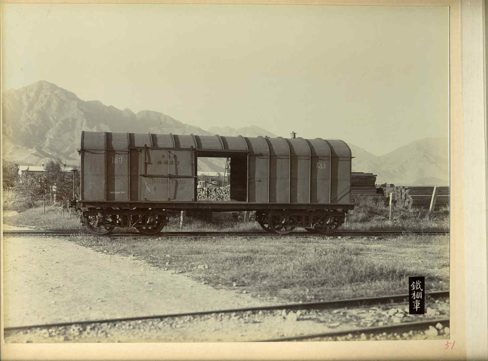

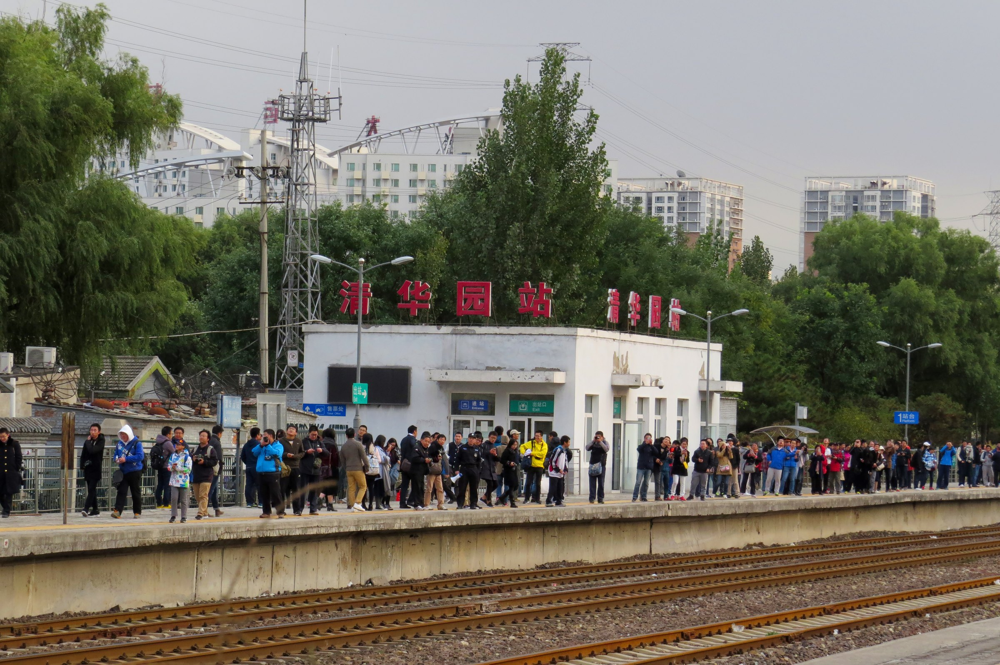

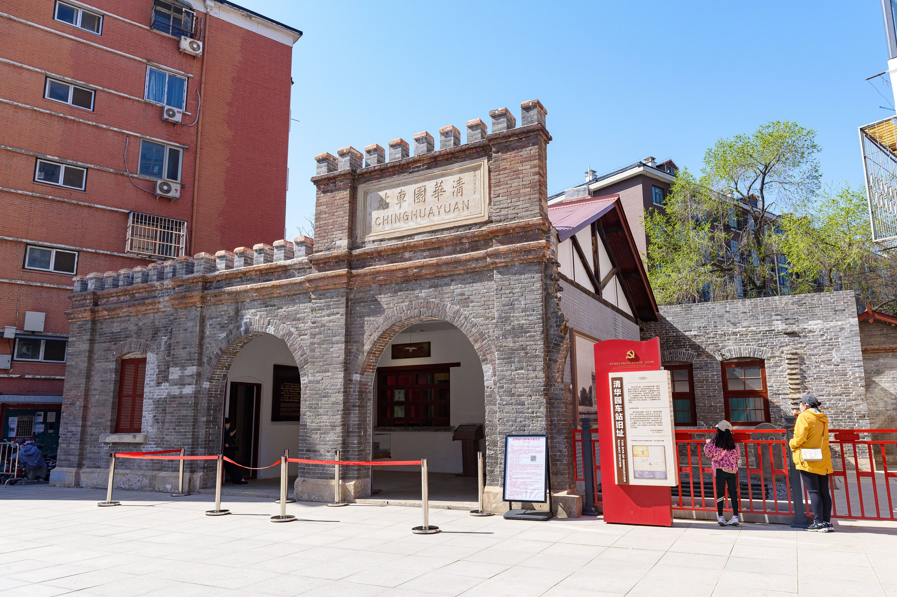

The three images provide visual evidence for engineering history, daily railway life, and adaptive reuse. Authors, licences, original pages, and modification notes are registered in the source and copyright files. [source:IMAGE-JINGZHANG-1909] [source:IMAGE-QHY-2016] [source:IMAGE-QHY-2024]

### Official records and ownership boundary

Draft control plans for HD00-1601, 1602, 1603, 1604 and 1605 were displayed from 19 December 2024 to 19 January 2025. Haidian's first-quarter 2026 progress record says only that the corridor control plan passed municipal departmental joint review and continued towards approval and implementation. This verifies an advancing procedure—not final approval, official polygons, land-use controls or development parameters. [source:JZ-CONTROL-PLAN-NOTICE] [source:JZ-CONTROL-PLAN-PROGRESS]

At Qinghe, an official public-works contract covers the east side of the Jing-Zhang high-speed railway from Xiaoying West Road to Xierqi North Road: 134,619.3 square metres, CNY 28,986,162.09, Qinghe Subdistrict Office as client, and 29 May 2026 as planned completion. It verifies contract scope and parties, not actual completion or land rights. The derived CNY 215.32 per square metre records scale only and is not directly comparable with proof-block concept costs. [source:QINGHE-CONTRACT] [metric:verified_qinghe_public_project_area_sqm]

Near Dazhongsi, an official transaction covers parcels HD00-1603-01 and HD00-1603-03A: 39,522.11 square metres of land, a 96,811.51-square-metre above-ground floor-area cap, a derived FAR cap of 2.4496, a CNY 2.8 billion price, and Beijing Yunyue Changshi Technology Co., Ltd. as winning bidder. The right record applies only to these two parcels; it is not a complete ownership map for the approximately 72-hectare key area and says nothing about adjacent roads, stations or buildings. [source:DAZHONGSI-LAND-TRANSACTION] [metric:verified_dazhongsi_parcel_far_cap]

## Three-Level Scope Framework

The coordinated research area asks how industry and public value reinforce each other. The overall design area asks how an approximately nine-kilometre corridor connects north to south and stitches east to west. The three key areas test how institutional prototypes enter public space, building renewal, walking systems, and daily operation. The levels are transmitted through one memory spine, three human-directed stations, two collaborative wings, and three consent gradients. [standard:PROJECT-OFFICIAL-ANNOUNCEMENT] [depth:three_level_scope_framework]

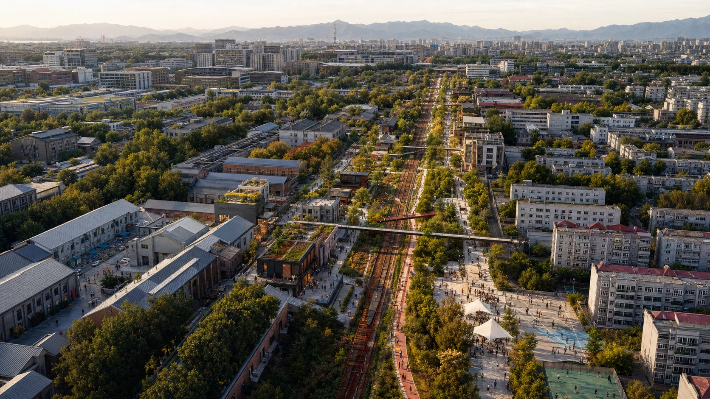

| Level | Question | Double Memory response | Evidence |
| --- | --- | --- | --- |
| Coordinated research | How does a world-class AI ecosystem serve public value? | Knowledge, translation, public testing, and rule export form a loop | compliance_matrix.json |
| Overall design | How do industry, life, heritage, and park become one city? | A public-memory spine links campuses, parks, streets, and communities | [data:geometry/land_use.geojson#LU-001] |
| Key areas | How can tests remain visible, reversible, and reviewable? | Three human-directed urban laboratories | [data:geometry/key_areas.geojson#PROV-KEY-001] |

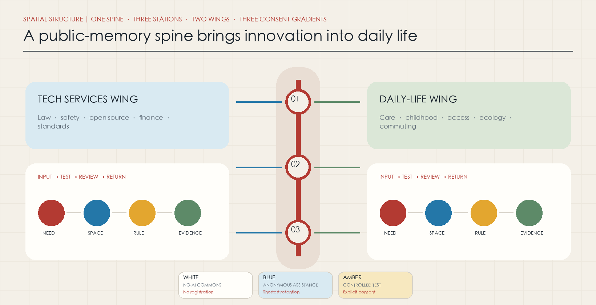

The submitted provisional overall polygon measures 11,412,825.386 square metres. This number describes submitted geometry only and is not an approved area. [metric:site_area_sqm] The number of provisional key areas is three; their exact location and form await official confirmation. [metric:key_area_count]

## Coordinated Research Area: Industry and Future City Research

### Three transitions in autonomous capacity

The Jing-Zhang Railway embodied independent engineering in 1909. Zhongguancun later developed an ecosystem that moved knowledge into production and society. The next form of urban autonomy is people’s ability to understand, authorise, interrupt, and review AI action. Progress is measured not by device count or screen density, but by solved public problems, reversible systems, traceable responsibility, and shared benefit. [source:ZHONGGUANCUN-HISTORY] [source:BEIJING-AI-POLICY]

### A five-part innovation chain

Universities produce verifiable knowledge; open-source communities build shared assets; enterprises convert them into products; neighbourhoods and public spaces host controlled trials; professional services and public review complete the feedback loop.

- The Zhongguancun technology-services wing provides legal, IP, safety, open-source, finance, and standards capacity.
- The Xiaoyue River daily-life wing originates questions in care, childhood, accessibility, ecology, commuting, and night safety.
- Every project requires a real need, an accountable operator, a test space, and an exit mechanism.

The future city is a permeable innovation district where campuses, parks, streets, and communities share accessible ground floors. Public forecourts, borderless greenery, walking connections, and offline services are innovation infrastructure. [source:HAIDIAN-RENEWAL-GUIDE] [standard:MOHURD-URBAN-DESIGN-MEASURES] [depth:overall_spatial_structure]

## Overall Design Area: Urban Renewal and Regulatory-Plan-Level Urban Design

The structure combines a public-memory spine, three laboratories, two collaborative wings, and three consent zones. AI research, business services, community services, and open space cover the submitted provisional boundary as a conceptual allocation method, not a statutory land-use change. [data:geometry/land_use.geojson#LU-001] [depth:land_use_layout]

Renewal uses four actions: retain railway heritage, stable communities, and useful buildings; renovate closed ground floors, idle industrial space, and low-efficiency offices for public learning and enterprise services; consider demolition only after ownership, structure, safety, heritage, and resident review; and use new construction primarily to fill accessibility, care, youth housing, sanitation, edge-compute, and energy gaps.

The building layer contains 310,807.184 square metres of conceptual renewal footprints and is not an approval-level retain-renovate-demolish decision. [data:geometry/buildings.geojson#BLDG-001] [metric:building_footprint_area_sqm] FAR, height, road redlines, setbacks, and municipal capacity remain unknown pending official controls and engineering data. [depth:development_intensity_controls]

### Three consent gradients

| Level | Spatial prototype | Data rule | User right |
| --- | --- | --- | --- |
| White: no-AI commons | Paths, seating, water, toilets, ordinary signs | No face or individual trajectory recognition | Use without registration |
| Blue: anonymous assistance | Crowd guidance, environment, accessibility prompts | Edge processing, aggregation, shortest retention | Visible notice and non-AI alternative |
| Amber: controlled test | Robots, autonomous mobility, interactive models | Explicit consent, purpose limitation, audit log | Exit, stop, human supervision |

One legible field language unifies the gradients: white dots mean free passage, blue pulses mean anonymous assistance, and amber frames mean an active trial. Green, yellow, and red states mean normal, restricted, and stopped.

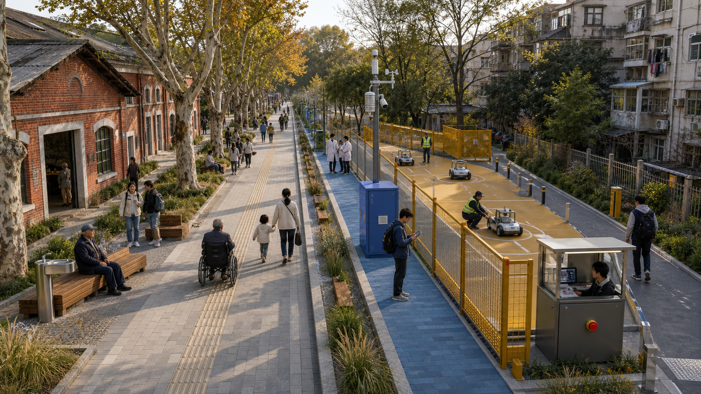

v9.0 turns the abstract gradient into a 60 m × 14 m prototype envelope that can be recalibrated on site: a 4.0 m continuous no-AI walk, 2.5 m anonymous-assist strip, 5.0 m controlled test court, and 2.5 m planted safety buffer. These are functional tests rather than parcel controls; accessible clear width must never fall below 1.8 m. Sensors remain visible, the edge cabinet can be disconnected, the court has a physical emergency stop and staffed controller, and the public bypass never crosses the test area. Full construction, responsibility, data, and stop conditions are in `visual/assets/memory-boundary-passports.json`. [depth:traffic_rail_slow_parking]

### v9 release compiler and fault injection

The minimum block is not a rendering but five drawings that must reconcile. P01 fixes the 14.0 m total and four-zone allocation. S01 keeps the ordinary route continuously open. D01 fixes a threshold no higher than 6 mm, crossfall no greater than 2%, head clearance of at least 2.2 m, a wheelchair turning circle of at least 1.5 m, and tactile warning at least 0.6 m deep. O01 fixes a human-takeover target within 10 seconds, local isolation within 120 seconds, and removal of the digital kit within 48 hours. T01 records every release and rejection condition.

The technical audit recomputes a 14.0 m total, a 4.0 m ordinary route, emergency-stop design reach no greater than 15 m, and reconciliation between CNY 3.5–6.5 million for three blocks and CNY 7.5–13.5 million for the full programme. Ten of ten desktop checks pass. Qualifying field observation and physical stop/takeover timing remain unperformed at 0/2; until both pass, `release_decision` stays `HOLD`. The auditable specification and calculator are `visual/assets/proof-block-technical-spec.json` and `visual/assets/run-proof-block-technical-audit.js`. [metric:technical_desktop_check_count] [metric:field_performance_test_pass_count]

Version 9 adds one eight-field release contract across all twelve scenarios: bounded scope, accountable operator, an independent ordinary-service equivalent, minimum data and retention, visible notice and choice, human takeover and physical stop, acceptance evidence, and timed rollback and reinstatement. Each scenario runs one complete contract plus eight single-field deletion cases, producing 12 baseline cases and 96 omission cases. Twelve cross-cutting fault cards cover sensor overreach, deletion timeout, account lockout, blocked accessible route, unreachable stop, absent operator, stale heritage source, provisional-boundary drift, complaint-channel failure, model/network outage, crowd conflict, and overdue reinstatement: 120 deterministic tests in total. [metric:synthetic_fault_test_count]

The audit returns 120/120 `PASS`: complete contracts are not falsely rejected, every omission is correctly blocked, and every fault invokes ordinary service or local isolation while keeping `HOLD`. This is not safety certification, field performance, public consent or implementation permission. Data and replay entry points are `visual/assets/double-memory-fault-injection.json` and `visual/assets/run-double-memory-fault-injection.js`. [metric:omission_case_block_count] [metric:fault_safe_fallback_count]

### Memory Boundary Passports and the forgetfulness budget

Each passport answers eight questions: where, how large, who is responsible, what is recorded, how long it remains, how ordinary service continues, what stops the system, and what evidence supports retention, revision, or retirement. All three passports currently remain `hold`. They may enter `limited_release` only when responsibility, an ordinary equivalent route, data notice, emergency takeover, complaint/deletion channels, and an independent accessibility walk-through are evidenced.

The forgetfulness budget defines D0–D4 data classes: ordinary anonymous use collects nothing; aggregate environment data lasts at most 90 days; voluntary service sessions 0–7 days; controlled test events 30 days; and rights-cleared public contributions follow an explicit archival term and remain withdrawable. Public memory may accumulate only with clear rights, while personal traces expire by default. Any undeclared field, failed expiry job, or unverifiable deletion receipt freezes collection and restores ordinary service. See `visual/assets/forgetfulness-budget.json`. [source:PIPL]

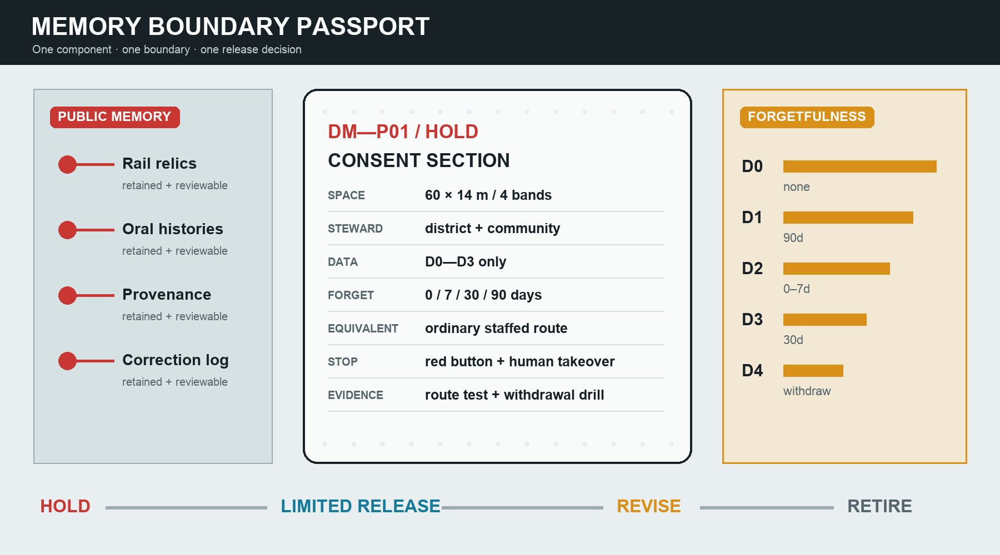

## Detailed Design of Key Areas

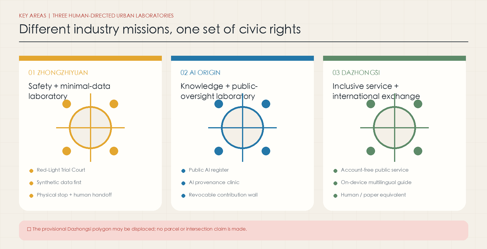

### Zhongzhiyuan: safety and minimal-data laboratory

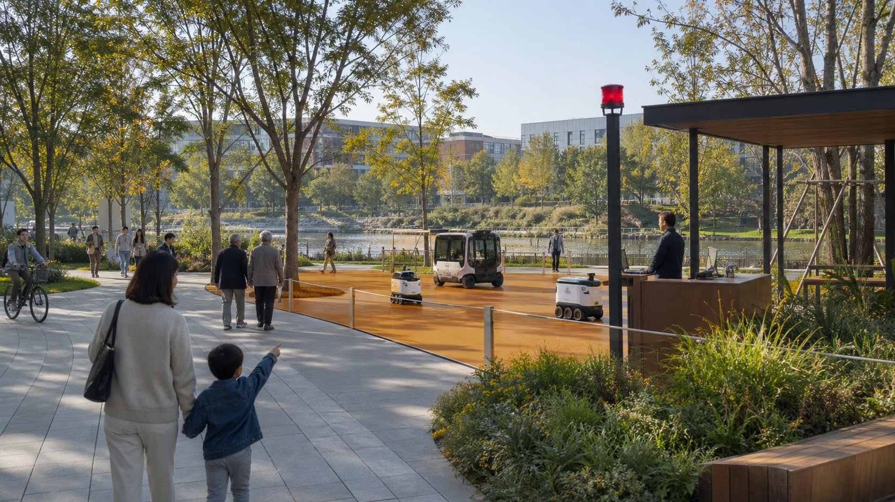

The proposal links the Qinghe public edge, full-stack independent technology, and safety governance. Green public space hosts controlled robot and model tests. Every test displays operator, purpose, data type, retention, risk level, and a stop interface. Synthetic data, edge computation, and anonymous statistics are preferred. Before ecology, flood, and road conditions are available, only reversible equipment and operating prototypes are proposed. [data:geometry/key_areas.geojson#PROV-KEY-001] [depth:three_key_area_detailed_design]

### Beijing AI Origin Community: knowledge exchange and public oversight

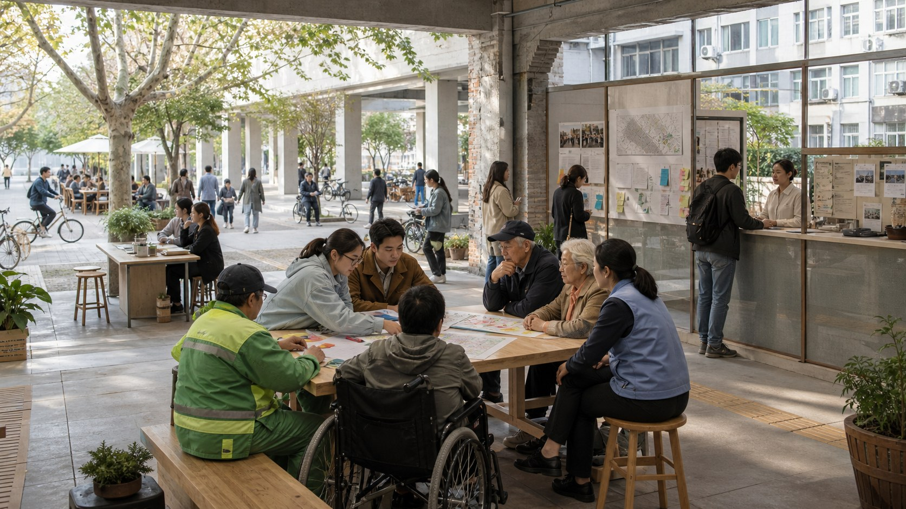

Campus, park, and neighbourhood ground floors host a public AI register, provenance clinic, revocable contribution wall, community problem desk, and technology-transfer service. Resident stories and open-source contributions can be credited, amended, or withdrawn. Trial reporting includes success, failure, and stop records. [data:geometry/key_areas.geojson#PROV-KEY-002] [source:AI-ORIGIN-COMMUNITY]

### Dazhongsi: inclusive service and international exchange

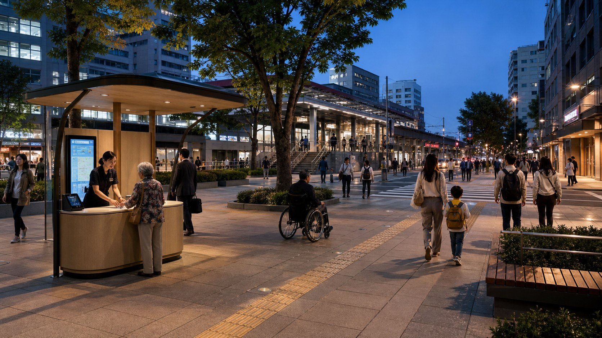

The area combines station walking links, account-free public services, multilingual exchange, smart terminals, and content industries. Navigation, translation, civic services, and accessibility assistance retain human, paper, or telephone equivalents. The provisional Dazhongsi polygon has a known spatial-offset risk, so this version makes no parcel, intersection, or building-level claim from it. [data:geometry/key_areas.geojson#PROV-KEY-003] [source:DAZHONGSI-RENEWAL]

All three areas follow retain, light retrofit, reversible trial, review, then expansion. Building scale, demolition, and engineering alignments await official boundaries, ownership data, and fieldwork.

### Three Dual-Memory proof blocks: from vision to delivery unit

v9.0 does not enlarge the three areas into unverified megaprojects. It first delivers one minimum block in each place. Zhongzhiyuan’s Stop Garden uses the 60 m × 14 m Consent Section as its envelope, retaining a 4 m no-AI route beside a bounded low-speed test court. AI Origin’s Provenance Clinic uses a reversible ground floor and forecourt for paper registration, staffed appeal and revocable provenance records. Dazhongsi’s Account-Free Commons combines step-free arrival, staffed multilingual service and optional on-device assistance at the station-neighbourhood interface.

The three blocks carry a concept band of CNY 3.5–6.5 million; shared baseline work, permits, operation, independent review and reinstatement readiness carry CNY 4.0–7.0 million, reconciling with the implementation contract’s CNY 7.5–13.5 million total. Release proceeds through G0 lock facts, G1 ordinary base first, G2 reversible prototype, G3 no more than 20 staffed windows, and G4 retain/revise/retire. Targets are 100% ordinary-route completion, 100% human handoff, at least 80% boundary comprehension and zero unresolved major issues. These are concept costs and pilot targets—not quotations, approved budgets or measured results. Any missing responsibility, permit or baseline keeps the block at `HOLD`. See `visual/assets/three-proof-blocks.json`. [depth:renewal_project_list]

### Three field routes and evidence admission

Fieldwork is now an executable protocol. FS-01 follows the Qinghe contract segment with at least 12 points across weekday morning peak, midday and evening peak. FS-02 links Wudaokou and Qinghua East Road West Exit with at least 15 points across a weekday afternoon and weekend daytime. FS-03 covers four Dazhongsi station quadrants and the public edges of the two known parcels with at least 16 points across weekday morning peak, evening peak and weekend daytime. An observation enters the formal ledger only with timestamp, position and accuracy, viewing direction, a public-space location, structured finding, privacy-cleared photo hash and reviewer.

This edition contains zero observations meeting those conditions; all three routes remain `planned`. It therefore makes no verified claim about route performance, user feedback, actual completion or co-design outcomes. Eight of eight desktop evidence checks pass, proving source, calculation and wording consistency only—not field performance. [metric:completed_field_observation_count] [depth:key_area_urban_design]

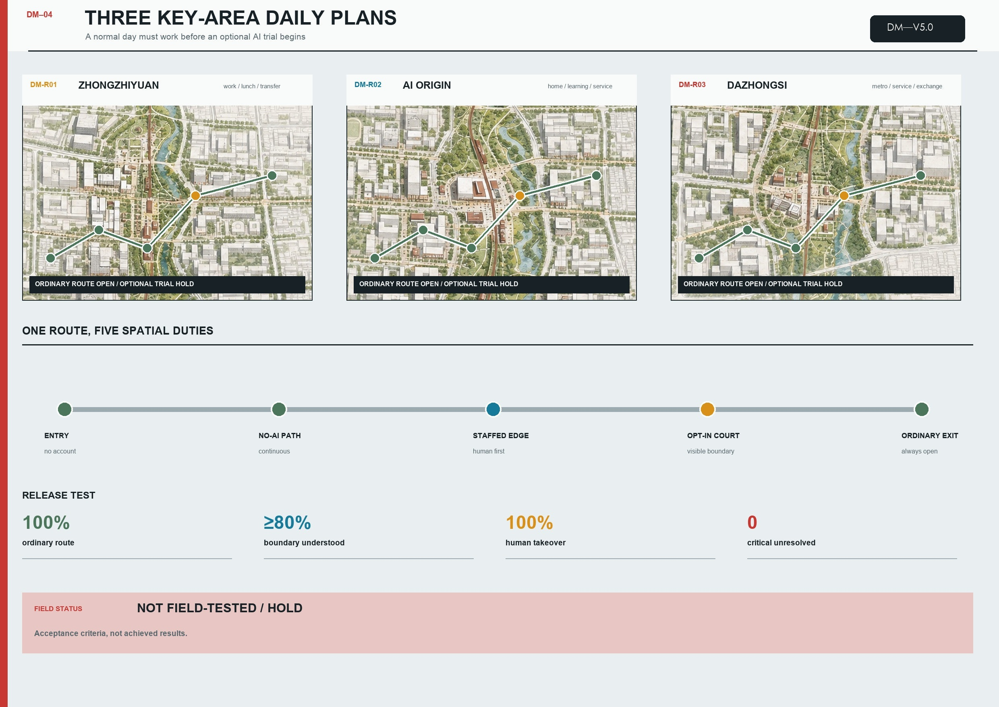

v4.0 places each daily-purpose chain on a project-bound key-area plan: work—lunch break—bus transfer at Zhongzhiyuan; home—learning—community service at AI Origin; and metro transfer—inclusive service—international exchange at Dazhongsi. Each route begins at an ordinary entry, treats an account-free no-AI path as the baseline, enters assistance or testing only after an active choice, and retains staffed service and an ordinary exit. Urban grain is illustrative; routes remain `design_target` and have not yet been field-walked or user-tested. [depth:key_area_urban_design]

## AI Innovation Ecosystem, Personas, and AI+ Scenarios

Six personas test equity: long-term residents and carers; students and faculty; start-ups and researchers; front-line service workers; commuters and temporary visitors; and international, disabled, or temporarily mobility-limited users. The ageing profile of the nearby Beihang community demonstrates why a future city must retain offline service and the right not to use AI. [source:BEIHANG-ELDERLY-COMMUNITY]

Twelve scenarios form service-data-human-fallback loops:

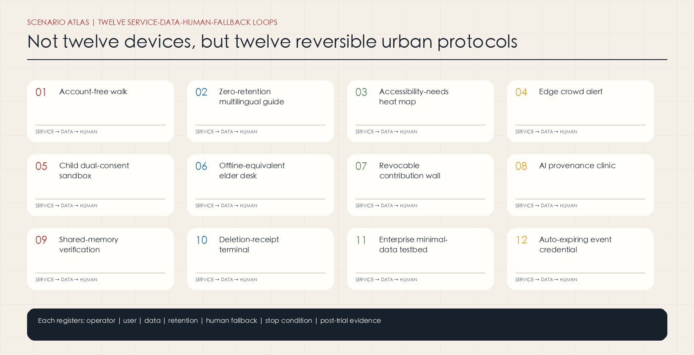

| No. | Scenario | Carrier | Minimum governance condition |
| --- | --- | --- | --- |
| 01 | Account-free walk | Memory spine | Basic service without registration |
| 02 | Zero-retention multilingual guide | Dazhongsi and heritage nodes | On-device processing and deletion |
| 03 | Accessibility-needs heat map | Blue zones | Count facility problems only |
| 04 | Edge crowd alert | Transit links | No raw-video upload |
| 05 | Child dual-consent sandbox | Amber zone | Child and guardian consent |
| 06 | Offline-equivalent elder desk | Community nodes | Human, paper, and telephone options |
| 07 | Revocable contribution wall | AI Origin Community | Amend, withdraw, preserve disagreement |
| 08 | AI provenance clinic | AI Origin Community | Show sources, limits, operator |
| 09 | Shared-memory verification table | Heritage nodes | Multi-party review and dissent |
| 10 | Deletion-receipt terminal | Three laboratories | Verifiable deletion receipt |
| 11 | Enterprise minimal-data testbed | Zhongzhiyuan | Prefer synthetic and anonymous data |
| 12 | Auto-expiring event credential | Belt-wide event nodes | Access expires after the event |

Every scenario registers operator, user, data, retention, human fallback, stop condition, and post-trial evidence. Scenarios 03, 04, 05, 10, and 11 are auditable industrial test-and-validation cases. [source:PIPL] [source:CAC-AGENT-GOVERNANCE]

v4.0 connects route tests directly to the three daily plans. An older resident without a smartphone, wheelchair user, blind-cane or guide-dog user, parent with a child, night-shift service worker, and visitor with limited Chinese must each complete passage, comprehension, human takeover, and complaint tasks. Ordinary-route completion and human-takeover success must be 100%; critical-information comprehension at least 80%; no group may retain an unresolved critical issue. Failure means `HOLD`. These are release thresholds, not current performance; status is `not_field_tested`. See `visual/assets/key-area-daily-routes.json` and `public-interest-route-tests.json`.

Three pilgrimage landmarks are useful governance interfaces rather than monuments: the Shared Memory Platform at Qinghuayuan, the Public AI Register Tower at the AI Origin Community, and the Red-Light Trial Court at Zhongzhiyuan. Their value lies in public rules, not spectacle. [standard:PROJECT-AGENT-OPEN-CALL-TASKBOOK]

## Land Use, Building Scale, and Retain-Renovate-Demolish Strategy

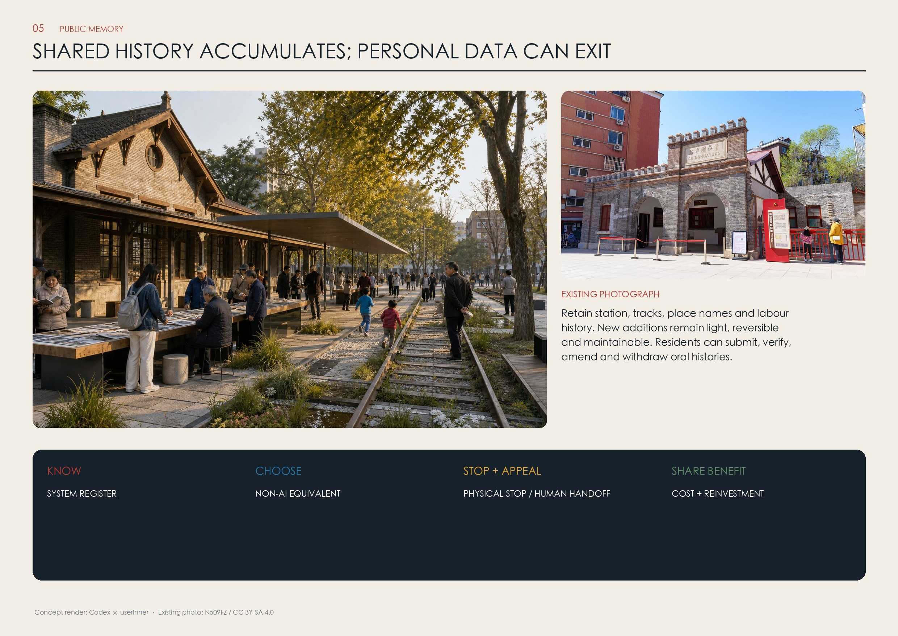

The provisional land structure mixes R&D, industry and commerce, community services, and open space to avoid a single-use office district. The conceptual green-space layer measures 1,408,600.768 square metres, or 12.3423% of the submitted provisional boundary; the public-space layer measures 836,345.643 square metres, or 7.3281%. These are recalculated design-layer values, not existing-condition statistics or statutory controls. [metric:green_ratio] [metric:public_space_ratio]

Renewal prioritises closed park edges, four-quadrant station crossings, neighbourhood-park boundaries, and interfaces between heritage and new development. No false precision is assigned to demolition, construction, floors, or height without official evidence. [standard:MNR-LAND-USE-CLASSIFICATION-GUIDE] [depth:retain_renovate_demolish] [depth:height_massing_character]

## Transport, Rail, Municipal Infrastructure, and Public Services

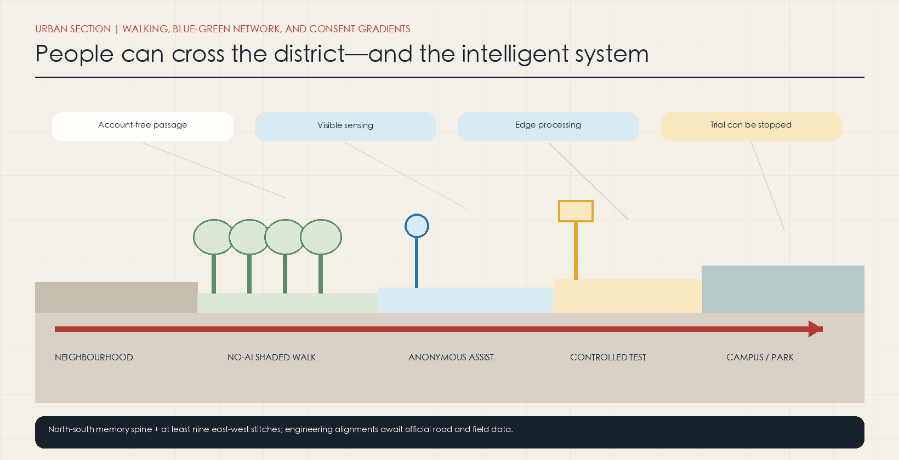

The Jing-Zhang Heritage Park is the north-south walking spine. At least nine east-west stitch routes connect campuses, neighbourhoods, parks, and rail. Wudaokou, Qinghuadongluxikou, Dazhongsi, and the Fifth Ring crossing prioritise accessibility, cycle parking, shade, night lighting, and staffed assistance. The roads layer shows conceptual corridors only. [data:geometry/roads.geojson#ROAD-001] [source:JINGZHANG-PARK] [depth:traffic_rail_slow_parking]

New infrastructure follows four principles: edge first, measurable energy, visible shutdown, and replaceable interfaces. Edge-compute cabinets can share conventional infrastructure, but sensitive personal data does not enter a permanent city model. Stormwater, energy, fire, communications, and pipeline capacity remain implementation prerequisites. [data:geometry/constraints.geojson#CONSTRAINTS] [depth:municipal_new_infrastructure]

## Blue-Green Network, Public Space, and Urban Character

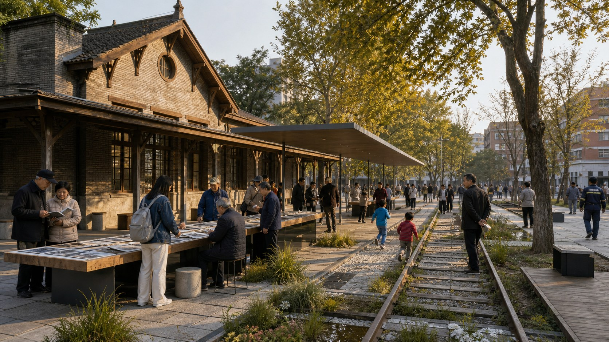

The public-memory spine links the heritage park, Qinghe and Xiaoyue rivers, campus greenery, and neighbourhood pockets. The system combines stormwater, thermal comfort, biodiversity, walking, and innovation exchange without turning the park into a device showroom. Every public sensor must be visible and state its purpose, operator, and operating condition. [data:geometry/green_space.geojson#GREEN-001] [data:geometry/public_space.geojson#PUBLIC-001] [source:AMSTERDAM-SENSING] [depth:blue_green_public_space]

The visual language combines the railway’s legible construction, Zhongguancun’s open collaboration, and visible AI governance. Rail red represents shared memory; cool blue anonymous assistance; amber controlled trials; paper white no-AI commons. New interventions remain light, reversible, and maintainable.

## Renewal Projects, Implementation Policy, and Phasing

### Minimum 0–180-day delivery contract

Delivery begins with facts and ordinary service, not AI procurement. Days 0–30 lock geometry, ownership, responsibility, and field baselines. Days 31–60 first deliver the accessible bypass, paper signs, staffed service, shade, seating, and drinking water. Days 61–90 may add reversible zones, edge cabinet, physical stop, and audit record. Days 91–120 permit no more than 20 staffed windows while logging positive, negative, near-miss, complaint, and deletion evidence. Days 121–180 end with an independent retain, revise, or retire decision.

The concept cost band for three prototypes, baseline work, operation, and contingency is CNY 7.5–13.5 million. At least 30% of first-stage spending supports ordinary public service and accessibility; AI hardware remains below 25% before G3; 10% contingency is held until independent review. This compares implementation magnitude and is not an approved investment. Missing official geometry, ownership, heritage, fire, transport, utilities, tree/soil, data-impact, insurance, or maintenance evidence stops the relevant gate. Full RACI and reinstatement rules are in `visual/assets/implementation-contract.json`. [depth:phasing_implementation]

| ID | Project | First action | Condition before expansion |
| --- | --- | --- | --- |
| DM-01 | Public-memory spine | Oral history, account-free signs, rest points | Heritage and field review |
| DM-02 | Public AI register | Register systems at three stations | Operators and audit protocol |
| DM-03 | Red-Light Trial Court | Reversible test kit and stop interface | Safety, ecology, traffic review |
| DM-04 | Provenance clinic | Weekend workshops and open ledger | Campus-park-community agreement |
| DM-05 | Inclusive service desk | Human and AI parallel channels | Official key area and station data |
| DM-06 | East-west stitches | Barrier survey and temporary marking | Road, ownership, utility approval |
| DM-07 | Public-benefit ledger | Publish cost, beneficiaries, reinvestment | Operating finance protocol |
| DM-08 | Annual Human-at-the-Controls Week | Publish failure, recall, and review | Event permit and safety plan |

From 2026 to 2028, the priority is field baselines, registers, and reversible trials. From 2028 to 2030, only components that pass safety, equity, accessibility, and resident-acceptance review expand. After 2030, open standards can be exported while annual review, recall, and retirement remain mandatory. [data:geometry/phasing.geojson#PHASE-001] [source:HAIDIAN-FIVE-YEAR-PLAN] [depth:phasing_implementation]

Operation uses four ledgers: system registration, personal authorisation, public benefit, and failure-retirement. v5.0 tests spatial and service continuity through five windows: 06:00 early commute and stewardship, 09:00 knowledge exchange and enterprise service, 12:00 community lunch and midday park, 18:00 open trials and failure review, and 22:00 night return and system reset. Every window records ordinary service, optional AI, accountable operation and a release condition in `visual/assets/24h-public-innovation-line.json`. These are operational design targets, not an approved programme or deployed service. [depth:renewal_project_list]

The annual cycle combines a community problem call, reversible prototype week, failure-and-recall review, and an international open-standard workshop. Exchange interfaces are reserved for North Latitude Community, Future Science City, Huairou Science City, Beijing E-Town and the wider Jing-Jin-Ji innovation network. Collaboration shares public methods, reusable evaluation protocols and de-identified findings; it does not pool personal trajectories or claim a confirmed government arrangement. [standard:PROJECT-AGENT-OPEN-CALL-TASKBOOK]

## Metrics, Area Recalculation, and Compliance Matrix

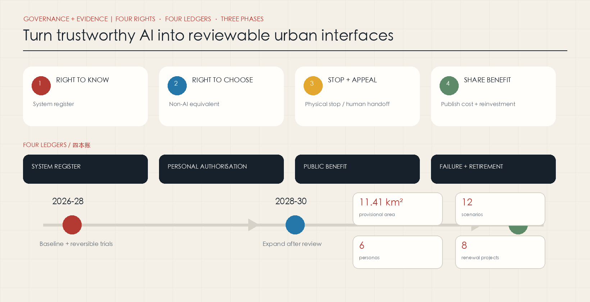

Known metrics come only from submitted geometry or countable schedules: provisional boundary area, three key areas, building footprints, green and public-space ratios, twelve scenarios, six personas, and eight renewal projects. FAR, height, road redlines, utility capacity, investment, and programme remain pending. metrics.json retains formulas and source files; compliance_matrix.json maps announcement and agent.1-agent.6 requirements to sections, layers, drawings, sources, and checks. [depth:metrics_recalculation]

The four rights have reviewable targets: all public AI systems disclose purpose, operator, data, and complaint route; every essential public service retains a non-AI equivalent; high-risk trials provide physical stop, human handoff, and a public response target; and each trial publishes cost, beneficiaries, saved resources, and reinvestment direction. Without field baselines, these remain targets and measurement protocols rather than achieved performance.

The package includes three dependency-free audits: the Memory Passport audit, Spatial Atlas audit and Double-Memory Fault-Injection audit. All currently return `PASS`. The first two check responsibility, data, ordinary equivalence, the four-level Proof Mile and missing statutory controls. The third replays 120 synthetic cases and confirms that all 96 omissions block and all 12 faults invoke safe fallback. These results prove reproducible logic and rejection behaviour only—not construction, system safety, public acceptance, or permission.

## Risk, Copyright, and Compliance

Public-source boundaries, personal privacy, copyright permission, human review, implementation risk and accountable compliance form one release chain. If provenance, reuse authority or the responsible operator cannot be verified, the related spatial claim and AI scenario remain at `HOLD`.

Six stop rules define the hard boundary:

1. No official boundary, no parcel-level conclusion.
2. No field baseline, no performance percentage.
3. No accountable operator, no deployment.
4. No human or non-AI equivalent, no AI substitution in essential public service.
5. No stop condition, no public-space trial.
6. No documented resident participation, no claim of co-creation.

Primary risks are provisional-boundary displacement; missing existing-building, ownership, road, utility, and heritage information; field participation not yet completed; and unresolved operating responsibility and finance. They remain explicit assumptions rather than being hidden by drawing precision. [depth:risk_missing_data]

The proposal follows data minimisation, purpose limitation, shortest retention, individual access-correction-deletion, human final decision, and authorisation boundaries. [source:PIPL] [source:CAC-AGENT-GOVERNANCE] All figures are generated from the proposal’s GeoJSON, metrics, and original information design. No remote map tiles, uncleared screenshots, corporate marks, or third-party generated images are used.

## References

- Official call announcement, repository site package, and agent taskbook
- Official university history of the Jing-Zhang Railway and Qinghuayuan Station
- Beijing and Haidian materials on the heritage park, urban renewal, AI, and ageing services
- Official personal-information and AI-agent governance rules
- Helsinki AI Register, Amsterdam Responsible Sensing, Punggol Digital District, Kendall Square, and Paris Rive Gauche
- Complete machine index and usage limits: sources.json, assumptions.json, standard_matrix.json, and design_depth_matrix.json
