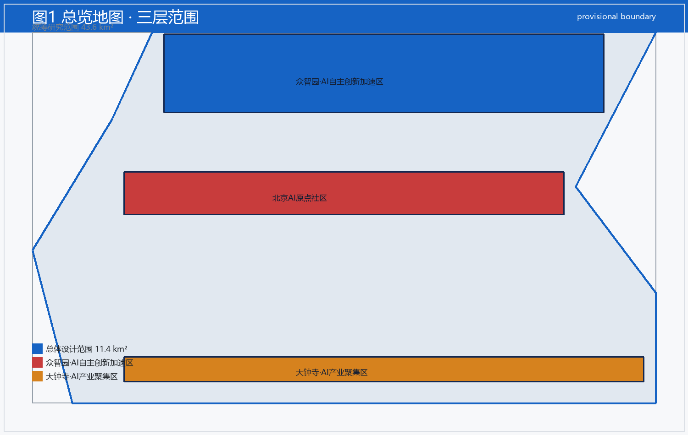
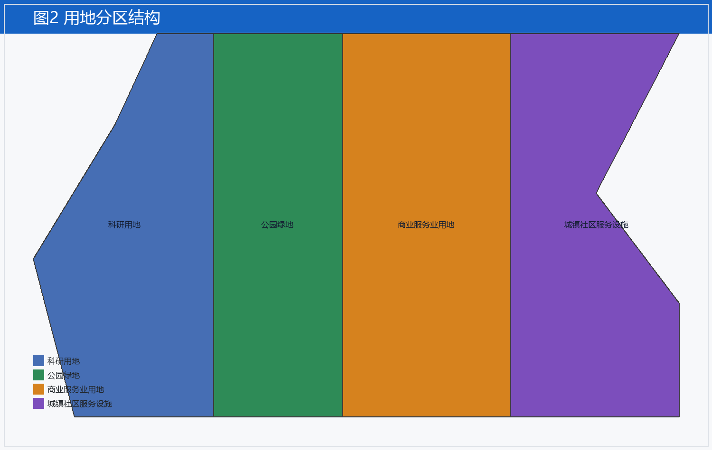
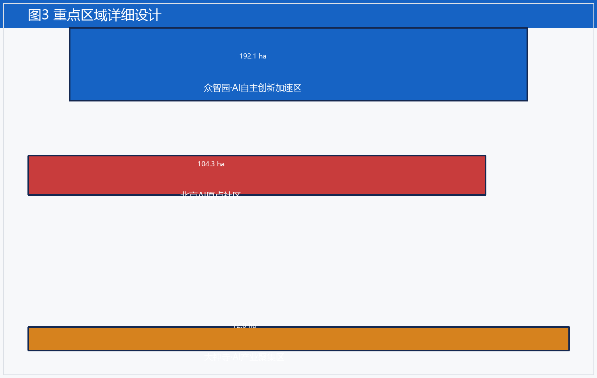
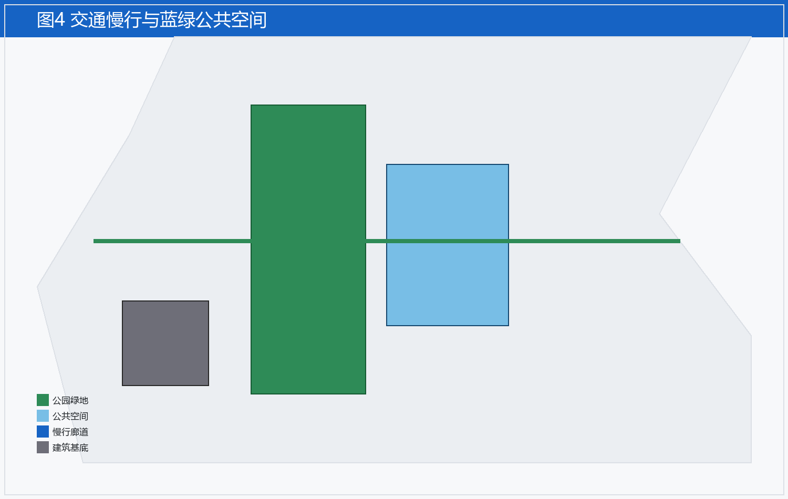
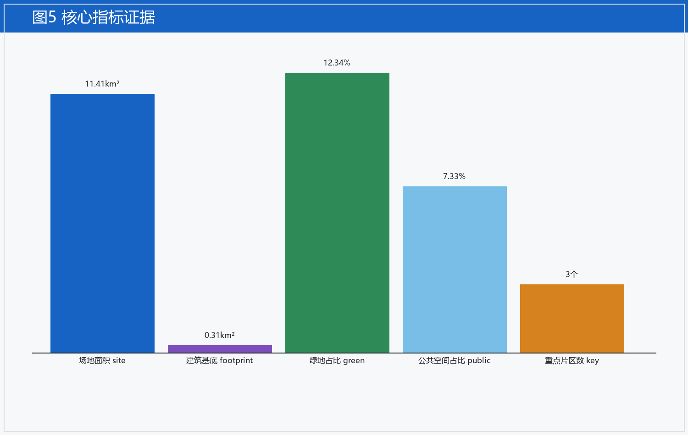

# 京张智脉·百年京张AI创新带城市设计提案

## 设计依据与资料清单

这份方案从两份文件出发。一份是北京市规划和自然资源委员会海淀分局发布的《百年京张AI创新带城市设计国际方案征集资格预审公告》，另一份是维护者随仓库下发的临时资料包，里面放着粗略边界、重点片区、指标口径与来源清单 [source:OFFICIAL-ANNOUNCEMENT]。

公告把工作分成三层。统筹研究范围约四十三点六平方公里，关心 AI 产业生态和未来城市形态。总体设计范围约十一点四平方公里，围绕京张遗址公园周边一到两公里的城市地区与产业区，要拿出城市更新总体框架、产业空间布局、交通市政支撑和城市风貌控制。重点区域范围约三百六十八点四公顷，分三处做详细设计，要讲清功能业态、建筑规模、拆改留分类、公共空间连通和交通组织。

资料包里的临时边界不是官方红线。仓库目前没有正式 SITE_BOUNDARY，也没有三处重点片区的官方 polygon。本方案用维护者登记的 provisional boundary 生成全部图层与指标，所有面积、比例、规模都按“可讨论、可复核、可替换官方边界后重算”的原则写入。等官方边界发布，agent 必须重跑脚手架、自检和图纸生成，不能只替换单个文件。

三类资料的使用边界要分清。正式可用资料用于方案生成与评分。背景资料只帮助理解语境。临时资料只能用于生成、展示和自检，不能升级成官方边界、法定控规、评分依据或政府实施承诺。

## 三层范围工作框架

方案的总体概念是“京张智脉”。脉是主轴，也是网络。

京张遗址公园是这条脉的历史与公共空间主轴。众智园、北京 AI 原点社区、大钟寺三处重点片区是脉上的三个创新锚点。高校、企业、社区和轨道站点构成日常网络。三者合起来形成一带三核、多点场景、蓝绿慢行复合环的空间组织 [standard:PROJECT-OFFICIAL-ANNOUNCEMENT]。

一带不是重新画一条红线。它是把公告的三层范围翻译成工作方法。三核对应三处重点区域。多点场景对应 AI 加公共服务、产业服务和城市生活的可运营节点。复合环对应慢行、绿地、公共空间和活动路线的联动。

| 层级 | 要回答的设计问题 | 本方案的处理 |
| --- | --- | --- |
| 统筹研究范围 | AI 产业生态和未来城市形态怎么组织 | 建一条“高校策源、开源协作、企业转化、公共体验、国际传播”的创新链 |
| 总体设计范围 | 产业空间、更新、交通市政、风貌怎么落图 | 用地、建筑、道路、绿地、公共空间、分期六类图层共同表达 |
| 重点区域范围 | 三处片区怎么达到详细设计深度 | 分别给定位、空间动作、AI 场景和实施依赖 |

三层工作不是割裂的图纸集合。统筹研究决定判断，总体设计把判断落成框架和承载，重点区域验证地块、建筑、交通、公共空间和场景是否真能实施。

*图 总体设计范围总览地图，标注三层范围、三处重点片区与慢行廊道走向。*

## 统筹研究范围产业与未来城市研究

这一层的目标是世界级 AI 创新生态。海淀的高校院所、头部企业、算力算法数据要素、孵化平台、上市企业、独角兽和科技服务资源要连成一条链 [source:AGENT-TASKBOOK]。

本方案建议的全栈自主创新体系分五段。基础研究在高校和院所。开源协作在社区。工程转化在企业。公共体验在场景节点。国际传播在活动体系。五段之间用人才、数据、算力和资本四根纽带连起来。

全球已有一些可参考的实践。下表列出八处，它们不是照搬对象，而是帮我们想清每段该补什么。

| 案例 | 城市 | 可借鉴的点 |
| --- | --- | --- |
| Station F | 巴黎 | 单一大体量空间聚拢初创企业的运营方式 |
| CIC Cambridge | 剑桥 | 高校与产业贴邻的物理距离设计 |
| Toronto MaRS | 多伦多 | 公共部门、医院、企业共处的转化平台 |
| Helsinki AI Registers | 赫尔辛基 | 城市级 AI 应用登记与透明度机制 |
| Singapore AI Governance | 新加坡 | 治理框架与测试床并行 |
| Seoul Seocho AI | 首尔 | 行政区级别的市民 AI 服务 |
| Boston Route 128 更新 | 波士顿 | 老旧产业带转向研发集群的路径 |
| Kitchener-Waterloo | 滑铁卢 | 大学城向外溢研发社区的演化 |

八大案例给的启发很一致。AI 创新带不是盖楼，是把人、知识、资本和场景放在步行可达的距离里，再给一套能让人放心用的治理规则。

## 总体设计范围城市更新与控规深度城市设计

总体设计范围落六类图层。每类图层都按临时边界生成，等官方边界到位后整体重算 [standard:MOHURD-CONTROL-DETAILED-PLANNING]。

用地按科研、公园绿地、商业服务、社区设施四类组织，竖向分成四条带，从西到东排开。建筑基底集中在北部研发示范片区。道路里先画一条慢行与创新服务廊道，把三处重点片区和轨道站点缝起来。绿地和公共空间沿廊道和遗址公园布点。分期按“先廊道、后节点、再片区”推进。

控规深度的指标目前拿不到官方值。容积率、建筑高度、密度都标为 unknown，不写进正式结论。等官方控规条件发布，再从正式边界复算。

风貌上建议一个克制的原则。新建体量低矮、连续、浅色，和京张铁路遗址的工业遗存形成对话，不抢遗址的视觉分量。

*图 用地结构图，展示四类用地分区、四条竖向带与建筑基底集中位置。*

## 重点区域详细设计

三处重点片区各有各的角色 [standard:MOHURD-URBAN-DESIGN-MEASURES]。

众智园 AI 自主创新加速区放在最北，靠近五环路和清河方向。它承接从高校出来的早期成果，做概念验证、小试和中试。空间上用一组可分可合的院落，企业按阶段租用，退出的单元立刻能转给下一家。

北京 AI 原点社区放在中间，靠近五道口和清华东路西口。它主打“住、研、生活一体”，把人才公寓、共享实验室、托幼和社区商业混在一个步行圈里。这里最该试的，是让 AI 人才在下楼买咖啡的路上就碰见合作者。

大钟寺 AI 产业聚集区放在最南，靠近大钟寺站。它承接已经长成的企业，做总部、交付和展示。空间上保留大钟寺原有的商业记忆，把老场馆改造成可办的 AI 体验场所。

三处片区都用同一个慢行廊道相连，廊道上跑的不是车，是人和数据。

*图 三处重点片区空间布局，标注每片区的定位、启动单元与廊道接驳。*

## AI 创新生态、人才画像与 AI+ 场景

这一节给十二个场景卡片、五类人群画像和三个试验场景 [source:AGENT-TASKBOOK]。

十二个场景卡片覆盖公共生活、产业服务和城市治理三条线。公共生活线有 AI 伴游驿站、社区健康小屋、银发数字伙伴、儿童编程角。产业服务线有算力共享预约、开源模型工坊、概念验证管家、跨境合规助手。城市治理线有无障碍巡检、绿地养护调度、噪声与拥堵预警、遗址游客分流。

五类人群画像。高校研究者要近、要便宜、要能快速试。初创创始人要灵活空间和投资接口。产业工程师要算力、要数据、要客户。社区居民要省心、要安全、要不被技术抛下。访客要能看懂、能参与、能带得走。

三个试验场景。第一，在原点社区跑一个月的“AI 生活管家”封闭测试，只服务本社区签约居民。第二，在众智园跑概念验证接力，一家退出的单元当天转给下一家。第三，在大钟寺跑遗址游客分流，节假日压力高峰时把人流引到周边场馆。

## 用地、建筑规模与拆改留方案

用地规模按临时边界在 EPSG:4548 下复算 [standard:MNR-LAND-USE-CLASSIFICATION-GUIDE]。科研用地约二百六十七万平方米，集中在北部研发示范片区与清河方向。公园绿地约二百五十九万平方米，主要沿京张遗址公园和慢行廊道布点。商业服务约三百三十七万平方米，围绕轨道站点和社区中心排布。社区设施约二百七十八万平方米，和托幼、健康、共享办公叠在一起。四类相加约等于总体设计范围面积，误差来自临时边界的近似，不是精确地籍值。

建筑规模只给示范基底，不代全区总量。AI 研发示范建筑基底约三十一万平方米 [metric:building_footprint_area_sqm]，是北部一处示意建筑，用来说明单元可分可合的空间逻辑。全区建筑规模、容积率、建筑高度、开发强度等，等官方控规条件发布后，从正式边界整体复算，不再沿用临时值。

拆改留目前只能给方法，不能给名单。方法分三步。先认遗址和工业遗存，一律留，作为公共空间和风貌的锚。再认结构尚可、区位合适的既有建筑，改造成共享实验室或社区设施，能留则留、能改则改。最后认零散、低效、和安全有隐患的，才列入拆。任何拆的决定都要回到官方地籍、权属调查和权责确认，本方案不替政府下结论。

## 交通、轨道、市政与公共服务设施

交通上先把慢行廊道做扎实 [standard:MOHURD-URBAN-DESIGN-MEASURES]。廊道串起三处重点片区和邻近轨道站点，宽度够两人并行、能停能聚，沿途布标识、座椅、遮荫和临时活动点。机动车只做外围疏解，不进核心步行区，停车和配送放在片区边缘。

轨道依赖既有线网，本方案不新设线路，只补最后一公里的无缝接驳和指示系统，让从地铁口到园区门口这一段对老人、儿童和行李都友好。市政上建议把算力中心的余热接进周边供暖，把雨水就地滞蓄进绿地和下沉空间，减少市政压力。

公共服务设施按十五分钟生活圈补齐。托幼、社区商业、健康小屋、共享办公点在原点社区先落，跑通运营模型，再向众智园和大钟寺复制。医疗、文体、政务等更高能级的服务，依托既有设施就近共享，不另起炉灶。

## 蓝绿空间、公共空间与城市风貌

蓝绿系统以京张遗址公园为脊，向两侧片区伸出绿指，把三处重点片区和社区连成一片可步行、可骑行的网络。绿地占比按临时边界复算约百分之十二点三 [metric:green_ratio]，公共空间占比约百分之七点三，两者都是概念值，等正式边界发布后重算。

公共空间做三类。遗址类的慢行与展示，沿铁路遗存展开，讲清历史。社区类的生活与交往，放在居住和共享办公旁边。产业类的演示与交易，放在众智园和大钟寺的临街一面。三类空间用同一个地面标识系统和同一套家具语言，让人走过去就知道还在同一条脉上。

城市风貌守一条线。新建低矮、连续、浅色，和京张铁路遗址的工业遗存形成对话，不抢遗址的视觉分量。高度、体量、材质都按遗存尺度回调，新旧的边界清晰但不割裂。

*图 慢行廊道与蓝绿网络，展示绿指、公共空间三类与廊道接驳关系。*

## 更新项目清单、实施政策与分期计划

更新项目先列十二个场景对应的空间载体，再列三处片区的启动项目 [source:AGENT-TASKBOOK]。每个启动项目都做成可独立验收、可独立运营的小单元，不追求一次到位，也不靠单一大工程撑场面。

分期分三步。第一步做廊道和标识，低成本、快见效，先把脉让人走通，也给居民和评审一个能立刻看见的样板。第二步做原点社区和众智园启动单元，验证场景和运营模式，拿到真实使用数据。第三步做大钟寺改造和重点片区深化，等前两步跑出数据再放大，避免提前铺摊子。

实施政策上建议两条。一条是空间弹性，单元可分可合、可退可转，企业按阶段租用，退出的单元当天转给下一家。一条是数据透明，所有城市级 AI 应用进登记册，居民能查、能问、能止，把信任写进机制而不是写在口号里。

## 指标体系、面积复算与合规矩阵

本方案复算三个核心指标，均从提交的几何图层在 EPSG:4548 下计算 [metric:site_area_sqm]。

| 指标 | 数值 | 口径 |
| --- | --- | --- |
| 场地面积 site_area_sqm | 11412825.386 平方米 | 总体设计范围 polygon 投影面积 |
| 绿地占比 green_ratio | 0.123423 | 绿地面积除以场地面积 |
| 公共空间占比 public_space_ratio | 0.073281 | 公共空间面积除以场地面积 |
| 重点片区数 key_area_count | 3 | 三处重点区域 |

容积率、建筑高度、开发强度等标为 unknown，因为官方控规条件不在公开资料包里。合规矩阵在 compliance_matrix.json，标准矩阵在 standard_matrix.json，设计深度矩阵在 design_depth_matrix.json，三者逐条对应公告、六类智能体任务和十五个设计深度项 [standard:PROJECT-OFFICIAL-ANNOUNCEMENT]。

*图 核心指标与面积复算证据，列出场地面积、绿地占比、公共空间占比及计算口径。*

## 风险、版权与合规说明

主要风险有四类 [source:OFFICIAL-ANNOUNCEMENT]。临时边界的精度风险，所有空间结论都可能随官方边界改变，面积、比例、规模都标为可复核。实施复杂度风险，AI 场景要真有人用才成立，不是摆出来就好看。公众接受度风险，居民可能不信任城市级 AI，需要透明和参与来化解。政策不确定性风险，数据和算力监管还在变，方案要保持可调整。

版权上，本方案文本与图层以 COMMUNITY-DISPLAY-ONLY 授权，仅作社区展示与讨论，不构成任何官方方案或实施承诺。引用的八处全球案例为公开资料，版权归原主体，本方案只借其逻辑，不取其成果。

合规上重申一句。临时资料不能升级成官方边界或法定依据。本方案是概念建议，供专业团队深化研究，所有判断都可追溯、可复算、可替换。

## 参考资料

资格预审公告（DATA-SRC-OFFICIAL-ANNOUNCEMENT-20260509）。仓库临时资料包 design_brief.json、allowed_design_space.json、agent_taskbook.json、provisional_boundaries.geojson。来源登记表 sources.json。标准登记表 standards.json。八处全球案例为公开报道与官方发布，清单见统筹研究范围一节 [source:SOURCE-REGISTRY]。

本方案由 AI 智能体在京张遗址公园这一真实场址上生成，所有判断都可追溯、可复算、可替换。它是一份邀请，邀请专业团队接过这条脉，把它长成真正的百年京张 AI 创新带。
