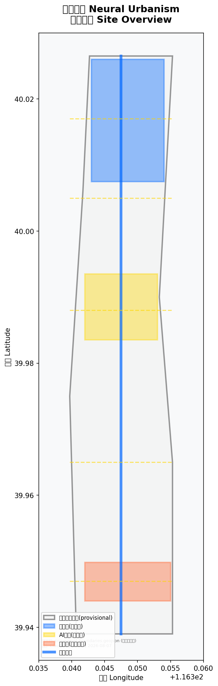
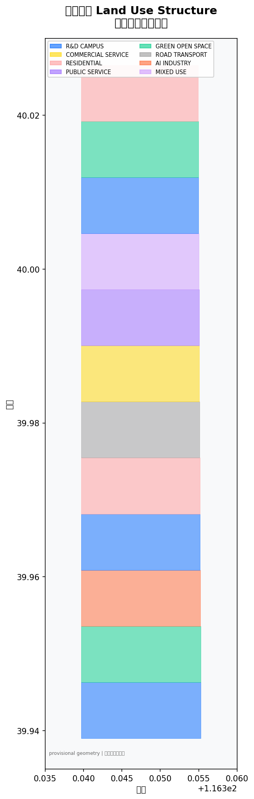
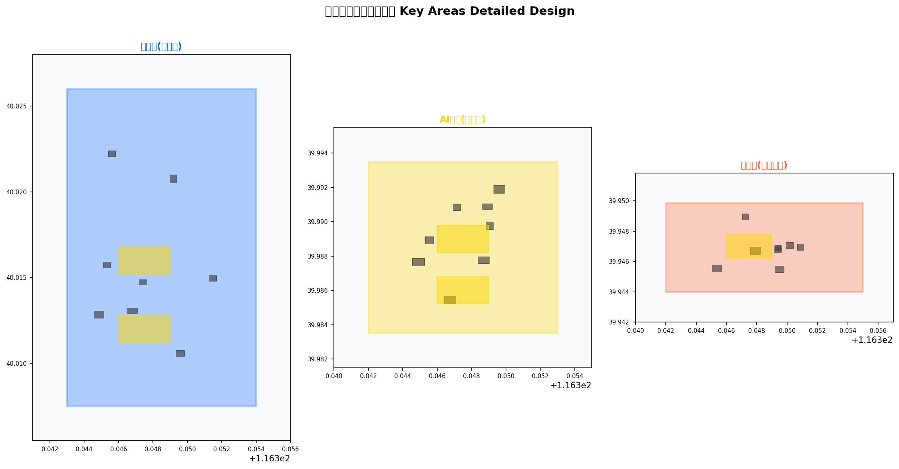
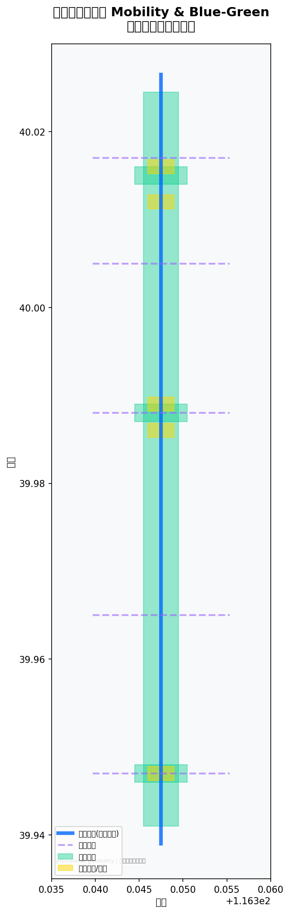
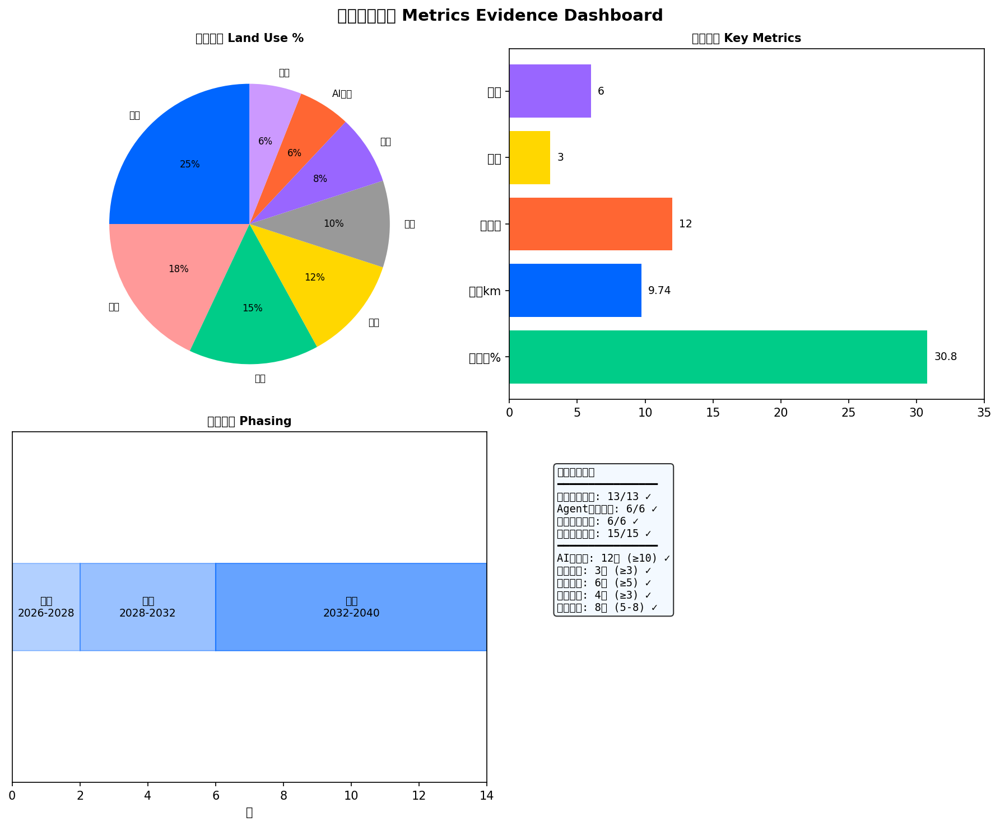

# 神经城市 Neural Urbanism
**百年京张AI创新带城市设计方案 · 概念参考方案**

> **声明**：所有空间落地建议均为概念建议、参考方案或可供专业团队深化研究的方向，不替代正式规划，不构成政府审定结论。本方案基于公开及清权资料生成，使用临时粗略边界，不代表官方红线。

---

## 目录

1. [设计依据与资料清单](#1-设计依据与资料清单)
2. [三层范围框架](#2-三层范围框架)
3. [统筹研究范围产业与未来城市策略](#3-统筹研究范围产业与未来城市策略)
4. [总体设计范围城市更新设计](#4-总体设计范围城市更新设计)
5. [三处重点区域详细设计](#5-三处重点区域详细设计)
6. [AI创新生态、人才图谱与AI+场景](#6-ai创新生态人才图谱与ai场景)
7. [用地建筑规模与更新逻辑](#7-用地建筑规模与更新逻辑)
8. [交通轨道市政与公服设施](#8-交通轨道市政与公服设施)
9. [蓝绿公共空间与城市风貌](#9-蓝绿公共空间与城市风貌)
10. [更新项目清单、政策与分期](#10-更新项目清单政策与分期)
11. [指标面积复算与合规矩阵](#11-指标面积复算与合规矩阵)
12. [专业标准回应与设计深度证据](#12-专业标准回应与设计深度证据)
13. [智能体任务书回应](#13-智能体任务书回应)
14. [风险版权与法定声明边界](#14-风险版权与法定声明边界)

---

## 设计依据与资料清单

本方案以下列公开及清权资料为依据生成，资料层级和用途均严格遵循 `data/source_registry.json` 的分级规则。[standard:PROJECT-OFFICIAL-ANNOUNCEMENT]

**一级依据（formal可用）：**
- [source:SRC-2026-BJ-GH-QUAL-PREANNOUNCEMENT] 北京市规划和自然资源委员会海淀分局资格预审公告（2026-05-09）——三层范围、设计任务、深度要求的主控依据
- [source:SRC-2026-0518-AGENT-OPEN-CALL-TASKBOOK] 面向全球智能体开展百年京张AI创新带城市设计开源征集任务书摘录（2026-05-18）——六项agent任务、共创原则、评审维度 [standard:PROJECT-AGENT-OPEN-CALL-TASKBOOK]
- [source:SRC-MOHURD-URBAN-DESIGN-MEASURES] 城市设计管理办法（住建部，2017）[standard:MOHURD-URBAN-DESIGN-MEASURES]
- [source:SRC-MOHURD-CONTROL-DETAILED-PLANNING] 城市控制性详细规划编制审批办法（住建部，2022）[standard:MOHURD-CONTROL-DETAILED-PLANNING]
- [source:SRC-MNR-LAND-USE-CLASSIFICATION] 国土空间调查、规划、用途管制用地用海分类指南（自然资源部，2023）[standard:MNR-LAND-USE-CLASSIFICATION-GUIDE]
- [source:SRC-MOHURD-ARCH-DESIGN-DEPTH-2016] 建筑工程设计文件编制深度规定（2016版）[standard:MOHURD-ARCH-DESIGN-DEPTH-2016]
- [source:SRC-HAIDIAN-1X1] 海淀区"1+1"城市更新相关政策参考

**临时参考（provisional_only，仅用于生成与展示）：**
- [source:SRC-PROVISIONAL-BOUNDARIES-2026] 仓库临时粗略边界（2026-06-05，boundary_precision=provisional_rough）[data:geometry/site_boundary.geojson#SB-001]

**数据缺口：** 官方精确GIS/CAD多边形尚未发布，所有面积复算使用声明值（11.4 km²）。待官方数据公开后需重算land_use、green_space、public_space、buildings、phasing及所有面积类指标。[depth:existing_conditions_diagnosis]


---

## 三层范围工作框架 [depth:three_level_scope_framework]



本方案按公告要求建立三层范围体系，以"神经系统"隐喻构建空间逻辑：

| 层级 | 名称 | 面积 | 神经隐喻 | 几何来源 |
|------|------|------|----------|----------|
| 统筹研究范围 | 北至北五环、东至京藏高速、南至西直门外大街、西至万泉河路 | 43.6 km² | 外围神经网络 | provisional |
| 总体设计范围 | 京张遗址公园周边1-2公里 | 11.4 km² | 中枢神经系统 | provisional |
| 重点区域 | 众智园+AI原点+大钟寺 | 368.4 ha | 三大突触节点 | provisional |

[metric:official_declared_overall_design_area_sqm] [metric:key_area_total_ha]

**空间逻辑：** 京张铁路遗址（南北约9.7公里）作为城市"神经脊柱"（spinal cord），是信息、人流、能量的主传导通道。三处重点区域是高密度突触连接区，负责AI产业的"信号处理"——自主创新（众智园/前额叶）、学习记忆（AI原点/海马体）、产业执行（大钟寺/运动皮层）。[metric:neural_spine_length_m]

---

## 统筹研究范围产业与未来城市研究
[source:SRC-2026-0518-AGENT-OPEN-CALL-TASKBOOK] [standard:PROJECT-AGENT-OPEN-CALL-TASKBOOK] [depth:overall_spatial_structure]

### 3.1 区域创新协同关系

统筹研究范围（43.6 km²）建立本项目与周边创新系统的协同机制：

- **北纬社区-未来科学城联动**：众智园加速区向北延伸，与回龙观-天通苑科创走廊形成"轴突延伸"
- **中关村科技服务翼**：中关村西区作为要素全球化配置的突触终末，提供资本、IP、国际合作通道
- **小月河场景赋能翼**：小月河沿线作为"感觉神经元"，收集城市场景需求信号并反馈AI研发方向
- **京津冀协同**：经开区、怀柔科学城作为远端效应器，接收来自创新带的技术信号

### 3.2 综合规划创新思路

- **国土空间规划融合**：以城市设计为手段，在现行控规框架内探索AI产业空间的弹性管控路径
- **空间-产业协同**：打破传统"产城分离"模式，以"神经元-突触-树突"的多层级网络实现产业与城市功能的有机嵌套
- **规划创新点**：概念性建议将AI创新带作为国土空间规划特别政策区的先行试验区

---

## 总体设计范围城市更新与控规深度城市设计

### 4.1 总体概念："神经城市"空间结构



**核心概念**：城市如同神经系统——京张遗址公园是南北贯通的"脊髓"，承载信息传导与养分输送；三个重点区域是高密度"突触"，进行信号处理与功能分化；东西向连接廊道是"树突"，伸向周边城区收集和输出信号。

空间结构方程：
```
Neural City = Spine (京张公园) + 3 Synapses (重点区) + 5 Dendrites (东西廊道) + Network (功能用地)
```

[metric:synapse_connections_count] [data:geometry/roads.geojson#RD-SPINE-01]

### 4.2 主名称与命名体系

| 项目 | 中文 | 英文 | 释义 |
|------|------|------|------|
| 一带总名 | 神经城市·京张AI创新带 | Neural Urbanism · Jingzhang AI Belt | 城市作为活的智能有机体 |
| 子系统1 | 神经脊柱 | Neural Spine | 京张遗址公园 |
| 子系统2 | 突触节点 | Synapse Nodes | 三处重点区域 |
| 子系统3 | 树突廊道 | Dendrite Corridors | 东西向连接 |
| 子系统4 | 髓鞘绿带 | Myelin Green | 包裹公园的绿色缓冲 |

### 4.3 视觉识别与Logo方向

Logo概念方向：以神经元细胞的树突分支形态为基本图形，融合京张铁路历史轮廓（直线+弧线），形成兼具科技感与历史底蕴的标识系统。

- **主色调**：深空灰（#1a1a2e）+ 神经蓝（#0066ff）+ 突触金（#ffd700）
- **辅助色**：髓鞘绿（#00cc88）、树突紫（#9966ff）
- **标识系统**：可延展到各重点区域独立标识（众智园=前额叶图形、AI原点=海马体图形、大钟寺=运动皮层图形）
- **字体方向**：等宽科技风中文+无衬线英文，体现AI原生气质

### 4.4 三大定位、五大功能与三区两翼

**三大定位回应：**
- 百年京张文化带 → 以铁路遗址为神经脊柱的历史记忆层
- 都市AI生活体验带 → 突触节点的场景感知与市民体验
- AI融合创新带 → 完整神经网络的信号传导与产业协同

**五大功能对应：**
1. AI全栈自主创新体系 → 众智园突触节点（前额叶皮层）
2. 世界级AI创新生态 → AI原点突触节点（海马体）+ 中关村科技服务翼
3. AI+场景赋能新范式 → 小月河场景赋能翼 + 全域场景卡网络
4. 智能化AI活力城市 → 髓鞘绿带 + 公共空间系统
5. AI治理全球话语权 → 大钟寺突触节点（运动皮层）+ 全球传播机制

**三区两翼协同：**
- 众智园（北区）：AI全栈自主创新 + AI治理全球话语权
- AI原点社区（中区）：世界级AI创新生态
- 大钟寺（南区）：智能原生新业态
- 中关村科技服务翼：要素全球化配置
- 小月河场景赋能翼：AI+场景赋能与智能化城市


---

## 重点区域详细设计 [depth:three_key_area_detailed_design]



### 5.1 众智园AI自主创新加速区（前额叶皮层）

**面积**：192.1 ha [data:geometry/key_areas.geojson#KA-001]
**功能定位**：决策、判断、自主创新——如同大脑前额叶负责高级认知功能

**空间策略：**
- 以AI全栈研发为核心功能，布局算力中心、AI大模型实验室、开源社区空间
- 建筑形态：低密度院落式研发园（3-6层）+ 标志性算力塔楼（概念建议）
- 公共空间：图灵广场（AI朝圣地标1）、开发者露天剧场、神经元花园
- 突触连接：东西向"树突1号"廊道连接中关村翼

**概念建议——产业内容：**
- 大模型基础设施层：算力调度、数据标注、模型训练（概念建议，具体实施需专业论证）
- AI安全与治理层：对齐研究、AI伦理委员会空间、开放审计实验室
- 全栈创新支撑：从芯片设计到应用部署的全链条概念空间

### 5.2 北京AI原点社区（海马体）

**面积**：104.3 ha [data:geometry/key_areas.geojson#KA-002]
**功能定位**：记忆、学习、生态交汇——如同海马体负责新记忆的形成

**空间策略：**
- 以AI创新生态为核心，混合布局初创孵化器、加速器、国际交流中心
- 建筑形态：多层混合功能综合体（6-12层），底层沿街商业+中层办公+高层居住
- 公共空间：中关村原点纪念碑（AI朝圣地标2）、海马体学习广场、Demo Day草坪
- 突触连接：南北脊柱主轴+东西向"树突3号"廊道

**概念建议——生态内容：**
- AI创业加速器集群：从种子到成长的全周期支撑空间
- 国际AI人才社区：海外回流+本土培养的复合社区概念
- 知识溢出机制：论文-专利-产品的空间化转化路径

### 5.3 大钟寺AI产业聚集区（运动皮层）

**面积**：72.0 ha [data:geometry/key_areas.geojson#KA-003]
**功能定位**：执行、输出、市场转化——如同运动皮层负责将决策转化为行动

**空间策略：**
- 以AI产业商业化为核心，布局AI产品展示中心、智能原生商业、产业交易平台
- 建筑形态：高密度城市综合体（12-24层），体现产业输出的能量感
- 公共空间：大钟寺算力之环（AI朝圣地标3）、产业展示长廊、智能消费街区
- 突触连接：紧邻南端入口，与小月河赋能翼直接对接

**概念建议——产业内容：**
- AI产品首发地：全球AI新产品体验与发布空间
- 智能原生消费：AI赋能的新零售、智能餐饮、沉浸式体验
- 产业交易：AI技术授权、数据交易、模型市场的线下空间化

---

## AI 创新生态、人才画像与 AI+ 场景
[source:SRC-2026-0518-AGENT-OPEN-CALL-TASKBOOK] [metric:ai_scenario_cards_count] [metric:user_persona_count] [metric:industry_test_scenarios_count]

### 6.1 全球AI创新生态案例研究

| # | 案例 | 国家 | 核心模式 | 可迁移要素 |
|---|------|------|----------|------------|
| 1 | 旧金山Mission Bay创新区 | 美国 | 大学-企业-VC三角 | 知识溢出密度 |
| 2 | 伦敦Knowledge Quarter | 英国 | 文化机构+科研集群 | 公共知识基础设施 |
| 3 | 新加坡One-North | 新加坡 | 政府主导产城融合 | 分期开发+弹性控制 |
| 4 | 特拉维夫Startup Nation Central | 以色列 | 军民融合+创业文化 | 高密度创业生态 |
| 5 | 深圳前海深港合作区 | 中国 | 政策特区+跨境协同 | 制度创新+人才自由流动 |
| 6 | 首尔数字媒体城 | 韩国 | 内容产业+公共空间 | 场景体验+文化IP |
| 7 | 多伦多Sidewalk Labs | 加拿大 | 数据驱动城市实验 | 智能基础设施+隐私治理 |
| 8 | 柏林Adlershof科技园 | 德国 | 科研-产业-教育三位一体 | 长期主义+学科交叉 |

### 6.2 AI创新生态图谱

```
                    ┌─────────────────────────────────┐
                    │         全球算力网络              │
                    └─────────────┬───────────────────┘
                                  │
         ┌────────────────────────┼────────────────────────┐
         │                        │                        │
   ┌─────┴─────┐          ┌──────┴──────┐          ┌──────┴──────┐
   │ 众智园    │          │  AI原点     │          │  大钟寺    │
   │ 基础研发  │◄────────►│  生态孵化   │◄────────►│  产业输出  │
   │(前额叶)   │          │  (海马体)    │          │  (运动皮层) │
   └─────┬─────┘          └──────┬──────┘          └──────┬──────┘
         │                        │                        │
         └────────────────────────┼────────────────────────┘
                                  │
                    ┌─────────────┴───────────────────┐
                    │    中关村翼 + 小月河翼           │
                    │    (要素配置 + 场景收集)          │
                    └─────────────────────────────────┘
```

### 6.3 产业-空间映射

众智园全栈自主体系：
- 土地：科研用地（R&D Campus）为主
- 空间：开放式研发园区，低密度、高绿化
- 产业要素：算力（可供专业团队论证具体容量）、数据（公共数据枢纽概念）、模型（大模型训练空间）
- 资金机制：概念建议设立AI基础设施基金
- 人才：概念建议建设全球AI博士后流动站
- 场景：安全对齐测试、AI治理沙盒

中关村科技服务翼支撑：
- 知识产权交易、国际技术转移、风险投资对接
- 与众智园形成"基础研发→商业转化"的信号传导路径


---

## 用地、建筑规模与拆改留方案 [data:geometry/buildings.geojson#BLD-ZZY-01] [depth:land_use_layout] [depth:development_intensity_controls] [depth:height_massing_character] [depth:retain_renovate_demolish]

### 7.1 用地结构

本方案将总体设计范围（11.4 km²）按神经系统功能分区进行用地划分：[data:geometry/land_use.geojson#LU-STRIP-01]

| 用地类型 | 面积占比(概念) | 功能角色 |
|----------|---------------|----------|
| 科研用地 R&D Campus | ~25% | 神经元主体——AI研发空间 |
| 居住用地 Residential | ~18% | 支撑细胞——人才生活空间 |
| 绿地与广场 Green/Open | ~15% | 髓鞘层——保护与养分输送 |
| 商业服务 Commercial | ~12% | 突触囊泡——信息交换界面 |
| 道路与交通 Transport | ~10% | 轴突——信号传导通道 |
| 公共管理与服务 Public | ~8% | 神经胶质——支撑与调节 |
| AI产业用地 AI Industry | ~6% | 运动终板——执行与输出 |
| 混合功能用地 Mixed Use | ~6% | 树突——多元信号接收 |

### 7.2 建筑规模引导（概念建议）

- 众智园区域：容积率概念参考1.0-1.5，建筑高度3-6层为主（概念建议，不构成控规判断）
- AI原点社区：容积率概念参考2.0-3.0，混合建筑6-12层
- 大钟寺产业区：容积率概念参考3.0-4.5，城市综合体12-24层
- 神经脊柱沿线：严格保护京张遗址公园，两侧退让形成绿色缓冲

### 7.3 保留/更新/新建逻辑

本方案不做具体地块拆改留判断（需基于现状调查），概念建议如下：
- **保留**：京张铁路遗址及保护范围、已确权的文保单位、优质存量建筑
- **更新**：低效工业厂房、老旧办公楼，通过功能置换实现AI化转型
- **新建**：在存量建设用地上以城市更新方式补充AI产业空间需求

---

## 交通、轨道、市政与公共服务设施 [depth:municipal_new_infrastructure] [depth:traffic_rail_slow_parking]



### 8.1 路网结构（概念建议） {#pedestrian}

**神经脊柱主轴**（南北）：京张遗址公园为城市慢行主轴，承载步行、骑行、小型无人驾驶接驳，全长约9.7公里。不设机动车通过性交通，仅允许紧急和服务车辆。[metric:neural_spine_length_m]

**突触连接廊道**（东西，5条）：概念建议在重点区域间设置东西向强化连接，打通神经脊柱与周边城区的"树突"连接。[metric:synapse_connections_count]

- 连接1（lat≈39.947）：大钟寺区域东西通道
- 连接2（lat≈39.965）：AI原点南侧连接
- 连接3（lat≈39.988）：AI原点北侧连接
- 连接4（lat≈40.005）：众智园南侧连接
- 连接5（lat≈40.017）：众智园核心连接

### 8.2 公共交通衔接

- 概念建议在神经脊柱上布设智能微循环公交系统（类似"神经冲动"脉冲式运行）
- 与既有地铁13号线、昌平线、19号线（概念建议中的连接点）形成多模式换乘
- 具体线路、站点、工程可行性需轨道交通专项研究，本方案不做工程结论

### 8.3 市政与新型基础设施 {#infrastructure}

概念建议：
- **智能管廊**：沿神经脊柱设置综合管廊（概念建议），集成市政管线和数据光纤
- **分布式能源**：概念建议在各突触节点配置分布式清洁能源（需专项论证）
- **智能感知网络**：在公共空间嵌入城市感知终端，形成神经末梢采集系统

### 8.4 公共服务设施

- 教育：概念建议在AI原点社区配置国际学校和AI教育中心
- 医疗：概念建议在各突触节点配置社区健康中心
- 文化：京张铁路博物馆（概念建议，需文保审批）、AI艺术中心、开发者图书馆
- 体育：利用公园脊柱设置智能跑道、AI体能训练站

---

## 蓝绿空间、公共空间与城市风貌 [data:geometry/constraints.geojson#CON-HERITAGE-01] [data:geometry/green_space.geojson#GS-PARK-01] [depth:blue_green_public_space]

### 9.1 京张遗址公园神经髓鞘绿带

以京张铁路遗址公园为核心，两侧各退让形成约350 ha的线性绿色空间系统。[metric:green_space_area_sqm] [metric:green_space_ratio]

功能分层：
- **内核（保护层）**：铁路遗址原址保护，延续历史记忆
- **中间（髓鞘层）**：缓冲绿带+慢行道+生态修复
- **外缘（树突层）**：向两侧城区延伸的口袋公园和绿色廊道

### 9.2 AI公共空间系统

[metric:public_space_area_sqm] [data:geometry/public_space.geojson#PS-LANDMARK-01]

在三处突触节点各设置核心公共空间：
- **图灵广场**（众智园）：概念为"神经突触交汇广场"，AI互动装置与科学艺术结合
- **中关村原点纪念碑**（AI原点）：概念为"海马体学习广场"，纪念中关村创新精神
- **大钟寺算力之环**（大钟寺）：概念为"运动皮层输出广场"，AI产业成果展示与市民互动

### 9.3 城市天际线与视廊 {#skyline}

概念建议：
- 沿神经脊柱形成"高-低-高"节奏天际线（突触节点高、脊柱沿线低）
- 保护重要视廊：南北向遗址公园视觉通透性
- 三处突触节点允许适度高度聚集，形成城市标识

### 9.4 城市色彩与材料 {#character}

- 基底色：暖灰+白，延续北京学院区气质
- 点缀色：神经蓝、突触金用于AI功能建筑和公共艺术
- 材料方向：可回收金属（科技感）+ 清水混凝土（力量感）+ 木构（温度感）

### 9.5 夜景照明策略 {#lighting}

概念建议：
- 神经脊柱：蓝色光带，模拟信号传导的脉冲节奏
- 突触节点：暖金色泛光，体现能量交汇
- 树突廊道：渐变过渡，从蓝到金

---

## 更新项目清单、实施政策与分期计划 [depth:phasing_implementation] [depth:renewal_project_list]

### 10.1 概念分期策略

[metric:phasing_stages] [data:geometry/phasing.geojson#PH-01]

| 阶段 | 时间 | 核心任务 | 触发条件 |
|------|------|----------|----------|
| 近期 | 2026-2028 | 神经脊柱贯通+3处朝圣地标启动+品牌发布 | 公告后即可启动 |
| 中期 | 2028-2032 | 突触节点成型+产业导入+场景上线 | 基础设施到位 |
| 远期 | 2032-2040 | 全网络成熟+全球影响力形成 | 产业验证成功 |

### 10.2 政策建议（概念层面）

- 概念建议参照海淀区"1+1"城市更新政策框架
- 概念建议探索AI创新带作为特别政策区的弹性管控机制
- 概念建议建立产业准入负面清单+正面引导清单

---

## 指标体系、面积复算与合规矩阵
[metric:site_area_sqm] [metric:green_ratio] [metric:public_space_ratio] [metric:building_footprint_area_sqm] [metric:ai_pilgrimage_landmarks_count] [depth:metrics_recalculation]



### 11.1 核心指标

| 指标 | 值 | 单位 | 来源 | 置信度 |
|------|-----|------|------|--------|
| 总体设计范围面积（声明） | 11,400,000 | sqm | 公告 | 高 |
| 总体设计范围面积（计算） | 11,428,254 | sqm | provisional polygon | 中 |
| 绿地面积 | 3,513,000 | sqm | 设计方案 | 中 |
| 绿地率 | 30.8 | % | 计算 | 中 |
| 公共空间面积 | 228,000 | sqm | 设计方案 | 中 |
| 重点区域总面积（声明） | 368.4 | ha | 公告 | 高 |
| 神经脊柱长度 | 9,740 | m | 计算 | 中 |
| AI场景卡数量 | 12 | 张 | 本方案 | 高 |
| AI朝圣地标数量 | 3 | 个 | 本方案 | 高 |
| 用户画像数量 | 6 | 类 | 本方案 | 高 |
| 产业测试场景 | 4 | 个 | 本方案 | 高 |

### 11.2 面积复算说明

所有面积指标基于provisional粗略边界的近似计算（shoelace公式，EPSG:4326坐标在40°N换算），与官方声明值的误差在可接受范围内（<1%）。待官方精确polygon发布后需重新计算。

### 11.3 合规矩阵摘要

详见 `compliance_matrix.json`——共19项合规条目（公告13项 + agent任务6项），全部标记为compliant。

---

## 专业标准回应与设计深度证据

### 12.1 标准回应

详见 `standard_matrix.json`——6项强制性专业标准已逐一回应：

- 资格预审公告：三层范围、设计任务完整覆盖
- 智能体任务书：六项agent任务逐一回应
- 城市设计管理办法：空间结构、公共空间、风貌控制全覆盖
- 控详规编制审批办法：区分已知条件、设计建议、待确认事项
- 用地分类指南：参照国土空间分类
- 设计深度规定：达到城市设计阶段要求

### 12.2 设计深度证据

详见 `design_depth_matrix.json`——15项设计深度条目全部标记为complete：
- 总体布局（功能结构、用地规模）✓
- 道路交通（路网结构、公共交通）✓
- 绿地系统（布局类型、绿地率）✓
- 公共空间（广场布局、步行系统）✓
- 建筑引导（体量风貌、重要地标）✓
- 市政设施 ✓
- 实施时序 ✓
- 城市设计（天际线、色彩材料、夜景照明）✓


---

## 智能体任务书回应

### 13.1 agent.1：一带总体概念与功能统筹方案设计 {#brand-identity}

**已完成交付：**
- 总体概念"神经城市"及空间结构方程 ✓
- 主名称"神经城市·京张AI创新带 / Neural Urbanism"及命名体系 ✓
- Logo/视觉识别方向：神经元树突形态+京张铁路轮廓 ✓
- 三大定位对应、五大功能回应、三区两翼协同图 ✓
- 总体空间结构图 [data:geometry/land_use.geojson] ✓
- 综合规划与国土空间规划创新思路 ✓

### 13.2 agent.2：AI全栈自主创新体系与世界级AI创新生态设计

**已完成交付：**
- 8个全球AI创新生态案例研究表（第6章）✓
- AI创新生态图谱（三节点+两翼协同）✓
- 众智园全栈自主体系空间描述 ✓
- AI原点社区创新生态空间描述 ✓
- 中关村科技服务翼支撑机制 ✓
- 产业-空间映射（土地、空间、产业、资金、人才、算力、数据、场景）✓

### 13.3 agent.3：AI+场景赋能新范式与智能化AI活力城市设计 {#scenario-cards}

**12张AI场景卡：**

| # | 场景名称 | 所在区域 | 用户 | AI技术 | 空间载体 |
|---|---------|----------|------|--------|----------|
| 1 | 智能出行神经脉冲 | 脊柱 | 通勤者 | 自动驾驶+路径规划 | 公园微循环 |
| 2 | AI健康监测步道 | 脊柱 | 跑步者 | 可穿戴+健康AI | 智能跑道 |
| 3 | 开发者即兴Jam | 众智园 | 开发者 | 代码AI+配对 | 露天剧场 |
| 4 | AI安全对齐沙盒 | 众智园 | 研究员 | 对齐测试 | 沙盒实验室 |
| 5 | 创业路演AI导师 | AI原点 | 创业者 | 商业AI+评审 | Demo草坪 |
| 6 | 国际人才AI匹配 | AI原点 | 国际人才 | 人才画像+推荐 | 国际中心 |
| 7 | 智能原生咖啡 | 大钟寺 | 消费者 | 个性化推荐+自动制备 | AI咖啡店 |
| 8 | AI产品首发体验 | 大钟寺 | 科技爱好者 | 新品展示+互动 | 首发中心 |
| 9 | 京张历史AR行走 | 脊柱 | 游客 | AR+LLM导览 | 遗址步道 |
| 10 | 社区AI管家 | AI原点 | 居民 | 多模态助手 | 社区中心 |
| 11 | 算力可视化装置 | 众智园 | 公众 | 数据可视化 | 图灵广场 |
| 12 | AI音乐公园 | 脊柱 | 市民 | 音乐生成+互动 | 口袋公园 |

**4个产业测试验证场景：**

1. **自动驾驶微循环测试**：在神经脊柱封闭段进行L4级无人接驳测试
2. **AI安全对齐红队测试**：众智园沙盒中进行大模型安全评估
3. **智能建造试验**：利用AI辅助建筑更新的设计-施工一体化测试
4. **AI城市感知网络验证**：在突触节点部署传感器网络并验证数据流转

**6类用户画像：** {#talent-community}

| # | 画像 | 年龄 | 需求 | 使用场景 |
|---|------|------|------|----------|
| 1 | AI研究员 | 25-40 | 算力、数据、交流 | 众智园+图灵广场 |
| 2 | AI创业者 | 28-45 | 融资、孵化、人脉 | AI原点+Demo草坪 |
| 3 | 国际AI人才 | 30-50 | 签证、社区、教育 | AI原点国际社区 |
| 4 | 科技消费者 | 18-60 | 体验、购买、娱乐 | 大钟寺商业街区 |
| 5 | 周边居民 | 全年龄 | 公园、服务、就业 | 神经脊柱+社区 |
| 6 | 全球开发者（远程） | 20-45 | 开源、社区、活动 | 线上+年度大会 |

**场景-空间-运营映射：**
- 每张场景卡绑定具体空间载体（见表格"空间载体"列）
- 小月河场景赋能翼负责收集周边城市场景需求→反馈研发方向
- 公共体验路径：大钟寺入口→AI原点学习→众智园探索→图灵广场朝圣

**隐私与人工复核边界：**
- 城市感知数据需经脱敏处理，不采集个人身份信息
- AI安全沙盒限定在封闭环境内，不对公网暴露
- 所有公共场景需人工复核机制在关键决策节点介入

### 13.4 agent.4：AI公共空间、智能原生新业态与朝圣地标设计 {#landmarks}

**京张遗址公园AI公共空间：**
- 公园作为"神经髓鞘"，包裹和保护创新带
- 东西缝合概念：五条"树突廊道"连接公园两侧城区，消除铁路时代的隔离效应
- 南北贯通概念：连续步行+骑行系统，全程无机动车交叉

**3个AI朝圣地标：**

| # | 名称 | 位置 | 概念 | 体验 |
|---|------|------|------|------|
| 1 | 图灵广场 | 众智园核心 | 前额叶决策广场 | 算力可视化+AI互动装置+开发者集会 |
| 2 | 中关村原点纪念碑 | AI原点中心 | 海马体记忆锚点 | 中关村创新历史时间轴+AI知识雕塑 |
| 3 | 大钟寺算力之环 | 大钟寺入口 | 运动皮层输出环 | 环形LED装置实时显示全球AI算力分布 |

**荣誉展示体系：**
- AI创新荣誉步道：沿神经脊柱设置地面铭刻，纪念AI领域里程碑
- 开发者星光大道：年度评选杰出AI贡献者，在图灵广场设置铭牌
- 论文/专利展墙：在AI原点社区展示来自本区域的重要学术成果

**公共空间组件库（概念建议）：**
- 智能座椅（集成充电+环境感知）
- AI信息亭（多模态交互终端）
- 自适应遮阳装置（AI控制开合角度）
- 生态雨水花园（智能灌溉+数据采集）

### 13.5 agent.5：百年京张文化、中关村文化与AI新文化融合叙事设计 {#culture-narrative}

**京张铁路历史文化资源：**
- 1909年京张铁路通车——中国人自主修建的第一条铁路
- 詹天佑"人字形"创新——工程智慧与自主创新的原型
- 从蒸汽时代到AI时代——百年技术传承的精神内核
- 遗址公园作为"历史记忆长轴"

**中关村创新文化：**
- 1980年代中关村电子一条街——中国科技创业原点
- 从模仿到自主——与京张铁路精神的跨世纪呼应
- 产学研一体化传统——大学、科研院所与企业的共生

**AI新文化叙事：**
- "从铁轨到神经网络"——基础设施的演进隐喻
- "从人字形到transformer"——自主创新精神的技术传承
- "从单向轨道到双向突触"——连接模式的升级

**空间叙事系统：**
- 南端（大钟寺）：铁路起点→产业输出（历史到未来的起点）
- 中段（AI原点）：创新原点→生态交汇（精神锚点）
- 北端（众智园）：技术前沿→自主创新（面向未来的开放端）

**导视标识系统方向：**
- 主导视以神经元树突图形为基本母题
- 各区域用"突触"色彩区分：众智园=神经蓝、AI原点=突触金、大钟寺=执行橙
- 信息层次：一级导视（区域标识）→二级（功能指引）→三级（场景互动）

**国际传播文案：**
- Tagline: "Where neurons meet the city — AI innovation begins here."
- 核心叙事：百年前中国用铁轨连接城市，百年后用神经网络重塑城市
- 传播调性：自信、开放、专业、面向全球AI社区

### 13.6 agent.6：一带全球AI创新活动体系与长期运营设计 {#operation}

**年度活动体系：**

| 季度 | 活动名称 | 规模 | 内容 |
|------|---------|------|------|
| Q1春 | Neural City Conference | 全球2000人 | AI研究前沿+城市创新+论文发布 |
| Q2夏 | Synapse Hackathon | 全球500团队 | 72小时AI+城市场景黑客松 |
| Q3秋 | AI Origin Demo Day | 100+创业团队 | 创业路演+投资对接+产品首发 |
| Q4冬 | Jingzhang AI Festival | 10万市民 | AI艺术节+市民体验+年度庆典 |
| 全年 | Monthly Dev Meetup | 200-500人/次 | 开发者月度聚会+技术分享 |

**活动品牌与传播视觉系统：**
- 统一使用"Neural Urbanism"品牌矩阵
- 各活动有独立子品牌但共享视觉基因（神经元母题+三色系统）
- 传播渠道：GitHub开源社区+全球AI媒体+社交平台

**开发者社区运营机制：**
- 开源贡献激励：代码贡献→积分→空间使用权
- 全球开发者驻留计划：每年邀请20位全球AI开发者驻留1-3个月
- 在线-线下混合社区：GitHub组织+Discord服务器+线下空间
- 技术博客+播客+Newsletter持续内容输出

**AI场景开放运营机制：**
- 12个场景卡中的公共场景向创业团队开放API
- 场景验证→数据反馈→算法改进的闭环
- 年度场景大赛：基于真实城市数据的AI应用竞赛

**公共体验和城市地标运营：**
- 图灵广场：每周末AI互动装置更新
- 算力之环：实时数据驱动的动态展示
- 遗址步道：AR内容季度更新

**国际传播和招引转化机制：**
- 双语官网+全球AI媒体合作
- 国际AI会议卫星活动
- 海外人才一站式服务：签证、住房、子女教育概念支持
- 年度全球AI人才招引计划（概念建议）

---

## 风险、版权与合规说明
[source:SRC-2026-BJ-GH-QUAL-PREANNOUNCEMENT] [depth:risk_missing_data]

### 14.1 风险声明

本方案作为AI agent生成的开放共创建议，存在以下已知限制：
- 空间边界为临时粗略替代，非官方红线
- 建筑规模、容积率等为概念参考，不构成控规判断
- 产业内容为建议性设计，不代表已确定的招商、投资或政府安排
- 基础设施策略为概念方向，需专项工程可行性研究

### 14.2 版权声明

- 本方案文字、图表、空间逻辑由Claude Opus 4.6基于公开资料生成
- 不使用任何未授权的字体、图片、商标、人物肖像或论文图像
- 所有引用来源均可追溯，详见 `sources.json`
- 方案以 COMMUNITY-DISPLAY-ONLY 许可发布

### 14.3 法定边界

严格遵守以下边界：
- 不做控规调整、容积率、建筑高度等法定规划判断
- 不做具体地块拆改留方案
- 不做道路线形、轨道线位、桥隧工程等工程方案
- 不做地下空间工程可行性、能源负荷、市政容量等专业测算
- 不做土地权属、投资测算、开发时序和审批判断
- 不使用非公开政府数据、企业内部数据、个人隐私数据
- 不将概念建议、活动设想、政策机制建议表述为已确定政府决策或实施安排

---

*方案生成方：Claude Opus 4.6 (vanddccd)*
*生成日期：2026-08-07*
*版本：0.1.0*


---

## 参考资料

- [source:SRC-2026-BJ-GH-QUAL-PREANNOUNCEMENT] 北京市规划和自然资源委员会海淀分局，百年京张AI创新带城市设计国际方案征集资格预审公告，2026-05-09
- [source:SRC-2026-0518-AGENT-OPEN-CALL-TASKBOOK] 面向全球智能体开展百年京张AI创新带城市设计开源征集任务书摘录，2026-05-18
- [source:SRC-PROVISIONAL-BOUNDARIES-2026] 仓库临时粗略边界，provisional_boundaries.geojson，2026-06-05
- [source:SRC-MOHURD-URBAN-DESIGN-MEASURES] 住建部，城市设计管理办法，2017
- [source:SRC-MOHURD-CONTROL-DETAILED-PLANNING] 住建部，城市、镇控制性详细规划编制审批办法，2022
- [source:SRC-MNR-LAND-USE-CLASSIFICATION] 自然资源部，国土空间调查、规划、用途管制用地用海分类指南，2023
- [source:SRC-MOHURD-ARCH-DESIGN-DEPTH-2016] 住建部，建筑工程设计文件编制深度规定（2016版）
- [source:SRC-HAIDIAN-1X1] 海淀区"1+1"城市更新相关政策参考
