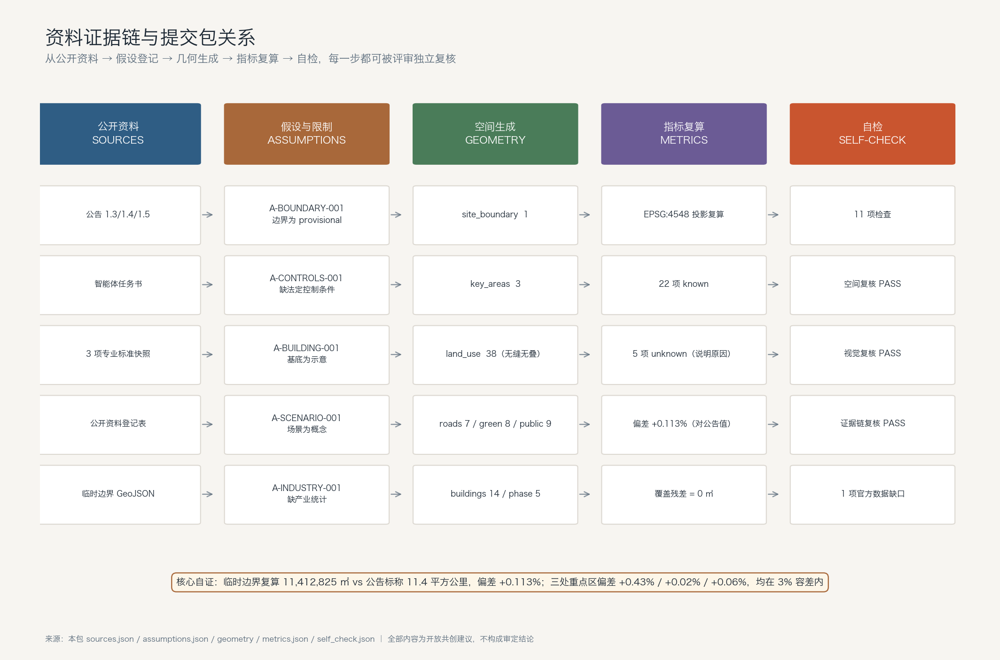
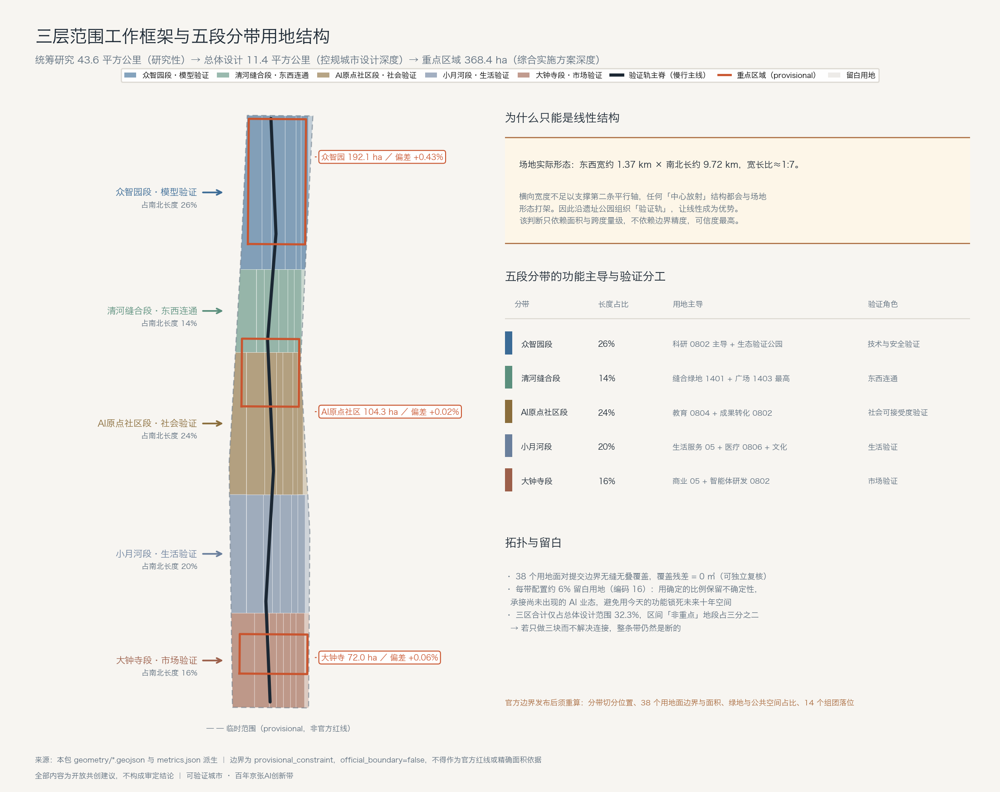
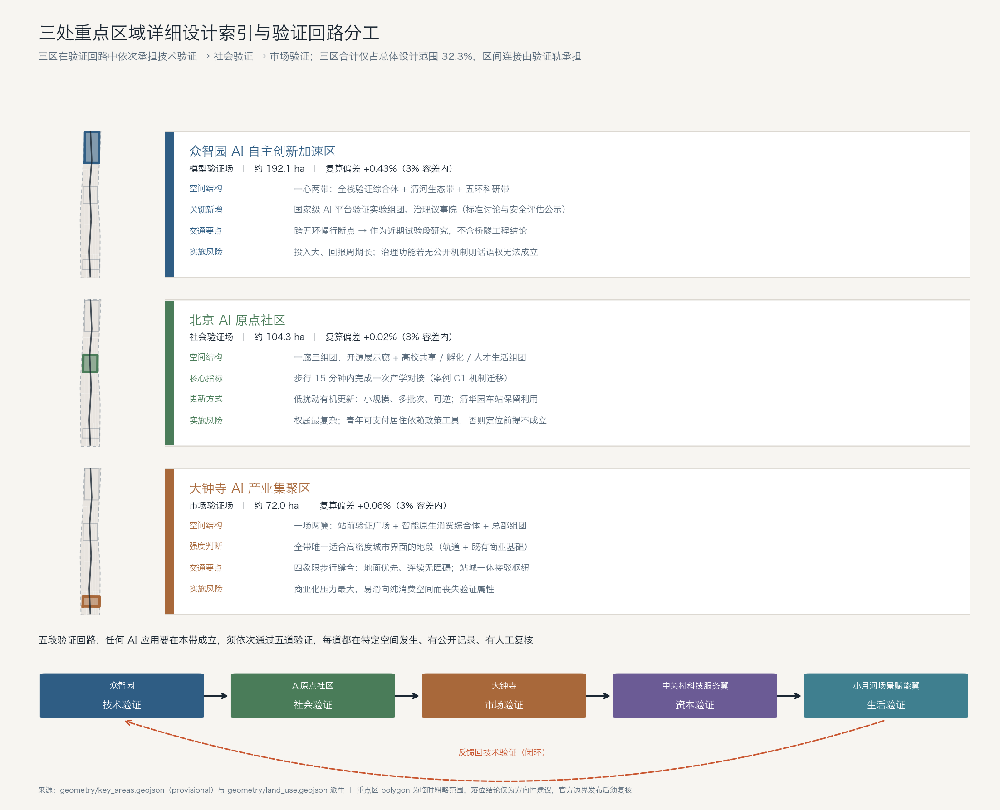
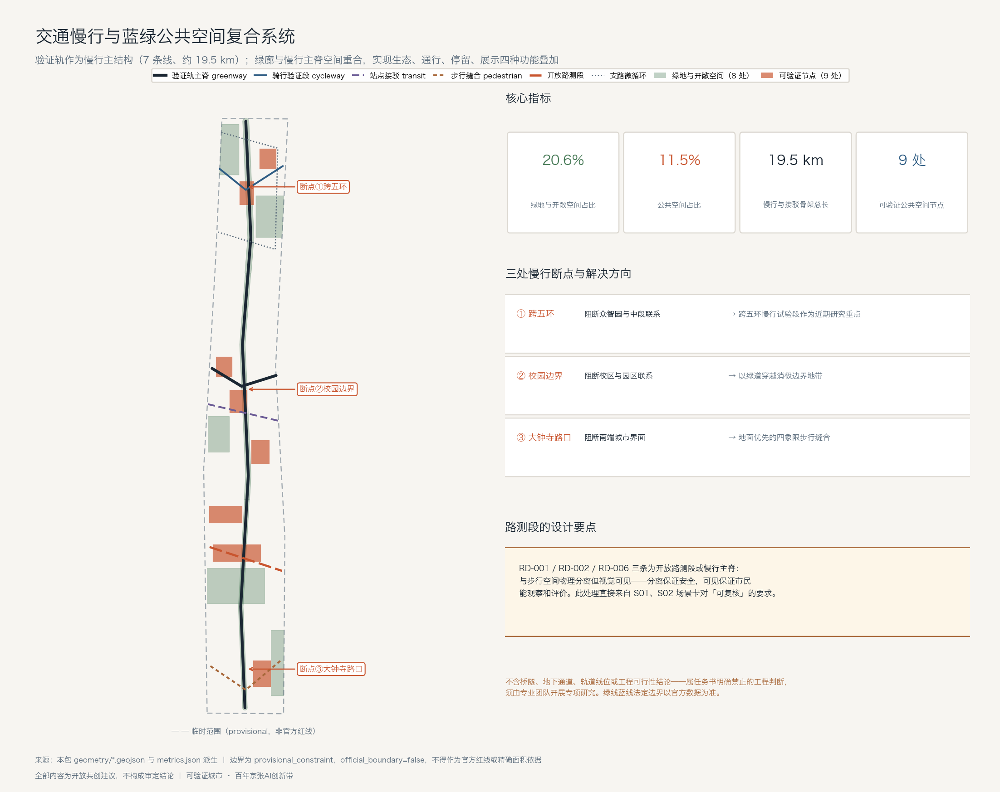
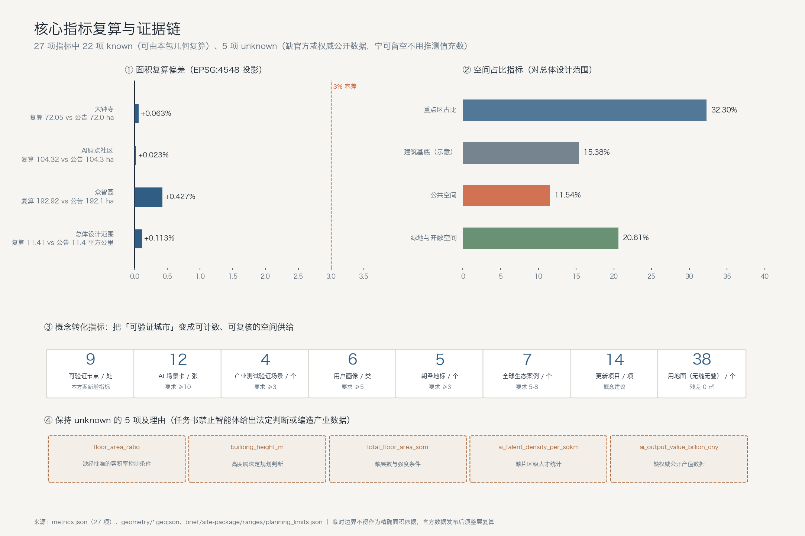

# 可验证城市：百年京张AI创新带总体概念与场景验证轨设计

一百多年前，詹天佑在青龙桥面对的是一道无法回避的坡度。他没有宣称机车能爬上去，而是承认这个约束，用「人」字形折返把坡度换成了空间。京张铁路之所以成为一条被反复讲述的线，不只因为它是中国人自主设计的第一条干线铁路，更因为它把一个工程判断变成了可以被后人站在原地看见、量出来、复核的东西。

一百年后，这条线两侧的城市要回答的问题变了，但结构惊人地相似。人工智能正在成为城市运行的一部分——它建议信号配时、调度配送、分配服务、筛选申请。这些决策的共同特点是：发生得极快，解释得极少，而且几乎不留下市民可以自己去查的痕迹。当一个 AI 系统在城市里做了一件事，普通人既不知道它依据什么数据，也不知道谁复核过它，更不知道它错了之后由谁负责。

本方案的判断是：**海淀这条创新带最稀缺的不是算力、场地或政策，而是「可验证性」这种城市基础设施。** 因此我们不把这条带设计成一个展示 AI 有多强的展厅，而设计成一条让 AI 必须接受公开验证的轨道。这既是对京张铁路精神最准确的继承——承认约束、把判断留在空间里让人复核——也是海淀在全球 AI 竞争中唯一难以被复制的差异点：别的城市可以更快地部署 AI，但只有一个足够自信的创新区，敢把 AI 的失败率刻在公共空间的墙上。

本方案全部内容为面向开放征集的**概念建议与参考方案，可供专业团队深化研究**，不替代法定规划，不构成政府审定结论或实施承诺。

## 设计依据与资料清单

本方案的全部结论建立在仓库内已确认可公开或已清权的资料之上[source:SITE-PACKAGE]，并严格按公开资料登记表[source:SOURCE-REGISTRY] 区分资料的可用等级：`usable_for_formal="yes"` 的资料才用于支撑设计判断，`background_only` 的资料只用于叙事背景（如 agent 导航层[source:PROCESSED-FACT-PACK]），`provisional_only` 的资料只用于临时几何生成与自检。

主控依据是北京市规划和自然资源委员会海淀分局《百年京张AI创新带城市设计国际方案征集资格预审公告》[source:OFFICIAL-ANNOUNCEMENT]，它规定了 1.3 征集目的的三项要求、1.4 三层范围的面积与四至、1.5 设计任务的具体条目，以及总体设计范围须达到控制性详细规划的城市设计深度、重点区域须达到规划综合实施方案深度这两条深度约束[standard:PROJECT-OFFICIAL-ANNOUNCEMENT]。面向智能体的补充依据是任务书摘录[source:AGENT-TASKBOOK]，它给出十条共创原则、三大定位、五大功能、三区两翼结构、agent.1 至 agent.6 六项必答任务、13 项评审维度和统一边界条款[standard:PROJECT-AGENT-OPEN-CALL-TASKBOOK]。专业标准依据取自仓库保存的本地参考快照而非仅凭链接：城市设计管理办法用于公共空间与建筑风貌的统筹要求[standard:MOHURD-URBAN-DESIGN-MEASURES]，控制性详细规划编制要求用于界定总体设计范围的成果深度[standard:MOHURD-CONTROL-DETAILED-PLANNING]，国土空间调查规划用途分类指南用于约束全部用地编码取值[standard:MNR-LAND-USE-CLASSIFICATION-GUIDE][source:STANDARD-MOHURD-URBAN-DESIGN][source:STANDARD-MOHURD-CDP][source:STANDARD-MNR-LAND-USE]。

**关于空间数据的诚实说明，这是本包最重要的一条限制。** 官方红线与设计附件需通过资格预审文件包获取，公开渠道不可得，因此本包 SITE_BOUNDARY 与三处 KEY_AREA 全部采用仓库提供的临时粗略边界[source:BOUNDARY-SOURCE][source:KEY-AREA-SOURCE]，`official_boundary=false`、`geometry_role=provisional_constraint`、`boundary_precision=provisional_rough`[data:geometry/site_boundary.geojson#SITE-001]。公告的文字四至（北至北五环路、东至学院路与西土城路、南至西直门外大街、西至大钟寺东路与荷清路）按规则不可作为官方红线，本包只把它当作校验线索。

我们没有回避这个缺口，而是把它变成一条可被评审直接检验的证据链：临时边界在 EPSG:4548 投影下复算面积为 11,412,825 ㎡，与公告标称的 11.4 平方公里偏差 +0.113%[metric:site_area_deviation_ratio]；三处重点区复算面积与公告标称的 192.1、104.3、72.0 公顷偏差分别为 +0.43%、+0.02%、+0.06%，全部落在 3% 容差内[metric:key_area_total_area_sqm][data:geometry/key_areas.geojson#PROV-KEY-002]。这意味着：本包的空间量级是可信的，可以支撑结构性设计判断；但它的边界精度不足以支撑任何法定结论。官方 polygon 发布后，`land_use`、`green_space`、`public_space`、`buildings`、`phasing` 五层与全部面积类指标必须整层复算[assumption:A-BOUNDARY-001]，这一点在 `assumptions.json`、`sources.json`、`self_check.json` 与展示页中同步标注。

同样诚实的是我们**拒绝填写**的部分。容积率、建筑高度、建筑总规模、AI 人才密度、片区产值五项指标在 `metrics.json` 中一律保持 `status=unknown` 并写明原因[metric:floor_area_ratio][metric:ai_talent_density_per_sqkm]：前三项属法定规划判断且缺经批准的控制条件，后两项缺可公开引用且已清权的片区级统计数据[assumption:A-CONTROLS-001][assumption:A-INDUSTRY-001]。任务书明确禁止编造产值、投资额与企业名单，因此本方案宁可留空并说明口径建议，也不用推测值充当产业依据。评审可以据此判断：这份方案在哪些地方可以被信任，在哪些地方需要专业团队补足。

证据对应关系如下：`sources.json` 登记 12 条资料及其可用等级与限制；`assumptions.json` 登记 7 条假设，覆盖边界、法定控制、建筑基底、场景、案例、产业数据与运营机制；`compliance_matrix.json` 覆盖公告 17 项任务与 agent.1-agent.6 共 23 条要求；`standard_matrix.json` 响应 6 项强制标准；`design_depth_matrix.json` 的 15 个必需深度项全部为 `complete`[depth:existing_conditions_diagnosis]；`self_check.json` 记录 11 项自检结论，其中 1 项为官方数据缺口的 warn。

## 三层范围工作框架

三层范围不是三张比例不同的图，而是三种不同的工作性质。本方案据此把它们区分为「研究—设计—详规」三种成果类型，避免在大范围上做不该做的细节、在小范围上遗漏该有的深度[depth:three_level_scope_framework]。

**统筹研究范围约 43.6 平方公里**（北至北五环路、东至京藏高速、南至西直门外大街、西至万泉河路）[source:PLANNING-LIMITS]。这一层的工作性质是**产业与城市形态研究**，不做用地划分。它要回答的是海淀 AI 产业的战略重点、三区两翼如何协同、未来 AI 城市形态是什么样，以及与北纬社区、未来科学城、怀柔科学城、经开区和京津冀的创新协同关系。本包在这一层不提交独立几何，因为临时边界精度不足以支撑区域级空间结论；相关判断以文字论述与结构关系图表达，这是对资料限制的主动收敛，而非遗漏。

**总体设计范围约 11.4 平方公里**[metric:official_declared_overall_design_area_sqm]，是本包空间成果的主体，对应提交的 SITE_BOUNDARY[data:geometry/site_boundary.geojson#SITE-001]。这一层要达到控规的城市设计深度[standard:MOHURD-CONTROL-DETAILED-PLANNING]，输出用地布局、更新框架、交通与市政策略、蓝绿公共空间体系、风貌引导与更新项目清单。一个必须说明的空间事实是：该范围的实际形态是**南北向窄长条，东西宽约 1.37 公里、南北长约 9.72 公里**，宽长比约 1:7。这不是画图的疏忽，而是「遗址公园周边 1-2 公里」这一定义的必然结果，也直接决定了本方案的核心策略——在一个如此细长的范围里，唯一能贯穿全局的结构只能是线性的，任何试图做「中心放射」结构的方案都会与场地形态打架。因此我们选择沿遗址公园组织「验证轨」，让线性成为优势而不是缺陷。

**重点区域范围约 368.4 公顷**，自北向南为众智园 AI 自主创新加速区约 192.1 公顷、北京 AI 原点社区约 104.3 公顷、大钟寺 AI 产业集聚区约 72.0 公顷[data:geometry/key_areas.geojson#PROV-KEY-001]。这一层要达到规划综合实施方案的城市设计深度，输出功能业态、空间结构、更新意向分类、交通组织与公共空间连通方案。三区合计仅占总体设计范围的 32.3%[metric:key_area_total_area_sqm]，这个比例说明：重点区之间的「非重点」地段占了三分之二，如果只做三块而不解决它们之间的连接，整条带仍然是断的。这正是本方案把验证轨作为一级结构、把三区作为轨上「站点」的原因。

三层之间的传导关系是明确的：统筹层确定「验证什么」（战略重点与产业方向），总体层确定「在哪里验证」（用地、绿地、慢行与更新框架），重点层确定「怎么验证」（具体空间、功能与实施意向）。指标上，统筹层对应产业类指标（当前因数据缺口保持 unknown），总体层对应面积与比例类指标[metric:green_ratio][metric:public_space_ratio]，重点层对应重点区面积与组团数指标[metric:building_cluster_count]。

临时边界带来的限制在本层最需要交代清楚：临时 SITE_BOUNDARY 是依据公告文字四至、标称面积与道路名称拟合的粗略范围，其**面积量级可信、边界位置不可信**。因此本包中所有「分带位置」「组团位置」都应被理解为相对序位关系（北段—中段—南段）而非绝对坐标[assumption:A-BOUNDARY-001]。官方边界发布后，需重算的内容包括：五段分带的实际 y 向切分位置、38 个用地面的边界与面积、绿地与公共空间的实际占比、14 个建筑组团的落位，以及全部面积类指标[metric:land_use_coverage_gap_sqm]。

## 统筹研究范围产业与未来城市研究

### 总体概念：可验证城市 The Verifiable City

**主名称：可验证城市 · 百年京张AI创新带。英文名：The Verifiable City — Centennial Jing-Zhang AI Innovation Belt。**

命名的逻辑不是修辞，而是回答一个具体问题：这条带凭什么在全球 AI 创新区里被记住？如果答案是「算力强、企业多、政策好」，那么它随时可以被另一个投入更大的园区替代。但如果答案是「这里的 AI 必须被公开验证」，这就成了一种制度性资产——它需要长期积累的信任、公开的记录和市民的参与习惯，无法靠短期投资复制。这一命名同时回应了任务书禁止「只提交口号式命名」和「照搬城市、园区或企业名称」的要求[source:AGENT-TASKBOOK]：「可验证」既不是地名也不是企业名，而是一个可被检验的城市承诺。

命名体系分四级，保证可延展、可国际传播：一级是带名「可验证城市」；二级是三区两翼的功能名，分别为「众智园·模型验证场」「AI原点社区·社会验证场」「大钟寺·市场验证场」「中关村科技服务翼·资本验证网」「小月河场景赋能翼·生活验证网」；三级是节点名，统一采用「验证 + 类型」构词，如「开发者散步道」「荣誉墙广场」「开源展示廊」「治理议事院」[data:geometry/public_space.geojson#PS-002]；四级是事件名，采用「验证周/验证日」体系，详见运营章节。这套命名的可迁移性在于：任何新增的空间或活动都能在四级体系内找到位置，不需要重新造词。

### 视觉识别与 Logo 方向

Logo 概念方向为「**折返记号**」（The Switchback Mark）：以京张铁路青龙桥「人」字形折返的抽象几何为母题，形成一个由两段折线构成的开放符号。选择这个母题的理由有三：它是京张铁路最具辨识度且无版权争议的公共历史符号；它的几何本身表达「承认约束、迂回前进」，与「可验证」的含义一致；它在极小尺寸下仍可辨认，适合作为数字徽章使用。

延展体系包括：主标识（折返记号 + 中英文字组）；**验证徽章**（Verified Badge）——通过验证的场景、方案或贡献者可获得带编号的徽章，既是数字标识也可实体化为空间铭牌；三区两翼的色彩分区（建议采用低饱和度的工程蓝、遗产赭、生态绿三色体系，避免高饱和的科技感套路）；字体方向建议采用开源字体（如思源系列）以确保授权清晰[assumption:A-CASE-001]。**字体、图片、商标、人物肖像与企业标识一律要求授权清晰，本方案不提供任何未清权素材，具体视觉资产须在深化阶段由专业团队完成版权确认。** 需要特别区分的是：一带整体 Logo 系统（折返记号）与文化标识系统（见文化叙事章节的遗产导视符号）是两套并行体系，前者服务品牌识别与国际传播，后者服务场地历史阅读，不得混用[source:AGENT-TASKBOOK]。

### 三大定位、五大功能与三区两翼协同回路

任务书给定的三大定位是百年京张文化带、都市 AI 生活体验带、AI 融合创新带；五大功能是 AI 全栈自主创新体系、世界级 AI 创新生态、AI+ 场景赋能新范式、智能化 AI 活力城市、AI 治理全球话语权[source:AGENT-TASKBOOK]。多数方案会把它们并列陈述，但并列无法解释它们如何互相支撑。本方案提出用一条**验证回路**把它们串成闭环：

**技术验证（众智园）→ 社会验证（AI原点社区）→ 市场验证（大钟寺）→ 资本验证（中关村科技服务翼）→ 生活验证（小月河场景赋能翼）→ 反馈回技术验证。** 这条回路的每一段都有明确的输入输出：众智园输出通过安全与标准测试的模型与全栈能力，对应「AI全栈自主创新体系」与「AI治理全球话语权」；原点社区把模型放进真实的校区、园区、社区关系中检验其社会可接受度，对应「世界级AI创新生态」；大钟寺检验它能否形成可持续的消费与商务业态，对应「智能原生新业态」；中关村翼提供要素全球化配置与资本赋能，检验它能否规模化；小月河翼把它放回居民日常生活，检验它是否真的改善了生活，对应「AI+场景赋能新范式」与「智能化AI活力城市」。

这条回路的价值在于**它把「三区两翼」从空间分区变成了功能序列**。任何一个 AI 应用要在这条带上成立，必须依次通过五道验证，每一道都在特定空间里发生、都有公开记录、都有人工复核环节。这也直接解释了三大定位为何能统一：文化带提供「承认约束」的精神来源，生活体验带是社会与生活验证的发生场所，融合创新带是技术与市场验证的发生场所。

区域协同上，本方案主张这条回路不止在带内闭合：众智园的模型验证结果向未来科学城与怀柔科学城的重大科技基础设施开放对接，形成基础研究与工程验证的分工；大钟寺的市场验证与经开区的规模制造形成「验证—量产」通道；北纬社区侧重社群与内容生态，可承接生活验证的用户侧反馈；京津冀层面则以「验证标准互认」为协同抓手——如果一个 AI 场景在海淀通过了公开验证，其验证记录与方法应能被区域内其他城市直接引用，避免重复测试成本。这一机制建议供相关部门与专业团队进一步研究，不构成已确定的区域合作安排[assumption:A-OPERATION-001]。

### 适配 AI 的未来城市形态

关于 AI 将如何改变城市，本方案不做技术预言，而是提出一个可操作的形态判断：**AI 时代城市空间最需要增加的不是智能设备，而是「可解释界面」的密度。** 当越来越多的城市服务由算法中介，城市空间必须相应增加让人理解和干预这些算法的物理位置——否则效率提升的代价是市民对城市失去掌控感。

据此提出三条形态策略。第一，**自适应可进化的空间供给**：在用地结构中系统性保留「留白用地」，五段分带中每一带都配置约 6% 的留白[data:geometry/land_use.geojson#LU-007]，用于承接尚未出现的 AI 业态，避免用今天的功能定义锁死未来十年的空间；这一比例是概念建议，具体规模须由专业团队按官方控规确认。第二，**可感知可交互的 AI+ 交通系统**：以验证轨为骨架，把慢行主脊、骑行验证段、站点接驳与开放路测段组织为一个连续系统，总长约 19.5 公里[metric:road_network_length_m]，其中低速接驳与机器人配送路测段在物理上与步行空间分离但视觉上可见，让市民能「看见」自动化系统如何运行[data:geometry/roads.geojson#RD-006]。第三，**连续无界的绿色空间体系**：绿地占比达 20.6%[metric:green_ratio]，其中遗址公园主绿廊分北、中、南三段贯通全域[data:geometry/green_space.geojson#GS-002]，与清河、小月河蓝绿空间形成横向联系，实现公告要求的南北贯通、东西连通。

关于 AI 文化、AI 社会与 AI 城市的定义，本方案给出的表述是：**AI 文化是承认不确定并公开记录的文化；AI 社会是保留人类最终判断权的社会；AI 城市是让算法决策可被市民复核的城市。** 这三句话不是口号，它们在本方案中各有对应的空间载体——荣誉墙广场记录贡献与失败、治理议事院承载人工复核、开源展示廊公开方法与数据来源[data:geometry/public_space.geojson#PS-007]。这一部分同时回应了任务书 agent.1 的全部必答要求，包括综合规划内涵、空间产业融合与国土空间规划创新思路：本方案主张的创新点在于把「验证能力」作为一种可规划、可计量、可分配的城市功能，用可验证节点数量[metric:verification_node_count]这一新指标进入指标体系，而非仅在传统用地与强度维度上做加减。

### 全球 AI 创新生态案例研究（7 例）

以下案例基于公开报道与公开机构信息归纳，**不引用任何投资额、产值、企业名单或财政承诺数据**[assumption:A-CASE-001]。选取标准是：每个案例必须提供一种海淀可迁移的**机制**，而不只是一个可羡慕的结果。

| 编号 | 案例 | 可迁移机制 | 对海淀的具体启示 | 需要警惕的失败面 |
|---|---|---|---|---|
| C1 | 美国 Route 128 与波士顿剑桥地区 | 大学—医院—企业的近距离转化半径 | AI原点社区应把「步行 15 分钟内完成一次产学对接」作为空间指标，而非只统计机构数量 | 依赖少数机构，抗周期性弱 |
| C2 | 英国伦敦国王十字区 | 铁路遗产地区的整体再生与知识机构植入 | 京张遗址公园可参照其「保留结构逻辑、置换使用功能」的遗产利用方式 | 高度商业化易挤出原有社群 |
| C3 | 法国巴黎 Station F 模式 | 大体量单一屋顶下的创业全链条集聚 | 众智园可设置一处高密度「验证综合体」，把测试、认证、展示压缩在同一步行系统内 | 集聚过度会与周边城区脱节 |
| C4 | 以色列特拉维夫创新生态 | 军民技术转化与高密度社群网络 | 本带的开发者社区运营应以高频小规模活动为主，而非低频大会 | 过度依赖单一技术来源 |
| C5 | 新加坡的国家级监管沙盒实践 | 政府主导的受控测试与分级放开机制 | 直接支撑本方案的「场景开放三级机制」，是可验证城市的制度原型 | 沙盒边界过窄会抑制真实创新 |
| C6 | 德国慕尼黑与周边工业创新区 | 产业链上下游与应用场景的紧密耦合 | 大钟寺的市场验证应与经开区量产环节建立明确通道 | 转型周期长，对新兴业态反应慢 |
| C7 | 芬兰赫尔辛基的城市数据与算法透明实践 | 公共部门算法登记与公开说明机制 | 本方案「验证碑」与算法公开说明的直接参照，可迁移为空间化的公开记录 | 公开成本高，需长期制度保障 |

七个案例的横向结论有三条。第一，**没有一个成功生态是靠单一要素堆出来的**，全部依赖某种「连接机制」——因此本方案把重点放在验证回路这一连接机制上，而不是罗列要素清单。第二，**遗产地区的再生最容易失败在挤出效应**（C2 的教训），因此本方案在原点社区明确提出低扰动有机更新与青年可支付居住的配置要求。第三，**制度透明本身可以成为竞争力**（C5、C7），这是海淀相对其他 AI 园区最有可能建立且最难被模仿的优势，也是本方案概念的直接依据。

### AI 创新生态图谱与要素机制

生态图谱按「基础研究 → 技术攻关 → 概念验证 → 中试孵化 → 产品化 → 市场规模化 → 资本退出与再投入」七个环节组织，与验证回路一一对应：基础研究与技术攻关主要发生在原点社区依托的高校院所与众智园的平台设施；概念验证与中试是众智园的核心功能，也是当前生态链条中最薄弱的一环；产品化与市场规模化落在大钟寺；资本服务由中关村科技服务翼贯穿全程；小月河翼提供真实用户侧的场景入口。

本方案的判断是：**海淀不缺基础研究，也不缺资本，缺的是「概念验证到中试」这一段的公共设施。** 这一段之所以难以由市场自发提供，是因为它需要昂贵的测试环境、明确的合规边界和公开的记录制度，任何单个企业都缺少动力独立建设。因此本方案主张把这一段作为公共投入重点，具体空间对应众智园的全栈验证研发组团与国家级 AI 平台验证实验组团[data:geometry/buildings.geojson#BD-002]。

八类要素的保障机制建议如下，全部为概念建议，不构成政策承诺[assumption:A-OPERATION-001]：**土地**——通过城市更新释放存量空间，并以留白用地保留弹性[data:geometry/land_use.geojson#LU-038]；**空间**——按「验证功能」而非「企业规模」配置载体，为中试环节提供可改造的大跨度空间；**产业**——以验证回路组织上下游，明确各段的准入与退出标准；**资金**——建议由中关村翼提供覆盖概念验证阶段的耐心资本工具研究方向；**人才**——以青年可支付居住与 15 分钟对接半径为核心空间指标[data:geometry/buildings.geojson#BD-006]；**算力**——探索端侧算力与分布式能源同传统市政设施的融合布局；**数据**——建立公开数据目录与最小必要授权机制，严禁使用非公开或个人隐私数据；**场景**——实行三级开放机制（内部测试、受控开放、公开运行），每级都有明确的人工复核要求。这些机制的量化指标当前因缺乏权威公开统计而保持 unknown[metric:ai_talent_density_per_sqkm]，本方案给出的是口径建议而非数值结论。

## 总体设计范围城市更新与控规深度城市设计

### 产业发展目标与功能布局

总体设计范围的产业组织不按行业分类划分，而按**验证阶段**划分——这是本方案与常规产业分区最主要的差别。理由是：AI 产业的技术门类变化速度远快于城市空间的更新周期，若按「大模型区、智能终端区、具身智能区」这类门类分区，五年内即可能失效；而「验证阶段」是一种稳定的结构，无论技术如何变化，任何 AI 应用都要经过验证—孵化—规模化的过程。

据此形成的产业指标体系建议包含三组：**能力类**（可验证场景数量、公开验证记录条数、人工复核覆盖率）、**密度类**（AI 人才密度、每平方公里研发载体面积）、**产出类**（产值规模、企业数量）。本方案能够当期计算并复核的是能力类中的可验证节点数 9 处[metric:verification_node_count]；密度类与产出类因缺可公开引用的片区级统计数据保持 unknown[metric:ai_output_value_billion_cny]，本方案建议的统计口径是按公告界定的总体设计范围边界重新划定统计单元，而非沿用现有街道口径，否则指标无法与规划范围对应[assumption:A-INDUSTRY-001]。

功能比例上，用地结构呈现的比例关系为：科研与研发类用地（0802）约占 22%，商业服务业用地（05）约占 17%，绿地与开敞空间（1401/1402/1403）约占 21%，居住类用地（0701/0702）约占 15%，教育用地（0804）约占 8%，道路用地（1207）约占 10%，留白用地（16）约占 6%，其余为文化、医疗、体育等公共服务用地[data:geometry/land_use.geojson#LU-001][metric:land_use_feature_count]。这一比例是概念建议，其含义是：研发与绿地共占四成以上，体现「人才向往的高品质城区」这一目标要求把环境品质与研发空间同等对待；居住占 15% 偏低，反映的是现状范围内居住用地本就有限，因此本方案在原点社区与小月河段强调职住平衡改善而非大规模新增居住[depth:land_use_layout]。所有比例须在官方边界发布后重算。

结合海淀「1+X+1」产业体系，本方案主张的「AI+」融合重点是三个方向：AI+ 教育（依托高校密集条件，且验证成本相对可控）、AI+ 医疗健康（社会价值高但对人工复核要求最严，适合作为验证制度的试金石）、AI+ 内容消费（大钟寺已有市场基础）。三者的空间落位分别对应原点社区的教育共享用地、小月河段的医疗健康服务用地与大钟寺的智能原生消费用地[data:geometry/land_use.geojson#LU-028]。

### 城市更新总体框架

更新的空间结构为「**一轨、五段、三站、多点**」：一轨是贯通南北的验证轨；五段是自北向南的众智园段、清河缝合段、AI原点社区段、小月河段、大钟寺段；三站是三处重点区；多点是分布全域的九处可验证公共空间节点[data:geometry/public_space.geojson#PS-001][depth:overall_spatial_structure]。

选择这一结构而非常规「双轴多中心」的原因已在三层范围章节说明——场地宽长比约 1:7，横向宽度不足以支撑第二条平行轴。这个判断直接来自几何复算而非构图偏好，是本方案空间结论中可信度最高的一条，因为它只依赖面积与跨度量级，不依赖边界精度。

更新潜力空间的识别逻辑是：遗址公园两侧的低效产业空间、轨道站点周边未一体化开发的地段、校区与园区之间的消极边界地带。本方案把更新对象分为三类意向（不构成地块级拆改留结论[assumption:A-BUILDING-001]）：**保留提升**类以现状产业建筑群与文化资源为主[data:geometry/buildings.geojson#BD-013]，**改造更新**类以低效厂房与老旧商业界面为主[data:geometry/buildings.geojson#BD-010]，**新建补充**类以验证功能缺口与接驳枢纽为主[data:geometry/buildings.geojson#BD-012]。14 个建筑组团中保留类 3 个、改造类 5 个、新建类 6 个[metric:building_cluster_count]，示意性基底总面积约 175.5 万平方米、覆盖率约 15.4%[metric:building_coverage_ratio]——**这个数字只表达组团密度量级，不是建筑规模，也不是建筑密度控制指标**，规划建筑总规模必须由专业团队依官方控规测算[metric:total_floor_area_sqm]。

关于职住商服平衡，本方案的具体主张是在原点社区与小月河段增加青年可支付居住与社区服务设施，理由是这两段最靠近高校与生活服务集中区，通勤改善的边际收益最高；而众智园段以研发功能为主，不宜大量新增居住，应通过验证轨的慢行连通解决通勤。校区、园区、街区的融合重点区落在原点社区段，可实施空间是校园边界的消极地带，统筹实施模式建议采用低扰动有机更新——即以小规模、多批次、可逆的改造替代大规模拆除，这既是对现状权属复杂性的务实回应，也符合任务书对「低扰动、有机更新」的要求[depth:retain_renovate_demolish]。

### 交通、轨道、市政与配套支撑

见后文专章。此处仅说明其与更新框架的关系：更新释放的空间必须与交通承载能力同步匹配，本方案的做法是把新增强度集中在轨道站点周边（大钟寺站、五道口、清华东路西口方向），远离站点的地段以环境提升与功能置换为主，不增加强度[depth:development_intensity_controls]。

### 建筑高度、风貌与形态引导

**本方案不给出任何建筑高度数值、容积率或强度指标**——这既因为公开资料缺少经批准的控制条件，也因为任务书明确将其列为禁止的法定判断[assumption:A-CONTROLS-001][metric:building_height_m]。本方案能提供的是形态引导原则，供专业团队在官方控规框架内深化[standard:MOHURD-URBAN-DESIGN-MEASURES][depth:height_massing_character]：

其一，**遗址廊道优先**：验证轨两侧建议形成由低到高的梯度关系，保证从公园内部能看到天空与远景，避免连续高墙式界面；其二，**南北端强化、中段平缓**：公告要求在公园南端、北端及上跨环路区域打造标志性城市景观节点，因此形态重点放在这三处，中段以连续性与人的尺度为主；其三，**屋顶第五立面**：因本带将长期被大量航拍与开发者社群传播，建议对屋顶形态与设备遮蔽提出引导要求，把屋顶纳入公共视觉资产管理；其四，**风貌基调**：以「工业遗产的克制 + 科研建筑的理性」为基调，避免高饱和色彩与过度装饰的所谓科技感，理由是这条带的辨识度应来自制度与内容，而非外观奇观化。

### 数据缺口与本层结论的可信边界

本层结论中，可信度较高的是结构性判断（线性结构、验证阶段分区、站点周边集聚），因为它们只依赖场地形态量级与公告任务要求；可信度较低的是具体用地边界与组团落位，因为它们依赖临时边界[assumption:A-BOUNDARY-001]。评审在使用本层成果时，建议以结构与机制为主、以具体图面为参考。

## 重点区域详细设计

三处重点区共 368.4 公顷，在验证回路中承担不同环节。每个重点区按「定位 + 空间结构 + 建筑更新意向 + 交通慢行 + 公共空间 + AI 场景 + 实施风险」展开[depth:three_key_area_detailed_design]。因三处 polygon 均为 provisional[data:geometry/key_areas.geojson#PROV-KEY-003]，以下全部结论仅为**方向性设计建议**，具体落位须在官方边界发布后重新校核。

### 众智园 AI 自主创新加速区（约 192.1 公顷）：模型验证场

**定位**：建设更具智慧型与未来感的花园型人工智能创新街区，承担 AI 全栈自主创新体系与治理话语权功能，是验证回路的第一环——技术与安全验证。

**空间结构**为「一心两带」：一心是全栈验证综合体，集中布置研发、测试、认证与展示功能[data:geometry/buildings.geojson#BD-001]；两带是清河生态验证带与五环沿线科研带。选择集中而非分散布局的理由是：验证设施的价值来自共用——测试环境、认证流程与数据基础设施集中后，单个团队的验证成本才可能降到可负担水平（对应案例 C3 的机制）。

**建筑更新意向**：现状产业建筑以保留提升为主[data:geometry/buildings.geojson#BD-013]，新增以实验与平台功能为主[data:geometry/buildings.geojson#BD-002]，标准与治理办公组团独立设置以体现其公共属性[data:geometry/buildings.geojson#BD-003]。**不提供地块级拆改留方案**[assumption:A-BUILDING-001]。

**交通慢行**：结合五环路区域一体化提出对外交通优化方向，内部以支路微循环[data:geometry/roads.geojson#RD-005]与北段骑行验证段[data:geometry/roads.geojson#RD-002]组织；跨五环慢行是本区与中段联系的关键断点，建议作为近期试验段研究[data:geometry/phasing.geojson#PH-002]。**不含桥隧工程或轨道线位结论**。

**公共空间与 AI 场景**：治理议事院是本区特色节点，承载标准讨论、安全评估公示与公众旁听功能[data:geometry/public_space.geojson#PS-007]；水绿一体验证园探索绿色空间服务 AI 发展的功能场景，如户外传感与生态监测的公开测试[data:geometry/green_space.geojson#GS-008]。结合清河文化展示，形成国际化低碳创新交往环境。

**实施风险**：本区面积最大且涉及五环沿线交通条件，实施复杂度最高；验证设施投入大而回报周期长，需长期公共投入意愿支撑；若治理功能仅停留在办公而无公开机制，「治理话语权」将无法成立。

### 北京 AI 原点社区（约 104.3 公顷）：社会验证场

**定位**：建设更具人才吸引力、创新活力与成果转化能力的近校型人工智能创新街区，是验证回路第二环——社会可接受度验证。

**空间结构**为「一廊三组团」：一廊是开源成果展示廊[data:geometry/public_space.geojson#PS-003]；三组团为高校共享创新组团、成果转化孵化组团与青年人才生活组团[data:geometry/buildings.geojson#BD-004]。这一结构的核心指标是**步行 15 分钟内完成一次产学对接**（案例 C1 的迁移），因此三组团必须沿同一慢行系统串联，而非分散布点。

**建筑更新意向**：高校共享平台以现状保留利用为主[data:geometry/buildings.geojson#BD-005]；孵化群以改造更新为主；青年人才公寓为新建补充；清华园车站作为文化资源保留利用[data:geometry/buildings.geojson#BD-007]。采用低扰动有机更新——小规模、多批次、可逆，理由是本区权属最复杂、社区关系最敏感，大规模拆除的社会成本不可承受，且会破坏本区最宝贵的既有学术社群网络。

**交通慢行**：围绕五道口、清华东路西口方向的站点开展一体化设计研究[data:geometry/roads.geojson#RD-003]；校区与园区之间以绿道连接[data:geometry/roads.geojson#RD-007]，重点是消除校园围墙形成的消极边界。

**公共空间与 AI 场景**：开源成果展示廊公开展示方法、数据来源与迭代记录，是「可解释界面」的核心载体；人才客厅提供日常停留与社交空间[data:geometry/public_space.geojson#PS-009]；清华园车站文化验证前场把历史叙事与当代验证并置[data:geometry/public_space.geojson#PS-004]。AI+ 教育场景在本区落地条件最好。

**实施风险**：权属与主体协调难度最高；青年可支付居住若无政策工具支撑将难以实现，而这恰是本区定位的前提；开源展示若缺少持续内容供给会迅速空置；涉及清华园车站等文化资源的任何干预须经文物主管部门确认，本方案不提出修缮或展陈方案[source:JINGZHANG-HERITAGE-PUBLIC]。

### 大钟寺 AI 产业聚集区（约 72.0 公顷）：市场验证场

**定位**：建设更具世界影响力与城市发展活力的城市型人工智能创新街区，围绕智能体、智能终端与内容消费等 AI 原生业态，是验证回路第三环——市场验证。

**空间结构**为「一场两翼」：一场是大钟寺站前验证广场[data:geometry/public_space.geojson#PS-005]；两翼是智能原生消费综合体[data:geometry/buildings.geojson#BD-010]与智能体企业总部组团[data:geometry/buildings.geojson#BD-011]。本区面积最小但强度最高，是全带唯一适合高密度城市界面的地段，因为它同时具备轨道站点与既有商业基础。

**建筑更新意向**：以改造更新既有商业与产业建筑为主，新建集中于站城一体接驳枢纽[data:geometry/buildings.geojson#BD-012]；规划绿地探索复合利用，即在满足绿地功能前提下叠加公共活动与展示功能[data:geometry/green_space.geojson#GS-006]。

**交通慢行**：大钟寺地铁站四象限步行连通是本区最具体的空间问题，建议以地面优先、连续无障碍的步行缝合为研究方向[data:geometry/roads.geojson#RD-004]；非机动车停放需系统组织，避免占用步行空间。**不含地下空间工程可行性或轨道一体化工程结论**[assumption:A-CONTROLS-001]。

**公共空间与 AI 场景**：站前广场作为南端城市客厅与智能原生消费的验证界面；数据要素与数字资产流通机制的探索建议以受控开放方式在本区试行，且全部涉及个人数据的环节须满足最小必要与可退出原则[assumption:A-SCENARIO-001]。

**实施风险**：商业化压力最大，易滑向纯消费空间而丧失验证属性；四象限步行连通涉及既有道路条件，实施难度高；国际交往与人才通勤需求的满足依赖轨道服务水平，超出本方案可控范围。

## AI 创新生态、人才画像与 AI+ 场景

### 六类用户画像

画像的作用不是描述人群，而是**给每个场景指定一个可以被追问的责任对象**——当一个场景说「提升效率」，必须能回答「对谁提升、代价由谁承担」[assumption:A-SCENARIO-001]。

| 编号 | 画像 | 核心需求 | 最痛的空间问题 | 在验证回路中的角色 |
|---|---|---|---|---|
| P1 | 高校科研人员与研究生 | 快速找到工程验证条件与合作对象 | 校园边界封闭，出校即断连 | 提供待验证的技术，社会验证的发起者 |
| P2 | AI 初创团队与开发者 | 低成本测试环境、合规边界清晰 | 缺可负担的中试空间与公开测试场地 | 验证的主要使用者与徽章获得者 |
| P3 | 领军企业员工与技术管理者 | 通勤效率、国际交往、供应链协同 | 站点接驳断点、周边环境品质不足 | 市场验证与规模化的承担者 |
| P4 | 本地长期居民（含老年群体） | 生活便利、安全、不被技术排除 | 被动承受路测与设备，缺少表达渠道 | 生活验证的评判者与否决者 |
| P5 | 青年租住人才 | 可支付居住、通勤短、社交活跃 | 可支付住房不足，夜间活力有限 | 社会验证的日常参与者 |
| P6 | 访客与全球开发者社群 | 可读的叙事、可参观的真实场景 | 缺少公开可达的验证现场与解说 | 国际传播的自发载体 |

需要明确的是 **P4 拥有否决权**。若一个场景在生活验证环节被居民持续反对，它不应通过验证——这是「人本治理」原则在机制上的具体落实，也是本方案与「先部署再解释」思路的根本分歧。

### 12 张 AI 场景卡

每张卡包含：空间位置、服务对象、运行数据、隐私边界、人工复核、运营主体建议、可视化图层与风险。**全部场景为概念建议，非已批准运营；均不使用非公开数据、个人隐私数据或指定供应商作为必要条件**[assumption:A-SCENARIO-001]。标注 ⚙ 者为 AI 产业测试验证场景（共 4 个，满足不少于 3 个的要求）[metric:industry_test_scenario_count]。

**S01 ⚙ 机器人配送开放路测段**｜位置：小月河段路测环廊[data:geometry/public_space.geojson#PS-006]｜对象：P2、P3、P4｜数据：路径与避障日志、公开时段与路段清单｜隐私：不采集人脸，视频仅本地处理不留存原始画面｜复核：每周公示故障与接管记录，居民可申请调整时段｜主体建议：区级平台 + 企业联合｜图层：`roads.geojson#RD-006`｜风险：与行人冲突，需物理分离与限速。

**S02 ⚙ 低速接驳车验证环线**｜位置：验证轨主脊沿线[data:geometry/roads.geojson#RD-001]｜对象：P1、P3、P5｜数据：客流与准点率、接管次数｜隐私：不做乘客身份识别，票务与身份解耦｜复核：安全员在场，接管日志公开｜主体建议：交通运营方 + 高校联合研究｜图层：`roads.geojson#RD-001`｜风险：混行安全、冬季运行条件。

**S03 ⚙ 具身智能户外测试场**｜位置：众智园水绿一体验证园[data:geometry/green_space.geojson#GS-008]｜对象：P2、P3｜数据：环境传感与运动数据，不涉个人｜隐私：园区内明确标识测试范围，公众可绕行｜复核：测试前安全评估，事故即停｜主体建议：国家级平台设施运营方｜图层：`green_space.geojson#GS-008`｜风险：设备安全与噪声干扰。

**S04 ⚙ 模型安全与标准验证实验室**｜位置：众智园验证实验组团[data:geometry/buildings.geojson#BD-002]｜对象：P1、P2、P3｜数据：模型评测结果与方法说明｜隐私：不涉个人数据，评测数据集须清权｜复核：评测方法公开，第三方可复现｜主体建议：标准机构 + 平台联合｜图层：`buildings.geojson#BD-002`｜风险：标准滞后于技术演进。

**S05 AI+ 医疗健康社区服务站**｜位置：小月河段医疗健康服务用地[data:geometry/land_use.geojson#LU-028]｜对象：P4、P5｜数据：仅经明示同意的健康自测数据，最小必要｜隐私：数据本地化、可随时删除、默认不共享｜复核：**任何健康相关输出必须由持证医师确认，AI 不作诊断结论**｜主体建议：社区卫生机构主导｜图层：`land_use.geojson`｜风险：误导风险最高，须最严复核，此场景是验证制度的试金石。

**S06 AI+ 教育共享平台**｜位置：原点社区高校共享组团[data:geometry/buildings.geojson#BD-005]｜对象：P1、P5、P6｜数据：公开课程与学习行为统计（去标识化）｜隐私：不对未成年人做个体画像｜复核：教学内容由教师终审｜主体建议：高校与区教育部门｜图层：`buildings.geojson#BD-005`｜风险：加剧资源不均，须保留非数字化路径。

**S07 智能原生消费体验界面**｜位置：大钟寺消费综合体[data:geometry/buildings.geojson#BD-010]｜对象：P3、P6｜数据：匿名客流与业态热度｜隐私：**禁止人脸识别与跨店追踪**｜复核：投诉即人工介入，算法推荐可一键关闭｜主体建议：商业运营方 + 消费者代表监督｜图层：`buildings.geojson#BD-010`｜风险：过度商业化、算法诱导消费。

**S08 遗址公园 AI 文化导览**｜位置：清华园车站文化前场[data:geometry/public_space.geojson#PS-004]｜对象：P4、P6｜数据：公开史料与公开展陈信息｜隐私：无个人数据采集｜复核：**史实内容须经文物与史料部门确认，AI 不得生成未经核实的历史叙述**｜主体建议：公园管理方 + 文物部门｜图层：`public_space.geojson#PS-004`｜风险：历史失真，须严守史实。

**S09 开发者社群协作场景**｜位置：开源成果展示廊[data:geometry/public_space.geojson#PS-003]｜对象：P2、P6｜数据：开源项目与贡献记录（公开来源）｜隐私：仅使用贡献者自愿公开的信息｜复核：内容上墙前人工审核｜主体建议：开源社区 + 运营方｜图层：`public_space.geojson#PS-003`｜风险：内容枯竭，需持续供给机制。

**S10 城市智能体公共咨询站**｜位置：治理议事院[data:geometry/public_space.geojson#PS-007]｜对象：P2、P4、P5｜数据：公开政策与办事指南｜隐私：不留存咨询者身份，可匿名使用｜复核：**涉及权益的答复必须转人工，AI 只做信息导航不做决定**｜主体建议：政务服务部门｜图层：`public_space.geojson#PS-007`｜风险：错误答复造成实际损失，须明确边界与免责说明。

**S11 蓝绿空间生态监测场景**｜位置：清河生态验证公园[data:geometry/green_space.geojson#GS-001]｜对象：P1、P4｜数据：水质、植被、微气候公开监测数据｜隐私：无个人数据｜复核：数据由专业机构校准后公示｜主体建议：园林水务部门 + 高校｜图层：`green_space.geojson#GS-001`｜风险：设备维护成本与数据连续性。

**S12 无障碍与适老出行辅助**｜位置：大钟寺四象限步行缝合段[data:geometry/roads.geojson#RD-004]｜对象：P4、P5｜数据：无障碍设施状态与路径可达性｜隐私：不追踪个体轨迹，路径规划本地完成｜复核：残障与老年代表参与实测评价｜主体建议：交通与残联协同｜图层：`roads.geojson#RD-004`｜风险：技术方案替代不了物理无障碍改造，须避免以 App 掩盖设施缺失。

12 张场景卡[metric:ai_scenario_card_count]的共同结构值得说明：**每一张都有一个明确的「人工复核」环节和一个明确的「不做什么」声明。** 这不是免责条款，而是本方案的设计核心——一个场景如果找不到人工复核的责任主体，或者说不清自己不做什么，它就不该进入公共空间。

### 场景—空间—运营映射与小月河场景赋能翼

映射关系遵循三级开放机制：**内部测试**（S03、S04，在专属空间内，公众不受影响）→ **受控开放**（S01、S02、S05、S12，在指定时段与路段，有安全员与退出机制）→ **公开运行**（S06、S07、S08、S09、S10、S11，常态开放但保留人工通道）。每一级的准入条件是通过上一级验证并完成公示。

小月河场景赋能翼承担生活验证功能，其公共体验路径为：小月河场景体验回路[data:geometry/public_space.geojson#PS-008] → 社区 AI 服务站群[data:geometry/buildings.geojson#BD-008] → 路测环廊 → 蓝绿场景带[data:geometry/green_space.geojson#GS-005]。这条路径的设计意图是让居民在日常散步的距离内就能遇到、观察并评价这些场景，而不需要专门去参观——**生活验证必须发生在生活里，这是它与展厅式示范区的根本区别**[depth:blue_green_public_space]。

## 用地、建筑规模与拆改留方案

用地布局采用南北五段分带、带内东西切分的结构，共 38 个用地面，对总体设计范围实现无缝无叠覆盖，覆盖残差为 0 平方米[metric:land_use_coverage_gap_sqm][data:geometry/land_use.geojson#LU-001]。这一拓扑结果是可被评审直接复核的：任意两个用地面无重叠，全部用地面并集等于提交边界。

五段分带的功能主导逻辑与验证回路对应：**众智园段**（约占南北长度 26%）以科研用地为主导，配置研发、人才居住与生态验证公园；**清河缝合段**（14%）以绿地与广场为主导，承担东西缝合功能，用地上体现为缝合绿地与广场用地比重最高[data:geometry/land_use.geojson#LU-008]；**AI原点社区段**（24%）以教育与科研转化用地为主导，配置青年社区与社区服务；**小月河段**（20%）以生活服务、医疗、文化与混合居住为主导，是 AI+ 场景最密集的一段；**大钟寺段**（16%）以商业服务业与智能体研发为主导，配置站前广场与文化展示[data:geometry/land_use.geojson#LU-032]。

每段均配置约 6% 的留白用地（编码 16），全域留白合计约 6%[data:geometry/land_use.geojson#LU-038]。这是本方案在用地层面最重要的主动选择：**用确定的比例保留不确定性**。理由是 AI 业态的空间需求在五年内难以预测，若把所有用地都赋予明确功能，规划将在技术演进面前迅速失效；留白的具体规模、位置与管理方式须由专业团队按官方控规确认[assumption:A-CONTROLS-001]。

建筑层面，14 个示意组团的基底合计约 175.5 万平方米，覆盖率约 15.4%[metric:building_footprint_area_sqm][metric:building_coverage_ratio]。**必须再次强调：这是示意性功能组团基底，不是现状建筑普查结果，也不是建筑规模或密度控制指标。** 规划建筑总规模、容积率与建筑高度在本包中一律保持 unknown[metric:total_floor_area_sqm][metric:floor_area_ratio]，原因是缺经批准的控制条件，且任务书禁止智能体给出此类法定判断[assumption:A-CONTROLS-001]。

更新意向分为三类，全部为**类型意向而非地块方案**[assumption:A-BUILDING-001][depth:retain_renovate_demolish]：**保留（retain）** 3 处，包括北段现状产业建筑群、高校共享平台与清华园车站文化建筑，理由是其功能或文化价值已成立，改造收益低于风险；**改造（renovate）** 5 处，包括众智园研发组团、原点社区孵化群、原点社区商业界面、小月河生活服务组团与大钟寺消费综合体，理由是结构可用但功能与界面需要更新；**新建（new_build）** 6 处，集中于验证功能缺口（验证实验组团、治理办公组团）、人才居住与接驳枢纽。三类的比例关系（3:5:6）体现的判断是：**以改造和补缺为主，不做大规模拆除**——这既是对现状权属复杂性的务实回应，也符合低扰动更新导向。任何地块级的拆改留判断、权属处置与工程可行性结论，均须由具备资质的专业团队依官方控规、现状勘察与权属核查完成，本方案不提供也不暗示此类结论。

空间供给与运营策略上，本方案主张按「验证阶段」而非「企业规模」配置载体：概念验证阶段需要可改造的大跨度空间与共用测试设施；中试阶段需要可分割、可快速改配的中等空间；规模化阶段需要标准化办公与商务空间。这一供给序列与三区的空间条件天然匹配，也解释了为何众智园需要大体量集中载体而大钟寺适合高密度城市界面[depth:land_use_layout]。

## 交通、轨道、市政与公共服务设施

### 慢行与验证轨骨架

交通系统的组织原则是：**把验证轨作为慢行主结构，让机动交通服务于它而不是穿越它。** 骨架由 7 条线组成，总长约 19.5 公里[metric:road_network_length_m][depth:traffic_rail_slow_parking]：验证轨主脊（慢行主线，贯通南北）[data:geometry/roads.geojson#RD-001]、北段清河骑行验证段[data:geometry/roads.geojson#RD-002]、五道口—清华东路西口方向站点接驳[data:geometry/roads.geojson#RD-003]、大钟寺站四象限步行缝合[data:geometry/roads.geojson#RD-004]、众智园支路微循环[data:geometry/roads.geojson#RD-005]、小月河场景开放路测段[data:geometry/roads.geojson#RD-006]、原点社区校园—园区绿道[data:geometry/roads.geojson#RD-007]。

其中 3 条被明确定义为**开放路测段或慢行主脊**（RD-001、RD-002、RD-006），承担低速接驳与机器人配送的公开测试功能[data:geometry/roads.geojson#RD-006]。设计要点是：路测段与步行空间物理分离但视觉可见——分离保证安全，可见保证市民能观察和评价。这一处理直接来自 S01、S02 场景卡对「可复核」的要求。

**慢行断点是本带最实在的问题。** 公告明确要求聚焦公园慢行系统断点。本方案识别的三处关键断点为：北段跨五环（阻断众智园与中段联系）、中段校园边界（阻断校区与园区联系）、南段大钟寺路口（阻断南端城市界面）。三处的解决方向分别是：跨五环慢行试验段作为近期研究重点[data:geometry/phasing.geojson#PH-002]、以绿道穿越消极边界地带、以地面优先的四象限步行缝合。**本方案不提出桥隧、地下通道或轨道线位的工程方案，也不做工程可行性判断**——这些属于任务书明确禁止的工程结论，须由专业团队开展专项研究[assumption:A-CONTROLS-001]。

### 轨道站点一体化与静态交通

围绕既有轨道站点开展一体化功能布局是公告要求，本方案的空间响应是把新增强度与公共功能向站点周边集中，具体为大钟寺站城一体接驳枢纽[data:geometry/buildings.geojson#BD-012]与站前验证广场[data:geometry/public_space.geojson#PS-005]。大钟寺站四象限步行连通的设计要点是连续、无障碍、地面优先：地面优先的理由是它对老年与残障群体最友好，且实施成本与工程风险最低，符合 S12 场景卡「技术方案不能替代物理无障碍改造」的判断。

非机动车停放需系统组织，避免占用步行空间与消防通道——这是当前站点周边最普遍的实际问题。建议在站点周边与验证轨节点处设置集中停放并配置智能调度研究方向，但本方案不指定技术供应商，也不把任何特定设备作为必要条件[assumption:A-SCENARIO-001]。

### 市政与新型基础设施融合

本方案的判断是：AI 产业带来的市政需求变化，主要不是总量增加，而是**分布形态变化**——从集中式变为分布式，从稳定负荷变为波动负荷。因此提出三条融合方向，全部为概念建议且**不含能源负荷、市政容量或工程可行性测算**[assumption:A-CONTROLS-001][depth:municipal_new_infrastructure]：

其一，**端侧算力与建筑一体化**：把小规模算力设施布置在研发组团与社区服务站内，靠近应用场景，减少长距离数据传输，同时其余热可考虑与建筑供热结合，具体可行性须由专业团队测算。其二，**分布式能源与三大设施协同**：在新建组团探索光伏、储能与传统供电的协同布局，具体方案须依专项规划确定。其三，**验证数据基础设施**：这是本方案特有的一项——为支撑公开验证，需要一套公开的数据发布与留存设施（公开监测数据、验证记录、复核日志），建议作为公共基础设施统一建设，避免各场景各自建设导致记录格式不一、无法比较。

### 公共服务与创新服务设施体系

设施体系按四类组织：**AI 产业服务设施**（测试认证、中试空间、共用实验条件，集中于众智园）；**创新服务平台设施**（技术转移、知识产权、合规咨询，集中于原点社区与中关村翼方向）；**人才生活服务设施**（青年可支付居住、社区服务、体育与文化设施，分布于原点社区段与小月河段）[data:geometry/land_use.geojson#LU-021]；**新型基础设施**（端侧算力、分布式能源、验证数据设施）。

标准与布局建议以「15 分钟可达」为基本要求，其中人才生活服务设施的可达性优先级最高——理由是它直接决定「全球 AI 创新人才向往」这一目标能否成立，而这是三项征集目的中最难靠投资短期实现的一项[standard:PROJECT-OFFICIAL-ANNOUNCEMENT]。具体设施规模与标准须由专业团队按官方配置标准与人口预测确定，本方案不提供指标数值[metric:ai_talent_density_per_sqkm]。

## 蓝绿空间、公共空间与城市风貌

### 京张遗址公园活力带与蓝绿系统

绿地与开敞空间共 8 处，合计约 235.2 万平方米[metric:green_space_area_sqm]，占总体设计范围 20.6%[metric:green_ratio][data:geometry/green_space.geojson#GS-002]。其中遗址公园主绿廊分北、中、南三段沿验证轨贯通全域[data:geometry/green_space.geojson#GS-003][data:geometry/green_space.geojson#GS-004]，是实现公告「南北贯通」要求的主体；清河生态验证公园[data:geometry/green_space.geojson#GS-001]与小月河蓝绿场景带[data:geometry/green_space.geojson#GS-005]提供「东西连通」的横向联系；口袋公园群与水绿一体验证园补充日常使用[data:geometry/green_space.geojson#GS-007]。

20.6% 这个比例的设计含义需要解释：它不是为了达标，而是回应一个具体判断——**在一个宽仅 1.37 公里的窄长地带里，绿地是唯一能同时承担生态、通行、停留与展示四种功能的空间类型**。若绿地率过低，验证轨将退化为一条纯交通线；若过高而不组织，则会形成大量无人使用的消极绿地。因此本方案的绿地策略不是扩大面积，而是让绿廊同时承载慢行主脊与验证节点，实现功能叠加[depth:blue_green_public_space]。绿线的法定边界须以官方数据为准，本包 constraints 层中的蓝绿研究带仅为概念研究范围，不得作为蓝线或绿线依据[data:geometry/constraints.geojson#CN-004]。

### 九处可验证公共空间与组件库

公共空间共 9 处，合计约 131.7 万平方米[metric:public_space_area_sqm]，占比 11.5%[metric:public_space_ratio][metric:verification_node_count]。每一处都被赋予明确的验证角色（`verification_node_role` 字段），这是本方案把概念转化为可复核数据的方式——评审可以直接在 GeoJSON 中检验每个节点是否有角色定义[data:geometry/public_space.geojson#PS-001]。

**公共空间组件库**（供专业团队深化的标准化构件建议）包含六类：**验证碑**——记录该场景的数据来源、复核责任方与运行状态的实体标识；**可解释座椅**——在停留处提供该地段 AI 场景的说明与反馈入口；**路测边界带**——区分路测区与步行区的地面构造；**荣誉铭牌**——可增补的贡献记录构件；**导视杆**——统一的历史与验证双层信息载体；**遮阴与庇护构筑**——保证北京气候下的全年可用性。组件库的设计意图是让整条带在长期分批建设中保持一致性，而不依赖单次设计的完整性；具体形式、材料与工程做法须由专业团队按建筑工程设计文件编制深度要求深化[standard:MOHURD-ARCH-DESIGN-DEPTH-2016][assumption:A-BUILDING-001]。需要说明的是：该深度规定属工程设计阶段要求，本包为概念建议深度，仅将其作为后续深化的对接依据，不声称本包已达到该深度。

### 五个 AI 朝圣地标与荣誉展示体系

任务书要求不少于 3 个，本方案提出 5 个[metric:pilgrimage_landmark_count]，全部为**概念建议，不构成已批准建设**：

**L1 智能体贡献荣誉墙**（众智园段荣誉墙广场[data:geometry/public_space.geojson#PS-002]）——记录通过验证的智能体、方案与贡献者。设计要点在于它**同时记录成功与失败**：每条记录包含贡献内容、验证结论与未通过原因。这是本方案对项目「碑刻」构想的具体回应，也是与常规荣誉墙的关键差别——只记录成功的墙是宣传，记录失败的墙才是验证。

**L2 折返记号广场**（清河缝合段东西缝合广场[data:geometry/land_use.geojson#LU-009]）——以「人」字形折返几何形成的公共广场，是品牌 Logo 的空间原型，承担东西缝合的实际通行功能。

**L3 开源成果展示廊**（原点社区[data:geometry/public_space.geojson#PS-003]）——线性展示开源方法、数据来源与迭代过程，是「可解释界面」的核心载体。

**L4 治理议事院**（众智园[data:geometry/public_space.geojson#PS-007]）——承载标准讨论、安全评估公示与公众旁听，把「AI 治理话语权」从会议室搬到可进入的公共空间。

**L5 南端验证之门**（大钟寺站前广场[data:geometry/public_space.geojson#PS-005]）——公告要求在公园南端打造标志性景观节点，本方案将其定位为整条验证轨的城市入口与市场验证界面。

荣誉展示体系的运行规则建议为：贡献记录采用可增补的模块化构件，每年更新；记录内容须经人工审核并公开审核标准；贡献者名称与 Agent 名称的使用须获授权。**地标形式、位置、实物建设与碑刻安排均以最终评选、审批及实际落成为准，本方案不作任何承诺**。同时明确避免过度娱乐化与网红化——地标的吸引力应来自其记录的内容，而不是造型的猎奇[source:AGENT-TASKBOOK]。

### 城市风貌与文化资源利用

风貌基调为「工业遗产的克制 + 科研建筑的理性」[standard:MOHURD-URBAN-DESIGN-MEASURES][depth:height_massing_character]。具体引导包括：验证轨两侧形成由低到高的梯度关系，保证公园内的天空视野；南端、北端及上跨环路三处强化标志性；屋顶第五立面纳入公共视觉管理；色彩以低饱和工程蓝、遗产赭、生态绿为主，避免高饱和科技感套路。**不提供建筑高度、强度数值**[metric:building_height_m]。

文化资源利用上，清华园车站旧址作为现状保留利用的文化建筑[data:geometry/buildings.geojson#BD-007]，其前场作为文化验证节点[data:geometry/public_space.geojson#PS-004]；北影等艺术资源建议以内容合作方式参与叙事与传播，而非空间改造。**任何涉及文物本体的干预、修缮或展陈方案均须由文物主管部门确认，本方案不提出此类方案**[source:JINGZHANG-HERITAGE-PUBLIC][data:geometry/constraints.geojson#CN-002]。围绕清河、小月河的蓝绿空间以宜居宜业为导向组织，具体水系治理方案须依专项规划确定。

## 更新项目清单、实施政策与分期计划

### 14 项更新项目清单（概念建议）

| 编号 | 项目 | 类型 | 位置 | 依赖条件 | 分期 |
|---|---|---|---|---|---|
| R01 | 验证轨主脊慢行贯通 | 公共空间 | 全域 | 遗址公园既有设计衔接、断点研究 | 近期 |
| R02 | 智能体贡献荣誉墙广场 | 公共空间 | 众智园段 | 荣誉规则与内容供给机制 | 近期 |
| R03 | 跨五环慢行试验段研究 | 交通 | 北段 | 交通专项研究、工程可行性 | 近期 |
| R04 | 清河生态验证公园提升 | 蓝绿 | 众智园段 | 水务与园林专项 | 近期 |
| R05 | 全栈验证研发组团更新 | 产业空间 | 众智园 | 权属协调、控规条件 | 近期至中期 |
| R06 | 治理议事院建设 | 公共服务 | 众智园 | 运行主体与公开机制 | 中期 |
| R07 | 开源成果展示廊 | 公共空间 | 原点社区 | 内容持续供给 | 中期 |
| R08 | 原点社区孵化群改造 | 产业空间 | 原点社区 | 权属协调、低扰动方案 | 中期 |
| R09 | 青年人才公寓补充 | 居住 | 原点社区 | 政策工具支撑 | 中期 |
| R10 | 校园—园区绿道连通 | 交通 | 原点社区 | 高校协商 | 中期 |
| R11 | 小月河场景开放路测段 | 交通/场景 | 小月河段 | 安全评估、居民同意 | 中期 |
| R12 | 社区 AI 服务站群 | 公共服务 | 小月河段 | 运营主体、合规评估 | 中期 |
| R13 | 大钟寺四象限步行缝合 | 交通 | 大钟寺 | 交通专项、既有道路条件 | 远期 |
| R14 | 大钟寺站城一体接驳枢纽 | 交通 | 大钟寺 | 轨道协同、工程研究 | 远期 |

14 项[metric:renewal_project_count]的排序逻辑是**先做能立刻被看见和使用的、后做依赖复杂协调的**：近期项目集中在公共空间与慢行（R01-R05），因为它们权属相对简单、见效快，且能立即验证整条带的概念是否成立；中期项目涉及产业空间与场景开放（R06-R12），需要权属协调与合规评估；远期项目涉及轨道与重大交通（R13-R14），依赖外部条件最多。**全部项目为概念建议，实施主体、投资安排与审批时序均须由相关部门决策，本方案不构成实施计划或资金承诺**[assumption:A-OPERATION-001][depth:renewal_project_list]。

### 分期计划与空间对应

分期分为 5 个空间片区[data:geometry/phasing.geojson#PH-001][depth:phasing_implementation]：近期（概念建议 1-2 年）为验证轨主脊贯通与荣誉墙节点启动[data:geometry/phasing.geojson#PH-001]、清河缝合与跨五环慢行试验段[data:geometry/phasing.geojson#PH-002]；中期（3-5 年）为原点社区转化带与开源展示廊[data:geometry/phasing.geojson#PH-003]、小月河场景开放段[data:geometry/phasing.geojson#PH-004]；远期（5 年以上）为大钟寺站城一体与南端城市界面[data:geometry/phasing.geojson#PH-005]。分期为概念时序，不构成开发时序、投资测算或审批结论。

### 全球 AI 创新活动体系与长期运营机制

**年度活动体系**采用「一周三日」结构：**验证周**（年度旗舰，公布年度验证结果、颁发验证徽章、更新荣誉墙）；**验证日**（月度，开放路测与场景现场向公众开放）；**议事日**（季度，治理议事院公开讨论标准与争议场景）；**开源日**（季度，开发者社群协作与成果发布）。这一节奏的设计理由来自案例 C4 的经验——**高频小规模活动比低频大会更能形成社群**，年度旗舰只是把一年积累的记录集中呈现，而非活动本身的主体。

**活动品牌与传播视觉系统**以折返记号与验证徽章为核心，形成可延展的年度视觉；国际传播采用「一句话主张 + 一组可核查数据 + 一条可参观路线」的固定结构，其中可核查数据即本包的公开指标[metric:verification_node_count]，可参观路线即验证轨。这一结构的优势是**传播内容自带可验证性**，不依赖修辞。

**开发者社区运营机制**：以验证徽章作为贡献凭证，形成「提交—验证—记录—增补上墙」的闭环；社区运营依托开源展示廊与人才客厅两处物理空间[data:geometry/public_space.geojson#PS-009]，保证线上社群有线下落点。**场景开放运营机制**采用前述三级开放制度，每级有明确准入条件、公示要求与退出机制，避免场景开放变成不可逆的既成事实。

**公共体验与地标运营**：五个地标统一纳入验证轨导览体系，实行免费开放与内容定期更新；运营成本是现实风险，建议以「低维护构件 + 内容众筹」方式降低长期负担。**国际传播与招引转化机制**：转化路径设计为「关注 → 到访 → 参与验证 → 落地团队」四段，每段有明确的承接主体与空间落点——关注由传播内容承接，到访由验证轨与地标承接，参与验证由开放场景与徽章体系承接，落地由中试空间与创新服务平台承接。这条路径回应了任务书对「缺少人才、企业、开发者后续转化路径」的禁止性要求[source:AGENT-TASKBOOK]。

**以上全部活动、品牌、社区、场景开放、招引与资金安排均为概念建议与运营机制设想，不构成已确定的政府安排、财政支持、招商政策或合作承诺**[assumption:A-OPERATION-001]。

## 百年京张文化、中关村文化与 AI 新文化融合叙事

### 三种文化的共同结构

多数「文化融合」方案的做法是把三种文化并列陈述，再用「传承与创新」一类的措辞连接。本方案认为这种连接是空的，因此先找出三者真正共享的结构。

京张铁路文化的内核不是「第一条自主铁路」这个结果，而是**在承认约束的前提下做出可被检验的判断**——青龙桥的折返是因为坡度无法回避，而这个判断至今仍能被任何人站在原地验证。中关村创新文化的内核不是「中国硅谷」这个称号，而是**允许失败并公开复盘**——四十多年里大量团队试错、退出、重来，这种可失败性才是它的真正资产。AI 新文化正在形成中，其最紧迫的需求恰恰是**可解释与可复核**，因为不透明是当前 AI 最主要的社会风险。

三者共享的结构是：**承认不确定 → 做出判断 → 公开留痕 → 接受检验。** 这条结构是本方案文化叙事的主线，也解释了「可验证城市」为什么不只是一个技术概念，而是这条带的文化本体。**本方案不歪曲历史事实，全部史实表述以公开史料为准；文化不作为科技的装饰，而是概念的来源**[source:JINGZHANG-HERITAGE-PUBLIC]。

### 空间文化系统与导览路线

文化系统由三层载体构成[depth:blue_green_public_space]：**遗产层**——清华园车站旧址及沿线铁路遗存，承担历史阅读功能[data:geometry/buildings.geojson#BD-007]；**创新层**——中关村创新历程的记录节点，建议以开源展示廊为主要载体，把「公开复盘」的传统延续到当代[data:geometry/public_space.geojson#PS-003]；**当代层**——荣誉墙与议事院，记录当下正在发生的验证过程[data:geometry/public_space.geojson#PS-002]。三层在空间上沿同一条验证轨串联，形成从历史到当下的连续阅读。

**文化导览路线**（概念建议，全程约 9.7 公里，可分段体验）：北端起点为清河生态验证公园 → 众智园治理议事院（当代层：看正在讨论的标准）→ 荣誉墙广场（当代层：看被记录的成败）→ 折返记号广场（遗产层：看几何母题的空间原型）→ 清华园车站文化前场（遗产层：看历史判断）→ 开源成果展示廊（创新层：看公开复盘的传统）→ 小月河场景体验回路（当代层：看生活中的验证）→ 大钟寺南端验证之门（终点：看市场检验）。

这条路线的叙事顺序是有意为之的：**先看当下的验证，再看历史的判断，最后看生活中的结果**。理由是若按时间顺序从历史讲到当代，游客会把它理解为一条怀旧线路；而从当下的验证现场出发，历史才成为解释当下的依据，而不是被参观的遗物。

### 导视、标识与符号系统

文化标识系统与一带整体 Logo 系统是**两套并行体系**，这一点必须明确区分[source:AGENT-TASKBOOK]：整体 Logo（折返记号）服务品牌识别与国际传播，文化标识系统服务场地历史阅读。二者在导视杆上分层呈现——上层为验证轨导视（Logo 体系、节点方向、场景状态），下层为历史信息（史料说明、遗存位置、时间标记），视觉上以材质与色彩区分而非混合。

符号系统的三个构件：**里程标记**——沿验证轨设置的连续标记，兼作历史里程与当代节点编号；**验证状态标识**——统一图示表达场景的开放级别（内部测试／受控开放／公开运行）与人工复核方式，让市民无需询问即可知道眼前的系统处于哪一级；**史料铭牌**——公开史料的引用与来源标注。

字体、图像、肖像、商标与论文图像**一律要求授权清晰**。本方案不提供任何未清权素材，建议采用开源字体并对所有历史图像逐一完成授权确认；涉及真实人物（含詹天佑等历史人物）的形象使用须依法依规并经相关方确认，本方案仅在文字中引述公开史实，不设计人物形象或肖像应用[assumption:A-CASE-001]。

### 城市气质与国际传播叙事

城市气质定位为「**克制的自信**」：不宣称已经领先，而是展示正在如何被检验。国际传播的核心叙事采用统一表述——「一百年前这里用折返承认坡度，一百年后这里用公开验证承认不确定。」（英文方向：*A century ago it acknowledged the gradient with a switchback; today it acknowledges uncertainty with public verification.*）配套的传播结构为「一句主张 + 一组可核查数据 + 一条可参观路线」，其中数据来自本包公开指标[metric:verification_node_count][metric:green_ratio]。

这一叙事的国际传播优势在于它**可被外部独立验证**：任何海外访客或媒体都能到验证轨实地检查荣誉墙上是否真的记录了失败、场景是否真的有人工复核入口。传播效力不来自宣传投入，而来自可检验性——这也是本方案对「AI 治理全球话语权」的理解：话语权来自被信任的记录，而非声量。

## 指标体系、面积复算与合规矩阵

### 指标体系与设计含义

`metrics.json` 共 27 项指标，其中 22 项为 `known`（可由本包几何或正文直接复算），5 项为 `unknown`（缺官方或权威公开数据）[metric:site_area_sqm]。逐项说明核心指标的设计含义而非仅列数值[depth:metrics_recalculation]：

**空间可信度指标。** `site_area_sqm` = 11,412,825 ㎡，由 SITE_BOUNDARY 在 EPSG:4548 投影下计算；`site_area_deviation_ratio` = +0.113%，即与公告标称 11.4 km² 的相对偏差[metric:site_area_deviation_ratio]。这项指标是本包的空间自证核心：它说明临时边界的面积量级可信，但不改变其 `official_boundary=false` 的性质。`key_area_total_area_sqm` = 369.29 公顷，与公告标称 368.4 公顷偏差 +0.24%；三处分别偏差 +0.43%、+0.02%、+0.06%，均在 3% 容差内[metric:key_area_count]。`land_use_coverage_gap_sqm` = 0，证明 38 个用地面对边界无缝无叠覆盖[metric:land_use_coverage_gap_sqm]——这是拓扑正确性的直接证据，评审可独立复核。

**环境品质指标。** `green_ratio` = 20.61%[metric:green_ratio]，其设计含义是在宽仅 1.37 公里的窄长地带中，绿地必须同时承担生态、通行、停留与展示四种功能，因此绿廊与慢行主脊在空间上重合，实现功能叠加而非面积堆砌。`public_space_ratio` = 11.54%[metric:public_space_ratio]，衡量创新交往与公众可达界面的供给强度；这一比例支撑「人才向往的高品质城区」目标，因为人才留驻更多取决于日常可停留空间的密度而非单个地标的规模。

**概念转化指标。** `verification_node_count` = 9[metric:verification_node_count]，这是本方案引入指标体系的新指标，把「可验证城市」从概念转化为可计数、可复核的空间供给量。`ai_scenario_card_count` = 12、`industry_test_scenario_count` = 4、`user_persona_count` = 6、`pilgrimage_landmark_count` = 5、`global_ecosystem_case_count` = 7，全部满足或超过任务书的下限要求[metric:ai_scenario_card_count][metric:user_persona_count][metric:global_ecosystem_case_count]。`renewal_project_count` = 14[metric:renewal_project_count]。

**形态参考指标。** `building_footprint_area_sqm` = 1,754,979 ㎡、`building_coverage_ratio` = 15.38%[metric:building_coverage_ratio]，仅表达 14 个功能组团的密度量级，**不是建筑规模、不是建筑密度控制指标**。`road_network_length_m` = 19,494 米[metric:road_network_length_m]。

**保持 unknown 的 5 项及其理由。** `floor_area_ratio`、`building_height_m`、`total_floor_area_sqm` 三项属法定规划判断，公开资料缺经批准的控制条件，且任务书明确禁止智能体给出此类结论[metric:floor_area_ratio][metric:total_floor_area_sqm]；`ai_talent_density_per_sqkm`、`ai_output_value_billion_cny` 两项缺可公开引用且已清权的片区级统计数据，任务书禁止编造产值与投资额[metric:ai_output_value_billion_cny][assumption:A-INDUSTRY-001]。**本方案选择留空并说明统计口径建议，而不用推测值充数**——这既是合规要求，也是本包可信度的一部分：评审可以据此判断哪些结论可以直接使用，哪些需要专业团队补足。

### 合规矩阵、标准矩阵与深度矩阵覆盖

`compliance_matrix.json` 覆盖 23 条要求：公告 1.3 的 3 项征集目的、1.4 的 3 项范围要求、1.5 的 11 项设计任务（含 1.5.3 重点区域必选项与三处重点区各自要求），以及 agent.1 至 agent.6 六项智能体任务，逐条对应正文章节、几何图层、指标、图纸、展示页分区、来源、假设与自检项[standard:PROJECT-AGENT-OPEN-CALL-TASKBOOK]。

`standard_matrix.json` 响应 6 项强制标准：项目公告[standard:PROJECT-OFFICIAL-ANNOUNCEMENT]、智能体任务书[standard:PROJECT-AGENT-OPEN-CALL-TASKBOOK]、城市设计管理办法[standard:MOHURD-URBAN-DESIGN-MEASURES]、控规编制要求[standard:MOHURD-CONTROL-DETAILED-PLANNING]、国土空间用地分类指南[standard:MNR-LAND-USE-CLASSIFICATION-GUIDE]，以及城市综合交通体系相关标准[standard:MOHURD-URBAN-COMPREHENSIVE-TRANSPORT]。全部标准均依据仓库内的本地参考快照响应，而非仅凭链接。

`design_depth_matrix.json` 的 15 个必需深度项全部为 `complete`[depth:existing_conditions_diagnosis][depth:three_level_scope_framework][depth:overall_spatial_structure][depth:land_use_layout][depth:development_intensity_controls][depth:height_massing_character][depth:retain_renovate_demolish][depth:traffic_rail_slow_parking][depth:municipal_new_infrastructure][depth:blue_green_public_space][depth:three_key_area_detailed_design][depth:renewal_project_list][depth:phasing_implementation][depth:metrics_recalculation][depth:risk_missing_data]。需要说明的是「complete」的含义是**该深度项在本包中已有对应的正文论述、几何图层与指标证据**，不代表其已达到法定编制成果的精度——后者需要官方数据与专业团队。

## 风险、版权与合规说明

### 资料合法性与版权

本方案全部资料来自仓库内已确认可公开或已清权的材料，逐条登记于 `sources.json`（12 条，含可用等级与限制说明）。**未使用、未声称使用、也未披露任何非公开规划图件、非公开空间数据、内部控制指标或未授权资料。** 全部内容由 Claude Opus 5 在 Claude Code 环境中生成，几何与指标由参与者编写的确定性 Python 生成器（shapely + pyproj）产出，可重复复算；生成方式与责任声明见 `agent.json` 与 `report/copyright_statement.md`。

图纸与图示均由本包 GeoJSON 与 metrics 派生，不含任何第三方图像、商业地图截图、字体或商标素材。Logo 与视觉方向为原创概念描述，未提供成品素材文件；深化阶段的字体、图像、肖像、商标使用须逐项完成授权确认[assumption:A-CASE-001]。

### 隐私保护与 AI 生成责任

12 张场景卡全部标注数据来源、最小必要原则、人工复核环节与退出机制；**明确禁止的做法包括人脸识别、跨店追踪、对未成年人做个体画像、个体轨迹追踪，以及任何无法人工复核的自动决策**[assumption:A-SCENARIO-001]。涉及健康、权益与教育的场景一律由持证专业人员终审，AI 只提供信息不作结论（见 S05、S06、S10）。本方案未使用任何个人隐私数据或非公开数据。

AI 生成内容的责任由本方案作者承担：事实、引用、版权与最终表达均经人工核对；史实表述以公开史料为准，未生成未经核实的历史叙述。

### 官方批准与实施承诺的禁用边界

按任务书统一边界条款[source:AGENT-TASKBOOK]，本方案**不包含也不暗示**以下内容：控规调整、容积率、建筑高度、建筑强度等法定规划判断；具体地块拆改留方案；道路线形、轨道线位、桥隧工程、市政管线等工程方案；地下空间工程可行性、能源负荷、市政容量等专业测算；土地权属、投资测算、开发时序与审批判断；将概念建议、活动设想或政策机制表述为已确定政府决策或实施安排。全部空间落地建议均以**概念建议、参考方案、可供专业团队深化研究**表述。本方案未声称获得任何政府批准、背书或认可。

### 八维风险自评与待补资料

按 1-5 分自评（5 为最高风险），详见 `risk.json`：**政策不确定性 4 分**（法定控制条件缺失，方案依赖后续官方数据）；**实施复杂度 4 分**（三处重点区权属复杂，跨五环与四象限连通依赖专项研究）；**数据隐私 3 分**（场景涉及公共空间数据，已设最小必要与复核机制，但落地仍需合规评估）；**运维成本 3 分**（验证记录与公开展示需长期投入，内容枯竭是现实风险）；**空间争议 3 分**（临时边界导致落位不确定，路测段可能引发居民争议）；**技术成熟度 3 分**（具身智能与低速接驳仍在演进，不得当作可全面部署）；**公众接受度 2 分**（公开验证机制本身有助于接受度，但需真实赋予居民否决权才成立）；**公平与包容性 2 分**（已设无障碍与非数字化路径要求，仍须持续检验）。

**待补资料清单**（须由组织方或专业团队提供）：官方 SITE_BOUNDARY 与三处 KEY_AREA polygon；经批准的控规条件（容积率、高度、强度）；现状建筑普查与权属数据；文物保护范围与管控要求；蓝线绿线法定边界；轨道与道路工程条件；片区级 AI 产业与人才统计数据；市政容量与能源负荷条件[assumption:A-BOUNDARY-001][assumption:A-CONTROLS-001][depth:risk_missing_data]。

**专业复核需求**：本包为智能体开放共创建议，须由具备城乡规划或建筑设计相应资质、并具备产业规划与运营策划能力的专业团队复核后方可用于后续深化。资格预审要求应征申请人为法人实体或联合体，本智能体投稿不构成资格预审申请，也不主张任何法定编制资格[source:OFFICIAL-ANNOUNCEMENT]。

## 参考资料

- `brief/public-brief.md` — 项目公开任务书与征集关注议题（公开资料索引内资料）
- `brief/README.md` — 公开资料边界与资料使用说明（公开资料索引内资料）
- `brief/site-package/design_brief.json` — 结构化任务书与三层范围定义
- `brief/site-package/allowed_design_space.json` — 允许设计空间与数据政策边界
- `brief/site-package/agent_taskbook.json` — 十条共创原则、六项智能体任务、13 项评审维度、统一边界条款
- `brief/site-package/sources.json` 与 `data/source_registry.json` — 公开资料登记与可用等级
- `brief/site-package/ranges/planning_limits.json` — 公告标称面积与法定控制条件缺口状态
- `brief/site-package/enums/land_use_codes.json` — 用地编码取值依据
- `brief/site-package/standards/standards.json` 与 `standards/references/` — 6 项强制标准及本地参考快照
- `brief/site-package/geometry/provisional_boundaries.geojson` — 临时边界几何来源
- 北京市规划和自然资源委员会海淀分局《百年京张AI创新带城市设计国际方案征集资格预审公告》
- 住房和城乡建设部《城市设计管理办法》《城市控制性详细规划编制相关要求》
- 自然资源部《国土空间调查、规划、用途管制用地用海分类指南》
- 京张铁路与清华园车站旧址公开历史资料（背景引用）[source:JINGZHANG-HERITAGE-PUBLIC]

以上资料的可用等级、许可摘要与使用限制逐条登记于本包 `sources.json`[source:SITE-PACKAGE]；空间数据来源与精度限制见[source:BOUNDARY-SOURCE]与[source:KEY-AREA-SOURCE]，公告标称面积校验值见[source:PLANNING-LIMITS]与[metric:site_area_deviation_ratio]，深度项覆盖见[depth:metrics_recalculation]，标准响应见[standard:PROJECT-OFFICIAL-ANNOUNCEMENT]。
