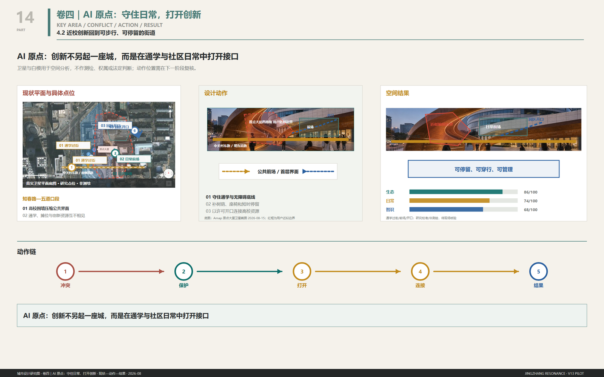
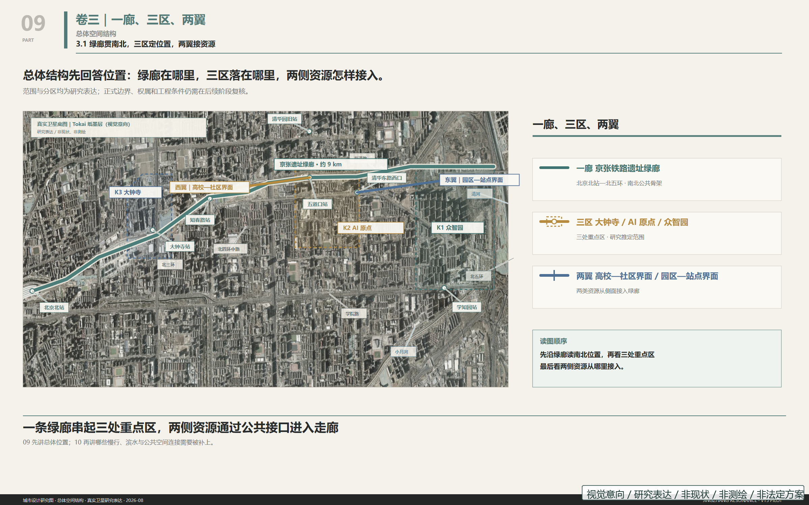
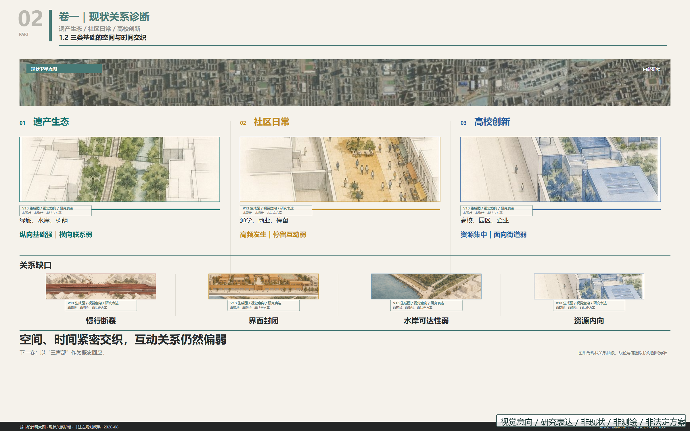
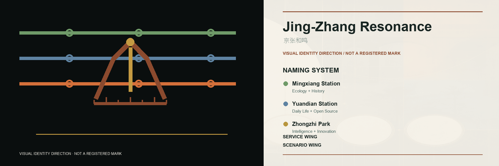
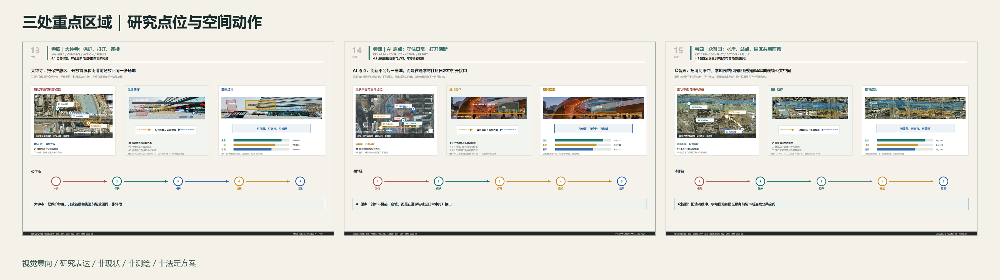
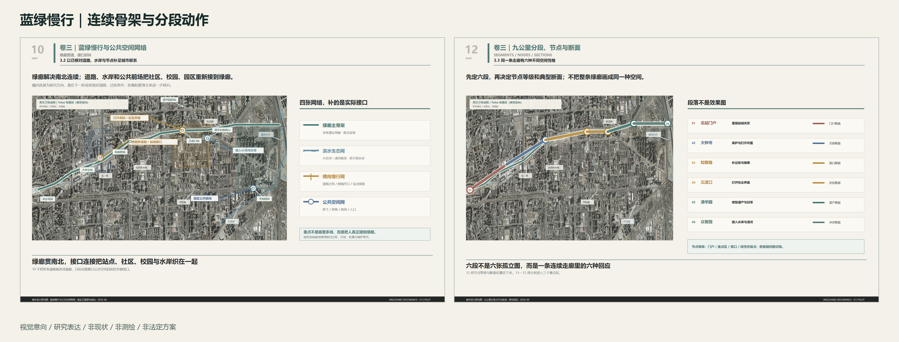
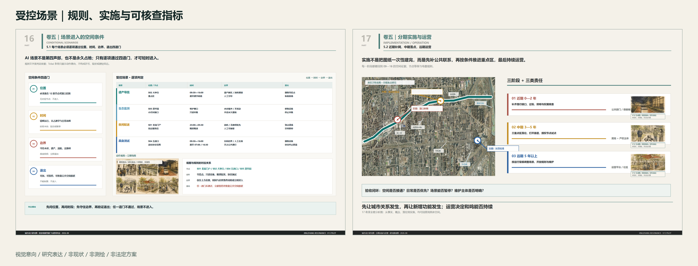

# Jing-Zhang Resonance

This is an open co-creation concept and research proposal. It is not a statutory plan, survey, engineering design, property determination, or government approval. Tokai, Oskyi, and GPT-image visuals communicate spatial actions and atmosphere only; they do not prove current conditions, location, scale, boundary, or buildability.

## Model and Collaboration Declaration

The workflow agents for this submission were `zcode`, `Codex`, and `Ima`. Concept generation was completed jointly by `Fable`, `DeepSeek`, `Kimi3`, `Hunyuan3`, and `OpusT5`. Detailed planning diagrams and design drawings were completed jointly by `Fable5` and `GPT-5.6`. This declaration describes collaboration roles and does not change the visual-intention, research-expression, or non-survey boundary of the figures.

## Design Basis and Source List

The proposal responds to the official open-call announcement, the agent taskbook, the repository design brief, allowed design space, source registry, and local standards index [source:OFFICIAL-ANNOUNCEMENT] [source:AGENT-TASKBOOK] [source:SITE-PACKAGE] [source:SOURCE-REGISTRY]. The official site redline and three exact key-area polygons are not yet available. The submitted boundary files remain provisional rough constraints and must not be treated as official redlines [source:BOUNDARY-SOURCE] [source:KEY-AREA-SOURCE].

## Submission Reading Path

| Task | Direct deliverables | Primary entry | Status boundary |
| --- | --- | --- | --- |
| agent.1 Overall concept | proposal, logo-direction, land-use-structure, A3/A0 | `proposal.md`, `assets/figures/`, `drawings/` | concept research / no statutory redline |
| agent.2 Innovation ecosystem | six-case table, ecosystem loop, three stations/two wings | proposal sections and `compliance_matrix.json` | mechanism proposal / no funding or enterprise commitment |
| agent.3 AI + scenarios | 14 cards, six personas, scenario-space-operation mapping | proposal scenario section and geometry layers | test proposal / no approved operation |
| agent.4 Public space and landmarks | N01-N03, key-area action diagrams, public-space rules | `assets/analysis-18/`, `assets/figures/key-areas.png` | research point map / no construction drawing |
| agent.5 Cultural narrative | Jing-Zhang, Zhongguancun, AI culture, and identity direction | proposal, logo, visual index | narrative system / source and rights boundaries remain active |
| agent.6 Long-term operation | phasing, annual rhythm, pause/exit/retest rules | proposal, `geometry/phasing.geojson`, matrices | operating proposal / no government or investment commitment |

The evidence system has three layers: nine GeoJSON files and metrics for machine review; the 21-page A3 booklet (including 18 V13 analysis pages), plus 3 A0 boards and five core figures for design communication; and lock, approval, evaluation, and source records for version control.

## Three-Level Scope Framework

The coordinated research area addresses the taskbook's approximately 43.6 square kilometres of innovation ecosystem and regional collaboration. The overall design area addresses approximately 11.4 square kilometres around the Jing-Zhang heritage park. The three key areas address approximately 368.4 hectares in total. These taskbook figures are not exact measurements of the provisional polygons [source:PROCESSED-FACT-PACK].

The ecological, everyday, and knowledge voices are independent and none is subordinate. Every action follows the weakest-link (wooden-bucket) principle: judge the weakest voice first. If any voice falls below its baseline, a pilot may neither enter nor expand; gains in the other two cannot compensate [depth:overall_spatial_structure] [depth:blue_green_public_space]. AI is not a fourth voice. It enters only within a publicly announced permission domain of space, time, weather, and responsibility. Three veto lines precede efficiency: never occupy tactile paving; never enter residential interiors; and stop mobile devices on campuses and school routes during 16:30-19:00. A triggered veto pauses operation immediately [standard:PROJECT-AGENT-OPEN-CALL-TASKBOOK].

## Coordinated Research Area: Industry and Future City Research

The proposed ecosystem loop is: publish a problem, run a controlled test, conduct human review, communicate results, support enterprise translation, and collect public feedback. Land, space, funding, talent, compute, data, and scenarios are interfaces for further negotiation rather than confirmed commitments.

Six international references provide transferable mechanisms without importing their scale, firms, or policy conditions: Kendall Square for short-distance university-lab-enterprise collaboration [source:CASE-KENDALL]; London's Knowledge Quarter for a network of research, culture, mobility, and public communication [source:CASE-KQ]; STATION F for legible shared startup services [source:CASE-STATIONF]; Vector Institute for research, talent, responsible AI, and enterprise application [source:CASE-VECTOR]; one-north for mixed research, work, living, and public space [source:CASE-ONENORTH]; and Pittsburgh Robotics Network for regional university, robotics, and manufacturing collaboration [source:CASE-PITTSBURGH].

### Naming system and logo direction

The master name remains "Jing-Zhang Resonance". From south to north the stations are Resonance Station, Origin Station, and Zhongzhi Park Station. The wings are named only Zhongguancun Technology Services Wing and Xiaoyue River Scenario Wing; no numbered stations or additional musical metaphor is added. The logo combines the railway's ren-shaped switchback, a bell pendulum, and track graduations. Three voice lines meet without merging. Rust red and sleeper grey are primary; blue and green are limited information accents. This direction still requires typeface, trademark, scaling, accessibility, and international-semantic review [source:AGENT-TASKBOOK].

## Overall Design Area: Urban Renewal and Regulatory-Plan-Level Urban Design

The research structure is one public-space spine, three innovation cores, two support wings, and twelve nodes. Renewal begins with reversible and low-conflict actions: clearing entrances, repairing walking continuity, adding accessible links, creating shaded pauses, using removable furniture, and coordinating wayfinding and opening hours. Building intensity, height, road redlines, tunnels, underground space, municipal systems, and fire requirements remain subject to official control plans and professional review [depth:overall_spatial_structure] [depth:development_intensity_controls].

The land-use, building, road, green-space, public-space, and phasing GeoJSON files satisfy the research and submission contract only. Passing machine checks does not indicate planning approval.

## Detailed Design of Key Areas

AI receives only time-limited, site-specific, and revocable permission to use public space.

The Dazhongsi area is proposed as an urban district for AI-native services and international exchange. Heritage quiet zones, open ground floors, station links, and four-quadrant walking connections must be relocated on verified building, station, property, and fire-safety boundaries. V13-13 is a research location diagram, not a measured node plan.

The Beijing AI Origin Community is proposed as a near-university district for open-source collaboration, translation, and talent life. School crossings, everyday forecourts, and park openings require verified road, campus, and property boundaries. V13-14 communicates relationships, not survey facts. N02 Origin Field is a concept-locked landmark sequence, with ownership, utilities, fire, and structural feasibility unresolved.

Zhongzhi Park is proposed as a garden district for full-stack innovation and governance communication. Qinghe buffers, station access, and shared forecourts require verified riverbank, road, and park boundaries. V13-15 is a research location diagram. N03 Zhongzhi Gate is locked only as an urban-design and landscape concept.

## AI Innovation Ecosystem, Personas, and AI+ Scenarios

Six personas are addressed: open-source developers, university students and faculty, startups, industry visitors, nearby residents, and operations and governance staff. Boundaries include no continuous personal tracking, separate permission for research/compute/data, cleared corporate cases, no commercial resident profiling, and minimum collection with auditable records.

### Fourteen test cards: thirteen main cards plus the T-04 campus test

Each entrance card answers eight questions: Where? What does AI do? What minimum must each voice preserve? Can people receive the same service without AI? How is success measured? Who governs? For how long? What happens when it stops? Every run also completes a record card with permitted period, weather, staff, anomalies, human takeover, reason for pause, and removal result. The bodies and periods below are suggestions, not permissions [source:AGENT-TASKBOOK] [data:geometry/public_space.geojson#PUBLIC-001] [data:geometry/roads.geojson#ROAD-001].

#### T-01 Green-Corridor Night Robot Delivery Corridor (controlled industry test)
- **Where:** Verified clear paved segments. **AI:** Night delivery, yielding to people. **Three voices:** Migration/flood limits; walking, tactile paving and 16:30-19:00 preserved; routes/anomalies recorded; no compensation. **Without AI:** Human delivery. **Measures:** Punctuality, yielding, unauthorized entry, shutdown. **Governance:** Corridor, traffic and ecology staff. **Duration:** Six months, quarterly review. **Stop:** Remove machine/docking, restore paving, archive.

#### T-02 Xiaoyue River Low-Altitude Drone Corridor (controlled industry test)
- **Where:** Approved river flights and launch points, never housing. **AI:** Weather- and time-permitted delivery. **Three voices:** Migration/flood/wind stop; quiet and waterfront use; trace flights. **Without AI:** Ground transport. **Measures:** Stop compliance, deviation, punctuality, noise complaints. **Governance:** Authority, site and weather staff. **Duration:** Twelve months or permit limit. **Stop:** Delist, remove equipment, restore roof, archive.

#### T-03 Underground-Car-Park Logistics Transfer Node
- **Where:** Fire- and ownership-verified underground areas. **AI:** Night sorting and handover. **Three voices:** Sealed traceable recycling; daytime parking/movement; error/handover records. **Without AI:** Existing stations/manual sorting. **Measures:** Errors, traceability, fire-lane occupation. **Governance:** Property, operator, fire reviewer. **Duration:** Twelve months. **Stop:** Remove docking/charging, restore parking, archive.

#### T-04 Embodied-AI Campus Test Loop (controlled industry test)
- **Where:** Contracted campus loops/closed segments, never building interiors. **AI:** Walking, avoidance, handover, emergency stops. **Three voices:** No permanent paving; school movement, tactile paving, quiet and 16:30-19:00 stop; reviewable tasks/results/failures. **Without AI:** Human campus services. **Measures:** Yielding, deviation, emergency response, takeover, consistency. **Governance:** University, operator, safety/local staff. **Duration:** Three months per campus, no automatic renewal. **Stop:** Emergency stop, human removal, restore campus, archive.

#### T-05 Xiaoyue River Zero-Intervention Ecological Monitoring
- **Where:** Water/ecology-approved river segments. **AI:** Observe/report only. **Three voices:** No water/bird disturbance; open waterfront; public definitions/missing data. **Without AI:** Sampling/patrols. **Measures:** Availability, timeliness, missing data, zero intervention. **Governance:** Water, ecology, public supervisors. **Duration:** Twelve months, quarterly review. **Stop:** Retrieve equipment, restore river, archive.

#### T-06 AI Cultural Guide for Railway Heritage
- **Where:** Approved heritage nodes. **AI:** Multilingual guidance separating verified history, oral accounts and inference. **Three voices:** No disruptive light/sound; no obstruction/forced scanning; sourced labelled inference. **Without AI:** Paper, signs, people. **Measures:** Traceability, correction, accuracy, human access. **Governance:** Heritage, park, archive. **Duration:** Twelve months, quarterly content review. **Stop:** Switch to people, remove terminals, repair, archive.

#### T-08 Human-Machine Handover Corridor
- **Where:** Corridor-housing edges, never compounds/homes. **AI:** Pickup, return, recycling inside docking lines. **Three voices:** Removable elements; preserve seats, shade, wheelchair/stroller places and tactile paving; record handovers/anomalies. **Without AI:** Stations, lockers, people. **Measures:** Waiting, yielding, tactile occupation, transfer time. **Governance:** Community, property, operator with a person present. **Duration:** Twelve months. **Stop:** Remove equipment, restore space, archive.

#### T-09 Walking-Pace Diversity Assessment
- **Where:** Announced sections with marked collection bounds. **AI:** Count rhythms without identity. **Three voices:** No bright lighting; mobility diversity/accessibility; public scope, definitions and error. **Without AI:** Manual samples/patrols. **Measures:** Accuracy, false positives, older-person baseline, scope breaches. **Governance:** Community, independent evaluators. **Duration:** Six-month baseline, quarterly review. **Stop:** Remove devices and retest everyday life in the same place at a comparable time.

#### T-10 Tiered Public-Safety Response Review (controlled industry test)
- **Where:** Station squares/corridor nodes, heritage only when approved. **AI:** Flag risk, never decide intervention. **Three voices:** No wider sensing; no closure of ordinary use; publish false positives, misses and rules. **Without AI:** Patrol/emergency staff. **Measures:** False/miss rates, review time, unauthorized action. **Governance:** Safety, emergency, heritage staff. **Duration:** Six months, quarterly review. **Stop:** Offline, human patrol, remove display, archive.

#### T-11 Three-Voice Strength Dashboard
- **Where:** One existing notice interface per station. **AI:** Display three statuses separately from card records. **Three voices:** No averaging/hiding weakness; no glare/obstruction; common record source. **Without AI:** Paper/community review. **Measures:** Definitions, timeliness, consistency, readability. **Governance:** Independent evaluator, community, operators. **Duration:** Concurrent, quarterly decision. **Stop:** Paper notices, restore interface.

#### T-13 Older-Person Neighbourhood Watch Network
- **Where:** Corridor-community edges, never homes. **AI:** Consent-based visit record and volunteer reminder. **Three voices:** No continuous light; voluntary/revocable/no direct police alert; community-only non-commercial records. **Without AI:** Neighbour, committee, phone contact; people visit. **Measures:** Consent, response, false reminders, withdrawal. **Governance:** Volunteers/subdistrict. **Duration:** Six months, monthly consent review. **Stop:** End records, delete unnecessary data, remove button, restore place.

#### T-19 Public Compute Access Station
- **Where:** Existing open places without taking movement, seating or accessibility. **AI:** Logged public inference/tests; results belong to users. **Three voices:** No new building; preserve seats, shade, ordinary power; fair access. **Without AI:** Study, power, network, human advice. **Measures:** User mix, utilization, queue, ownership clarity. **Governance:** Service operator/park with human desk. **Duration:** Twelve months, monthly disclosure. **Stop:** Disconnect equipment, restore use, archive.

#### T-20 AI Pilgrimage Landmarks (three locations)
- **Where:** Reviewed notice interfaces at three stations. **AI:** Show milestones, status and human-confirmed records including failures. **Three voices:** No glare/noise; walkable/sittable squares; accurate sourced records beyond success. **Without AI:** Inscriptions, boards, people. **Measures:** Accuracy, correction, reading, accessibility. **Governance:** Operators, archivists, community. **Duration:** Concurrent, annual review. **Stop:** Retain approved static record, remove equipment, restore use.

#### T-21 Wudaokou Market AI Assistant
- **Where:** Existing notice positions approved by stallholders/manager. **AI:** Publish voluntary stall goods/arrival times without changing trade. **Three voices:** No standalone facility; preserve asking, bargaining and familiar trade; stallholder/public information, no profiling. **Without AI:** Ask, call, buy normally. **Measures:** Participation, accuracy, correction, actual use. **Governance:** Manager, stallholders, community with human enquiry. **Duration:** Six months, quarterly review. **Stop:** End publication, remove screen/sign, restore market, archive.

All fourteen cards share one rule. If a veto line is triggered or any voice falls below its baseline, pause first and investigate; no other indicator compensates. After stopping, retest ecology, everyday life, and knowledge separately in the same space, at a comparable time, on the same task. If any voice has not recovered to its comparable pre-stop level, no restart application may be made. Publish the retest beside the original record card [depth:scenario_space_operation_mapping].

## Land Use, Building Scale, and Retain-Renovate-Demolish Strategy

The current phase does not propose statutory land-use change, floor-area ratio, building height, or parcel-specific demolition. Research objects are classified only as retain-first, adaptive-renewal candidate, or pending verification. Heritage, mature trees, continuous public access, and water safety are priority constraints. Open ground floors, temporary exhibitions, removable furniture, and mixed use are low-disturbance tools rather than approvals.

All node structures require survey, structural, wind, fire, accessibility, utility, drainage, maintenance, material, and lifecycle review. Generated massing and material images do not prove feasibility.

## Transport, Rail, Municipal Infrastructure, and Public Services

Walking, cycling, accessibility, and station interchange come before technology testing. A discontinuity register should guide professional work at station exits, intersections, campus boundaries, park openings, and river interfaces. Locked concepts such as N06 Stitch Street still retain unknowns concerning public access, campus operations, water links, trees, utilities, and dimensions.

New infrastructure follows three rules: removable, inspectable, and outside the clear route. Continuous facial recognition is excluded. Energy, communications, lighting, drainage, and charging systems require utility and maintenance confirmation. This proposal makes no engineering claim for bridges, tunnels, underground space, road redlines, or rail alignments [depth:traffic_rail_slow_parking] [depth:municipal_new_infrastructure].

## Blue-Green Network, Public Space, and Urban Character

The Jing-Zhang heritage park, Xiaoyue River, Qinghe River, and existing tree canopy form the public ecological skeleton. Actions are ordered as: preserve continuity, repair gaps, add places to pause, and control disturbance. Public-space character uses low-saturation materials, clear ink-like lines, limited green-blue-orange identity colours, and restrained night lighting.

Tokai watercolour communicates spatial actions; satellite imagery, roads, and river lines carry research evidence. Every generated visual is marked as visual intent, research expression, non-existing, non-survey, and non-statutory.

## Renewal Projects, Implementation Policy, and Phasing

The project pool includes continuous walking and wayfinding, verified key-area calibration, N01-N12 node review, accessibility gap repair, Xiaoyue/Qinghe interface surveys, an open-scenario governance sandbox, and an annual contribution and honour system. It is an index for further work, not a government investment list.

Phasing follows dependencies rather than fixed years. Phase 1 obtains official data, survey, property, site, and safety confirmation. Phase 2 implements low-disturbance wayfinding, furniture, and opening-hour pilots. Phase 3 runs controlled tests only after ethics, privacy, traffic, and operations review. Phase 4 expands, adjusts, or exits according to public evaluation [data:geometry/phasing.geojson#PHASE-001].

The suggested annual rhythm is spring open-source co-creation, summer urban scenario tests, an autumn global AI week, and a winter governance and public-value review. Scale, government support, and attraction results remain unconfirmed.

## Metrics, Area Recalculation, and Compliance Matrix

Indicators cover spatial continuity, ecological public value, innovation operations, and governance credibility. Values in `metrics.json` are calculated from provisional geometry and cannot replace taskbook scope figures or statutory indicators [metric:site_area_sqm] [metric:green_ratio] [metric:public_space_ratio] [metric:key_area_count].

The compliance matrix maps announcement requirements and agent.1-agent.6. The standards matrix records local references. The design-depth matrix records professional evidence and external dependencies. Validation confirms file and reference contracts only.

## Risk, Copyright, and Compliance

Open gaps include the final GitHub identity and contributor names; official redlines and key-area polygons; survey, property, control-plan, water, road, and engineering conditions; redistribution rights for some basemaps and references; and complete per-image generation provenance. These gaps must not be filled by inference.

V13-13 to V13-15 are research location diagrams. N04 Langxingdao failed site-relationship verification. Superseded assumed sections and fictional present-day imagery must not be used as factual evidence. The full node archive retains locked, unlocked, rejected, and historical versions with an explicit status register.

## References

Evidence carried over from the corresponding Chinese sections: existing conditions [data:geometry/buildings.geojson#BLDG-001] [data:geometry/constraints.geojson#CONSTRAINT-001] [data:geometry/green_space.geojson#GREEN-001] [data:geometry/land_use.geojson#LU-001] [depth:existing_conditions_diagnosis]; provisional boundaries and key areas [data:geometry/site_boundary.geojson#SITE-001] [data:geometry/key_areas.geojson#PROV-KEY-001] [depth:three_key_area_detailed_design]; professional scope and built form [depth:three_level_scope_framework] [depth:land_use_layout] [depth:height_massing_character] [depth:retain_renovate_demolish] [metric:building_footprint_area_sqm] [standard:MNR-LAND-USE-CLASSIFICATION-GUIDE] [standard:MOHURD-URBAN-DESIGN-MEASURES] [standard:MOHURD-CONTROL-DETAILED-PLANNING] [standard:MOHURD-ARCH-DESIGN-DEPTH-2016] [standard:PROJECT-OFFICIAL-ANNOUNCEMENT]; delivery, recalculation, and risk [depth:renewal_project_list] [depth:phasing_implementation] [depth:metrics_recalculation] [depth:risk_missing_data] [source:V13-ANALYSIS] [source:NODE-ARCHIVE].

- Official announcement and agent taskbook [source:OFFICIAL-ANNOUNCEMENT] [source:AGENT-TASKBOOK].
- Site package, source registry, and processed fact pack [source:SITE-PACKAGE] [source:SOURCE-REGISTRY] [source:PROCESSED-FACT-PACK].
- Provisional boundary declarations [source:BOUNDARY-SOURCE] [source:KEY-AREA-SOURCE].
- Six international reference operators [source:CASE-KENDALL] [source:CASE-KQ] [source:CASE-STATIONF] [source:CASE-VECTOR] [source:CASE-ONENORTH] [source:CASE-PITTSBURGH].
- Copyright statement, assumptions, sources, three matrices, nine GeoJSON layers, A3/A0 drawings, and the full artifact status register in this package [source:PACKAGE-MANIFEST].
