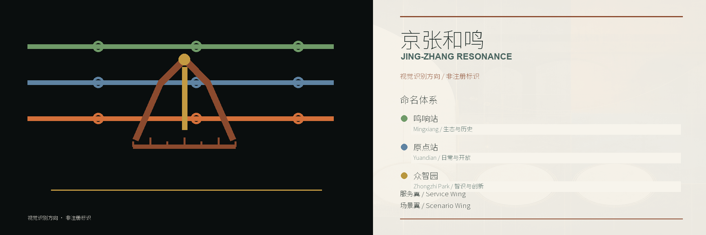

# 京张和鸣｜百年京张AI创新带公共空间复调方案

本成果是开放共创的城市设计研究与概念建议，不替代法定规划、测绘、工程设计、权属核验或政府审定。图中 Tokai/Oskyi/GPT-image 等生成内容均为视觉意向；研究点位、临时边界和比例估算不得作为施工放线、审批或现状证明。

## 模型与协作声明

本次提交的工作流协作 agent 为 `zcode`、`Codex`、`Ima`；概念生成由 `Fable`、`DeepSeek`、`Kimi3`、`Hunyuan3`、`OpusT5` 共同完成；详细规划图与设计图由 `Fable5`、`GPT-5.6` 共同完成。上述声明描述协作分工，不改变图件的视觉意向、研究表达和非测绘边界。

## 设计依据与资料清单

方案以《百年京张AI创新带城市设计国际方案征集资格预审公告》、面向全球智能体开源征集任务书摘录、仓库 `design_brief.json`、`allowed_design_space.json`、资料登记表和本地标准索引为主要依据 [source:OFFICIAL-ANNOUNCEMENT] [source:AGENT-TASKBOOK] [source:SITE-PACKAGE]。上述文件分别对应征集公告、智能体任务书与站点资料包 [source:SOURCE-REGISTRY] [standard:PROJECT-OFFICIAL-ANNOUNCEMENT] [standard:PROJECT-AGENT-OPEN-CALL-TASKBOOK]。

当前官方精确红线和三处重点区 polygon 尚未取得。`geometry/site_boundary.geojson` 与 `geometry/key_areas.geojson` 使用仓库提供的临时粗略边界，仅承担生成、自检和讨论入口，属性保持 `geometry_role=provisional_constraint`、`official_boundary=false`、`boundary_precision=provisional_rough` [source:BOUNDARY-SOURCE] [source:KEY-AREA-SOURCE] [data:geometry/site_boundary.geojson#SITE-001]。官方数据补齐后，全部用地、道路、建筑、绿地、公共空间、分期和指标必须统一复算。

## 提交阅读路径

| 任务 | 直接成果 | 主要入口 | 状态边界 |
| --- | --- | --- | --- |
| agent.1 总体概念 | proposal、logo-direction、land-use-structure、A3/A0 | `proposal.md`、`assets/figures/`、`drawings/` | 概念研究 / 无法定红线 |
| agent.2 创新生态 | 六案例表、生态回路、三站两翼 | proposal 章节、`compliance_matrix.json` | 机制提案 / 无资金或企业承诺 |
| agent.3 AI+场景 | 14 张卡、六类人群、场景-空间-运营映射 | proposal 场景章节、geometry 图层 | 测试提案 / 无已批准运营 |
| agent.4 公共空间与地标 | N01-N03、重点区行动图、公共空间规则 | `assets/analysis-18/`、`assets/figures/key-areas.png` | 研究点位图 / 非施工图 |
| agent.5 文化叙事 | 京张、中关村、AI 文化与身份方向 | proposal、logo、视觉索引 | 叙事系统 / 来源与权利边界仍有效 |
| agent.6 长期运营 | 分期、年度节奏、暂停/退出/复测规则 | proposal、`geometry/phasing.geojson`、矩阵 | 运营提案 / 无政府或投资承诺 |

本次提交的空间证据分为三层：9 个 GeoJSON 与 `metrics.json` 是机器可读研究层；21 页 A3 文册（含 18 页 V13 分析图）、3 张 A0 展板和五张核心图是设计表达层；节点附件中的 lock、approval、evaluation 和 source record 是版本与边界层。生成图不能替代地理线位、现场照片和测绘边界。

现状诊断的可核查入口包括建筑、约束、绿地、用地、道路和公共空间图层 [data:geometry/buildings.geojson#BLDG-001] [data:geometry/constraints.geojson#CONSTRAINT-001] [data:geometry/green_space.geojson#GREEN-001]，以及用地图层与现状诊断深度 [data:geometry/land_use.geojson#LU-001] [depth:existing_conditions_diagnosis]。这些图层的完整性不消除现状测绘、权属和官方控规缺口。

## 三层范围工作框架

统筹研究范围约 43.6 平方公里，关注 AI 产业生态、区域协同和未来城市机制；总体设计范围约 11.4 平方公里，关注京张遗址公园周边 1-2 公里城市更新、产业空间、公共空间和交通市政；三处重点区域合计约 368.4 公顷，回应众智园、北京 AI 原点社区和大钟寺片区的详细设计任务。以上数字来自任务书范围描述，不等同于当前 provisional polygon 的精确测算 [source:PROCESSED-FACT-PACK]。

### 总体概念: 三种声音同时在场

“京张和鸣”不是把不同地方涂成三种颜色, 也不是在一条走廊上再造三条轨道。它是一条城市设计判断: 生态声部保住河流、树木、遗址与安静; 日常声部保住通行、停留、买菜、放学与邻里生活; 智识声部容纳研究、试验、发布与协作。三者互不从属, 各自发出声音; 和鸣也不是让所有声音变成同一个声音。

所有空间动作按木桶原则判断: 先看三个声部中最弱的一项。任何一项低于现状底线, 试点不得进入或扩大; 另外两项的改善不能抵偿这一项的损失。颜色只用于读图, 不能代替对路、墙、门、广场、水岸和人的逐点判断 [depth:overall_spatial_structure] [depth:blue_green_public_space]。

AI不是第四个声部, 也不是一条永久占用城市的轨道。它只在公告写明的空间、时段、天气和责任许可域内进入; 时段结束即停止, 可撤设施退场, 场地恢复常规公共使用。三条否决线先于一切效率指标: 机器不得占用盲道; 服务不得以任何方式进入住宅入户空间; 涉及校园及通学路径的移动设备在 16:30-19:00 放学窗口停运。任一否决线触发, 当场暂停, 不进入补偿计算 [standard:PROJECT-AGENT-OPEN-CALL-TASKBOOK]。

方案以“京张和鸣 / Jing-Zhang Resonance”为总名, 将 AI 全栈自主创新、世界级 AI 创新生态、AI+ 场景、智能化活力城市和 AI 治理要求组织为空间与运营系统。三站两翼承担不同任务但不彼此割裂: 众智园承接全栈验证与治理, 原点站承接近校开源与转化, 鸣响站承接智能原生业态与公共发布, 中关村科技服务翼连接专业服务, 小月河场景翼提供受控的公共空间检验环境。

## 统筹研究范围产业与未来城市研究

### 创新生态回路

建议建立“问题发布 - 受控测试 - 人工复核 - 公开展示 - 企业转化 - 公共反馈”的六步回路。土地、空间、资金、人才、算力、数据与场景不被写成既有承诺，而作为可供政府、园区、高校、企业和社区共同深化的接口: 众智园承接测试与治理, 原点站承接开源协作和成果转化, 鸣响站承接产品体验与国际路演; 中关村科技服务翼和小月河场景翼把专业服务、受控检验与公共生活接回日常城市。

### 六个全球案例及可转译机制

1. 美国 Kendall Square：借鉴高校、实验室、企业与街区公共空间的短距离协同，不复制企业名单或开发强度 [source:CASE-KENDALL]。
2. 英国 Knowledge Quarter：借鉴文化、科研、交通枢纽与公共传播共同形成知识网络 [source:CASE-KQ]。
3. 法国 STATION F：借鉴集中式创业支持、社群活动与共享服务的清晰运营界面 [source:CASE-STATIONF]。
4. 加拿大 Vector Institute / MaRS：借鉴研究、人才培养、企业应用和负责任 AI 的协作机制 [source:CASE-VECTOR]。
5. 新加坡 one-north：借鉴研发、居住、公共空间和生活服务混合组织的园区方法 [source:CASE-ONENORTH]。
6. 美国 Pittsburgh Robotics Network：借鉴高校、机器人企业、制造资源和城市测试场景的区域协作 [source:CASE-PITTSBURGH]。

这些案例只提供机制参照，不证明京张片区已经具备同等机构、资金或政策。区域协同建议通过公开课题、跨园区场景清单、开发者互认、成果巡展和安全评测接口，连接北纬社区、未来科学城、怀柔科学城、经开区与京津冀创新网络。

### 命名体系与Logo方向

总名保持“京张和鸣 / The Jingzhang Resonance”。三站按走廊由南向北依次为鸣响站、原点站、众智园: 鸣响站对应大钟寺片区的钟声、发布与公共检验; 原点站对应近校协作、日常生活与成果转化; 众智园对应全栈测试、治理记录与北端门户。两翼只使用中关村科技服务翼和小月河场景翼, 前者连接专业服务, 后者承接受控的滨水场景。命名不再叠加“零号”“一号”或新的音乐隐喻。

Logo 以京张铁路“人”字形展线、钟摆和轨道刻度为母题, 三条声部线保持各自可辨, 在同一标志中相遇但不合并。色彩用于识别而非功能分区: 以铁锈红和轨枕灰为主体, 蓝、绿只作小面积信息提示, 避免把构件与材质做成多色拼贴。当前图为方向稿, 正式使用前仍需完成字体、商标、缩放、无障碍对比度和国际语义审查 [source:AGENT-TASKBOOK]。

## 总体设计范围城市更新与控规深度城市设计

总体空间结构概括为“一脊、三站、两翼、十二节点”: 京张遗址公园构成连续公共空间脊; 鸣响站、原点站、众智园形成由南向北的三站; 中关村科技服务翼和小月河场景翼联系东西两侧; N01-N12 以到达、连接、停留、学习、试验和纪念等不同角色形成可步行节点序列。它是研究结构, 不新增法定红线。

城市更新优先从低争议、可逆、小尺度动作启动：入口清理、慢行连贯、无障碍补点、树下停留、可撤设施、导视和开放时段协同。涉及拆改留、建筑强度、高度、道路红线、桥隧、地下空间、市政管线和消防的事项一律留待官方控规、权属、测绘与专业论证 [depth:overall_spatial_structure] [depth:development_intensity_controls]。

研究深度按城市设计、控规与建筑设计深度相关公开标准组织 [standard:MOHURD-URBAN-DESIGN-MEASURES] [standard:MOHURD-CONTROL-DETAILED-PLANNING] [standard:MOHURD-ARCH-DESIGN-DEPTH-2016]，并落在三层范围与用地布局两个深度项上 [depth:three_level_scope_framework] [depth:land_use_layout]；缺少官方资料的项目明确保留 `data_gap`。

`geometry/land_use.geojson`、`buildings.geojson`、`roads.geojson`、`green_space.geojson`、`public_space.geojson` 和 `phasing.geojson` 只提供 formal 合同所需的研究图层；不得以图层闭合或校验通过推导其已获审批。

## 重点区域详细设计

AI 只取得限时、限地、可撤销的使用许可。

### 大钟寺 AI 产业集聚区

概念定位为“城市型智能原生业态与国际交往前场”。保护静区、开放首层、站前连接和四象限步行关系应在正式建筑边界、站点出入口、产权和消防资料补齐后重新落位。V13-13 目前是研究点位图，不能作为节点平面设计或施工定位。N01 钟鸣路可作为“日常城市界面 + 2045 同机位演进”的公共空间原型。

### 北京 AI 原点社区

概念定位为“近校开源协作、成果转化与人才生活社区”。通学过街、日常前场和园区开口需要以真实道路、校园与园区边界校准。V13-14 表达动作关系而非测绘结论。N02 原点场以到达、阅读、停留、抬头和留下记忆的序列承担算法里程碑叙事；其用户批准只锁定概念范围，权属、消防、管线和结构仍待核验。

### 众智园 AI 自主创新加速区

概念定位为“花园型全栈自主创新与治理展示街区”。清河缓冲、站点接驳和共用前场应在真实水岸、道路和园区边界上复核。V13-15 是研究点位图。N03 众智门以公共缝隙、知识记录和问责界面构成治理地标，锁定范围为城市设计与景观概念，不代表结构或低空设施批准。

三处重点区的后续共同步骤是：导入官方 polygon 和 CAD/GIS；校准建筑、道路、水岸、出入口与树木；在真实边界上落位保护、开放、连接、缓冲和前场动作；再由专业团队复算面积与工程条件 [data:geometry/key_areas.geojson#PROV-KEY-001] [depth:three_key_area_detailed_design]。

## AI 创新生态、人才画像与 AI+ 场景

### 六类用户画像

| 用户 | 核心需求 | 空间与运营响应 | 数据边界 |
| --- | --- | --- | --- |
| 开源开发者 | 协作、发布、贡献声誉 | 原点社区发布厅、夜间协作点 | 不采集个人连续轨迹 |
| 高校师生 | 成果转化、跨校交流 | 校园-园区慢行缝合、转化驿站 | 科研成果须授权 |
| 初创团队 | 低成本试验、合规与算力入口 | 众智园共享测试与治理咨询 | 算力和数据另行授权 |
| 产业访客 | 展示、商务、招聘与国际接待 | 大钟寺路演客厅、站点接驳 | 企业标识和案例须清权 |
| 周边居民 | 通勤、休闲、社区服务 | 连续慢行、树下停留、活动分级 | 不用于商业画像 |
| 运维与治理人员 | 维护、风险复核、退出机制 | 人工复核台、事件记录与关闭权 | 最小化采集、留痕审计 |

### 十四张考验卡: 主稿十三张加T-04校园测试

叙事中称“考验”, 管理文件与记录中称“检验”。每张卡都是一份贴在场景入口的城市准入单, 必须回答八问: 在哪一段; AI做什么; 三声部最低保住什么; 人不用AI能否办同样的事; 怎么算好; 谁来管; 管多久; 停了怎么办。每次运行另填记录卡, 写明许可时段、天气、值班人、异常、人工接管、暂停原因和撤场结果。下列主体与期限均为试点建议, 不代表已获许可 [source:AGENT-TASKBOOK] [data:geometry/public_space.geojson#PUBLIC-001] [data:geometry/roads.geojson#ROAD-001]。

#### T-01 绿廊夜间机器人配送走廊 (产业测试验证)

- **在哪一段:** 绿廊内经现场核实、净宽满足通行且不占盲道的铺装段。
- **AI做什么:** 在公告许可的夜间时段配送, 遇人停车让行。
- **三声部最低保住什么:** 生态声部在候鸟期降速、汛期停运; 日常声部保住连续步行、盲道和 16:30-19:00 放学窗口; 智识声部要求路线与异常进入检验记录。三项不可互偿。
- **人不用AI能否办同样的事:** 人工配送和既有驿站照常服务。
- **怎么算好:** 准点率、让行合规率、误入非许可段次数、停运执行率。
- **谁来管:** 建议由绿廊运营方、交通管理人员和生态值班人员共同值守。
- **管多久:** 首轮 6 个月, 按季度公开评议。
- **停了怎么办:** 立即停机并移出步道; 试点结束拆除停靠设施, 恢复铺装, 记录归档。

#### T-02 小月河低空无人机廊道 (产业测试验证)

- **在哪一段:** 小月河上方经低空审批的限定航段及三站经核准的起降点, 不越居住区上空。
- **AI做什么:** 在许可天气和时段内完成沿河低空配送与起降。
- **三声部最低保住什么:** 生态声部要求候鸟期、汛期和大风天气禁飞; 日常声部保住住宅安静与岸线使用; 智识声部要求每次起降可追溯。任一项不满足即停飞。
- **人不用AI能否办同样的事:** 快件继续走地面人工运输。
- **怎么算好:** 停航合规率、航线偏离次数、准点率和声学投诉数。
- **谁来管:** 建议由低空审批部门、属地起降点管理方和气象值班人员共同管理。
- **管多久:** 首轮 12 个月, 以实际许可期限为上限。
- **停了怎么办:** 航线下架, 可拆起降设施撤场, 屋顶恢复原用途, 记录归档。

#### T-03 地下停车场物流中转节点

- **在哪一段:** 三站中经消防和权属核查可用的地下停车场区域。
- **AI做什么:** 夜间完成配送分拣、回收分拣及与绿廊机器人的交接。
- **三声部最低保住什么:** 生态声部要求回收物密闭并去向可查; 日常声部不减少白天停车和通行; 智识声部保留分拣差错与交接记录。
- **人不用AI能否办同样的事:** 既有快递驿站、人工分拣和上门回收继续运行。
- **怎么算好:** 分拣差错率、回收去向可查率、消防通道占用次数。
- **谁来管:** 建议由物业、试点运营方和消防核查单位共同管理。
- **管多久:** 首轮 12 个月。
- **停了怎么办:** 撤去停靠线和充电设施, 恢复普通车位, 记录归档。

#### T-04 具身智能校园测试环路 (产业测试验证)

- **在哪一段:** 众智园附近与高校逐一签订协议后的校内环路或封闭测试段, 不进入宿舍及教学楼内部。
- **AI做什么:** 在限定路线完成行走、避障、交接和应急停机检验, 高校按学科提出任务。
- **三声部最低保住什么:** 生态声部不增设永久硬化场地; 日常声部保住通学、盲道和安静, 16:30-19:00 放学窗口停运; 智识声部要求题目、结果与失败记录可复核。任一项被压低不得扩圈。
- **人不用AI能否办同样的事:** 教学、保洁、配送和校园服务均保留人工路径。
- **怎么算好:** 让行合规率、路线偏离次数、急停响应、人工接管时长和任务完成一致性。
- **谁来管:** 建议由签约高校、试点运营方、安全员和属地管理人员共同值守。
- **管多久:** 每所校园首轮 3 个月, 逐校评议, 不跨校自动续期。
- **停了怎么办:** 当场急停并由人工拖离; 标记和临时设施撤除, 校园恢复常规使用, 记录归档。

#### T-05 小月河零干预生态监测

- **在哪一段:** 小月河经水务和生态核查允许布设的河段。
- **AI做什么:** 只观察和报告水体与环境状态, 不直接采取处置动作。
- **三声部最低保住什么:** 生态声部要求设备不扰水体和鸟类; 日常声部要求岸线照常开放; 智识声部要求数据口径和缺测情况公开。
- **人不用AI能否办同样的事:** 人工采样、巡河和值守照常进行。
- **怎么算好:** 设备完好率、数据公开及时率、缺测率和零干预合规率。
- **谁来管:** 建议由水务、生态管理人员和公开监督代表共同管理。
- **管多久:** 首轮 12 个月, 每季度复核是否越界。
- **停了怎么办:** 打捞并回收设备, 河道恢复原状, 记录归档。

#### T-06 铁路遗址AI文化导览

- **在哪一段:** 绿廊主要历史节点及大钟寺片区经文保和运营单位同意的安装点。
- **AI做什么:** 提供多语导览, 将核实史实、社区口述和AI推断分层标注。
- **三声部最低保住什么:** 生态声部不以照明和扩声扰动环境; 日常声部不挡路、不强制扫码; 智识声部要求来源可查、推断明确标注。
- **人不用AI能否办同样的事:** 保留纸质导览、现场标牌和人工讲解。
- **怎么算好:** 来源可查率、内容纠错时长、指引准确率和人工服务可达性。
- **谁来管:** 建议由文保单位、公园运营方和社区口述档案管理人员共同复核。
- **管多久:** 首轮 12 个月, 内容按季度复核。
- **停了怎么办:** 暂停内容发布并转人工讲解; 退出时移走终端, 修复安装面, 记录归档。

#### T-08 人机交接廊

- **在哪一段:** 绿廊与主要居住区的边缘接驳点, 不进入小区、不入户。
- **AI做什么:** 在限定停靠线内完成人机取件、还物和回收交接。
- **三声部最低保住什么:** 生态声部使用可撤构件; 日常声部保住座椅、遮荫、轮椅位、婴儿车位和盲道; 智识声部要求交接与异常有记录。
- **人不用AI能否办同样的事:** 驿站、快递柜和人工服务照常使用。
- **怎么算好:** 等候时长、让行合规率、盲道占用次数和人工转接时长。
- **谁来管:** 建议由社区、物业和试点运营方共同管理, 现场可找到真人。
- **管多久:** 首轮 12 个月。
- **停了怎么办:** 机器退场, 可拆构件移走, 场地恢复普通接驳空间, 记录归档。

#### T-09 步行节奏多样性评估

- **在哪一段:** 绿廊内经公示的代表性步行断面, 覆盖边界在现场标明。
- **AI做什么:** 只统计步行、慢跑、推婴儿车和骑行等节奏, 不识别人脸和身份。
- **三声部最低保住什么:** 生态声部不新增高亮照明; 日常声部以慢行多样性和无障碍连续为底线; 智识声部公开采集范围、指标口径与误差。
- **人不用AI能否办同样的事:** 人工抽样、居民观察和无障碍巡查继续进行。
- **怎么算好:** 分类准确率、误报率、老年步行基准变化和覆盖越界次数。
- **谁来管:** 建议由社区和独立评估人员共同管理。
- **管多久:** 首轮 6 个月建立基准, 此后按季度复核。
- **停了怎么办:** 设备拆除, 评估恢复人工; 同空间可比时段复测日常声部。

#### T-10 公共安全分级响应复核 (产业测试验证)

- **在哪一段:** 三站公共广场和绿廊主要节点; 文保周边仅在核准范围内设置人工复核席。
- **AI做什么:** 只提交人流、湿滑等风险标注, 不直接作出处置动作。
- **三声部最低保住什么:** 生态声部不扩大感知范围; 日常声部不以安全名义封闭正常使用; 智识声部公开误报、漏报和分级规则。任一项触线即暂停。
- **人不用AI能否办同样的事:** 保安巡查、现场广播和应急人员继续在岗。
- **怎么算好:** 误报率、漏报率、人工复核时长和越权处置次数。
- **谁来管:** 建议由属地安全管理人员、应急复核人员和文保专项人员共同管理。
- **管多久:** 首轮 6 个月, 每季度复查。
- **停了怎么办:** 标注系统下线, 人工巡查接管, 临时显示设施撤场, 记录归档。

#### T-11 三声部强弱仪表盘

- **在哪一段:** 鸣响站、原点站、众智园各一处既有公告界面。
- **AI做什么:** 汇总各考验卡记录, 分别显示生态、日常、智识三项状态。
- **三声部最低保住什么:** 三项分别显示, 不求平均、不以强项遮住弱项; 公示面防眩光、不挡路; 数据与记录卡同源。
- **人不用AI能否办同样的事:** 纸质公告、政务公示和社区评议照常进行。
- **怎么算好:** 指标口径公开率、更新及时率、记录一致性和居民可读性。
- **谁来管:** 建议由独立评估人员、社区代表和三站运营方共同维护。
- **管多久:** 与各试点同期, 每季度决定继续、调整或暂停。
- **停了怎么办:** 停止电子更新并改用纸质公示; 设备退出时恢复原公告界面。

#### T-13 老年守望网络

- **在哪一段:** 绿廊与社区的边缘接驳点, 不进入居住区、不入户。
- **AI做什么:** 仅在本人自愿前提下记录到访, 长时间未到时提醒社区志愿者。
- **三声部最低保住什么:** 生态声部不增加持续照明; 日常声部保证自愿、可退且不直接报警; 智识声部保证记录留在社区, 不进入商业系统。
- **人不用AI能否办同样的事:** 邻里照看、居委会走访和电话联系照常进行, 上门的是人。
- **怎么算好:** 自愿参与率、志愿者响应时长、误提醒次数和退出完成率。
- **谁来管:** 建议由社区志愿者和街道工作人员共同管理。
- **管多久:** 首轮 6 个月, 每月由参与者复核授权。
- **停了怎么办:** 立即停止记录和提醒, 删除非必要数据, 拆除按钮, 接驳处恢复原状。

#### T-19 公共算力接入站

- **在哪一段:** 众智园和原点站内不挤占通行、座椅和无障碍空间的既有开放场所。
- **AI做什么:** 提供模型推理和试验的公共接入服务, 过程留痕, 结果归使用者。
- **三声部最低保住什么:** 生态声部不新增独立建筑; 日常声部保住座位、遮荫和普通用电; 智识声部向开发者、学生和小团队公平开放。
- **人不用AI能否办同样的事:** 普通自习、用电、网络和人工咨询照常提供。
- **怎么算好:** 使用者结构、机时利用率、排队时长和结果归属明确率。
- **谁来管:** 建议由算力服务运营方和园区共同管理, 保留人工咨询席。
- **管多久:** 首轮 12 个月, 每月公开使用结构。
- **停了怎么办:** 停止接入, 断开专用设备, 桌椅恢复普通公共使用, 记录归档。

#### T-20 AI朝圣地标 (三处)

- **在哪一段:** 鸣响站、原点站、众智园经权属、文保和公共空间审查后的既有或拟建公告界面。
- **AI做什么:** 展示里程碑、运行状态和经人工确认的检验记录, 失败与修正同样保留。
- **三声部最低保住什么:** 生态声部不增加高亮和噪声; 日常声部保住广场可走、可坐; 智识声部要求记录准确、来源可查且不得只报成绩。
- **人不用AI能否办同样的事:** 石刻、展板和人工讲解可以独立传达内容。
- **怎么算好:** 记录准确率、纠错时长、公众阅读率和无障碍可达性。
- **谁来管:** 建议由三站运营方、档案管理人员和社区代表共同复核。
- **管多久:** 与公共空间运营同期, 每年复核展示内容。
- **停了怎么办:** 停止动态显示, 保留经审核的静态城市记录; 可撤设备退出, 场地恢复常规使用。

#### T-21 五道口菜市场AI助手

- **在哪一段:** 五道口及周边传统市场经摊主和市场管理方同意的现有公告位置。
- **AI做什么:** 只发布自愿接入摊位的货品和到货时间, 不改变摊位格局和交易方式。
- **三声部最低保住什么:** 生态声部不新增独立设施; 日常声部保住问价、议价和熟人交易; 智识声部保证信息属于摊主和公共公告, 不形成商业画像。
- **人不用AI能否办同样的事:** 直接询问摊主、电话联系和现场购买完全照常。
- **怎么算好:** 摊主自愿参与率、信息准确率、纠错时长和居民实际使用次数。
- **谁来管:** 建议由市场管理方、摊主代表和社区共同评议, 保留人工问询。
- **管多久:** 首轮 6 个月, 按季度评议。
- **停了怎么办:** 停止发布并撤去小屏或标识, 市场恢复原样, 记录归档。

十四张卡执行同一条暂停与退出规则: 任一否决线触发, 或三声部任一项低于底线, 先暂停再查因, 不用其他指标抵偿。停止后必须在同一空间、可比时段、同一任务下逐项复测生态、日常、智识三项; 任一项未恢复到停止前的可比水平, 不得重新申请。复测结果与原记录卡并列公示 [depth:scenario_space_operation_mapping]。

## 用地、建筑规模与拆改留方案

现阶段不提出法定用地调整、容积率、建筑高度或具体拆改留结论。研究图层将对象区分为“保留优先、适应性更新候选、待核查”三类，目的在于组织后续调查，不是拆迁或审批清单。铁路遗产、既有成熟树木、连续公共通行和水岸安全作为优先约束；首层开放、临时展陈、可撤家具和复合使用作为低扰动工具 [standard:MNR-LAND-USE-CLASSIFICATION-GUIDE]。

建筑和构筑物节点均需补齐测绘、结构、风、消防、无障碍、管线、排水、维护、材料和全生命周期评估。生成效果图中的体量、材质、光环境和人物只表达空间动作，不证明可建性。

因此，建筑规模、形态与拆改留在本轮分别保留为待深化项 [depth:height_massing_character] [depth:retain_renovate_demolish]；`building_footprint_area_sqm` 只是研究图层基底面积的复算值 [metric:building_footprint_area_sqm]。

## 交通、轨道、市政与公共服务设施

交通策略首先保障连续步行、骑行、无障碍和轨道接驳，再讨论受控技术场景。建议以断点清单组织站口、路口、校园边界、园区开口和河岸接口的专业深化；N06 缝合街等已锁定成果仍保留校门开放、公共通行、水岸连接和现场尺寸未知项。

市政与新型基础设施采用“可撤、可检修、不阻路”的原则：端侧设备和传感只在必要处布置，不使用持续人脸识别；数据只保存完成服务所需的最小范围；照明、雨洪、能源、通信与充电设施必须与现有管线和维护权属核对。桥隧、地下空间、道路红线和轨道线位不在本概念方案中作工程判断 [depth:traffic_rail_slow_parking] [depth:municipal_new_infrastructure]。

## 蓝绿空间、公共空间与城市风貌

蓝绿系统以京张遗址公园、小月河、清河和既有树冠为连续公共生态骨架。设计动作按“保连续、补断点、增停留、控扰动”排序：保留成熟生态和铁路记忆；在合法接口补无障碍与慢行联系；在树下和前场增加可撤停留；通过活动分时、照明分级和人工管理控制夜间扰动。

城市风貌采用低饱和材料、清楚墨线、有限蓝绿橙识别色和克制夜景。Tokai 水彩只承担空间动作的视觉表达；卫星、道路和水岸线位承担研究证据。二者在图面上必须保持层级，并附“视觉意向/研究表达/非现状/非测绘/非法定方案”标记。

蓝绿与公共空间策略由现有研究图层和 V13-10、V13-12 共同支撑 [depth:blue_green_public_space]，仍需水务、园林、交通和现场条件复核。

## 更新项目清单、实施政策与分期计划

建议项目池包括：遗址公园连续慢行与导视；三处重点区真实边界校准；N01-N12 节点复核；站口与路口无障碍断点整治；小月河/清河蓝绿接口调查；开放场景治理沙盒；年度活动与贡献荣誉系统。项目池是深化索引，不是政府立项或投资承诺。

项目池只作为研究清单 [depth:renewal_project_list]，不承诺建设主体、投资或审批结果。

分期采用依赖关系而不是固定年份：第一阶段完成官方数据、测绘、权属、现场和安全核验；第二阶段实施导视、家具、开放时段和低扰动样板；第三阶段在通过伦理、隐私、交通和运营审查后开展三类受控测试；第四阶段根据公开评估决定扩展、调整或退出。任何项目均需有责任主体、许可、维护预算、运行上限和退出条件 [data:geometry/phasing.geojson#PHASE-001] [depth:phasing_implementation]。

年度运营建议形成“春季开源共创、夏季城市场景测试、秋季全球 AI 活动周、冬季治理与公共价值复盘”四季节律。开发者社区通过公开议题、贡献记录、导师与企业服务、跨园区展示和年度荣誉节点形成长期回路；不把活动规模、政府支持或招引成果写成确定承诺。

## 指标体系、面积复算与合规矩阵

指标分四组：空间连续性关注慢行断点、可达节点和无障碍闭环；生态公共性关注绿地、公共空间和树冠影响；创新运营关注开放场景、测试退出和开发者贡献；治理可信度关注来源、人工复核、隐私事件和纠错时效。当前 `metrics.json` 的面积与比例只由 provisional geometry 计算，不能替代任务书范围或法定指标 [metric:site_area_sqm] [metric:green_ratio] [metric:public_space_ratio]——重点区域数量见 [metric:key_area_count]。

`compliance_matrix.json` 映射公告要求和 agent.1-agent.6；`standard_matrix.json` 记录本地标准依据；`design_depth_matrix.json` 记录专业深度及外部依赖。校验通过只说明结构、引用和文件合同成立，不说明规划、工程或权属已经通过。

全部面积和比例在 official polygon 补齐后重新执行 [depth:metrics_recalculation]；缺口与风险由 [depth:risk_missing_data] 管理。

## 风险、版权与合规说明

主要缺口包括：GitHub 提交身份与最终署名；官方精确红线和三处重点区 polygon；现状测绘、权属、控规、道路水岸和工程条件；部分外部底图和参考图片的公开再分发权；生成图逐图供应商、模型、批次与源图哈希的完整登记。缺口均不得通过推测填补。

上述结论由 V13 终检成果、节点完整附件和风险清单共同支撑 [source:V13-ANALYSIS] [source:NODE-ARCHIVE] [depth:risk_missing_data]。

18 页 V13 分析图为研究表达。V13-13 至 15 是研究点位图而非节点平面设计图；N04 廊行道效果图现场关系未通过；横织口旧假定断面和虚构今日图禁止作为事实证据。节点附件中已锁定、未锁定和被否决历史均保留，但必须以状态清单解释。

本包的文字、结构化数据和自制图件按 manifest 声明用于本次社区展示与评审。卫星、地图、街景、第三方案例和外部图片只在有明确许可或引用边界时公开；权利未确认的材料保留在内部复核附件，不进入公开主图。AI 生成视觉不得声称为现场摄影、测绘或官方方案。

## 参考资料

- 百年京张 AI 创新带城市设计国际方案征集资格预审公告 [source:OFFICIAL-ANNOUNCEMENT]。
- 面向全球智能体开源征集任务书摘录 [source:AGENT-TASKBOOK]。
- 站点资料包、来源登记表与处理事实包 [source:SITE-PACKAGE] [source:SOURCE-REGISTRY] [source:PROCESSED-FACT-PACK]。
- provisional boundary 和重点区域来源声明 [source:BOUNDARY-SOURCE] [source:KEY-AREA-SOURCE]。
- 六个国际生态案例的官方或运营机构公开页面（Kendall Square、Knowledge Quarter、STATION F、Vector/MaRS、one-north、Pittsburgh Robotics Network）[source:CASE-KENDALL] [source:CASE-KQ] [source:CASE-STATIONF]，其余三个见 [source:CASE-VECTOR] [source:CASE-ONENORTH] [source:CASE-PITTSBURGH]。
- 本提交包 `report/copyright_statement.md`、`assumptions.json`、`sources.json`、三类矩阵、9 个 GeoJSON、A3/A0 图册和完整附件状态清单 [source:PACKAGE-MANIFEST]。
