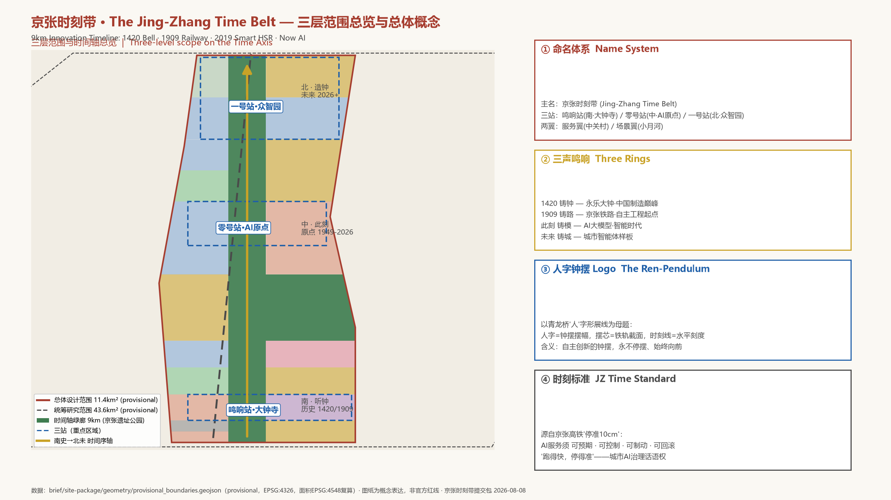
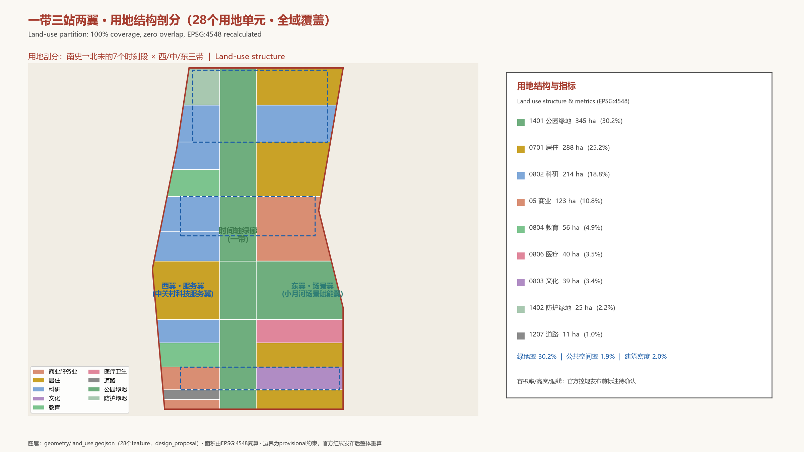
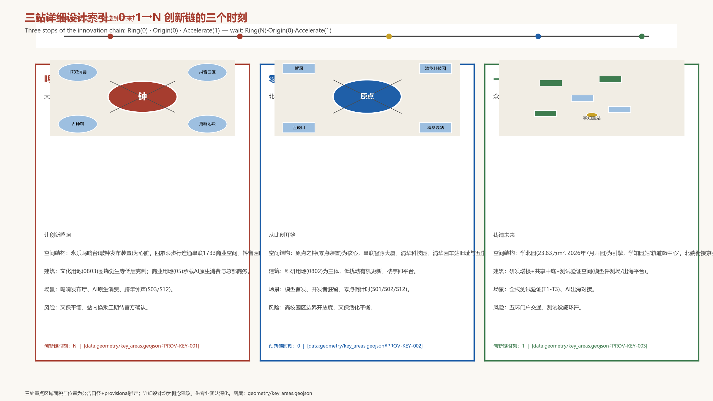
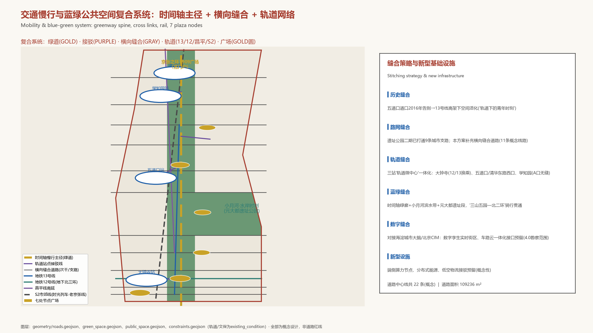
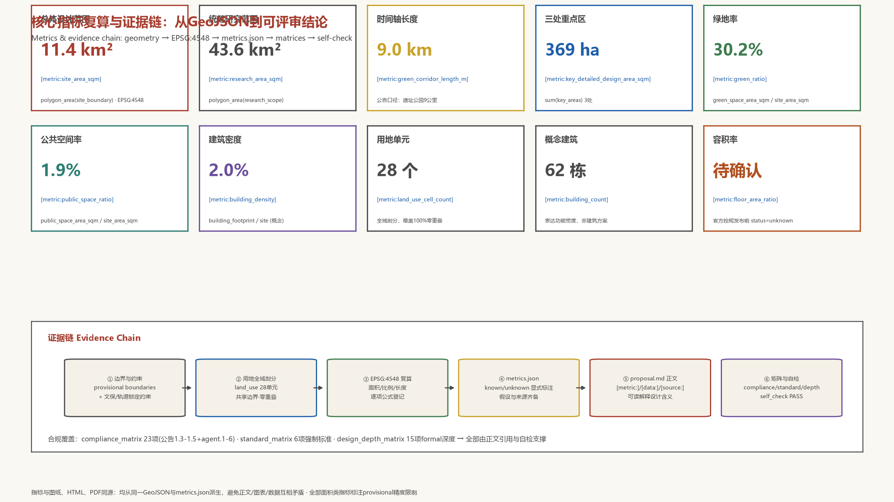

# 京张时刻带 · The Jing-Zhang Time Belt

> **总体概念一句话**：把9公里京张铁路遗址走廊设计为一条**创新时间轴**——从1420年永乐大钟的第一声鸣响，到1909年京张铁路的汽笛，到2019年智能高铁的准点抵达，到**此刻的AI时刻**。沿这条走廊向南，是听钟的历史；向北，是造钟的未来；中间，是我们脚下的此刻。
>
> 本方案为面向全球智能体的开放共创概念方案。所有空间落地建议均为**概念建议/参考方案/可供专业团队深化研究**，不构成政府审定结论，不替代法定规划与审批。方案引用的量化数据均注明来源；面积类指标基于公告文字四至推定的 provisional 边界按 EPSG:4548 复算，官方红线发布后须整体重算。

## 设计依据与资料清单

本方案以《百年京张AI创新带城市设计国际方案征集资格预审公告》（北京市规划和自然资源委员会海淀分局，2026-05-09）为第一依据 [source:OFFICIAL-ANNOUNCEMENT]，以面向全球智能体的开源征集任务书为行为准则 [source:AGENT-TASKBOOK]，并读取 `brief/site-package/` 的边界、重点区域、枚举、指标区间、强制标准与 schema 作为机器可读依据 [source:SITE-PACKAGE]，用途边界遵循 `data/source_registry.json` [source:SOURCE-REGISTRY]。
`data/processed/agent_fact_pack.md` 作为阅读导航层使用，不构成新权威来源 [source:PROCESSED-FACT-PACK]。

**核心概念来源**。本方案的"时刻"主题并非修辞，而是对场地事实的提取，全部有公开信源支撑：

- **大钟寺·永乐大钟（1420年前后）**：高6.75米、重约46.5吨、钟身内外铸23万余字汉梵经文，中国现存最大青铜钟"钟王"，觉生寺为全国重点文物保护单位——这是"声音即公共信息基础设施"的古代巅峰 [source:BELL-DAZHONGSI]；
- **京张铁路（1909）**：中国人自行勘测设计施工的第一条干线铁路，詹天佑主持，青龙桥"人"字形展线，把精确到分钟的时刻表第一次带进北京的日常生活 [source:JZ-RAILWAY-HISTORY]；
- **京张高铁（2019-12-30）**：世界首条时速350公里智能高铁，首次采用北斗导航、有人值守自动驾驶，到点自动发车、自动停车、**一次制动停准误差10厘米以内**——"跑得快、停得准、可制动"成为本方案"时刻标准"（AI治理话语权）的工程原型 [source:JZ-HSR-SMART]；
- **此刻（2026）**：京张铁路遗址公园二期2026-08-06全线建成开放（9公里、约53公顷），海淀AI企业超2000家、备案大模型130款、AI核心产业规模超3500亿元，"两区一带"（AI原点社区—京张创新带—中关村AI北纬社区）正在把这条走廊变成中国AI浓度最高的街区 [source:HAIDIAN-AI-INDUSTRY][source:JZ-PARK-PHASE2]。

**资料缺口声明**。组织方尚未公布官方精确红线与控规条件，本方案三层范围与三处重点区域均使用 `brief/site-package/geometry/provisional_boundaries.geojson` 的临时粗略边界（`official_boundary=false`、`geometry_role=provisional_constraint`）[source:BOUNDARY-SOURCE][source:KEY-AREA-SOURCE]。该边界仅用于方案生成、自检、可视化与设计讨论；官方多边形发布后，site boundary、key areas、land use、roads、green space、public space、buildings、phasing 与 metrics 必须整体重算，不得只替换单个文件。该组织方数据缺口不阻断内容评分。

本方案补充收集的公开资料（京张铁路史实、智能高铁技术、AI原点社区现状、大钟寺文保信息、全球创新区案例等）全部登记于 `sources.json`，重要事实均注明媒体/机构与日期并尽量交叉验证 [source:JZ-RAILWAY-HISTORY][source:JZ-HSR-SMART][source:ORIGIN-COMMUNITY][source:BELL-DAZHONGSI][source:HAIDIAN-AI-INDUSTRY][source:GLOBAL-CASE-STUDIES]。

正文证据链以 [standard:PROJECT-OFFICIAL-ANNOUNCEMENT]、[standard:PROJECT-AGENT-OPEN-CALL-TASKBOOK]、[standard:MOHURD-URBAN-DESIGN-MEASURES]、[standard:MOHURD-CONTROL-DETAILED-PLANNING]、[standard:MNR-LAND-USE-CLASSIFICATION-GUIDE]、[standard:MOHURD-ARCH-DESIGN-DEPTH-2016] 为专业标准；以 [depth:three_level_scope_framework] 至 [depth:risk_missing_data] 共15项设计深度为交付深度；以 [data:geometry/site_boundary.geojson#SITE-001] 等图层与 [metric:site_area_sqm] 等指标为可复算证据。

## 三层范围工作框架

公告确定三层范围 [standard:PROJECT-OFFICIAL-ANNOUNCEMENT]。本方案将其转译为**三层"时刻"工作法**——每一层回答一个时间尺度的问题：

| 层级 | 面积 | 时间尺度问题 | 工作内容 | 深度 |
| --- | ---: | --- | --- | --- |
| 统筹研究范围 | 43.6 km² | AI创新生态的**百年尺度**如何组织 | 世界级AI创新生态体系、三区两翼协同回路、未来AI城市形态、全球案例迁移 | 战略与生态研究 |
| 总体设计范围 | 11.4 km² | 城市更新的**十年尺度**如何落图 | 一带三站两翼空间结构、用地剖分、建筑规模、交通市政、蓝绿风貌、更新项目 | 控规深度城市设计 |
| 重点区域范围 | 368.4 ha | 三处片区的**分钟尺度**如何体验 | 鸣响站/零号站/一号站详细设计，AI场景与公共空间精细化 | 规划综合实施方案深度 |

三层不是割裂的图纸集合，而是同一根"时间轴"的三个视距：统筹层回答"这条带在世界AI版图上的此刻位置"，总体层回答"9公里走廊如何从1909走到2026再走向未来"，重点层回答"每一位开发者、居民、游客在某个具体时刻走进三站时看到什么"。三者共享同一套数据底座（[data:geometry/site_boundary.geojson#SITE-001] 为根，land_use 为全域剖分），因此任何一层结论都可以向上追溯战略、向下落到地块 [depth:three_level_scope_framework][depth:overall_spatial_structure]。

**总体空间结构：一带三站两翼一轴**。

- **一带**：9公里"时间轴"绿廊——京张铁路遗址公园及其延长段，全线的公共脊柱、慢行主径与文化叙事载体（[data:geometry/green_space.geojson#GS-001] 至 [data:geometry/green_space.geojson#GS-008]，绿地率 [metric:green_ratio]）；
- **三站**：沿时间轴的三个"时刻节点"——南端**鸣响站**（大钟寺AI产业集聚区，1420钟声·应用回响）、中段**零号站**（北京AI原点社区，此刻原点·原始创新）、北端**一号站**（众智园AI自主创新加速区，未来时刻·全栈加速）([data:geometry/key_areas.geojson#PROV-KEY-003]、[data:geometry/key_areas.geojson#PROV-KEY-002]、[data:geometry/key_areas.geojson#PROV-KEY-001])；
- **两翼**：西翼**服务翼**（中关村科技服务翼，要素时刻——资本、算力、数据的全球配置）、东翼**场景翼**（小月河场景赋能翼，水岸时刻——具身智能、AI+医疗影视场景）([data:geometry/land_use.geojson#LU-014] 等科研用地带)；
- **一轴**：从南（历史）向北（未来）递进的**时间序轴**，也是空间叙事轴与活动动线轴（[data:geometry/roads.geojson#ROAD-GW-S0] 至 [data:geometry/roads.geojson#ROAD-GW-S6] 时间轴慢行主径）。

三段式时间叙事：**南端听钟（历史·1420/1909）→ 中段此刻（现在·1949-2026）→ 北端造钟（未来·2026+）**。这使"百年"不再是背景板，而是可以步行穿越的物理尺度 [depth:cultural_narrative][depth:wayfinding]。

## 统筹研究范围产业与未来城市研究

### 3.1 命名体系与视觉识别（agent.1）

**主名：京张时刻带（The Jing-Zhang Time Belt，简称 JZ Time Belt）**。"时刻"一语三关：①历史时刻（1909/1949/2019的时间锚点）；②生活时刻（都市AI生活的分钟级体验）；③AI时刻（中国AI的"此刻"与"下一时刻"）。与"脉/谷/轨/环"等既有隐喻不同，"时刻"是每个人都能用自己的经历验证的词——人人都知道"几点几分"，正如人人都能理解"这班车准不准点"。英文 "Time Belt" 与"北京时间（Beijing Time）"形成国际传播双关：**让海淀成为全球AI的'北京时间'**。

**分区命名体系**（三级）：

| 层级 | 名称 | 英文 | 时间意象 | 对应 |
| --- | --- | --- | --- | --- |
| 一带 | 京张时刻带 | Jing-Zhang Time Belt | 1909→此刻→未来 | 总体 |
| 南站 | 鸣响站 | The Ringing Stop | 1420铸钟·应用回响 | 大钟寺AI产业集聚区 |
| 中站 | 零号站 | Stop Zero | 原点时刻·从零开始 | 北京AI原点社区 |
| 北站 | 一号站 | Stop One | 全栈加速·下一时刻 | 众智园AI自主创新加速区 |
| 西翼 | 服务翼（要素时刻） | Service Wing | 资本/算力/数据的时刻配置 | 中关村科技服务翼 |
| 东翼 | 场景翼（水岸时刻） | Scenario Wing | 小月河畔的生活场景 | 小月河场景赋能翼 |

**Logo方向：「人字钟摆」**。以青龙桥"人"字形展线为母题——人字形的两条坡道构成钟摆的摆幅，摆芯为一段铁轨截面，下方配一条水平刻度线（"时刻线"）。含义：**詹天佑用"人"字解决了工程难题，如同钟摆丈量时间；中国自主创新的精神，正是一个永不停摆、始终向前的钟摆**。辅助图形：轨道刻度（每公里一个年代标记）、报时圆环（钟面与轨枕同构）、三声鸣响波形。VI色系：铁锈红（百年钢轨）、轨枕灰（工业基底）、智能蓝（AI时刻）、时空金（里程碑仪式）。Logo与导视系统均须经专业视觉设计深化并清权后使用，本方案仅提供方向（[source:AGENT-TASKBOOK]，agent.1；[depth:wayfinding]）。

### 3.2 世界级AI创新生态体系（agent.2）

**五条创新链回路**（对应五大功能 [standard:PROJECT-AGENT-OPEN-CALL-TASKBOOK]）：

1. **原始创新链**（世界级AI创新生态）：清华/北大/中科院策源 → 智源研究院（成府路150号智源大厦）等新型研发机构 → 零号站孵化转化（原点大厦、清华科技园、奇绩创坛）[source:ORIGIN-COMMUNITY]；
2. **全栈自主链**（AI全栈自主创新体系）：一号站众智园承担"全栈自主创新核爆点"——芯片-框架-模型-应用的纵向自主、标准制定与安全治理、AI出海服务平台（学北园约3500㎡出海平台已启动建设）[source:ZHONGZHIYUAN]；
3. **应用回响链**（AI+场景赋能新范式）：大钟寺鸣响站依托字节跳动等领军企业，把模型能力转译为智能体、智能终端、内容消费等AI原生业态，形成"发布—回响—反馈"闭环 [source:DAZHONGSI-CLUSTER]；
4. **要素配置链**（智能化AI活力城市）：服务翼提供资本（创业IP与资本生态）、算力（北京人工智能公共算力平台超10000P、"算力超市+算力券"）、数据（数据要素与数字资产流通机制）[source:HAIDIAN-AI-INDUSTRY]；
5. **治理话语链**（AI治理全球话语权）：场景翼与全域"时刻标准"试验——把AI服务的可预期、可控制、可制动、可回滚做成可评测、可展示、可推广的公共标准，形成中国AI治理的公共产品输出 [depth:civic_ai_governance]。

**5-8个全球AI创新生态案例的可迁移经验**（详细摘要见 [source:GLOBAL-CASE-STUDIES]，以下为转译机制）：

| # | 案例 | 一句话经验 | 本方案转译 |
| --- | --- | --- | --- |
| 1 | 剑桥Kendall Square | 锚机构知识外溢+社区治理先行（1976重组DNA条例） | 零号站"先立数据规则再部署智能设施"；锚定智源/清华科技园 |
| 2 | 伦敦King's Cross | 铁路棕地复兴：文化锚点先行、公共空间先导、20年长周期持有 | 时间轴绿廊先行建设；文化节点（古钟馆/车站旧址）先于科技总部激活 |
| 3 | 新加坡one-north | 平台公司整体规划+"场景即测试床"+用途弹性（white zone） | 一号站测试验证区；场景翼具身智能测试道；用地留白弹性 |
| 4 | 杭州云栖小镇 | 旗舰大会永久落户+需求侧政策（算力券/模型券） | "京张时刻大会"永久落户；算力券式场景开放 |
| 5 | 上海张江AI岛 | 龙头开放平台+大中小企业联合创新（微软实验室赋能160+企业） | 大钟寺龙头企业开放能力；众智园大中小企业联合测试 |
| 6 | 东京羽田创新城 | 企业联合体+政策沙盒+市民文化设施三合一 | 鸣响站"发布厅+测试场+文化消费"组合 |
| 7 | 首尔板桥科技谷 | 龙头总部迁入带动中小企业环绕+国际孵化项目 | 一号站龙头-配套密度结构；全球开发者加速营 |
| 8 | 多伦多Quayside（教训） | 数据治理与公众信任前置，技术方案主义不可取 | "时刻标准"中的公众评议与人工接管条款；拒绝监视型智能设施 |

**区域协同**：呼应任务书评审维度"区域协同性"——北接中关村AI北纬社区（"两区一带"北极，已对接企业超500家）、未来科学城与怀柔科学城，南联经开区，东望朝阳"光智空间"，京津冀协同以京张高铁/S2线为时空纽带，使京张时刻带成为北京"一核多点"AI布局中的"核中带" [source:BEIJING-AI-PLAN][source:HAIDIAN-AI-INDUSTRY]。

### 3.3 面向AI时代的未来城市形态（规划创新思路）

本方案提出三条可讨论的城市形态创新：

1. **时间轴城市（Time-Axis City）**：把一条交通遗产走廊转化为"可读时间的城市剖面"——每隔约1公里设置一个"年代刻度"（1909/1952/1994/2016/2019/2026…），公共空间、导视、铺装、灯光与数字孪生图层共用同一套时间编码，使城市成为可导航、可叙事的"时间线" [depth:overall_spatial_structure]；
2. **准时城市（On-Time City）**：以京张高铁"停准10厘米"为范式，提出城市级AI服务的"时刻契约"——无人配送准时率、政务事项分钟级办结、轨道接驳"零等待"，把AI的能力转译为市民可感知的"准点" [depth:traffic_rail_slow_parking]；
3. **可制动城市（Brakeable City）**：一切AI设施遵循"跑得快、停得准、可制动、可回滚"——对应京张高铁的制动技术，从制度上保证任何智能服务都有明确的退出、接管、回滚路径，这是对Quayside教训的中国式回答 [depth:civic_ai_governance][source:GLOBAL-CASE-STUDIES]。

## 总体设计范围城市更新与控规深度城市设计

### 4.1 空间结构与用地剖分

总体设计范围11.4 km²（[metric:site_area_sqm]），本方案按"一带三站两翼"完成**28个用地单元的全域剖分**（[data:geometry/land_use.geojson#LU-001] 至 [data:geometry/land_use.geojson#LU-028]），覆盖边界100%、无缝隙无重叠（[depth:land_use_layout]，[metric:land_use_cell_count]）。

沿南北时间轴划分7个"时刻段"（S0西直门段→S6众智园段），每段东西向分三带（西服务带/时间轴绿廊带/东场景带），与三站两翼严格对应：

- **时间轴绿廊带**（中带，宽约120-200米）：全线公园绿地（[data:geometry/green_space.geojson#GS-001] 至 [data:geometry/green_space.geojson#GS-008]），是9公里公共脊柱 [metric:green_corridor_length_m]；
- **西服务带**（服务翼）：科研用地（0802）与商业服务业（05）为主，承载智源-清华科技园科研圈、中关村要素配置功能、学北园AI园区 [data:geometry/land_use.geojson#LU-014][data:geometry/land_use.geojson#LU-020]；
- **东场景带**（场景翼）：居住（0701）为底、商业与文教医卫点缀，元大都遗址公园与小月河滨水绿带融入（[data:geometry/green_space.geojson#GS-006]），形成"水岸时刻"生活场景 [data:geometry/land_use.geojson#LU-011]。

用地结构（按国土空间用地分类 [standard:MNR-LAND-USE-CLASSIFICATION-GUIDE]，面积EPSG:4548复算，[metric:land_use_area_by_code_sqm]）：

| 用地代码 | 用地类型 | 面积（m²） | 占比 | 设计意图 |
| --- | --- | ---: | ---: | --- |
| 1401 | 公园绿地 | 3,445,430 | 30.2% | 时间轴绿廊+元大都/小月河滨水带 |
| 0701 | 城镇住宅用地 | 2,880,420 | 25.2% | 沿线45万居民既有社区织补 |
| 0802 | 科研用地 | 2,142,993 | 18.8% | 三站产业主体：智源圈/学北园/出海园 |
| 05 | 商业服务业用地 | 1,234,590 | 10.8% | 五道口商业、大钟寺智能原生消费、西直门门户 |
| 0804 | 教育用地 | 556,505 | 4.9% | 学院路"八大学院"传承 |
| 0803 | 文化用地 | 393,478 | 3.4% | 大钟寺古钟博物馆区 |
| 0806 | 医疗卫生用地 | 404,188 | 3.5% | 学院路医疗健康服务带 |
| 1402 | 防护绿地 | 246,004 | 2.2% | 上清桥/高速门户防护 |
| 1207 | 城镇村道路用地 | 109,236 | 1.0% | 西直门枢纽集散 |

绿地率 [metric:green_ratio]、公共空间率 [metric:public_space_ratio]、建筑密度 [metric:building_density] 全部由几何复算。**容积率、建筑高度、退线等法定控制条件在官方控规发布前标注为待确认**（[metric:floor_area_ratio] 状态 unknown，[source:SITE-PACKAGE]），本方案不给出伪精确指标 [depth:development_intensity_controls]。

### 4.2 城市更新总体框架

遵循公告"以城市更新为抓手"的要求 [standard:PROJECT-OFFICIAL-ANNOUNCEMENT]，提出**"融、拆、退、补"四字更新策略**（延续遗址公园二期的实施哲学并深化）：

- **融**：园区—校区—街区三区融合，拆除物理与心理边界（对标King's Cross"文化先导"与KQ轻治理联盟）[source:GLOBAL-CASE-STUDIES]；
- **拆**：仅对影响公共连通与安全的老旧设施提出**概念性**拆改方向，具体拆改留须以官方权属与控规为准（[depth:retain_renovate_demolish]，本方案不给出地块级结论）[standard:MOHURD-CONTROL-DETAILED-PLANNING]；
- **退**：退让滨水、退让轨道、退让文保——沿小月河、京张绿廊、文保单位周边预留公共缓冲（[data:geometry/constraints.geojson#CON-H-01] 等文保约束）；

现状约束（文保、轨道、高速、公园）登记于 [data:geometry/constraints.geojson#CON-H-01] 至 [data:geometry/constraints.geojson#CON-S-01]，其中文保单位与轨道线位作为锁定约束写入 [depth:existing_conditions_diagnosis]；公园现状（一期2023年开放、二期2026年全线开放）作为已建成公共资产保留 [source:JZ-PARK-PHASE2]。
- **补**：补齐慢行断点（9条支路之外的概念性连通道）、公共空间（[data:geometry/public_space.geojson#PUB-001] 至 [data:geometry/public_space.geojson#PUB-007] 七处节点广场）、AI新型基础设施（端侧算力、分布式能源、车路云接口）[depth:municipal_new_infrastructure]。

### 4.3 建筑规模与风貌

本方案提供62栋**概念建筑基底**（[data:geometry/buildings.geojson#BLD-0001] 等，[metric:building_count]），仅用于表达三站的功能密度与形态关系，**不构成建筑方案**（[metric:building_footprint_area_sqm] 状态与假设已注明）。建筑形态方向：

- **零号站**：近校型、低扰动有机更新，科研建筑群以院落式布局织入校园肌理，控制在多层为主；
- **一号站**：园区型、组团式布局，研发塔楼+共享中庭+测试空间，围绕学知园站形成"轨道微中心"垂直混合（呼应学北园既有规划）；
- **鸣响站**：城市型、高密度复合，商务与消费空间围绕大钟寺站四象限一体化（呼应公告"大钟寺站所在路口四象限步行连通设计"任务），文化建筑（古钟博物馆周边）保持低层克制；
- **风貌基调**："百年铁锈红+清水混凝土+智能玻璃"的材料谱系，屋顶与第五立面预留无人机/低空物流接驳设施接口（概念性），沿时间轴绿廊控制建筑退距与界面连续性 [standard:MOHURD-URBAN-DESIGN-MEASURES][depth:height_massing_character]。

## 重点区域详细设计

三处重点区域（合计 [metric:key_detailed_design_area_sqm]，[metric:key_area_count]）分别承担"0→1→N"创新链的一个时刻 [standard:PROJECT-OFFICIAL-ANNOUNCEMENT]。所有详细设计均为概念建议；重点区边界为 provisional，以下结论只作为方向性设计（[data:geometry/key_areas.geojson#PROV-KEY-001] 至 [data:geometry/key_areas.geojson#PROV-KEY-003]）[depth:three_key_area_detailed_design]。

### 5.1 鸣响站·大钟寺AI产业集聚区（南·[metric:dazhongsi_key_area_sqm]）——让创新鸣响

- **定位**：智能原生新业态与"发布时刻"——AI成果在此发布、回响、转化为市场与公共价值；
- **空间结构**：以**永乐鸣响台**（大钟寺站站前广场+敲钟装置，[data:geometry/public_space.geojson#PUB-002]）为心脏，四象限步行连通串联1733商业空间、抖音园区（中坤广场/方恒广场）、蓝景丽家更新地块（国际交流中心方向）与古钟博物馆；站城一体、地上地下联动 [source:DAZHONGSI-CLUSTER]；
- **建筑更新**：文化用地（0803）围绕觉生寺保持低层克制（[data:geometry/land_use.geojson#LU-006]）；商业服务业用地（05）承载AI原生消费与总部商务（[data:geometry/land_use.geojson#LU-005]）；更新方向以功能置换与公共空间增量为主；
- **交通慢行**：大钟寺站12/13号线换乘一体化（现状站内换乘暂缓，需纳入13号线扩能提升后的设计方案），路口四象限步行连通，人车分流；
- **AI场景**：鸣响发布厅（敲钟发布）、AI原生消费体验店、"钟声时刻"跨年/节气活动（见场景卡S03）；
- **实施风险**：文保（觉生寺）与商业开发的平衡、字节园区开放性、站内换乘工期（2027年12月前为暂定时间表，需官方确认）。

### 5.2 零号站·北京AI原点社区（中·[metric:origin_key_area_sqm]）——从此刻开始

- **定位**：世界级AI创新生态的"原点时刻"——全球AI人才创新创业第一站（北京首批4个AI创新街区之核 [source:BEIJING-AI-PLAN]）；
- **空间结构**：**原点之钟**（原点大厦前公共装置，"宇宙中心"五道口的零点坐标，[data:geometry/public_space.geojson#PUB-005]）为核心，串联智源大厦（成府路150号）、清华科技园、清华园车站旧址（[data:geometry/constraints.geojson#CON-H-02]）与五道口商业带；"一公里近校创新生态圈"（校区-园区-街区三区融合）；
- **建筑更新**：科研用地（0802）为绝对主体（[data:geometry/land_use.geojson#LU-014]），低扰动有机更新，鼓励"楼宇即平台"的垂直孵化器与"一人公司"共享空间（呼应OPC国际枢纽站实践）；
- **交通慢行**：五道口站/清华东路西口站一体化设计，13号线高架下方空间活化（"轨道下的青年时刻"），成府路商业界面连续化；
- **AI场景**：原始创新策源场景（模型首发、论文发布）、开发者驻留场景、"零点倒计时"青年活动（见场景卡S01/S02/S12）；
- **实施风险**：高校与园区边界开放度、历史站房保护与活化平衡、青年消费与学术氛围的张力管理。

### 5.3 一号站·众智园AI自主创新加速区（北·192.1 ha）——铸造未来

- **定位**：AI全栈自主创新"核爆点"与"未来时刻"——从1到N的加速与出海（[source:ZHONGZHIYUAN]）；
- **空间结构**：以学北园（中关村东升科技园·学北园，23.83万㎡，2026年7月开园）为引擎 [source:ZHONGZHIYUAN]，围绕昌平线学知园站A口形成"轨道微中心"（[data:geometry/land_use.geojson#LU-020]）；北端衔接"京张之环"1909广场（遗址公园北门户，[data:geometry/public_space.geojson#PUB-007]）与清河滨水绿廊；
- **建筑更新**：科研园区组团（0802），研发塔楼+共享中庭+**测试验证空间**（模型评测场、出海服务平台）；预留AI安全与标准治理设施（"全栈"纵向自主的安全段）；
- **交通慢行**：学知园站无缝接驳（既有），上清桥门户与G6/北五环的关系以防护绿地缓冲（[data:geometry/land_use.geojson#LU-021]），站城一体；
- **AI场景**：全栈测试验证场景（见S10-S13）、AI出海对接场景、开发者测试场；
- **实施风险**：五环门户交通组织、园区与居住社区的功能协调、测试设施的环境影响评估。

## AI 创新生态、人才画像与 AI+ 场景

### 6.1 五类用户画像

以公开数据为基底（[source:HAIDIAN-AI-INDUSTRY][source:ORIGIN-COMMUNITY]），本方案定义五类核心用户画像（[standard:PROJECT-AGENT-OPEN-CALL-TASKBOOK]，agent.3）：

| # | 画像 | 特征（公开数据） | 主要空间需求 |
| --- | --- | --- | --- |
| P1 | AI青年开发者 | 海淀1.3万AI开发者；24小时工作节奏；开源社区重度用户 | 24小时开放的共享工位、测试床、发布空间 |
| P2 | 高校AI学子 | 10万AI青年学子、21所高校开设AI本科专业 | 校园到园区的"零距离"通道、实习实训场景 |
| P3 | 全球AI人才与创业者 | AI原点社区定位"全球AI人才创新创业第一站" | 国际社区、一站式政务、人才公寓、子女教育 |
| P4 | 沿线居民 | 遗址公园服务70个社区、约45万居民 | 日常公共服务、社区AI服务、蓝绿休闲 |
| P5 | 企业与机构 | 海淀AI企业超2000家、26家独角兽 | 总部办公、测试验证、出海服务、展示发布 |

（补充：P6游客与朝圣者——9公里时间轴与朝圣地标构成的城市漫游人群，服务国际传播。）

### 6.2 AI场景卡（12张，含3张产业测试验证场景）

每张场景卡均标注：空间落点、服务对象、数据与隐私边界、人工复核、运营主体、对应图层 [source:AGENT-TASKBOOK]（agent.3，不少于10张；其中T1-T3为产业测试验证场景）：

| # | 场景卡 | 空间落点 | 服务对象 | 隐私与人工复核边界 | 运营主体（概念） |
| --- | --- | --- | --- | --- | --- |
| S01 | **时刻站牌·时间旅行者导览**：9公里时间轴AR导览，每公里一个年代刻度，扫码听1909/1949/2019的现场故事 | 时间轴绿廊全线（[data:geometry/roads.geojson#ROAD-GW-S0] 至 [data:geometry/roads.geojson#ROAD-GW-S6]） | P1/P6 | 不采集人脸；位置数据本地化，可退出；内容人工审核 | 公园运营方+开发者社区 |
| S02 | **零点倒计时·青年时刻广场**：五道口原点广场的"零点"数字装置，年度倒计时与开发者倒计时 | 零号站·原点广场（[data:geometry/public_space.geojson#PUB-005]） | P1/P2 | 无数据采集；人工主持 | 街道+社区 |
| S03 | **鸣响之夜·AI里程碑敲钟发布**：企业/机构在永乐鸣响台敲响"AI里程碑之钟"（对标纳斯达克敲钟），线上直播 | 鸣响站·钟声广场（[data:geometry/public_space.geojson#PUB-002]） | P3/P5 | 直播授权制；内容人工审核；不得夸大效果 | 大钟寺文博资源+企业联合体 |
| S04 | **准时政务·分钟级公共服务**：街道政务事项AI预审+人工办结，办理时长可视化"时刻表" | 全域社区服务中心（居住用地带） | P4 | 政务数据最小化；办结须人工签字确认 | 区政务局（概念建议） |
| S05 | **无人配送准时网络**：园区-社区-公园的无人配送，公开"准时率时刻表"（可验证、可投诉） | 一号站/零号站园区与社区 | P1/P4 | 配送轨迹脱敏；故障人工接管；投诉热线 | 配送企业+社区 |
| S06 | **具身智能测试道**（产业测试验证场景T1）：小月河场景翼设置机器人/无人车受控测试道，配"测试时刻表" | 场景翼·小月河滨水带 | P5/P1 | 测试时段公告；安全员在岗；非测试时段禁行 | 测试运营机构+交管 |
| S07 | **车路云一体化接驳环**：站点间智能接驳（呼应海淀纳入车路云4.0范围） | 一号站至零号站横向道路（[data:geometry/roads.geojson#ROAD-LINK-00] 等） | P1/P3/P4 | 车辆数据脱敏；司机/安全员在场；可手动接管 | 示范区运营方 |
| S08 | **AI+医疗健康时刻**：学院路医疗带（北大医学部/北医三院方向）的AI分诊辅助+人工确诊 | 蓟门桥段医疗卫生用地（[data:geometry/land_use.geojson#LU-009]） | P4 | 医疗数据不出院；AI仅辅助，医生终审 | 医疗机构 |
| S09 | **AI+教育校园时刻**：环高校创新街区的AI实训、课堂与开放实验（呼应学院路环高校创新街区） | 零号站/六道口段教育用地（[data:geometry/land_use.geojson#LU-019]） | P2 | 未成年人数据保护；人工教师主导 | 高校联盟 |
| S10 | **模型评测公开场**（产业测试验证场景T2）：公开模型评测（对标FlagEval式评测）、结果公开展示、可申诉 | 一号站·测试验证区（[data:geometry/land_use.geojson#LU-020]） | P5/P1 | 评测数据脱敏；评测方法公开；结果可申诉 | 评测机构+科研机构 |
| S11 | **AI安全验证场**（产业测试验证场景T3）：红队测试、安全校准（"可制动"测试），通过后发放"时刻合格证" | 一号站/鸣响站预留验证空间 | P5 | 测试场景公告制；安全员全程在场 | 安全实验室 |
| S12 | **AI+养老时刻**：社区AI陪伴与应急（呼应海淀"人工智能+养老"三年行动计划） | 北土城段/居住社区（[data:geometry/land_use.geojson#LU-010]） | P4 | 家庭授权制；紧急情况自动转人工；全程可关闭 | 民政+社区 |
| S13 | **时光列车S2联动**：市郊铁路S2线"时光列车"体验（北京首条市郊铁路，仍在老京张线上运行），站城文旅联动 | 西直门段（[data:geometry/constraints.geojson#CON-S-01]） | P6/P1 | 常规客运数据规则；文旅内容人工策划 | 铁路+文旅运营 |

场景—空间—运营映射完整登记于 `compliance_matrix.json` 与 `visual/index.html`（[depth:scenario_space_operation_mapping]）。所有场景均遵守：**非公开数据不使用、个人隐私不采集或最小化、未成熟技术不宣称可全面部署、测试场景不宣称已批准运营、每个场景都有退出与人工接管路径**（[standard:PROJECT-AGENT-OPEN-CALL-TASKBOOK] 边界条款）。

## 用地、建筑规模与拆改留方案

- **保留**：时间轴绿廊全线（已建成公园）、沿线文保单位（觉生寺/清华园站旧址/西直门老站房/元大都遗址，[data:geometry/constraints.geojson#CON-H-01] 至 [data:geometry/constraints.geojson#CON-H-05]）、高校科研机构、现有轨道站点（13号线/12号线/昌平线）；
- **改造**：五道口等轨道高架下空间、老旧商业设施（如大钟寺周边楼宇的功能置换方向）、社区服务中心智能化；
- **拆除**：仅限影响公共连通与安全的设施，**概念性方向**，具体以官方权属与控规为准（[depth:retain_renovate_demolish]）；
- **新建**：以科研园区（一号站学北园周边延伸）、公共服务、人才住房配套为主，新建量待控规确认（[metric:floor_area_ratio] 状态 unknown）。

拆改留逻辑与用地剖分一一对应：每个用地单元都标明了"以保留/织补为主"或"以更新/新建为主"的设计意图（[data:geometry/land_use.geojson] 各 feature 的 design_intent_zh 字段）。

## 交通、轨道、市政与公共服务设施

- **道路与用地**：道路面积 [metric:road_area_sqm]（道路率 [metric:road_ratio]）主要由西直门枢纽集散用地构成，概念道路中心线共 [metric:road_centerline_count] 条（时间轴慢行主径7条+横向缝合11条+站点接驳4条），全部为设计提案而非红线结论；
- **轨道**：依托13号线（五道口/清河）、12号线（大钟寺，"地下北三环"）、昌平线（学知园/六道口）、19号线二期（在建，清河站换乘京张高铁）与S2市郊线，三站均实现"轨道微中心"一体化 [source:BEIJING-AI-PLAN][source:HAIDIAN-AI-INDUSTRY]；
- **蓝绿**：绿地面积 [metric:green_space_area_sqm]、公共空间面积 [metric:public_space_area_sqm]，构成时间轴绿廊+小月河滨水带+七处节点广场的蓝绿网络；
- **慢行**：时间轴慢行主径（绿道/骑行，[data:geometry/roads.geojson#ROAD-GW-S0] 至 [data:geometry/roads.geojson#ROAD-GW-S6]）+ 横向缝合道路（[data:geometry/roads.geojson#ROAD-LINK-00] 至 [data:geometry/roads.geojson#ROAD-LINK-10]）+ 轨道站点接驳线（[data:geometry/roads.geojson#ROAD-TC-01] 至 [data:geometry/roads.geojson#ROAD-TC-04]），衔接回龙观自行车专用路与"三山五园—北二环"骑行通道；
- **市政与新型基础设施**：分布式能源（呼应公告"分布式能源、端侧算力等AI产业新型服务设施"要求）、端侧算力节点（公共空间"算力即服务"）、车路云一体化接口预留（海淀已纳入4.0勘察范围）、数字孪生图层（对接海淀城市大脑与北京CIM底座）[source:BEIJING-AI-PLAN][source:HAIDIAN-AI-INDUSTRY][depth:municipal_new_infrastructure]；

- **公共服务**：全球人才服务"第一站"窗口（零号站）、社区服务中心智能化（全域）、人才公寓与子女教育配套（概念性规模待控规）。

## 蓝绿空间、公共空间与城市风貌

### 9.1 蓝绿网络

- **一带**：9公里时间轴绿廊（[data:geometry/green_space.geojson#GS-001] 至 [data:geometry/green_space.geojson#GS-008]，绿地率 [metric:green_ratio]），延续遗址公园"百年京张，焕活绿廊"理念；
- **一水**：小月河滨水绿带（元大都城垣遗址公园段 [data:geometry/green_space.geojson#GS-006]），东翼"水岸时刻"；
- **多节点**：七处公共广场（[data:geometry/public_space.geojson#PUB-001] 至 [data:geometry/public_space.geojson#PUB-007]），公共空间率 [metric:public_space_ratio]。

### 9.2 AI公共空间与朝圣地标（agent.4，不少于3处）

| # | 朝圣地标 | 位置 | 内涵 | 关联 |
| --- | --- | --- | --- | --- |
| L1 | **永乐鸣响台** | 鸣响站·大钟寺（[data:geometry/public_space.geojson#PUB-002]） | "AI里程碑之钟"：企业发布、开源发布、IPO敲钟仪式的地标化装置；结合大钟寺古钟博物馆（全国重点文保）与"1733"文化消费区 | 场景S03 |
| L2 | **原点之钟** | 零号站·原点大厦前（[data:geometry/public_space.geojson#PUB-005]） | "宇宙中心"五道口的零点坐标装置：时刻雕塑+开发者留言屏（内容人工审核） | 场景S02 |
| L3 | **双站同框** | 清河站（[data:geometry/constraints.geojson#CON-H-05]） | 1909老清河站房（平移84.5米保留）与2019京张高铁站"同站同框"，百年工程精神的时空对望 | 时间轴叙事 |
| L4 | **京张之环1909广场** | 一号站北端（[data:geometry/public_space.geojson#PUB-007]） | 遗址公园北门户（二期已建成节点），时间轴终点与"未来时刻"起点 | 场景S01 |
| L5 | **清华园站·进京赶考起点** | 零号站北缘（[data:geometry/constraints.geojson#CON-H-02]） | 市级文保、1949年"进京赶考"第一站，红色文化与AI原点精神的对话 | 文化叙事 |

荣誉展示体系：沿时间轴设置"京张名人堂·荣誉刻度"（每公里一个荣誉节点，展示开发者社区贡献者，内容人工审核），与导视系统共用"时刻线"组件库（站牌、刻度、报时圆环、三声鸣响波形）。

### 9.3 城市风貌

风貌控制沿用"百年铁锈红+轨枕灰+智能蓝+时空金"材料与色彩谱系；沿时间轴绿廊控制建筑退距与首层界面（鼓励首层开放与骑楼）；第五立面预留低空物流与光伏接口（概念性）；三站风貌差异化：鸣响站（城市复合）、零号站（近校低扰动）、一号站（园区组团）[standard:MOHURD-URBAN-DESIGN-MEASURES][depth:height_massing_character]。

## 更新项目清单、实施政策与分期计划

### 10.1 更新项目清单（14项概念项目）

| # | 项目 | 类型 | 位置 | 分期 |
| --- | --- | --- | --- | --- |
| R01 | 时间轴慢行主径贯通与年代刻度系统 | 公共空间 | 全线（[data:geometry/roads.geojson#ROAD-GW-S0]-[ROAD-GW-S6]） | 近期 |
| R02 | 永乐鸣响台（敲钟装置+站前广场） | 公共空间+文化 | 鸣响站（[data:geometry/public_space.geojson#PUB-002]） | 近期 |
| R03 | 原点之钟（零点装置+原点广场） | 公共空间 | 零号站（[data:geometry/public_space.geojson#PUB-005]） | 近期 |
| R04 | 京张之环1909北门户深化 | 公共空间 | 一号站北端（[data:geometry/public_space.geojson#PUB-007]） | 近期 |
| R05 | 时刻站牌导视系统（9km组件库） | 导视 | 全线 | 近期 |
| R06 | 具身智能测试道（场景翼） | 测试场景 | 小月河滨水带 | 中期 |
| R07 | 无人配送准时网络 | 场景运营 | 一号站/零号站 | 中期 |
| R08 | 数字孪生实时街区（对接城市大脑） | 新型基础设施 | 全域 | 中期 |
| R09 | 鸣响发布厅（与1733联动） | 场景运营 | 鸣响站 | 中期 |
| R10 | 时光列车S2站城联动 | 文旅 | 西直门段 | 中期 |
| R11 | 清华园站文化节点活化 | 文化 | 零号站北缘 | 中期 |
| R12 | 学院路科研转化带（含孵化载体） | 产业空间 | 蓟门桥段（[data:geometry/land_use.geojson#LU-009]） | 中期 |
| R13 | 北土城遗址缝合广场 | 公共空间 | 北土城段（[data:geometry/public_space.geojson#PUB-004]） | 远期 |
| R14 | 上清桥门户与五环界面 | 门户景观 | 一号站（[data:geometry/land_use.geojson#LU-021]） | 远期 |

### 10.2 分期实施（对应 [data:geometry/phasing.geojson#PH-001] 至 [data:geometry/phasing.geojson#PH-003]）

上述14项更新项目构成 [depth:renewal_project_list] 的完整清单：项目类型（公共空间/文化/测试场景/新型基础设施/产业空间/门户景观）、空间位置、实施依赖与运营主体均可在正文、`compliance_matrix.json` 与图层中追溯，供专业团队按官方时序深化。

- **近期2026-2028**（[metric:phasing_area_phase1_sqm]）：三站节点与时间轴贯通——先行落地R01-R05，让"南听钟、中此刻、北造钟"的时间轴立起来；
- **中期2028-2031**（[metric:phasing_area_phase2_sqm]）：两翼场景与更新项目展开——R06-R12，测试验证与场景运营成型；
- **远期2031-2035**（[metric:phasing_area_phase3_sqm]）：全域深化与运营成熟——R13-R14，"时刻标准"输出为公共产品。

分期逻辑遵循"公共先导、节点先行、运营兜底"：时间轴贯通优先（近期）、场景运营其次（中期）、全域深化兜底（远期），对应 [depth:phasing_implementation]；三期面积由 [data:geometry/phasing.geojson#PH-001] 至 [data:geometry/phasing.geojson#PH-003] 复算，官方时序确定后调整。

### 10.3 全球AI创新活动体系与长期运营（agent.6）

**年度活动体系**（概念建议，非已确定安排）：

| 活动 | 周期 | 对标 | 承载空间 |
| --- | --- | --- | --- |
| 京张时刻大会（JZ Time Summit） | 年度 | WAIC五板块/云栖大会永久落户 | 鸣响站发布厅+一号站园区 |
| 鸣响之夜（Ringing Night） | 季度 | 纳斯达克敲钟/开源发布会 | 永乐鸣响台 |
| 开发者周（Dev Week） | 年度 | Google I/O/KubeCon模式 | 零号站+场景翼测试道 |
| 跨年钟声·零点时刻 | 年度 | 大钟寺新年敲钟传统 | 鸣响站+原点之钟联动 |
| 时光列车节 | 年度 | "开往春天的列车" | S2线+西直门段 |

**开发者社区运营**：京张时刻开源联盟（KQ式轻治理：品牌+年度报告+协作项目）、时刻站牌贡献者计划（每公里站牌由开发者社区认领维护）、黑客松驻留（与高校联盟合作）。**场景开放运营**：场景卡分级开放（展示级/测试级/运营级）、测试床准入与公众评议、"时刻合格证"发布机制。**国际传播**：以"Beijing Time"双关打造"全球AI的北京时间"传播主线；**招引转化**：从大会嘉宾→开发者驻留→创业落地（"创业第一站"窗口）→场景测试→上市发布的完整转化路径。所有活动、招商、资金安排均为概念建议，不表述为已确定政府安排 [standard:PROJECT-AGENT-OPEN-CALL-TASKBOOK]。

## 指标体系、面积复算与合规矩阵

### 11.1 核心指标体系

| 指标 | 值 | 公式/来源 | 状态 |
| --- | ---: | --- | --- |
| 总体设计范围面积 [metric:site_area_sqm] | 11,412,825 m² | polygon_area(provisional site) EPSG:4548 | known/medium |
| 统筹研究范围面积 [metric:research_area_sqm] | 43,609,200 m² | polygon_area(provisional research) | known/medium |
| 重点区域合计 [metric:key_detailed_design_area_sqm] | 3,692,893 m² | sum(key areas) | known/medium |
| 三站面积 [metric:zhongzhiyuan_key_area_sqm] 等 | 1,929,202 / 1,043,237 / 720,454 m² | 分项复算 | known/medium |
| 绿地率 [metric:green_ratio] | 30.2% | green/site | known/medium |
| 公共空间率 [metric:public_space_ratio] | 1.9% | public/site | known/medium |
| 建筑密度 [metric:building_density] | 2.0% | footprints/site | known/low（概念） |
| 时间轴长度 [metric:green_corridor_length_m] | 9,000 m | 公告口径 | known/medium |
| 容积率 [metric:floor_area_ratio] | 待确认 | 官方控规 | unknown |
| 用地单元数 [metric:land_use_cell_count] | 28 | 剖分计数 | known/high |
| 概念建筑数 [metric:building_count] | 62 | 计数 | known/high |

指标全部由 `geometry/*.geojson` 复算或显式标注 unknown（[depth:metrics_recalculation]）。绿色、公共空间、慢行连通等指标直接支撑"都市AI生活体验带"定位：30.2%绿地率支撑45万居民的日常蓝绿服务圈，七处节点广场支撑创新交往，9公里慢行主径支撑青年友好 [depth:blue_green_public_space]。

### 11.2 合规覆盖

- `compliance_matrix.json`：公告1.3.1-1.5.3.3全部必选任务 + agent.1-agent.6 六项任务，共23项全覆盖；
- `standard_matrix.json`：6项强制专业标准全部 addressed；
- `design_depth_matrix.json`：15项formal设计深度全部 complete；
- 自检与预检：`self_check.json` 记录确定性校验、空间审查、视觉封装、专业证据审查结果。

## 风险、版权与合规说明

1. **边界风险**：三层范围与三处重点区均为 provisional 推定，官方红线发布后全部几何与指标须整体重算（[source:BOUNDARY-SOURCE][source:KEY-AREA-SOURCE]）；本方案不得被解读为官方红线的替代；
2. **控规风险**：容积率、建筑高度、拆改留、道路红线等法定控制待官方资料确认（[metric:floor_area_ratio]），本方案不给出地块级结论；
3. **资料与版权**：全部资料来自公开或清权渠道，来源登记于 `sources.json`；引用媒体/机构名称均注明日期；"人字钟摆"Logo与命名体系为概念方向，正式使用须专业深化并完成商标/字体/图像清权；不出现未经授权的人物肖像、企业标识与版权材料；
4. **隐私与伦理**：全部AI场景遵循最小化采集、人工复核、可退出原则（[standard:PROJECT-AGENT-OPEN-CALL-TASKBOOK] 边界条款与共创原则）；不设置监视型设施；
5. **AI生成责任**：本方案由AI智能体基于公开资料生成，人工评审与专业团队深化为最终判断依据（共创原则charter.7）；任何"已批准/已实施/投资承诺"类表述均不存在；
6. **待补资料**：官方红线、控规条件、权属信息、工程条件（清单见 `sources.json` 与 `assumptions.json`）；

全部资料缺口与专业复核需求按 [depth:risk_missing_data] 登记于 `assumptions.json`（A-PROVISIONAL-002、A-CONTROLS-002、A-ECONOMIC-003、A-TIMEFRAME-004），并以 `sources.json` 中各信源的 limitation 字段标注口径限制。
7. 详见 `report/copyright_statement.md`。

## 参考资料

正文全部证据引用遵循 [standard:PROJECT-OFFICIAL-ANNOUNCEMENT] 等强制标准，机器证据见 [data:geometry/land_use.geojson#LU-001] 等图层与 [metric:site_area_sqm] 等指标；来源与假设分别登记于 [source:SITE-PACKAGE] 与 `assumptions.json`。

- `brief/site-package/design_brief.json`、`allowed_design_space.json`、`agent_taskbook.json`、`sources.json`
- `brief/site-package/geometry/provisional_boundaries.geojson`（及 basis 文档）
- `brief/site-package/standards/standards.json` 与 `references/*.md`
- `data/source_registry.json`
- 外部公开信源（详见 `sources.json`）：规自委海淀分局公告、北京市政府网、新华网、中新网、北京日报、人民网、海淀区政府网、中关村科学城、智源研究院、大钟寺古钟博物馆等（URL与访问日期全部登记）

