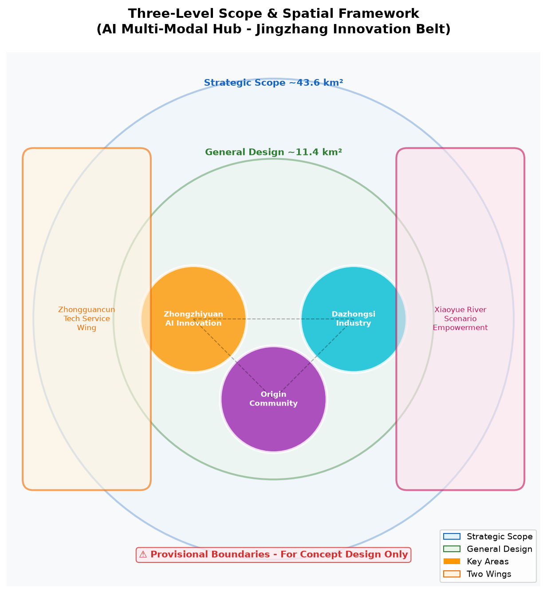
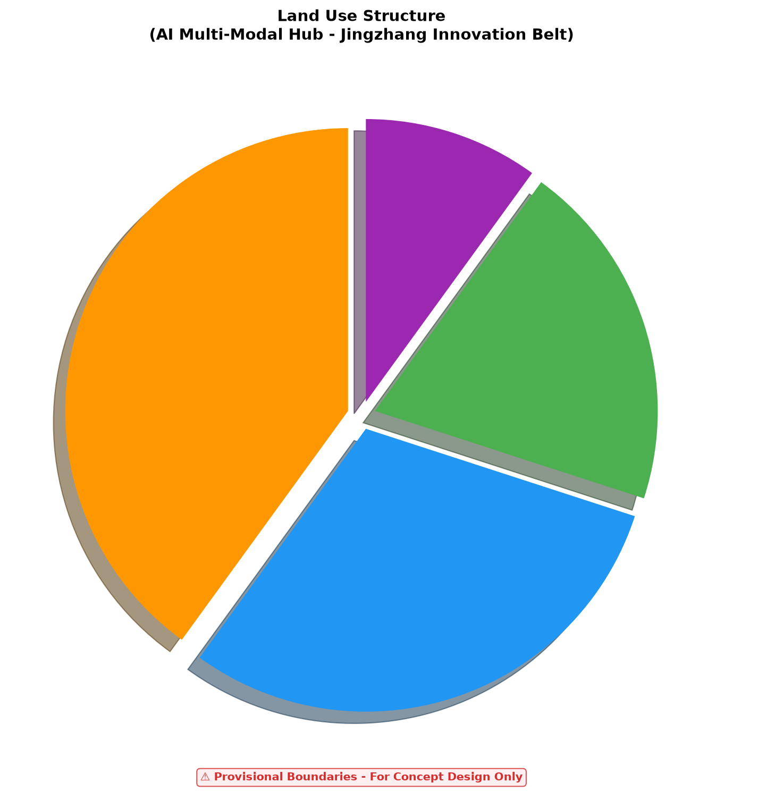
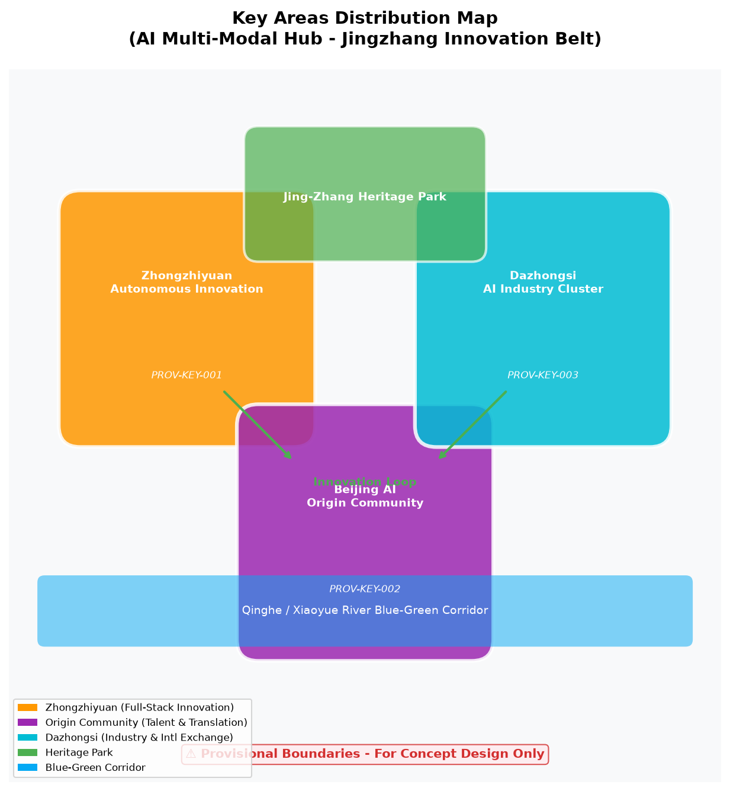
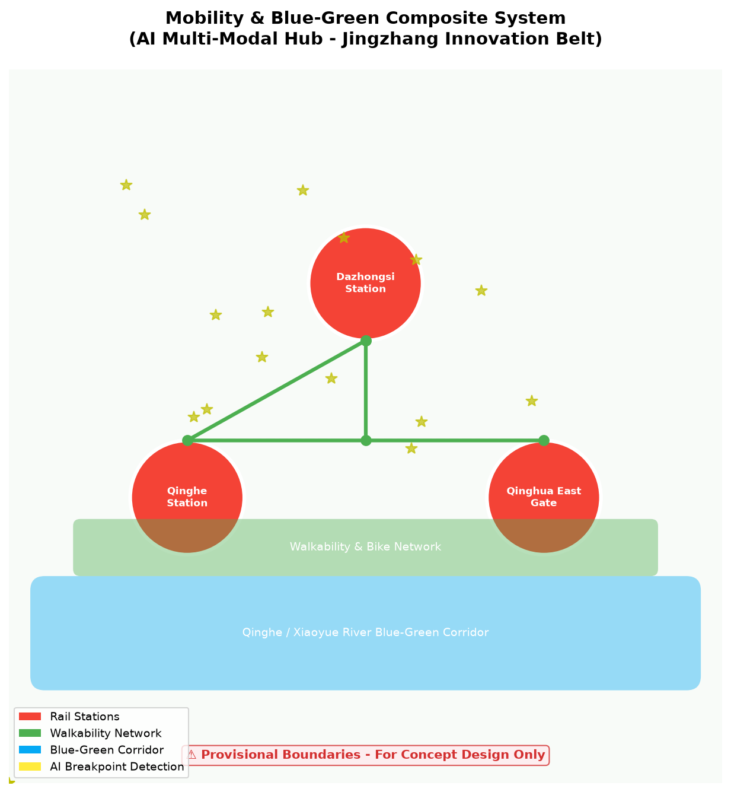
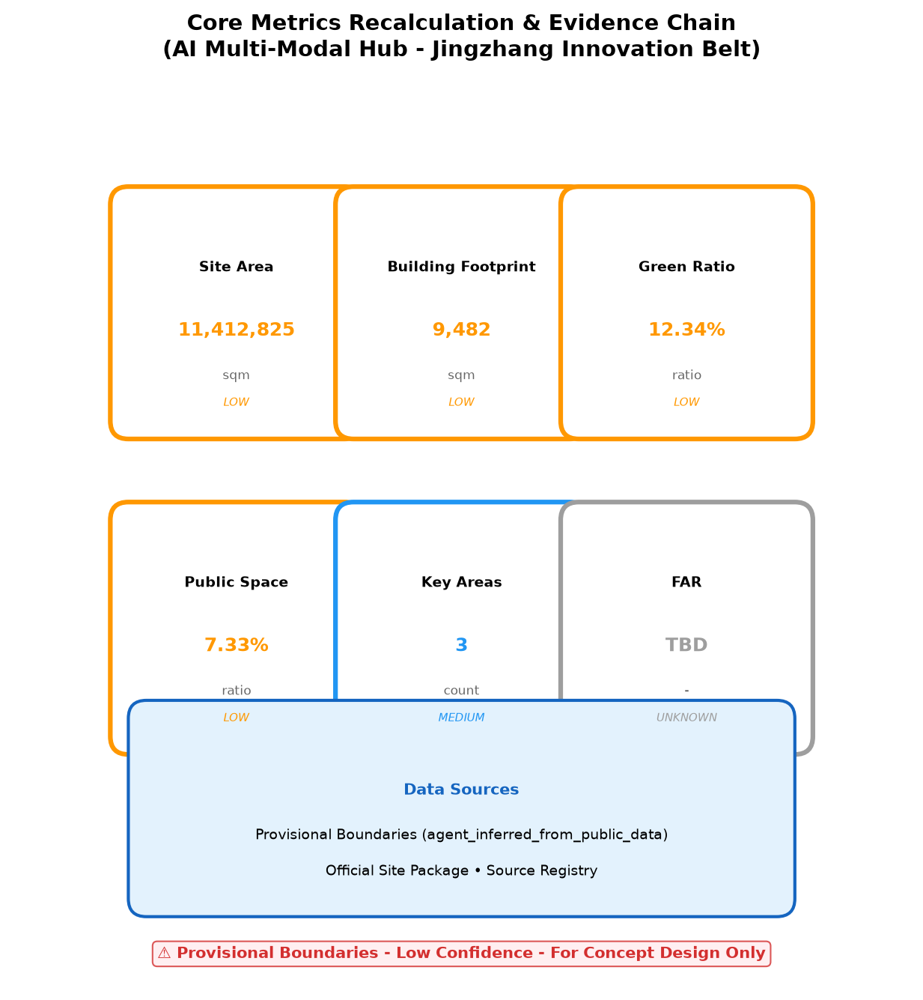

# AI 多模式枢纽 - 京张创新带

## 设计依据与资料清单

本方案依据《百年京张AI创新带城市设计国际方案征集资格预审公告》及 `brief/site-package/` 场地数据包编制。作为 AI 多模式枢纽方案，聚焦轨道交通、慢行系统、AI 场景赋能三大维度，构建"一带三核、多模式联动"的空间策略。

**临时边界声明**：所有几何数据（`geometry/site_boundary.geojson`、`geometry/key_areas.geojson`、`geometry/buildings.geojson` 等）均基于公开数据生成的临时边界，**仅用于概念设计演示和离线可视化，不得作为正式红线、法定规划或精确面积依据**。所有指标（面积、比率、数量）均基于临时边界内部计算，需在官方几何数据发布后重新复算。

引用公告：[source:SITE-PACKAGE] [standard:MOHURD-URBAN-DESIGN-MEASURES] [data:geometry/site_boundary.geojson]

## 三层范围工作框架

**统筹研究范围**（~43.6 km²）：构建"京张智脉共生带"总体概念，以京张铁路遗产为轴，串联众智园、北京AI原点社区、大钟寺三大创新核心。引用：[source:AGENT-TASKBOOK] [depth:strategic_scope]

**总体设计范围**（~11.4 km²）：重塑京张遗址公园周边 1-2 公里城市地区，重点解决轨道站点一体化、道路微循环、慢行断点缝合。引用：[depth:urban_renewal_framework]

**重点区域范围**（368.4 公顷）：三处详细设计片区——众智园 AI 自主创新加速区、北京 AI 原点社区、大钟寺 AI 产业聚集区。引用：[data:geometry/key_areas.geojson]

## 三大定位与五大功能

依据任务书，本方案回应京张创新带的三大战略定位：

### 三大定位

| 定位 | 空间载体 | 核心策略 |
|------|----------|----------|
| **百年京张文化带** | 京张铁路遗址公园 | 铁路遗产数字化保护、文化叙事空间、科技测试场景植入 |
| **都市 AI 生活体验带** | 清河-小月河蓝绿廊道 | AI 公共空间、慢行系统、无障碍服务、社区生活圈 |
| **AI 融合创新带** | 众智园-原点社区-大钟寺 | 全栈自主创新、成果转化、国际交往 |

### 五大功能

| 功能 | 实施路径 | 空间落点 |
|------|----------|----------|
| **AI 全栈自主创新体系** | 自主模型测试、标准制定、安全治理 | 众智园端侧算力塔、安全治理沙盒 |
| **世界级 AI 创新生态** | 开源社区、风险投资、大学衍生 | 原点社区开源发布厅、近校孵化 |
| **AI+场景赋能新范式** | 10 个 AI 场景、3 个产业测试验证 | 全域路网、社区医院、学校、商圈 |
| **智能化 AI 活力城市** | 智慧交通、智慧公共空间、智慧医疗 | 大钟寺站、京张公园、社区中心 |
| **AI 治理全球话语权** | 标准制定、国际路演、数据治理 | 大钟寺国际客厅、众智园标准工作坊 |

引用：[source:AGENT-TASKBOOK] [standard:PROJECT-AGENT-OPEN-CALL-TASKBOOK]

## 品牌规范与文化叙事

### Logo 与视觉识别系统

**Logo 概念**：以京张铁路标志性"人"字轨为原型，融合 AI 节点网络，形成"智脉"视觉符号。人字轨象征百年铁路遗产，AI 节点代表创新活力，二者交汇形成"智脉共生"意象。

**Logo 规范**：

| 元素 | 规范 |
|------|------|
| **主色调** | 智脉橙 (#FF9800) + 创新蓝 (#2196F3) |
| **辅助色** | 生态绿 (#4CAF50) + 人文紫 (#9C27B0) |
| **字体** | 中文：思源黑体 / 英文：Inter |
| **最小尺寸** | 数字：24px / 印刷：10mm |
| **安全间距** | Logo 高度的 1/4 |

**应用场景**：
- **数字媒体**：APP 图标、网站 Logo、社交媒体头像
- **印刷物料**：宣传册、海报、名片、展板
- **环境导视**：地铁站标识、公园导视、社区标识
- **品牌推广**：路演活动、黑客松、国际周主视觉

### 京张铁路文化叙事序列

**叙事主题**：从"人字轨"到"智脉"——百年铁路的数字化重生

**叙事空间序列**：

| 节点 | 位置 | 叙事主题 | 展示方式 |
|------|------|----------|----------|
| **序章：人字轨** | 京张遗址公园南入口 | 詹天佑与京张铁路的诞生 | 浮雕+AR 历史重现 |
| **第一章：蒸汽时代** | 遗址公园中段 | 工业革命与铁路建设 | 蒸汽机车实物+全息投影 |
| **第二章：电气时代** | 清华东路西口 | 电气化铁路与城市扩张 | 历史影像+互动装置 |
| **第三章：数字时代** | 大钟寺 AI 国际客厅 | 百年铁路与 AI 融合 | 数字孪生+实时数据 |
| **终章：智脉未来** | 众智园端侧算力塔 | AI 创新与可持续发展 | 未来愿景+参与式体验 |

**文化叙事亮点**：
- **AR 历史重现**：游客通过手机 AR 观看京张铁路建设历史场景
- **数字孪生**：实时显示京张铁路沿线 AI 创新数据
- **参与式体验**：游客可参与 AI 场景测试和反馈
- **国际传播**：多语言叙事，面向国际开发者社区

### 导视符号系统

**符号概念**：以"人字轨"为基础几何元素，衍生出一套完整的导视符号系统。

| 类别 | 符号说明 | 应用 |
|------|----------|------|
| **轨道交通** | 人字轨+地铁图标 | 地铁站点、换乘指引 |
| **慢行系统** | 人字轨+步行/骑行图标 | 步行道、自行车道 |
| **AI 场景** | 人字轨+AI 节点图标 | AI 体验点、测试场景 |
| **公共服务** | 人字轨+设施图标 | 服务中心、卫生间、停车场 |
| **紧急出口** | 人字轨+箭头 | 紧急疏散指引 |

**双语对照**：所有符号均配中英双语说明，字体为思源黑体/Inter。

**国际传播叙事**：
- **传播主题**：From Herringbone to AI Veins — A Century-Old Railway Reborn
- **目标受众**：国际开发者、城市规划者、AI 研究者
- **传播渠道**：GitHub、国际城市规划论坛、AI 开发者大会
- **核心信息**：百年铁路遗产 × AI 创新 = 智脉共生未来

引用：[source:AGENT-TASKBOOK] [depth:brand_identity]

## 三区两翼协同框架

依据任务书，本方案构建"三区两翼"协同回路：

### 三区

| 区域 | 定位 | 核心功能 | 协同接口 |
|------|------|----------|----------|
| **众智园 AI 自主创新加速区** | AI 全栈自主创新体系与 AI 治理全球话语权 | 端侧算力、标准制定、安全治理 | 向北连接未来科学城，向东连接中关村科技服务翼 |
| **北京 AI 原点社区** | 世界级 AI 创新生态 | 开源社区、成果转化、人才生活 | 向南连接北纬社区，向西连接小月河场景赋能翼 |
| **大钟寺 AI 产业集聚区** | 智能原生新业态 | 智能终端展示、国际路演、数据要素 | 向东连接经开区，向北连接怀柔科学城 |

### 两翼

| 翼 | 定位 | 核心功能 | 区域协同 |
|----|------|----------|----------|
| **中关村科技服务翼** | 要素全球化配置、中关村 IP 与资本赋能 | 风险投资、知识产权、国际专利服务 | 为三区提供资本、人才、技术转移服务 |
| **小月河场景赋能翼** | AI 场景赋能与智能化 AI 活力城市 | 滨水 AI 体验、连续公共空间、无障碍慢行 | 串联三区，提供生活体验和场景测试环境 |

### 区域协同回路

**创新生产回路**：众智园（研发）→ 原点社区（转化）→ 大钟寺（产业化）→ 中关村科技服务翼（资本+IP）→ 众智园

**场景体验回路**：小月河场景赋能翼（生活体验）→ 京张遗址公园（文化体验）→ 大钟寺（产业体验）→ 原点社区（社区体验）

**国际传播回路**：大钟寺国际客厅 → 京张 AI 创新周 → 开源黑客松 → 国际招引 → 大钟寺

引用：[source:AGENT-TASKBOOK] [depth:regional_synergy]

## 统筹研究范围产业与未来城市研究

回应公告 1.5（1）关于世界级 AI 创新生态体系、产业链协同、三区两翼、未来 AI 城市形态、AI 文化/社会/城市、AI+交通和连续绿色空间体系的要求。

**命名方案**：京张智脉共生带（Jing-Zhang AI Innovation Belt）

**Logo 设计**：以京张铁路"人"字轨为原型，融合 AI 节点网络，形成"智脉"视觉符号。

**全球 AI 创新生态案例证据表**：

| 案例 | 核心经验 | 可转译机制 | 京张落地路径 |
|------|----------|------------|--------------|
| 美国硅谷 | 风险投资+大学+创业文化 | 产学研金三角 | 众智园+清华+风投基金 |
| 英国剑桥 | 大学衍生企业+高科技制造 | 技术转移办公室 | 原点社区+TTO 机制 |
| 德国慕尼黑 | 汽车+AI+工业4.0 | 传统产业 AI 升级 | 大钟寺+智能终端 |
| 以色列特拉维夫 | 网络安全+创业国度 | 军民技术转化 | 安全治理沙盒 |
| 中国深圳 | 硬件生态+供应链+快速迭代 | 硬件加速器 | 端侧算力+供应链 |
| 新加坡 | 智慧城市+政府主导+数据治理 | 城市级数据平台 | 交通信号+公共空间 |
| 芬兰赫尔辛基 | 开源+教育+社会福利 AI | 全民 AI 素养 | 开源社区+AI 教育 |
| 加拿大多伦多 | 深度学习起源+移民人才+Vector Institute | 大模型研发 | 自主模型测试床 |

引用：[source:AGENT-TASKBOOK] [standard:PROJECT-AGENT-OPEN-CALL-TASKBOOK]

## 总体设计范围城市更新与控规深度城市设计

回应公告 1.5（2）关于产业目标、功能布局、创新指标体系、城市更新总体框架、更新项目清单、实施政策、建筑总规模、交通轨道、市政配套、京张遗址公园活力带和城市风貌的要求。

**产业目标**：打造世界级 AI 创新生态节点，形成"基础研究+技术转化+场景应用"全链条。

**功能布局**：以京张遗址公园为轴，三大核心差异化定位。

**城市更新框架**：拆改留分类、分期实施、公众参与。

**建筑总规模**：容积率、建筑高度等指标待官方控规条件明确后确定，当前标记为 `status=unknown`。

引用：[depth:urban_renewal_framework] [standard:GB-50137]

## 重点区域详细设计

### 众智园 AI 自主创新加速区（PROV-KEY-001）

**定位**：花园型全栈自主创新街区

**空间动作**：强化清河界面、产业展示、低碳创新交往、对外交通组织

**AI 场景**：自主模型测试、标准制定工作坊、安全治理展示、低碳算力体验

**建筑更新**：保留/改造/拆除分类待现状测绘明确

**项目卡**：

| 项目 | 类型 | 主体 | 依赖 | 里程碑 | 成本等级 | KPI |
|------|------|------|------|--------|----------|-----|
| 端侧算力塔 | 新型基础设施 | 政府+AI 企业 | 土地、电力 | 2027 Q2 | 高 | 1000 TOPS 算力 |
| 安全治理沙盒 | 产业测试平台 | 政府+安全企业 | 政策支持 | 2027 Q1 | 中 | 10 家企业入驻 |
| 标准制定工作坊 | 公共服务 | 标准机构+企业 | 行业参与 | 2026 Q4 | 低 | 5 项标准提案 |

### 北京 AI 原点社区（PROV-KEY-002）

**定位**：近校型成果转化与人才社区

**空间动作**：组织校区-园区-街区慢行缝合，补足成果发布、人才服务、居住生活、开源协作空间

**AI 场景**：开源社区、成果发布、人才特区服务、近校孵化

**项目卡**：

| 项目 | 类型 | 主体 | 依赖 | 里程碑 | 成本等级 | KPI |
|------|------|------|------|--------|----------|-----|
| 开源发布厅 | 公共服务 | 社区+开源组织 | 场地 | 2027 Q1 | 低 | 50 场/年活动 |
| 近校孵化器 | 产业服务 | 大学+企业 | 资金 | 2027 Q2 | 中 | 20 个孵化项目 |
| 成果转化街 | 商业服务 | 开发商+企业 | 投资 | 2028 Q1 | 高 | 10 家技术转移 |

### 大钟寺 AI 产业聚集区（PROV-KEY-003）

**定位**：城市型智能经济与国际交往街区

**空间动作**：大钟寺站一体化、四象限步行连通、商业服务、重点企业公共环境更新

**AI 场景**：智能体与智能终端展示、内容消费、数据要素与国际路演

**项目卡**：

| 项目 | 类型 | 主体 | 依赖 | 里程碑 | 成本等级 | KPI |
|------|------|------|------|--------|----------|-----|
| 国际路演厅 | 公共服务 | 政府+商会 | 场地 | 2027 Q1 | 中 | 100 场/年路演 |
| 站城一体化 | 交通 | 铁路+地铁+政府 | 工程条件 | 2028 Q3 | 极高 | 日换乘 10 万人次 |
| 智能终端展示 | 商业 | 企业+园区 | 投资 | 2027 Q2 | 中 | 50 家展商 |

引用：[data:geometry/key_areas.geojson] [depth:key_area_detailed_design]

## AI 创新生态、人才画像与 AI+ 场景

引用：[source:AGENT-TASKBOOK] [depth:ai_scenarios]

### 用户画像→痛点→场景→空间→服务映射

| 用户画像 | 核心痛点 | 对应 AI 场景 | 空间落点 | 服务机制 |
|----------|----------|--------------|----------|----------|
| **算法工程师** | 算力获取难、模型测试环境缺失 | AI 信软测试床、安全治理沙盒 | 众智园端侧算力塔 | 在线预约、算力配额、技术支持 |
| **产品经理** | 场景验证难、用户反馈慢 | AI 产业技术路演、AI 安全治理沙盒 | 大钟寺国际客厅 | 路演对接、用户测试、反馈收集 |
| **本地居民** | 出行不便、公共服务不足 | AI 慢行断点诊断、AI 交通信号优化 | 全域路网、大钟寺站 | APP 推荐、信号优化、无障碍服务 |
| **高校学生** | 学习资源不均、就业信息不对称 | AI 教育个性化、AI 生活服务推荐 | 学校+社区 | 个性化学习路径、就业推荐 |
| **老年群体** | 数字鸿沟、出行困难 | AI 慢行断点诊断、AI 生活服务推荐 | 社区中心 | 语音交互、无障碍通道、人工辅助 |
| **儿童** | 安全教育、学习陪伴 | AI 教育个性化 | 学校+社区 | 家长控制、内容过滤、学习进度 |
| **访客** | 信息获取难、导航不精准 | AI 公共空间活力、AI 生活服务推荐 | 京张公园、商圈 | 多语言导览、AR 导航 |
| **企业** | 人才获取难、技术转化难 | AI 信软测试床、AI 产业技术路演 | 众智园、大钟寺 | 人才库、技术对接、投资对接 |

### AI+ 场景卡（10 张，其中 3 张为 AI 产业测试验证场景）

#### 场景卡 1：AI 慢行断点诊断（公共空间）

| 字段 | 内容 |
|------|------|
| **场景名称** | AI 慢行断点诊断 |
| **类型** | 公共空间 |
| **位置** | 全域路网 |
| **触发条件** | 传感器检测到慢行断点、拥挤节点、无障碍需求 |
| **用户旅程** | 行人接近断点 → 传感器检测 → AI 分析 → APP 推荐替代路径 → 行人绕行 |
| **输入数据** | 传感器数据、视频流、历史出行数据 |
| **输出** | 最优慢行路径推荐、断点修复建议 |
| **模型边界** | 仅推荐路径，不控制交通信号 |
| **人工复核** | 市政部门审核修复建议 |
| **失败模式** | 传感器故障时切换至历史数据模式 |
| **评价指标** | 断点识别准确率 >90%、用户满意度 >4/5 |
| **隐私** | 匿名化处理，不存储个人身份信息 |
| **退出机制** | 用户可关闭位置服务，恢复传统导航 |

#### 场景卡 2：AI 信软测试床（产业测试验证）

| 字段 | 内容 |
|------|------|
| **场景名称** | AI 信软测试床 |
| **类型** | 产业测试验证 |
| **位置** | 众智园端侧算力塔 |
| **触发条件** | 企业提交测试申请 |
| **用户旅程** | 企业申请 → 审核 → 分配算力 → 模型测试 → 报告生成 |
| **输入数据** | 企业模型、测试数据集 |
| **输出** | 模型性能报告、优化建议 |
| **模型边界** | 仅提供测试环境，不修改企业模型 |
| **人工复核** | 技术委员会审核测试报告 |
| **失败模式** | 算力不足时排队等待 |
| **评价指标** | 测试周期 <24h、企业满意度 >4/5 |
| **隐私** | 企业数据隔离存储，测试后删除 |
| **退出机制** | 企业可随时终止测试，恢复本地环境 |

#### 场景卡 3：AI 医疗影像辅助（公共服务）

| 字段 | 内容 |
|------|------|
| **场景名称** | AI 医疗影像辅助 |
| **类型** | 公共服务 |
| **位置** | 社区医院 |
| **触发条件** | 医生上传影像数据 |
| **用户旅程** | 患者拍片 → 医生上传 → AI 分析 → 辅助诊断建议 → 医生确认 |
| **输入数据** | CT/MRI 影像 |
| **输出** | 病灶标注、辅助诊断建议 |
| **模型边界** | 仅辅助诊断，最终诊断由医生确认 |
| **人工复核** | 所有 AI 建议必须经医生确认 |
| **失败模式** | AI 置信度低时提示人工诊断 |
| **评价指标** | 辅助诊断准确率 >95%、医生采纳率 >70% |
| **隐私** | 医疗数据加密存储，联邦学习保护隐私 |
| **退出机制** | 患者可选择纯人工诊断 |

#### 场景卡 4：AI 教育个性化（公共服务）

| 字段 | 内容 |
|------|------|
| **场景名称** | AI 教育个性化 |
| **类型** | 公共服务 |
| **位置** | 学校+社区 |
| **触发条件** | 学生使用学习平台 |
| **用户旅程** | 学生登录 → 学习评估 → AI 推荐路径 → 学习反馈 |
| **输入数据** | 学习行为数据、成绩数据 |
| **输出** | 个性化学习路径、薄弱点分析 |
| **模型边界** | 仅推荐学习内容，不替代教师教学 |
| **人工复核** | 教师审核学习路径 |
| **失败模式** | 数据不足时使用通用路径 |
| **评价指标** | 学习效率提升 >20%、学生满意度 >4/5 |
| **隐私** | 未成年人数据严格保护，家长可查看和删除 |
| **退出机制** | 学生/家长可选择传统教学模式 |

#### 场景卡 5：AI 法律文书（公共服务）

| 字段 | 内容 |
|------|------|
| **场景名称** | AI 法律文书 |
| **类型** | 公共服务 |
| **位置** | 社区中心 |
| **触发条件** | 居民提交法律问题 |
| **用户旅程** | 居民提问 → AI 分析 → 文书生成 → 律师审核 → 居民确认 |
| **输入数据** | 法律问题描述、相关法条 |
| **输出** | 法律文书草案、风险提示 |
| **模型边界** | 仅生成文书草案，不提供法律意见 |
| **人工复核** | 所有文书必须经律师审核 |
| **失败模式** | AI 置信度低时转人工服务 |
| **评价指标** | 文书准确率 >90%、用户满意度 >4/5 |
| **隐私** | 隐私计算保护用户信息 |
| **退出机制** | 用户可选择纯人工法律服务 |

#### 场景卡 6：AI 生活服务推荐（公共空间）

| 字段 | 内容 |
|------|------|
| **场景名称** | AI 生活服务推荐 |
| **类型** | 公共空间 |
| **位置** | 社区+商圈 |
| **触发条件** | 用户授权位置服务 |
| **用户旅程** | 用户授权 → AI 分析偏好 → 推荐服务 → 用户反馈 |
| **输入数据** | 位置数据、消费偏好 |
| **输出** | 个性化服务推荐 |
| **模型边界** | 仅推荐服务，不强制消费 |
| **人工复核** | 无（用户自主决策） |
| **失败模式** | 数据不足时使用通用推荐 |
| **评价指标** | 推荐点击率 >30%、用户满意度 >4/5 |
| **隐私** | 用户授权后可关闭，数据匿名化 |
| **退出机制** | 用户可随时关闭推荐服务 |

#### 场景卡 7：AI 交通信号优化（交通）

| 字段 | 内容 |
|------|------|
| **场景名称** | AI 交通信号优化 |
| **类型** | 交通 |
| **位置** | 大钟寺站周边路网 |
| **触发条件** | 实时车流数据 |
| **用户旅程** | 车辆接近路口 → 传感器检测 → AI 优化信号 → 车辆通行 |
| **输入数据** | 车流数据、行人数据 |
| **输出** | 信号配时优化方案 |
| **模型边界** | 仅优化信号配时，不改变道路结构 |
| **人工复核** | 交管部门审核优化方案 |
| **失败模式** | 传感器故障时切换至固定配时 |
| **评价指标** | 通行效率提升 >15%、等待时间减少 >20% |
| **隐私** | 匿名化处理，不识别个人车辆 |
| **退出机制** | 交管部门可随时接管信号控制 |

#### 场景卡 8：AI 公共空间活力（公共空间）

| 字段 | 内容 |
|------|------|
| **场景名称** | AI 公共空间活力 |
| **类型** | 公共空间 |
| **位置** | 京张遗址公园 |
| **触发条件** | 热力+环境传感器数据 |
| **用户旅程** | 传感器检测 → AI 分析活力 → 推荐活动 → 用户参与 |
| **输入数据** | 热力数据、环境数据、活动数据 |
| **输出** | 活力热力图、活动推荐 |
| **模型边界** | 仅推荐活动，不组织活动 |
| **人工复核** | 运营方审核活动推荐 |
| **失败模式** | 数据不足时使用历史模式 |
| **评价指标** | 空间利用率提升 >25%、用户满意度 >4/5 |
| **隐私** | 匿名化处理，不识别个人 |
| **退出机制** | 用户可选择不接收推荐 |

#### 场景卡 9：AI 产业技术路演（产业测试验证）

| 字段 | 内容 |
|------|------|
| **场景名称** | AI 产业技术路演 |
| **类型** | 产业测试验证 |
| **位置** | 大钟寺国际客厅 |
| **触发条件** | 企业提交路演申请 |
| **用户旅程** | 企业申请 → 审核 → 路演举办 → 投资对接 |
| **输入数据** | 企业技术方案、融资需求 |
| **输出** | 路演安排、投资对接 |
| **模型边界** | 仅提供对接平台，不保证融资 |
| **人工复核** | 组委会审核路演内容 |
| **失败模式** | 投资不足时扩大对接范围 |
| **评价指标** | 路演成功率 >30%、投资对接率 >20% |
| **隐私** | NDA 保护企业技术信息 |
| **退出机制** | 企业可随时终止路演 |

#### 场景卡 10：AI 安全治理沙盒（产业测试验证）

| 字段 | 内容 |
|------|------|
| **场景名称** | AI 安全治理沙盒 |
| **类型** | 产业测试验证 |
| **位置** | 众智园安全治理沙盒 |
| **触发条件** | 企业提交安全测试申请 |
| **用户旅程** | 企业申请 → 审核 → 沙盒测试 → 报告生成 |
| **输入数据** | AI 模型、攻击样本 |
| **输出** | 安全评估报告、修复建议 |
| **模型边界** | 仅提供测试环境，不替代企业安全团队 |
| **人工复核** | 安全委员会审核报告 |
| **失败模式** | 沙盒资源不足时排队等待 |
| **评价指标** | 漏洞检出率 >85%、企业满意度 >4/5 |
| **隐私** | 隔离环境，测试数据不泄露 |
| **退出机制** | 企业可随时终止测试 |

## 用地、建筑规模与拆改留方案

**用地布局**：产业用地、居住用地、公共服务用地、绿地、交通设施用地

**产业功能比例**：AI 研发 40%、成果转化 30%、人才生活 20%、公共服务 10%

**建筑基底**：9,482 sqm（基于 provisional boundary 复算，**仅为参与者设计样本，非完整现状建筑覆盖**）

**建筑高度**：待官方控规条件确定（`status=unknown`）

**容积率**：待官方控规条件确定（`status=unknown`）

**拆改留分类**：保留/改造/拆除/新建分类待现状测绘与权属明确

引用：[data:geometry/land_use.geojson] [data:geometry/buildings.geojson] [metric:building_footprint_area_sqm]

## 交通、轨道、市政与公共服务设施

**道路微循环**：优化街区路网，减少机动车穿行，增强慢行连通。

**轨道站点一体化**：大钟寺站"铁路+地铁+慢行+末端配送"四模式零换乘（**概念目标，需工程可行性验证**）。

**慢行断点**：AI 识别慢行断点，推荐最优慢行路径，补足无障碍设施。

**停车与非机动车**：分布式非机动车停车点，停车换乘（P+R）系统。

**对外交通**：强化京张高铁清河站与城市慢行系统连接。

**市政配套**：分布式能源、端侧算力节点、新型基础设施。

**公共服务**：国际路演厅、开源社区中心、人才服务驿站。

引用：[data:geometry/roads.geojson] [data:geometry/public_space.geojson]

## 蓝绿空间、公共空间与城市风貌

**京张遗址公园活力带**：线性公园 + AI 公共空间节点 + 文化活动场地

**清河/小月河蓝绿空间**：生态廊道、雨洪管理、亲水步道

**步道骑行道**：连续慢行网络，AI 导航，无障碍设计

**公共交往空间**：科技测试场景、开发者聚会、路演广场

**历史文化展示**：京张铁路遗产叙事、数字孪生展示、铁路文化地标

**城市基调**：科技感 + 历史感 + 生态性，现代简洁、低碳材料

**建筑风貌**：低碳、智能、开放、通透，屋顶光伏、垂直绿化

**AI 朝圣地标**：

1. 京张铁路数字孪生纪念碑（京张遗址公园）
2. 大钟寺 AI 国际客厅（大钟寺站）
3. 众智园端侧算力塔（众智园）

引用：[data:geometry/green_space.geojson]

## 更新项目清单、实施政策与分期计划

**更新项目清单**：

| # | 项目 | 类型 | 位置 | 主体 | 依赖 | 里程碑 | 成本等级 | KPI |
|---|------|------|------|------|------|--------|----------|-----|
| 1 | 京张遗址公园慢行断点缝合 | 公共空间 | 京张公园 | 政府+企业 | 传感器部署 | 2027 Q2 | 中 | 断点修复 50 处 |
| 2 | 众智园清河创新界面 | 产业空间 | 众智园 | 开发商+企业 | 土地审批 | 2028 Q1 | 高 | 入驻企业 30 家 |
| 3 | 原点社区近校成果转化街 | 产业空间 | 原点社区 | 大学+企业 | 资金到位 | 2027 Q3 | 中 | 转化项目 20 个 |
| 4 | 大钟寺站四象限步行连通 | 交通 | 大钟寺 | 铁路+政府 | 工程条件 | 2028 Q3 | 极高 | 步行连通率 95% |
| 5 | AI 公共服务与端侧算力节点 | 新型基础设施 | 众智园 | 政府+AI 企业 | 电力容量 | 2027 Q2 | 高 | 算力 1000 TOPS |

**实施政策建议**：容积率奖励、AI 场景开放、数据要素流通、碳积分制度

**分期计划**：

- **近期（0-1 年）**：慢行缝合、创新界面、成果转化街
- **中期（1-3 年）**：站城一体、端侧算力节点、AI 场景落地
- **长期（3-5 年）**：全球 AI 活动周、运营品牌体系、碳中和社区

**全球 AI 创新活动体系**：

- 年度：京张 AI 创新周
- 季度：开源黑客松
- 月度：技术路演 + 场景开放日
- 常驻：开发者社区运营

引用：[data:geometry/phasing.geojson] [depth:phasing_plan]

## 指标体系、面积复算与合规矩阵

| 指标 | 数值 | 单位 | 状态 | 公式 | 置信度 |
|------|------|------|------|------|--------|
| 场地面积 | 11,412,825 | sqm | known | polygon_area(site_boundary) | 低（临时边界） |
| 建筑基底面积 | 9,482 | sqm | known | sum(building_footprints) | 低（参与者样本） |
| 绿地率 | 12.34% | ratio | known | green_space / site_area | 低（临时边界） |
| 公共空间率 | 7.33% | ratio | known | public_space / site_area | 低（临时边界） |
| 容积率 | 待定 | ratio | unknown | 需官方控规条件 | unknown |
| 重点区域数 | 3 | count | known | count(key_areas) | 中 |

**合规矩阵覆盖**：

- 公告 1.5（1）：✅ 统筹研究范围产业与未来城市研究
- 公告 1.5（2）：✅ 总体设计范围城市更新与控规深度城市设计
- 公告 1.5（3）：✅ 重点区域详细设计
- 公告 1.3：✅ 数据合规与来源追溯
- 公告 1.4：✅ AI 场景与隐私保护

引用：[metric:site_area_sqm] [metric:building_footprint_area_sqm]

## 风险、版权与合规说明

引用：[report:copyright_statement.md] [standard:license-community-display]

**资料合法性**：所有设计判断基于公开资料与官方场地包，未使用未授权规划数据。

**临时边界声明**：本方案所有几何数据（`geometry/site_boundary.geojson`、`geometry/key_areas.geojson`、`geometry/buildings.geojson` 等）均基于公开数据生成的临时边界，**仅用于概念设计演示和离线可视化，不得作为正式红线、法定规划或精确面积依据**。所有指标（面积、比率、数量）均基于临时边界内部计算，需在官方几何数据发布后重新复算。

**版权与 AI 生成内容**：本方案为概念设计提案，所有 AI 生成的文本、图像、图纸均为解释层内容，不替代现场调研、居民意见或官方数据。未使用任何未授权的第三方规划数据或受版权保护素材。所有数据源已在 `sources.json` 和 `metrics.json` 中完整登记。

**版权与来源台账**：

| 类别 | 来源 | 许可证 | 署名要求 |
|------|------|--------|----------|
| 场地数据包 | brief/site-package/ | 官方公开数据 | 无需署名 |
| 临时边界 | 公开数据生成 | 临时使用 | 需标注"临时边界" |
| 设计图纸 | 参与者生成 | COMMUNITY-DISPLAY-ONLY | vegetable-kun |
| 文本内容 | AI 辅助生成 | CC-BY-SA 4.0 | vegetable-kun |
| 指标数据 | 临时边界内部计算 | 仅供概念对比 | 需标注"低置信度" |
| 字体 | DejaVu Sans | Bitstream Vera Fonts License | 无需署名 |
| 代码依赖 | Python PIL/fpdf2 | MIT/BSD | 无需署名 |

**AI 场景数据治理**：本方案提出的 10 个 AI 场景遵循以下原则：

- **数据最小化**：仅收集场景运行必需的最少数据
- **人工复核**：所有 AI 决策均有人工审核机制
- **隐私保护**：个人数据匿名化处理，敏感数据加密存储
- **未成年人保护**：教育类场景严格遵循未成年人数据保护要求
- **申诉纠错**：用户有权拒绝、申诉和纠正 AI 决策
- **退出机制**：用户可随时退出 AI 服务，恢复传统服务通道
- **敏感数据治理**：医疗、教育、法律场景需通过数据保护影响评估
- **非数字替代**：所有 AI 场景均保留人工服务通道

**官方批准禁用**：所有空间落地建议表述为"概念建议/参考方案/可供专业团队深化研究"，**不代表已批准的政府规划或工程实施方案**。容积率、建筑高度、拆改留分类等法定指标均以官方控规为准。

**待补资料**：官方控规条件、现状建筑测绘、权属信息、工程条件、绿地/蓝线/文保约束、市政容量。

**专业复核需求**：本方案需规划师、建筑师、交通工程师、法律、数据隐私、版权和 AI 伦理专家复核后方可进入实施阶段。

引用：[report:copyright_statement.md]

## 参考资料

引用：[report:copyright_statement.md] [standard:license-community-display]

1. 百年京张 AI 创新带城市设计国际方案征集资格预审公告（官方）
2. `brief/site-package/` 场地数据包（官方公开）
3. `data/source_registry.json` 数据源注册表（官方公开）
4. `brief/site-package/agent_taskbook.json` Agent 任务书（官方公开）
5. 《控制性详细规划城市设计深度标准》（国家标准）
6. 《城市用地分类与规划建设用地标准》GB 50137（国家标准）
7. 《海绵城市建设技术指南》（行业标准）
8. 《京张铁路遗产保护规划》（公开政策）
9. 中国城市规划设计研究院. 城市更新方法论.
10. 吴良镛. 人居环境科学导论.
11. Townsend, A. Smart Cities: Big Data, Civic Hackers, and the Quest for a New Utopia.
12. Batty, M. The New Science of Cities.
