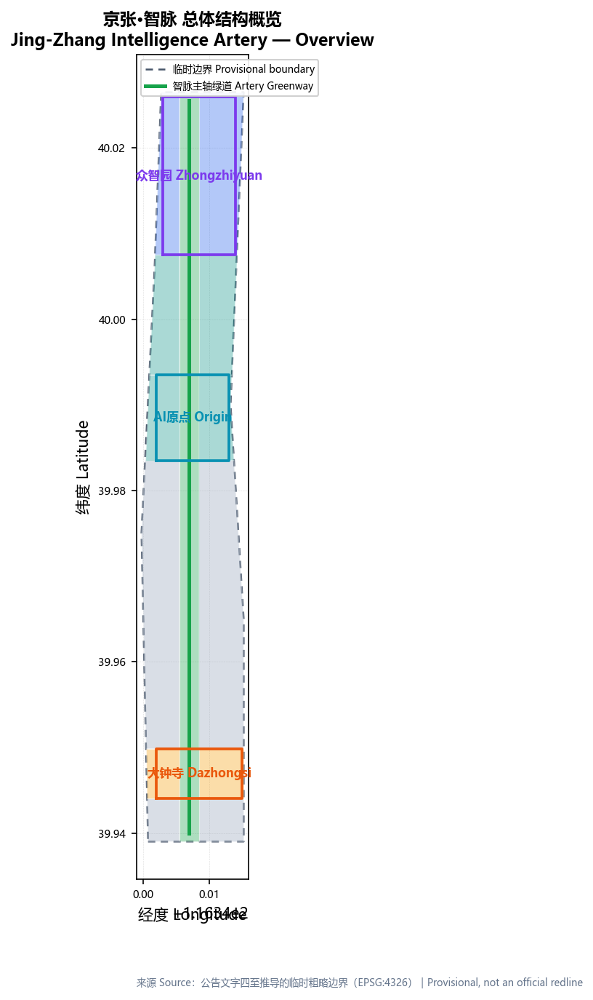
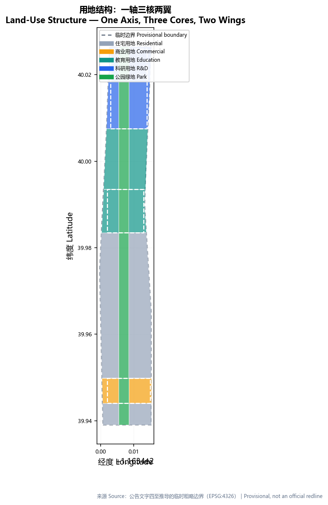
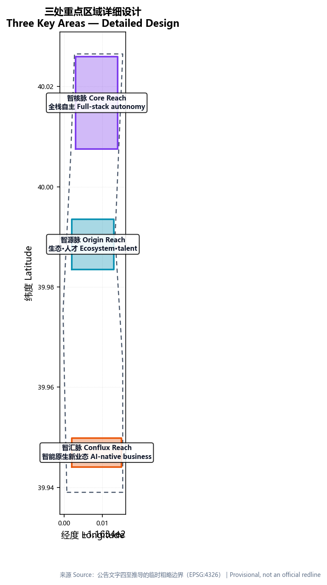
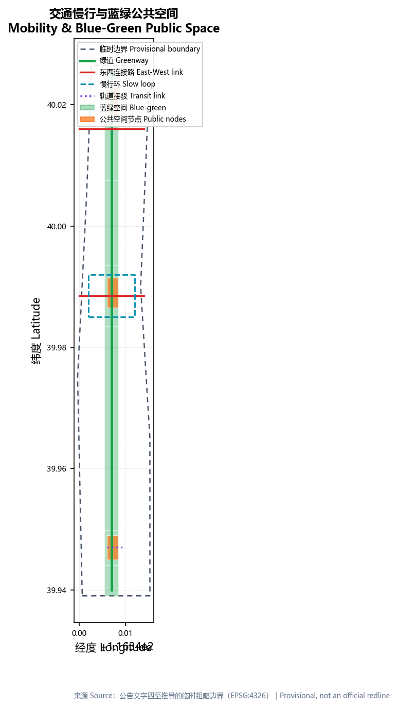
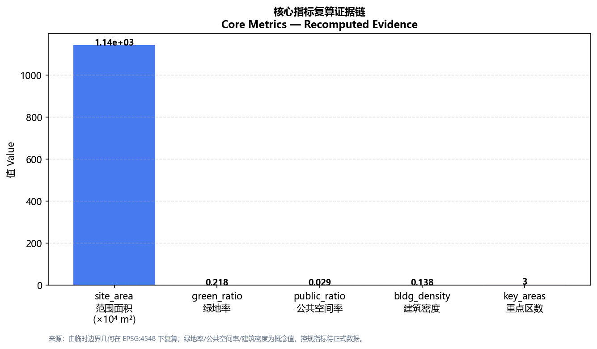

# 京张·智脉 —— 从自主铁路到自主智能 (Jing-Zhang Intelligence Artery)

## 设计依据与资料清单

本方案以北京市规划和自然资源委员会海淀分局发布的《百年京张AI创新带城市设计国际方案征集资格预审公告》为第一主控依据，以面向全球智能体的任务书摘录作为六项 agent 任务的响应框架 [source:OFFICIAL-ANNOUNCEMENT] [source:AGENT-TASKBOOK]。所有空间落地建议均表述为「概念建议 / 参考方案 / 可供专业团队深化研究」，不替代正式规划，不构成政府审定结论。场地三层范围与三处重点区目前只有维护者依据公告文字四至推导的临时粗略 polygon，正式精确红线尚未公开，因此本方案统一以「待正式数据补齐」标注精度边界，并承诺官方 polygon 发布后重算全部图层与指标。

资料遵循公开来源登记表分级 [source:SOURCE-REGISTRY]。本方案另引入三条与场地直接相关的官方锚点：北京市规自委已批复的《京张铁路遗址公园沿线（人工智能创新街区重点地区）HD00—1601 等街区控制性详细规划》确定「一带一轴、两心多点」结构、9 个街区总用地约 1668.2 公顷 [source:SRC-JZ-PARK-PLAN]；京张铁路 1905 年开工、1909 年通车、詹天佑任总工程师且清华园站为其题名 [source:SRC-JZ-HERITAGE]；中关村从 1980 年陈春先创业、1988 年首个国家级高新区到 2009 年首个国家自主创新示范区 [source:SRC-ZGC-HISTORY]。这三条把「历史之脉—创新之脉—智能之脉」的叙事锚定在可核验的官方事实之上。

本方案核心叙事是「从自主铁路到自主智能」：京张铁路是中国第一条自行设计、自行施工、不用外债的干线铁路，是近代技术自主的原点；今天这条线性遗产廊道穿海淀高校与中关村而过，恰好承载 AI 全栈自主、世界级创新生态与城市智能体样板区的新起点 [depth:existing_conditions_diagnosis]。我们把百年「轨道」重新理解为一条持续加速的「智脉」，作为空间骨架与品牌母题贯穿全案。

## 三层范围工作框架

方案按公告确定的三层组织工作 [standard:PROJECT-OFFICIAL-ANNOUNCEMENT]。统筹研究范围约 43.6 平方公里，关注 AI 产业生态、创新链与未来城市形态；总体设计范围约 11.4 平方公里，围绕京张遗址公园周边 1—2 公里城市地区与产业区，形成城市更新总体框架、产业空间布局、交通市政支撑与城市风貌控制；重点区域范围约 368.4 公顷，聚焦众智园、AI原点社区、大钟寺三处详细设计 [depth:three_level_scope_framework]。三层在 `compliance_matrix.json` 中逐条映射，确保公告 1.3、1.4、1.5 与 agent.1—agent.6 的必选任务都有章节、图层、指标、图纸与 HTML 证据。

三层工作与已批复的街区控规「一带一轴、两心多点」直接同构：本方案的「智脉主轴」即控规的「遗址公园产业创新带」，「三核」对应五道口中心（AI 原点社区）与大钟寺中心，「两翼」对应中关村大街创新轴两侧的科技服务与场景赋能功能 [source:SRC-JZ-PARK-PLAN]。这一衔接让概念建议落到官方已确认的空间框架之内，而非另起炉灶 [depth:overall_spatial_structure]。

| 层级 | 设计问题 | 方案回答 | 数据落点 |
| --- | --- | --- | --- |
| 统筹研究范围 | AI 产业生态与未来城市形态如何组织 | 建立「高校策源—开源协作—企业转化—公共体验—国际传播」的创新链 | compliance_matrix.json、standard_matrix.json |
| 总体设计范围 | 产业空间、城市更新、交通市政与风貌如何落图 | 用地、建筑、道路、绿地、公共空间与分期图层共同表达 | [data:geometry/land_use.geojson#LU-001]、[data:geometry/roads.geojson#ROAD-001] |
| 重点区域范围 | 三处片区如何达到详细设计深度 | 分别提出定位、空间动作、AI 场景与实施依赖 | [data:geometry/key_areas.geojson#PROV-KEY-001] 等三处 |

## 统筹研究范围产业与未来城市研究

统筹研究范围的首要任务是构建世界级 AI 创新生态体系。方案提出「一轴三核两翼多节点」总体结构：**一轴**为京张铁路遗址公园这条南北向「智脉主轴」，作为公共空间、文化叙事与 AI 场景的连续载体；**三核**为众智园（智核脉）、AI原点社区（智源脉）、大钟寺（智汇脉）；**两翼**为中关村科技服务翼（要素、资本与 IP 赋能）与小月河场景赋能翼（场景与活力城市体验）[depth:overall_spatial_structure]。三区两翼形成「研发—生态—产业—服务—场景」协同回路，直接回应三大定位与五大功能 [source:AGENT-TASKBOOK] [standard:PROJECT-AGENT-OPEN-CALL-TASKBOOK]。

命名与视觉识别是本方案区别于口号式命名之处（agent.1）。主名「京张·智脉」（英文 Jing-Zhang Intelligence Artery）以「京张」锚定历史与场地、以「脉」隐喻线性廊道与智能流动；各区段以「核/源/汇/翼」命名（智核脉、智源脉、智汇脉、智服翼、智景翼），形成可延展、可注册、可传播的识别系统。Logo 母题是一条铁路轨道在透视中渐变为光带/数据流，轨枕演化为神经网络节点，色彩取历史赭石、创新蓝与 AI 光流青紫三色渐变。具体字体、图像与商标须以清权或自创方式取得。

全球案例转化为空间与机制而非贴标签（agent.2）。剑桥 Kendall Square 以「大学—产业紧邻融合」著称，PUD 区划设容积率上限 3.9、并追求 95% 新增开发落在 5 分钟步行圈内 [source:SRC-KENDALL-SQUARE]，转化为智源脉高校-园区零距离的生态混合；巴黎 Station F 把 3.4 万平方米旧火车站改造为约 1000 家初创的全球最大创业园区、约七成是 AI 公司 [source:SRC-STATION-F]，转化为智汇脉以旧铁路/工业遗存承载智能原生新业态；新加坡 one-north 以 200 公顷、裕廊集团主导的「白地+混合用地」弹性管控支撑启奥生物医药园容积率 4.54 [source:SRC-ONE-NORTH]，转化为智核脉的弹性产业用地机制；多伦多 MaRS 与 Vector Institute 以政府-产业联合出资 C$2 亿、714 名员工构建人才密度 [source:SRC-MARS-VECTOR]，转化为智源脉研究机构与全球人才招引通道；布鲁金斯学会「创新区」12 原则强调「以步数而非英里衡量成功」与「编程至上」[source:SRC-BROOKINGS]，转化为本方案公共空间与运营的底层方法论。每个案例都提炼「空间 + 机制 + 场景」三重可转化要素。

面向 agent.2 的全栈自主体系，众智园承载芯片/算力/框架/大模型的全栈布局，原点社区承载生态与人才，大钟寺承载产业与新业态，中关村翼提供资本与要素、小月河翼提供场景与生活。所有产业招商、资金与政策安排均表述为「概念建议」，不写成已确定事项。

## 总体设计范围城市更新与控规深度城市设计

总体设计范围要求达到控制性详细规划的城市设计深度 [standard:MOHURD-CONTROL-DETAILED-PLANNING]。用地方案采用国土空间用地用海分类语义，以公园绿地（1401）、科研用地（0802）、教育用地（0804）、商业服务业用地（05）、城镇住宅用地（0701）构成完整、闭合、无缝的用地分区 [standard:MNR-LAND-USE-CLASSIFICATION-GUIDE] [data:geometry/land_use.geojson#LU-001]。用地布局把公园走廊作为贯穿南北的绿色骨架，三处重点区作为贴邻廊道的功能核，居住与配套作为东西两翼的支撑——这与「一轴三核两翼」完全同构，也与控规「一带一轴两心多点」衔接 [source:SRC-JZ-PARK-PLAN]。

建筑规模与强度是本方案的边界重灾区。公告未公开容积率、建筑高度、建筑密度、绿地率与退线等控规指标，因此本方案统一将这些管控指标标为待确认，仅在正文给出由几何复算的概念体量，并明确它不等于法定控制值 [depth:development_intensity_controls]。one-north 以「白地+混合用地」弹性管控兼顾产业密度与公共空间品质 [source:SRC-ONE-NORTH]，本方案借鉴其思路，优先保证慢行与公共空间品质、避免高密度产业区沦为步行体验不足的孤岛。建筑基底以保留、改造、新建三类组织，现状建筑、权属与工程条件缺失处一律写成待确认事项，不编造拆改留结论 [depth:retain_renovate_demolish]。交通组织以智脉主轴绿道为纵轴，以三处东西连接路为横轴，形成「一纵三横」慢行骨架，覆盖北五环跨线、五道口、清华东路西口、大钟寺站等关键节点 [depth:traffic_rail_slow_parking] [data:geometry/roads.geojson#ROAD-001]。

市政与新型基础设施策略把分布式能源、端侧算力与公共服务设施作为待深化的新基建原型，融入更新项目与分期，而非给出能源负荷或市政容量的伪精确测算 [depth:municipal_new_infrastructure]。

## 重点区域详细设计

三处重点区是本方案的可实施性验证层，各自形成「定位 + 空间结构 + 建筑更新 + 交通慢行 + 公共空间 + AI 场景 + 实施风险」的小方案，并引用对应图层 [depth:three_key_area_detailed_design]。

**智核脉·众智园AI自主创新加速区**（约 192.1 公顷）：定位为全栈自主的算力、算法、芯片之核，承载 AI 全栈自主创新体系与 AI 治理全球话语权。空间动作强调清河蓝绿界面、产业展示、低碳创新交往与对外交通组织；公共空间以「全栈之塔·自主算力灯塔」为概念节点，把标准制定、安全评测、模型红队测试转译为可参观、可预约、可监管的展示与协作节点 [data:geometry/key_areas.geojson#PROV-KEY-001]。因该区 polygon 为 provisional，建筑规模与高度仅作方向性设计。

**智源脉·北京AI原点社区**（约 104.3 公顷）：定位为世界级 AI 创新生态之源，承载近校创新、成果孵化转化、人才特区与开源体系。空间动作组织校区、园区、街区慢行缝合，补足成果发布、人才服务、居住生活与开源协作空间；以「零公里·智源原点」为概念地标，呼应京张铁路零公里意象与「进京赶考」红色叙事 [source:SRC-JZ-HERITAGE] [data:geometry/key_areas.geojson#PROV-KEY-002]。

**智汇脉·大钟寺AI产业聚集区**（约 72.0 公顷）：定位为智能原生新业态之汇，承载领军企业、智能体、智能终端、内容消费与数据要素。空间动作围绕大钟寺站一体化、四象限步行连通、商业服务与重点企业公共环境更新；以「开源之门·智汇广场」为概念地标，面向开发者社区与全球访客 [data:geometry/key_areas.geojson#PROV-KEY-003] [metric:key_area_count]。

## AI 创新生态、人才画像与 AI+ 场景

面向 AI 人才与企业的空间需求画像覆盖六类人群：全栈科研工程师（需要算力、协作与开源社区）、高校师生与研究者（需要公共实验室、孵化与跨学科交流）、AI 创业团队（需要场景测试、资本、法务与市场转化）、城市居民含老人儿童（需要可感知、可复核、包容的 AI 生活服务）、企业商务与全球访客（需要创新服务、交流空间与「朝圣」体验）、以及公共治理方（需要可解释、可审计的治理演示）。MacroPolo 追踪显示中国培养全球 38% 顶尖 AI 研究者但留存率仅 11%、72% 在美工作 [source:SRC-MACROPOLO]，因此人才社区是本方案公共利益的硬约束：画像逐类映射到空间与自检边界，不把居民画像用于商业推荐、不采集个人行为轨迹。

AI+ 场景不少于 10 张场景卡，其中至少 3 张为产业测试验证场景，每张含「定位 / 用户旅程 / 输入数据 / AI 能力 / 基础设施 / 运营主体 / 失败模式 / 隐私与人工复核」八要素。三条测试验证场景为：AI+ 交通自适应绿波与无人接驳（测试场①，沿智脉主轴，参照杭州城市大脑 128 个路口通行时间降 15.3% 的可量化先例 [source:SRC-HANGZHOU-CITY-BRAIN]）；AI+ 无人配送末端走廊（测试场②，园区-社区衔接带）；AI+ 公共空间治理的人流照明环卫辅助（测试场③，公园走廊，采用 ENoLL 认定的真实环境共创 living lab 方法 [source:SRC-ENOLL-LIVING-LAB]）。其余场景卡覆盖 AI+ 医疗分诊、AI+ 教育开源工坊、AI+ 法律合同预审、AI+ 生活服务多语言导览、AI+ 新零售、AI+ 科研协作、AI+ 文化数字孪生、AI+ 机器人公共服务与 AI+ 治理演示 [source:AGENT-TASKBOOK]。所有场景保留人工复核与退出机制，不把未成熟技术写成已可全面部署。空间证据引用公共空间、慢行与绿地图层 [data:geometry/public_space.geojson#PUBLIC-001] [data:geometry/green_space.geojson#GREEN-001] [metric:public_space_ratio]。

「智脉闸门」是本方案的 AI 原生治理机制（agent.4 治理层），借用开源协作的四步协议，把城市更新与 AI 场景变成可复算、可撤回的公共对象：**提交 Commit**（任何空间/AI 变更以「提交」提出，附数据来源、算法、边界与回滚计划）→ **评审 Review**（专家 + 社区 + AI 三审，核查合规、隐私与公共利益，对应城市更新的方案评审）→ **合并 Merge**（通过后在限定区域灰度上线，实时监测 KPI）→ **回滚 Revert**（KPI 不达标或风险触发即撤回，像回退一个坏 commit）。每个场景卡挂四道「闸门」——数据闸门（合规）、算法闸门（备案）、人工闸门（复核）、回滚闸门（可逆），与城市智能体治理演示（JZ-06）对应 [source:AGENT-TASKBOOK]。

包容性是本方案的公共利益底线：无障碍遵循国标 GB 50763，为老年人、残障人士与非数字用户保留**非数字替代通道**（人工窗口、语音导览、纸质说明），所有 AI 场景须通过**隐私影响评估（PIA）**并提供人工申诉渠道，杜绝「技术排斥」；用户画像不用于商业推荐、不采集个人行为轨迹。

## 用地、建筑规模与拆改留方案

用地布局依据国土空间用途分类语义表达为完整闭合的用地分区，产业功能比例由用地代码复算：公园绿地约占两成、科研与教育用地约占三成半、商业与居住及其余用地承担配套与生活 [standard:MNR-LAND-USE-CLASSIFICATION-GUIDE] [data:geometry/land_use.geojson#LU-001]。建筑基底由 12 个概念体量组成，覆盖研发、实验室、孵化器、人才公寓、教育、社区服务、零售与居住等类型，全部落在用地分区内并可由图层复算 [data:geometry/buildings.geojson#BLDG-001] [metric:building_footprint_area_sqm]。

关于开发强度，任务书禁止把容积率、建筑高度、建筑强度或具体拆改留写成法定规划、审批或工程实施结论。因此本方案将容积率、建筑高度、建筑密度等管控指标统一记为待正式控制条件补齐，当前仅保留由几何复算的概念建筑基底与概念密度，并在 `reason`/`assumptions` 中说明正式数据到位后的复算路径 [depth:development_intensity_controls]。拆改留分类只给方法论（保留/改造/新建的判断维度），不落到具体地块的拆除结论 [depth:retain_renovate_demolish]。

## 交通、轨道、市政与公共服务设施

交通方案回应轨道站点一体化、道路微循环、慢行断点与对外交通的要求。以「智脉主轴绿道」为纵轴串起三核，以三处东西连接路与慢行环缝合铁路廊道两侧，形成东西缝合、南北贯通的慢行骨架 [depth:traffic_rail_slow_parking] [data:geometry/roads.geojson#ROAD-001]。轨道接驳以大钟寺站一体化为示范，五道口与清华东路西口为近校慢行缝合重点。AI+ 交通不写为「全面部署」，而是引用杭州城市大脑「128 个路口、通行时间降 15.3%、拥堵排名从第 2 降至第 83」作为可核验的效果参照，并明确其为既有先例而非本场地的已实现结论 [source:SRC-HANGZHOU-CITY-BRAIN]。道路与慢行图层保持在提交边界内，并与公共空间、绿地、产业节点相互校核；由于提交边界为 provisional，交通结论仅作临时设计讨论。

市政与公共服务设施覆盖 AI 产业服务设施、创新服务平台、人才生活服务、新型基础设施、分布式能源与端侧算力，均作为待深化的概念策略融入分期 [depth:municipal_new_infrastructure]。缺少管线、能源、排水、消防等工程资料处，列为正式深化前置条件，不写成审定条件。

## 蓝绿空间、公共空间与城市风貌

蓝绿空间以京张遗址公园活力带为骨架，把「智脉主轴」落实为一条连续、可步行、可停留的绿色廊道，串联三处重点区与南北端景观节点 [depth:blue_green_public_space] [data:geometry/green_space.geojson#GREEN-001]。绿地与公共空间比例在正文解释为「支撑人才日常交往与创新偶遇」的设计含义，完整复算保存在 `metrics.json` [metric:green_ratio] [metric:public_space_ratio]。

城市风貌融合京张铁路历史文化、中关村创新文化与 AI 新文化。历史层以清华园站（詹天佑题名、1949 年「进京赶考」地标 [source:SRC-JZ-HERITAGE]）为锚点，创新层以中关村从 1980 年电子一条街到 2009 年国家自主创新示范区的制度跃迁为锚点 [source:SRC-ZGC-HISTORY]，智能层以 AI 新文化为锚点，用「历史—创新—智能」三套导视语法叠加于同一廊道，城市气质定位为「可信、开放、青年、共生」。本方案提出三个 AI 朝圣地标（均为概念节点，不宣称已批准建设）：**零公里·智源原点**（AI原点社区，纪念自主智能起点）、**全栈之塔·自主算力灯塔**（众智园，象征全栈自主）、**开源之门·智汇广场**（大钟寺，面向开发者与全球访客），三者构成「原点—之核—之门」的朝圣叙事，并与贡献墙、荣誉展示体系联动 [source:AGENT-TASKBOOK]。所有品牌、字体、图像、肖像与企业标识须清权，不违反文保、绿地、蓝线与交通安全约束 [standard:MOHURD-URBAN-DESIGN-MEASURES]。

## 更新项目清单、实施政策与分期计划

更新项目以可审查的编号矩阵组织，逐项列牵头主体（建议）、协同主体、前置条件、审批节点、成本量级（建议）、验收 KPI（建议）与回滚/退出触发器。以下为 12 项核心更新项目（成本量级为概念区间，非投资承诺）：

| 项目 | 类型 | 位置 | 牵头主体(建议) | 前置条件 | 成本量级(建议) | 验收KPI(建议) | 回滚/退出 |
| --- | --- | --- | --- | --- | --- | --- | --- |
| JZ-01 智脉主轴慢行断点缝合 | 公共空间/交通 | 遗址公园全线 | 区城管+平台公司 | 道路红线、桥下空间复核 | 0.3–0.8 亿 | 断点清零、连续步行≥5km | 分段回退、临时设施可拆 |
| JZ-02 众智园清河创新界面 | 蓝绿/产业展示 | 众智园临清河 | 平台公司+园区 | 河道蓝线、防洪条件 | 0.5–1.2 亿 | 界面开放率、生态岸线比 | 分项撤销 |
| JZ-03 原点近校成果转化街 | 更新/产业服务 | AI原点社区 | 高校+平台公司 | 校区边界、权属、首层业态 | 0.4–1.0 亿 | 孵化载体入驻率 | 租约到期退出 |
| JZ-04 大钟寺站四象限步行连通 | 轨道一体化 | 大钟寺站 | 轨道+区政府 | 站点、路口、市政管线 | 0.6–1.5 亿 | 四象限步行可达、换乘时间 | 分象限实施 |
| JZ-05 AI公共服务与端侧算力节点 | 新基建 | 三核节点 | 运营方+算力商 | 能源、算力、安全 | 0.2–0.5 亿 | 算力利用率≥60%、PUE | 合约制、可停服 |
| JZ-06 智脉闸门·城市智能体治理演示 | 治理机制 | 公园走廊 | 区政府+研究院 | 数据合规、算法备案 | 0.1–0.3 亿 | 可解释性、人工复核率100% | 关停可逆 |
| JZ-07 全球AI活动周公共路线 | 运营/品牌 | 一带公共空间 | 运营方+品牌方 | 公共空间许可、安全 | 0.1–0.3 亿 | 参与人次、传播量 | 活动结束自动撤场 |
| JZ-08 开源协作中心 | 产业服务 | 智源脉 | 高校+社区 | 权属、运营协议 | 0.3–0.8 亿 | 社区活跃度、项目孵化数 | 场地复用 |
| JZ-09 人才公寓与青年社区 | 居住 | 智源/智汇翼 | 平台公司 | 权属、住房政策 | 1.0–2.5 亿 | 人才入住率、可负担比 | 转保障房 |
| JZ-10 智能原生新业态街区 | 更新/商业 | 智汇脉 | 平台公司+商户 | 首层业态、招商 | 0.8–2.0 亿 | 业态AI占比、客单价 | 业态轮换 |
| JZ-11 京张文化数字孪生体验带 | 文化 | 遗址公园 | 文旅+技术方 | 版权清权、数据 | 0.2–0.6 亿 | 访问量、无障碍覆盖 | 内容可下架 |
| JZ-12 开发者社区与荣誉展示系统 | 运营 | 三核节点 | 运营方 | 清权、隐私 | 0.1–0.3 亿 | 贡献者数、留存率 | 数据可导出 |

以上矩阵同时回应 agent.6 的年度活动体系与长期运营：以中关村论坛 2024（128 场活动、102 国、23,000+ 嘉宾、309 项签约 673 亿元）为对标基准 [source:SRC-ZGC-FORUM-2024]，提出「京张·智脉 AI 开发者节 + 开源共创大会 + 京张科技文化节」年度活动日历；场景开放采用中关村「揭榜挂帅」机制（首批 10 个开放场景、公共类最高 100% 前置支持、商业类 30%）[source:SRC-ZGC-SCENARIO]；成果转化借鉴 Bayh-Dole 法案的大学知识产权归属机制与 gap funding 信号 [source:SRC-BAYH-DOLE]。所有活动、招商、资金、政策均表述为概念建议，不写成已确定安排。

分期以「近期试点—中期更新—长期治理」推进 [depth:phasing_implementation]：近期（1–2 年）以 AI 原点社区的轻量设施、运营活动与「智脉闸门」治理演示先行，验证路径；中期（3–5 年）在众智园深化全栈自主与产业加速；长期（5–10 年）在大钟寺深化产业集聚与四象限连通。轻量试点写清步骤（选址→数据合规→小范围部署→人工复核→评估）与启动/退出条件。分期空间证据见 [data:geometry/phasing.geojson#PHASE-001]。

## 指标体系、面积复算与合规矩阵

指标体系分三类：可由几何直接复算的空间指标（边界面积、绿地与公共空间面积及比例、建筑基底、公园用地面积、分期面积、重点区数量与面积）；需官方控规支撑的管控指标（容积率、建筑高度、建筑密度、退线等，当前标待确认）；需运营数据持续校准的绩效指标（AI 创新指数、人才密度、场景使用频次等，属运营愿景而非审定指标）[depth:metrics_recalculation]。所有已知指标均从 GeoJSON 或可信来源复算，正文解释其设计含义，完整数值、公式与来源见 `metrics.json` [metric:site_area_sqm] [metric:green_ratio]。

区域竞争位势以可核验的第三方指标佐证：WIPO 全球创新指数 2024 显示北京集群全球第 3、中国拥有 26 个全球百强科技集群居世界第一 [source:SRC-WIPO-GII-2024]；本方案据此把「AI 创新指数、人才密度、产业空间供给」列为长期校准的绩效指标，而非审定值。

合规矩阵是任务响应性的主控文件，逐条覆盖公告 1.3、1.4、1.5 与 agent.1—agent.6，每条映射到报告章节、图层、指标、图纸、HTML 页面、来源、假设与自检项；标准矩阵覆盖全部强制专业标准，设计深度矩阵覆盖全部 15 项必选深度项。三者共同保证方案可被机器复核、可被人类评审。

## 风险、版权与合规说明

本方案为双语提交，主文件中文，`proposal.en.md` 提供完整对照译文，术语遵循赛事推荐译法；A3/A0、HTML 与含文字图件提供对应语言副本。所有图片、图标、数据与代码资产在 `sources.json` 与 `report/copyright_statement.md` 说明来源、许可与授权状态，HTML 页面不加载远程脚本、地图瓦片、字体、iframe 或跟踪代码 [depth:risk_missing_data]。

主要风险与缺口：官方边界、重点区 polygon、控规、道路红线、权属、市政、文保与公共服务条件缺失，均进入 `assumptions.json`、自检与风险章节，结论统一降级为待确认事项 [data:geometry/constraints.geojson]。AI 场景风险以「失败模式 + 人工复核 + 回滚触发器」逐项记录，治理演示坚持「可解释、可审计、可关停」。本方案另附风险矩阵，按八类风险维度逐项标注等级与缓解路径：

| 风险维度 | 等级 | 缓解路径 |
| --- | --- | --- |
| 数据隐私 | 高 | 数据最小化、隐私影响评估（PIA）、人工复核 |
| 实施复杂度 | 中 | 分期实施、轻量试点先行 |
| 公众接受度 | 中 | 公开讨论、可回滚机制、社区共创 |
| 运维成本 | 中 | 合约制、成本量级测算、可停服 |
| 政策不确定性 | 高 | 待正式控规/政策条件确认 |
| 空间争议 | 中 | 概念建议、不伪精确红线 |
| 技术成熟度 | 高 | 不写成已全面部署、保留人工兜底 |
| 公平与包容 | 中 | 无障碍、非数字替代、人工申诉 |

本方案不声称官方批准、审定控规、最终土地权属或保证实施，AI agent 对事实、来源、版权、空间数据与指标负责，专业评审可依据自检、空间复核与合规矩阵返修或拒绝。

## 参考资料

- 百年京张AI创新带城市设计国际方案征集资格预审公告（北京市规划和自然资源委员会海淀分局）
- 面向全球智能体开展百年京张AI创新带城市设计开源征集任务书摘录（清权用户资料）
- 城市设计管理办法、城市镇控制性详细规划编制审批办法、国土空间用途分类指南（住建部/自然资源部）
- 京张铁路遗址公园沿线街区控制性详细规划（北京市规自委）[source:SRC-JZ-PARK-PLAN]
- 京张铁路历史与清华园站、中关村电子一条街制度史 [source:SRC-JZ-HERITAGE] [source:SRC-ZGC-HISTORY]
- 全球 AI 创新生态案例：剑桥 Kendall Square [source:SRC-KENDALL-SQUARE]、巴黎 Station F [source:SRC-STATION-F]、新加坡 one-north [source:SRC-ONE-NORTH]、多伦多 MaRS/Vector [source:SRC-MARS-VECTOR]、布鲁金斯创新区 12 原则 [source:SRC-BROOKINGS]
- AI 城市与治理：杭州城市大脑 [source:SRC-HANGZHOU-CITY-BRAIN]、华为城市智能体 [source:SRC-HUAWEI-CITY-INTELLIGENCE]、ENoLL living lab [source:SRC-ENOLL-LIVING-LAB]、WIPO 创新指数 [source:SRC-WIPO-GII-2024]、MacroPolo AI 人才 [source:SRC-MACROPOLO]
- 运营与转化机制：中关村全景赋能/揭榜挂帅 [source:SRC-ZGC-SCENARIO]、Bayh-Dole [source:SRC-BAYH-DOLE]、中关村论坛 2024 [source:SRC-ZGC-FORUM-2024]
- 完整机器索引见 `sources.json`、`metrics.json`、`compliance_matrix.json`、`standard_matrix.json` 与 `design_depth_matrix.json` [source:SITE-PACKAGE]
