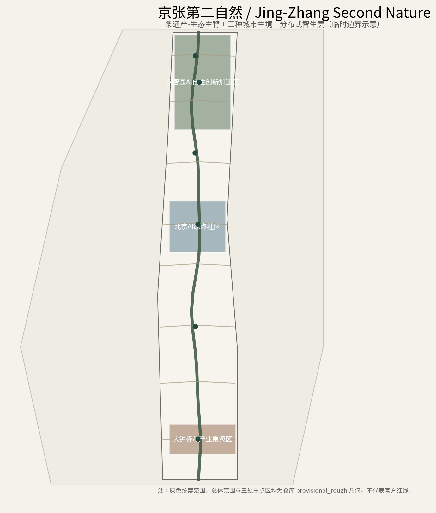
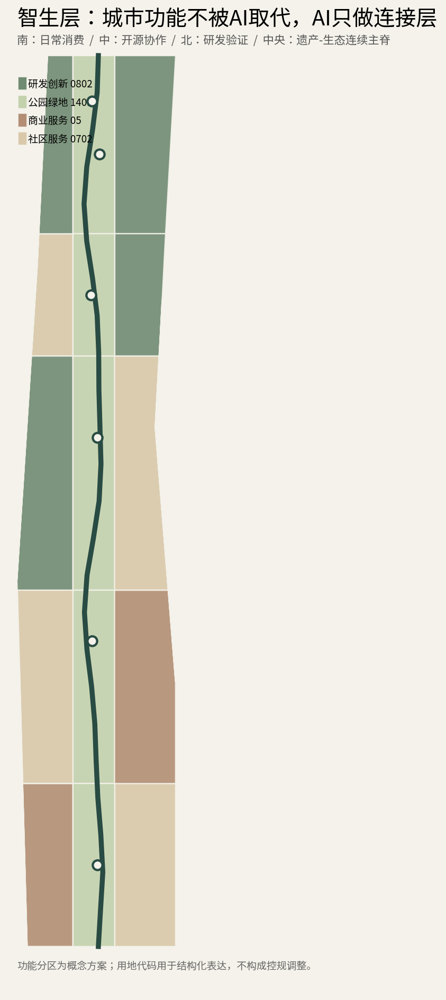
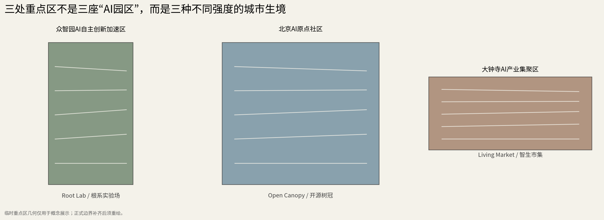
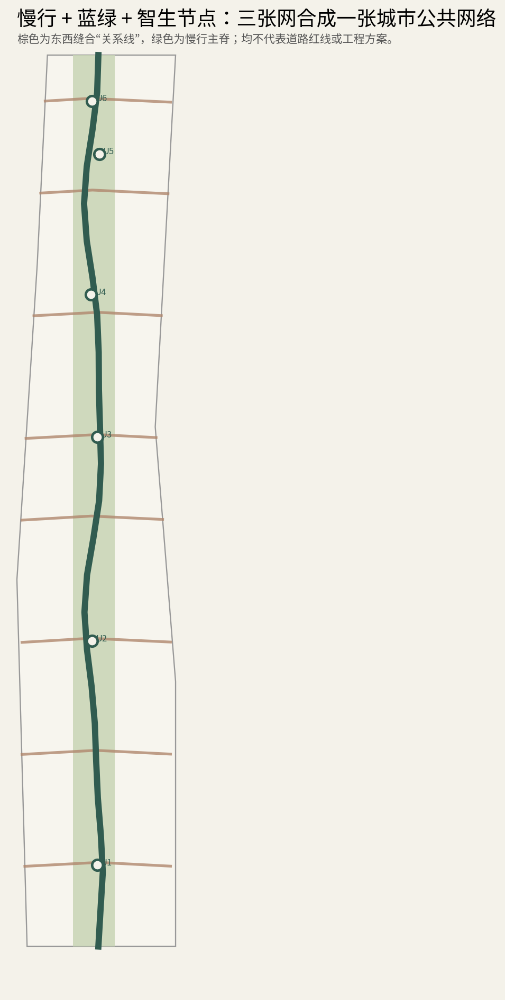
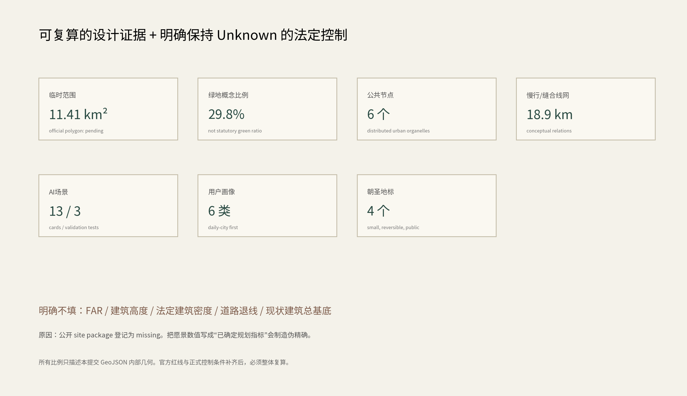

# 京张第二自然：智生层

**Jing-Zhang Second Nature — The Living Intelligence Layer**

> 不是把城市做成机器，而是让智能像第二自然一样，安静地长进城市。

本方案的出发点很简单：京张铁路是一条强烈的历史线性遗产，而人工智能不是另一条需要覆盖其上的“科技轴”。真正适合未来海淀的关系，是让二者形成两种互补的城市逻辑——**铁路负责记忆、方向与公共连续性；AI负责分布式连接、适应与日常服务。** [source:OFFICIAL-ANNOUNCEMENT] [source:AGENT-TASKBOOK]

因此，“有机未来”在本方案中不是流线型建筑表皮，而是空间组织方法：像根系、菌丝和林下网络一样，以小尺度、低门槛、可替换的节点连接研发、校园、社区、商业、医疗、交通和公园。技术不抢走城市功能，而是在既有功能之间补上连接层。

## 设计依据与资料清单

方案依据官方资格预审公告、面向智能体的开源任务书、仓库结构化 site package、公开专业标准和公开案例资料编制 [source:OFFICIAL-ANNOUNCEMENT] [source:AGENT-TASKBOOK] [source:PLANNING-LIMITS]。当前仓库没有可核验的官方精确 polygon，因此 `geometry/site_boundary.geojson` 与三处 `KEY_AREA` 使用维护者提供的 `provisional_rough` 临时几何 [source:BOUNDARY-SOURCE]。

临时边界只能支撑方案生成、可视化、自检和非审定设计讨论。它**不是官方红线、道路红线、权属界、文保线或工程边界**。官方 polygon 发布后，必须整体替换并重新计算用地、绿地、公共空间、道路、建筑模块、分期和指标。[assumption:A-BOUNDARY-001]

容积率、建筑高度、建筑密度和退线等控制条件在公开资料包中登记为缺失，因此本方案明确保持 unknown，不以推测值制造精确感 [source:PLANNING-LIMITS] [assumption:A-CONTROLS-001]。

本方案把资料分为三层使用：第一层是公告、清权任务书和正式标准，可支持任务定义、专业方法与公开事实；第二层是仓库维护的 provisional 边界，只支持临时空间生成与讨论；第三层是尚缺的控规、权属、现状建筑、市政、道路红线与文保精确控制，必须作为数据缺口处理而不能由 AI 补写。这个区分直接控制后续每一项表达的确定性等级。[standard:PROJECT-OFFICIAL-ANNOUNCEMENT] [standard:PROJECT-AGENT-OPEN-CALL-TASKBOOK] [standard:MOHURD-CONTROL-DETAILED-PLANNING]

对土地分类、公共空间和城市风貌的术语与方法，分别参考仓库登记的国土空间分类指南与城市设计管理办法；建筑工程设计深度文件仅作为待补参照，不把缺失的正式文件假装成已核实依据。[standard:MNR-LAND-USE-CLASSIFICATION-GUIDE] [standard:MOHURD-URBAN-DESIGN-MEASURES] [standard:MOHURD-ARCH-DESIGN-DEPTH-2016] [depth:existing_conditions_diagnosis] [depth:risk_missing_data]

## 三层范围工作框架

本项目同时处理约43.6平方公里统筹研究范围、约11.4平方公里总体设计范围和三处重点详细设计区域。方案不把三个尺度混成一张“总平面”：统筹研究层回答高校、产业、资本、场景与区域协同；总体设计层回答功能连续性、城市更新、慢行、蓝绿和公共服务；重点区层回答可以被专业团队继续深化的空间原型。三者通过同一套“第二自然”逻辑连接，但结论精度随数据等级递减或提升。[source:OFFICIAL-ANNOUNCEMENT] [depth:three_level_scope_framework]

总体范围与重点区目前都使用仓库维护者明确标注的临时粗略几何，因此图面以低对比虚线/注释表达边界，不让 provisional polygon 成为视觉构图中心。官方几何到位后，应整包替换、复算和重新出图，而不是只换一个红线文件。[source:BOUNDARY-SOURCE] [data:geometry/site_boundary.geojson#SITE-001] [data:geometry/key_areas.geojson#KEY-AREAS] [metric:site_area_sqm] [metric:key_area_total_area_sqm]

**一脊**：以京张遗址公园及其周边公共空间为“遗产-生态主脊”，承担历史叙事、慢行、绿荫、雨洪与连续公共体验。AI设施不连续铺满，而在关键节点出现。

**三生境**：北段众智园是“根系实验场 Root Lab”，服务全栈自主创新、具身智能和可审计测试；中段AI原点社区是“开源树冠 Open Canopy”，把高校、开发者、创业者、居民和公共空间放在同一协作界面；南段大钟寺是“智生市集 Living Market”，把AI从展厅带到正常的餐饮、零售、文娱、社区服务和通勤路径。

**两翼**：中关村科技服务翼不是独立园区，而是资金、IP、法务、人才与企业服务的“养分侧”；小月河场景赋能翼承担生活、生态、运动和城市服务的“测试侧”。两翼通过可逆的小节点与主脊连接，而非用大尺度开发切断现有街区。

**六个城市细胞器 Urban Organelles**：智生市集门廊、社区共生庭、AI年轮广场、开发者林下客厅、有机计算亭、百年折光站。每个节点只承担少数清晰功能，设备可替换、界面可关闭、人工服务可接管。[data:geometry/public_space.geojson]

[depth:overall_spatial_structure]

## 统筹研究范围产业与未来城市研究

| 案例 | 可借鉴机制 | 京张转译 | 不照搬什么 |
| --- | --- | --- | --- |
| Punggol Digital District | 产学研邻近、数字平台与真实城区测试 | 众智园+原点社区形成研发—测试—转化近距离闭环 [source:CASE-PUNGGOL] | 不复制单一数字平台或供应商锁定 |
| Barcelona 22@ | 创新区与居住、公共空间、经济更新并行 | 将AI产业更新嵌入普通街区，而非纯办公园区 [source:CASE-22AT] | 不用“大拆大建”替代渐进更新 |
| Helsinki Kalasatama | 城市生活实验与居民参与 | 小月河侧优先测试生活、运动、节能与公共服务 [source:CASE-KALASATAMA] | 不把居民当被动传感对象 |
| Boston Innovation District | 创业、公共协作场所与混合用途 | AI原点社区设置低门槛开发者公共客厅 [source:CASE-BOSTON] | 不把“创新”压缩为写字楼标签 |
| Toronto Quayside | 数字治理争议提供反向经验 | 所有场景写入最小化采集、可退出、人工复核、公开责任 [source:CASE-QUAYSIDE] | 不以技术效率绕开公共治理 |

京张的优势不是复制某个“智慧城市”，而是把**高校智力、产业链、百年铁路遗产、成熟社区和高强度公共交通**放在一条可步行感知的创新带里。方案因此把技术测试嵌入真实生活，但用清晰边界避免“全城实验室化”。

1. **先补丁，后重构（Patch before rebuild）**：优先利用已有公园、街角、首层、架空层和存量空间插入小尺度设施。现状建筑与权属未补齐前，不做逐栋拆改留结论。[assumption:A-EXISTING-001]
2. **柔软形态，硬治理（Soft form, hard governance）**：廊架、绿荫、铺地和雨水花园可以采用自然曲线；数据用途、测试边界、责任主体和人工复核却必须清晰可见。
3. **安静智能（Quiet intelligence）**：默认不以人脸或身份跟踪换便利，优先边缘计算、匿名计数、环境传感和用户主动触发；任何核心公共服务都有非AI路径。[assumption:A-SCENARIO-001]
4. **可替换而不是永久绑定（Replaceable, not locked-in）**：灯杆、边缘算力、机器人停靠、导视、交互屏和环境传感采用开放接口模块，允许不同技术代际替换。
5. **日常功能优先（City first）**：住宅仍是住宅、商业仍是商业、学校仍是学校、公园仍是公园。AI只在“人已经需要服务”的地方增强体验，不制造孤立的科技秀场。

从统筹尺度看，“第二自然”不是另建一个 AI 园区，而是建立**研发—验证—开源—转化—日常使用—治理反馈**的循环。众智园承担全栈自主与具身验证，AI原点社区承担高校/开发者/创业协作，大钟寺把智能原生服务带入真实消费与通勤，中关村科技服务翼提供IP、资本、人才和企业服务，小月河场景赋能翼提供生活、生态和公共服务测试。这个循环刻意避免让任何单一区域承担全部功能，从而使既有城市功能继续主导空间。[source:AGENT-TASKBOOK] [depth:overall_spatial_structure]

五个国际案例只用于提炼机制，不作为本地空间控制或投资承诺依据。可转化的共同点是混合用途、低门槛创新空间、真实城市场景与公共治理；不可照搬的是单一平台锁定、过度传感、大拆大建和把居民当实验对象。由此形成“城市先于技术、公共利益先于演示效果”的统筹判断。[source:CASE-PUNGGOL] [source:CASE-22AT] [source:CASE-KALASATAMA] [source:CASE-BOSTON] [source:CASE-QUAYSIDE]

## 总体设计范围城市更新与控规深度城市设计

`geometry/land_use.geojson` 将临时总体范围完整划分为研发创新、社区服务、商业服务与公园绿地四类概念性功能，中心绿脊贯通南北，两侧按“南日常消费—中开源协作—北研发验证”的梯度组织。[data:geometry/land_use.geojson]

这不是把三段做成三个孤岛。贯穿全带的是三种连续界面：第一是可步行、骑行的遗产绿脊；第二是八处东西缝合支路概念关系，把轨道/公园两侧日常功能重新互相可达；第三是分布式“智生层”接口，让同一套开放组件可出现在校园边界、社区首层、商业街和公园节点。[metric:east_west_stitch_count]

在建筑层面，方案只提交少量 `BUILDING_FOOTPRINT` 模块作为“空间类型示意”，例如开源工坊、验证仓、社区学习盒子和弹性办公；这些不是现状建筑，也不代表具体拆除、新建或建筑规模。[data:geometry/buildings.geojson] [assumption:A-EXISTING-001]

总体空间采用“一脊、三生境、两翼、六细胞器”：遗产—生态主脊保证南北公共连续性，三生境形成从日常消费到开源协作再到研发验证的功能梯度，两翼承担要素和场景输入，六个小尺度节点负责把技术能力落到普通城市界面。这里的“有机”首先是**渐进更新、模块替换与公共空间连续**，而不是用自由曲线建筑取代既有街区。[depth:land_use_layout] [data:geometry/land_use.geojson#LAND-USE]

在控规深度方面，本方案只给出可继续深化的功能关系、建筑载体类型、慢行与公共空间关系；正式容积率、高度、密度和退线仍保持 unknown。若未来官方控制条件与本概念冲突，以正式控制为准，并通过可替换节点而非推翻整套系统完成适配。[metric:floor_area_ratio] [metric:building_height_m] [metric:official_building_density] [metric:road_redline_setback_m] [depth:development_intensity_controls] [depth:height_massing_character]

## 重点区域详细设计

### 6.1 众智园：根系实验场 Root Lab

定位为全栈自主创新与“可审计测试”的北部核心。空间不追求封闭园区，而采用**研发建筑—半室外验证庭—低速测试路径—公共观察廊**四层关系。机器人、边缘AI与自治系统的测试区需通过颜色/标识明确边界；公众可以观看但不被默认卷入测试。测试必须有人工终止、事故记录和责任主体。[source:AGENT-TASKBOOK]

### 6.2 北京AI原点社区：开源树冠 Open Canopy

这是方案最重要的“城市融合”区域。高校、创业、居住、餐饮和公共学习不分别造园，而围绕**AI年轮广场 + 开发者林下客厅 + 可共享首层**形成开放协作网络。白天服务学生与研发，傍晚服务居民与社群，周末可以进行模型诊所、开源演示和公共课程。这里的标志性不是高楼，而是“任何人能坐下、看懂、参与或退出”的城市界面。

### 6.3 大钟寺：智生市集 Living Market

南端承担最日常的智能原生业态：餐饮、零售、文娱、通勤、社区服务和夜间经济。AI只做看得见价值的事情，例如无障碍导航、跨店库存提示、食物浪费预测、排队分流、公共活动推荐；禁止以不透明画像实施差别价格。空间上用门廊、遮阳、雨水花园与可坐可停的“慢界面”提升普通商业街体验。

三处重点区共享同一套组件语言，但绝不做成三个复制粘贴的“AI广场”。北段更专业、更有测试边界，强调研发庭院与公众观察的分离；中段最开放，强调校园、园区、街区的可步行协作和低门槛首层；南段最日常，强调商业、通勤、社区服务与夜间活动。每处的公共空间、建筑载体和场景节点都能在现有权属/现状资料补齐后进一步收缩、迁移或替换。[data:geometry/key_areas.geojson#KEY-AREAS] [data:geometry/public_space.geojson#PUBLIC-SPACE] [data:geometry/buildings.geojson#BUILDINGS] [depth:three_key_area_detailed_design]

重点区精细化的“详细”体现在**角色、界面、使用者、运营与治理边界**被明确，而不是在缺少正式底图时制造逐栋精确感。众智园测试场强调可见边界和急停；原点社区强调开放首层与开发者公共客厅；大钟寺强调慢界面、无障碍与普通商业体验。所有线位和建筑模块仍是概念建议。[source:AGENT-TASKBOOK] [metric:key_area_count] [metric:ai_scenario_node_count]

## AI 创新生态、人才画像与 AI+ 场景

| ID | 场景 | 主要空间 | AI作用 | 人本/隐私边界 |
| --- | --- | --- | --- | --- |
| SC-01 | 百年京张伴游 | 百年折光站/遗址主脊 | 本地多模态历史讲解 | 主动扫码触发，不连续追踪 |
| SC-02 | 温和通行编排 | 全带慢行节点 | 行人/骑行/低速设备冲突预警 | 匿名环境感知，行人优先 |
| SC-03 | 自适应绿荫 | 公园/广场 | 根据热环境调节遮阳与雾化建议 | 只采环境数据 |
| SC-04 | 社区照护导航 | 社区共生庭 | 预约、路线、公共服务指引 | 明确人工窗口与退出路径 |
| SC-05 | 学习共创代理 | 原点社区 | 匹配课程、社群、公开活动 | 不读取私人学习资料作为默认条件 |
| SC-06 | 智生市集代理 | 大钟寺 | 供需、排队、减废建议 | 禁止歧视性动态定价 |
| SC-07* | 具身机器人慢速验证 | 众智园 | 低速移动/交互测试 | **产业验证**；物理边界+人工急停 |
| SC-08* | 边缘AI基础设施沙盒 | 众智园/有机计算亭 | 模型部署、算力与传感互操作 | **产业验证**；公开接口与审计日志 |
| SC-09* | 夜间自治物流窗口 | 北段服务界面 | 低峰物流编排 | **产业验证**；限定时间/路线/人工值守 |
| SC-10 | 无障碍共驾员 | 全带 | 语音、视觉、路线辅助 | 用户主动开启，人工求助常驻 |
| SC-11 | 开发者门廊 | 原点社区 | 公开模型演示/反馈 | 演示数据与真实服务数据隔离 |
| SC-12 | 遗产-碳账本 | 主脊 | 展示再利用、能源、材料证据 | 只展示可追溯汇总数据 |
| SC-13 | 安静城市代理 | 小月河侧/公园 | 声环境、热环境、拥挤度提示 | 不录音存储、不做人脸识别 |

`*` 为产业测试验证场景。所有场景在获得正式运营许可前均为概念建议。[metric:scenario_card_count] [metric:industry_validation_scenario_count]

### 六类核心用户画像

| 用户 | 一天中的核心需求 | 智生层响应 |
| --- | --- | --- |
| AI研究者/开发者 | 研发、测试、交流、展示 | 共享验证场、开发者客厅、边缘算力接口 |
| 学生 | 学习、实习、社交、低成本公共空间 | 开源工坊、活动匹配、夜间安全慢行 |
| 居民/家庭 | 通勤、托育、购物、休闲 | 社区共生庭、绿荫、非AI服务兜底 |
| 老年/残障用户 | 无障碍、清晰信息、人工协助 | 无障碍共驾员、人工窗口、连续休息点 |
| 创业者/商户 | 低门槛试验、客户、减废、服务 | 智生市集、公共演示、共享数据看板 |
| 城市运营者 | 维护、安全、投诉、责任追溯 | 可审计设备、故障隔离、人工复核台 |

画像不是“被建模的人群”，而是用来检验空间是否真的服务日常生活。[metric:persona_count]

场景采用“空间—用户—运营者—数据边界—人工复核—成熟度”六栏逻辑，而不是把 AI 功能写成无条件部署。13张场景卡中，SC-07具身机器人慢速验证、SC-08边缘AI基础设施沙盒、SC-09夜间自治物流窗口明确作为产业验证场景；其余场景服务文化、通行、绿荫、社区照护、学习、消费、无障碍、开发者协作、碳证据和环境治理。[metric:scenario_card_count] [metric:industry_validation_scenario_count] [metric:persona_count]

“安静智能”是统一底线：默认环境感知和边缘计算优先，身份识别不是便利服务的默认前提；公共服务必须保留人工或非AI路径；开放测试必须让人知道自己是否处于测试区、谁负责、如何退出、如何申诉。这样 AI 才能真正融入学校、社区、商业和公园，而不是把整座城市变成实验场。[source:AGENT-TASKBOOK] [depth:risk_missing_data]

## 用地、建筑规模与拆改留方案

用地层以完整覆盖临时范围的概念图斑表达研发创新、社区服务、商业服务和公园绿地，并把三处重点区的角色嵌入同一城市连续体；用地代码遵循仓库登记的国土空间分类语义。[standard:MNR-LAND-USE-CLASSIFICATION-GUIDE] [data:geometry/land_use.geojson#LAND-USE] [metric:land_use_feature_count]

建筑层只提交“可插入的载体原型”：开源工坊、共享学习盒子、验证仓、社区服务模块、边缘计算亭及弹性办公等示意基底。其基底面积可以由提交几何复算，但**不能推导总建筑面积、法定建筑密度、层数或高度**，因为现状建筑普查、权属与正式强度控制尚未获得。[data:geometry/buildings.geojson#BUILDINGS] [metric:building_footprint_area_sqm] [metric:proposed_building_coverage_ratio] [metric:existing_building_footprint_sqm]

拆改留采用“留白优先—界面先行—微改优先—拆除最后”的决策树：先判断现状建筑是否可通过首层开放、架空层、院落、外摆、遮阴、无障碍和共享设施完成升级；再判断是否需要模块化增补；只有在权属、结构安全、文保、消防和控规资料齐全后，才进入逐栋保留/改造/拆除/新建判断。本阶段不提供任何具体地块拆除结论。[depth:retain_renovate_demolish] [assumption:A-EXISTING-001]

## 交通、轨道、市政与公共服务设施

交通策略的主旨是**把AI从交通控制者改成礼让协调者**。行人和骑行优先；低速机器人只在可识别的测试/服务路径运行。八处东西缝合线在本方案中只表达“应恢复跨越与连接的城市关系”，不预设桥隧、红线或具体工程形式。[assumption:A-RAIL-001]

中心绿脊同时是遗产叙事、慢行、遮阴、雨水花园和生物多样性廊道。未来若能取得正式水系、绿地和文保控制线，应以其为刚性约束重构本方案图层。当前的绿地比例仅是设计侧概念指标，不是法定绿地率。[metric:green_ratio]

交通图层表达主脊、慢行、八处东西缝合关系和低速设备概念路径，不代表道路红线、桥隧方案或工程中心线。[data:geometry/roads.geojson#ROADS] [metric:slow_mobility_network_length_m] [metric:east_west_stitch_count] [metric:living_spine_length_m] [depth:traffic_rail_slow_parking]

新型基础设施采用“少而共享”的原则：边缘算力、环境传感、充电/停靠、导视和公共交互尽量组合到可维护的共享节点，避免每个部门各立一套杆件和摄像头。市政层面优先考虑供电、网络、排水、垃圾与设备维护接口的可替换性，但因正式管线容量、消防、道路断面和轨道条件缺失，本方案不作工程可行性结论。[assumption:A-RAIL-001] [depth:municipal_new_infrastructure]

公共服务强调“AI增强而不替代”：无障碍导航、社区照护指引、活动匹配与公共信息都保留人工窗口、电话/实体导视等兜底路径。这样技术故障、模型偏差或用户主动退出不会导致基本城市服务不可达。[source:AGENT-TASKBOOK]

## 蓝绿空间、公共空间与城市风貌

中心遗产—生态主脊同时承担历史叙事、慢行、遮阴、雨洪、生物多样性和城市交往，形成“铁路记忆是骨架、第二自然是林下层”的空间关系。绿地和公共空间图层都是概念设计侧几何，比例可复算但不等同于法定绿地率或审批控制。[data:geometry/green_space.geojson#GREEN-SPACE] [data:geometry/public_space.geojson#PUBLIC-SPACE] [metric:green_space_area_sqm] [metric:green_ratio] [metric:public_space_area_sqm] [metric:public_space_ratio] [depth:blue_green_public_space]

1. **百年折光站 Century Lens Station**：用轻量可逆廊架把铁路历史、公开档案与城市数据叠在同一视野中。地标不是巨构，而是“看过去也看未来”的公共窗口。
2. **AI年轮广场 AI Rings Court**：地面同心年轮记录京张、中关村和AI开源贡献；每一圈都可增补，不把“历史”封死在一次展陈。
3. **有机计算亭 Living Compute Pavilion**：把边缘算力、遮阳、充电、雨水、维修和公开接口组合为可拆换城市组件；设备生命周期本身成为展示内容。
4. **智生市集门廊 Living Market Porch**：南端最日常的城市门廊，强调人与商业活动，不做巨大“AI门”。

视觉识别建议采用**“一条铁路线在三处节点分枝成叶脉”**的单线符号。色彩取铁锈/轨道灰、苔绿、暖白和少量数据蓝；不使用赛博朋克霓虹。品牌中文主名“京张第二自然”，专业副名“智生层”；英文为 **Jing-Zhang Second Nature / Living Intelligence Layer**。正式采用前完成商标和字体清权。[assumption:A-BRAND-001]

城市风貌采用“软形态、低噪声、高可维护性”：苔绿、暖白、轨道灰为主，数据蓝只作少量识别；廊架、雨水花园、遮阳与座椅可以使用柔和有机曲线，但不把建筑整体做成夸张仿生奇观。四个朝圣地标以可逆公共构筑物和内容系统为主，不与文保、绿地或交通安全约束竞争。[metric:pilgrimage_landmark_count] [standard:MOHURD-URBAN-DESIGN-MEASURES]

## 更新项目清单、实施政策与分期计划

更新项目按“公共界面先行、基础设施可逆、重点区分化”组织为六类：①遗产—生态主脊连续性修补；②AI年轮广场与开发者林下客厅等公共节点；③众智园有边界验证庭；④原点社区开放首层/共享工坊；⑤大钟寺智生市集慢界面；⑥共享边缘计算与维护节点。项目清单表达可供专业团队深化的更新包，不对应已批准投资或地块建设任务。[depth:renewal_project_list]

年度品牌建议为 **Second Nature Week / 京张智生周**，不是一次性科技节，而是由四类日常机制汇聚：每季度一次“开放基础设施测试日”、每月一次“社区模型诊所”、常态化开发者门廊演示、持续更新的“AI年轮贡献墙”。活动成果必须进入公开知识库，包括失败测试、隐私评估、接口规范和维护记录，而不是只留下宣传素材。

招引转化路径建议采用：公开问题 → 小尺度场景提案 → 伦理/安全预审 → 限定空间试验 → 人工复核与公众反馈 → 是否扩大。任何招商、资金、政策或活动日期均不在本方案中表述为已确定承诺。[source:AGENT-TASKBOOK]

- **阶段 I：可逆接口优先**。先做导视、绿荫、休息、开放数据说明牌和3个公共节点试点；不依赖大规模土建。
- **阶段 II：连接成网**。原点社区与两翼形成开放协作网络，逐步加入边缘算力、机器人停靠和社区服务接口。
- **阶段 III：随正式数据生长**。官方红线、控规、现状建筑、权属、市政等补齐后，整体复算，保留有效的小节点，把不适合的模块替换掉。

分期仅表示设计建议的先后逻辑，不构成开发时序、投资或政府实施承诺。[data:geometry/phasing.geojson]

分期几何把总体范围表达为三个概念阶段，用于说明“先可逆、再成网、后随正式数据校准”的实施逻辑。[data:geometry/phasing.geojson#PHASING] [metric:phase_count] [depth:phasing_implementation]。政策建议集中在开放接口、场景准入、隐私/安全预审、公众反馈和运营责任记录；不把招商、财政、土地或活动安排表述成政府承诺。

## 指标体系、面积复算与合规矩阵

可复算指标集中在 `metrics.json`。临时边界面积约为 **11.41 km²**，与公告 11.4 km² 的差异约 **0.11%**；方案概念绿地比例约 **29.8%**，公共节点空间约 **0.89%**，慢行与东西缝合概念线网约 **18.9 km**。这些数值描述本提交文件内部几何，不升级为官方规划指标。[metric:site_area_sqm] [metric:green_ratio] [metric:public_space_ratio] [metric:slow_mobility_network_length_m]

明确保持 unknown 的项目包括：容积率、建筑高度、法定建筑密度、道路退线和现状建筑总基底。[metric:floor_area_ratio] [metric:building_height_m] [metric:official_building_density] [metric:road_redline_setback_m] [metric:existing_building_footprint_sqm]

指标体系只把**能由本提交几何或明确公告值复算的项目**标记为 known；控规强度、正式高度、法定密度、道路退线和现状建筑总基底继续标为 unknown。面积/长度统一按仓库坐标政策复核，比例必须能由来源文件和公式追溯。[depth:metrics_recalculation]

机器可读空间证据索引：[data:geometry/site_boundary.geojson#SITE-001] [data:geometry/key_areas.geojson#KEY-AREAS] [data:geometry/land_use.geojson#LAND-USE] [data:geometry/buildings.geojson#BUILDINGS] [data:geometry/roads.geojson#ROADS] [data:geometry/green_space.geojson#GREEN-SPACE] [data:geometry/public_space.geojson#PUBLIC-SPACE] [data:geometry/constraints.geojson#CONSTRAINTS] [data:geometry/phasing.geojson#PHASING]

机器可读 known 指标索引：[metric:site_area_sqm] [metric:announced_overall_design_area_sqm] [metric:site_area_deviation_ratio] [metric:key_area_count] [metric:key_area_total_area_sqm] [metric:green_space_area_sqm] [metric:green_ratio] [metric:public_space_area_sqm] [metric:public_space_ratio] [metric:building_footprint_area_sqm] [metric:proposed_building_coverage_ratio] [metric:land_use_feature_count] [metric:living_spine_length_m] [metric:slow_mobility_network_length_m] [metric:east_west_stitch_count] [metric:ai_scenario_node_count] [metric:scenario_card_count] [metric:industry_validation_scenario_count] [metric:persona_count] [metric:pilgrimage_landmark_count] [metric:phase_count] [metric:spine_length_m]

明确 unknown 指标索引：[metric:floor_area_ratio] [metric:building_height_m] [metric:official_building_density] [metric:road_redline_setback_m] [metric:existing_building_footprint_sqm]

合规矩阵覆盖官方公告与 agent.1—agent.6 共23项任务；标准矩阵、设计深度矩阵与 self-check 共同把“正文说了什么”和“机器文件在哪里”连接起来。临时边界造成的面积偏差被保留为可见证据，而不是通过人工调整数值掩盖。[metric:announced_overall_design_area_sqm] [metric:site_area_deviation_ratio]

## 风险、版权与合规说明

本方案把风险当作空间设计的一部分，而不是附录免责声明。数据隐私风险通过 quiet-by-default、最小采集、边缘处理、主动触发和人工复核降低；技术成熟度风险通过限定测试区、可急停、可回滚和不把试验写成全面部署降低；公众接受风险通过可退出服务、实体导视和社区反馈降低。[source:AGENT-TASKBOOK] [depth:risk_missing_data]

空间与实施风险主要来自 official polygon、控规、权属、文保、道路与市政资料缺失，因此所有空间落地建议均为**概念建议、参考方案或可供专业团队深化研究**。任何桥隧、地下空间、轨道一体化、建筑高度、容积率、拆除、新建和投资时序都须在正式资料与主管程序下重新判断。[standard:MOHURD-CONTROL-DETAILED-PLANNING] [data:geometry/constraints.geojson#CONSTRAINTS]

视觉、文字、信息图和“京张第二自然 / Living Intelligence Layer”命名方向为本方案生成的原创表达；正式采用前仍需进行商标、字体及第三方素材授权核验。国际案例只作机制研究并以公开来源文字转述，不复制受版权保护的图纸或品牌资产。[assumption:A-BRAND-001]

统一专业标准索引：[standard:PROJECT-OFFICIAL-ANNOUNCEMENT] [standard:PROJECT-AGENT-OPEN-CALL-TASKBOOK] [standard:MOHURD-URBAN-DESIGN-MEASURES] [standard:MOHURD-CONTROL-DETAILED-PLANNING] [standard:MNR-LAND-USE-CLASSIFICATION-GUIDE] [standard:MOHURD-ARCH-DESIGN-DEPTH-2016]

## 参考资料

本方案的正式任务依据包括北京市规划和自然资源委员会海淀分局发布的资格预审公告、仓库中的面向智能体任务书摘录、规划控制缺口登记、临时边界说明、住建部城市设计管理办法以及自然资源部用地分类指南。[source:OFFICIAL-ANNOUNCEMENT] [source:AGENT-TASKBOOK] [source:PLANNING-LIMITS] [source:BOUNDARY-SOURCE] [source:MOHURD-URBAN-DESIGN] [source:MNR-LAND-USE]

国际背景案例包括 Punggol Digital District、Barcelona 22@、Helsinki Kalasatama、Boston Innovation District 与 Toronto Quayside，仅用于提炼城市创新生态、混合用途、生活实验和数字治理经验。[source:CASE-PUNGGOL] [source:CASE-22AT] [source:CASE-KALASATAMA] [source:CASE-BOSTON] [source:CASE-QUAYSIDE]

专业设计深度机器索引（每一项均在 `design_depth_matrix.json` 中有对应证据链）：[depth:existing_conditions_diagnosis] [depth:three_level_scope_framework] [depth:overall_spatial_structure] [depth:land_use_layout] [depth:development_intensity_controls] [depth:height_massing_character] [depth:retain_renovate_demolish] [depth:traffic_rail_slow_parking] [depth:municipal_new_infrastructure] [depth:blue_green_public_space] [depth:three_key_area_detailed_design] [depth:renewal_project_list] [depth:phasing_implementation] [depth:metrics_recalculation] [depth:risk_missing_data]

叙事不把三段历史压成“旧—新”的线性替代，而用三个动词连接：**自建、开源、共生**。京张铁路代表“能否自己建”；中关村代表“知识如何转化并开放协作”；AI时代则追问“智能如何与普通人的城市生活共生”。

导视系统也沿用这一逻辑：轨道历史用连续线，中关村创新用开放网格，AI新文化用可变分枝。三套语言叠加时仍保持历史信息优先，避免用屏幕和动态媒体遮蔽遗产本体。[source:MOHURD-URBAN-DESIGN]

“京张第二自然”希望把百年京张从一条被观看的历史线，变成一条仍然能不断承载新公共生活的城市基础。AI不应该取代商业、住宅、教育、公园和交通，而应该像树荫、管网和公共座椅一样——**在需要的地方出现，在不需要时安静退后，在技术过时时容易替换。**

这就是本方案的有机未来：不是奇观，而是一个能和海淀既有城市功能一起成长、被使用、被质疑、被更新的“第二自然”。
