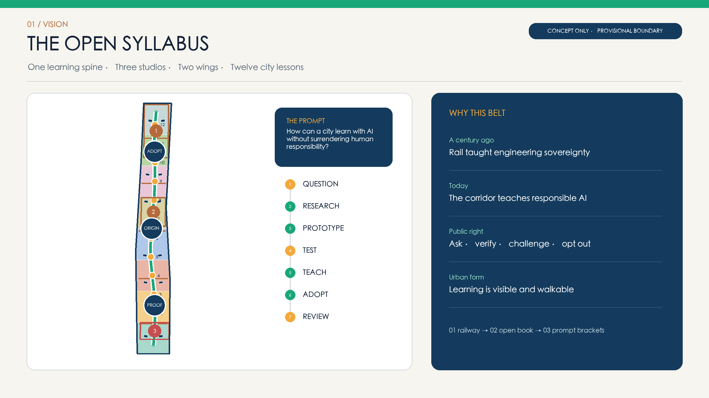
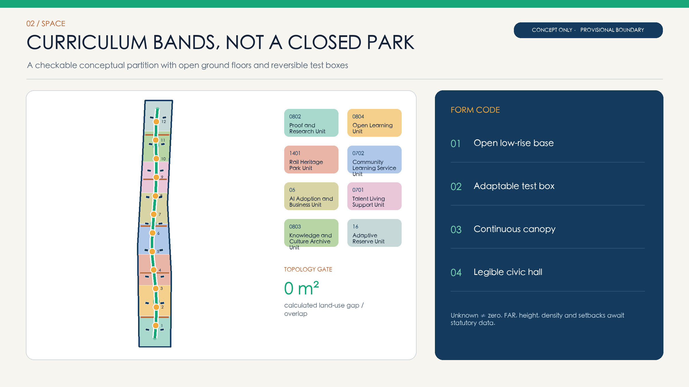
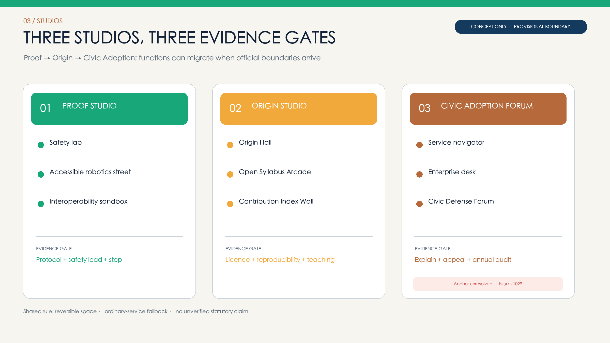
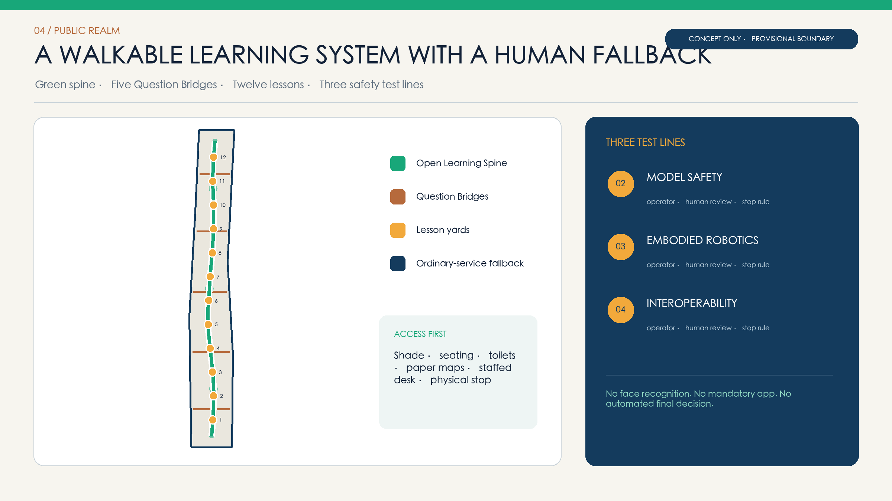
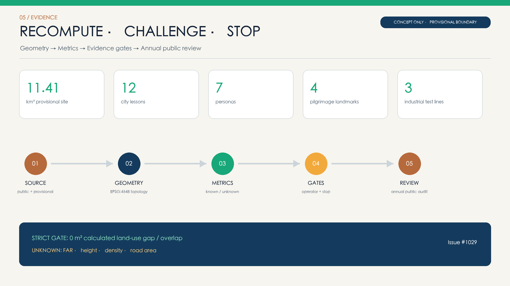

# THE OPEN SYLLABUS / JING-ZHANG LINE OF QUESTIONS

> A century ago, the Jing-Zhang Railway wrote engineering sovereignty into the city. A century later, the city can teach how to question, verify, and take responsibility for AI.

## Design Basis and Source List

This proposal uses the public site package, official announcement, agent taskbook, source registry, and standards index. The coordinated research area is read as approximately 43.6 square kilometres; the overall design area is recalculated from the repository's provisional polygon at approximately 11.4 square kilometres; the three key areas use the repository's rough provisional polygons. Because statutory redlines, ownership, road boundaries, verified buildings, heritage controls, and regulatory parameters are incomplete, every geometry is marked either provisional constraint or design proposal. No inferred geometry is presented as an approved plan. [source:OFFICIAL-ANNOUNCEMENT] [data:geometry/site_boundary.geojson#SITE-001]

Five mandatory references govern the response: the official announcement, agent taskbook, Urban Design Administrative Measures, Measures for Regulatory Detailed Planning, and the national land-use classification guide. Land-use codes come only from the competition enumerations; missing FAR, height, density, setback, and other controls remain unknown. The known PROV-KEY-003 Dazhongsi anchor mismatch is retained and linked to Issue #1029, pending a repository-wide replacement and recalculation. [standard:PROJECT-OFFICIAL-ANNOUNCEMENT] [source:ISSUE-1029-KEY003]

## Three-Level Scope Framework

THE OPEN SYLLABUS turns the three planning scales into one learning system. The 43.6-square-kilometre coordinated research area supplies real questions from universities, institutes, companies, communities, and public agencies. The approximately 11.4-square-kilometre overall design area assembles those questions into a walkable sequence of Question, Research, Prototype, Test, Teach, Adopt, and Review. The three key areas operate the lessons under distinct evidence gates and accountable operators. [depth:three_level_scope_framework] [source:AGENT-TASKBOOK]

The spatial formula is “one spine, three studios, two wings, twelve city lessons.” The Open Learning Spine connects Proof Studio at Zhongzhiyuan, Origin Studio at the AI Origin Community, and Civic Adoption Forum at Dazhongsi. A Mentor Wing links universities and research capacity; a Challenge Wing links neighbourhoods and public services. Twelve lesson yards can work independently, combine into an annual syllabus, or return to ordinary public space when a technology is stopped. [metric:scenario_card_count] [data:geometry/roads.geojson#ROAD-LEARN-001]

## Coordinated Research Area: Industry and Future City Research

The innovation chain is a loop: problem discovery, basic research, shared compute and data, validation, productisation, first adoption, capital and policy support, then public review. Proof Studio hosts safety, robotics, and interoperability tests; Origin Studio connects research, open source, and talent; Civic Adoption Forum feeds public-service demand and citizen evidence back to research. Projects publish the origin of the question, beneficiaries, validation protocol, failure record, and exit conditions before entering the contribution index. [metric:global_case_count] [source:CASE-BRAINPORT]

Global cases provide mechanisms, never local control values. MIT Kendall Square informs mixed research and public-realm coordination; one-north demonstrates a work-live-play-learn cluster; Punggol Digital District links university, industry, and community as a living lab; Smart Kalasatama demonstrates small agile pilots; Paris-Saclay connects research, transfer, investment, and events; Barcelona 22@ combines productive, urban, and social renewal; Brainport Eindhoven illustrates quadruple-helix governance. [source:CASE-MIT-KENDALL] [source:CASE-PUNGGOL-DIGITAL]

Haidian's distinction is not another closed science park. It makes the right to ask, verify, and challenge part of public infrastructure. A quarterly question roster is jointly published; shared laboratories use safety tiers; first-use applications begin in reversible spaces; investment services examine validation evidence rather than hype; and failed pilots become public review lessons. Public value and risk boundaries therefore precede acceleration. [source:CASE-KALASATAMA] [depth:existing_conditions_diagnosis]

## Overall Design Area: Urban Renewal and Regulatory-Plan-Level Urban Design

Eight “curriculum bands” form a checkable conceptual partition: research 0802, education 0804, park green 1401, community service 0702, business service 05, residential 0701, culture 0803, and adaptive reserve 16. The cells are split in EPSG:4548 and transformed together to WGS84, preserving identical shared edges and full coverage of the provisional site. They express program priorities, not statutory parcels, ownership, road redlines, or land quotas. [data:geometry/land_use.geojson#LU-001] [metric:land_use_gap_sqm]

Urban form follows four rules: open low-rise bases, adaptable test boxes, a continuous shaded spine, and legible civic halls at nodes. Ground floors along the spine prioritise classrooms, interpretation, services, and observable testing; sensitive labs step inward under tiered safety controls. Question Bridges first express accessible, ecological connections across barriers and do not promise engineered structures. Numeric height, massing, sunlight, fire, and heritage controls await official inputs. [depth:overall_spatial_structure] [standard:MOHURD-CONTROL-DETAILED-PLANNING]

The identity turns twin railway tracks into an open book and prompt brackets. Deep Rail Blue carries engineering discipline; Open Learning Green represents public learning; Review Amber marks challenge and reflection; Heritage Copper records time. Every digital sign shows current lesson, data boundary, human owner, and stop path. Night design stays low-luminance and quiet; screen density is not treated as intelligence. [standard:MOHURD-URBAN-DESIGN-MEASURES] [data:geometry/green_space.geojson#GREEN-LEARN-001]

## Detailed Design of Key Areas

Zhongzhiyuan Proof Studio concentrates on industrial validation. The Open Model Safety Lab, Accessible Robotics Street, and Urban AI Interoperability Sandbox surround reversible test courtyards. Each follows pre-registration, an on-site safety lead, abnormal-stop procedures, and public review. The design uses small isolatable test boxes, shared workshops, review walks, and shaded waiting areas instead of a single spectacle building. Protocol, liability, and community notice are entry gates. [depth:three_key_area_detailed_design] [data:geometry/public_space.geojson#PUBLIC-002]

AI Origin Community becomes Origin Studio for research, open source, and talent. Origin Hall, Open Syllabus Arcade, mentor workshops, and the Contribution Index Wall create a walk from academic question to public explanation. Licences, test limits, and contribution chains remain visible. The First Question Milestone records a question and its evidence, not only a model or institution; screen-free study, family learning, and quiet interpretation are deliberately retained. [metric:pilgrimage_landmark_count] [source:AGENT-TASKBOOK]

Dazhongsi Civic Adoption Forum connects public-service navigation, health wayfinding, enterprise services, and a Civic Defense Forum under “explain, review, appeal, audit.” Because the provisional PROV-KEY-003 anchor is known to be displaced, no drawing labels its current rectangle as a real Dazhongsi parcel. The operating model is portable and will be relocated only after the competition replaces the common source geometry. [source:ISSUE-1029-KEY003] [data:geometry/key_areas.geojson#PROV-KEY-003]

## AI Innovation Ecosystem, Personas, and AI+ Scenarios

Seven core personas co-author the syllabus: researchers need credible questions and shared validation; startup teams need first-use settings and failure boundaries; students and developers need contributable tasks; residents and community organisers need notice, refusal, and appeal; public-service operators and teachers retain final authority; older adults and caregivers need accessible, non-digital alternatives; international visitors need multilingual interpretation and licence-clear contribution records. Each persona is a user, question provider, and reviewer. [metric:persona_count] [depth:risk_missing_data]

Twelve city lessons are encoded in public_space.geojson. Lessons 02, 03, and 04 are explicit industrial tests for model safety, embodied robotics, and urban AI interoperability. The other lessons bring health navigation, education, culture, mobility, enterprise services, and neighbourhood life into named places. Every lesson limits data, names an operator, keeps human review, and states a stop rule. [metric:industry_test_scenario_count] [data:geometry/public_space.geojson#PUBLIC-001]

| Lesson | Scene and place | Users | Data boundary | Operator and stop rule |
|---|---|---|---|---|
| LESSON-01 | Public Problem Studio | resident + researcher | 公开议题清单；不采集个体轨迹 | community curator; human review and reversible stop |
| LESSON-02 | Open Model Safety Lab | developer + regulator | 合成测试集；隔离环境 | lab safety lead; human review and reversible stop |
| LESSON-03 | Accessible Robotics Street | older adult + engineer | 匿名障碍事件；现场知情同意 | accessibility steward; human review and reversible stop |
| LESSON-04 | Urban AI Interoperability Sandbox | operator + startup | 脱敏接口样本；最小权限 | sandbox operator; human review and reversible stop |
| LESSON-05 | Public Service Navigator | resident + civil servant | 办事指南；不替代审批 | public-service desk; human review and reversible stop |
| LESSON-06 | Health Service Wayfinding | patient + caregiver | 公开机构目录；不作诊断 | health-service partner; human review and reversible stop |
| LESSON-07 | AI Learning Coach Workshop | student + teacher | 课程材料；学习记录本地可删 | education partner; human review and reversible stop |
| LESSON-08 | Centennial Jing-Zhang Guide | visitor + historian | 经审核的公共史料 | heritage curator; human review and reversible stop |
| LESSON-09 | Walkability and Cycling Audit | commuter + planner | 汇总路段观察；不识别人脸 | mobility steward; human review and reversible stop |
| LESSON-10 | Enterprise Service Copilot | startup + service team | 公开政策与企业主动授权材料 | enterprise service office; human review and reversible stop |
| LESSON-11 | Multilingual Open Contribution Index | global contributor + student | 公开许可仓库元数据 | open-source council; human review and reversible stop |
| LESSON-12 | Quiet-Hours Adaptive Public Space | neighbor + venue operator | 分贝区间与活动日历；不录原声 | district operations team; human review and reversible stop |

Five public-value measures govern evaluation: verified problem contributions, reproducible validation, effective human takeover, accessible task completion, and annual stop/improvement records. Commercial conversion, visits, and media exposure remain secondary and cannot offset safety, equity, or acceptance failures. Health, education, and administrative systems assist navigation only; qualified humans retain the decision. [standard:PROJECT-AGENT-OPEN-CALL-TASKBOOK] [assumption:A-AI-GOVERNANCE-001]

## Land Use, Building Scale, and Retain-Renovate-Demolish Strategy

Eight conceptual curriculum units fully cover the provisional site with codes from the official project enumeration. Research, education, and culture produce and explain knowledge; community service, business, and residential units support adoption and everyday talent life; park green space forms the public learning interface; adaptive reserve protects future controls, ecological repair, and unanticipated public needs. Recalculated areas describe the concept and are not statutory quotas. [standard:MNR-LAND-USE-CLASSIFICATION-GUIDE] [metric:land_use_partition_area_sqm]

Eighteen Open Curriculum Building Prototypes show massing relationships; their footprints are conceptual. Retain-renovate-demolish decisions require four steps: survey age, structure, ownership, use, and heritage value; classify retention, adaptive reuse, addition, or demolition candidates; conduct public and professional review; and complete statutory confirmation. No building without evidence is assigned for demolition. Temporary elements are designed for disassembly and reuse. [depth:retain_renovate_demolish] [metric:building_footprint_area_sqm]

Intensity controls use three columns: known, suggested, and pending. Known values are projected areas and lengths of submitted geometry. Suggested rules include open ground floors, incremental massing, low-impact heritage interfaces, and legible nodes. FAR, height, density, green ratio controls, parking, and setbacks remain pending. When official data arrives, every parcel is recalculated; no approval parameter is inferred from concept ratios. [depth:development_intensity_controls] [metric:floor_area_ratio]

## Transport, Rail, Municipal Infrastructure, and Public Services

The Open Learning Spine prioritises walking and cycling; five Question Bridges express connections to universities, communities, public services, and transit. The spine provides continuous accessibility, shade, seating, low-luminance night guidance, and non-digital interpretation. Bridges represent connection needs before engineering design. Vehicle access, junctions, parking, and capacity require official road redlines, ridership, and transport models. [metric:open_learning_spine_length_m] [data:geometry/roads.geojson#ROAD-CROSS-003]

Rail heritage acts as direction and time scale, not scenery. Each lesson marks a transition from centennial railway engineering to contemporary open collaboration. Interchanges retain walking transfer, bicycle parking, accessible pick-up, and paper maps. Robots or automated shuttles operate only in isolated tests with a safety steward and physical stop; they cannot displace ordinary pedestrian rights. [standard:MOHURD-URBAN-DESIGN-MEASURES] [assumption:A-TRANSPORT-001]

Municipal and digital infrastructure follows “collect less, work offline, explain, maintain.” Lesson nodes reserve conceptual power, network, and rainwater interfaces without claiming capacity. Sensors disclose purpose, retention, and owner. Health, education, and government data are not pooled in public displays. During outage, model failure, or refusal of digital service, paper guidance, staffed counters, and ordinary lighting continue. [depth:municipal_new_infrastructure] [assumption:A-AI-GOVERNANCE-001]

## Blue-Green Network, Public Space, and Urban Character

The learning park combines a continuous green spine with three expanded canopy nodes for shade, rainwater retention, habitat connection, and outdoor teaching. Public space is not a sensor showroom: each lesson yard reserves substantial screen-free frontage, and seating, water, toilets, accessibility, and night safety precede interaction devices. Near heritage assets, all installations remain light-touch, reversible, and low-luminance until formal heritage review. [metric:green_ratio] [depth:blue_green_public_space]

Four pilgrimage landmarks define what deserves permanence. The First Question Milestone records questions seriously answered by the city; Open Syllabus Arcade shows reusable work and licences; Civic Defense Forum exposes evidence and disputes before and after adoption; Contribution Index Wall records verifiable human and agent work. Permanent visibility is never the default: contributors may show a name, remain anonymous, or withdraw personal data, subject to consent and fact review. [metric:pilgrimage_landmark_count] [source:AGENT-TASKBOOK]

Railway order, Zhongguancun experimental culture, and open AI collaboration form three narrative layers. Materials are durable, repairable, and low-carbon. Digital elements sit within canopies, ground scales, and small windows rather than dominating the skyline. Deep Rail Blue, Open Learning Green, Review Amber, and Heritage Copper unify bilingual wayfinding with alternatives for low vision, hearing, and cognitive accessibility. [standard:MOHURD-URBAN-DESIGN-MEASURES] [assumption:A-HERITAGE-001]

## Renewal Projects, Implementation Policy, and Phasing

Nine minimum viable projects are proposed: a Learning Spine pilot, First Question Milestone, Proof safety courtyard, Accessible Robotics Street, Interoperability Sandbox, Origin Open Syllabus Arcade, Contribution Index Wall, Civic Defense Forum, and the Twelve-Lesson Operations Kit. Each can start without complete property development and can degrade to ordinary public space. Project briefs must name the operator, annual budget, data inventory, liability, feedback route, and removal/restoration cost. [depth:renewal_project_list] [assumption:A-OPERATIONS-001]

Phase 1 pilots proof and safety through reversible installations and three validation protocols. Phase 2 connects the three studios only after boundary, operation, and professional reviews. Phase 3 offers a global open curriculum whose expansion, revision, or stop is decided by annual audit and public-benefit evidence. The three phasing polygons indicate time and evidence gates only; they are not acquisition or investment boundaries. [data:geometry/phasing.geojson#PHASE-001] [depth:phasing_implementation]

The Jing-Zhang Open Syllabus Council includes communities, universities, research, enterprises and open-source groups, public-service operators, heritage experts, and accessibility experts. A quarterly question roster leads to a spring Validation Week, summer Open-Source Walk, autumn Civic Defense Forum, and winter annual review. Funding combines public budgets, scene partnerships, philanthropy, and transparent sponsorship; sponsors cannot alter data boundaries or review findings. [source:CASE-KALASATAMA] [source:CASE-ONE-NORTH]

## Metrics, Area Recalculation, and Compliance Matrix

All areas and lengths are recalculated from submitted geometry in EPSG:4548. The provisional overall boundary is approximately 11.41 square kilometres. The union of eight land-use cells must equal the site, with gaps and overlaps below a strict one-square-metre gate. Green, public space, building footprints, and road centreline lengths come from their GeoJSON layers; twelve scenarios, seven personas, four landmarks, and seven cases are counted from structured attributes and text. Shared edges are split in projected coordinates before transformation to avoid chord slivers. [metric:site_area_sqm] [metric:land_use_overlap_sqm]

FAR, building density, average height, and road-area ratio remain unknown because statutory parcels, building surveys, official redlines, and controls are missing. Concept footprint, green, and public-space ratios describe submitted geometry only. When official data arrives, the sequence is version lock, boundary replacement, topology repair, area recalculation, discipline checks, and matrix/drawing refresh. [depth:metrics_recalculation] [metric:building_density]

Evidence has four layers: compliance_matrix.json covers the announcement and six agent tasks; standard_matrix.json records mandatory standards; design_depth_matrix.json connects planning, architecture, transport, infrastructure, landscape, and implementation; self_check.json records bilingual, topology, risk, and display checks. The prose uses claim-adjacent anchors while structured files retain the exhaustive index. [standard:MNR-LAND-USE-CLASSIFICATION-GUIDE] [data:geometry/site_boundary.geojson#SITE-001]

## Risk, Copyright, and Compliance

The primary spatial risks are provisional boundaries and the displaced Dazhongsi anchor. Implementation risks are missing controls, building evidence, and municipal capacity. Technical risks include privacy, bias, hallucination, unclear accountability, and obsolescence. Social risks include digital exclusion, nuisance, and technological displays displacing ordinary service. Responses are package-wide replacement, unknown management, reversible pilots, data minimisation, human final authority, non-digital alternatives, and annual stop audits. [source:ISSUE-1029-KEY003] [depth:risk_missing_data]

All twelve scenes apply purpose limitation, minimisation, a public owner, retention limits, human review, appeal, and stop procedures. Applicable generative-AI rules govern public services; accessible and offline channels remain. Model output is not a medical diagnosis, administrative approval, or professional engineering conclusion. Planning, fire, transport, heritage, privacy, and cybersecurity decisions require qualified professionals and lawful review. [standard:PROJECT-AGENT-OPEN-CALL-TASKBOOK] [assumption:A-AI-GOVERNANCE-001]

Text, structured data, generated diagrams, and layouts were created for this open call under CC BY 4.0. External cases are summarised with links and no copyrighted images are copied. The system font is used locally and not redistributed. AI generation, model disclosure, and asset provenance are recorded in agent.json, sources.json, and copyright_statement.md. [source:AI-GENERATION] [source:ASSET-FONT]

## References

Primary project references are the official announcement, Agent Taskbook, public site package, and source registry. Standards include the Urban Design Administrative Measures, Measures for Regulatory Detailed Planning, national land-use classification guidance, and the repository standards index. Dates, paths, authority, use limits, and retrieval dates are recorded in sources.json and standard_matrix.json. [source:SITE-PACKAGE] [source:SOURCE-REGISTRY]

Global mechanisms are drawn from official institutional pages for MIT Kendall Square, JTC one-north, Punggol Digital District, Forum Virium Helsinki/Smart Kalasatama, Paris-Saclay, Barcelona 22@, and Brainport Eindhoven. They support governance, co-creation, living-lab, and research-industry links only; they do not support Haidian land, intensity, or construction controls. [source:CASE-PARIS-SACLAY] [source:CASE-BARCELONA-22A]

Reviewable data is stored in geometry/*.geojson, metrics.json, assumptions.json, sources.json, compliance_matrix.json, standard_matrix.json, design_depth_matrix.json, and self_check.json. The English proposal, paired figures, HTML, A3 booklet, and A0 boards align with the Chinese structure. If prose conflicts with a number, the recalculable files and latest self-check prevail. [data:geometry/phasing.geojson#PHASE-003] [metric:scenario_card_count]
