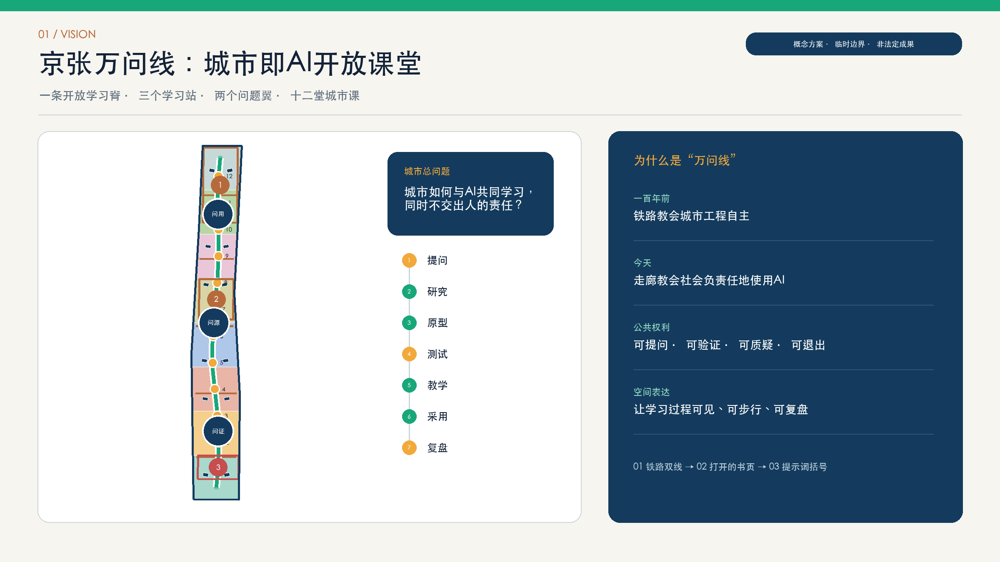
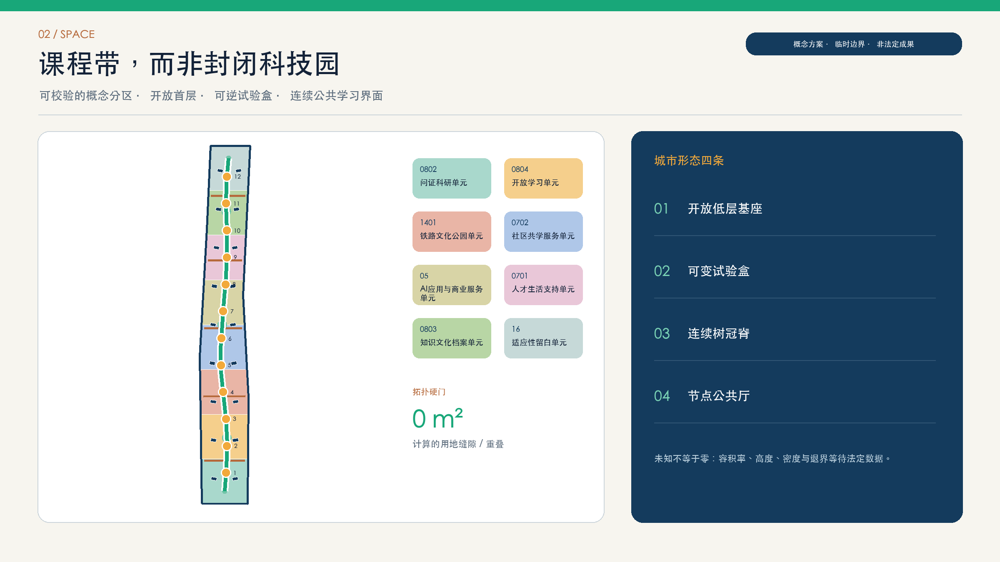
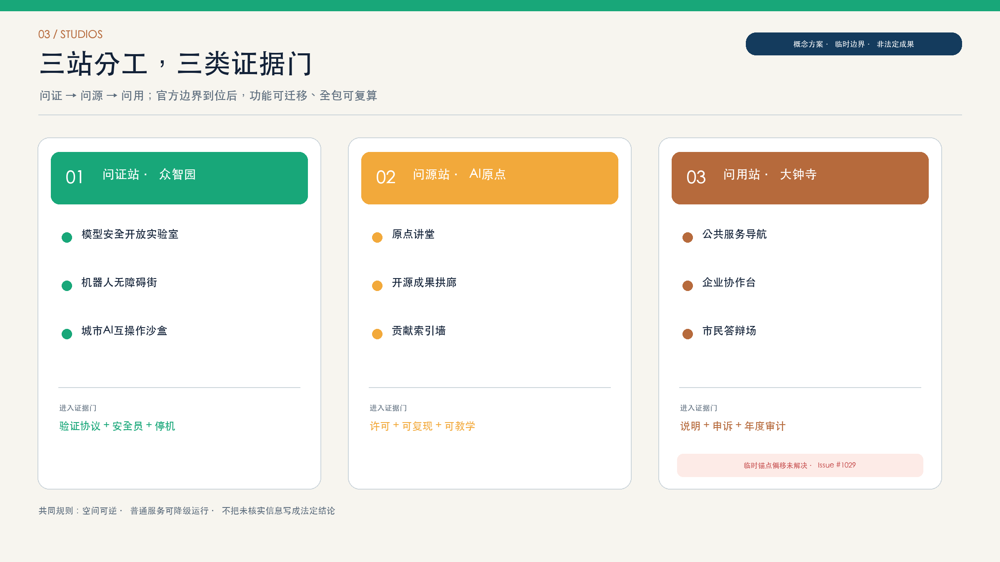
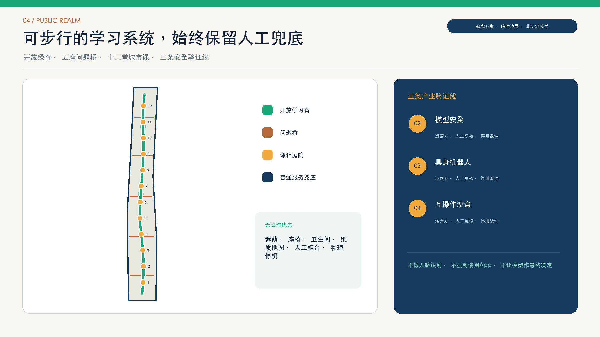
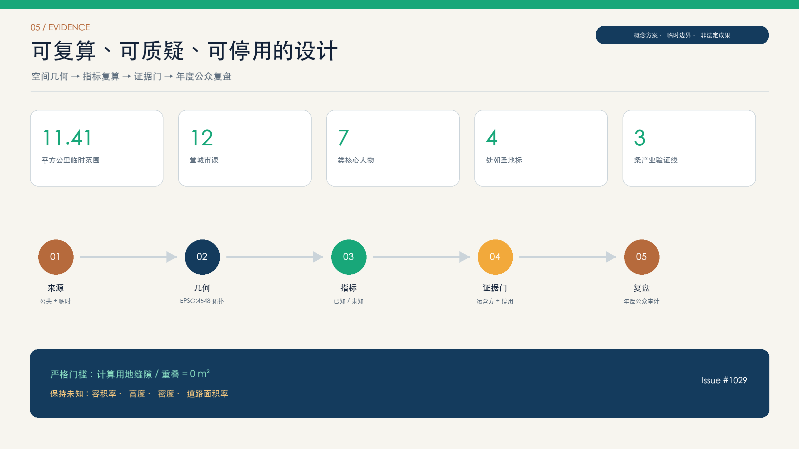

# 京张万问线 / THE OPEN SYLLABUS

> 一百年前，京张铁路把工程自主写进城市；一百年后，让城市把“如何向AI提问、验证与负责”写成公共课程。

## 设计依据与资料清单

本方案依据赛事公共场地包、正式公告、面向智能体任务书、来源登记表和现行标准索引开展。统筹研究范围按公告约43.6平方公里理解，总体设计范围按仓库临时边界约11.4平方公里复算，三处重点片区采用仓库临时粗略多边形。边界、权属、道路红线、建筑现状、文物保护线和法定控制未完整提供，因此所有几何都区分为 provisional constraint 或 design proposal，绝不把推演图当作法定成果。[source:OFFICIAL-ANNOUNCEMENT] [data:geometry/site_boundary.geojson#SITE-001]

设计控制采用五项必选依据：项目公告、Agent任务书、城市设计管理办法、控制性详细规划编制审批办法及国土空间调查规划用地用海分类指南。用地编码只从赛事枚举表选择；容积率、建筑高度、建筑密度、退界等缺失值保留 unknown。PROV-KEY-003 已知存在大钟寺锚点偏移，本方案按社区共识保留原几何并引用 Issue #1029，待仓库统一替换后整包重算。[standard:PROJECT-OFFICIAL-ANNOUNCEMENT] [source:ISSUE-1029-KEY003]

## 三层范围工作框架

“京张万问线”把三层范围组织为同一套学习系统，而不是三张互不相干的规划图。43.6平方公里统筹研究范围承担“出题”：高校、科研机构、企业、社区和公共部门持续提出真实问题；约11.4平方公里总体设计范围承担“组课”：一条开放学习脊把问题、研究、原型、测试、教学、采用、复盘七个环节串成可步行的空间序列；三处重点片区承担“开课”：以不同的证据门和运营方做详细试验。[depth:three_level_scope_framework] [source:AGENT-TASKBOOK]

空间结构概括为“一脊、三站、两翼、十二课”。一脊是京张开放学习脊；三站分别是众智园“问证站”、AI原点社区“问源站”和大钟寺“问用站”；中关村高校与科研资源形成“导师翼”，小月河沿线社区与公共服务形成“出题翼”。十二个课程节点沿脊布置，既可独立停用，也能在年度课程中组合，避免一次性建成僵化的科技景观。[metric:scenario_card_count] [data:geometry/roads.geojson#ROAD-LEARN-001]

## 统筹研究范围产业与未来城市研究

产业链不是单纯的“研究—孵化—融资”直线，而是“问题发现—基础研究—共享算力与数据—验证—产品化—首用—资本与政策服务—公共复盘”的回路。问证站提供模型安全、机器人和互操作测试；问源站连接基础研究、开源社区与人才教育；问用站把公共服务需求、企业首用和市民反馈带回前端。每个项目必须提交问题来源、受益群体、验证协议、失败记录和退出条件，开放课程索引只记录获得许可的公共成果。[metric:global_case_count] [source:CASE-BRAINPORT]

国际案例只用于机制比较，不移植本地指标。MIT Kendall Square 提供科研、混合功能和公共空间协同的启发；one-north 说明 work-live-play-learn 的集群组织；Punggol Digital District 说明大学、产业与社区组成 living lab；Smart Kalasatama 强调小规模敏捷试点；Paris-Saclay 连接研究、技术转移、投资与活动；22@ Barcelona 将生产、城市和社会更新并置；Brainport Eindhoven 展示政府、知识机构、企业和市民的四螺旋协作。[source:CASE-MIT-KENDALL] [source:CASE-PUNGGOL-DIGITAL]

海淀的差异化不是再造一个封闭园区，而是把“可提问、可验证、可质疑”变成公共基础设施。季度问题榜由社区、高校、企业和公共部门共同发布；共享实验室按安全等级预约；首用场景先在可逆空间试验；资本服务以验证证据而非概念热度为入口；失败案例进入公开复盘课。这样既缩短从研究到采用的链路，也把公共价值和风险边界置于产业加速之前。[source:CASE-KALASATAMA] [depth:existing_conditions_diagnosis]

## 总体设计范围城市更新与控规深度城市设计

总体设计以“课程带”替代封闭功能区：科研0802、教育0804、公园绿地1401、社区服务0702、商业服务05、住宅0701、文化0803和留白16八类用地构成可校验的概念分区。投影坐标EPSG:4548内先切分，再统一转换回WGS84，使共同边完全一致；分区覆盖临时总体边界且不重叠。该结构表达优先级，不替代官方控规单元、权属和道路红线。[data:geometry/land_use.geojson#LU-001] [metric:land_use_gap_sqm]

城市形态遵循“低层开放基座、可变试验盒、连续树冠脊、节点性公共厅”。靠近学习脊的首层优先安排开放教室、展示、公共服务和可观察的试验界面；研发与实验空间向内部退让并设置安全分级；跨越道路的“问题桥”首先是无障碍慢行与生态连接，不承诺具体桥梁工程。建筑高度、体量和天际线只给出分区原则，待官方日照、消防、遗产和控规条件齐备后形成数值。[depth:overall_spatial_structure] [standard:MOHURD-CONTROL-DETAILED-PLANNING]

视觉规范以“铁路双线翻成打开的书页/提示括号”为标志。深铁蓝代表百年工程理性，开放绿代表公共学习，复盘琥珀代表可质疑机制，遗产铜代表时间层积。导视同时显示“当前课程—数据边界—人工责任人—退出按钮”四项信息；夜间采用低亮度、低色温、静音优先，不把屏幕密度等同于智能程度。[standard:MOHURD-URBAN-DESIGN-MEASURES] [data:geometry/green_space.geojson#GREEN-LEARN-001]

## 重点区域详细设计

众智园“问证站”以产业验证为主：安全开放实验室、具身机器人无障碍街道、互操作沙盒围绕可逆试验庭院布置，形成“测试前登记—现场安全员—异常停机—公开复盘”的流程。空间不追求巨型展示中心，而是由可隔离的小实验盒、共享工坊、评审廊和遮荫等候区构成；通过门槛是验证协议、保险责任和社区知情，而非单一技术演示。[depth:three_key_area_detailed_design] [data:geometry/public_space.geojson#PUBLIC-002]

AI原点社区“问源站”以基础研究、开源和人才为主：原点讲堂、开源成果拱廊、导师工坊与贡献索引墙组成从学术问题到公共解释的步行环。学生、研究者和全球开发者可以看到成果对应的数据许可、测试边界和贡献链；第一问里程碑刻下问题和证据，而不只刻模型或机构名称。公共空间预留安静学习、无屏阅读和亲子解释三类界面。[metric:pilgrimage_landmark_count] [source:AGENT-TASKBOOK]

大钟寺“问用站”以公共采用、企业服务和社会复盘为主：公共服务导航、健康服务向导、企业协作台和市民答辩场共同形成“采用前说明—人工复核—申诉—年度审计”的闭环。由于 PROV-KEY-003 临时锚点存在已知偏移，图件不把当前几何误写为大钟寺真实地块；功能模型可迁移，待赛事统一边界后再落实站点、道路和面积。[source:ISSUE-1029-KEY003] [data:geometry/key_areas.geojson#PROV-KEY-003]

## AI 创新生态、人才画像与 AI+ 场景

七类核心人物共同定义课程：基础研究者需要可信问题和共享验证；创业产品团队需要首用场景与失败边界；学生/开发者需要可贡献的开放任务；居民/社区组织者需要知情、拒绝和申诉；公共服务运营者/教师需要人工最终权；老年人及照护者需要无障碍与非数字替代；国际访问者需要多语叙事与许可清晰的贡献索引。每类人物既是使用者，也是问题提供者和评审者。[metric:persona_count] [depth:risk_missing_data]

十二堂城市课如下，均写入 public_space.geojson。第2、3、4课是三条产业试验线：模型安全、具身机器人和城市AI互操作；其余课程把医疗导航、教育、文化、交通、企业服务和社区生活落到具体节点。所有课程都限定数据范围、运营责任、人工复核和停用条件，不以默认采集换取所谓便利。[metric:industry_test_scenario_count] [data:geometry/public_space.geojson#PUBLIC-001]

| 课程 | 场景与场所 | 主要使用者 | 数据与隐私边界 | 运营与停用规则 |
|---|---|---|---|---|
| LESSON-01 | 公共问题工作室 | resident + researcher | 公开议题清单；不采集个体轨迹 | community curator；议题未获社区确认即暂停 |
| LESSON-02 | 模型安全开放实验室 | developer + regulator | 合成测试集；隔离环境 | lab safety lead；越权、泄露或偏差阈值超限即停止 |
| LESSON-03 | 具身机器人无障碍街道 | older adult + engineer | 匿名障碍事件；现场知情同意 | accessibility steward；安全员可即时断电并恢复人工服务 |
| LESSON-04 | 城市AI互操作沙盒 | operator + startup | 脱敏接口样本；最小权限 | sandbox operator；接口异常或责任边界不清即回滚 |
| LESSON-05 | 公共服务导航台 | resident + civil servant | 办事指南；不替代审批 | public-service desk；低置信度转人工窗口 |
| LESSON-06 | 健康服务分诊向导 | patient + caregiver | 公开机构目录；不作诊断 | health-service partner；风险症状直接引导线下专业服务 |
| LESSON-07 | AI学习教练工坊 | student + teacher | 课程材料；学习记录本地可删 | education partner；教师拥有内容与成绩最终决定权 |
| LESSON-08 | 百年京张文化向导 | visitor + historian | 经审核的公共史料 | heritage curator；来源冲突时并列展示并标注不确定性 |
| LESSON-09 | 步行与骑行可达审计 | commuter + planner | 汇总路段观察；不识别人脸 | mobility steward；未通过无障碍复核不得发布排名 |
| LESSON-10 | 企业服务协作台 | startup + service team | 公开政策与企业主动授权材料 | enterprise service office；涉及权利义务的结论必须人工复核 |
| LESSON-11 | 多语开源贡献索引 | global contributor + student | 公开许可仓库元数据 | open-source council；许可不清或身份争议时下架待审 |
| LESSON-12 | 安静时段自适应公共空间 | neighbor + venue operator | 分贝区间与活动日历；不录原声 | district operations team；夜间投诉阈值触发静默模式 |

场景评估用五项公共价值指标：真实问题贡献、验证可复现率、人工接管有效率、无障碍完成率和年度停用/改进记录。商业转化、流量和媒体曝光只作辅助，不得抵消安全、公平与公共接受度不足。健康、教育和行政类系统只做辅助导航，专业人员保留最终判断。[standard:PROJECT-AGENT-OPEN-CALL-TASKBOOK] [assumption:A-AI-GOVERNANCE-001]

## 用地、建筑规模与拆改留方案

用地方案以八个概念课程单元完整覆盖临时总体边界，国土空间分类代码均来自赛事枚举。科研、教育和文化单元负责知识生产与解释；社区服务、商业和住宅单元支撑日常采用与人才生活；公园绿地构成连续公共学习界面；留白单元用于未来控制条件、生态修复或未预见公共需求。分区面积可复算，但不能解读为法定配额。[standard:MNR-LAND-USE-CLASSIFICATION-GUIDE] [metric:land_use_partition_area_sqm]

建筑层采用18个“开放课程建筑原型”展示体量关系，建筑基底面积只是概念几何。拆改留遵循四步：先查建筑年代、结构、权属、使用和遗产价值；再把对象分为保留修缮、适应性再利用、加建更新或必要拆除候选；然后进行公众和专业评审；最后由法定程序确认。没有调查的数据一律不指定拆除，临时装置优先可拆卸和重复利用。[depth:retain_renovate_demolish] [metric:building_footprint_area_sqm]

强度控制采取“已知—建议—待确认”三栏。已知仅包括提交几何的投影面积和长度；建议包括首层开放界面、渐进式体量、面向遗产的低干预和节点识别性；待确认包括容积率、高度、密度、绿地率、停车和退界。官方数据到位后以地块为单位重算，不用当前概念比值倒推审批指标。[depth:development_intensity_controls] [metric:floor_area_ratio]

## 交通、轨道、市政与公共服务设施

交通策略以开放学习脊为步行与自行车优先轴，五条“问题桥”连接两翼中的高校、社区、公共服务和轨道接驳意向。学习脊提供连续无障碍路径、遮荫、座椅、夜间低照度引导和非数字导览；问题桥在工程深化前只代表跨越障碍的连接需求。汽车到达组织、交叉口和停车必须基于官方道路红线、客流和交通模型专项论证。[metric:open_learning_spine_length_m] [data:geometry/roads.geojson#ROAD-CROSS-003]

轨道遗产不是布景，而是方向与时间刻度：沿线每一“课”标注从百年铁路工程到当代开源协作的知识跃迁。接驳节点优先提供步行换乘、共享骑行停放、无障碍上落客和普通纸质地图。机器人或自动接驳只能在隔离测试、人工安全员和一键停机条件下运行，不能占用普通行人的基本通行权。[standard:MOHURD-URBAN-DESIGN-MEASURES] [assumption:A-TRANSPORT-001]

市政与新型基础设施采用“少采集、可离线、可解释、可维护”。场景节点预留电力、网络和雨水接口，但不承诺负荷；公共传感器公布用途、保存周期和责任人；健康、教育与政务数据不在公共展示系统汇聚。断网、模型不可用或居民拒绝数字服务时，纸质导览、人工柜台和普通照明保持运行。[depth:municipal_new_infrastructure] [assumption:A-AI-GOVERNANCE-001]

## 蓝绿空间、公共空间与城市风貌

开放学习公园由连续绿脊和三处扩大树冠节点组成，承担遮荫、雨水渗蓄、生境连接和户外教学。公共空间不是传感器展厅：每个课程庭院至少保留一半非屏幕界面，座椅、饮水、卫生间、无障碍路径和夜间安全优先于互动设备。涉及遗产本体和保护地带的设施采用轻触地、可逆、低亮度做法，待文物审查后确定位置。[metric:green_ratio] [depth:blue_green_public_space]

四个朝圣地标建立“值得留下什么”的价值层级：第一问里程碑记录被城市认真回应的问题；开源成果拱廊展示可复用成果与许可；市民答辩场公开呈现采用前后的证据与争议；贡献索引墙记录人类与Agent的可核查贡献。荣誉不以永久曝光为默认，贡献者可选择显示名称、匿名或撤回个人信息，碑刻内容经过许可与事实复核。[metric:pilgrimage_landmark_count] [source:AGENT-TASKBOOK]

风貌以铁路线性秩序、中关村实验文化和AI开放协作三层叙事叠加。材料优先耐久、可修复和低碳；数字界面嵌入棚架、地面刻度和小型橱窗，不以超大屏占领天际线。深铁蓝、开放绿、复盘琥珀和遗产铜形成统一识别；中英文导视结构一致，并为低视力、听障和认知障碍使用者提供替代信息。[standard:MOHURD-URBAN-DESIGN-MEASURES] [assumption:A-HERITAGE-001]

## 更新项目清单、实施政策与分期计划

九个更新项目构成最小可实施单元：开放学习脊样段、第一问里程碑、问证安全实验庭、机器人无障碍街、互操作沙盒、问源开源拱廊、贡献索引墙、问用市民答辩场和十二课运营工具包。每个项目都能在不启动完整地产开发的情况下试行，并设置普通公共空间的降级模式。项目立项材料需包括运营方、年度预算、数据清单、风险责任、公众反馈和拆除恢复费用。[depth:renewal_project_list] [assumption:A-OPERATIONS-001]

一期先做问证与安全试验：建设可逆样段，完成模型、机器人和接口三条验证协议；二期形成三站联动：在边界、运营和专业评估通过后扩展课程节点；三期形成全球开放课程：以年度审计和公共价值证据决定扩容、调整或停用。phasing.geojson 的三段仅是时间与证据门示意，不代表征拆或投资边界。[data:geometry/phasing.geojson#PHASE-001] [depth:phasing_implementation]

长期运营由“京张开放课程理事会”统筹，席位包括社区、高校科研、企业/开源组织、公共服务运营者、遗产与无障碍专家。季度发布问题榜，春季举办验证周，夏季举行开源行走课，秋季召开市民答辩会，冬季发布年度复盘与次年课程。项目经费采用公共预算、场景合作、公益支持和透明赞助组合，赞助方不得改变数据边界或评审结论。[source:CASE-KALASATAMA] [source:CASE-ONE-NORTH]

## 指标体系、面积复算与合规矩阵

所有面积与长度指标以提交几何在EPSG:4548中复算。临时总体边界面积约11.41平方公里；八个用地单元的并集应与边界一致，缝隙和重叠门槛均为1平方米。绿地、公共空间、建筑基底和道路中心线分别从对应GeoJSON计算；十二场景、七人物、四地标和七国际案例从结构化属性与正文计数。共同边在投影坐标中切分再转换，避免纬线加密差异导致弦形缝隙。[metric:site_area_sqm] [metric:land_use_overlap_sqm]

容积率、建筑密度、平均高度和道路面积率保持 unknown，因为缺少官方红线、地块、建筑普查和控规指标。概念建筑基底比、绿地比和公共空间比只能描述本方案几何，不能替代法定指标。官方数据到位后的复核顺序是：锁定版本—替换边界—拓扑修复—重算面积—交通/市政/日照/消防/遗产专项—更新矩阵与图纸。[depth:metrics_recalculation] [metric:building_density]

合规证据分四层：compliance_matrix.json 覆盖公告与六项Agent任务；standard_matrix.json 记录强制标准的响应；design_depth_matrix.json 连接规划、建筑、交通、市政、景观与实施深度；self_check.json 记录双语、拓扑、风险和展示安全。正文只放邻近主张的证据锚点，完整索引保留在结构化文件中。[standard:MNR-LAND-USE-CLASSIFICATION-GUIDE] [data:geometry/site_boundary.geojson#SITE-001]

## 风险、版权与合规说明

首要空间风险是临时边界和大钟寺锚点偏移；首要实施风险是法定控制、现状建筑和市政容量缺失；首要技术风险是隐私、偏差、幻觉、无人负责和设备快速淘汰；首要社会风险是数字门槛、扰民和技术景观挤占普通公共服务。对应措施是整包替换、unknown管理、可逆试点、最小数据、人工最终权、非数字替代和年度停用审计。[source:ISSUE-1029-KEY003] [depth:risk_missing_data]

十二场景均执行用途限定、数据最小化、公开责任人、保存周期、人工复核、申诉与停用。涉及生成式AI的公开服务遵循适用法规；涉及无障碍和老年人服务时保留线下通道。任何模型输出都不构成医疗诊断、行政审批或专业工程结论。工程、规划、消防、交通、文物、隐私和网络安全仍须由有资质专业人员及主管部门依法审查。[standard:PROJECT-AGENT-OPEN-CALL-TASKBOOK] [assumption:A-AI-GOVERNANCE-001]

本提交的文字、结构化数据、程序生成图和排版由参与Agent为本次开放征集生成，采用CC BY 4.0；外部案例仅作概述并保留来源链接，不复制其受版权保护的图像。系统字体仅用于本地渲染，不随方案包再分发。AI生成过程、模型和资产声明详见 agent.json、sources.json 与 copyright_statement.md。[source:AI-GENERATION] [source:ASSET-FONT]

## 参考资料

项目一级依据包括北京市规划和自然资源委员会海淀分局正式公告、赛事Agent任务书、公共场地包及来源登记表。标准依据包括城市设计管理办法、控制性详细规划编制审批办法、国土空间用地分类指南和赛事标准索引。所有引用的发布日期、路径、使用边界与检索日期在 sources.json 和 standard_matrix.json 中登记。[source:SITE-PACKAGE] [source:SOURCE-REGISTRY]

全球机制案例来自各机构或城市的官方页面：MIT Kendall Square、JTC one-north、Punggol Digital District、Forum Virium Helsinki/Smart Kalasatama、Paris-Saclay、Barcelona 22@ 与 Brainport Eindhoven。它们只支撑运营、协作、生活实验室和产学研连接机制，不为海淀提供土地、强度或建设控制。[source:CASE-PARIS-SACLAY] [source:CASE-BARCELONA-22A]

可复核数据入口为 geometry/*.geojson、metrics.json、assumptions.json、sources.json、compliance_matrix.json、standard_matrix.json、design_depth_matrix.json 与 self_check.json。英文 proposal.en.md、双语图件、双语HTML、A3手册和A0展板与中文结构对应；若文字与结构化数值冲突，以可复算文件和最新自检结果为准。[data:geometry/phasing.geojson#PHASE-003] [metric:scenario_card_count]
