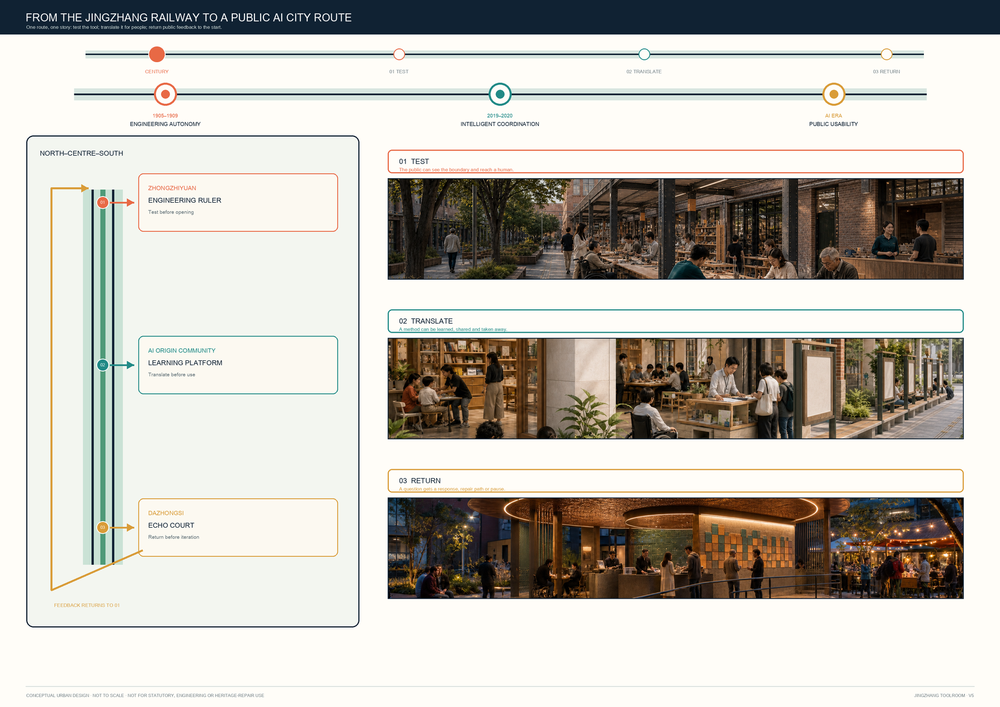
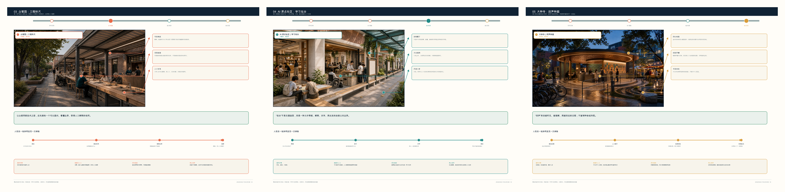
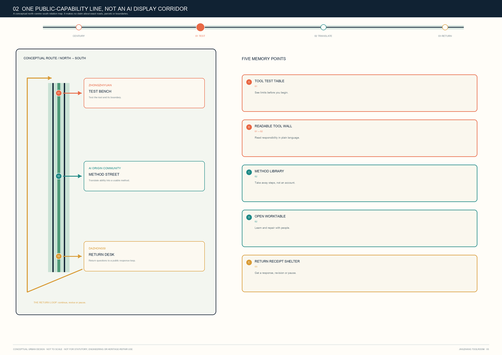
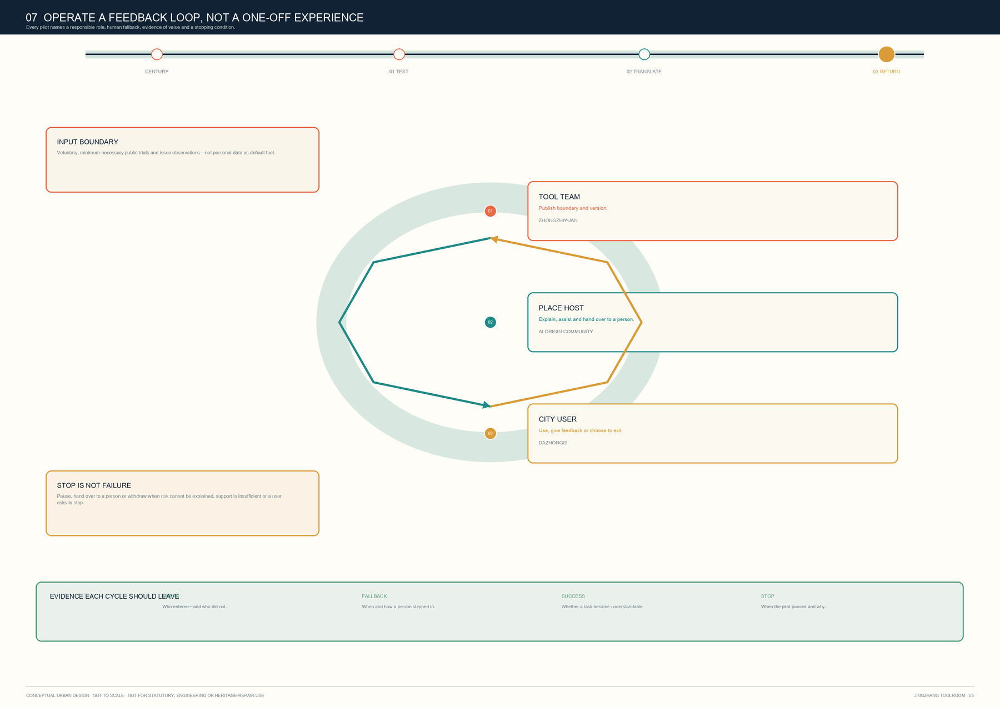

# JINGZHANG TOOLROOM: A Public AI City Route from Engineering Ruler to Echo Court

> **One sentence:** first test AI on an Engineering Ruler, then translate it for people on a Learning Platform, and finally return public feedback through an Echo Court to the next test.

## Evidence, boundary and data status

This proposal responds to the three project positions—centennial Jingzhang culture, urban AI life and AI-integrated innovation—and the six agent tasks [source:OFFICIAL-ANNOUNCEMENT] [source:AGENT-TASKBOOK]. It works across the announced 43.6 km² coordination study, 11.4 km² overall-design task and three key-area tasks. The submitted overall-site and key-area polygons are repository-maintained `provisional_constraint` geometries, not official boundaries [source:SOURCE-REGISTRY] [source:BOUNDARY-SOURCE].

Accordingly, north / centre / south describe only a **functional handover** among the three areas. They do not fix parcels, streets, buildings, stations, ownership or engineering. Areas, green space, public space and footprints can only be recalculated from the provisional package geometry. Regulatory intensity, heights, setbacks, utilities, renewal decisions, finance and approvals require official attachments and professional review. Dashed lines and coloured areas are concepts, not approval ranges.

## Core idea: a public-capability line from test to return

**JINGZHANG TOOLROOM** is neither a proposed new building nor a named operator. It is a test–translate–return protocol that may be explored through existing public interfaces, ground floors, open spaces and event sites:

1. **Test:** at Zhongzhiyuan’s Engineering Ruler, state purpose, data boundary, human support and what a tool cannot do.
2. **Translate:** at the AI Origin Community’s Learning Platform, turn capability into plain language, reusable steps and a non-AI alternative.
3. **Return:** at Dazhongsi’s Echo Court, turn a trial into actionable feedback, a repair record or a public issue rather than retaining behavioural data by default.
4. **Pause:** misleading output, discrimination, mission creep, accessibility failure or operational breakdown can pause, review, revise or retire a scenario.

The proposal turns AI innovation from one-way display into reciprocal public capacity: research receives bounded and explainable feedback; users retain the right to refuse, ask questions, hand over to people and leave. The visual direction is an open square tool frame: orange for testing, teal for learning, ochre for return. The opening means a human must always have a way in and out. No corporate logo, real interface, portrait or uncleared material is used.

## Three levels and three Toolrooms

| Level | Proposal response | Toolroom role | Data / professional boundary |
| --- | --- | --- | --- |
| Coordination study | A research–translation–trial–feedback ecology | A shared protocol for researchers, standard-setters, developers, organisations and residents | Uses only announced scope/tasks; no inferred enterprise roster or spatial allocation |
| Overall design | A walkable network of public interfaces, shade and service fronts | Lending/return points should attach to reachable existing interfaces, not promise new infrastructure | Redlines, stations, utilities and traffic require official data |
| Key areas | Three different prototypes test the public tool lifecycle | North tests; centre translates methods; south returns feedback | Key-area polygons are rough provisional constraints only |

### Zhongzhiyuan: Engineering Ruler / Tool Test Bench

Zhongzhiyuan stands for **test before lending**. A conceptual public-facing interface brings standards, safety, device trials, repair and public explanation to one table. Teams may submit constrained trial versions; users can see what a tool can and cannot do; staff can log non-identifying fault categories and human response. The spatial vocabulary is reversible: movable worktables, display racks, shaded stopping places and paper explanation cards—not presupposed permanent construction.

### Beijing AI Origin Community: Learning Platform / Method Street

The AI Origin Community stands for **translating capability into method**. For students, developers, start-ups and neighbours, it offers brief face-to-face task decomposition, accessible-interface trials, paper/offline alternatives and open teaching. What is borrowed is not an account or personal data, but a stated working method: how to check an AI summary, maintain an auditable collaboration record, and recognise when a human service is necessary.

### Dazhongsi: Echo Court / Return and Feedback Desk

Dazhongsi stands for **a destination after trial**. Product experience, intelligent-device display and service consultation should not end as one-off traffic. A conceptual feedback desk, repair-referral board, accessibility support point and public issue wall let people describe a problem, decline contact retention and find a human channel. Operators must show issue categories, pause conditions and revision results. This is not a claim of enterprise recruitment, commercial change or station reconstruction.

## AI ecosystem: from “having models” to “having public methods”

The ecosystem has six roles: foundational researchers; standards and safety collaborators; open-source/developer communities; start-ups and small organisations; public-service and accessibility supporters; and everyday users. The three prototypes do not monopolise them; testing, lending and return share responsibility. The two wings may be understood as support networks for professional services and scenario feedback; their specific institutions, agreements and finance remain to be confirmed.

For method—not copyable scale or policy—the proposal draws on six public practice types: Fab Lab Network; Helsinki Oodi; Toronto Public Library Digital Innovation Hubs; Ada Lovelace Institute; European Living Labs; and public-library maker spaces. The transferable principles are simple: **explain before use, keep people before automation, return before expansion**. Sources and permitted use appear in `sources.json`; no brands, graphics or performance claims are borrowed.

## Ten AI scenario cards and three tests

Every card states purpose, minimum data, human reviewer, non-digital alternative, stop condition and return route. By default it collects no face, precise location trail, continuous audio or cross-context profile. Any additional data requires separate, explicit and revocable consent.

| Card | Scenario / spatial carrier | Data and human boundary | Test / return |
| --- | --- | --- | --- |
| 01 ★ | Accessible wayfinding Q&A at a public entry | Only the immediate question; staff can answer instead | **Test:** pause on error or accessibility barrier; return anonymous issue category |
| 02 | Paper source / AI-summary comparison table | User materials are not uploaded by default; a person checks source text | Return “understood / misleading” choice |
| 03 | Small-organisation service checklist | No trade secret, ID document or full contract | Human referral and paper checklist |
| 04 | Learning-method lending pack | No student profiling; fully offline option | Return method-improvement note |
| 05 | Open-tool safety explanation card | Shows capability boundary; no sensitive test-data release | Red-team/use issue enters public pending list |
| 06 ★ | Short device-side trial at Test Bench | Session cleared; no personal content retained on demo device | **Test:** staff verify clearing after exit |
| 07 | Community service handover card | AI organises information; never decides eligibility, medical or legal outcomes | Human counter and telephone remain available |
| 08 | Repair and update explanation board | Logs only device/process issue category | Return repair ticket and public version record |
| 09 ★ | Public-event risk prompt at entry | No individual risk score; on-site lead decides | **Test:** error, crowding or complaint triggers human takeover |
| 10 | Cultural-story co-reading table | Cleared text and public sources only | Return correction suggestion; unverified material stays out of official guidance |

## Five personas and accessibility

The Toolroom serves: (1) students and beginners who need a no-registration route into AI boundaries; (2) developers and researchers who need to cross-check standards, safety and actual use; (3) small organisations that need low-barrier assistance without surrendering trade secrets; (4) neighbours and everyday users who need understandable refusal and human channels; and (5) people with low vision, mobility, language or digital-literacy barriers who need physical wayfinding, staff, paper versions and pausable interaction. Accessibility, no-account entry and human handover are entry conditions, not post-launch patches.

## Public space, landmarks and cultural narrative

Three conceptual pilgrimage landmarks are everyday public components, not monumental objects: a **Readable Tool Wall** explains tool, data, human handover and stopping; an **Open Work Bench** makes testing, demonstration, repair and questions visible; a **Return Receipt Canopy** shows non-personal issue categories, responses and unresolved items. The narrative moves from Jingzhang’s engineering tools to Zhongguancun’s open collaboration without inventing historic building functions: *earlier engineering connected people to distant places; today’s AI tools should first connect people to one another.* Wayfinding is organised by four verbs: borrow, understand, return and pause.

## Mobility, blue-green space, buildings and renewal: reversible interfaces only

The proposal does not draw new redlines, designate rail integration, prescribe height/FAR or classify actual demolition/retention. Submitted roads, green space, public space, footprints and phasing are **conceptual design layers** for testing the protocol: walking interfaces support accessible navigation and paper directions; shaded commons host movable worktables, teaching and feedback without becoming surveillance infrastructure; ground floors are read as places for legible, pausable human service. Any renewal, utility, energy, fire, traffic or heritage conclusion awaits official data and disciplinary review.

## Projects, phasing and long-term operation

T-01 explanation cards begin as bilingual paper/web prototypes; T-02 test bench begins as supervised, time-limited device trials; T-03 method library begins with recurring learning, handover and offline practice; T-04 return desk publishes issue categories and handling time; T-05 “Toolroom Season” is a conceptual borrow–learn–return event cycle. Expansion depends on actual readability, accessibility, safety, facility, licence and operator evidence. If no person can explain a tool, it misleads users, cannot be maintained or collects feedback without response, it is revised, paused or retired.

The annual rhythm—spring test, summer learn, autumn return, winter revise—is an operating prototype, not a confirmed government event, finance or recruitment scheme. Each season publishes a non-personal **tool receipt**: what was explainable, what required human takeover, what paused and what merits professional development.

## Metrics, recalculation and compliance

The package separates: (a) recalculable provisional spatial metrics—site area, green/public-space ratios, footprint and key-area count; (b) internal proposal counts—3 hubs, 10 cards, 3 tests, 5 personas, 3 landmarks and zero default permanent personal-data retention; and (c) prohibited pseudo-precision—FAR, height, density, road redlines, utility capacity, investment, recruitment and delivery programme. The displayed 11,412,825.386 sqm is a medium-confidence recomputation of the package's `official_boundary=false` provisional constraint only; it is not an official site area or statutory basis. Matrices connect announcement and agent tasks to narrative, layers, metrics, drawings, sources, assumptions and checks.

## Risk, copyright and professional review

No aerial photography, map basemap, real enterprise logo, portrait or external UI screenshot is used. Diagrams, HTML, PDFs, prose and structured data were originally generated for this concept package; rights and limits appear in `report/copyright_statement.md`. Before any formal implementation discussion, professionals must review official boundaries, key areas, controls, ownership, existing buildings, road/rail/utilities, accessibility, fire, heritage, event licences, data protection and operating responsibility.

**This package is discussable and reviewable, but claims neither approval nor land rights, statutory plan, specific construction, investment or delivery commitment.**

## References

1. Beijing Municipal Commission of Planning and Natural Resources, Haidian Branch, official announcement [source:OFFICIAL-ANNOUNCEMENT].
2. Repository site package, agent taskbook, allowed space and planning limits [source:SITE-PACKAGE] [source:AGENT-TASKBOOK].
3. Source registry and provisional-boundary basis [source:SOURCE-REGISTRY] [source:BOUNDARY-SOURCE].
4. Public materials from Fab Lab Network, Helsinki Oodi, Toronto Public Library Digital Innovation Hubs, Ada Lovelace Institute, European Network of Living Labs and public-library maker spaces—method reference only; links in `sources.json`.
