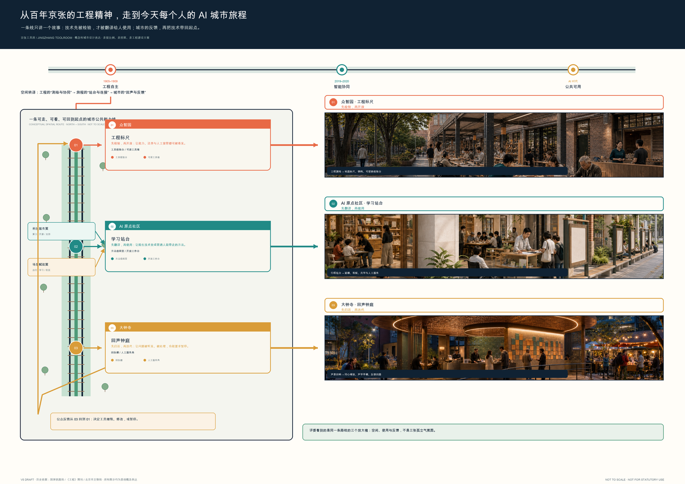
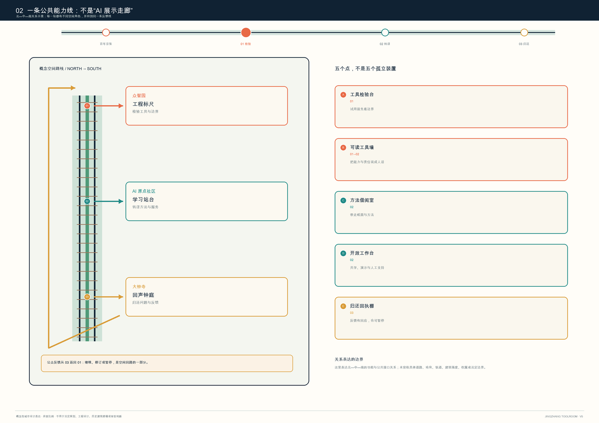
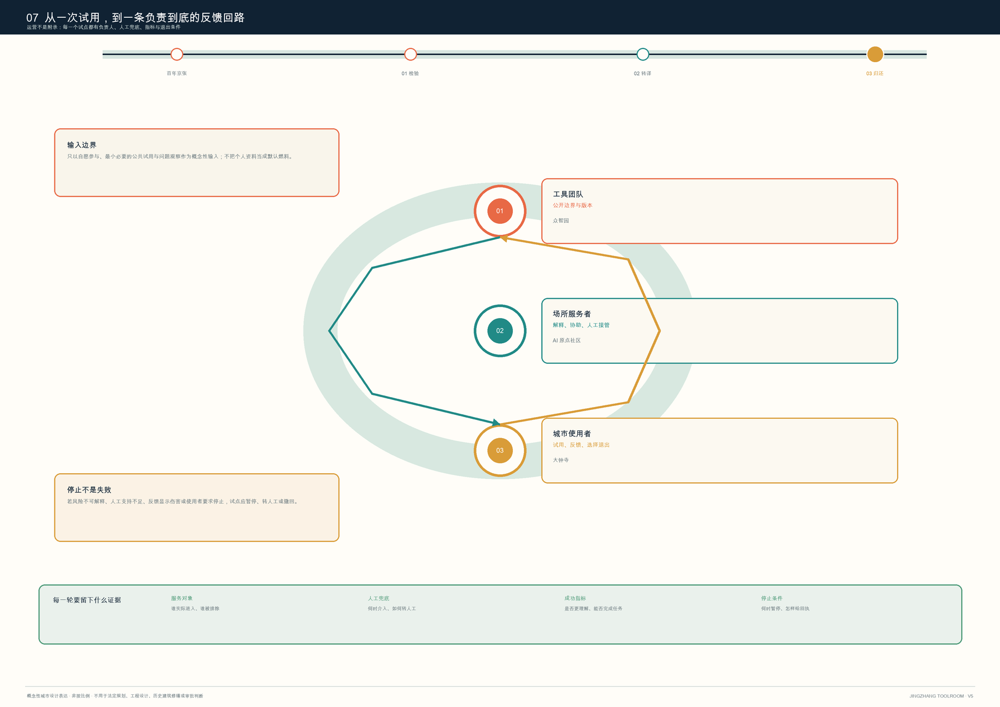

# 京张工具房 JINGZHANG TOOLROOM：从工程标尺到回声钟庭的公共 AI 城市链

> **一句话**：让 AI 先在工程标尺上被检验，再在学习站台上被翻译给人使用，最后由回声钟庭把公共反馈带回下一轮检验。

## 设计依据与资料清单

本方案响应“百年京张文化带、都市 AI 生活体验带、AI 融合创新带”的三大定位及六项智能体任务 [source:OFFICIAL-ANNOUNCEMENT] [source:AGENT-TASKBOOK]。方案的工作对象包括约 43.6 km² 统筹研究、约 11.4 km² 总体设计和三处重点区域的任务关系。

本提交包用于空间表达的总体及重点区域 polygon 都是仓库维护者的 `provisional_constraint`，不是官方红线 [source:SOURCE-REGISTRY] [source:BOUNDARY-SOURCE]。

因此，文中“北部/中部/南部”只描述三个重点区的**功能接力关系**，不声明具体地块、道路、建筑、站点、权属或工程位置。所有面积、绿地、公共空间和建筑基底数值仅能由包内临时几何复算；控规强度、高度、退线、市政负荷、拆改留、建设时序、资金和审批都必须待正式附件及专业复核后判断。图中虚线和色块代表概念构件与临时约束，绝非审批范围。

## 总体概念：一条从检验到归还的公共能力线

**京张工具房 / JINGZHANG TOOLROOM** 不是新增一座建筑，也不是指定的运营机构。它是一套可布置在现有公共界面、园区首层、开敞空间和活动场地的“检验—转译—归还”协议：

1. **检验**：在众智园的“工程标尺”先写清用途、数据边界、人工支持与不能做什么；
2. **转译**：在 AI 原点社区的“学习站台”把能力拆成普通语言、可复用步骤和不用 AI 的替代流程；
3. **归还**：在大钟寺的“回声钟庭”把试用结果转为可处理的反馈、维修记录或公开问题，而不是默认永久保存个人行为数据；
4. **暂停**：出现误导、歧视、超出用途、无障碍障碍或运营失守时，任何场景可暂停、复核、修订或退出。

这把“AI 创新”从单向展示转成双向公共能力：研发端得到受限、可解释的使用反馈；城市使用者得到拒绝、提问、人工接管与退场的权利。它对应三大定位中的文化、生活和融合创新，也把五大功能中的技术、生态、场景、活力和治理接进同一条可读回路 [source:AGENT-TASKBOOK]。

### 视觉与命名系统

标志方向是一个**开口的方形工具框**：橙色代表检验，青绿色代表共学，赭黄色代表归还；缺口指向“工具必须留出人工进入和退出的位置”。图形不使用企业 Logo、真实 UI、人物肖像或未清权素材。命名体系包括：工程标尺、学习站台、回声钟庭、工具检验台、公共说明卡、暂停按钮。它们都是可供专业团队深化研究的品牌与空间语言，不是既定政府品牌。

## 三层范围工作框架

[source:SITE-PACKAGE] [source:AGENT-TASKBOOK] [source:SOURCE-REGISTRY]

| 工作层级 | 方案回答 | 与工具房的关系 | 数据/专业边界 |
| --- | --- | --- | --- |
| 统筹研究 | 建立“研发—转译—试用—反馈”生态闭环 | 为高校、企业、开发者、居民与服务者定义共用的工具协议 | 仅采用公告的范围和任务，不推断产业名单或空间布局 |
| 总体设计 | 把公共界面、慢行、绿荫与服务前台组织为可抵达的协作网络 | 借还点应优先接入已有可达公共界面，而不是制造新的交通或建设承诺 | 道路、站点、管线与红线待官方资料复核 |
| 重点区域 | 以三种不同功能原型验证公共工具的全生命周期 | 北检验、中转译、南归还，形成而非复制的接力关系 | 三处 polygon 为临时粗略范围，只表达关系不落定地块 |

## 总体设计范围城市更新与控规深度城市设计

[source:SITE-PACKAGE] [source:SOURCE-REGISTRY] [metric:site_area_sqm]

总体设计范围内，工具房只提出“可撤回的公共接口”这一城市设计方法：把可读说明、人工服务、无障碍停留、纸面导视和可移动工作台纳入公共界面与首层服务的设计讨论。提交的用地、道路、绿地、公共空间、建筑基底和分期图层用于说明这一方法与总体空间结构的关系，不表达实际项目、控规调整、道路红线、建筑强度或工程结论。总体范围的临时复算面积为 `11,412,825.386 sqm` [metric:site_area_sqm]；该值仅按包内 `official_boundary=false` 的 `provisional_constraint` 轮廓复算，数据置信度为 medium，只能作为本包图层一致性核验，不能推导官方面积、容积率、承载量或分期投资。后续应把正式红线、现状地籍、道路/轨道/管线、公共服务缺口和无障碍调查共同叠加，才可讨论哪些既有界面可承载工具房、哪些空间只应保留为观察样本。所有现状更新、土地权属、市政承载、轨道接入和审批条件均需以官方资料和专业核验为前提。

## 重点区域详细设计

[source:AGENT-TASKBOOK] [source:SOURCE-REGISTRY] [data:geometry/key_areas.geojson]

三处重点区以“北检验、中转译、南归还”的接力关系组织。每个原型均须在后续专业深化中复核实际边界、首层可用性、无障碍、消防、运营主体、数据保护及活动许可；以下内容仅是概念性空间和服务原型。

### 众智园：工程标尺 / 工具检验场

众智园对应“**先验证，后借出**”。这里的概念性公共界面用于把安全、标准、端侧试用、维修和公开说明放到同一张桌上：研发团队可提交受限试用版本；使用者能看见工具能做什么、不能做什么；工作人员可记录不涉及身份追踪的故障类型与人工处置。空间上建议使用可撤除的工作台、可移动展示架、遮荫停留区与纸面说明卡，而不是预设新建建筑或永久设备。

### 北京 AI 原点社区：学习站台 / 方法街

原点社区对应“**把能力翻译成方法**”。它面向学生、开发者、初创团队和周边使用者，提供短时、面对面的任务拆解、无障碍界面试用、纸面/离线替代流程和公开教学。可借走的不是账号或个人数据，而是清楚标识的工作方法：例如如何核对一份 AI 摘要、怎样写出可审计的协作记录、何时必须找真人服务。

### 大钟寺：回声钟庭 / 归还与反馈台

大钟寺对应“**试用后有去处**”。产品体验、智能终端展示、服务咨询和消费场景若没有归还机制，很容易只剩一次性流量。这里建议设置概念性的反馈台、维修转介板、无障碍协助点和公开问题墙：用户可以描述问题、选择不留联系信息、获得人工渠道；运营方要公开处理类别、暂停条件和修订结果。它不是企业招商承诺，也不宣称真实商业或站点改造已经确定。

## 统筹研究范围产业与未来城市研究

[source:OFFICIAL-ANNOUNCEMENT] [source:AGENT-TASKBOOK] [source:SOURCE-REGISTRY]

工具房的生态图谱由六类角色构成：**基础研究者、标准与安全协作者、开源/开发者社区、初创与中小组织、公共服务与无障碍支持者、日常使用者**。三处原型并不分别垄断这些角色，而是用“检验—借阅—归还”让每一类角色都能交接责任。两翼可被理解为提供专业服务和场景反馈的支撑网络，具体机构、协议与资金均待后续核实。

作为方法参考而非可复制模板，本方案比较六类全球公共创新实践：Fab Lab Network 的开放制作网络、赫尔辛基 Oodi 的公共学习空间、多伦多公共图书馆 Digital Innovation Hubs 的设备与技能支持、英国 Ada Lovelace Institute 的公共 AI 研究、欧盟 Living Labs 的真实场景共创方法，以及公共图书馆 maker-space 的借用与维护机制。可转译的不是某个城市的规模或政策，而是三条原则：**先说明再使用、先有人再自动、先归还再扩张**。案例来源与用途见 `sources.json`；本方案不借用其品牌、图形或绩效数据。

## AI 创新生态、人才画像与 AI+ 场景

[source:AGENT-TASKBOOK] [source:SITE-PACKAGE] [data:metrics.json]

每张卡均明确：**目的 / 最小数据 / 人工复核 / 非数字替代 / 停止条件 / 归还路径**。默认不采集人脸、精确轨迹、连续语音或跨场景画像；任何额外数据均需另行、明确、可撤回的授权。

| 卡片 | 场景与空间载体 | 数据与人工边界 | 测试/归还 |
| --- | --- | --- | --- |
| 01 ★ | 无障碍导视问答卡：公共路径入口 | 只处理当次问题；工作人员可替代回答 | **测试验证**：错误率或无障碍障碍出现即暂停；归还为匿名问题类别 |
| 02 | 纸面材料与 AI 摘要对照桌：借阅室 | 用户材料不默认上传；人工说明原文核对 | 归还为“是否读懂/是否误导”选项 |
| 03 | 小微组织办事清单助手：服务前台 | 不输入营业秘密、身份证件或合同全文 | 转接真人服务与纸面清单 |
| 04 | 学习方法借阅包：共学桌 | 不形成学生画像；可完全离线使用 | 归还为方法改进建议 |
| 05 | 开源工具安全说明卡：检验台 | 仅展示工具能力边界；不开放敏感测试数据 | 红队/使用问题进入公开待处理栏 |
| 06 ★ | 端侧工具短时试用：检验台 | 设备会话清除；不把个人内容留在演示机 | **测试验证**：退出后由工作人员复核清除状态 |
| 07 | 社区服务人工转接卡：公共界面 | AI 只做信息整理，不作资格、医疗或法律决定 | 人工窗口和电话为常设替代 |
| 08 | 维修与更新解释板：归还台 | 只记录设备/流程问题类别 | 归还为维修单和公开版本记录 |
| 09 ★ | 公共活动风险提示助手：活动入口 | 不做个体风险评分；现场负责人最终判断 | **测试验证**：误报/漏报、拥挤或投诉触发人工接管 |
| 10 | 文化叙事共读桌：遗产与公共空间界面 | 只使用清权文本与公开来源 | 归还为更正建议，未经核实内容不进入正式导览 |

## 五类用户画像与可达性承诺

1. **学生与初学者**：需要不用先注册、也能理解 AI 工具边界的学习入口；
2. **开发者与研究者**：需要在公开说明、标准、安全和真实使用反馈之间来回校验；
3. **初创/小微组织**：需要低门槛的资料整理与真人转介，而非被迫交出商业秘密；
4. **周边居民与日常使用者**：需要看得懂、能拒绝、能走人工渠道的服务；
5. **低视力、行动不便、语言或数字能力受限者**：需要实体导视、真人协助、纸面版本与可暂停的交互。

工具房把无障碍、无账号进入和人工转接写入每张卡的准入条件，不把它们当成上线后的补丁。

## 公共空间、地标与文化叙事

三处**概念性 AI 朝圣地标**不是纪念碑式大物件，而是人人可使用、可理解的公共构件：

- **可读工具墙**：用普通语言呈现“工具是什么、用了什么数据、谁能接管、怎么停止”；
- **开放工作台**：让检验、演示、维修与提问在可见空间发生，避免把治理藏在后台；
- **归还回执棚**：用可更新的公开板展示问题类别、处理状态和仍未解决事项，不展示个人资料。

叙事从百年京张的工程工具与现代中关村的开放协作出发，但不虚构某一处遗产建筑的原有功能。核心句是：**过去的工程把人和远方接起来；今天的 AI 工具也应先把人和人接起来。** 导视以“借、懂、还、停”四个动词组织，形成从历史技术文化到当代公共技术伦理的连续体验。

## 用地、建筑规模与拆改留方案

[source:SITE-PACKAGE] [source:SOURCE-REGISTRY] [metric:building_footprint_area_sqm]

本方案不新画道路红线、不指定轨道接入、不预设建筑高度、容积率或拆改留。提交图层中的道路、绿地、公共空间、建筑基底和分期仅作为测试工具房协议的**概念设计图层**。其中建筑基底复算值为 `310,807.184 sqm` [metric:building_footprint_area_sqm]，仅反映仓库临时几何的覆盖关系，既不等于既有建筑的真实测绘面积，也不构成新建规模、拆改留比例或容量指标。用地分区的四种色块只是“检验、绿荫、借阅、归还”的服务角色；官方地块、权属、现状质量和规划用途一经发布，须重新核对每一个图层、面积和图纸，不能拿临时比例填充法定指标。建筑界面建议仅为下一步专业团队提出问题：哪些首层可开放、哪些空间需要保留、哪些活动必须避开，而非先给出拆建答案。

## 交通、轨道、市政与公共服务设施

[source:SITE-PACKAGE] [source:SOURCE-REGISTRY] [data:geometry/roads.geojson]

交通和公共服务的设计意图是让“借、懂、还、停”能靠步行、轮椅、纸面导览和真人服务完成，而不是制造新的技术门槛。包内道路线、公共空间和服务点是概念性联络关系：它们可帮助检查三处工具房是否在同一服务叙事中，却不能表示道路等级、断面、信号、停车、轨道线位、消防通道、管线容量或设施选址。接入正式现状测绘和交通/市政资料后，专业团队应依次核验：到达路径的无障碍连续性、峰时人流、活动疏散、雨雪天气、夜间照明、设备用电、网络安全、人工窗口和值守能力。任一条件不足时，工具房场景应缩小、转移、改为纸面/线下服务或暂停，而不是用模型输出替代基础设施判断。

- 慢行与导视接口优先服务无障碍步行、纸面导览和人工服务点；不新增道路红线，也不对轨道接入、停车、管线或市政负荷作结论。公共服务设施的前提是明确真人服务、无障碍通行和非数字替代。

## 蓝绿空间、公共空间与城市风貌

[source:SOURCE-REGISTRY] [metric:green_ratio] [metric:public_space_ratio]

蓝绿与公共空间的设计意图不是把绿地、广场或历史界面商品化为“AI 打卡点”，而是提供看得见的停留、讨论、纸面阅读、人工协助和无障碍休息条件。临时图层复算的绿地比例为 `0.123423` [metric:green_ratio]、公共空间比例为 `0.073281` [metric:public_space_ratio]；两项只核验本包几何与指标的一致性，不等于现状调查、生态评价、法定绿地率或开放空间标准。后续必须由景观、生态、文保、无障碍和运营团队核验树木、水系、热环境、雨洪、夜间安全、管理责任和活动容量。可读工具墙、开放工作台和归还回执棚都应被视为可移动、可撤除的公共构件，其材料、尺度、位置和任何文化表达均不得先于现场和专业审查确定。

- 绿荫与开敞空间容纳可移动工作台、短时教学和公开反馈，而不把公园变成数据采集场；
- 建筑界面优先考虑首层可读、可停留、可人工接管的服务前台；
- 风貌语言以开口工具框、可读说明和可更新回执为主，避免把概念地标误写为已批准建设；
- 任何建筑更新、能源、管线、消防、交通组织和文化保护结论，均等待官方资料、权属核验与专业设计。

## 更新项目清单、实施政策与分期计划

[source:AGENT-TASKBOOK] [source:SITE-PACKAGE] [data:assumptions.json]

| 项目 | 近期：先做什么 | 中期：何时深化 | 长期：如何评估与退出 |
| --- | --- | --- | --- |
| T-01 工具说明卡 | 用纸面+网页双版本试行十张卡 | 根据可读性与无障碍反馈迭代 | 无人能解释或持续误导即下线 |
| T-02 检验台 | 小范围、预约制、有人监督的端侧工具试用 | 取得专业安全与设施条件后再扩大 | 安全或维护不可持续即暂停 |
| T-03 方法借阅室 | 定期共学、人工转接与离线练习 | 由实际服务者共建课程/工具包 | 不形成实际学习价值即重写或停止 |
| T-04 归还反馈台 | 公开问题类别与处理时限 | 明确跨组织转介规则后再扩展 | 反馈无人处理即停止收集 |
| T-05 工具房季 | 概念性的“借用日—共学日—归还日”三日活动 | 需公共空间许可、安全与版权复核 | 不以到场人数替代公共价值评价 |

建议的年度机制是“工具房季”：春季检验、夏季共学、秋季归还、冬季修订。它是运营原型，不是已确定活动、资金、招商或政府安排。每季公开一份不含个人信息的**工具回执**：哪些工具被解释清楚，哪些需要人工接管，哪些被暂停，哪些值得由专业团队继续深化。

## 指标体系、面积复算与合规矩阵

[source:SOURCE-REGISTRY] [data:metrics.json] [metric:site_area_sqm]

提交包采用三类指标：

- **可复算空间指标**：临时总体范围面积、绿地比例、公共空间比例、建筑基底与三处重点范围数量，详见 `metrics.json`；
- **方案内部可数指标**：3 个工具房原型、10 张场景卡、3 项测试验证、5 类画像、3 个地标、默认 0 项个人数据永久留存；
- **不得伪造的待确认指标**：容积率、高度、建筑密度、道路红线、管线、服务半径、投资、招商和实施时序。

`compliance_matrix.json`、`standard_matrix.json` 和 `design_depth_matrix.json` 将公告任务、六项智能体任务、本文章节、图层、指标、图纸、来源和自检项一一关联。包内数字仅说明所提交概念方案的构成，绝不替代政府控制指标或工程可行性结论。

## 风险、版权与合规说明

[source:SOURCE-REGISTRY] [data:assumptions.json] [data:self_check.json]

本包不使用航拍、地图底图、真实企业标志、人物照片或外部 UI 截图。全部示意图、HTML、PDF、文本和结构化数据由提交作者为本次概念方案原创生成；版权和使用边界见 `report/copyright_statement.md`。最重要的风险不是“图画得不够满”，而是把公开征集的概念图误读成工程承诺：临时 polygon 不能替代官方边界，包内复算数不能替代控规指标，AI 场景卡不能绕过数据保护、无障碍、消防、公共活动或专业服务责任。任何进入实际空间、处理真实个人数据、产生对人不利建议或涉及文化资源的测试，必须先完成相应的权属、许可、伦理、技术、安全和专业审查；条件不充分时应保留人工、纸面和非数字路径，或直接不开展。正式提交前仍需专业团队复核：官方边界、重点区范围、控规条件、权属、现状建筑、道路/轨道/市政、无障碍、消防、文保、活动许可、数据保护与运营主体。

**本方案可供讨论和复核，但不代表官方批准、土地权属、法定规划、具体建设项目、投资安排或实施承诺。**

## 参考资料

1. 北京市规划和自然资源委员会海淀分局，《百年京张AI创新带城市设计国际方案征集资格预审公告》 [source:OFFICIAL-ANNOUNCEMENT]。

2. 开源仓库 `brief/site-package/design_brief.json`、`agent_taskbook.json`、`allowed_design_space.json`、`ranges/planning_limits.json` [source:SITE-PACKAGE] [source:AGENT-TASKBOOK]。

3. 仓库 `data/source_registry.json` 与临时边界说明 [source:SOURCE-REGISTRY] [source:BOUNDARY-SOURCE]。

4. Fab Lab Network、Helsinki Oodi、Toronto Public Library Digital Innovation Hubs、Ada Lovelace Institute、European Network of Living Labs 和公共图书馆 maker-space 的公开资料（仅作方法参考，链接见 `sources.json`）。
