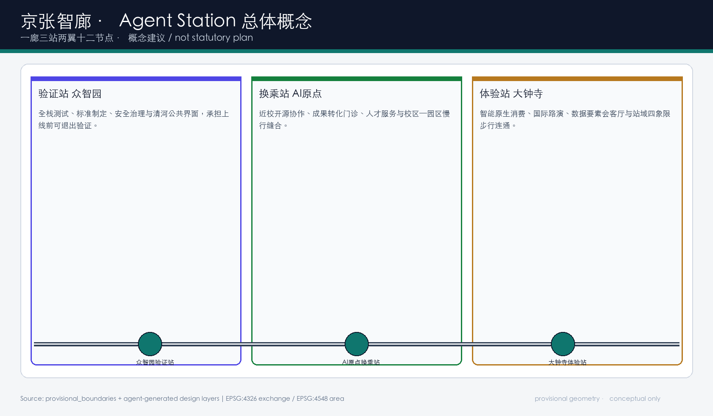
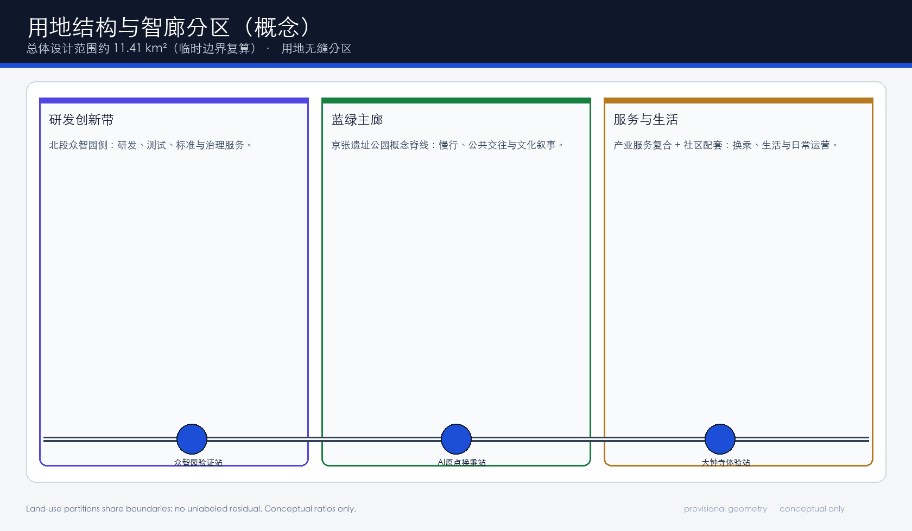
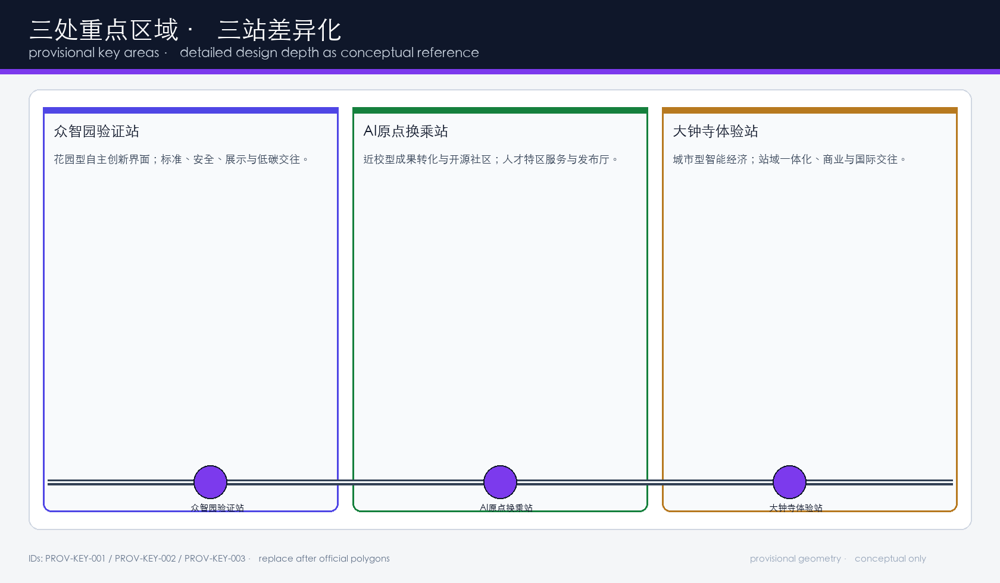
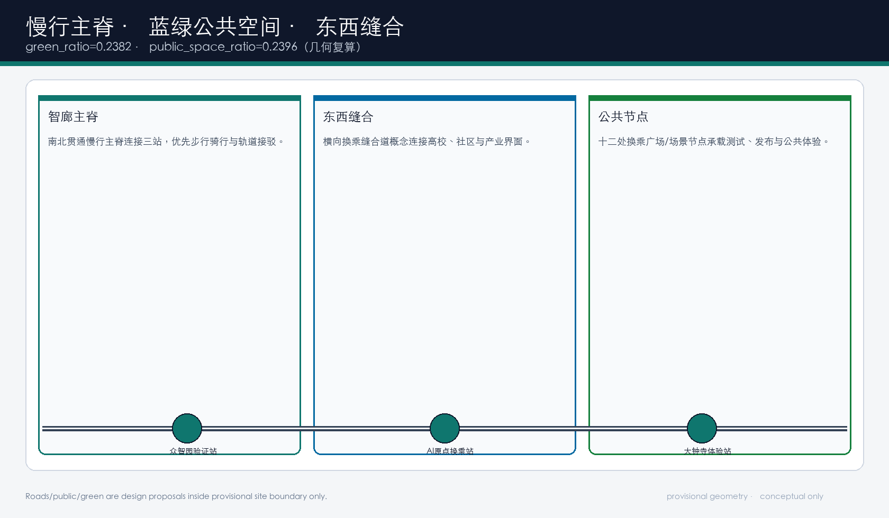
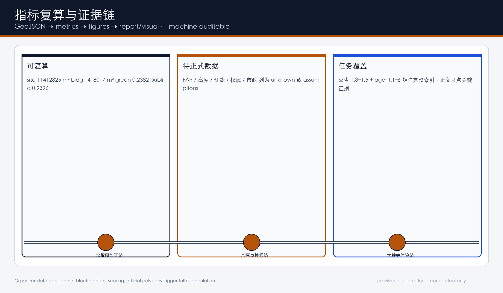

# 京张智廊：多智能体协同站城市设计 / JingZhang Agent Station: Multi-Agent Collaborative Corridor

> **边界状态：PROVISIONAL CONSTRAINT。** 本方案使用仓库维护者依据公开公告整理的临时粗略范围，只能用于概念生成、展示和投稿自检。它不是 official redline，不表达地块、权属、道路、文保或工程边界；取得清权 official polygons 后，全部图层、指标、图片、PDF 与 HTML 必须同步重算。[source:BOUNDARY-SOURCE] [data:geometry/site_boundary.geojson#SITE-001] [assumption:A-BOUNDARY-001]

## 一页执行摘要

| 评审问题 | 京张智廊的回答 | 可核验成果 |
| --- | --- | --- |
| 核心命题 | 把 AI 从分散应用转译为可换乘、可验证、可退出的多智能体城市协同站 | 命名/Logo 方向、三站协议、十二场景卡 |
| 空间响应 | 一廊三站两翼十二节点，连接研发验证、近校转化与城市体验 | 9 类 GeoJSON、5 张证据图、A3/A0、离线可视化 |
| 实施起点 | 先做协议、导视、可退出试点与轻量公共组件；重工程依赖正式条件 | 分期图层、项目清单、assumptions |
| 公共价值 | 高风险场景必须人工最终负责；保留非数字路径与退出申诉 | 隐私与人工复核自检 |
| 证据状态 | 几何与指标可复算；法定强度待正式数据补齐 | metrics / matrices / self_check |
| 决策边界 | 全部为概念建议与参考方案，不是法定规划或政府承诺 | 风险章节与边界条款 |

**English brief.** JingZhang Agent Station turns the historic railway into a multi-agent transfer system: Verification Station, Transfer Station and Experience Station along one public spine, with two service wings and twelve governed nodes. All geometry is provisional and conceptual.

## 设计依据与资料清单

本 formal 方案以北京市规划和自然资源委员会海淀分局发布的《百年京张AI创新带城市设计国际方案征集资格预审公告》为第一依据。[source:OFFICIAL-ANNOUNCEMENT] 机器可读输入来自 `brief/site-package/` 中经维护者登记的临时粗略边界、重点区域、枚举、指标、标准快照和来源清单。[source:SITE-PACKAGE] [depth:existing_conditions_diagnosis]

资料使用边界由公开来源登记表约束：formal 可用资料不得被 background/provisional 材料“升级”为 official redline、法定控规或政府实施承诺。[source:SOURCE-REGISTRY]

`data/processed/agent_fact_pack.md` 只作阅读导航，不产生新的权威事实。[source:PROCESSED-FACT-PACK]

专业标准以仓库本地快照为准，包括城市设计、控规深度、用地分类与设计深度要求。[standard:MOHURD-URBAN-DESIGN-MEASURES] [standard:MOHURD-CONTROL-DETAILED-PLANNING] [standard:MNR-LAND-USE-CLASSIFICATION-GUIDE]

智能体任务书六项任务（命名识别、生态案例、场景画像、公共地标、文化叙事、长期运营）是正文必须展开的内容，不是口号清单。[source:AGENT-TASKBOOK] [standard:PROJECT-AGENT-OPEN-CALL-TASKBOOK]

本次采用 provisional boundary 的可评分状态为：**临时边界，保留精度警示并待正式数据发布后复算；组织方数据缺口不阻断内容评分**。提交包中 `geometry/site_boundary.geojson` 与 `geometry/key_areas.geojson` 标注 `provisional_constraint`、`official_boundary=false`。[data:geometry/site_boundary.geojson#SITE-001] [metric:site_area_sqm]

## 三层范围工作框架

方案按公告三层范围组织工作：统筹研究范围约 43.6 km² 关注产业生态与未来城市形态；总体设计范围约 11.4 km² 达到控规城市设计深度；重点区域约 368.4 ha 对三处片区做详细设计深度概念方案。[standard:PROJECT-OFFICIAL-ANNOUNCEMENT] [depth:three_level_scope_framework]

三层不是三套无关图纸：统筹决定“换乘什么”，总体决定“廊道如何承载”，重点区决定“站如何运转”。空间证据以临时边界和三处重点区图层为准。[data:geometry/site_boundary.geojson#SITE-001] [data:geometry/key_areas.geojson#PROV-KEY-001] [depth:overall_spatial_structure]

**总体概念命名：京张智廊 / JingZhang Agent Station（简称 JZ-AS / 智廊）。**  
Logo 方向：水平轨线 + 三个圆形站点节点 + 双向换乘箭头；主色深青（#0f766e）与墨蓝（#0f172a），强调可审计、可换乘、可退出，而不是娱乐化网红符号。命名服务三大定位——百年京张文化带、都市AI生活体验带、AI融合创新带——并对应五大功能与三区两翼回路。[source:AGENT-TASKBOOK]

| 层级 | 设计问题 | 方案回答 | 数据落点 |
| --- | --- | --- | --- |
| 统筹研究 | 创新生态如何组织 | 验证—换乘—体验的多智能体回路 | compliance / standard matrices |
| 总体设计 | 更新与设施如何落图 | 用地、建筑、道路、绿地、公共空间、分期 | [data:geometry/land_use.geojson#LU-001] |
| 重点区域 | 三站如何差异化 | 验证站 / 换乘站 / 体验站详细概念 | [data:geometry/key_areas.geojson#PROV-KEY-001] |

## 统筹研究范围产业与未来城市研究

### 世界级 AI 创新生态与案例转译

统筹研究回应“构建世界级 AI 创新生态体系”。本方案用“站—廊—翼”组织要素：土地与空间、产业与资金、人才与开源、算力与数据、场景与治理在不同站点被“换乘”，而不是堆在同一园区。[source:AGENT-TASKBOOK] [depth:overall_spatial_structure]

全球案例（机制对照，不作海淀绩效类比）：

| 案例 | 可转译机制 | 不直接照搬 |
| --- | --- | --- |
| 1. Station F（巴黎） | 大体量创业空间 + 公共活动层 | 产权与财政模式 |
| 2. MaRS Discovery District（多伦多） | 医院—大学—企业邻接转化 | 医疗数据制度 |
| 3. Helsinki Smart Kalasatama | 敏捷试验与居民参与 | 北欧治理结构 |
| 4. Singapore One-North | 研发簇群与慢行结构 | 国家产业政策 |
| 5. Barcelona 22@ | 产业更新与公共空间并进 | 地中海城市肌理 |
| 6. Tokyo TeamLab / team 公共展演 | 体验型科技内容公共化 | 商业 IP 路径 |
| 7. Pittsburgh Robotics Row | 近校机器人/AI 走廊 | 美国高校—军工语境 |
| 8. Shenzhen Nanshan AI nodes（公开叙述） | 产业集聚与城市界面叠加 | 具体企业名单与投资额 |

案例只支持机制设计启发，不支持编造企业落户、产值或财政承诺。[source:AGENT-TASKBOOK]

### 三区两翼协同回路

- **众智园验证站**：AI 全栈自主创新与治理话语权的“出发检票口”。
- **AI原点换乘站**：世界级创新生态的“开源与转化换乘厅”。
- **大钟寺体验站**：智能原生新业态的“城市体验到站”。
- **中关村科技服务翼**：资本、IP、专业服务与全球要素配置。
- **小月河场景赋能翼**：真实城市场景与公共体验反馈。

该回路是概念协同关系，不是新的行政区划或法定功能区划。[standard:MOHURD-URBAN-DESIGN-MEASURES] [data:geometry/public_space.geojson#PUBLIC-001]

## 总体设计范围城市更新与控规深度城市设计

总体设计达到控制性详细规划的城市设计深度表达要求：完整用地分区、概念建筑基底、慢行与接驳、蓝绿公共空间、分期与更新项目清单。强度、高度、红线等法定控制因资料缺失保持 unknown。[standard:MOHURD-CONTROL-DETAILED-PLANNING] [depth:land_use_layout] [depth:development_intensity_controls]

用地按共享边界分区覆盖临时总体范围：AI研发创新、京张智廊公园与开敞空间、产业服务与协同服务、社区服务与生活配套。[data:geometry/land_use.geojson#LU-001] [data:geometry/land_use.geojson#LU-002] [standard:MNR-LAND-USE-CLASSIFICATION-GUIDE]

建筑概念簇群仅表达“可讨论的更新对象类型”，拆改留结论待权属与现状测绘补齐。[data:geometry/buildings.geojson#BLDG-001] [metric:building_footprint_area_sqm] [depth:retain_renovate_demolish]

交通以智廊慢行主脊 + 东西换乘缝合道为概念骨架，服务北五环至西直门走廊的轨道接驳讨论，不画道路红线。[data:geometry/roads.geojson#ROAD-001] [depth:traffic_rail_slow_parking]

## 重点区域详细设计

三处重点区在 `geometry/key_areas.geojson` 中均有 provisional 特征，详细设计深度以“定位 + 空间结构 + 建筑更新方法 + 交通慢行 + 公共空间 + AI场景 + 实施依赖”表达。[depth:three_key_area_detailed_design]

| 重点片区 | 站角色 | 空间动作（概念） | AI 与运营场景 | 证据 |
| --- | --- | --- | --- | --- |
| 众智园AI自主创新加速区 | 验证站 | 清河界面公共化、展示与测试空间、低碳交往廊 | 上线前验证、标准共创、安全治理展示 | [data:geometry/key_areas.geojson#PROV-KEY-001] |
| 北京AI原点社区 | 换乘站 | 校区—园区慢行缝合、发布厅、转化门诊、人才服务 | 开源协作、成果转化、近校孵化 | [data:geometry/key_areas.geojson#PROV-KEY-002] |
| 大钟寺AI产业聚集区 | 体验站 | 大钟寺站一体化、四象限步行、智能原生市集 | 路演、终端与内容消费、数据会客厅 | [data:geometry/key_areas.geojson#PROV-KEY-003] [metric:key_area_count] |

所有片区动作均为**概念建议 / 参考方案 / 可供专业团队深化研究**，不构成控规调整、拆改留审批或工程可行性结论。[assumption:A-CONTROLS-001]

## AI 创新生态、人才画像与 AI+ 场景

### 五类用户画像

| 用户画像 | 典型需求 | 空间响应 | 隐私与人工边界 |
| --- | --- | --- | --- |
| 开源开发者 | 发布、协作、声誉 | 原点开源换乘大厅、夜间协作角 | 不采集轨迹；活动只做聚合 |
| 初创团队 | 测试场、转化门诊 | 众智园验证舱、标准咨询 | 算力/数据另行授权 |
| 企业产品经理 | 场景试验、客户触点 | 大钟寺体验站、路演客厅 | 企业标识须清权 |
| 周边居民 | 通勤、休闲、低扰动 | 蓝绿主廊、生活配套界面 | 不做商业画像推荐 |
| 公共治理者 | 可审计复盘、退出机制 | 公共安全复盘台、协议公示墙 | 高风险场景人工最终负责 |

### 十二张 AI 场景卡（含 3 个产业测试验证）

| 场景卡 | 类型 | 空间载体 | 数据/隐私 | 人工复核 |
| --- | --- | --- | --- | --- |
| 01 上线前验证舱 | **产业测试验证** | 众智园 | 测试日志聚合 | 评测官签字退出 |
| 02 标准共创坊 | 产业协作 | 众智园 | 公开标准文本 | 专家组审定建议 |
| 03 开源换乘大厅 | 生态 | AI原点 | 贡献元数据 | 社区维持者审核 |
| 04 成果转化门诊 | 转化 | AI原点 | 预约与工单 | 顾问人工会诊 |
| 05 慢行断点诊断 | 城市AI | 智廊主脊 | 公开/聚合传感 | 交通专业复核 |
| 06 站域四象限导航 | 城市AI | 大钟寺 | 站点公开信息 | 运营方确认 |
| 07 数据要素会客厅 | **产业测试验证** | 大钟寺 | 授权样本 | 合规官审核 |
| 08 智能原生市集 | 消费体验 | 大钟寺 | 脱敏客流 | 商户与城管协同 |
| 09 人才生活换乘 | 生活服务 | 原点—社区界面 | 自愿登记 | 人工服务台兜底 |
| 10 公共安全复盘台 | 治理 | 公共节点 | 事件摘要 | 人最终负责 |
| 11 端侧算力驿站 | **产业测试验证** | 总体节点 | 设备遥测聚合 | 能源/安全复核 |
| 12 全球 Agent 周路线 | 运营传播 | 一带公共系统 | 活动许可数据 | 活动安全方案 |

场景落到公共空间、道路与绿地图层，而不是口号。[data:geometry/public_space.geojson#PUBLIC-001] [data:geometry/roads.geojson#ROAD-001] [metric:public_space_ratio]
用地方案完整覆盖提交边界，相邻分区共享边界坐标，无未标注空隙。[data:geometry/land_use.geojson#LU-001] [depth:land_use_layout]

概念建筑基底合计约 1418017 m²（临时边界内示意簇群），用于讨论更新对象类型，不代表现状测绘或审批规模。[metric:building_footprint_area_sqm] [data:geometry/buildings.geojson#BLDG-001]

拆改留采用“方法先于结论”：先建立调查—权属—结构—文保—产业适配的判断树，再进入专业团队地块研究；本包不输出地块级拆除结论。[depth:retain_renovate_demolish] [assumption:A-RRD-001]

容积率、建筑高度、建筑密度等法定强度指标状态为 **待正式数据补齐**。[metric:floor_area_ratio] [depth:development_intensity_controls] [depth:height_massing_character]

## 用地、建筑规模与拆改留方案

用地方案完整、闭合、无缝覆盖提交边界，相邻分区共享边界坐标，避免未标注空隙。本方案将临时总体范围划分为 AI 研发创新用地、京张智廊公园与开敞空间、产业服务与协同服务用地、社区服务与生活配套用地四类概念分区，分类词汇对齐公开用途管制指南，但不冒充已批法定图则。用地是三站差异化功能的底图，而不是招商口号底色。[data:geometry/land_use.geojson#LU-001] [standard:MNR-LAND-USE-CLASSIFICATION-GUIDE] [depth:land_use_layout]

概念建筑基底用于讨论众智园验证站、AI 原点换乘站与大钟寺体验站的更新对象类型、公共界面和近人尺度，不代表现状测绘面积或审批建设规模。拆改留采用“方法先于结论”：在权属、结构、文保、产业适配与专业会审完成前，不输出地块级拆除或重建结论，只保留可复核的判断树与待确认清单。[data:geometry/buildings.geojson#BLDG-001] [metric:building_footprint_area_sqm] [depth:retain_renovate_demolish]

容积率、建筑高度、建筑密度、退线与建筑控制线等法定强度指标因官方控规条件缺失保持 unknown，必须在正式数据补齐后重算；任何把概念容量写成审定指标的写法都被禁止。[metric:floor_area_ratio] [depth:development_intensity_controls] [depth:height_massing_character]

## 交通、轨道、市政与公共服务设施

交通策略优先步行、骑行与轨道接驳，用“主脊 + 缝合”讨论慢行断点、跨环节点与站域一体化；道路线形与红线待正式条件。[data:geometry/roads.geojson#ROAD-001] [data:geometry/roads.geojson#ROAD-002] [depth:traffic_rail_slow_parking]

市政与新基建提出“端侧算力驿站 + 分布式能源接口 + 传统市政融合”的概念布局原则，管线容量、防洪消防等工程测算待正式资料。[depth:municipal_new_infrastructure] [data:geometry/constraints.geojson#CONSTRAINTS]

## 蓝绿空间、公共空间与城市风貌

以京张遗址公园概念脊线组织蓝绿与公共空间：南北贯通服务三站，东西缝合连接高校、社区与产业界面。复算绿地比例约 0.2382，公共空间比例约 0.2396（临时几何）。[data:geometry/green_space.geojson#GREEN-001] [data:geometry/public_space.geojson#PUBLIC-001] [metric:green_ratio]### AI 朝圣地标与荣誉展示（不少于 3 处）

1. **验证之塔（概念）** — 众智园：展示可退出测试协议与安全治理贡献。
2. **换乘之钟（概念）** — AI原点：把开源贡献与转化里程可视化。
3. **体验之庭（概念）** — 大钟寺：智能原生生活与国际交往的公共客厅。

荣誉展示体系建议“六栏出处签”式贡献记忆（模型/数据/文化/材料/劳动/公共决定），但须清权，不使用未授权商标肖像。[source:AGENT-TASKBOOK]

### 文化叙事

京张铁路的“轨道—站点—里程”转译为“问题—验证—换乘—体验—复盘”的城市语法；中关村开源协作文化与 AI 新文化在换乘站交汇，避免把文化降格为科技装饰。[source:AGENT-TASKBOOK]

导视系统与一带 Logo 分层：Logo 管品牌识别，导视管站场寻路与状态语言（可运行/需复核/已退出），两者不可混用。

## 更新项目清单、实施政策与分期计划

| 项目编号 | 项目名称 | 类型 | 主要依赖 | 证据 |
| --- | --- | --- | --- | --- |
| JZ-AS-01 | 智廊慢行主脊试点 | 公共空间/交通 | 道路红线、桥下空间 | [data:geometry/roads.geojson#ROAD-001] |
| JZ-AS-02 | 众智园验证舱与清河界面 | 产业/蓝绿 | 河道蓝线、安全规范 | [data:geometry/green_space.geojson#GREEN-001] |
| JZ-AS-03 | 原点开源换乘大厅 | 更新/产业服务 | 权属、首层业态 | [data:geometry/buildings.geojson#BLDG-002] |
| JZ-AS-04 | 大钟寺四象限步行连通 | 轨道/慢行 | 站点与交叉口条件 | [data:geometry/public_space.geojson#PUBLIC-001] |
| JZ-AS-05 | 十二节点公共组件库 | 新基建/公共 | 能源、运维主体 | [data:geometry/constraints.geojson#CONSTRAINTS] |
| JZ-AS-06 | 全球 Agent 周公共路线 | 运营/品牌 | 活动许可与安全 | [data:geometry/phasing.geojson#PHASE-001] |

分期：一期“协议—导视—可退出试点”；二期“三站换乘与公共体验完善”。分期为概念时序，不是资金或审批承诺。[data:geometry/phasing.geojson#PHASE-001] [depth:phasing_implementation] [depth:renewal_project_list]### 长期运营与全球活动体系（agent.6）

- **年度**：JingZhang Agent Week（开发者日、场景开放日、验证公开课、城市体验夜）。
- **季度**：三站轮值开放与复盘发布。
- **持续**：开发者社区、贡献记忆墙、场景准入/退出协议。
- **转化路径**：访客 → 贡献者 → 试点团队 → 专业深化对接（不含招商承诺）。

## 指标体系、面积复算与合规矩阵

指标体系把“可直接从几何复算的量”和“必须等待正式控规或运营数据的量”分开，避免把概念容量写成审定指标。所有 known 指标都在 `metrics.json` 中给出 status、value、unit、source_files、formula、confidence 与 assumptions，并使用 EPSG:4548 投影面积。总体设计范围面积、绿地比例、公共空间比例、概念建筑基底、重点区数量和场景卡数量可以在本包内复核；容积率等法定强度因官方控制条件缺失保持 unknown，并在 assumptions 中说明待正式数据补齐后的重算触发器。[metric:site_area_sqm] [metric:green_ratio] [depth:metrics_recalculation]

正文只解释指标的设计含义：总体范围约束空间分配；蓝绿与公共空间比例支撑日常交往、换乘广场和场景节点；建筑基底只用于讨论更新对象类型，不代表审批规模。完整数值与公式不在正文重复堆叠，而保存在结构化文件中，供 `spatial_review` 与机器审计使用。[metric:public_space_ratio] [metric:building_footprint_area_sqm]

合规矩阵是任务响应性主控文件，覆盖公告 1.3、1.4、1.5 与 agent.1–agent.6；标准矩阵与设计深度矩阵分别证明专业标准响应和 formal 深度。未能在矩阵中挂接章节、图层、指标、图纸、HTML、来源、假设和自检的任务，不得进入 formal professional scoring。组织方数据缺口本身不阻断内容评分，但任何依赖 official polygon 或控规条件的精确面积/强度结论都必须在正式资料到达后全链重算。

## 风险、版权与合规说明

主要风险来自四类：第一，临时边界精度有限，不能当作 official redline、权属边界或工程线位；第二，缺控规、道路红线、市政、消防与文保条件，任何高度、强度、拆改留与管线结论只能降级为待确认；第三，运营与活动设想若表述不当，可能被误读为政府已确定安排或投资承诺；第四，品牌、字体、肖像与企业标识若未清权不得进入正式传播物料。[depth:risk_missing_data] [assumption:A-BOUNDARY-001] [assumption:A-CONTROLS-001]

约束图层与场地包共同提示这些缺口。`assumptions.json` 记录 A-BOUNDARY-001、A-CONTROLS-001、A-RRD-001 与 A-OPS-001；`self_check.json` 保留 provisional 边界与重点区的 major 级提示。取得清权 official polygons 后，必须按“先约束、后设计、再指标”的顺序重算 site boundary、key areas、land use、roads、green space、public space、buildings、phasing、metrics、figures、PDF 与 HTML，而不是只替换单个文件。[data:geometry/constraints.geojson#CONSTRAINTS] [source:SITE-PACKAGE]

**双语合同**：主语言中文，完整英文对照见 `proposal.en.md`；A3/A0、HTML 与图件提供语言副本或中性图件策略。所有图片、图纸、数据和代码资产在 `sources.json` 与 `report/copyright_statement.md` 中说明来源与许可。HTML 不得加载远程脚本、地图瓦片、字体、iframe、表单或外部 API。

本方案 **不声称** 官方批准、审定控规、最终权属、保证实施或投资承诺。所有空间落地建议均为开放共创概念建议、参考方案，供专业团队深化研究，不替代正式规划，不构成政府审定结论。

## 参考资料

- brief/site-package/design_brief.json
- brief/site-package/agent_taskbook.json
- brief/site-package/geometry/provisional_boundaries.geojson
- data/source_registry.json
- data/processed/agent_fact_pack.md
- brief/site-package/standards/references/*
- 完整机器索引：`sources.json`、`metrics.json`、`compliance_matrix.json`、`standard_matrix.json`、`design_depth_matrix.json` [source:SITE-PACKAGE]
