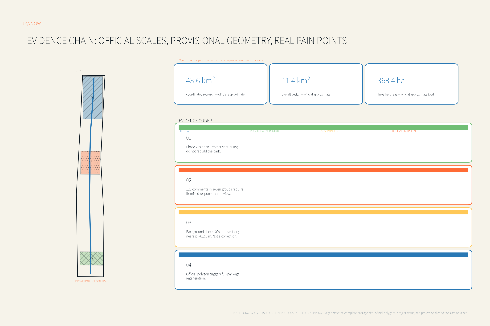
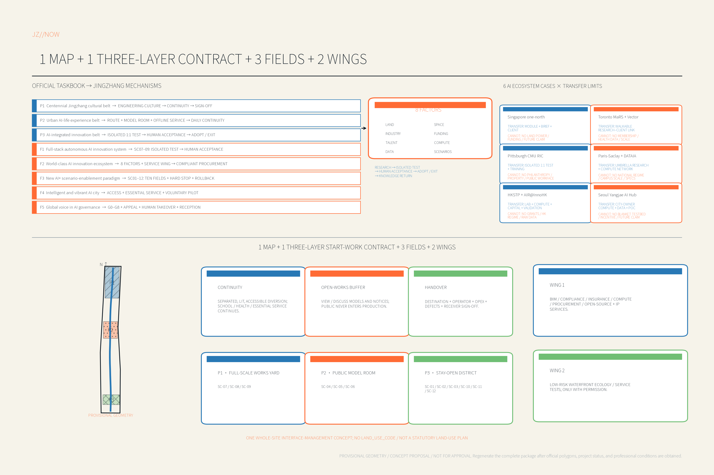
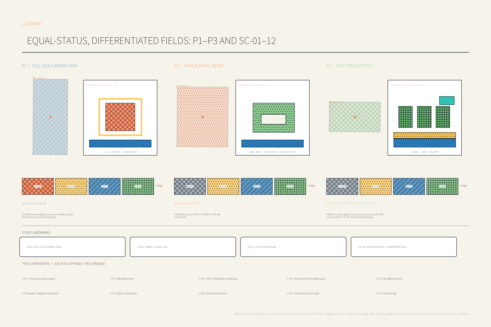
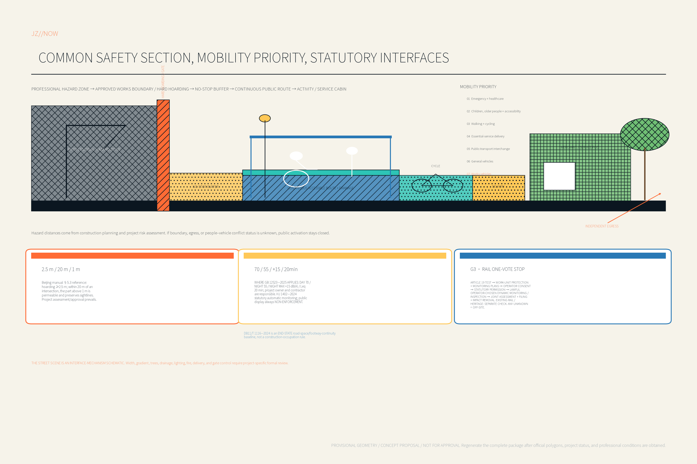
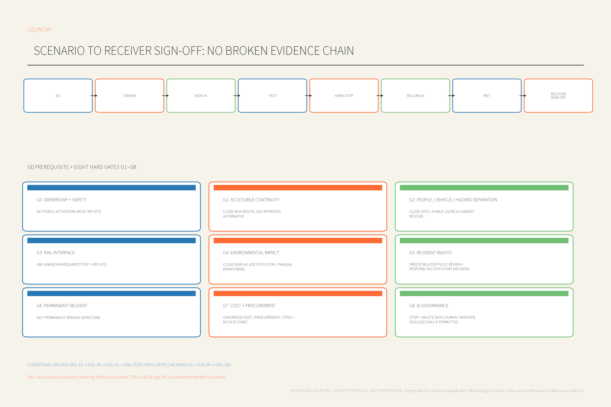

# JINGZHANG IN PROGRESS: Keep the City Open

> Core thesis: every temporary work must rehearse and leave at least one permanent public benefit.
>
> The design object is not an assumed end-state blueprint. It is the complete process from the arrival of hoarding and service relocation through active construction to acceptance and handover. OPEN WORKS PROGRAM is the operating sub-brand; it neither disguises an active worksite as a park nor allows the public onto the production face.

**Open means open to scrutiny, never open access to a work zone.** This proposal is a construction-time public-value operating system embedded within overall urban design. It does not replace overall urban design, statutory planning, a construction logistics plan, or any approval.

## Design Basis and Source List

The call defines three levels: coordination research, overall design, and three key areas, and asks the proposal to coordinate existing, under-construction, and proposed projects. [source:OFFICIAL-ANNOUNCEMENT] [source:AGENT-TASKBOOK]

Public material also shows that Jingzhang Railway Heritage Park serves extensive everyday community use, while Haidian continues work on rail capacity, waterfronts, and urban renewal. [source:park-phase-two-opening] [source:haidian-2026-government-work-report]

The real gap is therefore not another “future axis,” but a way to keep commuting, school trips, healthcare, trading, deliveries, and public services continuous through long periods of change, while AI is first validated, made accountable, and handed over in controlled settings. Whether a particular project has begun, and its red line and programme, must be verified by the responsible authority and project owner; this proposal makes no such inference. [source:lanjing-lijia-feedback] [depth:existing_conditions_diagnosis]

### Evidence anchors

| Anchor | Content and use | Status |
| --- | --- | --- |
| SRC-01 | Official call: three scope levels, three key areas, tasks, and output depth. [source:OFFICIAL-ANNOUNCEMENT] | Official public source |
| SRC-02 | Agent-facing taskbook: agent.1–agent.6, five functions, and open-source submission requirements. [source:AGENT-TASKBOOK] | Official repository task |
| SRC-03 | Site package, source registry, and fact-navigation layer. [source:SITE-PACKAGE] [source:SOURCE-REGISTRY] [source:PROCESSED-FACT-PACK] | Used only for its registered purpose |
| SRC-04 | Beijing Daily reporting on Jingzhang Railway Heritage Park: everyday community use and linear-public-space value. [source:park-phase-two-opening] | Credible public background, not a planning or engineering authority |
| SRC-05 | Haidian District Government Work Report: rail, parking, waterfront, and urban-renewal context. [source:haidian-2026-government-work-report] | Official public background |
| SRC-06 | Official notice on adoption of public comments for the Lanjinglijia planning implementation scheme: 120 comments and seven issue groups. [source:lanjing-lijia-feedback] | Official participation record; does not decide this proposal's parcel |
| SRC-07 | Haidian Urban Renewal Guide: participation, all-age inclusion, low-cost innovation space, and lifecycle provision. | Official public source; see References |
| SRC-08 | Crossrail, HS2, NEST, New York temporary walkways, London meanwhile use, Melbourne hoardings, and HafenCity. | Method references; their regulatory values are not transplanted |
| SRC-09 | Layered Beijing references: Landscaping Construction Work Safety Manual §5.3 and road-space planning standard DB11/T 1116—2024. | Use only within each source's scope; project-specific assessment, conditions, and approval prevail |
| SRC-10 | Construction-noise standard GB 12523—2025, effective 1 January 2026 and replacing the 2011 edition. | Apply the legally applicable limits and responsibility process |
| ASM-01 | SITE-001 and PROV-KEY-001–003 are provisional geometry constraints, not official boundaries. [source:BOUNDARY-SOURCE] [source:KEY-AREA-SOURCE] | Replace when official polygons arrive |
| ASM-02 | Statutory controls, ownership, utilities, heritage, fire, construction logistics, and project status remain incomplete. [assumption:A-CONTROLS-001] | Verify before project initiation |
| ASM-03 | Areas, quantities, and interfaces for the three pilots are conceptual envelopes. | Lock only after consent and professional review |
| MET-01 | Continuity metric group: routes, accessibility, essential services, and trading access. | Baseline to be surveyed |
| MET-02 | AI test metric group: emergency stop, lost link, defect detection, and human sign-off. | Test protocol to be agreed |
| MET-03 | Governance and handover metric group: notice, complaints, commitments, defects period, and reuse. | Responsibility agreement to be made |
| SC-01–12 | The twelve scenario cards in Section 6. | Every card includes a non-AI path and rollback |

Every judgment is classified as one of four types: official fact, verifiable public context, unverified assumption, or design proposal. Precise locations in figures express submission-generation logic only; news dates, adjacent-project status, and provisional layers are never recast as government commitments.

### Geometry discipline

SITE-001 in geometry/site_boundary.geojson and PROV-KEY-001, 002, and 003 in geometry/key_areas.geojson must be read as official_boundary=false and geometry_role=provisional_constraint. [data:geometry/site_boundary.geojson#SITE-001] [data:geometry/key_areas.geojson#PROV-KEY-001] No temporary path, hoarding line, vehicle gate, test cell, or substitute public-service point may be positioned until official project red lines, construction logistics, buried utilities, fire and egress, rail protection, heritage, and road conditions are obtained. When official polygons are issued, land use, buildings, roads, green space, public space, phasing, metrics, and all five figures must be recalculated as a whole; the response is not simply to shift one boundary.

## Three-Level Scope Framework

| Level | Scale in the call | JINGZHANG IN PROGRESS response | Core outputs |
| --- | --- | --- | --- |
| Coordination research scope | About 43.6 km² | Build an AI-industry and governance capability through which city-making itself can be tested in public, connecting universities, firms, construction supply chains, and communities | Open-works standard, case library, training, and procurement framework |
| Overall design scope | About 11.4 km² | Use the park as a continuity control line and a dynamic works atlas to coordinate access, services, environmental impact, and timing across projects | 7/30/90-day impact calendar, substitute network, cumulative-impact review |
| Three key areas | About 368.4 ha in total | Use three different fields to validate construction, co-design, and uninterrupted services | Full-Scale Works Yard, Public Model Room, Stay-Open District |

The three scales do not substitute for one another. The coordination level creates industry and governance standards; the overall level turns standards into cross-project interfaces; the key areas validate them through small but real pilots. Scale figures come from the call, while precise boundaries remain subject to ASM-01. [standard:PROJECT-OFFICIAL-ANNOUNCEMENT] [depth:three_level_scope_framework]

### One atlas, one start-of-work contract, three fields, and two supporting wings

The “one atlas” is a dynamic works atlas updated with accountable sign-off. The “one contract” is the three-layer start-of-work contract submitted by every participating project before construction. The “three fields” are differentiated validation settings in the key areas. The “two wings” are the Zhongguancun technical-service wing and the Xiaoyue River scenario wing. Jingzhang Railway Heritage Park is the continuity control line to be protected, not a newly invented conceptual axis.

| Three-layer start-of-work contract | What must be delivered first | Operating boundary | Handover test |
| --- | --- | --- | --- |
| Continuous Access Layer | Independently segregated, continuously lit, accessible substitute route with independent egress; substitute plans for schools, healthcare, and essential services | Hard separation from construction traffic and workfaces; paper, telephone, and in-person paths remain available | Original route restored, or permanent route passes accessibility and safety verification |
| Open-Works Buffer Layer | A buffer for viewing and discussing models, mock-ups, and notices | The public never enters the production zone; display systems do not replace statutory monitoring or safety management | Temporary facility removed, repurposed, or accepted into the shared component depot |
| Permanent Handover Layer | Permanent destination, operator, funding, defects period, and evidence pack for every temporary input | A “public benefit” without an identified recipient is not counted as a commitment | Site walk, defects closed, recipient sign-off, and public status |

A serious incident, broken accessible chain, blocked emergency route, or failed robot emergency stop triggers immediate suspension and restoration of the previous safe service state. Communications events and public viewing never justify bypassing safety review.

### Common safety section that may never be reversed

Every public scenario stays on a cleared public side and follows one order: `specialist hazard zone → approved site boundary / hard hoarding → independent no-stopping buffer → continuous public passage → activity / service pod`. The construction-logistics plan, specialist risk assessment, and approvals determine every real hazard distance and no-stopping-buffer dimension; the concept drawing prescribes no safety distance. No seats, queues, displays, or sales enter the no-stopping buffer. Passage clear width, gradient, crossfall, turning, tactile cues, lighting, drainage, and egress are checked point by point against the applicable road class, accessibility, and fire conditions. If the work boundary, hazards, hoarding, egress, or person–vehicle conflict state is unknown, public activation fails closed and only an approved non-digital diversion remains. [standard:MOHURD-ARCH-DESIGN-DEPTH-2016]

During hazardous testing, observation switches to off-site video or is cancelled. A canopy, window, or digital warning cannot turn lifting, falling-object, collapse, excavation, vehicle-swept-path, temporary-power, or rail-protection hazards into public space. General building and municipal works, and P1 where applicable to its real work type, follow GB 55034—2022 and other national construction-safety controls plus equipment-specific standards; the landscaping manual is only a supplementary reference within its scope. AI cannot open a route, move hoarding, release a vehicle, or approve public entry. [source:gb-55034-2022]

## Industry and Future-City Research at the Coordination Scope

### Brand and strategic positioning

The Chinese name, rendered here as “Jingzhang In Progress,” frames renewal as a process that can be seen, tested, and corrected. “JINGZHANG IN PROGRESS” avoids presenting incomplete conditions as accomplished results. The operating sub-brand “OPEN WORKS PROGRAM” names the reusable start-of-work contract. The proposed mark uses three separable but interlocking bands: railway blue for continuous access, safety orange for controlled testing, and public green for permanent benefit. The mark communicates a method and never implies official certification.

The proposal does not invent a replacement positioning system. It converts the taskbook's three positions and five functions into auditable spatial and operating mechanisms:

| Taskbook control | “Jingzhang In Progress” mechanism |
| --- | --- |
| Centennial Jingzhang Cultural Belt | Use the verifiable engineering culture of survey–build–handover to organize park continuity, public understanding, and permanent acceptance—not retro-themed decoration |
| Urban AI Life Experience Belt | Let AI first serve commuting, healthcare, trading, and the right to know through continuous routes, the Public Model Room, offline-equivalent service, and the Stay-Open District |
| AI Fusion Innovation Belt | Connect research, construction, operation, and community through segregated 1:1 validation, professional sign-off, limited procurement/deployment, and failure knowledge return |
| Full-stack autonomous AI innovation system | Zhongzhiyuan hosts SC-07–09, forming a laboratory–isolated validation–human acceptance chain from E-stop and link loss to component inspection |
| World-class AI innovation ecosystem | The eight-factor system and Zhongguancun Services Wing provide space, compliance, insurance, compute, procurement, talent, and open-source/IP interfaces |
| AI+ scenario-empowerment paradigm | SC-01–12 each binds a real spatial carrier to a no-AI baseline, human owner, stop condition, rollback, and deletable data |
| Intelligent and vibrant AI city | The Origin Public Model Room, Dazhongsi Stay-Open District, and Xiaoyue River Scenario Wing prioritize accessibility, essential services, and voluntary commercial trials |
| Global discourse power in AI governance | G0–G8, a de-identified Failure Archive published only where law, contract, and the incident-response protocol allow, appeal, human takeover, and permanent-handover evidence form a reviewable governance language |

Within that taskbook framework, the proposal contributes three implementation values: a nationally transferable construction-time urbanism demonstrator, a 1:1 embodied-AI construction validation gateway, and a resident/business continuity benchmark. Five operating modules—continuity, full-scale validation, public co-design, temporary economy/essential services, and permanent handover—deliver the eight controls; they do not replace the taskbook's three positions and five functions. [source:AGENT-TASKBOOK] [depth:overall_spatial_structure]

### Industry ecosystem: from demonstration procurement to evidence procurement

An open-works standard can create a new value chain. Universities and laboratories contribute algorithms, robotics, and materials research. Contractors and suppliers provide testable components and methods. Safety, insurance, legal, BIM, accessibility, and third-party testing become professional services. Residents, merchants, and frontline workers jointly define failure conditions. Project owners decide adoption from evidence packs rather than demonstration effect. The Zhongguancun technical-service wing supports BIM, compliance, insurance, compute, procurement, and start-ups. The Xiaoyue River scenario wing supports low-risk validation of waterfront interfaces, ecological monitoring, and public services, but the specific carriers for both wings require confirmation.

The Xiaoyue River scenario wing initially carries only a low-risk, exitable public-experience path: `existing authorized entrance → paper 7/30/90-day change board → interpretation point using lawfully public or authorized ecological/water data → human service contact and exit`. It primarily uses SC-04 and SC-05; SC-11 applies only with authorization from the formal operator. Until water, ecology, waterfront ownership, and facility permissions are obtained, no equipment is installed on the bank; the path is demonstrated only in the P2 Public Model Room.

Eight factors form a closed loop rather than an investment-promotion list. Land supplies only cleared temporary interfaces and assumes no land adjustment. Space provides segregated test cells, the Public Model Room, and a stay-open frontage. Industry advances through `laboratory → segregated 1:1 validation → professional acceptance → limited procurement/deployment → knowledge return`. Funding separates site mitigation, shared facilities, and independent assessment. Talent includes researchers, engineers, workers, operators, and resident reviewers. Compute supports simulation and de-identified inference only. Data follows minimisation, versioning, and deletion rules. Scenarios use G0–G8 to continue, modify, or exit. AI Origin additionally proposes open-source/IP boundaries, translation support, and short stays for international teams, without presuming named firms, subsidies, or recruitment commitments.

Six AI-innovation ecosystems answer agent.2 separately from the construction-delivery precedents that follow. Only mechanisms are transferred; operating conditions, announced future projects, and historical funding are kept distinct:

| AI ecosystem | Eight-element evidence summary | Transfer to Jingzhang | Do not transplant |
| --- | --- | --- | --- |
| Singapore one-north + AI Singapore + Kampong AI [source:singapore-one-north-ai-singapore] | JTC land and modular space; AI industries; challenge co-funding; apprenticeship/doctoral talent; platform engineering; company-authorized data; roughly six-month MVP scenarios. Kampong AI is an announced renewal plan, not a mature outcome | A conversion unit combining modular space, a real company problem, an engineering team, and a validation client | Land powers, funding values/ratios, and the future state of an incomplete plan |
| Toronto MaRS + Vector Institute [source:toronto-mars-vector] | Downtown mixed innovation building; AI with health/finance/transport/climate; public and industry support; research/master's/intern talent; institutional compute; controlled sector data; enterprise-adoption scenarios | Compress research institute, clients, investment, and talent into a walkable urban setting | Membership system, health-data permissions, organizational scale; co-location does not equal data sharing |
| Pittsburgh Hazelwood Green + CMU RIC [source:pittsburgh-cmu-ric] | Brownfield regeneration; high-bay and indoor/outdoor 1:1 tests; robotics and advanced manufacturing; foundation/state support; university, corporate, and community talent; physical R&D infrastructure; project data; assembly/inspection scenarios | Brownfield renewal + segregated physical tests + company co-location + worker training directly supports P1 | US philanthropy, university property/contracts; controlled tests never imply public workface access |
| Paris-Saclay + DATAIA [source:paris-saclay-dataia] | Distributed science city; laboratory/transfer/incubator network; national and university research mechanisms; doctoral and continuing education; shared CPU/GPU; secure authorized exchange; health/transport/energy/urbanization scenarios | An umbrella body connecting distributed universities, compute, talent, industry questions, and transfer | National research regime, very large campus scale, and existing compute specifications |
| HKSTP + AIR@InnoHK [source:hkstp-innohk] | Science-park/advanced-manufacturing space; AI and robotics; historical public investment plus incubation capital; international research talent; commercial HPC; subscription/authorized data; manufacturing, healthcare, and logistics validation | International labs + compute + incubation capital + manufacturing/hospital-adjacent validation | Historical allocations and Hong Kong land/research regime; cross-sector access is not open raw data |
| Seoul Yangjae AI Hub [source:seoul-yangjae-ai-hub] | Operating municipal startup space; AI/robotics; R&D and PoC support; training; company GPU; governed urban data; transport/care/safety scenarios. The Physical AI Belt is a future plan | A city owner links compute, governed data, PoC, and regulatory feedback into an adoption chain | A blanket citywide testbed, tax/FAR incentives, future investment, or opening parks without authorization |

The shared pattern is not “AI firms plus a showroom.” Land/space carriers, industry problems, risk-sharing finance, continuous talent, usable compute, separately authorized data, and real scenarios form a research–validation–adoption loop. Compute access never implies data access.

Regional collaboration uses capability interfaces rather than project promises. Jingzhang contributes the Open-Works Protocol, Failure Archive, and component interfaces. Beiwei Community, Future Science City, Huairou Science City, Beijing E-Town, and Jing-Jin-Ji supply chains enter only individually authorized records structured as `problem → test capability → adopting party → knowledge return`. No unregistered relationship is presented as a project, budget, data-sharing arrangement, or spatial commitment.

The developer and enterprise conversion funnel is `open call → safety training → segregated validation → Public Model review → limited pilot → compliant procurement choice or exit → de-identified knowledge return within the permitted scope`. Every step has a human owner and exit path. Failed trials enter the Failure Archive; failure information is de-identified and used only where law, contract, and the incident-response protocol allow. Publicity never substitutes for adoption evidence.

| Construction-delivery precedent | Transferable mechanism | Not directly transplanted |
| --- | --- | --- |
| Crossrail community and environmental management | Community plans by contract package, responsibility interfaces, pre-construction commitments | Its contract structure and UK thresholds |
| Independent HS2 Construction Commissioner | An independent complaint and accountability role | UK statutory authority |
| New York building-code temporary walkways | The principle of protected, lit, accessible continuity | New York dimensions and approval clauses |
| Empa NEST | 1:1, replaceable tests before human occupation | Admission conditions of an experimental facility |
| London Meanwhile Use | Short-cycle operation of vacant and temporary space | Local lease and taxation rules |
| Melbourne Creative Hoardings | Hoarding as a curated urban interface with an accountable owner | Its visual-permit regime |
| HafenCity | Rolling phases, stable overall goals, continued project calibration | Land regime and development parameters |

A spring “1:1 Build Challenge,” summer “Stay-Open Walk Audit,” autumn “Public Handover Week,” and winter “Failure Archive Update” are annual operating proposals. They remain subordinate to real project programmes and safety conditions and are not presented as confirmed government events. [source:SOURCE-REGISTRY]

## Overall-Scope Urban Renewal and Regulatory-Plan-Depth Urban Design

### Park continuity control line and dynamic works atlas

The overall structure is not a new statutory axis. It organizes existing public space, rail stations, community entrances, schools and healthcare, merchant frontages, and construction projects as a continuity network. For every verified project, the dynamic works atlas records ownership and accountable owner; red line and hoarding; 7/30/90-day effects; walking, cycling, and accessible substitutes; construction-vehicle gates; interfaces to statutory noise and dust monitoring; water and power interruptions; school and healthcare windows; merchant service windows; complaint channel; handover commitments; and evidence status. An unverified project is shown as “to verify,” never as active construction on the public map.

The project owner signs the project status. A proposed In-Progress secretariat function maintains the cross-project view and may be assigned to an existing organizer, delivery body, or project-coordination mechanism. The proposal assumes neither a new government office nor approval or enforcement powers. Algorithms may flag conflicts but cannot approve road occupation, service shutdown, or construction-logistics changes. If adjacent projects affect the same necessary route, school or hospital, or community service in the same week, competent accountable parties review staggering, shorter effects, and redundancy and, where their contract or statutory power allows, adjust the activity. [assumption:A-CONTROLS-001] [depth:overall_spatial_structure]

### Five spatial interfaces

| Interface | Spatial action | Regulatory and engineering coordination |
| --- | --- | --- |
| U1 Continuity Corridor | Maintain one legible, protected, lit, accessible substitute route | Test against official road red lines, fire egress, and rail-protection conditions |
| U2 Safe Gate | Separate people and vehicles; provide waiting space, turning visibility, and a human marshal position | Integrate into the construction traffic plan; AI never releases vehicles alone |
| U3 Service Pod | A carrier authorized by the relevant department/formal operator for service navigation, booking/referral, pickup/delivery, substitute toilet, or merchant continuity; it makes no diagnosis, eligibility, approval, or compensation decision | Define authorization, land permission, utilities, operation, privacy, and removal responsibility |
| U4 Open Buffer | Model, mock-up, notice, observation window, and worker-rest interface | Hard-separate it from works and meet fire and crowd-control requirements |
| U5 Handover Component | Reusable paving, planters, seats, canopy, and data interfaces | Pre-assign a permanent position or a recipient in the shared component depot |

No false-precision land-use designation, height, floor-area ratio, setback, parking value, or utility capacity is supplied before the source data is complete. The overall design determines only interfaces, priorities, and evidence processes that official statutory and engineering conditions must validate. [data:geometry/land_use.geojson#LU-001] [data:geometry/constraints.geojson] [depth:development_intensity_controls]

### Fail-closed rail interface chain

Every suggestion near Dazhongsi, Line 13, an urban-rail station entrance, undercroft, or track first determines the rail type and whether it enters a lawfully announced rail-transit safety protection area. Only for an Article 19 operation inside that area, the works entity first prepares safety-protection and monitoring plans, obtains the operator's consent, and then completes the required administrative permission. During the operation, the operator may lawfully undertake dynamic monitoring and site inspection. On completion, the works entity jointly assesses the effect on operating safety with the operator, files the result with the municipal transport authority, and removes any effect identified. Existing railway assets or heritage lines require separate checks under their ownership and applicable rules; the urban-rail process is not applied by analogy. If an applicability condition or mandatory step is unknown, the site proposal automatically becomes an off-site full-scale rehearsal. It makes no bridge, tunnel, or underground feasibility claim and changes no station or railway asset. Competent parties execute the chain; AI only identifies missing evidence. [source:beijing-rail-safety-regulation] [depth:traffic_rail_slow_parking]

### 7/30/90-day change protocol

Every consented pilot publishes owner-verified known effects and uncertainties for the next seven days, foreseeable changes over 30 days, and key milestones over 90 days. The competent site owner communicates urgent changes immediately through the approved information-release procedure and retains a paper notice. A weekly Change Meeting asks only four questions: where is the next break, who is affected, does a non-AI substitute work, and which commitment enters permanent handover? Public statuses are limited to “proposed, pilot, passed, suspended, handed over.” A project cannot award itself the “City Stays Open Mark.”

## Detailed Design for the Three Key Areas

The three roles are design directions generated from the call and provisional key-area geometry. They are not official determinations of a parcel, existing building, or current construction status. [data:geometry/key_areas.geojson#PROV-KEY-001] [data:geometry/key_areas.geojson#PROV-KEY-002] [data:geometry/key_areas.geojson#PROV-KEY-003]

At this open-call concept stage, the three fields organize the interfaces, spatial prototypes, and evidence gates needed for later professional development. They do not claim regulatory implementation-plan or engineering detailed-design depth; professional teams must develop them after official boundaries, measured existing conditions, ownership, statutory controls, and specialist conditions arrive. [depth:three_key_area_detailed_design]

| Key area | Differentiated role | Spatial components | Everyday operation | Permanent benefit |
| --- | --- | --- | --- | --- |
| Zhongzhiyuan AI Independent-Innovation Accelerator | Full-Scale Works Yard | Controlled test grid, component depot, human-takeover station, observation buffer, worker training room | Robot emergency-stop tests, component quality, methods, and safety training | Validated methods, skills, and reusable components |
| Beijing AI Origin Community | Public Model Room | 1:200 physical model, accessible digital table, change wall, quiet consultation room, mobile mock-up table | Weekly Change Meeting comparing sunlight, noise, dust, traffic, and sequencing options | Traceable co-design decisions and an open model |
| Dazhongsi AI Industry Cluster | Stay-Open District | Continuous arcade-like protection, merchant service pods, delivery pockets, four-quadrant arrival cues | Trading access, essential-service substitutes, delivery and ride-hail coordination | Ground-floor frontages that keep trading and a legible arrival system |

The three fields have equal status and differentiated duties; they do not have equal areas or equal scenario loads. This table separates the primary validation field from cross-area applicability. Scenario IDs in the pilot table indicate first-round accountability, not an attempt to lock belt-wide scenarios into one district.

| Scenario | Primary validation field | Applicability |
| --- | --- | --- |
| SC-01–02 routes and essential services | P3 | P1, P2, P3, and every verified belt interface |
| SC-03 works gate | P3 | P1 and P3; P2 only where a real works gate exists |
| SC-04 impact calendar | P2 | Overall scope and every verified project |
| SC-05 environment and complaints | P2 | P2, P3, and every sensitive interface |
| SC-06 public model | P2 | P2 home field; mobile model may support P1/P3 |
| SC-07–09 robots and components | P1 | P1 isolated cell only; other areas see de-identified results |
| SC-10 merchant continuity | P3 | P3 and later voluntary commercial interfaces |
| SC-11 essential-service substitute | P3 | All three areas and every interface authorized by a formal operator |
| SC-12 handover and return | P1, P2, P3 | Every completed interface |

### Three launch pilots

| Pilot | Conceptual envelope | First validation | Prerequisite and rollback |
| --- | --- | --- | --- |
| P1 Zhongzhiyuan controlled test cell | Approximately 20 × 20 m modular segregated cell | SC-07–09: emergency stop, lost link, component defect, and engineer sign-off | Confirm ownership, fire, equipment safety, and independent egress; on failure isolate energy, take over manually, and preserve evidence |
| P2 Origin Public Model Room | Prefer reuse of an accessible ground-floor space of approximately 80–150 m² | SC-04–06: impact calendar, public model change, and issue closure | Obtain site consent and provide an accessible digital alternative; if no site is available, run off-site review with a mobile model |
| P3 Dazhongsi stay-open interface | One verified accessible route and 3–5 voluntary merchants or service points | Combined SC-01–03 and SC-10–12 | Activate only at a future real works interface after merchant consent and traffic review; if timing is unverified, conduct an off-site full-scale rehearsal |

These sizes and quantities are ASM-03 conceptual envelopes, not planning controls or tender quantities.

### Four legible landmarks

1. Full-Scale Works Yard: keeps high-risk technology inside a controlled boundary; the public watches only from the buffer.
2. Public Change Hall: a continuously updated model table shows who proposed, who holds decision authority, the current status, and the reasons.
3. Stay-Open Arcade: hoarding, protection, lighting, service pods, and merchant entrances form one street interface.
4. Handover Gate and Promise Wall: shows only permanent benefits signed by a recipient; incomplete items show their owner and due date.

The landmarks are demountable, repairable, reusable public infrastructure. Expensive form never substitutes for everyday function.

Plans and sections for each landmark must show the public zone, prohibited zone, independent egress, operating procedure, and permanent recipient together. The Dazhongsi Stay-Open Arcade adds a Reversible AI Counter: inside a voluntary merchant-controlled pod, it can test multilingual product descriptions, stock/delivery assistance, and repair booking while retaining staffed checkout, cash, physical menus, and human pickup. The merchant can leave at any time and request deletion of pilot data; loss of connection, misleading output, or harm to trading returns the counter to manual mode. AI may not set discriminatory prices, build sensitive consumer profiles, or decide a transaction for the merchant. “Four quadrants” describes conditional arrival relationships only; it is not a feasibility claim for a bridge, tunnel, concourse, or underground link.

The component library contains ten separately acceptable and returnable items: continuous deck panel, adjustable ramp, tactile/large-text wayfinding, human-controlled safety gate, base-lighting pole, paper/telephone help desk, Public Model table, observation window, merchant/service pod, and handover tag. Honour status has only four states: trial, passed, paused/removed, and handed over. The Promise Wall records only recipient-signed items. The belt logo communicates the overall identity; construction-time wayfinding communicates safety and change states. Neither becomes an official certification mark.

## AI Innovation Ecosystem, Personas, and AI+ Scenarios

### Talent and user personas

| Persona | Critical needs | Decision right |
| --- | --- | --- |
| Wheelchair user and low-vision commuter | Continuous ramps, tactile and audio information, accessible diversion | Participates in representative route walk-throughs and may recommend no opening; the competent owner records, answers, and decides under applicable standards |
| Older resident | Short distance, rest points, offline notice, and human help | Participates in day and night walk-throughs |
| Parent and student | Safe school times, staggered construction traffic, clear safeguarding interface | Participates in the school-window agreement |
| Local merchant and service worker | Front-door access, loading, customer notice, and voluntary participation | Decides whether to join the trading pilot |
| Rider, courier, and ride-hail driver | Legible short stay, pickup/delivery, and connection without wrong-way movement | Co-defines delivery windows |
| Frontline construction worker | Safety, rest, training, and no algorithmic productivity surveillance | Has manual stop and anonymous reporting channels |
| Site safety lead | Clear boundaries, emergencies, and equipment status | Holds stop authority over work and public opening within statutory/contractual duties |
| Project owner and operator | Compliance, cost, responsibility, and long-term acceptance capacity | Holds final responsibility for its project |
| University researcher and start-up team | Testability, reproducibility, and explicit data boundaries | Operates only inside an approved protocol |
| International short-stay team and open-source maintainer | Multilingual arrival, accessible short-stay workspace, open-source/IP boundaries, quiet work, and daily-service navigation | May refuse data trials and leave; this creates no visa, housing, or subsidy promise |

Talent experience is not an isolated “office plus apartment” product but an auditable work–learn–socialise–live loop. Zhongzhiyuan supplies controlled R&D and worker training; AI Origin connects universities, the Public Model Room, and open-source collaboration; Dazhongsi supplies voluntary commerce, repair, and everyday encounter; the Heritage Park and Xiaoyue River support ad-free walking and rest; and the Zhongguancun service wing adds legal, insurance, transfer, and multilingual support. Short-stay carriers, childcare, lodging, and daily services enter the atlas only as verified existing provision and gaps; the proposal does not pre-draw new buildings or promise recruitment incentives.

### Twelve scenario cards

The table is a readable summary; the full ten-field cards are in [data:visual/assets/submission-model.json]. Before an implementation protocol is signed, accountable parties must verify and lock the no-AI baseline, precise AI role, minimum data, model metric, public-service metric, compliance metric, human sign-off, fail-safe state, retention/deletion period, and no-AI route. SC-07–09 may be judged only by a competent engineering professional or accountable site-safety lead; AI cannot accept engineering work.

| ID | Field, users, and physical carrier | Data and AI | Human owner and non-AI path | Test, stop, and rollback |
| --- | --- | --- | --- | --- |
| SC-01 | Belt-wide interfaces; wheelchair users, pedestrians, cyclists; segregated temporary route | Edge counts flag crowding; no face data | Site manager accountable; paper map, signs, and stewards always available | Day, night, and wheelchair walk-through; a break, flooding, or obstructed egress closes the new route and restores the old/backup route |
| SC-02 | School, eldercare, healthcare interfaces; children, older people, patients; service-priority route | Peak forecast only assists staffing | Public-service liaison; telephone and human booking | Rehearse each service window; if an essential service becomes inaccessible, the competent site owner follows the approved plan to pause the relevant activity or activate an approved equivalent substitute |
| SC-03 | Site vehicle gate; drivers, pedestrians, riders; separated gate and waiting pocket | Blind-spot alert assists a human marshal | Traffic marshal gives final release; flags and signals remain available | Simulate lost link and false alert; a high-potential near miss closes the gate pending review and reapproval by the competent owner under the applicable safety protocol |
| SC-04 | Overall scope; everyone; 7/30/90-day impact wall | Conflict detection flags overlapping effects | Project owner signs; paper notice and telephone mirror it | Verify facts weekly; unverified status is not published, and errors are corrected with an audit trail |
| SC-05 | Residential/school edge; residents and workers; monitor box and complaint desk | Anomaly trends warn but do not replace statutory monitoring | Environmental lead; manual inspection and hotline | Compare with statutory equipment; drift or loss marks the display unavailable and switches to statutory/manual monitoring, inspection, and accountable-party response |
| SC-06 | Origin Public Model Room; residents, designers, owner; 1:200 model and digital table | Compares sunlight, noise, dust, traffic, and sequence options | Facilitator records; the owner gives a reasoned response within its authority and records and refers matters outside that authority to the competent body; paper cards remain available | Traceability audit; missing data downgrades output to an assumption, never an approval input |
| SC-07 | Zhongzhiyuan test cell; workers, researchers; segregated robot cell | Embodied AI tests handling or assembly | An independent safety officer explicitly authorised by the test protocol or contract can physically isolate energy; a competent professional signs; the manual work plan remains the backup | Progress from no-load to dummy load to live load; boundary breach, abnormal force, or person intrusion isolates energy |
| SC-08 | Zhongzhiyuan test cell; equipment team; emergency-stop and lost-link rig | Monitors latency, location, and lost link | An independent safety officer explicitly authorised by the test protocol or contract leads; the site safety lead retains stop authority within statutory/contractual duties; mechanical lockout and manual evacuation remain available | Drill after every change; no load operation until emergency stop and lost-link protection pass |
| SC-09 | Component inspection bay; engineers, suppliers; traceable sample rack | Vision/sensing assists defect detection | A professional with the relevant qualification and responsibility signs; manual measurement is the reference | Blind-test false positive/negative rates; a high-risk miss stops the model, quarantines the batch, and restores full manual inspection |
| SC-10 | Dazhongsi interface; merchants, customers, riders; Reversible AI Counter, service pod, and pickup pocket | Merchant-selectable multilingual descriptions, stock/delivery assistance, and repair booking; no sensitive profiles or discriminatory pricing | Merchant controls the switch, may leave and request deletion; staffed checkout, telephone, cash, physical menu, and human pickup remain | Check access, trading, misleading output, and deletion daily; loss of connection, blocked fire access, or harm to trading returns to manual mode, removes/moves the pod, and stops the model |
| SC-11 | All three key areas; residents; formally authorized government/health-service navigation, booking or referral point, plus substitute toilets | Queue information only; no eligibility, diagnosis, or compensation decision | Relevant department/formal operator accountable; counter and telephone available | Authorization and service-equivalence walk-through; privacy, power, or accessibility failure returns service to the original/backup |
| SC-12 | Every completed interface; recipient, residents, contractor; Handover Gate, Promise Wall, component depot | Compiles evidence but never accepts work automatically | Owner and recipient sign; paper checklist on site | Review through the defects period; if incomplete, retain warranty and repair; temporary components return to the shared depot rather than becoming waste |

Every scenario follows minimum authority, minimum data, final human responsibility, and no-phone access. AI may not decide expropriation, relocation, compensation, enforcement, or public-service eligibility, and face, gait, or worker-efficiency scores may not substitute for safety management. SC IDs enter test records and MET IDs enter the performance ledger. [source:AGENT-TASKBOOK] [metric:key_area_count]

## Land Use, Building Capacity, and Retain/Renovate/Demolish Strategy

The proposal first establishes implementation units and decision rules. It does not fabricate parcel capacity in the absence of official controls, ownership, and structural surveys. [data:geometry/land_use.geojson#LU-001] [data:geometry/buildings.geojson#BLDG-001] [depth:land_use_layout]

Retain/renovate/demolish conclusions are made only after object-level evidence is available. [depth:retain_renovate_demolish]

| Strategy | Object and priority | Required evidence |
| --- | --- | --- |
| Retain | Prioritise essential services still in use, continuous ground floors, mature trees, adaptable buildings, designated heritage, and critical routes | Ownership, structure, fire, heritage, use, and operating surveys |
| Renovate | Vacant ground floors, hoarding edges, inefficient loading, adaptable roofs/courtyards; prefer light intervention | Structural safety, permission, utility capacity, accessibility, and lifecycle cost |
| Temporary insert | Service pods, observation buffers, model room, demountable components; write the permanent destination first | Temporary permission, power/drainage, insurance, operator, and removal/acceptance date |
| Demolish | Only an object lawfully confirmed unsafe, unable to meet an essential approved project condition, or explicitly removed by an approved plan | Statutory process, resident/merchant arrangements, material audit, and substitute service first |

The three key areas need different space supply. Zhongzhiyuan needs segregable large-span or outdoor test space and component circulation. Origin Community prioritizes accessible ground-floor reuse and campus–community interfaces. Dazhongsi prioritizes continuous small street units, delivery, and essential services. New floor area, FAR, height, and parking values are not set at this stage; official boundaries, statutory controls, structures, mobility, and utility capacities must establish them. [depth:height_massing_character] [depth:development_intensity_controls]

The site_area_sqm value in metrics.json is a low-confidence working calculation from the serialized provisional overall boundary in EPSG:4548, not an official area. building_footprint_area_sqm, floor_area_ratio, heights, and retain/renovate/demolish quantities remain unknown. [metric:site_area_sqm] [metric:building_footprint_area_sqm]

green_ratio and public_space_ratio describe only this concept geometry at low confidence and are not statutory ratios. The full package is recalculated when official polygons and cleared existing-condition layers arrive. [metric:green_ratio] [metric:public_space_ratio]

After official polygons and layers replace the provisional set, green-space and public-space ratios must be recalculated at the same time. [metric:green_ratio] [metric:public_space_ratio]

## Mobility, Rail, Utilities, and Public-Service Facilities

The fixed priority is emergency and healthcare; children, older people, and accessibility; walking and cycling; essential-service delivery; public-transport interchange; general traffic; then construction vehicles. Construction efficiency cannot reverse that order. Line 13 capacity expansion and Dazhongsi Station are public context requiring coordination; they do not establish a site-specific works extent or completion date. [source:haidian-2026-government-work-report] [depth:traffic_rail_slow_parking]

### Movement and rail interfaces

- Every break receives at least one independently segregated, legible, lit, accessible substitute route. Clear width, gradient, turning, and egress are verified against the applicable formal standards at siting.
- Construction gates avoid school and public-transport peaks. AI provides blind-spot support only; a human marshal gives final release.
- Cycling continuity, shared-cycle parking, delivery pockets, and ride-hail pickup/drop-off are mandatory construction-logistics review items.
- Rail interchange is reviewed as a complete chain of concourse, exits, bus, walking, cycling, and emergency movement. Any bridge or four-quadrant connection separately requires ownership, structure, fire, rail-protection, and transport assessment.

Beijing references are used at two different levels. Section 5.3 of the Beijing Landscaping Construction Work Safety Manual provides guidance for its applicable works: an enclosed site and hoarding at least 2.5 m high; within 20 m of a traffic intersection, the part above 1 m is visually permeable and does not obstruct sight distance. These figures are not generalized to every project. DB11/T 1116—2024 requires continuous footways on both sides of urban roads in road-space planning and gives road-class width requirements; this proposal uses it as an end-state and continuity design baseline, not as a construction-occupation rule. Temporary occupation, construction passage, and substitute routes are checked separately against the approved traffic plan, accessibility law and standards, specialist project assessment, and applicable approvals; stricter or different formal conditions prevail.

### Utility and public-service floors

The works atlas records interruption windows, redundancy, owners, and emergency contacts for water, power, gas, heat, communications, drainage, and waste. Essential services include ambulance arrival, school access, eldercare, an available toilet, basic retail/medicine pickup, waste collection, and accessible information; a site baseline survey and residents confirm the specific list. Every interruption plan starts with a non-AI substitute. Digital twins and sensors do not replace statutory surveys, inspection, or monitoring. [data:geometry/roads.geojson#ROAD-001] [depth:municipal_new_infrastructure]

Construction noise follows MEE GB 12523—2025. Where the standard applies, the daytime limit is 70 dB(A), the night limit is 55 dB(A), the maximum night level may not exceed the night limit by more than 15 dB(A), and the equivalent level uses a 20-minute measurement; automatic monitoring follows HJ 1402—2024. The project owner and contractor carry the responsibilities assigned by the standard. GB 12523—2025 took effect on 1 January 2026 and replaced the 2011 edition. Public sensor displays support understanding and anomaly prompts only; they do not replace statutory monitoring, enforcement, or assignment of liability. [source:gb-12523-2025] [source:hj-1402-2024]

## Blue-Green Space, Public Realm, and Urban Character

Jingzhang Railway Heritage Park is first a public space in everyday resident use and a continuous cross-district interface. During construction, the objective is to protect continuity, trees, and stormwater function, not turn it into an equipment display strip. Waterfront interfaces such as Xiaoyue River host only low-risk monitoring or service tests after ecological, water, and project conditions are obtained. [source:park-phase-two-opening] [source:SITE-PACKAGE] [depth:blue_green_public_space]

### Three public interfaces

1. Continuity interface: shade and rain protection, night lighting, sitting and leaning, tactile and large-print information, and accessible diversion; a QR code alone is never sufficient.
2. Learning interface: observation window, material mock-up, 1:200 model, and failure archive, hard-separated from the works.
3. Handover interface: temporary planters, permeable paving, seating, canopy, and wayfinding are pre-matched to a permanent position or the shared component depot.

Urban character follows “temporary use at permanent quality.” Hoarding, service pods, and signs use repairable standard modules. Railway blue, safety orange, and public green identify continuous, controlled, and handed-over states. 7/30/90-day information is bilingual, graphic and textual, with tactile/audio and in-person interpretation. Night lighting provides safety and legibility only, avoiding additional disturbance to homes, ecology, and workers.

Blue-green measures follow protect, reduce disturbance, then restore: survey trees and drainage before work; manage root zones, runoff, dust, and material storage during work; verify soil, planting, drainage, and access at handover. P1–P3 each direct at least one component to permanent use or the shared depot, but only recipient sign-off counts it as public benefit. [data:geometry/green_space.geojson#GREEN-001] [data:geometry/public_space.geojson#PUBLIC-001]

### Three-layer cultural narrative and two-level visual system

Culture does not mean adding another symbol set; it begins with a resource–action–rights ledger. At this stage only items verifiable in public reporting are background. Heritage status, exact position, structural condition, and display rights all await confirmation by the park operator, rail asset owner, and heritage professionals:

| Verifiable public resource | Spatial translation in this proposal | Required verification before development |
| --- | --- | --- |
| About 2.4 km of restored old rail in the southern section; the steam-locomotive display and green carriage at Sidaokou; the Xiaozuta rail-welding-works gantry crane [source:park-phase-two-opening] | Use gauge–component–acceptance to structure 1:1 engineering learning; do not move an artefact | Asset list, location, ownership, designation, load, and public safety |
| Jingzhang Ring, railway-donated historic tanker, switches, waiting benches, and historical panels [source:park-phase-two-opening] | Place existing interpretation beside 7/30/90-day works knowledge; fabricate no fake antique | Donation/operation boundary, image/text rights, and maintenance owner |
| Reported science markets, cultural pop-ups, and school/university field learning [source:park-phase-two-opening] | Propose failure-archive, handover walk-through, and construction-method interpretation programmes; do not claim a confirmed event | Actual annual programme, capacity, noise, fire, insurance, and host approval |
| About 9 km of everyday commuting, recreation, and community connection [source:park-phase-two-opening] | Express culture first as public space that remains walkable, readable, and usable | Existing flows, accessibility breaks, trees/drainage, event conflict, and hours |

The first layer uses only verifiable Jingzhang engineering culture: survey, setting-out, construction, testing, and handover, making the process of building infrastructure public knowledge again. The second carries Zhongguancun's culture of verification, trial, and openness. The third defines AI culture as explainable, human-takeover-ready, permitting de-identified failure disclosure only under G8 conditions, and grounded in human dignity. The spatial storyline is “survey–build–handover,” not a retro railway theme park. The overall logo serves international communication for the belt. Construction-time wayfinding uses 7/30/90-day windows, trial/paused/handed-over states, and safety colours only on site; it does not impersonate the overall brand or government certification. Historical images, fonts, company marks, and archival material require itemised rights registration. This package uses only self-drawn graphics, open fonts, and traceable public sources. [source:park-phase-two-opening] [depth:height_massing_character]

## Renewal Project List, Implementation Policy, and Phasing

### First project packages

| Package | Main deliverable | Responsibility | Dependency |
| --- | --- | --- | --- |
| W1 Dynamic Works Atlas | Verified project list, impact calendar, cumulative-impact map, public status page | Proposed secretariat assigned to an existing coordination mechanism | Owner authorization and update responsibility for each project |
| W2 Continuity Component Library | Barriers, ramps, lighting, signs, service pods, inspection checklists | Component-depot operator | Permission, storage, maintenance, and insurance |
| W3 Zhongzhiyuan Test Cell | P1 and SC-07–09 evidence pack | Project owner and site safety lead | Ownership, equipment, and professional engineering review |
| W4 Origin Public Model Room | P2 and weekly Change Meeting | Site operator and public facilitator | Accessible ground floor, model data, and community participation |
| W5 Dazhongsi Stay-Open Interface | P3 and combined SC-01–03 and SC-10–12 | Project owner, merchants/service providers | Real programme, transport review, and voluntary agreements |
| W6 Independent Review and Handover | Safety/accessibility audit, failure archive, defects period, and shared depot | Independent reviewer and recipient | Funding, insurance, warranty, and public mechanism |

### Conditional post-selection 100-day validation window after G0

The window starts only if the proposal is selected for development, a real interface passes G0, and every necessary consent is obtained. It is not a construction commitment within this open-call design period and does not imply that any of the three key areas currently has a worksite.

| Time | Action | Gate output |
| --- | --- | --- |
| Days 1–15 | Verify projects, ownership, programme, red lines, and accountable people; establish the continuity baseline; select only one real and consenting interface | Compile G0 evidence; without a pass, no site activation |
| Days 16–30 | Day/night/wheelchair/delivery walk-throughs; agree minimum service, risks, and rollback with schools, healthcare, residents, merchants, and workers | Lock G1, G2, and essential-service floors |
| Days 31–55 | Fabricate components off-site; tune AI with synthetic/de-identified data; complete fire, safety, transport, and accessibility pre-review; verify the selected branch's quantities, funding, procurement, and OPEX owner | Complete G3–G5, G7, and G8 for the selected branch before any public/site activation; incomplete rail conditions remain off-site, and the public is not the first test subject |
| Days 56–75 | Only after all preceding gates pass, start the one branch selected at G0: the P1 controlled test bay, P2 Public Model Room, or P3 low-risk route/merchant prototype; provide paper, telephone, and in-person feedback | One G0 dossier cannot launch all three areas in parallel; inspect daily, and a hard failure closes that branch's public layer and starts the approved substitute |
| Days 76–90 | Run the single selected branch continuously for at least two weeks; obtain third-party safety and accessibility audits; update cost, complaint, and failure records with observed performance | Update rather than first assess G5 and G7; a material budget, procurement, rights, or safety deviation pauses the branch; attendance is not performance |
| Days 91–100 | Where law, contract, and the incident-response protocol allow, publish de-identified before/during/handover evidence, cost fields, defect summaries, and acceptance clauses for that branch; the competent accountable party decides whether to continue, modify, or stop | Only G6-passed items may move to the next branch or scale; failures enter the internal Failure Archive, and a de-identified summary is published only when the G8 conditions are met |

This is a conditional window that starts only after selection and a G0 pass, not an open-call-stage programme or approved construction plan. [data:geometry/phasing.geojson#PHASE-001] [depth:renewal_project_list] [depth:phasing_implementation]

### G0–G8 hard gates

| Gate | Evidence required to pass | Fail-safe state |
| --- | --- | --- |
| G0 Rights and safety | Owner, work boundary, phase plan, hazards, utilities, service interruptions, heritage/landscape/water conditions, emergency-vehicle access, fire/transport/accessibility, rail-protection determination, and applicable controls including GB 55034—2022; a competent professional signs any N/A. [source:gb-55034-2022] | No public activation; rehearse off site |
| G1 Accessible continuity | Interfaces to Articles 27–28 of the Barrier-Free Environment Construction Law and GB 55019—2021; clear width, gradient/crossfall, turning/rest, tactile cues, lighting, drainage, hoarding, egress; representative day/night/after-rain walks. [source:barrier-free-environment-law] [source:gb-55019-2021] | Close the new route and start the approved substitute |
| G2 People, vehicles, hazards | Zero public entries into the work boundary; human marshal, visibility, communication, and gate-closing drill | Close vehicle gate or public layer; AI has no release authority |
| G3 Rail interface | First determine whether an Article 19 operation inside a lawfully announced protection area applies. If so, the works entity prepares safety-protection and monitoring plans, obtains operator consent, and completes statutory permission; it enables any dynamic monitoring/site inspection lawfully chosen by the operator; after completion it jointly assesses, files, and removes identified effects. [source:beijing-rail-safety-regulation] | If an applicability condition or mandatory step is unknown, station/undercroft/trackside proposals remain off-site rehearsals |
| G4 Environmental impact | Applicable statutory interface including GB 12523—2025, calibration, accountable party, dust/night/complaint process; the public dashboard is always marked “not an enforcement finding.” [source:gb-12523-2025] [source:hj-1402-2024] | Close any uncalibrated display and revert to statutory/human monitoring and response |
| G5 Resident rights | For the seven official groups—planning scope; building height and sunlight; land-use scheme; supporting facilities; environmental effects; display location and period; road traffic—record impact–evidence–mitigation–owner–acceptance–appeal; display is not consent. [source:lanjing-lijia-feedback] | Freeze the related pilot or proposal change within this protocol and complete professional review and response; this does not replace a statutory decision |
| G6 Permanent handover | Recipient, acceptance, defect liability, OPEX, asset register, removal/return plan | Do not call it permanent; remove or return it |
| G7 Cost and procurement | Before procurement or site/public activation, establish the selected branch's quantities, funding source, compliant procurement, and OPEX owner. [source:government-investment-regulation] | S/M/L remains an entry screen only; no procurement and no site entry |
| G8 AI governance | No face/gait/worker ranking/personalised compensation; shortest retention; paper, phone, human paths | Stop and delete data, take over manually; publish a de-identified incident summary only where law, contract, and the incident-response protocol allow |

### RACI and stop authority

| Work package | A: accountable | R: responsible | C: consulted/review | I: informed |
| --- | --- | --- | --- | --- |
| Continuous Access Layer | Specific project owner | Contractor site manager | Transport, fire, accessibility, community representatives | Public |
| Open-Works Buffer | Specific project owner | Site operator | Safety officer, worker representative, curation/community | Public |
| 1:1 test cell | Pilot owner | Equipment team and site manager | Independent safety officer, engineer, insurer | Observers |
| Public model and change | Project owner; proposed secretariat curates the cross-project standard | Model-room facilitator and BIM team | Residents, merchants, design team, authorities | Public |
| Merchant/essential-service continuity | The project owner is accountable for the works interface; the formal service operator is accountable for service equivalence | Site service manager | Voluntary merchants, school, healthcare, delivery representatives | Users |
| Data and AI governance | Data controller/project owner | Data steward and model owner | Legal, cybersecurity, ethics, worker/community representatives | Data subjects |
| Complaint and mediation | Project owner; proposed secretariat routes cross-project escalation | Community liaison | Independent mediator/reviewer | Complainant and public |
| Handover and defects | Project owner | Contractor and receiving operator | Resident representative, auditor, asset/maintenance team | Public |

RACI does not replace statutory approval powers. An independent safety officer explicitly authorized by the test protocol or contract has immediate stop authority over the test cell and open events. The site safety lead retains statutory and contractual authority over the construction zone at all times.

### Funding and OPEX

Site-specific routes, hoarding, mitigation, and handover are proposed for each project's temporary-works and mitigation costs. Shared pilot funding supports only the model room, component-depot start-up, and independent evaluation. Corporate sponsorship is confined to controlled testing and cannot buy certification, approval, or exclusive public-space rights. Subject to legal and procurement review, retention or performance mechanisms may link part of payment to public-handover evidence; this is a policy proposal, not current policy.

Annual accounts must state continuing OPEX for project-coordination/secretariat staff, model-room operation, component storage and repair, insurance and security, statutory monitoring, data upkeep, independent audits, and defect repairs. Before procurement, every asset has one of four destinations: project-funded, cross-project shared, operating revenue, or exit. A component without a recipient and funding does not enter the permanent promise.

S/M/L means three complexity screens—protocol/light module, linear or yard pilot, and multi-agency station interface—not an investment estimate. At G7 every action pack records quantities, one-off construction cost, annual OPEX, statutory monitoring, insurance/third-party review, removal/return cost, funding status, procurement route, and receiving organization. A government-investment project separately follows every applicable feasibility, preliminary-design, and approved-estimate procedure.

Annual events also pass gates. The 1:1 Build Challenge is owned by the test-yard operator, produces safety/quality evidence, and is cancelled if site permission or G2 fails. The Stay-Open Walk Audit is co-led by accessibility and community representatives and outputs a break register. Public Handover Week is owned by asset recipients and publishes accepted items only. The proposed secretariat returns the anonymized Failure Archive to open knowledge only where law, contract, and the incident-response protocol allow. Every event identifies its downstream owner before launch.

All four seasonal activities remain under OPEN WORKS PROGRAM and create no additional event logo: BUILD 1:1, WALK AUDIT, HANDOVER, and FAILURE REVIEW reuse the three safety-state colours. Only after an operator and OPEX are confirmed may a monthly protocol clinic and quarterly evidence review run; participants use versioned scenario cards to enter the `training → validation → limited pilot → procurement choice or exit` funnel. The international communication pack contains only a bilingual one-page case card, an open protocol or failure summary publishable under applicable law and agreement, a remote-review entry point, and an explicit status statement. It is not an investment-promotion, visa, or funding promise.

## Metrics, Area Recalculation, and Compliance Matrices

### Performance metrics

| Anchor/metric | Baseline | Pass standard | Evidence and hard stop |
| --- | --- | --- | --- |
| MET-01.1 Continuous-route hours | Survey on Days 16–30 | Match agreed necessary travel hours; zero unannounced closure except emergencies | Logs, walk-throughs, closure record; accessible break stops operation |
| MET-01.2 Accessibility audit | Measure existing and substitute routes separately | Pass independent walk-through; exact parameters follow formal standards | Day/night wheelchair and low-vision test; no opening on failure |
| MET-01.3 Essential-service continuity | List baseline service by service | Every item has an available original or equivalent substitute | Service ledger; on failure, the competent site owner follows the approved plan to pause the affected activity or activate an approved equivalent substitute |
| MET-01.4 Trading/delivery accessible days | Voluntary participant registration | Merchant baselines jointly set the target; no fabricated percentage | Trading and access record; participant may exit at any time |
| MET-02.1 Robot emergency stop/lost link | First no-load equipment test | Pass approved protocol after every software/hardware change | Independently witnessed; no loaded operation after any failure |
| MET-02.2 High-risk defect false negatives | Establish through blind test | Engineering test protocol sets threshold and professional signs | Blind set; a high-risk miss stops model and restores full manual inspection |
| MET-02.3 Injury/high-potential near miss | 0 at Phase Zero start | Zero tolerance for injury; high-potential near miss triggers suspension | Incident/near-miss logs and review |
| MET-03.1 Change-notice correctness | Verify first week | Every 7/30/90-day status has an owner and timestamp | Version log; corrected errors remain visible |
| MET-03.2 Complaint response and closure | Baseline first two weeks | The accountable body sets the service standard under applicable duties or contracts; community advice and callback verification are recorded | Tickets, callback, escalation; AI never auto-closes |
| MET-03.3 Handover commitment completion | 0 when commitments are registered | Count only recipient-signed items with defects closed | Before/during/after images, acceptance, maintenance, warranty |
| MET-03.4 Raw personal data | 0 | Remains 0 by default; exception needs separate lawful authorization | Data inventory; unauthorized capture stops collection |
| MET-03.5 Component reuse destination | Count on depot entry | Every item records permanent use, shared depot, or compliant exit | QR asset label optional; paper ledger mandatory |

More footfall or more AI calls do not define success. Unknown baselines are explicitly “to survey,” with targets locked after baseline and professional review. Safety, accessibility, essential services, and unauthorized personal data are hard floors. [depth:metrics_recalculation]

### Area recalculation

When official boundaries arrive, run one spatial overlay workflow: clip and topology-check the replacement for SITE-001; update the three key areas; rebuild land_use, buildings, roads, green_space, public_space, and phasing; recalculate areas, ratios, and counts in one coordinate system; and synchronize metrics.json, drawings, HTML, and both language files. Call scales such as 11.4 km² may describe the working scope, while current GeoJSON-derived values are not statutory conclusions. [metric:site_area_sqm] [metric:key_area_count] [assumption:A-CONTROLS-001]

### agent.1–agent.6 compliance mapping

| Task | Evidence in this proposal |
| --- | --- |
| agent.1 Overall concept and coordination | Brand, three positions, five functions, three areas/two wings, three-layer contract loop |
| agent.2 Innovation ecosystem | Six global AI-ecosystem cases, seven construction-delivery precedents, eight factors, full-stack validation, open-source/IP, conversion funnel |
| agent.3 AI+ scenarios | Ten personas, SC-01–12, three industry validations, no-AI paths, human responsibility, rollback |
| agent.4 Public realm and new business | Three differentiated fields, three pilots, four landmarks, ten components, stay-open intelligent commerce |
| agent.5 Cultural synthesis | Jingzhang engineering–Zhongguancun open trial–human-centred explainable AI narrative and two-level VI |
| agent.6 Long-term operation | Conditional 100 days, annual events, developer conversion, RACI, OPEX, handover, exit |

Structured compliance remains checked through compliance_matrix.json, standard_matrix.json, and design_depth_matrix.json. The narrative does not claim that concept drawings meet statutory approval precision. [standard:PROJECT-AGENT-OPEN-CALL-TASKBOOK]

## Risk, Copyright, and Compliance

| Risk | Trigger | Owner | Mitigation and rollback |
| --- | --- | --- | --- |
| “Open works” mistaken for an open workface | Public crosses the buffer or communications are ambiguous | Project owner/site manager | Hard barrier, colour coding, attendants; close viewing immediately without closing the necessary route |
| Incorrect project status or siting | Owner, red line, or programme unsigned | Proposed secretariat / project owner | Mark “to verify,” install nothing; withdraw and correct the wrong layer |
| Permit/contract cannot carry retrospective obligations | Procurement or contract conflict | Project owner/legal | Begin with a standalone pilot; do not scale if it cannot enter contract |
| Embodied-AI injury or boundary breach | Failed stop, abnormal force, person intrusion | Independent safety officer authorized by protocol/contract | Isolate energy, segregate, take over manually, preserve evidence, and require reapproval by the competent owner under the applicable protocol |
| Display sensor treated as statutory monitoring | Drift or public misunderstanding | Environmental lead | State its purpose and compare with statutory equipment; return to manual/statutory monitoring |
| Rail interface exceeds authority or misses review | Article 19 applicability is undetermined, or an applicable operation lacks protection/monitoring plans, operator consent, statutory permission, an interface for operator-requested monitoring/inspection, or post-completion joint assessment and filing | Works entity / competent authority and operator | Any unknown applicability condition or mandatory step moves it off site; no field activation |
| Cumulative route/service break across projects | Simultaneous effect on one necessary chain | Proposed secretariat / project owners | Cumulative-impact review, staggering, redundancy, or competent-party adjustment |
| OPEX gap creates “temporary heritage” | No maintainer or next-year budget | Asset recipient | Make no permanent promise; shared depot or compliant removal |
| Merchants and vulnerable groups become display objects | Involuntary participation or digital barrier | Service operator | Right to exit, offline channels, essential-service priority, independent callback |
| Data violation or worker surveillance | Face/gait capture or productivity scoring | Data controller | Edge counts and zero raw video by default; stop and delete data; conduct incident notification under applicable law or contract; any public summary remains limited by G8 |
| Provisional geometry misleads approval | Figure cited as red line or control | Submission author/professional team | ASM-01 watermark and evidence chain; full-package recalculation after official polygons |
| Public benefit has no recipient | No signature or open defects | Project owner/recipient | No “handed over” status; retain warranty, repair, or return to depot |

### Data, algorithms, and equity

No face, gait, or raw video is collected by default. Prefer on-edge anonymous counts, equipment status, and human records. Complaint data is de-identified, purpose-limited, and held for a defined period; public models show only what public understanding requires. Every AI suggestion states data date, confidence/gap, and accountable human. People without smartphones or accounts, with sensory impairments, or speaking different languages receive equivalent paper, telephone, and in-person service. Emergency, healthcare, school, accessibility, and essential services outrank events, communications, and commercial display. [depth:risk_missing_data]

### Copyright and professional responsibility

Original text and self-drawn graphics in this proposal are submitted under CC BY 4.0. External cases are summarized only as method references and remain the property of their rights holders; OSM-derived context remains subject to ODbL and attribution. Later models, fonts, base maps, code, and training data require separate rights review. This is an open-source urban-design proposal. It does not replace statutory planning, survey, structural/fire/transport/rail-protection/heritage/water approval, construction documents, procurement, or safety responsibility. Any site implementation requires development by qualified professionals and approval by the competent parties.

## References

These human-readable references operate alongside the package’s machine index; the announcement, taskbook, and source registry remain the structured primary basis. [source:OFFICIAL-ANNOUNCEMENT] [source:AGENT-TASKBOOK] [source:SOURCE-REGISTRY]

1. SRC-01: Beijing Municipal Commission of Planning and Natural Resources, Haidian Branch, Prequalification Announcement for the Centennial Jingzhang AI Innovation Belt International Urban Design Call, 2026: https://ghzrzyw.beijing.gov.cn/zhengwuxinxi/tzgg/hd/202605/t20260509_4643047.html
2. SRC-02: open-city-ai/haidian, agent-facing taskbook and urban-design-ai-submission skill documentation.
3. SRC-03: This package’s sources.json, site package, source registry, fact navigation, assumptions.json, and metrics.json.
4. SRC-04: Beijing Daily, Phase Two of Jingzhang Railway Heritage Park Fully Opens, 2026: https://xinwen.bjd.com.cn/content/s6a74a5fce4b03fa51a829576.html
5. SRC-05: Haidian District People’s Government, Haidian District 2026 Government Work Report, 2026: https://zyk.bjhd.gov.cn/zwdt/xxgk/zfgzbg/202602/t20260209_4805226.shtml
6. SRC-06: Beijing Municipal Commission of Planning and Natural Resources, Notice on Adoption of Public Comments for the Haidian Lanjinglijia Planning Implementation Scheme, 2025: https://ghzrzyw.beijing.gov.cn/chengxiangguihua/ghlgg/hd_ghlgg/202506/t20250606_4107444.html
7. SRC-07: Haidian District People’s Government, Haidian District Urban Renewal Implementation Guide, 2025: https://zyk.bjhd.gov.cn/zwdt/zcwj/202507/t20250716_4779051.shtml
8. SRC-AI-01: JTC LaunchPad/one-north and AI Singapore 100 Experiments / Platform Engineering: https://www.jtc.gov.sg/find-space/launchpad--onenorth; https://aisingapore.org/innovation/100e/; https://aisingapore.org/innovation/platforms-engineering/
9. SRC-AI-02: MaRS and Vector Institute: https://placematters.marsdd.com/; https://vectorinstitute.ai/
10. SRC-AI-03: Carnegie Mellon University Robotics Innovation Center and Hazelwood Green robotics ecosystem: https://www.cmu.edu/ric/; https://www.cmu.edu/news/stories/archives/2026/february/how-cmu-built-a-world-leading-robotics-ecosystem
11. SRC-AI-04: Université Paris-Saclay DATAIA and Saclay-IA platform: https://www.universite-paris-saclay.fr/en/news/data-science-and-artificial-intelligence-universite-paris-saclay; https://www.universite-paris-saclay.fr/plateforme-saclay-ia
12. SRC-AI-05: AIR@InnoHK and HKSTP High Performance Computing: https://www.itc.gov.hk/en/doc/Research_Laboratories_Admitted_to_InnoHK_Research_Clusters%28Eng%29.pdf; https://www.hkstp.org/en/programmes/digital-service-hub/high-performance-computing
13. SRC-AI-06: Seoul AI Hub and Seoul Big Data/AI governance: https://english.seoul.go.kr/seoul-policy-archive/seoul-ai-hub/; https://english.seoul.go.kr/policy/smart-city/big-data-ai/
14. SRC-08a: Crossrail Learning Legacy, Execution Strategy and Environmental Management materials: https://learninglegacy.crossrail.co.uk/
15. SRC-08b: UK Government, Independent HS2 Construction Commissioner: https://www.gov.uk/government/collections/independent-hs2-construction-commissioner
16. SRC-08c: New York City, 2022 Building Code Chapter 33: https://www.nyc.gov/assets/buildings/codes-pdf/cons_codes_2022/2022BC_Chapter33_Con_DemoSafetyWBwm.pdf
17. SRC-08d: Empa NEST, Sprint full-scale experimental unit: https://www.empa.ch/web/s604/sprint_opening
18. SRC-08e: Greater London Authority, Meanwhile Use for London: https://www.london.gov.uk/sites/default/files/meanwhile_use_for_london_final.pdf
19. SRC-08f: City of Melbourne, Creative Hoardings Trial: https://www.melbourne.vic.gov.au/creative-hoardings-trial
20. SRC-08g: HafenCity Hamburg, Masterplan: https://www.hafencity.com/en/overview/masterplan
21. SRC-09: Beijing landscaping-construction safety reference, Landscaping Construction Work Safety Manual §5.3; Beijing local standard DB11/T 1116—2024.
22. SRC-10: Ministry of Ecology and Environment, *Emission Standard for Construction Noise*, GB 12523—2025, effective 1 January 2026 and replacing GB 12523—2011: https://www.mee.gov.cn/ywgz/fgbz/bz/bzwb/wlhj/hjzspfbz/202512/t20251211_1137517.shtml
23. SRC-11: Beijing Municipal People's Congress Standing Committee, Beijing Rail Transit Operation Safety Regulation: https://www.bjrd.gov.cn/rdzl/dfxfgk/dfxfg/202101/t20210106_2200193.html
24. SRC-12: Law of the People's Republic of China on Building an Accessible Environment: https://www.gov.cn/yaowen/liebiao/202306/content_6888910.htm
25. SRC-13: Haidian District, Jingzhang corridor regulatory-plan review progress: https://zyk.bjhd.gov.cn/jbdt/auto4523/zdrw/202604/t20260430_4813610_hd.shtml
26. SRC-14: Regulation on Government Investment: https://www.gov.cn/zhengce/content/2019-05/05/content_5388798.htm
27. SRC-15: Ministry of Housing and Urban-Rural Development, *General Code for Accessibility of Buildings and Municipal Engineering*, GB 55019—2021: https://www.gov.cn/zhengce/zhengceku/2022-03/30/content_5682480.htm
28. SRC-16: Ministry of Housing and Urban-Rural Development, *General Code for Safety, Sanitation and Occupational Health on Construction Sites of Buildings and Municipal Engineering*, GB 55034—2022: https://www.gov.cn/zhengce/zhengceku/2022-11/18/content_5727696.htm
