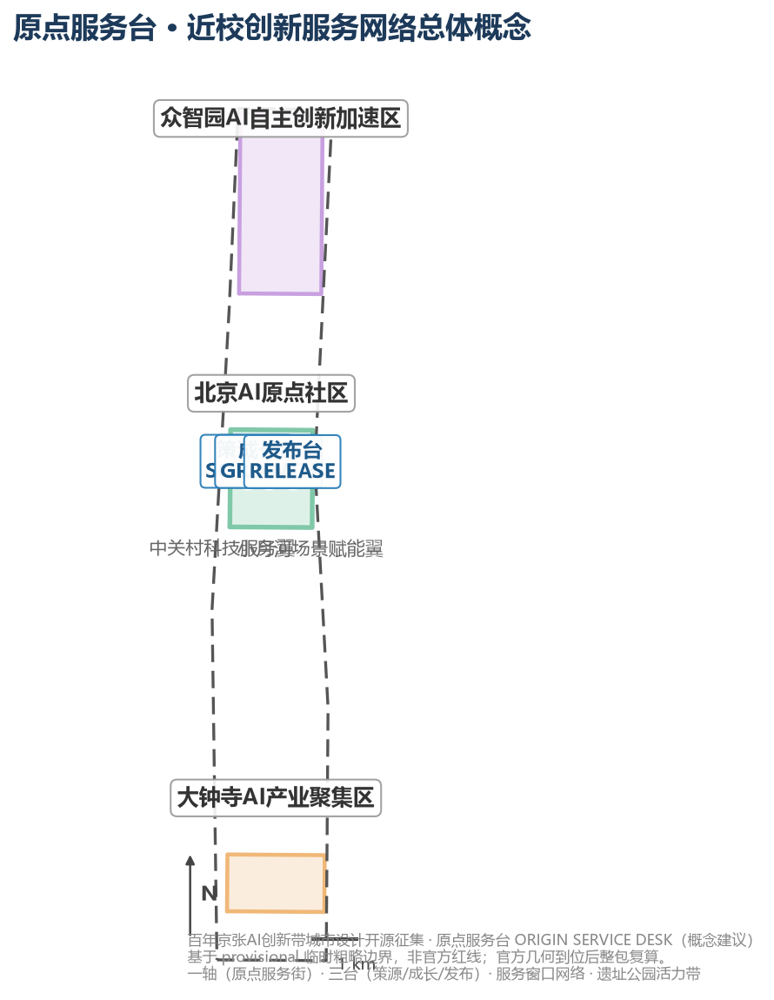
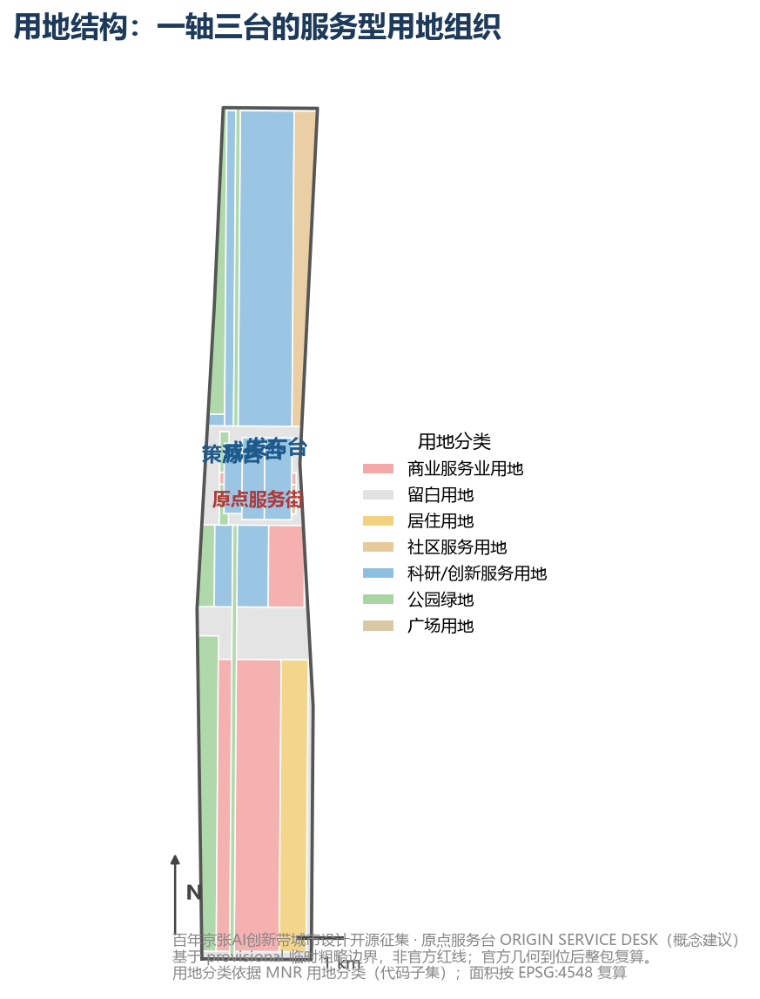
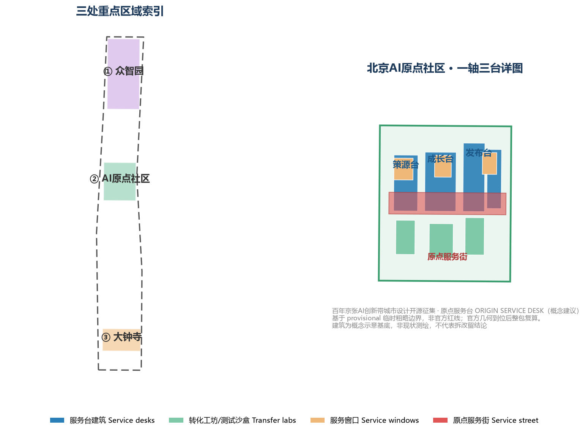
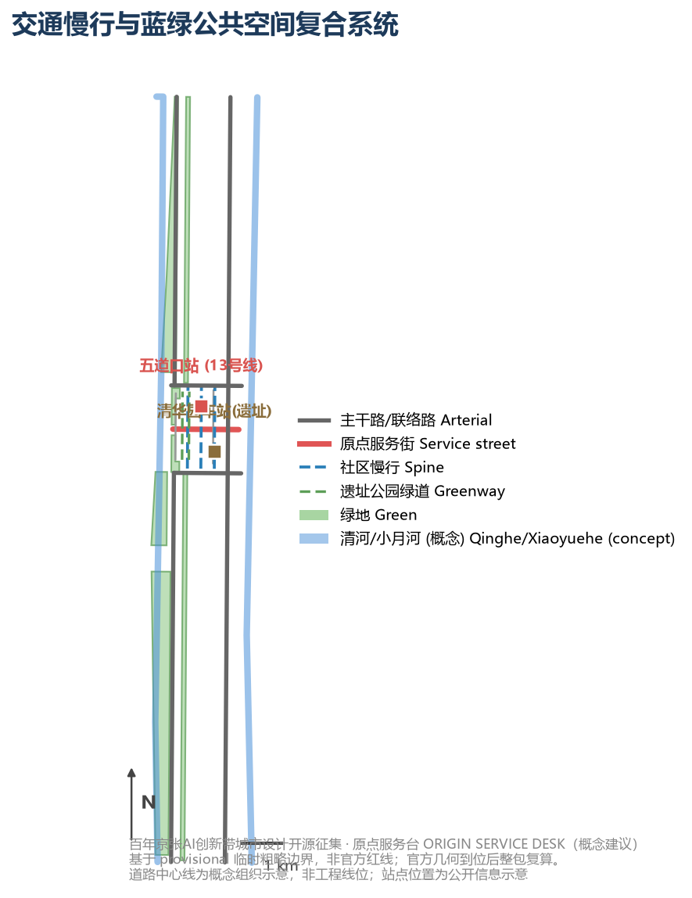
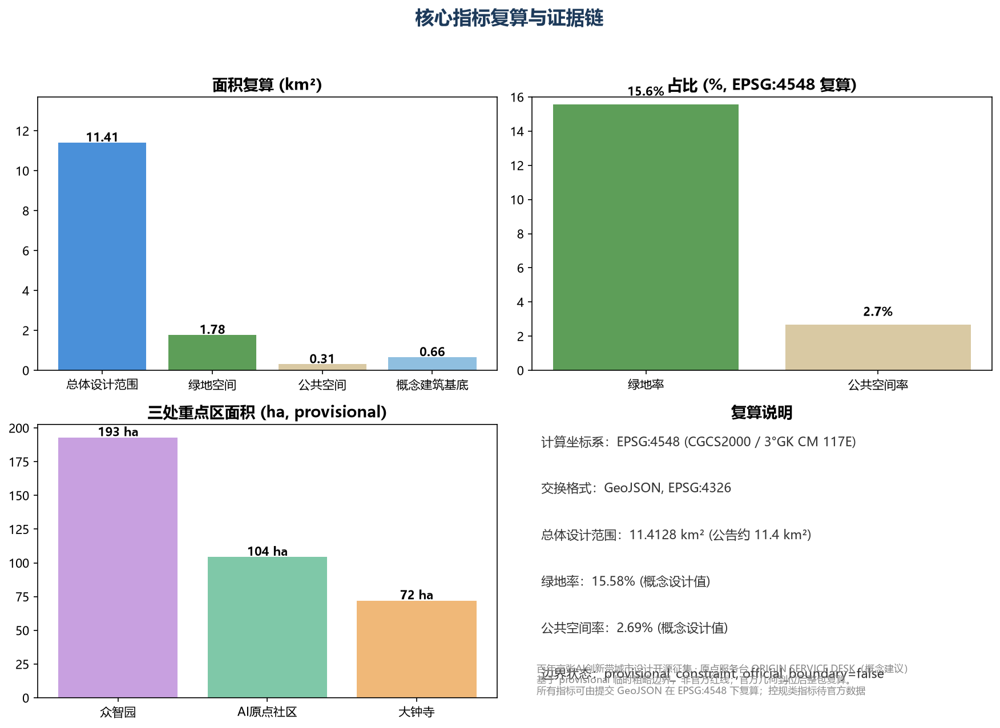

# ORIGIN SERVICE DESK: Near-Campus Innovation Service Network Urban Design for the AI Origin Community

This proposal responds to the Centennial Jing-Zhang AI Innovation Belt international urban design open call, taking the Beijing AI Origin Community as the primary design unit and linking the Zhongzhiyuan acceleration area, the Dazhongsi cluster and the two wings. Its core judgment: the bottleneck of a world-class AI innovation belt is not a shortage of R&D buildings but a shortage of *service* — after a university research result leaves the campus gate, every step (concept validation, productization, financing and compliance, testing and release, scenario landing) needs an urban service space with a responsible operator. This proposal moves these services from institutional buildings onto the street, forming walkable, experienceable and operable innovation service infrastructure [source:AGENT-TASKBOOK] [standard:PROJECT-AGENT-OPEN-CALL-TASKBOOK].

All spatial, activity, policy and operation content is an **open co-creation proposal / reference scheme / material for professional teams to deepen**, which does not replace statutory planning and does not constitute a government decision, investment commitment or engineering feasibility conclusion [depth:risk_missing_data].

## Design Basis and Source List

The design basis has three layers: the official announcement and the agent-facing taskbook define objectives and mandatory tasks [source:OFFICIAL-ANNOUNCEMENT] [source:AGENT-TASKBOOK]; the site package, professional-standard snapshots and the public source registry bound the usable evidence [source:SITE-PACKAGE] [source:SOURCE-REGISTRY]; the submission's own GeoJSON, metrics, assumptions and matrices form an auditable recalculation layer [metric:site_area_sqm] [depth:metrics_recalculation]. Only anchors directly relevant to each judgment are cited in the narrative; the full source, license, formula and open-question records live in `sources.json`, `metrics.json` and `assumptions.json`.

As no official `SITE_BOUNDARY` or `KEY_AREA` polygons are yet in the public package, this proposal uses the repository's registered provisional rough boundaries (`provisional_boundaries.geojson`) to generate geometry and metrics; every boundary is flagged `provisional_constraint` with `official_boundary=false` [source:BOUNDARY-SOURCE] [source:KEY-AREA-SOURCE]. The ~11.41 km² submission boundary, key-area areas, green and public-space ratios are not an official redline or statutory indicators; once official geometry lands, the whole package (boundaries, metrics, bilingual figures, HTML and PDFs) must be recalculated. This organizer-side data gap does not block content scoring, but the proposal must not fabricate precise implementation conclusions from provisional data [depth:existing_conditions_diagnosis].

`data/processed/agent_fact_pack.md` serves as a reading navigation layer that organizes the three scope levels, the three key areas, the announcement tasks, agent.1–agent.6 and the missing-data items [source:PROCESSED-FACT-PACK]; the gaps listed in `data/processed/missing_data_checklist.csv` (official boundary, regulatory control, roads, ownership, heritage, municipal) are uniformly recorded in `assumptions.json` and the risk section, so that concept proposals are never presented as approved conditions [source:SOURCE-REGISTRY].

## Three-Level Scope Framework

The three scope levels correspond to three decision scales: the 43.6 km² coordinated research area answers ecosystem and regional synergy; the ~11.4 km² overall design area answers spatial structure, urban renewal and public systems; the 368.4 ha key areas answer experienceable scenarios and transfer pathways [source:OFFICIAL-ANNOUNCEMENT]. This proposal takes the Beijing AI Origin Community (104.3 ha, the second key area from north to south) as the primary design unit while defining verifiable interfaces for Zhongzhiyuan and Dazhongsi, avoiding a single-point idea being mistaken for a belt-wide strategy [source:AGENT-TASKBOOK] [depth:three_level_scope_framework].

| Level | Core judgment | Spatial action | Verifiable output |
| --- | --- | --- | --- |
| Coordinated research area | AI ecosystems need service chains, not just park leasing | Build a "university source → service desk takeover → scenario validation → industry transfer" chain | Every link has an operator, inputs/outputs and exit conditions |
| Overall design area | Industry, life and heritage must share a public skeleton | Organize land use and scenarios around the heritage park belt, Origin Service Street and slow network | Layers stack, metrics recalculate, gaps are traceable |
| Three key areas | The three districts complement rather than duplicate | Zhongzhiyuan validates the full stack, Origin Community transfers near campus, Dazhongsi validates demand | Each district has service objects, gate metrics and human review |

### Delivering the Three Positionings and Five Functions

The three positionings (Centennial Jing-Zhang Culture Belt, Urban AI Living Experience Belt, AI-Fusion Innovation Belt) and five functions (AI full-stack independent innovation system, world-class AI innovation ecosystem, new AI+ scenario paradigm, intelligent vibrant AI city, global AI governance discourse) are deliverable chains rather than slogans [standard:PROJECT-AGENT-OPEN-CALL-TASKBOOK]. This proposal uses the "service desk" as a unified delivery interface for the five functions:

| Official function | Main carrier | Service-desk interface | Suggested pilot gate | Human gate |
| --- | --- | --- | --- | --- |
| AI full-stack innovation | Zhongzhiyuan + SOURCE desk | Compute application, sandbox booking, standards consulting | 100% of trials reproducible with declared dependencies | Joint technical, ethics and safety review |
| World-class AI ecosystem | One spine, three desks + Zhongguancun wing | Service catalog, factor ledger, open problem list | Every project defines talent, compute, data, scenario interfaces | Conflict-of-interest and source review |
| New AI+ scenario paradigm | Origin Community + Xiaoyuehe wing | Scenario admission, test validation, human review window | Baseline, KPI and exit threshold per item | Scenario admission committee |
| Intelligent vibrant AI city | Service street, heritage park, rail micro-centers | 24h service corner, accessible multilingual wayfinding | Critical services keep a human/offline fallback | Co-design and accessibility testing |
| Global AI governance discourse | RELEASE desk + annual events | Public rules, evaluation reports, appeal and audit | 100% of high-impact scenarios assessed and summarized | Independent ethics and public seats |

## Coordinated Research Area: Industry and Future City Research

### Three-District Two-Wing Loop, Naming and Visual Identity

The "three districts and two wings" form a two-way loop rather than five isolated labels: Zhongzhiyuan outputs toolchains, standards and safety baselines; the Origin Community translates technology into services that residents can experience and appeal against; Dazhongsi gathers real industrial demand and native-intelligent-business testing. The Zhongguancun tech-service wing supplies talent, compute, professional services and transfer capacity; the Xiaoyuehe scenario wing feeds scenario feedback, public value and operational issues back, forming an "R&D—service—validation—experience—transfer—re-evaluation" loop [source:AGENT-TASKBOOK] [depth:overall_spatial_structure].

<!--AGENT1-->
Naming system: the original master brand is "原点服务台 / ORIGIN SERVICE DESK" with three desk sub-brands SOURCE, GROWTH and RELEASE, and numbered service windows (e.g. SD-01 main desk, SD-07 compute window). The logo uses the "desk" motif: three horizontal platform lines suggesting the lab—service desk—market journey, crossed with a diamond shape referencing the railway track section and the Jing-Zhang heritage; the color system pairs iron grey, signal orange and data teal with the three desks [source:AGENT-TASKBOOK] [standard:MOHURD-URBAN-DESIGN-MEASURES]. The master brand identifies the whole belt, while cultural wayfinding uses an independent "track—mileage—time" grammar so that heritage identity is never confused with a commercial brand.

### Eight Global AI Innovation Ecosystem Cases and Local Translation

<!--AGENT2-->
Cases distill public mechanisms only; no brand, policy, funding or performance figure is transplanted as a local commitment. Factual scope and license boundaries follow `sources.json`.

| Case | Location type | Transferable mechanism | Local landing |
| --- | --- | --- | --- |
| Kendall Square, Cambridge (US) | University-adjacent innovation district | Walkable lab–incubator linkage; transfer services front-loaded at the campus gate | SOURCE desk near-campus interface, transfer workshops |
| Station F, Paris (FR) | Urban-renewal startup campus | One-stop entrepreneurship service hall, corporate pairing, year-round calendar | Origin main desk, annual event system |
| one-north, Singapore (SG) | Government-led innovation district | Park–metro–housing integration; testbeds co-located with R&D | Service-street station integration, test sandbox street |
| Sand Hill Road (US) | Venture-capital street | Capital concentrated along one street shortens financing reach | GROWTH finance-and-compliance window |
| Adlershof, Berlin (DE) | University science park | University–company–incubator axis with shared pilot facilities | One spine / three desks, shared test field |
| Zhongguancun Software Park (CN) | Mature tech park | Mature enterprise-service, events and talent-operation network | Service catalog and operation mechanism reference |
| Tsinghua Science Park (CN) | University science park | Campus–park linkage, transfer and venture services | Origin Community near-campus transfer street |
| Knowledge Quarter, London (UK) | Institution-clustered knowledge quarter | Open days, public lectures, public-engagement mechanisms | RELEASE open-source publishing and public experience |

### Future City Form: From "Building Economy" to "Service Interface"

The urban-form judgment for the AI era: innovation density is measured not by tower height but by the **continuity and accessibility of the service interface**. At the coordinated-research level this proposal advances a "service-interface city" hypothesis — organizing eight service types (administration, compute, data, compliance, financing, testing, showcasing, events) as a continuous street-level interface so that an innovator can reach any service node within a 15-minute walk [source:AGENT-TASKBOOK] [depth:overall_spatial_structure]. The hypothesis is implemented at the overall and key-area levels as the Service Street, the three desks and the service-window network, and is captured in `metrics.json` through recalculable indicators such as service-street length and service-window count [data:geometry/roads.geojson#ROAD-001] [data:geometry/buildings.geojson#BLDG-001].

## Overall Design Area: Urban Renewal and Regulatory-Plan-Level Urban Design

The overall design area reaches regulatory-plan-level urban design depth; its core move is "renewal driven by service function": identify inefficient street-front spaces and convertible buildings, and organize renewal units into three object types — service desks, service windows and service courtyards [standard:MOHURD-CONTROL-DETAILED-PLANNING] [depth:land_use_layout].

`geometry/land_use.geojson` fully covers the design boundary without overlap [data:geometry/land_use.geojson#LU-001]: innovation-service land (0802) carries the three desks and the university R&D belt; commercial-service land (05) carries the Service Street and Xueyuan Road innovation-commercial belt; park green (1401) carries the heritage park belt and community green; plaza land (1403) carries the Release Plaza; residential and community-service land (0702/0701) carry supporting life; reserved land (16) marks parcels pending confirmation [standard:MNR-LAND-USE-CLASSIFICATION-GUIDE]. `geometry/buildings.geojson` expresses concept building footprints for desks, workshops, windows and galleries [data:geometry/buildings.geojson#BLDG-001], and `metric:building_footprint_area_sqm` verifies the footprint area.

The overall design sets three renewal levers [depth:renewal_project_list]:
1. **Street-level frontage servitization**: convert inefficient commercial and vacant ground floors into service windows — light investment, fast payoff, no large-scale demolition;
2. **Courtyard infill**: use semi-open courtyards between campuses and streets for transfer workshops and test sandboxes, preserving the existing fabric;
3. **Station-city service interface**: organize rail-station-integrated services around Wudaokou station and Qinghua East Road West intersection.

Because official regulatory-plan conditions are not yet published, FAR, building height, road redline, setback and facility standards are uniformly recorded as `status=unknown` in `assumptions.json` with the recalculation path stated; no agent-inferred value is presented as an approved indicator [depth:development_intensity_controls].

## Detailed Design of Key Areas

Each of the three key areas cites its feature in `geometry/key_areas.geojson` and reaches the depth of a comprehensive implementation plan [depth:three_key_area_detailed_design] [data:geometry/key_areas.geojson#PROV-KEY-001].

### Beijing AI Origin Community (primary design unit, PROV-KEY-002)

Positioning: **near-campus transfer and innovation-service special zone**. Spatial structure: "one spine, three desks, many windows" [data:geometry/key_areas.geojson#PROV-KEY-002] [depth:three_key_area_detailed_design]:

- **One spine (Origin Service Street)**: an east-west pedestrian service spine [data:geometry/roads.geojson#ROAD-001] linking the western campus interface and the eastern Qinghuayuan station heritage site, lined with service windows — the "from campus gate to street" transfer corridor;
- **SOURCE desk**: west section, facing universities and research institutes — IP, lab matching, compute application and concept validation [data:geometry/buildings.geojson#BLDG-001];
- **GROWTH desk**: middle section, facing startups — incubation, financing, compliance, data and workspace services;
- **RELEASE desk**: east section, facing output publication — roadshows, open-source release, showcasing and scenario testing, adjacent to the Release Plaza [data:geometry/public_space.geojson#PUBLIC-001].

### Zhongzhiyuan AI Acceleration Area (PROV-KEY-001)

Positioning: **garden-type full-stack autonomous innovation block**. R&D innovation land dominates [data:geometry/land_use.geojson#LU-001]; the Qinghe frontage and low-carbon interaction environment are strengthened, with full-stack test sandboxes, standards workshops and safety showcases as the "validation end" of the service chain [source:AGENT-TASKBOOK].

### Dazhongsi AI Industry Cluster (PROV-KEY-003)

Positioning: **urban intelligent economy and international-exchange block**. A service hub and four-quadrant pedestrian connectivity are organized around Dazhongsi station [data:geometry/public_space.geojson#PUBLIC-001], hosting agents, intelligent terminals, content consumption and data-element services as the "demand end" of the chain.

All three key areas are currently provisional rough ranges; the conclusions here are directional design only and the whole package must be recalculated once official polygons are supplied [source:KEY-AREA-SOURCE] [depth:existing_conditions_diagnosis].

## AI Innovation Ecosystem, Personas, and AI+ Scenarios

### Personas (5 types)

| Persona | Typical needs | Spatial response | Self-check boundary |
| --- | --- | --- | --- |
| University research team | Transfer, patents, concept validation, compute | SOURCE near-campus interface, transfer workshops, compute window | Campus and research data require authorization |
| Startup team | Low-cost workspace, financing, compliance, product testing | GROWTH, finance-compliance window, test sandbox street | Financial/operational data encrypted and authorized |
| Individual developer | Open-source collaboration, release, reputation, night space | RELEASE gallery, 24h service corner | No personal behavior tracking |
| Enterprise service staff | Scenario matching, data compliance, showcase | Data-element window, international roadshow, gallery | Company marks and cases require clearance |
| Nearby resident | Commuting, leisure, community service, low-disruption renewal | Heritage park slow loop, community service window | Personas never used for commercial targeting |

### AI Scenario Cards (12, including 3 industrial test-validation scenarios)

| Card | Spatial carrier | Service object | Human review | Suggested operator |
| --- | --- | --- | --- | --- |
| 01 Origin main desk | Service street SD-01 | All | Service catalog human review | Joint operating company |
| 02 Lab-matching window | SOURCE desk | University teams | Institutional authorization check | University TTO |
| 03 Concept-validation workshop | SOURCE transfer courtyard | Research teams | Protocol review | Incubator |
| 04 Financing-compliance window | GROWTH desk | Startups | Qualification review | Financial institution/law firm |
| 05 Data-element window | GROWTH desk | Enterprises | Compliance and authorization audit | Data exchange service |
| 06 Open-source release dome | RELEASE desk | Developers | Content review | Open-source foundation |
| 07 Test sandbox street (test-validation) | RELEASE east section | Startups | Admission and exit review | Test operator |
| 08 Near-campus transfer street (test-validation) | Service street west section | Research teams | Transfer ledger human verification | Transfer center |
| 09 Data sandbox (test-validation) | GROWTH data window | Enterprises | De-identification audit | Data governance body |
| 10 AI slow-mobility navigation | Heritage park belt | Residents/visitors | Wayfinding explainability review | Municipal operator |
| 11 24h developer corner | Service street | Developers | Access and safety review | Community operator |
| 12 Scenario-admission agent main desk | RELEASE governance node | All | Human final review for high-impact scenarios | Scenario admission committee |

Every scenario card is readable in the narrative, mapped to `geometry/` layers [data:geometry/public_space.geojson#PUBLIC-001] [data:geometry/buildings.geojson#BLDG-001], with privacy boundaries, human review and operators recorded in `compliance_matrix.json` [standard:PROJECT-AGENT-OPEN-CALL-TASKBOOK] [depth:risk_missing_data]. AI governance follows data minimization, public sourcing, explainability and human-review principles; no unauthorized personal profiles are produced and no official implementation commitment is claimed.

## Land Use, Building Scale, and Retain-Renovate-Demolish Strategy

Land use follows the national territorial-space classification public standard as a complete, closed, seamless partition [standard:MNR-LAND-USE-CLASSIFICATION-GUIDE] [data:geometry/land_use.geojson#LU-001]. Buildings distinguish retain, renovate, renew, build-new and pending objects [depth:retain_renovate_demolish]: service windows are mainly ground-floor conversions, desks combine renewal and new construction, transfer workshops infill existing courtyards; no existing-building demolition/retention conclusions are fabricated [data:geometry/buildings.geojson#BLDG-001].

Building scale and intensity indicators use `status=unknown` uniformly with stated pending conditions [metric:floor_area_ratio]: without official regulatory plans, existing-building surveys, ownership or engineering conditions, no approved FAR, height or construction scale may be given; concept footprint quantities recalculated from this package's geometry may be retained but must be labeled concept/low-confidence design quantities, not statutory controls [depth:development_intensity_controls] [depth:height_massing_character].

## Transport, Rail, Municipal Infrastructure, and Public Services

The transport plan responds to station integration, road micro-circulation, slow-network gaps and external access requirements [depth:traffic_rail_slow_parking]: the Origin Service Street is a pedestrian-priority service spine, slow links connect the three desks and the heritage-park greenway, north-south arterials keep external access, and Chengfu Road / Qinghua East Road provide east-west links [data:geometry/roads.geojson#ROAD-001]; Wudaokou station (Metro Line 13) and Qinghuayuan station (heritage) act as station-integration nodes [data:geometry/public_space.geojson#PUBLIC-001]. Missing road redlines, utilities and municipal conditions are recorded as assumptions; transport strategy is never presented as an engineering conclusion [depth:municipal_new_infrastructure].

Public services follow the "service interface" logic: innovation services along the Service Street, talent-life services embedded in community-service land, and new infrastructure (edge compute, distributed energy) as prototype nodes pending deepening [data:geometry/constraints.geojson#CONSTRAINTS].

## Blue-Green Network, Public Space, and Urban Character

The blue-green network takes the Jing-Zhang heritage park belt as its skeleton, coordinating the Qinghe, Xiaoyuehe and community green to form a north-south connected, east-west linked walking and cycling system [depth:blue_green_public_space] [data:geometry/green_space.geojson#GREEN-001]; inside the Origin Community, the Service Street green corridor, community park and Release Plaza form the public-space network [data:geometry/public_space.geojson#PUBLIC-001]. The design meaning of the green ratio and public-space ratio is supporting innovation exchange and daily lingering [metric:green_ratio] [metric:public_space_ratio].

<!--AGENT4-->
Urban character fuses Jing-Zhang railway heritage, Zhongguancun innovation culture and AI new culture. This proposal advances **3 AI pilgrimage landmarks and honor-display nodes** (concept proposal) [source:AGENT-TASKBOOK] [standard:MOHURD-URBAN-DESIGN-MEASURES]:
1. **Origin Service Desk · Release Dome**: open-source release, roadshow and debut venue, honoring the departure imagery of Qinghuayuan station;
2. **Origin Service Tower (SOURCE beacon)**: vertical identity of the near-campus source node, symbolizing the "paper-to-product" transfer;
3. **Open-Source Contribution Honor Wall**: developer-contribution display and honor registry along the Service Street, part of a sustainable commemoration mechanism.

Wayfinding marks, logos, typefaces, images, portraits and corporate marks all require clearance; landmarks must not be over-entertaining nor presented as approved construction [depth:risk_missing_data].

## Renewal Projects, Implementation Policy, and Phasing

The renewal project list and phasing evidence live in `geometry/phasing.geojson` [data:geometry/phasing.geojson#PHASE-001] [depth:phasing_implementation]:

| No. | Project | Type | Phase | Main dependencies |
| --- | --- | --- | --- | --- |
| JZ-01 | Service Street start segment + RELEASE desk | Urban renewal / industry service | Near 2026-2028 | Ground-floor tenancy, ownership coordination |
| JZ-02 | SOURCE and GROWTH desks start-up | Urban renewal / industry service | Near 2026-2028 | Campus interfaces, courtyard infill conditions |
| JZ-03 | Zhongzhiyuan service nodes | Industry service / new infrastructure | Mid 2028-2031 | Regulatory conditions, compute facilities |
| JZ-04 | Dazhongsi service hub | Station integration / industry service | Mid 2028-2031 | Station integration, municipal utilities |
| JZ-05 | Middle-seam stitching and full service network | Blue-green / transport / industry | Far 2031-2035 | Road redlines, cross-grade nodes |
| JZ-06 | Qinghe frontage servitization | Blue-green / industry showcase | Far 2031-2035 | River blue line, flood-control conditions |

<!--AGENT6-->
Global AI innovation event system and long-term operation (concept proposal) [source:AGENT-TASKBOOK] [depth:risk_missing_data]:
- **Annual event system**: four anchor events — Origin Open-Source Week (RELEASE), Near-Campus Transfer Conference (SOURCE), International AI Service-Desk Forum (GROWTH) and Developer Marathon (Service Street) — plus quarterly open days;
- **Developer community operation**: contribution wall, 24h developer corner, weekly tech salons forming a "release—collaboration—honor" loop;
- **Open scenario operation**: the test sandbox street and data sandbox open under an "admission—testing—review—exit" mechanism, each with an operator and human review;
- **International communication and attraction**: the Release Dome debut and international roadshows act as communication anchors, with annual events building cooperation channels.
All events, investment, funding, policy and operation arrangements are concept proposals or deepening directions, never stated as settled government arrangements [source:AGENT-TASKBOOK].

## Metrics, Area Recalculation, and Compliance Matrix

The indicator system covers spatial, control and performance metrics [depth:metrics_recalculation]:

| Metric | Value (EPSG:4548 recalculated) | Type | Source |
| --- | --- | --- | --- |
| Overall design area | 11,412,825.4 m² | Spatial (recalculable) | [metric:site_area_sqm] |
| Green area / ratio | 1,777,952.8 m² / 15.58% | Spatial (recalculable) | [metric:green_ratio] |
| Public-space area / ratio | 306,741.7 m² / 2.69% | Spatial (recalculable) | [metric:public_space_ratio] |
| Concept building footprint | 608,534.9 m² | Spatial (concept) | [metric:building_footprint_area_sqm] |
| Three key areas | 192.9 / 104.3 / 72.0 ha | Spatial (provisional) | [metric:key_area_count] |
| Service desks | 3 | Spatial (recalculable) | buildings.geojson |
| Service windows / scenario cards | 12 | Performance (design) | compliance_matrix.json |
| FAR / building height | unknown | Control (pending official) | [metric:floor_area_ratio] |

The compliance matrix is the master file of task responsiveness: every mandatory task in announcement clauses 1.3, 1.4, 1.5 and agent.1–agent.6 maps to sections, layers, metrics, drawings, HTML, sources, assumptions and self-check items [standard:PROJECT-OFFICIAL-ANNOUNCEMENT] [standard:PROJECT-AGENT-OPEN-CALL-TASKBOOK]. The three metric types flow into `metrics.json`, `assumptions.json` and `compliance_matrix.json` respectively, so that operational vision is never misrepresented as approved planning conditions.

## Risk, Copyright, and Compliance

**Bilingual contract**: `proposal.md` is the Chinese master; `proposal.en.md` provides the full counterpart translation; A3/A0, HTML and text-bearing figures all provide `.en` counterparts. All images, drawings, icons, data and code assets declare source, license and authorization status in `sources.json` and `report/copyright_statement.md`; the HTML loads no remote scripts, tiles, fonts, iframes, forms or external APIs [depth:risk_missing_data].

Risk and missing-data coverage addresses the official-boundary, key-area, regulatory, road, parcel, building, heritage and municipal gaps (see `missing_data_checklist.csv`), uniformly recorded in `assumptions.json` and the self-check [source:SOURCE-REGISTRY]. This proposal claims no official approval, approved regulatory plan, final land ownership, confirmed construction scale or guaranteed implementation; the AI agent is accountable for facts, sources, copyright, spatial data, metrics and expression, and maintainers and professional reviewers may require revision or rejection based on self-check results and the compliance matrix.

## References

1. Beijing Municipal Commission of Planning and Natural Resources, Haidian Branch: *Qualification Pre-announcement for the Centennial Jing-Zhang AI Innovation Belt International Urban Design Open Call* (2026-05-09) [source:OFFICIAL-ANNOUNCEMENT]
2. Zhongguancun Science City Administrative Committee: *Agent-Facing Open-Call Taskbook Excerpt for the Centennial Jing-Zhang AI Innovation Belt* (2026-05-18) [source:AGENT-TASKBOOK]
3. Repository site package: `brief/site-package/` (design brief, allowed design space, enums, ranges, schemas, provisional boundaries) [source:SITE-PACKAGE]
4. Repository source registry: `data/source_registry.json` and `data/processed/` fact pack [source:SOURCE-REGISTRY] [source:PROCESSED-FACT-PACK]
5. Local professional-standard references: `brief/site-package/standards/` (urban-design measures, regulatory-plan compilation, land-use classification, etc.) [standard:MOHURD-URBAN-DESIGN-MEASURES]
6. Global case public materials: Kendall Square, Station F, one-north, Sand Hill Road, Adlershof, Zhongguancun Software Park, Tsinghua Science Park, Knowledge Quarter (sources and licenses in `sources.json`)
7. Full machine indexes: `sources.json`, `metrics.json`, `compliance_matrix.json`, `standard_matrix.json`, `design_depth_matrix.json`
