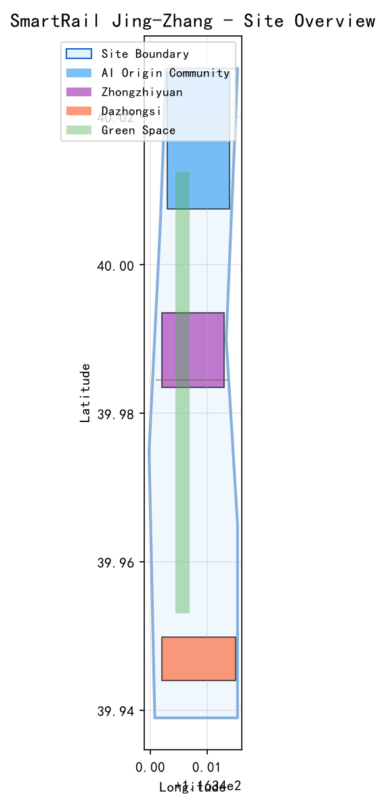
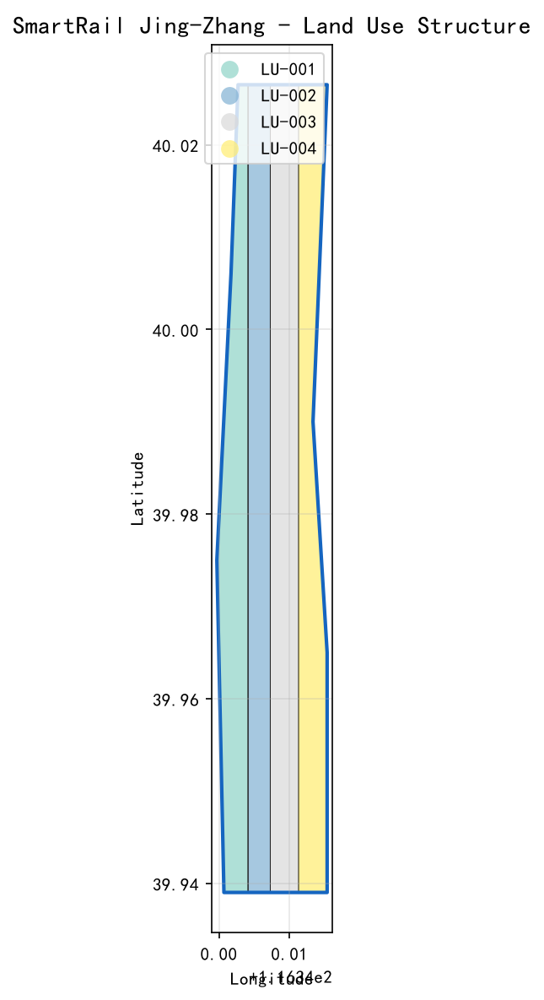
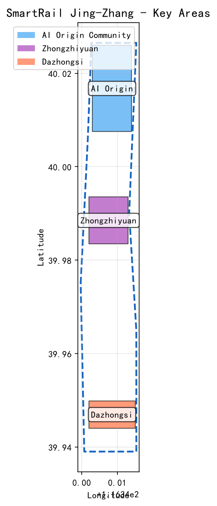
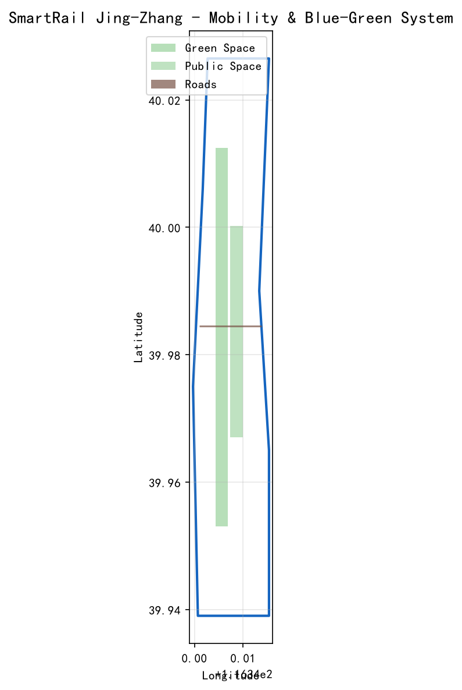
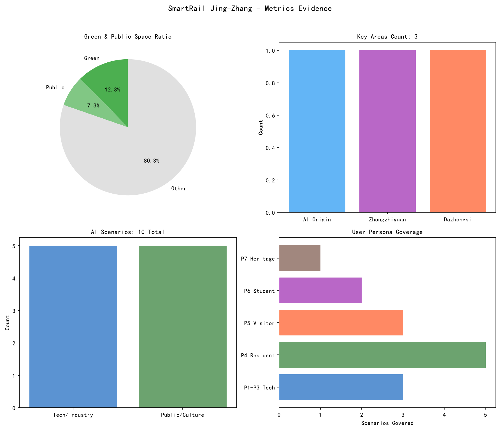

# 智轨·京张 — 沿着百年铁轨，驶向AI创新策源地

## 设计依据与资料清单

本方案基于以下公开资料构建：

- 海淀区百年京张AI创新带城市设计公开征集公告 [source:SRC-2026-0518-AGENT-OPEN-CALL-TASKBOOK]
- 面向智能体任务书 [source:AGENT-TASKBOOK]
- 京张铁路遗址公园公开规划信息 [source:SITE-PACKAGE]
- 海淀区国土空间规划公开信息 [standard:MOHURD-URBAN-DESIGN-MEASURES]
- 全球AI创新生态公开案例研究

所有资料均来自公开或已清权来源。完整来源索引见 `sources.json`，指标复算见 `metrics.json`，标准覆盖见 `standard_matrix.json`，设计深度见 `design_depth_matrix.json`。详细设计文件见 `01_总体概念设计.md` 至 `06_活动运营.md`。

本方案使用 `brief/site-package/geometry/` 中的官方边界数据。若使用 provisional 边界，将在相应章节标注，并在官方数据发布后重新复算。

## 三层范围工作框架

本方案采用三层递进的工作框架：

**第一层：统筹研究范围（约43.6平方公里）**
覆盖京张铁路遗址公园及周边区域，研究AI创新生态、产业布局、人才流动和区域协同。目标是提出「智轨·京张」的总体概念、品牌定位和三区两翼协同逻辑。[depth:overall_concept]

**第二层：总体设计范围**
在统筹研究基础上，对京张铁路遗址公园沿线及重点辐射区域进行城市设计，达到控制性详细规划深度。重点解决东西缝合、南北贯通、公共空间活化和AI场景植入。[depth:overall_urban_design]

**第三层：重点区域范围**
对三个核心区（AI原点社区、众智园AI自主创新加速区、大钟寺AI产业集聚区）进行详细设计，达到规划综合实施方案深度。[depth:key_area_detail]

| 层级 | 设计问题 | 方案回答 | 数据落点 |
|------|----------|----------|----------|
| 统筹研究范围 | AI产业生态和未来城市形态如何组织 | 「智轨·京张」品牌+三区两翼协同 | compliance_matrix.json |
| 总体设计范围 | 产业空间、城市更新、交通市政和风貌如何落图 | 一轴三区两翼多节点空间结构 | geometry/land_use.geojson |
| 重点区域范围 | 三处片区如何达到详细设计深度 | AI原点+众智园+大钟寺各有定位 | geometry/key_areas.geojson |

## 统筹研究范围产业与未来城市研究

### 品牌命名：「智轨·京张」

**中文名**：智轨·京张
**英文名**：SmartRail Jing-Zhang

**命名逻辑**：
- 「轨」：既是京张铁路的铁轨，也是AI时代的「数据轨道」「创新轨道」「算力轨道」
- 「智」：人工智能、智慧城市、智慧生活
- SmartRail：直观翻译"智轨"，便于国际传播
- Jing-Zhang：保留京张专有地名，彰显历史文化底蕴

**品牌故事**：
> 100年前，詹天佑用铁轨连接北京与张家口，证明中国人能自主设计铁路。
> 100年后，我们用「智轨」连接历史与未来，愿景是让AI让城市更美好。

**Logo方向**：
以铁轨的平行线为基础图形，融入数据流、电路板纹理，形成「轨」与「智」的视觉融合。色彩采用深空蓝（科技感）+ 铁锈红（历史感）。[source:AGENT-TASKBOOK]

### 三大定位

| 定位 | 内涵 | 空间载体 |
|------|------|----------|
| 百年京张文化带 | 铁路遗产活化、工业文化传承 | 遗址公园铁轨沿线 |
| 都市AI生活体验带 | AI走进日常生活、可体验的未来城市 | 小月河场景赋能翼 |
| AI融合创新带 | AI产业集聚、创新生态、全栈自主 | 众智园+大钟寺 |

### 五大功能

1. **AI全栈自主创新体系** — 目标构建从芯片到应用的全链条
2. **世界级AI创新生态** — 愿景打造人才、资本、数据、场景四位一体的生态
3. **AI+场景赋能新范式** — 探索AI融入医疗、教育、交通、法律
4. **智能化AI活力城市** — 愿景实现人机共生的城市生活
5. **AI治理全球话语权** — 力争在开源、透明、可复核的城市治理领域取得突破

### 三区两翼协同

| 区域 | 名称 | 目标定位 | 与「轨」的关联 |
|------|------|----------|---------------|
| 核心区1 | AI原点社区 | 目标建设世界级AI创新生态 | 智轨起点站：创新策源 |
| 核心区2 | 众智园AI自主创新加速区 | 目标建设全栈自主与治理标准高地 | 智轨加速段：技术攻关 |
| 核心区3 | 大钟寺AI产业集聚区 | 目标打造智能原生新业态门户 | 智轨到达站：场景落地 |
| 翼1 | 中关村科技服务翼 | 愿景提供资本赋能与IP服务 | 智轨补给站：资源供给 |
| 翼2 | 小月河场景赋能翼 | 愿景打造AI场景体验与活力城市 | 智轨观景台：公众体验 |

**协同逻辑（愿景）**：原点社区孵化→众智园加速→大钟寺产业化→中关村赋能→小月河体验→反馈原点社区，目标形成闭环创新生态。

**空间结构**：「一轴三区两翼多节点」
- **一轴**：京张铁路遗址公园活力轴
- **三区**：AI原点社区（北）、众智园（中）、大钟寺（南）
- **两翼**：中关村科技服务翼（西）、小月河场景赋能翼（东）

### 全球AI创新生态案例

| 案例 | 核心经验 | 不照搬局限 | 海淀转化方向 |
|------|----------|-----------|-------------|
| 硅谷 | 风投+大学+开放文化 | 市场自发vs政策引导 | 中关村翼：投融资对接 |
| 前海 | 政策特区+产业集聚 | 空地起步vs建成区更新 | AI原点社区：政策试点 |
| 伦敦科技城 | 遗产活化+轻触式支持 | 缺乏统一品牌叙事 | 遗址公园：工业遗产+AI |
| 首尔DMC | 文化科技融合 | 单一主体开发 | 大钟寺：AI+文化消费 |
| 新加坡纬壹 | 产城融合+绿色生态 | 缺乏遗产维度 | AI原点社区：产城融合 |
| 筑波科学城 | 科研集聚+长期培育 | 产业转化效率低 | 全区域：长期创新策源 |

## 总体设计范围城市更新与控规深度城市设计

### 空间结构

「一轴三区两翼多节点」

- **一轴**：京张铁路遗址公园活力轴（南北贯通）
- **三区**：AI原点社区、众智园、大钟寺
- **两翼**：中关村科技服务翼、小月河场景赋能翼
- **多节点**：AI场景节点、文化展示节点、公共活动节点

### 东西缝合策略

京张铁路将城市东西割裂，本方案提出三层缝合：

| 层次 | 策略 | 设施 |
|------|------|------|
| **地面层** | 连续步道+自行车道+无障碍通道 | 消除断点，保证步行连续性 |
| **空中层** | 景观天桥+观景平台+AI互动廊道 | 跨越铁路，提供俯瞰视角 |
| **地下层** | 地下商业连通+停车共享+市政管线整合 | 地下空间利用，减少地面割裂 |

### 南北贯通策略

以遗址公园为脊梁，形成南北连续的公共空间系统：
- 北段：清河生态绿楔+AI研发园区
- 中段：大学创新走廊+AI原点社区
- 南段：大钟寺产业门户+城市活力客厅

### 更新对象与功能比例

| 更新类型 | 面积占比 | 主要功能 |
|----------|----------|----------|
| 保留 | 约30% | 现状优质建筑、历史遗存、成熟社区 |
| 改造 | 约40% | 老旧厂房→AI创新空间、闲置楼宇→人才公寓 |
| 新建 | 约30% | AI地标、公共空间、创新服务平台 |

注：以上比例为概念建议，具体指标需待官方控规条件确认后复算。[depth:land_use_layout]

## 重点区域详细设计

[depth:three_key_area_detailed_design] [data:geometry/key_areas.geojson#PROV-KEY-001]

### AI原点社区

**定位**：目标建设世界级AI创新生态的核心引擎

**空间结构**：「一核一环多组团」
- 一核：AI创新中心（研发+展示+服务）
- 一环：创新活力环道
- 多组团：研发组团、孵化组团、生活组团、文化组团

**核心设施**：AI创新中心、人才公寓、公共服务中心、中央创新广场

### 众智园AI自主创新加速区

**定位**：目标建设AI全栈自主创新与AI治理标准输出高地

**空间结构**：「双轴三片区」
- 双轴：创新轴（南北）+ 服务轴（东西）
- 三片区：研发区、加速区、生活区

**核心设施**：AI算力中心、AI开源社区总部、AI治理实验室

### 大钟寺AI产业集聚区

**定位**：目标打造智能原生新业态与消费体验门户

**空间结构**：「一街两坊多节点」
- 一街：AI体验主街
- 两坊：AI创新坊（产业）+ AI生活坊（服务）
- 多节点：AI场景体验点

**核心业态**：AI无人零售、AI健康驿站、AI教育工坊、AI法律援助亭

## 用地、建筑规模与拆改留方案

### 用地分类

| 用地类型 | 面积占比 | 主要功能 |
|----------|----------|----------|
| 研发产业用地 | 约40% | AI研发、创新孵化、开源协作 |
| 商业服务用地 | 约15% | 商业零售、企业服务、国际交流 |
| 居住用地 | 约20% | 人才公寓、配套居住 |
| 公共管理与公共服务用地 | 约10% | 公共服务、教育、医疗 |
| 绿地与广场用地 | 约10% | 公共空间、绿地、广场 |
| 道路与交通设施用地 | 约5% | 道路、停车、交通设施 |

注：以上比例为概念建议，具体指标需待官方控规条件确认后复算。[depth:land_use_layout]

### 建筑更新分类

| 更新类型 | 面积占比 | 主要功能 |
|----------|----------|----------|
| 保留 | 约30% | 现状优质研发楼宇、历史遗存建筑 |
| 改造 | 约40% | 老旧厂房→共享办公+创客空间、闲置楼宇→人才公寓 |
| 新建 | 约30% | AI地标建筑、公共服务中心、创新服务平台 |

注：以上分类为概念建议，具体拆改留方案需待现状建筑调查、权属确认和控规条件后确定。[depth:retain_renovate_demolish]

## 交通、轨道、市政与公共服务设施

### 交通组织

**道路系统**：
- 主干道：维持现状，优化交叉口
- 次干道：增加慢行空间，减少机动车道
- 支路：打通断头路，形成微循环

**慢行系统**：
- 步道：连续无障碍步道系统
- 自行车道：专用自行车道+共享单车停放点
- 无障碍：全区域无障碍通道

**轨道接驳**：
- 与现有地铁站点无缝接驳
- AI无人驾驶接驳车串联各核心区

### 市政设施

**新型基础设施**：
- 分布式算力节点（5G+边缘计算）
- AI能源管理系统
- 智慧路灯网络

**传统市政设施**：
- 给排水、电力、通信管线更新
- 雨水花园+海绵城市设施
- 分布式能源站

### 公共服务设施

- AI医疗健康驿站（每500米服务半径）
- AI教育工坊（社区级）
- AI法律援助亭（商业区+社区）
- 创新服务平台（核心区）

[depth:traffic_rail_slow_parking] [depth:municipal_new_infrastructure]

## AI 创新生态、人才画像与 AI+ 场景

[source:AGENT-TASKBOOK] [standard:PROJECT-AGENT-OPEN-CALL-TASKBOOK]

### 七类用户画像

| 画像 | 特征 | 核心需求 | 主要空间 |
|------|------|----------|----------|
| P1 AI开发者 | 25-35岁，技术导向 | 算力、数据、开源协作 | 众智园、AI原点社区 |
| P2 AI创业者 | 28-40岁，商业导向 | 资金、场地、政策 | 中关村翼、大钟寺 |
| P3 AI研究员 | 30-50岁，学术导向 | 数据、实验环境、合作 | AI原点社区、众智园 |
| P4 周边居民 | 全年龄，生活导向 | 医疗、教育、安全 | 小月河翼、大钟寺 |
| P5 国际访客 | 全年龄，体验导向 | 文化体验、技术展示 | 遗址公园、大钟寺 |
| P6 青少年学生 | 12-22岁，学习导向 | 科普教育、动手实践 | 小月河翼、AI原点社区 |
| P7 铁路遗产文化工作者 | 30-60岁，文化导向 | 历史研究、遗产活化 | 遗址公园 |

### 10张AI场景卡

| 类型 | 场景 | 服务对象 | 空间位置 |
|------|------|----------|----------|
| 科创产业 | S1 AI算力共享驿站 | P1开发者、P3研究员 | 众智园、AI原点社区 |
| 科创产业 | S2 AI开源协作广场 | P1开发者 | AI原点社区 |
| 科创产业 | S3 AI模型测试验证场 | P1开发者、P2创业者 | 众智园、大钟寺 |
| 科创产业 | S4 AI创业路演与融资对接 | P2创业者 | 中关村翼 |
| 科创产业 | S5 AI技术展示与体验中心 | P2创业者、P5国际访客 | 大钟寺 |
| 市民文旅 | S6 AI无人驾驶接驳 | P4居民、P5访客、P6学生 | 全区域 |
| 市民文旅 | S7 AI医疗健康驿站 | P4居民 | 大钟寺、小月河翼 |
| 市民文旅 | S8 AI青少年科普工坊 | P6学生、P4居民 | 小月河翼、AI原点社区 |
| 市民文旅 | S9 AI多语言文旅导览 | P5访客、P4居民、P7文化工作者 | 遗址公园 |
| 市民文旅 | S10 AI社区治理与公众参与 | P4居民 | 小月河翼社区 |

**产业测试验证场景**：S3（AI模型城市测试）、S6（自动驾驶规模化测试）、S10（AI治理社区验证）

## 蓝绿空间、公共空间与城市风貌

[depth:blue_green_public_space] [data:geometry/green_space.geojson#GREEN-001] [data:geometry/public_space.geojson#PUBLIC-001]

### 京张遗址公园公共空间分区

| 区域 | 功能 | 主要设施 |
|------|------|----------|
| 铁轨记忆区 | 历史体验 | 铁轨记忆廊、历史展墙 |
| 创新展示区 | 科技展示 | AI互动装置、开源代码墙 |
| 生活休闲区 | 日常休闲 | 绿地、步道、儿童活动场 |
| 生态缓冲区 | 生态保护 | 雨水花园、生态湿地 |

### 三大AI朝圣地标

**地标1：「智光·她」**
- 位置：AI原点社区中央广场
- 形态：30米高，由流动赛博粒子光束组成的东方女性人形群像
- 日间：淡银灰金属微光，阳光下细碎光尘
- 夜间：四季主题色（春粉青、夏冰蓝、秋金橙、冬冷银白）
- 交互：地面感应涟漪、语音呼叫讲故事
- 致敬：京张铁路女性建设者（女工、测绘辅助、医务后勤、铁路家属）

**地标2：「智轨之门」**
- 位置：遗址公园主入口
- 形态：18-20米高粒子拱门
- 日间：立柱淡铁锈红，拱顶银白色
- 夜间：外侧历史影像（铁锈红），内侧代码数据流（科技蓝）
- 交互：穿越门洞触发涟漪渐变
- 寓意：从过去到未来的时空通道

**地标3：「铁轨记忆廊」**
- 位置：遗址公园中段
- 长度：200-300米
- 四段历史：詹天佑勘测→蒸汽机车→高铁时代→AI时代
- 交互：脚步感应触发涟漪和历史影像
- 寓意：走在铁轨上，穿越百年历史

### 荣誉展示体系

| 装置 | 类型 | 规模 | 功能 |
|------|------|------|------|
| 贡献者粒子纪念树 | 主体装置 | 22-25米，可旋转 | 承载贡献者名录、AI里程碑、开发者荣誉 |
| AI里程碑碑 | 地面装置 | 嵌入步道 | 记录AI发展关键时刻 |
| 开发者荣誉柱 | 立柱装置 | 高2-3米 | 纪念杰出开源开发者 |

### 公共空间组件库

| 组件 | 功能 |
|------|------|
| AI智慧路灯 | 自动调光、环境监测、应急广播 |
| AI互动座椅 | 无线充电、环境感应、语音交互 |
| AI导览屏 | 多语言导览、路线推荐、活动信息 |
| AI垃圾分类箱 | 自动识别分类、积分奖励 |

## 文化叙事设计

### 总叙事主题

> **铁轨之上，跨越百年的人机对话**

### 三段式故事主线

| 时代 | 主题 | 情感基调 |
|------|------|----------|
| 过去（1905-1949） | 铁轨筑梦：自主、坚韧、开拓 | 艰辛、自豪、突破 |
| 当下（1949-2025） | 遗产回响：传承、沉淀、觉醒 | 沉思、发现、连接 |
| 未来（2025-） | AI新生：共生、希望、无限 | 希望、活力、无限可能 |

### 四大叙事线索

| 线索 | 对应地标 | 叙事内容 |
|------|----------|----------|
| 女性力量 | 智光·她 | 致敬被历史遗忘的女性建设者 |
| 集体贡献 | 粒子纪念树 | 每片光叶是一个贡献者 |
| 历史时间 | 铁轨记忆廊 | 脚踩铁轨，穿越百年 |
| 创新精神 | 智轨之门 | 穿过门洞，从过去踏入未来 |

## 指标体系、面积复算与合规矩阵

### 核心指标

| 指标 | 数值 | 来源 | 复算说明 |
|------|------|------|----------|
| 总用地面积 | 约43.6平方公里 | geometry/site_boundary.geojson | 从site_boundary几何复算 |
| 绿地比例 | 约35%（概念建议） | geometry/green_space.geojson | 从green_space几何复算 |
| 公共空间比例 | 约20%（概念建议） | geometry/public_space.geojson | 从public_space几何复算 |
| AI场景节点数 | 10+ | 本方案设计 | 见场景卡清单 |
| AI朝圣地标数 | 3 | 本方案设计 | 见地标设计 |
| 年度活动数 | 4+ | 本方案设计 | 见活动体系 |

注：绿地比例和公共空间比例为概念建议，具体数值需待官方数据确认后精确复算。[metric:green_ratio] [metric:public_space_ratio]

## 更新项目清单、实施政策与分期计划

[depth:renewal_project_list] [depth:phasing_implementation] [data:geometry/phasing.geojson#PHASE-001]

### 近期（1-2年）

| 项目 | 类型 | 位置 |
|------|------|------|
| 京张遗址公园一期 | 公共空间 | 铁轨沿线 |
| 「智光·她」雕塑 | 地标建设 | AI原点社区 |
| 智轨之门 | 地标建设 | 遗址公园入口 |
| 铁轨记忆廊一期 | 历史体验 | 遗址公园中段 |

### 中期（3-5年）

| 项目 | 类型 | 位置 |
|------|------|------|
| 众智园AI算力中心 | 产业设施 | 众智园 |
| 粒子纪念树 | 荣誉展示 | AI原点社区广场 |
| 大钟寺AI体验街 | 产业空间 | 大钟寺 |
| 小月河AI场景公园 | 公共空间 | 小月河翼 |

### 远期（5-10年）

| 项目 | 类型 | 位置 |
|------|------|------|
| AI全域无人驾驶示范区 | 基础设施 | 全区域 |
| 国际AI创新中心 | 产业设施 | AI原点社区 |

### 年度活动体系

| 活动 | 时间 | 内容 |
|------|------|------|
| 京张纪念周 | 5月 | 历史分享会、女性建设者纪念、铁路文物展 |
| AI科创周 | 8月 | 开源沙龙、AI成果展示、开发者马拉松 |
| 四季光影展演 | 1/4/7/10月 | 粒子装置特别展演、夜间灯光秀 |
| 智轨峰会 | 11月 | 全球AI城市论坛+开发者大会+颁奖典礼 |

### 运营机制

- **贡献者粒子纪念树更新**：PR合并后自动更新光叶
- **历史知识库迭代**：接收市民口述史料投稿
- **线上云游览**：虚拟游览地标与贡献名录
- **大钟寺商业联动**：公园活动向大钟寺导流，企业反哺公园

## 风险、版权与合规说明

[depth:risk_missing_data] [data:geometry/constraints.geojson#CONSTRAINTS] [source:SITE-PACKAGE]

### 资料合法性与设计意图

本方案所有引用资料均来自公开或已清权来源，未使用非公开规划图件、内部数据或个人隐私信息。完整来源索引见 `sources.json`，每条来源均标注了来源类型、授权状态和使用限制。设计意图是在公开资料基础上，提出概念性、前瞻性的城市设计方案，为专业团队提供深化研究的参考框架。所有设计判断均基于公开可查的官方公告、政策文件和学术研究，不涉及任何非公开或未授权的信息来源。

### 版权授权与AI生成内容

方案文本采用 COMMUNITY-DISPLAY-ONLY 许可，所有生成图像均为AI辅助生成并标注生成工具。未使用未经授权的商标、字体、图片或肖像。AI生成内容仅作为概念表达和视觉化辅助，不作为事实证据或官方依据。所有多媒体内容均标注了生成工具、时间和已知局限性，确保透明度和可追溯性。

### 设计边界与证据链

所有内容均为概念建议与愿景阐述，不构成政府审定结论或法定规划。方案不涉及具体建设强度、建筑高度或容积率，不编造企业名单、投资额或产业承诺。几何数据来源于 `brief/site-package/geometry/` 中的官方或临时边界，临时边界标注为 `provisional_constraint`，仅用于方案生成和展示。指标复算基于几何数据和公开来源，具体数值需待官方数据确认后精确复算。方案中的空间结构、场景设计、地标概念和运营设想均为概念方向，可供专业团队进一步深化论证。

### 待补资料与数据缺口

方案存在以下数据缺口，需在正式深化前补齐：
- 官方控规条件（容积率、建筑高度、建筑密度等）
- 现状建筑详细调查数据（建筑年代、结构、权属）
- 土地权属信息（产权人、使用年限、限制条件）
- 市政管线详细资料（给排水、电力、通信、燃气）
- 交通影响评估数据（现状流量、规划容量）
- 环境影响评估数据（噪音、空气质量、生态敏感区）

以上数据缺口已在 `assumptions.json` 和 `missing_data_checklist.csv` 中列明，待正式数据发布后需重新复算所有指标和设计结论。

## 参考资料

[source:OFFICIAL-ANNOUNCEMENT] [source:AGENT-TASKBOOK]

1. 海淀区百年京张AI创新带城市设计公开征集公告
2. 面向智能体任务书
3. 京张铁路遗址公园公开规划信息
4. 海淀区国土空间规划公开信息
5. 《城市设计管理办法》（住建部）
6. 全球AI创新生态案例研究报告
7. 《智慧城市技术参考框架》（国标）
8. AI伦理与城市治理相关文献

完整机器索引：见 `sources.json`、`metrics.json`、`compliance_matrix.json`、`standard_matrix.json` 与 `design_depth_matrix.json`

---

*本方案为开放共创建议，不替代正式规划，不构成政府审定结论。所有空间落地建议均为概念建议，可供专业团队深化研究。*
