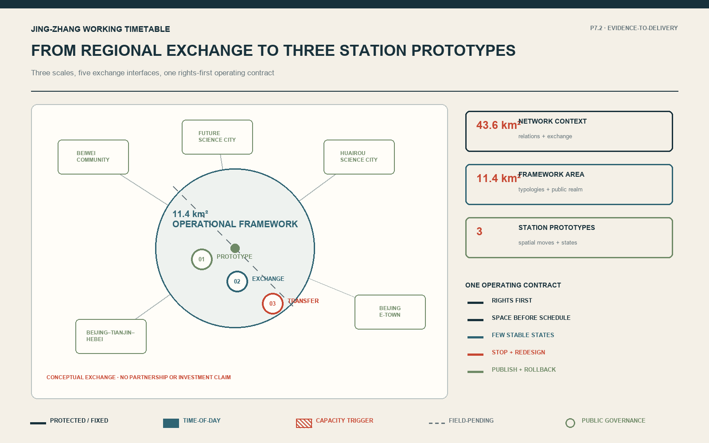
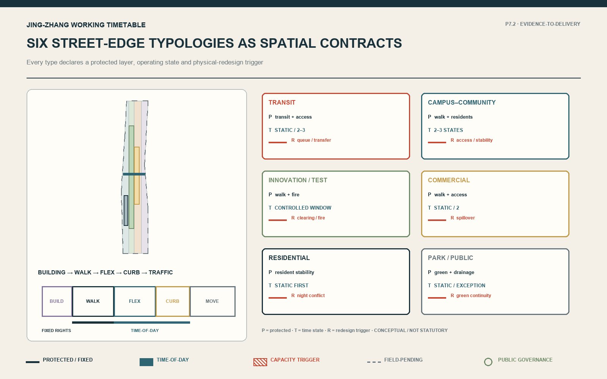
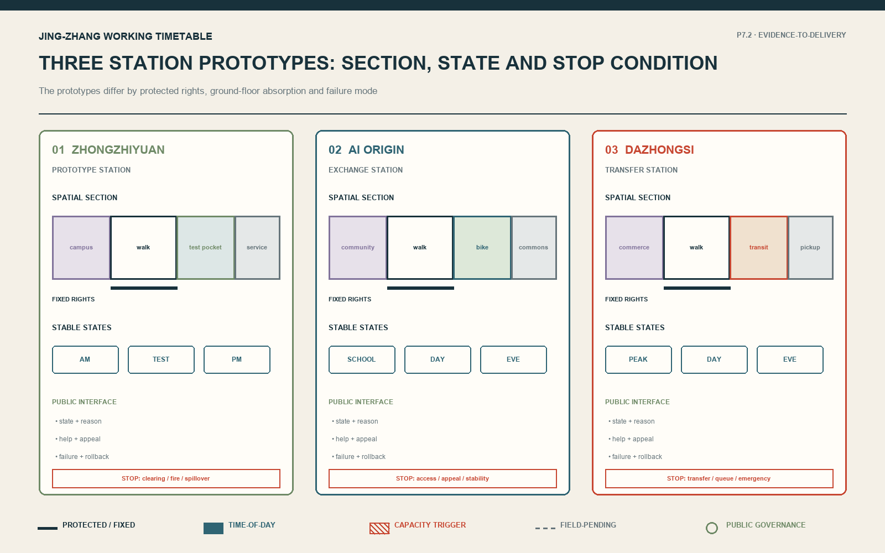
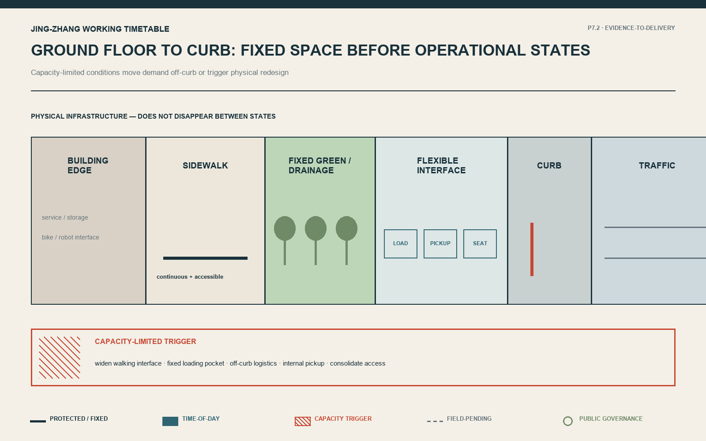
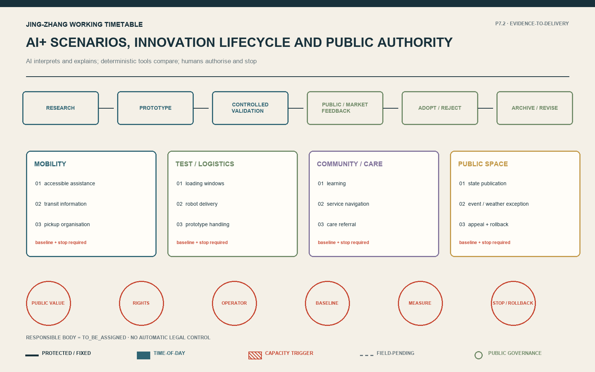
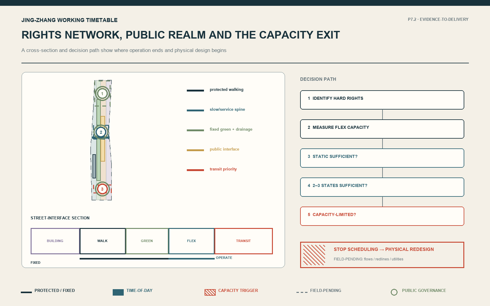
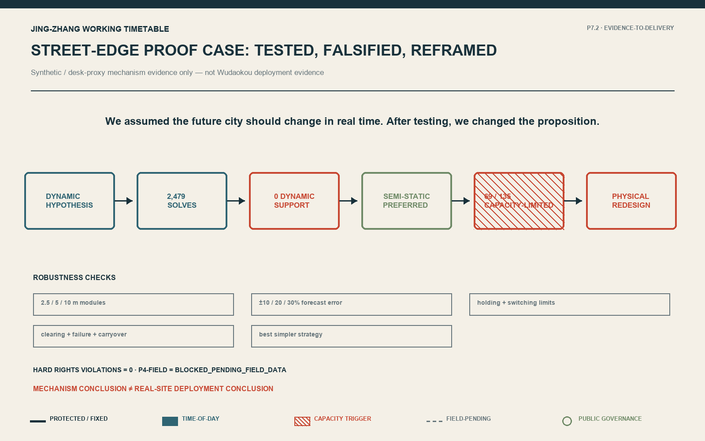
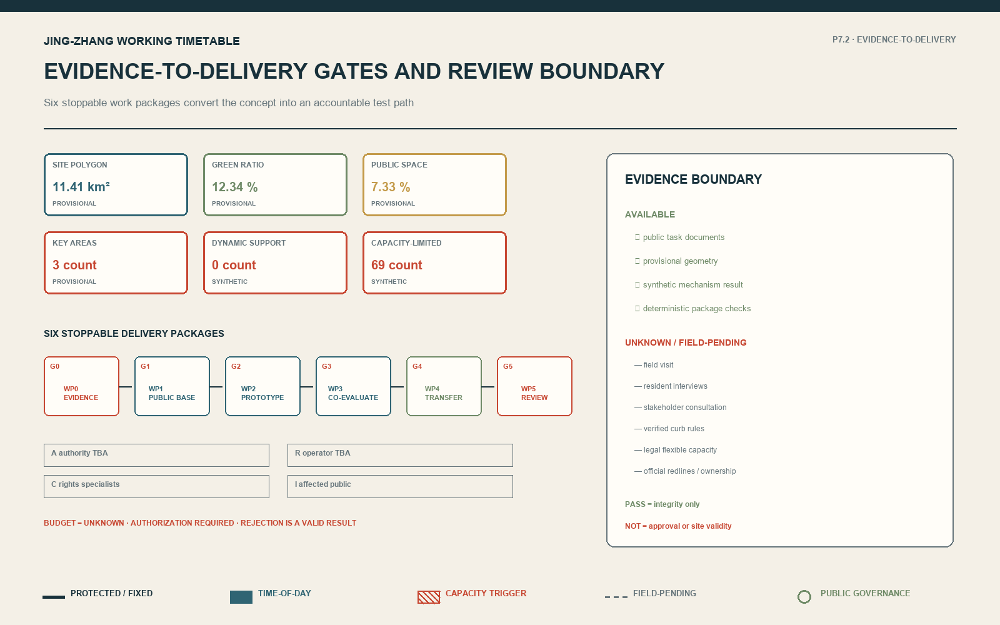

# Jing-Zhang Working Timetable

## Core Concept and Differentiated Mechanism

The differentiated mechanism is not a high-frequency control platform but an auditable urban operating system: protect non-negotiable rights, test physical capacity, retain static operation when sufficient, publish only a few stable states when temporal evidence warrants them, and move to physical redesign, human approval or rollback when capacity or exception limits are exceeded.

**An Evidence-Governed and Reversible Framework for AI-Era Urban Operations**
Method: Evidence-Governed Open City / 有据开放城市

> Rights first, space first; evidence determines change, and disclosure keeps change reversible.

The Jing-Zhang Working Timetable is not a system for AI to take over the city in real time. It is a rules-first, publicly disclosed, bounded, and reversible framework for urban operation. As a design analogy, a working timetable clarifies rights, states, time windows, priorities, and exceptions within limited space; only evidence of meaningful temporal difference justifies publishing a few understandable, stable states. AI interprets scenarios and detects anomalies, deterministic tools compare options, and people authorise and roll back decisions.

**We once assumed the future city should change in real time. After 2,479 optimisation calls, we changed the proposition.** Fully Dynamic operation was tested; under realistic constraints, a few stable states were more robust, and physical design takes over when capacity runs out.

## Design Basis and Source List

The competition announcement and agent taskbook define the assignment. Public urban-design, regulatory-planning, and land-use standards establish professional boundaries. Five external cases are used only to compare incubation, testing, disclosure, adoption, and rejection mechanisms; their scale and performance are not transferred. [source:OFFICIAL-ANNOUNCEMENT] [source:AGENT-TASKBOOK] [standard:MOHURD-URBAN-DESIGN-MEASURES]

Evidence boundary: **field visit = NONE; formal resident interview = NONE; formal stakeholder consultation = NONE; real OD data = NONE; verified legal flexible curb capacity = NONE.** Public/desk evidence is limited; synthetic mechanism evidence is available; **P4-FIELD = BLOCKED_PENDING_FIELD_DATA**. Provisional geometry supports concept discussion and checking, not statutory boundaries. [source:SITE-EVIDENCE-DISCLOSURE] [data:geometry/site_boundary.geojson#PROV-SITE-001]

## Three-Level Scope Framework

In the working-timetable design analogy, the 43.6 km² coordinated research layer is the network context, identifying strategic relationships among universities, parks, communities, transit, commerce, and public space. The 11.4 km² overall-design layer is the operational framework area, defining conceptual street, ground-floor, blue-green, public-space, and innovation-lifecycle typologies. Three key areas are station prototypes for different operating conditions. Announced areas are approximate public-text values; repository polygons are provisional and cannot establish ownership, statutory controls, or engineering precision. The timetable is a design analogy, not a historical-causality claim. [source:OFFICIAL-ANNOUNCEMENT] [metric:site_area_sqm] [depth:three_level_scope_framework]

The hierarchy answers relationships, typologies, and prototypes respectively. Every geometry and area metric must be recalculated when official CAD/GIS, surveys, and planning controls become available.

## Coordinated Research Area: Industry and Future City Research

The minimum innovation lifecycle is **Research → Prototype → Controlled Validation → Public / Market Feedback → Adoption or Rejection → Archive / Revision**. Zhongzhiyuan has a prototype/controlled-validation design role, AI Origin Community a translation/learning/public-feedback role, and Dazhongsi a public/market-adoption-feedback role. All are labelled **PROVISIONAL DESIGN ROLE**, not existing-industry facts. [source:AGENT-TASKBOOK] [source:EU-AI-SANDBOX] [source:AISI]

Three cases provide shared support, testing reports, and independent evaluation mechanisms. [source:STATION-F] [source:AI-VERIFY] [source:AISI]

Two further cases provide public registration and time-limited controlled testing. Their legal standing, scale, funding, results, and local applicability are not transferred. [source:HELSINKI-AI-REGISTER] [source:EU-AI-SANDBOX]

An AI scenario cannot enter the city without public value, an accountable operator, a non-AI alternative, rights protection, a baseline, a measurement window, a stop condition, and rollback. Rejection is a legitimate lifecycle outcome.

### Agent.1–Agent.6 Taskbook Closure

To prevent the six tasks from becoming six unrelated concepts, every response follows one principle: rights first, space first; evidence determines change, and disclosure keeps it reversible.

**Agent.1 | Overall concept and functional coordination.** The Centennial Jing-Zhang Cultural Belt becomes a restrained working-timetable analogy and a public rule interface; the Metropolitan AI Life Experience Belt becomes public services with non-AI alternatives, human help and stop conditions; the AI Convergent Innovation Belt becomes the Research—Prototype—Controlled Validation—Feedback—Adoption or Rejection—Archive / Revision lifecycle. The five functions are assigned to research/prototyping, ecosystem collaboration, AI+ scenarios, public-space operation and transparent governance. The three areas are the three station prototypes. The Zhongguancun Technology Service Wing is only an external relationship for research, talent, capital and professional services; the Xiaoyuehe Scenario Empowerment Wing is only a relationship for public-space and scenario testing. Both remain at the 43.6 km² strategic-relations level, without invented precise boundaries or existing functions. [source:AGENT-TASKBOOK] [depth:three_level_scope_framework]

**Agent.2 | Innovation ecosystem.** The five public cases contribute only shared support, test reporting, independent evaluation, public registers and time-limited testing. Land and space are organised through six street-edge typologies; talent connects through the three station roles; compute and data enter only authorised, auditable facilities; capital is a staged gate, not a commitment; and every scenario needs a baseline, validation, feedback and a rejection exit. Roles assigned to Zhongzhiyuan, AI Origin Community and the Zhongguancun Technology Service Wing are design proposals, not claims about existing industry. [source:STATION-F] [source:AI-VERIFY] [source:AISI]

**Agent.3 | AI+ scenarios.** S01–S10 provide ten scenarios for six analytical personas. S03 time-window loading, S04 controlled robot delivery and S08 commercial pickup organisation are the three industry/service validation scenarios. Each identifies the AI role, non-AI alternative, Hard Rights, human authority, baseline, measurement and stop condition. Xiaoyuehe remains a FIELD_PENDING scenario-empowerment relationship; no unverified precise spatial proposal is generated. [metric:scenario_count] [metric:persona_count]

**Agent.4 | Public space and governance landmarks.** The three landmarks are public governance interfaces first: Zhongzhiyuan Prototype Station publishes controlled experiments and failure logs; AI Origin Exchange Station supports learning, feedback and appeal; Dazhongsi Transfer Station publishes interchange priority, human help and rollback. Their shared component library is limited to state boards, rights ledgers, evidence notes, human help/appeal and rollback archives. The honour display records adopted, rejected and contributed proposals alike; it is not a black-box technology sculpture. [data:geometry/public_space.geojson#PUBLIC-001] [depth:blue_green_public_space]

**Agent.5 | Culture and identity.** Railway right-of-way, timetable, signals, dispatch and maintenance are used only as a design analogy. Zhongguancun innovation culture enters through a lifecycle that permits both testing and rejection; AI culture enters everyday space through published states, evidence labels and accountable human authority. Wayfinding uses lines, time bands, nodes, ledger marks and rollback symbols. It does not claim historical causality or reuse third-party identity. [source:AGENT-TASKBOOK] [standard:MOHURD-URBAN-DESIGN-MEASURES]

**Agent.6 | Long-term operation.** One annual open-city review/demonstration period, quarterly scenario-evidence reviews, monthly developer–resident–operator sessions and continuous state, feedback, incident and rollback logs form the minimum cadence. International communication and attraction publish only auditable cases, failures and open questions. Every activity requires an accountable body, permission, output and stop condition. `RESPONSIBLE_BODY = TO_BE_ASSIGNED`; no organiser, partner or approved event is invented. [data:geometry/phasing.geojson#PHASE-001] [depth:phasing_implementation]

<!-- P7.2:REGIONAL:START -->
### Regional coordination: five exit-capable exchange interfaces

Regional coordination does not mean that partnerships already exist. The relationships below are **conceptual interfaces** at the 43.6 km² strategic-research level. Each is bounded by a public output, two-way feedback, and an exit condition; no campus boundary, agreement, or investment commitment is invented.

| External interface | What may be exchanged | Boundary that cannot be crossed | Entry / exit condition |
|---|---|---|---|
| Beiwei Community | Accessibility, care-referral and community-feedback methods | Does not represent resident views or an existing partnership | Enter only with an authorised contact and accessible participation route; exit if appeals cannot be answered |
| Future Science City | Research—Prototype—Validation method and public test records | Does not transfer institutional roles, performance or resources | Exchange only with a comparable baseline and accountable role; archive when results cannot be reproduced |
| Huairou Science City | Safety evaluation, failure records and human takeover requirements for research prototypes | Does not claim equipment, teams or projects are connected | Discuss only after rights and safety gates close; reject without rollback |
| Beijing E-Town | Industrial validation, logistics interfaces and stop conditions before scaling | Does not constitute industry siting or investment attraction | Discuss transfer only after controlled validation; stop when spillover cannot be controlled |
| Beijing–Tianjin–Hebei | Auditable scenario contracts, interoperability fields and regional-logistics questions | Does not replace regional planning or administrative coordination | Exchange only public reusable fields; pause when authority or definitions conflict |

These interfaces answer “how coordination could work,” not “who has already agreed.” What moves is an auditable method, failure learning, and minimum data fields; institutions, agreements, sites, and resources remain subject to formal coordination. [source:AGENT-TASKBOOK] [depth:three_level_scope_framework]
<!-- P7.2:REGIONAL:END -->

## Overall Design Area: Urban Renewal and Regulatory-Plan-Level Urban Design

Six conceptual interfaces organise the 11.4 km² layer: Transit, Campus–Community, Innovation/Test, Commercial, Residential, and Park/Public-Space Edges. Each protects a fixed layer first, then chooses static management, two or three stable time states, or physical redesign when capacity is insufficient. [data:geometry/land_use.geojson#LU-001] [depth:overall_spatial_structure] [depth:land_use_layout]

The spatial continuum is **Building Edge → Sidewalk → Flexible Interface → Curb → Traffic**. Ground floors should absorb servicing, collection, logistics storage, bicycle parking, and robot interfaces that need not remain on the road. Accessible entrances, trees, drainage, transit platforms, and safety separation remain fixed. No parcel-level demolition, FAR, or height claim is made without redlines, ownership, building surveys, and official controls. [source:SITE-PACKAGE] [source:SITE-EVIDENCE-DISCLOSURE]

## Detailed Design of Key Areas

The prototypes differ because their rights conflicts and failure modes differ. [data:geometry/key_areas.geojson#PROV-KEY-001] [depth:three_key_area_detailed_design]

**Zhongzhiyuan — Prototype Station.** Moves: protect continuous walking/accessibility; place loading, robot docking, and testing in controlled pockets; connect ground floors to a public rule interface. Up to three states: AM commute, daytime test/logistics, PM commute. Unknowns: enterprise logistics, permitting authority, fire and utilities.

**AI Origin Community — Exchange Station.** Moves: stitch campus and community walking; separate tidal bicycle/delivery demand from accessible routes; share ground-floor public services with evening public space without sacrificing resident stability. States: school/commute, daytime community, evening community. Unknowns: resident views, campus boundary, bus and cycling demand.

**Dazhongsi — Transfer Station.** Moves: prioritise metro and bus rights; organise walking connections and bicycle parking; confine loading, ride-hailing, and evening activity to the remaining interface. States: transit peak, daytime commerce, evening commerce. Unknowns: passenger flows, road redlines, servicing, ownership.

## AI Innovation Ecosystem, Personas, and AI+ Scenarios

**Design Personas — Not Survey Respondents.** Six analytical personas are used: wheelchair/mobility-impaired user, resident, employee/researcher/student, delivery/service worker, transit passenger, and public-space visitor. They expose rights and conflicts; they are not a resident sample or validated needs. [source:SITE-EVIDENCE-DISCLOSURE]

Ten scenarios share one contract. Thresholds must follow real baselines; unassigned operators remain `TO_BE_ASSIGNED`:

| ID / scenario | User and place | AI / non-AI alternative | Rights, measurement, stop |
|---|---|---|---|
| S01 Accessible journey assistance | Mobility-impaired user; all interfaces | Explain barrier reports; staffed help / accessible signs | Continuity; FIELD_PENDING; stop on misleading guidance or no handover |
| S02 Transit interchange information | Passenger; Dazhongsi | Explain aggregated disruption; timetable / staff announcements | Transit priority; service-window review; roll back inconsistent information |
| S03 Time-window loading | Worker; Zhongzhiyuan | Cluster demand and propose windows; fixed bay | Access/fire rights; baseline pending; stop unauthorised occupation |
| S04 Controlled robot delivery | Worker; Zhongzhiyuan | Detect anomalies and log tests; manual trolley | Pedestrian priority; limited window; stop without human takeover |
| S05 Open-source learning | Student/public; AI Origin | Explain sources and match events; human guide / catalogue | Privacy/accessibility; feedback review; stop uncorrectable errors |
| S06 Community service navigation | Resident; AI Origin | Navigate published services; desk/telephone | No profiling/discrimination; monthly review; stop failed appeal |
| S07 Care-service referral | Resident; community edge | Search and refer only; staffed hotline | No diagnosis; incident audit; stop clinical-substitution claims |
| S08 Commercial pickup organisation | Passenger/merchant; Dazhongsi | Aggregate pickup pressure; fixed waiting area / staff | Transit rights first; observation window; stop uncontrolled spillover |
| S09 Public state publication | Everyone; all interfaces | Explain current/next state; fixed noticeboard | Comprehensible and appealable; continuous log; roll back false notice |
| S10 Event/weather exception | Visitor/operator; overall area | Summarise public risk; predefined manual plan | Emergency rights first; event review; do not activate without authority |

Scenario evidence is mainly `DESIGN_HYPOTHESIS` or `FIELD_PENDING`; the curb comparison is `SYNTHETIC_TESTED`, not field validation. AI neither invents optimiser values nor autonomously publishes legal rules. [source:AI-VERIFY] [standard:PROJECT-AGENT-OPEN-CALL-TASKBOOK]

## Land Use, Building Scale, and Retain-Renovate-Demolish Strategy

Submission geometry is a minimum conceptual partition used to express interface types and test the contract. Land use partitions the provisional boundary; building footprints are proposals, not surveys. Retain/renovate/demolish is a decision framework—legality, structural safety, cultural value, carbon, and public use must be assessed before professional and statutory decisions. [data:geometry/land_use.geojson#LU-001] [data:geometry/buildings.geojson#BLDG-001] [standard:MNR-LAND-USE-CLASSIFICATION-GUIDE]

Geometry-derived values are labelled `GEOMETRY_DERIVED_PROVISIONAL`. FAR, height, density, setbacks, ownership, demolition, and budget remain `UNKNOWN`. File validation is not professional correctness. [metric:building_footprint_area_sqm] [depth:retain_renovate_demolish]

## Transport, Rail, Municipal Infrastructure, and Public Services

Priority is walking continuity/accessibility, crossing safety, transit, fire/emergency access, and fixed infrastructure. Only residual space can serve loading, pickup, bicycles, or events. Network, rail, and municipal layers are conceptual; redlines, flows, utilities, flood, fire, and permits remain pending. [data:geometry/roads.geojson#ROAD-001] [depth:traffic_rail_slow_parking]

The Street-Edge Proof Case (internally called Curb OS during research) compresses P0–P4. A deterministic optimiser compared Fully Dynamic with simpler strategies under matched synthetic scenarios, negative controls, module sizes, forecast errors, and execution burdens. P4-SIM found **0 structured Dynamic-support regions, 69/135 CAPACITY_LIMITED regions, and SEMISTATIC_SIM_PREFERRED**. This supports one mechanism claim only: do not increase frequency when static or two/three stable time-of-day states capture realistic value; stop scheduling and redesign space when rights plus simultaneous demand exceed capacity. [source:P4-SIM-PROOF] [metric:p4_dynamic_support_regions] [metric:p4_capacity_limited_regions]

## Blue-Green Network, Public Space, and Urban Character

Public space must first be walkable, accessible, and usable without AI. Trees, drainage, continuous green, ramps, and fixed separation do not disappear between states. Approved low-demand states may support seating, events, or park extension. Three public interfaces publish the current and next state, protected rights, experiment evidence, human help, feedback/appeal, and failure/rollback archive. [data:geometry/green_space.geojson#GREEN-001] [data:geometry/public_space.geojson#PUBLIC-001] [depth:blue_green_public_space]

The cultural narrative is a restrained design analogy: railways rely on rights-of-way, timetables, signals, dispatch, and maintenance; AI-era urban operation also needs rights, stable states, controlled transitions, transparent rules, and rollback. This is not historical causality, and technology is not treated as sculpture.

## Renewal Projects, Implementation Policy, and Phasing

Near term: close evidence gaps and prepare reversible tests through official geometry, surveys, accessibility co-design, stakeholder consultation, baselines, and accountable operators. Medium term: after authorisation, build three public rule interfaces and test a few stable states. Long term: review higher-frequency change only if independent evidence shows incremental value. Stop on rights harm, unreliable data, absent responsibility, or failed rollback. [data:geometry/phasing.geojson#PHASE-001] [depth:phasing_implementation]

Minimum operations: annual open review/demonstration, quarterly scenario evidence review, monthly developer–resident–operator session, and continuous rules/incident/feedback/rollback logs. `RESPONSIBLE_BODY = TO_BE_ASSIGNED`; budget is `UNKNOWN`; implementation `REQUIRES_FORMAL_AUTHORIZATION`.

<!-- P7.2:DELIVERY:START -->
### From concept to test: six delivery packages and responsibility contracts

Implementation credibility is not created by inventing agencies or budgets. The proposal defines role contracts only: **A** = competent authority making the lawful final decision (to be assigned); **R** = delivery/operator role selected through a lawful process (to be assigned); **C** = accessibility, transit/traffic, fire, municipal, community, data and legal specialists; **I** = affected publics. Budget remains `UNKNOWN`; only essential resource classes are listed.

| Package | Minimum output and spatial move | A / R / C / I | Permission and resource classes | Baseline and acceptance gate | Stop, recovery and rollback |
|---|---|---|---|---|---|
| WP0 Evidence closure | Replace official geometry; segment-level rights ledger; field/stakeholder gap register | A TBA / R survey team / C rights specialists / I public | Survey permission; surveying, accessibility, traffic, municipal and legal expertise | Every Hard Right confirmed or explicitly unresolved; any unresolved critical right blocks operational testing | Freeze on conflicting evidence; retain current rule and reopen after revision |
| WP1 Public timetable base | Three governance interfaces; paper/offline alternative; state, reason, next state, appeal and rollback log | A TBA / R public-interface operator / C accessibility and data governance / I all users | Public-space and information permission; fabrication, staffed help and logging | Record current rule and staffed-service baseline first; pass accessibility, offline availability and accountability review | Remove variable publishing and restore fixed notice when information conflicts, human takeover fails or appeal breaks |
| WP2 Zhongzhiyuan controlled test | Ground-floor service pocket; fixed walking protection; limited test/loading window | A TBA / R campus operator / C fire, logistics and accessibility / I staff and delivery workers | Campus and road-operation permission; safety staff, clearing, signs and takeover | Matched window against fixed bay/current rule; continue only with zero Hard Rights harm and reviewable failures | Restore static rule after clearing failure, fire conflict, walking encroachment or uncontrolled spillover |
| WP3 AI Origin co-evaluation | Campus–community walking stitch; bicycle separation; feedback/appeal interface | A TBA / R community-service operator / C residents, campus and accessibility specialists / I residents and students | Participation and site permission; facilitation, accessible communication and observation | No demand conclusion before formal resident participation; accept only when access, appeal and non-AI service remain available | Return to fixed community-service mode after residential instability, discrimination or unanswered appeal |
| WP4 Dazhongsi transfer interface | Transit-priority layer; walking/cycling organisation; residual pickup/loading interface | A TBA / R interchange operator / C transit, rail, traffic and commercial servicing / I passengers and traders | Traffic-operation and occupation permission; staffed control, barriers and emergency support | Obtain flow, conflict and spillover baseline first; retain time states only when transfer rights do not decline and spillover is controlled | Restore transit-priority static mode after transfer obstruction, queue spillover, information conflict or emergency obstruction |
| WP5 Annual review and archive | Annual open review; quarterly evidence review; monthly open session; continuous incident/rollback log | A TBA / R independent secretariat / C professional and public representatives / I public | Archive, privacy, meeting and publication rules; records and independent review | Every scenario must expose baseline, result, failure, responsibility and exit; non-recomputable results do not advance | Automatic expiry review; archive/reject without an accountable role, resources, public value or exit condition |

The packages follow **G0 Evidence → G1 Rights → G2 Physical Capacity → G3 Controlled Operation → G4 Public Review → G5 Adoption or Rejection**. Any package may stop at the previous gate. Non-deployment and rejection are valid results; number of deployments is not a success metric. [data:geometry/phasing.geojson#PHASE-001] [depth:renewal_project_list] [depth:phasing_implementation]

The empty `constraints.geojson` collection is intentional evidence disclosure: no verified redline, utility, fire, ownership or curb-rule constraint can yet be legally spatialised. It is a closure gap, not an existing constraints map; related design judgments now cite populated conceptual road, public-space and building layers plus the evidence-gap register.
<!-- P7.2:DELIVERY:END -->

## Metrics, Area Recalculation, and Compliance Matrix

Metrics separate provisional geometry, synthetic mechanism results, and unknown controls. Approximate announced areas explain scope; submitted polygon calculations check topology only. [metric:site_area_sqm] [metric:key_area_count]

The P4 values 0 and 69/135 are synthetic structured regimes, not people, performance, or deployment results. [metric:p4_capacity_limited_fraction] [depth:metrics_recalculation]

PASS means artifact integrity, syntax consistency, and deterministic checks only. It does not mean planning validity, social legitimacy, site correctness, approval, or acceptance. Task–chapter–layer–metric–source mapping is in `compliance_matrix.json`; standards and gaps are in the other matrices.

## Risk, Copyright, and Compliance

The central risk is certainty without field, accountable actors, or official conditions. Exact boundaries, redlines, ownership, building surveys, utilities/fire, real OD, accessibility co-design, resident and institutional views, budgets, operators, and permits remain open. Key-area roles, scenarios, and spatial moves are conceptual proposals or field-pending hypotheses. [source:SITE-EVIDENCE-DISCLOSURE] [source:SITE-EVIDENCE-DISCLOSURE] [depth:risk_missing_data]

AI generated text, structure, original programmatic figures, and offline pages. The human selected the problem direction, judged gates, accepted/rejected pivots, and authorises submission. AI does not replace planners, authorities, engineers, or participation. No remote font, tile, script, tracker, or unauthorised web image is packaged.

## References

- Competition announcement, agent taskbook, and repository registry [source:OFFICIAL-ANNOUNCEMENT] [source:AGENT-TASKBOOK] [source:SOURCE-REGISTRY]
- Public urban-design and regulatory-planning standards [standard:MOHURD-URBAN-DESIGN-MEASURES] [standard:MOHURD-CONTROL-DETAILED-PLANNING] [source:SOURCE-REGISTRY]
- Public land-use classification guide [standard:MNR-LAND-USE-CLASSIFICATION-GUIDE] [source:SOURCE-REGISTRY]
- Official pages of STATION F, IMDA AI Verify, and UK AISI [source:STATION-F] [source:AI-VERIFY] [source:AISI]
- Official pages of the Helsinki AI Register and EU AI sandboxes [source:HELSINKI-AI-REGISTER] [source:EU-AI-SANDBOX]
- Bounded Curb OS P4-SIM proof summary [source:P4-SIM-PROOF]
- Full uses, limitations, access dates, and licensing notes are in `sources.json`. [source:SOURCE-REGISTRY]
