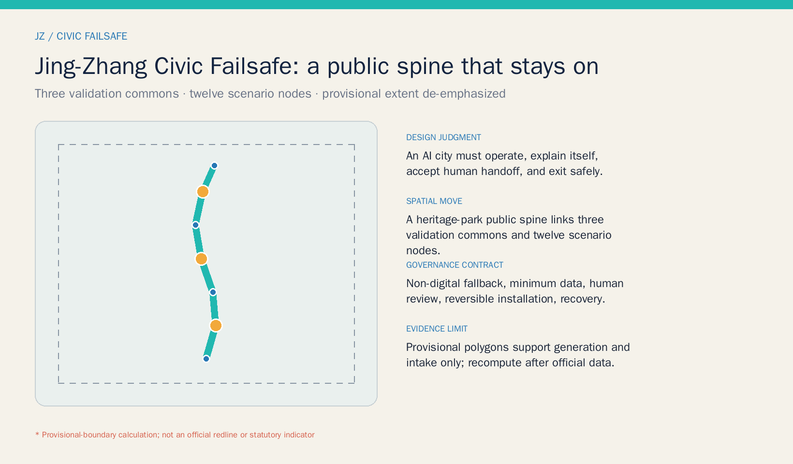
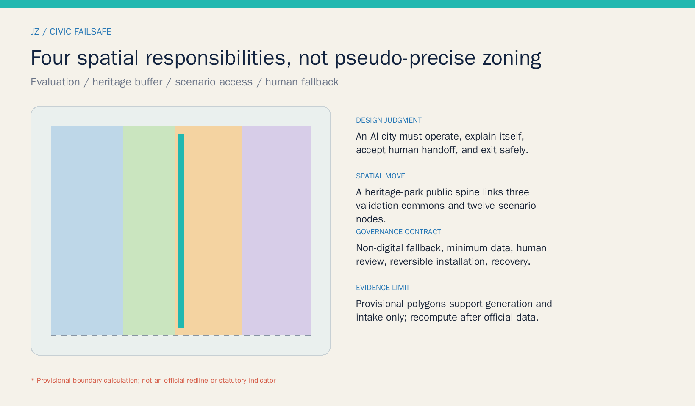
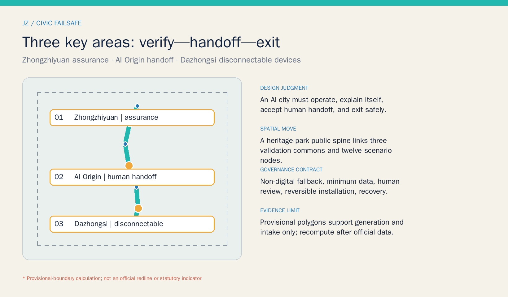
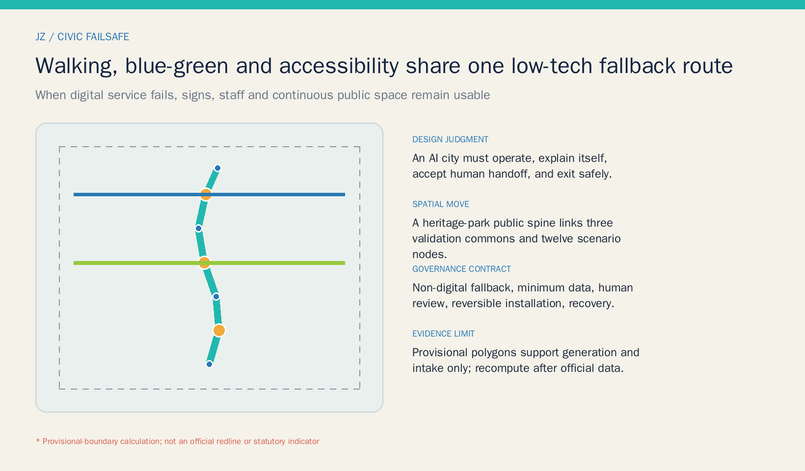
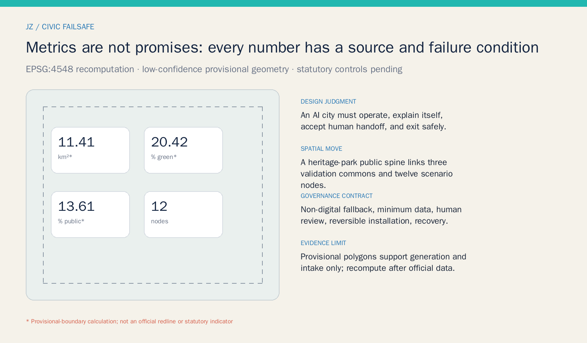

# JING-ZHANG CIVIC FAILSAFE

> An AI-oriented city must remain useful when a model is uncertain, a network goes down, a person declines consent, or a device reaches end of life. This proposal translates “testable, legible, handoff-ready, and safely exitable” into a continuous public-space and service protocol along the Jing-Zhang Railway Heritage Park.

## Design Basis and Source List

The proposal separates three evidence classes. The official announcement and cleared taskbook establish project tasks, textual scope descriptions, and positioning. Laws and professional references guide urban-design, accessibility, and AI-governance judgment. Repository provisional polygons support generation, visualization, and intake checks only. No web image, commercial map, or news diagram is used to infer a boundary; benchmark cases remain background and never enter site-area, ownership, or engineering claims. [source:OFFICIAL-ANNOUNCEMENT] [source:AGENT-TASKBOOK]

Official polygons for the overall and three key areas, regulatory controls, road redlines, existing buildings, ownership, heritage controls, utilities, and fire constraints remain unavailable. EPSG:4548 recomputations are therefore low-confidence provisional design quantities, while FAR, building height, and statutory green ratio stay pending. Once official attachments arrive, every dependent geometry, metric, figure, and drawing must be recomputed. [source:BOUNDARY-SOURCE] [depth:existing_conditions_diagnosis]

## Three-Level Scope Framework

The approximately 43.6-square-kilometre Coordinated Research Area asks how the Three Zones and Two Wings can share assurance, talent services, scenario access, and governance capacity. The approximately 11.4-square-kilometre Overall Design Area organizes one civic-failsafe walking spine, three cross-links, and phased renewal. The Key-Area Detailed Design Area focuses on provisional Zhongzhiyuan, Beijing AI Origin Community, and Dazhongsi areas, deepening a sequence of “verify—handoff—exit.” Strategy narrows into a spatial network and auditable nodes without treating rough rectangles as urban morphology. [data:geometry/site_boundary.geojson#SITE-001] [depth:three_level_scope_framework]

`site_area_sqm` is the projected area of the submitted provisional polygon. It does not replace the announced approximate area or an official boundary. Green and public-space ratios demonstrate internal consistency only. An official-boundary update triggers recalculation of all nine GeoJSON files, metrics, five figures, A3/A0 documents, and offline pages. [metric:site_area_sqm] [source:BOUNDARY-SOURCE]

## Coordinated Research Area: Industry and Future City Research

The name “JING-ZHANG CIVIC FAILSAFE” translates railway signals, switches, and backup systems into a civic ethic for urban AI. Its identity is an open ren-shaped rail pair with a human-handoff point: cyan marks the continuous public spine, amber marks decisions that require a person, and a dashed frame marks provisional geometry. Signage uses Chinese, English, symbols, and non-screen alternatives without corporate marks or portraits. [standard:PROJECT-AGENT-OPEN-CALL-TASKBOOK] [depth:overall_spatial_structure]

The Centennial Jing-Zhang Cultural Belt retains the memory of systems being built and maintained. The Metropolitan AI Life Experience Belt lets residents see data purposes and choose a person. The AI Integrated Innovation Belt provides closable, reviewable testing space. Five functions form a research—assurance—access—service—governance loop: Zhongzhiyuan emphasizes full-stack assurance; AI Origin emphasizes talent and civic-service handoff; Dazhongsi emphasizes disconnectable devices and AI-native services; the Zhongguancun wing supplies compliance and conversion; the Xiaoyue River wing supplies low-risk civic scenarios. [source:AGENT-TASKBOOK] [data:geometry/land_use.geojson#LU-001]

Six international cases are background leads only. Singapore AI Verify suggests a public-facing assurance interface; Helsinki and Amsterdam registers suggest visible purpose, responsibility, and feedback; NIST AI RMF frames risk as a continuous cycle; London Olympic legacy work asks event infrastructure to become lasting community value; the discontinued Sidewalk Toronto project warns that civic technology needs clear public authorization and an exit path. None proves Jing-Zhang performance or site conditions. The transferable mechanisms are an assurance desk, register wall, human handoff, reversible installation, and exit review. [source:CASE-SG-AI-VERIFY] [source:CASE-HELSINKI-REGISTER] [source:CASE-SIDEWALK-LESSON]

## Overall Design Area: Urban Renewal and Regulatory-Plan-Level Urban Design

The spatial structure is “one spine, three commons, two wing interfaces, twelve nodes.” The heritage-park civic-failsafe spine is the backbone. Three validation commons address model assurance in the north, civic-service handoff in the middle, and disconnectable devices in the south. Wing interfaces connect technology services and Xiaoyue River scenarios. Twelve nodes host testing, service, culture, and landmarks. Four land-use partitions cover the provisional boundary completely, but describe spatial responsibilities rather than statutory rezoning. [data:geometry/land_use.geojson#LU-002] [standard:MNR-LAND-USE-CLASSIFICATION-GUIDE]

Renewal follows “retain and verify—low-impact adapt—reversibly add—build only after conditions.” Near-term actions are rules, wayfinding, staff training, and removable components. Medium-term work adapts public space and service interfaces after ownership and heritage checks. Construction requiring planning or engineering review remains long-term. The three building footprints are service placeholders, not surveyed outlines, storeys, or demolition decisions. [data:geometry/buildings.geojson#BLDG-002] [depth:retain_renovate_demolish]

FAR, height, statutory building coverage, setbacks, and underground space remain pending official controls. The conceptual footprint ratio checks package geometry only. Infrastructure strategy favors edge processing, minimum sensing, manual recovery after shutdown, auditable logs, and distributed resilience, while capacity, utilities, fire access, and drainage require specialist verification. [standard:MOHURD-CONTROL-DETAILED-PLANNING] [depth:development_intensity_controls]

## Detailed Design of Key Areas

**Zhongzhiyuan AI Independent Innovation Acceleration Area—Assurance Commons.** A model check-up station, street digital-twin sandbox, legible signal beacon, and garden-like meeting spaces create a pre-public testing sequence. Every system documents data provenance, failure modes, bias, human handoff, and removal. Existing-space reuse and removable test pavilions come first. The polygon is provisional and supports directional design only. [data:geometry/key_areas.geojson#PROV-KEY-001] [depth:three_key_area_detailed_design]

**Beijing AI Origin Community—Human-Handoff Commons.** A staffed handoff desk, offline civic kiosk, older-adult assistance point, and startup compliance clinic form a conceptual five-minute service network. People receive an equivalent route without a smart device; staff confirm high-risk outputs, and logs retain only necessary fields. Campus, park, and station walking links remain directional until road, ownership, and accessibility surveys exist. [data:geometry/key_areas.geojson#PROV-KEY-002] [source:BARRIER-FREE-LAW]

**Dazhongsi AI Industry Cluster—Disconnectable Device Commons.** A disconnectable-device lab, After-AI Memory Hall, and accessible south-gateway link test whether equipment can become ordinary civic infrastructure after network, model, or vendor exit. Community Issue #1029 flags a possible offset in the provisional polygon, so this proposal makes no metro-quadrant engineering, parcel, demolition, or investment claim. Verify location before deepening. [data:geometry/key_areas.geojson#PROV-KEY-003] [source:KEY-AREA-SOURCE]

## AI Innovation Ecosystem, Personas, and AI+ Scenarios

Six personas organize service obligations. Researchers need repeatable assurance and compliance support. Startups need affordable scenario entry and failure review. Residents and carers need notice, refusal, and a human route. Older and disabled people need continuous accessibility and non-digital alternatives. Public-service staff need explicit handoff authority and training. Visitors and young people need sourced cultural interpretation without passive collection. Each persona receives a normal route, a refusal route, and a system-failure route. [source:OLDER-ADULT-TECH] [standard:PROJECT-AGENT-OPEN-CALL-TASKBOOK]

| Scenario card | Place and users | Data, human review, and exit |
| --- | --- | --- |
| 01 Model Check-Up Station (testing) | Zhongzhiyuan; R&D and assurance teams | Cleared test data, model cards, no public entry after failure |
| 02 Street Digital-Twin Sandbox (testing) | North commons; planning and operations | Synthetic or aggregate data, professional review, deletion after test |
| 03 Accessible Mobility Test Gate (testing) | Public spine; wheelchair and blind users, carers | Voluntary trial and on-site safety staff with stop authority |
| 04 Disconnectable Device Lab (testing) | Provisional Dazhongsi; device teams | Offline, model-switch, and shutdown drills; restore ordinary use |
| 05 Human Handoff Desk | AI Origin; all members of the public | Minimum service fields; staff decide high-risk matters |
| 06 Offline Civic Service Kiosk | Community edge; people without smartphones | Paper, phone, and staff routes; no mandatory biometrics |
| 07 Older-Adult Assistance Point | Spine nodes; older residents | Staff and large-print service; refusal never reduces service level |
| 08 Startup Compliance Clinic | Wing interface; small teams | Risk checklist, not approval; specialist human review |
| 09 Open-Source Contributors' Platform | Heritage park; developers and public | Rights-cleared contributions, correction, withdrawal, and versions |
| 10 Jing-Zhang Memory Guide | Culture node; visitors and youth | Sourced content, no face recognition, offline guide available |
| 11 Walking Break Diagnosis | Public spine; commuters and visitors | Aggregate counts plus field audit, no personal trajectory tracking |
| 12 Event-Day Service Orchestration | Three commons; operators and volunteers | AI proposes only; responsible person confirms; temporary system closes |

The spatial layer locates all twelve nodes and identifies four testing and validation scenarios. Before any launch, operators must answer who is responsible, what is collected, retention length, correction routes, shutdown authority, and how the place works after exit. [data:geometry/constraints.geojson#NODE-004] [metric:testing_scenario_count]

## Land Use, Building Scale, and Retain-Renovate-Demolish Strategy

Four complete partitions carry research assurance, heritage civic buffer, industry scenario access, and community human fallback. Shared cut lines avoid gaps and overlaps. Their areas are conceptual ratios within a provisional boundary and must be replaced after official land-use, parcel, and ownership data arrive. “Civic buffer” is not approved parkland, and “scenario access” is not approved commercial rezoning. [data:geometry/land_use.geojson#LU-004] [depth:land_use_layout]

Three placeholders host an assurance pavilion, human-handoff commons, and exit-and-memory hall. The decision order is survey history, structure, fire safety, ownership, and active use; retain reusable fabric, adapt with low disturbance, and consider new construction only after planning and engineering review. No building-specific demolition decision is made. Height, total floor area, and statutory FAR remain pending. [data:geometry/buildings.geojson#BLDG-003] [metric:building_footprint_area_sqm]

Character combines railway construction logic with visible maintenance. Structure, services, operating status, and staffed help points should remain legible, avoiding black-box envelopes and theatrical science-fiction form. Roofs, color, lighting, and signage need later heritage, landscape, and light-environment review. [standard:MOHURD-URBAN-DESIGN-MEASURES] [depth:height_massing_character]

## Transport, Rail, Municipal Infrastructure, and Public Services

The civic-failsafe spine combines walking, cycling, accessibility, cultural interpretation, and service inspection as one backup route. AI Origin and south-gateway cross-links provide east–west connection. Digital guidance may overlay the system, but continuous paving, tactile/high-contrast signs, seating, lighting, staffed inquiry, and emergency contact must work independently. Alignments are concepts, not road redlines or engineering sections. [data:geometry/roads.geojson#ROAD-001] [depth:traffic_rail_slow_parking]

Infrastructure uses isolatable units. Turning off a scenario node must not disable lighting, fire systems, water, or basic wayfinding. Generative systems do not directly execute high-risk controls; edge processing and purpose-based data transfer are preferred. Transit integration, parking, logistics, utility capacity, drainage, and emergency access require official specialist inputs. [source:GENAI-MEASURES] [depth:municipal_new_infrastructure]

The staffed handoff commons links community assistance, health navigation, cultural guidance, enterprise compliance, and event service. AI advice displays source, uncertainty, and accountable person; paper, phone, and in-person routes remain available. [source:BARRIER-FREE-LAW] [standard:PROJECT-AGENT-OPEN-CALL-TASKBOOK]

## Blue-Green Network, Public Space, and Urban Character

The heritage civic-buffer greenway and continuous validation commons run together. The greenway supplies shade, ecology, and low-tech passage; the commons supports removable testing, public notice, and staffed service. Their calculated ratios check network continuity within the same provisional geometry; they are not statutory green ratios or a park implementation boundary. [data:geometry/green_space.geojson#GREEN-001] [metric:public_space_ratio]

Three AI pilgrimage landmarks are public evidence of responsibility, not entertainment props. The Legible Signal Beacon shows scenario status and the responsible party. The Open-Source Contributors' Platform records rights-cleared code, data, and community work. The After-AI Memory Hall preserves failures, removals, and institutional improvements. No corporate logo or portrait is required, and locations remain subject to heritage, green-space, and safety review. [metric:landmark_count] [depth:blue_green_public_space]

The cultural story runs “from mechanical signals to civic-intelligence signals.” The Jing-Zhang railway represents legible engineering and maintenance communities; Zhongguancun represents open experimentation and translation; AI culture adds notice, audit, handoff, and exit. Wayfinding distinguishes facts, conceptual recommendations, and pending data, and international copy consistently uses JING-ZHANG without claiming official endorsement. [source:OFFICIAL-ANNOUNCEMENT] [standard:MOHURD-URBAN-DESIGN-MEASURES]

## Renewal Projects, Implementation Policy, and Phasing

| Project | Gate | Dependency and exit condition |
| --- | --- | --- |
| F-01 Scenario register and handoff rules | Near term | Public template, owner, complaint and shutdown routes; independent of construction |
| F-02 Accessibility audit of public spine | Near term | Field audit with disabled and older participants; no trajectory tracking |
| F-03 Three lightweight validation commons | Near term | Ownership and safety permissions; removable installations and closable tests |
| F-04 Civic service interface adaptation | Medium term | Existing-building, fire, and heritage checks; retain non-digital route |
| F-05 Two-wing service interfaces | Medium term | Operator and data protocol; no assumed vendor |
| F-06 Construction deepening and governance | Long term | Official boundary, controls, utilities, transport, and funding process |

The three phases are decision gates, not promised schedules. Near term establishes rules and lightweight pilots. Medium term adapts public space and services. Long term deepens renewal only after formal conditions. Every phase supports continue, modify, pause, or exit; a failed pilot restores place and basic service before any restart decision. [data:geometry/phasing.geojson#PHASE-001] [depth:phasing_implementation]

The annual concept is “four seasons, four checks”: spring publishes civic problems and pairs developers; summer tests accessibility and heat resilience; autumn hosts an open assurance week; winter archives failure and exit. Teams move from an open problem to a sandbox, safety/privacy/human review, and only then a time-limited public pilot. Events, budgets, recruitment, and operators are reference mechanisms, not confirmed arrangements. [source:AGENT-TASKBOOK] [depth:renewal_project_list]

## Metrics, Area Recalculation, and Compliance Matrix

Three metric families remain distinct. Spatial consistency covers provisional site area and conceptual green/public-space area and ratios. Task delivery covers twelve nodes, four testing scenarios, three landmarks, and three gates. Statutory controls—FAR, height, and statutory green ratio—remain pending. Every known number has a source file, formula, confidence, and assumptions, while the visual page exposes matching `data-metric` values. [metric:scenario_node_count] [depth:metrics_recalculation]

Conceptual green and public-space ratios ask whether a low-tech fallback route is continuous and staffed service has space; they are not official targets. The building footprint ratio reflects only three conceptual placeholders. Nine geometry files, 23 task responses, six standard records, and fifteen depth items form the machine-audit layer. [metric:green_ratio] [metric:public_space_ratio]

## Risk, Copyright, and Compliance

The principal spatial risk is provisional-boundary error, especially the community concern about Dazhongsi. The principal governance risk is removing a staffed route in the name of convenience. The principal implementation risk is presenting a pilot as a construction promise. Controls are low-contrast provisional geometry, refusal and shutdown for every scenario, and professional/legal review for every physical intervention. Automated validation, scoring, or community support never equals approval. [source:KEY-AREA-SOURCE] [depth:risk_missing_data]

Text, GeoJSON, figures, PDFs, and offline pages were generated in this run. System WenQuanYi Zen Hei is a local PNG build dependency and is not redistributed; PDFs use ReportLab font mechanisms. Benchmark entries cite factual titles and links without copying maps, logos, images, or restricted text. Rights, model disclosure, and generation boundaries are recorded in the copyright statement. [source:SOURCE-REGISTRY] [standard:PROJECT-AGENT-OPEN-CALL-TASKBOOK]

## References

1. Haidian Branch, Beijing Municipal Commission of Planning and Natural Resources, project pre-announcement, 2026.
2. Rights-cleared Agent Open-Call Taskbook excerpt, 2026.
3. Local snapshots of the Measures for Urban Design Administration and regulatory detailed-planning procedures.
4. Ministry of Natural Resources land-use classification guide, 2023.
5. Barrier-Free Environment Construction Law and Interim Measures for Generative AI Services.
6. Repository source registry and provisional-boundary note; benchmark URLs are recorded in `sources.json`. [source:SITE-PACKAGE] [source:SOURCE-REGISTRY]
