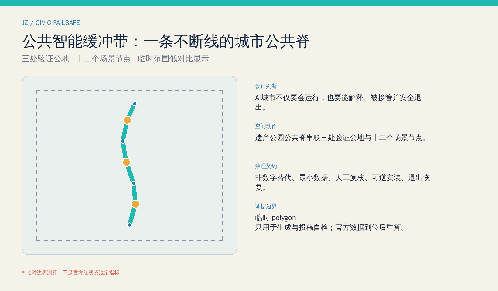
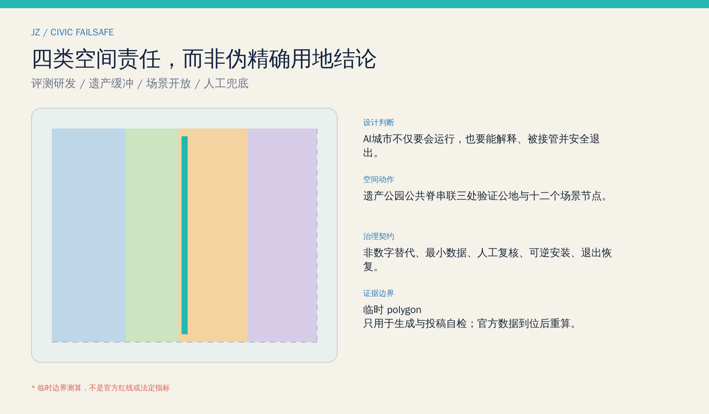
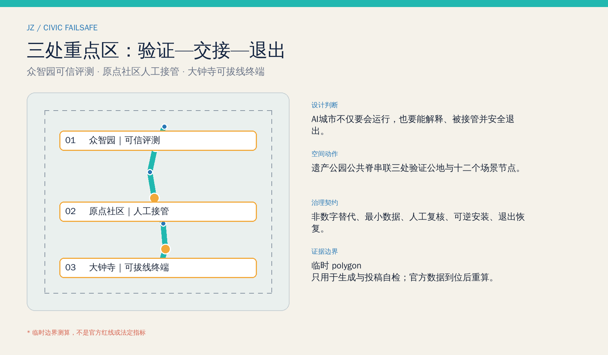
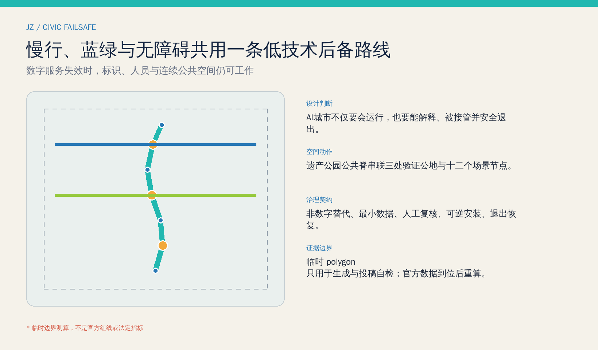
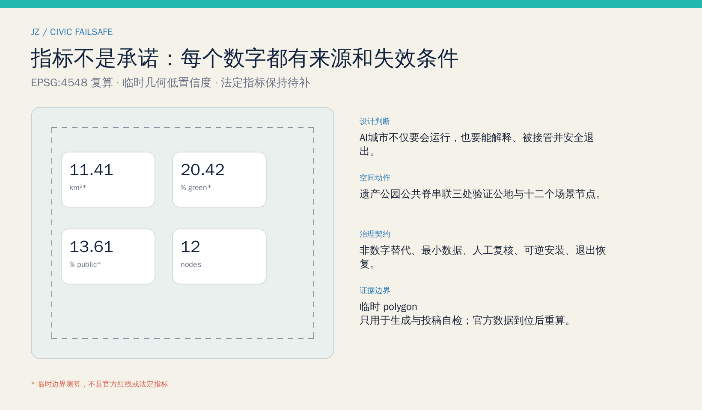

# 京张公共智能缓冲带

> 一座面向 AI 的城市，不只要在模型正常时聪明，也要在模型不确定、网络中断、公众拒绝授权或设备退役时继续服务人。本方案把“可试验、可解释、可接管、可退出”转译为沿京张遗址公园连续可达的公共空间与服务协议。

## 设计依据与资料清单

方案首先区分三类证据：公告与清权任务书支撑项目任务、范围文字和三大定位；专业法规与标准支撑城市设计、无障碍和 AI 治理的判断边界；仓库临时 polygon 只支撑生成、图示和投稿自检。没有一张网络图片、商业地图或新闻示意图被用来推定红线，案例资料也只作背景比较，不进入本站面积、权属或工程结论。[source:OFFICIAL-ANNOUNCEMENT] [source:AGENT-TASKBOOK]

正式资料仍缺总体与三处重点区官方 polygon、控规指标、道路红线、现状建筑、权属、文保控制、市政和消防条件。因此本包把由 EPSG:4548 复算的数值标成低置信度临时设计量，把容积率、建筑高度和法定绿地率保留为“待正式数据补齐”；正式附件到位后，必须从边界、用地、建筑、绿地、公共空间到图件逐层重算。[source:BOUNDARY-SOURCE] [depth:existing_conditions_diagnosis]

## 三层范围工作框架

统筹研究范围采用公告约 43.6 平方公里的文字范围，讨论“三区两翼”如何共享可信评测、人才服务、场景开放与治理能力；总体设计范围采用约 11.4 平方公里的任务尺度，组织一条公共智能缓冲慢行脊、三条接驳横联和分期更新；重点区域范围聚焦众智园、北京 AI 原点社区和大钟寺三个临时片区，分别深化“验证—交接—退出”。三层范围由战略问题、空间网络到可复核节点逐级收敛，而不是把临时矩形当作真实城市肌理。[data:geometry/site_boundary.geojson#SITE-001] [depth:three_level_scope_framework]

提交边界中 `site_area_sqm` 是临时 polygon 的投影面积，不替代公告约值，更不替代官方红线；绿地和公共空间比例只说明本轮概念几何内部的一致性。当官方边界到位，重算触发器将同步更新九个 GeoJSON、指标、五张图、A3/A0 与离线页面。[metric:site_area_sqm] [source:BOUNDARY-SOURCE]

## 统筹研究范围产业与未来城市研究

总体名称“京张公共智能缓冲带 / JING-ZHANG CIVIC FAILSAFE”把铁路的信号、道岔与后备系统转化为公共智能时代的城市伦理。标识方向是一组不闭合的人字轨与人工接管点：青色连续线表示公共脊，琥珀节点表示需要人作最终判断的交接点，虚线外框表示临时边界。品牌不得使用企业商标或人物肖像，导视必须同时有中文、英文、图形和非屏幕版本。[standard:PROJECT-AGENT-OPEN-CALL-TASKBOOK] [depth:overall_spatial_structure]

三大定位被重新解释为一条连续叙事：百年京张文化带保存“系统如何被建设与维护”的记忆；都市 AI 生活体验带让居民看到数据用途并随时选择人工服务；AI 融合创新带为模型、机器人和公共服务提供可关闭、可复核的验证空间。五大功能则形成“研发—评测—开放—服务—治理”闭环：众智园侧重全栈可信评测，北京 AI 原点社区侧重人才与公共服务交接，大钟寺侧重智能终端和智能原生业态的可拔线验证；中关村科技服务翼提供合规与转化，小月河场景赋能翼提供低风险公共场景。[source:AGENT-TASKBOOK] [data:geometry/land_use.geojson#LU-001]

六个国际案例只作背景线索：新加坡 AI Verify 提醒“评测工具需要公共接口”；赫尔辛基与阿姆斯特丹算法登记提醒“公众应看到用途、责任人与反馈口”；NIST AI RMF 提醒“风险管理是持续循环”；伦敦奥林匹克遗产更新提醒“活动设施须转为长期社区价值”；Sidewalk Toronto 的终止经验提醒“城市科技项目必须获得清晰公共授权并保留退出路径”。这些案例不证明京张的成效或空间条件，只被转译为评测台、登记墙、人工接管台、可逆设施和退出评审五类机制。[source:CASE-SG-AI-VERIFY] [source:CASE-HELSINKI-REGISTER] [source:CASE-SIDEWALK-LESSON]

## 总体设计范围城市更新与控规深度城市设计

总体结构为“一脊、三公地、两翼接口、十二节点”。一脊是遗址公园公共智能缓冲慢行脊；三处验证公地对应北段模型可信评测、中段公共服务人工交接、南段智能终端可拔线；两翼接口分别连接科技服务与小月河场景网络；十二节点容纳评测、服务、文化与地标。四类用地分区完整覆盖临时边界，但它们表达空间责任，不是法定用地调整。[data:geometry/land_use.geojson#LU-002] [standard:MNR-LAND-USE-CLASSIFICATION-GUIDE]

城市更新优先采用“保留并验证—低扰动适配—可逆加装—条件满足后新建”的顺序。近期只做规则、导视、人员培训与可撤装设施；中期在权属和文保核实后适配公共空间和服务界面；长期才讨论需控规与工程论证的建设。三处建筑基底是服务空间占位，不代表真实建筑轮廓、层数或拆除清单。[data:geometry/buildings.geojson#BLDG-002] [depth:retain_renovate_demolish]

容积率、高度、建筑密度法定值、退线和地下空间全部待正式控制条件；概念建筑基底率只用于检查本方案自身几何，没有审批含义。市政策略采用边缘计算、最小化感知、设备断电后人工服务恢复、日志留存和分布式韧性接口，但容量、管线与消防路径需专项核实。[standard:MOHURD-CONTROL-DETAILED-PLANNING] [depth:development_intensity_controls]

## 重点区域详细设计

**众智园 AI 自主创新加速区：可信评测公地。** 在临时重点区内提出模型体检站、街道数字孪生沙盒、可解释信号塔和园林化交往空间。研发成果进入公共场景前，先完成数据来源、失效模式、偏差、人工接管和撤场清单；建筑策略以既有空间复用和可撤装测试亭为先。片区 polygon 为临时约束，只能指导方向性设计。[data:geometry/key_areas.geojson#PROV-KEY-001] [depth:three_key_area_detailed_design]

**北京 AI 原点社区：人工交接公地。** 以人工接管台、离线公共服务驿站、老年友好协助点和创业合规诊所构成 5 分钟概念服务网络。居民不使用智能终端也能获得同等入口；高风险输出需现场人员确认，服务日志按最小必要原则留存。校区、园区与站点联系只作步行方向建议，须待道路、权属和无障碍现状调查。[data:geometry/key_areas.geojson#PROV-KEY-002] [source:BARRIER-FREE-LAW]

**大钟寺 AI 产业聚集区：可拔线终端公地。** 提出智能终端可拔线实验室、退出之后纪念馆与南门户接驳横联，测试设备在网络、模型或供应商退出后能否转为普通设施。社区 Issue #1029 已指出临时 polygon 质心可能偏离大钟寺站，因此本方案不据此提出地铁四象限工程、地块拆改或投资承诺；官方范围到位后先校址再深化。[data:geometry/key_areas.geojson#PROV-KEY-003] [source:KEY-AREA-SOURCE]

## AI 创新生态、人才画像与 AI+ 场景

六类画像分别是：研究人员需要可重复评测与合规支持；初创团队需要低成本场景准入与失败复盘；居民和照护者需要知情、拒绝与人工服务；老年人与残障人士需要连续无障碍和非数字替代；公共服务人员需要清晰接管权限与培训；访客和青少年需要可信文化导览而不是被动采集。每类画像都有“正常路径 + 拒绝授权路径 + 系统失效路径”。[source:OLDER-ADULT-TECH] [standard:PROJECT-AGENT-OPEN-CALL-TASKBOOK]

| 场景卡 | 空间与对象 | 数据、人工复核与退出 |
| --- | --- | --- |
| 01 模型体检站（测试验证） | 众智园；研发团队、评测人员 | 使用清权测试集；发布模型卡；不通过即不进入公共场景 |
| 02 街道数字孪生沙盒（测试验证） | 北段验证公地；规划与运维团队 | 使用合成或聚合数据；专业人员复核；试验结束删除数据 |
| 03 无障碍出行验证门（测试验证） | 公共脊；轮椅、视障、照护者 | 自愿测试与现场观察；人工安全员可立即停止 |
| 04 智能终端可拔线实验室（测试验证） | 大钟寺临时片区；设备团队 | 断网、换模、停服演练；必须恢复为普通设施 |
| 05 人工接管台 | 原点社区；所有公众 | 仅记录服务所需最小字段；人工决定高风险事项 |
| 06 离线公共服务驿站 | 社区界面；老年人与无智能机人群 | 纸质/电话/现场入口长期并存，不强制生物识别 |
| 07 老年友好协助点 | 公共脊节点；老年人 | 屏幕外有人员与大字版，拒绝授权不降低服务等级 |
| 08 创业合规诊所 | 两翼接口；初创团队 | 给出风险清单而非审批结论；专业律师与主管人员复核 |
| 09 开源贡献月台 | 遗址公园；开发者与公众 | 只展示获授权贡献；提供纠错、撤回与版本记录 |
| 10 京张记忆导览站 | 文化节点；访客与青少年 | 内容来源可追溯；无脸部识别；可切换纯离线导览 |
| 11 公园慢行断点诊断 | 公共脊；通勤与游憩人群 | 聚合计数结合人工踏勘，不追踪个人轨迹 |
| 12 活动日服务编排 | 三公地；运营与志愿者 | AI 仅作排班建议；负责人确认；活动结束关闭临时系统 |

十二个节点在空间文件中可定位，其中四个明确标为测试验证；其余以公共服务、文化与社区能力为主。任何场景上线前都要回答：谁负责、采什么、保存多久、谁能纠错、谁能关停、退出后空间如何继续使用。[data:geometry/constraints.geojson#NODE-004] [metric:testing_scenario_count]

## 用地、建筑规模与拆改留方案

四个完整分区分别承担科研评测、遗产公共缓冲、产业场景开放和社区人工兜底；共同边界沿同一分割线生成，避免缝隙与重叠。其面积只是临时边界内的概念比例，官方用地、地块和权属数据到位后必须重做；不能把“公共缓冲”误读为已批公园绿地，把“场景开放”误读为已批商业调整。[data:geometry/land_use.geojson#LU-004] [depth:land_use_layout]

三个建筑占位分别承载可信评测亭、人工接管客厅和退出与记忆馆。拆改留规则是：先核实历史、结构、消防、权属与在用功能；可保留者优先复用，可适配者低扰动更新，确需新建者先完成控规与工程论证；本包不作具体拆除判断。建筑高度、总楼面面积与法定容积率均待补，概念基底只说明服务组件占地关系。[data:geometry/buildings.geojson#BLDG-003] [metric:building_footprint_area_sqm]

建筑风貌采用“铁路构造逻辑 + 可见维护界面”：结构、线路、设备状态和人工服务位置易读，避免封闭黑箱与夸张科幻造型。屋顶、色彩、夜景和标识需在文保、景观和光环境专项中深化。[standard:MOHURD-URBAN-DESIGN-MEASURES] [depth:height_massing_character]

## 交通、轨道、市政与公共服务设施

公共智能缓冲慢行脊承担步行、骑行、无障碍、文化导览和服务巡查的共同后备路线；原点社区与南门户横联提供东西向接驳。数字导引可以叠加，但连续铺装、触觉/高对比标识、座椅、照明、人工问询和紧急联络必须独立可用。所有道路线位是概念连接，不是道路红线或工程断面。[data:geometry/roads.geojson#ROAD-001] [depth:traffic_rail_slow_parking]

市政与新型基础设施采用“可隔离单元”：场景节点在网络或模型停用时不影响照明、消防、供水与基本导引；高风险控制不得由生成式模型直接执行；端侧处理优先，跨节点数据按目的授权。轨道接驳、停车、物流、管线容量、防洪排涝和消防救援仍须官方专项资料。[source:GENAI-MEASURES] [depth:municipal_new_infrastructure]

公共服务设施以人工接管客厅为核心，连接社区协助、健康导航、文化导览、企业合规和活动服务。AI 给出建议时显示来源、不确定性与责任人，公众可选择纸质、电话或现场服务。[source:BARRIER-FREE-LAW] [standard:PROJECT-AGENT-OPEN-CALL-TASKBOOK]

## 蓝绿空间、公共空间与城市风貌

遗址公园公共缓冲绿带与连续验证公地平行组织：绿带提供遮荫、生态和低技术通行底板，公地提供可撤装测试、公开说明与人工服务界面。两者的概念比例来自同一临时边界几何，用于检查网络连续性，不是法定绿地率或公园实施边界。[data:geometry/green_space.geojson#GREEN-001] [metric:public_space_ratio]

三个 AI 朝圣地标不是“网红装置”，而是城市责任的公共证据：可解释信号塔公开场景状态与责任人；开源贡献月台记录经授权的代码、数据与社区贡献；退出之后纪念馆保存失败、撤场与制度改进的版本史。地标不使用企业 Logo 或人物肖像，位置需服从文保、绿地和交通安全复核。[metric:landmark_count] [depth:blue_green_public_space]

文化叙事以“从机械信号到公共智能信号”为主线：京张铁路代表可读的工程系统与维护共同体，中关村代表开放探索与技术转化，AI 新文化则必须加入知情、审计、接管和退出。导视同时区分事实、概念建议和待核数据，国际传播固定使用 JING-ZHANG 拼写，不把方案写成官方批准项目。[source:OFFICIAL-ANNOUNCEMENT] [standard:MOHURD-URBAN-DESIGN-MEASURES]

## 更新项目清单、实施政策与分期计划

| 项目 | 阶段 | 依赖与退出条件 |
| --- | --- | --- |
| F-01 场景登记与人工接管规则 | 近期 | 公开模板、责任人、投诉与停机流程；可独立于建设启动 |
| F-02 公共脊无障碍审计 | 近期 | 人工踏勘、残障与老年用户参与；不依赖个人轨迹 |
| F-03 三处轻量验证公地 | 近期 | 权属与安全许可；设施可撤装、试验可关闭 |
| F-04 公共服务界面适配 | 中期 | 现状建筑、消防、文保核实；保留非数字入口 |
| F-05 两翼服务接口 | 中期 | 运营主体与数据协议确认；不预设供应商 |
| F-06 建设深化与长期治理 | 长期 | 官方边界、控规、市政、交通和资金程序齐备后另行论证 |

三期范围表达的是工作门槛，不是确定工期：近期建立规则与轻量试点，中期适配公共空间和服务，长期在正式条件齐备后深化更新。每一期都设置“继续、修改、暂停、退出”评审门，试点失败时先恢复空间和基本服务，再决定是否复盘重启。[data:geometry/phasing.geojson#PHASE-001] [depth:phasing_implementation]

年度运营概念为“四季四检”：春季公共问题发布与开发者配对，夏季无障碍和高温韧性场景测试，秋季全球开放评测周，冬季失败档案与退出复盘。开发者从开放问题进入沙盒，经安全、隐私和人工复核后才进入限时公共试点；有效成果再由专业团队和法定程序深化。活动品牌、预算、招商与组织者均未确定，只是可供运营团队评估的参考机制。[source:AGENT-TASKBOOK] [depth:renewal_project_list]

## 指标体系、面积复算与合规矩阵

核心设计指标分三组：空间一致性包括临时边界面积、概念绿地/公共空间面积与比例；任务交付包括 12 个场景节点、4 个测试验证场景、3 个地标和 3 期门槛；法定控制包括容积率、高度和法定绿地率，全部保持待补。每个已知数字都有 GeoJSON、公式、置信度和假设，视觉页通过 `data-metric` 与结构化值核对。[metric:scenario_node_count] [depth:metrics_recalculation]

概念绿地比例与公共空间比例用于判断“低技术后备路线是否连续、人工服务是否有空间”，不代表官方考核指标；建筑基底率也只反映三个概念服务占位。九个空间文件、23 条任务覆盖、6 条标准响应和 15 项设计深度共同构成机器审计层。[metric:green_ratio] [metric:public_space_ratio]

## 风险、版权与合规说明

最大空间风险是临时边界偏差，尤其大钟寺临时范围的社区质疑；最大治理风险是以便利为由取消人工入口；最大实施风险是把试点写成建设承诺。对应控制是：所有临时范围低对比显示、所有场景必须可拒绝与可关闭、所有建设动作须经专业与法定程序。任何自动评分、自检或社区赞同都不构成官方批准。[source:KEY-AREA-SOURCE] [depth:risk_missing_data]

文本、GeoJSON、图件、PDF 和离线页面由本智能体在本次工作中生成；系统 WenQuanYi Zen Hei 仅作为本地 PNG 构建字体，不随包分发；PDF 使用 ReportLab 内置字体机制。外部案例只引用事实性标题与链接，不复制图片、地图、Logo 或受限文本。完整权利、模型披露与生成边界见版权声明。[source:SOURCE-REGISTRY] [standard:PROJECT-AGENT-OPEN-CALL-TASKBOOK]

## 参考资料

1. 北京市规划和自然资源委员会海淀分局，《百年京张AI创新带城市设计国际方案征集资格预审公告》，2026。
2. 面向全球智能体开源征集任务书清权摘录，2026。
3. 住房和城乡建设部，《城市设计管理办法》及《城市、镇控制性详细规划编制审批办法》本地快照。
4. 自然资源部，《国土空间调查、规划、用途管制用地用海分类指南》，2023。
5. 《中华人民共和国无障碍环境建设法》与《生成式人工智能服务管理暂行办法》本地快照。
6. 仓库 `data/source_registry.json` 与临时边界说明；案例链接详见 `sources.json`。[source:SITE-PACKAGE] [source:SOURCE-REGISTRY]
