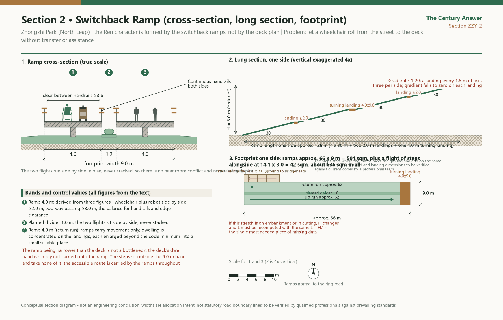

In 1909, Zhan Tianyou used the Jing-Zhang Railway to answer a question of the century: could the Chinese people build a railway on their own? Today, beside the roughly 9-kilometre heritage park released by that same railway, more than 2,000 AI enterprises in Haidian are answering a new question: can China build its own AI? This proposal turns the Jing-Zhang Railway Heritage Park into a century-spanning answer sheet laid open on the ground — for every large model independently registered in Haidian, a bronze rail spike is set into the edge of the walkway; when an enterprise inside the belt reaches a publicly verifiable milestone, it rings the newly cast Answer Bell beside Dazhongsi; and every year on 25 March, Tsinghuayuan Railway Station hosts nothing but a public-interest commemorative open day. Citizens do not come to look at display boards — they crouch down and count the spikes: how far has China's independent innovation been nailed in?

All spatial and development content in this proposal is a conceptual recommendation and reference scheme offered for further study by professional teams; it does not constitute a government-approved conclusion. This proposal makes no conclusive judgement on floor area ratio, building height, road right-of-way lines, or demolish–renovate–retain classification.

## Design Basis and Source List

The design basis of this proposal is first a real century of history, and only second a stack of documents — every design move here grows out of the question asked in 1909. In that year the Jing-Zhang Railway could not climb the sheer grade of the Guangou pass, and Zhan Tianyou drew the character "人" (ren): the train runs into a switch, reverses direction, and two gentle grades replace one grade too steep to climb. Surveyed, designed, and built by Chinese engineers, the line was completed and opened that same year, answering whether the Chinese people could build a railway of their own. In 1910 Tsinghuayuan Railway Station was completed, its name plaque inscribed by Zhan Tianyou; on 25 March 1949 the CPC Central Committee's "march to the examination" reached Beiping, and this small station was its first stop in the Beijing area; on 25 March 2023 the restored station building reopened [source:THU-STATION-2023]. The railway then handed in an answer of its own: the Jing-Zhang high-speed line opened in 2019, the old line was retired, and the tracks gave way to a park — Phase I, 2.4 kilometres and 16.8 hectares, was completed and opened in June 2023 [source:PARK1-YLLHJ-2023]; the park runs about 9 kilometres in total, with 46 entrances planned along Phase II [source:PARK2-PLAN-2024]; Phase II broke ground in December 2024 [source:PARK2-START-2024] and was formally completed and opened to the public on 6 August 2026 — about 53 hectares of land, extending both southward and northward to link Xizhimen with the North Fifth Ring Road, carrying a complete "three lanes and one green" walking-and-cycling system along its whole length, with the separate walking lane, jogging lane, and cycling lane running through end to end without a single break, and directly serving 70 communities and about 450,000 residents along the corridor [source:PARK2-OPEN-2026]. **This means the corridor this proposal addresses is no longer one waiting to be built, but one just completed and waiting to be used and to be told** — so the centre of design effort shifts from "how to get it built" to "how it gets used day by day and told year after year".

On both sides of the park, the candidates have already filled the examination hall: Haidian clusters more than 2,000 AI enterprises with an AI core industry scale of nearly RMB 360 billion [source:BJD-AI-2026]; 122 large models have been registered and launched (the district-government official calibre as of February 2026) [source:HD-PLAN-2026]; and the citywide cumulative total of 209 registered and launched models — close to one third of the national total — has entered the statistical communiqué [source:BJ-STAT-2025]. Lay those two sets of facts on top of each other and the proposal's core image surfaces by itself: 1909 and today are two answers to one question, so this 9-kilometre park should be made into an answer sheet spread open on the ground — the spikes record each act of answering, the bell announces each milestone, and the station preserves the original wording of the question.

The pen stroke is framed by three documents. The Pre-Qualification Announcement of the International Solicitation for the Urban Design of the Centennial Jing-Zhang AI Innovation Belt sets out the three-level scope and the design tasks, and is this proposal's first basis [source:OFFICIAL-ANNOUNCEMENT]; the agent-oriented open-call taskbook sets out six tasks and the unified boundary clause [source:AGENT-TASKBOOK]; and the maintainer-registered provisional boundaries, enumerations, metrics, and source lists under `brief/site-package/` are the direct manuscript behind every layer and every figure in this proposal [source:PROCESSED-FACT-PACK].

The design also has one baseline it must not cross. The regulatory detailed plan for blocks HD00-1601 and others along the Jing-Zhang Railway Heritage Park corridor (AI Innovation District key area, 2024–2035) was approved and published on 11 August 2026, establishing the statutory spatial structure of "one belt, one axis, two centres, multiple nodes" [source:HD-CTRL-PLAN-2026]. This proposal is a conceptual deepening on top of that approved plan: it does not sit parallel to the statutory plan, does not replace it, and does not quote its unpublished control indicators. Its spatial concept aligns with the statutory structure naturally — the 9-kilometre "Answer Scroll" corresponds to the "belt", while the Gate of the Ringing Bell (Dazhongsi) and the Answer Origin (Wudaokou · Tsinghuayuan Station) fall on the "two centres". All spatial statements remain conceptual recommendations awaiting deepening by professional teams inside the statutory framework.

The site extent continues to use the maintainer-registered provisional rough boundary [data:geometry/site_boundary.geojson#SITE-001], fully tagged as a provisional constraint and explicitly not an official boundary; it is used only for proposal generation, self-checking, visualisation, and design discussion, and never as an official planning boundary, an approval basis, or a precise area basis. Once the official boundary is released, every layer and every metric must be recalculated item by item against the registered recalculation checklist [depth:existing_conditions_diagnosis].

## Three-Level Scope Framework

The proposal tells one story and tells it across three scales: the Centennial Jing-Zhang Culture Belt is the question sheet (the question of 1909), the AI Fusion Innovation Belt is the answer sheet (enterprises and models answering), and the Urban AI Life Experience Belt is the marking hall (citizens counting spikes, hearing the bell, and watching showcases along the 9-kilometre walkway). Spatially, that story lands as an overall structure (conceptual recommendation) of "one 9-kilometre Answer Scroll Spine, three segments — Question in the South, Answer in the Middle, Leap in the North — and 46 Answer Gates permeating east and west into nearly 70 communities": Dazhongsi's Gate of the Ringing Bell in the south, the Answer Origin beside Tsinghuayuan Railway Station in the middle, and Zhongzhiyuan's Ren-Shaped Leap in the north [depth:overall_spatial_structure] [depth:three_level_scope_framework].

The three working levels required by the solicitation are three handwritings on the same answer sheet. The Coordinated Research Area (about 43.6 square kilometres) decides "what to write" — naming, ecosystem, narrative, and international benchmarking; the Overall Design Area (about 11.4 square kilometres, the urban area within 1–2 kilometres of the Jing-Zhang Railway Heritage Park) decides "where to write it" — renewal framework, land use, walking and cycling, and public space; the Key-Area Detailed Design Area (three detailed-design districts totalling about 368.4 hectares) decides "how to set pen to paper" — the landmarks, scenarios, and implementation dependencies of each segment. The item-by-item mapping of the three levels against the official requirements is carried by the compliance matrix [standard:PROJECT-OFFICIAL-ANNOUNCEMENT], and the spatial evidence rests on the submitted boundary and the three key-area layers [data:geometry/key_areas.geojson#PROV-KEY-001] [metric:key_area_count].

| Level | Design question | This proposal's answer | Data anchor |
| --- | --- | --- | --- |
| Coordinated Research Area | How to organise the AI industry ecosystem and future urban form | "The Century Answer" naming and narrative system, innovation ecosystem map, international benchmark mechanism prototypes | compliance_matrix.json, standard_matrix.json |
| Overall Design Area | How to map the renewal framework, industrial space, and urban character | Answer Scroll Spine + ten conceptual block zones on two wings, "connect first, then linger" at breakpoints, Factor Service Stations | [data:geometry/land_use.geojson#LU-001] |
| Key-Area Detailed Design Area | How the three districts reach detailed-design depth | Detailed conceptual designs of the Gate of the Ringing Bell, the Answer Origin, and the Ren-Shaped Leap | [data:geometry/key_areas.geojson#PROV-KEY-003] |

Any area or scale that cannot be recalculated from the structured data is not written into formal conclusions; all current conclusions are constrained by the provisional boundary and must be recalculated as a whole package once the official boundary is updated.

**Response map for the six agent tasks.** `agent.1`-`agent.6` in the taskbook are mandatory response items. The landing point of each is listed below; the full evidence chain per task (sections, drawings, geometry, metrics, assumptions, self-check items) sits in the entry of the same name in `compliance_matrix.json` [source:AGENT-TASKBOOK].

| Task | One-sentence response | Where in this document |
| --- | --- | --- |
| agent.1 Overall concept and function coordination | The primary name "The Century Answer" folds the three positionings into one question-answer-reading story, with the logo motif "rail-spike section x answer sound ring"; spatially it lands as a 9-kilometre Answer Scroll spine, the South-Question / Middle-Answer / North-Leap segments, and 46 Answer Gates | This section; "Coordinated Research Area" |
| agent.2 Full-stack independent innovation system and world-class ecosystem | An eight-factor x three-zones-two-wings ecosystem map; six international benchmarks, each marked for what is and is not comparable, contributing mechanism prototypes rather than spatial forms | "Coordinated Research Area: Industry and Future-City Research" |
| agent.3 AI+ scenarios and an intelligent, vibrant city | 19 AI scenario cards covering the eight scenario categories named in the taskbook's priority directions plus three conceptual layers, including 6 test-validation cards (S9-S12 plus S17 and S18) and 6 user personas, each card carrying a data tier, hard acceptance criteria, and exit conditions | "AI Innovation Ecosystem, Talent Personas, and AI+ Scenarios" |
| agent.4 AI public space and pilgrimage landmarks | Three east-west stitching techniques (Breakpoint Living Rooms, 46 Answer Gates, Factor Service Stations), three pilgrimage landmarks (the Answer Bell, the Answer Origin, the Ren-Shaped Leap), plus the Rail-Spike Band honour system and the standard component library | "Key-Area Detailed Design"; "Blue-Green Space, Public Space, and Urban Character" |
| agent.5 Century Jing-Zhang, Zhongguancun, and new AI culture | The two-sided inscription - the 1909 question outside each gate, today's answer inside - runs the whole belt; signage is unified by the "Jing-Zhang three colours" and rail-spike bronze; international communication substitutes verifiable objects for slogans | "Key-Area Detailed Design"; "Blue-Green Space, Public Space, and Urban Character" |
| agent.6 Global event system and long-term operation | March 25 Examination Day is a fixed annual public programme; youth curation rights and community adoption form everyday operation; the annual Century Answer Report publishes three auditable lists | "Renewal Project List, Implementation Policy, and Phasing Plan" |

## Coordinated Research Area: Industry and Future City Research

The coordinated level does three things for this belt: give it a name, fit it with an ecosystem, and find a set of tested references. The primary name is "The Century Answer (百年应答)", gathering the three grand positionings into a single story that can be told, walked, and counted — Question (the Centennial Jing-Zhang Culture Belt), Answer (the AI Fusion Innovation Belt), Reading (the Urban AI Life Experience Belt). A family of names derives from the primary case: the Answer Scroll (the 9-kilometre spine), the Answer Bell (the newly cast bell at Dazhongsi), the Answer Origin (the Tsinghuayuan Station segment), the Answer Gates (the 46 entrances, subject to actual completion), the Rail-Spike Band (the registered-large-model commemorative band), and the Ren-Shaped Leap (the conceptual node across the Fifth Ring Road). The primary logo motif is "spike cross-section × answering sound rings" — the circle of a bronze rail spike seen from above plus outward-spreading sound-wave rings, the rings echoing both the bell chime and a dialogue bubble; the alternative is an abstracted "人" (ren)-shaped skeleton. Full-library collision screening shows 265 hits for the "人" symbol and an existing competing entry already using "人" as its primary form, so the primary case deliberately avoids both the "人" primary form and the "spike × cursor" composition; "Century Answer / Answer Bell / Rail-Spike Band mechanism" scores only 0–1 hits across the full library, so differentiation rests on the mechanism layer rather than on symbol exclusivity [source:AGENT-TASKBOOK]. An incremental re-check shows that near-names of the “answer” family and the generic rail-spike symbol have now appeared in other entries, so this proposal stakes its distinction not on the word but on the evidence chain: the answering subject is never the city or an algorithm, but four-field verifiable objects and the named people who adopt them year after year. The logo carries a version number (starting at v1.0), iterates annually, and is archived each time, turning "able to learn, able to think, able to evolve" from a slogan into a verifiable loop.

The innovation ecosystem map is configured (as a conceptual recommendation) as eight factors — land, space, industry, capital, talent, computing power, data, and scenarios — (the factor list follows the taskbook calibre for `agent.2`; policy instruments run through all eight rather than forming a ninth)— across the "Three Zones and Two Wings", and its configuring logic has only one rule: wire the existing industrial assets to the park belt's public-space supply rather than build another industrial park. Haidian's family assets are thick enough — 122 registered and launched large models (the district-government official calibre as of February 2026, close to sixty percent of the city total) and about 5,000 PCT patent applications per year [source:HD-PLAN-2026]; the citywide cumulative total of 209, close to one third of the national total, already written into the statistical communiqué [source:BJ-STAT-2025]; an AI core industry scale of nearly RMB 360 billion and a cluster of more than 2,000 AI enterprises [source:BJD-AI-2026]; figures such as 12,300 AI scholars and 26 unicorn companies appear in district-level public promotional material and serve as background description only. What is genuinely scarce is scenarios and data: 9 kilometres of continuous public space plus the real demand of nearly 70 communities is a supply unique to the Jing-Zhang belt, while land, capital, and computing power follow an "access and linkage" approach and start nothing new.

**“Three Zones and Two Wings” is the municipal layout; “one spine, two flanks” is this proposal's own spatial shorthand. They are not the same thing, so the distinction is stated before either is used.** The municipal Three Zones and Two Wings comprise the AI Origin Community, the Zhongzhiyuan AI Independent Innovation Acceleration Area, and the Dazhongsi AI Industry Cluster, plus the Zhongguancun Technology Services Wing (ZTSW) and the Xiaoyue River Scenario Enablement Wing (XRSEW). The “one spine, two flanks, ten blocks” used in this document describes only how land is organised on either side of the 9-kilometre spine; it is a design shorthand and neither replaces nor rewrites the municipal layout. Each wing is given one conceptual supporting mechanism. The **Zhongguancun Technology Services Wing** takes on global factor allocation and Zhongguancun IP and capital enablement, landing as the second counter type at the Factor Service Stations: no approvals, no disbursement, only three verifiable things — turning four-field verification against the national register attachment into a public, reusable operating sheet; stating once and clearly what materials an overseas team needs in order to land, with a non-AI staffed counter kept open; and filing university-result-to-enterprise matching records into the annual public release of the Urban Evolution Archive. The **Xiaoyue River Scenario Enablement Wing** takes on AI scenario empowerment and the intelligent, vibrant city: the 19 scenario cards are organised along that wing's public-experience path, and the test-validation cards (S9–S12) would first draw a test loop between that wing and the already-opened Phase I segment, extending toward communities step by step only after validation [source:AGENT-TASKBOOK]. All of the above are conceptual recommendations and constitute no institutional mandate or government decision.

**Where each of the five functions physically lands.** The taskbook's five functions are not five slogans here but five places one can walk to. The **full-stack independent AI innovation system** lands in the Rail-Spike Band: one bronze spike per registered model, four fields verifiable line by line against the national register, turning “independent” from an adjective into a countable noun. The **world-class AI innovation ecosystem** lands in the Factor Service Stations and the eight-factor configuration, wiring existing assets to the belt's public-space supply. The **AI+ scenario empowerment paradigm** lands in the 19 scenario cards with their data tiers, hard acceptance criteria, and exit conditions. The **intelligent, vibrant AI city** lands in the 46 Answer Gates and the Breakpoint Living Rooms, putting AI services into the opening residents cross every day rather than onto a large screen. **Global discourse power in AI governance** lands in the algorithm disclosure wall, the algorithm answer window, and the three auditable lists of the annual Century Answer Report: discourse power rests not on declaration but on anyone being able to download the national register attachment and recompute this proposal's numbers.

**Regional coordination is likewise written only as actions that can actually happen.** For coordination with the Beiwei Community, Future Science City, Huairou Science City, and the Beijing Economic-Technological Development Area (the Development Zone), the suggested minimum unit is “mutually opened scenarios plus mutually recognised testing”: this belt opens public-space scenarios, the counterpart opens industrial and pilot-scale scenarios, and passed test records are recognised on both sides rather than re-validated, with the scope of recognition and its expiry conditions disclosed alongside the annual report. At the Beijing-Tianjin-Hebei level, the suggestion is to run March 25 Examination Day as a jointly hosted open day, each party contributing one station and sharing one disclosure calibre, with participation decided by each party on its own [depth:renewal_project_list]. All of the above are conceptual recommendations and constitute no cross-regional agreement, institutional arrangement, or government commitment.

Six international benchmark cases are chosen, each explicitly marked comparable or not comparable. King's Cross (London) defines a district through flagship institutions — comparable as railway-land regeneration, not comparable in its single-developer ownership structure. Kendall Square (Cambridge) lowers start-up thresholds with shared laboratories — comparable in its walkable top-university radius, not comparable in its asset-heavy biomedical format. Singapore's one-north directly inspires this proposal's robot-testing path with its graded regime of "start small, open one level after validating the previous" — its city-state unitary ownership is not comparable. Shenzhen's Hetao proves that a small space can host high-level institutional experiments, but its cross-border authorisation logic is not comparable and no authorisation statement may be extrapolated from it. Seoul's DMC shows a "negative-asset reversal + anchor institutions first" path — its government-built-new-district model is not comparable. Sidewalk Toronto is the cautionary counter-example of data-governance failure: large-scale sensor collection lost public trust and the project withdrew, warning this proposal that every digital touchpoint defaults to minimal collection, anonymisation, and published inventories. Together the six say one thing: **districts survive on mechanisms, not on concepts**. What can be borrowed are four mechanism prototypes (anchors defining identity, shared facilities lowering thresholds, graded opening of testing, small spaces concentrating institutional trials) plus one red line (data governance precedes technology deployment), not the spatial form of any single case [standard:PROJECT-AGENT-OPEN-CALL-TASKBOOK].

The future-urban-form research answers accordingly: what AI changes is not buildings, but what people are willing to do in the city. This proposal designs "counting spikes, hearing the bell, passing through Answer Gates, climbing the ren-shaped bridge" as everyday urban gestures of the AI era, translating the industry figures in the statistical communiqué into public-space evidence one can crouch down and touch [depth:overall_spatial_structure].

## Overall Design Area: Urban Renewal and Regulatory-Plan-Level Urban Design

The Overall Design Area does one thing: stitch back together the east and west banks that a railway kept apart for a century. The renewal framework is "one spine, two wings, ten blocks" (conceptual recommendation; in the statutory structure "one axis" refers specifically to the Zhongguancun Street Innovation Development Axis, so this proposal's own skeleton is uniformly called the "Scroll Spine" to keep the two apart): the 9-kilometre park green corridor is the Scroll Spine [data:geometry/land_use.geojson#LU-001], and the two wings arrange ten conceptual block zones — culture, commerce, research, residence, education, business, and flexible reserved land — across the Question-South, Answer-Middle, and Leap-North segments, with the northern Leap segment specifically holding flexible reserved land [data:geometry/land_use.geojson#LU-010] so that the "questions of the future" are not filled up by today's answers. The whole framework sits inside the approved statutory structure of "one belt, one axis, two centres, multiple nodes" — the Scroll Spine is the "belt" of that statutory structure, the flanking parcels are organised within the "two centres, multiple nodes" framework, and no statutory control content is changed or replaced [source:HD-CTRL-PLAN-2026].

The problem has to be stated correctly first. **North–south continuity and east–west stitching are a pair of strategies, but their tasks at this moment are entirely different. North–south continuity is already physically complete** — with Phase II open, north–south walking and cycling runs through the whole line without a break on the "three lanes and one green" system [source:PARK2-OPEN-2026] — so this proposal’s design action for north–south continuity is not to build another path but to **turn the nine kilometres that are already continuous into a scroll that can be read end to end**: an unbroken spine, an uninterrupted Rail-Spike Band along the walkway edge, and the K0–K9 chainage joined head to tail with the three narrative segments (South-Question, Middle-Answer, North-Leap), so that walking the full length reads as one story rather than three unrelated landscapes. **What remains genuinely unsolved is the east–west crossing** — the Line 13 viaduct and the old railway embankment form a natural spatial barrier, walls and fences along the corridor cut the blocks apart, residents moving east to west are held up, and the idle space beneath the viaduct has been taken over by disorderly parking. The stitching therefore uses three kinds of needlework. First, **Breakpoint Living Rooms (connect first, then linger)**: "breakpoint" here means the east–west crossing barrier specifically, never the park's longitudinal walking route — for each east–west barrier a conceptual crossing-optimisation strategy comes first, a scenario is then overlaid, and every crossing space is furnished with a combined set of seating, rain shelter, information screen, and drinking point, turning "waiting to cross" into "willing to stay"; the disorderly parking space beneath the viaduct is the first candidate for retrofit. Second, **46 Answer Gates × 70 community adoption**: relying on the 46 entrances planned in Phase II (subject to actual completion [source:PARK2-PLAN-2024]), each gate is made into "one page of an opened examination paper" — the outer face carries the question of the century, the inner face carries today's answer — adopted by the nearly 70 communities along the line. Third, **Factor Service Stations**: stations for policy consultation, registration coaching, and results matchmaking (no on-the-spot granting) are placed in low-efficiency spaces on both the east and west sides of the park, with sharing intensity rising closer to the park — using functions to manufacture reasons for crossing east and west. Only when people are willing to walk through does it count as stitching [data:geometry/public_space.geojson#PUBLIC-005].

The Rail-Spike Band is the thinnest yet longest through-running element: a continuous bronze-spike band along the walkway edge across the full line, laid out continuously along the walking-and-cycling system already built and running through, letting the "answer sheet" read as written through from end to end. The block zoning passed topology checks in EPSG:4548 projected space (coverage gap below 1 square metre, overlap below 1 square metre), all land-use codes are drawn from the site-package enumerations, and the required depth follows regulatory-detailed-planning-level urban design [standard:MOHURD-CONTROL-DETAILED-PLANNING] [depth:land_use_layout]. The comprehensive carrying capacity, municipal support, and character control of urban renewal are coordinated under the overall urban design method [standard:MOHURD-URBAN-DESIGN-MEASURES]; wherever building height, development intensity, road right-of-way lines, setbacks, or facility standards are involved, this proposal gives no conclusive values, uniformly states "pending confirmation of formal regulatory planning conditions", and lets the corresponding indicators honestly remain unknown in the metrics table [depth:development_intensity_controls].

## Detailed Design of Key Areas

On the 9-kilometre scroll, the three key areas each carry one narrative segment: Dazhongsi is the Question in the South, Tsinghuayuan Station is the Answer in the Middle, and Zhongzhiyuan is the Leap in the North [depth:three_key_area_detailed_design]. Statements that hold whatever the official data turn out to be are marked at each of the three key areas; every dimensioned figure is of the other kind and rebinds under A-RECALC-001. The three share the official area calibres — Zhongzhiyuan 192.1 hectares, the Beijing AI Origin Community 104.3 hectares, Dazhongsi 72.0 hectares; the submitted layers continue to use provisional rough extents and are neither official planning boundarys nor precise area bases [data:geometry/key_areas.geojson#PROV-KEY-002].

**Dazhongsi AI Industry Cluster = the Gate of the Ringing Bell (southern Question segment).** The conceptual core is "the Answer Bell and the Bell Chime Plaza": an open circular plaza whose ground paving spreads outward in concentric sound-wave rings (the logo motif enlarged onto the ground); at its centre stands a steel bell frame in the Jing-Zhang truss vocabulary — I-beams, riveted joints, spike-shaped finials — carrying a **newly cast contemporary** bronze Answer Bell. The Dazhongsi historic complex, founded in 1733, stands complete and independent in the distance, held apart from the new frame by a planted buffer and a walking path — one ancient, one present, facing each other across a distance rather than pressed side by side [source:DZS-MUSEUM-2021]. Two iron rules apply. First, the Answer Bell stands in cultural correspondence with the Ancient Bell Museum and its collection only: **no heritage bell is ever struck, ever moved, or ever put to commercial use.** Second, Dazhongsi is a national key cultural-relics protection site, so the bell frame and the plaza withdraw entirely from the heritage protection extent and its construction control zone; **the precise siting, the setback distance, and the massing control are all conceptual recommendations pending consultation with the heritage authorities**, and the frame's height is controlled with the intent of staying below the surrounding street-tree canopy, never competing with the historic buildings for the skyline. Enterprises inside the belt that reach a publicly verifiable milestone may book one ring of the bell; ringing eligibility is bound to publicly verifiable events — the kind of event is open, but it must carry a public record from a government body, an exchange, or another third party (a large model completing registration, a new model released and registered, a company listing) — recording facts without endorsing enterprises. Four "sound-wave paths" radiate from the plaza into the four quadrants around Dazhongsi Station on Subway Line 13, stitching the pedestrian flows severed by roads (the flow organisation is a conceptual recommendation; the traffic scheme awaits professional deepening) [data:geometry/public_space.geojson#PUBLIC-001]. Commercial showcases, bell-ringing ceremonies, and spike-installation ceremonies are all carried by this segment and the Zhongzhiyuan segment.

**Three implementation steps, divided by what each depends on rather than by how big it is.** The division follows how controllable the preconditions are, which is why the first step depends on no land condition at all and can run in parallel with the renewal process [depth:phasing_implementation]. **Step one, "get the walking working"**: the content is the "cross in one go" retrofit at existing crossing points, the under-bridge gallery, the four sound-wave paths brought through at marking and paving level, and the placement of guide answering posts and Breakpoint Living Room furniture sets; the preconditions are use permission from the bridge maintenance authority, crossing-retrofit permission from the road authority, and negotiated removal or regularisation with the current users of the under-bridge parking; the suggested roles have the district-level renewal coordination department leading, with the road and bridge maintenance authorities, the rail operator, and the local sub-district office and communities taking part; acceptance rests on before-and-after field measurement of the detour ratio, crossing waiting time, and daily pedestrian volume through the under-bridge gallery. **Step two, "free up the plaza"**: the content is siting and building the 1.0-hectare consolidated public open space, the bell frame and ceremonial core, and the plaza edge sections; the preconditions are that a low-efficiency parcel enters renewal implementation with the ratio and the "consolidated" test written into its transfer conditions, that the official vector boundary of the heritage protection extent and construction control zone is obtained and consultation completed, and that the avoidance check against underground rail and utilities is finished; the suggested roles have the planning and natural resources authority set the transfer conditions, the heritage authority set setbacks and character, the renewal implementer build, and the district-level renewal coordination department coordinate; acceptance rests on the plaza opening as soon as it is built, with opening hours and managing party already published. **Step three, "let it ring"**: the content is casting and installing the Answer Bell, the acceptance mechanism for ringing events, and bringing scenario S4 online; the preconditions are that the verifiable tests and acceptance rules for ringing events are confirmed by the competent authorities, that noise assessment passes and consultation with the south-east residential quadrant is complete, and that the non-AI equivalent channel for S4 is in place; acceptance rests on the first ringing event being archived and publicly searchable.

**Existing-condition diagnosis: four pain points, each with a precise location in the Dazhongsi station area.** The design premise of the Question-South segment is one plain truth — there is no vacant land here to set a pen to, only existing space available for reorganisation. Open map data shows that within roughly 0.9 × 0.85 kilometres around Dazhongsi (about 76.5 hectares) there are more than 50 buildings with a combined footprint of about 15 hectares — a footprint coverage of about twenty percent and an average of about 3,000 square metres per building [source:OSM-ODBL-2026]. That average tells us the nature of the problem: the station area is made of big-box retail and slab offices, a district of **large plates rather than small blocks** — continuous street walls, few ground-floor openings, no way through the interior of a parcel. The four pain points therefore each have a location [source:PARK2-OPEN-2026] [depth:existing_conditions_diagnosis].

First, **the north–south barrier cannot be opened**: the old Jing-Bao railway embankment and the Line 13 viaduct run continuously from north to south about 50 to 130 metres east of the station, so east–west crossing opportunities can only occur at existing road crossing points and no opening may simply be added into the embankment — which settles it that every stitching move in this segment is "make full use of the existing crossings" rather than "add new crossings". Second, **walls stretch a short distance into a long detour**: Mingguang West Road east of the station (about 74 metres away) and Sidaokou North Street west of the station (about 269 metres away) are only about 270 metres apart in a straight east–west line at their closest, yet they sit on opposite sides of the rail corridor and are each closed off by parcel walls. Third, **the blocked east–west direction is the most inconvenient one possible**: Mingguang Road and Mingguang East Road on the south-east side of the station are both classed as residential roads in open map data, making that the most likely commuting-origin side of the station area, while employment and commerce concentrate to the west and north — so the strongest everyday east–west flow faces the barrier head-on. Fourth, **the strip beneath the viaduct sits right on the main flow line**: the North Third Ring Road main carriageway is elevated between about 790 metres and about 110 metres west of the station (the interchange where North Third Ring West Road meets Zhongguancun East Road and Zaojunmiao Road, commonly called Lianxiang Bridge), about 680 metres long, and its eastern touchdown point is only about 110 metres from the subway station — the under-bridge space, filled with parking, lies exactly on the main pedestrian flow line from the station concourse to the blocks to the west [source:OSM-ODBL-2026].

Three sets of existing-condition data are not registered in this package and must be surveyed and supplied by professional teams; once supplied, this segment can move from concept into scheme depth. First, the official vector boundary of the heritage protection extent and its construction control zone (once supplied, the bell frame and the plaza can be given definite setbacks and sightline control lines). Second, the clear width, clear height, signal timing, and pedestrian waiting time at each existing crossing point (once supplied, the three sections can move from intended widths into channelisation design). Third, the burial depth and protection extent of the underground rail structure and municipal utilities in the station area (once supplied, the bell-frame foundation can enter structural selection) [depth:risk_missing_data].

**Station–city relationship: the Bell Chime Plaza is the "second concourse at ground level" for Dazhongsi Station.** This segment defines the plaza as an extension of transport infrastructure rather than as landscape decoration — Dazhongsi Station on Line 13 is an elevated station with a limited concourse, and the space in front of it is currently carved up by service roads, under-bridge parking, and parcel walls, so transferring, dispersal, and waiting are all squeezed onto the footway. What the plaza has to do is move those three activities off the footway and the service-road edge into a dedicated piece of ground — which is also the most direct spatial realisation, at ground level, of the Dazhongsi centre as one of the "two centres" [source:HD-CTRL-PLAN-2026] [data:geometry/key_areas.geojson#PROV-KEY-003]. In design terms that becomes three hard requirements: the stretch of the plaza's outer ring facing the concourse is made into a "waiting face", with rain shelter, information screen, and seating grouped together so that waiting for a person or a vehicle leaves the footway; the starting points of the four sound-wave paths are set on the outer ring by the four compass directions, each keeping one continuous pedestrian connection to the concourse entrances without a second road crossing; and bicycle parking together with standby bays for low-speed delivery robots are gathered into the outer-ring buffer, never occupying the clear width of a sound-wave path. One thing must be stated honestly: the second requirement can only be met in Phase I in the quadrant that holds the plaza. The north-west direction has to cross the three-carriageway Third Ring corridor, and the south-east and north-east directions carry the impassable rail corridor as well, so "no second crossing" in those three directions can only be a phased target, never a Phase-I commitment.

**Four-quadrant stitching: first decide which quadrant should hold the plaza, then give each quadrant its own needlework.** The plaza siting designates no parcel, but it does give five checkable criteria against which a professional team can overlay the ownership register and converge: withdraw from the heritage protection extent and its construction control zone; sit within the five-minute walking isochrone of the Line 13 concourse; abut an existing urban road pedestrian frontage on at least two sides; allow all four sound-wave path start points to land on the plaza's outer ring, with no fewer than two of them reaching the quadrant they serve without crossing the rail corridor; and come from the release of low-efficiency land through renewal, adding no new land acquisition. The quadrant that satisfies all five best is the **south-west quadrant** — both Line 13 concourse exits lie west of the rail corridor and south of the North Third Ring, so a plaza on that side is reached straight out of the station without crossing either the ring road or the railway, and it sits furthest from the heritage extent; it is therefore recommended as the first place to realise the plaza through renewal. The order of fallback when ownership conditions do not allow it is written out with reasons: the south-east quadrant (strongest everyday demand, but reaching the concourse requires crossing the rail corridor), the north-west quadrant (least available clear land and the strictest setback requirements), and the north-east quadrant (the green corridor itself, which should not be traded away for a plaza) [data:geometry/public_space.geojson#PUBLIC-001].

**South-west quadrant (same side as the concourse, first choice to carry the plaza)**: the current problem is that the westbound flow out of the gates runs straight into the viaduct touchdown section, squeezing people between the service-road kerb and parked cars. The stitching move is to shift the flow line **off the service-road edge and under the bridge** (see Section Three), so that "concourse → plaza" runs the whole way under structural cover, physically separated from motor traffic. This is the shortest, cheapest, and fastest-acting stitch in the segment, and it depends on no land condition at all. **South-east quadrant (residential side, highest everyday intensity of use)**: the current problem is that residents reaching the concourse must first cross the North Third Ring south service road northward and then detour along the west side of the rail corridor. The move is not to add a crossing but to **make the existing single crossing work properly** — a "cross in one go" retrofit at the existing crossing point nearest the concourse (see Section One), plus converting the walls along the route into manageable openings (time-limited management on the community side is allowed; not being open around the clock still counts as connected). Acceptance uses the detour ratio (walked distance ÷ straight-line distance), with a target of no more than 1.5. **North-west quadrant (heritage side, subtraction only)**: the Dazhongsi Ancient Bell Museum, founded in 1733, is a national key cultural-relics protection site and lies in this quadrant [source:DZS-MUSEUM-2021]. **No new structure enters this quadrant** — bell frame, plaza, and installations are all excluded, and the stitching consists of only three moves: adding pedestrian openings toward the park at the ground floor of existing street walls; widening the footway along Dazhongsi East Road and returning lamp posts and signs into a furnishing zone; and maintaining the view corridor from the park's main walkway toward the historic complex without adding obstruction. **North-east quadrant (the green corridor itself and the blocks to its east)**: with Phase II complete, north–south walking and cycling already runs through inside the corridor [source:PARK2-OPEN-2026], so the problem lies only in the fences separating the corridor from the ring road and from the blocks to the east — you can walk through the park, but you cannot get into it. The north-east sound-wave path must cross both the ring road and the rail corridor, making it the hardest of the four; this proposal does not force it through in Phase I but instead **makes the destination real first**: an Answer Gate (using the standard line-wide kit) is placed on the eastern edge of the green corridor near the ring road, connecting the eastern blocks straight into the corridor, while the corridor's own cross-section stays as built and is not altered for the plaza; entrance positions are subject to actual completion [source:PARK2-PLAN-2024] [data:geometry/roads.geojson#ROAD-003].

**Plaza plan organisation: three concentric bands divide the 1.0 hectare completely, and the concentric rings are a pattern, not steps.** The plaza is about 100 metres square, 1.0 hectare, its ground spreading outward in concentric sound-wave ring paving [data:geometry/public_space.geojson#PUBLIC-001]. The division into three bands is not a compositional preference but is set by intensity of use and facility load, and every area can be recalculated item by item:

| Band | Dimension | Area | Function and intended treatment |
| --- | --- | --- | --- |
| Ceremonial core | about 30 metres in diameter | about 700 square metres | Bell frame at the centre; no fixed seating and no tree pits, keeping the clear space for ringing and for witnessing; demountable flagpole sockets, temporary-barrier anchors, and broadcast-position outlets are cast into the ground and capped flush with the paving in everyday use |
| Everyday activity ring | 30 to 70 metres in diameter, about 20 metres wide | about 3,100 square metres | The plaza's main working surface; sound-ring benches placed intermittently along the ring, each length seating 3 to 4 people with a wheelchair standing space kept; trees planted in groups tangential to the ring and never entering the inner sightline; the stretch facing the concourse becomes the "waiting face" with rain shelter and information screen |
| Boundary buffer | from 70 metres in diameter out to the plaza edge, depth widening from about 15 metres at the mid-point of each side to about 35 metres at the corners | about 6,200 square metres | Absorbs the level difference against the urban road, holds stormwater (sunken green space and permeable paving), and takes bicycle parking and robot standby; the widened corners hold exactly the parking and standby without crowding the through route |

The three bands add up to exactly 10,000 square metres. **There is only one critical construction discipline, and it holds whatever the official data turn out to be: no level difference may appear between the concentric rings** — the three bands are distinguished by paving texture and colour banding, the whole plaza is step-free, and the circumferential joints are tight, their width taken strictly against the upper limit for ground gaps in the current accessible design standard so that they cannot trap a wheelchair castor or the tip of a walking stick [standard:BARRIER-FREE-ENVIRONMENT-LAW].

**The bell frame connects to nothing existing, and the sound-wave paths guide by colour rather than by anything raised.** The bell frame is a free-standing four-column closed steel frame — I-beam columns, riveted joints, spike-shaped finials — its column bases resting on their own independent foundation, **not attached to, not bearing on, and not transmitting load into any existing building or historic structure**; the weight of the bell and the impact load of striking are carried by that independent foundation (an outside-struck bell does not swing itself — the striking beam swings, and the dynamic load comes from the horizontal component of the impact), and the foundation depth and position must first clear an avoidance check against the underground rail structure and municipal utilities in the station area, with no pile fixed before that check is complete. The ceremonial core's diameter of about 30 metres is not a rounded-off composition but the sum of two clearances: the inner circle is the horizontal working and safety-avoidance zone of the outside-struck striking beam, and the outer circle is the standing area for witnessing a ringing event — at the usual density for standing spectators, a core of about 700 square metres can hold the audience one ceremony requires without spilling into the activity ring, with the capacity limit to be verified by professional teams against current venue evacuation requirements. Massing control follows the principle of not competing with the historic buildings for the skyline: the frame's height is intended to be capped below the mature canopy of the surrounding street trees, with the figure to be verified by professional teams against character and heritage requirements. Until the official vector boundary of the heritage protection extent and construction control zone is obtained, this proposal adopts "neither the bell frame nor the plaza enters the north-west quadrant" as an immediately executable substitute constraint; once the boundary is obtained, definite setbacks follow from the consultation result. Night lighting does no floodlighting: linear in-ground fittings are set into the ring joints with brightness falling from the centre outward, so that the spreading of sound stays readable at night as well; the bell frame receives only surface-mounted structural-profile grazing light with no upward-projecting fittings; general illuminance comes from low under-canopy poles at the outer edge of the bands; on the side facing the south-east residential quadrant, shields are added and vertical illuminance in that direction is controlled strictly; during a ringing event the inner ring is temporarily brightened and falls back the moment the event ends, with no all-night dynamic or coloured lighting. The four sound-wave paths are built the same way: the paving turns the concentric rings into parallel ripple bands perpendicular to the direction of travel, their spacing loosening with distance from the plaza, and the ripples are achieved through surface aggregate and colour change — **never through anything raised**, because raised elements trip people, catch wheels, and shake low-speed robots. Clear width is no less than 3.0 metres (enough for one wheelchair and one low-speed delivery robot to pass each other); along street frontages a furnishing zone of a further 0.8 to 1.5 metres is added outside the clear width (lamp posts, tree pits, signs, and robot standby bays all go into that zone), and along building setbacks a further 0.5 to 1.0 metre frontage-activity zone may be added, giving an intended total width of 4.5 to 6.0 metres along streets and 3.5 to 4.5 metres where the path passes through the interior of a parcel; the intended longitudinal gradient is no steeper than 1:20, the inside clear radius at turns is no less than 1.5 metres, and every 150 metres or so a recessed yielding bay about 1.2 metres wide and 3 metres long delivers "wheelchair first, robots must stop and yield". All of the above are conceptual section indications and contain no engineering conclusions.

**Three conceptual sections (all are conceptual section indications, contain no engineering conclusions, and their widths are allocation intentions rather than road right-of-way lines).** The three answer this segment's three hardest interfaces: crossing a carriageway, abutting an urban road, and retrofitting the space beneath a viaduct [depth:traffic_rail_slow_parking].

| Section One · a sound-wave path crossing an urban road (example: the south-east path crossing the North Third Ring south service road) | Intended treatment |
| --- | --- |
| Existing conditions | In front of the station the Third Ring corridor is a three-carriageway section — south service road, main carriageway, north service road — about 50 to 60 metres wide in total; the main carriageway touches down about 110 metres west of the station, so the stretch in front of the station is at grade [source:OSM-ODBL-2026] |
| Width allocation | The crossing is no less than 6.0 metres wide in total: 4.0 metres of clear passage plus 1.0 metre of waiting space on each side; the central refuge is no less than 2.5 metres deep, holding one wheelchair and one low-speed robot waiting at once without either overhanging the line |
| Level differences | Step-free throughout; the kerb across the crossing is brought flush (kerb upstand dropped level with the carriageway), with drainage taken instead by linear channels on both sides rather than solved with "a kerb ramp plus a drop" |
| Materials | The crossing surface uses the same integral colour as the sound-wave path, contrasting with the asphalt carriageway so that drivers are warned by colour rather than by anything raised |
| Accessibility | A 0.6-metre tactile warning strip at each end, continuous with the tactile guidance system; audible crossing signals and an extension button are added [standard:BARRIER-FREE-ENVIRONMENT-LAW] |
| Robot compatibility | Robots share the pedestrian phase and the same speed cap, with no separate robot phase; a robot waiting area is marked on the refuge |
| For professional deepening | Signal timing and channelisation; drainage and winter snow clearance once the kerb is flush; safety assessment of the main-and-service-road weaving section |

| Section Two · the interface between the plaza edge and the urban road | Intended treatment |
| --- | --- |
| Overall position | No wall and no raised terrace between plaza and road; a buffer about 15 metres deep absorbs level difference, stormwater, parking, and robot standby entirely within the band |
| Width allocation (from the road side toward the plaza) | The existing footway is retained and the furnishing zone returned to it; the outer 3.0 to 4.0 metres take bicycle parking and robot standby (permeable surface, defined by markings and a low hedge, with no tall railing); the middle 6.0 to 8.0 metres are a sunken green band receiving runoff from the plaza's hard surface, with trees planted in groups to screen the road; the inner 3.0 to 4.0 metres are a step-free entrance face, flush with the plaza's outer-ring paving |
| Level differences | The whole difference between plaza and adjoining footway is absorbed within the buffer at a slope no steeper than 1:20; where it genuinely has to be absorbed in one place, a wheelchair ramp is used (longitudinal gradient no steeper than 1:12, with landings per the standard) and steps are provided alongside — **an entrance consisting of steps alone is not permitted** [standard:BARRIER-FREE-ENVIRONMENT-LAW] |
| Materials | The buffer is mainly permeable paving and planting soil, contrasting in texture with the plaza's integral surface; the edge is defined by level change, hedge, and paving change rather than by a continuous solid wall |
| Robot compatibility | Where a sound-wave path passes through the green band its clear width stays at 3.0 metres and is not encroached by planting; outer standby bays connect to existing municipal power nearby, adding no separate plant room |
| For professional deepening | Vertical design and drainage study; stormwater retention capacity calculation; species selection and soil depth |

| Section Three · under-bridge space converted from disorderly parking to public use (example: the eastern touchdown section of the viaduct) | Intended treatment |
| --- | --- |
| Existing conditions | The elevated section runs from about 790 metres west of the station to its touchdown at about 110 metres, about 680 metres long, its eastern end lying directly on the main pedestrian flow line from the concourse to the western blocks; it is currently occupied by disorderly parking [source:OSM-ODBL-2026] [source:PARK2-OPEN-2026] |
| Structural discipline | Existing pier axes and pile caps are retained exactly as built with no alteration whatsoever; a maintenance clearance of no less than 0.6 metres is kept between new facilities and the piers, and **nothing is attached to or bears on the bridge structure** |
| Width allocation | A through zone of 3.0 to 4.0 metres forms a continuous pedestrian gallery, step-free throughout and levelled with the existing under-bridge ground; an activity zone of 4.0 to 6.0 metres holds Breakpoint Living Room furniture sets grouped bay by bay between piers, one activity per bay, never filled continuously, keeping sightlines open and fire access clear |
| Handling of parking | Total removal is not the goal: clear what can be cleared, regularise what cannot (marking, wheel stops, inclusion in unified management) — this is what "connect first, then linger" means beneath a bridge |
| Materials and lighting | The through zone uses a hard-wearing, slip-resistant, easily washed integral surface (the deck shelters it and there is no infiltration requirement, so no permeable construction); lighting is fixed to the underside of the deck with no poles set down; the under-bridge space is a dark zone even by day, so illuminance is taken strictly against an all-hours passage standard |
| Accessibility | The gallery's longitudinal gradient follows the existing ground with an intended cap of 1:20, meeting the footways at each end flush; **the gallery terminates naturally at the touchdown end as the clearance beneath the deck diminishes, with the termination point set by survey rather than forced through to the touchdown point**, and the termination is finished with protective cladding and warning signage |
| Robot compatibility | The gallery is the only continuously sheltered stretch in this segment and is designated the priority route for low-speed robots in rain and snow; charging and standby bays sit on the activity-zone side |
| For professional deepening | Use permission and safety boundary from the bridge maintenance authority; ownership and current users of the parking; fire safety and evacuation; structural inspection and load limits |

**Street frontage and the renewal mechanism: turning "a quarter" into a spatial requirement that can be signed off.** Low-efficiency commercial land in this district has already been converted to technology offices and innovation exchange through "government coordination plus social capital participation plus listed land transfer", with explicit requirements to improve landscaping and complete the pedestrian system — a public precedent to follow [source:LJLJ-RENEWAL-2026]. The body text has already proposed the mechanism of reserving about 1 hectare of consolidated public open space at no less than a quarter of a parcel in subsequent renewal; three additions make it verifiable. First, **"consolidated" must have a test** — the space should be a single continuous parcel with a short side of no less than 90 metres, not cut by a municipal road or a vehicle access. The 90 metres is not invented: the everyday activity ring of 70 metres diameter needs no less than 10 metres of buffer depth on each side, so with a short side under 90 metres the concentric-ring system above cannot stand and the quarter-parcel ratio degrades into a few strips of street planting that cannot do a plaza's work. Second, **the order of delivery** should have the public open space designed together with the above-ground development and brought into use before the main building is handed over, so that the building is not finished while the plaza is still a construction site. Third, **the duty to open** should be written into the transfer conditions together with opening hours, the managing party, and the responsibility not to close it off. This proposal defines only the mechanism and the acceptance calibre; it designates no parcel and disposes of no party's ownership or development arrangements [depth:renewal_project_list]. Ground-floor vitality along the street likewise becomes two checkable indicators rather than an attitude: along street stretches following the sound-wave paths and the plaza edge, an opening to the street (a door or an openable frontage) should appear at least once every 30 metres of ground floor; and ground-floor uses are controlled by a **negative list** rather than a positive one — unstaffed equipment rooms, garage entrances, sealed storage, and continuous closed showrooms are not placed on the plaza edge or along the sound-wave paths, while what is allowed is left to the market. One Factor Service Station sits in this segment, placed against the plaza's outer ring as the plaza's indoor extension, and keeps a staffed counter [standard:ELDERLY-SMART-TECH-PLAN-2020-45].

**On investment only the quantity bases and the funding-channel tiers are given, never amounts — this is a data gap, not an omission.** The quantity bases that can be handed straight to an estimator are settled: 10,000 square metres of plaza hard surface and planting (about 700 for the ceremonial core, about 3,100 for the everyday activity ring, about 6,200 for the buffer); the under-bridge gallery measured over the actually retrofittable length within the roughly 680 metres of viaduct at its eastern end; the four sound-wave paths measured to the first everyday destination each reaches; Breakpoint Living Room furniture sets counted by pier bay; one bell frame; and two guide answering posts. Unit prices must come from published cost indices (investment estimation indices for landscape and municipal works, and the construction cost indices published periodically by the housing and urban-rural development authorities); **this submission package registers no cost-type source, so this proposal fills in no unit price and gives no monetary range.** Once one set of published cost indices is supplied, these bases can be taken straight to the depth of an itemised investment estimate table. Without unit prices it is still possible to give the funding-channel tiers, which matter more to implementation anyway: step one is facility-level spending measured in linear metres and pieces of furniture, absorbable by routine maintenance and micro-renewal channels without a separate project approval; step two is site-level spending, implemented together with the renewal parcel and not drawing separately on public finance; step three is project-level spending requiring its own approval, and since the bell is a one-off custom casting with high cost dispersion, it should not be bundled with the first two steps for approval.

**Scenario S4, "Bell Chime Plaza · four-quadrant transfer walking assistant": siting, tests, and exit conditions.** S4 adds no new device type and uses only the guide answering post from the line-wide standard component kit; there are two powered positions and four unpowered ones — a primary unit on the plaza's outer-ring "waiting face", a secondary unit at the mid-point of the under-bridge gallery (serving the westbound flow and doubling as a wet-weather information point), and an unpowered direction plate at the start of each of the four sound-wave paths (paving-inlaid lettering and tactile marking only, with no screen and no sensor). The intended equipment is a combination of screen, loudspeaker, physical buttons, and near-field contact; the secondary unit drops the screen because of under-bridge glare and vulnerability, keeping voice and physical buttons. Power and communications connect to existing municipal utilities, adding no separate plant room [depth:municipal_new_infrastructure]. The service content has to be written out, or there is no way to know what conditions to reserve: it answers "to get to a given place, which exit do I use, which path do I take, how long does it take, and are there steps", and gives routes by user group (wheelchair and pushchair routes avoiding every step and steep slope, wet-weather routes preferring the under-bridge gallery, night routes preferring continuously lit stretches), and it announces the current status of the four sound-wave paths (closed for works, occupied by an event, busy with robots); every output carries an AI-generated label, and traffic suggestions are for reference and are not approved schemes [standard:GENERATIVE-AI-INTERIM-MEASURES]. The precondition for going live is that the non-AI equivalent channel is in place — the same information is permanently mounted on the post as a fixed printed four-quadrant walking map with tactile markings, with voice announcement and large-type mode always on, so that whenever the AI service is unavailable the fixed information still reads complete; if that cannot be done, it does not go live [standard:ELDERLY-SMART-TECH-PLAN-2020-45] [standard:BARRIER-FREE-ENVIRONMENT-LAW].

Five acceptance tests, all measurable and re-checkable: the detour ratio in each of the four quadrants is no greater than 1.5, and the difference between the wheelchair-route detour ratio and the walking-route detour ratio is no greater than 0.2 (that is, a wheelchair does not travel further round than a walker); the wheelchair route from the concourse exit to the plaza's outer ring is step-free throughout and requires no second road crossing — only the south-west quadrant holding the plaza is a Phase-I compliance target, since the north-west direction has to cross the three-carriageway Third Ring corridor and the south-east and north-east directions are limited by the rail corridor, so these are listed honestly as phased targets; the primary unit can still provide the fixed four-quadrant walking map and voice announcement with no network connection; in on-site human spot checks, the share of route suggestions inconsistent with actual passability stays below the threshold set by the competent authority in the pilot scheme; and across the whole cycle there is zero facial recognition and zero retention of individual trajectories, with the collection inventory published and checkable. Five exit conditions are equally written in the open: if the first two tests are not met for two consecutive assessment cycles, the AI service is shut down, the fixed information is retained, and the post is not removed; if any collection behaviour beyond tier L1 appears, or the collection inventory does not match reality, the service stops immediately with a public explanation; if a passage safety incident results from a route suggestion, the service stops immediately and all suggestion logic is reviewed by humans; if, once four-quadrant stitching is complete, measurement shows the fixed information already sufficient for wayfinding and AI usage stays below the set threshold over the long term, the service exits voluntarily and the post is downgraded to a pure wayfinding element; and on exit the equipment is recovered while the post remains (it is simultaneously a standard kit component and the terminus of tactile guidance), **leaving no unmaintained dark screen standing in the city** [depth:three_key_area_detailed_design].

Where does the land for the plaza come from? That is the most concrete question this segment has to answer. Measurement shows more than 50 buildings with a combined footprint of about 15 hectares within roughly 0.9 × 0.85 kilometres around Dazhongsi — a fully built-out, high-density area with no vacant land standing ready. **The plaza can only come out of urban renewal; it cannot be drawn onto a sheet out of thin air.** That path has already been walked and made public inside this very district: within the Dazhongsi pilot area, a low-efficiency commercial parcel (a home-furnishing and building-materials market) has been brought into urban renewal through the model of "government coordination + social capital participation + listed land transfer", turning from retail formats toward a mix of technology offices, innovation exchange, and public services, with explicit requirements to improve landscaping and complete the pedestrian system, and positioned as an important node on the Jing-Zhang Heritage Park innovation-exchange belt inside the approved regulatory planning system [source:LJLJ-RENEWAL-2026]. What this proposal derives from that is a **mechanism recommendation, not a site designation**: in the low-efficiency land renewal that follows in the Question-South segment, it is suggested that no less than a quarter of a parcel be reserved as one consolidated public open space of about 1 hectare (roughly 100 metres square) to carry the Bell Chime Plaza. Which parcel it eventually falls on, and how it is implemented, are settled by rights holders, competent authorities, and professional teams through statutory procedures; this proposal designates no parcel and disposes of no party's ownership or development arrangements. The dimension also survives arithmetic: a 1-hectare plaza is about a quarter of a renewal parcel in the 3–4 hectare range, and it runs in the same direction as the "add green space, connect walking" renewal goals such projects already carry.

**Beijing AI Origin Community = the Answer Origin (middle Answer segment).** This segment makes one design claim only: build no new landmark, and make the "origin" a coordinate you can come back to year after year. Not one brick or tile of the old Tsinghuayuan Railway Station building (built in 1910, station name inscribed by Zhan Tianyou) is touched. In front of the station only a 0.6-hectare "plain plaza" is kept, holding two objects and nothing else — an "Answer Book" of turnable metal pages and the "Kilometre-Zero Post of the Rail-Spike Band" (marker K0+000, with spike No. 0 set at its base, engraved with the event itself: "1909 — the Jing-Zhang Railway completed and opened") [data:geometry/public_space.geojson#PUBLIC-002]. The 104.3-hectare key area recalculates to 104.32 hectares in the submitted geometry, matching the area calibre; its bounding rectangle measures about 948 by 1,117 metres, and the Scroll Spine's walking main line runs 1,110 metres within this segment — these three figures are the base for every quantity estimate here [data:geometry/key_areas.geojson#PROV-KEY-002] [data:geometry/roads.geojson#ROAD-001]. One further pair of calibres must be set out side by side and never mixed: the official extent of the AI Origin Community runs east to Wangzhuang Road and Zhanchunyuan West Road, west to Zhongguancun Street, north to Tsinghua University, and south to the North Fourth Ring West Road, radiating across about 3 square kilometres and already clustering more than 400 enterprises [source:AI-ORIGIN-2026]. **That is the radiating calibre of an industrial district, and it is not the same extent as the organiser's 104.3-hectare key area** — the spatial design of this segment answers only for the 104.3 hectares, while the enterprises and population of the 3 square kilometres are used only to judge the intensity of demand, never to enlarge the design extent. Matching areas is also not matching positions: the centroid of this segment's submitted geometry lies about 1.9 kilometres east of the true former site of Tsinghuayuan Railway Station (116.3256°E, 39.9902°N), consistent with the 1.9–2.7 kilometre offset already disclosed in the body text. Every positional relationship below is therefore a conceptual indication under the provisional-boundary calibre, while all distance measurements and existing-condition readings are taken from real feature coordinates; the two calibres are labelled separately throughout and never mixed.

**The sequence is divided into three steps by "can it break ground", not by year.** **Step one · zero groundwork** (no excavation, no structural change, removable the same day; all of it can be implemented before the protection extent is published and can be removed as a whole if it later conflicts): completing the edge-hugging walking band; a trial stretch of spike setting (100–200 metres suggested, running the full process through once — checking against the national announcement attachments, district-level attribution publication, setting, archival numbering, and imaging); one 1:1 reversible layout of the plain plaza, producing prototypes of the Kilometre-Zero Post and the Answer Book; one pilot permeable wall segment (unit length 6–12 metres); and one commemorative open day held on 25 March on the site as it stands. The minimum verifiable package of step one = one adopted Answer Gate + one 100-metre trial section of the Rail-Spike Band + one March-25 open day: the three are mutually independent, and each can be implemented, accepted against the hard criteria of its namesake scenario card in Table B, and withdrawn on its own. **Step two · waiting on conditions**: permanent design of the plain plaza starts once the protection extent is published; Section Two enters dedicated design once the under-bridge space's users are confirmed and the existing structural records are in hand; and once campus ownership and security management opinions are in hand, the opening segments run a trial for one full academic year using reversible methods, with shared time windows trialled in parallel. **Step three · consolidation**: the sample stretches of the three sections are extended across the whole segment; shared windows become a published fixed timetable displayed on site; and the siting of stations and half-step spaces is adjusted according to the measured readings from steps one and two, **not fixed once from a planning drawing** [depth:phasing_implementation].

**Existing-condition diagnosis: it is not a shortage of routes; it is that the walls, the stations, and people's legs have not been connected.** With Phase II of the heritage park complete, the north–south "three lanes and one green" already runs through without a break, so every real problem in this segment happens east–west [source:PARK2-OPEN-2026]. First, the walls: measured with the true station site as the centre, there are 4 university campuses within a radius of 1.2 kilometres and 8 countable within 2 kilometres (campuses and faculty parks of Tsinghua University, Peking University, the University of Chinese Academy of Sciences, and others) [source:OSM-ODBL-2026]. These walls are ownership boundaries and security boundaries, not design objects — they can neither be demolished nor be treated as facades to "beautify"; all this segment can touch is the urban space outside the wall and the replaceable upper courses of the wall itself. Second, the stations: Wudaokou is an elevated station (structure tagged viaduct, layer 1) and Tsinghua East Road West Entrance is an underground station (tunnel, layer -4), the true station site lying about 540 metres from the former and about 1.2 kilometres from the latter [source:OSM-ODBL-2026]. The interchange geometry of the two is completely different — for an elevated station the integration problem sits beneath the viaduct and at the touchdown points of vertical circulation, while for an underground station it sits in the ground-level space around the entrances, so **applying one set of interchange treatments to both is guaranteed to get one of them wrong**. That is the first judgement of station–city design in this segment. Third, the legs: the daily movement of students and researchers is a four-point loop of dormitory — laboratory — incubation space — subway, and those four points sit on opposite sides of walls, so every east–west move means detouring to a campus gate; all three items on the official list of existing pain points — walls and fences cutting the blocks apart, residents held up moving east to west, and idle under-bridge space turned into disorderly parking — hold simultaneously in this segment [source:PARK2-OPEN-2026]. The diagnosis is therefore explicit: this segment needs no new land, it needs **the detour distance brought down**, and the three ways of bringing it down — hug the edge, pass underneath, borrow the route — correspond respectively to zero ownership cost, a single rights holder, and multiple rights holders, and should be pursued in that order [depth:existing_conditions_diagnosis].

**Spatial structure: one point, two mouths, one belt, one line.** The Answer Origin plays three roles in the Answer-Middle segment and they do not overlap: narratively it is the K0+000 reading point of the line-wide Rail-Spike Band; in terms of activity it is the "quiet segment" of the whole line (ceremonies and showcases are assigned elsewhere in the body text and do not happen here); and mechanically it is the fixed venue of the public-interest commemorative open day every 25 March. Spatially that becomes: one point, the 0.6-hectare station forecourt plain plaza; two mouths, the Wudaokou and Tsinghua East Road West Entrance interchange mouths, organised under two different sections for elevated and underground; one belt, the 3.33 hectares of the park's east-wing walking public-activity interface belt falling within this segment, the siting corridor for Factor Service Stations and validation interfaces [data:geometry/public_space.geojson#PUBLIC-005]; and one line, the east–west stitching demonstration line, 1,091 metres long in total with 940 metres inside this segment, its number of crossing points deduced from the spacing test below [data:geometry/roads.geojson#ROAD-004]. "Low disturbance" here is three executable actions, not an attitude: **break ground only on the city side** (the edge-hugging walking band falls entirely within urban land and needs no rights holder's consent); **alter only the upper part of the wall** (plinth, foundation, ownership, and security grade all unchanged); and **borrow time, not title** (crossings through internal campus routes are achieved through shared time windows, with management responsibility remaining with the rights holder). This segment corresponds to the Wudaokou centre among the "two centres" of the approved regulatory plan, and everything in it is a conceptual deepening on top of that statutory structure [source:HD-CTRL-PLAN-2026].

**The station forecourt plain plaza (0.6 hectare): one view corridor, two circles, three mouths.** The plaza's compositional discipline is a single view corridor; everything else is setback. In the submitted geometry the plaza is 6,000 square metres with a bounding rectangle of about 87 by 69 metres — a dimensional frame that can go straight onto a drawing [data:geometry/public_space.geojson#PUBLIC-002]. The **view corridor** runs from the plaza's main entrance to the station facade carrying the inscribed station name, with an intended width of 12–18 metres and a depth settled by the final siting; inside the corridor there are no trees, no installations, no seating, no lamp posts, and no flagpoles — only paving; every element on the plaza sits outside the corridor with a further 3-metre clear margin from its edge. The **quiet zone** (intended footprint 15%–20%, about 900–1,200 square metres) holds only the Answer Book and needs one uninterrupted plain paved area able to take 8–12 people reading around it, enclosed on three sides by low tree pits so that no one reads with traffic at their back. The **open ground** (intended footprint 55%–65%, about 3,300–3,900 square metres) stays fully clearable: no fixed seating, no fixed planters, no stage foundation, its only fixed elements being cast-in socket covers flush with and matching the paving. The **three mouths** are: (1) toward the park's walking main line (the Rail-Spike Band entry point, where the Kilometre-Zero Post is set); (2) toward the rail interchange (the accessible main entrance); and (3) toward the community (the everyday entrance). A fourth mouth is deliberately omitted — on the commemorative day, capping numbers takes only "enter at 2, exit at 1, close 3" to form a one-way flow with the least staffing.

**The relationship between the two objects is "look down first, then look up, then turn aside".** The Kilometre-Zero Post and the Answer Book are not side by side, not symmetrical, and not in the same view corridor. The post is set on the line of the Rail-Spike Band (at the junction of plaza and walking main line) and is "the beginning of the line"; the Book withdraws into the depth of the quiet zone, 25–35 metres from the post in order of magnitude, and is "the depth of the plane". People's three gestures therefore have a sequence — crouch at the walkway edge to count spike No. 0; look up into the view corridor and see the 1910 inscription of the station name; then turn aside into the quiet zone and open that year's page. Three gestures, three postures of the body, three different objects: that is the whole programme of this plaza, and it needs no fourth object. The "three lows" can accordingly be written as drawing clauses: **low colour** — the whole site is limited to three swatches, station-brick grey, spike bronze, and bronze-patina green, with no brand colour and no coloured paving pattern permitted; **low commerce** — no shops, no advertising positions, no naming rights, and no temporary vending within the plaza, with all service functions withdrawn to the Factor Service Station outside it; **low volume** — no fixed public-address system, portable amplification for ceremonies removed the same day, and no background music in everyday use.

**The relationship with the heritage building is controlled through plan setbacks and reversible construction, because there is no basis at present for any height figure.** The former Tsinghuayuan Railway Station is a Beijing municipal cultural-relics protection site, and the drawings of its protection extent and construction control zone have not been published (see the implementation-path section below) [source:THU-STATION-HERITAGE-2025]; any setback distance or height cap given now could only be invented, so this segment uses two rules that hold without those drawings - and equally without the redline, ownership or heritage extent. The district renewal guideline requires a "policy per building" for projects involving immovable cultural relics and historic buildings, and the "policy" for this segment is the following two rules. First, the **reversibility rule**: before the protection extent is published, nothing new inside the plaza involves foundation excavation, poured concrete footings, or permanent underground utilities; objects are installed on ballasted bases or anchored to the existing paving surface so that the paving can be restored after removal; lighting and power run on temporary or independent supply; and planting uses movable pot-based methods only, with no trees planted into the ground — so that once the protection extent is published, anything falling inside it can be removed or shifted as a whole, **presenting the heritage authorities with no fait accompli**. Second, the **vertical rule**: the plaza's falls are set away from the station building in every direction, and surface runoff is collected by a linear channel at the plaza's outer edge before discharge — **plaza runoff must never be led toward the station's stylobate and foundations**. That is the most direct physical risk a paved forecourt poses to the heritage fabric, it has nothing to do with whether the protection extent has been published, and it must be written into the vertical design brief now.

**Switching the site between its two modes relies on cast-in sockets, not on fixed grandstands.** In everyday dispersal mode the open ground is entirely empty, holding only paving and flush socket covers; seating is movable, placed each day where the shade falls and taken back in — the plaza looks as if "there is nothing there", which is the literal meaning of "plain". The ceremony mode on 25 March plugs temporary elements into the cast-in sockets: one-way flow guide posts, an accessible seating area, sun and rain umbrella frames, a portable amplification position, and volunteer stations. The sockets are **not laid across the whole surface** — on a 3-metre module they are set only along two service strips inside the open ground (one following the one-way flow, one along the edge of the seating area), with none elsewhere, avoiding hundreds of sockets buried across an entire plaza for a once-a-year event; the covers sit flush with the paving so that wheelchairs and low-speed robots pass without jolting in everyday mode. The switch has an acceptance test: everyday mode is restored within 24 hours of the ceremony ending, the standard of restoration being "nothing fixed inside the open ground except the socket covers", photographed and filed by a party other than the organiser — the organiser may not mark its own work.

**There is only one accessible route inside the plaza, and it is also the main route.** From mouth (2) (toward the rail interchange) → the edge of the view corridor → the Kilometre-Zero Post → the Answer Book in the quiet zone → the forecourt of the station entrance, forming one continuous accessible main route: step-free and free of level changes throughout, with an intended clear width of no less than 2.5 metres (for two wheelchairs to pass), an intended longitudinal gradient no steeper than 1:50 (2%), or where site falls genuinely require it no steeper than 1:20 (5%) with landings provided, and a cross fall no steeper than 1:50. The tactile guidance strip sits within this main route, parallel to and separated from the Rail-Spike Band at the walkway edge, neither overlapping the other. The accessibility of the two objects themselves is defined in parallel: at least one of the four inscribed faces of the Kilometre-Zero Post is incised at a height the hand can reach (legible by touch), and the Answer Book's page-turning force and operating height are designed for use from a seated position, with a wheelchair turning space of no less than 1.5 metres kept around each object. Voice announcement, large-type version, and physical tactile marking are provided as three simultaneous channels, and scanning a code is never the sole entry point [standard:BARRIER-FREE-ENVIRONMENT-LAW] [standard:ELDERLY-SMART-TECH-PLAN-2020-45]. In ceremony mode the accessible seating area must be placed within 15 metres of mouth (2) and never deep in the site; accessible toilets and rest points are carried by existing facilities outside the plaza, and no building is added inside it.

**Organising the site for the 25 March public-interest commemorative day: three prohibitions written onto the site plan, not into a manifesto.** On the day, no corporate identification or naming object (including backdrops, roll-ups, inflatables, and sponsor acknowledgement boards) appears within the plaza, no vending or showcase positions are set, and no spike is installed. The flow is "enter at 2, exit at 1, mouth 3 closed"; the capped attendance is calculated from the net area of the open ground and the safe standing area per person, with the calibre to be verified by professional teams against current safety codes — this proposal presets no headcount. The speaking position is fixed beside the Answer Book in the quiet zone, with no stage and no raked seating; only the approved version, reviewed by cultural-history professionals, is delivered [source:THU-STATION-2023]. Images and attendance records for the day are filed by a party other than the organiser and made public.

**Section One · the campus wall interface, "permeable without breaking" (conceptual section indication, contains no engineering conclusions).** What this section has to solve is "we want to see in, and we cannot cancel the boundary", and the answer is to re-divide the continuous solid wall into segments rather than to lower it or remove it. The premises are stated flatly first: the wall is an ownership and security boundary and is not demolished, not changed in height, and not changed in title; this retrofit happens only in the urban space outside the wall and in the replaceable upper courses of the wall, and openings and replaced sections require the rights holder's written consent. The transverse bands, from the park and city side toward the campus side, are — a **through zone of 2.5–3.5 metres** (clear width no less than 2.5 metres, continuous, step-free, no post intruding) → a **buffer planting band of 1.5–2.0 metres** (a row of deciduous trees plus permeable ground cover, the trees' branching height raised so that the eye-level band of 0.9–2.0 metres stays open — **what is made permeable is eye level, not the full height**; species are native deciduous trees, avoiding shallow-rooted and strongly suckering kinds so that roots do not lift the adjoining through-zone paving and create a new accessibility breakpoint) → an **interface band of 0.6–1.2 metres** (the original wall position: plinth, replaceable upper section, and maintenance allowance) → the campus side, which stays as it is and does not enter this proposal's design scope. The wall is recomposed into three kinds of segment: **solid segments as the body**; **permeable segments as the exception**, replacing only the upper part of the wall with closely spaced vertical matt metal grille or a flower wall while retaining the solid plinth below (the plinth simultaneously screens climbing footholds, blocks sightline blind spots, and carries planting), with permeable segments 6–12 metres per unit and a solid segment required between units so that continuous transparency does not produce an interface with "no sense of boundary", and with permeable segments aimed only at campus-side green space, sports grounds, or internal roads and **never at residential or teaching-building windows**; and **opening segments as a small minority**, placed only within 30 metres of an existing campus gate, service entrance, or management entrance, with an intended opening width of 3–4 metres and a closable leaf and access control — the security boundary is delivered by "can be closed", not by "cannot be seen through". Level differences: where the city side and the campus side differ in level, the difference is absorbed within the buffer planting band by a gentle slope (longitudinal gradient no steeper than 1:20, with a landing beyond that); openings have no steps, and the same level is held within 5 metres either side of an opening. Materials: the plinth retains the original masonry or is repaired with matching masonry, never re-clad and never faced with tiles; the grille is matt dark metal (in the spike-bronze and bronze-patina-green range) at a spacing set by anti-climb requirements; the through-zone paving is permeable material or local stone setts, light in colour and low in reflectance, with mirrored, glazed, or glossy metal surfaces prohibited. Lighting: the interface band takes low-level lighting only (bollards or plinth-recessed fittings, on the order of 0.6–1.0 metres in height), directed downward with shields and no spill onto the campus side; **no wall floodlighting and no uplighting of trees** — lighting a wall only makes it look more like a wall; opening segments are lit slightly brighter than the adjoining stretches, producing "a glowing gate" rather than "a glowing wall". Specific illuminance and uniformity values are to be verified by professional teams against current lighting standards.

**Section Two · integrated pedestrian interchange at a rail station (Wudaokou · elevated; conceptual section indication, contains no engineering conclusions).** Integration at an elevated station has only one real question: does that east–west line beneath the viaduct get through? Across the viaduct from west to east the section reads — an **urban walking band of 2.5–3.0 metres** (meeting the existing footways on both sides) → an **under-bridge through band of no less than 2.5 metres clear** (first priority: an east–west direct line open around the clock, accessible, and never occupied by parking or facilities, with no level change on the ground and no bollards blocking a wheelchair) → an **under-bridge lingering band of 3.0–4.0 metres** (the body text's "Breakpoint Living Room": seating, rain shelter, information screen, and drinking point as a furniture set, placed against and backing onto the piers, **never occupying the through band**) → an **under-bridge facility band of 1.5–2.5 metres** (bicycle parking tidy-up and low-speed robot standby bays, the standby bays separated from the pedestrian through band by a change of ground material, with robots required to stop and yield) → the **urban walking band of 2.5–3.0 metres** on the far side. The single hard constraint in this section is the piers: pier positions, under-bridge clearance, and structural loads are all determined by the existing structure and governed entirely by survey and structural checking; this proposal presets no figure and offers no strengthening or alteration conclusion. All furniture and facilities must fall within the bays between piers, while the through band must run straight through each bay and never detour around furniture. Level differences: the difference between the under-bridge ground and the roads on either side is absorbed by a gentle slope (longitudinal gradient no steeper than 1:20) with no steps, and vehicle exclusion uses collapsible ground locks or a change of ground material instead. Drainage is the item most easily omitted from this section and the one most capable of destroying the through band: **the through band's plan position must first avoid the deck drainage downpipe outlets and the bridge drip line**, and an independent linear drain, separate from the roads on either side, must be provided beneath the bridge — otherwise this line becomes standing water plus dripping the moment it rains, impassable by day and worse under night glare, confirming a "wet-weather breakpoint" outright. Materials: under-bridge paving uses light-coloured, highly diffusing material (raising perceived brightness beneath the bridge, the single best value-for-money move in under-bridge space); the lower part of each pier takes an impact- and stain-resistant dark plinth with plain surfaces above and no murals; furniture uses weathering metal with timber seat surfaces. Lighting is the focus of this section: a combination of **uniform low-level lighting plus grazing light on the pier faces**, producing "continuous brightness" rather than a string of bright islands; all fittings direct light downward and onto the pier faces and **never up onto the deck soffit** (uplighting produces glare reflected off the soffit); uniformity of illuminance in the through band takes priority over absolute illuminance, and the through band stays lit all night and is never switched off on an energy-saving schedule. The underground station (Tsinghua East Road West Entrance) needs no separate section but does need a different emphasis: its integration lands in the ground-level space within 50 metres of the entrances — no steps or railing enclosures between entrance and footway, canopies continuous with the eaves space of adjoining buildings (no break in the line when it rains), no bicycle parking within 5 metres directly in front of an entrance, and ground signage making the direction "exit → park walking main line → Kilometre-Zero Post" visible at first glance on leaving the station [depth:traffic_rail_slow_parking].

**Section Three · the Rail-Spike Band's walkway section in the Answer-Middle segment (conceptual section indication, contains no engineering conclusions).** The Rail-Spike Band is the smallest component in the whole proposal and the one whose construction most needs pinning down, because it has to satisfy four things at once: readable, does not trip anyone, passable by robots, and extensible and correctable. The transverse bands, from the park side toward the city side, are — the **spike band (reading band) of 0.30–0.50 metres** (at the park-side edge of the walkway, plain paving, spikes set in a single row along the band's axis) → the **through band of no less than 2.5 metres clear** (the minimum for a wheelchair and a low-speed robot to pass; the tactile guidance strip sits within the through band, parallel to and separated from the spike band, with a plain transition of 0.15–0.25 metres between them so that neither overlaps the other) → the **facility and planting band of 1.5 metres or more** (seating, lighting, signage, and trees all withdraw into this band and may not intrude into the through band or the spike band). Intended setting method: **the spike face sits flush with the paving to at most 2 millimetres below it, and never protrudes** — this single rule settles tripping, wheelchair jolting, and impact on robot chassis all at once, and it is the first hard rule of the whole band; the spike face is on the order of 100–150 millimetres in diameter, circular in plan, incised with four auditable fields (model name, filing entity, filing number, filing date) to a depth legible by finger [source:CAC-FILING-LIST]; setting uses **a pre-formed socket with a replaceable spike body** — standard sockets and sleeves are cast along the band axis when the paving is laid, and spike bodies are fitted afterwards and can be replaced one at a time, which matches the honours system's discipline of "extensible, correctable, corrections never overwriting the original value" and also means the spikes added each examination season need no re-excavation of paving; the spike surface must be matt shot-blasted and never mirror-polished, since a mirror finish both produces glare in sunlight and interferes with the laser and visual positioning of low-speed robots; and **slip resistance is the real reason the spikes sit in a reading band at the walkway edge rather than down the middle of the through band** — a metal surface has a lower friction coefficient than stone in rain and snow, so a single row at the edge, roughened by shot blasting and by the incised lettering, is what keeps it from becoming a continuous slippery metal line that pedestrians tread on directly. The layout rule is a design claim rather than a construction requirement: **spikes are not spaced evenly but are laid out by filing date** — models filed in the same batch are set together with gaps between batches, so the gaps themselves are information and walking past tells you which year was quiet and which was busy. Levels and drainage: the spike band and the through band share one level and one fall, with no level difference and no edging kerb; the walkway cross fall follows the existing drainage direction, and spikes are never set on a drainage line where standing water would hide the lettering. Materials: the spike body is a copper alloy matching the spike bronze of the line-wide "Jing-Zhang tricolour" and is allowed to develop its natural patina, with **no anti-corrosion coating and no annual polishing** — the patina is the evidence of time; the spike band's paving is dark plain stone or precast concrete, contrasting in brightness with the spike face so that it reads by day; the through band's paving is light-coloured permeable material. Lighting has one hard requirement only: **the spike band gets no lighting of its own and relies on grazing light from the low fittings in the facility band** — light arriving at a low angle from the side above is what makes the incised lettering cast a shadow on the spike face and become readable; under top-down direct lighting the incision is lit evenly, loses its shadow, and becomes less readable at night rather than more.

**Stitching campus, park, and community together: hug the edge, pass underneath, borrow the route — in order of negotiating difficulty.** **Hugging the edge** is the only move requiring no rights holder's consent and therefore comes first: along the outside of the walls, an interface that today runs "a stretch, then a break, then a detour onto the carriageway" is completed into a continuous walking band, entirely within urban land. **Passing underneath** comes second and needs a single rights holder's consent: the bays beneath the Line 13 viaduct are used for east–west crossing, replacing the bays taken by disorderly parking with a through band, a lingering band, and a facility band (see Section Two). **Borrowing the route** comes third and is the hardest: crossings use existing internal campus routes within shared time windows, building no new road and changing no title. The direction of all three matches the district renewal guideline's requirements to open up breakpoints as a priority, to link rail stations with public space, and to create all-age-friendly barrier-free space; what this segment does is land those requirements on specific opening positions and time windows [source:HD-RENEWAL-GUIDE-2025]. The intended spacing of east–west crossing points is 300–500 metres, and the test is not "the more the better" but the cost of detouring — the walking detour from any street-side point to the nearest east–west crossing should not exceed 250 metres (half the spacing); the east–west stitching demonstration line runs 940 metres in this segment, which on that intent corresponds to 2–3 crossing points [data:geometry/roads.geojson#ROAD-004]. Five siting principles for openings can go straight onto a location plan: (1) **both ends have a destination** — one end faces a park entrance or an interchange mouth and the other faces an existing campus path or industrial-park entrance, and an opening whose ends lead nowhere is not built; (2) **stay close to an existing management entrance**, using existing staffing and adding no new post; (3) **accessibility holds in pairs** — both sides of an opening must have a continuous accessible route, and an opening that works on one side only is not built, this being a one-vote veto; (4) **never aimed at private interfaces** — openings and permeable segments are aimed only at green space, sports grounds, and internal roads; and (5) **temporary before permanent** — every opening runs a trial for one full academic year with reversible temporary leaves and temporary paving, and only after observing volumes, complaints, and safety incidents is a decision made on making it permanent; **if the trial period ends without a decision, the original state is automatically restored**.

**A shared-time-window mechanism recommendation: three tiers, three rules, turning "sharing" into a deal that can actually be negotiated.**

| Tier | Space | Suggested time window | Who sets the window |
| --- | --- | --- | --- |
| City tier | Park walking main line, under-bridge through band, edge-hugging walking band | Open around the clock | Park operator |
| Campus tier | Internal campus routes used for borrowed crossings | Weekday commuting peaks + weekend daytime (exact windows set by the rights holder) | Universities |
| Industrial-park tier | Openable ground floors and courtyards of industrial parks | Event days and weekday midday | Park owners |

Three rules. First, **sharing changes neither title nor management responsibility** — safety management during a shared window remains with the rights holder, and the city side takes on only interface maintenance and cleaning. Second, **the timetable must be published and never online only** — on-site signage and online publication release together, and a physical timetable board legible without a smart device is retained [standard:ELDERLY-SMART-TECH-PLAN-2020-45]. Third, **it can be withdrawn temporarily** — during examinations, major events, or safety incidents the rights holder may withdraw the window and mark it on the spot without prior negotiation, and the city side may not claim compensation for it. The consideration is written out plainly: the city side builds and maintains the opening segments and the edge-hugging walking band, and the rights holder provides the windows — this is a deal that can be closed, not a slogan.

**Spatial capacity of the incubation and translation area: not a new site, but a sequence "from laboratory to street".** The official task requires an incubation and translation area planned around the original-innovation source of Tsinghua, Peking University, and the Chinese Academy of Sciences [source:OFFICIAL-ANNOUNCEMENT]; this segment's answer is that there is no longer any whole parcel here to build on, and what translation genuinely lacks is not floorspace but "a place a result can pause the first time it leaves campus". Four kinds of space are therefore placed in this segment, given only as types and tests, naming no institution and listing no enterprise.

| Space type | Siting test | Scale tier | Hard requirements |
| --- | --- | --- | --- |
| Half-step space | Within 100 metres of a campus gate, at either end of an opening segment | Small (a removable structure or the ground floor of an existing building) | No booking threshold and no admission vetting; display and discussion only, never offices |
| Factor Service Station | On the three-point line linking interchange mouth, campus gate, and park entrance | Small to medium | A staffed counter is mandatory; policy consultation, registration coaching, results matchmaking, with no on-the-spot granting |
| Validation interface | Within the park's east-wing walking public-activity interface belt (3.33 hectares in this segment) | Linear, temporary | Small-scale validation in public space where citizens can see it, restored as soon as it ends, results entering the open-scenario list |
| Landing interface | The community side of an Answer Gate | Small | Adopted by the community, with no commercial leasing |

Four siting principles can go straight onto a location plan: (1) **follow footfall, not land value** — siting falls on the three-point line linking interchange mouth, campus gate, and park entrance, not along the commercial frontage of arterial roads; (2) **use existing low-efficiency space only** — bays beneath the viaduct, leftover land outside walls, and existing ground-floor street frontages come first, and apart from the already-registered conceptual footprint of the Urban Evolution Archive installation (about 900 square metres) this segment adds no new building footprint [data:geometry/buildings.geojson#BLDG-002]; (3) **sharing intensity decreases with distance from the park** — the closer to the walking main line, the more strictly a space must be open to all without booking or threshold, and the further away, the more "exclusive" it may be; and (4) **removable** — the construction scale of any single point is kept to what can be dismantled and restored within one park closure period. Only three mechanisms define the interface with university translation: **scenarios traded for space**, where the city publishes the public-space scenarios it can open as an open list and result holders apply against it, the trial being neither charged for nor subsidised, with the consideration being that trial results must be published; **filing equals a spike, decoupled from the entity's survival**, where a result that completes filing receives a spike on the band and the spike is not pulled if the enterprise exits [source:CAC-FILING-LIST]; and **discussion positions booked by time window, with no dedicated desks**, where half-step spaces and stations never do "residency" and scarcity is managed through time rather than through leases, keeping this sequence from degenerating into yet another incubator property business.

**The first precondition for the implementation path is the heritage protection extent, and it must be stated honestly what that blocks and what it does not.** The former Tsinghuayuan Railway Station is item 26 on the list in the Beijing Municipal People's Government Notice Publishing the Protection Extents and Construction Control Zones of the Eleventh Batch of Cultural-Relics Protection Sites (Jing Zheng Fa [2025] No. 3, published 11 January 2025); that notice states expressly that the descriptions and drawings of the protection extents and construction control zones are to be issued separately by the Municipal Cultural Heritage Bureau and the Municipal Commission of Planning and Natural Resources, and those descriptions and drawings are not in the public domain at present and have not been obtained by this proposal [source:THU-STATION-HERITAGE-2025]. **What cannot be done without those drawings**: the final boundary and permanent design of the plain plaza (at present only the 0.6-hectare conceptual extent and its internal organising rules can be given, not a set line), the final coordinates of the Answer Book and the Kilometre-Zero Post, foundation works and underground utilities and permanent lighting inside the plaza, and the final positions of trees. **What can still be done without them**: all of step one below. **The depth reachable once they are supplied**: with the descriptions and drawings in hand, overlaying the 0.6-hectare conceptual extent with the protection extent and construction control zone and deducting the non-buildable parts fixes the plaza's actual boundary, the view corridor's angle, and the final coordinates of the two objects, from which vertical design, paving jointing, planting, and lighting can be issued as construction-level detailed design — **this is the one place in the segment where drawing can continue the moment the material arrives**, and it is the item most deserving of early consultation with the heritage authorities.

| Precondition | What it blocks | Who can provide it |
| --- | --- | --- |
| Descriptions and drawings of the protection extent and construction control zone | Permanent design of the plain plaza and the final coordinates of the two objects | Municipal Cultural Heritage Bureau, Municipal Commission of Planning and Natural Resources |
| Campus ownership boundaries and security management opinions | The permeable and opening segments in Section One | Universities (rights holders) |
| Current users of the under-bridge space and existing structural records | Everything in Section Two | Bridge management and rail operating units |
| Station entrance passenger flows and current survey | Checking the band widths of the station interchange | Rail operating unit |
| Dedicated survey of existing walls (length, structure, existing openings) | The quantity base for Section One (no public data at present) | Requires dedicated survey |

**Six readings measurable before construction begins are the acceptance baseline for whether this segment has been stitched.** They depend on no official data and require no recruitment of participants: an auditor with a measuring wheel, a stopwatch, and a light meter can produce them the same day, and they share no denominator with the existing indicators in the body text. **East–west detour ratio** (for any pair of facing points across the east–west direction within this segment, the length of the wheelchair-usable route ÷ the straight-line distance; a ratio); **crossing-point spacing** (the along-street distance between two adjacent east–west crossing points, in metres); **under-bridge through rate** (the number of under-bridge bays kept accessible around the clock ÷ the total number of bays; a ratio); **interface continuity rate** (the length of continuous walking band outside a wall ÷ the total length of that wall; a ratio); **night breakpoints** (the number of impassable breakpoints added at night by lighting or obstruction, with measured illuminance; a count); and **spike legibility rate** (the proportion of spike inscriptions legible at normal walking pace, measured once by day and once at night; a ratio). All six are currently empty; a baseline round must be measured before step one is implemented, with re-measurement round by round afterwards.

**The recommended responsibility roles carry one discipline: no self-certification.** The district competent authority leads; the park operator implements and **may not also carry out accessibility verification**; the rights holders are the universities, industrial-park owners, and bridge and rail management units, and they **may not also evaluate the effect of the shared time windows**; heritage review sits with the heritage authority and can be neither substituted nor bypassed; independent accessibility verification is carried out by a third party whose members include no fewer than one wheelchair user and no fewer than one white-cane user and **may not be the implementer or any affiliate of the implementer**; and records of the commemorative day are filed by a party other than the organiser, with **the organiser barred from marking its own work**.

**On cost, only the measurement calibre and the quantity bases are given, never unit-price figures — because a unit price written into a proposal will be read as a quotation.** Every base in the table below can be recalculated from the submitted geometry in EPSG:4548 projected space, consistent with the review-script calibre; unit prices come without exception from the pricing bases published by the competent authorities and from market enquiry, and are calculated separately by cost consultants. **This table is an order-of-magnitude framework: it is not a budget, not a quotation, and not a bill-of-quantities conclusion.**

| Item | Unit of measure | Answer-Middle segment base | Source of base |
| --- | --- | --- | --- |
| Rail-Spike Band setting | RMB per linear metre + RMB per spike | 1,110 metres; spike count per the number verified against that year's announcements | [data:geometry/roads.geojson#ROAD-001] [source:CAC-FILING-LIST] |
| Reversible layout of the plain plaza | RMB per instance | 1 instance, site of 6,000 square metres | [data:geometry/public_space.geojson#PUBLIC-002] |
| East–west stitching demonstration line | RMB per linear metre | 940 metres | [data:geometry/roads.geojson#ROAD-004] |
| Permeable and opening wall segments | RMB per linear metre + RMB per opening | Base missing, to be supplied after dedicated survey | No public data |
| Under-bridge space retrofit | RMB per bay | Base missing, pier spacing and bay count require survey | No public data |

An order-of-magnitude judgement (**inferred**, on the basis of whether each item touches existing structures and municipal utilities): reversible installations (the plain plaza prototype, spike setting) → interface retrofits (permeable segments, the edge-hugging walking band) → structural and municipal works (under-bridge space and station interchange), the unit cost rising in that order with roughly an order of magnitude between tiers. From that follows one conclusion binding on the sequence: **everything in step one falls in the lowest tier and can be implemented without entering an engineering study, whereas Section Two must be approved as a project jointly with the bridge and rail management units and cannot be pushed forward as an add-on to a park landscape contract** [depth:three_key_area_detailed_design].

**Zhongzhiyuan AI Independent Innovation Acceleration Area = the Ren-Shaped Leap (northern Leap segment, 192.1-hectare calibre).** The official task presses three things onto this segment: an external-transport optimisation proposal developed together with the integrated regional planning and construction of the Fifth Ring Road, an integrated design of buildings, green space, and water systems within the project area, and the excavation and display of Qinghe culture [source:OFFICIAL-ANNOUNCEMENT]. The three map onto three spatial landings that condition one another: a pedestrian bridge across the ring road with switchback ramps at both ends, a four-band waterfront interface that steps back from the water into the blocks, and a closing plaza that is deliberately not filled in [data:geometry/key_areas.geojson#PROV-KEY-001]. Everything below is a conceptual recommendation, and its placement is a conceptual indication under the provisional-boundary calibre [depth:three_key_area_detailed_design].

**Implementation path: build first the part that stands up without paying for the bridge.** The biggest risk in this segment is staking all its value on one bridge — a bridge takes a long dedicated study and carries many variables, and if the bridge does not land, the segment has nothing at all, which would be a failure of design. The sequence has three steps [data:geometry/phasing.geojson#PHASE-003]. Step one (independent of engineering conditions, can start first): T0 indoor pilot-production bays are brought into use within existing premises; one ramp sample stretch is built 1:1 to the final switchback ramp section, serving both as the test bed for the T2 shared interface and as the acceptance benchmark piece for all later ramps on the line, with a spike sample stretch alongside for end-to-end model-demo integration testing; a T1 loop closable as a whole is marked out within the green space on the Xiaoyue River side of this segment (the first T1 loop is still suggested to run first on the already opened completed segment); the "Questions of the Future" plaza is built lightly (site levelling, tree grid, continuous seating edge, ground inscription); the waterfront walkway interface is tidied up and industrial-park openings toward the park side are retrofitted; and the Rail-Spike Band is extended north into this segment. Step two (requires the preconditions to be confirmed first): the dedicated study of the Ren-Character Footbridge and the integrated waterfront design for the Qinghe. Step three: the bridge and both bridgehead plazas are implemented together, with testing levels opened step by step per the grading table.

**Existing-condition diagnosis: this segment faces not breakpoints but four boundaries.** With Phase II complete the longitudinal "three lanes and one green" already runs through without a break [source:PARK2-OPEN-2026], so what this segment has to do is not build routes but get through walls — and each of the four boundaries corresponds to a design action that can go straight onto a drawing. **First, the Fifth Ring Road.** As an urban expressway with continuous motor traffic it cannot be crossed at grade on foot, so north–south connection depends on interchanges built for cars, and the detour multiple must be measured against the existing network; the design action is to add one crossing dedicated to walking and cycling and to design that crossing together with the green space on both sides rather than as an isolated overpass. **Second, the Qinghe.** The water runs east–west while the corridor runs north–south; the waterfront today is mostly a maintenance track with hard revetments, and fences and management boundaries stand between the bank and the blocks. The design action is to convert the first row along the water from maintenance track to public walkway, and to state explicitly along the whole bank at which few points one may go down to the water, and nowhere else. **Third, the industrial-park interfaces.** The industrial premises in this segment are mostly independently managed parcels whose entrances face the urban roads rather than the park. Zhongguancun Dongsheng Science Park Xuebei Park inside this segment is the typical sample: bounded on the north by the Qinghe and on the east by its tributary the Xiaoyue River, with 5 buildings and a total floor area of 238,300 square metres, and its external connection already resolved by seamless linkage between Exit A of Xuezhiyuan Station on the Changping subway line and every building in the park [source:XUEBEI-PARK-2026] — the rail-side connection is already made, while whether the ground-level walking openings on the water-and-green side are equally provided must be confirmed by site survey. The design action is to add walking-only openings on the side facing the green corridor and the waterfront, brought under the standard Answer Gate treatment; the district urban renewal guideline's requirements to improve walking quality, strengthen barrier-free design, open up breakpoints as a priority, and link rail stations with public space run in the same direction [source:HD-RENEWAL-GUIDE-2025]. **Fourth, the boundary of the narrative.** There is a bell at the southern end and a post in the middle, but at present no closing gesture at the north; the design action is a closing plaza at the northern bridgehead. All of the above are conceptual-level judgements based on public open map data [source:OSM-ODBL-2026]; detour multiples, fence positions, water-access points, and the orientation of industrial-park entrances must be confirmed by site survey and material from the competent authorities, and this proposal presets no figures [depth:existing_conditions_diagnosis].

**Spatial structure: one cross, one full stop, one blank.** Longitudinally the Scroll Spine walks its last stretch in this segment [data:geometry/green_space.geojson#GREEN-001]; transversely the Qinghe blue-green conceptual coordination belt runs across [data:geometry/green_space.geojson#GREEN-004]; and the two overlap here in a cross. **There is more than one watercourse in this segment**: taking Xuebei Park as the reference, the Qinghe lies to its north and the tributary Xiaoyue River to its east [source:XUEBEI-PARK-2026]; the Xiaoyue River side is precisely where the municipal "Three Zones and Two Wings" places the eastern Xiaoyue River scenario-enabling wing, where embodied-intelligence and similar scenarios cluster [source:JZ-BELT-OFFICIAL-2026]. That fact settles the division of labour between the two banks directly: **testing sites are organised along the Xiaoyue River side, and the whole Qinghe main-channel bank is left to public waterfront**, so the two kinds of use never mix on the same stretch of bank and no time-window management is needed to reconcile them. Three rules govern the overlap and can go straight onto a plan: **the bridge does not land on the river** — the Ren-Character Footbridge crosses only the ring road, and both ramps and both bridgehead plazas sit within the green space on either side of the ring road, never entering the Qinghe channel management extent; **the river is not interrupted by the bridge** — the waterfront walkway passes continuously beneath the bridge's projection, under-bridge clearance is controlled to waterfront-walkway passage requirements, and any intermediate support is not placed within the walkway's section; and **the overlap makes a junction, not a dead end** — running north, the spine closes into a small dispersal terrace where it meets the waterfront walkway and connects east and west into a stretch of waterfront walkway each way; the terrace and the "Questions of the Future" plaza are joined by continuous green space with no fences and no level-difference obstacles, so one can walk from the plaza north all the way to the water.

The "Questions of the Future" plaza covers about 0.8 hectare at the northern bridgehead of the Ren-Character Footbridge [data:geometry/public_space.geojson#PUBLIC-003], organised under four rules: to the south the bridgehead platform and the switchback ramps form a raised edge that is the plaza's back; to the east and west, tree grids and a continuous seating edge enclose it; to the north it opens completely, letting the space flow across green land toward the Qinghe, so that the scroll closes its stroke without ending; and at the centre there is no monument, no sculpture, and no water feature, only one complete open ground, controlled as a continuous unobstructed area of no less than 0.3 hectare — this open ground is the only place in the segment able to carry the annual Evolution Day and Questions of the Future events, and any fixed structure would cut its capacity. The adjoining flexible reserved land follows the same logic: no development content is programmed in this round, only temporary planting and site levelling, with utility positions reserved as dedicated design determines [data:geometry/land_use.geojson#LU-010] [depth:overall_spatial_structure].

**The Ren-Character Footbridge: the vertical chain, the rise formula, and the formal bottom line.** The character "人" lands in the switchback ramps at the two ends, not on the deck — the moment the deck is shaped into a ren-shaped plan figure, the technical core of a development line degenerates into a pattern. This “人” character is throughout a geometric fact, not a governance metaphor — it does nothing but carry people barrier-free from the ground to a deck on the order of six metres up, and this proposal does not extend “switchback” into any managerial rhetoric of evaluation, admission, or demotion.At Guangou in 1909 a train could not climb that grade, and a switchback broke one steep run into two gentle ones; at the Fifth Ring Road today a wheelchair cannot climb a rise on the order of six metres, and the same switchback breaks one steep run into two gentle ones. **The same move: once to get a train up a mountain, once to get a wheelchair onto a bridge.** The vertical organisation follows the chain below and can go straight onto a longitudinal section: ground → two ramp flights → bridgehead platform → one straight main span → the bridgehead platform opposite → two ramp flights → back down to the ground. **Both ends land on the green-space ground, neither end is left hanging, and at neither end is a lift the only way up** — a lift is provided as a parallel auxiliary facility at one side of each bridgehead platform, and when the lift is out of service the ramps still form a complete accessible route.**Ramps and steps are provided together**, following the same rule this proposal sets at its other interfaces — a wheelchair ramp is provided with steps alongside it, and no entrance is ever steps-only. A flight of steps sits at one side of the bridgehead platform alongside the switchback ramps, rising from the same ground level and ending on the same bridgehead platform, its ground entrance at the same bridgehead end of the assembly: risers on the order of 0.15 m and treads 0.30 m, forty risers in three flights of 14 + 13 + 13 with two landings 1.5 m deep between them (37 treads, the last riser of each flight landing on the platform), a clear width of 3.0 m, a horizontal projection of about 14.1 m, and about 42 square metres of additional ground on each side. **Tread dimensions and landing provision are to be verified against current codes by a professional team; this proposal gives orders of magnitude only.** The three carry different loads: the steps take general walking, the ramps take wheelchairs, prams and low-speed robots, and the lift remains a parallel auxiliary facility — **the accessible route is carried by the ramps throughout, and adding steps does not change that.** The bridgehead platform is one and the same structural interface serving as the ramp's terminus, the main span's end support, and the entrance to the bridgehead plaza, with the main span bearing on it at each end. Each side carries a single switchback, its two flights laid out side by side in plan rather than stacked, so no clearance conflict arises between flights and no multi-level spiralling appears.

The rise is taken from the following formula, which a planning team can recalculate directly from site levels: the clearance over the carriageway is controlled to the minimum headroom required for motor traffic by current urban road codes with a margin added, plus a deck structural depth on the order of 1.0–1.5 metres, giving the rise H of the deck above the ring road surface; on the assumption that the ring road and the ground on both sides meet at roughly the same level, H is taken on the order of 6.0 metres. The total developed ramp length L = H / i; taking a longitudinal gradient i no steeper than 1:20 gives L ≈ 120 metres. Providing one landing for every rise of no more than 1.5 metres, each side needs 4 ramp flights of 30 metres horizontal length each and 3 intermediate landings (the outermost of which is the switchback landing); with the landings included, the ramp on each side is about 128 metres long overall, folded into two side-by-side runs of about 62 metres each, with a switchback landing 4 metres deep, occupying about 66 by 9 metres — some 594 square metres — on each side, to which the adjoining flight of steps adds about 42 square metres, for roughly 636 square metres per side. **If this stretch of the Fifth Ring Road is on embankment or in cutting, H changes accordingly and L must be recalculated from the same formula** — this is the first item of material this segment needs supplied. The above is a conceptual calculation and constitutes no engineering conclusion [depth:height_massing_character].

One hard principle governs massing: do not compete with the ring road landscape for height. The bridge is not a tower, not an arch, and not a portal frame; nothing is stacked above the deck except parapets and lighting, and a rise on the order of two residential storeys reads from the ring road as one quiet horizontal line. The main span crossing the motor carriageway is intended formally as a single straight span; whether an intermediate support is placed within the service road and planted median depends on the cross-sectional composition of this stretch of the Fifth Ring Road and on road-authority requirements — that is a dedicated engineering study and this proposal draws no conclusion, but it does give the study one formal bottom line, which holds whatever the data turn out to be: **however the spans are divided, the deck must stay straight longitudinally, with no arching and no broken line**; deck drainage is handled by a 1.0–1.5% cross fall and edge channels, never by longitudinal gradient. The southern bridgehead meets the spine's walking main line and the Rail-Spike Band [data:geometry/roads.geojson#ROAD-001], the northern bridgehead meets the "Questions of the Future" plaza, and at both ends a wheelchair can be pushed from the urban ground all the way onto the deck without transferring and without asking for help [standard:BARRIER-FREE-ENVIRONMENT-LAW].

Right of way on the ramps and the deck is set as "strict by default, with a window for testing" (a time-window recommendation, to be confirmed by the managing party): by default and at all times "wheelchair first, robots must stop and yield" applies, with no dedicated lane and no priority window for low-speed robots; a testing window is suggested during weekday off-peak periods, within which a test lane is temporarily marked out on one side of a ramp with safety officers at both ends and removed the moment the window closes, and public clear width may not be reduced for it; testing stops entirely during evening peaks, at weekends, and on the four seasonal event days. The parapet display screen is the only digital element on the bridge and shows only a few core figures updated on the statistical publication cycle, under three information rules: **data is taken only from independently checkable calibres** — totals anchor to the district's annual official figure [source:HD-PLAN-2026], and each engraved item can be checked line by line against the filing-information announcement attachments published in batches by the Cyberspace Administration of China [source:CAC-FILING-LIST]; **updates follow the statistical publication cycle**, with the screen also stating the data cut-off date and the expected time of the next update, never scrolling, never animating, and never showing any figure that changes moment to moment; and **the screen faces the bridge interior only**, carrying no corporate identification, no sponsorship, and no ranking, and never facing the ring road traffic. The same set of figures is engraved simultaneously into the ground of the northern bridgehead plaza and stays readable with the power and the network down [standard:ELDERLY-SMART-TECH-PLAN-2020-45].

**External transport optimisation: make the crossing a transfer point and leave the rest to the transport study.** For the external transport optimisation tied to the integrated development of the Fifth Ring Road area, this proposal offers only four directions at the walking and interchange level and does not touch the motor-vehicle network [data:geometry/roads.geojson#ROAD-005]. First, **the crossing's siting is not geometric centring but a three-point line**: the walking crossing should fall near the intersection of the lines linking the rail station entrance, the industrial parks' main pedestrian entrances, and the park entrance, so that crossing the bridge is on the way rather than a detour; the rail anchor in this segment is Xuezhiyuan Station on the Changping subway line [source:XUEBEI-PARK-2026], and the actual coordinates of the three points must be settled by site survey and material from the rail operator. Second, **the crossing is the transfer point**: each bridgehead plaza carries one interchange set — a walking connection to surface bus stops, a consolidated area for bicycles and shared bikes, and one sheltered waiting frontage — so that one crossing completes a transfer at the same time. Third, **idle space beneath bridges and interchanges goes to interchange use before parking**: for under-bridge space currently taken by disorderly parking, the retrofit order is consolidated bicycle parking first, then pedestrian connection, then Breakpoint Living Room furniture sets on top, consistent with the line-wide "connect first, then linger". Fourth, **what is explicitly not done**: this proposal proposes no adjustment to the motor-vehicle network, no change to road classification or cross-section, and no junction channelisation scheme — those belong to the transport study; the walking outcome of this segment must be handed to the transport study as an input condition rather than waiting for the transport study to finish first [depth:traffic_rail_slow_parking].

**Three conceptual section indications (containing no engineering conclusions; dimensions are design target values pending verification by professional teams against current codes and site conditions).**

| Section | Transverse bands | Key control intentions |
| --- | --- | --- |
| (1) Main span over the ring road | Low-speed band 2.0 m ｜ walking band 4.0–4.5 m ｜ lingering band 1.5–2.0 m (7.5–8.5 m in total: one allocation within the clear-width control range, the balance going to edge safety clearance inside the parapets) | Deck clear width controlled at 8.0–9.0 m; parapet total height 1.4 m, vertical members with no climbable horizontal rails; the screen band is recessed into the inner upper edge of the parapet on the lingering-band side, never rising above the parapet top and never formed as an illuminated light-box outline; clearance controlled to the minimum headroom in current urban road codes with a margin |
| (2) Switchback ramp | Ramp 4.0 m ｜ separating green strip 1.0 m ｜ ramp 4.0 m | Longitudinal gradient no steeper than 1:20; one landing for every rise of no more than 1.5 m, 3 per side; intermediate landings no less than 2.0 m deep and the switchback landing no less than 4.0 m × 9.0 m; continuous handrails on both sides with a clear width between handrails of no less than 3.6 m; gradient falls to zero at landings |
| (3) Qinghe waterfront interface | Gentle drawdown band (depth back-calculated at a 1:3 slope from the level difference between normal water level and design flood level) ｜ water-access safety edge (continuous gentle grass slope, no steps into the water, only 2–3 openings) ｜ waterfront walkway 3.0–4.0 m ｜ buffer planting and service band 8–15 m | Total interface depth on the order of 20–30 m; no vertical hard revetment; water-access decks only at the openings, equipped with life-saving equipment and a water-level gauge and closed by physical gates in the flood season; the waterfront walkway withdraws from the flood-conveyance section, and its level relative to the channel management extent is to be verified by the water authority |

Each of the three sections has a reason behind its band order, which sets priorities when drawing. The main-span section puts the lingering band and the low-speed band on opposite sides of the deck so that **people standing to read the screen do not block the travel line of wheelchairs and robots**. The 4.0-metre ramp clear width is back-calculated from three numbers: a wheelchair and a low-speed robot travelling side by side controlled at no less than 2.0 metres, two-way passing controlled at no less than 3.0 metres, and the remainder left for the handrail zone and edge safety clearance; the ramp being narrower than the deck is not a bottleneck — the deck's lingering band is not provided on the ramps, the ramps carry passage only, and all lingering is concentrated on the landings, which are accordingly all enlarged beyond the code minimum into small sittable places [standard:BARRIER-FREE-ENVIRONMENT-LAW]. The four-band order of the waterfront section is "the closer to the water, the less hard surfacing is allowed; the closer to the city, the more facilities are concentrated", with seating, lighting, and the waterfront extension points of the Factor Service Stations all held within the outermost buffer planting band and never brought down to the water [data:geometry/public_space.geojson#PUBLIC-005] [depth:blue_green_public_space].

**Buildings, green space, and water systems integrated: three coordination rules that can go onto a drawing.** First, **buildings give up the ground**: this segment does not advocate adding large building volumes; existing and under-construction industrial premises are retrofitted under "set back the ground floor, open up the frontage, open doors toward the green corridor and the waterfront", and new functions go first into the ground floors and roofs of existing premises, laying no new footprint. Three actions can go onto a drawing — convert the solid wall on the side facing the green corridor and the waterfront into a permeable frontage; add walking-only openings on that side, brought under the standard Answer Gate treatment [source:PARK2-PLAN-2024]; and run internal park roads and corridor walkways smoothly together at the openings with no steps and no thresholds [depth:retain_renovate_demolish]. Second, **green space manages water**: green space carries pre-treatment detention and purification for the Qinghe, with runoff from parcels and roads entering green space before the river; the green space holding the switchback ramps is designed as sunken green space with the ramps passing above it and their supports avoiding the low points of the catchment; the depth of the depression, the detention volume, and the overflow level must be calculated from this segment's catchment area and municipal drainage conditions, and this proposal sets only principles, not values [depth:municipal_new_infrastructure]. Third, **the water sets the line**: the bank line is the setting-out basis for this segment, building and site layout follow its alignment, and the first row along the water is given entirely to public space, never to walls and parking.

The display carrier for Qinghe culture adds no eleventh component; instead it places the evolution archive columns and guide answering posts already in the kit in groups along the waterfront walkway, and turns the retaining wall and the step flanks of the water-access decks into one continuous inscribable surface — **the river's history is engraved at the river, not moved into an exhibition hall**. Three thematic directions are set: the use and management of water; the changes brought by modern industry and the railway; and the shift in daily life from villages and towns on both banks to today's communities. The specific historical facts, dates, and wording are settled by cultural-history professionals after review against publicly verifiable historical materials; this proposal defines only the carrier and the rules and presets no date and no figure. The contents of the two lines are never merged: the Rail-Spike Band on the spine records only independent-innovation filing events, the Qinghe bank records only the water and life of this land, no site carries both kinds of inscription, and the handover happens at the waterfront terrace and nowhere else [depth:blue_green_public_space].

**Home ground of testing: four kinds of site, four levels of opening, one-strike demotion.** Zhongzhiyuan carries the home-ground role for robot pilot production and model-demo integration testing, with sites organised in four kinds matched one to one with four levels of opening:

| Level | Site type | Spatial landing | Entry condition | Demotion condition |
| --- | --- | --- | --- | --- |
| T0 | Indoor pilot-production bays | Ground floors of existing industrial premises (such as the completed Xuebei Park), adding no building | Operator registration, equipment safety plan filed | Any equipment safety incident stops it |
| T1 | Enclosed test loop | An independent loop within the green space on the Xiaoyue River side, physically separated and closable as a whole | Continuous incident-free operation at T0, safety plan approved | Any departure from the loop returns it to T0 |
| T2 | Semi-open shared interface | The Ren-Character Footbridge ramps and deck, and the dual-use Answer Gate ramps | T1 compliance, the corresponding administrative permits obtained, safety officers in place | Any failure to yield as required returns it to T1 |
| T3 | Open street segments | Local urban roads and inter-park passages in this segment | Separate dedicated approval | Any personal-injury incident returns it to T2 |

Model-demo integration testing shares the same sites as robot testing but asks something different of space: it needs only a T0 bay plus a stretch of physical sample that can be reworked repeatedly — a spike sample stretch (identical bronze spikes, identical inscription rules) is suggested alongside the ramp sample stretch so that the whole "scan a spike, call up a model demo" flow can be run end to end on real fabric, and only then rolled out to the full Rail-Spike Band, avoiding trial and error on 9 kilometres of finished work. The grading approach borrows from Singapore's one-north practice of "start small, open one level after validating the previous" — **this is borrowing, not a commitment**; the actual opening of any level is conditional on obtaining the corresponding administrative permits, and the T1 loop is suggested to be validated first on the already opened completed segment [data:geometry/roads.geojson#ROAD-002] [source:PARK1-YLLHJ-2023]. Three general boundaries apply: a safety officer accompanies throughout with the power to stop instantly and withdraw one level; "wheelchair first, robots must stop and yield" is a hard condition for passing, with accessibility indicators carrying a one-vote veto; and test data is anonymised at the edge with only aggregate statistics retained, with no facial recognition and no individual-trajectory tracking [standard:GENERATIVE-AI-INTERIM-MEASURES]. **Demotion needs no meeting; restoration does** — triggering a demotion condition drops the level immediately and is archived publicly, and restoration requires meeting the entry conditions again and being published. Off-peak scheduling follows the right-of-way rules above, and public clear width may not be reduced during testing [depth:traffic_rail_slow_parking].

Five preconditions, none of which may be missing before step two: (1) the ownership, road-administration authority, and permitted route for a walking crossing of this stretch of the Fifth Ring Road; (2) the Qinghe channel management extent line, the normal water level and design flood level, and the flood-control and water-related approval calibres; (3) the vertical situation of this stretch of the Fifth Ring Road (embankment / cutting / at grade) and the ground levels on both sides, **which directly determines ramp length and land take**; (4) existing records of rail and municipal utilities in this segment; and (5) the statutory planning basis this segment falls under — the approved regulatory plan covers 9 blocks and about 1,668.2 hectares [source:HD-CTRL-PLAN-2026], and the relationship between its coverage and this segment must be verified against the official approved plan drawings, with no statutory control content cited until that verification is done. Recommended responsibility roles (a recommendation, not a designation): the district government and the local sub-district or township coordinate; the parks and greening authority handles green space and the connection with the park; the water authority handles the Qinghe bank and water-related matters; the road and traffic management bodies handle the Fifth Ring crossing; industrial-park operators handle the test sites and the openings in industrial premises; cultural-history professionals review the Qinghe cultural display; and professional design and engineering teams carry all engineering deepening. Cost order of magnitude (**an order-of-magnitude estimate, not a budget and not a costing conclusion**): step one consists mainly of site works, planting, furniture, wayfinding, and components, on the order of ten million RMB; step two, the dedicated studies, on the order of one million RMB; step three, the Ren-Character Footbridge with its two ramps and bridgehead plazas, where comparable urban footbridge projects usually fall in a range on the order of several tens of millions of RMB, varying enormously with span, structural type, utility diversion, and traffic management, so that pricing is not possible at concept stage. **The ratio between the three tiers matters more than the absolute values**: step one costs a fraction of step three and is already enough to make the Leap-North segment stand up [depth:phasing_implementation].

**What material this segment lacks, and what depth it can reach once supplied.** Four sets of material decide whether this segment can move from concept into scheme depth: once the Fifth Ring Road's cross-sectional composition and vertical data are supplied, span division, ramp length, and land take can move from order-of-magnitude calculation into a drawable longitudinal section and plan; once the Qinghe channel management extent line and water-level data are supplied, the specific depths of the four waterfront bands, the walkway levels, and the water-access deck positions can move from principle into set lines and set levels; once ownership in this segment and the willingness of existing industrial parks to be retrofitted are supplied, the positions of park openings and the extent of wall retrofit can move from method rules into a point-by-point schedule; and once the statutory planning basis is verified, this segment can finally be matched item by item against regulatory-plan conditions. Until those four are supplied, this proposal gives no engineering conclusion and no control-indicator value for this segment [depth:risk_missing_data].

| Key area | Narrative role | Conceptual landmark | Home ground for | Evidence reference |
| --- | --- | --- | --- | --- |
| Dazhongsi (72.0 ha calibre) | South Question · Gate of the Ringing Bell | Answer Bell and Bell Chime Plaza, four-quadrant sound-wave paths | Commercial showcases, bell ceremonies, the March showcase season | [data:geometry/key_areas.geojson#PROV-KEY-003] |
| AI Origin Community (104.3 ha calibre) | Middle Answer · the Answer Origin | Plain plaza, Answer Book, Kilometre-Zero Post (conceptual siting pending heritage consultation) | The 25 March public-interest commemorative open day, graduation rite | [data:geometry/key_areas.geojson#PROV-KEY-002] |
| Zhongzhiyuan (192.1 ha calibre) | North Leap · the Ren-Shaped Leap | Ren-Character Footbridge conceptual node, Qinghe blue-green cross | Testing and validation, Evolution Day, questions of the future | [data:geometry/key_areas.geojson#PROV-KEY-001] |

## AI Innovation Ecosystem, Personas, and AI+ Scenarios

The nineteen AI scenario cards all answer one question: when an ordinary person walks into this belt, what can AI do for them? Every card maps one by one to the scenario categories named by the client in the taskbook's priority directions — AI+transport, AI+healthcare, AI+education, AI+law, AI+living services, robotics, autonomous driving, unmanned delivery, and the three conceptual layers of AI culture, AI society, and AI city. All eight categories and three layers have cards, with none left blank (the scenario-track names are defined by this proposal and do not pose as official codes). All scenarios pre-define three data tiers: L1 fully public (zero collection), L2 anonymous aggregation (aggregate statistics only), and L3 active authorisation (single-use authorisation, deleted after use, revocable). Red lines across all scenarios: no facial recognition, no individual-trajectory tracking, no new surveillance-type collection; every AI output is human-reviewable, stoppable, and rollbackable [standard:PROJECT-AGENT-OPEN-CALL-TASKBOOK]. The three tiers and the red lines map directly onto three duties in the Interim Measures for the Management of Generative AI Services: no collection of unnecessary personal information and no unlawful retention of identifiable input (matching the zero-collection L1 and delete-after-use L3); generated content must be labelled in accordance with the rules (guidance output and model demos reached by scanning a spike always carry an AI-generated label and never pose as real photographs, measured data, or official conclusions); and services with public-opinion or social-mobilisation attributes must complete security assessment and algorithm filing — this proposal presumes no exemption, and every scenario pilot is conditional on obtaining the corresponding administrative permissions [standard:GENERATIVE-AI-INTERIM-MEASURES].

**Mapping to the official six elements.** The official calibre requires every scenario card to state its users, context of use, data inputs, public value, risks, and human-review mechanism. This proposal distributes the six across the three tables below: **context of use** is Table A's "spatial carrier"; **data inputs** are Table A's "data tier"; **public value** is Table B's "hypothesis to be falsified"; **risks** are Table C's "exit conditions"; and **human review** occupies two columns of Table C, "human review (professional category)" and "independent verification role". No card has an empty cell in any of the three tables. **Users** are the one element without a dedicated column, so they are listed per card here: S1 walkway users and visiting citizens; S2 residents and adopters of the communities along the line; S3 the visiting public and narrators on the remembrance day; S4 interchanging passengers, wheelchair users, people pushing carts, and older pedestrians; S5 east-west commuters and nearby residents; S6 companions at medical visits, chronic-condition and older residents; S7 start-up teams in the belt and enterprises preparing to register; S8 student curation teams from universities along the line; S9 pedestrians within the test section and the marshals on duty; S10 wheelchair users and low-speed delivery-robot operators; S11 enterprises connecting a demo and users of the guide; S12 event-day participants and barrier-free travellers; S13 cross-campus auditors and people not enrolled at any university; S14 school pupils, families, and self-learners; S15 users of the public space and the deploying party; S16 residents appealing an algorithmic decision; S17 community residents and adopters, and robot operators; S18 delivery and autonomous-driving operators, and pedestrians in the belt; S19 people living with dementia, their families, and carers.

| # | Scenario card | Client-named scenario category | Type | Spatial carrier | Data tier |
| --- | --- | --- | --- | --- | --- |
| S1 | Scan a Spike, Get an Answer: Rail-Spike Band guide agent | AI culture | Experience | Full Rail-Spike Band, origin at the Kilometre-Zero Post (conceptual siting pending consultation) | L1 (counting L2) |
| S2 | Answer Gates: community guiding and co-creation | AI society · AI+living services | Experience | 46 entrances (subject to actual completion) × nearly 70 communities | L1 + oral history L3 |
| S3 | 25 March public open-day booking and storytelling | AI culture | Experience | Tsinghuayuan Station plain plaza | Booking L3 + on-site L1 |
| S4 | Bell Chime Plaza: four-quadrant transfer walking assistant | AI+transport | Service | Four-quadrant sound-wave paths at Dazhongsi Station | L1 |
| S5 | Breakpoint Living Rooms: east–west crossing feedback stations | AI+transport | Service | Every east–west crossing point along the full line | L3 anonymous by default |
| S6 | Health-service navigation corner (navigation, not diagnosis) | AI+healthcare | Service | Station navigation corners + community interfaces | L1, zero health-data collection |
| S7 | Factor Service Stations: registration-coaching copilot | AI+living services | Service | Stations on both east and west sides (no on-the-spot granting) | L1 + enterprise files L3, deleted after use |
| S8 | Youth curation assistant | AI culture | Service | Quarterly curated spots along the full line | Application L3 + archive L1 |
| S9 | Phase-I low-speed delivery-robot test ground | Robotics · unmanned delivery | Testing | The opened Phase I segment: 2.4 km, 16.8 ha | Edge-anonymised L2 |
| S10 | Dual-use ramps: robot and wheelchair compatibility testing | Robotics | Testing | Sample ramps at 2–3 Answer Gates | L2 + volunteers L3 |
| S11 | Scan-a-spike demo integration testing | AI city | Testing | Zhongzhiyuan test bays → full Rail-Spike Band | L1 test corpus |
| S12 | Event-day walking organisation and accessibility stress test | AI+transport | Testing | Dazhongsi-to-Zhongzhiyuan event corridor | L1 + L2 manual counting |
| S13 | The Wall-less Term: cross-campus auditing and tiered explanation | AI+education | Experience | 3–5 "Lesson Gates" selected from the 46 entrances (subject to actual completion) × neighbouring universities' open courses | L1; auditing does not register identity, and tier preferences are stored locally only |
| S14 | Rail-Spike micro-lessons: turning industrial history into a timetable | AI+education | Experience | Full Rail-Spike Band, starting at the Kilometre-Zero Post | L1 (same source as S1, with no new collection) |
| S15 | Algorithm Disclosure Wall: deployment means disclosure | AI+law · AI society | Service | One concentrated wall in each of the three priority zones, with other walls placed near deployment points | L1; disclosure content is deployer information and contains no personal data |
| S16 | Algorithm Response Desk: complaint assistance | AI+law | Service | Desk inside the Factor Service Station | L3 party materials, deleted after closure, not archived, and not used for training |
| S17 | Robots Knock First: community-authorised entry | Robotics · AI society | Testing | 46 Answer Gates (trialled first at 3–5 already adopted gates) | L2 robot identity and time slot; no images inside the gate collected |
| S18 | Handover Hall: boundary transfer where vehicles do not enter the belt | Autonomous driving · unmanned delivery | Testing | Within the bridgehead-plaza interchange combinations at both ends | L2 parcel transaction flow; no personnel identification |
| S19 | Slow Street: dementia-friendly path | AI+healthcare | Service | About 800 m selected within the opened Phase I segment | L3 switchable only by the person or family members; operator has no access right |

**Seven new things answer the four client-named categories most easily skipped over.** This proposal recognises only one test for AI+ scenarios: not "an AI device installed on the street", but **the appearance in the city of a relationship that did not exist before**. On that basis, seven cards are added and land as seven spatial elements that can be pointed to.

**AI+education: turn walls into Lesson Gates and line up Rail-Spike micro-lessons into a timetable.** From the 46 Answer Gates, 3 to 5 are selected and upgraded into "Lesson Gates": neighbouring universities' open courses offer auditing seats on the belt; the wall is not demolished, only opened, and seats are placed on the urban side of the opening. The AI teaching assistant provides real-time captions and explains the same sentence at tiers chosen by listeners themselves: one tier for listeners without specialist training, one for adjacent disciplines, with the original tier always retained as an option. **Tiering is switched by the listener, not determined by the system according to identity** — this is a hard constraint; once tiers are assigned by identity, the scenario immediately rolls back to "real-time captions only, no tiering". The Rail-Spike Band is used in reverse at the same time: scanning each spike opens a micro-lesson of no more than 90 seconds, explaining who made the model and what problem it solved that year; each year, new students set out from Kilometre-Zero Post K0+000 and walk the whole line, one spike as one lesson, reaching the northern end having read a brief history of China's independent innovation [depth:overall_spatial_structure].

**AI+law: the Algorithm Disclosure Wall and the Algorithm Response Desk.** Any AI system deployed in public space inside the belt — cameras, guide screens, robot dispatch, facial-recognition access control — **must disclose five items on a physical wall**: deployer, collected data items, retention period, shutdown method, and complaint channel. The wall is built at human height and at a scale that can be read while standing; each item ends with a **physical shutdown button that can be pressed by hand**. One concentrated wall is set in each of the three priority zones, while others are placed near the deployment points. This is not a new posture but the spatialisation of this proposal's international-benchmarking conclusion: Sidewalk Toronto withdrew after losing public trust because of large-scale sensor collection, and the resulting red line, "data governance before technical deployment", is built here into a wall one can walk up to and read. Beside the wall is an **Algorithm Response Desk**: residents affected by algorithmic decisions concerning themselves (recruitment screening, platform dispatch, credit, access control) can come to the desk, where an AI legal assistant plus a legal volunteer on duty help unpack the decision and generate complaint materials; **assistant outputs may be issued only after review by a human legal volunteer, and party materials are deleted after closure, not archived, and not used for training**.

**Robotics: entering a community requires knocking, and the memorial object is infrastructure.** The 46 Answer Gates are also interfaces for robots, but the rule is different: **robots must first "knock" before entering a community** by submitting an application for approval by the community adopter; refusal is equally executable, requires no reason, and may not be followed by questioning because of that refusal. What the community adopts, therefore, is not only the gate, but the decision right over "whose robots may enter our community". This turns AI governance from a principle into a right residents can exercise on site and see take effect on site. Paired with it is a double use: **the bronze Rail-Spike embedded in the paving is also a physical positioning anchor for low-speed robots** — what people see is commemoration, and what machines read is coordinates. One object serves two uses, with no extra power supply, no extra network connection, and no separate navigation facility; because the spike is not removed when a model retires (see below), this benchmark instead remains stable over the long term. There is one further layer of resilience: on the day the network or the power fails, this honour layer loses not a single byte — the spikes, the bell, and the gate inscriptions are all unpowered, and still legible to anyone who crouches down.

**AI culture: retirement must also be marked.** After a filed model is taken offline, **the spike is not removed**; a transverse notch is added to the spike face and the retirement year is marked. A belt that only grows and never subtracts is publicity; a belt with retirement notches is history. This adds no construction cost, only one rule, yet it makes "learnable and evolvable" concrete: evolution includes elimination, and an archive that does not dare to mark elimination is not an archive [depth:overall_spatial_structure].

**Autonomous driving: vehicles do not enter the belt, and the Handover Hall sits on the boundary.** This proposal does not set up an autonomous-driving demonstration road. Such a road would violate this proposal's self-constraint of "not touching the motor-vehicle road network" and would also give away the belt's most precious attribute: **this is a place vehicles cannot enter**. Instead, autonomous driving is treated as a boundary condition: vehicles stop at the edge of the belt; inside the belt there is only slow movement and low-speed robots; the **Handover Hall** on the boundary is where people, goods, and robots transfer, located within the existing interchange combinations at the bridgehead plazas at both ends, with no new land take. The handover surface is designed at a shared human-machine height, parcel handover requires human confirmation, and wheelchair users can complete pickup independently.

**AI+healthcare: Slow Street.** About 800 m is selected within the opened Phase I segment as a **dementia-friendly path**: paving colours are soft and non-reflective, sign text is enlarged, and nodes include recognisable sound prompts and deterministic landmarks with distinctive shapes. AI guidance is used to prevent wandering, but **the switch is in the hands of the person or family members, and the operator has no access right**; once the operator accesses location or the switch right is taken back by the platform, the positioning function is stopped immediately, leaving only the purely physical paving and signage. There is also only one test: **whether a person with dementia can complete this segment alone** — being alone is itself the outcome.

**The scenario cards are upgraded from a list into a protocol.** If the nineteen cards only answered "what it is called, where it sits, what data it collects" — three things any proposal can write and none of which can be signed off. The two tables below add five executable items to each card: what assumption is to be falsified, what tool measures it and how, what value or state counts as passing, under what circumstances it must stop, and who delivers it, who reviews it, and who verifies it. Two drafting disciplines apply: **every card carries at least one hard calibre that depends on no threshold**, so an operator can judge it on day one; and **a scenario with no exit condition is not registered as a formal scenario**. Thresholds marked "suggested value" await verification by professional teams against current standards; where a baseline is genuinely missing and no figure can responsibly be given, the text states honestly what baseline must be produced first before a threshold is set, and pre-fills nothing [standard:PROJECT-AGENT-OPEN-CALL-TASKBOOK].

**Table A · Validation protocol for the nineteen scenario cards**

| # | Scenario card | Object of validation (the assumption to be falsified) | Validation method (tool · sampling · authorisation) | Quantifiable acceptance test |
| --- | --- | --- | --- | --- |
| S1 | Scan a Spike, Get an Answer: Rail-Spike Band guide | Whether citizens can check the industrial facts cast into a spike by themselves, without a guide and without installing an app — the whole claim of "a KPI you can verify on foot" rests on this one point | 【Zero authorisation】Download the current announcement attachments from the Cyberspace Administration of China, randomly sample no fewer than 30 installed spikes (all of them where fewer than 30 are installed), and compare the four fields on each spike face (name / entity / number / date) line by line against the attachments; mask the QR code and test whether the model name and filing number can be read from the cast lettering and the adjacent fixed signage alone | **Hard calibre**: 100% consistency across the four fields, and one mismatch halts the whole installation batch; what cannot be verified against the attachments is not cast; zero missing generation labels in guide outputs. Comprehension is measured separately: passers-by state what the spike records without asking staff, at a suggested pass rate of ≥80% (suggested value; involves interviews and requires prior informed consent) |
| S2 | Answer Gates: community guiding and co-creation | Whether adoption can turn a public interface into an interface someone is responsible for — is adoption a ceremony or a duty | 【Zero authorisation】Randomly sample no fewer than 5 gates per segment and check three items on site: whether the adopting community and the responsible person (surname + staff number) are visible at the gate side, whether the latest update date is visible, and whether a feedback channel can be obtained without a phone; 【Authorisation required: operator records】Spot-check the three-round review trail for oral histories (review records only, not content) | **Hard calibre**: 100% on-site visibility of "adopting body + feedback channel" at the gate side, and one missing item takes that gate's intelligent layer offline; 100% completeness of the three-round review trail for published oral-history content. Completing both tasks "read today's answer + know whom to give feedback to" without a phone at a suggested all-correct rate of ≥95% (suggested value) |
| S3 | 25 March public open-day booking and storytelling | Whether a once-a-year commemoration can be run entirely as a public-interest event without leaving identity information behind | 【Zero authorisation】Five on-site tick-box checks, each photographed and filed: no corporate naming, no commercial showcase, no on-site spike installation, printed booklets present, and the offline booking channel available throughout the day; 【Authorisation required: operator database query】Check the deletion time and the retained fields of booking information | **Hard calibre**: any one of the five answered "no" records that year's event as not passing and publishes it in the annual report; booking information cleared within the promised time limit (suggested ≤7 days). Offline places (telephone and on-site registration) at a suggested ≥20% of total places (suggested value) |
| S4 | Bell Chime Plaza: four-quadrant transfer walking assistant | Whether "the plaza is worth the detour" holds, and whether that shortcut has been bought at the expense of the wheelchair route | 【Zero authorisation】Use a measuring wheel to record the shortest walking route length and the wheelchair-usable route length across 8 fixed node pairs in the four quadrants of Dazhongsi Station, with crossing waiting time measured by the method given for the reading of the same name below; compare AI-suggested routes against measured routes line by line | **Hard calibre (a relative test, needing no absolute threshold)**: the detour ratio of an AI-suggested route may never exceed that of the best current wheelchair-usable route for the same node pair; the share of suggested routes containing steps, missing ramps, or insufficient clear width is 0. Deviation between the promised travel time and the measured time at a suggested ≤20% (suggested value); no time promise is given for any node pair not measured |
| S5 | Breakpoint Living Rooms: east–west crossing feedback stations | Whether feedback is a loop — with a receipt, a time limit, and an archived outcome — rather than a suggestion box | 【Zero authorisation】Check on site whether a paper or spoken feedback channel usable without a phone is provided together with a paper receipt that can be taken away; 【Authorisation required: operator records】Randomly sample no fewer than 50 items of feedback (all of them where the quarter holds fewer than 50) and trace whether all three timestamps — acknowledgement receipt, handling conclusion, archive number — are present | **Hard calibre**: 100% availability of receipts, with no receipt counting as not accepted; any retention of identifiable identity halts collection line-wide and triggers deletion. First response at a suggested ≤5 working days, handling conclusion at a suggested ≤30 working days, compliance rate at a suggested ≥90% (suggested values); overdue items must be listed one by one in the annual report and never reported as a compliance rate alone |
| S6 | Health-service navigation corner (navigation, not diagnosis) | Whether the line "navigation only, never diagnosis" holds under the pressure of real questions, and whether the directory really is updated monthly | 【Zero authorisation】Test boundary crossing item by item with a set of synthetic questions containing leading phrasing (no real citizen questions used); 【Zero authorisation】Randomly sample no fewer than 50 directory entries (all of them where the directory holds fewer than 50) and compare currency against the official public information of the corresponding institutions | **Hard calibre**: zero boundary-crossing outputs (giving a diagnosis, a medication, or a judgement of efficacy), and one such output takes the whole scenario offline; every output carries the prompt "no diagnostic advice provided + human entry for seeking care", with zero omissions; an entry found invalid is withdrawn the same day. Directory consistency at a suggested ≥98% (suggested value). Synthetic questions prove only the classification boundary and are not evidence of on-site service |
| S7 | Factor Service Stations: registration-coaching copilot | Whether the coaching conclusions are accurate, whether enterprise files really are deleted after use, and whether anyone owns a "cannot be done" | 【Zero authorisation】Compare the policy points in each reply line by line against the Cyberspace Administration of China announcements and the original texts of public policy; 【Authorisation required: both operator and enterprise】For completed filing cases, review retrospectively the differences between the document checklist given at the time and the actual acceptance requirements; 【Authorisation required: operator logs】Check the retention time of enterprise files | **Hard calibre**: zero omissions of key items from the document checklist; every reply displays "not legal advice, subject to acceptance by the competent authority" and the handling officer (surname + staff number), with zero omissions; 100% human handover rate for "cannot be done" cases. Enterprise file retention at a suggested ≤24 hours and revocable (suggested value) |
| S8 | Youth curation assistant | Whether curatorial power has really been handed to young people — is AI making the selection, and has attribution actually landed | 【Zero authorisation】Spot-check delivered locations and verify that the attribution plaque is present and that the name matches the application; 【Authorisation required: operator process records】Verify AI's role in the process and the human reviewers' sign-off | **Hard calibre**: 100% presence of attribution plaques at delivered works; 100% of review conclusions signed by humans, with AI never the sole basis for selection or rejection; application materials deleted within the promised time limit |
| S9 | Phase-I low-speed delivery-robot test ground | Whether "physical separation + safety officer + instant stop" can separate robots from pedestrians inside an already-opened park segment without occupying the walkway, and whether a failure can be reproduced by another team | 【Authorisation required: administrative permit + site authorisation】Within a marked loop and time window in the opened Phase I segment, run three classes of test — instant-stop effectiveness, yielding behaviour, and edge anonymisation — recording five elements each time (failure classification / reproduction conditions / time of human takeover / repair version / retest result); 【Zero authorisation】Measure on site whether any new breakpoint appears on the walking main line during the test window | **Hard calibre**: instant stop effective every time, with one failure ending testing for the day; zero new breakpoints on the walking main line during testing; no identifiable image retained in spot checks, with a zero failure rate; 100% completeness of the five elements in failure records. Reproduction rate has no baseline in the first round — produce the baseline first, then set the threshold |
| S10 | Dual-use ramps: robot and wheelchair compatibility testing | The core validation of the claim "a robot ramp is an accessibility ramp" — whether one ramp can serve wheelchairs and robots at once, and whether "wheelchair first" can be executed by a machine when they conflict | 【Zero authorisation】First have accessibility professionals check the sample ramp itself item by item against current barrier-free construction standards (clear width, longitudinal gradient, landings, handrails, tactile warnings; this proposal gives no numerical conclusion and defers to the standards and to survey); 【Authorisation required: administrative permit + volunteer informed consent】Then measure the trigger rate and stopping distance of mandatory yielding in wheelchair-meets-robot encounters, timing wheelchair passage with a stopwatch | **Hard calibre**: a ramp that does not meet current barrier-free construction standards may not serve as a test sample; 100% trigger rate of mandatory yielding by robots to wheelchairs, and one failure to stop takes the whole batch offline. Increase in wheelchair passage time due to the presence of robots at a suggested ≤10% (suggested value) |
| S11 | Scan-a-spike demo integration testing | Whether integrating enterprise demos into public guidance contaminates the fact layer — is the label there, have the four spike-face fields been rewritten, is a trace left after withdrawal | 【Zero authorisation】Before integration, check item by item whether outputs carry a generation label, whether they touch the four fields, and whether they carry a rollbackable version number; 【Zero authorisation】Check whether a withdrawn demo's "withdrawal date + reason + version number" is searchable in the archive; run one rollback drill each quarter | **Hard calibre**: 100% coverage of generation labels; zero instances of a demo output rewriting the four spike-face fields; 100% success rate in rollback drills; 100% completeness of archival traces for withdrawn demos |
| S12 | Event-day walking organisation and accessibility stress test | Whether an event day comes at the cost of everyday passage and accessibility — does the wheelchair-usable route stay continuous at peak | 【Zero authorisation】On the event day, measure the six spatial readings below along the event corridor and compare against the non-event-day baseline; 【Zero authorisation】Count footfall manually (aggregate only, no individual identification); 【Zero authorisation】After the event, check the restoration list item by item: equipment removed, no trace on the ground, evacuation routes restored | **Hard calibre**: if a wheelchair-usable route is interrupted on an event day and cannot be restored on the spot, the day's event is reduced in scale or terminated; 100% completion of the restoration list, with unfinished items entering the rectification register. Degradation of the detour ratio against the non-event-day baseline at a suggested ≤15% (suggested value); the first event day establishes the baseline, and no degradation is judged before the baseline exists |
| S13 | The Wall-less Term: cross-campus auditing and tiered explanation | Whether "being able to understand one university class without registration or student status" holds — whether tiered explanation lowers the threshold or creates second-class listeners | 【Zero authorisation】Randomly sample 3 classes each term and check three items on site: whether anyone can sit down without any identity, whether tier switching is chosen by the listener rather than determined by the system, and whether the original tier always remains available; 【Authorisation required: university academic affairs】Spot-check written consent from the course provider for open auditing | Single-session auditing-seat occupancy ≥50% and share of non-enrolled university students ≥40%; 100% of tiering chosen by listeners; zero complaints of "being treated as downgraded" |
| S14 | Rail-Spike micro-lessons: turning industrial history into a timetable | Whether scanning one spike can explain one thing within 90 seconds, without relying on any app throughout | 【Zero authorisation】Randomly sample 20 spikes and measure the time from standing still to finishing listening; check line by line whether the four cast fields match the Cyberspace Administration of China announcement attachments [source:CAC-FILING-LIST] | At least 18/20 completed within 90 seconds; 100% no-app usability (on-site audio or text as alternatives); zero errors in checking the four fields |
| S15 | Algorithm Disclosure Wall: deployment means disclosure | Whether "readable while standing" holds — whether the disclosure wall is real transparency or a new formalism | 【Zero authorisation】Randomly sample 5 deployment points each quarter and check on site whether five items are complete: deployer, data items, retention period, shutdown method, and complaint channel; measure how long an ordinary person takes to finish reading one item | 100% completeness of the five items; one item readable within ≤40 seconds; 100% usability of the physical shutdown button; **if deployment without disclosure is found in a spot check, that system is powered off the same day** |
| S16 | Algorithm Response Desk: complaint assistance | Whether residents can bring an algorithm complaint to the point of acceptance without understanding technology or hiring a lawyer | 【Authorisation required: desk records】Sample 10 cases each month and check whether complaint materials meet the acceptance threshold and whether party materials are deleted after closure | Materials reaching the acceptance threshold ≥80%; 100% deletion within 7 days after closure; **zero cases issued without review by a human legal volunteer** |
| S17 | Robots Knock First: community-authorised entry | Whether residents truly hold the decision right over "whose robots may enter" — whether authorisation is a ceremony or a power | 【Zero authorisation】Randomly sample 3 gates already under trial and check on site: whether the robot really waits outside the threshold, whether refusal is equally executable without giving reasons, and whether refusal is followed by questioning | Zero unauthorised entries; refusal executable rate 100%; median time from application to response ≤2 minutes; **zero cases of questioning by the operator because of refusal** |
| S18 | Handover Hall: boundary transfer where vehicles do not enter the belt | Whether the boundary "vehicles do not enter the belt" can be held — whether the Handover Hall is a boundary or a gap | 【Zero authorisation】Sample 2 time windows each at peak and off-peak, measure the number of motor vehicles appearing inside the belt, and check whether the handover surface is at a shared human-machine height and whether parcel handover requires human confirmation | **Zero motor vehicles entering the belt**; 100% of handovers requiring human confirmation; single-parcel handover ≤60 seconds; wheelchair users can complete pickup independently |
| S19 | Slow Street: dementia-friendly path | Whether a person with dementia can complete this segment alone — whether wandering prevention is support or surveillance | 【Authorisation required: the person or family members】Each quarter, sample 5 volunteers and follow-measure the whole route, with the observer staying outside line of sight | Independent completion rate ≥80%; 100% switch right held by the person or family members; **zero operator location accesses**; human arrival ≤5 minutes when a volunteer asks for help midway |

The four fields cast into the spikes come from the filing-information announcement attachments published in batches by the Cyberspace Administration of China, which anyone can download and check, so S1's "100% consistency" is not a self-declaration but a test any third party can recompute [source:CAC-FILING-LIST]; S9's site is anchored to the already completed and opened Phase I segment and waits on no new construction [source:PARK1-YLLHJ-2023]; and the generation labels in S1 and S11 are mandatory, matching the content-labelling duty for generative AI services [standard:GENERATIVE-AI-INTERIM-MEASURES].

**The verification cadence is fixed once and not set separately per card.** Experience and service cards (S1–S8) take one sampled verification round each quarter, plus one full round before the annual examination season; testing cards (S9–S12) take one round per test with a quarterly summary; and whenever any scenario triggers an exit condition, releases a new version, or has its space retrofitted, one targeted re-verification round follows within 30 days. The raw records of every round — check sheets, photographs, timestamps, signatories — all go into the Urban Evolution Archive and are published in the same batch as the annual report, with no separate ledger created.

**Table B · Exit conditions and responsibility roles**

| # | Scenario card | Exit condition (triggering a stop / rollback / downgrade to the non-AI equivalent service) | Delivery role | Human review (professional category) | Independent verification role |
| --- | --- | --- | --- | --- | --- |
| S1 | Scan a Spike, Get an Answer | One inscription inconsistent with the announcement attachments → installation stops line-wide, the wrong spike is capped and a correction published; district attribution unverifiable in public over the long term → downgrade to the citywide filing calibre per the fallback in the body text; agent unavailable → downgrade to cast lettering plus fixed signage (which is itself the equivalent path) | Rail-Spike Band operator | Data compliance (field checking and publication) | Archival and information-disclosure professionals not involved in casting or installation |
| S2 | Answer Gates | Adopting body unreachable or no update for two consecutive quarters → the gate-side intelligent layer goes offline, with the inscription and fixed signage retained; unreviewed content goes live → the oral-history module is suspended line-wide and restored gate by gate after re-review | Adopting community + park operator | Cultural-history review (content) + data compliance (oral-history authorisation and deletion) | Cultural-history professionals not involved in content production + resident representatives |
| S3 | 25 March open day | Corporate naming, commercial showcase, or on-site spike installation appears → that element stops the same day and is published; booking system failure → all places transfer to on-site and telephone registration, and the offline channel may never be cancelled on system grounds | Station operator + local sub-district office | Cultural-history review (narration content) + data compliance (booking data) | Cultural-history professionals not involved in hosting + resident representatives without smartphones |
| S4 | Transfer walking assistant | Any suggested route proven by measurement to be impassable by wheelchair → the suggestion function for that quadrant goes offline immediately, replaced by fixed signage and a staffed enquiry point; detour ratio degrading over two consecutive re-measurements → the whole scenario is suspended and returns to human guidance | Plaza operator | Accessibility and transport | Transport and accessibility professionals not involved in design or operation + wheelchair-user representatives |
| S5 | Breakpoint Living Room feedback station | Receipt rate below 100% for two consecutive quarters, or overdue items not published → the intelligent feedback layer goes offline, retaining the paper reporting point and the published human help channel; anonymity by default broken → collection stops line-wide immediately and data is deleted | Park operator | Data compliance (anonymity and deletion) + accessibility and transport (handling calibre for crossing matters) | Third-party professionals not operating that segment + residents along the line |
| S6 | Health-service navigation corner | Any diagnostic or medication advice appears → the whole scenario goes offline immediately, restoring the paper directory and the staffed counter; one month without a completed human update → the intelligent question-answering layer is suspended, leaving only the fixed paper directory | Station operator | Medical (directory and boundaries) + data compliance (zero health-data collection) | Medical professionals not involved in operation + older-user representatives |
| S7 | Registration-coaching copilot | One policy-calibre error leading an enterprise to prepare documents against a wrong checklist → the module is suspended and may resume only after a full review of past replies; the delete-after-use promise broken → collection of enterprise files stops, leaving only public-information question answering | Station operator | Legal (policy calibre and disclaimer boundaries) + data compliance (files deleted after use) | Legal professionals not carrying out coaching + enterprise-user representatives |
| S8 | Youth curation assistant | AI directly generates a selection or rejection conclusion → that quarter's review is void and re-run; attribution missing → that location's content stays closed until it is supplied | Curation operator | Cultural-history review (content) + legal (attribution and copyright) | Curation professionals not involved in that quarter's review + youth applicant representatives |
| S9 | Robot test ground | Instant stop fails, human–machine contact occurs, or the walkway is occupied forcing pedestrians to detour → immediate withdrawal and termination of the current test period; testing may not proceed without an administrative permit and may never be worked around under the name of "internal testing" | Test organiser | Accessibility and transport (walkway impact) + data compliance (edge anonymisation) | Third-party professionals not organising the test and not supplying equipment; the on-site safety officer is a response post with the power to stop instantly but does not sign verification conclusions |
| S10 | Dual-use ramp compatibility testing | Any failure to yield, or a wheelchair substantially obstructed → immediate termination and withdrawal of equipment, restarting from controlled testing after rectification; readings on the ramp itself below standard → that gate does not serve as a test sample | Test organiser + gate-segment operator | Accessibility and transport | Accessibility professionals not involved in delivery + wheelchair-user representatives (paid acceptance testers) |
| S11 | Scan-a-spike demo integration | A demo output is misread as an official conclusion or rewrites the fact layer → immediate disconnection and publication; the enterprise exits → the demo goes offline, the archival trace is retained, and the spike is not pulled | Test-bay operator + integrating enterprise | Data compliance (labelling and fact-layer isolation) + legal (disclaimers and copyright) | Third-party technical and archival professionals not involved in the integration |
| S12 | Event-day stress test | A wheelchair-usable route is interrupted and cannot be restored on the spot → the day's event is reduced in scale or terminated; readings below standard on two consecutive event days in the same stretch → that stretch hosts no further events until rectification is accepted | Event organiser + park operator | Accessibility and transport | Transport and accessibility professionals not involved in hosting + wheelchair-user and visually impaired user representatives |
| S13 | The Wall-less Term auditing seats | Identity-based allocation of listening tiers appears, or the original tier is removed → immediately roll back to "real-time captions only, no tiering" | University academic affairs + park operator | Education (course-provider teacher) | Auditor representatives + district education authority |
| S14 | Rail-Spike micro-lessons | Cast lettering is inconsistent with the announcement attachments, or an app must be installed to listen → that batch of micro-lessons goes offline and rolls back to self-reading of cast lettering on the spikes | Park operator | Archives (Urban Evolution Archive) | Any member of the public (announcement attachments can be publicly downloaded and checked line by line) |
| S15 | Algorithm Disclosure Wall | Deployment without disclosure appears, or the physical shutdown button fails → that AI system is powered off the same day and may resume only after disclosure is complete | Deployer (whoever deploys discloses) | Legal (district judicial-administration guidance) | Resident supervisors + district cyberspace authority |
| S16 | Algorithm Response Desk | Assistant output is issued without human review, or party materials are not deleted on time → the desk is suspended and rolls back to pure human legal-volunteer service | Factor Service Station operator | Legal (practising lawyer or legal aid) | District judicial-administration authority + party follow-up visits |
| S17 | Robots Knock First | Unauthorised entry appears, or refusal is pressured in disguised form → robot entry into communities is suspended line-wide and rolls back to handover outside the gate | Community adopter + robot operator | None (authorisation itself is a human decision, with no automatic approval) | Sub-district office + resident-representative spot checks |
| S18 | Handover Hall | A motor vehicle enters the belt, or handover removes human confirmation → the Handover Hall is closed and rolls back to kerbside handover outside the belt | Transport-interchange operator | Transport (local transport management) | Park operator + public complaint channel |
| S19 | Slow Street | The operator accesses location, or the switch right is taken back by the platform → positioning is stopped immediately, leaving only the purely physical dementia-friendly paving and signage | Park operator + community health service centre | Medical (geriatrics or neurology) | Family representatives + district health authority |

The fifth column of Table B is a role definition usable in procurement and pilot taskbooks, not an appointment of any existing institution; before any item starts, the roles must still be turned into named responsible bodies, named verification personnel, evidence custody locations, and sign-off dates. All six cards marked "testing" in the master table — group D (S9–S12), plus S17 on robots entering communities and S18 on handover at the belt boundary — are testing-and-validation concepts rather than approved operations, and every pilot is conditional on obtaining the corresponding administrative permits [depth:renewal_project_list].

Three design logics run through the matrix: each segment has its home ground (Dazhongsi hosts services and ceremonies, the Origin segment hosts narrative, Zhongzhiyuan hosts testing — consistent with Question-South, Answer-Middle, Leap-North); testing precedes promotion (the progressive chain S9 whole-machine → S10 component → S11 content, all starting from the already-opened Phase I segment and existing spaces [source:PARK1-YLLHJ-2023]); and every scenario is a loop (the handling results of feedback, acceptance, complaints, and joint sign-off are archived together in the Urban Evolution Archive). All six testing cards (S9–S12, S17, S18) are **testing-and-validation concepts, not approved operations**; every pilot is conditional on obtaining the relevant administrative permits. The agent mechanism of "Scan a Spike, Get an Answer" links to the municipal policy direction [source:AGENT-POLICY-2026].

Six user personas (all fictional, used to illustrate the service logic): **Chen Yanqiu**, a 78-year-old retired railway worker — the Breakpoint Living Rooms give an elderly walker a dependable resting rhythm on the long walkway, spike No. 0 tells the railway history he knows, and his feedback that "the streetlight is dim" passes human review into the published list; **Lin Xiaoman**, a third-year Beihang student leading a curatorial team — Youth Curatorial Rights let her work land in real urban space with a signed plaque, and the June graduation rite plus the youth spike rite closes her university years on this belt; **Zhao Zhiheng**, an AI start-up founder — the station copilot plus a human double-track turns registration coaching into a coffee-length walk from his desk, and once registration passes, his spike is nailed into the 9-kilometre scroll, decoupled from the company's rise or fall; **Maya Okonkwo**, an overseas AI-policy researcher — the three auditable lists and the statistical-communiqué calibres give her field notes a citable data chain, and the Rail-Spike Band is the first industry KPI she has ever been able to verify on foot; **Wu Huilan**, a wheelchair user working near Dazhongsi — the dual-use ramps turn robot-compliance cost into her passage benefit, "wheelchair first" is a one-vote veto in testing, and she shifts from service recipient to paid acceptance tester; **He Chunzhi**, a deputy Party secretary of a community — gate adoption gives her community a named spatial handle, and residents' oral history enters the gate-side "community page" after three rounds of review [depth:blue_green_public_space].

The overall human-in-the-loop boundary: traffic suggestions are not approved schemes, policy coaching is not legal advice, safety prompts are not safety judgements, and passing a test is not government endorsement; final judgement always rests with human professional teams and statutory procedures.

**Offline scenario rehearsal: compute the readings from the scenario cards, and publish the unflattering ones too.** Nineteen scenario cards cannot rest on promises, so this proposal ships a recomputable offline rehearsal ledger [data:simulation.json]: 16 tasks across four scenario families (walkability, low-speed delivery robots, cultural guiding, enterprise service copilot), fixed seed 20260828, purely offline synthetic trajectories - no online model calls, no real robots, no personal data. The case semantics are a hand-designed deterministic list; only energy use and replanning time are seed-generated, so anyone can replay the same seed and recompute every aggregate. Six readings: 16 tasks [metric:simulation_task_count], task completion rate 0.6875 [metric:simulation_success_rate], tool-dispatch schema pass rate 0.9375 [metric:tool_schema_pass_rate], audit-chain completeness 0.9375 [metric:audit_completeness], one over-budget task [metric:energy_budget_violations], and a replanning p95 of 12.4 seconds [metric:replan_p95_seconds].

**The 0.6875 needs explaining, because it is deliberately unflattering.** Five of the 16 tasks did not complete, and three of those are evidence that the mechanism works as designed: SIM-009, a delivery robot knocks at an Answer Gate and the community adopter refuses entry; SIM-012, a resident oral history fails the three-stage historical review and is therefore not published; SIM-015, the four auditable fields of a candidate model cannot be verified against the national register attachment, so spike casting stops under the "rather absent than invented" rule. Measured as task completion these three genuinely did not complete, so they count as non-success - rewriting them as successes would erase three hard rules from the ledger: refusal is executable, the three-stage review has teeth, and no verification means no spike. The other two are real failures: in SIM-002 the routing advice diverges from the actual passable state in the north-west quadrant, which under the S1 exit condition requires shutting the AI advice down and keeping the fixed-print information; in SIM-016 an illegal dispatch structure is intercepted and the task never runs.

**Two adverse readings changed design judgements.** First, in SIM-008 a fully loaded low-speed robot climbing the 6.0-metre rise (two 62-metre runs at 1:20) exceeds its energy budget for that task, which shows the dual-use ramp carries a real cost for delivery-robot range: gradient and rest-platform spacing must be measured and reviewed during the pilot rather than settled on the barrier-free calibre alone. Second, in SIM-010 spike reading succeeds under low night-time illumination but the process imagery is not retained, so the audit chain breaks on that task - matching Section Three's rule that the Rail-Spike Band carries no dedicated lighting and relies on grazing light from low fixtures in the facility band, night legibility and night auditability must be accepted separately, and the first cannot stand in for the second.

**The boundaries of the ledger are stated in the open.** These are offline synthetic readings, not field measurements, and they constitute no performance promise. `high_risk_intercept_rate` is recorded as null with a note because this task list contains no high-risk content-interception case: the refusals and halts above are authorisation and evidence rules, which is not the same thing, and a metric that does not apply is written as null rather than filled in as 0 or 1.0. All 16 tasks have an equivalent non-AI human path (printed handbook, staffed counter, fixed-print information when the network is down); that calibre sits under the separate `ai_off_equivalent` baseline and is not comparable side by side with the ledger-mirror baseline.

The figure above draws that fallback line as a side-by-side comparison: both panels share an **identical** projection, extent, and basemap, and only the overlays differ. The left panel is normal operation, with navigation response posts, the robot test loop, the live layer of the disclosure wall, and the station Copilot all working. The right panel is the same ground after a network or power loss, or a voluntary exit: everything that depends on power or connectivity turns to a grey dashed outline marked "stopped", while the four engraved fields on the bronze rail spikes, the inscriptions inside and outside the Answer Gates, the zero-kilometre stele and answer book, and the fixed-print, Braille, and tactile signs stay in place in solid colour. **When the lights go out, the words remain** - this is not a posture; it is the reason the honour system is built as unpowered physical engraving rather than as screens [depth:blue_green_public_space].

## Land Use, Building Scale, and Retain-Renovate-Demolish Strategy

The land-use plan makes one claim: keep it light. One park green axis (1401) runs the length of the belt from south to north, ten conceptual parcels sit on the two wings, and the only new construction is three small footprints. The plan is expressed under the public national territorial land-use classification standard [standard:MNR-LAND-USE-CLASSIFICATION-GUIDE]: the ten conceptual block zones fully cover the submitted boundary with seamless topology (EPSG:4548 recalculation shows a coverage gap of 0.398 square metres and a maximum overlap of 0.087 square metres), and the two wings hold culture (0803), commerce (0901), research (0802), residence (0701), education (0804), business (0902), and reserved (16) land, with every code drawn from the site-package enumerations [data:geometry/land_use.geojson#LU-006]. The zoning is a conceptual recommendation and does not replace statutory regulatory detailed planning.

The building scheme is deliberately lightweight: only three small conceptual footprints are proposed — the Answer Bell pavilion (inside the Bell Chime Plaza), the Urban Evolution Archive installation (beside the Rail-Spike Band), and a demonstration Factor Service Station (in low-efficiency space on the east wing) — totalling about 3,125 square metres of building footprint, none carrying height conclusions [data:geometry/buildings.geojson#BLDG-001] [metric:building_footprint_area_sqm]. The proposal's spatial claim never rested on added building volume, but on activating existing public space with the smallest possible physical intervention — spikes, gates, posts, the bell, furniture sets. That is both a design judgement and an honest response to the absence of heritage, ownership, and regulatory-planning conditions [depth:height_massing_character].

The retain–renovate–demolish strategy gives method only, never conclusions [depth:retain_renovate_demolish]: absent data on existing buildings, ownership, regulatory planning, and engineering conditions, this proposal classifies no specific building as demolish, renovate, or retain, and instead offers three classification principles for professional deepening — heritage and historical buildings (such as the old Tsinghuayuan station building) are absolutely retained with the fabric untouched, and any sited activity awaits consultation with the heritage authorities; renewable industrial space along the line prioritises "renovate" and functional substitution, linking to district-level stock-renewal policy research; and micro-renewal is studied only for low-efficiency leftover spaces whose ownership has been clarified (the direction for Factor Service Station siting). Total building scale, floor area ratio, building coverage ratio, and similar indicators lack official conditions, honestly remain unknown in the metrics table with their recalculation preconditions stated [metric:site_area_sqm], and no fixed values are used to manufacture false precision.

## Transport, Rail, Municipal Infrastructure, and Public Services

The transport answer gives the leading role to people on foot [depth:traffic_rail_slow_parking]: the 9-kilometre Answer Scroll walking and cycling main line is a continuous conceptual line across the full length (about 9.7 kilometres) [data:geometry/roads.geojson#ROAD-001], and three east–west Answer Gate stitching demonstration lines serve the Gate of the Ringing Bell, the Answer Origin, and the Ren-Shaped Leap segments respectively [data:geometry/roads.geojson#ROAD-003]; all are tagged conceptual and represent no road right-of-way lines. Rail integration focuses on stitching the four quadrants of Dazhongsi Station: pedestrian flows are reorganised around the Bell Chime Plaza as the centre, with four sound-wave paths radiating into the four quadrants, letting transfer flows, community flows, and campus flows converge on the plaza before dispersing again — the reason for stitching is not "a road was built" but "the plaza is worth the detour" (conceptual recommendation; traffic organisation awaits professional deepening).

Breakpoint connection follows "connect first, then linger": for each east–west crossing barrier (the Line 13 viaduct severance, the walls and fences cutting the blocks apart, the disorderly occupation of space beneath the viaduct) a conceptual crossing-optimisation strategy is given point by point, then the Breakpoint Living Room scenario is overlaid; the Ren-Character Footbridge answers the official wording as a conceptual node spanning the ring road, with engineering feasibility left to a dedicated study. The low-speed delivery-robot testing corridor is a conceptual line [data:geometry/roads.geojson#ROAD-002]; the proposal suggests first delimiting a test loop and time windows within the opened Phase I 16.8-hectare segment (physically separated, safety officers accompanying throughout, instant stop and withdrawal at any time), and only after validation studying extension toward the two wings' communities level by level with regulatory filing, following the graded rhythm of one-north. **Robot ramp = accessibility ramp**: one retrofit at the 46 entrances serves two uses (subject to actual completion) — low-speed delivery robots and wheelchairs share the ramps, turning compliance cost into an innovation selling point; "wheelchair first, robots must stop and yield" is written into the hard conditions for passing a test, and accessibility indicators carry a one-vote veto. The statutory grounds for this judgement reach exactly as far as the law itself does: the Barrier-free Environment Construction Law provides for barrier-free facilities to be built together with new and renovated public venues and safeguards accessible information and travel, and its force extends to the objects the law enumerates. **Extending the same principle to AI service interfaces, and writing it in as a pre-construction condition, is a higher standard this proposal adopts voluntarily — a conceptual recommendation, not an existing legal requirement on AI interfaces.** On that basis this proposal writes “designed together, built together, accepted together” into the pre-construction conditions for the 46 Answer Gates and the resource-service stations, and each guidance post offers voice, large-type, and tactile channels rather than QR codes alone [standard:BARRIER-FREE-ENVIRONMENT-LAW]. For older residents the rule is “walking on two legs”: the national implementation plan on helping older people use smart technology requires traditional service channels to be retained and prohibits removing offline access on the grounds of digitalisation, so every AI scenario keeps an equivalent non-AI human path — staffed counters at the stations, printed booklets on the commemorative day, and offline routes for bell booking and spike adoption; **any scenario that cannot offer a non-AI equivalent may not go live** [standard:ELDERLY-SMART-TECH-PLAN-2020-45].

**Six spatial readings that give the "one-vote veto" something to test against.** Accessibility performance usually has to wait for real participants and for ethics review, but space itself does not have to wait — an auditor with a measuring wheel, a stopwatch, a light meter, and a paper check sheet can walk the 9 kilometres and produce the figures. All six below fall on this proposal's Scroll Spine and its east–west stitching lines, and the first round of readings can be produced with zero recruitment and zero authorisation, so that the body text's "accessibility indicators carry a one-vote veto" now has specific grounds for veto rather than being merely an attitude [data:geometry/roads.geojson#ROAD-001] [data:geometry/roads.geojson#ROAD-003] [depth:traffic_rail_slow_parking].

| Reading | What and where to measure | How to measure (tool · authorisation) | Form of test and threshold calibre | Re-measurement cycle | What happens if it fails |
| --- | --- | --- | --- | --- | --- |
| Detour ratio | Between the same node pair, the wheelchair-usable route length ÷ the shortest walking route length. Measurement points: the start and end pairs of the three east–west stitching demonstration lines, no fewer than 8 node pairs in each of the three key areas, and the inside-and-outside node pairs of sampled Answer Gates (no fewer than 5 per segment, sampled in the same batch as Table A · S2) | Measured along the actually walked route with a measuring wheel, two surveyors each walking it independently, with a re-measurement whenever the two readings differ by more than 5% (an operating tolerance, not a design standard); the wheelchair-usable route is first judged passable on site by an accessibility professional before being measured. 【Zero authorisation】 | A ratio, given node pair by node pair with no line-wide average. **The executable hard calibre is a relative test**: the detour ratio of an AI-suggested route may not exceed that of the best current wheelchair-usable route for the same node pair. Absolute thresholds are suggested at 1.5 as the rectification prompt line and 2.0 as the register line (suggested values, pending verification by accessibility and transport professionals); the first measured round is the baseline, and no degradation is judged before the baseline exists | Once a year in full; additional measurement of affected node pairs after hoardings, works, or event layouts change | The node pair enters the rectification register and is published; until rectification is complete that node pair may not serve as an AI-suggested route; if the same node pair fails two consecutive rounds, no new intelligent-layer service may be added in that stretch |
| Crossing wait | The maximum pedestrian wait within one signal cycle at three transverse interfaces. Measurement points: the four-quadrant crossings at Dazhongsi Station and the east–west interfaces of the Answer-Origin and Ren-Shaped-Leap segments | Stopwatch, one round on a weekday evening peak and one at the weekend, each round observing no fewer than 3 complete signal cycles continuously and taking the maximum, while recording cycle by cycle whether one green phase gets you across in one go. 【Zero authorisation】 | Seconds plus a state. **The executable hard calibre needs no threshold**: any interface requiring a second crossing (one green phase is not enough) is registered individually as a matter for coordination; no travel-time promise is given for any interface not measured. An absolute threshold of a 90-second maximum single wait is suggested as the rectification prompt line (suggested value, pending verification by transport professionals). Signal timing is within the transport authority's remit, and this proposal supplies readings only and proposes no timing conclusion | Every six months; one additional round after any signal-timing change | Registered as a matter for coordination and reported to the transport authority; until coordination is complete, AI suggestions at that interface must display the measured wait and may never promise "faster" |
| Wet-weather breakpoints | The number of impassable breakpoints added along the spine and at east–west crossing points under rainfall. Measurement points: the full 9-kilometre spine, all Answer Gates (subject to actual completion), and ponding-prone places such as under-bridge spaces and crossing points | Walked survey on the day of rainfall or within 2 hours of the rain stopping, recording point by point where ponding covers the walking surface, where slopes are slippery, or where outlets are blocked such that a wheelchair or walking-stick user cannot pass, with photographs plus chainage location. 【Zero authorisation】 | A count, located point by point. **Hard calibre**: the target for added wet-weather breakpoints is 0, and any measurement above 0 puts every point into the register. This reading has no "acceptable range" — for a wheelchair user a breakpoint is binary, you can pass or you cannot | At least two rounds a year (one in the flood season, one outside it); registered points are re-checked after every heavy rainfall | That point may not serve as an AI-suggested route until rectified; while wet-weather breakpoints are not zero, this proposal's own scenario claims may not use the phrase "no breakpoints line-wide" |
| Night breakpoints | The number of breakpoints added at night by lighting, wayfinding, or the sound environment, with measured illuminance at the same points. Measurement points: night-opening stretches of the spine, the Answer Gates, under-bridge spaces, and the three key-area plazas | Light meter plus camera, surveyed from one hour after sunset until the park closes, recording measured illuminance and breakpoint positions segment by segment; the first round gives priority to stretches with high night-time use and a concentration of lighting-related items in existing feedback. 【Zero authorisation】 | A count plus measured illuminance. **The available material is not sufficient to set an illuminance threshold**: the park's existing lighting design parameters and luminaire register have not been obtained, so this round first produces a line-wide night illuminance baseline curve, with thresholds set by lighting professionals against current urban lighting standards on that baseline. The threshold-free hard calibre is the breakpoint count: any point where it is too dark to pass safely is registered as a breakpoint | Once a quarter; additional rounds after luminaire replacement, event layouts, or the installation of temporary elements | That stretch does not enter AI night-time route suggestions until rectified; under-lit stretches carry a fixed on-site "not recommended at night" sign, and an in-app prompt alone is not sufficient |
| Tactile-strip continuity | Interruptions in the tactile guidance strip per kilometre, counted separately in four classes: missing, misaligned, obstructed, and conflicting with a manhole cover. Measurement points: the full 9-kilometre spine divided by chainage, with emphasis on the inside-and-outside transition stretches at Answer Gates and on under-bridge spaces | Walked segment-by-segment inspection with counting in the four classes; **a white-cane user's review is mandatory**, and their judgement is co-signed alongside the professional's. White-cane-user participation requires informed consent and is folded into the S12 stress test and the paid-acceptance-tester mechanism. 【Inspection zero authorisation; user review requires informed consent】 | Per kilometre, given by class. **Hard calibre**: zero interruptions in the inside-and-outside transition stretch at an Answer Gate; obstruction-class items (parking, facilities, stalls) are same-day clearable — cleared on discovery and re-checked the same day. The line-wide interruption count per kilometre uses the first measured round as its baseline, with year-on-year reduction as the calibre and no absolute threshold in the first year | Full line every six months; additional measurement of affected stretches after road works or facility additions | The stretch enters the rectification register; obstruction-class items not cleared the same day are recorded as an operator failure in the annual report; an interruption in the inside-and-outside transition stretch triggers the one-vote veto for that gate |
| Wayfinding legibility | The legibility rate of cast wayfinding at the design viewing distance, one round each by day, at night, and in rain. Measurement points: the inscribed faces of Answer Gates, the Kilometre-Zero Post, spike faces, Breakpoint Living Room information faces, and station wayfinding | With the design viewing distance set out by tape, 3 testers who have not seen the content beforehand each read the key information (gate number / marker number / model name / direction) independently at that distance, and it counts as legible only when all three are correct. **A spike is a close-range object read while crouching, so its design viewing distance must be defined separately and never mixed with a standing viewing distance.** 【Zero authorisation】 | A rate, given separately for the three weather conditions. **The threshold-free hard calibre**: the same piece of information must carry at least one of the three alternative channels — voice announcement, large-type mode, physical tactile marking — and a missing channel is a fail; "scan the code for details" may never serve as the alternative channel. Thresholds are suggested at ≥95% by day and ≥85% at night and in rain (suggested values, pending verification by wayfinding and accessibility professionals) | Once a year, one round in each of the three weather conditions; re-measured after any wayfinding revision | That location enters the revision register; a temporary legible sign must stand in until the revision is made; where the three channels are missing, the intelligent-layer service at that point goes offline at the same time |

**These six are not new KPIs; they are the source of the grounds for the one-vote veto.** Until the first measured round is complete they all stay in an unmeasured state with no value filled in — nothing pre-filled and nothing estimated; they do not enter the geometric recalculation calibre of the metrics table, share no denominator with the green-space ratio or the public-space ratio, and replace none of them. They must likewise be read separately from the park's official calibre of "three lanes and one green running through the full line without a break": the official statement concerns the built through-connection of the longitudinal walking system, while the six readings measure the actual passability for wheelchair, white-cane, and walking-stick users under specific weather, times, and modes of use — neither proves the other and neither substitutes for the other [source:PARK2-OPEN-2026].

**The one-vote veto lands on one specific acceptance action.** The body text writes "designed together, built together, accepted together" for barrier-free facilities and AI service interfaces into the pre-construction conditions for the Answer Gates and the Factor Service Stations, and the six readings are the measurable content of that "accepted together" step. Any gate segment that fails a hard calibre in an acceptance round — added wet-weather breakpoints above 0, an interruption in the inside-and-outside tactile transition, missing wayfinding channels, or a ramp itself not meeting current barrier-free construction standards — may open no intelligent-layer service at all, retaining only fixed wayfinding, permanent lighting, and a published human help channel at the gate side, until rectification is accepted [standard:BARRIER-FREE-ENVIRONMENT-LAW] [source:PARK2-PLAN-2024].

**User representatives are verifiers, not companions.** Tactile-strip continuity is reviewed by white-cane users, dual-use ramps by wheelchair users, and non-AI equivalent paths by residents who do not use smartphones walking them in person — the conclusions of all three are co-signed alongside those of the professional teams, and a fail from any one of them is a fail. The body text already makes wheelchair users paid acceptance testers; here that is widened to three classes and given signing force [standard:ELDERLY-SMART-TECH-PLAN-2020-45].

**The non-AI equivalent path is a precondition for going live, not a patch.** Every scenario card must state "with the AI switched off, how the same thing gets done in the same place", and must satisfy three conditions at once: "we will guide you to do it online" or "please scan the code" may not be used as a substitute; the entry point must be visible on a physical interface — at least one of printed material, a staffed counter, or a published human help channel must be inscribed on the gate or laid on the counter, never written only inside an app; and the completion time may not be significantly longer than the AI path (suggested no more than twice as long, pending professional verification). A scenario missing any one of the three may not go live. This is the same discipline as the body text's "any scenario that cannot offer a non-AI equivalent may not go live", only turned into three checks that can be ticked on the spot.

**Human review recognises only five professional classes, and it must be signed by a person.** The five are medical, legal, data compliance, cultural-history review, and accessibility and transport — all converged from existing statements in the body text (the three classes of professionals behind the station service directory, the cultural-history reviewers of narration content, and the walking and accessibility professional teams); this is closure, not a new category. Three supporting disciplines apply: posts outside the five classes (operating staff, workers, volunteers) do not constitute review subjects and their conclusions may not be recorded as "human-reviewed"; the on-site safety officer is a response post with the power to stop instantly but does not sign review conclusions; and a review signature must resolve to surname + staff number + date, with an institution name alone not counting. "Whom to find when it cannot be done" is thereby pinned down — every scenario publishes on site the handling officer (surname + staff number), the first-response time limit, and the handling-conclusion time limit, and overdue items enter the annual report one by one rather than being reported as a compliance rate alone.

**The same organisation may not both deliver a pilot and carry out its final independent verification.** This is the shortest and hardest line in the whole responsibility arrangement: equipment suppliers and their affiliates may not verify tests they took part in, and a delivering party may not verify what it delivered. Two supporting rules: a failed verification item is not converted into "rectify within a time limit" instead of stopping — stop first, then rectify; and all failed items enter one rectification register, published in the same batch as the three auditable lists in the annual Century Answer Report. The chain of responsibility can therefore be traced link by link to a person from outside — which is exactly what separates this "Scan a Spike, Get an Answer" loop from a publicity display board [depth:renewal_project_list].

Municipal and new infrastructure follow the principle of "access and linkage" [depth:municipal_new_infrastructure]: computing power is approached as service access rather than facility siting, linking to municipal computing-power policy; edge computing, distributed energy, and their integration with conventional municipal systems are prototype studies for later deepening. Public services take the Factor Service Stations as the unified interface: policy consultation, registration coaching, results matchmaking (no on-the-spot granting), with an internal health-service navigation corner — navigation and entry guidance only, never diagnostic advice, with the service directory updated monthly by medical, legal, and data-compliance professionals [source:AGENT-POLICY-2026]. Data on pipelines, energy, drainage, flood control, and fire protection are missing and are listed as preconditions for formal deepening.

## Blue-Green Network, Public Space, and Urban Character

The blue-green skeleton crosses: one line runs the length of the belt, one runs across it — the Scroll Spine carries the narrative, the Qinghe carries the ecology, and their intersection carries the scenarios. The park green axis is organised in the Question-South, Answer-Middle, and Leap-North segments [data:geometry/green_space.geojson#GREEN-001], and at its northern end it overlaps the Qinghe blue-green conceptual coordination belt in a cross [data:geometry/green_space.geojson#GREEN-004]. Green space accounts for about 25% and public space for about 1.93% of the submitted extent (provisional-boundary calibre; full recalculation in the metrics chapter) [depth:blue_green_public_space].

**The calibre has to be stated outright, or 1.93% will be misread.** A proposal that talks about activating public space throughout, yet shows a public-space ratio under two per cent, looks self-contradictory — but the contradiction is in the calibre, not the claim. The public_space layer counts **only the conceptual public space this proposal newly proposes** (Bell Chime Plaza, the plain station forecourt, the bridgehead plaza, the Answer Gate micro-plazas, and the east-wing interface belt: 22.03 hectares in total). What actually carries daily public life is the **park corridor already built and open** — Phase II was completed on 6 August 2026, with three lanes and one green running the full line and about 53 hectares in Phase II [source:PARK2-OPEN-2026]. In this package that corridor is counted as green space (about 285.73 hectares, 25.04%) rather than public space, because it already is public space and does not need this proposal to build it again. **In other words, 1.93% does not mean “there is only this much public space”; it means “the proposal adds only this much”** — which is precisely the evidence for its minimum-physical-intervention stance: the corridor is already connected; what is missing is not another one, but for this one to be told, used, and returned to year after year. Combining the corridor body with the newly added public space gives an experiential calibre of about 27% of the submitted extent available for everyday public use; both calibres are listed in the metrics chapter, neither merged nor cherry-picked [metric:public_space_ratio] [metric:green_ratio].

The public-space system consists of five conceptual nodes: the Bell Chime Plaza (four-quadrant stitching), the Tsinghuayuan Station forecourt commemorative plaza with the Kilometre-Zero Post (conceptual siting pending heritage consultation), the "Questions of the Future" plaza at the northern bridgehead of the Ren-Character Footbridge, the demonstration Answer Gate community micro-plaza, and the east-wing walking public-activity interface belt [data:geometry/public_space.geojson#PUBLIC-004]. The full line shares one standardised kit of ten components: the standard bronze spike, the Answer Gate set, the dual-use ramp, the Breakpoint Living Room furniture set, the Factor Service Station module, the sound-ring bench, the evolution archive column, the youth curation frame, the digital scoreboard screen (updated on the statistical publication cycle, no real-time, no advertising), and the guide answering post — all sharing the spike-bronze colour, the sound-wave-ring geometry, and the examination-paper layout as one vocabulary, so that the 9 kilometres read "recognisable at a glance, never the same twice".

The honours display system follows "spikes instead of steles": it inherits the core of China's stele-inscription tradition — engrave verifiable facts for later generations to check — but flips the form. No tall stele, no celebrity wall; honour is made into "the smallest possible monument" laid flat on the ground, not for looking up at, but for crouching down to count. Five tiers of carriers: the model-tier bronze spike (engraving the four filing fields: model name, registrant, filing number, filing date), the milestone-tier single ring of the Answer Bell (sound archived), the annual-tier single page of the Answer Book (summary of the three auditable lists), the community-tier gate-adoption plaque, and the youth-tier signed curation plaque. Three iron rules run through: engrave facts only, never rankings; record events only, never endorse entities; decouple from the entity's continued existence — if an enterprise exits, its spike is not pulled, because the spike records the historical fact that "in a given month of a given year a given model completed registration". That is the exit logic.

Whether this honours system holds up depends on whether the words cast into each spike can be independently checked by anyone, so the data chain has to be stated plainly. **Only four auditable fields are cast**: model name, filing entity, filing number, and filing date — all four are published in batches by the Cyberspace Administration of China in its filing-information announcements for generative AI services, where a single announcement page has carried more than ten attachments covering April 2024 to the present, with nationally continuous serial numbers and filing numbers that are themselves unique and reverse-checkable [source:CAC-FILING-LIST]. Anyone can download the attachments and verify every spike without taking this proposal's word for anything. **Attribution is separated from casting**: the locality field in the public filing information resolves only to municipality level, carries no district granularity, and records no address for the filing entity, so “which ones belong to Haidian” is not for this proposal to decide — it is recommended that the district competent authority determine attribution by the filing entity's registered address and publish it together with the three auditable lists in the annual Century Answer Report; the proposal defines only the mechanism and the disclosure duty, builds no statistics of its own, and does not substitute for government determination. **Dual-calibre cross-checking, and better absent than invented**: the total number of spikes is anchored to the district's annual official figure (such as 122 models, updated at each annual review) [source:HD-PLAN-2026], while each spike's cast text must be verified line by line against the national announcement attachments before installation — what cannot be verified is not cast. **Maintenance loop** (anchored entirely to existing public actions, adding no new institution): batched incremental announcements by the national regulator → attribution determined and published by the district competent authority → batch installation in the annual examination season → numbers, positions, and images archived by the Urban Evolution Archive and made publicly checkable in the annual report. The fallback is stated in the open as well: if district attribution cannot be publicly verified over time, the Rail-Spike Band may fall back to the municipal filing calibre backed by the statistical communiqué [source:BJ-STAT-2025], trading local specificity for complete verifiability — **better to shrink the mechanism than to soften the evidence**.

The cultural narrative braids the centennial Jing-Zhang culture, Zhongguancun culture, and the new AI culture into one timeline: the 1909 opening is the question sheet and the first answer; the 1910 station building is the answer sheet's physical receipt [source:THU-STATION-2023]; the 2019 opening of the Jing-Zhang high-speed railway and the retirement of the old line is the old paper handed in and a new sheet spread open; the 2023 opening of Phase I is the first page of the answer sheet unfolded [source:PARK1-YLLHJ-2023]; the 2024 start of Phase II and its completion and opening on 6 August 2026 is the whole sheet unfolded [source:PARK2-OPEN-2026]; today the Rail-Spike Band sets down the first line of the new answer. Three narrative claims: Jing-Zhang culture is not decorative background for AI, nor is AI a modern footnote to Jing-Zhang — they are two answers to one question; Zhongguancun's "dare to be first, tolerate failure" is the methodological bridge from question to answer, and the Urban Evolution Archive publicly archives the proposal's iteration history and public feedback, making tolerance of failure a visitable loop; honour is granted only to verifiable facts, which is the deepest respect available to the engineering culture of Zhan Tianyou. For urban character, the proposal suggests a "Jing-Zhang tricolour" conceptual palette (spike bronze, bronze-patina green, station-brick grey) and a mileage-vocabulary wayfinding system (K0+000-style markers), bilingual throughout and oriented toward open-licence typefaces; character coordination follows the urban design administrative measures [standard:MOHURD-URBAN-DESIGN-MEASURES], and the character around heritage sites defers to heritage-authority determination.

## Renewal Projects, Implementation Policy, and Phasing

Step one's minimum package is one Answer Gate, one hundred-metre spike stretch and one 25 March remembrance day; the three are independent, and any one can be built, accepted and **withdrawn on its own** (phasing, step one). **Reversible first, conditions later.** The implementation stance fits in one line: **it can begin before the conditions are settled, and needs no undoing once they are.** Not a new claim - what earlier sections already set down, gathered here to be read against the precondition gates that follow. Four more practices, already written above. **First, nothing takes root.** Before the heritage zone is published, nothing added inside the plain forecourt is founded on excavation, poured concrete or a permanent underground service; installations sit on kentledge or anchor to existing paving, made good on removal. At Bell Chime Plaza flagpole sockets, barrier feet and broadcast outlets are cast in and capped flush. **Second, temporary before fixed.** A campus wall opening runs as a temporary leaf on temporary paving for one full academic year, and the decision follows counts, complaints and safety incidents; **if no decision is made by the end of the trial, the wall returns to its original state** (Answer Origin section). **Third, adjusted by readings, not fixed by drawing.** Station and half-step siting follows the readings from steps one and two rather than being fixed once on a plan (phasing). **Fourth, do first what stands without the bridge's money.** Step one in the North Leap starts with no engineering conditions: the indoor pilot desk, a ramp sample built 1:1 to the final section, a spike sample stretch, the phase-one test loop, the light-touch bridgehead plaza, the waterfront interface, and the spike belt extended north. All of it sits in the lowest of three cost tiers, which the text marks **inferred** on whether an item touches existing structure or utilities - not a cost conclusion. **None of this substitutes for the bridge.** The text says it plainly: the greatest risk here is staking all the value on one bridge, and if the bridge does not land the segment has nothing - a failure of the design. Reversible practice keeps the waiting from being wasted; it does not make steps two and three stand up on their own.

The proposal breaks itself into eight projects that can each be started on their own, advances them in a three-stage conceptual sequence, and keeps them beating with a calendar of four seasons (all conceptual recommendations; implementation requires approval by competent authorities) [depth:renewal_project_list]:

| No. | Project | Type | Key dependencies | Evidence reference |
| --- | --- | --- | --- | --- |
| JZ-01 | Rail-Spike Band and Kilometre-Zero Post (with spike No. 0) | Cultural installation / guiding | Heritage consultation, annual review of registration calibre | [data:geometry/roads.geojson#ROAD-001] |
| JZ-02 | Answer Bell and Bell Chime Plaza | Public space / ceremony | Ownership clarification, station-city relationship deepening | [data:geometry/public_space.geojson#PUBLIC-001] |
| JZ-03 | 46 Answer Gates and community adoption (the number of entrances actually built is subject to on-site survey) | Interface / co-governance | Survey of existing entrances, community mobilisation | [data:geometry/public_space.geojson#PUBLIC-004] |
| JZ-04 | Breakpoint Living Rooms (east–west crossing · connect first, then linger) | Walking / lingering | Professional deepening of the crossing-optimisation strategy | [data:geometry/roads.geojson#ROAD-004] |
| JZ-05 | Factor Service Stations along the line | Industry services | Low-efficiency-space ownership, operator determination | [data:geometry/buildings.geojson#BLDG-003] |
| JZ-06 | Phase-I robot test loop | Testing and validation | Administrative permits, safety-plan approval | [data:geometry/roads.geojson#ROAD-002] |
| JZ-07 | Ren-Character Footbridge conceptual node | Walking / landmark | Dedicated engineering feasibility study | [data:geometry/public_space.geojson#PUBLIC-003] |
| JZ-08 | Urban Evolution Archive | Governance / archive | Operator determination, archiving rules | [data:geometry/buildings.geojson#BLDG-002] |

**Precondition gates.** The dependency column above and the five North Leap preconditions are set out here as trackable gates: each states which items it holds, what event would let it close, who acts, what document closes it, and which step it currently blocks. All eleven stand at HOLD, which is the correct state at concept stage; this proposal never writes concept deepening as permission to build. None of the eleven blocks this submission; each blocks the step behind it. Every gate is drawn from the dependency column, the North Leap preconditions and `assumptions.json` above, and adds no design claim:

| Gate | What it governs | Items held | Opening trigger | Who acts | Closing condition | State | Which step it blocks (this submission: no) |
| --- | --- | --- | --- | --- | --- | --- | --- |
| PRE-01 | Land ownership and the statutory control base | JZ-02 Bell Chime Plaza siting; JZ-05 station siting; every spatial layer's boundary (A-BOUNDARY-001, A-CONTROLS-001) | Any of the road redline, land redline / ownership boundary, or regulatory plan sheet is published | Wholly external | Obtain those vectors and recompute every layer and metric against the A-RECALC-001 trigger list | HOLD | Blocks moving from concept boundary to drawable siting; not blocking this submission - every layer is declared provisional |
| PRE-02 | Which statutory plan governs the north segment | The planning basis for the North Leap segment (approved regulatory plans cover south and middle only) | The statutory basis applicable to the segment is determined | Wholly external | Determine the applicable plan and obtain its text | HOLD | One of five North Leap preconditions; step two waits on it; not blocking this submission |
| PRE-03 | Heritage protection zone and construction control area | JZ-01 siting of the Kilometre-Zero post and Spike No. 0; JZ-02 setback of the bell frame and plaza (A-HERITAGE-001) | The heritage authority publishes the vector boundary of the protection zone and control area for the Tsinghuayuan relic | With the competent authority | Obtain that boundary; the bell frame and plaza can then take a fixed setback and sightline control | HOLD | Blocks fixing sitings and setbacks; not blocking this submission - every related installation is a concept siting pending consultation |
| PRE-04 | Field check of entrances and community adoption | JZ-03 the 46 Answer Gates and their adoption (A-GATE-001, A-SITE-003) | Entrances actually built in phase two are surveyed on site | Participant (survey) plus the operator (adoption) | Obtain the as-built list and position of each entrance | HOLD | Blocks moving from the planned 46 to a per-entrance adoption list; not blocking this submission - the text already defers to what is built |
| PRE-05 | Crossing permission and the road authority | JZ-04 the Break Living Room; JZ-07 the footbridge (North Leap precondition 1) | Ownership, road authority and permitted crossing route for this stretch of the Fifth Ring are clarified | With the competent authority | Obtain the road authority's written position and that route | HOLD | One of five North Leap preconditions; step two, the footbridge study, waits on it; not blocking this submission |
| PRE-06 | Qinghe water-related approvals | The four waterfront bands; JZ-07 bridge-river relation (North Leap precondition 2) | River management boundary, normal and design flood levels, and the flood-control position are published | Wholly external | Obtain those; the waterfront bands can then move from principle to fixed alignment and levels | HOLD | One of five North Leap preconditions; step two waits on it; not blocking this submission |
| PRE-07 | Clearing rail structure and utilities in the station area | JZ-02 bell-frame foundation and its fixing; North Leap precondition 4, rail and utility survey | Burial depth and protection zone of the station area's underground rail structure and utilities are obtained | Wholly external | Complete the avoidance check; the bell-frame foundation can then enter structural selection | HOLD | The text states plainly that nothing is fixed in the ground before this check; not blocking this submission |
| PRE-08 | Bridge feasibility and recomputation of the rise | JZ-07 the footbridge concept node (North Leap precondition 3) | Cross-section composition and ground levels on both sides are supplied | With the competent authority (feasibility study) | Obtain them and recompute rise, ramp length and footprint with the same L = H / i | HOLD | One of five North Leap preconditions; step two waits on it; not blocking this submission - the text already requires recomputation on embankment or in cutting |
| PRE-09 | Operator and maintenance body | JZ-05 station and JZ-08 archive operation, filing rules (A-OPERATOR-001) | The park's operating body and maintenance unit are identified | Wholly external | Obtain that identification and settle who owns the filing rules | HOLD | Blocks putting long-term maintenance in place; not blocking this submission - every installation's implementing and maintaining body is declared unknown |
| PRE-10 | Robot-test permit and safety plan | JZ-06 the phase-one test loop (A-ROBOT-001) | The permit route and safety-plan position for low-speed delivery robot testing are clarified | With the competent authority | Obtain the permit and approved safety plan | HOLD | Blocks bringing the test loop online; not blocking this submission - route and siting are declared conceptual |
| PRE-11 | Annual review of the filing calibre and upkeep of the data chain | JZ-01 engraved spike fields and Spike No. 0 (A-DATA-001, A-DAOGDING-001, A-DATA-002) | The national register publishes a new batch | Participant, later the operator | Establish the annual review; recheck engraved fields and locality batch by batch | HOLD | Blocks the spike-belt data chain closing; not blocking this submission - the text states the locality field only reaches municipality level |

**What it takes to run: the estimating layer.** No operator is identified yet (PRE-09); that is no reason not to compute what can be computed and to name what is missing from the rest. Inputs are this proposal's own quantities. **Not a cost estimate, not a commitment, not a safety conclusion, not an operating plan.** **One - the countable half of maintenance (inferred).** Countable here: 9,710.1 m of spine (`spine_greenway_length_m`), 46 Answer Gates (as-built governs), three plazas at 10,000 + 6,000 + 8,000 = 24,000 sqm, 10 standard components, 122 spikes at the start. **Person-hours per year = sum of (quantity x visits per year x hours per visit)**. **We can supply the quantities; we cannot supply frequency or duration.** Neither exists here; both belong to the operator (PRE-09), and assuming them yields an invention dressed as an estimate. Delivered: **the inventory and the formula, not a labour figure**. **Two - calculable, deliberately not calculated.** Clear area over safe standing area per person gives a capacity limit. The text already leaves that to professionals under current codes and **sets no figure**. **It bears on personal safety, and a range marked “inferred” would still be read as usable; the tier label does not prevent that.** Areas only: Bell Chime rings about 700 / 3,100 / 6,200 sqm, station forecourt about 0.6 ha, Next Question plaza about 0.8 ha with no less than 0.3 ha continuous and unobstructed. **Three - not attempted: inspection, servicing and replacement cycles.** No cycle figures exist here; none are declared either: cycles are set by products not yet chosen. Cycles follow product documentation and professional check. **Two and three both withhold a number for different reasons: two could be calculated and should not be; three has no basis to calculate from.** With the gates (what is missing, who acts, which step is held) and the reversible stance (what can begin before a gate closes), this completes the answer. A scenario run under declared coefficients, superseded whole under PRE-09: `visual/assets/ops-ledger.json`.

Phasing is a three-stage conceptual sequence (not a government commitment) [depth:phasing_implementation] [data:geometry/phasing.geojson#PHASE-001]: Stage One, the southern Question segment, starts scenarios and ceremonies on the existing built interface (the first stretch of the Rail-Spike Band, the Bell Chime Plaza study, the Phase-I test loop); Stage Two, the middle Answer segment, advances gate adoption and the consultation on the origin commemorative space on the strength of the park body already completed and open; Stage Three, the northern Leap segment, carries the dedicated study of the Ren-Character Footbridge and the Qinghe blue-green linkage. Content that can start soon with lightweight facilities, operations, and service platforms is clearly separated in the list from content that must await regulatory-planning, municipal, and ownership conditions.

The annual event system runs on the academic calendar (a mechanism suggestion; specific dates and scales are subject to regulatory filing): **Spring, March** — the 25 March Century Answer commemorative open day (Tsinghuayuan Station, public-interest commemorative, no corporate naming, no commercial showcase, no on-site spike installation), while the same season's Examination-Season spike rite and spring showcase season are held in the Dazhongsi and Zhongzhiyuan segments, on different days, at different sites, under different narratives from the commemorative day; **Summer, June** — the graduation rite plus the youth spike rite, presenting the year's Youth Curatorial Rights results with signatures, students as protagonists and enterprises as supporters only; **Autumn, September** — the term-opening departure ceremony, releasing the multilingual Century Answer Report (the three auditable lists: registrations, open source, open scenarios) and hosting the annual dialogue of the "Global AI District Narrative Alliance" (an initiative in nature); **Winter, December** — Evolution Day: the archive's annual exhibition, the logo version-number release, and the annual ringing of the Answer Bell (single event-driven corporate rings accepted year-round). Developer-community operation includes spike-guardian volunteering, quarterly hackathons tied to the open-scenario list, and quarterly bidding for Youth Curatorial Rights; the co-governance council is suggested to be government-led with participation of sub-district offices, operators, enterprises, universities, and resident representatives, with public comments archived by the Archive and answered publicly [source:AGENT-TASKBOOK].

The talent-to-enterprise conversion path nails the growth curve of "student — founder — registered enterprise — listed company" onto physical anchors along the 9 kilometres: contact (curation bidding) → identification (graduation rite) → landing (station coaching) → first order (open-scenario loop) → spike (registration equals a spike, using the district-government calibre of 122 [source:HD-PLAN-2026]) → bell (publicly verifiable milestones). Every node on the path corresponds to a checkable public fact (curation signature, registration number, list entry, listing announcement), so the whole path can enter the three auditable lists — conversion is counted in spikes, not claimed in publicity.

## Metrics, Area Recalculation, and Compliance Matrix

Every figure on this answer sheet can be computed again: all spatial metrics are recalculated from the submitted geometry in EPSG:4548 projected space, consistent with the review-script calibre [depth:metrics_recalculation]. Core metrics: submitted extent area about 11.4128 million square metres [metric:site_area_sqm], green-space ratio about 25.04% [metric:green_ratio], public-space ratio about 1.93% [metric:public_space_ratio], total conceptual building footprint about 3,125 square metres, and three key areas [metric:key_area_count]. All values rest on the provisional boundary; once the official planning boundary is released the whole package must be recalculated, and none of these are precise area conclusions.

Floor area ratio honestly stays unknown: both approved intensity controls and the official boundary are missing, so `floor_area_ratio` is marked unknown in the metrics table with its reason and recalculation path stated — this is not a missing item but the honest expression of "unknown is a legitimate terminal state". The spatial self-check passed: the spatial_review result is PASS, all new features fall within the submitted boundary (polygon overrun below 1 square metre, conceptual-line overrun zero), land-use topology shows a coverage gap of 0.398 square metres and a maximum overlap of 0.087 square metres, and the only three minor notes are the existing declarations that the key areas continue to use the provisional boundary [data:geometry/site_boundary.geojson#SITE-001].

The proposal's distinctive third class of indicators is **auditable narrative metrics**: spike count = registered large-model count (the district-government official calibre, with registration statistics already in the Beijing Municipal Statistical Communiqué [source:BJ-STAT-2025]), bell-ring count = publicly verifiable corporate milestone events, and gate-adoption count = publicly checkable community adoption relationships. Their common trait is that none depends on a statistics system built by this proposal — all anchor to existing external public calibres — which makes the Rail-Spike Band the most auditable urban KPI on site, and the annual Examination-Season addition of new spikes turns the public space into a living memorial. The three classes of indicators enter, respectively, the metrics table (geometric recalculation), the assumptions register (pending official conditions), and the annual report (operational performance), preventing operational vision from being miswritten as approved planning conditions. The compliance matrix covers the announcement's three-level tasks and the agent taskbook's six tasks item by item [standard:PROJECT-OFFICIAL-ANNOUNCEMENT], each linked to sections, layers, metrics, drawings, and HTML evidence; no task without locatable evidence counts as complete.

## Risk, Copyright, and Compliance

**Boundary of use for the revolutionary narrative (a dedicated iron rule of this proposal).** The historical fact of the 25 March 1949 "march to the examination" arrival in Beiping is presented only at Tsinghuayuan Railway Station and only in a public-interest commemorative manner [source:THU-STATION-2023]: 25 March each year is a public-interest commemorative open day with no corporate naming, no commercial showcase, and no on-site spike installation; commercial showcases, bell-ringing ceremonies, and spike-installation ceremonies all move to the Dazhongsi and Zhongzhiyuan segments and are never phrased in parallel with the revolutionary narrative; "Examination Season" as an event-calendar term points only to the public meaning of "accepting examination, handing in an answer sheet", and its activities never enter Tsinghuayuan Station; related interpretive content goes live only after review by cultural-history professionals, and only the approved version is played during open days.

**Data-calibre discipline.** The body text uniformly uses the district-government official calibre of 122 registered large models as of February 2026 [source:HD-PLAN-2026]; the Beijing Daily calibre of 128 reported in mid-February 2026 is a statistical-timing difference, footnoted honestly in parallel [source:BJD-AI-2026]; the later, higher calibre is 130, published in an April 2026 notice on the Beijing municipal government portal, which this package registers and which can be checked verbatim [source:JZ-BELT-OFFICIAL-2026]; the body text still uses 122 as its single calibre because that is the district government’s own formal statement about this district and matches the attribution calibre of the Rail-Spike Band, with 128 and 130 footnoted in parallel as later time points rather than replacing it. Pre-emptive disclosure of data dynamism: the registration count grows month by month, and any "spike No. N" statement follows the government calibre at the time of installation.

**Honest disclosure of symbol collisions.** Full-library screening results: 29 hits for the rail-spike image, 265 for the "人" symbol, 26 for "march to the examination", 26 for "bell ringing" — these symbols are public heritage vocabulary and this proposal claims no exclusivity over them; its differentiation claim is limited to the mechanism layer (the Rail-Spike Band's KPI-bound living mechanism, the Examination Day, the Answer Bell, the Answer Gates, the Evolution Archive, the curation rights — each scoring only 0–1 hits in the full library). This proposal uses no scarcity figure that full-library screening does not support.

**Heritage and engineering risk.** The heritage-protection GIS extent of Tsinghuayuan Station is missing, so every forecourt placement is a conceptual siting pending consultation with the heritage authorities; the Answer Bell is a newly cast contemporary bell, strictly separated from the Dazhongsi heritage bells [source:DZS-MUSEUM-2021]; the Ren-Character Footbridge contains no engineering conclusion; robot testing is conditional on administrative permits. **Data-governance risk** absorbs the Sidewalk Toronto lesson: every digital touchpoint defaults to minimal collection, anonymisation, and published inventories, adds no surveillance-type collection, and data rules are suggested to be government-led, published, and open to feedback [depth:risk_missing_data].

**Boundary and recalculation risk.** The submitted boundary and the three key areas are provisional constraints [data:geometry/constraints.geojson] (the constraints layer is deliberately kept an empty collection with a declared data gap — better empty than fabricated); missing items on official planning boundarys, regulatory planning, ownership, municipal systems, and heritage conditions have entered the assumptions register and the missing-data checklist, and all conclusions are constrained by them. **Bilingual and copyright.** This proposal fulfils the bilingual contract (`proposal.en.md` as the complete counterpart translation); the licence status of all images, drawings, and data assets is stated in the source registry and the copyright statement; the HTML loads no remote resources and tracks no reviewers. This proposal claims no official approval, no approved regulatory planning, and no guarantee of implementation; maintainers and professional reviewers may request revisions or reject it based on self-check results.

**Writing and citation discipline (the body-format contract).** The body follows the v2 readable-format contract: the narrative layer carries a design argument that can be read on its own, with citations gathered at the ends of paragraphs and only key anchors kept beside specific judgements; the complete machine index is carried by `sources.json`, `metrics.json`, `compliance_matrix.json`, `standard_matrix.json`, and `design_depth_matrix.json`. The `data/processed/` layer serves only as reading navigation and is never treated as a new authoritative source [source:PROCESSED-FACT-PACK]; the availability boundary of all materials is constrained by the central registry, and background_only and provisional_only materials are never upgraded into official boundaries, statutory regulatory detailed planning, or government commitments [source:SOURCE-REGISTRY]. This content-deepening round added ten officially published sources, each re-fetched and verified item by item, covering every load-bearing fact in the body; dead-link replacements and missing calibres found during source verification are disclosed honestly in the source report. Any figure not verified verbatim in a registered source is not cited in this body text; these disciplines are also registered in `assumptions.json`.

## References

Every load-bearing fact in the body corresponds to a source registered in `sources.json` and re-verified item by item as reachable; this section lists the human-readable entries, while full URLs, access dates, and licence statuses follow the structured registration [source:SOURCE-REGISTRY].

- Official solicitation basis: the Pre-Qualification Announcement of the International Solicitation for the Urban Design of the Centennial Jing-Zhang AI Innovation Belt; the agent-oriented open-call taskbook (six tasks, three grand positionings, five functions, Three Zones and Two Wings, and the unified boundary clause).
- District- and municipal-level official calibres: the Haidian District 2025 plan-execution and 2026 plan report (122 registered large models, about 5,000 PCT patent applications per year); the Beijing Municipal 2025 Statistical Communiqué (209 registered and launched large models citywide, close to one third of the national total); the Haidian District 2025 Statistical Communiqué (district-level base calibres).
- Official media and institutional history: Beijing Daily online, "Why Haidian Leads" (core industry scale of nearly RMB 360 billion, footnote on the registration-count timing); the Tsinghua Alumni Association, "Walking the First Station of the 'March to the Examination' — the Reopening of the Tsinghuayuan Station Site" (built in 1910, first Beijing-area station on 25 March 1949, reopened 25 March 2023).
- Heritage-park official calibres: the Beijing Municipal Forestry and Parks Bureau (Phase I: 2.4 kilometres, 16.8 hectares, opened June 2023); Beijing municipal government portal departmental news (about 9 kilometres in total, 46 entrances planned along Phase II); Beijing Daily online (Phase II started December 2024); Qianlong.com / China News of Overseas Chinese / Beijing Business Today (Phase II completed and opened on 6 August 2026, about 53 hectares, the "three lanes and one green" system running through the full line, serving 70 communities and about 450,000 residents).
- Policy and heritage basis: the Beijing Measures for Accelerating Agent-Led Development (agent-mechanism linkage, not a commitment to this proposal); the Beijing municipal government portal entry on the Dazhongsi Ancient Bell Museum (founded 1733, national key cultural-relics protection site).
- Site package and registered files: `brief/site-package/` (taskbook, enumerations, allowed design space, provisional boundaries), `data/source_registry.json`, and the `data/processed/` navigation files.
- Machine index of this package: `sources.json`, `metrics.json`, `assumptions.json`, `compliance_matrix.json`, `standard_matrix.json`, `design_depth_matrix.json`, and all layers under `geometry/`.
