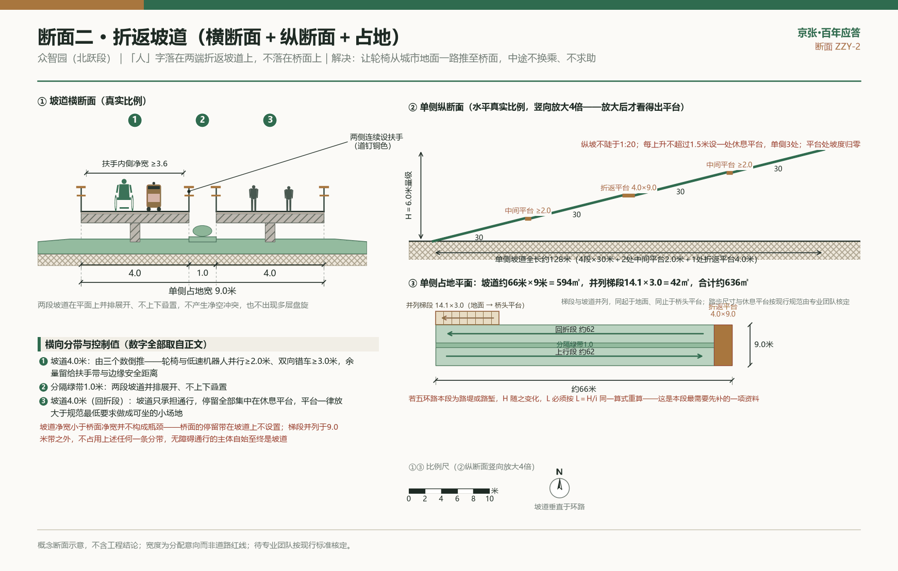

1909年，詹天佑用京张铁路回答了一个百年之问：中国人能不能自己修铁路。今天，同一条铁路腾出的约9公里遗址公园旁，海淀2000余家AI企业正在回答一个新问题：中国能不能自己做AI。本方案把京张遗址公园做成一份摊开在大地上的百年答卷——每一款海淀自主备案的大模型，就在步道边缘钉下一颗铜道钉；带内企业每达成一个可公开核验的里程碑事件，到大钟寺旁新铸的应答钟敲一响；每年3月25日，清华园车站只办公益性纪念开放日。市民不是来看展板的，他们蹲下来数道钉：中国自主创新，钉到第几颗了。

全部空间与开发内容均为概念建议、参考方案，供专业团队深化研究，不构成政府审定结论；本方案不提出容积率、建筑高度、道路红线、拆改留分类等任何结论性判断。

## 设计依据与资料清单

这个方案的设计依据首先是一段真实的百年史，其次才是一摞文件——设计的每一个动作，都从1909年的那个问题里长出来。那一年，京张铁路在关沟段爬不上天险的陡坡，詹天佑画了一个"人"字：列车驶入岔口、折返换向，用两段缓坡替代一段爬不动的陡坡。这条中国人自主勘测、自主设计、自主施工的铁路当年建成通车，回答了"中国人能不能自己修铁路"。1910年，清华园车站建成，站匾由詹天佑题写；1949年3月25日，中共中央"进京赶考"抵达北平，北京地区第一站就是这座小站；2023年3月25日，修缮后的老站房重新开放 [source:THU-STATION-2023]。铁路自己也交了卷：2019年京张高铁通车、老线腾退，铁轨让位给公园——2023年6月一期2.4公里、16.8公顷建成开放 [source:PARK1-YLLHJ-2023]；公园全长约9公里，二期沿线规划设置46个出入口 [source:PARK2-PLAN-2024]；二期2024年12月开工 [source:PARK2-START-2024]，并已于2026年8月6日正式建成、面向公众开放——二期用地约53公顷，向南向北双向延展串联西直门至北五环，全线构建“三道一绿”完整慢行系统，独立步行道、慢跑道、自行车道全线无断点贯通，直接服务沿线70个社区、约45万居民 [source:PARK2-OPEN-2026]。**这意味着本方案面对的不再是一条待建的走廊，而是一条刚刚建成、正在等待被使用和被讲述的走廊**——设计的着力点因此从“如何建成”转向“如何被日常使用、被持续讲述”。

公园两侧，答题的人已经坐满考场：海淀集聚AI企业2000余家、AI核心产业规模近3600亿元 [source:BJD-AI-2026]；备案上线大模型122款（截至2026年2月区政府正式口径）[source:HD-PLAN-2026]；全市累计备案上线209款、约占全国近三分之一，已写进统计公报 [source:BJ-STAT-2025]。把这两组事实叠在一起，方案的核心意象自然浮现：1909年与今天是同一道题的两次作答，这条9公里的公园就该做成摊开在大地上的答卷——道钉记录每一次作答，钟声宣告每一个里程碑，车站保存最初的题面。

落笔的边界由三份文件框定：《百年京张AI创新带城市设计国际方案征集资格预审公告》给出三层范围与设计任务，是本方案的第一依据 [source:OFFICIAL-ANNOUNCEMENT]；面向智能体的开源征集任务书给出六项任务与统一边界条款 [source:AGENT-TASKBOOK]；`brief/site-package/` 中经维护者登记的临时边界、枚举、指标与来源清单，是本方案全部图层与数字的直接底稿 [source:PROCESSED-FACT-PACK]。

设计还有一条不能越的基准线：《京张铁路遗址公园沿线（人工智能创新街区重点地区）HD00-1601等街区控制性详细规划（2024—2035年）》已于2026年8月11日获批公布，确立"一带一轴两心多点"的法定空间结构 [source:HD-CTRL-PLAN-2026]。本方案是这份已批控规之上的概念深化建议——不与法定规划并列、不替代法定规划、不引用其未公开的控制指标。方案的空间概念与法定结构天然对位：9公里"应答长卷"对应"一带"（京张遗址公园产业创新带），"鸣钟之门"（大钟寺）与"应答原点"（五道口·清华园车站）分别落在"两心"；全部空间表述仍为概念建议，待专业团队在法定框架内深化。

场地边界沿用维护者登记的临时粗略边界 [data:geometry/site_boundary.geojson#SITE-001]，全部标注为临时约束、非官方边界，只用于方案生成、自检、可视化与设计讨论，不作为官方红线、审批依据或精确面积依据；官方边界发布后，全部图层与指标将按登记的复算清单逐项重算 [depth:existing_conditions_diagnosis]。

## 三层范围工作框架

整个方案只讲一个故事，并把它讲进三个尺度：百年京张文化带是题面（1909年之问），AI融合创新带是答卷（企业与模型作答），都市AI生活体验带是阅卷现场（市民在9公里步道上数道钉、听钟声、看路演）。空间上，这个故事落为"一条9公里应答长卷主脊、南问—中答—北跃三段、东西46座应答门向近70个社区渗透"的总体结构（概念建议）：南段大钟寺"鸣钟之门"，中段清华园车站旁"应答原点"，北段众智园"人字之跃" [depth:overall_spatial_structure] [depth:three_level_scope_framework]。

征集要求的三个工作层次，在本方案里是同一份答卷的三种笔迹：统筹研究范围（约43.6平方公里）决定"写什么"——命名、生态、叙事与国际对标；总体设计范围（约11.4平方公里，京张遗址公园周边1-2公里城市地区）决定"写在哪"——更新框架、用地、慢行与公共空间；重点区域范围（约368.4公顷三处详细设计地区）决定"怎么落笔"——三段各自的地标、场景与实施依赖。三层任务与官方要求的逐条对应由合规矩阵承担 [standard:PROJECT-OFFICIAL-ANNOUNCEMENT]，空间证据以提交边界与三处重点区图层为准 [data:geometry/key_areas.geojson#PROV-KEY-001] [metric:key_area_count]。

| 层级 | 设计问题 | 本方案的回答 | 数据落点 |
| --- | --- | --- | --- |
| 统筹研究范围 | AI产业生态与未来城市形态如何组织 | "百年应答"命名与叙事体系、创新生态图谱、国际对标机制原型 | compliance_matrix.json、standard_matrix.json |
| 总体设计范围 | 更新框架、产业空间与风貌如何落图 | 应答长卷主脊+两翼十地块概念分区、断点先通后留、要素服务驿站 | [data:geometry/land_use.geojson#LU-001] |
| 重点区域范围 | 三处片区如何达到详细设计深度 | 鸣钟之门、应答原点、人字之跃三段详细概念设计 | [data:geometry/key_areas.geojson#PROV-KEY-003] |

任何无法从结构化数据复算的面积与规模，不写入正式结论；当前全部结论受临时边界限制，官方边界更新后须整包重算。

**六项智能体任务的对位。** 任务书 `agent.1`—`agent.6` 是强制回应项，本方案逐条落点如下；每条的完整证据链（章节、图纸、几何、指标、假设、自检项）见 compliance_matrix.json 中的同名条目 [source:AGENT-TASKBOOK]。

| 任务 | 一句话回应 | 正文落点 |
| --- | --- | --- |
| agent.1 总体概念与功能统筹 | 主名"百年应答"把三大定位收成题—答—阅一个故事，Logo母题为道钉截面×应答声环；空间落为9公里应答长卷主脊＋南问中答北跃三段＋46座应答门 | 本节、"统筹研究范围产业与未来城市研究" |
| agent.2 全栈自主创新体系与世界级生态 | 八要素×三区两翼配置创新生态图谱；国际对标六案每案分标可比与不可比点，只取机制原型、不取空间形态 | "统筹研究范围产业与未来城市研究" |
| agent.3 AI+场景与智能化活力城市 | 19张AI场景卡覆盖任务书重点方向点名的八类场景与三个概念层，含6张测试验证卡（S9—S12 与 S17、S18）、6类用户画像，每卡带数据档位、验收硬口径与退出条件 | "AI 创新生态、人才画像与 AI+ 场景" |
| agent.4 AI公共空间与朝圣地标 | 东西缝合三针法（断点客厅、46座应答门、要素服务驿站）＋三处朝圣地标（应答钟、应答原点、人字之跃）＋道钉带荣誉体系与标准组件库 | "重点区域详细设计""蓝绿空间、公共空间与城市风貌" |
| agent.5 百年京张与AI新文化叙事 | 门外刻1909之问、门内刻今日之答的双向刻字贯穿全线；导视统一于"京张三色"与道钉铜；国际传播用可核对的物证替代口号 | "重点区域详细设计""蓝绿空间、公共空间与城市风貌" |
| agent.6 全球活动体系与长期运营 | 3·25赶考日是固定的年度公共程序，青年策展权与社区认领构成常态运营，年度《百年应答报告》公开三张可审计清单 | "更新项目清单、实施政策与分期计划" |

## 统筹研究范围产业与未来城市研究

统筹层为这条带做三件事：起一个名字，配一套生态，找一组经过检验的参照。主案命名"百年应答（The Century Answer）"，把三大定位收拢为一个可讲、可走、可数的单一故事——题（百年京张文化带）、答（AI融合创新带）、阅（都市AI生活体验带）。命名族谱由主案统一派生：应答长卷（9公里主脊）、应答钟（大钟寺新铸之钟）、应答原点（清华园车站段）、应答门（46个出入口，以实际建成为准）、道钉带（备案大模型纪念带）、人字之跃（跨五环概念节点）。Logo主案母题为"道钉截面×应答声环"——俯视铜道钉的圆形，加向外扩散的声波环，声环同时呼应钟声与对话气泡；备选为"人"字形骨架抽象。全库防撞检索显示"人"字符号命中265份、已有竞品以人字为主形，主案因此避开人字主形与"道钉×光标"构图；"百年应答/应答钟/道钉带机制"全库仅0-1份命中，差异化立足机制层而非符号独占 [source:AGENT-TASKBOOK]。增量复检显示“作答/双答”类近名与泛“道钉”符号已在其他投稿出现，本案的区隔因此不押在词上、押在证据链上：应答的主语不是城市也不是算法，是四字段可核对的物证与年年具名认领它的人。Logo自带版本号（v1.0起钉），随年度迭代并归档，"会学习、能思考、可进化"从口号变成可查证的回路。

创新生态图谱按"土地—空间—产业—资金—人才—算力—数据—场景"八要素（口径对齐任务书 agent.2；政策工具贯穿八项、不单列为第九项）×"三区两翼"配置（概念建议），配置逻辑只有一条：把已有的产业家底与公园带的公共空间供给接上线路，而不是再造一个园区。海淀的家底足够厚——备案上线大模型122款（截至2026年2月区政府正式口径，占全市近六成）、PCT专利申请约5000件/年 [source:HD-PLAN-2026]；全市累计209款、约占全国近三分之一已进入统计公报 [source:BJ-STAT-2025]；AI核心产业规模近3600亿元、集聚AI企业2000余家 [source:BJD-AI-2026]；1.23万名AI学者、26家独角兽等口径见区级公开宣传材料，仅作背景描述。真正稀缺的是场景与数据：9公里连续公共空间加近70个社区的真实需求，是京张带独有的供给；土地、资金、算力以接入与衔接为主，不另起炉灶。

**“三区两翼”是市级布局，“一脊两翼”是本方案自用的空间说法，两者不是一回事，先说清楚再往下用。** 市级三区两翼指AI原点社区、众智园AI自主创新加速区、大钟寺AI产业集聚区三区，加中关村科技服务翼与小月河场景赋能翼两翼；本方案正文里的“一脊两翼十地块”只描述9公里主脊两侧的用地组织，是设计说法，不替代也不改写市级布局。两翼各给一条支撑机制的概念建议：**中关村科技服务翼**承接要素全球化配置与中关村IP、资本赋能，落点是要素服务驿站的第二类窗口——不办审批、不做兑付，只做三件可核验的事：把国家备案公告附件的四字段核验流程做成公开可复用的操作单；把海外团队落地所需的材料清单一次讲清、并保留无AI的人工窗口；把高校成果与带内企业的对接记录归入城市进化档案馆年度公开。**小月河场景赋能翼**承接AI场景赋能与智能化活力城市，本方案19张场景卡即按该翼的公共体验路径组织，测试验证卡（S9—S12）建议优先在该翼与已开放一期段之间划定测试环线，验证达标再逐级向社区延伸 [source:AGENT-TASKBOOK]。以上均为概念建议，不构成任何机构职能安排或政府决策。

**五大功能各自的空间落点。** 任务书的五大功能在本方案里不是五段口号，而是五处能走到的地方：**AI全栈自主创新体系**落在道钉带——每款备案模型一颗铜钉，四字段可对国家公告逐条核验，“自主”从形容词变成可数名词；**世界级AI创新生态**落在要素服务驿站与八要素配置，用已有家底接公园带的公共空间供给；**AI+场景赋能新范式**落在19张场景卡及其数据档位、验收硬口径与退出条件；**智能化AI活力城市**落在46座应答门与断点客厅——把AI服务放进居民每天穿行的那道口子，而不是放进一块大屏；**AI治理全球话语权**落在算法公示墙、算法应答窗口与年度《百年应答报告》的三张可审计清单——话语权不靠宣示，靠让任何人都能下载国家公告附件把本方案的数字重算一遍。

**区域协同同样只写可发生的动作。** 与北纬社区、未来科学城、怀柔科学城以及北京经济技术开发区（经开区）的协同，建议以“场景互开＋测试互认”为最小单元：本带开放公共空间类场景，对方开放产业与中试类场景，通过的测试记录互相承认、不重复验证，承认范围与失效条件随年度报告一并公示；京津冀层面建议把3·25赶考日办成开放日联办机制，各方各出一站、共用一套公示口径，联办与否由各方自主决定 [depth:renewal_project_list]。以上为概念建议，不构成任何跨区域协议、机构安排或政府承诺。

国际对标选六个案例，每案明标可比与不可比点：King's Cross（伦敦）以旗舰机构定义街区，同为铁路腾退地更新可比，单一开发主体的权属结构不可比；Kendall Square（剑桥）以共享实验室降低创业门槛，顶尖大学步行圈可比，生物医药重资产形态不可比；新加坡one-north以"小范围起步、验证一级放开一级"的分级测试制度直接启发本方案的机器人测试路径，城市国家的一元权属不可比；深圳河套证明小空间可承载高能级制度试验，但其跨境授权逻辑不可比、不得由此类推任何授权表述；首尔DMC展示"负资产翻转+锚机构先行"的路径，政府新建组团模式不可比；Sidewalk Toronto是数据治理失败的反例——大规模传感采集失去公众信任而退出，警示本方案一切数字触点默认最小采集、匿名化、清单公开。六案合起来一句话：**街区靠机制活下来，不靠概念活下来**。可借鉴的是四种机制原型（锚点定义身份、共享设施降门槛、分级放开测试、小空间集中试制度）加一条红线（数据治理先于技术部署），而非任何一案的空间形态 [standard:PROJECT-AGENT-OPEN-CALL-TASKBOOK]。

未来城市形态研究据此回答：AI改变的不是楼，而是人愿意在城市里做什么。本方案把"数道钉、听钟声、穿应答门、登人字桥"设计为AI时代的日常城市动作，把统计公报里的产业数字翻译为可蹲下来触摸的公共空间证据 [depth:overall_spatial_structure]。

## 总体设计范围城市更新与控规深度城市设计

总体设计范围做一件事：把被铁路隔开百年的东西两岸重新缝起来。更新框架为“一脊、两翼、十地块”（概念建议；法定结构中的“一轴”专指中关村大街创新发展轴，本方案自有骨架统一称“长卷主脊”以示区分）：9公里公园绿廊为长卷主脊 [data:geometry/land_use.geojson#LU-001]，两翼按南问、中答、北跃三段布置文化、商业、科研、居住、科教、商务与弹性留白等十个概念地块分区，其中北跃段专设弹性留白用地 [data:geometry/land_use.geojson#LU-010]，为"未来之问"保留不被今日答案填满的余地。这套框架整体摆在已批控规"一带一轴两心多点"的法定结构之内——长卷主脊即法定结构的“一带”，两翼地块在“两心多点”的框架内组织，不改变、不替代任何法定控制内容 [source:HD-CTRL-PLAN-2026]。

先要把问题说准：**南北贯通与东西缝合是一对策略，但两者此刻的任务完全不同。南北贯通在物理层面已经完成**——二期建成后，南北向的慢行已由“三道一绿”全线无断点贯通 [source:PARK2-OPEN-2026]，因此本方案对南北贯通的设计动作不是再修一条路，而是**把已经贯通的九公里做成一条读得下去的长卷**：主脊全线连续、道钉带沿步道边缘不间断、K0–K9 桩号与三段叙事（南问—中答—北跃）在空间上首尾相接，让人走完全程时读到的是一个完整故事而不是三段互不相干的景观。**真正没解决的是东西向穿越**——13号线高架与老旧铁路路基形成天然空间隔断，沿线围墙围栏割裂街区，东西向居民通行受阻，桥下闲置空间被无序停车占用。缝合因此用三种针法。其一，**断点客厅（先通后留）**：这里的“断点”专指东西向穿越阻隔，不指公园纵向慢行——对每处东西向阻隔先给概念级穿越优化策略，再叠加场景，穿越空间同步配置座椅、风雨棚、信息屏与饮水点的组合家具，把“等待通过”变成“愿意停留”；桥下无序停车空间是优先改造对象。其二，**46座应答门×70社区认领**：依托二期规划的46个出入口（以实际建成为准 [source:PARK2-PLAN-2024]），每座门做成"一页翻开的考卷"——门外一面刻百年之问、门内一面刻今日之答，由沿线近70个社区认领。其三，**要素服务驿站**：沿公园东西两侧低效空间布点政策咨询、备案辅导、成果对接驿站（非当场兑付），离公园越近共享度越高——用功能制造东西穿行的理由，人愿意穿过去，才叫缝合 [data:geometry/public_space.geojson#PUBLIC-005]。

道钉带是最细也最长的贯通要素：全线统一的步道边缘铜道钉带，沿已建成贯通的慢行系统连续铺陈，让"答卷"在视觉上先写通。地块分区在EPSG:4548投影空间完成拓扑校验（覆盖缺口小于1平方米、重叠小于1平方米），用地代码全部取自场地包枚举，深度要求对照控规城市设计深度执行 [standard:MOHURD-CONTROL-DETAILED-PLANNING] [depth:land_use_layout]。城市更新的综合承载、市政支撑与风貌控制按总体城市设计方法统筹 [standard:MOHURD-URBAN-DESIGN-MEASURES]；凡涉及建筑高度、开发强度、道路红线、退线与设施标准的内容，本方案一律不给结论数值，统一表述为"待正式控规条件确认"，相应指标在指标表中如实保持未知状态 [depth:development_intensity_controls]。

## 重点区域详细设计

三处重点区域在9公里长卷上各任一段叙事：大钟寺是南问，清华园车站是中答，众智园是北跃 [depth:three_key_area_detailed_design]。三处重点区的设计陈述分两类，读时请分开看：一类**不随任何官方资料改变**——红线、权属、文保范围与竖向资料无论怎么变，它都成立，这类句子在各段就地标出；另一类须在资料到位后按 A-RECALC-001 逐项重算，**凡带尺寸的数字都属于后者**。三区共用官方面积口径：众智园192.1公顷、AI原点社区104.3公顷、大钟寺72.0公顷；提交图层沿用临时粗略范围，不作为官方红线或精确面积依据 [data:geometry/key_areas.geojson#PROV-KEY-002]。

**大钟寺AI产业聚集区=鸣钟之门（南问段）。**概念核心是"应答钟与钟声广场"：一方开敞圆形广场，地面以同心声波环铺装向外扩散（Logo母题的地面放大），圆心立取京张桁架语汇的钢结构钟架——工字钢、铆钉节点、道钉形收头，架下悬一口**当代新铸**的青铜应答钟；1733年始建的大钟寺古建群在远景中完整独立，与新钟架之间以绿化缓冲带和步道明确拉开距离，一古一今、遥遥相望而非贴身并置 [source:DZS-MUSEUM-2021]。铁律有二：其一，应答钟与古钟博物馆及其馆藏文物仅为文化呼应关系，**绝不敲击、绝不移动、绝不商业化使用任何文物古钟**；其二，大钟寺为全国重点文物保护单位，钟架与广场一律退出文物保护范围及建设控制地带，**具体选点、退让距离与体量控制均为待文物主管部门协商的概念建议**，钟架高度以不高于周边行道树冠层为控制意向，绝不与古建争夺天际线。带内企业每达成一个可公开核验的里程碑事件即可预约敲钟一响，敲钟资格与可公开核验事件绑定：事件类型开放，但须有政府、交易所或其他第三方的公开可查记录（如大模型完成备案、新模型发布并备案、企业上市），记录事实、不背书企业。四条"声波径"从广场辐射进地铁13号线大钟寺站周边四个象限，缝合被道路切分的步行流线（流线组织为概念建议，交通方案待专业团队深化）[data:geometry/public_space.geojson#PUBLIC-001]。商业路演、敲钟仪式、道钉安装仪式全部集中于本段与众智园段承接。

**实施三步：按"依赖什么条件"分步，而不是按"做多大"分步。** 分步依据是前置条件的可控性，因此第一步完全不依赖用地条件，可与更新程序并行推进 [depth:phasing_implementation]。**第一步"先把路走通"**：内容为既有过街点的一次过街到位改造、桥下通廊、四条声波径的标线与铺装级贯通、导览应答桩与断点客厅家具组布点；前置条件是桥梁管养单位使用许可、道路管理单位的过街改造许可、桥下现状停车使用主体的清退或规范协商；角色建议由区级更新统筹部门牵头，道路与桥梁管养单位、轨道运营单位、属地街道与社区参与；验收以绕行系数、过街等待时间、桥下通廊日均步行量的改造前后实测对比为准。**第二步"把广场腾出来"**：内容为1.0公顷集中公共开放空间落位与建设、钟架与仪式核心、广场边界断面；前置条件是一宗低效用地更新进入实施程序并在出让条件中写入配比与"集中"判据、文保范围与建设控制地带官方矢量边界取得并完成协商、地下轨道与管线避让核查完成；角色建议为规划自然资源主管部门定出让条件、文物主管部门定退让与风貌、更新实施主体建设、区级更新统筹部门统筹；验收以广场建成即开放、开放时间与管理主体已公示为准。**第三步"让它响起来"**：内容为应答钟铸造安装、敲钟事件受理机制、S4场景上线；前置条件是敲钟事件的可核验判据与受理规则经主管部门确认、噪声评估通过并与东南居住象限完成沟通、S4的无AI等价通道就位；验收以首次敲钟事件完成归档且可公开查询为准。

**现状诊断：四条痛点在大钟寺站域各有精确落点。** 南问段的设计前提是一句实话——这里没有可供落笔的空地，只有可供重组的既有空间。公开地图数据显示，大钟寺周边约0.9×0.85公里（约76.5公顷）范围内建筑逾50栋、基底合计约15公顷，基底覆盖率约两成、单栋基底均值约3000平方米 [source:OSM-ODBL-2026]。这个均值说明的是问题的性质：站域由卖场与板式办公构成，是**大盘子街区而非小街坊**——街墙连续、首层开口少、地块内部不可穿行。四条痛点由此各有落点 [source:PARK2-OPEN-2026] [depth:existing_conditions_diagnosis]。

其一，**南北向屏障不可开口**：京包铁路老路基与13号线高架在站东约50至130米处自北向南连续贯穿，东西向的穿越机会只能出现在既有道路跨越点上，不可能在路基上随意增设开口——这决定了本段所有缝合动作都是"用足既有穿越点"，而不是"新增穿越点"。其二，**围墙把短距离拉成长绕行**：站东的明光西路（距站约74米）与站西的四道口北街（距站约269米）最近处东西直线相距仅约270米，却分属铁路走廊两侧、各自被地块围墙封闭。其三，**东西向通行受阻的方向最不巧**：站东南侧明光路、明光东路一组在公开地图数据中均为居住性道路，是站域最可能的通勤起点侧，而就业与商业集中在西侧与北侧，日常最强的东西向流线恰好正对屏障。其四，**桥下带子压在主流线上**：北三环主路在站西约790米至约110米之间为高架（即北三环西路与中关村东路—皂君庙路相交的立交，习称联想桥），长约680米，其东端落地点距地铁站仅约110米——被停车占满的桥下空间，正压在站厅通往西侧街区的步行主流线上 [source:OSM-ODBL-2026]。

三项现状数据本包未登记、必须由专业团队实测补齐，补齐后本段可从概念深化到方案深度：一是文物保护范围与建设控制地带的官方矢量边界（补齐后钟架与广场可给出确定退距与视线控制线）；二是各既有穿越点的净宽、净高、信号配时与行人等待时间（补齐后三处断面可从意向宽度推进到渠化设计）；三是站域地下轨道结构与市政管线的埋深与保护范围（补齐后钟架基础可进入结构选型）[depth:risk_missing_data]。

**站城关系：钟声广场是大钟寺站的"地面第二站厅"。** 本段把广场定义为交通设施的延伸而非景观点缀——13号线大钟寺站为高架站、站厅规模有限，站前空间目前被辅路、桥下停车与地块围墙瓜分，换乘、集散、等候三件事全部挤在人行道上。广场要做的是把这三件事从人行道与辅路边挪进一块专门的地面空间，这也是"两心"之一的大钟寺中心在地面上最直接的空间兑现 [source:HD-CTRL-PLAN-2026] [data:geometry/key_areas.geojson#PROV-KEY-003]。落到设计上是三条硬要求：广场外环朝向站厅的一段做成"等候面"，风雨棚、信息屏与座椅成组布置，让等人等车的行为离开人行道；四条声波径的起点在广场外环上按四个方位定位，与站厅出入口之间保证一次连续、不二次过街的步行联系；非机动车停放与低速配送机器人待机位统一收进广场外环缓冲带，不占声波径通行净宽。需要如实说明的是，第二条要求只有广场所在的象限能在一期做到：西北向须横跨三块板的三环走廊，东南、东北两向还叠加不可穿越的铁路走廊，这三向的"不二次过街"只能作为分期目标，不能写成一期承诺。

**四象限缝合：先判断哪个象限该放广场，再给各自的针法。** 广场选址不指定地块，但给出可核算的五条判据，专业团队据此在权属清单上套图即可收敛：退出文物保护范围与建设控制地带；位于13号线站厅步行五分钟等时圈内；至少两面贴邻既有城市道路的人行界面；四条声波径的起点均能落在广场外环上，且其中不少于两条不跨越铁路走廊即可抵达所服务的象限；来自低效用地更新腾退，不新增征地。五条判据同时满足度最高的是**西南象限**——13号线站厅的两处出入口均位于铁路走廊以西、北三环以南，广场落在此侧则出站即达、无需跨三环也无需跨铁路，且距文保范围最远，建议优先在该象限的更新中落实。权属条件不允许时的退让次序及其理由一并写明：东南象限（日常使用需求最强，但到站厅须跨铁路走廊）、西北象限（可用净地最少且退让要求最严）、东北象限（为绿廊本体，不宜以广场置换公园）[data:geometry/public_space.geojson#PUBLIC-001]。

**西南象限（站厅同侧，广场首选载体）**：现状问题是出站向西的流线一出闸机就撞上高架落地段，人被挤在辅路侧石与停车之间。缝合手法是把流线**从辅路边挪进桥下**——将高架东端连续空间改为受管理的公共通廊（见断面三），使"站厅→广场"全程在结构遮蔽下、与机动车物理分离。这是本段最短、最省、见效最快的一针，且不依赖任何用地条件。**东南象限（居住侧，日常使用强度最高）**：现状问题是居民到站厅要先向北穿越北三环南辅路、再沿铁路走廊西侧绕行。手法不是新增穿越，而是**把现有的一次穿越做透**——在最靠近站厅的既有过街点做"一次过街到位"改造（见断面一），并把沿线围墙改为可管理开口（社区侧可设时段管理，非全时开放也算通）。验收用绕行系数（实走距离÷直线距离），目标不大于1.5。**西北象限（文保侧，只做减法）**：1733年始建的大钟寺古钟博物馆为全国重点文物保护单位，位于本象限 [source:DZS-MUSEUM-2021]。此象限**不进任何新增构筑**——钟架、广场、装置一律排除，缝合动作只有三项：既有街墙首层增设向公园方向的步行开口、沿大钟寺东路人行道拓宽并把灯杆指示牌归位进设施带、维护从公园主步道望向古建群方向的视线通廊不新增遮挡。**东北象限（绿廊本体与其东侧街坊）**：二期建成后南北慢行已在绿廊内贯通 [source:PARK2-OPEN-2026]，问题只在绿廊与三环、绿廊与东侧街坊之间的围栏分隔——园里走得通，园外进不来。东北向声波径要同时跨越三环与铁路走廊，是四条中最难的一条，本方案不强求一期贯通，而是**先把终点做实**：在绿廊东侧边界靠近三环处设一座应答门（沿用全线标准套件），把东侧街坊直接接进绿廊，绿廊本体断面维持现状、不因广场而改造；出入口以实际建成位置为准 [source:PARK2-PLAN-2024] [data:geometry/roads.geojson#ROAD-003]。

**钟声广场平面组织：三条同心环带把1.0公顷分完，同心环是图案不是台阶。** 广场约100米见方、1.0公顷，地面以同心声波环铺装向外扩散 [data:geometry/public_space.geojson#PUBLIC-001]。三个环带的划分不是构图偏好，而是由使用强度与设施荷载定的，面积可逐项复算：

| 环带 | 尺度 | 面积 | 功能与做法意向 |
| --- | --- | --- | --- |
| 仪式核心 | 直径约30米 | 约700平方米 | 钟架居中；不设固定座椅与树池，保证敲钟与观礼净空；地面预埋可拆卸旗杆基座、临时护栏地脚与转播机位插座，日常封盖与铺装齐平 |
| 日常活动环 | 直径30至70米，环宽约20米 | 约3100平方米 | 广场主要使用面；声环座椅沿环线断续布置、每段坐3至4人并留轮椅停靠位；乔木沿环切线成组种植、不进入内环视线；朝站厅一段做"等候面"，配风雨棚与信息屏 |
| 边界缓冲带 | 直径70米外至广场边界，进深自边中点约15米向转角放大至约35米 | 约6200平方米 | 消化与城市道路的高差、雨水滞蓄（下凹绿地与透水铺装）、非机动车停放与机器人待机；转角放大处正好容纳停放与待机，不挤占通行 |

三条环带合计恰为10000平方米。**关键构造纪律只有一条，且不随任何官方资料改变：同心环之间不得出现高差**——三带以铺装质感与色带区分，全场无台阶，环向拼缝做密缝、缝宽按现行无障碍设计标准的地面缝隙上限从严取值，避免卡住轮椅前轮与拐杖尖 [standard:BARRIER-FREE-ENVIRONMENT-LAW]。

**钟架与四条声波径：钟架不与任何既有物相连，声波径靠颜色而不靠凸起导向。** 钟架为独立的四柱钢结构闭合框架，工字钢柱身、铆钉节点、道钉形收头，柱脚落在自身独立基础上，**不依附、不搭接、不受力于任何既有建筑或古建**；钟体自重与敲击时的冲击荷载由该独立基础承担（外撞式钟体本身不摆动，摆动的是撞木，动荷载来自撞击的水平分量），基础埋深与位置须先完成站域地下轨道结构与市政管线的避让核查，核查未完成前不得定桩。仪式核心取直径约30米不是构图取整，而是两项净空叠加的结果：内圈是外撞式撞木的水平操作与安全避让区，外圈是敲钟事件的观礼站位——按站立观礼的常规密度，约700平方米的核心可容纳一次仪式所需的观礼规模而不外溢到活动环，具体人数上限由专业团队按现行场所疏散要求核定。体量控制沿用不与古建争天际线的原则：钟架高度以不高于周边行道树成年冠层为上限意向，具体数值待专业团队按风貌与文保要求核定。在文物保护范围与建设控制地带的官方矢量边界取得之前，本方案以"钟架与广场一律不进入西北象限"作为可立即执行的替代约束；边界取得后再按协商结果给出确定退距。夜间照明不做泛光：线性地埋灯嵌在环缝内、亮度由内向外递减，让声波扩散在夜间同样可读；钟架只做贴附式结构轮廓洗亮、不设向上投射灯具；常规照度由环带外缘的冠下低杆灯提供；朝东南居住象限一侧加设遮光罩并从严控制该方向垂直照度；敲钟事件时内环临时提亮、事件结束即回落，不设常夜动态或彩色灯光。四条声波径的做法统一：铺装把同心环转为垂直于行走方向的平行波纹带、间距由密到疏提示离广场渐远，波纹靠面层骨料与颜色变化实现，**一律不做凸起**——凸起会绊人、卡轮椅、让低速机器人抖动。通行净宽不小于3.0米（可容一台轮椅与一台低速配送机器人错车），沿街段在净宽之外另加0.8至1.5米设施带（灯杆、树池、指示牌、机器人待机位统一进带），建筑退线段可再加0.5至1.0米界面活动带，总宽意向沿街段4.5至6.0米、穿地块内部段3.5至4.5米；纵坡控制意向不陡于1:20，转弯处内侧净空半径不小于1.5米，每约150米设一处宽约1.2米、长约3米的凹入让行港湾，落实"轮椅优先、机器人强制停让"。以上均为概念断面示意，不含工程结论。

**三处概念断面（均为概念断面示意，不含工程结论，宽度为分配意向而非道路红线）。** 三处对应本段最难的三种界面：穿越车行道、贴邻城市道路、桥下改造 [depth:traffic_rail_slow_parking]。

| 断面一 · 声波径穿越城市道路（以东南向径穿越北三环南辅路为例） | 做法意向 |
| --- | --- |
| 现状条件 | 北三环走廊在站前为南辅路—主路—北辅路三块板，横向总宽约50至60米；主路于站西约110米处落地，站前一段为地面段 [source:OSM-ODBL-2026] |
| 宽度分配 | 过街段总宽不小于6.0米：通行净宽4.0米，两侧各1.0米等候面；中央安全岛进深不小于2.5米，容一台轮椅与一台低速机器人同时候行而不越线 |
| 高差处理 | 全程无台阶，过街段路缘石做齐平处理（缘石高差降至与路面平），排水改由两侧线性排水沟承接，不用"缘石坡道加落差"解决 |
| 材料意向 | 过街段面层用与声波径同色的整体面层，与沥青路面形成色差，靠颜色而非凸起提示驾驶人 |
| 无障碍 | 两端各设宽0.6米触感提示带并与盲道系统连续；增设过街音响提示与延时按钮 [standard:BARRIER-FREE-ENVIRONMENT-LAW] |
| 机器人兼容 | 机器人与行人同相位、同速度上限，不单设机器人相位；安全岛划机器人等待区标线 |
| 待专业深化 | 信号配时与渠化、缘石齐平后的排水与冬季除雪、主辅路交织段安全评估 |

| 断面二 · 广场边界与城市道路的界面 | 做法意向 |
| --- | --- |
| 总体主张 | 广场与道路之间不做围墙、不做抬高台地，用一条进深约15米的缓冲带把高差、雨水、停放、机器人待机全部消化在带内 |
| 宽度分配（自道路侧向广场侧） | 既有人行道保留、设施带归位；外侧3.0至4.0米为非机动车停放与机器人待机（透水面层，标线与矮绿篱限定，不设高栏杆）；中段6.0至8.0米为下凹绿地带，承接广场硬质面雨水，乔木成组种植遮蔽道路；内侧3.0至4.0米为无台阶入口面，与广场外环铺装齐平 |
| 高差处理 | 广场与相邻人行道的高差全部在缓冲带内以不陡于1:20的缓坡消化；确需集中消化时设轮椅坡道（纵坡不陡于1:12并按标准设休息平台）并同步设台阶，**不允许出现只有台阶的入口** [standard:BARRIER-FREE-ENVIRONMENT-LAW] |
| 材料意向 | 缓冲带以透水铺装加种植土为主，与广场整体面层形成质感对比；边界用高差、绿篱与铺装变化限定，不用连续实体围墙 |
| 机器人兼容 | 声波径穿过绿带处通行净宽保持3.0米不被绿化侵占；外侧待机位就近接入既有市政供电，不新增独立机房 |
| 待专业深化 | 竖向与排水专项、雨水滞蓄容量核算、树种与土壤厚度 |

| 断面三 · 桥下空间由无序停车改为公共使用（以高架东端落地段为例） | 做法意向 |
| --- | --- |
| 现状条件 | 高架段自站西约790米延伸至约110米处落地，长约680米，东端正压在站厅通往西侧街区的步行主流线上；现为无序停车占用 [source:OSM-ODBL-2026] [source:PARK2-OPEN-2026] |
| 结构纪律 | 现状桥墩轴线与承台原位保留、不做任何改动；新增设施与墩柱之间留检修间距不小于0.6米，**一律不依附、不受力于桥体** |
| 宽度分配 | 通行区3.0至4.0米连续步行通廊，全程无台阶、与桥下现状地面找平；活动区4.0至6.0米，断点客厅家具组按墩柱开间成组布置、每开间只做一件事，不连续摆满，保证视线通透与消防通道 |
| 停车处置 | 不追求全部清退：清得掉的先清、清不掉的先规范（划线、限位、纳入统一管理），这是"先通后留"在桥下的具体做法 |
| 材料与照明 | 通行区用耐磨、防滑、易清洗的整体面层（桥板遮蔽、无雨水下渗需求，不用透水做法）；照明贴附桥板下缘、不落杆；桥下白天亦为暗区，按全天候通行标准从严取照度 |
| 无障碍 | 通廊纵坡随现状地面、控制意向不陡于1:20，与两端人行道衔接处齐平；**通廊在高架落地端因桥板下缘净高递减而自然终止，终止点由实测净高确定，不强行贯通至落地点**，终止处以护面包覆与警示标识收头 |
| 机器人兼容 | 通廊是本段唯一有连续遮蔽的段落，定为低速机器人雨雪天气优先通行段；活动区一侧设充电与待机位 |
| 待专业深化 | 桥梁管养单位使用许可与安全边界、现状停车权属与使用主体、消防与疏散、结构检测与限载 |

**沿街界面与更新机制：把"四分之一"变成能验收的空间要求。** 本片区低效商业用地经"政府统筹加社会资本参与加挂牌出让"转型科技办公与创新交往、并明确要求提升绿化景观与完善步行系统，已有公开先例可循 [source:LJLJ-RENEWAL-2026]。正文已提出在后续更新中按不低于地块四分之一预留约1公顷集中公共开放空间的机制建议，这里补三条使其可验收：其一，**"集中"必须有判据**——该空间应为单一连续用地、短边不小于90米、不被市政道路或车行出入口切分。90米不是拍出来的：直径70米的日常活动环外缘两侧各需不少于10米缓冲进深，短边小于90米则上文的同心环体系无法成立，四分之一的配比就会退化成几条沿街绿带，达不到广场的作用；其二，**兑现顺序**建议公共开放空间与地上开发同步设计、先于地上主体交付投入使用，避免楼建完了广场还是工地；其三，**开放义务**建议在出让条件中一并明确开放时间、管理主体与不得封闭的责任。本方案只定义机制与验收口径，不指定地块、不处置任何主体的权属与开发安排 [depth:renewal_project_list]。沿街界面的底层活力同样落成两条可查指标而非态度：沿声波径与广场边界的街段，首层每不大于30米应出现一处向街开口（门或可开启界面）；首层功能采用**负面清单**而非正面清单——广场边界与声波径沿线首层不布置无人值守设备房、车库出入口、封闭仓储与整段封闭展厅，允许什么交由市场决定。要素服务驿站在本段设一处、贴广场外环布置，作为广场的室内延伸，并保留人工窗口 [standard:ELDERLY-SMART-TECH-PLAN-2020-45]。

**投资量级只给基数与资金渠道分档，不给金额——这是资料缺口，不是省略。** 可直接交付估算的工程量基数是确定的：广场硬质与绿化10000平方米（仪式核心约700、日常活动环约3100、缓冲带约6200平方米）、桥下通廊按高架东端约680米中实际可改造段计长、四条声波径按各自到达第一个生活目的地的长度计、断点客厅家具组按墩柱开间数计、钟架一处、导览应答桩两处。单价须取自公开造价指标（园林绿化与市政工程投资估算指标、住房城乡建设主管部门定期公布的工程造价指标），**本提交包未登记造价类来源，故本方案不填单价、不给金额区间**；补齐一套公开造价指标后，上述基数可直接推进到分项投资估算表深度。在没有单价的前提下仍可给出对实施更具决定性的资金渠道分档：第一步为设施级投入，工程量以线性米与家具件数计，可由日常维护与小微更新渠道消化、无需独立立项；第二步为场地级投入，随更新地块一并实施、不单独占用财政；第三步为项目级投入，须独立立项，且钟体为单件定制、造价离散度高，不宜与前两步打包报批。

**S4「钟声广场·四象限换乘慢行助手」的落位、判据与退出条件。** S4不新增设备类型，全部沿用全线标准化组件库的导览应答桩，点位共两处有源、四处无源：广场外环"等候面"设主机位一处，桥下通廊中段设副机位一处（服务西向流线并兼作雨雪天气信息点），四条声波径起点各设一处无源方向应答牌（仅铺装嵌字与触感标识，不带屏、不带传感器）。设备意向为屏、扬声器、实体按键与近场触点的组合，副机位因桥下反光与易损而去屏、保留语音与实体按键；供电与通信接入既有市政管线、不新增独立机房 [depth:municipal_new_infrastructure]。服务内容须写清楚，否则不知该预留什么条件：回答"去某地从哪个口出、走哪条径、多久、有没有台阶"，并给出分人群路径（轮椅与推车路径避开全部台阶与陡坡、雨雪路径优先桥下通廊、夜间路径优先照明连续段），播报四条声波径的当前可用状态（施工封闭、活动占用、机器人密集时段）；输出一律带AI生成标识，交通建议为参考、非审定方案 [standard:GENERATIVE-AI-INTERIM-MEASURES]。上线前置条件是无AI等价通道就位——同一信息以固定印刷版四象限步行图加触感标识常设于桩体，语音播报与大字模式常开，任一时刻AI服务不可用时固定版信息仍完整可读；做不到即不得上线 [standard:ELDERLY-SMART-TECH-PLAN-2020-45] [standard:BARRIER-FREE-ENVIRONMENT-LAW]。

验收判据五条，全部可测可复核：四个象限的绕行系数不大于1.5，且轮椅路径与步行路径的绕行系数之差不大于0.2（即轮椅不比走路绕得多）；从站厅出入口到广场外环的轮椅路径全程无台阶且无需二次过街——只有广场所在的西南象限为一期达标目标，西北向须横跨三块板的三环走廊、东南与东北两向受铁路走廊限制，如实列为分期目标；主机位在无网络状态下仍能提供固定版四象限步行图与语音播报；现场人工复核抽查中路径建议与实际可通行状态不一致的比例低于主管部门在试点方案中设定的阈值；全周期零人脸识别、零个体轨迹留存，采集清单公开可查。退出条件五条同样写在明处：连续两个考核周期未达前两条判据，关停AI服务、保留固定版信息、不拆桩；出现任何超出L1档位的采集行为或采集清单与实际不符，立即关停并公开说明；出现因路径建议导致的通行安全事件，立即关停并人工复核全部建议逻辑；四象限缝合完成后若实测显示固定版信息已足以支撑寻路、AI调用量长期低于设定阈值，则主动退出、桩体降级为纯导视构件；退出时设备回收、桩体保留（它同时是标准组件库构件与盲道引导终点），**不在城市里留下无人维护的黑屏设备** [depth:three_key_area_detailed_design]。

广场的地从哪来？这是这一段最实在的问题。实测显示大钟寺周边约0.9×0.85公里范围内建筑逾50栋、基底合计约15公顷，是完全建成的高密度地区，没有现成空地——**广场只能从城市更新中来，不能从图纸上凭空画出来**。这条路径在本片区已被走通并公开：大钟寺先导区内已有低效商业用地（家居建材卖场）通过“政府统筹+社会资本参与+挂牌出让”模式列入城市更新，由零售业态转向科技办公、创新交流与公共服务复合功能，明确要求提升绿化景观、完善步行系统，并被定位为京张遗址公园创新交往带的重要节点、纳入已批控规体系 [source:LJLJ-RENEWAL-2026]。本方案由此提出的是一条**机制建议而非选址指定**：在南问段后续推进的低效用地更新中，建议按不低于地块四分之一的比例预留一处约1公顷（约100米见方）的集中公共开放空间，作为钟声广场的空间载体；具体落在哪一宗地、如何实施，由权利人、主管部门与专业团队在法定程序中确定，本方案不指定地块、不处置任何主体的权属与开发安排。这个尺度也经得起核算：1公顷广场在3-4公顷量级的更新地块中约占四分之一，与这类项目自身“增绿地、通步行”的更新目标同向。

**北京AI原点社区=应答原点（中答段）。**这一段的设计主张只有一句：不新建地标，把"原点"做成一个可以年复一年回来的坐标。清华园车站老站房（1910年建成、詹天佑题写站名）文物本体不动一砖一瓦；站前只留一方0.6公顷的"素广场"，广场上只放两件东西——一册可翻动金属书页的"应答簿"与"道钉带零公里桩"（K0+000，柱脚嵌第0号道钉，刻"1909年京张铁路建成通车"这一事件本身）[data:geometry/public_space.geojson#PUBLIC-002]。104.3公顷的重点区范围在提交几何中复算为104.32公顷、面积口径吻合，范围外接矩形约948米×1117米，长卷主脊慢行主线在本段的长度为1110米——这三个数字是本段全部工程量估算的基数 [data:geometry/key_areas.geojson#PROV-KEY-002] [data:geometry/roads.geojson#ROAD-001]。还有一组口径必须并列摆出、绝不能混用：AI原点社区的官方四至为东至王庄路及展春园西路、西至中关村大街、北临清华大学、南抵北四环西路，辐射周边约3平方公里、已集聚400余家企业 [source:AI-ORIGIN-2026]。**那是产业街区的辐射口径，与甲方公告的104.3公顷重点区口径不是同一个范围**——本段的空间设计只对104.3公顷负责，3平方公里的企业与人口只用来判断需求强度、不用来放大设计范围。此外，面积吻合也不等于位置吻合：本段提交几何的质心较真实清华园车站旧址（116.3256°E、39.9902°N）东偏约1.9公里，与正文已披露的1.9–2.7公里偏差一致。因此下文一切位置关系均为临时边界口径的概念示意，而全部距离量算与现状读数取自真实地物坐标，两套口径在文中分别标明、不混用。

**分步时序按"能不能动土"分三步，不按年份分。** **第一步·零基础工程**（不动土、不改结构、当天可撤，全部内容在文保范围公布前即可实施，公布后若有冲突可整体撤走）：贴边步行带补齐；道钉带嵌装试段（建议100–200米，含完整流程演练一遍——核对国家公告附件、区级归属公示、嵌装、归档编号与影像）；素广场按1:1可逆布置一次，做出零公里桩与应答簿的原型；一处围墙透段试点（单元长度6–12米）；3月25日以现状场地办一次纪念开放日。第一步的最小可验证包＝1座已认领应答门＋1段100米道钉试段＋1次3·25纪念开放日：三件互不依赖，任一可单独实施、按表B同名场景卡的硬口径单独验收、单独撤回。**第二步·等条件**：文保范围公布后启动素广场固定化设计；桥下空间使用主体确认且既有结构资料到手后，断面二进入专项；校园权属与安全管理意见到手后，开口段以可逆做法试运行一个完整学年，共享时段同步试排。**第三步·固化**：三处断面的样段推广至全段；共享时段固定为公开时段表并现场公示；驿站与半步空间的布点按第一步、第二步的实测读数调整，**不按规划图一次固定** [depth:phasing_implementation]。

**现状诊断：不是缺路，是墙、站、腿三件事没接上。**遗址公园二期建成后，南北向"三道一绿"已全线无断点贯通，本段的真问题全部发生在东西向 [source:PARK2-OPEN-2026]。第一是墙：以真实站址为圆心量算，半径1.2公里内即有4处高校校区，2公里内可数出8处（含清华大学、北京大学、中国科学院大学等的校区与院系园区）[source:OSM-ODBL-2026]。这些围墙是权属边界与安全边界，不是设计对象——它们既不能拆，也不该被当成立面来"美化"，本段能动的只有墙外侧的城市空间与墙体上部的可替换段落。第二是站：五道口站为高架站（结构标签viaduct、layer 1）、清华东路西口站为地下站（tunnel、layer -4），真实站址距前者约540米、距后者约1.2公里 [source:OSM-ODBL-2026]。两站的接驳几何完全不同——高架站的一体化问题在桥下与垂直交通落地点，地下站的一体化问题在出入口周边地面空间，**用同一套接驳做法必然有一处做错**，这是本段站城设计的第一条判断。第三是腿：学生与研究者的日常动线是"宿舍—实验室—孵化空间—地铁"四点循环，而这四点分处围墙两侧，东西向每一次穿越都要绕到校门；官方现状痛点清单里"围墙围栏割裂街区、东西向居民通行受阻、桥下闲置空间沦为无序停车场"三条，在本段同时成立 [source:PARK2-OPEN-2026]。诊断结论因此是明确的：本段不需要新增用地，需要的是**把绕行距离降下来**，而降绕行的三种手段（贴边、穿下、借道）分别对应零权属成本、单一权利人、多权利人三种谈判难度，应当按此顺序推进 [depth:existing_conditions_diagnosis]。

**空间结构：一点、两口、一带、一线。**应答原点在中答段承担三个角色，且互不重叠：叙事上是全线道钉带的K0+000起读点；活动上是全线的"安静段"（仪式与路演类活动按正文分工不在本段发生）；机制上是每年3月25日公益纪念开放日的固定场所。空间上落为：一点即站前素广场0.6公顷；两口即五道口站与清华东路西口站两个接驳口，分别按高架与地下两套断面组织；一带即公园东翼慢行公共活动界面带在本段的3.33公顷，是要素服务驿站与验证界面的布点走廊 [data:geometry/public_space.geojson#PUBLIC-005]；一线即东西缝合概念示范线，全长1091米、其中940米落在本段，穿越点数量按下文间距判据推定 [data:geometry/roads.geojson#ROAD-004]。"低扰动"在本段是三个可执行的动作，不是一句态度：**只在城市侧动土**（贴边步行带全部落在城市用地内，不需要任何权利人同意）；**只改墙体上部**（墙裙、基础、产权、安全等级全部不变）；**只借时段不改权属**（校园内部路的穿越以共享时段实现，管理责任仍归权利人）。本段与已批控规"两心"中的五道口中心对位，全部内容为该法定结构之上的概念深化建议 [source:HD-CTRL-PLAN-2026]。

**站前素广场（0.6公顷）：一条视廊、两个圈、三个口。**广场的构图纪律只有一条视廊，其余全部是退让。提交几何中该广场为6000平方米、外接矩形约87米×69米，这是可直接上图的尺度框 [data:geometry/public_space.geojson#PUBLIC-002]。**视廊**从广场主入口指向老站房题写站名的那一面立面，宽度控制意向12–18米、进深随最终选点确定；视廊内不种乔木、不设装置、不设座椅、不设灯杆、不设旗杆，只有铺装——广场内所有要素一律布置在视廊之外并与视廊边界再留3米净带。**静区**（占地意向15%–20%，约900–1200平方米）只放应答簿，需要一块能容8–12人围读的整块素面铺装，三面以低矮树池围合，使人读簿时背后不是车流。**空场**（占地意向55%–65%，约3300–3900平方米）保持可完全清空：不设固定座椅、不设固定花池、不设舞台基础，唯一的固定物是与铺装齐平同色的预埋点位盖板。**三个口**：①朝公园慢行主线（道钉带进入口，零公里桩即钉在这个口上）；②朝轨道接驳方向（无障碍主入口）；③朝社区一侧（日常出入口）。刻意不设第四个口——纪念日限流时"②进①出、③关闭"即可用最少人力形成单向流线。

**两件装置的关系是"先低头、再抬头、再侧身"。**零公里桩与应答簿不并排、不对称、不同处一个视廊：桩钉在道钉带的线上（广场与慢行主线的接口处），是"线的开始"；簿退在静区深处，与桩相距25–35米量级，是"面的深处"。人的三个动作因此有先后——在步道边低头蹲下数第0号钉，抬头进入视廊看见1910年的站名题字，再侧身走进静区翻开当年那一页。三个动作、三种身体姿态、三个不同的对象，这是这方广场的全部节目，不需要第四件东西。三低控制随之可以写成图纸条文：**低色彩**——全场色卡限站房青砖灰、道钉铜、铜锈青三色，禁止任何品牌色、禁止彩色地面铺装图案；**低商业**——广场范围内不设商铺、不设广告位、不设冠名物、不设临时售卖，服务功能一律退到广场外的要素服务驿站；**低声量**——不设定压扩声系统，仪式用便携扩声且当日撤除，日常不播放背景音乐。

**与文保建筑的关系：用平面退让和可逆做法控制，因为高度数值此刻没有依据可给。**清华园车站旧址是北京市文物保护单位，而其保护范围与建设控制地带的图纸尚未公开（详见下文实施路径一节）[source:THU-STATION-HERITAGE-2025]；任何退让距离与控高数值在此刻都只能是编的，因此本段改用两条不依赖该图纸也能成立的规则（同样不依赖红线、权属与文保范围）。区级更新导则对涉及不可移动文物与历史建筑的项目要求"一屋一策"，本段的"一策"就是下面这两条。其一，**可逆规则**：在文保范围公布之前，广场内一切新增物不做基础开挖、不浇混凝土基础、不接永久地下管线；装置以配重基座或既有铺装面锚固方式安装，拆除后铺装可复原；照明与供电走临时线路或独立供电；绿化只用可移动盆栽式做法，不种落地乔木——文保范围一旦公布，凡落在范围内的部分可整体撤走或移位，**不给文物部门制造既成事实**。其二，**竖向规则**：广场找坡方向一律背离站房，地表径流经广场外缘的线性排水收集后排出，**不得让广场汇水流向站房台明与基础**——这是站前铺装场地对文物本体最直接的一项物理风险，与文保范围是否公布无关，现在就必须写进竖向设计条件。

**两种模式的场地切换靠预埋点位，不靠固定看台。**日常集散模式下空场全空，只有铺装与齐平盖板，座椅是可移动的、按当日树荫位置摆放并收回——广场看上去"什么都没有"，这就是"素"的字面意思。3月25日的仪式模式用预埋点位插装临时构件：单向流线导索柱、无障碍坐席区、遮阳遮雨伞架、便携扩声位、志愿者岗位。预埋点位**不满铺**——按3米模数只布置在空场内的两条服务带上（一条沿单向流线、一条沿坐席区边缘），其余场地不设任何预埋，避免为一年一次的活动在整片广场埋下几百个套筒；盖板与铺装齐平，使轮椅与低速机器人在日常模式下通过时无颠簸。切换有可验收的判据：仪式结束后24小时内恢复日常模式，恢复标准是"空场内除盖板外无任何固定物"，且由非主办方的一方拍照留档、主办方不得自评。

**无障碍流线在广场里只有一条，且它同时是主流线。**从②号口（轨道接驳方向）→ 视廊边缘 → 零公里桩 → 静区应答簿 → 站房入口前区，构成一条连续无障碍主路径：全程无台阶、无高差跨越，净宽意向不小于2.5米（供两台轮椅错行），纵坡控制意向不陡于1:50（2%），确因场地找坡需要时不陡于1:20（5%）并设休息平台，横坡不陡于1:50。触觉引导带设在该主路径内，与步道边缘的道钉带平行分离、互不占压。两件装置本身的可及性同步定义：零公里桩四面刻字中至少一面为手可触及高度的阴刻（触摸可辨），应答簿的翻页操作力与操作高度按坐姿可操作设计，两件装置周边各留不小于1.5米的轮椅回转空间。语音播报、大字版、实体触感标识三通道同时提供，不以扫码为唯一入口 [standard:BARRIER-FREE-ENVIRONMENT-LAW] [standard:ELDERLY-SMART-TECH-PLAN-2020-45]。仪式模式下无障碍坐席区必须布置在②号口15米范围内，不得设在场地深处；无障碍卫生间与休息点由广场外既有设施承担，广场内不新增建筑。

**3·25公益纪念日的场地组织：三条禁令写进场地图，不写进倡议书。**当日广场范围内不设企业标识与冠名物（含背景板、易拉宝、气模、赞助鸣谢牌），不设售卖位与路演位，当日不安装任何道钉。流线为②进①出、③口关闭；限流人数按空场净面积与人均安全站立面积测算，具体口径由专业团队按现行安全规范核定，本方案不预设人数。讲述位固定在静区应答簿旁，不设舞台、不设升起坐席；讲述内容只播经文史专业方审校的审定版本 [source:THU-STATION-2023]。当日影像与流量记录由非主办方留档并公开。

**断面一·校园围墙界面"透而不破"（概念断面示意，不含工程结论）。**这一处断面要解决的是"既要看得进去、又不能取消边界"，答案是把连续实墙重新分段，而不是把墙变矮或变没。前提先说死：墙体是权属与安全边界，不拆、不改高、不改产权；本断面的改造只发生在墙外侧的城市空间与墙体上部的可替换段，开口与替换段须经权利人书面同意。横向分带自公园/城市侧向校园侧为——**通行带2.5–3.5米**（净宽不小于2.5米，连续、无台阶、无杆件侵入）→ **缓冲种植带1.5–2.0米**（落叶乔木列植加通透地被，乔木分枝点抬高，使0.9–2.0米的人眼视线区间保持通透，**透的是人眼高度而不是全高**；树种选乡土落叶乔木，避开浅根性与易生根蘖的种类，防止根系顶翘相邻通行带铺装造成新的无障碍断点）→ **界面带0.6–1.2米**（原墙位置：墙裙、可替换上段与检修余量）→ 校园侧维持原状、不进入本方案设计范围。墙体按三种段落重组：**实段为主体**；**透段为局部**，只把墙体上部替换为竖向密排哑光金属格栅或花墙、保留下部实体墙裙（墙裙同时起防攀爬支点遮蔽、挡视线死角、承接绿化三个作用），透段以6–12米为一单元、单元之间必须保留实段，避免连续通透造成"没有边界感"的界面，且透段只对准校内侧的绿地、球场或内部道路，**不对准住宅与教学楼窗面**；**开口段为少量**，只在既有校门、货运口或管理口30米范围内设置，开口宽度意向3–4米并配可闭合门扇与门禁——安全边界靠"可关"实现，不靠"不透"实现。高差处理：城市侧与校内侧有高差时在缓冲种植带内以缓坡消化（纵坡不陡于1:20，超过时设休息平台），开口处不做台阶，开口两侧5米范围内保持同一标高。材料意向：墙裙保留原砌体或以同类砌体修补，不换材料、不贴面砖；格栅为哑光深色金属（道钉铜、铜锈青色系），间距按防攀爬要求确定；通行带铺装为透水材料或本地石材小料石，浅色低反射，禁用镜面、玻璃幕与亮面金属。照明：界面带只做低位照明（矮柱灯或墙裙嵌灯，灯具高度量级0.6–1.0米），向下配光并加遮光罩、不向校内侧溢光；**不做墙面泛光、不做树木上照**——照亮一堵墙只会让墙更像墙；开口段照度略高于相邻段，形成"发光的门"而不是"发光的墙"。照度与均匀度的具体数值按现行照明标准由专业团队核定。

**断面二·轨道站点一体化步行接驳（五道口站·高架，概念断面示意，不含工程结论）。**高架站的一体化只有一个真问题：桥下那条东西向的线通不通。断面横穿高架方向自西向东为——**城市步行带2.5–3.0米**（与两侧既有人行道接顺）→ **桥下贯通带净宽不小于2.5米**（第一优先级：全天开放、无障碍、不被停车与设施占用的东西向直通线，地面无高差、无阻车桩阻挡轮椅）→ **桥下停留带3.0–4.0米**（即正文的"断点客厅"：座椅、风雨棚、信息屏、饮水点组合家具，靠桥墩布置、背靠桥墩，**不占贯通带**）→ **桥下设施带1.5–2.5米**（自行车停放整理与低速机器人待机位，待机位与人行贯通带以地面材质分隔，机器人强制停让）→ 对侧城市步行带2.5–3.0米。本断面唯一的硬约束是桥墩：桥墩位置、桥下净高与结构荷载全部由既有结构决定，一律以实测与结构复核为准，本方案不预设数值、不提出任何加固或改造结论；所有家具与设施必须落在桥墩之间的格间内，而贯通带在格间中须保持直线、不因家具绕行。高差：桥下地面与两侧道路的高差以缓坡消化（纵坡不陡于1:20），不设台阶，阻车改用可倒伏地锁或地面材质变化。排水是本断面最容易被漏掉、也最容易毁掉贯通带的一项：**贯通带的平面位置须先避开桥面排水立管落水点与桥体滴水线**，并在桥下设独立于两侧道路的线性排水，否则这条线一下雨就是积水加滴水，白天通不了、夜间反光更看不清，直接坐实"雨天断点"。材料意向：桥下铺装用浅色高漫反射材料（提升桥下感知亮度，这是桥下空间性价比最高的一招）；桥墩下部做耐撞耐污的深色墙裙、其上保持素面不做彩绘；家具用耐候金属加木质坐面。照明是本断面的重点：采用**均匀低位照明加桥墩柱面洗亮**的组合，形成"连续的亮"而不是一盏一盏的亮岛；灯具全部向下与向柱面配光，**不上照桥底板**（上照会在桥底形成眩光反射）；贯通带的照度均匀度优先于绝对照度，且夜间保持全时照明、不因节能分时关闭贯通带照明。地下站（清华东路西口）不需要另做一套断面，但必须换一套重点：其一体化落在出入口周边50米内的地面空间——出入口与人行道之间不设台阶与栏杆围挡，雨棚与相邻建筑檐下空间连续（雨天不断线），出入口正前方5米内不设自行车停放，地面标识须使"出站→公园慢行主线→零公里桩"的方向在出站第一眼可见 [depth:traffic_rail_slow_parking]。

**断面三·道钉带在中答段的步道断面（概念断面示意，不含工程结论）。**道钉带是全案最小的构件，也是最需要把做法写死的一处，因为它同时要满足"能读、不绊人、机器人能过、可增补可纠错"四件事。横向分带自公园侧向城市侧为——**道钉带（读取带）0.30–0.50米**（位于步道靠公园一侧边缘，素面铺装，道钉沿带轴线单列嵌装）→ **通行带净宽不小于2.5米**（轮椅与低速机器人错行的最小要求；触觉引导带设在通行带内，与道钉带平行分离，两者之间保留0.15–0.25米素面过渡，互不占压）→ **设施/种植带1.5米以上**（座椅、灯具、标识、乔木全部退到此带，不得侵入通行带与道钉带）。嵌装做法意向：**钉面与铺装面齐平至微凹0–2毫米，绝不凸出**——这一条同时解决不绊人、轮椅无颠簸、机器人底盘不受冲击三件事，是整条道钉带的第一条硬规则；钉面直径量级100–150毫米、俯视为圆形，阴刻四个可审计字段（大模型名称、备案单位、备案编号、备案时间），阴刻深度以手指可辨为准 [source:CAC-FILING-LIST]；嵌装采用**预留孔加可更换钉体**——铺装施工时沿带轴线预埋标准孔位与套筒，钉体后装、可单颗更换，这既对应荣誉体系"可增补、可纠错、更正不覆盖原值"的纪律，也意味着每年赶考季新增道钉不必重新开挖铺装；钉体表面必须哑光喷砂、不得镜面抛光，镜面既在阳光下产生眩光，也会干扰低速机器人的激光与视觉定位；**防滑是把道钉放在步道边缘读取带、而不是放在通行带正中的真正原因**——金属面在雨雪天摩擦系数低于石材，单列布置在边缘、并靠喷砂与阴刻纹理提供表面粗糙度，才能避免它成为一条连续的、行人正踩上去的湿滑金属线。排布规则是一条设计主张而非施工要求：**钉与钉不按等距布置，按备案时间排布**——同一批次备案的模型钉在一起，批次之间留空，空隙本身就是信息，走过去就知道哪一年安静、哪一年热闹。高差与排水：道钉带与通行带同标高、同找坡，无高差、无镶边石；步道横坡与既有排水方向一致，道钉不得设在汇水线上，避免积水掩盖刻字。材料意向：钉体为铜合金，与全线"京张三色"中的道钉铜一致，允许自然形成铜锈青，**不做防锈涂层、不年年抛光**——锈是时间的证据；道钉带铺装为深色素面石材或混凝土预制块，与钉面形成明度对比使白天可辨；通行带铺装为浅色透水材料。照明只有一条硬要求：**道钉带不单独设灯，靠设施带低位灯具形成掠射**——光从侧上方低角度打来，阴刻的字才在钉面上投出阴影而可读；若采用顶部直射照明，阴刻会被均匀照亮、失去阴影，夜间反而读不出来。

**校区—园区—社区三合一缝合：贴边、穿下、借道，按谈判难度排序推进。** **贴边**是唯一不需要任何权利人同意的动作，因此排第一：沿围墙外侧把"走一段、断一段、绕上机动车道"的界面补成连续步行带，全部落在城市用地内。**穿下**排第二，只需单一权利人同意：利用13号线高架桥下的格间做东西向穿越，把被无序停车占用的格间置换为贯通带、停留带与设施带（做法见断面二）。**借道**排第三、最难：在共享时段内借用校园既有内部道路完成穿越，不新建道路、不改变权属。三步的方向与区级更新导则"重点打通断点、串联轨道站点与公共空间""打造全龄友好的无障碍空间"一致，本段做的是把它落到具体的开口位置与时段上 [source:HD-RENEWAL-GUIDE-2025]。东西向穿越点的间距控制意向为300–500米，判据不是"越多越好"而是绕行代价——任一临街点到最近东西向穿越点的步行绕行距离不宜超过250米（即间距的一半）；东西缝合概念示范线在本段940米，按此意向对应2–3处穿越点 [data:geometry/roads.geojson#ROAD-004]。开口选址五条原则可直接用于点位图：①**两端都有目的地**——一端对准公园出入口或站点接驳口，另一端对准校园内既有步道或园区入口，两端都不通向目的地的开口不设；②**贴近既有管理口**，利用既有值守力量、不新增值守岗；③**无障碍成对成立**——开口两侧必须同时具备连续无障碍路径，只有一侧成立的不设，此条为一票否决；④**不对准私密界面**——开口与透段一律对准绿地、球场与内部道路；⑤**先临时后固定**——所有开口先以临时门扇加临时铺装的可逆做法试运行一个完整学年，观察通行量、投诉与安全事件后再决定是否固定，**试运行期结束未作决定的自动恢复原状**。

**共享时段机制建议：分三档、写三条规则，把"共享"变成一笔可以谈的交易。**

| 档 | 空间 | 时段建议 | 时段由谁定 |
| --- | --- | --- | --- |
| 城市档 | 公园慢行主线、桥下贯通带、贴边步行带 | 全天开放 | 公园运营方 |
| 校园档 | 借道穿越的校园内部道路 | 工作日通勤高峰＋周末白天（具体时段由权利人定） | 高校 |
| 园区档 | 园区可开放的地面层与庭院 | 活动日与工作日午间 | 园区业主 |

三条规则：其一，**共享不改变权属与管理责任**——共享时段内的安全管理仍归权利人，城市侧只承担界面维护与保洁。其二，**时段表必须公开且不得只在线上发布**——现场标识与线上同步发布，保留不使用智能设备也能看懂的实体时段牌 [standard:ELDERLY-SMART-TECH-PLAN-2020-45]。其三，**可临时收回**——遇考试、大型活动或安全事件，权利人可临时收回并当场标识，无需事先协商，城市侧不得据此索赔。对价要写明白：城市侧承担开口段与贴边步行带的建设与维护，权利人提供时段——这是一笔可以谈成的交易，不是一句倡议。

**孵化转化区的空间承载：不是一块新地，是一条"从实验室到街道"的序列。**官方任务要求围绕清华、北大、中科院原始创新策源成果规划孵化转化区 [source:OFFICIAL-ANNOUNCEMENT]；本段的回答是——这里已经没有整块可新建的用地，成果转化真正缺的不是楼，是"成果第一次离开校园时可以停一下的地方"。因此在本段布置四类空间，只给类型与判据，不指定任何机构、不列任何企业名单。

| 空间类型 | 位置判据 | 规模档 | 硬要求 |
| --- | --- | --- | --- |
| 半步空间 | 校门口100米内、开口段两端 | 小（可撤走装置或既有房屋一层） | 无预约门槛、无入驻资格审查；只做展示与洽谈，不做办公 |
| 要素服务驿站 | 站点接驳口—校门—公园出入口三点连线上 | 小到中 | 必须设人工窗口；政策咨询、备案辅导、成果对接，非当场兑付 |
| 验证界面 | 公园东翼慢行公共活动界面带内（本段3.33公顷） | 线性、临时 | 在公共空间做可被市民看见的小规模验证，结束即恢复，结果进入场景开放清单 |
| 落地界面 | 应答门的社区一侧 | 小 | 社区认领，不做商业招商 |

布点原则四条，可直接落成点位图：①**贴人流不贴地价**——布点落在"站点接驳口—校门—公园出入口"的三点连线上，而不是沿主干道商业界面；②**只用既有低效空间**——优先桥下格间、围墙外侧边角地与既有建筑一层临街面，本段除已登记的城市进化档案馆概念装置基底（约900平方米）外不新增任何建筑基底 [data:geometry/buildings.geojson#BLDG-002]；③**共享度随距公园距离递减**——离慢行主线越近越必须无预约、无门槛、对所有人开放，越远可越"专属"；④**可撤走**——单点建设规模控制在一个休园期内可撤除并恢复原状的量级。与高校成果转化的空间接口只定义三条机制：**场景清单换空间**，城市方把可开放的公共空间场景列成公开清单，成果方按清单申请试用，试用不收费也不给补贴，对价是试用结果必须公开；**备案即钉、与主体存续脱钩**，成果完成备案即在道钉带上获得一颗钉，企业退出不拔钉 [source:CAC-FILING-LIST]；**洽谈位按时段预约、不设专属工位**，半步空间与驿站一律不做"入驻"，空间的稀缺性用时段管理而不用租约管理，避免这条序列退化成又一处孵化器物业。

**实施路径的第一前置条件是文保范围，且必须如实说清它卡住了什么、又没卡住什么。**清华园车站旧址已列入《北京市人民政府关于公布第十一批文物保护单位保护范围及建设控制地带的通知》（京政发〔2025〕3号，2025年1月11日公布）名单第26项；该通知明文规定"保护范围及建设控制地带说明及其图纸，由市文物局、市规划自然资源委另行印发"，该说明与图纸目前不在公开渠道，本方案未取得 [source:THU-STATION-HERITAGE-2025]。**缺这份图纸做不了的**：素广场的最终边界与固定化设计（现在只能给0.6公顷概念范围与内部组织规则，不能定线）、应答簿与零公里桩的最终坐标、广场内的基础工程与地下管线与永久照明、乔木的最终树位。**缺这份图纸仍能做的**：全部第一步内容（见下）。**补齐后能推进到的深度**：拿到说明及图纸后，把0.6公顷概念范围与保护范围、建设控制地带叠合，扣除不可建设部分，即可确定广场实际边界、视廊角度与两件装置的最终坐标，并据此出具竖向、铺装分缝、种植与照明的修建性详细设计——**这是本段唯一一处"资料一到就能立刻往下画"的环节**，也是本段最应当优先向文物主管部门申请协商的事项。

| 前置条件 | 卡住的内容 | 谁能提供 |
| --- | --- | --- |
| 文保范围与建设控制地带说明及图纸 | 素广场固定化设计与两件装置最终坐标 | 市文物局、市规划自然资源委 |
| 校园权属边界与安全管理意见 | 断面一的透段与开口段 | 高校（权利人） |
| 桥下空间使用主体与既有结构资料 | 断面二全部内容 | 桥梁管理与轨道运营单位 |
| 站点出入口客流与现状测绘 | 站点接驳分带宽度校核 | 轨道运营单位 |
| 现状围墙专项测绘（长度、结构、既有开口） | 断面一的工程量基数（目前无公开数据） | 需专项测绘 |

**开工前就能测的六项读数，是本段"缝合成没成"的验收基准。**它们不依赖任何官方数据、不需要招募参与者，带卷尺、秒表与照度计当天即可产出，且不与正文既有指标共用分母：**东西向绕行系数**（本段内任一对东西向对望点，轮椅可行路径长÷直线距离，比值）；**穿越点间距**（相邻两处东西向可穿越点的沿街距离，米）；**桥下贯通率**（桥下格间中保持全天无障碍贯通的格间数÷总格间数，比率）；**界面连续率**（围墙外侧连续步行带长度÷该段围墙总长，比率）；**夜间断点**（夜间因照明或阻挡新增的不可通行断点数，附实测照度，个）；**道钉可读率**（道钉刻字在正常步行速度下白天与夜间各测一轮的可读比例，比率）。六项当前全部为空值，实测须在第一步实施前完成一轮基线，实施后逐轮复测。

**责任角色建议附带一条"不得自证"的分工纪律。**主导为区级主管部门；实施为公园运营方，**不得兼任无障碍核验**；权利人为高校、园区业主与桥梁轨道管理单位，**不得兼任共享时段的效果评估**；文保把关为文物主管部门，不可替代、不可绕过；无障碍独立核验由第三方承担，成员中轮椅使用者与白杖使用者各不少于一人，**不得由实施方或其关联方担任**；纪念日记录由非主办方留档，**主办方不得自评**。

**成本量级只给计量口径与基数，不给单价数值——因为单价一旦写进方案就会被当成报价。**下表全部基数可由提交几何在EPSG:4548投影空间复算，与审查脚本口径一致；单价一律取自主管部门公开发布的计价依据与市场询价，由造价咨询另行测算。**本表为量级框架，非预算、非报价、非工程量清单结论。**

| 分项 | 计量单位 | 中答段基数 | 基数来源 |
| --- | --- | --- | --- |
| 道钉带嵌装 | 元/延米＋元/颗 | 1110米；颗数按当年公告核到数量 | [data:geometry/roads.geojson#ROAD-001] [source:CAC-FILING-LIST] |
| 素广场可逆布置 | 元/处 | 1处，场地6000平方米 | [data:geometry/public_space.geojson#PUBLIC-002] |
| 东西缝合示范线 | 元/延米 | 940米 | [data:geometry/roads.geojson#ROAD-004] |
| 围墙透段与开口段 | 元/延米＋元/处 | 基数缺失，须专项测绘后补 | 无公开数据 |
| 桥下空间改造 | 元/格间 | 基数缺失，桥墩间距与格间数须实测 | 无公开数据 |

量级判断（**推断**，依据为各分项是否触及既有结构与市政管线）：可逆装置类（素广场原型、道钉嵌装）→ 界面改造类（透段、贴边步行带）→ 结构与市政类（桥下与站点接驳），三类的单位造价量级依次递增、每档之间大致相差一个数量级。据此得出一条对时序有约束力的结论：**第一步的全部内容落在最低一档，可在不进入工程专项的前提下实施；而断面二必须与桥梁、轨道管理单位同步立项，不能作为公园景观工程的附带项推进** [depth:three_key_area_detailed_design]。

**众智园AI自主创新加速区=人字之跃（北跃段，192.1公顷口径）。**官方任务在这一段压了三件事：结合五环路区域一体化规划建设提出对外交通优化方案、开展项目区内建筑与绿地与水系的一体化设计、挖掘与展示清河文化 [source:OFFICIAL-ANNOUNCEMENT]。三件事对应三个空间落点，且互为条件：一座跨环路的步行桥与两端折返坡道、一条从水边退到街区的四带式滨水界面、一处不写满的收束广场 [data:geometry/key_areas.geojson#PROV-KEY-001]。以下全部为概念建议，落位为临时边界口径的概念示意 [depth:three_key_area_detailed_design]。

**实施路径：先把不花桥的钱也能成立的部分做出来。**本段最大的风险是把全部价值押在一座桥上——桥的专项研究周期长、变数多，桥不落地这一段就什么都没有，那是设计的失败。时序分三步 [data:geometry/phasing.geojson#PHASE-003]。第一步（不依赖工程条件，可先启动）：T0室内中试工位在既有载体内启用；一段坡道样段按最终折返坡道断面1:1建造，兼作T2共用界面的试验场与后续全线坡道的验收标准件，旁设一段道钉样段供模型demo接入测试端到端跑通；本段小月河一侧绿地内划出一条可整体关闭的T1环线（首个T1环线仍建议先行于已开放建成段）；"未来之问"广场轻量做法（场地平整、树阵、连续坐憩边界、地面刻字）；滨水步道界面梳理与园区朝公园一侧开口改造；道钉带向北延伸至本段。第二步（须先完成前置确认）：人字天桥专项研究与清河滨水一体化专项设计。第三步：桥体与两端桥头广场同步实施，测试等级按分级表逐级放开。

**现状诊断：本段面对的不是断点，是四道边界。**二期建成后纵向"三道一绿"已全线无断点贯通 [source:PARK2-OPEN-2026]，本段要做的不是修路，是穿墙——四道边界各自对应一个可以直接落图的设计动作。**其一，五环路。**城市快速路机动车连续流，慢行无法平面横穿，南北联系只能依附为汽车修的立交，绕行倍数须按现状路网实测；设计动作是新增一处专供慢行的跨越点，并把跨越点与两侧绿地一体设计，不做孤立的过街设施。**其二，清河。**水系东西向、走廊南北向，现状滨水多为管理通道与硬质驳岸，岸线与街区之间存在围栏与管理边界；设计动作是把滨水第一排由管理通道改为公共步道，并在全线岸线上明确"仅哪几处可以下到水边、其余一律不可"。**其三，园区界面。**本段产业载体多为独立管理地块，出入口朝城市道路而不朝公园。本段内的中关村东升科技园学北园是典型样本：园区北侧为清河、东侧为支流小月河，5栋建筑、总建筑面积23.83万平方米，对外联系已由地铁昌平线学知园站A出入口与园区所有楼宇的无缝连通解决 [source:XUEBEI-PARK-2026]——轨道方向的联系已经打通，水与绿这一侧的地面慢行开口是否对等须以现场踏勘核定。设计动作是在园区面向绿廊与滨水的一侧增开慢行专用口，纳入应答门统一做法；区级城市更新导则关于优化慢行出行品质、强化无障碍设计、重点打通断点、串联轨道站点与公共空间的要求与此同向 [source:HD-RENEWAL-GUIDE-2025]。**其四，叙事的边界。**南端有钟、中段有桩，北端目前没有收尾动作；设计动作是在北桥头设一处收束广场。以上为概念级判断，底图为公开开放地图数据 [source:OSM-ODBL-2026]；绕行倍数、围栏位置、可下水点位与园区出入口朝向须以现场踏勘与主管部门资料核定，本方案不预设数字 [depth:existing_conditions_diagnosis]。

**空间结构：一个十字、一个句号、一块留白。**纵向是应答长卷主脊在本段走完最后一程 [data:geometry/green_space.geojson#GREEN-001]，横向是清河蓝绿空间概念协调带 [data:geometry/green_space.geojson#GREEN-004]，二者在本段十字交叠。**本段的水不止一条**：以学北园为参照，清河在其北、支流小月河在其东 [source:XUEBEI-PARK-2026]；小月河一侧正是市级"三区两翼"中东侧小月河场景赋能翼的所在，具身智能等场景在此集聚 [source:JZ-BELT-OFFICIAL-2026]。这条事实直接决定本段两条岸线的分工：**测试类场地沿小月河一侧组织，清河干流岸线整段留给公共滨水**，两类使用不在同一段岸线上混合，也因此不需要靠时段管理去调解冲突。交叠处的处理规则有三条，可直接进平面图：**桥不落在河上**——人字天桥的跨越对象只有环路，两端坡道与桥头广场全部布置在环路两侧绿地内，不进入清河河道管理范围；**河不被桥打断**——滨水步道在桥的投影下连续通过，桥下净空按滨水步道通行要求控制，中间支承（如需）不设在步道断面内；**交叠处不做断头，做交接**——主脊向北在与滨水步道相接处收为一处小集散台地，向东西两向各接一段滨水步道；台地与"未来之问"广场之间以连续绿地相连，不设围栏、不设高差障碍，人从广场往北可以一路走到水边。

"未来之问"广场约0.8公顷，设在人字天桥北桥头 [data:geometry/public_space.geojson#PUBLIC-003]，组织规则四条：南面由桥头平台与折返坡道形成抬升界面，是广场的背；东西两侧以树阵与连续坐憩边界围合；北面完全敞开，让空间顺绿地流向清河，长卷在此收笔而不终止；中央不立碑、不设雕塑、不做水景，只留一片完整空场，空场按不小于0.3公顷的连续无遮挡场地控制——这片空场是本段唯一能承载年度进化日与未来之问活动的场地，任何固定构筑物都会削减它的容量。相邻的弹性留白用地执行同一逻辑：本轮不安排开发内容，只做临时绿化与场地平整，管线预留位置随专项设计确定 [data:geometry/land_use.geojson#LU-010] [depth:overall_spatial_structure]。

**人字天桥：竖向链条、抬升量算式与形态底线。**"人"字落在两端折返坡道上，不落在桥面上——桥面一旦做成人字形平面造型，展线的技术内核就退化成图案。这个“人”字自始至终是几何事实而不是治理隐喻——它只负责把人从地面无障碍地送上6米量级的桥面，本方案不把折返引申为任何评估、准入或降级的管理修辞。1909年关沟，火车爬不上那段陡坡，折返换向把一段陡坡拆成两段缓坡；今天五环，6米量级的高差轮椅上不来，同一个折返把一段陡坡拆成两段缓坡。**同一个动作，一次是为了让火车上山，一次是为了让轮椅上桥。**竖向组织按下列链条设计，可直接进纵断面图：地面 → 折返坡道两段 → 桥头平台 → 一跨平直主跨 → 对岸桥头平台 → 折返坡道两段 → 落回地面。**两端均落在绿地地面上，无任何一端悬空，也无任何一端以电梯为唯一通道**——电梯作为并行辅助设施设于桥头平台一侧，电梯停用时坡道仍构成完整无障碍路径。**坡道与梯段同步设置**，与本方案在其他界面立下的同一条原则一致——设轮椅坡道并同步设台阶，不允许出现只有台阶的入口。梯段设于桥头平台一侧、与折返坡道并列，同起于地面、同止于桥头平台，两者的地面出入口同在桥头一端：踢面0.15米、踏面0.30米量级，40级踏步分14＋13＋13三段、其间设2处进深1.5米的休息平台（踏面37级，每段最末一级踏在平台上），梯段净宽3.0米，水平投影约14.1米，单侧另占约42平方米。**踏步尺寸与休息平台设置按现行规范由专业团队核定，本方案只给量级。**三者分工：梯段供一般步行，坡道供轮椅、推婴儿车与低速机器人，电梯为并行辅助设施——**无障碍通行的主体自始至终是坡道，梯段的加入不改变这一点。**桥头平台是坡道终点、主跨端支承与桥头广场入口三者合一的同一结构界面，主跨两端即支承于此。每侧只设一处折返，两段坡道在平面上并排展开、不上下叠置，因而不产生坡道之间的净空冲突，也不出现多层盘旋。

抬升量按下式取定，规划团队可据现场标高直接复算：跨越机动车道部分的净空按现行城市道路规范对机动车道最小净高的要求控制并留余量，加桥面结构高度1.0—1.5米量级，得桥面相对环路路面的抬升量 H；在环路与两侧地面基本平接的假设下 H 取6.0米量级。坡道展开总长 L = H / i，取纵坡 i 不陡于1:20，则 L≈120米；按每上升不超过1.5米设一处休息平台计，单侧需4段坡道、每段水平长30米，3处中间平台（其中最外一处为折返平台），加平台后单侧坡道全长约128米，折为并排两段各约62米，折返平台进深4米，单侧坡道占地约66米×9米＝约594平方米，并列梯段另占约42平方米，单侧合计约636平方米。**若五环路本段为路堤或路堑，H 随之变化，L 必须按同一算式重算**——这是本段最需要先补的一项资料。以上为概念推算，不构成工程结论 [depth:height_massing_character]。

体量控制一条硬原则：不与环路景观争高度。桥不做塔、不做拱、不做门架，桥面之上除栏板与照明外不叠加构筑物，抬升量级相当于两层住宅层高，在环路视野里是一条安静的横线。主跨跨越机动车主路部分以一跨平直通过为形态意向；辅路与绿化分隔带范围内是否设中间支承，取决于五环路本段横断面组成与路政要求，属工程专项研究，本方案不作结论——但对专项研究提一条形态底线，它同样不随资料改变：**无论如何分跨，桥面纵向必须保持平直，不做拱起、不做折线**；桥面排水由1.0—1.5%横坡与边沟解决，不靠纵坡。南桥头接主脊慢行主线与道钉带 [data:geometry/roads.geojson#ROAD-001]，北桥头接"未来之问"广场，两端均保证轮椅从城市地面一路推至桥面，中途不换乘、不求助 [standard:BARRIER-FREE-ENVIRONMENT-LAW]。

坡道与桥面的路权按"常态从严、测试留窗"设置（时段建议，具体由管理主体核定）：常态全时段执行"轮椅优先、机器人强制停让"，低速机器人不设专用道、不设优先时段；测试窗口建议设于工作日客流低谷时段，窗口内在坡道一侧临时划出测试道、两端安全员值守、窗口结束即撤除，公众通行净宽不得因此缩减；晚高峰、周末及四季活动日全时段停测。栏板显示屏是全桥唯一数字构件，只显示按统计发布周期更新的少量核心数字，信息规则三条：**数据只取可独立核对的口径**——总量锚定区级年度正式口径 [source:HD-PLAN-2026]，单条刻字信息可在国家网信办按批次公开的备案信息公告附件中逐条反查 [source:CAC-FILING-LIST]；**更新按统计发布周期走**，屏面同时标注数据截止日期与下次更新的预计时点，不滚动、不做动效、不显示任何随时变化的数字；**屏面只朝桥内**，不出现企业标识、赞助信息与任何排序，绝不朝环路车流一侧显示。同一组数字同步刻在北桥头广场地面上，断电断网仍可读 [standard:ELDERLY-SMART-TECH-PLAN-2020-45]。

**对外交通优化：把跨越点做成换乘点，其余交给交通专项。**结合五环路区域一体化的对外交通优化，本方案只提慢行与接驳层面的四条方向，不触碰机动车路网 [data:geometry/roads.geojson#ROAD-005]。其一，**跨越点选址不是几何居中，而是三点连线**：慢行跨越点应落在轨道站出入口、园区主要人流出入口、公园出入口三者连线的交点附近，使跨桥成为顺路而不是绕路；本段的轨道锚点为地铁昌平线学知园站 [source:XUEBEI-PARK-2026]，三点实际坐标须由现场踏勘与轨道运营单位资料确定。其二，**跨越点即换乘点**：两端桥头广场各设一处接驳组合——地面公交停靠的步行接续口、集中式非机动车与共享单车停放区、以及一处可遮雨的等候界面，让人一次跨越同时完成换乘。其三，**桥下与立交下的闲置空间优先用于接驳而非停车**：现状被无序停车占用的桥下空间，改造次序为先划集中非机动车停放、再补步行连通、最后叠加断点客厅家具组，与全线"先通后留"做法一致。其四，**明确不做的事**：本方案不提出机动车路网调整、不提出道路等级与断面调整、不提出任何交叉口渠化方案，这些由交通专项承担；本段慢行成果须作为输入条件交给交通专项，而不是反过来等交通专项定完再做慢行 [depth:traffic_rail_slow_parking]。

**三处概念断面示意（不含工程结论；尺寸为设计目标值，待专业团队按现行规范与现场条件核定）。**

| 断面 | 横向分带 | 关键控制意向 |
| --- | --- | --- |
| ①跨环路主跨 | 低速通行带2.0米｜步行带4.0—4.5米｜停留带1.5—2.0米（三带合计7.5—8.5米，为净宽控制区间内的一种分配示例，余量留给两侧栏板内侧的边缘安全距离） | 桥面净宽按8.0—9.0米控制；栏板总高1.4米，竖向线条、不设可踩踏横档；屏带嵌于停留带一侧栏板内侧上缘、不高出栏板顶面、不做发光灯箱轮廓；净空按现行城市道路规范最小净高控制并留余量 |
| ②折返坡道 | 坡道4.0米｜分隔绿带1.0米｜坡道4.0米 | 纵坡不陡于1:20；每上升不超过1.5米设一处休息平台，单侧3处；中间平台净深不小于2.0米，折返平台不小于4.0米×9.0米；两侧连续设扶手，扶手内侧净宽不小于3.6米；平台处坡度归零 |
| ③清河滨水界面 | 缓坡消落带（进深由常水位至设计洪水位的高差按1:3坡比反算）｜亲水安全边界（连续缓坡草坡、无台阶下水，仅2—3处开口）｜滨水步道3.0—4.0米｜缓冲绿带与服务带8—15米 | 界面总进深20—30米量级；不做直立硬质驳岸；亲水平台仅设于开口处并配救生设施与水位标尺、汛期以物理闸门封闭；滨水步道退出行洪断面，标高与河道管理范围的关系由水务主管部门核定 |

三处断面的分带次序各有一条倒推理由，供制图时把握优先级。主跨断面把停留带与低速通行带分置桥面两侧，**不让站着看屏的人堵在轮椅与机器人的行进线上**。折返坡道的4.0米净宽由三个数倒推得出：轮椅与低速机器人并行按不小于2.0米控制、双向错车按不小于3.0米控制、余量留给扶手带与边缘安全距离；坡道净宽小于桥面净宽并不构成瓶颈——桥面的停留带在坡道上不设置，坡道只承担通行，停留全部集中在休息平台，因此平台一律放大于规范最低要求做成可坐的小场地 [standard:BARRIER-FREE-ENVIRONMENT-LAW]。滨水断面的四带次序是"越靠水越不许硬化、越靠城越集中设施"，座椅、照明与要素服务驿站的滨水延伸点一律收在最外侧缓冲绿带内，不下到水边 [data:geometry/public_space.geojson#PUBLIC-005] [depth:blue_green_public_space]。

**建筑、绿地、水系一体化：三条可落图的协同规则。**其一，**建筑让地面**：本段不主张新增大体量建筑，既有与在建产业载体按"首层退让、界面通透、朝绿廊与滨水开门"改造，新增功能优先置入既有载体首层与屋顶，不落新基底。可落图的动作有三项——把面向绿廊与滨水一侧的实体围墙改为通透界面；在该侧增开慢行专用口，纳入应答门统一做法 [source:PARK2-PLAN-2024]；园区内部道路与绿廊步道在开口处顺接，不设台阶与门槛 [depth:retain_renovate_demolish]。其二，**绿地管水**：绿地承担清河的前置调蓄与净化，地块与道路雨水先进绿地、再入河；折返坡道所在绿地按下凹绿地设计，坡道自其上方掠过、支承点避开汇水低点；下凹深度、调蓄容积与溢流标高须按本段汇水面积与市政排水条件计算，本方案只定原则不定数值 [depth:municipal_new_infrastructure]。其三，**水系定界**：岸线是本段的定线依据，建筑与场地布局服从岸线走向，滨水第一排全部留给公共空间，不留给围墙与停车。

清河文化的展示载体不新增第十一件组件，而是把既有组件库中的进化档案柱与导览应答桩沿滨水步道成组布设，并把亲水平台挡墙与台阶侧立面做成一条连续可刻字的界面——**河的历史刻在河边，不搬进展厅**。展陈选题方向三条：用水与治水、近代产业与铁路带来的变化、两岸村镇到今日社区的生活变迁；具体史实、年代与表述由文史专业方依据公开可核史料审校后确定，本方案只定义载体与规则，不预设任何年代与数字。两条线的展陈内容不合并：主脊的道钉带只记自主创新的备案事件，清河岸线只记这片土地的用水与生活，同一处场地上不混刻两类内容，交接只发生在滨水台地这一处 [depth:blue_green_public_space]。

**测试主场：四类场地、四级放开、一票退级。**众智园承担机器人中试与模型demo接入测试的主场职能，场地按四类组织，与四级放开一一对应：

| 级别 | 场地类型 | 空间落点 | 进入条件 | 退级条件 |
| --- | --- | --- | --- | --- |
| T0 | 室内中试工位 | 既有产业载体首层（如学北园等已建成载体），不新增建筑 | 运营主体登记、设备安全预案备案 | 设备安全事件即停 |
| T1 | 封闭测试环线 | 小月河一侧绿地内独立环线，物理隔离、可整体关闭 | T0连续无事件运行、安全预案通过 | 任一次脱离环线即退回T0 |
| T2 | 半开放共用界面 | 人字天桥坡道与桥面、应答门双用坡道 | T1达标、取得相应管理许可、安全员到位 | 任一次未按规则停让即退回T1 |
| T3 | 开放街区段落 | 本段城市支路与园区间通道 | 另行专项报批 | 任一起人身安全事件即退回T2 |

模型demo接入测试与机器人测试共用同一套场地但对空间的要求不同：它只需要T0工位加一段可反复施工的实物样段——建议在坡道样段旁并设一段道钉样段（同规格铜道钉、同刻字规则），把"扫钉调起模型demo"的全流程放在这段实物上端到端跑通，跑通后再向全线道钉带推广，避免在9公里成品上做试错。分级思路借鉴新加坡one-north"小范围起步、验证一级放开一级"的做法——**这是借鉴，不是承诺**；任何一级的实际放开均以取得相应管理许可为前提，T1环线建议先行于已开放建成段验证 [data:geometry/roads.geojson#ROAD-002] [source:PARK1-YLLHJ-2023]。三条通用边界：安全员全程跟随、可随时急停并撤回上一级；"轮椅优先、机器人强制停让"为通过硬条件，无障碍指标一票否决；测试数据边缘脱敏、只留聚合统计，不做人脸识别、不做个体轨迹追踪 [standard:GENERATIVE-AI-INTERIM-MEASURES]。**退级不需要开会，恢复才需要**——触发退级条件即刻降级并公开归档，恢复须重新满足进入条件并公示。时段错峰按前述路权规则执行，测试期间公众通行净宽不得缩减 [depth:traffic_rail_slow_parking]。

前置条件五项，缺一项不进入第二步：①五环路本段的权属、路政管理主体与慢行穿越许可路径；②清河河道管理范围线、常水位与设计洪水位、防洪与涉水审批口径；③五环路本段竖向（路堤／路堑／平接）与两侧地面标高，**这一项直接决定坡道长度与占地**；④本段轨道与市政管线现状资料；⑤本段的法定规划依据归属——已批控规覆盖9个街区、约1668.2公顷 [source:HD-CTRL-PLAN-2026]，其覆盖四至与本段的关系须以官方批复图则核定，核定前本方案不引用任何法定控制内容。责任角色建议（建议非指定）：区政府与属地街镇统筹；园林绿化主管部门负责绿地与公园衔接；水务主管部门负责清河岸线与涉水事项；道路与交通管理主体负责五环路穿越；园区运营主体负责测试场地与产业载体开口；文史专业方负责清河文化展陈审校；专业设计与工程团队承担全部工程性深化。成本量级区间（**量级估算，非预算、非造价结论**）：第一步以场地、绿化、家具、导视与组件为主，属千万元量级；第二步专项研究属百万元量级；第三步人字天桥含两端坡道与桥头广场，同类城市人行天桥工程通常落在数千万元量级区间，随跨度、结构选型、管线迁改与交通导改差异极大，概念阶段不具备定价条件。**三档之间的比例比绝对值更重要**：第一步只花第三步的零头，就能让北跃段先成立起来 [depth:phasing_implementation]。

**本段缺什么资料、补齐后能推进到什么深度。**四项资料决定本段能否从概念进入方案深度：五环路横断面组成与竖向资料补齐后，主跨分跨、坡道长度与占地可由量级推算进入可制图的纵断面与平面；清河河道管理范围线与水位资料补齐后，滨水四带的具体进深、步道标高与亲水平台点位可由原则进入定线定标高；本段权属与既有园区改造意愿补齐后，园区开口位置与围墙改造范围可由做法规则进入逐处清单；法定规划依据归属核定后，本段才谈得上与控规条件逐项对位。在这四项补齐之前，本方案对本段不给任何工程结论、不给控制指标数值 [depth:risk_missing_data]。

| 重点片区 | 叙事角色 | 概念地标 | 活动主场 | 证据引用 |
| --- | --- | --- | --- | --- |
| 大钟寺（72.0公顷口径） | 南问·鸣钟之门 | 应答钟与钟声广场、四象限声波径 | 商业路演、敲钟仪式、3月路演季 | [data:geometry/key_areas.geojson#PROV-KEY-003] |
| AI原点社区（104.3公顷口径） | 中答·应答原点 | 素广场、应答簿、零公里桩（待文物部门协商概念选点） | 3·25公益纪念开放日、毕业礼 | [data:geometry/key_areas.geojson#PROV-KEY-002] |
| 众智园（192.1公顷口径） | 北跃·人字之跃 | 人字天桥概念节点、清河蓝绿十字 | 测试验证、进化日、未来之问 | [data:geometry/key_areas.geojson#PROV-KEY-001] |

## AI 创新生态、人才画像与 AI+ 场景

19张AI场景卡回答同一个问题：一个普通人走进这条带，AI能为他做什么。每张卡逐一对应甲方在任务书重点方向中点名的场景类别——AI+交通、AI+医疗、AI+教育、AI+法律、AI+生活服务、机器人、自动驾驶、无人配送，以及AI文化、AI社会、AI城市三个概念层，八类与三层全部有卡、无一空缺（场景轨道名称为本方案自定，不冒充官方编码）。全部场景预先定义三档数据边界：L1纯公开层（零采集）、L2匿名汇总层（只留聚合统计）、L3主动授权层（单次授权、用后即删、可撤回）。全场景通用红线：不做人脸识别、不做个体轨迹追踪、不新增监控性采集；所有AI输出可人工复核、可关停、可回滚 [standard:PROJECT-AGENT-OPEN-CALL-TASKBOOK]。三档边界与红线直接对应《生成式人工智能服务管理暂行办法》的三项义务：不得收集非必要个人信息、不得非法留存可识别身份的输入信息（对应L1/L3的零采集与用后即删）；生成内容应当依规标识（扫钉即应答的导览输出与模型demo一律带AI生成标识，不冒充实景、实测或官方结论）；具有舆论属性或社会动员能力的服务应履行安全评估与算法备案——本方案不预设任何豁免，场景试点以取得相应管理许可为前提 [standard:GENERATIVE-AI-INTERIM-MEASURES]。

**六要素对位（官方场景卡口径）。** 官方要求每张场景卡说明服务对象、使用情境、所需数据、公共价值、风险点与人工复核机制；本方案把六项分列在下面三张表里，逐项对位如下：**使用情境**见表A「空间载体」、**所需数据**见表A「数据档位」、**公共价值**见表B「验证对象（要证伪的假设）」、**风险点**见表C「退出条件」、**人工复核**见表C「人工复核（专业类别）」与「独立核验角色」两列——每张卡在三表中均无空项。**服务对象**因不占专列，在此逐卡列明：S1 步道使用者与到访市民；S2 沿线社区居民与认领人；S3 纪念日到访公众与讲述者；S4 换乘乘客、轮椅使用者、推车与老年步行者；S5 东西向穿越的通勤者与周边居民；S6 就医陪同者、慢病与老年居民；S7 带内创业团队与拟备案企业；S8 沿线高校学生策展团队；S9 测试段内的行人与运维安全员；S10 轮椅使用者与低速配送机器人运营方；S11 接入 demo 的企业与导览使用者；S12 活动日参与者与无障碍通行者；S13 跨校旁听者与非高校在读者；S14 中小学生、亲子家庭与自学者；S15 公共空间使用者与部署方；S16 涉算法决定的居民申诉人；S17 社区居民与认领人、机器人运营方；S18 配送与自动驾驶运营方、带内步行者；S19 认知症人士及其家属与照护者。

| # | 场景卡 | 甲方场景类别 | 属性 | 空间载体 | 数据档位 |
| --- | --- | --- | --- | --- | --- |
| S1 | 扫钉即应答·道钉带导览智能体 | AI 文化 | 体验 | 道钉带全线，原点为零公里桩（待协商概念选点） | L1（计数L2） |
| S2 | 应答门·社区导览与共创 | AI 社会 · AI+生活服务 | 体验 | 46出入口（以实际建成为准）×近70社区 | L1+口述史L3 |
| S3 | 3·25公益开放日预约与讲述 | AI 文化 | 体验 | 清华园车站素广场 | 预约L3+现场L1 |
| S4 | 钟声广场·四象限换乘慢行助手 | AI+交通 | 服务 | 大钟寺站四象限声波径 | L1 |
| S5 | 断点客厅·东西向穿越反馈站 | AI+交通 | 服务 | 全线各东西向穿越点 | L3匿名默认 |
| S6 | 健康服务导航驿站（导航不诊疗） | AI+医疗 | 服务 | 驿站导航角+社区界面 | L1零健康信息采集 |
| S7 | 要素服务驿站·备案辅导Copilot | AI+生活服务 | 服务 | 东西两侧驿站（非当场兑付） | L1+企业材料L3即删 |
| S8 | 青年策展助手 | AI 文化 | 服务 | 全线季度策展点位 | 申报L3+档案L1 |
| S9 | 一期段低速配送机器人测试场 | 机器人 · 无人配送 | 测试 | 一期2.4公里、16.8公顷已开放段 | 边缘脱敏L2 |
| S10 | 双用坡道·机器人与轮椅兼容测试 | 机器人 | 测试 | 2-3座应答门样段坡道 | L2+志愿者L3 |
| S11 | 扫钉demo接入测试验证 | AI 城市 | 测试 | 众智园测试工位→全线道钉带 | L1测试语料 |
| S12 | 活动日慢行组织与无障碍压力测试 | AI+交通 | 测试 | 大钟寺段—众智园段活动廊道 | L1+L2人工点算 |
| S13 | 无墙学期·跨校旁听与分档解释 | AI+教育 | 体验 | 46出入口中择3-5座"课门"（以实际建成为准）×相邻高校公开课 | L1；旁听不登记身份，分档偏好仅存本地 |
| S14 | 道钉微课·把产业史做成课程表 | AI+教育 | 体验 | 道钉带全线，起读点为零公里桩 | L1（与S1同源，不新增采集） |
| S15 | 算法公示墙·部署即公示 | AI+法律 · AI 社会 | 服务 | 三处重点区各设一处集中墙，其余随部署点就近设置 | L1；公示内容为部署方信息，不含任何个人数据 |
| S16 | 算法应答窗口·申诉协助 | AI+法律 | 服务 | 要素服务驿站内设窗口 | L3当事人材料，办结即删、不留档、不用于训练 |
| S17 | 机器人敲门·社区授权进入 | 机器人 · AI 社会 | 测试 | 46座应答门（先在已认领的3-5座试行） | L2机器人身份与时段；不采集门内影像 |
| S18 | 交接厅·车不进带的边界换乘 | 自动驾驶 · 无人配送 | 测试 | 两端桥头广场接驳组合内 | L2货件流水；不做人员识别 |
| S19 | 慢速街·认知症友好路径 | AI+医疗 | 服务 | 一期已开放段内择约800米 | L3仅本人或家属可开关，运营方无调阅权 |

**七件新东西，回答甲方点名却最容易被跳过的四类。** 本方案对AI+场景只认一条判准：不是"在街上装一台AI设备"，而是**城市里出现了一种此前不存在的关系**。据此补入七张卡，落成七件可以指认的空间要素。

**AI+教育：把围墙开成课门，把道钉排成课程表。** 46座应答门中择3至5座升级为"课门"——相邻高校的公开课向带上开放旁听席，围墙不拆、只开口，席位设在开口的城市一侧。AI助教做实时字幕，并按听者自选的档位解释同一句话：一档给未受过专业训练的听者、一档给相邻学科、原档始终保留可选。**分档由听者自己切换，不由系统按身份判定**——这条是硬约束，一旦出现按身份分配档位，即刻回退为"只做实时字幕、不做分档"。道钉带同步反用：每颗钉扫开是一节不超过90秒的微课，讲这个模型是谁做的、当年解决了什么问题；每年新生自零公里桩K0+000出发走完全线，一颗钉一节课，走到北端即读完一部中国自主创新简史 [depth:overall_spatial_structure]。

**AI+法律：算法公示墙与算法应答窗口。** 凡在带内公共空间部署的任何AI系统——摄像头、导览屏、机器人调度、人脸门禁——**必须在实体墙上公示五项**：部署方、采集数据项、留存期限、关闭方式、申诉渠道。墙做成齐人高、站着能读完的尺度，每条末尾设一枚**可以用手按下去的实体关闭键**；三处重点区各设一处集中墙，其余随部署点就近设置。这不是新增的姿态，是本方案国际对标结论的空间化——Sidewalk Toronto因大规模传感采集失去公众信任而退出，据此写下的"数据治理先于技术部署"这条红线，在这里被砌成一堵可以走到跟前读完的墙。墙旁设**算法应答窗口**：居民对涉及自己的算法决定（招聘筛选、平台派单、信贷、门禁）可到窗口，由AI法律助手加值班法律志愿者协助拆解并生成申诉材料；**助手输出一律经人工法律志愿者复核后方可出具，当事人材料办结即删、不留档、不用于训练**。

**机器人：进社区要敲门，纪念物就是基础设施。** 46座应答门对机器人同样是接口，但规则不同——**机器人进社区须先"敲门"**：提出申请、由社区认领人批准；拒绝同样可执行、无需说明理由、且不得因拒绝而被追问。社区认领的因此不只是那道门，还有"谁的机器人可以进我们小区"这项决定权。这是把AI治理从一句原则，变成居民当场能行使、当场能看见结果的权利。与之配套的是一处双关：**嵌在铺装里的铜道钉，同时是低速机器人的物理定位锚点**——人看到的是纪念，机器读到的是坐标。一物两用，不额外供电、不额外联网、不另铺一套导航设施；且因模型退役时钉不拔（见下），这套基准反而长期稳定。还有一层兜底价值：断网断电的那一天，这套荣誉层一个字节都不丢——道钉、钟、门刻字全部无源，蹲下来仍然读得出。

**AI文化：退役也要刻下来。** 备案模型下线后，**钉不拔**，钉面加一道横向刻痕并标注退役年份。一条只增不减的带子是宣传，一条有退役刻痕的带子才是历史。这一笔不增加任何造价，只增加一条规则，却让"可学习、可进化"落到实处——进化包含淘汰，不敢刻下淘汰的档案不成其为档案 [depth:overall_spatial_structure]。

**自动驾驶：车不进带，交接厅在边界上。** 本方案不设自动驾驶示范路：示范路既与本方案"不触碰机动车路网"的自我约束相悖，也把带内最珍贵的属性——**这是车进不来的地方**——拱手让掉。取而代之的是把自动驾驶处理为边界条件：车辆停在带的边界，带内只有慢行与低速机器人，边界上的**交接厅**是人、货、机器人换乘之处，落位在两端桥头广场既有的接驳组合内，不新增用地。交接台面按人机同高设计，包裹交接须人工确认，轮椅使用者可独立完成取件。

**AI+医疗：慢速街。** 于一期已开放段内择约800米做**认知症友好路径**：铺装色彩柔和不反光、标识字号加大、节点处设可辨识的声音提示与形状独特的确定性地标。AI导览用于防走失，但**开关权在本人或家属手上，运营方无调阅权**；一旦出现运营方调阅位置或开关权被收归平台，立即停用定位功能，只保留纯物理的铺装与标识。判准也只有一条：**认知症人士能否独自走完这一段**——独自本身就是成果。

**场景卡从名录升级为协议。** 19张卡若只回答"叫什么、落在哪、采什么数据"——这三件事任何一份方案都写得出来，也没法据此验收。下面两张表给每张卡补上五件可执行的事：要证伪什么假设、拿什么工具怎么测、达到什么数值或状态算通过、什么情况下必须停、谁交付谁复核谁核验。编写纪律有两条：**每张卡至少配一条不依赖任何阈值的硬口径**，运营方开工当天就能判；**没有退出条件的场景不登记为正式场景**。标"建议值"的阈值待专业团队按现行标准校核；确实缺基线、无法负责任地给数的，如实写明先产出什么基线再定阈值，不预填 [standard:PROJECT-AGENT-OPEN-CALL-TASKBOOK]。

**表A · 19张场景卡的验证协议**

| # | 场景卡 | 验证对象（要证伪的假设） | 验证方法（工具·抽样·授权） | 可量化验收判据 |
| --- | --- | --- | --- | --- |
| S1 | 扫钉即应答·道钉带导览 | 市民不靠讲解员、不装应用也能自己核对钉上刻的产业事实——"可用脚验证的KPI"这句主张全押在这一条上 | 【零授权】下载国家互联网信息办公室当期公告附件，随机抽不少于30颗已装道钉（已装不足30颗时全量核），钉面四字段（名称／单位／编号／时间）与附件逐条比对；遮蔽二维码，测"仅凭钉面刻字与旁侧固定导视能否读出模型名与备案编号" | **硬口径**：四字段一致率100%，出现一颗不符即整批停装；附件核不到的不钉；导览输出生成标识缺失率0。理解度另测：路人在不询问工作人员的条件下说出"这颗钉记录了什么"，建议通过率≥80%（建议值；涉访谈，须先取得知情同意） |
| S2 | 应答门·社区导览与共创 | 社区认领能否把公共界面变成"有人负责的界面"——认领是仪式还是责任 | 【零授权】每段随机抽不少于5座门，现场核三项：认领社区与责任人（姓＋工号）是否在门侧可见、最近更新日期是否可见、反馈方式是否不用手机即可获取；【需授权：运营方台账】抽查口述史三审留痕（只查审校记录，不查内容） | **硬口径**：门侧"认领主体＋反馈方式"现场可见率100%，缺一即该门智能层下线；口述史上线内容三审留痕齐全率100%。不用手机完成"读到今日之答＋知道找谁反馈"两项任务全对率建议≥95%（建议值） |
| S3 | 3·25公益开放日预约与讲述 | 一年一次的纪念日能否只用公益方式办成，且不把身份信息沉淀下来 | 【零授权】现场五项打勾核查并逐项拍照留档：无企业冠名、无商业路演、无当场钉钉、有纸质手册、线下预约通道当日全程可用；【需授权：运营方查库】核对预约信息删除时点与留存字段 | **硬口径**：五项任一为"否"，当年活动记为不通过并在年度报告公示；预约信息按承诺时限清零（建议≤7日）。线下（电话与现场登记）名额占总名额比例建议≥20%（建议值） |
| S4 | 钟声广场·四象限换乘慢行助手 | "广场值得绕过来"是否成立，且这条捷径不是靠牺牲轮椅路径换来的 | 【零授权】用测距轮在大钟寺站四象限固定8对节点实测最短步行路径长与轮椅可行路径长，过街等待按下文同名读数的方法测；AI建议路径与实测路径逐条对照 | **硬口径（相对判据，不需绝对阈值）**：AI建议路径的绕行系数不得高于同一节点对现状最优轮椅可行路径；建议路径出现台阶、无坡道或净宽不足的比例为0。通行时间承诺与实测偏差建议≤20%（建议值）；未实测的节点对一律不给时间承诺 |
| S5 | 断点客厅·东西向穿越反馈站 | 反馈是不是回路——有回执、有时限、处置结果有归档，而不是意见箱 | 【零授权】现场核查是否提供不用手机的纸面／口头反馈通道与可带走的纸质回执；【需授权：运营方台账】随机抽不少于50条反馈（当季不足50条时全量），追踪"受理回执—处置结论—归档编号"三个时间戳是否齐全 | **硬口径**：可得回执率100%，无回执即视为未受理；出现可识别身份的留存即全线停采并删除。首次响应建议≤5个工作日、处置结论建议≤30个工作日、达标率建议≥90%（建议值）；超时条目必须逐条列入年度报告，不得只报达标率 |
| S6 | 健康服务导航驿站（导航不诊疗） | "只导航不诊疗"这条线在真实提问压力下守不守得住；目录是不是真按月更新 | 【零授权】用一批含诱导表述的合成问句（不用真实市民提问）逐条测越界；【零授权】随机抽不少于50条目录条目（目录不足50条时全量）与对应机构官方公开信息比对时效 | **硬口径**：越界输出（给出诊断、用药或疗效判断）为0，出现一条即全场景下线；每条输出附"不提供诊疗建议＋就医人工入口"提示，缺失率0；发现失效条目当日下架。目录一致率建议≥98%（建议值）。合成问句只证明分类边界，不构成现场服务证据 |
| S7 | 要素服务驿站·备案辅导Copilot | 辅导结论准不准、企业材料是不是真的用后即删、"办不成"有没有人认账 | 【零授权】把答复的政策要点与国家互联网信息办公室公告及公开政策原文逐条比对；【需授权：运营方与企业双方】对已完成备案案例回溯当时给出的材料清单与实际受理要求的差异项；【需授权：运营方日志】核对企业材料留存时点 | **硬口径**：材料清单关键项漏项数为0；每次答复显示"非法律意见、以主管部门受理为准"与接办人（姓＋工号），缺失率0；"办不成"个案人工接办率100%。企业材料留存建议≤24小时且可撤回（建议值） |
| S8 | 青年策展助手 | 策展权是不是真交给了青年——AI有没有在替人做取舍，署名有没有真落地 | 【零授权】抽查已落地点位，核对署名立牌是否在场、姓名与申报是否一致；【需授权：运营方流程记录】核对AI在流程中的角色与人类评审签署情况 | **硬口径**：已落地作品署名立牌在场率100%；评审结论由人类签署比例100%，AI不得作为唯一入选或落选依据；申报材料按承诺时限删除 |
| S9 | 一期段低速配送机器人测试场 | "物理隔离＋安全员＋可急停"能否在已开放的公园段里把机器人与行人分开而不占步道；失败能否被另一团队复现 | 【需授权：管理许可＋场地授权】在一期已开放段划定环线与时段内做急停有效性、避让行为、边缘脱敏三类测试，每次按五要素记录（失败分类／复现条件／人工接管时刻／修复版本／重测结果）；【零授权】测试时段内实测慢行主线是否新增断点 | **硬口径**：急停响应每次有效，失败一次当日终止；测试期间慢行主线新增断点数为0；抽检不得留存可识别人像，不合格率0；失败记录五要素齐全率100%。复现率首轮无基线，先出基线再定阈值 |
| S10 | 双用坡道·机器人与轮椅兼容测试 | "机器人坡道＝无障碍坡道"这句主张的验证核心——同一条坡道能否同时满足轮椅与机器人，冲突时"轮椅优先"能否被机器执行 | 【零授权】先由无障碍专业人员按现行无障碍工程建设标准对样段坡道本体逐项核对（净宽、纵坡、休息平台、扶手、触觉提示；本方案不给数值结论，以标准与实测为准）；【需授权：管理许可＋志愿者知情同意】再测轮椅与机器人相遇场景的强制停让触发率与停让距离，秒表测轮椅通行时间 | **硬口径**：坡道本体不达现行无障碍工程建设标准的，不得作为测试样段；机器人对轮椅的强制停让触发率100%，一次未停即整批下线。轮椅通行时间因机器人存在的增幅建议≤10%（建议值） |
| S11 | 扫钉demo接入测试验证 | 企业demo接进公共导览会不会污染事实层——标识在不在、有没有改写钉面四字段、下线后留不留痕 | 【零授权】接入前逐条核对输出是否带生成标识、是否触碰四字段、是否带可回滚版本号；【零授权】查已停用demo在档案中的"停用日期＋原因＋版本号"是否可查；每季度做一次回滚演练 | **硬口径**：生成标识覆盖率100%；demo输出改写钉面四字段次数为0；回滚演练成功率100%；停用demo档案留痕完整率100% |
| S12 | 活动日慢行组织与无障碍压力测试 | 活动日会不会以牺牲日常通行与无障碍为代价——高峰时段轮椅可行路径还连不连续 | 【零授权】活动日当天对活动廊道加测下文六项空间读数，与非活动日基线对照；【零授权】人工点算客流（只做聚合，不做个体识别）；【零授权】活动结束后按恢复清单逐项核查：设备撤场、地面无痕迹、疏散路径恢复 | **硬口径**：活动日轮椅可行路径出现中断且无法当场恢复，即缩减或终止当日活动；恢复清单逐项完成率100%，未完成项进整改台账。绕行系数相对非活动日基线的劣化幅度建议≤15%（建议值）；首个活动日先建基线，基线建成前不判劣化 |
| S13 | 无墙学期·跨校旁听与分档解释 | "不用报名、不用学籍也能听懂一堂大学课"是否成立——分档解释究竟是降低门槛，还是制造二等听众 | 【零授权】每学期随机抽3场，现场核三项：是否无需任何身份即可入座、分档切换是否由听者自选而非系统判定、原档是否始终可选；【需授权：高校教务】抽查开课方对开放旁听的书面同意 | 单场旁听席占用率≥50%且非高校在读者占比≥40%；分档由听者自选的比例100%；"被降级对待"类投诉为0 |
| S14 | 道钉微课·把产业史做成课程表 | 扫一颗钉能否在90秒内讲清一件事，且全程不依赖任何应用 | 【零授权】随机抽20颗钉实测从站定到听完的时长；逐条核对刻字四字段与国家网信办公告附件是否一致 [source:CAC-FILING-LIST] | 90秒内讲完≥18/20；无App可用率100%（现场语音与文字二选一）；四字段核对错误0 |
| S15 | 算法公示墙·部署即公示 | "站着就能读完"是否成立——公示墙是真透明，还是一种新的形式主义 | 【零授权】每季随机抽5处部署点，现场核五项是否齐备：部署方、数据项、留存期、关闭方式、申诉渠道；实测普通人读完一条的用时 | 五项齐备率100%；单条读完≤40秒；实体关闭键可用率100%；**抽查发现未公示即部署的，该系统当日断电停用** |
| S16 | 算法应答窗口·申诉协助 | 居民能否在不懂技术、不请律师的前提下，把一次算法申诉提到能被受理的程度 | 【需授权：窗口台账】按月抽10例，核申诉材料是否达到受理门槛、当事人材料是否办结即删 | 材料达受理门槛≥80%；办结后7日内删除率100%；**未经人工法律志愿者复核即出具的0例** |
| S17 | 机器人敲门·社区授权进入 | 居民是否真的握有"谁的机器人可以进"的决定权——授权是仪式还是权力 | 【零授权】随机抽3座已试行的门，现场核：机器人是否确实在门槛外等待、拒绝是否同样可执行且无需说明理由、拒绝后是否受到追问 | 未授权即进入0次；拒绝可执行率100%；申请到应答中位时长≤2分钟；**因拒绝而被运营方追问的0例** |
| S18 | 交接厅·车不进带的边界换乘 | "车不进带"这条边界守不守得住——交接厅究竟是边界，还是一个缺口 | 【零授权】高峰与低谷各抽2时段，实测带内出现的机动车次数；核交接台面是否人机同高、包裹交接是否需人工确认 | **带内机动车进入0次**；交接需人工确认率100%；单件交接≤60秒；轮椅使用者可独立完成取件 |
| S19 | 慢速街·认知症友好路径 | 认知症人士能否独自走完这一段——防走失究竟是支持，还是监控 | 【需授权：本人或家属】按季抽5位志愿者全程跟测，跟测者保持视距之外 | 独自走完率≥80%；开关权在本人或家属手上100%；**运营方调阅位置0次**；志愿者中途求助时人工到场≤5分钟 |

道钉刻字的四个字段来自国家互联网信息办公室按批次公开的备案信息公告附件，任何人下载即可复核，S1的"一致率100%"因此不是自我承诺而是可被第三方复算的判据 [source:CAC-FILING-LIST]；S9选址锚定已建成开放的一期段，不需要等待任何新建工程 [source:PARK1-YLLHJ-2023]；S1与S11的生成标识为强制项，对应生成式AI服务的内容标识义务 [standard:GENERATIVE-AI-INTERIM-MEASURES]。

**核验节律统一定死，不逐卡另设。** 体验类与服务类（S1—S8）每季度一轮抽样核验，年度赶考季前加做一轮全量；测试类（S9—S12）每次测试即一轮，每季度出一次汇总；任一场景触发退出条件、更新版本或所在空间发生改造后，30日内补做一轮定向复验。所有轮次的原始记录——核查表、照片、时间戳、签认人——统一归入城市进化档案馆，与年度报告同批公开，不另建台账。

**表B · 退出条件与责任角色**

| # | 场景卡 | 退出条件（触发即停／回滚／降级为无AI等价服务） | 交付角色 | 人工复核（专业类别） | 独立核验角色 |
| --- | --- | --- | --- | --- | --- |
| S1 | 扫钉即应答 | 一颗刻字与公告附件不符→全线停装、误钉封盖并公示更正；区级归属长期无法公开核验→按正文预案降为全市备案口径；智能体不可用→降为钉面刻字＋固定导视（其本身即等价路径） | 道钉带运营方 | 数据合规（字段核对与公示） | 不参与刻制与安装的档案与信息公开专业人员 |
| S2 | 应答门 | 认领主体失联或连续两个季度未更新→门侧智能层下线，保留刻字与固定导视；出现未经审校内容上线→全线口述史模块暂停，复审通过后逐门恢复 | 认领社区＋公园运营方 | 文史审校（内容）＋数据合规（口述史授权与删除） | 不参与内容制作的文史专业人员＋社区居民代表 |
| S3 | 3·25开放日 | 出现企业冠名、商业路演或当场钉钉→当日即停该环节并公示；预约系统故障→全量转现场登记与电话，不得以系统原因取消线下通道 | 车站运营方＋属地街道 | 文史审校（讲述内容）＋数据合规（预约数据） | 不参与承办的文史专业人员＋无智能手机居民代表 |
| S4 | 换乘慢行助手 | 任一条建议路径被实测证明轮椅不可行→该象限建议功能立即下线，改为固定导视＋人工问询；连续两次复测绕行系数劣化→全场景暂停，回到人工引导 | 广场运营方 | 无障碍与交通 | 不参与设计与运营的交通与无障碍专业团队＋轮椅使用者代表 |
| S5 | 断点客厅反馈站 | 连续两个季度回执率不足100%或超时条目未公示→智能反馈层下线，保留纸面报修点与公示的人工求助方式；匿名默认被破坏→全线立即停采并删除 | 公园运营方 | 数据合规（匿名与删除）＋无障碍与交通（穿越类处置口径） | 不承担该段运营的第三方专业人员＋沿线居民代表 |
| S6 | 健康服务导航驿站 | 出现任一条诊疗或用药建议→立即全场景下线，恢复纸质目录＋人工窗口；连续一个月未完成人工更新→智能问答层停用，只留固定纸面目录 | 驿站运营方 | 医疗（目录与边界）＋数据合规（零健康信息采集） | 不参与运营的医疗专业人员＋老年使用者代表 |
| S7 | 备案辅导Copilot | 一次政策口径错误导致企业按错误清单准备材料→模块暂停，历史答复全量复核后方可恢复；即删承诺被违反→停止采集企业材料，只做公开信息问答 | 驿站运营方 | 法律（政策口径与免责边界）＋数据合规（材料即删） | 不承担辅导业务的法律专业人员＋企业使用者代表 |
| S8 | 青年策展助手 | AI直接生成入选或落选结论→该季评审作废重评；署名缺失→该点位内容暂不开放，补齐后恢复 | 策展运营方 | 文史审校（内容）＋法律（署名与版权） | 不参与本季评审的策展专业人员＋青年申报者代表 |
| S9 | 机器人测试场 | 急停失效、发生人机接触、或步道被占用致行人绕行→立即撤回并终止当期测试；未取得管理许可不得开展，不以"内部测试"名义变通 | 测试组织方 | 无障碍与交通（步道影响）＋数据合规（边缘脱敏） | 不参与测试组织、不供应设备的第三方专业团队；现场安全员为处置岗，有权即停但不签核验结论 |
| S10 | 双用坡道兼容测试 | 任一次未停让或轮椅通行被实质阻挡→立即终止并撤回设备，整改后从受控测试重新开始；坡道本体读数不达标→该门不作为测试样段 | 测试组织方＋门段运营方 | 无障碍与交通 | 不参与交付的无障碍专业团队＋轮椅使用者代表（有偿验收人） |
| S11 | 扫钉demo接入 | demo输出被误读为官方结论或改写事实层→立即断开接入并公示；企业退出→demo下线、档案留痕保留，道钉不拔 | 测试工位运营方＋接入企业 | 数据合规（标识与事实层隔离）＋法律（免责与版权） | 不参与接入的第三方技术与档案专业人员 |
| S12 | 活动日压力测试 | 轮椅可行路径中断且无法当场恢复→缩减或终止当日活动；同一段落连续两次活动日读数不达标→该段不再承接活动，直至整改验收通过 | 活动主办方＋公园运营方 | 无障碍与交通 | 不参与主办的交通与无障碍专业团队＋轮椅与视障使用者代表 |
| S13 | 无墙学期旁听席 | 出现按身份分配听讲档位、或原档被取消→立即回退为"只做实时字幕、不做分档" | 高校教务＋公园运营方 | 教育（开课方教师） | 旁听者代表＋区教育主管部门 |
| S14 | 道钉微课 | 出现刻字与公告附件不一致、或必须装App才能听→该批次微课下线，回退为钉上刻字自读 | 公园运营方 | 档案（城市进化档案馆） | 任何公众（公告附件可公开下载逐条核） |
| S15 | 算法公示墙 | 出现未公示即部署、或实体关闭键失效→该AI系统当日断电停用，恢复以公示齐备为前提 | 部署方（谁部署谁公示） | 法律（区司法行政指导） | 居民监督员＋区网信部门 |
| S16 | 算法应答窗口 | 出现助手输出未经人工复核即出具、或当事人材料未按期删除→窗口暂停，回退为纯人工法律志愿服务 | 要素服务驿站运营方 | 法律（执业律师或法律援助） | 区司法行政部门＋当事人回访 |
| S17 | 机器人敲门 | 出现未授权进入、或拒绝被变相施压→全线暂停机器人进社区，回退为门外交接 | 社区认领人＋机器人运营方 | 无（授权本身即人工决定，不设自动审批） | 街道办事处＋居民代表抽查 |
| S18 | 交接厅 | 出现机动车进入带内、或交接免除人工确认→交接厅关闭，回退为带外路侧交接 | 交通接驳运营方 | 交通（属地交通管理） | 公园运营方＋公众投诉通道 |
| S19 | 慢速街 | 出现运营方调阅位置、或开关权被收归平台→立即停用定位功能，保留纯物理的认知症友好铺装与标识 | 公园运营方＋社区卫生服务中心 | 医疗（老年医学或神经内科） | 家属代表＋区卫生健康部门 |

表B第五列是招采与试点任务书可采用的角色定义，不是对任何现有机构的任命；每项开工前仍须把角色落实为实名责任主体、核验人员、证据保管位置与签认日期。总表中属性标注为"测试"的六卡（D组 S9—S12，以及涉及机器人进社区的 S17 与涉及带边界交接的 S18）均为测试验证设想、非已批准运营，一切试点以取得相应管理许可为前提 [depth:renewal_project_list]。

矩阵三条设计逻辑：三段各有主场（大钟寺承接服务与仪式、原点段承接叙事、众智园承接测试，与南问中答北跃一致）；测试先于推广（S9整机→S10部件→S11内容的递进链，全部以已开放一期段与既有空间为起点 [source:PARK1-YLLHJ-2023]）；每个场景都是回路（反馈、验收、举报、会签的处置结果统一归档城市进化档案馆）。上述六张测试卡（S9—S12、S17、S18）均为**测试验证设想、非已批准运营**，一切试点以取得相应管理许可为前提。扫钉即应答的智能体机制挂接市级政策方向 [source:AGENT-POLICY-2026]。

六类用户画像（均为虚构，用于说明服务逻辑）：**陈砚秋**，78岁退休铁路职工——断点客厅给了长步道老人可依赖的歇脚节奏，第0号钉讲的就是他熟悉的铁路史，反馈"路灯偏暗"经人工复核进入公示清单；**林小满**，北航大三学生策展主创——青年策展权让作品在真实城市空间落地且署名立牌，6月毕业礼与青年道钉礼把大学收束在这条带上；**赵之衡**，AI创业公司创始人——驿站Copilot加人工双轨把备案辅导变成离工位一杯咖啡的距离，备案通过后他的钉将钉在9公里长卷上，与公司兴衰脱钩；**Maya Okonkwo**，海外AI政策研究者——三张可审计清单与统计公报口径让调研笔记有了可引用的数据链，道钉带是她见过的第一个"可以用脚验证的产业KPI"；**吴慧兰**，轮椅使用者、大钟寺上班族——双用坡道把机器人合规成本变成她的通行福利，"轮椅优先"是测试一票否决项，她从被服务对象变成有偿验收人；**何春枝**，社区党委副书记——应答门认领制给社区一个有名有姓的空间抓手，居民口述史经三审进入门侧"社区一页" [depth:blue_green_public_space]。

人在回路总边界：交通建议非审定方案、政策辅导非法律意见、安全提示非安全判断、测试通过非政府背书；最终判断权始终在人类专业团队与法定程序。

**离线场景演练：把场景卡的读数算出来，连不好看的一起放上。** 19张场景卡不能只停在承诺上，因此本方案附一份可复算的离线演练台账 [data:simulation.json]：16条任务覆盖四类场景（步行可达性、低速配送机器人、文化导览、企业服务副驾），固定 seed 20260828、纯离线合成轨迹——不调用在线模型、不接入真实机器人、不使用任何个人数据；用例语义是人工设计的确定性清单，只有能耗与重规划耗时由 seed 生成，任何人可按同一 seed 重放并逐条反算聚合值。六项读数：任务总数16 [metric:simulation_task_count]、任务完成率0.6875 [metric:simulation_success_rate]、工具调用结构合规率0.9375 [metric:tool_schema_pass_rate]、审计链完整率0.9375 [metric:audit_completeness]、能耗超预算1条 [metric:energy_budget_violations]、重规划耗时p95为12.4秒 [metric:replan_p95_seconds]。

**0.6875 这个数需要解释，因为它是故意不好看的。** 16条里5条未完成，其中3条恰恰是机制按设计工作的证据：SIM-009，低速机器人到应答门敲门、被社区认领人拒绝进入；SIM-012，居民口述史未过文史三审因而不上线；SIM-015，待钉模型的四个可审计字段在国家公告附件中核不到，按"宁缺勿造"停止铸钉。这三条从任务完成度看确实没完成，所以计为非成功——把它们改写成成功，等于把"拒绝可执行""三审有效""核不到就不钉"这三条硬规则从台账里抹掉。另外两条是真失败：SIM-002西北象限的路径建议与实际可通行状态不一致，按S1的退出条件应关停AI建议、保留固定版信息；SIM-016派单结构不合schema被拦截、任务未执行。

**两处不利读数直接改写了设计判断。** 其一，SIM-008中低速机器人满载爬升6.0米（1:20坡道两段各62米）能耗超出本任务预算——这说明双用坡道对配送机器人的续航是有代价的，坡道纵坡与休息平台间距在测试阶段必须实测复核，不能只按无障碍口径定案。其二，SIM-010在夜间低照度下道钉识别成功，但过程影像留存缺口、审计链在这一条上是断的——对应断面三里"道钉带不单独设灯、靠设施带低位灯具形成掠射"的做法，夜间可读性与可审计性要分别验收，不能用前者代替后者。

**台账的边界写在明处。** 它是离线合成读数，不是现场实测，也不构成任何效果承诺；`high_risk_intercept_rate` 一项按"不适用"记为空值并附说明——本清单没有高风险内容拦截用例，上述拒绝与停止属授权规则与证据规则，与内容拦截不是同一回事，不适用就写空值，不填0也不填1.0。全部16条任务均存在等效的无AI人工路径（纸质手册、人工窗口、断网固定版信息），该口径单列在 `ai_off_equivalent` 基线下，与台账镜像基线不是同一口径、不可并列比较。

上图把这条兜底线画成了可以对照看的两张图：左右两幅用**完全相同**的投影、范围与底图，只有叠加层不同。左幅是常态，导览应答桩、机器人测试环线、公示墙实时层、驿站 Copilot 都在工作；右幅是断网、断电或主动退出后的同一片场地，依赖供电与联网的一律转为灰色虚线并标"停"，而铜道钉阴刻的四字段、应答门门内外的刻字、零公里桩与应答簿、固定印刷版信息牌与盲文触感标识仍以实色留在原位。**灯灭了，字还在**——这不是一句姿态，它决定了本方案把荣誉体系做成无源实体刻字而不是屏幕的原因 [depth:blue_green_public_space]。

## 用地、建筑规模与拆改留方案

用地方案的主张是"轻"：一条贯通南北的公园绿廊（1401），两翼十个概念地块，新增建筑只有三处小型基底。用地按国土空间用地分类公开标准表达 [standard:MNR-LAND-USE-CLASSIFICATION-GUIDE]：十个概念地块分区完整覆盖提交边界且拓扑无缝（EPSG:4548复算覆盖缺口0.398平方米、最大重叠0.087平方米），两翼布置文化（0803）、商业（0901）、科研（0802）、居住（0701）、科教（0804）、商务（0902）与留白（16）用地，代码全部取自场地包枚举 [data:geometry/land_use.geojson#LU-006]。用地分区为概念建议，不替代法定控规。

建筑方案刻意保持轻量：只提出三处小型概念基底——应答钟阁（钟声广场内）、城市进化档案馆装置（道钉带旁）、要素服务驿站示范点（东翼低效空间），合计建筑基底约3125平方米，均不含高度结论 [data:geometry/buildings.geojson#BLDG-001] [metric:building_footprint_area_sqm]。方案的空间主张本来就不在于新增建筑体量，而在于以最小的物理介入（道钉、门、桩、钟、家具组）激活既有公共空间——这既是设计判断，也是对文保、权属与控规条件缺失的诚实回应 [depth:height_massing_character]。

拆改留方案只给方法、不给结论 [depth:retain_renovate_demolish]：在现状建筑、权属、控规与工程条件资料缺失的前提下，本方案不对任何具体建筑给出拆、改、留分类判断，而是提出三条分类原则供专业团队深化——文物与历史建筑（如清华园车站老站房）绝对保留、本体不动，落位活动一律待文物部门协商；沿线可更新产业空间优先"改"与功能置换，衔接区级存量更新政策研究；仅对经权属梳理确认的低效边角空间研究微更新（要素服务驿站布点方向）。总建筑规模、容积率、建筑密度等指标缺少官方条件，在指标表中如实标注未知并写明复算前置条件 [metric:site_area_sqm]，不用固定数值制造精确感。

## 交通、轨道、市政与公共服务设施

交通方案把主角让给走路的人 [depth:traffic_rail_slow_parking]：9公里应答长卷慢行主线为全线连续概念线（约9.7公里）[data:geometry/roads.geojson#ROAD-001]，三条应答门东西缝合概念示范线分别服务鸣钟之门段、应答原点段与人字之跃段 [data:geometry/roads.geojson#ROAD-003]，全部标注概念属性、不代表道路红线。轨道接驳聚焦大钟寺站四象限缝合：以钟声广场为圆心重组步行流线，四条声波径向四个象限辐射，让换乘人流、社区人流、园区人流在广场交汇后各自散开——缝合的理由不是"修了路"，而是"广场值得绕过来"（概念建议，交通组织待专业团队深化）。

断点连通执行"先通后留"：对东西向穿越阻隔（13号线高架隔断、围墙围栏割裂、桥下无序占用）逐处给出概念级穿越优化策略回应，再叠加断点客厅场景；跨五环人字天桥作为上跨环路概念节点回应官方原文，工程可行性待专项研究。低速配送机器人测试通道为概念线 [data:geometry/roads.geojson#ROAD-002]，建议先行于已开放的一期16.8公顷段划定测试环线与时段（物理隔离、安全员全程跟随、可随时急停撤回），验证达标后参考one-north分级节奏再研究向两翼社区延伸、逐级报批。**机器人坡道=无障碍坡道**：46出入口一套改造两用（以实际建成为准），低速配送机器人与轮椅共用坡道，合规成本变成创新卖点；"轮椅优先、机器人强制停让"写入测试通过硬条件，无障碍指标为一票否决项。这条判断的法定依据止于其本身的适用范围：《无障碍环境建设法》就新建改建公共场所同步建设无障碍设施、保障无障碍信息交流与出行便利作出规定，其效力及于法律自身列举的对象。**把同一原则扩展到"AI 服务界面"并写成开工前置条件，是本方案自愿设定的更高标准、属概念建议，不是法律对 AI 界面的既有要求**——因此本方案把无障碍设施与AI服务界面的“同步设计、同步施工、同步验收”写成46座应答门与要素服务驿站的开工前置条件，导览应答桩同步提供语音播报、大字模式与实体触感标识三种通道，不以扫码为唯一入口 [standard:BARRIER-FREE-ENVIRONMENT-LAW]。面向老年人的部分执行“两条腿走路”：《关于切实解决老年人运用智能技术困难的实施方案》就保留传统服务方式、不得以智能化为由取消线下渠道提出政策要求，本方案将其作为**政策参照**而非本项目的法定控制条件，因此本方案全部AI场景一律保留等效的无AI人工路径——驿站有人工窗口、纪念日有纸质手册、敲钟与道钉认领可线下办理，**任一场景若无法提供无AI等价服务，即不得上线** [standard:ELDERLY-SMART-TECH-PLAN-2020-45]。

**六项空间读数：让"一票否决"有判据可依。** 无障碍绩效通常要等真实参与者、等伦理审查，但空间本身不用等——审计人员带测距轮、秒表、照度计与纸质核查表走一遍9公里就能出数。下面六项全部落在本方案的长卷主脊与东西缝合线上，零招募、零授权即可产出首轮读数，正文写下的"无障碍指标为一票否决项"从此有具体的否决判据，而不只是一个态度 [data:geometry/roads.geojson#ROAD-001] [data:geometry/roads.geojson#ROAD-003] [depth:traffic_rail_slow_parking]。

| 读数 | 测什么·在哪测 | 怎么测（工具·授权） | 判据形式与阈值口径 | 复测周期 | 不达标怎么办 |
| --- | --- | --- | --- | --- | --- |
| 绕行系数 | 同一节点对间，轮椅可行路径长÷最短步行路径长。测点：三条东西缝合示范线的起讫点对、三处重点区各不少于8对节点、抽样应答门（每段不少于5座，与表A·S2同批抽样）的门内外节点对 | 测距轮沿实走路径量取，两名测量者独立各走一遍，两次读数相差超过5%即重测（操作容差，非设计标准）；轮椅可行路径先由无障碍专业人员现场判定可行后再量。【零授权】 | 比值，逐节点对给数、不给全线均值。**可执行的硬口径是相对判据**：AI导航建议路径的绕行系数不得高于同节点对现状最优轮椅可行路径。绝对阈值建议以1.5为整改提示线、2.0为台账线（建议值，待无障碍与交通专业校核）；首轮实测即基线，基线建成前不判劣化 | 每年一次全量；围挡、施工或活动布置变更后，对受影响节点对加测 | 逐点对进整改台账并公示；整改完成前该节点对不得作为AI导航建议路径；同一节点对连续两轮不达标，该段不得新增任何智能层服务 |
| 过街等待 | 三处横向接口一个信号周期内的最大行人等待。测点：大钟寺站四象限过街口、应答原点段与人字之跃段的东西向接口 | 秒表，工作日晚高峰与周末各测一轮，每轮连续观测不少于3个完整信号周期取最大值，并逐周期记录"一次绿灯能否一次过完"这一状态。【零授权】 | 秒值＋状态。**可执行的硬口径不依赖阈值**：需要二次过街（一次绿灯过不完）的接口逐个登记为待协调事项；未实测的接口一律不给通行时间承诺。绝对阈值建议以单次最大等待90秒为整改提示线（建议值，待交通专业校核）。信号配时属交通主管部门权限，本方案只提供读数，不提出配时结论 | 每半年一次；信号配时调整后加测一轮 | 登记为待协调事项报交通主管部门；协调完成前，该接口的AI建议必须显示实测等待读数，不得给出"更快"的承诺 |
| 雨天断点 | 降雨条件下沿主脊与东西向穿越点新增的不可通行断点数。测点：9公里主脊全线、应答门全数（以实际建成为准）、桥下空间与穿越点等积水高发处 | 降雨当日或雨停后2小时内徒步走查，逐处记录积水漫过通行面、坡面湿滑、排水口壅塞等致轮椅或拐杖使用者无法通过的点位，相机拍照＋里程桩号定位。【零授权】 | 个数，逐点定位。**硬口径**：新增雨天断点目标为0，实测大于0即逐点进台账。本项不设"可接受区间"——对轮椅使用者而言断点是二元的，能过或不能过 | 每年至少两轮（汛期一轮、非汛期一轮）；每次强降雨后对已登记点复查 | 该点位整改前不得作为AI导航建议路径；雨天断点不为零时，本方案自身的场景主张不得使用"全线无断点"表述 |
| 夜间断点 | 夜间因照明、导视或声环境新增的断点数，附同点位实测照度。测点：主脊夜间开放段、应答门、桥下空间、三处重点区广场 | 照度计＋相机，日落后1小时至夜间闭园前走查，逐段记录照度实测值与断点位置；首轮优先测夜间使用强度高、且既有反馈中照明类条目集中的段落。【零授权】 | 个数＋照度实测值。**当前资料不足以定照度阈值**：公园既有照明设计参数与灯具台账未取得，本轮先产出全线夜间照度基线曲线，阈值由照明专业团队按现行城市照明标准结合基线确定。不依赖阈值的硬口径是断点计数：因看不清而无法安全通行的点位，登记即算断点 | 每季度一次；灯具更换、活动布置或临时构件安装后加测 | 该段整改前不进入AI夜间导航建议；照度不足段落在现场挂"夜间不推荐"固定标识，不得只在应用内提示 |
| 触觉带连续性 | 触觉引导带每公里中断点数，按缺失／错位／占压／井盖冲突四类分别计数。测点：9公里主脊全线按里程桩号分段；重点是应答门的门内外衔接段与桥下空间 | 徒步逐段核查、四类分类计数；**必须含白杖使用者复核**，其判定与专业人员判定并列签署。白杖使用者参与属需知情同意的环节，纳入S12压力测试与有偿验收人机制。【核查零授权；使用者复核需知情同意】 | 个／km，分类给数。**硬口径**：应答门门内外衔接段的中断数为0；占压类（停车、设施、摊位）为可当日消除项，发现即清、当日复核。全线每公里中断数以首轮实测为基线，逐年下降为目标口径，不设首年绝对阈值 | 每半年一次全线；道路施工或设施新增后对受影响段加测 | 该段列入整改台账；占压类未当日清除的，记为运营方失责事项进入年度报告；门内外衔接段中断即触发该门一票否决 |
| 导视可读性 | 铸刻导视在设计视距处的可读率，白天／夜间／雨天各一轮。测点：应答门刻字面、零公里桩、道钉钉面、断点客厅信息面、驿站导视 | 卷尺定出设计视距后，每处由3名事先未看过内容的测试者在该距离独立读出关键信息（门号／桩号／模型名／方向），三人全对才计入可读。**道钉是蹲下阅读的近距离对象，其设计视距须单独定义，不与站立视距混用**。【零授权】 | 比率，三种天气分别给数。**不依赖阈值的硬口径**：同一条信息必须同时具备语音播报、大字模式、实体触感三通道中至少一项作为替代通道，缺失即不通过；不得以"扫码看详情"充当替代通道。阈值建议白天≥95%、夜间与雨天≥85%（建议值，待导视与无障碍专业校核） | 每年一次，三种天气各一轮；导视换版后重测 | 该处进入换版台账；换版前必须以临时可读标识补位；三通道缺失的点位，其智能层服务同步下线 |

**这六项不是新KPI，是一票否决的判据来源。** 在首轮实测完成前它们一律保持未测状态、不填任何数值——不预填、不估算；它们不进入指标表的几何复算口径，不与绿地率、公共空间比例共用分母，也不替代其中任何一项。与公园官方"三道一绿全线无断点贯通"的口径同样必须分开读：官方说的是纵向慢行系统的建成贯通状态，六项读数测的是特定天气、时段与使用方式下轮椅、白杖与拐杖使用者的实际可通行性，两者不互证、不互相替代 [source:PARK2-OPEN-2026]。

**一票否决落到一个具体的验收动作上。** 正文把无障碍设施与AI服务界面的"同步设计、同步施工、同步验收"写成应答门与要素服务驿站的开工前置条件，六项读数就是"同步验收"这一步的可测内容。任一门段在验收轮次中触发硬口径不达标——雨天新增断点大于0、门内外触觉带衔接中断、导视三通道缺失、坡道本体未达现行无障碍工程建设标准——该门段不得开放任何智能层服务，只保留固定导视、常亮照明与门侧公示的人工求助方式，直至整改验收通过 [standard:BARRIER-FREE-ENVIRONMENT-LAW] [source:PARK2-PLAN-2024]。

**使用者代表是核验人，不是陪同。** 触觉带连续性由白杖使用者复核，双用坡道由轮椅使用者复核，无AI等价路径由不使用智能手机的居民实走复核——三类复核结论与专业团队结论并列签署，任一方判定不通过即不通过。正文已经把轮椅使用者写成有偿验收人，这里把它扩为三类并给出签署效力 [standard:ELDERLY-SMART-TECH-PLAN-2020-45]。

**无AI等价路径是上线前置条件，不是补丁。** 每张场景卡必须写明"AI关掉之后，同一件事在同一地点怎么办成"，并同时满足三条：不得以"引导至线上办理"或"请扫码"充数；入口必须在物理界面上可见——纸面材料、人工窗口、公示的人工求助方式三者至少一项刻在门上或摆在台面上，不得只写在应用里；完成时间不得显著长于AI路径（建议不超过两倍，待专业校核）。三条中任缺其一，该场景不得上线。这与正文"任一场景若无法提供无AI等价服务即不得上线"是同一条纪律，只是把它变成了三项可当场打勾的检查。

**人工复核只认五类专业人员，且必须签到人。** 五类是医疗、法律、数据合规、文史审校、无障碍与交通——全部由正文既有表述（驿站服务目录的三类专业人员、讲述内容的文史审校方、慢行与无障碍的专业团队）收敛而来，此处只做闭合，不新增类别。三条纪律配套：不在五类内的岗位（运营人员、工作人员、志愿者）不构成复核主体，其结论不得记为"已人工复核"；现场安全员是处置岗，有权即停但不签复核结论；复核签署必须落到姓＋工号＋日期，只写机构名不算数。"办不成找谁"随之定死——每个场景在现场公示接办人（姓＋工号）、首次响应时限与处置结论时限，超时条目逐条进年度报告，不得只报达标率。

**同一单位不得同时承担试点交付与最终独立核验。** 这一句是全部责任安排里最短也最硬的一条：设备供应方及其关联方不得核验自己参与的测试，交付方不得核验自己交付的成果。配套两条：核验未通过项不以"限期整改"替代停止，先停再改；全部未通过项统一进整改台账，与年度《百年应答报告》的三张可审计清单同批公开发布。责任链因此可以被外部逐环追到人——这正是"扫钉即应答"这套回路与一块宣传展板的区别所在 [depth:renewal_project_list]。

市政与新型基础设施以"接入与衔接"为原则 [depth:municipal_new_infrastructure]：算力以服务接入而非设施落地为方向，衔接市级算力政策；端侧算力、分布式能源与传统市政融合作为待深化的原型研究。公共服务设施以要素服务驿站为统一界面：政策咨询、备案辅导、成果对接（非当场兑付），并内设健康服务导航角——只做导航与入口指引、绝不提供诊疗建议，服务目录由医疗、法律、数据合规专业人员按月人工更新 [source:AGENT-POLICY-2026]。管线、能源、排水、防洪、消防等工程资料缺失，列为正式深化前置条件。

## 蓝绿空间、公共空间与城市风貌

蓝绿骨架一横一纵：主脊给叙事，清河给生态，交点给场景。公园绿廊按南问、中答、北跃三段组织 [data:geometry/green_space.geojson#GREEN-001]，北端与清河蓝绿空间概念协调带形成十字交叠 [data:geometry/green_space.geojson#GREEN-004]。绿地占提交范围约25%、公共空间约1.93%（临时边界口径，完整复算见指标章）[depth:blue_green_public_space]。

**这里必须把口径说破，否则1.93%这个数会被误读。** 一个通篇讲公共空间活化的方案，公共空间率却不到2%，看上去自相矛盾——但矛盾来自口径而非主张。本方案的public_space图层只统计**方案新提出的概念公共空间**（钟声广场、站前素广场、桥头广场、应答门微广场、东翼界面带，合计22.03公顷）；真正承载日常公共生活的主体是**已经建成开放的公园绿廊本体**——二期已于2026年8月6日建成，全线三道一绿贯通、二期用地约53公顷 [source:PARK2-OPEN-2026]，它在本方案的图层里计入绿地（约285.73公顷、占25.04%）而非公共空间，因为它已经是公共空间、不需要本方案再造一遍。**换句话说，1.93%不是公共空间只有这么多，而是方案只新增了这么多**——这正是本方案最小物理介入的设计立场：走廊已经通了，缺的不是再修一条，是让它被讲述、被使用、被年复一年地回来。若按绿廊本体+新增公共空间的体验口径合并计算，可供公众日常使用的空间约占提交范围27%；两个口径都列在指标章，不合并、不择优呈现 [metric:public_space_ratio] [metric:green_ratio]。

公共空间体系由五处概念节点构成：钟声广场（四象限缝合）、清华园车站站前纪念广场与零公里桩（待文物部门协商概念选点）、人字天桥北桥头"未来之问"广场、应答门社区微广场示范点、公园东翼慢行公共活动界面带 [data:geometry/public_space.geojson#PUBLIC-004]。全线公共空间共用一套10件标准化组件库：铜道钉标准件、应答门套件、双用坡道、断点客厅家具组、要素服务驿站模块、声环座椅、进化档案柱、青年策展框架、数字成绩单屏（按统计发布周期更新、禁实时禁广告）、导览应答桩——共用道钉铜色、声波环几何、考卷版式同一套语汇，保证9公里全线"一眼认得出、处处不重样"。

荣誉展示体系执行"以钉代碑"：继承中国刻碑纪事传统的内核（刻可核验之事，供后人查证）但翻转形制——不立高碑、不做名人墙，把荣誉做成"最小的碑"平铺于大地，荣誉不供仰视、供蹲下来数。五级载体：模型级铜道钉（刻模型名称·备案单位·备案编号·备案时间四字段）、里程碑级应答钟一响（声档归档）、年度级应答簿一页（三张可审计清单摘要）、社区级应答门认领铭牌、青年级策展署名立牌。三条铁律贯穿：只刻事实不刻排名、只记事件不背书主体、与主体存续脱钩——企业退出不拔钉，钉记录的是“某年某月某模型完成备案”这一历史事实，这就是退场逻辑。

这套荣誉体系能不能立住，取决于道钉刻的字能不能被任何人独立核对，所以数据链必须交代清楚。**刻字内容只取四个可审计字段**：大模型名称、备案单位、备案编号、备案时间——这四项由国家互联网信息办公室在其生成式人工智能服务备案信息公告中按批次公开，同一公告页长期挂载十余份附件、覆盖2024年4月至今，序号为全国累计连续编号，备案编号本身唯一可反查 [source:CAC-FILING-LIST]。任何人下载附件即可核对每一颗钉，不需要相信本方案的任何自述。**归属认定与刻字分离**：公开备案信息的属地字段只到直辖市一级，不含区级颗粒度，也不含备案单位地址，因此“哪些属于海淀”不由本方案判定——建议由区级主管部门按备案单位注册地认定，并随年度《百年应答报告》三张可审计清单一并公示；方案只定义机制与公示义务，不自建统计、不替政府认定。**双口径交叉核验与宁缺勿造**：道钉总数锚定区级年度正式口径（如122款，随年审更新）[source:HD-PLAN-2026]，每颗钉的刻字信息必须在国家级公告附件中逐条核到才允许安装，核不到的不钉。**维护回路**（全部锚定既有公开动作，不新增机构）：国家网信办按批次增量公告 → 区级主管部门认定归属并公示 → 年度赶考季批量安装道钉 → 城市进化档案馆归档编号、位置与影像，年度报告公开可查。退一步的预案也写在明处：若区级归属长期无法公开核验，道钉带口径可退为统计公报背书的全市备案口径 [source:BJ-STAT-2025]，牺牲地方性换取彻底可核验——**宁可让机制变小，不让证据变软**。

文化叙事把百年京张文化、中关村文化与AI新文化拧成一条时间轴：1909年通车是题面与第一次作答；1910年车站建成是答卷的实物存根 [source:THU-STATION-2023]；2019年京张高铁通车、老线腾退是旧题交卷、新卷摊开；2023年一期开放是答卷第一页摊开 [source:PARK1-YLLHJ-2023]；2024年二期开工、2026年8月6日二期建成开放是答卷全篇摊开 [source:PARK2-OPEN-2026]；今天道钉带起笔是新答卷的第一行。三个叙事断言：京张文化不是AI的装饰背景，AI也不是京张的现代注脚——两者是同一道题的两次作答；中关村"敢为人先、宽容失败"是从题到答的方法论桥梁，城市进化档案馆公开归档方案迭代史与公众反馈，把宽容失败做成可参观的回路；荣誉只授予可核验的事实，这是对詹天佑式工程师文化最大的敬意。风貌控制建议"京张三色"概念色卡（道钉铜、铜锈青、站房青砖灰）与里程语汇导视系统（K0+000式桩号），中英双语并行、采用开源授权字体方向；风貌统筹按城市设计管理办法执行 [standard:MOHURD-URBAN-DESIGN-MEASURES]，文保周边风貌以文物部门认定为准。

## 更新项目清单、实施政策与分期计划

第一步的最小可验证包是一座应答门、一段一百米道钉试段、一次3·25纪念开放日；三件互不依赖，任一可单独实施、单独验收、**单独撤回**（见分期计划第一步）。**先立可逆，再等条件。**本方案的实施立场可以用一句话说完：**在条件明确之前就能开始，条件明确之后不用重来。**这不是本章新提的主张，而是前面各段已经分别写下的做法，此处归拢一次，便于与下一节的前置条件门表对读。除这个最小可验证包外，已经写在前面的可逆做法还有四类。**其一，不生根。**文保范围公布之前，素广场内一切新增物不做基础开挖、不浇混凝土基础、不接永久地下管线；装置以配重基座或既有铺装面锚固，拆除后铺装可复原（见「应答原点」段的可逆规则）。钟声广场的旗杆基座、临时护栏地脚与转播机位插座一律地面预埋，日常封盖与铺装齐平（见该段断面控制表）。**其二，先临时后固定。**校园围墙的开口先以临时门扇与临时铺装试运行一个完整学年，观察通行量、投诉与安全事件后再决定是否固定，**试运行期结束未作决定的自动恢复原状**（见「应答原点」段）。**其三，按读数调整而不按图定死。**驿站与半步空间的布点按第一步、第二步的实测读数调整，不按规划图一次固定（见分期计划）。**其四，先做不花桥的钱也能成立的部分。**北跃段第一步不依赖工程条件即可启动：室内中试工位、按最终断面1:1建造的坡道样段、道钉样段、一期测试环线、桥头广场的轻量做法、滨水界面梳理与道钉带北延（见「人字之跃」段时序）。造价上这些内容全部落在「可逆装置类」这一最低档量级——该三档划分在正文标注为**推断**，依据是各分项是否触及既有结构与市政管线，不构成造价结论。**这套做法不能替代桥本身。**正文已经写明：本段最大的风险是把全部价值押在一座桥上，桥不落地这一段就什么都没有，那是设计的失败。可逆做法能让前置条件未定的这段时间不被浪费，不能让第二步、第三步的内容凭空成立。

方案把自己拆成八个可以单独启动的项目，按三期概念时序推进，再用一年四季的活动让它保持心跳（全部为概念建议，实施须经主管部门审批）[depth:renewal_project_list]：

| 编号 | 项目 | 类型 | 主要依赖 | 证据引用 |
| --- | --- | --- | --- | --- |
| JZ-01 | 道钉带与零公里桩（含第0号钉） | 文化装置/导览 | 文物部门协商、备案口径年审机制 | [data:geometry/roads.geojson#ROAD-001] |
| JZ-02 | 应答钟与钟声广场 | 公共空间/仪式 | 权属梳理、站城关系深化 | [data:geometry/public_space.geojson#PUBLIC-001] |
| JZ-03 | 46座应答门与社区认领（出入口实际建成数以现场为准） | 界面/共治 | 出入口现状核查、社区动员 | [data:geometry/public_space.geojson#PUBLIC-004] |
| JZ-04 | 断点客厅（东西向穿越·先通后留） | 慢行/停留 | 穿越优化策略专业深化 | [data:geometry/roads.geojson#ROAD-004] |
| JZ-05 | 要素服务驿站沿线布点 | 产业服务 | 低效空间权属、运营主体确定 | [data:geometry/buildings.geojson#BLDG-003] |
| JZ-06 | 一期段机器人测试环线 | 测试验证 | 管理许可、安全预案审批 | [data:geometry/roads.geojson#ROAD-002] |
| JZ-07 | 人字天桥概念节点 | 慢行/地标 | 工程可行性专项研究 | [data:geometry/public_space.geojson#PUBLIC-003] |
| JZ-08 | 城市进化档案馆 | 治理/档案 | 运营主体、归档规则制定 | [data:geometry/buildings.geojson#BLDG-002] |

**前置条件门表。**上表的「主要依赖」与北跃段五项前置，在此逐条拆成可追踪的门：每道门写明它卡住哪些项目、什么事件发生后它才可能关闭、由谁去办、拿到什么才算关上、以及它当前卡住的是哪一步。十一道门当前全部为 HOLD——这是概念阶段的正确状态，本方案自始至终不把概念深化写成实施许可；十一道门无一阻断本轮投稿，它们阻断的是各自后面那一步。门的内容全部取自本文既有的依赖列、北跃段前置条件与 `assumptions.json`，不新增任何设计主张：

| 门号 | 门名 | 把关对象 | 开启触发 | 责任方 | 关闭条件 | 状态 | 阻断哪一步（本轮投稿：否） |
| --- | --- | --- | --- | --- | --- | --- | --- |
| PRE-01 | 用地权属与法定控制底图 | JZ-02 钟声广场落位；JZ-05 驿站选点；全部空间图层的边界（A-BOUNDARY-001、A-CONTROLS-001） | 官方发布道路红线、用地红线／权属边界、控规图则中的任一项 | 完全在外部 | 取得上述官方矢量，并按 A-RECALC-001 的复算触发器逐项重算图层与指标 | HOLD | 阻断由概念边界进入可制图的落位；不阻断本轮投稿——全部图层已声明为临时边界 |
| PRE-02 | 法定规划依据归属 | 北跃段的规划依据（已批控规覆盖南问段与中答段，北跃段不在其范围内） | 北跃段适用的法定规划依据归属得到核定 | 完全在外部 | 核定该段适用的法定规划依据并取得其文本 | HOLD | 北跃段五项前置之一，缺此项不进入第二步；不阻断本轮投稿 |
| PRE-03 | 文物保护范围与建设控制地带 | JZ-01 零公里桩与第0号钉选点；JZ-02 钟架与广场退距（A-HERITAGE-001） | 文物部门发布清华园车站旧址保护范围与建设控制地带的官方矢量边界 | 需与主管部门共同办理 | 取得官方矢量边界；据此钟架与广场可给出确定退距与视线控制线 | HOLD | 阻断选点定桩与退距确定；不阻断本轮投稿——相关装置均已标注为待协商的概念选点 |
| PRE-04 | 出入口现状核查与社区认领 | JZ-03 46座应答门与社区认领（A-GATE-001、A-SITE-003） | 二期实际建成的出入口数量与位置完成现场核查 | 投稿方自办（现场核查）＋需与运营主体共同办理（认领机制） | 取得逐处出入口的实际建成清单与位置 | HOLD | 阻断由「46处规划口径」进入逐处认领清单；不阻断本轮投稿——正文已写明以实际建成为准 |
| PRE-05 | 慢行穿越许可与路政管理主体 | JZ-04 断点客厅；JZ-07 人字天桥（北跃段前置①） | 五环路本段的权属、路政管理主体与慢行穿越许可路径得到明确 | 需与主管部门共同办理 | 取得路政管理主体的书面口径与慢行穿越许可路径 | HOLD | 北跃段五项前置之一，缺此项不进入第二步（人字天桥专项研究）；不阻断本轮投稿 |
| PRE-06 | 清河涉水审批 | 北跃段滨水四带；JZ-07 桥与河的关系（北跃段前置②） | 清河河道管理范围线、常水位与设计洪水位、防洪与涉水审批口径发布 | 完全在外部 | 取得河道管理范围线与水位资料；据此滨水四带可由原则进入定线定标高 | HOLD | 北跃段五项前置之一，缺此项不进入第二步；不阻断本轮投稿 |
| PRE-07 | 站域轨道结构与市政管线避让 | JZ-02 钟架基础与定桩；北跃段前置④本段轨道与市政管线现状资料 | 取得站域地下轨道结构与市政管线的埋深与保护范围 | 完全在外部 | 完成避让核查；据此钟架基础可进入结构选型 | HOLD | 正文明写「核查未完成前不得定桩」；不阻断本轮投稿 |
| PRE-08 | 桥梁工程可行性与竖向复算 | JZ-07 人字天桥概念节点（北跃段前置③） | 五环路本段横断面组成与两侧地面标高资料补齐 | 需与主管部门共同办理（工程可行性专项研究） | 取得竖向资料并按 L＝H/i 同一算式重算抬升量、坡道长度与占地 | HOLD | 北跃段五项前置之一，缺此项不进入第二步；不阻断本轮投稿——正文已写明若为路堤或路堑须重算 |
| PRE-09 | 运营与养护主体 | JZ-05 驿站运营；JZ-08 档案馆运营与归档规则（A-OPERATOR-001） | 遗址公园的运营管理主体与养护责任单位得到官方明确 | 完全在外部 | 取得运营与养护主体的官方明确，并据此确定归档规则的责任方 | HOLD | 阻断长期维护机制落地；不阻断本轮投稿——全部装置的实施与维护主体已声明为未知 |
| PRE-10 | 机器人测试管理许可与安全预案 | JZ-06 一期段机器人测试环线（A-ROBOT-001） | 低速配送机器人测试的管理许可路径与安全预案审批口径明确 | 需与主管部门共同办理 | 取得管理许可与安全预案批复 | HOLD | 阻断测试环线上线；不阻断本轮投稿——测试动线与选址均已声明为概念建议 |
| PRE-11 | 备案口径年审与数据链维护 | JZ-01 道钉刻字四字段与第0号钉（A-DATA-001、A-DAOGDING-001、A-DATA-002） | 国家级公告按批次发布新的备案信息 | 投稿方自办／未来由运营方承接 | 建立年审机制并逐批复核刻字字段与属地归属 | HOLD | 阻断道钉带数据链由「部分闭合」进入闭合；不阻断本轮投稿——正文已如实声明属地字段仅到直辖市级 |

**推算层：这套东西转起来要多少。**运营与养护主体尚未确定（见 PRE-09），但这不妨碍先把能算的算出来，把算不出的说清楚是缺哪一个系数。以下输入全部取自本方案自己的设施量与面积，**不是概算、不是承诺、不是安全结论、不是运营方案**。**一、运维工作量里可数的那一半（档位：推断）。**需要长期维护的对象在包内是可数的：主脊慢行长度 9,710.1 米（metrics：`spine_greenway_length_m`）、46 座应答门（规划口径，以实际建成为准）、三处地标广场 10,000＋6,000＋8,000＝24,000 平方米、全线公共空间共用的一套 10 件标准组件、道钉带起步 122 颗（随国家级公告按批次增加）。年人力量级的算式是：**年人时 ≈ Σ（各类设施数量 × 年频次 × 单次工时）**。其中**数量这一列本方案给得出，频次与工时两列给不出**——包内没有任何巡检、保洁或养护的频次与工时口径，它们取决于运营与养护主体（PRE-09）。把这两列当作已知去算，算出来的是一个看着像概算的编造。因此本节交付的是**被维护对象的清单与算式框架，不是人力数**。**二、有一项能算，而本方案不算：场地容量。**空场净面积除以人均安全站立面积即可得出限流人数，算式并不难。但正文已经写明「限流人数……具体口径由专业团队按现行安全规范核定，本方案不预设人数」，人数上限「由专业团队按现行场所疏散要求核定」。**这一条涉及人身安全，一个标着「推断」的容量区间仍然会被当成可用的数，档位标注挡不住这种误用**。故本节维持不算，只提供面积：钟声广场三环带约 700／3,100／6,200 平方米、清华园站前素广场约 0.6 公顷、北桥头「未来之问」广场约 0.8 公顷（其中不小于 0.3 公顷为连续无遮挡场地）。**三、本节未做的一项：设施的检查、保养与更换周期。**包内没有任何周期口径，也不设明示系数：周期由尚未选定的产品决定。周期以产品说明与专业团队核定为准。**第二条与第三条都是「不给数」，但理由不同：第二条是能算而不该算，第三条是没有依据可算。**混为一谈会让读者以为我们只是一律回避数字。本节与前两节合起来才是完整的回答：门表说缺什么、谁去补、卡在第几步；可逆立场说门关上之前照样能开始、关上之后不必推倒；本节说这套东西真转起来需要多少，以及哪些数现在给不出、为什么给不出。明示情景系数下的一次代入登记于 `visual/assets/ops-ledger.json` 与假设 A-CARE-COEFF-001：**1.5–3.1 千人时/年**（档位：**推断**；系数为情景设定，PRE-09 主体口径到位即整体替换）；**不构成概算，也不构成人员编制承诺**。

分期为三期概念时序（非政府承诺）[depth:phasing_implementation] [data:geometry/phasing.geojson#PHASE-001]：一期南问段依托既有建成界面先启动场景与仪式（道钉带首段、钟声广场研究、一期段测试环线）；二期中答段依托已建成开放的公园本体推进应答门认领与原点纪念空间协商；三期北跃段承接人字天桥专项研究与清河蓝绿衔接。近期可用轻量设施、运营活动与服务平台启动的内容，与必须等待控规、市政、权属条件确认的内容在清单中明确区分。

年度活动体系按学年制排布（机制建议，具体日期与规模依规报批）：**春3月**——3·25百年应答纪念开放日（清华园车站，公益纪念性质，无企业冠名、无商业路演、无当场钉钉），同季赶考季钉钉礼与春季路演季设于大钟寺段与众智园段，与纪念开放日错日、错址、错叙事；**夏6月**——毕业礼+青年道钉礼，青年策展权年度成果展示并署名，学生为主角、企业只做支持方；**秋9月**——开学出发仪式，发布多语种《百年应答报告》（备案清单、开源清单、场景开放清单三张可审计清单）并举办"全球AI街区叙事联盟"年度对话（倡议性质）；**冬12月**——进化日：档案馆年度归档展、Logo版本号演进发布、应答钟年度鸣响（企业事件驱动的单次敲钟全年常态受理）。开发者社区运营含道钉守护人志愿共建、季度hackathon挂钩场景开放清单、青年策展权季度竞标；共治议事机制建议由政府主导，街道、运营方、企业、高校、居民代表参与，公众意见经档案馆归档并公开回应 [source:AGENT-TASKBOOK]。

人才—企业转化路径把"学生—创业者—备案企业—上市公司"的成长曲线钉在9公里的物理锚点上：接触（策展竞标）→认同（毕业礼）→落地（驿站辅导）→首单（场景开放闭环）→上钉（备案即钉，采用区政府122款口径 [source:HD-PLAN-2026]）→鸣钟（可公开核验的里程碑事件）。路径每个节点都对应可核查的公开事实（策展署名、备案编号、清单条目、上市公告），因此整条路径可进入三张可审计清单——转化不靠宣传口径，靠可数的道钉。

## 指标体系、面积复算与合规矩阵

这份答卷的每一个数字都能被重新算出来：全部空间指标由提交几何在EPSG:4548投影空间复算，与审查脚本口径一致 [depth:metrics_recalculation]。核心指标：提交范围面积约1141.28万平方米 [metric:site_area_sqm]，绿地率约25.04% [metric:green_ratio]，公共空间比例约1.93% [metric:public_space_ratio]，概念建筑基底合计约3125平方米，重点区数量3处 [metric:key_area_count]。全部数值基于临时边界，官方红线发布后须整包重算，不作为精确面积结论。

容积率如实保持未知：批准的强度控制与官方边界均缺失，`floor_area_ratio` 在指标表中标注未知并写明原因与复算路径——这不是缺项，而是"未知是合法终态"的诚实表达。空间自检已通过：spatial_review 结果 PASS，全部新增要素落在提交边界内（面要素越界小于1平方米、概念线越界为0），用地拓扑覆盖缺口0.398平方米、最大重叠0.087平方米，仅存3条minor提示均为重点区沿用临时边界的既有声明 [data:geometry/site_boundary.geojson#SITE-001]。

本方案独有的第三类指标是**可审计叙事指标**：道钉数=备案大模型数（区政府正式口径，且备案统计已进入北京市统计公报 [source:BJ-STAT-2025]），钟声数=可公开核验的企业里程碑事件数，应答门认领数=公开可查的社区认领关系数。它们的共同特征是不依赖本方案自建的统计体系，全部锚定既有的外部公开口径——道钉带因此是全场最可审计的城市KPI，每年赶考季新增道钉使公共空间成为活体纪念物。三类指标分别进入指标表（几何复算类）、假设登记（待官方条件类）与年度报告（运营绩效类），避免把运营愿景误写成审定规划条件。合规矩阵逐条覆盖公告三层任务与智能体任务书六项任务 [standard:PROJECT-OFFICIAL-ANNOUNCEMENT]，每条任务挂接到章节、图层、指标、图纸与HTML证据；任何没有可定位证据的任务不算完成。

## 风险、版权与合规说明

**红色叙事使用边界（本方案专设铁律）。**1949年3月25日"进京赶考"史实只在清华园车站以公益纪念方式呈现 [source:THU-STATION-2023]：每年3月25日为公益性纪念开放日，无企业冠名、无商业路演、无当场钉钉；商业路演、敲钟仪式、道钉安装仪式全部移至大钟寺段与众智园段，且不与红色叙事并联表述；"赶考季"作为活动节律词只指向"接受检验、交出答卷"的公共语义，其活动内容不进入清华园车站；相关讲述内容经文史专业方审校后上线、开放日期间只播审定版本。

**数据口径纪律。**备案大模型数正文统一采用截至2026年2月区政府正式口径122款 [source:HD-PLAN-2026]；北京日报2026年2月中旬报道口径为128款，属统计时点差异，如实并列脚注 [source:BJD-AI-2026]；更晚时点的更高口径为130款，出处是首都之窗（北京市人民政府门户网站）2026年4月的公告提示，本包已登记并可逐字核对 [source:JZ-BELT-OFFICIAL-2026]；正文之所以仍以122款为统一口径，是因为它是区级政府对本区的正式表述、与道钉带的属地认定口径一致，130款与128款作为更晚时点并列脚注、不替换主口径。抢先自曝数据动态性：备案数逐月增长，一切"第N颗道钉"表述以安装时点的政府口径为准。

**符号防撞诚实披露。**全量检索结果：道钉意象命中29份、"人"字符号265份、"赶考"26份、"鸣钟"26份——这些符号是公共遗产语汇，本方案不主张独占；差异化主张仅限机制层（道钉带的KPI绑定活体机制、赶考日、应答钟、应答门、进化档案、策展权，全库仅0-1份命中）。本方案不使用任何未经全量检索支撑的稀缺性数字。

**文保与工程风险。**清华园车站文保范围GIS缺失，一切站前落位均为待文物部门协商的概念选点；应答钟为当代新铸之钟，与大钟寺文物古钟严格切割 [source:DZS-MUSEUM-2021]；人字天桥不含任何工程结论；机器人测试以管理许可为前提。**数据治理风险**吸取Sidewalk Toronto教训：一切数字触点默认最小采集、匿名化、清单公开，不新增监控性采集，数据规则建议由政府主导制定并公开接受反馈 [depth:risk_missing_data]。

**边界与复算风险。**提交边界与三处重点区为临时约束 [data:geometry/constraints.geojson]（约束图层刻意保持空集合并声明数据缺口，宁空勿造）；官方红线、控规、权属、市政、文保条件缺失项已进入假设登记与缺资料清单，全部结论受其限制。**双语与版权。**本方案执行双语契约（`proposal.en.md` 完整对照译文），全部图像、图纸与数据资产在来源登记与版权声明中说明许可状态；HTML不加载远程资源、不跟踪评审者。本方案不声称官方批准、审定控规或保证实施；维护者与专业评审可依据自检结果要求返修或拒绝。

**写作与引用纪律（正文格式契约）。**正文采用可读格式契约（v2）：叙述层给出可独立阅读的设计论证，引用收在段落末尾、只在具体判断旁保留关键锚点；完整机器索引由 `sources.json`、`metrics.json`、`compliance_matrix.json`、`standard_matrix.json` 与 `design_depth_matrix.json` 承担。`data/processed/` 处理层只作阅读导航、不作新的权威来源 [source:PROCESSED-FACT-PACK]；资料可用性边界由中央登记表约束，background_only 与 provisional_only 资料不升级为官方边界、法定控规或政府承诺 [source:SOURCE-REGISTRY]。本轮内容深化新增10条经逐条抓取复核的官方公开来源，覆盖正文全部承重事实；来源核验中的死链替换与口径缺项已在来源报告中如实披露。凡未在已登记来源中逐字核到的数字，正文一律不引用；以上纪律同时登记于 `assumptions.json`。

## 参考资料

正文承重事实全部对应 `sources.json` 中已登记并逐条复核可达的来源，此处列出人类可读入口；完整URL、访问日期与许可状态以结构化登记为准 [source:SOURCE-REGISTRY]。

- 官方征集依据：百年京张AI创新带城市设计国际方案征集资格预审公告；面向智能体的开源征集任务书（六项任务、三大定位、五大功能、三区两翼与统一边界条款）。
- 区级与市级官方口径：海淀区2025年计划执行与2026年计划报告（备案大模型122款、PCT专利申请约5000件/年）；北京市2025年统计公报（全市累计备案上线大模型209款、约占全国近三分之一）；海淀区2025年统计公报（区级基础口径）。
- 官方媒体与机构史料：京报网《为什么领跑的是海淀》（核心产业规模近3600亿元、备案数时点脚注）；清华校友总会《走一走进京"赶考"第一站——清华园车站旧址开放纪实》（1910年建成、1949年3月25日抵京第一站、2023年3月25日修缮开放）。
- 遗址公园官方口径：北京市园林绿化局（一期2.4公里、16.8公顷、2023年6月建成开放）；首都之窗部门动态（全长约9公里、二期沿线规划设置46个出入口）；京报网（二期2024年12月开工）；千龙网/中国侨网/北京商报（二期2026年8月6日建成开放、约53公顷、三道一绿全线贯通、服务70个社区约45万居民）。
- 政策与文保依据：《北京市加快智能体引领发展若干措施》（智能体机制衔接，非对本方案的承诺）；首都之窗大钟寺古钟博物馆条目（1733年始建、全国重点文物保护单位）。
- 场地包与登记文件：`brief/site-package/`（任务书、枚举、允许设计空间、临时边界）、`data/source_registry.json`、`data/processed/` 导航文件。
- 本包机器索引：`sources.json`、`metrics.json`、`assumptions.json`、`compliance_matrix.json`、`standard_matrix.json`、`design_depth_matrix.json` 与 `geometry/` 全部图层。
